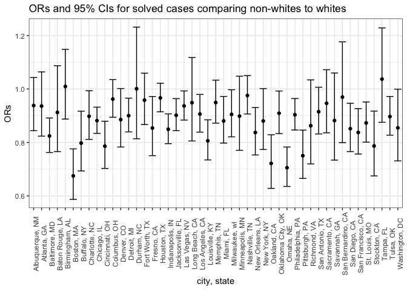
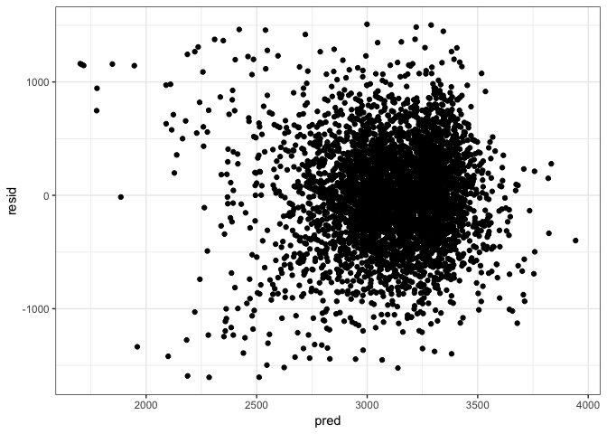

p8105\_hw6\_tj2383
================
Tanvi Jain
11/16/2018

### Problem 1

Importing the homicide dataset from the Washington Post.

``` r
homicide_data = read.csv("./data/homicide-data.csv")
```

In this code chunk I create a `city_state` variable by combining the `city` and `state` variables and a binary variable indicating whether the homicide is solved. I omitted the cities Dallas, TX; Phoenix, AZ; and Kansas City, MO – these don’t report victim race. I also omitted Tulsa, AL – this is a data entry mistake. Next I modifiy `victim_race` to have categories white and non-white, with white as the reference category. Be sure that victim\_age is numeric.

``` r
homicide_data_clean = 
  homicide_data %>% 
  mutate(city_state = paste(city, state, sep = ", ")) %>% 
  select(-city, -state) %>% 
  mutate(case_resolution = as.numeric(disposition == "Closed by arrest")) %>% 
  filter(city_state != "Dallas, TX" & city_state != "Phoenix, AZ" & city_state != "Kansas City, MO" & city_state != "Tulsa, AL") %>% 
  
  mutate(binary_race = case_when(
    victim_race == "Asian" ~ "non-white",
    victim_race == "Black" ~ "non-white",
    victim_race == "Hispanic" ~ "non-white",
    victim_race == "Other" ~ "non-white",
    victim_race == "Unknown" ~ "non-white",
    victim_race == "White" ~ "white"),
    
    victim_race = factor(binary_race, levels = c("white", "non-white")),
    victim_age = as.numeric(as.character(victim_age))
  )
```

    ## Warning in evalq(as.numeric(as.character(victim_age)), <environment>): NAs
    ## introduced by coercion

In this code chunk I use the glm function to fit a logistic regression with `case_resolution` as the outcome and `victim age`, `sex`, and `race` as predictors for Baltimore, MD. I then saved the output of glm as an R object; applied the broom::tidy to this object; and obtained the estimate and confidence interval of the adjusted odds ratio for solving homicides comparing black victims to white victims, keeping all other variables fixed.

``` r
fit_logistic_baltimore = 
  homicide_data_clean %>% 
  filter(city_state == "Baltimore, MD") %>% 
  glm(case_resolution ~ victim_age + victim_race + victim_sex, data = ., family = binomial()) 

fit_logistic_baltimore %>% 
  broom::tidy() %>% 
  janitor::clean_names() %>% 
  mutate(OR = exp(estimate),
         lower_95_limit = exp(estimate - (1.96 * std_error)),
         upper_95_limit = exp(estimate + (1.96 * std_error))) %>%
  filter(term == "victim_racenon-white")
```

    ## # A tibble: 1 x 8
    ##   term  estimate std_error statistic p_value    OR lower_95_limit
    ##   <chr>    <dbl>     <dbl>     <dbl>   <dbl> <dbl>          <dbl>
    ## 1 vict…   -0.820     0.175     -4.69 2.68e-6 0.441          0.313
    ## # ... with 1 more variable: upper_95_limit <dbl>

The odds of having a solved case among those who identify as non-white is 0.44 times the odds of having a solved case among those who identify as white and we are 95% confident that these odds are between 0.31 and 0.62 adjusting for sex and age.

In this code chunk I ran glm for each of the cities in the dataset, and extracted the adjusted odds ratio and 95% CI for solving homicides comparing black victims to white victims. I did this within a “tidy” pipeline, making use of purrr::map, list columns, and unnest.

``` r
nested_glm =
  homicide_data_clean %>% 
  group_by(city_state) %>% 
  nest() %>% 
  mutate(regression_city_state = map(data, ~lm(case_resolution ~ victim_age + victim_sex + victim_race, data = .x)),
         regression_city_state = map(regression_city_state, broom::tidy)) %>% 
  select(-data)

homicides = nested_glm %>% 
  unnest() %>% 
  janitor::clean_names() %>% 
  mutate(OR = exp(estimate),
         lower_95_limit = exp(estimate - (1.96 * std_error)),
         upper_95_limit = exp(estimate + (1.96 * std_error))
  ) %>% 
  filter(term == "victim_racenon-white") %>%
  select(city_state, OR, lower_95_limit, upper_95_limit)
```

This is a dataframe consisting of the estimated ORs and CIs for each city.

| city\_state        |         OR|  lower\_95\_limit|  upper\_95\_limit|
|:-------------------|----------:|-----------------:|-----------------:|
| Albuquerque, NM    |  0.9381364|         0.8439611|         1.0428204|
| Atlanta, GA        |  0.9361747|         0.8236890|         1.0640217|
| Baltimore, MD      |  0.8244697|         0.7623590|         0.8916407|
| Baton Rouge, LA    |  0.9124647|         0.7658194|         1.0871910|
| Birmingham, AL     |  1.0096435|         0.8875775|         1.1484968|
| Boston, MA         |  0.6750011|         0.5871682|         0.7759727|
| Buffalo, NY        |  0.7974480|         0.6934397|         0.9170565|
| Charlotte, NC      |  0.8979433|         0.8115030|         0.9935911|
| Chicago, IL        |  0.8816895|         0.8339958|         0.9321106|
| Cincinnati, OH     |  0.7862386|         0.7028564|         0.8795127|
| Columbus, OH       |  0.9622876|         0.8942863|         1.0354597|
| Denver, CO         |  0.8855921|         0.7829507|         1.0016893|
| Detroit, MI        |  0.9003586|         0.8394328|         0.9657063|
| Durham, NC         |  1.0011652|         0.8138670|         1.2315672|
| Fort Worth, TX     |  0.9583003|         0.8670065|         1.0592071|
| Fresno, CA         |  0.8540912|         0.7505659|         0.9718956|
| Houston, TX        |  0.9667330|         0.9148169|         1.0215953|
| Indianapolis, IN   |  0.8494339|         0.7955435|         0.9069747|
| Jacksonville, FL   |  0.9019509|         0.8440237|         0.9638537|
| Las Vegas, NV      |  0.9366836|         0.8837253|         0.9928155|
| Long Beach, CA     |  0.9488369|         0.8054940|         1.1176886|
| Los Angeles, CA    |  0.9063814|         0.8386239|         0.9796135|
| Louisville, KY     |  0.8062044|         0.7347320|         0.8846294|
| Memphis, TN        |  0.9493614|         0.8722938|         1.0332379|
| Miami, FL          |  0.8806157|         0.7977046|         0.9721444|
| Milwaukee, wI      |  0.9048639|         0.8210219|         0.9972678|
| Minneapolis, MN    |  0.8987154|         0.7707936|         1.0478672|
| Nashville, TN      |  0.9757006|         0.9065794|         1.0500918|
| New Orleans, LA    |  0.8373291|         0.7532570|         0.9307847|
| New York, NY       |  0.8803584|         0.7737717|         1.0016274|
| Oakland, CA        |  0.7216275|         0.6283310|         0.8287769|
| Oklahoma City, OK  |  0.9093793|         0.8332201|         0.9924998|
| Omaha, NE          |  0.7054472|         0.6355823|         0.7829919|
| Philadelphia, PA   |  0.9035855|         0.8466800|         0.9643156|
| Pittsburgh, PA     |  0.7504633|         0.6654925|         0.8462832|
| Richmond, VA       |  0.8626584|         0.7196420|         1.0340969|
| San Antonio, TX    |  0.9150777|         0.8318636|         1.0066159|
| Sacramento, CA     |  0.9467486|         0.8361092|         1.0720285|
| Savannah, GA       |  0.8820030|         0.7340074|         1.0598386|
| San Bernardino, CA |  0.9696966|         0.7992488|         1.1764942|
| San Diego, CA      |  0.8514643|         0.7658733|         0.9466205|
| San Francisco, CA  |  0.8374086|         0.7567119|         0.9267109|
| St. Louis, MO      |  0.8730792|         0.8011558|         0.9514593|
| Stockton, CA       |  0.7867802|         0.6748170|         0.9173200|
| Tampa, FL          |  1.0370698|         0.8754783|         1.2284869|
| Tulsa, OK          |  0.8968168|         0.8273785|         0.9720828|
| Washington, DC     |  0.8547153|         0.7310151|         0.9993476|

In this code chunk I created a plot that shows the estimated ORs and CIs for each city. I organized cities according to estimated OR.

``` r
homicides %>% 
  mutate(city_state = forcats::fct_inorder(city_state)) %>% 
  ggplot(aes(x = city_state, y = OR)) +
  geom_point() +
  geom_errorbar(aes(ymin = lower_95_limit, ymax = upper_95_limit)) +
  labs(
    x = "city, state",
    y = "ORs",
    title = "ORs and 95% CIs for solved cases comparing non-whites to whites"
  ) +
  theme_bw() +
  theme(axis.text.x = element_text(angle = 90)) 
```



According to this scatter plot, majority of the ORs appear to be below 1 with the exception of Birmingham, AL, Durham, NC, and Tampa, FL, indicating that majority of the cities have decreased odds of a case being solved for non-white people compared to white people, except for the three cities with a greater than 1 odds ratio. However, the null value of 1 falls in the 95% CIs for these three cities indicating that their ORs aren't significant. Notably, there are also some wider confidence intervals, indicating less accuracy regarding the estimate's true value.

### Problem 2

In this code chunk I imported the child birthweight data and and cleaned the data for regression analysis (i.e. specified reference levels for categorical variables, converted numeric to factor where appropriate, and checked for missing data).

``` r
birthweight_data = read.csv("./data/birthweight.csv") %>% 
  janitor::clean_names()

missing_values = sum(is.na(birthweight_data))

birthweight_data = 
  birthweight_data %>% 
  mutate(
    babysex = case_when(
      babysex == 1 ~ "male",
      babysex == 2 ~ "female"),
    babysex = fct_relevel(babysex, "male"),
    frace = case_when(
      frace == 1 ~ "white",
      frace == 2 ~ "black",
      frace == 3 ~ "asian",
      frace == 4 ~ "puerto_rican",
      frace == 8 ~ "other",
      frace == 9 ~ "unk"),
    frace == fct_relevel(frace, "white"),
    malform = case_when(
      malform == 0 ~ "absent",
      malform == 1 ~ "present"),
    malform == fct_relevel(malform, "absent"),
    mrace = case_when(
      mrace == 1 ~ "white",
      mrace == 2 ~ "black",
      mrace == 3 ~ "asian",
      mrace == 4 ~ "puerto_rican",
      mrace == 8 ~ "other"),
    mrace == fct_relevel(mrace, "white")
  )
```

This dataset contains no missing values.

In this code chunk I created a linear regression model for birthweight.

``` r
fit_linear_birthweight = 
  birthweight_data %>% 
  lm(bwt ~ momage + babysex + fincome + gaweeks + malform + mrace, data = .)
```

This model is based on my hypothesis for key maternal sociodemographic and biologic indicators that influence infant birthweight. This model is testing the association between mother's age at delivery on baby's birthweight adjusting for family income, baby's sex, gestational age, presence of malformations, and mother's race.

The following is a plot of model residuals against fitted values.

``` r
modelr::add_residuals(birthweight_data, fit_linear_birthweight) 
```

    ##      babysex bhead blength  bwt delwt fincome        frace gaweeks malform
    ## 1     female    34      51 3629   177      35        white    39.9  absent
    ## 2       male    34      48 3062   156      65        black    25.9  absent
    ## 3     female    36      50 3345   148      85        white    39.9  absent
    ## 4       male    34      52 3062   157      55        white    40.0  absent
    ## 5     female    34      52 3374   156       5        white    41.6  absent
    ## 6       male    33      52 3374   129      55        white    40.7  absent
    ## 7     female    33      46 2523   126      96        black    40.3  absent
    ## 8     female    33      49 2778   140       5        white    37.4  absent
    ## 9       male    36      52 3515   146      85        white    40.3  absent
    ## 10      male    33      50 3459   169      75        black    40.7  absent
    ## 11    female    35      51 3317   130      55        white    43.4  absent
    ## 12      male    35      51 3459   146      55        white    39.4  absent
    ## 13    female    35      48 3175   158      75        white    39.7  absent
    ## 14      male    36      53 3629   147      75        white    41.3  absent
    ## 15      male    35      51 3544   129      65        white    39.6  absent
    ## 16    female    33      49 2551   120      75        black    38.1  absent
    ## 17      male    35      56 3232   147      55        white    42.1  absent
    ## 18    female    36      52 3629   154      65        white    40.3  absent
    ## 19    female    35      57 3374   147      45        white    39.6  absent
    ## 20    female    35      53 3345   127      65        black    39.7  absent
    ## 21      male    34      52 3203   134      25        white    41.1  absent
    ## 22    female    35      50 3175   140      85        black    40.6  absent
    ## 23      male    34      49 3175   148      96        black    39.7  absent
    ## 24    female    36      51 2977   135      45        white    41.7  absent
    ## 25    female    36      56 3685   170      95        white    40.3  absent
    ## 26      male    34      63 3175   143      25        white    41.9  absent
    ## 27      male    36      52 3629   152      45        white    39.6  absent
    ## 28    female    33      49 2948   129      25        white    41.0  absent
    ## 29      male    35      51 3345   145      75        white    41.3  absent
    ## 30    female    35      52 3289   135      55        white    40.6  absent
    ## 31    female    34      49 3118   161      45        black    38.9  absent
    ## 32    female    34      52 3629   112      25        white    38.0  absent
    ## 33      male    36      54 3402   161      95        white    40.1  absent
    ## 34    female    35      51 3827   130      45        white    41.3  absent
    ## 35      male    38      53 3799   167      75        white    39.9  absent
    ## 36    female    33      54 3062   134      65        white    40.4  absent
    ## 37      male    35      55 3856   171      85        white    41.1  absent
    ## 38    female    34      51 3005   149      85        white    39.3  absent
    ## 39      male    35      53 3175   130      45        white    40.4  absent
    ## 40    female    34      54 3345   130      95        white    42.1  absent
    ## 41    female    35      53 3600   141      35        white    42.3  absent
    ## 42    female    34      51 3232   155      55        white    41.6  absent
    ## 43      male    35      52 3232   121      75        asian    42.3  absent
    ## 44    female    34      51 3175   142      96        white    42.3  absent
    ## 45    female    33      49 3147   140      45        white    40.6  absent
    ## 46    female    34      49 3317   142      35        white    40.4  absent
    ## 47    female    34      49 2948   135      75        white    42.7  absent
    ## 48    female    34      49 3033   128      25        white    41.1  absent
    ## 49      male    33      51 3345   140      85        white    38.6  absent
    ## 50      male    34      53 3232   150      35        white    39.6  absent
    ## 51    female    36      51 3317   136      65        white    42.6  absent
    ## 52      male    35      51 3147   165      65        white    40.1  absent
    ## 53      male    34      52 3118   130      75        white    41.0  absent
    ## 54      male    33      50 3175   168      25        white    40.0  absent
    ## 55    female    32      48 2551   170      35        white    39.9  absent
    ## 56    female    33      51 3289   155      65        white    41.6  absent
    ## 57    female    34      54 3402   154      75        white    40.7  absent
    ## 58    female    35      52 3487   121      45        white    39.9  absent
    ## 59    female    34      51 3203   132      85        white    43.7  absent
    ## 60      male    37      54 3515   143      15        white    41.7  absent
    ## 61      male    34      51 2920   129      45        white    39.4  absent
    ## 62    female    30      42 2013   150      65        black    37.7  absent
    ## 63      male    34      52 3033   172      85        white    41.1  absent
    ## 64      male    31      46 2381   139      75        white    34.7  absent
    ## 65    female    33      52 3118   155      45        white    37.9  absent
    ## 66    female    34      53 3600   148      45        white    40.9  absent
    ## 67    female    33      54 3402   150      45        white    41.4  absent
    ## 68      male    34      51 3459   123      45        white    40.0  absent
    ## 69      male    36      53 3203   140      55        black    39.7  absent
    ## 70      male    35      50 3289   155      85        white    39.0  absent
    ## 71      male    34      53 3544   128      35        white    40.4  absent
    ## 72    female    36      52 4224   178      35        white    41.6  absent
    ## 73      male    34      47 3090   147      85        white    42.1  absent
    ## 74      male    35      56 3912   150      65        white    40.6  absent
    ## 75      male    34      53 3459   150      35        white    41.7  absent
    ## 76      male    34      50 3374   132      55        white    41.4  absent
    ## 77    female    35      52 2778   165      25        black    30.4  absent
    ## 78      male    33      48 2551   157      35        white    37.9  absent
    ## 79    female    34      51 3232   123      96        white    38.4  absent
    ## 80      male    35      52 3544   137      65        white    42.7  absent
    ## 81    female    33      49 2920   135      45        white    38.6  absent
    ## 82    female    34      51 3430   172      45        white    40.9  absent
    ## 83    female    35      53 3799   189      96        white    44.6  absent
    ## 84      male    32      47 2438   137      25        black    39.0  absent
    ## 85      male    34      51 2977   149      15        asian    40.3  absent
    ## 86    female    34      50 3005   137      35        black    35.9  absent
    ## 87    female    34      46 2977   145      75        black    47.7  absent
    ## 88      male    35      50 3118   137      15        white    40.7  absent
    ## 89    female    35      51 3062   115      96        asian    41.4  absent
    ## 90      male    34      50 3062   140      95        white    41.4  absent
    ## 91    female    36      56 3969   160      96        black    42.6  absent
    ## 92      male    35      51 3090   190      35        white    39.3  absent
    ## 93    female    33      54 3175   173      75        white    35.1  absent
    ## 94    female    33      48 2438   138      96        white    42.6  absent
    ## 95    female    33      45 2211   129      65        white    40.3  absent
    ## 96      male    35      55 3572   182      75        white    40.1  absent
    ## 97      male    35      52 3487   138      55        white    40.0  absent
    ## 98      male    34      52 3118   124      65        white    38.7  absent
    ## 99    female    32      49 2778   140      55        white    38.3  absent
    ## 100   female    35      51 3515   160      25        white    40.0  absent
    ## 101     male    35      56 3487   142      45        white    40.4  absent
    ## 102   female    31      48 2722   121      65        white    39.4  absent
    ## 103   female    36      53 3799   135      55        white    40.3  absent
    ## 104   female    32      49 3374   121      85        white    37.3  absent
    ## 105     male    33      52 2835   140      35        white    40.7  absent
    ## 106   female    35      55 3487   170      55        white    43.4  absent
    ## 107   female    33      48 3685   135      55        white    39.7  absent
    ## 108     male    37      58 4791   144      45        white    40.7  absent
    ## 109     male    32      47 2693   149      65        white    35.0  absent
    ## 110     male    33      49 2722   143      55        white    39.6  absent
    ## 111   female    34      50 3459   145      35        white    41.1  absent
    ## 112   female    36      50 3515   138       5        white    40.3  absent
    ## 113     male    36      49 2863   138      96        black    41.6  absent
    ## 114     male    35      53 3629   141      95        white    42.1  absent
    ## 115     male    32      48 2637   120      65        white    35.7  absent
    ## 116     male    33      50 3118   145      55        white    39.3  absent
    ## 117   female    32      48 2665   145      15        white    38.3  absent
    ## 118     male    32      46 2211   143      65        black    36.4  absent
    ## 119   female    34      53 3317   143      35        white    40.3  absent
    ## 120   female    33      50 2580   137      55        white    39.6  absent
    ## 121   female    35      53 3912   145      55        white    40.1  absent
    ## 122     male    35      52 3884   131      45        white    39.7  absent
    ## 123     male    31      46 2126   118      75        white    36.3  absent
    ## 124   female    34      52 3175   130      25        white    39.9 present
    ## 125   female    33      48 2778   175      35        black    30.6  absent
    ## 126     male    34      52 3005   125       5        white    36.9  absent
    ## 127   female    34      46 2750   127      75        white    37.0  absent
    ## 128   female    33      52 2892   126      25        white    42.0  absent
    ## 129     male    35      57 3147   125      96        white    41.6  absent
    ## 130   female    35      53 3657   146      55        white    40.1  absent
    ## 131     male    34      49 3090   152      96        white    38.7  absent
    ## 132     male    36      55 4082   177      65        white    40.3  absent
    ## 133   female    34      50 3090   145      85        white    38.4  absent
    ## 134   female    32      48 2523   140      45        white    40.9  absent
    ## 135   female    33      47 2977   137      65        white    41.6  absent
    ## 136     male    35      51 3742   150      85        white    40.4  absent
    ## 137   female    33      50 3090   130      25        white    42.0  absent
    ## 138   female    34      55 3374   136      75        white    38.3  absent
    ## 139     male    33      47 2750   149      95        white    36.9  absent
    ## 140     male    35      46 3203   126      55        white    39.0  absent
    ## 141   female    33      52 3600   152      96        white    40.6  absent
    ## 142     male    35      49 3090   146      96        white    40.0  absent
    ## 143     male    35      49 4082   156      35        white    38.7  absent
    ## 144     male    33      48 2098   130      35        black    35.6  absent
    ## 145   female    30      45 2325   118      15        white    36.4  absent
    ## 146   female    35      53 3317   135      96        white    39.1  absent
    ## 147     male    34      51 3515   149      75        white    40.6  absent
    ## 148   female    35      55 3685   143      96        white    40.4  absent
    ## 149     male    35      48 3969   154      45        white    48.3  absent
    ## 150     male    34      52 2977   143      75        white    38.0  absent
    ## 151     male    35      49 3430   133      55        white    40.9  absent
    ## 152   female    34      53 3317   142      45        white    37.0  absent
    ## 153     male    37      54 3515   176      85        white    40.4  absent
    ## 154     male    34      56 3317   134      35        white    39.9  absent
    ## 155     male    35      51 3402   195      75        white    42.0  absent
    ## 156     male    33      52 3856   141      45        white    41.7  absent
    ## 157     male    34      51 3203   118      35        white    40.0  absent
    ## 158   female    33      48 2977   128      65        white    46.0  absent
    ## 159     male    24      37 1049   143      15        black    27.1  absent
    ## 160   female    33      53 3544   121      25        white    39.1  absent
    ## 161     male    37      53 3685   156      75        white    41.4  absent
    ## 162   female    37      57 3799   142      65        white    41.7  absent
    ## 163   female    36      48 2778   133      75        white    35.3  absent
    ## 164   female    34      52 3742   159      75        white    43.1  absent
    ## 165     male    35      52 3912   144      35        white    41.1  absent
    ## 166   female    33      49 3232   132      75        white    38.0  absent
    ## 167   female    35      49 3685   130      55        white    39.9  absent
    ## 168   female    34      53 3487   120      15        white    40.1  absent
    ## 169     male    32      48 2608   141      75        white    37.1  absent
    ## 170   female    34      50 2665   132      75        white    40.7  absent
    ## 171   female    34      48 3515   141      75        white    40.7  absent
    ## 172     male    33      48 2892   145      35        black    39.0  absent
    ## 173     male    35      50 3175   140      15        white    39.6  absent
    ## 174   female    35      52 3742   142      55        white    40.7  absent
    ## 175   female    35      50 3515   132      45        white    42.0  absent
    ## 176   female    35      50 3033   148      45        white    40.4  absent
    ## 177   female    32      48 2948   151      75        white    40.1  absent
    ## 178   female    34      50 3147   131      55        black    41.3  absent
    ## 179   female    32      49 3005   145      45        black    39.1  absent
    ## 180     male    33      48 3005   130      95        white    39.3  absent
    ## 181   female    34      51 3232   116      35        white    39.6  absent
    ## 182     male    36      51 3629    96      35        white    42.0  absent
    ## 183     male    35      51 3685   138      35        white    41.6  absent
    ## 184     male    34      51 3430   166      25        white    39.1  absent
    ## 185   female    34      48 2948   139      25        white    38.0  absent
    ## 186     male    35      55 4252   130      55        white    41.7  absent
    ## 187     male    34      51 3090   144      15        white    38.9  absent
    ## 188   female    33      49 3203   115      96        white    40.0  absent
    ## 189   female    34      51 3742   124      55        white    40.3  absent
    ## 190     male    34      51 3062   131      75        white    42.3  absent
    ## 191   female    35      51 3742   135      55        white    41.6  absent
    ## 192   female    32      48 2608   138      85        black    43.0  absent
    ## 193     male    33      48 2892   139      75        white    38.7  absent
    ## 194   female    31      46 2325   157      75        white    37.1  absent
    ## 195   female    34      53 3459   147      65        white    41.9  absent
    ## 196   female    32      48 2693   157      35        black    37.0  absent
    ## 197   female    33      51 3175   115      35        white    39.0  absent
    ## 198     male    35      51 3714   169      85        white    41.4  absent
    ## 199     male    35      51 3544   142      55        white    39.7  absent
    ## 200   female    33      50 3147   143      85        black    40.9  absent
    ## 201   female    32      51 3005   120      35        white    40.3  absent
    ## 202     male    34      54 3770   136      35        white    39.3  absent
    ## 203   female    36      53 3629   145      95        white    40.6  absent
    ## 204   female    34      50 3430   145      95        white    40.1  absent
    ## 205     male    36      48 3345   140      55        white    41.1  absent
    ## 206   female    33      51 3090   174      35        white    39.3  absent
    ## 207     male    35      54 3969   137      75        white    41.3  absent
    ## 208     male    34      51 3033   122      15        white    40.1  absent
    ## 209   female    34      51 3317   162      15        white    40.3  absent
    ## 210   female    33      48 3005   124      45        white    38.9  absent
    ## 211     male    32      49 2523   132      75        white    38.3  absent
    ## 212     male    36      50 3884   117      75        white    41.4  absent
    ## 213   female    33      57 3827   145      25        black    38.7  absent
    ## 214   female    34      50 3317   161      55        white    41.0  absent
    ## 215   female    34      51 3515   139      55        white    42.6  absent
    ## 216     male    33      47 2977   158      35        white    40.1  absent
    ## 217   female    33      48 2438   125      96        white    38.1  absent
    ## 218   female    33      50 3714   144      25        black    40.6  absent
    ## 219   female    34      49 2948   127      35        white    35.6  absent
    ## 220   female    34      48 3005   119      35        black    41.3  absent
    ## 221     male    33      49 3118   139      15        white    39.3  absent
    ## 222     male    34      54 3544   154      45        white    40.4  absent
    ## 223     male    34      50 3203   175      45        white    40.1  absent
    ## 224     male    34      49 2722   137      55        white    40.6  absent
    ## 225   female    29      52 2892   127      45        black    40.0  absent
    ## 226     male    35      51 3544   147      96        white    40.3  absent
    ## 227     male    35      52 3572   201      65        white    41.1  absent
    ## 228     male    35      50 3515   146      75        white    40.1  absent
    ## 229     male    35      45 3402   139      45        white    39.9  absent
    ## 230   female    33      53 3572   157      45        white    40.4  absent
    ## 231     male    34      47 2211   149      25        white    34.3  absent
    ## 232     male    35      50 3175   156      75        white    39.4  absent
    ## 233   female    35      53 3912   156      35        white    42.4  absent
    ## 234   female    35      54 3827   169      25        white    42.1  absent
    ## 235   female    33      50 2948   146      45        white    39.0  absent
    ## 236     male    35      53 3459   112      55        white    39.0  absent
    ## 237   female    33      49 2778   133      75        asian    39.7  absent
    ## 238     male    35      52 3289   144      75        white    40.4  absent
    ## 239     male    36      52 3374   157      55        white    42.1  absent
    ## 240   female    35      54 3884   162      35        white    40.4  absent
    ## 241     male    34      53 3487   137      55        white    39.6  absent
    ## 242     male    35      48 2948   127      85        white    39.9  absent
    ## 243     male    35      54 3770   129      65        white    42.1  absent
    ## 244     male    36      49 3005   151      65        white    40.3  absent
    ## 245     male    36      54 3997   132      65        white    42.0  absent
    ## 246   female    36      52 3742   187      35        white    41.9  absent
    ## 247     male    34      48 2835   104      55        white    42.1  absent
    ## 248     male    35      55 3685   155      55        white    39.4  absent
    ## 249     male    34      49 2665   137      45        white    39.7  absent
    ## 250     male    34      51 2920   161      35        white    41.0  absent
    ## 251   female    33      50 3090   133      55        white    40.3  absent
    ## 252     male    36      54 4054   168      15        white    40.9  absent
    ## 253   female    32      49 2948   134      25        white    39.3  absent
    ## 254     male    34      52 3487   130      25        white    40.1  absent
    ## 255   female    32      48 2353   140      35        white    38.0  absent
    ## 256     male    29      42 1814   140      75        white    33.6  absent
    ## 257   female    35      52 3544   143      15        white    40.4  absent
    ## 258     male    34      50 3118   136      45        white    38.9  absent
    ## 259     male    33      52 3033   169      75        black    39.4  absent
    ## 260     male    36      51 3969   156      45        black    39.6  absent
    ## 261   female    33      47 2608   117      96        black    33.4  absent
    ## 262     male    35      53 3827   146      35        white    42.6  absent
    ## 263   female    35      50 3374   131      45        asian    42.3  absent
    ## 264     male    31      47 2580   142      35        white    36.9  absent
    ## 265   female    34      48 3260   138      75        white    38.4  absent
    ## 266   female    36      54 4252   131      75        white    42.6  absent
    ## 267     male    34      52 3374   139      85        white    43.7  absent
    ## 268     male    33      52 2892   157      35        white    39.1  absent
    ## 269   female    35      51 3770   156      75        white    42.4  absent
    ## 270     male    35      50 3090   158      35        asian    41.0  absent
    ## 271   female    34      53 3118   156      75        white    39.3  absent
    ## 272     male    34      50 3062   143      35        white    38.4  absent
    ## 273     male    37      54 3770   215      35        white    46.4  absent
    ## 274     male    35      50 3175   149      15        white    42.0  absent
    ## 275   female    34      48 3544   158      96        white    44.7  absent
    ## 276   female    33      47 3289   201      85        white    41.1  absent
    ## 277     male    35      53 3544   123      65        white    40.6  absent
    ## 278     male    36      52 3345   162      96        white    42.6  absent
    ## 279     male    33      49 3232   168      96        black    38.0  absent
    ## 280     male    36      52 3487   128      45        white    38.9  absent
    ## 281   female    32      44 2183   133      65        white    35.3  absent
    ## 282   female    36      52 3289   155      96        black    41.7  absent
    ## 283     male    35      51 3203   127      35        white    44.1  absent
    ## 284     male    35      52 3997   128      65        white    42.6  absent
    ## 285   female    33      49 3147   128      65        black    42.0  absent
    ## 286     male    32      49 2495   121      65        black    39.9  absent
    ## 287     male    35      51 3175   145      45        white    41.0  absent
    ## 288   female    34      50 3487   159      85        white    41.4  absent
    ## 289   female    34      54 3714   138      15        white    35.9  absent
    ## 290     male    32      49 2580   136      55        white    39.9  absent
    ## 291     male    35      51 3402   120      85        white    40.1  absent
    ## 292     male    34      53 3515   124      45        asian    41.3  absent
    ## 293     male    35      56 4111   184      75        white    41.0  absent
    ## 294     male    34      54 3203   144      35        white    40.6  absent
    ## 295     male    34      48 3005   144      35        white    38.7  absent
    ## 296     male    33      48 3147   127       5        white    45.3  absent
    ## 297   female    35      51 3402   128      65        white    40.1  absent
    ## 298     male    36      51 3572   140      15        white    38.7  absent
    ## 299   female    35      54 3260   163      75        white    39.7  absent
    ## 300   female    33      48 3147   132      45        white    38.3  absent
    ## 301   female    33      50 3317   129      55        white    43.1  absent
    ## 302   female    34      48 3090   148      45        white    39.1  absent
    ## 303   female    34      52 3799   137      75        white    40.7  absent
    ## 304     male    32      50 2637   135       5        white    46.0  absent
    ## 305   female    35      52 3345   123      65        white    39.3  absent
    ## 306   female    33      53 3430   168      75        black    39.4  absent
    ## 307     male    34      49 3374   120      45        white    41.9  absent
    ## 308   female    31      49 2665   158      85        black    36.7  absent
    ## 309     male    33      50 3005   140      96        black    39.6  absent
    ## 310     male    34      55 3969   149      15        white    41.0  absent
    ## 311     male    33      47 2750   137      85        white    39.9  absent
    ## 312   female    34      53 3742   127      85        white    38.9  absent
    ## 313   female    34      51 3572   131      95        white    41.7  absent
    ## 314     male    35      53 3629   161      75        white    42.4  absent
    ## 315     male    35      53 3657   135      35        white    39.0  absent
    ## 316   female    33      49 2948   123      85        white    38.3  absent
    ## 317   female    34      48 2948   143      45        white    39.1  absent
    ## 318   female    34      50 3572   122      75        white    41.6  absent
    ## 319   female    34      49 2750   147      35        black    39.7  absent
    ## 320     male    35      53 4082   145      85        white    41.0  absent
    ## 321   female    31      47 2637   128      85        white    36.6  absent
    ## 322   female    32      48 2920   163      65        white    40.7  absent
    ## 323   female    33      56 3714   163      65        white    41.3  absent
    ## 324     male    35      52 3487   138      75        white    48.4  absent
    ## 325   female    35      54 3827   153      25        white    41.7  absent
    ## 326     male    34      50 3402   165      85        black    39.0  absent
    ## 327     male    34      51 3685   150      85        white    37.4  absent
    ## 328     male    34      51 3175   148      25        white    43.4  absent
    ## 329     male    34      52 3317   145      15        black    43.0  absent
    ## 330     male    33      50 2977   206      95        black    37.7  absent
    ## 331     male    33      50 2410   137      75        black    40.3  absent
    ## 332   female    34      51 3629   130      65        white    39.9  absent
    ## 333   female    34      51 3912   145      95        white    39.4  absent
    ## 334   female    34      49 2637   115       5        white    39.9  absent
    ## 335     male    34      49 3203   128      45        white    40.0  absent
    ## 336     male    35      54 3572   155      55        white    40.4  absent
    ## 337     male    34      48 2863   148      25        white    42.1  absent
    ## 338     male    33      51 3260   144      55        white    39.4  absent
    ## 339     male    33      51 3175   168      45        white    39.0  absent
    ## 340     male    31      46 2070   148      75        white    33.6  absent
    ## 341     male    35      49 3685   140      75        white    38.3  absent
    ## 342     male    34      52 3232   134      85        white    40.7  absent
    ## 343   female    34      51 3175   125      95        white    39.9  absent
    ## 344   female    33      48 2778   129      65        white    41.1  absent
    ## 345   female    33      49 3544   153      95        white    37.9  absent
    ## 346   female    33      51 3714   144      25        black    42.7  absent
    ## 347   female    34      48 2948   135      45        white    39.1  absent
    ## 348   female    35      49 3260   146       5        white    40.3  absent
    ## 349   female    35      51 3629   142      95        white    43.0  absent
    ## 350     male    35      50 3203   169      45        white    40.0  absent
    ## 351   female    34      52 3459   143      35        white    40.1  absent
    ## 352   female    34      51 3827   183       5        white    41.4  absent
    ## 353     male    34      52 3232   148      15        white    40.4  absent
    ## 354     male    35      51 3260   135      45        white    40.7  absent
    ## 355   female    35      51 3203   179      65        white    39.3  absent
    ## 356   female    29      42 1899   131      55        white    31.3  absent
    ## 357     male    34      52 3317   107      55        white    40.7  absent
    ## 358   female    33      50 3515   126      65        white    41.4  absent
    ## 359   female    33      51 3260   142      85        white    38.9  absent
    ## 360     male    35      51 3629   131      15        white    37.6  absent
    ## 361   female    34      52 3033   149      45        white    37.6  absent
    ## 362   female    34      49 3289   146      35        white    33.1  absent
    ## 363   female    33      51 3402   142      75        white    38.4  absent
    ## 364     male    36      52 3856   140      65        white    40.3  absent
    ## 365     male    35      52 4111   184      45        white    49.1 present
    ## 366     male    33      50 3090   176      65        white    40.0  absent
    ## 367   female    32      46 2381   121      75        white    34.1  absent
    ## 368   female    31      49 2608   146      45        white    38.6  absent
    ## 369   female    32      48 2665   129      95        white    38.1  absent
    ## 370     male    33      47 2665   100      35        white    39.4  absent
    ## 371     male    35      51 3317   153      95        white    40.0  absent
    ## 372   female    34      49 3203   152      96        white    39.3  absent
    ## 373   female    34      51 3175   140      75        white    39.1  absent
    ## 374     male    34      51 2835   136      75        white    41.0  absent
    ## 375     male    35      50 3289   167      35        white    39.7  absent
    ## 376   female    34      48 3232   136      95        white    41.7  absent
    ## 377   female    32      48 2863   139      55        white    41.0  absent
    ## 378     male    34      51 3969   140      85        white    41.9  absent
    ## 379     male    35      54 3515   134      35        white    39.9  absent
    ## 380     male    33      47 2580   146      85        white    39.4  absent
    ## 381   female    33      52 3033   154      55        white    41.1  absent
    ## 382   female    32      49 3147   129      45        white    37.7  absent
    ## 383   female    33      51 2722   132      65        white    41.6  absent
    ## 384     male    34      49 2920   118      65        asian    39.0  absent
    ## 385     male    34      52 3090   132      35        white    40.4  absent
    ## 386     male    34      50 3033   154      55        white    40.6  absent
    ## 387   female    35      51 3289   134      45        white    41.9  absent
    ## 388   female    35      52 3289   156      85        black    40.7  absent
    ## 389     male    34      54 3459   160      45        white    45.7  absent
    ## 390   female    37      53 3572   163      75        white    42.1  absent
    ## 391   female    33      51 3033   122      55        white    41.6  absent
    ## 392   female    34      48 2637   180      25        white    45.0  absent
    ## 393   female    32      48 2863   118      96        white    38.3  absent
    ## 394   female    36      46 2608   120      85        white    41.1  absent
    ## 395     male    36      51 3600   135      25        white    40.1  absent
    ## 396   female    34      49 3090   134      35        white    40.3  absent
    ## 397   female    35      47 3175   177      45        white    42.4  absent
    ## 398   female    33      51 3232   143      55        white    39.6  absent
    ## 399   female    34      51 3232   140      65        white    43.7  absent
    ## 400   female    30      46 2126   116      15        white    39.7  absent
    ## 401     male    35      51 3345   136      15        white    37.3  absent
    ## 402     male    33      49 3005   146      25        black    40.0  absent
    ## 403   female    33      51 3062   140      55        white    41.6  absent
    ## 404   female    36      51 3799   169      45        white    40.0  absent
    ## 405   female    35      53 3374   155      25        white    42.4  absent
    ## 406     male    34      50 2920   149      55        white    40.1  absent
    ## 407   female    35      53 3714   146      45        white    41.3  absent
    ## 408   female    34      49 3118   152      35        white    41.7  absent
    ## 409     male    35      52 3912   169      96        white    39.9  absent
    ## 410     male    34      50 3090   146      75        white    39.6  absent
    ## 411   female    34      50 2920   125      15        white    40.1  absent
    ## 412     male    33      50 2977   152       5        white    35.1  absent
    ## 413   female    34      53 3402   151      55        white    40.7  absent
    ## 414     male    35      52 3487   143      96        white    41.0  absent
    ## 415     male    34      51 3600   141      75        white    40.0  absent
    ## 416     male    35      52 3402   120      35        white    40.3  absent
    ## 417   female    33      52 3544   177      75        white    40.7  absent
    ## 418     male    34      51 2722   135      25        white    37.7  absent
    ## 419     male    34      49 2750   151      25        white    41.4  absent
    ## 420     male    34      52 3005   141      85        white    39.4  absent
    ## 421     male    32      47 2466   162      96        white    36.6  absent
    ## 422     male    34      49 3005   158      75        white    36.4  absent
    ## 423     male    34      49 3005   133      35        white    40.3  absent
    ## 424     male    34      53 3175   140      65        white    41.0  absent
    ## 425   female    35      52 3515   134      55        white    40.0  absent
    ## 426   female    35      51 3515   141      35        white    45.7  absent
    ## 427   female    32      49 2523   135      95        white    37.9  absent
    ## 428   female    34      51 3572   120      45        asian    41.1  absent
    ## 429   female    36      56 4281   185      45        white    42.6  absent
    ## 430     male    35      52 3714   129      85        white    39.3  absent
    ## 431     male    35      50 3260   142      55        white    40.1  absent
    ## 432   female    34      49 3487   201      85        white    41.0  absent
    ## 433   female    32      45 2296   150      65        black    35.0  absent
    ## 434     male    34      51 3232   144      85        white    40.4  absent
    ## 435   female    34      54 3402   133      96        white    40.4  absent
    ## 436     male    33      49 3118   152      35        white    36.3  absent
    ## 437   female    34      53 4252   154      45        white    41.6  absent
    ## 438   female    35      52 3232   135      65        white    41.1  absent
    ## 439     male    35      53 3742   142      45        white    41.4  absent
    ## 440   female    32      51 3402   144      25        white    40.6  absent
    ## 441     male    35      52 3289   143      25        white    40.4  absent
    ## 442     male    36      51 3997   146      35        white    38.6  absent
    ## 443     male    33      47 2325   126      75        white    39.3  absent
    ## 444     male    34      54 3941   129      85        white    36.6  absent
    ## 445   female    35      48 3289   153      35        black    40.0  absent
    ## 446   female    34      47 2807   150      15        white    35.9  absent
    ## 447     male    33      52 3459   189      55        white    42.4  absent
    ## 448     male    34      48 3118   143      35        white    38.1  absent
    ## 449   female    33      52 3062   122      75        white    39.7  absent
    ## 450   female    32      49 2778   178      65        white    38.9  absent
    ## 451     male    33      49 3203   170      35        white    41.3  absent
    ## 452     male    35      51 2835   141       5        white    40.3  absent
    ## 453     male    36      52 3856   143      25        white    36.9  absent
    ## 454   female    34      53 3260   121      55        white    40.7  absent
    ## 455     male    35      57 3742   175      35        white    39.7  absent
    ## 456     male    34      52 3742   143      65        white    40.3  absent
    ## 457     male    33      49 2835   129      55        white    38.7  absent
    ## 458   female    35      55 3884   125      65        white    40.7  absent
    ## 459   female    32      51 3402   204      65        black    38.9  absent
    ## 460   female    31      48 2041   116      75        white    40.1  absent
    ## 461   female    33      49 3062   135      55        white    39.0  absent
    ## 462     male    34      48 3203   145      15        white    38.6  absent
    ## 463     male    33      50 3260   161      25        white    39.0  absent
    ## 464     male    35      51 3317   151      35        white    36.1  absent
    ## 465   female    31      52 2665   121      45        white    39.1  absent
    ## 466     male    33      52 3062   137      55        white    40.4  absent
    ## 467     male    33      49 3062   138      45        white    39.1  absent
    ## 468   female    33      45 2438   149      65        white    42.3  absent
    ## 469     male    33      48 2722   130      35        white    40.7  absent
    ## 470     male    33      50 3090   114      75        white    38.7  absent
    ## 471     male    36      51 3884   137      45        white    41.4  absent
    ## 472     male    34      50 3090   159      65        white    41.3  absent
    ## 473     male    34      53 3374   145      55        white    38.9  absent
    ## 474     male    34      49 2977   156      35        white    39.6  absent
    ## 475     male    33      53 3232   166      35        white    35.1  absent
    ## 476     male    35      53 4054   118      35        white    41.3  absent
    ## 477   female    34      49 3147   146      85        white    40.9  absent
    ## 478   female    35      47 3629   164      96        white    41.1  absent
    ## 479     male    35      54 3827   147      75        white    41.7  absent
    ## 480     male    34      51 3515   149      65        white    39.4  absent
    ## 481     male    34      50 3260   140      75        white    40.9  absent
    ## 482     male    34      52 3289   159      35        white    38.1  absent
    ## 483     male    33      47 2495   141      25        white    36.9  absent
    ## 484     male    32      48 2665   122      35        white    38.7  absent
    ## 485   female    32      49 2637   145      45        white    39.4  absent
    ## 486     male    37      56 3912   114       5        white    40.9  absent
    ## 487   female    34      49 3033   164      96        white    41.6  absent
    ## 488     male    36      53 4026   177      55 puerto_rican    40.6  absent
    ## 489     male    37      54 3969   145      85        white    42.9  absent
    ## 490   female    35      51 3714   167      25        white    39.7  absent
    ## 491   female    34      53 3203   136      96        white    40.1  absent
    ## 492   female    31      46 2381   112      65        black    36.9  absent
    ## 493     male    37      53 3912   164      55        white    40.7  absent
    ## 494     male    34      53 3487   160      85        white    41.1  absent
    ## 495     male    36      52 3232   143      45        white    41.0  absent
    ## 496     male    35      52 3430   135      25        white    40.3  absent
    ## 497   female    33      50 2835   145      25        white    40.9  absent
    ## 498     male    35      20 3459   152      25        white    38.7  absent
    ## 499   female    35      52 2778   153      35        white    41.4  absent
    ## 500   female    35      51 3345   133      65        white    40.1  absent
    ## 501   female    34      49 3430   162      65        white    40.0  absent
    ## 502   female    33      50 3459   138      65        white    38.9  absent
    ## 503   female    35      52 3884   156      45        white    41.9  absent
    ## 504     male    35      55 3572   150      95        white    40.7  absent
    ## 505     male    31      44 2183   112      75        white    36.7  absent
    ## 506   female    32      50 2948   124      65        white    40.7  absent
    ## 507     male    36      55 3657   124      55 puerto_rican    40.6  absent
    ## 508   female    35      53 3459   135      55        white    42.3  absent
    ## 509   female    34      46 3062   178       5        white    39.1  absent
    ## 510   female    35      51 3629   134      65        white    40.0  absent
    ## 511   female    34      51 2778   180      95        white    40.3  absent
    ## 512     male    34      51 3317   136      45        white    36.9  absent
    ## 513     male    35      51 3118   135      95        white    39.1  absent
    ## 514     male    34      53 3572   160      65        black    40.6  absent
    ## 515   female    31      45 2466   147      85        white    37.3  absent
    ## 516     male    35      50 3232   136      95        white    41.6  absent
    ## 517     male    34      53 3430   149      55        white    41.4  absent
    ## 518   female    35      52 3685   137      95        white    42.0  absent
    ## 519     male    36      51 3685   126      45        white    40.0  absent
    ## 520   female    32      47 2410   118      85        white    37.1  absent
    ## 521     male    36      54 4167   129      85        white    39.7  absent
    ## 522     male    38      54 4451   155      96        white    43.3  absent
    ## 523     male    36      51 3260   120      95        black    39.3  absent
    ## 524   female    35      53 3685   142      25        white    41.1  absent
    ## 525     male    35      55 3572   141      45        white    41.3  absent
    ## 526     male    35      53 3260   168      75        white    41.6  absent
    ## 527   female    33      52 3629   156      35        white    41.7  absent
    ## 528   female    34      49 2778   149       5        white    40.4  absent
    ## 529   female    35      50 2835   133       5        white    42.6  absent
    ## 530   female    32      50 2920   132      25 puerto_rican    36.1  absent
    ## 531     male    33      50 3430   164      75        black    38.4  absent
    ## 532     male    32      48 2750   102      35        white    38.0  absent
    ## 533   female    33      51 3147   122      15        white    38.6  absent
    ## 534   female    30      46 2211   137      65        white    39.9  absent
    ## 535     male    32      45 2410   119      55        white    37.7  absent
    ## 536     male    35      49 3090   123      55        white    37.0  absent
    ## 537   female    34      52 3941   134      65        white    36.9  absent
    ## 538   female    33      52 3459   123      96        white    36.4  absent
    ## 539   female    36      50 3317   173      85        white    38.1  absent
    ## 540   female    32      46 2466   172      96        white    36.3  absent
    ## 541   female    32      47 2835   146      85        white    37.0  absent
    ## 542     male    34      49 3203   155      65        white    36.0  absent
    ## 543     male    34      50 3203   146      25        white    35.6  absent
    ## 544   female    34      47 3345   124      96        white    37.1  absent
    ## 545   female    33      48 3374   141      96        white    36.9  absent
    ## 546   female    33      52 3629   136      75        white    36.6  absent
    ## 547     male    33      50 3090   148      96        white    37.0  absent
    ## 548   female    35      54 3912   135      65        white    38.9  absent
    ## 549   female    34      51 3572   167      55        white    41.3  absent
    ## 550     male    33      49 3572   127      95        white    38.7  absent
    ## 551     male    35      52 3685   153      65        white    40.4  absent
    ## 552   female    32      50 2892   165      85        white    39.3  absent
    ## 553   female    33      48 3033   133      45        white    39.9  absent
    ## 554   female    34      52 3714   192      85        white    42.3  absent
    ## 555     male    36      53 3827   139      45        white    39.3  absent
    ## 556     male    35      51 3685   145      35        white    42.1  absent
    ## 557     male    38      57 4026   186      45        white    41.9  absent
    ## 558     male    33      51 3685   123      65        white    34.3  absent
    ## 559     male    33      50 2948   143      35        white    40.9  absent
    ## 560   female    32      49 3232   154      35        white    36.9  absent
    ## 561     male    33      49 2892   130      96        white    39.3  absent
    ## 562     male    35      53 3289   143      45        black    34.6  absent
    ## 563     male    34      50 3515   150      65        white    40.7  absent
    ## 564     male    34      50 3317   126      15        white    39.1  absent
    ## 565   female    33      48 2948   130      45        white    39.0  absent
    ## 566   female    33      49 2863   140      45        white    40.6  absent
    ## 567     male    32      51 3289   147      65        white    42.9  absent
    ## 568   female    38      51 4196   122      35        white    41.6  absent
    ## 569     male    35      51 3969   196      55        white    41.4  absent
    ## 570   female    31      44 2211   147      55        black    41.6  absent
    ## 571     male    35      56 3600   142      85        white    40.6  absent
    ## 572   female    33      51 2977   141      35        white    41.9  absent
    ## 573   female    34      52 3118   148      96        white    39.6  absent
    ## 574     male    33      53 3203   142      25        white    40.7  absent
    ## 575     male    35      50 3629   155      25        white    39.6  absent
    ## 576   female    34      53 3487   144      85        white    42.7  absent
    ## 577     male    34      48 3005   185      75        white    40.1  absent
    ## 578     male    33      51 3005   114      45        asian    37.6  absent
    ## 579   female    33      52 3487   193      55        black    40.1  absent
    ## 580     male    34      53 3770   154      35        white    46.3  absent
    ## 581   female    32      50 2835   133      15        white    40.3  absent
    ## 582   female    37      55 4026   150      45        white    42.3  absent
    ## 583     male    32      53 3118   135      55        white    41.0  absent
    ## 584   female    34      56 3856   150      45        white    42.1  absent
    ## 585     male    36      53 3402   165      85        white    41.4  absent
    ## 586     male    31      48 2580   135      55        white    38.3  absent
    ## 587     male    33      51 2920   119      25        asian    39.7  absent
    ## 588   female    32      50 2637   128      55        asian    37.6  absent
    ## 589     male    35      52 3742   202      96        black    42.3  absent
    ## 590   female    34      48 3203   130      85        white    42.3  absent
    ## 591   female    35      52 4252   169      55        white    41.4  absent
    ## 592     male    35      51 3742   144      35        white    38.7  absent
    ## 593     male    32      50 2750   129      55        white    38.1  absent
    ## 594     male    36      52 3827   186      55        black    41.1  absent
    ## 595   female    35      50 3487   142      25        white    44.0  absent
    ## 596     male    38      56 4196   129      25        white    41.0  absent
    ## 597     male    35      50 3175   162      35        white    41.0  absent
    ## 598     male    34      51 3175   146      75        white    41.9  absent
    ## 599   female    32      49 2948   225      45        black    39.3  absent
    ## 600   female    34      53 3742   145      96        white    41.0  absent
    ## 601   female    35      47 2977   140      85        white    39.7  absent
    ## 602     male    34      50 3232   141      25        asian    40.1  absent
    ## 603   female    33      51 3232   155      45        white    41.1  absent
    ## 604     male    34      49 3260   141      65        other    35.7  absent
    ## 605     male    32      51 3260   134      75        white    39.6  absent
    ## 606     male    35      51 3203   143      55        black    39.6  absent
    ## 607     male    33      48 3033   134      25        white    37.6  absent
    ## 608     male    35      53 4252   144      15        white    42.0  absent
    ## 609     male    35      50 3147   172      45        white    33.1  absent
    ## 610   female    33      47 2580   128      35        white    38.9  absent
    ## 611     male    35      51 3714   140      25        white    39.9  absent
    ## 612     male    36      50 2977   113      55        white    39.3  absent
    ## 613     male    38      53 3430   191      55        white    39.7  absent
    ## 614     male    32      50 3062   139      65        white    40.3  absent
    ## 615   female    34      51 3345   123      35        white    37.1  absent
    ## 616   female    34      49 2948   137      95        white    40.3  absent
    ## 617   female    35      53 3685   150      45        white    42.1  absent
    ## 618     male    35      53 3629   183      55        white    42.9  absent
    ## 619     male    36      49 3459   165      35        white    40.7  absent
    ## 620     male    31      49 2495   132      15        white    41.6  absent
    ## 621     male    33      48 3260   162      45        white    39.1  absent
    ## 622     male    35      52 3629   152      35        black    40.4  absent
    ## 623     male    35      51 3317   129      85        white    37.6  absent
    ## 624   female    35      51 3572   148      45        white    41.9  absent
    ## 625   female    36      51 3515   137      75        white    40.7  absent
    ## 626   female    33      49 2722   134      85        white    39.6  absent
    ## 627     male    35      54 3685   154      75        white    40.6  absent
    ## 628   female    35      52 3685   160      25        white    40.3  absent
    ## 629   female    34      49 2948   143      15        white    37.9  absent
    ## 630     male    35      53 3629   136      45        white    41.4  absent
    ## 631     male    34      52 3629   164      45        black    38.7  absent
    ## 632   female    32      47 3005   127      65        white    39.9  absent
    ## 633   female    36      51 3317   120      75        white    40.7  absent
    ## 634     male    34      50 3629   129      75        white    41.7  absent
    ## 635     male    35      48 3118   133      35        white    39.6  absent
    ## 636   female    34      51 3600   152      65        white    39.3  absent
    ## 637     male    35      51 3289   173      65        white    37.0  absent
    ## 638     male    34      51 3515   144      95        white    43.4  absent
    ## 639     male    34      50 3147   128      85        white    39.3  absent
    ## 640   female    32      46 2665   123      15        black    38.1  absent
    ## 641     male    34      51 3345   121      45        white    40.3  absent
    ## 642   female    33      46 2665   122       5        white    39.9  absent
    ## 643     male    34      51 3969   129      75        white    47.3  absent
    ## 644   female    34      48 3232   140      35        white    39.4  absent
    ## 645     male    36      52 3685   174      95        white    41.3  absent
    ## 646   female    36      53 3742   168      55        white    39.9  absent
    ## 647     male    35      52 3827   159      35        white    41.3  absent
    ## 648     male    35      53 3572   174       5        black    35.9  absent
    ## 649   female    32      49 2948   165       5        white    41.9  absent
    ## 650     male    33      49 3005   128      45        white    38.7  absent
    ## 651     male    37      51 3770   135      75        white    39.4  absent
    ## 652     male    35      53 3685   129      25        white    41.9  absent
    ## 653     male    36      50 3260   126      15        black    39.7  absent
    ## 654   female    35      52 3912   157      75        white    41.3  absent
    ## 655     male    34      52 3289   130      95        white    42.0  absent
    ## 656   female    33      49 3799   114      65        asian    38.7  absent
    ## 657     male    32      49 2495   119      35        asian    37.6  absent
    ## 658     male    33      49 3090   124      55        white    39.9  absent
    ## 659     male    32      53 3629   145      95        white    39.3  absent
    ## 660     male    34      50 3147   126      35        white    43.4  absent
    ## 661     male    34      48 2722   146      96        white    38.6  absent
    ## 662     male    36      49 3487   162      85        white    40.6  absent
    ## 663   female    35      51 3856   169      25        white    39.1  absent
    ## 664     male    35      54 3459   123      45        white    34.3  absent
    ## 665     male    35      51 3827   143      85        white    40.0  absent
    ## 666   female    34      53 3515   150       5        white    36.4  absent
    ## 667   female    34      48 3005   134      96        white    38.3  absent
    ## 668     male    36      52 3175   140      65        white    40.6  absent
    ## 669     male    34      53 3572   168      15        white    40.1  absent
    ## 670   female    34      48 3629   130      55        white    40.0  absent
    ## 671   female    35      52 3289   190      75        white    44.9  absent
    ## 672     male    34      49 2977   115      35        white    40.4  absent
    ## 673   female    33      51 3147   136      45        white    38.7  absent
    ## 674   female    33      48 2863   152      35        white    41.0  absent
    ## 675     male    32      46 2155   111      25        white    37.4  absent
    ## 676   female    34      53 4054   154      45        white    40.3  absent
    ## 677     male    33      54 3374   150      45        white    39.0  absent
    ## 678   female    35      50 3203   128      85        white    40.7  absent
    ## 679   female    34      50 3232   191      85        white    40.3  absent
    ## 680     male    35      55 3657   172      55        white    40.1  absent
    ## 681   female    31      51 2778   146      25        white    38.0  absent
    ## 682     male    34      50 3459   145      35        white    42.4  absent
    ## 683   female    33      48 2948   118      35        black    38.7  absent
    ## 684     male    36      50 3118   140      95        white    40.1  absent
    ## 685   female    35      50 3118   162      25        white    41.1  absent
    ## 686   female    34      51 3317   133      75        black    39.7  absent
    ## 687   female    33      51 3118   128      55        white    40.1  absent
    ## 688   female    33      51 3685   123      96        white    39.1  absent
    ## 689     male    32      48 2693   168      65        black    37.9  absent
    ## 690   female    33      51 3289   132      75        white    42.4  absent
    ## 691     male    33      49 2381   172      85        white    37.7  absent
    ## 692     male    32      48 2381   143      85        white    37.4  absent
    ## 693   female    34      52 3402   164      65        white    41.7  absent
    ## 694     male    35      55 3402   153      65        white    39.9  absent
    ## 695     male    35      51 3402   164      85        white    40.0  absent
    ## 696     male    33      49 3033   117      65        white    38.9  absent
    ## 697     male    35      52 3685   142      25        white    42.1  absent
    ## 698   female    33      50 2835   149       5        white    33.6  absent
    ## 699   female    34      54 3629   150      55        white    41.3  absent
    ## 700     male    33      51 3714   195      15        white    39.0  absent
    ## 701     male    33      49 2920   155      55        white    40.3  absent
    ## 702   female    34      52 3175   151      65        white    39.7  absent
    ## 703     male    35      48 2948   135      25        white    41.7  absent
    ## 704   female    35      50 3515   146      35        white    40.4  absent
    ## 705     male    34      50 2920   117      15        asian    39.3  absent
    ## 706   female    36      49 2948   142      35        white    40.4  absent
    ## 707     male    35      49 3515   181      75        white    36.4  absent
    ## 708     male    33      60 2977   137      75        black    39.7  absent
    ## 709     male    35      53 3856   158      25        white    39.1  absent
    ## 710     male    34      52 3062   124      45        white    40.1  absent
    ## 711   female    33      53 3572   143      35        black    41.0  absent
    ## 712     male    33      52 2948   138      25        white    38.6  absent
    ## 713   female    35      50 3005   177      85        white    37.0  absent
    ## 714   female    34      49 3147   139      65        white    40.6  absent
    ## 715   female    35      51 3260   143      85        white    39.7  absent
    ## 716     male    35      51 3147   133      15        white    41.0  absent
    ## 717   female    33      50 2835   127      65        white    38.9  absent
    ## 718   female    34      50 3374   136      65        black    49.3  absent
    ## 719     male    30      46 1956   120      65        white    36.1  absent
    ## 720     male    32      50 3033   131      55        white    39.7  absent
    ## 721   female    35      51 3203   156      85        white    39.6  absent
    ## 722   female    34      53 3515   137      45        white    40.7  absent
    ## 723   female    35      52 3203   116      85        white    40.1  absent
    ## 724   female    33      51 3289   133      35        black    39.4  absent
    ## 725     male    35      49 3062   138      45        asian    41.6  absent
    ## 726     male    33      45 2495   175       5        white    34.6  absent
    ## 727   female    33      49 3033   150      25        white    39.4  absent
    ## 728     male    33      48 2637   142      25        white    37.6  absent
    ## 729     male    34      49 3118   119      45        white    37.9  absent
    ## 730     male    35      53 3997   145      55        white    40.0  absent
    ## 731   female    31      43 2126   141      75        white    28.4  absent
    ## 732     male    32      45 1928   137      55        white    40.0  absent
    ## 733     male    35      54 3941   205      15        white    42.3  absent
    ## 734   female    34      47 3062   152      85        black    41.4  absent
    ## 735   female    33      51 3203   158      45        white    39.9  absent
    ## 736   female    33      51 3118   123      65        white    38.1  absent
    ## 737     male    33      50 2920   170      75        white    41.9  absent
    ## 738     male    35      52 3515   158      65        white    42.1  absent
    ## 739     male    35      51 3317   179      65        white    39.0  absent
    ## 740   female    35      54 4252   145       5        white    41.9  absent
    ## 741     male    36      51 3487   120      45        white    37.9  absent
    ## 742     male    35      51 3175   160      35        white    39.9  absent
    ## 743   female    33      49 3374   142       5        white    40.1  absent
    ## 744   female    33      51 3544   144      96        white    39.7  absent
    ## 745     male    33      48 3175   139      55        white    39.4  absent
    ## 746   female    36      49 3459   155      75        white    43.0  absent
    ## 747     male    35      51 3260   168      45        white    39.7  absent
    ## 748     male    37      52 4196   157      75        white    41.0  absent
    ## 749     male    35      51 3544   140      25        white    40.1  absent
    ## 750     male    36      52 3459   122      65        white    38.7  absent
    ## 751     male    32      45 2268   140      65        white    35.0  absent
    ## 752   female    34      50 3430   130      25        asian    40.4  absent
    ## 753   female    34      52 2977   134      65        white    37.9  absent
    ## 754     male    35      54 3884   163      45        white    40.3  absent
    ## 755     male    35      54 3714   186      35        white    43.3  absent
    ## 756   female    33      49 3175   149      65        white    41.6  absent
    ## 757     male    35      51 3430   160      75        black    43.6  absent
    ## 758     male    35      49 3203   163      85        white    41.4  absent
    ## 759     male    34      50 3033   153      35        white    37.9  absent
    ## 760   female    35      53 3317   140      45        white    40.1  absent
    ## 761     male    36      55 3856   142      55        white    41.6  absent
    ## 762   female    33      47 3118   150      25        white    40.1  absent
    ## 763     male    35      51 3515   167      35        white    40.7  absent
    ## 764   female    31      44 2296   122      35        white    39.1  absent
    ## 765     male    34      51 3515   164      35        white    41.3  absent
    ## 766     male    35      52 3600   145      75        white    40.1  absent
    ## 767   female    33      50 3289   140      85        white    38.7  absent
    ## 768     male    35      51 3090   148      45        white    44.0  absent
    ## 769   female    31      46 2778   150      95        black    37.0  absent
    ## 770     male    34      50 3600   158      65        white    39.9  absent
    ## 771     male    34      51 3402   163      65        white    40.6  absent
    ## 772     male    35      50 3203   144      15        white    38.7  absent
    ## 773     male    33      46 2722   211      55        white    43.1  absent
    ## 774     male    33      53 3515   124      65        white    39.1  absent
    ## 775     male    35      51 3260   119      95        white    43.1  absent
    ## 776   female    30      49 2381   125      75        white    37.0  absent
    ## 777     male    33      51 3203   134      45        white    38.1  absent
    ## 778     male    32      51 3175   148      96        white    41.4  absent
    ## 779     male    35      49 2892   132      85        white    42.6  absent
    ## 780     male    34      49 2722   142      25        white    41.4  absent
    ## 781     male    33      48 2722   132      45        white    40.9  absent
    ## 782     male    32      50 2523    99      85        white    40.6  absent
    ## 783   female    32      45 2863   157      75        white    38.0  absent
    ## 784     male    35      51 3317   146      75        white    39.0  absent
    ## 785     male    34      50 3175   139      85        white    40.4  absent
    ## 786     male    34      51 3090   142       5        white    41.9  absent
    ## 787     male    37      48 4196   157      55        white    40.4  absent
    ## 788   female    36      53 3487   136      55        white    40.9  absent
    ## 789   female    33      51 3203   143      65        white    40.4  absent
    ## 790     male    35      49 3544   137      95        white    39.7  absent
    ## 791     male    36      54 3572   165      45        white    42.4  absent
    ## 792   female    32      50 2807   122      35        white    41.0  absent
    ## 793   female    35      53 3515   154      65        white    42.6  absent
    ## 794   female    30      46 2126   136      65        white    35.1  absent
    ## 795     male    36      52 3090   164      35        white    37.9  absent
    ## 796     male    36      56 3600   119      45        white    42.9  absent
    ## 797     male    35      54 3317   134      96        white    37.9  absent
    ## 798   female    33      48 2977   147      95        white    41.3  absent
    ## 799     male    36      51 4111   169      65        white    40.9  absent
    ## 800   female    33      46 2580   173      55        black    35.7  absent
    ## 801     male    32      47 2608   134       5        white    36.6  absent
    ## 802     male    35      52 3345   198      85        white    38.7  absent
    ## 803     male    35      52 2807   137      55        white    41.0  absent
    ## 804   female    35      53 3515   135      96        white    39.9  absent
    ## 805   female    36      50 3033   149      96        black    42.9  absent
    ## 806     male    35      51 2863   143      55        white    39.6  absent
    ## 807     male    32      49 2551   133      65        white    35.0  absent
    ## 808     male    35      54 3799   139      15        white    40.9  absent
    ## 809   female    36      51 3572   125      45        white    40.6  absent
    ## 810   female    35      54 3544   110      96        white    42.7  absent
    ## 811     male    36      50 3345   145      45        black    39.1  absent
    ## 812     male    35      50 3345   135      15        white    41.1  absent
    ## 813     male    33      52 3175   165      95 puerto_rican    41.1  absent
    ## 814   female    35      53 3118   112      25        black    39.6  absent
    ## 815     male    32      46 2070   134      45        white    32.3  absent
    ## 816     male    35      48 3118   160      95        white    38.9  absent
    ## 817   female    34      51 3260   153      96        white    41.7  absent
    ## 818     male    33      50 3232   125      45        white    40.3  absent
    ## 819   female    32      49 3118   139      65        white    40.3  absent
    ## 820     male    38      53 4082   126      96        white    42.1  absent
    ## 821     male    32      46 2296   144      35        white    39.0  absent
    ## 822     male    34      49 3175   138      96        white    37.3  absent
    ## 823   female    33      50 2948   158      96        white    41.1  absent
    ## 824   female    34      51 3260   152      25        white    39.7  absent
    ## 825   female    36      48 3118   134      96        white    34.9  absent
    ## 826     male    35      51 3203   142      85        white    37.3  absent
    ## 827     male    32      46 2296   113      85        white    36.0  absent
    ## 828     male    31      44 1814   120      35        white    30.1  absent
    ## 829     male    35      53 3515   160      75        white    41.9  absent
    ## 830   female    33      32 2750   151      55 puerto_rican    37.4  absent
    ## 831   female    34      49 3090   141      45        white    39.4  absent
    ## 832   female    34      50 2750   163      96        black    38.1  absent
    ## 833   female    35      51 3856   134      35        white    41.0  absent
    ## 834     male    35      49 3260   146      85        white    40.9  absent
    ## 835     male    36      52 3941   214      25        white    42.7  absent
    ## 836   female    33      48 2693   148      96        white    39.4  absent
    ## 837   female    33      50 3544   177      95        white    41.4  absent
    ## 838   female    34      48 2722   151      65        black    40.4  absent
    ## 839   female    35      49 3118   133      85        white    40.7  absent
    ## 840     male    35      52 3572   143      75        white    39.4  absent
    ## 841   female    34      52 3544   153      96        white    40.9  absent
    ## 842   female    36      52 3515   139      35        white    42.0  absent
    ## 843   female    33      52 3033   144      96        white    41.3  absent
    ## 844   female    34      49 3175   159      35        white    33.6  absent
    ## 845   female    36      49 3289   134      75        white    41.9  absent
    ## 846   female    36      53 3572   160      35        white    41.9  absent
    ## 847     male    34      49 2693   128      35        white    38.4  absent
    ## 848   female    35      52 3856   134      45        white    35.9  absent
    ## 849     male    34      51 3714   148      35        white    39.3  absent
    ## 850   female    35      53 3600   155      35        white    40.4  absent
    ## 851   female    32      49 2892   155      15        white    41.6  absent
    ## 852     male    35      47 3118   138      95        white    39.9  absent
    ## 853     male    28      40 1474   164      85        black    35.3  absent
    ## 854   female    36      54 4139   125      45        white    39.4  absent
    ## 855   female    34      49 3175   129      35        white    41.6  absent
    ## 856   female    34      52 3147   191      95        white    40.7  absent
    ## 857   female    33      48 2580   112      65        white    37.9  absent
    ## 858     male    32      48 2750   115      75        black    44.4  absent
    ## 859   female    32      47 2580   139      55        white    39.1  absent
    ## 860     male    35      52 3657   175      35        white    43.7  absent
    ## 861     male    36      52 3856   140      55        white    41.0  absent
    ## 862     male    35      50 3600   133      96        white    40.9  absent
    ## 863   female    34      53 3374   144      95        white    41.6  absent
    ## 864   female    29      45 1871   118      55        white    33.1  absent
    ## 865     male    34      51 3487   238      25        black    39.4  absent
    ## 866     male    30      47 1899   141      25        white    39.3  absent
    ## 867   female    32      47 2155   144      85        black    35.1  absent
    ## 868     male    38      52 4139   156      35        white    39.7  absent
    ## 869   female    35      51 3147   120      35        white    40.3  absent
    ## 870     male    36      53 4054   139      25        white    42.7  absent
    ## 871     male    37      56 3742   166      45 puerto_rican    40.3  absent
    ## 872     male    34      51 3629   133      55        white    41.1  absent
    ## 873     male    33      53 3572   155      55        white    42.0  absent
    ## 874     male    31      37 2693   169      45        white    36.3  absent
    ## 875   female    33      50 3515   170      35        white    40.9  absent
    ## 876   female    34      52 3289   156      65        white    37.0  absent
    ## 877   female    33      48 2608   113      55        white    36.7  absent
    ## 878     male    35      50 3685   145      85        white    41.7  absent
    ## 879     male    34      50 3175   129      25        white    39.0  absent
    ## 880     male    34      50 2637   168      25        white    41.4  absent
    ## 881     male    34      47 2637   114      85        white    38.9  absent
    ## 882   female    32      49 3062   127      15        white    34.1  absent
    ## 883   female    35      51 3203   129      85        white    40.9  absent
    ## 884   female    31      48 2325   131      96        white    38.3  absent
    ## 885   female    34      52 2920   161      25        white    35.3  absent
    ## 886   female    33      48 3232   130      35        white    38.7  absent
    ## 887     male    37      56 4706   169      25        white    41.9  absent
    ## 888   female    34      51 3374   185      85        white    41.4  absent
    ## 889     male    32      44 2296   140      85        white    36.0  absent
    ## 890     male    33      49 2665   125      95        white    35.0  absent
    ## 891     male    35      50 3260   136      65        white    40.3  absent
    ## 892   female    34      52 3629   146      96        white    40.3  absent
    ## 893   female    33      50 2835   117      75        white    39.9  absent
    ## 894     male    34      50 3005   138      55        white    40.7  absent
    ## 895     male    35      50 3770   153       5        white    43.1  absent
    ## 896   female    35      52 3742   152      96        white    40.9  absent
    ## 897   female    34      53 3969   147      96        white    41.1  absent
    ## 898   female    33      49 2722   149      85        white    41.1  absent
    ## 899     male    32      49 2750   122      96        white    38.7  absent
    ## 900   female    33      53 3402   146      96        white    40.6  absent
    ## 901   female    33      49 3374   152      35        white    41.0  absent
    ## 902   female    33      49 3260   142      96        white    39.7  absent
    ## 903   female    34      51 3374   132      96        white    40.1  absent
    ## 904     male    34      48 2948   161      85        white    39.6  absent
    ## 905   female    36      51 4026   170      96        white    42.6  absent
    ## 906     male    35      52 3742   168      65        white    40.7  absent
    ## 907   female    32      46 3005   159      85        white    38.7  absent
    ## 908     male    32      45 2580   102      96        white    43.0  absent
    ## 909     male    36      53 3317   152      96        white    40.3  absent
    ## 910     male    35      50 3260   145      35        white    40.1  absent
    ## 911   female    30      50 3175   127      65        white    41.0  absent
    ## 912     male    34      49 3430   144      45        white    39.6  absent
    ## 913   female    33      51 3402   138      55        white    41.7  absent
    ## 914   female    29      50 2353   162      65        white    37.6  absent
    ## 915     male    33      47 3090   170      35        white    41.0  absent
    ## 916     male    36      52 4026   157      85        white    41.7  absent
    ## 917   female    33      47 3090   136      95        white    38.7  absent
    ## 918   female    34      49 2551   162      96        white    39.1  absent
    ## 919   female    34      48 3005   173      45        white    39.6  absent
    ## 920   female    32      46 2410   133      95        white    34.0  absent
    ## 921   female    35      51 3232   136      85        white    42.4  absent
    ## 922     male    35      50 3572   166      95        white    40.7  absent
    ## 923     male    36      50 3856   146      45        white    38.9  absent
    ## 924   female    36      49 3657   160      85        white    41.7  absent
    ## 925   female    33      49 3260   163      75        white    40.1  absent
    ## 926     male    33      47 3175   141      75        white    40.6  absent
    ## 927   female    33      47 3175   142      96        white    40.4  absent
    ## 928     male    36      52 3941   147      96        white    38.9  absent
    ## 929     male    33      47 2807   132      85        white    39.1  absent
    ## 930   female    34      50 3487   124      35        white    43.1  absent
    ## 931   female    34      49 2920   125      95        white    38.9  absent
    ## 932     male    34      49 3430   152      75        white    39.7  absent
    ## 933     male    36      50 3657   150      85        white    41.3  absent
    ## 934   female    32      54 3175   129      96        white    41.3  absent
    ## 935     male    34      49 2920   115      96        white    41.0  absent
    ## 936     male    33      49 2977   139      75        white    40.3  absent
    ## 937   female    34      49 2977   149      65 puerto_rican    34.3  absent
    ## 938   female    33      47 3118   142      55        white    39.7  absent
    ## 939     male    32      49 2892   131      96        white    36.3  absent
    ## 940     male    35      52 3770   133      96        white    41.3  absent
    ## 941     male    34      49 2750   150      75        white    39.3  absent
    ## 942     male    32      49 2580   126      65        white    40.0  absent
    ## 943   female    33      48 3232   155      96        white    43.0  absent
    ## 944     male    33      48 3062   130      75        white    39.9  absent
    ## 945     male    34      54 3799   146      85        white    41.0  absent
    ## 946   female    34      48 3062   136      65        white    40.3  absent
    ## 947   female    34      50 3289   157      85        white    40.4  absent
    ## 948     male    31      44 2211   125      96        white    33.9  absent
    ## 949   female    33      48 2637   150      96        white    39.7  absent
    ## 950   female    34      50 3657   127      75        white    40.9  absent
    ## 951   female    35      50 3884   174      96        white    40.9  absent
    ## 952     male    34      49 3232   151      85        white    37.0  absent
    ## 953     male    35      48 3459   135      96        white    40.1  absent
    ## 954   female    34      48 2778   151      35        white    38.1  absent
    ## 955     male    35      52 3714   143      96        white    41.7  absent
    ## 956     male    34      48 3203   147      96        white    37.9  absent
    ## 957   female    34      50 2863   127      95        white    42.0  absent
    ## 958   female    32      48 3147   143      55        white    38.9  absent
    ## 959     male    32      47 3203   126      75        white    37.6  absent
    ## 960   female    33      48 2920   155      95        white    41.1  absent
    ## 961   female    33      46 2750   159      65        white    40.4  absent
    ## 962   female    32      46 2778   123      15        white    38.1  absent
    ## 963   female    34      48 3005   140      55        white    39.1  absent
    ## 964     male    34      47 2948   163      95        white    40.4  absent
    ## 965   female    33      50 3459   160      65        white    39.9  absent
    ## 966   female    32      46 2948   144      96        white    38.0  absent
    ## 967   female    32      47 2778   136      96        white    38.6  absent
    ## 968     male    35      51 3969   117      75        white    40.0  absent
    ## 969     male    35      50 3430   150      55        white    39.0  absent
    ## 970     male    36      51 3714   159      75        white    40.0  absent
    ## 971   female    31      46 2155   127      65        white    36.0  absent
    ## 972     male    35      52 4139   155      75        white    40.4  absent
    ## 973     male    35      50 3515   146      96        white    41.4  absent
    ## 974   female    34      49 3118   170      45        white    37.3  absent
    ## 975     male    33      47 2920   149      45        white    39.4  absent
    ## 976   female    33      49 3345   188      85        black    42.0  absent
    ## 977   female    34      51 3402   128      85        white    39.7  absent
    ## 978   female    35      50 4054   133      45        white    42.0  absent
    ## 979   female    33      47 2948   129      85        white    39.9  absent
    ## 980     male    35      52 4082   135      96        white    42.0  absent
    ## 981   female    35      50 4082   162      96        white    40.7  absent
    ## 982     male    36      51 3515   113      96        white    44.7  absent
    ## 983     male    33      49 3005   150      45        black    40.6  absent
    ## 984   female    34      50 3402   133      35        white    41.7  absent
    ## 985   female    35      51 4167   166      96        white    42.9  absent
    ## 986     male    37      52 3884   183      75        white    41.7  absent
    ## 987     male    34      51 2977   125      96        white    39.1  absent
    ## 988     male    33      48 2863   182      75        white    39.9  absent
    ## 989   female    33      48 3629   147      25        white    44.4  absent
    ## 990   female    33      49 3487   138      55        white    40.3  absent
    ## 991   female    34      50 3402   145       5        white    40.4  absent
    ## 992   female    32      49 2892   110      96        white    39.0  absent
    ## 993     male    34      49 2722   144      75        white    43.3  absent
    ## 994     male    35      50 3657   148      75        white    39.4  absent
    ## 995     male    35      49 3289   144      85        white    39.6  absent
    ## 996   female    36      50 4139   136      65        white    42.6  absent
    ## 997     male    35      50 3941   160      96        white    39.1  absent
    ## 998   female    34      49 3685   141      75        white    40.3  absent
    ## 999     male    33      47 2920   132      96        white    39.7  absent
    ## 1000  female    37      51 4082   188      45        white    41.6  absent
    ## 1001  female    33      50 3515   152      45        white    43.1  absent
    ## 1002  female    33      46 2948   122      65        white    39.4  absent
    ## 1003    male    35      52 3544   148      96        white    40.9  absent
    ## 1004  female    34      50 3402   162      96        white    38.7  absent
    ## 1005    male    33      48 3487   179      85        white    39.6  absent
    ## 1006    male    36      54 3742   154      95        white    42.3  absent
    ## 1007    male    35      49 3345   155      75        white    40.3  absent
    ## 1008    male    34      50 3884   128       5        white    39.6  absent
    ## 1009    male    35      52 3544   145      96        white    42.7  absent
    ## 1010  female    34      49 3402   125      96        white    41.3  absent
    ## 1011    male    33      49 3203   176      96        white    41.4  absent
    ## 1012    male    33      47 3260   157      25        white    38.7  absent
    ## 1013    male    35      51 3260   133      45        white    42.9  absent
    ## 1014  female    34      50 3289   158      75        white    40.1  absent
    ## 1015    male    36      52 4082   144      45        white    39.6  absent
    ## 1016  female    36      50 4224   150      25        white    42.0  absent
    ## 1017  female    35      52 3345   128      85        white    41.1  absent
    ## 1018    male    33      51 3515   147      55        white    38.6  absent
    ## 1019    male    34      49 3515   128      75        white    43.0  absent
    ## 1020    male    33      46 2693   121      96        white    39.3  absent
    ## 1021    male    33      50 3232   122      96        white    40.1  absent
    ## 1022    male    34      50 3600   141      96        white    42.1  absent
    ## 1023  female    34      50 3600   171      85        white    41.4  absent
    ## 1024    male    30      44 1928   169      75        white    32.4  absent
    ## 1025  female    34      50 3147   160      96        white    41.0  absent
    ## 1026    male    35      53 4082   180      96        white    41.0  absent
    ## 1027  female    34      49 3289   118      55        white    41.7  absent
    ## 1028  female    35      50 3515   118      85        other    42.0  absent
    ## 1029  female    34      48 3118   115      96        white    41.4  absent
    ## 1030    male    33      48 2778   151      96        white    39.0  absent
    ## 1031  female    35      51 3856   150      45        white    44.6  absent
    ## 1032  female    31      46 2381   136      45        white    39.4  absent
    ## 1033    male    36      54 4026   139      75        white    41.3  absent
    ## 1034    male    34      49 3175   141      65        white    40.3  absent
    ## 1035  female    33      47 2948   147      55        white    40.4  absent
    ## 1036    male    36      51 3856   153      35        white    41.3  absent
    ## 1037    male    34      51 3317   118      96        white    40.4  absent
    ## 1038    male    33      48 2637   144      96        white    39.7  absent
    ## 1039    male    34      48 3033   125      75        white    40.3  absent
    ## 1040  female    32      46 2495   133      65        white    41.6  absent
    ## 1041  female    34      51 3657   172      75        white    41.6  absent
    ## 1042    male    34      49 3232   202      75        white    39.3  absent
    ## 1043    male    35      54 3742   132      75        white    43.3  absent
    ## 1044    male    36      52 3912   152      75        white    40.4  absent
    ## 1045    male    35      52 4281   155      65        white    41.7  absent
    ## 1046    male    34      52 3884   162      65        white    40.4  absent
    ## 1047    male    35      53 3799   209      96        white    39.3  absent
    ## 1048    male    33      50 3289   125      75        white    40.1  absent
    ## 1049  female    35      50 3260   122      85        white    40.4  absent
    ## 1050    male    35      51 3657   134      75        white    40.0  absent
    ## 1051  female    33      51 3629   164      55        white    41.0  absent
    ## 1052  female    33      51 3345   124      95        white    40.4  absent
    ## 1053    male    33      51 3260   129      55        white    38.9  absent
    ## 1054    male    35      50 3770   180      65        white    40.4  absent
    ## 1055    male    34      50 3515   144      95        white    40.3  absent
    ## 1056  female    34      51 3005   137      96        white    42.6  absent
    ## 1057  female    33      49 3317   140      96        white    40.0  absent
    ## 1058    male    36      53 4139   145      85        white    41.0  absent
    ## 1059  female    34      52 3742   139      96        white    41.6  absent
    ## 1060  female    34      51 3714   173      96        white    40.0  absent
    ## 1061  female    35      48 3430   220      96        white    42.6  absent
    ## 1062  female    33      50 3203   139      96        white    40.3  absent
    ## 1063  female    34      49 3232   147      65        white    40.7  absent
    ## 1064    male    35      52 3799   141      96        white    41.1  absent
    ## 1065    male    33      58 3714    95      45        white    40.6  absent
    ## 1066  female    32      46 2665   122      95        white    39.3  absent
    ## 1067  female    34      50 3515   141      85        white    41.0  absent
    ## 1068    male    33      49 3317   132      96        white    39.6  absent
    ## 1069    male    35      49 3430   123      96        white    40.0  absent
    ## 1070  female    36      51 3884   143      45        white    40.7  absent
    ## 1071    male    34      50 3515   133      75        white    39.1  absent
    ## 1072  female    33      50 3260   120      45        white    40.9  absent
    ## 1073  female    33      48 2438   124      96        white    40.6  absent
    ## 1074    male    32      47 2693   106      96        white    41.0  absent
    ## 1075  female    35      51 3657   154      95        white    40.1  absent
    ## 1076    male    34      51 3799   143      96        white    40.7  absent
    ## 1077  female    32      48 3090   179      65        white    37.7  absent
    ## 1078    male    33      51 3402   164      65        white    35.3  absent
    ## 1079    male    33      51 3629   140      85        white    40.9  absent
    ## 1080    male    33      50 2920   134      75        white    40.4  absent
    ## 1081  female    33      49 2750   149      96        white    38.3  absent
    ## 1082    male    34      50 3515   154      96        white    36.4  absent
    ## 1083  female    34      50 3799   130      55        white    40.0  absent
    ## 1084    male    31      45 2211   134      75        white    38.9  absent
    ## 1085  female    33      48 2948   131      95        white    40.6  absent
    ## 1086  female    35      49 3572   148      96        white    40.7  absent
    ## 1087    male    35      48 3118   151      96        white    40.0  absent
    ## 1088    male    33      51 3544   140      96        white    40.4  absent
    ## 1089    male    34      51 3203   165      96        white    38.0  absent
    ## 1090  female    33      48 3232   123      96        white    39.3  absent
    ## 1091    male    33      50 3062   154      95        white    39.7  absent
    ## 1092    male    35      50 4082   140      96        white    41.0  absent
    ## 1093    male    35      52 3289   119      85        white    41.1  absent
    ## 1094    male    33      50 3317   130      75        white    40.9  absent
    ## 1095    male    37      52 3856   193      85        white    37.3  absent
    ## 1096  female    33      48 3147   166      96        white    38.9  absent
    ## 1097    male    34      51 3629   156      96        white    40.0  absent
    ## 1098  female    31      46 2523   154      25        white    35.7  absent
    ## 1099  female    32      48 2892   136      75        white    40.3  absent
    ## 1100    male    35      49 3232   137      95        white    35.1  absent
    ## 1101  female    34      50 3969   135      95        white    42.1  absent
    ## 1102    male    33      48 2948   145      75        white    38.9  absent
    ## 1103    male    34      51 3515   127      15        white    40.1  absent
    ## 1104  female    34      50 3629   141      75        white    40.7  absent
    ## 1105  female    34      47 3147   139      55        white    41.6  absent
    ## 1106  female    34      50 3345   131      35        white    40.9  absent
    ## 1107  female    32      50 3090   155      96        white    41.1  absent
    ## 1108    male    34      50 3600   143      85        white    41.3  absent
    ## 1109  female    34      49 3459   131      85        white    40.3  absent
    ## 1110  female    33      50 3374   179      96        white    39.7  absent
    ## 1111    male    34      49 3289   128      96        white    40.0  absent
    ## 1112  female    35      50 3232   144      96        white    41.7  absent
    ## 1113  female    35      51 3969   145      96        white    39.6  absent
    ## 1114  female    33      47 2608   122      95        white    36.6  absent
    ## 1115    male    33      48 3118   124       5        white    40.7  absent
    ## 1116  female    32      51 3005   130      65        white    40.0  absent
    ## 1117    male    35      52 3515   161      45        white    42.1  absent
    ## 1118    male    34      51 3572   136      96        white    41.6  absent
    ## 1119  female    35      52 3572   152      95        white    40.9  absent
    ## 1120    male    33      47 2807   129      55        white    39.9  absent
    ## 1121    male    34      52 3884   141      45        white    37.9  absent
    ## 1122  female    33      47 2722   150      35        white    41.1  absent
    ## 1123  female    34      51 3430   139      96        white    40.1  absent
    ## 1124  female    35      51 3997   153      96        white    40.0  absent
    ## 1125    male    33      52 3997   163      75        white    41.3  absent
    ## 1126    male    33      48 3118   142      35        white    44.6  absent
    ## 1127    male    35      51 3600   149      55        white    40.6  absent
    ## 1128    male    34      51 3487   183      96        white    32.3  absent
    ## 1129  female    35      51 3969   197      96        white    44.1  absent
    ## 1130    male    34      51 3600   166      45        white    39.4  absent
    ## 1131  female    33      50 3260   128      96        white    41.3  absent
    ## 1132  female    34      51 3374   140      25        white    41.1  absent
    ## 1133  female    35      50 3742   136      96        white    45.1  absent
    ## 1134    male    35      50 3260   166      96        white    39.7  absent
    ## 1135    male    33      48 2807   152      65        white    37.7  absent
    ## 1136  female    34      51 3685   147      96        white    41.0  absent
    ## 1137    male    35      49 3487   150      96        white    39.0  absent
    ## 1138    male    34      51 3147   143      96        white    40.4  absent
    ## 1139    male    33      48 2750   119      85        white    40.0  absent
    ## 1140  female    32      50 3260   159      96        white    40.1  absent
    ## 1141    male    32      46 2580   140      65        white    39.0  absent
    ## 1142  female    31      50 2835   177      95        white    40.9  absent
    ## 1143    male    32      46 2693   134      75        white    37.9  absent
    ## 1144  female    33      51 3572   200      96        white    39.1  absent
    ## 1145    male    34      51 3515   157      96        white    40.1  absent
    ## 1146    male    35      51 3374   152      55        white    40.7  absent
    ## 1147  female    34      47 2948   149      96        white    40.6  absent
    ## 1148    male    34      52 3969   172      85        white    40.4  absent
    ## 1149  female    34      47 2892   151      96        white    38.9  absent
    ## 1150    male    34      50 3374   165      85        white    39.1  absent
    ## 1151    male    33      51 3232   140      25        white    39.6  absent
    ## 1152    male    35      51 3742   146      55        white    41.1  absent
    ## 1153  female    35      49 3430   135      95        white    39.4  absent
    ## 1154  female    34      50 3714   195      96        white    41.6  absent
    ## 1155  female    32      50 2863   139      95        white    40.4  absent
    ## 1156    male    32      48 2381   113      96        white    37.3  absent
    ## 1157    male    33      50 3459   135      85        white    39.4  absent
    ## 1158  female    33      49 3090   130      15        white    37.4  absent
    ## 1159    male    35      51 3515   265      85        white    40.6  absent
    ## 1160  female    31      46 2580   119      96        white    38.1  absent
    ## 1161    male    34      48 3175   155      85        white    38.7  absent
    ## 1162    male    36      52 3856   152      85        white    39.0  absent
    ## 1163  female    33      48 2835   146      55        white    38.6  absent
    ## 1164    male    35      52 3856   154      96        white    42.0  absent
    ## 1165    male    33      49 3033   171      96        white    40.1  absent
    ## 1166  female    35      53 4054   146      95        white    42.3  absent
    ## 1167    male    35      51 3317   117      75        white    41.4  absent
    ## 1168  female    33      50 3345   156      96        white    39.7  absent
    ## 1169  female    36      53 4196   153      96        white    42.0  absent
    ## 1170    male    34      50 3203   143      75        white    43.0  absent
    ## 1171    male    34      49 2948   128      95        white    45.1  absent
    ## 1172    male    35      52 3799   163      35        white    42.3  absent
    ## 1173    male    32      46 2523   141      75        white    39.3  absent
    ## 1174    male    35      49 3203   148      96        white    39.6  absent
    ## 1175  female    34      52 3487   135      96        white    42.0  absent
    ## 1176  female    34      51 3062   141      75        white    42.3  absent
    ## 1177  female    33      48 3374   135      96        white    39.3  absent
    ## 1178    male    34      48 3005   154      45        white    35.9  absent
    ## 1179    male    35      50 3062   118      95        white    38.6  absent
    ## 1180    male    34      50 3260   135      95        white    38.9  absent
    ## 1181    male    34      49 3175   137      45        white    38.9  absent
    ## 1182  female    33      48 3203   181      35        white    42.0  absent
    ## 1183    male    36      54 4196   151      96        white    40.9  absent
    ## 1184    male    33      51 3515   124      96        white    41.9  absent
    ## 1185  female    33      50 3345   187      96        white    40.1  absent
    ## 1186    male    36      53 3997   141      96        white    40.4  absent
    ## 1187  female    33      47 3033   136      85        white    39.4  absent
    ## 1188    male    34      50 3175   134      95        white    41.4  absent
    ## 1189    male    36      52 3884   165      55        white    43.4  absent
    ## 1190    male    34      47 2920   147      85        white    37.4  absent
    ## 1191  female    35      50 3572   133      96        white    43.0  absent
    ## 1192  female    33      50 3289   140      96        white    40.9  absent
    ## 1193    male    34      50 3402   147      75        white    40.1  absent
    ## 1194    male    34      49 2722   148      96        black    39.1  absent
    ## 1195  female    35      52 3544   145      55        white    40.4  absent
    ## 1196    male    33      50 3402   145      95        white    39.9  absent
    ## 1197    male    33      49 3260   115      85        white    39.6  absent
    ## 1198    male    35      52 3685   156      96        white    40.0  absent
    ## 1199    male    33      47 3289   146      75        white    38.9  absent
    ## 1200  female    33      46 2948   168      96        white    39.9  absent
    ## 1201    male    35      50 3345   140      96        white    43.6  absent
    ## 1202  female    33      50 2778   140      45        white    41.0  absent
    ## 1203    male    34      50 3118   132      85        white    40.3  absent
    ## 1204  female    35      51 3175   143      75        white    40.1  absent
    ## 1205  female    36      51 3430   133      85        white    41.1  absent
    ## 1206  female    34      49 3742   190      75        white    40.4  absent
    ## 1207  female    33      48 2920   146      75        white    37.6  absent
    ## 1208    male    34      49 2977   147      75        white    41.3  absent
    ## 1209    male    34      48 2892   137      95        white    40.3  absent
    ## 1210  female    35      52 3657   161      96        white    41.7  absent
    ## 1211  female    34      49 3147   150      96        white    37.1  absent
    ## 1212    male    35      47 2807   145      75        white    41.7  absent
    ## 1213    male    35      51 3600   138      96        black    37.3  absent
    ## 1214    male    34      47 2807   163      96        white    35.1  absent
    ## 1215  female    33      49 2948   142      85        white    41.1  absent
    ## 1216  female    36      48 3657   135      65        white    41.6  absent
    ## 1217    male    32      49 3005   116      65        white    37.6  absent
    ## 1218    male    35      50 3175   136      96        white    40.0  absent
    ## 1219  female    35      54 4593   159      75        white    42.7  absent
    ## 1220    male    36      53 4196   155      85        white    37.1  absent
    ## 1221  female    33      48 2948   131      96        white    39.1  absent
    ## 1222  female    35      53 3685   150      96        white    41.9  absent
    ## 1223    male    35      50 3289   164      96        white    39.9  absent
    ## 1224    male    32      42 2013   165      96        white    37.4 present
    ## 1225    male    35      50 3175   136      45        white    39.1  absent
    ## 1226  female    32      48 2977   130      85        white    39.4  absent
    ## 1227  female    33      49 3175   127      96        white    41.6  absent
    ## 1228    male    34      48 2665   133      35        white    37.9  absent
    ## 1229  female    34      50 3345   143      96        white    40.1  absent
    ## 1230  female    36      54 3969   160      96        white    45.7  absent
    ## 1231    male    32      47 2495   133      96        white    42.9  absent
    ## 1232  female    33      48 3005   135      85        white    39.4  absent
    ## 1233    male    34      49 3232   158      85        white    41.6  absent
    ## 1234    male    34      49 3203   165      45        white    39.4  absent
    ## 1235    male    33      51 3714   147      96        white    41.4  absent
    ## 1236  female    34      50 3770   163      75        white    40.3  absent
    ## 1237  female    32      50 3260   130      96        white    40.4  absent
    ## 1238    male    34      49 3033   157      96        white    39.1  absent
    ## 1239  female    33      50 2807   133       5        black    37.4  absent
    ## 1240    male    36      50 3544   169      96        white    42.3  absent
    ## 1241    male    36      52 3799   148      95        white    41.1  absent
    ## 1242  female    31      49 3090   121      96        white    39.4  absent
    ## 1243  female    32      49 3175   159      65        white    40.4  absent
    ## 1244    male    33      50 3033   170      45        white    39.4  absent
    ## 1245    male    33      48 3147   139      95        white    40.9  absent
    ## 1246    male    34      48 3175   138      65        white    41.3  absent
    ## 1247  female    31      45 2438   123      96        white    39.4  absent
    ## 1248  female    33      48 3005   155      65        white    40.4  absent
    ## 1249    male    33      46 2977   135      85        black    44.1  absent
    ## 1250  female    33      52 3345   150      65        white    43.3  absent
    ## 1251  female    34      49 2835   135      96        white    40.6  absent
    ## 1252  female    33      47 2778   165      95        white    39.9  absent
    ## 1253    male    34      50 3515   138      96        white    37.7  absent
    ## 1254    male    35      49 3487   161      85        white    42.4  absent
    ## 1255    male    33      52 3260   146      96        white    40.6  absent
    ## 1256  female    33      51 3317   161      96        white    40.7  absent
    ## 1257  female    32      46 3090   125      96        white    39.0  absent
    ## 1258    male    34      46 2948   156      85        white    36.9  absent
    ## 1259    male    34      48 3033   154      85        white    39.6  absent
    ## 1260  female    34      50 3629   133      96        white    39.7  absent
    ## 1261  female    33      48 3175   147      96        white    41.4  absent
    ## 1262    male    33      46 2920   136      25        white    43.0  absent
    ## 1263    male    36      52 3459   170      25        white    42.3  absent
    ## 1264  female    33      48 2807   148      25        white    39.7  absent
    ## 1265    male    35      50 3742   180      85        white    41.3  absent
    ## 1266    male    35      52 3742   180      96        white    44.7  absent
    ## 1267    male    34      50 3289   161      96        white    39.1  absent
    ## 1268    male    33      46 2807   140      55        black    37.9  absent
    ## 1269    male    35      50 3260   115      96        white    41.7  absent
    ## 1270    male    35      51 3374   155      85        white    41.4  absent
    ## 1271  female    34      51 3544   153      96        white    41.9  absent
    ## 1272  female    32      47 2948   128      45        white    39.4  absent
    ## 1273  female    34      48 3175   127      96        white    41.7  absent
    ## 1274    male    34      46 3005   164      25        black    36.1  absent
    ## 1275  female    33      49 3062   178      15        black    41.9  absent
    ## 1276  female    33      50 3260   154       5        black    40.1  absent
    ## 1277    male    32      46 2381   111      15        black    35.6  absent
    ## 1278    male    35      48 3203   147      75        black    40.6  absent
    ## 1279    male    33      45 2835   113      25        black    36.4  absent
    ## 1280  female    35      50 3203   179      15        black    42.3  absent
    ## 1281    male    35      50 3402   207      15        black    41.0  absent
    ## 1282  female    33      48 2750   137      25        black    41.3  absent
    ## 1283    male    33      49 2948   167      25        black    40.6  absent
    ## 1284  female    32      46 2551   131       5        black    37.6  absent
    ## 1285  female    35      48 3033   242      25        black    40.1  absent
    ## 1286    male    34      49 3175   152      15        black    40.7  absent
    ## 1287    male    35      50 3033   158      35        black    40.7  absent
    ## 1288  female    33      50 3402   152      45        black    39.6  absent
    ## 1289    male    35      51 3147   140      25        black    41.0  absent
    ## 1290  female    34      50 2098   137      25        black    36.3  absent
    ## 1291  female    34      52 3430   163      25        black    35.6  absent
    ## 1292    male    31      42 2098   126      15        black    35.7  absent
    ## 1293  female    32      47 3033   112      35        black    41.4  absent
    ## 1294  female    32      46 3005   169      35        black    41.3  absent
    ## 1295    male    31      47 2807   133      55        black    35.7  absent
    ## 1296  female    34      49 3033   148      25        black    34.6  absent
    ## 1297    male    33      48 2665   130      35        black    38.7  absent
    ## 1298    male    36      51 3487   135      25        black    41.1  absent
    ## 1299  female    30      43 1956   130      45        black    32.0  absent
    ## 1300  female    38      53 3742   240      35        black    38.3  absent
    ## 1301  female    32      49 3118   120      25        black    41.3  absent
    ## 1302  female    33      48 2835   122      25        black    41.4  absent
    ## 1303    male    34      51 3657   178      15        black    39.4  absent
    ## 1304    male    32      46 2523   129      15        black    28.1  absent
    ## 1305    male    35      49 3317   140      45        black    31.0  absent
    ## 1306    male    32      46 2551   114      15        black    42.4  absent
    ## 1307    male    33      48 3005   132       5        black    39.3  absent
    ## 1308  female    34      47 2977   110       5        black    37.1  absent
    ## 1309    male    35      48 2977   131      35        black    48.7  absent
    ## 1310    male    33      51 2920   153      15        black    40.0  absent
    ## 1311  female    32      48 2665   128      15        black    37.4  absent
    ## 1312  female    32      45 2438   132      25        black    38.0  absent
    ## 1313  female    33      52 3062   120      25        black    39.3  absent
    ## 1314    male    35      46 2892   108      15        black    39.1  absent
    ## 1315  female    35      48 2807   192      35        black    38.9  absent
    ## 1316    male    32      46 2665   134      25        black    37.7  absent
    ## 1317    male    33      48 2863   136      15        black    35.7  absent
    ## 1318    male    35      49 3544   131      25        black    42.4  absent
    ## 1319  female    35      52 3799   144      15        black    40.0  absent
    ## 1320    male    27      39 1276   137      35        black    28.3  absent
    ## 1321    male    32      50 3090   115      35        black    41.7  absent
    ## 1322  female    32      47 2637   137      25        black    42.9  absent
    ## 1323    male    35      50 3033   134      15        black    38.0  absent
    ## 1324  female    33      51 3175   162      15        black    40.1  absent
    ## 1325    male    33      44 2211   142      15        black    39.3  absent
    ## 1326  female    33      47 2523   133      35        black    44.0  absent
    ## 1327    male    35      50 3572   195      25        black    44.7  absent
    ## 1328    male    34      48 2750   151      15        black    39.0  absent
    ## 1329    male    33      47 2495   111      55        black    36.7  absent
    ## 1330    male    32      50 3005   170       5        black    38.4  absent
    ## 1331  female    35      47 3033   139      35        black    40.3  absent
    ## 1332    male    34      48 3232   215      65        black    36.0  absent
    ## 1333    male    32      42 1616   107      15        black    33.7  absent
    ## 1334  female    33      47 2835   159      25        black    40.1  absent
    ## 1335    male    33      50 2977   121      25        black    38.1  absent
    ## 1336  female    35      48 3232   112      15        black    40.3  absent
    ## 1337  female    33      49 2835   127      15        black    36.3  absent
    ## 1338    male    35      50 3005   133      35        black    37.0  absent
    ## 1339    male    32      47 2835   162      25        black    38.4  absent
    ## 1340    male    35      48 3515   128      15        black    40.0  absent
    ## 1341    male    30      44 2381   156      15        black    40.7  absent
    ## 1342    male    31      44 2410   130      35        black    37.7  absent
    ## 1343  female    27      41 1503    95      25        black    27.9  absent
    ## 1344  female    33      44 2155   136      15        black    35.1  absent
    ## 1345    male    35      49 3203   133      25        black    39.1  absent
    ## 1346  female    32      46 2523   125      25        black    37.6  absent
    ## 1347    male    35      50 3572   132      15        black    38.1  absent
    ## 1348    male    36      51 4082   159      25        black    40.3  absent
    ## 1349  female    35      50 3374   204      25        black    40.6  absent
    ## 1350    male    33      48 2693    99      25        black    39.0  absent
    ## 1351  female    33      45 2325   119      25        black    39.4  absent
    ## 1352  female    33      50 3175   135      15        black    39.3  absent
    ## 1353  female    33      48 2580   155      25        black    39.4  absent
    ## 1354    male    31      45 2098   146      15        black    36.0  absent
    ## 1355  female    31      47 2381   104      25        black    36.6  absent
    ## 1356    male    33      46 2580   127      35        black    39.0  absent
    ## 1357    male    32      41 2268   109      55        black    38.1  absent
    ## 1358  female    33      49 3005   171      25        black    45.9  absent
    ## 1359  female    34      47 3203   154      15        black    40.1  absent
    ## 1360    male    34      51 3090   112       5        black    39.6  absent
    ## 1361  female    34      51 3487   158      15        black    40.9  absent
    ## 1362    male    28      42 1701   116      15        black    35.9  absent
    ## 1363    male    33      49 2722   184      35        black    40.7  absent
    ## 1364  female    34      47 2920   113      15        black    35.1  absent
    ## 1365    male    34      47 2750   130      25        black    33.6  absent
    ## 1366  female    33      48 3430   143      25        black    40.3  absent
    ## 1367  female    35      50 3289   159      15        black    40.3  absent
    ## 1368  female    32      45 2722   120      35        black    39.9  absent
    ## 1369    male    35      49 3147   124      25        black    39.6  absent
    ## 1370  female    33      48 2863   136      25        black    39.7  absent
    ## 1371  female    34      50 3062   126      25        black    43.1  absent
    ## 1372    male    32      51 2551   106      25        black    37.9  absent
    ## 1373    male    34      48 3033   114      55        black    39.4  absent
    ## 1374    male    32      47 2438   111      15        black    34.6  absent
    ## 1375  female    33      49 3203   203      35        black    36.0  absent
    ## 1376  female    35      50 2948   140      35        black    38.4  absent
    ## 1377  female    35      52 3941   168       5        black    39.1  absent
    ## 1378  female    33      48 2608   108      15        black    40.1  absent
    ## 1379    male    34      50 3402   136      15        black    34.0  absent
    ## 1380    male    29      40 1758   131      15        black    32.1  absent
    ## 1381  female    32      44 2608   139      15        black    38.4  absent
    ## 1382  female    31      47 2353   118      15        black    36.1  absent
    ## 1383  female    33      49 2863   122      35        black    37.4  absent
    ## 1384  female    34      50 3203   146      25        black    39.9  absent
    ## 1385    male    35      48 2863   141      25        black    38.7  absent
    ## 1386  female    32      49 3402   122       5        black    37.0  absent
    ## 1387  female    34      49 3005   108      25        black    37.3  absent
    ## 1388  female    34      49 3118   135      25        black    46.6  absent
    ## 1389    male    32      49 2948   150      15        black    39.9  absent
    ## 1390  female    33      50 3572   137      25        black    41.9  absent
    ## 1391    male    35      49 3345   142      55        black    40.6  absent
    ## 1392    male    34      49 2920   135      25        black    39.4  absent
    ## 1393  female    34      52 3232   130      65        black    40.1  absent
    ## 1394    male    33      46 2523   113      25        black    35.4  absent
    ## 1395  female    33      46 2693   132      35        black    38.9  absent
    ## 1396  female    34      50 3685   158      35        black    41.4  absent
    ## 1397  female    32      46 2580   115      25        black    40.9  absent
    ## 1398    male    36      51 3629   123      15        black    37.1  absent
    ## 1399    male    34      47 2665   133      15        black    40.4  absent
    ## 1400  female    31      46 2155   180      15        black    28.3  absent
    ## 1401  female    32      45 2098   130      25        black    34.4  absent
    ## 1402    male    34      49 3260   146      15        black    38.9  absent
    ## 1403    male    33      48 2863   115      25        black    17.7  absent
    ## 1404    male    33      47 2665   155      55        black    35.6  absent
    ## 1405  female    36      49 3770   181      25        black    38.6  absent
    ## 1406    male    36      50 3487   143      15        black    42.4  absent
    ## 1407  female    33      47 2750   133      35        black    35.3  absent
    ## 1408  female    35      51 3260   238      15        black    44.0  absent
    ## 1409    male    35      48 2835   133      45        black    39.0  absent
    ## 1410    male    32      48 2722   131      15        black    39.3  absent
    ## 1411    male    33      49 3147   143      45        black    41.6  absent
    ## 1412    male    32      47 2778   166      25        black    37.1  absent
    ## 1413  female    34      46 2892   129      35        black    33.6  absent
    ## 1414    male    34      47 3033   139      15        black    36.7  absent
    ## 1415    male    34      48 2665   175      15        black    41.7  absent
    ## 1416    male    35      48 2863   133      25        black    38.7  absent
    ## 1417  female    34      50 3402   154      15        black    41.1  absent
    ## 1418  female    32      49 2920   158      25        black    37.3  absent
    ## 1419    male    34      49 3600   155      25        black    40.4  absent
    ## 1420    male    35      50 3515   113      35        black    41.6  absent
    ## 1421    male    34      50 2948   180       5        black    41.0  absent
    ## 1422  female    31      47 2410   132       5        black    40.6  absent
    ## 1423    male    32      45 2410   126      15        black    35.1  absent
    ## 1424  female    31      44 1928   109      15        black    34.1  absent
    ## 1425    male    34      48 2977   160      15        black    40.0  absent
    ## 1426  female    32      45 2296   125      35        black    29.9  absent
    ## 1427  female    33      48 2835   128      25        black    38.3  absent
    ## 1428    male    34      49 2977   136      25        black    41.1  absent
    ## 1429    male    32      50 3118   175      15        black    41.0  absent
    ## 1430    male    35      52 3799   147      15        black    44.3  absent
    ## 1431  female    35      51 3714   149       5        black    36.1  absent
    ## 1432    male    33      49 2750   159      15        black    39.1  absent
    ## 1433  female    35      47 3289   150      15        black    42.4  absent
    ## 1434    male    34      48 3459   131      25        black    42.1  absent
    ## 1435    male    34      48 3005   114      25        black    40.0  absent
    ## 1436    male    34      49 3374   136      15        black    45.6  absent
    ## 1437  female    35      50 3629   150      35        black    42.1  absent
    ## 1438    male    33      50 3345   138      35        black    38.1  absent
    ## 1439    male    32      48 2778   143       5        black    41.6  absent
    ## 1440    male    35      49 3345   155      15        black    40.3  absent
    ## 1441    male    35      47 3799   131      25        black    36.3  absent
    ## 1442  female    32      47 2637   137      25        black    39.6  absent
    ## 1443  female    33      48 2863   137      45        black    43.4  absent
    ## 1444    male    28      43 1474   114       5        black    30.6  absent
    ## 1445  female    32      50 3118   155      15        black    40.9  absent
    ## 1446  female    34      50 3232   161      55        black    41.7  absent
    ## 1447    male    31      48 2637   122      25        black    36.6  absent
    ## 1448  female    32      49 3175   140      25        black    37.6  absent
    ## 1449    male    35      50 3033   165      35        black    39.0  absent
    ## 1450    male    32      49 3203   201      25        black    39.4  absent
    ## 1451  female    34      51 3289   162      15        black    35.4  absent
    ## 1452  female    35      49 3459   160      25        black    41.1  absent
    ## 1453    male    32      49 2750   128      35        black    36.9  absent
    ## 1454  female    32      47 2551   122      15        black    38.0  absent
    ## 1455    male    36      52 3912   175      45        black    42.3  absent
    ## 1456  female    34      46 2807   128      25        black    36.3  absent
    ## 1457  female    32      46 2722   158      35        black    37.9  absent
    ## 1458  female    32      46 2353   134      45        black    38.3  absent
    ## 1459  female    32      48 2892   124      25        black    39.0  absent
    ## 1460    male    32      47 2381   174      45        black    39.1  absent
    ## 1461  female    32      45 2495   102      25        black    41.9  absent
    ## 1462  female    35      49 3544   121      65        black    40.9  absent
    ## 1463    male    35      50 3289   204      35        black    44.6  absent
    ## 1464    male    33      48 2977   117      15        black    42.9  absent
    ## 1465  female    33      46 2523   110      35        black    42.3  absent
    ## 1466    male    34      46 3062   153      35        black    38.9  absent
    ## 1467    male    33      49 3033   119      15        black    50.7  absent
    ## 1468    male    34      49 3062   172      15        black    39.0  absent
    ## 1469    male    33      46 2750   141      55        black    37.1  absent
    ## 1470  female    31      45 2637   131      25        black    40.9  absent
    ## 1471    male    32      47 2240   138       5        black    39.3  absent
    ## 1472  female    35      48 2778   169      15        black    38.3  absent
    ## 1473  female    34      49 3175   197      25        black    43.1  absent
    ## 1474  female    33      46 2750   126      45        black    37.3  absent
    ## 1475    male    31      48 2835   145      25        black    35.3  absent
    ## 1476  female    37      51 3544   140      15        black    42.7  absent
    ## 1477  female    22      39 2807   114      25        black    39.6  absent
    ## 1478  female    32      48 3090   139      45        black    34.0  absent
    ## 1479    male    33      49 3232   168      45        black    37.6  absent
    ## 1480  female    32      45 2126   121      55        black    38.0  absent
    ## 1481    male    33      49 3260   126      15        black    41.3  absent
    ## 1482  female    33      50 3260   183      15        black    37.4  absent
    ## 1483  female    34      50 3600   160      25        black    42.3  absent
    ## 1484    male    33      46 3147   133      45        black    29.9  absent
    ## 1485    male    34      48 3033   162      45        black    38.1  absent
    ## 1486    male    35      49 3090   157      25        black    39.4  absent
    ## 1487    male    35      49 3430   113      25        black    43.0  absent
    ## 1488    male    32      47 2580   123      15        black    42.0  absent
    ## 1489  female    34      46 2722   115      35        black    38.1  absent
    ## 1490  female    32      47 2665   180      25        black    33.4  absent
    ## 1491  female    34      47 2807   116      25        black    36.6  absent
    ## 1492    male    35      50 3232   123      15        black    40.0  absent
    ## 1493    male    33      46 2637   112      15        black    41.1  absent
    ## 1494  female    35      49 3260   177      35        black    39.6  absent
    ## 1495  female    33      47 3289   165      25        black    39.7  absent
    ## 1496  female    34      50 3430   167      35        black    45.9  absent
    ## 1497  female    33      47 2807   137      35        black    36.4  absent
    ## 1498  female    35      50 3232   160      45        black    41.0  absent
    ## 1499  female    32      50 3062   145      15        black    38.7  absent
    ## 1500    male    35      50 2438   128      15        black    37.6  absent
    ## 1501  female    33      50 3345   181      15        black    38.3  absent
    ## 1502    male    29      41 1701   128      15        black    35.7  absent
    ## 1503  female    30      43 1956   120      15        black    34.1  absent
    ## 1504    male    31      44 2155   148      15        black    28.9  absent
    ## 1505  female    33      32 3175   173       5        black    44.7  absent
    ## 1506  female    32      45 2608   134      35        black    37.4  absent
    ## 1507    male    35      50 3175   142      35        black    37.4  absent
    ## 1508    male    33      49 3232   134      25        black    35.4  absent
    ## 1509  female    34      49 2807   140      15        black    35.4  absent
    ## 1510    male    36      49 3203   128      15        black    43.1  absent
    ## 1511    male    33      50 2381   138      25        black    38.6  absent
    ## 1512    male    33      49 3374   156      15        black    40.0  absent
    ## 1513    male    32      45 2637   134      25        black    38.1  absent
    ## 1514  female    33      46 2608   120      25        black    39.4  absent
    ## 1515    male    34      49 3289   127      35        black    41.4  absent
    ## 1516  female    33      50 3629   144      15        black    39.7  absent
    ## 1517  female    34      50 3374   133      15        black    41.7  absent
    ## 1518    male    35      50 3289   120      25        black    35.1  absent
    ## 1519    male    32      47 2495   162       5        black    36.6  absent
    ## 1520  female    35      49 3175   160      25        black    41.1  absent
    ## 1521    male    36      51 4139   173      25        black    34.3  absent
    ## 1522    male    35      51 3175   129      45        black    37.1  absent
    ## 1523    male    31      46 2240   132      55        black    40.6  absent
    ## 1524  female    34      49 3289   143      15        black    38.3  absent
    ## 1525    male    32      49 2296   127      35        black    36.6  absent
    ## 1526    male    35      53 3487   175      45        black    43.4  absent
    ## 1527    male    36      50 3374   142      45        white    42.0  absent
    ## 1528  female    33      49 3175   120      55 puerto_rican    40.6  absent
    ## 1529    male    34      52 2920   141       5        black    34.7  absent
    ## 1530  female    32      50 2948   143      96        black    36.7  absent
    ## 1531  female    33      50 2665   133      45        black    39.7  absent
    ## 1532    male    34      48 3345   170      25        white    42.7  absent
    ## 1533    male    34      51 3062   173      45        black    39.7  absent
    ## 1534  female    32      51 2523   149      15        black    35.0  absent
    ## 1535    male    35      54 3260   120      35        white    41.7  absent
    ## 1536    male    34      50 3374   141      65        black    39.6  absent
    ## 1537    male    33      49 2863   135      25        white    34.6  absent
    ## 1538  female    33      49 2977   138      55        black    41.6  absent
    ## 1539  female    33      50 3203   140      35        black    41.6  absent
    ## 1540  female    35      50 3203   148      15        black    37.4  absent
    ## 1541    male    33      49 2523   149      25        black    38.7  absent
    ## 1542    male    35      52 2778    97      45        black    28.4  absent
    ## 1543    male    30      48 1729   146      35        black    32.7  absent
    ## 1544  female    34      51 3430   162      15        white    41.4  absent
    ## 1545  female    32      48 2948   133      45        white    37.7  absent
    ## 1546  female    31      46 2041   129      45        black    38.3  absent
    ## 1547    male    34      50 3232   149      25        black    42.3  absent
    ## 1548    male    34      50 3402   138      15        white    40.6  absent
    ## 1549  female    35      53 3487   160      45        black    41.1  absent
    ## 1550    male    32      48 2551   150      15        black    38.1  absent
    ## 1551  female    34      50 2778   198      25        black    41.7  absent
    ## 1552    male    35      50 3317   159      15        black    39.9  absent
    ## 1553    male    32      48 2325   145      35        black    36.7  absent
    ## 1554  female    35      50 3345   134      15        black    37.3  absent
    ## 1555  female    31      50 2693   146      75        black    39.6  absent
    ## 1556  female    32      50 3118   174      55        black    39.9  absent
    ## 1557  female    34      51 4082   167      35        white    35.9  absent
    ## 1558    male    33      49 2693   141      45        black    24.1  absent
    ## 1559    male    32      49 2523   116      15        black    37.1  absent
    ## 1560  female    34      50 3402   166      15        black    42.1  absent
    ## 1561    male    32      52 2948   179      65        black    38.7  absent
    ## 1562    male    34      47 2778   142      25        black    42.4  absent
    ## 1563    male    36      52 3487   130      45        black    38.3  absent
    ## 1564    male    33      48 2608   113      55        black    37.6  absent
    ## 1565  female    33      49 3005   151      35        black    38.9  absent
    ## 1566    male    33      49 2523   111      35        black    39.0  absent
    ## 1567  female    35      49 3317   168      45        black    40.9  absent
    ## 1568  female    32      49 3147   136      35        white    39.6  absent
    ## 1569    male    35      51 3544   157      55        black    38.9  absent
    ## 1570    male    32      46 2410   172      55        white    39.3  absent
    ## 1571    male    33      49 2863   149      35        black    37.0  absent
    ## 1572    male    37      52 3770   180      35        other    43.6  absent
    ## 1573    male    34      47 3289   134      75        black    37.6  absent
    ## 1574    male    34      51 3912   135      35        black    40.3  absent
    ## 1575  female    31      48 2863   139      25        black    34.0  absent
    ## 1576    male    34      46 3090   213      45        black    43.6  absent
    ## 1577  female    35      51 3515   227      35        black    40.1  absent
    ## 1578  female    35      52 3714   154      65        white    40.1  absent
    ## 1579    male    31      52 3345   193      35        black    46.3  absent
    ## 1580    male    31      46 2155   142      65        black    35.9  absent
    ## 1581  female    31      47 2438   107      25        black    34.3  absent
    ## 1582  female    33      50 2778   142      25        black    37.7  absent
    ## 1583    male    33      49 3090   120      96        white    40.4  absent
    ## 1584    male    35      47 3203   155      35        black    37.1  absent
    ## 1585  female    34      49 2778   104      25        black    42.3  absent
    ## 1586  female    34      49 3345   132      55        white    39.0  absent
    ## 1587  female    32      47 2438   145      35        black    43.4  absent
    ## 1588  female    32      50 2977   132       5        black    39.3  absent
    ## 1589    male    34      47 2948   133      85        black    38.7  absent
    ## 1590  female    30      46 2126   167      96        black    43.3  absent
    ## 1591  female    34      53 3515   144      25        black    45.0  absent
    ## 1592    male    35      50 3544   156      96        black    37.9  absent
    ## 1593    male    34      46 3317   141      35        black    42.1  absent
    ## 1594  female    34      50 3033   129      35        black    45.3  absent
    ## 1595  female    30      47 1843   216      35        black    39.1  absent
    ## 1596    male    33      50 3203   149      35        black    35.7  absent
    ## 1597  female    33      50 3203   136      25        black    38.6  absent
    ## 1598    male    34      49 3203   135      55        white    23.9  absent
    ## 1599  female    34      48 3005   118      25        black    40.4  absent
    ## 1600  female    33      53 3459   134      55        white    37.9  absent
    ## 1601    male    35      50 3203   150      55        black    38.7  absent
    ## 1602  female    32      48 2778   137       5        black    35.7  absent
    ## 1603  female    33      48 3118   164      75        black    41.4  absent
    ## 1604  female    32      46 2013   115      35        black    36.9  absent
    ## 1605  female    33      53 3232   184      96        black    49.0  absent
    ## 1606    male    34      49 3203   136      45        black    32.3  absent
    ## 1607    male    36      52 3374   151      75        black    42.1  absent
    ## 1608    male    34      49 2892   169      35        white    43.6  absent
    ## 1609  female    33      47 2665   156      55        black    36.0  absent
    ## 1610    male    35      51 3005   147      75        white    41.4  absent
    ## 1611    male    32      49 2353   140      25        black    34.4  absent
    ## 1612    male    33      50 2551   125      45        black    41.6  absent
    ## 1613  female    33      50 2920   168      25        black    43.7  absent
    ## 1614  female    32      49 2750   129      25        black    36.4  absent
    ## 1615  female    34      53 3572   152      15        white    39.9  absent
    ## 1616  female    35      54 3742   206      35        black    38.4  absent
    ## 1617  female    32      50 2722   112      25        white    40.1  absent
    ## 1618  female    33      48 2750   135      15        black    40.0  absent
    ## 1619    male    31      45 2353   175      25        white    39.1  absent
    ## 1620    male    33      49 2835   174      25        black    40.7  absent
    ## 1621  female    34      52 3005   163      35        black    46.3  absent
    ## 1622    male    31      44 2353   135      35        black    32.4  absent
    ## 1623    male    34      49 3260   145      25        black    41.7  absent
    ## 1624  female    34      47 2892   160      45        black    38.0  absent
    ## 1625  female    33      50 2892   167      45        black    43.6  absent
    ## 1626    male    35      49 3118   140      25        black    38.7  absent
    ## 1627  female    34      49 3062   150      55        white    40.6  absent
    ## 1628  female    30      47 2240   142      15        black    37.6  absent
    ## 1629  female    31      45 2070   133       5        black    36.1  absent
    ## 1630    male    34      49 3147   160      25        black    40.3  absent
    ## 1631  female    34      48 3090   174      45        white    40.0  absent
    ## 1632    male    33      49 2948   104      45        white    39.3  absent
    ## 1633    male    32      45 2466   167      35        black    40.7  absent
    ## 1634  female    34      51 2637   141      25        white    42.6  absent
    ## 1635    male    33      50 3374   173      25        black    39.0  absent
    ## 1636  female    34      52 3203   190      35        black    36.3  absent
    ## 1637  female    34      49 3118   143      55        black    42.0  absent
    ## 1638    male    34      50 3033   148      45        black    40.7  absent
    ## 1639    male    35      50 3685   134      45        black    29.9  absent
    ## 1640  female    34      48 3118   115      15        black    40.4  absent
    ## 1641    male    34      47 3402   141      95        black    42.0  absent
    ## 1642    male    36      51 3600   120      35        black    46.7  absent
    ## 1643  female    32      47 3005   150      96        black    37.3  absent
    ## 1644    male    34      49 3062   177      85        black    49.9  absent
    ## 1645  female    32      49 2381   126       5        black    39.0  absent
    ## 1646  female    35      50 3402   110      25        black    47.1  absent
    ## 1647    male    33      51 2948   150      55        black    41.1  absent
    ## 1648    male    31      47 1956   144      25        black    41.6  absent
    ## 1649  female    34      52 3317   135      25        white    40.0  absent
    ## 1650    male    32      49 2466   130      55        white    31.9  absent
    ## 1651    male    29      42 1673   117      25        black    35.0  absent
    ## 1652    male    35      51 2863   148      65        black    35.9  absent
    ## 1653  female    35      50 3289   144      25        black    35.0  absent
    ## 1654  female    34      50 3147   142      55        black    40.6  absent
    ## 1655    male    34      48 3147   155      45        black    37.6  absent
    ## 1656    male    37      53 3515   150      85        black    40.0  absent
    ## 1657    male    35      51 3289   141      45        black    42.7  absent
    ## 1658  female    32      47 2665   124      35        white    36.9  absent
    ## 1659    male    33      49 2211   126      85        black    39.6  absent
    ## 1660    male    33      50 3005   148      25        black    37.9  absent
    ## 1661    male    35      50 3487   166      45        black    39.4  absent
    ## 1662  female    33      47 2268   150      65        white    38.0  absent
    ## 1663    male    33      48 2580   141      45        black    38.9  absent
    ## 1664    male    35      52 3572   141      45        white    42.9  absent
    ## 1665  female    35      50 3118   125      15        black    39.6  absent
    ## 1666  female    34      49 3345   140      55        black    41.0  absent
    ## 1667  female    33      52 3260   165      25        white    37.4  absent
    ## 1668  female    34      52 3260   156      25        black    45.4  absent
    ## 1669  female    33      47 2381   124      35        black    36.4  absent
    ## 1670    male    36      54 3799   145      55        black    40.3  absent
    ## 1671    male    36      52 3629   165      75        black    40.9  absent
    ## 1672    male    35      50 3175   156      25        black    36.3  absent
    ## 1673  female    33      49 2807   152       5        black    38.1  absent
    ## 1674    male    34      49 3232   125      25        black    35.1  absent
    ## 1675    male    35      50 3289   186      45        black    33.6  absent
    ## 1676  female    35      52 3827   150      15        white    41.0  absent
    ## 1677    male    35      47 2948   149      45        black    38.9  absent
    ## 1678    male    33      52 3147   143      35        black    39.6  absent
    ## 1679    male    34      50 2807   179      45        black    40.1  absent
    ## 1680    male    33      48 2807   140      25        black    37.3  absent
    ## 1681  female    26      39 1191   121       5        black    27.7  absent
    ## 1682  female    35      54 3515   174      25        black    42.4  absent
    ## 1683  female    34      50 2070   172      55        black    38.7  absent
    ## 1684  female    33      46 2466   171      45        black    41.4  absent
    ## 1685  female    34      50 3289   168      55        white    43.7  absent
    ## 1686  female    32      44 2098   136      75        white    35.9  absent
    ## 1687  female    33      48 2948   132      15        black    39.7  absent
    ## 1688    male    35      50 3317   196      25        black    38.9  absent
    ## 1689    male    36      53 3459   144      45        black    40.0  absent
    ## 1690  female    36      52 3714   163      15        black    44.1  absent
    ## 1691  female    32      46 2495   132      75        black    35.1  absent
    ## 1692  female    32      51 2693   136      25        black    40.1  absent
    ## 1693  female    34      50 3345   185      35        black    41.4  absent
    ## 1694    male    35      52 3402   138      55        white    39.0  absent
    ## 1695    male    34      48 3005   132      35        black    37.3  absent
    ## 1696    male    35      51 3487   150      45        black    39.4  absent
    ## 1697  female    35      54 3827   136       5        black    35.6  absent
    ## 1698    male    32      48 3090   113      25        black    39.7  absent
    ## 1699    male    35      52 3600   150      25        white    43.7  absent
    ## 1700  female    34      49 2892   125      35        white    40.3  absent
    ## 1701    male    35      51 3118   149      35        black    39.3  absent
    ## 1702    male    33      49 3005   173      75        black    37.7  absent
    ## 1703  female    34      49 2863   128      35        black    43.4  absent
    ## 1704    male    35      48 2778   125      96        black    39.3  absent
    ## 1705  female    35      51 3487   139      15        black    39.6  absent
    ## 1706    male    34      48 3033   152      96        white    42.7  absent
    ## 1707  female    34      50 3118   187      25        black    39.7  absent
    ## 1708  female    35      49 2778   133       5        black    38.1  absent
    ## 1709  female    34      49 3090   160      55        black    39.3  absent
    ## 1710    male    28      42 1503   135      25        white    34.3  absent
    ## 1711  female    35      50 2778   110      15        black    40.1  absent
    ## 1712  female    33      50 2977   128      45        black    37.6  absent
    ## 1713  female    30      49 2778   142      15        black    37.9  absent
    ## 1714    male    34      51 3374   186       5        black    41.0  absent
    ## 1715  female    33      51 3090   227      96        white    38.6  absent
    ## 1716  female    33      51 3260   182      95        black    37.6  absent
    ## 1717    male    34      51 3374   178      45        black    36.7  absent
    ## 1718  female    33      52 3232   132       5        black    36.9  absent
    ## 1719    male    31      43 2353   140      85        black    37.0  absent
    ## 1720    male    35      50 3147   133       5        black    40.9  absent
    ## 1721    male    30      42 1758   125      95        black    32.7  absent
    ## 1722    male    33      45 2296   125      85        black    42.4  absent
    ## 1723  female    33      51 3289   124      35        white    42.6  absent
    ## 1724    male    34      49 3118   161      25        black    40.0  absent
    ## 1725  female    34      46 2608   125      75        black    39.3  absent
    ## 1726  female    32      43 2211   104      15        black    36.1  absent
    ## 1727    male    35      54 3799   137      15        black    38.4  absent
    ## 1728    male    35      49 3203   152      25        white    37.9  absent
    ## 1729    male    33      47 2466   141      25        black    39.4  absent
    ## 1730    male    34      49 2892   231      45        black    37.3  absent
    ## 1731    male    36      52 3884   146      85        black    39.7  absent
    ## 1732  female    34      49 2580   148      25        black    40.9  absent
    ## 1733  female    35      46 2722   118      15        black    39.6  absent
    ## 1734    male    34      49 2637   142      25        black    39.3  absent
    ## 1735    male    33      46 2637   148      45        black    41.6  absent
    ## 1736    male    35      50 3289   148      65        white    44.0  absent
    ## 1737  female    33      47 2551   124      45        white    41.4  absent
    ## 1738  female    33      50 3033   146      55        black    42.3  absent
    ## 1739    male    31      46 2240   139      45        black    35.4  absent
    ## 1740  female    32      48 2778   141      15        black    35.3  absent
    ## 1741  female    33      40 2410   153      15        black    38.1  absent
    ## 1742  female    36      50 3912   173      35        black    41.0  absent
    ## 1743    male    35      50 3459   112      15        white    35.0  absent
    ## 1744    male    31      48 2835   166      15        black    39.4  absent
    ## 1745    male    35      47 3147   121      15        black    35.3  absent
    ## 1746  female    34      49 2892   139      55        black    39.6  absent
    ## 1747    male    31      47 2070   108      45        black    38.0  absent
    ## 1748  female    27      39  680   146      96        black    27.9  absent
    ## 1749  female    38      52 4337   175      45        white    42.9  absent
    ## 1750  female    32      50 2608   116      25        black    37.9  absent
    ## 1751  female    34      49 2722   137      55        black    37.4  absent
    ## 1752    male    34      49 2637   143      85        white    40.6  absent
    ## 1753  female    30      44 2013   118      55        black    34.0  absent
    ## 1754  female    30      42 1701   118      96        black    32.7  absent
    ## 1755  female    32      47 2013   147      25        black    41.6  absent
    ## 1756    male    31      47 2296   124      55        black    42.9  absent
    ## 1757    male    34      50 3657   180      25        white    39.0  absent
    ## 1758  female    34      51 3203   142      35        white    39.7  absent
    ## 1759  female    34      50 3062   110      35        black    34.9  absent
    ## 1760    male    33      50 2920   135      15        black    37.9  absent
    ## 1761  female    33      47 2750   135       5        black    38.6  absent
    ## 1762    male    35      52 3799   135      85        black    37.6  absent
    ## 1763  female    32      49 2920   147      55        black    39.3  absent
    ## 1764    male    31      45 1786   144      55        black    38.3  absent
    ## 1765    male    34      49 2807   140      25        black    38.1  absent
    ## 1766  female    33      51 3260   131      45        white    45.3  absent
    ## 1767    male    34      48 2722   142      35        black    40.4  absent
    ## 1768  female    34      51 3600   150      25        black    47.3  absent
    ## 1769    male    34      51 3062   148      15        white    35.3  absent
    ## 1770  female    33      48 2722   123       5        black    40.7  absent
    ## 1771  female    33      47 2750   155      95        black    40.6  absent
    ## 1772    male    34      49 3572   137      65        black    44.4  absent
    ## 1773  female    32      49 2920   182       5        black    42.4  absent
    ## 1774    male    32      48 2183   221      65        black    33.6  absent
    ## 1775    male    26      43 1219   138      35        black    28.6  absent
    ## 1776    male    34      49 3203   149      15        white    41.0  absent
    ## 1777    male    34      49 3345   131      45        black    41.6  absent
    ## 1778  female    34      50 3033   123      45        black    35.9  absent
    ## 1779    male    35      53 3544   128      45        black    39.6  absent
    ## 1780  female    33      50 2637   118      45        black    41.3  absent
    ## 1781    male    33      48 2920   135      95        black    43.7  absent
    ## 1782    male    35      50 2948   146      65        black    41.7  absent
    ## 1783    male    35      52 3402   163      25        black    40.0  absent
    ## 1784    male    33      49 2863   105      45        white    39.6  absent
    ## 1785  female    31      49 2523   145      45        black    40.7  absent
    ## 1786    male    34      50 3459   124      25        black    35.9  absent
    ## 1787    male    35      49 3884   156      75        black    36.3  absent
    ## 1788  female    32      49 2551   133      55        black    39.4  absent
    ## 1789  female    35      47 3459   126      25        white    39.4  absent
    ## 1790    male    34      49 2807   248      35        black    39.1  absent
    ## 1791    male    33      49 2863   105      25        black    38.1  absent
    ## 1792    male    35      51 3572   161      35        black    39.0  absent
    ## 1793    male    35      50 3260   127      25        black    38.9  absent
    ## 1794    male    34      50 2835   124      45        white    39.7  absent
    ## 1795  female    32      47 2296   118      25        black    37.0  absent
    ## 1796  female    34      51 3260   128      55        black    39.4  absent
    ## 1797    male    33      51 2863   155      65        black    38.0  absent
    ## 1798    male    33      49 3005   172      55        black    38.0  absent
    ## 1799    male    35      52 4224   155      55        white    40.4  absent
    ## 1800  female    33      49 3345   229      35        black    42.3  absent
    ## 1801  female    31      43 2126   110      96        black    37.9  absent
    ## 1802  female    32      46 2466   138      35        black    38.1  absent
    ## 1803  female    33      48 2580   147      45        white    34.7  absent
    ## 1804    male    34      50 3260   173      25        black    42.1  absent
    ## 1805  female    34      50 3487   126       5        black    41.9  absent
    ## 1806  female    34      48 2807   194      75        white    43.9  absent
    ## 1807  female    34      50 3062   163      35        white    36.0  absent
    ## 1808    male    35      51 3544   132      35        black    35.9  absent
    ## 1809    male    32      45 2637   135      55        black    37.7  absent
    ## 1810  female    35      51 3600   188      45        white    39.7  absent
    ## 1811    male    30      46 2070   137      35        black    28.0  absent
    ## 1812  female    35      47 2977   152      75        black    35.4  absent
    ## 1813  female    30      44 1644   137      25        black    32.4  absent
    ## 1814    male    34      52 3629   149       5        black    42.7  absent
    ## 1815    male    36      50 3317   144      55        black    42.0  absent
    ## 1816    male    33      48 2637   163      45        black    38.6  absent
    ## 1817    male    34      49 3260   130      75        white    39.9  absent
    ## 1818    male    33      47 2608   131      15        black    39.1  absent
    ## 1819    male    31      45 1559   171       5        black    30.3  absent
    ## 1820    male    34      50 3459   156      15        black    38.3  absent
    ## 1821  female    35      50 3203   171      96        black    41.4  absent
    ## 1822    male    29      43 1786   116      55        black    35.6  absent
    ## 1823    male    33      48 2523   194      35        black    34.9  absent
    ## 1824    male    33      49 2750   104      45        white    38.1  absent
    ## 1825    male    35      50 3118   120      55        black    40.6  absent
    ## 1826  female    32      46 2580   131      15        black    37.1  absent
    ## 1827    male    33      51 3005   120      35        white    39.4  absent
    ## 1828  female    35      50 3090   174      15        white    42.0  absent
    ## 1829    male    35      49 3062   157      65        white    40.6  absent
    ## 1830  female    28      41 1361   160      15        black    35.6  absent
    ## 1831  female    32      49 3062   148      25        black    40.4  absent
    ## 1832  female    35      51 3345   188      25        white    42.4  absent
    ## 1833  female    35      50 3232   121      25        white    41.9  absent
    ## 1834  female    36      52 3742   171      35        white    39.1  absent
    ## 1835  female    35      50 3374   160      85        black    38.9  absent
    ## 1836  female    34      48 2892    97      15        black    36.4  absent
    ## 1837    male    33      49 3260   129      25        black    39.7  absent
    ## 1838    male    34      51 3203   176       5        black    39.9  absent
    ## 1839    male    36      53 3799   221      45        black    39.9  absent
    ## 1840  female    35      49 3147   153      75        black    31.9  absent
    ## 1841    male    35      49 3203   146      95        white    38.7  absent
    ## 1842    male    34      50 3090   150      65        black    40.1  absent
    ## 1843    male    35      49 2863   163      45        white    34.1  absent
    ## 1844  female    33      49 2863   142      25        black    38.6  absent
    ## 1845    male    35      49 3232   161      25        black    39.1  absent
    ## 1846    male    31      49 2750   130      45        black    44.7  absent
    ## 1847    male    35      51 3657   152      15        white    40.9  absent
    ## 1848  female    35      52 3685   156       5        black    40.7  absent
    ## 1849  female    33      47 2863   212      96        black    39.4  absent
    ## 1850  female    34      51 3289   188      25        white    38.6  absent
    ## 1851    male    32      45 2495   112      55        black    43.9  absent
    ## 1852  female    33      47 2750   145      45        black    41.6  absent
    ## 1853    male    35      49 3374   137      75        white    40.6  absent
    ## 1854    male    33      47 2892   129       5        black    39.0  absent
    ## 1855  female    33      46 2722   142       5        white    41.9  absent
    ## 1856    male    34      52 3289   167       5        black    45.7  absent
    ## 1857  female    33      48 2665   125      65        black    38.9  absent
    ## 1858  female    33      48 2863   135      25        black    36.0  absent
    ## 1859    male    26      38 1106   134      15        black    28.0  absent
    ## 1860  female    34      47 2835   132      25        black    38.1  absent
    ## 1861  female    33      49 2948   164      65        black    40.9  absent
    ## 1862    male    33      48 2722   123      15        black    38.9  absent
    ## 1863  female    31      44 2155   109      25        black    34.0  absent
    ## 1864    male    35      48 2892   140      75        black    40.9  absent
    ## 1865  female    32      48 2438   124      25        black    41.4  absent
    ## 1866  female    31      44 2296   176      45        black    37.0  absent
    ## 1867  female    32      46 2551   115      15        black    41.6  absent
    ## 1868    male    33      50 2835   165      25        black    39.0  absent
    ## 1869    male    33      47 2778   131      25        black    43.0  absent
    ## 1870    male    34      49 3515   141      45        black    41.4  absent
    ## 1871  female    35      53 3742   166      25        white    40.3  absent
    ## 1872  female    35      48 3459   158       5        black    41.7  absent
    ## 1873    male    33      45 2608   114      15        black    37.0  absent
    ## 1874    male    32      47 2580   136      35        black    37.3  absent
    ## 1875    male    33      50 2807   156      25        black    40.1  absent
    ## 1876    male    33      49 2920   122      15        black    40.1  absent
    ## 1877    male    37      52 3799   122      55        black    40.3  absent
    ## 1878    male    34      49 3969   190      45        black    40.7  absent
    ## 1879    male    33      48 2948   131      25        black    39.4  absent
    ## 1880  female    32      47 2183   114       5        black    37.3  absent
    ## 1881  female    35      49 3374   146      75        black    40.3  absent
    ## 1882    male    33      52 3600   144      25        white    33.1  absent
    ## 1883  female    34      47 3203   146       5        black    41.7  absent
    ## 1884  female    34      46 3033   146      25        black    28.6  absent
    ## 1885  female    35      48 3289   172      15        black    40.6  absent
    ## 1886    male    36      50 4082   186      45        black    37.0  absent
    ## 1887  female    32      45 2722   145       5        black    37.4  absent
    ## 1888    male    35      50 3090   134      85        white    40.9  absent
    ## 1889    male    32      45 2325   119      25        black    35.9  absent
    ## 1890  female    35      47 2920   159      65        black    35.1  absent
    ## 1891  female    34      52 4082   164      55        black    39.9  absent
    ## 1892    male    32      47 2608   145       5        black    39.3  absent
    ## 1893  female    33      50 3175   130       5        black    37.9  absent
    ## 1894  female    33      48 3203   148      15        black    41.9  absent
    ## 1895    male    34      49 3317   198      15        black    39.7  absent
    ## 1896    male    34      51 3714   130      25        white    40.1  absent
    ## 1897  female    33      51 3232   147      55        white    42.4  absent
    ## 1898  female    33      48 3118   162      25        black    35.6  absent
    ## 1899    male    32      48 3062   150      55        white    34.1  absent
    ## 1900  female    33      48 3033   147       5        black    39.7  absent
    ## 1901    male    34      48 3430   138      35        black    40.4  absent
    ## 1902  female    33      50 3147   127       5        black    39.4  absent
    ## 1903    male    34      49 2750   183      15        black    40.1  absent
    ## 1904    male    35      50 3374   150      35        black    38.6  absent
    ## 1905    male    34      49 3317   174       5        black    39.3  absent
    ## 1906    male    34      48 3090   131      25        white    39.0  absent
    ## 1907  female    35      47 3090   128      15        black    35.9  absent
    ## 1908  female    35      51 3770   166      15        black    42.4  absent
    ## 1909  female    32      47 2920   143      15        black    38.6  absent
    ## 1910    male    34      50 3544   138      25        black    40.1  absent
    ## 1911    male    34      48 3203   160       5        black    40.7  absent
    ## 1912    male    33      47 2977   124      25        white    36.3  absent
    ## 1913  female    32      46 2807   150      15        black    38.7  absent
    ## 1914    male    36      53 3459   154      35        black    45.7  absent
    ## 1915    male    36      54 3714   150      35        white    39.7  absent
    ## 1916    male    35      50 3317   168      55        black    44.7  absent
    ## 1917    male    33      47 2778   152      35        black    37.3  absent
    ## 1918  female    30      42 2070   118       5        black    41.0  absent
    ## 1919    male    32      47 2438   131      35        black    42.9  absent
    ## 1920  female    33      47 2948   122      25        black    38.0  absent
    ## 1921  female    32      49 2892   132       5        black    36.1  absent
    ## 1922  female    34      49 3118   156      35        black    35.7  absent
    ## 1923  female    32      51 3175   155       5        other    39.0  absent
    ## 1924  female    33      50 3232   163      45        black    45.7  absent
    ## 1925  female    34      50 3260   158      35        white    43.7  absent
    ## 1926  female    34      52 3317   170      25        white    39.9  absent
    ## 1927  female    33      46 2807   130      15        black    42.9  absent
    ## 1928    male    36      54 3317   129      25        white    40.6  absent
    ## 1929    male    34      50 3317   145      35        black    40.3  absent
    ## 1930    male    37      50 3685   154      35        black    41.0  absent
    ## 1931  female    32      45 2580   144      45        black    35.7  absent
    ## 1932    male    31      45 2211   134      15        black    35.1  absent
    ## 1933  female    30      45 2268   152      15        black    37.0  absent
    ## 1934    male    34      47 2665   152      15        black    39.6  absent
    ## 1935    male    36      48 3600   156      25        black    40.9  absent
    ## 1936    male    34      47 2608   132      15        black    38.9  absent
    ## 1937  female    32      47 2750   110      45        black    40.7  absent
    ## 1938    male    30      47 1814   189       5        black    36.7  absent
    ## 1939  female    35      50 3232   205      15        black    40.0  absent
    ## 1940    male    36      51 3260   129       5        black    39.4  absent
    ## 1941  female    32      47 2495   139      15        black    43.4  absent
    ## 1942  female    34      49 3657   216      35        black    40.7  absent
    ## 1943    male    34      47 2750   116      65        black    36.6  absent
    ## 1944    male    33      48 3147   141      95        black    38.7  absent
    ## 1945  female    33      47 2523   138      25        black    40.9  absent
    ## 1946    male    29      44 1786   143      25        black    37.3  absent
    ## 1947  female    34      49 3062   128       5        white    41.1  absent
    ## 1948    male    31      42 2126   126      55        white    38.0  absent
    ## 1949    male    34      50 3203   115      25        white    38.0  absent
    ## 1950  female    33      50 3402   125      35        black    40.3  absent
    ## 1951    male    36      51 3459   157       5        black    39.4  absent
    ## 1952  female    33      48 2778   126      96        black    39.4  absent
    ## 1953  female    31      44 2466   154      45        black    39.9  absent
    ## 1954    male    34      49 3232   165      55        black    39.7  absent
    ## 1955  female    35      49 3544   174      25        white    41.4  absent
    ## 1956    male    34      49 3544   156      45        white    44.0  absent
    ## 1957    male    35      50 4026   168      25        white    44.3  absent
    ## 1958  female    33      48 3459   127      25        black    39.7  absent
    ## 1959  female    37      52 3430   139       5        white    39.7  absent
    ## 1960    male    33      50 3232   133      65        white    42.9  absent
    ## 1961  female    35      49 3827   125      35        white    32.1  absent
    ## 1962  female    35      53 3997   138      25        white    42.3  absent
    ## 1963  female    33      48 2977   181      25        black    35.9  absent
    ## 1964  female    33      48 3374   144      15        black    40.9  absent
    ## 1965    male    35      51 3572   124      35        white    39.4  absent
    ## 1966  female    33      49 2948   135      15        black    36.1  absent
    ## 1967    male    31      47 2778   116       5        black    38.1  absent
    ## 1968    male    32      47 2750   140      15        black    42.0  absent
    ## 1969  female    32      48 2722   118      25        black    37.9  absent
    ## 1970  female    35      47 3374   148      35        black    36.6  absent
    ## 1971    male    34      46 2693   120      15        black    44.4  absent
    ## 1972    male    32      49 3203   119      35        black    38.7  absent
    ## 1973  female    32      48 3260   130      55        white    40.7  absent
    ## 1974  female    27      44 1644   110      15        black    32.3  absent
    ## 1975  female    33      51 3260   146      45        black    43.6  absent
    ## 1976  female    33      48 2722   119      55        black    41.1  absent
    ## 1977  female    32      48 2892   137      15        black    40.9  absent
    ## 1978  female    34      46 2863   148      25        black    39.1  absent
    ## 1979  female    33      49 3005   175      75        white    37.7  absent
    ## 1980    male    32      42 2183   106      35        black    34.1  absent
    ## 1981  female    33      42 2551   107      55        black    40.0  absent
    ## 1982  female    33      48 2778   125      15        black    39.9  absent
    ## 1983  female    33      49 3005   128      25        black    42.6  absent
    ## 1984  female    32      52 3487   148       5        black    41.7  absent
    ## 1985    male    33      47 2863   167      45        black    38.4  absent
    ## 1986  female    31      45 2551   157      15        black    36.7  absent
    ## 1987    male    33      49 3260   148      45        white    41.3  absent
    ## 1988  female    33      48 3033   117       5        black    38.3  absent
    ## 1989  female    36      51 3487   136      35        black    42.9  absent
    ## 1990  female    35      48 3232   147      15        black    30.4  absent
    ## 1991    male    33      49 3118   151      96        black    46.0  absent
    ## 1992    male    35      51 3685   151       5        black    39.4  absent
    ## 1993  female    31      43 2523   122       5        black    20.1  absent
    ## 1994  female    30      49 2920   180      25        white    41.3  absent
    ## 1995    male    31      43 2013   148      35        black    32.0  absent
    ## 1996    male    34      47 3289   164      35        white    41.1  absent
    ## 1997    male    33      48 2807   129       5        black    35.4  absent
    ## 1998    male    34      49 3062   123      15        black    38.7  absent
    ## 1999  female    33      49 3430   148      45        white    38.1  absent
    ## 2000    male    34      49 3175   144      25        black    39.3  absent
    ## 2001  female    34      50 3402   180      35        black    39.4  absent
    ## 2002  female    33      49 2920   134      45        white    41.6  absent
    ## 2003  female    33      46 2722   120      15        black    41.4  absent
    ## 2004  female    33      48 3090   127      96        white    41.3  absent
    ## 2005    male    36      51 3685   161      55        white    45.0  absent
    ## 2006    male    32      44 2892   117      96        black    38.3  absent
    ## 2007  female    34      52 3118   130      15        black    40.6  absent
    ## 2008  female    35      51 3600   166      25        black    40.3  absent
    ## 2009  female    31      45 2325   152      45        black    34.9  absent
    ## 2010  female    33      48 2778   138      35        black    37.4  absent
    ## 2011    male    34      47 2722   144      45        white    35.9  absent
    ## 2012    male    32      49 3147   174      55        black    37.6  absent
    ## 2013  female    31      46 2325   155      45        black    39.4  absent
    ## 2014    male    35      55 3345   170      25        black    38.7  absent
    ## 2015    male    33      50 3345   122      15        white    38.3  absent
    ## 2016    male    33      48 2637   125      45        black    35.1  absent
    ## 2017  female    30      41 1928   150      55        black    36.4  absent
    ## 2018  female    34      49 3402   124      25        white    36.3  absent
    ## 2019  female    31      45 2438   121      25        black    30.4  absent
    ## 2020    male    36      47 3374   142      25        black    37.3  absent
    ## 2021    male    32      51 3118   117      45        black    36.9  absent
    ## 2022    male    35      50 3232   158      15        black    33.0  absent
    ## 2023  female    33      46 2637   115      25        white    37.0  absent
    ## 2024    male    32      42 2211   117      55        black    33.0  absent
    ## 2025    male    32      49 3005   154      55        black    37.9  absent
    ## 2026  female    33      48 3062   145      15        black    40.3  absent
    ## 2027    male    31      44 1956   124      25        black    30.4  absent
    ## 2028  female    34      46 2835   130       5        black    37.0  absent
    ## 2029  female    33      46 3118   155      96        white    39.1  absent
    ## 2030  female    34      50 2778   150      55        black    40.3  absent
    ## 2031    male    35      47 3175   121      55        black    40.7  absent
    ## 2032  female    33      49 3118   134       5        black    38.9  absent
    ## 2033    male    29      40 1446   138      25        black    35.0  absent
    ## 2034    male    35      47 3118   104      15        black    41.0  absent
    ## 2035  female    30      43 2240   114      25        white    35.9  absent
    ## 2036    male    34      48 2920   143      65        black    39.0  absent
    ## 2037    male    30      44 2155   144      25        white    35.4  absent
    ## 2038  female    32      45 2041   115      15        black    34.4  absent
    ## 2039    male    34      51 4054   173      35        white    38.6  absent
    ## 2040  female    33      50 3317   121       5        black    47.0  absent
    ## 2041    male    33      45 2466   133      25        black    40.4  absent
    ## 2042  female    31      46 2495   143      35        black    30.1  absent
    ## 2043  female    33      47 3005   141      25        black    41.1  absent
    ## 2044  female    35      51 3657   166      15        black    37.6  absent
    ## 2045    male    32      49 2296   125      45        white    34.4  absent
    ## 2046  female    34      50 2863   143      95        white    41.7  absent
    ## 2047    male    34      49 2977   126      25        white    37.4  absent
    ## 2048  female    35      52 3459   155      25        white    40.4  absent
    ## 2049    male    35      55 3685   155      35        white    40.0  absent
    ## 2050  female    33      50 2892   128      75        white    40.6  absent
    ## 2051  female    33      51 2835   140      75        white    40.4  absent
    ## 2052    male    35      48 3090   125      45        white    38.4  absent
    ## 2053  female    34      53 3685   120      55        white    46.4  absent
    ## 2054    male    34      48 2807   128      65        asian    39.3  absent
    ## 2055    male    35      51 3317   141      15        white    40.6  absent
    ## 2056    male    35      50 2863   151      75        white    41.7  absent
    ## 2057    male    35      51 3487   122      35        white    40.0  absent
    ## 2058    male    34      52 3459   157      65        white    41.9  absent
    ## 2059    male    35      47 2750   131      55        white    40.1  absent
    ## 2060  female    35      48 3629   193      75        white    42.7  absent
    ## 2061  female    34      50 3260   121      95        white    39.3  absent
    ## 2062    male    34      50 2835   142      35        white    40.9  absent
    ## 2063  female    34      50 3289   148      55        white    42.7  absent
    ## 2064  female    34      50 3118   141      35        white    39.6  absent
    ## 2065  female    34      52 3572   120      45        asian    40.4  absent
    ## 2066    male    35      49 3203   144      45        white    40.1  absent
    ## 2067    male    35      50 3402   152      45        white    41.4  absent
    ## 2068  female    34      51 3203   139      35        black    40.4  absent
    ## 2069  female    34      52 3402   138      65        white    41.0  absent
    ## 2070  female    33      51 2807   170       5        white    38.9  absent
    ## 2071  female    36      55 4791   172      35        white    41.4  absent
    ## 2072  female    32      52 3062   137      35        white    41.3  absent
    ## 2073  female    34      51 3629   115      45        white    40.6  absent
    ## 2074  female    31      50 2580   121      25        white    39.1  absent
    ## 2075    male    32      50 2580   144      15        white    39.1  absent
    ## 2076    male    32      48 2665   134      65        white    40.9  absent
    ## 2077  female    31      49 2325   132      15        white    36.6  absent
    ## 2078    male    34      48 2835   148       5        white    38.0  absent
    ## 2079    male    36      53 3912   163      35        white    41.7  absent
    ## 2080    male    33      47 2353   125      25        white    35.6  absent
    ## 2081  female    34      48 2863   156      25        white    35.1  absent
    ## 2082    male    32      48 2608   135      55        white    38.7  absent
    ## 2083  female    33      52 3232   147      35        white    41.7  absent
    ## 2084  female    36      52 3600   157      45        white    42.7  absent
    ## 2085  female    33      50 3062   146      35        white    35.3  absent
    ## 2086    male    34      51 3374    98      25        asian    38.7  absent
    ## 2087  female    33      51 3657   150      65        white    39.6  absent
    ## 2088    male    33      52 3033   148      96        white    40.6  absent
    ## 2089    male    35      51 3118   150      65        white    42.0  absent
    ## 2090    male    35      51 3912   134      55        white    40.6  absent
    ## 2091    male    35      52 3118   139      25        white    40.4  absent
    ## 2092  female    32      52 3175   163      15        white    41.3  absent
    ## 2093    male    35      51 3827   142       5        white    39.7  absent
    ## 2094    male    36      53 3629   145      96        white    39.4  absent
    ## 2095    male    34      52 3544   152      45        white    39.4  absent
    ## 2096    male    35      50 3430   143      96        white    39.6  absent
    ## 2097  female    32      48 2353   125      25        white    38.3  absent
    ## 2098    male    33      50 3345   125      35        white    39.0  absent
    ## 2099  female    35      53 3799   122      35        white    41.7  absent
    ## 2100  female    33      51 3544   139      65        white    40.7  absent
    ## 2101  female    34      52 3856   151      35        white    40.4  absent
    ## 2102    male    33      50 2807   121      25        asian    38.6  absent
    ## 2103  female    34      52 3289   142      25        white    39.3  absent
    ## 2104    male    34      50 3203   162      75        white    43.9  absent
    ## 2105    male    37      56 3997   181      35        white    38.6  absent
    ## 2106    male    35      54 3629   144      85        white    41.4  absent
    ## 2107  female    35      52 3657   166      45        white    38.7  absent
    ## 2108    male    35      48 3062   152      55        white    40.3  absent
    ## 2109  female    35      50 3147   157      45        white    41.3  absent
    ## 2110  female    33      47 2807   136      25        white    39.4  absent
    ## 2111    male    33      47 2268   139      45        white    36.7  absent
    ## 2112    male    33      50 3402   168      35        white    39.9  absent
    ## 2113    male    35      51 3147   164      45        white    37.0  absent
    ## 2114    male    34      48 3090   139      35        white    37.3  absent
    ## 2115    male    36      55 4139   176      25        white    40.6  absent
    ## 2116  female    36      52 3742   153      25        white    41.3  absent
    ## 2117    male    37      55 4508   210      45        white    40.6  absent
    ## 2118    male    35      52 3657   148      96        white    42.6  absent
    ## 2119  female    34      50 3203   131      55        white    40.7  absent
    ## 2120    male    33      53 3515   157      45        white    40.0  absent
    ## 2121    male    32      48 2892   132      65        white    36.0  absent
    ## 2122  female    35      51 3714   163      95        white    38.7  absent
    ## 2123  female    34      50 3459   140      35        white    42.4  absent
    ## 2124    male    36      52 3742   145      75        white    41.3  absent
    ## 2125    male    36      52 3062   125      75        white    38.6  absent
    ## 2126    male    34      49 3289   158      35        white    39.6  absent
    ## 2127  female    34      54 3912   163      65        white    40.7  absent
    ## 2128    male    33      52 3345   177      35        white    40.0  absent
    ## 2129    male    33      51 3289   132      65        white    44.7  absent
    ## 2130    male    33      45 2013   140      35        white    29.3  absent
    ## 2131    male    35      52 3657   142      96        white    41.3  absent
    ## 2132  female    34      50 3487   157      45        white    40.0  absent
    ## 2133    male    35      53 3459   145      35        white    39.4  absent
    ## 2134    male    35      50 3289   206      55        white    40.7  absent
    ## 2135  female    34      51 3147   135      25        white    40.9  absent
    ## 2136    male    33      52 3232   153      35        white    40.6  absent
    ## 2137    male    35      52 3969   159      96        white    42.7  absent
    ## 2138    male    34      51 3260   140      15        white    38.7  absent
    ## 2139    male    34      49 3005   125      75        white    40.1  absent
    ## 2140    male    36      51 3402   157      95        white    41.4  absent
    ## 2141  female    35      51 3714   156      25        white    39.3  absent
    ## 2142    male    34      52 3232   130      96        white    40.9  absent
    ## 2143  female    33      51 3374   174      65        white    41.7  absent
    ## 2144  female    34      52 3289   153      65        white    38.6  absent
    ## 2145    male    34      51 3402   155      65        white    39.3  absent
    ## 2146  female    35      52 3629   150      85        white    40.7  absent
    ## 2147  female    36      51 3912   152      75        white    40.7  absent
    ## 2148    male    34      53 3203   131      45        white    41.0  absent
    ## 2149  female    34      49 3260   150      96        white    40.9  absent
    ## 2150    male    36      55 3175   134      55        white    41.6  absent
    ## 2151  female    33      50 2977   155      96        white    35.9  absent
    ## 2152    male    36      52 3430   130      75        white    41.0  absent
    ## 2153    male    33      51 3175   142      55        white    41.1  absent
    ## 2154  female    33      49 2948   139      55        asian    42.1  absent
    ## 2155    male    35      54 3799   148       5        white    41.4  absent
    ## 2156    male    35      50 3062   138      55        white    41.1  absent
    ## 2157    male    33      47 2551   126      45        white    36.9  absent
    ## 2158    male    34      52 3941   143      75        white    38.3  absent
    ## 2159    male    36      54 3912   147      15        white    39.9  absent
    ## 2160    male    33      49 3062   138      25        white    37.4  absent
    ## 2161    male    37      53 3969   141      85        white    41.9  absent
    ## 2162  female    35      51 3317   172      96        white    39.0  absent
    ## 2163    male    31      46 2410   158       5        other    37.3  absent
    ## 2164    male    35      50 3005   181      35        white    40.7  absent
    ## 2165    male    34      49 2750   146      35        white    38.4  absent
    ## 2166  female    36      51 3402   176      25        white    40.4  absent
    ## 2167    male    32      52 3515   133      25        white    39.7  absent
    ## 2168  female    34      51 3289   164      35        white    43.1  absent
    ## 2169    male    35      51 3430   140      35        white    40.6  absent
    ## 2170  female    33      48 2892   136      45        white    40.7  absent
    ## 2171  female    32      50 2637   136      85        white    39.6  absent
    ## 2172  female    34      47 3005   187      15        white    40.6  absent
    ## 2173  female    33      47 2863   138      65        white    37.0  absent
    ## 2174    male    36      54 4224   161      45        white    40.1  absent
    ## 2175  female    34      52 3487   151      35        white    41.0  absent
    ## 2176  female    34      50 3062   134      15        white    38.7  absent
    ## 2177  female    34      49 3260   154      35        asian    39.1  absent
    ## 2178    male    33      54 3572   170      25        white    38.9  absent
    ## 2179    male    35      52 3544   144      15        white    50.9  absent
    ## 2180    male    36      53 3572   134      55        white    37.4  absent
    ## 2181    male    36      52 3657   140      25        white    41.1  absent
    ## 2182  female    32      50 3033   128      55        white    40.7  absent
    ## 2183  female    35      51 3515   148      35        white    42.7  absent
    ## 2184    male    31      51 3203   121      35        white    40.0 present
    ## 2185    male    36      53 4309   148      65        white    38.7  absent
    ## 2186  female    32      48 2835   121      25        white    40.7  absent
    ## 2187    male    34      52 3515   132      45        white    40.3  absent
    ## 2188    male    34      50 3062   137      45        white    40.9  absent
    ## 2189  female    34      51 3118   125      75        white    37.3  absent
    ## 2190  female    32      48 2438   211      96        white    40.0  absent
    ## 2191  female    35      50 3629   152      45        white    40.6  absent
    ## 2192  female    33      53 4281   142      25        white    41.6  absent
    ## 2193  female    32      47 2155   147      25        white    38.9  absent
    ## 2194    male    35      49 3232   126      65        white    40.6  absent
    ## 2195    male    35      49 3374   146      45        white    39.9  absent
    ## 2196  female    34      47 2495   147      96        white    39.0  absent
    ## 2197    male    35      54 3884   134      55        white    44.0  absent
    ## 2198    male    35      50 3289   186      55        white    41.3  absent
    ## 2199  female    35      51 3515   186      65        white    40.1  absent
    ## 2200  female    34      49 3118   136      65        white    41.3  absent
    ## 2201    male    35      51 3629   164      45        white    41.4  absent
    ## 2202  female    34      49 2977   156      55        white    38.9  absent
    ## 2203  female    34      48 3033   160      55        white    38.1  absent
    ## 2204  female    35      48 3232   140      25        white    40.7  absent
    ## 2205    male    35      52 2807   134      96        white    39.4  absent
    ## 2206    male    34      48 3033   127      55        white    38.3  absent
    ## 2207    male    36      52 3402   138      55        white    38.3  absent
    ## 2208  female    34      46 2580   127      55        white    38.9  absent
    ## 2209  female    35      53 3969   164      45        white    42.0  absent
    ## 2210    male    35      52 3969   134      25        white    40.4  absent
    ## 2211    male    36      51 3459   138      25        asian    42.4  absent
    ## 2212    male    34      50 3260   126      35        white    40.1  absent
    ## 2213    male    32      50 3232   133      25        white    41.4  absent
    ## 2214    male    34      50 3402   156      55        white    38.4  absent
    ## 2215  female    35      53 3969   160      45        white    42.3  absent
    ## 2216  female    35      49 3374   149      75        white    40.7  absent
    ## 2217  female    35      50 3345   205      65        white    41.3  absent
    ## 2218    male    33      50 2807   128      35        white    41.1  absent
    ## 2219    male    32      47 2155   120      25        white    39.9  absent
    ## 2220  female    31      47 2466   100      35        white    36.3  absent
    ## 2221    male    35      51 3459   176      45        white    40.1  absent
    ## 2222    male    34      50 3317   143      55        white    40.7  absent
    ## 2223    male    35      50 3600   144      95        white    39.6  absent
    ## 2224  female    33      46 2580   135      45        white    38.6  absent
    ## 2225    male    34      51 3657   143      55        white    40.1  absent
    ## 2226    male    32      49 2750   151      35        white    35.9  absent
    ## 2227    male    33      44 2296   125      55        black    36.6  absent
    ## 2228  female    33      51 2835   139      25        white    28.4  absent
    ## 2229  female    34      48 2778   133      15        white    39.7  absent
    ## 2230  female    36      51 3402   159      25        white    41.6  absent
    ## 2231  female    35      48 2948   171      45        white    41.9  absent
    ## 2232  female    34      48 2807   135      15        white    39.7  absent
    ## 2233    male    34      51 3544   155      55        white    42.0  absent
    ## 2234  female    34      49 2920   111      25        white    40.0  absent
    ## 2235    male    34      46 2722   139      35        white    38.0  absent
    ## 2236  female    36      52 3685   149      35        white    42.6  absent
    ## 2237    male    34      50 2977   124      35        white    40.0  absent
    ## 2238  female    32      49 2693   130      45        white    40.4  absent
    ## 2239  female    33      48 2948   133      95        white    40.3  absent
    ## 2240  female    34      53 3969   177      35        white    40.3  absent
    ## 2241    male    31      48 2551   114      25        asian    36.6  absent
    ## 2242    male    33      51 3544   136      95        white    41.9  absent
    ## 2243    male    32      51 3232   160      45        white    39.4  absent
    ## 2244    male    35      49 3090   144      65        white    41.3  absent
    ## 2245    male    35      53 3856   195      85        white    37.4  absent
    ## 2246    male    35      55 4026   201      25        white    41.3  absent
    ## 2247    male    35      50 3118   108      55        asian    43.3  absent
    ## 2248  female    33      48 2580   124      15        white    40.9  absent
    ## 2249    male    36      53 4082   167      15        white    36.4  absent
    ## 2250  female    32      50 3572   143      55        white    41.1  absent
    ## 2251    male    35      50 3402   156      25        white    40.6  absent
    ## 2252  female    33      47 2466   137      35        white    40.6  absent
    ## 2253  female    36      49 3289   145      55        white    41.1  absent
    ## 2254    male    35      51 3147   165      25        white    39.3  absent
    ## 2255    male    32      47 2637   149      25        white    40.6  absent
    ## 2256    male    33      48 2977   131      55        white    41.1  absent
    ## 2257    male    36      52 3799   192      96        white    42.6  absent
    ## 2258    male    35      53 3799   150      65        white    40.1  absent
    ## 2259    male    34      51 3033   147      35        white    43.1  absent
    ## 2260    male    34      53 3657   137      55        white    40.0  absent
    ## 2261    male    35      53 4082   169      95        white    40.3  absent
    ## 2262    male    36      51 3572   144      35        white    41.0  absent
    ## 2263  female    36      50 3827   167      45        white    40.6  absent
    ## 2264    male    35      49 3232   147      35        white    40.9  absent
    ## 2265  female    35      49 3402   127      25        white    41.7  absent
    ## 2266    male    37      54 4309   174      85        white    40.0  absent
    ## 2267    male    35      50 3742   130      96        white    40.1  absent
    ## 2268  female    35      52 3799   159      55        white    39.4  absent
    ## 2269    male    35      52 3090   135      55        white    41.6  absent
    ## 2270    male    34      51 3657   150      15        white    39.1  absent
    ## 2271  female    37      48 3260   129      35        white    40.7  absent
    ## 2272  female    34      51 3544   134      25        white    37.6  absent
    ## 2273  female    33      51 3203   134      45        white    37.3  absent
    ## 2274    male    36      58 3827   154      45        white    41.0  absent
    ## 2275    male    35      51 3572   138      45        white    39.9  absent
    ## 2276    male    33      49 2948   135      65        white    37.0  absent
    ## 2277    male    34      47 2750   117      95        white    40.9  absent
    ## 2278    male    35      54 3969   156      45        white    44.0  absent
    ## 2279    male    36      49 3147   123      95        asian    41.3  absent
    ## 2280  female    34      51 3459   144      25        white    40.0  absent
    ## 2281    male    35      51 3714   145      45        white    38.7  absent
    ## 2282    male    36      52 4054   153      75        white    40.1  absent
    ## 2283  female    34      53 3912   156      25        white    40.3  absent
    ## 2284    male    36      52 3856   136      75        white    36.7  absent
    ## 2285  female    34      50 3487   147      45        white    40.0  absent
    ## 2286    male    36      51 3969   154      85        white    42.6  absent
    ## 2287  female    36      51 4224   146      45        white    42.7  absent
    ## 2288  female    35      51 3657   125      96        white    41.1  absent
    ## 2289  female    36      50 3345   135      75        white    41.7  absent
    ## 2290  female    34      47 2892   162      15        white    41.4 present
    ## 2291  female    32      46 2296   114       5        white    39.0  absent
    ## 2292    male    37      54 4054   133      96        white    41.0  absent
    ## 2293  female    34      50 3629   137      35        white    44.4  absent
    ## 2294    male    36      52 3912   148      75        white    42.0  absent
    ## 2295    male    35      51 3827   148      96        white    42.4  absent
    ## 2296    male    35      46 3232   134      55        white    43.1  absent
    ## 2297    male    33      50 3487   142      55        asian    41.0  absent
    ## 2298  female    34      48 3005   140      35        white    39.9  absent
    ## 2299  female    35      53 3402   173      55        white    43.0  absent
    ## 2300    male    35      51 3459   240      65        white    39.3  absent
    ## 2301    male    39      51 3912   156      35        white    40.4  absent
    ## 2302    male    34      50 3260   144      35        white    40.9  absent
    ## 2303    male    34      47 2693   152       5        white    40.1  absent
    ## 2304  female    34      53 3714   145      25        white    39.6  absent
    ## 2305    male    34      50 3374   137      25        white    40.3  absent
    ## 2306  female    34      46 2778   151      96        white    47.9  absent
    ## 2307  female    33      50 3714   187      45        white    40.9  absent
    ## 2308    male    34      48 2948   140      75        white    41.0  absent
    ## 2309    male    34      51 3572   142      75        white    38.7  absent
    ## 2310  female    35      53 3685   141      45        white    41.4  absent
    ## 2311  female    34      48 3005   138      35        white    39.7  absent
    ## 2312  female    34      50 3232   146      25        white    39.3  absent
    ## 2313  female    33      48 3345   151      35        white    41.3  absent
    ## 2314    male    33      48 2778   147      65        white    40.3  absent
    ## 2315  female    36      52 3600   153      96        white    40.0  absent
    ## 2316  female    34      53 3799   155      85        white    35.6  absent
    ## 2317    male    31      47 2551   163      25        white    38.3  absent
    ## 2318    male    35      50 3430   142      65        white    39.7  absent
    ## 2319    male    35      53 3685   147      65        white    40.3  absent
    ## 2320    male    31      45 2381   117       5        white    39.4  absent
    ## 2321    male    35      48 3118   140      35        white    38.4  absent
    ## 2322    male    33      51 3260   144      25        white    43.6  absent
    ## 2323    male    33      48 3175   159      35        white    38.0  absent
    ## 2324  female    33      49 3600   123      35        asian    40.4  absent
    ## 2325  female    36      50 3714   139      35        white    41.6  absent
    ## 2326    male    34      50 3317   166      45        asian    37.0  absent
    ## 2327    male    35      49 3033   114      45        asian    41.0  absent
    ## 2328    male    32      50 3260   121      35        white    42.1  absent
    ## 2329  female    33      51 3742   143      25        white    43.4  absent
    ## 2330    male    34      49 3487   153      45        white    45.1  absent
    ## 2331  female    35      50 3005   135      35        white    40.6  absent
    ## 2332    male    32      50 2977   130      35        white    40.4  absent
    ## 2333  female    34      52 3856   173      95        white    41.6  absent
    ## 2334    male    36      51 3544   137      85        white    39.1  absent
    ## 2335  female    35      50 3600   141      75        white    39.9  absent
    ## 2336  female    35      51 3714   173      85        white    43.7  absent
    ## 2337    male    32      49 2807   174      75        black    38.9  absent
    ## 2338    male    32      51 3317   137      96        white    40.1  absent
    ## 2339    male    34      49 3062   160      75        white    43.4  absent
    ## 2340    male    35      50 3600   132      45        white    39.6  absent
    ## 2341    male    35      53 4366   139      55        white    39.9 present
    ## 2342    male    34      52 3430   161      25        white    41.1  absent
    ## 2343    male    37      53 4564   163      45        white    39.3  absent
    ## 2344  female    34      51 3345   158      25        white    39.4  absent
    ## 2345  female    36      51 3742   165      35        white    40.3  absent
    ## 2346  female    33      49 3062   137      35        white    39.6  absent
    ## 2347    male    31      44 2296   151      35        white    42.1  absent
    ## 2348  female    35      51 3544   125      35        white    39.3  absent
    ## 2349    male    32      51 3402   143      25        asian    40.6  absent
    ## 2350  female    35      52 4224   151      45        white    39.3  absent
    ## 2351  female    32      48 2892   140      85        white    38.7  absent
    ## 2352    male    35      55 3430   173      15        white    41.3  absent
    ## 2353  female    34      49 2977   141      25        white    39.3  absent
    ## 2354    male    33      49 3005   133      35        white    38.7  absent
    ## 2355    male    35      52 3685   138      95        white    40.3 present
    ## 2356    male    34      48 3147   154      95        white    38.0  absent
    ## 2357    male    35      53 3799   155      35        white    39.6  absent
    ## 2358  female    33      49 3742   138      95        white    41.1  absent
    ## 2359    male    36      53 3941   158      45        white    41.7  absent
    ## 2360    male    36      52 4649   260      35        white    41.4  absent
    ## 2361    male    35      49 3402   142      35        white    39.3  absent
    ## 2362    male    33      48 3090   156      35        white    40.3  absent
    ## 2363    male    35      51 3487   141      65        white    38.9  absent
    ## 2364    male    35      58 4337   191      35        white    40.4  absent
    ## 2365    male    34      49 3062   139      55        white    40.6  absent
    ## 2366    male    34      49 3317   122      25        asian    37.9  absent
    ## 2367    male    36      52 3685   131      65        white    41.3  absent
    ## 2368  female    35      49 3090   134      45        white    42.1  absent
    ## 2369    male    34      52 3402   136      25        white    41.7  absent
    ## 2370  female    34      51 3487   172      55        white    41.7  absent
    ## 2371    male    31      46 2410   127      55        white    33.6  absent
    ## 2372  female    36      53 4026   177      15        white    41.4  absent
    ## 2373  female    33      54 3572   147      15        white    40.6  absent
    ## 2374  female    30      45 2296   147      25        white    38.4  absent
    ## 2375    male    34      51 3799   134      65        white    40.6  absent
    ## 2376  female    35      50 3374   142      85        white    39.4  absent
    ## 2377  female    34      52 3118   164      15        white    39.3  absent
    ## 2378    male    34      51 3232   120      65        asian    39.4  absent
    ## 2379  female    33      49 3629   176      75        white    41.7  absent
    ## 2380  female    35      52 3856   170      45        white    41.3  absent
    ## 2381    male    35      50 2977   142      96        white    39.7  absent
    ## 2382  female    33      48 2807   110      55        asian    39.0  absent
    ## 2383  female    31      45 2466   133      65        white    32.7  absent
    ## 2384  female    32      51 2807   130      65        white    42.4  absent
    ## 2385  female    34      49 3175   179      65        white    41.9  absent
    ## 2386    male    32      49 2948   134      45        asian    37.7  absent
    ## 2387  female    34      50 3062   142      45        white    41.6  absent
    ## 2388    male    34      52 3714   140      45        white    40.9  absent
    ## 2389  female    34      51 3289   138      35        white    41.3  absent
    ## 2390    male    35      52 3572   144      55        white    38.0  absent
    ## 2391    male    34      51 3260   152      55        white    39.7  absent
    ## 2392    male    35      52 3742   161      35        white    39.7  absent
    ## 2393    male    33      51 3515   137      35        white    39.3  absent
    ## 2394    male    34      50 3374   130      35        asian    40.4  absent
    ## 2395    male    34      49 3203   147      95        white    38.7  absent
    ## 2396    male    35      51 3629   131      45        white    40.4  absent
    ## 2397  female    35      50 3203   134      75        white    39.6  absent
    ## 2398    male    34      49 2863   139      75        white    35.0  absent
    ## 2399    male    35      51 3629   126      45        white    41.6  absent
    ## 2400    male    35      51 3799   142      65        white    38.6  absent
    ## 2401  female    33      48 2778   106      65        asian    39.3  absent
    ## 2402    male    35      48 3090   120      25        white    20.3  absent
    ## 2403    male    33      49 2693   168      45        white    39.3  absent
    ## 2404  female    34      48 3260   147      35        black    42.0  absent
    ## 2405    male    35      48 2835   152      85        white    39.9  absent
    ## 2406    male    35      50 3487   172      45        white    43.0  absent
    ## 2407  female    35      49 3685   138      65        white    40.1  absent
    ## 2408  female    33      49 3430   112      55        white    40.3  absent
    ## 2409    male    34      53 3969   154      35        white    40.0  absent
    ## 2410  female    34      49 3175   138      75        white    45.3  absent
    ## 2411  female    35      50 3147   132      96        white    41.6  absent
    ## 2412    male    37      51 3629   130      75        white    39.9  absent
    ## 2413  female    32      49 2892   127      25 puerto_rican    38.3  absent
    ## 2414  female    33      49 3090   177      25        black    46.7  absent
    ## 2415    male    33      51 2892   143      35 puerto_rican    33.4  absent
    ## 2416    male    32      50 3033   130      25 puerto_rican    42.1  absent
    ## 2417    male    34      49 3175   145      15        black    41.1  absent
    ## 2418  female    33      48 2863   122      15        white    37.7  absent
    ## 2419  female    34      50 2778   142      55        white    40.1  absent
    ## 2420  female    34      50 3374   112      65 puerto_rican    39.3  absent
    ## 2421    male    34      47 2523   131      35 puerto_rican    38.4  absent
    ## 2422    male    36      51 3685   145      25 puerto_rican    41.1  absent
    ## 2423  female    33      50 2807   130      85 puerto_rican    38.7  absent
    ## 2424  female    32      50 2948   128      25 puerto_rican    39.1  absent
    ## 2425    male    36      49 3147   150      25 puerto_rican    49.3  absent
    ## 2426  female    35      53 3232   168      55 puerto_rican    35.1  absent
    ## 2427  female    31      48 2807   106      25 puerto_rican    39.3  absent
    ## 2428    male    36      51 3090   146      55        black    40.6  absent
    ## 2429    male    36      50 3033   160      75 puerto_rican    39.0  absent
    ## 2430    male    35      49 2977   130      25        white    41.1  absent
    ## 2431  female    34      50 3118   138      55        black    38.7  absent
    ## 2432  female    35      51 3799   125      25 puerto_rican    42.1  absent
    ## 2433    male    35      51 3629   172      15        black    42.7  absent
    ## 2434    male    34      47 2551   162      55        black    38.6  absent
    ## 2435    male    35      51 3374   137      35 puerto_rican    44.6  absent
    ## 2436    male    35      48 3118   140      55 puerto_rican    46.7  absent
    ## 2437    male    34      50 3033   158      25        white    42.1  absent
    ## 2438  female    34      50 3005   126      55        black    37.0  absent
    ## 2439    male    34      50 2835   164      65        black    41.1  absent
    ## 2440  female    35      50 3459   161      55 puerto_rican    39.0  absent
    ## 2441  female    33      51 3402   159      35 puerto_rican    41.4  absent
    ## 2442  female    33      51 3714   135      45        black    37.6  absent
    ## 2443  female    33      48 3062   122      35 puerto_rican    34.9  absent
    ## 2444    male    36      54 3685   161      25 puerto_rican    39.9  absent
    ## 2445    male    36      52 3912   148      35 puerto_rican    38.3  absent
    ## 2446  female    35      53 3289   168      35 puerto_rican    40.1  absent
    ## 2447    male    35      49 3090   174      55 puerto_rican    39.7  absent
    ## 2448  female    32      48 2722   158      45 puerto_rican    39.4  absent
    ## 2449    male    33      49 2580   118      25        white    35.0  absent
    ## 2450    male    33      51 2920    96      25 puerto_rican    35.9  absent
    ## 2451  female    35      51 3005   146      35        white    39.4  absent
    ## 2452    male    34      51 3147   139      25        black    39.1  absent
    ## 2453    male    36      52 4026   138      35        black    38.4  absent
    ## 2454    male    34      50 2948   129      25        black    44.4  absent
    ## 2455    male    27      43 1417   156      25        black    30.3  absent
    ## 2456    male    35      53 4252   170      55 puerto_rican    38.9  absent
    ## 2457  female    35      49 3317   128      25        black    38.0  absent
    ## 2458  female    35      50 3459   104      25 puerto_rican    38.7  absent
    ## 2459    male    35      50 3260   135      25        black    41.4  absent
    ## 2460    male    34      50 2977   156      55        black    42.4  absent
    ## 2461  female    29      45 1758   129      25        black    37.1  absent
    ## 2462    male    36      51 3799   139      35 puerto_rican    40.6  absent
    ## 2463    male    38      51 3997   130      55 puerto_rican    41.6  absent
    ## 2464  female    34      54 3203   154      25        black    41.6  absent
    ## 2465    male    41      48 3515   124      25        white    39.7  absent
    ## 2466    male    35      55 3997   170      55        black    41.7  absent
    ## 2467  female    34      50 2863   172      45        black    40.4  absent
    ## 2468    male    34      49 3033   123      35 puerto_rican    39.6  absent
    ## 2469    male    36      51 3374   142      55        white    40.0  absent
    ## 2470    male    35      54 3203   161      35        asian    34.9  absent
    ## 2471  female    31      40 1786    99       5 puerto_rican    32.0  absent
    ## 2472  female    34      51 2835   126      35 puerto_rican    35.0  absent
    ## 2473    male    33      49 3317   153      25        black    39.1  absent
    ## 2474  female    36      51 3175   190      25 puerto_rican    38.3  absent
    ## 2475  female    31      49 2835   157      25 puerto_rican    39.1  absent
    ## 2476  female    34      50 3118   158      15        black    41.0  absent
    ## 2477  female    33      50 2693   106      15        white    40.7  absent
    ## 2478  female    32      49 2892   156      25 puerto_rican    40.1  absent
    ## 2479  female    35      53 3374   146      35 puerto_rican    43.3  absent
    ## 2480    male    35      50 2863   141      45 puerto_rican    41.4  absent
    ## 2481    male    36      52 2892   123      95 puerto_rican    36.3  absent
    ## 2482    male    36      53 3657   160      45        black    35.6  absent
    ## 2483  female    33      48 2835   157      35        white    39.6  absent
    ## 2484  female    35      49 3289   134      15        black    37.9  absent
    ## 2485  female    33      50 2807   109      25        white    38.3  absent
    ## 2486  female    34      50 3175   173      15        black    43.9  absent
    ## 2487  female    34      48 2637   116      45 puerto_rican    40.7  absent
    ## 2488    male    35      50 3232   146      15        white    40.7  absent
    ## 2489  female    33      48 2948   154      35        black    33.9  absent
    ## 2490    male    32      47 2722   131      25 puerto_rican    35.0  absent
    ## 2491  female    34      48 2920   125      25 puerto_rican    37.3  absent
    ## 2492    male    33      48 3062   131      15        black    31.1  absent
    ## 2493    male    35      52 2977   140      55        black    37.3  absent
    ## 2494    male    34      50 3118   142      25 puerto_rican    39.6  absent
    ## 2495  female    35      49 3005   149      35        black    42.6  absent
    ## 2496  female    35      50 2523   147      25        black    41.3  absent
    ## 2497    male    33      50 2863   120      35 puerto_rican    38.9  absent
    ## 2498  female    35      52 3062   130      45 puerto_rican    43.6  absent
    ## 2499    male    34      50 3260   138      45 puerto_rican    41.0  absent
    ## 2500    male    35      48 2523   130      35 puerto_rican    40.4  absent
    ## 2501    male    35      50 3572   113      35 puerto_rican    39.7  absent
    ## 2502    male    27      40 1191   119      25        black    29.7  absent
    ## 2503    male    33      47 3033   171       5 puerto_rican    38.4  absent
    ## 2504    male    32      49 2778   170      55        black    37.3  absent
    ## 2505    male    35      52 3062   153      65 puerto_rican    40.6  absent
    ## 2506  female    34      50 3515   172      45        white    37.6  absent
    ## 2507    male    35      50 3402   127      25 puerto_rican    40.7  absent
    ## 2508  female    33      51 3203   158      35 puerto_rican    38.9  absent
    ## 2509    male    34      52 3232   152      35 puerto_rican    39.4  absent
    ## 2510  female    34      50 2722   160      35        black    39.4  absent
    ## 2511  female    34      50 3345   138      75 puerto_rican    39.6  absent
    ## 2512  female    33      47 2580   132      25        black    35.3  absent
    ## 2513    male    36      52 3487   174      55        white    40.0  absent
    ## 2514    male    34      52 3260   154      35 puerto_rican    41.0  absent
    ## 2515  female    34      52 3317   161      35 puerto_rican    36.6  absent
    ## 2516    male    35      50 2778   130      55        black    37.9  absent
    ## 2517  female    34      50 2807   214      55        black    40.1  absent
    ## 2518  female    34      53 3714   158      55 puerto_rican    38.4  absent
    ## 2519  female    32      49 3033   157      65        black    38.9  absent
    ## 2520  female    34      50 3005   142      75 puerto_rican    38.6  absent
    ## 2521  female    33      46 2495   125      25 puerto_rican    33.4  absent
    ## 2522  female    34      49 2863   129      85        black    39.0  absent
    ## 2523    male    32      48 2778   145      35 puerto_rican    40.4  absent
    ## 2524  female    35      49 3033   133      25        black    41.0  absent
    ## 2525  female    34      50 3544   151      65 puerto_rican    41.4  absent
    ## 2526    male    33      47 2637   130      35 puerto_rican    39.7  absent
    ## 2527  female    34      51 3459   192      35 puerto_rican    37.1  absent
    ## 2528    male    33      49 2466   130      35 puerto_rican    42.9  absent
    ## 2529    male    37      54 4054   237      35 puerto_rican    39.9  absent
    ## 2530    male    34      51 3600   140      35 puerto_rican    36.1  absent
    ## 2531  female    30      49 2580   115      65 puerto_rican    42.6  absent
    ## 2532    male    34      51 3629   155      35        white    39.9  absent
    ## 2533  female    34      49 3118   146      35        black    45.6  absent
    ## 2534    male    35      53 3345   127      35 puerto_rican    25.0  absent
    ## 2535    male    30      48 2523   152      65        black    37.4  absent
    ## 2536  female    31      42 2155   129      45        white    34.4  absent
    ## 2537  female    34      48 3175   108      35 puerto_rican    42.6  absent
    ## 2538    male    35      51 3260   140      25 puerto_rican    35.3  absent
    ## 2539  female    36      51 3317   109      25 puerto_rican    40.7  absent
    ## 2540    male    35      52 3657   158      35 puerto_rican    38.3  absent
    ## 2541  female    33      53 3289   129      25        black    41.0  absent
    ## 2542  female    32      47 2637   128      35 puerto_rican    41.0  absent
    ## 2543  female    32      47 2495   107       5        black    40.4  absent
    ## 2544    male    36      53 3402   149      55 puerto_rican    40.7  absent
    ## 2545  female    32      50 3062   161      35        black    40.0  absent
    ## 2546    male    34      50 3033   114      15 puerto_rican    41.1  absent
    ## 2547  female    34      50 3345   129      25 puerto_rican    38.3  absent
    ## 2548  female    36      52 3856   117      25        black    43.4  absent
    ## 2549    male    33      48 2722   138      25        black    40.7  absent
    ## 2550  female    32      47 2892   138      25        black    35.3  absent
    ## 2551  female    35      49 2977   187      75        black    38.3  absent
    ## 2552  female    30      50 2863   234      35        black    38.4  absent
    ## 2553    male    31      48 2892   163      35        black    34.1  absent
    ## 2554  female    32      49 2495   133      45 puerto_rican    35.6  absent
    ## 2555  female    33      51 3175   182      96        black    40.6  absent
    ## 2556  female    33      49 2807   158      25        black    39.7  absent
    ## 2557  female    34      52 3487   178      55 puerto_rican    46.4  absent
    ## 2558    male    33      49 2466   128      35        black    39.4  absent
    ## 2559  female    33      48 2608   128      35 puerto_rican    38.0  absent
    ## 2560  female    28      40  907   126      25        black    32.3  absent
    ## 2561    male    34      49 2948   155      55        black    39.9  absent
    ## 2562  female    35      52 3374   155      35 puerto_rican    40.4  absent
    ## 2563  female    33      51 3147   143      45        black    41.7  absent
    ## 2564    male    36      51 3997   172      25        black    31.3  absent
    ## 2565  female    35      54 3090   142      35 puerto_rican    35.6  absent
    ## 2566    male    34      48 3232   158      25 puerto_rican    40.6  absent
    ## 2567    male    34      49 2863   125      35 puerto_rican    39.9  absent
    ## 2568  female    37      51 3317   155      25 puerto_rican    44.4  absent
    ## 2569    male    35      50 3345   168      25        white    37.1  absent
    ## 2570    male    31      43 1871   116      25        white    38.0  absent
    ## 2571    male    33      49 2892   127      25        black    39.0  absent
    ## 2572    male    36      54 3600   149      35        white    45.4  absent
    ## 2573    male    34      48 2551   156      35        white    35.9  absent
    ## 2574  female    34      52 3742   176      25 puerto_rican    42.9  absent
    ## 2575  female    34      49 3062   143      15 puerto_rican    40.1  absent
    ## 2576    male    35      52 3969   158      65 puerto_rican    40.4  absent
    ## 2577    male    34      47 2325   123      25 puerto_rican    35.3  absent
    ## 2578    male    34      50 3402   131      45        white    41.3  absent
    ## 2579  female    34      51 2807   120      45        black    40.1  absent
    ## 2580  female    35      52 3515   146      45        white    41.7  absent
    ## 2581  female    31      49 2325   126      35        black    40.4  absent
    ## 2582    male    35      51 4054   123      25 puerto_rican    44.1  absent
    ## 2583    male    33      51 3175   158      35        black    40.1  absent
    ## 2584  female    32      50 2665   138      25        black    26.6  absent
    ## 2585    male    34      49 3147   134      15 puerto_rican    38.6  absent
    ## 2586  female    33      50 2750   139      35 puerto_rican    40.6  absent
    ## 2587  female    34      48 2665   112      35 puerto_rican    40.0  absent
    ## 2588  female    35      53 3827   186      35        white    41.7  absent
    ## 2589    male    33      49 2948   149      35        black    39.1  absent
    ## 2590    male    35      51 3175   143      55 puerto_rican    37.6  absent
    ## 2591    male    34      50 3203   124       5        black    33.9  absent
    ## 2592  female    34      50 3317   147      35        white    39.7  absent
    ## 2593    male    34      52 3884   155      45        black    43.9  absent
    ## 2594    male    32      49 3572   134      35 puerto_rican    41.4  absent
    ## 2595  female    34      51 3459   142      45 puerto_rican    42.3  absent
    ## 2596    male    34      47 2438   147      25 puerto_rican    38.1  absent
    ## 2597    male    34      53 3629   154      75        white    39.3  absent
    ## 2598  female    35      49 2948   156      55        black    39.9  absent
    ## 2599  female    34      53 4139   151      65        black    41.3  absent
    ## 2600    male    36      51 3147   122      55 puerto_rican    44.1  absent
    ## 2601    male    35      50 2948   160      35        black    41.4  absent
    ## 2602  female    33      53 3515   147      25 puerto_rican    34.3  absent
    ## 2603  female    34      51 3430   140      45        white    41.0  absent
    ## 2604    male    33      47 2722   172       5        black    38.3  absent
    ## 2605  female    34      50 3033   150      25        black    40.1  absent
    ## 2606    male    32      46 3147   143      15        black    40.6  absent
    ## 2607    male    32      49 2608   125      25 puerto_rican    36.9  absent
    ## 2608  female    32      50 2892   145      35 puerto_rican    41.6  absent
    ## 2609    male    34      49 3090   174      25        black    43.9  absent
    ## 2610  female    34      48 2977   115      25 puerto_rican    34.1  absent
    ## 2611  female    33      52 3232   117      45        white    42.6  absent
    ## 2612    male    34      50 2863   151      35        black    41.0  absent
    ## 2613  female    34      50 3147   139      35 puerto_rican    41.4  absent
    ## 2614  female    33      50 3289   144      35 puerto_rican    35.9  absent
    ## 2615  female    33      50 3147   106      45        black    40.4  absent
    ## 2616  female    34      51 3430   180      35        black    41.0  absent
    ## 2617    male    34      48 2948   127      45 puerto_rican    39.6  absent
    ## 2618  female    35      46 3629   143      15        white    40.9  absent
    ## 2619  female    35      55 3402   142      35 puerto_rican    39.6  absent
    ## 2620  female    32      50 2551   111      25 puerto_rican    35.9  absent
    ## 2621  female    35      55 3827   140      35        other    41.1  absent
    ## 2622  female    33      48 2920   114      35 puerto_rican    39.9  absent
    ## 2623    male    34      52 3770   165      25 puerto_rican    42.1  absent
    ## 2624  female    34      50 3459   236      55        black    39.3  absent
    ## 2625  female    34      50 3515   132      45 puerto_rican    41.1  absent
    ## 2626  female    34      50 3572   143      55 puerto_rican    41.0  absent
    ## 2627    male    33      48 2438   127      35 puerto_rican    39.1  absent
    ## 2628  female    31      45 1871   123      35 puerto_rican    20.4  absent
    ## 2629    male    34      50 3289   146      15        black    40.9  absent
    ## 2630  female    33      47 2580   124      25 puerto_rican    35.0  absent
    ## 2631    male    33      50 3062   116      35 puerto_rican    39.1  absent
    ## 2632    male    35      47 3005   156      35 puerto_rican    40.1  absent
    ## 2633  female    33      46 2948   149      35 puerto_rican    39.0  absent
    ## 2634  female    35      50 3402   168      35        black    39.4  absent
    ## 2635  female    33      48 2977   205      55        black    39.1  absent
    ## 2636    male    37      53 3685   110      35        white    38.9  absent
    ## 2637    male    34      50 3090   120      35        white    44.4  absent
    ## 2638  female    34      50 3289   218      25        black    34.3  absent
    ## 2639  female    34      51 3289   152      45        black    38.1  absent
    ## 2640    male    34      52 3799   148      15        black    41.6  absent
    ## 2641    male    34      51 3203   118      55 puerto_rican    39.9  absent
    ## 2642  female    32      49 3175   136      55 puerto_rican    40.9  absent
    ## 2643  female    36      51 3657   167      25 puerto_rican    45.4  absent
    ## 2644  female    33      49 3062   143      45 puerto_rican    41.1  absent
    ## 2645  female    34      48 3232   173       5        black    39.3  absent
    ## 2646    male    32      47 2551   160      45        black    35.7  absent
    ## 2647  female    31      47 2410   139      35 puerto_rican    41.0  absent
    ## 2648  female    33      46 2551   132      25        white    33.0  absent
    ## 2649    male    33      49 2863   130      75        black    39.1  absent
    ## 2650    male    35      51 3118   163      55 puerto_rican    39.0  absent
    ## 2651  female    32      47 2608   115      25 puerto_rican    32.0  absent
    ## 2652  female    33      50 3005   134      25 puerto_rican    38.1  absent
    ## 2653    male    35      49 3459   168      35 puerto_rican    43.3  absent
    ## 2654  female    33      49 2551   107      25 puerto_rican    28.4  absent
    ## 2655  female    35      50 3402   177      25 puerto_rican    37.9  absent
    ## 2656  female    34      50 3572   167      55 puerto_rican    33.1  absent
    ## 2657  female    33      49 2637   130      25        white    38.4  absent
    ## 2658    male    37      52 3175   174      35        black    40.0  absent
    ## 2659  female    36      49 3487   172      35        black    40.7  absent
    ## 2660    male    36      50 3289   119      65        white    39.9  absent
    ## 2661  female    31      47 2183   150      45        black    30.0  absent
    ## 2662    male    33      48 2835   150      45        black    37.0  absent
    ## 2663  female    34      51 3317   134      35 puerto_rican    38.0  absent
    ## 2664  female    30      43 1814   132      35        black    33.1  absent
    ## 2665    male    31      47 2466   113      15        black    33.9  absent
    ## 2666  female    34      51 3459   129      45        white    37.1  absent
    ## 2667  female    34      50 3289   245      25 puerto_rican    42.6  absent
    ## 2668  female    21      32  595   113      15        black    27.0  absent
    ## 2669  female    35      52 3317   120      55 puerto_rican    43.7  absent
    ## 2670    male    34      49 3203   152      25        black    38.1  absent
    ## 2671  female    33      52 3175   135      25 puerto_rican    41.9  absent
    ## 2672  female    33      49 3062   122      35        black    40.3  absent
    ## 2673    male    33      48 2410   114      35 puerto_rican    36.7  absent
    ## 2674    male    36      54 3742   133      35        white    41.9  absent
    ## 2675  female    33      50 3289   117      35        black    39.1  absent
    ## 2676    male    34      52 3345   143      45 puerto_rican    41.6  absent
    ## 2677  female    31      48 2608   110      35        black    39.7  absent
    ## 2678    male    35      53 3685   189      35 puerto_rican    25.9  absent
    ## 2679    male    35      50 3062   151      35 puerto_rican    49.9  absent
    ## 2680  female    33      51 3090   141      35 puerto_rican    35.3  absent
    ## 2681    male    33      51 3232   139      35 puerto_rican    34.6  absent
    ## 2682  female    33      46 2495   110      45 puerto_rican    38.4  absent
    ## 2683  female    34      52 3374   149      35        black    39.4  absent
    ## 2684  female    33      49 3232   133      45 puerto_rican    39.7  absent
    ## 2685  female    32      49 2863   147      35        black    18.7  absent
    ## 2686    male    34      51 2835   133      35 puerto_rican    41.0  absent
    ## 2687    male    34      50 3317   146      35 puerto_rican    42.4  absent
    ## 2688    male    33      51 3062   159      45 puerto_rican    38.7  absent
    ## 2689  female    31      50 2948   134      15        black    39.1  absent
    ## 2690    male    31      44 1956   147      35 puerto_rican    31.7  absent
    ## 2691    male    23      33  624   110      35 puerto_rican    20.1  absent
    ## 2692  female    33      48 2977   158      45        black    39.1  absent
    ## 2693  female    34      52 3118   131      15        black    37.1  absent
    ## 2694    male    35      51 3289   167      55        black    42.0  absent
    ## 2695  female    36      51 3685   139      25 puerto_rican    40.4  absent
    ## 2696  female    34      47 2835   169      35        black    41.6  absent
    ## 2697  female    34      51 3629   154      25        black    39.3  absent
    ## 2698    male    33      50 2665    96      25 puerto_rican    43.4  absent
    ## 2699    male    35      48 2722   174      35        white    26.9  absent
    ## 2700    male    37      54 3402   120      35 puerto_rican    37.9  absent
    ## 2701  female    28      43 1588   135      15        black    30.6  absent
    ## 2702    male    35      50 3402   158      35        black    41.3  absent
    ## 2703  female    35      52 3685   188      15        black    31.9  absent
    ## 2704  female    34      52 3005   130      15 puerto_rican    41.6  absent
    ## 2705    male    35      51 3402   176      25        black    40.0  absent
    ## 2706  female    31      45 2892   117      35 puerto_rican    39.4  absent
    ## 2707    male    34      50 3175   136      35 puerto_rican    39.4  absent
    ## 2708    male    32      46 2098   137      25 puerto_rican    36.7  absent
    ## 2709  female    34      49 3770   122      25 puerto_rican    42.4  absent
    ## 2710  female    34      50 3402   142      25 puerto_rican    43.3  absent
    ## 2711    male    35      48 3175   147      45 puerto_rican    41.4  absent
    ## 2712  female    35      51 3062   130      35 puerto_rican    36.9  absent
    ## 2713    male    35      52 3317   140      15        black    39.3  absent
    ## 2714  female    35      49 3289   146      25 puerto_rican    38.0  absent
    ## 2715    male    34      52 2863   138      35 puerto_rican    39.9  absent
    ## 2716  female    30      44 2013   137      35 puerto_rican    34.1  absent
    ## 2717    male    35      51 3487   183      55        black    38.1  absent
    ## 2718    male    33      48 2523   150      65        black    34.6  absent
    ## 2719  female    33      50 2807   135      35        white    41.9  absent
    ## 2720  female    33      49 3175   158      85        black    40.9  absent
    ## 2721    male    34      50 2863   160      55 puerto_rican    29.1  absent
    ## 2722    male    35      50 2948   136      35        black    39.9  absent
    ## 2723    male    35      53 3770   118      35 puerto_rican    41.3  absent
    ## 2724  female    35      49 3685   184      25        black    39.1  absent
    ## 2725  female    34      49 3090   111      25 puerto_rican    41.7  absent
    ## 2726    male    37      51 4082   134      25        white    40.7  absent
    ## 2727  female    35      50 3203   144      55        black    41.1  absent
    ## 2728  female    30      44 1814   103      35 puerto_rican    35.7  absent
    ## 2729  female    33      46 2495   146      15        black    37.1  absent
    ## 2730  female    33      51 3430   177      25 puerto_rican    40.9  absent
    ## 2731    male    34      49 3118   138      15        black    38.7  absent
    ## 2732  female    34      51 3033   183      35 puerto_rican    39.4  absent
    ## 2733  female    34      50 2920   150      15        white    40.1  absent
    ## 2734    male    34      49 3232   135       5        white    39.7  absent
    ## 2735    male    35      51 3487   119      35 puerto_rican    43.0  absent
    ## 2736  female    32      48 2977   118      35        black    42.6  absent
    ## 2737  female    35      50 3175   127      25 puerto_rican    39.4  absent
    ## 2738    male    35      52 3374   150      55 puerto_rican    39.9  absent
    ## 2739  female    35      49 2722   116      35 puerto_rican    34.0  absent
    ## 2740  female    35      50 2948   134      25 puerto_rican    39.7  absent
    ## 2741    male    34      53 3941   135      25 puerto_rican    42.0  absent
    ## 2742    male    31      46 2296   100      35 puerto_rican    32.7  absent
    ## 2743    male    34      49 3062   136      35        black    38.9  absent
    ## 2744  female    33      50 3033   111      35 puerto_rican    44.1  absent
    ## 2745  female    34      49 2977   132      25 puerto_rican    39.6  absent
    ## 2746  female    33      47 2523   146      25 puerto_rican    39.9  absent
    ## 2747    male    34      47 2693   131      45 puerto_rican    39.3  absent
    ## 2748  female    34      51 3260   129      45        black    38.7  absent
    ## 2749  female    32      49 2495    95      35        white    32.7  absent
    ## 2750  female    33      49 3175   129      35        white    40.4  absent
    ## 2751  female    36      49 2495   141      45 puerto_rican    36.9  absent
    ## 2752  female    35      51 3714   173      25        white    39.9  absent
    ## 2753  female    35      51 3203   165      25 puerto_rican    37.3  absent
    ## 2754  female    35      49 3062   125      45 puerto_rican    35.3  absent
    ## 2755    male    34      47 2977   183      25        black    38.9  absent
    ## 2756  female    33      51 3175   141      45 puerto_rican    38.1  absent
    ## 2757    male    31      45 2155   129      45        black    31.9  absent
    ## 2758    male    37      53 4082   147      35        white    41.1  absent
    ## 2759  female    34      49 3147   164      25 puerto_rican    36.6  absent
    ## 2760    male    35      53 3487   143      65        black    40.0  absent
    ## 2761  female    30      46 2325   178      45        black    35.0  absent
    ## 2762    male    34      51 3175   157      35        white    40.3  absent
    ## 2763  female    33      48 2863   144      15        asian    38.9  absent
    ## 2764  female    33      51 2807   148      35        black    39.6  absent
    ## 2765    male    32      44 2041   141      25 puerto_rican    39.0  absent
    ## 2766    male    34      49 2778   133      35        black    37.0  absent
    ## 2767  female    30      44 2438   109      35 puerto_rican    37.3  absent
    ## 2768    male    33      48 2920   147      35 puerto_rican    37.0  absent
    ## 2769    male    32      52 3118   189      35        black    41.0  absent
    ## 2770  female    34      50 3459   134      25 puerto_rican    41.4  absent
    ## 2771  female    31      49 3175   230      35        black    38.7  absent
    ## 2772  female    32      47 2863   118      35 puerto_rican    40.4  absent
    ## 2773    male    34      50 3175   145      35 puerto_rican    39.1  absent
    ## 2774  female    33      52 3232   139      25 puerto_rican    40.0  absent
    ## 2775    male    34      54 3799   125      25        black    39.0  absent
    ## 2776  female    35      51 2920   144      55        black    40.3  absent
    ## 2777  female    32      50 2665   141      35 puerto_rican    43.0  absent
    ## 2778  female    35      50 3374   159      35 puerto_rican    43.6  absent
    ## 2779    male    33      49 2778   154      45        black    39.3  absent
    ## 2780    male    35      51 3402   188      25        black    39.6  absent
    ## 2781  female    32      50 2977   137      65 puerto_rican    44.3  absent
    ## 2782    male    34      51 3487   146      25        black    38.4  absent
    ## 2783  female    35      47 3005   184      55 puerto_rican    36.0  absent
    ## 2784    male    34      52 3629   129      25 puerto_rican    35.1  absent
    ## 2785  female    31      46 2381   127      25 puerto_rican    41.3  absent
    ## 2786    male    33      49 3402   142      55        white    40.1  absent
    ## 2787  female    34      49 2892   155      35 puerto_rican    41.1  absent
    ## 2788  female    35      48 2863   162      55 puerto_rican    39.3  absent
    ## 2789  female    34      50 3090   143      35 puerto_rican    45.3  absent
    ## 2790  female    33      48 3175   151      25        white    38.3  absent
    ## 2791  female    33      50 3005   158      35 puerto_rican    40.6  absent
    ## 2792    male    34      52 3289   152      55 puerto_rican    39.3  absent
    ## 2793  female    34      51 3374   162      35        black    38.3  absent
    ## 2794  female    34      47 3203   118      35 puerto_rican    39.3  absent
    ## 2795    male    36      50 3374   122      45        white    41.0  absent
    ## 2796  female    33      50 2977   128      55 puerto_rican    39.7  absent
    ## 2797  female    27      42 1332   120      35 puerto_rican    31.6  absent
    ## 2798  female    35      49 3033   115      25 puerto_rican    40.7  absent
    ## 2799    male    37      53 3969   199      35        black    44.0  absent
    ## 2800  female    34      51 3515   169      35 puerto_rican    40.6  absent
    ## 2801  female    36      50 3374   114       5 puerto_rican    40.1  absent
    ## 2802    male    37      49 3572   162      35 puerto_rican    37.3  absent
    ## 2803    male    37      51 3374   133      25        black    39.0  absent
    ## 2804  female    33      48 3232   150      55        black    39.4  absent
    ## 2805  female    35      51 3515   115      25 puerto_rican    40.0  absent
    ## 2806  female    33      47 2665   137      55        black    39.7  absent
    ## 2807    male    33      47 2580   118      35 puerto_rican    37.9  absent
    ## 2808    male    35      48 2750   156      65 puerto_rican    36.6  absent
    ## 2809  female    32      47 2637   128      25        black    33.9  absent
    ## 2810  female    34      48 3175   134      35        black    40.3  absent
    ## 2811    male    32      47 2920   143      15        white    38.9  absent
    ## 2812    male    35      50 3374   126      35 puerto_rican    40.4  absent
    ## 2813    male    36      50 3090   139      35 puerto_rican    37.3  absent
    ## 2814    male    35      52 3260   140      35 puerto_rican    40.3  absent
    ## 2815  female    34      50 3175   119      55 puerto_rican    39.6  absent
    ## 2816    male    32      49 2608   133      35        black    39.3  absent
    ## 2817  female    35      51 3629   146      25        black    41.6  absent
    ## 2818    male    33      50 2807   119      35        black    41.1  absent
    ## 2819  female    35      50 3147   132      55        black    40.6  absent
    ## 2820  female    35      49 3118   138      45        black    41.3  absent
    ## 2821    male    34      50 3289   165      25        black    39.0  absent
    ## 2822  female    33      49 2892   161      35        black    39.0  absent
    ## 2823  female    34      49 3175   110      15 puerto_rican    40.9  absent
    ## 2824  female    31      46 2183   107      35 puerto_rican    39.3  absent
    ## 2825    male    38      58 4366   182      45        black    41.9  absent
    ## 2826    male    35      54 3856   198      25        black    45.3  absent
    ## 2827  female    32      49 2863   135      15        black    39.9  absent
    ## 2828    male    34      53 3912   195      45        white    41.1  absent
    ## 2829    male    34      49 2863   159      15        white    45.0  absent
    ## 2830    male    32      48 3033   123      25        black    39.6  absent
    ## 2831    male    34      50 3544   149      35        white    39.0  absent
    ## 2832  female    33      47 2778   139      35        white    39.3  absent
    ## 2833    male    35      52 3374   180      25        white    40.9  absent
    ## 2834    male    33      54 3203   129      25        black    39.7  absent
    ## 2835  female    35      50 3487   154      45        white    45.0  absent
    ## 2836  female    35      52 4026   215      35        asian    39.6  absent
    ## 2837  female    34      50 2778   111      25        white    42.1  absent
    ## 2838  female    32      52 2835   139      25        white    36.6  absent
    ## 2839    male    36      54 3657   177      15        other    35.4  absent
    ## 2840    male    35      53 3289   165       5        white    42.1  absent
    ## 2841    male    35      52 3714   186      95        white    43.9  absent
    ## 2842    male    36      52 3317   168      15        white    41.4  absent
    ## 2843    male    36      53 3062   145      15        white    41.7  absent
    ## 2844  female    32      48 2892   141      15        white    40.7  absent
    ## 2845    male    34      51 3317   152      35        white    40.1  absent
    ## 2846  female    33      51 2892   127      35        white    36.3  absent
    ## 2847    male    35      52 3742   146      25        white    42.1  absent
    ## 2848  female    34      51 3459   139      35        white    40.7  absent
    ## 2849  female    34      51 2863   152      55        white    39.1  absent
    ## 2850  female    31      47 2183   126      65        white    40.1  absent
    ## 2851    male    35      52 3884   137      45        white    41.6  absent
    ## 2852  female    32      47 2551   107      25        black    37.6  absent
    ## 2853  female    32      48 2778   154       5        white    37.7  absent
    ## 2854    male    33      50 3033   128       5        white    40.6  absent
    ## 2855  female    33      51 2693   124       5        white    40.7  absent
    ## 2856    male    32      44 2126   136      45        black    33.9  absent
    ## 2857    male    34      51 3629   145      25        white    40.1  absent
    ## 2858  female    33      48 2750   172       5        black    36.4  absent
    ## 2859    male    33      49 2551   165      25        white    39.4  absent
    ## 2860  female    34      50 3005   180       5        white    40.7  absent
    ## 2861    male    33      50 3345   139      25        white    40.7  absent
    ## 2862  female    34      50 3487   168       5        white    38.1  absent
    ## 2863  female    32      49 2807   165      35        black    43.1  absent
    ## 2864  female    33      49 3374   130      15        white    39.6  absent
    ## 2865  female    35      52 3600   156      25        white    40.9  absent
    ## 2866  female    35      51 3459   173      25        black    41.0  absent
    ## 2867    male    36      53 2830   160      55        white    46.7  absent
    ## 2868  female    32      49 2580   114      45        black    44.0  absent
    ## 2869    male    35      52 3884   152      25        white    42.9  absent
    ## 2870    male    34      51 2948   189      75        black    40.4  absent
    ## 2871  female    34      49 2722   117      25        black    32.4  absent
    ## 2872  female    33      46 2381   106       5        black    38.1  absent
    ## 2873    male    37      53 3884   178      65        white    41.1  absent
    ## 2874  female    31      48 3062   143      35        black    41.9  absent
    ## 2875  female    34      51 3317   143      35        white    41.4  absent
    ## 2876    male    34      54 3402   171      25        white    38.4  absent
    ## 2877  female    33      52 3033   131      15        black    39.1  absent
    ## 2878    male    34      53 4139   153      55        white    42.0  absent
    ## 2879    male    35      50 2863   149      45        white    38.3  absent
    ## 2880  female    34      50 2722   142      35        white    42.3  absent
    ## 2881  female    34      52 3090   142      45        black    39.3  absent
    ## 2882  female    33      48 2551   149      35        other    41.4  absent
    ## 2883    male    33      49 3005   146      45        black    37.7  absent
    ## 2884    male    36      53 3402   137      45        white    42.1  absent
    ## 2885    male    32      51 3118   152      45        black    40.0  absent
    ## 2886    male    33      47 2325   144      25        white    35.3  absent
    ## 2887    male    37      54 4309   182      45        white    42.1  absent
    ## 2888  female    34      49 3459   232      15        black    39.6  absent
    ## 2889  female    35      51 4337   175      45        white    40.9  absent
    ## 2890  female    32      52 2750   146      96        white    33.7  absent
    ## 2891    male    36      54 3941   165      15        white    47.0  absent
    ## 2892    male    36      53 3430   164      45        white    37.7  absent
    ## 2893    male    35      52 3969   160      35        white    45.3  absent
    ## 2894  female    25      37 1049   153      15        white    27.4  absent
    ## 2895  female    32      48 2693    86      25        white    39.1  absent
    ## 2896    male    33      50 2778   124      25        white    38.0  absent
    ## 2897  female    32      48 2693   150      45        black    40.6  absent
    ## 2898  female    33      54 3402   142      25        white    41.0  absent
    ## 2899    male    33      47 2920   180      25        black    43.3  absent
    ## 2900  female    35      51 4196   149      25        white    41.7  absent
    ## 2901    male    31      47 2863   140      45        black    38.7  absent
    ## 2902  female    32      49 3033   142      25        white    44.7  absent
    ## 2903    male    34      50 3572   159      35        white    40.0  absent
    ## 2904    male    33      50 3317   136      15        white    40.9  absent
    ## 2905    male    32      47 2240   120      65        black    37.4  absent
    ## 2906  female    34      54 3685   232      15        white    43.3  absent
    ## 2907  female    31      45 2410   174       5        white    35.7  absent
    ## 2908  female    38      55 3856   131      25        white    41.9  absent
    ## 2909  female    34      49 3033   140      35        white    41.7  absent
    ## 2910  female    36      50 3430   139      45        white    33.0  absent
    ## 2911    male    35      50 3062   191      35        black    37.1  absent
    ## 2912    male    36      53 4593   187      25        white    38.6  absent
    ## 2913  female    34      50 3345   152      65        white    37.6  absent
    ## 2914    male    32      48 2665   199       5        white    39.7  absent
    ## 2915  female    34      51 3459   122      65        black    41.3  absent
    ## 2916  female    28      42 1644   101       5        white    33.9  absent
    ## 2917    male    33      49 2835   145      25        white    42.4  absent
    ## 2918    male    32      48 2608   133      45        black    37.7  absent
    ## 2919  female    34      47 2722   123      15        black    20.3  absent
    ## 2920    male    37      53 3629   177      55        white    40.7  absent
    ## 2921  female    35      50 3430   167      15        black    40.3  absent
    ## 2922  female    34      50 3402   153      25        black    39.9  absent
    ## 2923  female    33      48 3289   157      25        white    40.6  absent
    ## 2924  female    32      49 2778   122      45        white    40.1  absent
    ## 2925    male    34      53 3941   131      15        white    41.9  absent
    ## 2926  female    33      50 3487   125      55        white    41.3  absent
    ## 2927  female    35      50 3374   150       5        white    37.4  absent
    ## 2928  female    33      52 3657   171      95        white    41.7  absent
    ## 2929  female    36      51 3572   135      75        black    41.3  absent
    ## 2930    male    34      49 3544   158      96        black    39.7  absent
    ## 2931    male    34      50 3260   149      15        black    39.1  absent
    ## 2932    male    34      52 3062   161      25        white    40.9  absent
    ## 2933  female    35      49 3374   124      15        white    39.4  absent
    ## 2934    male    33      48 2551   156      15        black    38.6  absent
    ## 2935    male    34      51 3827   144      45        white    43.7  absent
    ## 2936    male    34      48 3941   157      95        white    39.1  absent
    ## 2937    male    35      52 3600   131      25        white    40.6  absent
    ## 2938  female    35      51 3203   190      15        white    42.9  absent
    ## 2939  female    33      50 3147   147      35        black    42.9  absent
    ## 2940    male    32      46 2325   161      15        white    36.1 present
    ## 2941  female    34      49 3260   142       5        white    39.4  absent
    ## 2942    male    34      50 3459   185      55        white    41.7  absent
    ## 2943    male    32      49 3203   166      15        white    38.3  absent
    ## 2944    male    36      52 3203   245      25        white    39.7  absent
    ## 2945  female    31      48 2665   165      25        white    32.9  absent
    ## 2946  female    34      49 3544   125      25        black    43.6  absent
    ## 2947    male    34      52 3402   185      45        white    40.1  absent
    ## 2948  female    32      49 2807   126      25        white    41.6  absent
    ## 2949  female    33      49 3090   144      55        white    39.3  absent
    ## 2950  female    30      47 2948   154      35        black    40.1  absent
    ## 2951    male    34      52 3459   161       5        black    38.7  absent
    ## 2952    male    33      48 2863   144      35        black    41.0  absent
    ## 2953  female    34      50 3289   148      35        white    41.3  absent
    ## 2954    male    34      50 3600   136      15        white    47.4  absent
    ## 2955  female    34      49 2722   153      25        white    32.3  absent
    ## 2956  female    33      49 3600   156      45        black    43.1  absent
    ## 2957    male    37      50 3544   174      25        white    39.1  absent
    ## 2958    male    33      48 2778   154      35        white    41.6  absent
    ## 2959    male    33      51 2863   145      45        white    36.3  absent
    ## 2960    male    30      45 2325   131      75        black    35.4  absent
    ## 2961  female    33      51 3090   133      35        white    38.3  absent
    ## 2962  female    32      52 3147   131      45        white    41.0  absent
    ## 2963    male    34      50 3232   153      25        white    39.0  absent
    ## 2964  female    35      51 3430   225      55        white    41.9  absent
    ## 2965  female    34      49 3033   113      25        black    39.9  absent
    ## 2966  female    31      45 2353   148      15        white    43.9  absent
    ## 2967  female    33      48 2778   170      25        black    39.4 present
    ## 2968  female    34      49 2892   126      96        white    33.4  absent
    ## 2969  female    33      50 2863   134       5        white    34.7  absent
    ## 2970  female    35      53 4706   243      15        black    40.4  absent
    ## 2971    male    37      51 3969   165      25        white    41.1  absent
    ## 2972    male    33      51 3232   154      65        white    39.3  absent
    ## 2973  female    33      50 3232   141      15        white    40.0  absent
    ## 2974    male    34      50 3090   180      35        white    40.0  absent
    ## 2975  female    33      48 3203   165      45        black    36.6  absent
    ## 2976    male    33      47 2410   132      25        white    39.6  absent
    ## 2977    male    33      51 3317   127      35        white    45.6  absent
    ## 2978  female    33      48 2551   134      25        white    38.9  absent
    ## 2979  female    35      50 3118   134      35        black    42.3  absent
    ## 2980    male    33      48 3005   108      96        white    43.1  absent
    ## 2981    male    36      55 4394   334      45        white    35.7  absent
    ## 2982  female    33      50 3062   141      55        white    41.0  absent
    ## 2983  female    35      50 2807   190      25        black    42.0  absent
    ## 2984  female    33      48 3062   136      35        white    43.9  absent
    ## 2985    male    34      53 4026   185      45        white    39.4  absent
    ## 2986    male    36      52 3714   171      55        white    46.1  absent
    ## 2987    male    34      52 3232   142      15        white    42.3  absent
    ## 2988    male    33      52 3005   128      15        white    40.7  absent
    ## 2989    male    35      52 3969   162      55        white    39.4  absent
    ## 2990  female    34      50 3005   173      15        white    43.6  absent
    ## 2991    male    36      53 4337   147       5        white    38.6  absent
    ## 2992  female    33      49 2495   163       0        white    36.7  absent
    ## 2993  female    32      47 2523   167      35        black    38.0  absent
    ## 2994  female    32      45 2296   145      15        other    39.1  absent
    ## 2995    male    33      50 3175   135      25        white    33.9  absent
    ## 2996  female    35      53 3402   153      35        black    39.6  absent
    ## 2997    male    35      52 3997   211      45        white    38.7  absent
    ## 2998    male    34      50 3260   132      45        white    38.1  absent
    ## 2999    male    34      47 3062   149       5        white    37.6  absent
    ## 3000  female    34      49 2977   150      45        white    41.1  absent
    ## 3001    male    35      52 3289   140      15        white    42.3  absent
    ## 3002  female    35      51 3118   152       5        white    43.1  absent
    ## 3003    male    33      51 3544   152       5        black    26.4  absent
    ## 3004    male    33      50 2948   131      55        white    39.0  absent
    ## 3005  female    33      51 3912   152      25        white    41.6  absent
    ## 3006  female    32      51 2863   234      35        white    45.4  absent
    ## 3007    male    34      49 2948   120       5        white    39.9  absent
    ## 3008  female    32      46 2523   155      95        white    40.1  absent
    ## 3009    male    34      51 3260   122      65        white    36.4  absent
    ## 3010    male    34      51 3033   192      45        white    38.0  absent
    ## 3011    male    33      49 2863   163      25        white    37.4  absent
    ## 3012    male    33      49 3118   146      45        white    38.1  absent
    ## 3013  female    34      48 3175   139       5        black    37.1  absent
    ## 3014  female    34      46 2523   162      35        white    36.7  absent
    ## 3015  female    33      49 3572   173       5        black    41.6  absent
    ## 3016    male    33      51 3260   127      96        white    38.0  absent
    ## 3017    male    36      53 4252   163      55        white    40.4  absent
    ## 3018    male    34      50 3459   141      25        white    39.6  absent
    ## 3019  female    35      45 2722   127      25        white    41.7 present
    ## 3020  female    34      50 3005   145      25        black    40.0  absent
    ## 3021    male    35      48 2863   110      75        other    40.0  absent
    ## 3022    male    38      54 4593   186      25        white    42.1  absent
    ## 3023  female    32      47 2750   126      25        white    43.1  absent
    ## 3024    male    33      46 2693   113      25        white    40.9  absent
    ## 3025    male    33      50 3203   137      45        black    37.3  absent
    ## 3026  female    36      53 3997   170      55        white    39.4  absent
    ## 3027  female    35      53 4026   162      55        white    35.1  absent
    ## 3028    male    34      51 3345   153      45        white    39.9  absent
    ## 3029    male    36      53 3402   130      25        white    41.0  absent
    ## 3030    male    35      49 3487   153      45        white    41.1  absent
    ## 3031  female    33      50 3544   125      15        white    41.4  absent
    ## 3032  female    33      48 2977   192      35        white    37.1  absent
    ## 3033  female    35      51 2948   138      25        white    42.1  absent
    ## 3034    male    34      48 3487   163      25        black    38.3  absent
    ## 3035    male    32      50 2863   192      25        black    39.3  absent
    ## 3036  female    34      53 3005   161      25        black    40.1  absent
    ## 3037    male    31      50 2807   137      55        black    40.7  absent
    ## 3038  female    33      50 2835   133      25        black    39.9  absent
    ## 3039    male    34      49 2835   141      25        black    41.7  absent
    ## 3040  female    34      50 2977   144       5        black    40.9  absent
    ## 3041    male    33      49 2637   122      45        black    40.9  absent
    ## 3042    male    33      47 2608   129      35        black    40.1  absent
    ## 3043  female    32      49 3090   122      25        black    40.7  absent
    ## 3044    male    32      50 2778   150      25        black    40.4  absent
    ## 3045  female    34      51 3118   152      35        black    40.0  absent
    ## 3046    male    33      53 3714   171      55        black    40.3  absent
    ## 3047    male    34      55 3742   193      35        black    42.1  absent
    ## 3048  female    31      46 2693   144      55        black    43.0  absent
    ## 3049  female    33      48 3147   168      15        black    40.1  absent
    ## 3050    male    33      47 3487   155      55        black    25.7  absent
    ## 3051  female    35      50 3147   141      35        white    39.7  absent
    ## 3052  female    33      50 3090   146       5        black    30.3  absent
    ## 3053  female    33      49 3005   148      55        black    39.1  absent
    ## 3054  female    31      50 2551   145      45        black    39.0  absent
    ## 3055    male    31      49 3175   135      15        black    39.6  absent
    ## 3056    male    32      51 2977   177      65        black    38.4  absent
    ## 3057    male    36      54 3515   169       5        black    41.4  absent
    ## 3058  female    35      52 3515   160      25        black    40.3  absent
    ## 3059  female    33      49 2637   170      25        black    40.4  absent
    ## 3060  female    33      52 3203   140      15        black    39.9  absent
    ## 3061  female    33      51 3459   172      15        black    41.6  absent
    ## 3062    male    32      47 2381   138       5        black    39.4  absent
    ## 3063    male    31      44 1928   114       5        black    35.6  absent
    ## 3064    male    32      48 2807   115      15        black    40.9  absent
    ## 3065  female    32      50 2863   139      25        black    40.3  absent
    ## 3066    male    32      51 2948   138      35        black    39.6  absent
    ## 3067  female    34      51 2977   141      45        black    38.1  absent
    ## 3068    male    34      50 2977   140      15        black    44.7  absent
    ## 3069  female    35      51 3175   140      25        black    40.0  absent
    ## 3070  female    32      49 2722   134      45        black    36.0  absent
    ## 3071    male    33      53 3345   164      25        black    34.6  absent
    ## 3072  female    33      53 3430   192      25        black    32.9  absent
    ## 3073  female    32      50 3033   158      25        black    40.7  absent
    ## 3074    male    33      50 3260   155      25        black    35.9  absent
    ## 3075  female    30      46 2325   138      25        black    26.0  absent
    ## 3076    male    32      49 3232   144      25        black    33.9  absent
    ## 3077  female    33      51 2977   117      15        black    40.6  absent
    ## 3078    male    30      48 2353   158      25        black    33.4  absent
    ## 3079    male    35      51 3090   136      15 puerto_rican    39.6  absent
    ## 3080    male    36      54 3714   140      25        white    43.7  absent
    ## 3081    male    35      53 3459   161      55        black    41.6  absent
    ## 3082  female    34      47 2778   153       5        black    40.3  absent
    ## 3083    male    32      47 2296   142      65        black    37.0  absent
    ## 3084    male    33      54 3317   148      45        black    42.1  absent
    ## 3085    male    33      50 3289   135      55        black    33.6  absent
    ## 3086    male    33      51 3005   149      25        white    40.0  absent
    ## 3087  female    33      51 2722   108      25        black    40.4  absent
    ## 3088    male    32      49 2637   127      25        black    40.7  absent
    ## 3089    male    34      49 2438   143      35        black    41.4  absent
    ## 3090  female    26      37 1304   137      25        black    31.9  absent
    ## 3091    male    36      53 3232   139      25        black    42.0  absent
    ## 3092  female    33      48 2722   136      25        black    25.4  absent
    ## 3093  female    32      50 2920   147       5        black    32.9  absent
    ## 3094  female    33      53 3147   181      15        black    42.7  absent
    ## 3095  female    32      52 2750   110      15        black    39.7  absent
    ## 3096  female    34      52 2977   158      75        black    40.9  absent
    ## 3097  female    28      38 1247   166      55        black    32.7  absent
    ## 3098  female    33      49 2948   148      15        black    39.7  absent
    ## 3099    male    33      50 2268   128      25        black    40.7  absent
    ## 3100  female    32      50 3005   153       5        black    35.0  absent
    ## 3101  female    33      48 2665   132      15        black    38.6  absent
    ## 3102    male    34      55 3260   169      25        black    41.4  absent
    ## 3103    male    35      56 3997   208      25        black    40.6  absent
    ## 3104  female    33      51 2693   138      15        black    40.6  absent
    ## 3105  female    34      49 3175   165      25        black    39.6  absent
    ## 3106  female    32      50 2778   158      15        black    43.0  absent
    ## 3107  female    34      51 3600   201      45        black    30.3  absent
    ## 3108    male    33      50 2948   126      35        black    39.1  absent
    ## 3109  female    36      54 4054   149      15        black    36.9  absent
    ## 3110    male    34      50 2977   123      25        black    35.4  absent
    ## 3111    male    36      56 3941   172      35        black    42.4  absent
    ## 3112  female    34      52 2920   126      25        black    40.9  absent
    ## 3113    male    34      49 3005   179      45        black    19.6  absent
    ## 3114  female    33      48 2750   166      35        black    40.6  absent
    ## 3115    male    32      48 2665    92      35        black    39.4  absent
    ## 3116  female    34      52 3515   148       5        black    39.1  absent
    ## 3117  female    35      53 3459   168      15        black    40.0  absent
    ## 3118    male    33      50 2495   172      55        black    36.9  absent
    ## 3119    male    33      46 2722   168      15        black    36.7  absent
    ## 3120    male    31      50 2807   109      25 puerto_rican    38.4  absent
    ## 3121    male    33      54 3515   190       5        black    36.0  absent
    ## 3122  female    35      49 3402   206      45        black    40.9  absent
    ## 3123    male    35      51 3742   158      25        black    39.7  absent
    ## 3124    male    35      51 2977   159      15        black    36.4  absent
    ## 3125    male    35      54 3657   152      35        black    41.3  absent
    ## 3126    male    35      49 3062   214      25        black    35.7  absent
    ## 3127  female    22      31  680   110       5        black    25.7  absent
    ## 3128    male    33      49 2665   139      45        black    43.7  absent
    ## 3129  female    32      48 2268   149      25        black    36.1  absent
    ## 3130    male    34      51 3033   120      35        black    35.3  absent
    ## 3131  female    35      53 3515   171      25        black    38.9  absent
    ## 3132    male    35      53 3629   121      25        black    39.9  absent
    ## 3133  female    34      48 3062   162      25        black    40.9  absent
    ## 3134  female    33      48 2920   147      35        black    41.3  absent
    ## 3135  female    32      49 2778   163      35        black    27.6  absent
    ## 3136  female    33      51 3203   140      35        black    39.9  absent
    ## 3137  female    34      50 3147   114       5        black    39.0  absent
    ## 3138  female    34      51 2920   129      25 puerto_rican    44.6  absent
    ## 3139  female    34      53 3260   158      35        black    36.9  absent
    ## 3140    male    35      52 3033   126      35        black    39.7  absent
    ## 3141    male    35      54 3430   154      15        black    35.7  absent
    ## 3142  female    33      48 2863   156      35        black    39.6  absent
    ## 3143    male    33      50 3118   135      25        black    41.4  absent
    ## 3144    male    29      48 2070   120      35        black    32.7  absent
    ## 3145    male    35      50 3289   126      45        white    33.7  absent
    ## 3146  female    32      51 2977   133      15        black    40.4  absent
    ## 3147  female    32      52 2807   137      15        black    40.4  absent
    ## 3148  female    33      49 2608   127      25        black    34.3  absent
    ## 3149  female    29      46 1729   142      45        black    32.3  absent
    ## 3150  female    32      49 2353   137       5        black    31.1  absent
    ## 3151  female    33      51 2778   161      15        black    38.7  absent
    ## 3152  female    30      44 1928   137      25        black    36.3  absent
    ## 3153  female    32      49 2722   114      35        black    37.7  absent
    ## 3154    male    35      50 2948   160      75        black    41.6  absent
    ## 3155    male    33      49 2750   123      25 puerto_rican    39.4  absent
    ## 3156    male    36      54 3515   153      15        black    44.0  absent
    ## 3157    male    36      50 3232   152      25        black    34.3  absent
    ## 3158    male    33      50 2551   133      15        black    34.6  absent
    ## 3159  female    27      38 1106   116      45        black    34.0  absent
    ## 3160  female    33      47 2325   114      45        black    35.3  absent
    ## 3161    male    33      52 3600   189       5        black    36.9  absent
    ## 3162  female    33      48 2920   156      15        black    38.9  absent
    ## 3163  female    32      47 2778   135      55        black    40.1  absent
    ## 3164  female    33      53 3402   134      35        black    39.3  absent
    ## 3165    male    34      53 3969   173      25        black    38.9  absent
    ## 3166  female    34      52 3544   148      35        black    40.1  absent
    ## 3167    male    33      51 3317   137      15        black    41.7  absent
    ## 3168  female    34      52 3147   137      15        black    40.9  absent
    ## 3169    male    34      54 3544   162      65        black    38.4  absent
    ## 3170    male    33      49 2722   114      25 puerto_rican    39.4  absent
    ## 3171  female    30      44 2041   129      35        white    40.7  absent
    ## 3172  female    32      48 2778   123      25        black    37.0  absent
    ## 3173  female    32      52 3317   147      25        black    39.4  absent
    ## 3174    male    34      51 3090   151      25        black    40.3  absent
    ## 3175    male    32      48 2693   137      55        black    29.0  absent
    ## 3176  female    33      46 2551   130      15        black    43.4  absent
    ## 3177    male    32      46 2693   129      55        black    40.7  absent
    ## 3178    male    33      47 2410   176      15        black    40.0  absent
    ## 3179  female    32      47 2750   179      15        black    35.0  absent
    ## 3180  female    32      50 3147   143      25        black    43.3  absent
    ## 3181    male    35      53 3345   152      25 puerto_rican    41.7  absent
    ## 3182  female    34      49 3005   161      35        black    41.3  absent
    ## 3183    male    33      47 2665   180      35        black    39.4  absent
    ## 3184  female    34      51 3374   157      15        black    41.4  absent
    ## 3185  female    35      52 3487   165      45        black    41.6  absent
    ## 3186    male    34      53 3430   162      25        black    36.9  absent
    ## 3187    male    34      48 3033   144      45        black    32.3  absent
    ## 3188  female    29      43 1729   137      55        black    31.4  absent
    ## 3189    male    31      46 2381   128      25        black    35.3  absent
    ## 3190  female    33      50 2948   141      15        black    38.7  absent
    ## 3191  female    32      49 2863   150      55        black    36.9  absent
    ## 3192    male    34      48 3203   171      45        black    32.1  absent
    ## 3193    male    31      51 3033   160      15        black    38.6  absent
    ## 3194  female    33      48 2750   173      25        black    37.7  absent
    ## 3195  female    33      52 3487   133       5        black    39.9  absent
    ## 3196  female    33      52 3005   156      25        black    41.6  absent
    ## 3197    male    29      40 1474   104       5        black    35.7  absent
    ## 3198  female    33      52 3062   185      45        black    40.0  absent
    ## 3199  female    35      51 3203   158       5        black    33.7  absent
    ## 3200  female    32      47 2296   130      95        black    36.6  absent
    ## 3201  female    34      50 3232   155      25        white    40.0  absent
    ## 3202    male    34      56 3544   194      35        black    40.7  absent
    ## 3203    male    37      54 4224   137      15        black    39.0  absent
    ## 3204    male    32      50 2892   130      25        black    39.1  absent
    ## 3205  female    34      48 3033   112      25        black    41.0  absent
    ## 3206    male    34      53 3118   132      45        black    40.1  absent
    ## 3207  female    34      52 3402   158      45        black    40.1  absent
    ## 3208  female    33      49 3203   128      35        black    40.3  absent
    ## 3209  female    34      51 3118   155      96        black    31.0  absent
    ## 3210    male    33      52 2835   163      25        black    25.0  absent
    ## 3211    male    35      51 3345   135      45 puerto_rican    39.0  absent
    ## 3212    male    32      50 2835   155      45        black    34.3  absent
    ## 3213    male    34      49 3402   191      15        black    40.4  absent
    ## 3214    male    35      52 3345   144      15        black    43.9  absent
    ## 3215    male    33      49 2778   135      15        black    43.7  absent
    ## 3216    male    33      51 3203   159      15        black    39.9  absent
    ## 3217  female    33      48 2750   150      45        black    33.4  absent
    ## 3218    male    36      55 4111   151      45        white    35.7  absent
    ## 3219    male    33      48 3062   119      25        black    40.9  absent
    ## 3220  female    31      46 2296   127      75        black    36.3  absent
    ## 3221    male    35      52 3600   170      25        black    41.9  absent
    ## 3222    male    34      50 3062   226      35        black    40.0  absent
    ## 3223  female    32      49 2835   141      25 puerto_rican    39.6  absent
    ## 3224  female    33      49 2863   126      35        black    39.7  absent
    ## 3225    male    34      50 3203   139      25        black    44.9  absent
    ## 3226    male    33      52 3629   157      75        black    37.9  absent
    ## 3227  female    32      48 2863   125      45        black    38.7  absent
    ## 3228  female    34      52 3459   178      15        black    41.1  absent
    ## 3229    male    33      52 3402   144      35        black    40.7  absent
    ## 3230  female    32      46 2268   128      25        black    37.4  absent
    ## 3231    male    33      48 3090   140      25        black    41.4  absent
    ## 3232    male    32      51 2948   143      25        black    39.1  absent
    ## 3233    male    34      53 3544   146       5        black    36.7  absent
    ## 3234  female    33      50 2807   144      25        black    38.4  absent
    ## 3235    male    34      51 3175   143      35        black    39.9  absent
    ## 3236    male    33      52 3203   133      35        black    41.6  absent
    ## 3237    male    33      47 2835   131      35        black    42.4  absent
    ## 3238    male    27      39 1304   138      35        black    34.6  absent
    ## 3239  female    34      51 3260   161      95        black    38.4  absent
    ## 3240  female    33      49 2778   134      15        black    42.1  absent
    ## 3241    male    32      49 2778   168      25        black    37.3  absent
    ## 3242  female    32      52 3005   136      85        white    39.6  absent
    ## 3243  female    32      51 2920   155       5        black    36.6  absent
    ## 3244  female    31      50 2892   178      25        black    43.3  absent
    ## 3245  female    35      53 3884   180      35        black    30.7  absent
    ## 3246    male    33      52 3487   141      35        black    40.7  absent
    ## 3247    male    34      49 3289   129      45        black    39.9  absent
    ## 3248    male    33      50 2665   128      25        black    45.9  absent
    ## 3249    male    35      53 3459   168      45        black    40.6  absent
    ## 3250  female    31      47 2410   126      25        black    38.9  absent
    ## 3251    male    35      51 3090   132      15        black    40.4  absent
    ## 3252    male    34      54 3402   155      25        white    38.9  absent
    ## 3253  female    33      48 2863   124      35        black    38.6  absent
    ## 3254    male    35      54 3941   179       5        black    36.6  absent
    ## 3255    male    31      48 2495   137      15        black    38.0  absent
    ## 3256    male    30      44 1729   121      15        black    32.4  absent
    ## 3257    male    35      52 3317   164      25        black    40.4  absent
    ## 3258  female    34      54 3629   217       5        black    41.6  absent
    ## 3259  female    33      47 2948   189      45        black    39.3  absent
    ## 3260  female    33      57 2863   150       5        black    39.4  absent
    ## 3261    male    30      43 1871   166      45        black    32.1  absent
    ## 3262  female    32      49 2750   143      35        black    39.6  absent
    ## 3263  female    33      51 2693   142      15        black    40.4  absent
    ## 3264    male    34      54 3544   198      15        black    34.6  absent
    ## 3265    male    37      53 4337   147      15        black    42.1  absent
    ## 3266    male    33      50 3147   150      15        black    39.9  absent
    ## 3267  female    32      50 2863   128      35        black    40.7  absent
    ## 3268    male    33      50 2920   187      15        black    40.4  absent
    ## 3269  female    33      51 3033   113       5        white    36.6  absent
    ## 3270  female    36      48 3289   142       5        black    36.4  absent
    ## 3271    male    31      49 2920   142      25        black    37.3  absent
    ## 3272    male    34      51 3005   135      85        black    39.6  absent
    ## 3273    male    32      51 2693   149      35        black    38.4  absent
    ## 3274    male    34      50 3345   151      35        black    39.9  absent
    ## 3275  female    33      51 3062   155      15        black    38.4  absent
    ## 3276  female    32      51 2863   121      35        black    28.1  absent
    ## 3277  female    33      46 2041   139      35        white    36.1  absent
    ## 3278    male    32      53 3685   172      15        black    38.4  absent
    ## 3279  female    34      48 2948   262      65        black    41.4  absent
    ## 3280  female    33      49 3062   126      25        black    39.4  absent
    ## 3281  female    34      52 3289   135      25        black    38.4  absent
    ## 3282  female    33      51 3062   155      35        white    40.0  absent
    ## 3283  female    33      50 3118   170      15        black    40.1  absent
    ## 3284  female    32      50 2580   148      35        black    34.7  absent
    ## 3285    male    33      48 2495   113      25        black    38.7  absent
    ## 3286    male    32      53 2665   129      25        black    34.6  absent
    ## 3287  female    34      49 3033   113      15 puerto_rican    39.3  absent
    ## 3288  female    33      48 2580   138      25 puerto_rican    41.6  absent
    ## 3289  female    31      52 2807   153      65        black    39.9  absent
    ## 3290  female    33      50 3062   142      45        black    38.4  absent
    ## 3291    male    34      54 3147   130      35        white    39.1  absent
    ## 3292  female    34      51 3203   142      25        black    34.6  absent
    ## 3293  female    33      52 2948   157      15        black    40.1  absent
    ## 3294    male    34      53 3203   171      15 puerto_rican    40.7  absent
    ## 3295  female    32      47 2608   122      45        black    40.0  absent
    ## 3296  female    33      49 3203   141      15        black    38.6  absent
    ## 3297  female    27      44 1474   145      25        black    35.3  absent
    ## 3298    male    35      53 3175   167       5        black    37.3  absent
    ## 3299    male    31      49 2353   153      15        black    37.6  absent
    ## 3300  female    34      51 3175   134      65        black    40.7  absent
    ## 3301    male    33      50 3005   152      25        black    30.6  absent
    ## 3302    male    34      51 3118   150      35        black    37.9  absent
    ## 3303    male    35      53 3657   165      25        black    45.4  absent
    ## 3304    male    33      49 2948   123      35        black    42.3  absent
    ## 3305    male    34      51 2920   146      25        black    36.3  absent
    ## 3306    male    33      50 3118   120      15        black    42.6  absent
    ## 3307  female    34      51 3374   146      15        black    36.3  absent
    ## 3308  female    34      49 3118   149      25        black    39.1  absent
    ## 3309  female    34      53 3260   178      15        black    39.9  absent
    ## 3310  female    32      48 2778   109      25        black    37.0  absent
    ## 3311  female    36      50 3487   151      15        black    41.3  absent
    ## 3312  female    34      50 2977   131      15        black    46.0  absent
    ## 3313  female    34      51 2807   123      25        black    40.9  absent
    ## 3314    male    32      46 2438   127      35        black    40.4  absent
    ## 3315  female    33      55 3118   170      25        black    40.6  absent
    ## 3316    male    34      51 2892   124      55        black    40.7  absent
    ## 3317  female    32      50 2807   143      15        black    39.3  absent
    ## 3318  female    33      54 3090   134      45 puerto_rican    43.1  absent
    ## 3319    male    34      48 2892   192      15        black    45.4  absent
    ## 3320  female    34      50 3402   121      45        black    43.1  absent
    ## 3321  female    33      50 2722   127      25        black    42.7  absent
    ## 3322    male    35      51 3005   157      55        black    41.1  absent
    ## 3323  female    33      50 3033   139      35        black    39.9  absent
    ## 3324  female    35      53 3770   161      35        white    41.3  absent
    ## 3325    male    29      44 1644   125      35        black    31.6  absent
    ## 3326    male    33      53 3459   142      45        black    40.4  absent
    ## 3327  female    33      45 2466   132      15        black    38.7  absent
    ## 3328    male    34      52 3090   142      96        black    34.9  absent
    ## 3329  female    34      50 3090   199      25        black    37.1  absent
    ## 3330    male    34      51 3232   125      25        black    42.1  absent
    ## 3331  female    36      51 3997   235      55        black    40.3  absent
    ## 3332    male    35      51 3260   182      35        black    36.6  absent
    ## 3333    male    32      50 2977   166      25        black    31.9  absent
    ## 3334    male    35      52 3374   134      25 puerto_rican    40.0  absent
    ## 3335    male    33      51 2835   152      15        black    44.4  absent
    ## 3336    male    35      51 2920   160      65        black    38.3  absent
    ## 3337    male    34      51 3005   155       5        black    42.4  absent
    ## 3338    male    36      49 3827   181      25        black    46.1 present
    ## 3339  female    35      52 2977   133      35        black    44.7  absent
    ## 3340    male    32      52 3005   131      65        black    40.0  absent
    ## 3341    male    32      48 2551   177      45        black    40.3  absent
    ## 3342    male    33      52 3147   131      25        black    29.0  absent
    ## 3343  female    34      53 3572   152      25        black    38.3  absent
    ## 3344  female    29      42 1786   134      45        black    28.3  absent
    ## 3345    male    32      52 2722   159      35        black    36.9  absent
    ## 3346  female    33      51 3430   153      25        black    27.0  absent
    ## 3347    male    32      49 2750   122      45 puerto_rican    37.4  absent
    ## 3348    male    33      46 2523   142       5        black    35.4  absent
    ## 3349    male    34      51 3317   227      25        black    47.9  absent
    ## 3350    male    31      48 2155   140      25        black    40.9  absent
    ## 3351  female    32      49 2693   139      45        black    40.9  absent
    ## 3352  female    29      43 1843   164      25        black    35.7  absent
    ## 3353  female    32      50 2608   119       5        black    40.9  absent
    ## 3354  female    32      49 2892   146      35        black    36.9  absent
    ## 3355    male    34      50 2466   123      15        black    33.3  absent
    ## 3356  female    33      49 3062   132      65        black    40.1  absent
    ## 3357  female    31      43 1843   142      35        black    38.3  absent
    ## 3358  female    33      51 3175   150      35        black    38.9  absent
    ## 3359  female    34      52 3487   198      55        black    45.4  absent
    ## 3360    male    35      48 3062   123      25        black    39.6  absent
    ## 3361  female    32      50 2608   124      35        black    35.4  absent
    ## 3362    male    34      54 3572   160      15        black    39.6  absent
    ## 3363    male    32      50 3033   172      35        black    39.6  absent
    ## 3364    male    34      49 3487   131      15        white    41.1  absent
    ## 3365    male    32      49 3232   153      95        black    37.9  absent
    ## 3366    male    34      50 2807   136      25        black    39.4  absent
    ## 3367  female    32      47 2948   141      15        black    42.6  absent
    ## 3368  female    32      52 2948   151      15        black    40.6  absent
    ## 3369    male    34      52 3289   117      25        black    40.0  absent
    ## 3370    male    34      50 3090   151      45        black    37.6  absent
    ## 3371    male    32      51 2750   130      35        black    37.9  absent
    ## 3372  female    33      50 3062   125      35        black    38.6  absent
    ## 3373    male    35      50 3033   146      25        black    38.7  absent
    ## 3374  female    33      51 3289   177      15        black    33.4  absent
    ## 3375    male    34      54 3430   158       5        black    38.7  absent
    ## 3376    male    36      53 3997   195      15        black    46.4  absent
    ## 3377    male    32      53 3232   123      65        black    42.0  absent
    ## 3378  female    31      48 2410   110      15        black    38.0  absent
    ## 3379  female    33      53 3147   132      25        white    44.7  absent
    ## 3380    male    33      50 2523   138      45        black    41.3  absent
    ## 3381    male    32      50 2608   131      25        black    44.4  absent
    ## 3382    male    35      51 3544   128       5        black    46.4  absent
    ## 3383  female    30      45 2353   136      75        black    41.1  absent
    ## 3384  female    35      52 3118   256      25        black    42.6  absent
    ## 3385  female    30      49 2495   147      35        black    36.1  absent
    ## 3386    male    34      53 3317   142      25        black    38.1  absent
    ## 3387  female    33      50 3629   149      25        black    39.7  absent
    ## 3388  female    35      53 3714   190      35        black    38.7  absent
    ## 3389    male    32      48 2296   124      15        black    34.0  absent
    ## 3390    male    31      47 2013   105      15        black    28.3  absent
    ## 3391  female    33      50 2778   160      25        black    41.4  absent
    ## 3392  female    35      51 3289   214      25        black    39.4  absent
    ## 3393  female    36      51 3969   158      25        black    45.6  absent
    ## 3394    male    36      57 4508   145      55        black    41.3  absent
    ## 3395    male    35      55 4224   154      25        white    40.9  absent
    ## 3396    male    33      51 3090   146      35        black    39.6  absent
    ## 3397    male    32      51 3005   153      15        black    37.7  absent
    ## 3398    male    32      51 2835   128      15 puerto_rican    41.1  absent
    ## 3399    male    33      46 2410   116      25        black    36.3  absent
    ## 3400    male    28      42 1417   132      25        black    29.3  absent
    ## 3401    male    31      49 3090   130      75        black    37.3  absent
    ## 3402  female    31      49 2750   122      35        black    41.4  absent
    ## 3403  female    35      53 3459   187      25        white    46.6  absent
    ## 3404    male    35      47 2608   139      35        black    40.1  absent
    ## 3405  female    33      46 2353   139      55        black    43.7  absent
    ## 3406    male    35      54 3969   139       5        black    39.1  absent
    ## 3407    male    35      52 3827   153      35        black    31.4  absent
    ## 3408    male    35      53 3827   178      15        black    40.3  absent
    ## 3409    male    30      46 2211   115      25        black    36.7  absent
    ## 3410    male    34      49 3515   137      25        black    37.6  absent
    ## 3411  female    33      52 2778   139      15        black    40.1  absent
    ## 3412    male    34      53 3657   218      35        black    34.1  absent
    ## 3413  female    33      50 2920   137      25        black    37.0  absent
    ## 3414    male    32      52 3062   120      15        black    24.0  absent
    ## 3415  female    33      51 3118   137      25        black    40.7  absent
    ## 3416  female    33      49 2892   114      15        black    37.1  absent
    ## 3417  female    34      52 3544   198       5        black    40.4  absent
    ## 3418    male    33      48 2977   149       5        black    38.6  absent
    ## 3419    male    35      53 3600   192      45        black    45.1  absent
    ## 3420  female    32      49 2892   155      35        black    38.9  absent
    ## 3421    male    33      49 2722   144      45        black    36.3  absent
    ## 3422    male    33      51 2835   160      75        black    38.6  absent
    ## 3423  female    35      51 3260   169      35        white    40.3  absent
    ## 3424  female    35      51 3260   125      25 puerto_rican    36.1  absent
    ## 3425  female    34      46 3090   137      45        black    40.4  absent
    ## 3426    male    30      46 2438   124       5        black    37.4  absent
    ## 3427  female    32      48 2183   149      25        black    38.4  absent
    ## 3428    male    36      53 3459   142      15        black    45.9  absent
    ## 3429  female    34      51 3289   128       5        black    51.3  absent
    ## 3430  female    33      51 3005   163      35        black    39.4  absent
    ## 3431    male    33      51 2977   142      25        black    38.6  absent
    ## 3432  female    34      51 3770   209      25        black    46.6  absent
    ## 3433  female    34      50 3317   130       5        black    39.9  absent
    ## 3434  female    33      48 2863   151      35        black    40.7  absent
    ## 3435  female    34      51 3317   139      25        white    39.9  absent
    ## 3436  female    34      51 3005   138      25        black    43.3  absent
    ## 3437    male    34      46 2410   186      55        black    37.1  absent
    ## 3438  female    28      41 1389   108      25        black    37.6  absent
    ## 3439    male    32      48 2183   211      15        black    36.9  absent
    ## 3440    male    33      50 3147   125      25        black    40.0  absent
    ## 3441  female    34      49 3033   166      25        black    42.4  absent
    ## 3442    male    33      49 2920   164      25        white    43.4  absent
    ## 3443    male    35      54 3430   167      25        white    38.1  absent
    ## 3444  female    35      51 3289   174       5        black    38.1  absent
    ## 3445  female    33      50 2948   136      85        black    39.9  absent
    ## 3446  female    32      46 2438   126      55        black    42.9  absent
    ## 3447  female    33      52 2807   166      25        black    38.9  absent
    ## 3448    male    33      49 2778   138      25        black    38.3  absent
    ## 3449  female    33      50 2637   174      55        black    37.4  absent
    ## 3450  female    33      48 2693   130      35        black    32.0  absent
    ## 3451  female    31      51 2750   137      25        black    40.6  absent
    ## 3452    male    33      51 3260   154      15        black    39.0  absent
    ## 3453  female    33      50 2863   118      45        black    43.4  absent
    ## 3454    male    33      46 2580   154      45        black    35.4  absent
    ## 3455    male    32      51 2693   171      15        black    39.1  absent
    ## 3456  female    32      51 3062   121       5        black    41.9  absent
    ## 3457    male    34      50 2920   128      45        black    40.9  absent
    ## 3458    male    30      45 2041   106      45        black    34.1  absent
    ## 3459    male    35      52 3232   202      35        black    39.3  absent
    ## 3460  female    33      50 2863   175      96        black    36.9  absent
    ## 3461    male    34      51 3147   193      55        black    36.3  absent
    ## 3462    male    31      48 2722   124      25        black    41.7  absent
    ## 3463  female    35      50 3289   135      35        black    33.1  absent
    ## 3464    male    32      46 2353   185      25        black    41.6  absent
    ## 3465    male    34      50 2778   155      35        black    37.6  absent
    ## 3466  female    33      46 2637   161      55        black    38.0  absent
    ## 3467    male    32      48 2580   132      15        black    41.3  absent
    ## 3468  female    34      47 2807   133      55 puerto_rican    36.7  absent
    ## 3469  female    31      44 2013   138      25        black    39.3  absent
    ## 3470  female    35      54 3459   166      45        black    42.7  absent
    ## 3471  female    30      49 2665   143      35        black    41.1  absent
    ## 3472  female    32      50 3033   220      25        black    41.7  absent
    ## 3473  female    32      48 2523   153      35        black    43.7  absent
    ## 3474    male    34      52 3033   181      35        black    40.1  absent
    ## 3475  female    35      53 3685   156      35        black    41.0  absent
    ## 3476  female    34      52 3374   151      45        black    37.9  absent
    ## 3477    male    32      46 2438   175      25        black    42.1  absent
    ## 3478    male    35      51 3600   164      45        black    38.7  absent
    ## 3479    male    36      50 3147   118      25        black    41.0  absent
    ## 3480  female    34      48 2863   134      25        black    19.0  absent
    ## 3481  female    33      52 3203   150      15        black    41.6  absent
    ## 3482    male    34      49 2807   177      35        black    39.4  absent
    ## 3483  female    33      49 2892   155      96        black    36.1  absent
    ## 3484  female    33      50 3402   122      96        black    40.1  absent
    ## 3485  female    32      48 2637   132      15        black    43.7  absent
    ## 3486  female    33      47 2693   120      25        black    38.6  absent
    ## 3487  female    33      48 3033   155      35        black    36.1  absent
    ## 3488    male    35      52 3289   147      25        black    40.0  absent
    ## 3489    male    33      52 3005   146      55        black    39.9  absent
    ## 3490    male    35      51 3430   191      35        black    38.7  absent
    ## 3491    male    36      53 3430   186      25        black    41.7  absent
    ## 3492    male    36      54 4082   159      65        black    40.4  absent
    ## 3493  female    31      47 1984   137      45        black    36.0  absent
    ## 3494    male    34      49 3232   151      25        black    41.1  absent
    ## 3495  female    33      47 2296   149      25        white    35.3  absent
    ## 3496  female    32      50 2580   129      25        black    38.1  absent
    ## 3497    male    32      49 2863   113      25        black    41.6  absent
    ## 3498    male    33      52 3430   156      35        black    41.3  absent
    ## 3499    male    32      47 2466   143      25        black    39.3  absent
    ## 3500    male    32      47 2608   131       5        black    38.7  absent
    ## 3501    male    33      48 2637   131      15        black    32.0  absent
    ## 3502    male    34      49 2495   121      35        black    38.4  absent
    ## 3503    male    33      46 2325   136      65        black    40.0  absent
    ## 3504  female    35      52 3997   188      35        black    45.0  absent
    ## 3505    male    31      46 2126   132      25        black    35.9  absent
    ## 3506    male    33      52 2551   165      65        black    49.9  absent
    ## 3507  female    32      47 2551   120      15        black    40.7  absent
    ## 3508    male    32      50 2750   146      45        black    42.6  absent
    ## 3509    male    32      45 2041   142       5        black    37.6  absent
    ## 3510    male    31      43 1644   162      96        black    35.3  absent
    ## 3511  female    33      51 2892   154      15        black    42.9  absent
    ## 3512    male    34      50 3203   211      35        white    39.0  absent
    ## 3513  female    32      47 2155   124      35        black    36.9  absent
    ## 3514    male    35      51 3459   226      35        black    40.1  absent
    ## 3515    male    34      50 2977   149      45        black    39.4  absent
    ## 3516    male    34      52 2977   166      25        black    38.3  absent
    ## 3517  female    33      50 2495   124      25        black    26.1  absent
    ## 3518    male    34      51 3260   123      15 puerto_rican    39.9  absent
    ## 3519  female    33      46 2665   119      55 puerto_rican    40.0  absent
    ## 3520  female    34      50 3090   106      15 puerto_rican    39.9  absent
    ## 3521    male    35      53 3827   145      35        black    39.0  absent
    ## 3522  female    33      50 2977   120      25        black    38.7  absent
    ## 3523    male    35      53 3090   158      25        black    22.1 present
    ## 3524    male    34      52 3147   169      25        black    36.9  absent
    ## 3525    male    36      50 3203   145      15        black    41.6  absent
    ## 3526    male    32      47 2693   173      75        black    39.4  absent
    ## 3527  female    32      48 2863   154      35        black    40.4  absent
    ## 3528  female    34      51 3090   141      25        black    39.3  absent
    ## 3529    male    34      54 3856   181      35        black    39.1  absent
    ## 3530  female    33      50 2892   157      45        black    37.6  absent
    ## 3531  female    33      51 3033   172      25        black    40.6  absent
    ## 3532    male    34      48 3062   124       5        black    39.9  absent
    ## 3533  female    32      47 2693   145      25        black    42.4  absent
    ## 3534    male    34      50 3317   150      25        black    38.9  absent
    ## 3535  female    36      52 3487   161      96        black    39.7  absent
    ## 3536  female    33      49 2580   131      35        black    39.3  absent
    ## 3537  female    32      48 2523   166      25        black    38.3  absent
    ## 3538  female    33      48 3033   154      96        white    42.0  absent
    ## 3539    male    33      49 2466   160      95        black    42.6  absent
    ## 3540  female    34      52 2977   184      15        white    39.7  absent
    ## 3541  female    32      45 2098   150      25        black    36.4  absent
    ## 3542  female    35      52 3629   165      35        black    44.0  absent
    ## 3543    male    31      45 2013   166      35        white    32.9  absent
    ## 3544  female    33      49 2778   129      35        black    35.3  absent
    ## 3545    male    30      47 2608   128      15        black    38.1  absent
    ## 3546    male    32      52 2863   157      95        black    41.4  absent
    ## 3547  female    32      50 2523   132      35        black    38.9  absent
    ## 3548    male    32      46 2863   110      25        black    34.9  absent
    ## 3549    male    33      51 3203   175      15        black    47.0  absent
    ## 3550  female    35      55 3544   157      15        black    41.6  absent
    ## 3551    male    34      49 2693   178      25        white    41.1  absent
    ## 3552  female    34      50 3203   157      55        black    37.7  absent
    ## 3553    male    34      51 3317   109      25        black    44.4  absent
    ## 3554  female    33      49 3033   172      15        black    38.1  absent
    ## 3555  female    31      49 2637   127      55        black    38.9  absent
    ## 3556    male    34      49 2948   165      35        black    40.7  absent
    ## 3557    male    36      50 2977   186      35        black    40.4  absent
    ## 3558    male    35      51 2892   144      55        black    37.3  absent
    ## 3559  female    31      48 2637   152      35        black    38.3  absent
    ## 3560  female    32      48 2807   176      25        black    35.9  absent
    ## 3561    male    35      51 3374   133      95        black    42.0  absent
    ## 3562    male    34      51 2977   169      15        black    38.1  absent
    ## 3563  female    34      51 3090   164      25        black    41.1  absent
    ## 3564    male    30      44 1701   144      35        black    28.7  absent
    ## 3565    male    35      49 3033   130       5        black    38.9  absent
    ## 3566  female    35      51 3430   125      25        black    40.9  absent
    ## 3567    male    36      52 3600   153      45        white    40.3  absent
    ## 3568    male    34      50 3402   142      35        black    40.6  absent
    ## 3569  female    35      54 3600   159      35        black    40.4  absent
    ## 3570    male    35      51 3487   152      35        black    38.3  absent
    ## 3571  female    36      51 3600   170      25        black    39.4  absent
    ## 3572    male    33      50 3062   169       5        black    44.7  absent
    ## 3573  female    34      51 2835   136      25        black    40.0  absent
    ## 3574  female    34      47 2523   163      15        black    36.6  absent
    ## 3575    male    34      51 3203   132      55        black    37.1  absent
    ## 3576    male    33      51 3090   134      25        black    38.7  absent
    ## 3577  female    34      51 3175   144      35        black    39.9  absent
    ## 3578  female    33      51 3317   202      35        black    40.7  absent
    ## 3579  female    34      49 3062   126      25        black    43.0  absent
    ## 3580    male    36      54 4139   146      75        black    36.1  absent
    ## 3581    male    35      51 3289   126      55        black    40.1  absent
    ## 3582    male    33      51 3118   149      25        black    40.0  absent
    ## 3583  female    33      49 2693   137      45        black    43.4  absent
    ## 3584  female    32      48 2778   169      55        black    43.7  absent
    ## 3585    male    32      51 2778   112      25        black    41.9  absent
    ## 3586  female    34      50 3175   159      25        black    41.1  absent
    ## 3587    male    32      48 3005   144      35        black    30.4  absent
    ## 3588  female    33      50 3289   144      25        black    40.4  absent
    ## 3589  female    34      48 2778   219      75        black    36.4  absent
    ## 3590    male    34      49 2495   125      35        black    40.0  absent
    ## 3591    male    34      48 2977   124      55        black    41.6  absent
    ## 3592    male    34      51 3175   120      55        black    37.6  absent
    ## 3593  female    36      52 3827   141      25        black    39.3  absent
    ## 3594    male    33      48 2693   136      35 puerto_rican    40.4  absent
    ## 3595    male    33      48 2948   118      25        black    40.1  absent
    ## 3596    male    33      50 2722   142      25        black    44.3  absent
    ## 3597    male    33      48 2750   150      25        black    39.1  absent
    ## 3598    male    35      51 2807   129      25        black    34.4  absent
    ## 3599    male    35      52 3345   147      45        black    45.9  absent
    ## 3600    male    33      49 2268   140      35        black    37.3  absent
    ## 3601    male    34      47 2495   125      35        black    40.9  absent
    ## 3602    male    28      41 1531   118      45        black    32.4  absent
    ## 3603  female    30      42 1247   124      45        black    29.6  absent
    ## 3604  female    32      48 2268   108      35 puerto_rican    41.3  absent
    ## 3605    male    36      52 3827   152      45        black    41.4  absent
    ## 3606    male    34      50 3062   131      25        black    40.4  absent
    ## 3607  female    34      51 2750   133      25        black    37.6  absent
    ## 3608    male    34      49 2722   129      25 puerto_rican    37.9  absent
    ## 3609    male    33      48 2892   154       5        black    39.9  absent
    ## 3610    male    33      48 2637   146      55        black    40.1  absent
    ## 3611  female    32      48 2637   153      25        black    36.4  absent
    ## 3612    male    35      50 2551   132      25        black    38.9  absent
    ## 3613    male    36      52 3544   131      15        black    43.6  absent
    ## 3614    male    36      52 3402   126      15        black    39.1  absent
    ## 3615  female    32      53 3317   200      65        black    37.7  absent
    ## 3616  female    35      51 3600   153      35        black    35.6  absent
    ## 3617  female    32      47 2353   153      25        black    34.4  absent
    ## 3618  female    34      50 2863   149      15        black    40.0  absent
    ## 3619    male    34      51 3402   146      25        black    43.3  absent
    ## 3620    male    34      52 3345   149       5        black    42.3  absent
    ## 3621    male    32      46 2438   120      45        black    37.1  absent
    ## 3622    male    31      46 2098   166      55        black    33.7  absent
    ## 3623    male    34      49 3317   134      25        black    35.3  absent
    ## 3624  female    33      47 2580   113      55        black    41.0  absent
    ## 3625  female    31      48 2637   123      25        black    40.4  absent
    ## 3626    male    27      40 1162   149      15        black    29.0  absent
    ## 3627  female    32      51 3515   167      45        black    36.6  absent
    ## 3628  female    33      49 2948   171      15        black    41.1  absent
    ## 3629    male    35      53 3289   130      35        black    45.4  absent
    ## 3630    male    31      48 2693   136      25        black    37.9  absent
    ## 3631    male    33      49 2977   132      45        black    39.1  absent
    ## 3632  female    26      36  907   165      45        black    26.7  absent
    ## 3633  female    32      48 2438   127      45        black    39.4  absent
    ## 3634  female    34      52 3515   152      75        black    40.6  absent
    ## 3635    male    36      50 3430   152      35        black    43.0  absent
    ## 3636  female    32      50 2722   106      35        black    40.1  absent
    ## 3637    male    33      49 2665   154       5        black    40.4  absent
    ## 3638  female    33      46 2126   133      45        black    35.3  absent
    ## 3639  female    32      49 3062   151      55        black    38.9  absent
    ## 3640    male    34      51 3487   135      35        black    39.3  absent
    ## 3641  female    37      53 3770   158      25 puerto_rican    36.9  absent
    ## 3642    male    33      47 2665   125      55        black    39.3  absent
    ## 3643    male    35      52 3033   146      75        black    37.4  absent
    ## 3644    male    34      53 3572   169      55        black    43.6  absent
    ## 3645  female    34      51 3317   169      55        black    30.1  absent
    ## 3646    male    35      56 4252   138      25        black    42.0  absent
    ## 3647  female    34      51 3005   148      35        black    46.7  absent
    ## 3648    male    35      52 3203   131      15        black    40.0  absent
    ## 3649  female    33      48 2920   166      45        black    39.3  absent
    ## 3650  female    34      49 3062   133      25        black    36.9  absent
    ## 3651  female    34      51 3005   161      25        black    40.1  absent
    ## 3652    male    34      48 2580   147      25        black    38.7  absent
    ## 3653    male    36      51 3884   134      55        black    35.7  absent
    ## 3654  female    30      42 2325   128      45        black    38.1  absent
    ## 3655    male    34      51 2523   136      25        black    41.1  absent
    ## 3656  female    34      52 3147   149      75        black    41.6  absent
    ## 3657  female    36      53 3884   149      65        white    39.4  absent
    ## 3658    male    33      50 3033   156      55        black    38.3  absent
    ## 3659    male    35      51 3062   162      25        black    39.0  absent
    ## 3660    male    33      49 2750   132      25        black    37.6  absent
    ## 3661  female    34      48 2693   149      25        black    38.4  absent
    ## 3662  female    33      52 2835   149      55        black    25.7  absent
    ## 3663  female    35      53 3572   205      35        black    41.7  absent
    ## 3664    male    33      51 2977   188      25        black    38.7  absent
    ## 3665    male    35      53 3912   155      55        black    39.6  absent
    ## 3666  female    34      50 3033   150      55        black    42.0  absent
    ## 3667  female    34      52 3600   153      25        black    40.1  absent
    ## 3668    male    33      49 2722   131      45 puerto_rican    39.9  absent
    ## 3669  female    34      50 3289   164      25        black    41.9  absent
    ## 3670    male    32      48 2750   137      55        black    38.9  absent
    ## 3671  female    34      51 3374   213       5        black    38.0  absent
    ## 3672  female    35      51 3090   117      35        black    39.0  absent
    ## 3673  female    33      48 2807   152      35        black    40.0  absent
    ## 3674    male    33      55 3175   114      25        white    40.7  absent
    ## 3675  female    34      53 3572   140       5        white    39.3  absent
    ## 3676    male    35      48 3629   198      55        white    38.7  absent
    ## 3677  female    35      51 3515   133      25        white    39.9  absent
    ## 3678  female    31      48 2665   133      45        white    33.9  absent
    ## 3679  female    31      48 3402   124      25        white    44.4  absent
    ## 3680  female    34      51 3600   149      45        white    39.1  absent
    ## 3681  female    34      51 3997   177      35        white    39.0  absent
    ## 3682  female    31      44 2070   113      55        white    38.4  absent
    ## 3683    male    34      51 3629   143      35        white    39.0  absent
    ## 3684  female    35      49 3544   140      55        white    40.0  absent
    ## 3685  female    30      47 2466   128      25        white    34.6  absent
    ## 3686    male    32      46 2155   113      35        white    34.9  absent
    ## 3687    male    30      49 2268   140      35        white    34.9  absent
    ## 3688    male    33      49 3033   121      85        black    40.6  absent
    ## 3689    male    37      56 4366   173      35        white    39.9  absent
    ## 3690  female    32      48 2722   196      15        white    39.1  absent
    ## 3691    male    35      53 3118   133      25        white    39.7  absent
    ## 3692  female    35      52 4309   128      15        white    39.0  absent
    ## 3693    male    33      50 2750   153      35        white    37.4  absent
    ## 3694  female    33      54 3402   136      45        white    40.4  absent
    ## 3695  female    34      52 3515   129      15        white    39.7  absent
    ## 3696  female    32      49 3175   186      15        black    40.3  absent
    ## 3697  female    34      50 3487   142       5        white    37.7  absent
    ## 3698    male    32      49 2637   142      15        white    39.4  absent
    ## 3699    male    32      49 3062   128      15        white    40.1  absent
    ## 3700  female    32      48 2211   134      55        black    33.9  absent
    ## 3701  female    35      50 3090   134      65        white    38.7  absent
    ## 3702    male    33      47 3090   140      45        white    42.4  absent
    ## 3703    male    35      52 3884   148      55        white    39.6  absent
    ## 3704  female    33      46 2466   138      15        black    37.3  absent
    ## 3705  female    34      51 3600   170      65        white    41.3  absent
    ## 3706  female    34      49 3374   149      15        white    41.3  absent
    ## 3707    male    35      55 3714   149      35        white    41.3  absent
    ## 3708    male    35      53 3827   143      35        white    28.4  absent
    ## 3709    male    34      51 3544   145      75        white    26.1  absent
    ## 3710    male    33      52 3374   128      15        white    37.6  absent
    ## 3711  female    32      49 2835   134      96        white    40.0  absent
    ## 3712  female    35      48 3175   117      25        black    37.6  absent
    ## 3713    male    35      53 3402   122      35        black    39.7  absent
    ## 3714  female    33      50 2920   140      15        white    40.6  absent
    ## 3715  female    34      52 3118   138      85        black    38.1  absent
    ## 3716  female    33      49 3147   164      75        white    43.3  absent
    ## 3717  female    34      50 3487   132      65        white    39.4  absent
    ## 3718    male    34      52 3629   176      75        white    41.1  absent
    ## 3719    male    32      47 2438   132      35        white    37.3  absent
    ## 3720    male    29      39 1503   164      45        white    25.9  absent
    ## 3721    male    35      49 3374   164      25        white    40.0  absent
    ## 3722    male    33      50 3005   154      45        black    37.0  absent
    ## 3723    male    33      49 3515   147      25        white    45.9  absent
    ## 3724  female    32      49 3005   140      85        white    37.9  absent
    ## 3725    male    35      50 2892   130      25        white    42.0  absent
    ## 3726    male    34      51 3459   110      35        white    40.3  absent
    ## 3727  female    34      50 3118   112      65        white    39.9  absent
    ## 3728  female    33      50 3402   131      55        white    42.1  absent
    ## 3729  female    35      51 3317   184      55        white    41.6  absent
    ## 3730  female    34      51 3572   121      15        black    41.7  absent
    ## 3731  female    32      50 3232   166      55        black    37.7  absent
    ## 3732    male    34      54 3544   137      75        white    40.0  absent
    ## 3733  female    34      49 2948   148      55        white    38.7  absent
    ## 3734    male    35      51 3799   160      35        other    41.7  absent
    ## 3735    male    34      47 3345   154      95        white    41.9  absent
    ## 3736    male    34      53 3600   141      15        white    44.6  absent
    ## 3737  female    32      49 2750   155      35        white    41.0  absent
    ## 3738    male    38      56 4082   144      96        white    44.0  absent
    ## 3739    male    34      51 4082   137      35        white    42.4  absent
    ## 3740    male    32      50 2608   150      25        white    36.3 present
    ## 3741  female    33      49 3090   169      15        black    41.1  absent
    ## 3742    male    35      53 3402   166      25        white    44.0  absent
    ## 3743    male    35      52 3884   158      75        black    39.9  absent
    ## 3744  female    34      52 3572   156      15        white    41.6  absent
    ## 3745  female    34      52 3090   140      95        white    39.6  absent
    ## 3746  female    32      46 2466   130      45        white    38.6  absent
    ## 3747  female    33      50 2892   127      85        white    37.4  absent
    ## 3748  female    32      49 2381   118      65        white    39.9  absent
    ## 3749  female    33      53 3289   121      95        white    38.9  absent
    ## 3750    male    34      51 3260   178      65        black    41.4  absent
    ## 3751  female    25      37 1049   136      55        white    28.9  absent
    ## 3752    male    35      52 3459   124      25        white    41.7  absent
    ## 3753    male    33      48 2722   138      35        white    38.1  absent
    ## 3754  female    33      46 2892   156      25        white    38.1  absent
    ## 3755  female    35      49 3062   143       5        white    40.0  absent
    ## 3756    male    34      50 3033   120      75        black    38.6  absent
    ## 3757    male    36      53 3657   185      45        white    42.3  absent
    ## 3758  female    32      50 2920   146      75        black    39.9  absent
    ## 3759  female    32      47 2608   140      35        white    40.4  absent
    ## 3760  female    33      50 3544   144      55        white    44.1  absent
    ## 3761    male    33      48 2126   164      35        white    38.4  absent
    ## 3762  female    34      50 3345   143      35        white    38.9  absent
    ## 3763  female    33      51 2892   150      65        white    39.0  absent
    ## 3764    male    34      54 3345   133      25 puerto_rican    38.9  absent
    ## 3765  female    34      48 3260   156      96        white    37.9  absent
    ## 3766  female    32      49 2920   122      45        white    41.1  absent
    ## 3767    male    34      51 3487   130      95        white    41.4  absent
    ## 3768  female    31      49 3090   139      25        white    39.4  absent
    ## 3769    male    33      50 2722   181      65        white    37.0  absent
    ## 3770  female    32      48 3203   156       5        white    40.4  absent
    ## 3771  female    34      49 3175   203      35        black    40.7  absent
    ## 3772    male    35      51 3033   133      55        black    40.9  absent
    ## 3773    male    35      51 3289   136      35        white    41.7  absent
    ## 3774  female    34      51 2438   138      45        white    40.4  absent
    ## 3775  female    35      53 3827   161      96        white    42.1  absent
    ## 3776    male    34      51 3430   145      15        black    40.0  absent
    ## 3777  female    32      50 2778   136      25        black    41.0  absent
    ## 3778  female    32      49 2608   158      45        white    37.9  absent
    ## 3779  female    32      46 2240   144      35        white    40.1  absent
    ## 3780  female    32      48 2778   100      35        white    37.0  absent
    ## 3781    male    35      50 3827   198      25        white    41.4  absent
    ## 3782  female    34      48 2637   187      55        white    47.3  absent
    ## 3783  female    30      47 2211   142      35        white    37.6  absent
    ## 3784  female    32      51 2580   152      25        white    38.4  absent
    ## 3785    male    34      49 2977   157      45        white    36.7  absent
    ## 3786  female    32      46 2495   123      35        white    30.7  absent
    ## 3787    male    33      50 2892   107      85        white    39.9  absent
    ## 3788    male    34      50 3033   150      45        black    39.3  absent
    ## 3789  female    29      48 2070   101      55        white    36.9  absent
    ## 3790    male    35      49 3487   149      55        black    43.4  absent
    ## 3791    male    35      52 3544   138      15        white    41.3  absent
    ## 3792  female    34      51 3317   188      55        white    42.0  absent
    ## 3793    male    33      51 2920   135      25        white    41.7  absent
    ## 3794  female    33      50 2977   140      45        white    40.0  absent
    ## 3795    male    35      52 3317   167      35        white    41.0  absent
    ## 3796    male    35      51 4082   158      25        white    40.1  absent
    ## 3797  female    34      51 3430   134       5        black    39.1  absent
    ## 3798    male    33      46 2410   176      35        white    39.4  absent
    ## 3799    male    34      49 3345   132       5        white    42.6  absent
    ## 3800    male    31      45 1616   105      65        white    37.1  absent
    ## 3801  female    33      50 2892   136      25        white    40.1  absent
    ## 3802    male    35      51 3260   132      35        white    47.7  absent
    ## 3803  female    34      52 3742   142      35        white    41.6  absent
    ## 3804    male    34      51 3487   136      45        white    38.3  absent
    ## 3805  female    32      49 2523   104      25        white    41.9  absent
    ## 3806  female    33      51 3600   142      15        white    40.6  absent
    ## 3807  female    34      51 3459   190      25        white    40.4  absent
    ## 3808    male    35      51 3459   125      45        white    41.6  absent
    ## 3809  female    33      49 2977   165      96        white    40.0  absent
    ## 3810    male    35      51 4026   130      45        white    41.9  absent
    ## 3811    male    34      51 3118   125      45        white    40.0  absent
    ## 3812  female    32      49 2183   131      55        black    41.4  absent
    ## 3813  female    33      50 3062   166      25        white    45.6  absent
    ## 3814  female    35      52 3912   130      25        white    39.6  absent
    ## 3815    male    35      53 3317   145      75        white    40.3  absent
    ## 3816  female    34      50 3147   141      75        black    40.7  absent
    ## 3817    male    33      51 3260   179      35        white    38.9  absent
    ## 3818    male    36      52 3062   168      35        white    40.9  absent
    ## 3819    male    34      47 3260   126      65        white    41.7  absent
    ## 3820    male    35      51 3742   146      25        white    39.9  absent
    ## 3821    male    35      50 3374   131      55        white    38.7  absent
    ## 3822  female    33      48 3090   167      85        white    42.9  absent
    ## 3823    male    32      55 3090   147      35        white    40.4  absent
    ## 3824  female    32      50 3005   150      25        white    40.1  absent
    ## 3825  female    32      48 2807   113      25        white    40.4  absent
    ## 3826    male    34      49 3799   163      75        white    42.3  absent
    ## 3827  female    34      50 3402   140      96        white    40.1  absent
    ## 3828  female    34      53 3487   156      35        white    42.0  absent
    ## 3829    male    35      52 3600   123      45        white    41.4  absent
    ## 3830  female    33      52 2977    95      25        white    40.4  absent
    ## 3831    male    35      50 3345   249      25        white    42.9  absent
    ## 3832    male    35      55 3714   141      25        white    34.7  absent
    ## 3833    male    35      50 3600   150      75        white    37.6  absent
    ## 3834  female    35      52 3941   187      25        white    41.0  absent
    ## 3835  female    34      45 2523   124      35        white    40.4  absent
    ## 3836  female    32      48 2835   127      25        white    38.9  absent
    ## 3837  female    33      50 3062   147      55        black    43.6  absent
    ## 3838    male    34      50 3175   148      25        black    39.0  absent
    ## 3839    male    36      51 3175   135      25        white    38.1  absent
    ## 3840  female    34      52 3402   150      96        white    39.0  absent
    ## 3841  female    31      46 2438   165      45        white    40.6  absent
    ## 3842    male    33      53 3260   126      45        white    40.9  absent
    ## 3843    male    35      53 3600   197      35        white    40.0  absent
    ## 3844  female    37      54 4423   171      45        white    44.0  absent
    ## 3845  female    34      49 3175   142      75        white    42.7  absent
    ## 3846  female    34      47 2580   109      25        white    35.4  absent
    ## 3847  female    34      47 2750   126      96        black    40.6  absent
    ## 3848    male    31      42 1616   109      55        black    38.4  absent
    ## 3849  female    35      51 3487   157      25        white    42.9  absent
    ## 3850  female    34      54 3487   134      45        white    39.7  absent
    ## 3851    male    33      50 3147   141      25        white    38.1  absent
    ## 3852  female    31      48 2325   135      75        white    36.4  absent
    ## 3853    male    33      52 3402   173      45        white    40.0  absent
    ## 3854  female    34      52 3657   128      65        white    41.7  absent
    ## 3855    male    35      52 3572   133      25        white    35.6  absent
    ## 3856  female    30      49 2693   120      25        white    41.1  absent
    ## 3857    male    31      43 1814   189      65        black    37.7  absent
    ## 3858    male    33      53 3118   112      55        white    39.3  absent
    ## 3859  female    33      48 2977   157      35        white    40.9  absent
    ## 3860    male    32      48 2863   126      35        white    28.9  absent
    ## 3861    male    35      51 3374   170      45        black    43.0  absent
    ## 3862    male    32      50 2750   121      95        black    36.1  absent
    ## 3863  female    34      51 3033   138      25        other    41.0  absent
    ## 3864  female    34      52 3515   122       5        asian    39.3  absent
    ## 3865  female    34      54 4054   149      15        white    41.6  absent
    ## 3866    male    34      54 3345   111      15        white    39.9  absent
    ## 3867  female    32      49 2438   173      55        black    44.7  absent
    ## 3868  female    30      47 1956   155      35        white    37.0  absent
    ## 3869    male    35      48 2778   127      45        black    42.0  absent
    ## 3870  female    36      54 3997   128      25        white    42.7  absent
    ## 3871    male    33      50 3289   123      45        white    40.3  absent
    ## 3872  female    33      48 2807   175      35        white    43.0  absent
    ## 3873    male    33      49 2580   130      45        white    37.7  absent
    ## 3874  female    33      48 3033   139      25        white    42.6  absent
    ## 3875    male    33      49 2920   164      35        white    41.6  absent
    ## 3876  female    34      54 3629   254      96        white    40.3  absent
    ## 3877    male    33      49 3005   118       5        white    40.1  absent
    ## 3878  female    31      51 2750   158      45        white    40.6  absent
    ## 3879  female    33      49 3430   156      45        black    40.0  absent
    ## 3880    male    34      49 2835   172      35        white    43.7  absent
    ## 3881  female    36      52 3912   240      65        white    39.4  absent
    ## 3882  female    36      54 3884   173      65        white    42.3  absent
    ## 3883  female    34      51 3544   133      45        white    39.9  absent
    ## 3884  female    32      52 2977   127      85        white    36.3  absent
    ## 3885  female    36      54 3289   136      25        white    39.7  absent
    ## 3886    male    38      56 4593   176      65        white    43.4  absent
    ## 3887    male    34      49 2353   148      25 puerto_rican    40.4  absent
    ## 3888    male    32      49 2693   116      35        white    40.0  absent
    ## 3889  female    34      54 4026   167      15        white    40.4  absent
    ## 3890  female    32      47 2693   127      55        white    39.3  absent
    ## 3891    male    35      53 3430   164      15        white    40.3  absent
    ## 3892  female    35      49 2948   110      35        white    42.4  absent
    ## 3893    male    31      45 2438   170      65        white    35.9  absent
    ## 3894    male    34      54 4111   175      35        white    40.3  absent
    ## 3895  female    33      48 2835   180      65        white    33.6  absent
    ## 3896  female    31      47 2466   108      55        white    37.3  absent
    ## 3897  female    34      51 3714   126       5        white    41.3  absent
    ## 3898  female    33      51 2948   130      45        white    41.9  absent
    ## 3899    male    32      44 1616   122      25        white    36.3  absent
    ## 3900    male    33      51 3062   148       5        black    43.6  absent
    ## 3901  female    34      56 3374   189      25        white    39.1  absent
    ## 3902    male    30      46 1899   106      25        black    31.3  absent
    ## 3903    male    33      49 2693   166      35        white    45.0  absent
    ## 3904  female    34      51 3147   134      96        white    40.9  absent
    ## 3905    male    34      53 3515   152      65        white    41.0  absent
    ## 3906    male    34      47 2722   142      25        white    40.7  absent
    ## 3907  female    33      53 3090   171      75        white    40.6  absent
    ## 3908  female    33      52 3685   166      35        white    43.4  absent
    ## 3909    male    32      48 2580   121      25        white    36.3  absent
    ## 3910    male    32      52 2892   116      45        white    42.1  absent
    ## 3911  female    35      50 3175   133      15        black    40.1  absent
    ## 3912  female    34      49 2920   152      15        white    42.7  absent
    ## 3913  female    35      51 3203   122      15        asian    41.4  absent
    ## 3914  female    33      50 3005   143      35        white    39.7  absent
    ## 3915  female    30      48 2240   131      25        black    33.0  absent
    ## 3916    male    31      46 2098   173      35        white    38.1  absent
    ## 3917    male    35      52 3657   133      25        white    40.1  absent
    ## 3918  female    34      49 3033   177      75        white    39.4  absent
    ## 3919  female    36      52 3657   143      65        white    40.9  absent
    ## 3920    male    33      49 3175   139      55        white    37.1  absent
    ## 3921    male    34      50 3118   125      75        white    38.9  absent
    ## 3922    male    34      54 3714   170      45        black    40.3  absent
    ## 3923  female    32      48 3175   112      15        other    43.6  absent
    ## 3924    male    35      51 3374   173      35        white    40.7  absent
    ## 3925  female    35      54 3685   198      65        white    42.0  absent
    ## 3926    male    35      49 3147   160      15        other    39.3  absent
    ## 3927    male    33      52 3544   167      65        white    40.9  absent
    ## 3928  female    32      47 2778   151      45        black    41.9  absent
    ## 3929    male    33      51 2920   162       5        white    41.1  absent
    ## 3930    male    32      46 2835   145      85        white    37.6  absent
    ## 3931  female    33      49 2750   123      35        white    39.7  absent
    ## 3932  female    33      51 2948   175      55        black    38.9  absent
    ## 3933    male    36      53 3770   155      25        black    38.6  absent
    ## 3934  female    34      51 3260   148      35        black    41.6  absent
    ## 3935    male    33      51 2948   208      85        white    40.1  absent
    ## 3936    male    34      50 3203   206      35        white    41.0  absent
    ## 3937    male    35      49 2892   124      45        white    39.3  absent
    ## 3938    male    35      51 3317   142      85        white    44.0  absent
    ## 3939    male    34      49 3118   200      25        white    39.4  absent
    ## 3940    male    35      52 3884   134      45        white    43.4  absent
    ## 3941  female    34      52 3685   131      65        white    41.4  absent
    ## 3942    male    35      53 3345   155      35        white    40.7  absent
    ## 3943    male    33      53 3600   152      65        white    40.7  absent
    ## 3944  female    36      51 3629   148      45        white    42.0  absent
    ## 3945  female    33      50 2977   119      65        white    39.0  absent
    ## 3946    male    35      50 3629   151      35        white    40.0  absent
    ## 3947  female    34      54 3317   149      25        white    40.3  absent
    ## 3948  female    34      50 3033   142      25        white    41.4  absent
    ## 3949    male    36      53 3459   168      35        white    38.0  absent
    ## 3950  female    32      52 3374   144      65        white    39.3  absent
    ## 3951    male    34      52 3600   144      45        white    39.6  absent
    ## 3952  female    35      56 3941   161      95        white    38.1  absent
    ## 3953  female    34      47 3033   118      96        asian    41.4  absent
    ## 3954  female    34      54 3600   134      45        white    43.3  absent
    ## 3955  female    33      51 3317   118      96        white    39.7  absent
    ## 3956    male    34      52 3374   146      35        white    40.1  absent
    ## 3957  female    34      53 3912   154      55        white    40.4  absent
    ## 3958  female    34      49 2977   153      45        white    37.1  absent
    ## 3959  female    35      55 4423   164      65        white    41.0  absent
    ## 3960    male    36      54 4252   121      95        white    42.3  absent
    ## 3961  female    32      50 3317   154      85        white    40.9  absent
    ## 3962    male    35      55 3232   142      95        black    35.0  absent
    ## 3963    male    33      51 2920   145      45        white    37.3  absent
    ## 3964    male    32      49 2296   135      96        white    39.6  absent
    ## 3965    male    37      54 3941   172      85        white    40.7  absent
    ## 3966    male    34      53 3685   165      25        white    41.4  absent
    ## 3967    male    34      49 3062   147      85        white    39.4  absent
    ## 3968    male    35      52 3685   172      65        white    38.9  absent
    ## 3969  female    34      49 3232   149      25        white    40.0  absent
    ## 3970    male    33      50 3147   118      55        white    39.3  absent
    ## 3971    male    33      49 3430   147      95        white    39.9  absent
    ## 3972  female    33      51 3345   162      25        white    40.3  absent
    ## 3973    male    34      53 3515   142      95        white    40.6  absent
    ## 3974  female    33      33 2410   153      65        white    36.1  absent
    ## 3975  female    36      52 3459   145      15        white    38.4  absent
    ## 3976    male    35      53 3827   155      95        white    42.0  absent
    ## 3977  female    33      49 2665   145      95        white    39.4  absent
    ## 3978  female    36      51 3544   144      35        white    40.9  absent
    ## 3979    male    36      53 3770   164      85        white    40.9  absent
    ## 3980  female    34      49 2948   152      45        white    40.0  absent
    ## 3981  female    35      54 4111   158      96        white    41.1  absent
    ## 3982  female    35      52 3941   171      55        white    41.4  absent
    ## 3983  female    34      49 3090   126      65        white    45.0  absent
    ## 3984  female    34      51 3175   149      95        white    40.6  absent
    ## 3985  female    35      51 3742   162      65        white    44.4  absent
    ## 3986    male    35      51 3062   160       5        white    40.7  absent
    ## 3987    male    33      51 3090   174      55        white    42.1  absent
    ## 3988    male    35      50 3118   131      15        white    37.1  absent
    ## 3989    male    32      54 3289   138      65        white    38.4  absent
    ## 3990  female    35      51 3770   149      55        white    43.1  absent
    ## 3991  female    34      49 2892   126      95        white    41.0  absent
    ## 3992  female    34      49 3033   145      85        white    42.6  absent
    ## 3993  female    33      48 2892   161      65        white    43.9  absent
    ## 3994  female    35      54 3827   142      65        white    41.9  absent
    ## 3995    male    33      51 3175   131      95        white    39.0 present
    ## 3996    male    34      52 3147   148      45        asian    40.6  absent
    ## 3997    male    33      49 2778   163      75        white    40.1  absent
    ## 3998  female    36      55 3629   139      75        white    42.4  absent
    ## 3999    male    37      53 3544   146      85        white    41.3  absent
    ## 4000  female    31      50 3090   124      65        white    40.6  absent
    ## 4001  female    34      52 3742   165      65        white    42.4  absent
    ## 4002    male    33      49 2977   128      65        white    40.9  absent
    ## 4003    male    33      50 3317   137      25        white    40.3  absent
    ## 4004  female    34      51 3374   175      75        white    41.0  absent
    ## 4005  female    35      53 3912   172      85        white    42.6  absent
    ## 4006    male    33      53 3374   132      75        white    33.0  absent
    ## 4007  female    31      45 1814   132      75        white    35.6  absent
    ## 4008  female    36      55 4564   143      96        white    43.1  absent
    ## 4009  female    36      51 3402   134      65        white    41.0  absent
    ## 4010    male    35      57 3572   162      45        black    40.9  absent
    ## 4011    male    34      51 2835   114      15        black    41.6  absent
    ## 4012    male    35      55 3714   132      65        black    27.9  absent
    ## 4013    male    32      49 2637   139      15        black    38.7  absent
    ## 4014    male    34      49 2807   126      85        black    34.9  absent
    ## 4015    male    32      49 2665   140      25        black    38.0  absent
    ## 4016  female    31      48 2948   144      45        black    38.7  absent
    ## 4017  female    34      50 3147   157      25        black    38.7  absent
    ## 4018    male    35      49 2863   147      25        black    39.6  absent
    ## 4019    male    35      53 2920   131      25        black    38.4  absent
    ## 4020  female    33      48 3118   125      15        black    41.7  absent
    ## 4021  female    35      45 2863   144      35        black    39.6  absent
    ## 4022    male    34      51 3345   133      15        black    41.6  absent
    ## 4023  female    33      51 3317   155      15        black    40.1  absent
    ## 4024  female    36      54 3600   142      35        black    44.7  absent
    ## 4025    male    36      52 3827   131      25        black    41.3  absent
    ## 4026  female    34      51 3005   136      35        black    40.9  absent
    ## 4027  female    34      49 2608   114      45        black    44.3  absent
    ## 4028    male    32      48 2807   144      15        black    32.1  absent
    ## 4029  female    32      46 2296   130      15        black    31.4  absent
    ## 4030  female    34      53 2693   117      25        black    40.0  absent
    ## 4031  female    35      50 3090   140      25        black    39.3  absent
    ## 4032  female    33      51 3033   134      35        black    39.6  absent
    ## 4033    male    35      51 2608   132      55        black    40.7  absent
    ## 4034    male    33      51 2637   119      25        black    38.9  absent
    ## 4035    male    34      54 3175   145      35        black    38.4  absent
    ## 4036  female    34      54 3572   121      15        black    42.6  absent
    ## 4037    male    35      46 3118   126      55        black    41.3  absent
    ## 4038    male    33      49 2551   118      15        black    39.7  absent
    ## 4039    male    25      39 1162   117       5        black    28.4  absent
    ## 4040    male    34      49 2551   121      25        black    38.6  absent
    ## 4041    male    32      49 2693   193      55        black    40.7  absent
    ## 4042    male    36      46 3600   132      25        black    37.6  absent
    ## 4043    male    33      52 2835   154      15        black    39.6  absent
    ## 4044    male    33      47 2693   137      15        black    35.7  absent
    ## 4045  female    35      46 3203   130      25        black    39.3  absent
    ## 4046  female    32      51 3600   165      15        black    38.6  absent
    ## 4047    male    36      51 3685   176      45        black    38.1  absent
    ## 4048    male    36      53 3289   133      25        black    41.1  absent
    ## 4049    male    34      57 4508   173      25        black    38.9  absent
    ## 4050    male    34      49 3062   114       5        black    37.3  absent
    ## 4051    male    31      46 2126   133      25        black    33.4  absent
    ## 4052    male    37      55 3714   158      25        black    40.9  absent
    ## 4053    male    33      52 2778   134      35        black    38.4  absent
    ## 4054    male    33      47 3033   160       5        black    38.4  absent
    ## 4055  female    34      48 2551   131      25        black    39.4  absent
    ## 4056    male    33      48 2353   130      25        black    36.0  absent
    ## 4057  female    34      51 2722   126      15        black    32.4  absent
    ## 4058  female    34      51 3033   135      35        black    34.3  absent
    ## 4059    male    36      52 3600   154       5        black    38.9  absent
    ## 4060  female    33      52 2807   143      25        black    43.4  absent
    ## 4061    male    32      48 2693   153      15        black    37.9  absent
    ## 4062  female    33      52 2835   137      45        black    28.3  absent
    ## 4063    male    31      52 3175   158      15        black    39.4  absent
    ## 4064  female    35      50 2523   113       5        black    41.6  absent
    ## 4065    male    36      46 3147   142      25        black    37.1  absent
    ## 4066  female    32      48 2438   163      25        black    37.9  absent
    ## 4067  female    32      46 2438   145      15        black    38.6  absent
    ## 4068    male    35      52 3232   150      15        black    38.6  absent
    ## 4069  female    32      48 2466   145      25        black    38.6  absent
    ## 4070  female    33      50 3033   161       5        black    41.6  absent
    ## 4071  female    33      48 2722   119      55        black    39.4  absent
    ## 4072  female    33      50 3005   140      15        black    40.1  absent
    ## 4073    male    33      48 2438   147      55        black    38.3  absent
    ## 4074    male    33      46 2608   132      75        black    38.1  absent
    ## 4075    male    30      46 2183   147      45        black    30.0  absent
    ## 4076  female    33      50 2608   127      15        black    41.7  absent
    ## 4077    male    33      51 2863   149       5        black    38.7  absent
    ## 4078  female    32      46 2523   148      25        black    44.4  absent
    ## 4079  female    31      46 2211   147      15        black    38.3  absent
    ## 4080  female    34      52 2778   152      25        black    38.4  absent
    ## 4081    male    36      51 3402   147      45        black    49.4  absent
    ## 4082    male    34      50 2920   157       5        black    41.3  absent
    ## 4083    male    32      50 2807   119      15        black    37.9  absent
    ## 4084    male    36      52 3572   161      15        black    41.0  absent
    ## 4085    male    35      52 3487   125      15        black    40.0  absent
    ## 4086  female    33      50 3118   175      25        black    38.1  absent
    ## 4087  female    36      55 3799   140       5        black    39.3  absent
    ## 4088  female    33      50 2892   122      25        black    39.7  absent
    ## 4089    male    34      51 3118   159      45        black    35.6  absent
    ## 4090    male    34      49 2948   143      35        black    40.3  absent
    ## 4091  female    31      45 1984   107      15        black    46.9  absent
    ## 4092  female    31      47 2296   111      15        black    36.0  absent
    ## 4093    male    34      51 2835   141      25        black    40.0  absent
    ## 4094  female    33      51 3033   143      25        black    39.0  absent
    ## 4095    male    37      51 2807   122      25        black    41.3  absent
    ## 4096    male    36      56 3912   144      25        black    39.7  absent
    ## 4097    male    35      51 3260   109      35        black    41.6  absent
    ## 4098    male    34      52 2863   125      15        black    36.1  absent
    ## 4099    male    36      54 3260   122      45        black    35.1  absent
    ## 4100  female    32      48 2296   136      35        black    46.0  absent
    ## 4101    male    36      54 3317   133      45        black    42.9  absent
    ## 4102    male    34      51 3657   171      15        black    40.3  absent
    ## 4103    male    33      53 3147   149      85        black    40.6  absent
    ## 4104    male    33      51 3090   164      15        black    39.7  absent
    ## 4105  female    34      49 2750   131      15        black    44.0  absent
    ## 4106    male    34      50 3005   133      15        black    39.9  absent
    ## 4107    male    35      55 3459   170      25        black    40.4  absent
    ## 4108    male    33      50 3090   127      25        black    37.6  absent
    ## 4109    male    35      50 2835   142      35        black    41.4  absent
    ## 4110  female    33      52 2778   119      15        black    39.6  absent
    ## 4111  female    32      49 2410   151      15        black    40.6  absent
    ## 4112    male    32      48 2325   129       5        black    43.3  absent
    ## 4113  female    30      47 2325   135      35        black    30.3  absent
    ## 4114  female    36      53 3714   159      15        black    41.3  absent
    ## 4115  female    34      49 2466   146      35        black    41.7  absent
    ## 4116  female    32      51 3147   229      35        black    42.0  absent
    ## 4117    male    35      51 3090   160      25        black    40.0  absent
    ## 4118  female    33      50 2580   102      15        black    41.3  absent
    ## 4119    male    34      51 2892   125      15        black    37.6  absent
    ## 4120  female    34      51 2665   131      15        black    39.0  absent
    ## 4121  female    35      53 3600   180      25        black    41.6  absent
    ## 4122    male    32      50 2381   160      25        black    39.0  absent
    ## 4123  female    34      50 2920   125      15        black    41.4  absent
    ## 4124  female    35      58 4139   240      35        black    45.1  absent
    ## 4125    male    31      46 2183   102      15        black    39.1  absent
    ## 4126  female    34      54 3402   152      25        black    38.9  absent
    ## 4127    male    33      49 3005   130      15        black    39.0  absent
    ## 4128  female    33      50 2722   131      25        black    39.3  absent
    ## 4129    male    35      54 3033   158      75        black    36.7  absent
    ## 4130    male    33      53 3203   158      15        black    46.1  absent
    ## 4131  female    35      56 3430   191      25        black    42.6  absent
    ## 4132  female    35      53 3374   123      15        black    40.4  absent
    ## 4133    male    37      53 3827   143      35        black    41.0  absent
    ## 4134    male    34      49 2948   160      45        black    37.3  absent
    ## 4135    male    34      51 2693   131      15        black    39.6  absent
    ## 4136  female    35      51 3203   142      15        black    40.0  absent
    ## 4137    male    35      51 3203   125      25        black    40.4  absent
    ## 4138  female    32      53 3232   171      25        black    41.0  absent
    ## 4139    male    36      54 3260   150      55        black    42.3  absent
    ## 4140  female    33      50 2693   138      35        black    28.1  absent
    ## 4141  female    33      51 2722   143      15        black    42.9  absent
    ## 4142  female    33      47 2098   123      35        black    39.7  absent
    ## 4143  female    31      48 2551   135      25        black    34.9  absent
    ## 4144  female    31      47 2070   136      15        black    37.3  absent
    ## 4145  female    34      51 3430   155      15        black    39.0  absent
    ## 4146    male    34      51 3430   134      25        black    40.1  absent
    ## 4147    male    35      56 4054   162      25        black    44.9  absent
    ## 4148    male    37      56 3799   171      25        black    41.1  absent
    ## 4149  female    33      49 2551   159       5        black    42.6  absent
    ## 4150  female    33      51 2637   123      15        black    36.9  absent
    ## 4151  female    34      53 3345   134      25        black    39.9  absent
    ## 4152  female    33      52 2863   156      45        black    38.9  absent
    ## 4153    male    32      47 2268   102      15        white    33.7  absent
    ## 4154  female    33      50 3600   176      65        black    40.3  absent
    ## 4155    male    33      50 2608   158      45        black    40.1  absent
    ## 4156  female    34      47 2551   147      55        black    40.7  absent
    ## 4157    male    34      55 3515   145      25        black    38.7  absent
    ## 4158  female    32      49 2722   150      25        black    35.4  absent
    ## 4159    male    33      49 3005   122       5        black    39.3  absent
    ## 4160  female    32      51 2580   148      35        black    41.9  absent
    ## 4161    male    33      50 2495   128      15        black    37.7  absent
    ## 4162  female    35      55 3487   139      65        black    41.0  absent
    ## 4163    male    36      51 3317   186      65        black    40.9  absent
    ## 4164    male    35      56 3714   143      45        black    40.4  absent
    ## 4165    male    33      50 3600   144      35        black    38.7  absent
    ## 4166    male    32      46 2183   120      25        black    35.0  absent
    ##      menarche mheight momage        mrace parity pnumlbw pnumsga    ppbmi
    ## 1          13      63     36        white      3       0       0 26.27184
    ## 2          14      65     25        black      0       0       0 21.34485
    ## 3          12      64     29        white      0       0       0 23.56517
    ## 4          14      64     18        white      0       0       0 21.84508
    ## 5          13      66     20        white      0       0       0 21.02642
    ## 6          12      66     23        white      0       0       0 18.60030
    ## 7          14      72     29        black      0       0       0 14.27034
    ## 8          12      62     19        white      0       0       0 21.81089
    ## 9          11      61     13        white      0       0       0 19.88106
    ## 10         12      64     19        black      0       0       0 24.94123
    ## 11         13      67     23        white      0       0       0 17.26446
    ## 12         12      62     16        white      0       0       0 21.07775
    ## 13         13      64     28        white      0       0       0 23.22115
    ## 14         11      68     23        white      0       0       0 19.19829
    ## 15         12      62     21        white      0       0       0 19.24491
    ## 16         11      64     19        black      0       0       0 17.20085
    ## 17         13      62     27        white      0       0       0 21.44432
    ## 18         11      64     21        white      0       0       0 23.73717
    ## 19         12      69     24        white      0       0       0 19.23779
    ## 20         14      68     18        black      0       0       0 17.82699
    ## 21         14      61     23        white      0       0       0 22.72121
    ## 22         14      64     19        black      0       0       0 22.01709
    ## 23         10      64     18        black      0       0       0 18.92094
    ## 24         13      62     17        white      0       0       0 20.16133
    ## 25         12      69     24        white      0       0       0 22.19744
    ## 26         13      68     20        white      0       0       0 18.58882
    ## 27         11      63     21        white      0       0       0 23.07662
    ## 28         13      77     21        white      0       0       0 13.07137
    ## 29         12      63     19        white      0       0       0 21.30149
    ## 30         13      66     29        white      0       0       0 19.24726
    ## 31         10      65     19        black      0       0       0 22.51215
    ## 32         10      62     17        white      0       0       0 16.49563
    ## 33         11      66     24        white      0       0       0 22.64384
    ## 34         12      61     22        white      0       0       0 19.88106
    ## 35         12      64     21        white      0       0       0 21.50106
    ## 36         12      65     28        white      0       0       0 19.84404
    ## 37         13      65     26        white      0       0       0 23.34593
    ## 38         14      67     20        white      0       0       0 21.97295
    ## 39         13      64     18        white      0       0       0 19.78098
    ## 40         10      63     20        white      0       0       0 20.41393
    ## 41         14      64     18        white      0       0       0 19.60897
    ## 42         15      61     19        white      0       0       0 31.80969
    ## 43         13      64     26        asian      0       0       0 17.71688
    ## 44         17      65     25        white      0       0       0 20.01080
    ## 45         12      64     18        white      0       0       0 20.29700
    ## 46         12      64     20        white      0       0       0 22.53312
    ## 47         12      62     17        white      0       0       0 22.91060
    ## 48         12      69     18        white      0       0       0 14.05838
    ## 49         13      64     25        white      0       0       0 19.78098
    ## 50         12      66     20        white      0       0       0 21.02642
    ## 51         14      63     20        white      0       0       0 19.70388
    ## 52         13      67     19        white      0       0       0 21.18820
    ## 53         12      62     30        white      0       0       0 20.16133
    ## 54         13      61     22        white      0       0       0 28.40151
    ## 55          8      63     21        white      0       0       0 23.07662
    ## 56         15      66     21        white      0       0       0 21.83513
    ## 57         14      67     25        white      0       0       0 20.40345
    ## 58         11      62     23        white      0       0       0 18.87834
    ## 59         13      64     22        white      0       0       0 18.74893
    ## 60         12      63     18        white      0       0       0 21.47901
    ## 61         11      64     25        white      0       0       0 18.92094
    ## 62         13      69     27        black      0       0       0 21.16156
    ## 63         16      67     26        white      0       0       0 22.75770
    ## 64         12      62     21        white      0       0       0 21.99418
    ## 65         11      65     16        white      0       0       0 22.17863
    ## 66         13      67     27        white      0       0       0 18.99090
    ## 67         14      65     24        white      0       0       0 21.67837
    ## 68         12      59     22        white      0       0       0 19.63259
    ## 69         14      64     17        black      0       0       0 21.15705
    ## 70         11      61     24        white      0       0       0 24.61464
    ## 71         13      66     21        white      0       0       0 17.79159
    ## 72         13      65     21        white      0       0       0 22.51215
    ## 73         12      65     20        white      0       0       0 23.51269
    ## 74         12      64     23        white      0       0       0 22.36111
    ## 75         13      65     21        white      0       0       0 20.34431
    ## 76         12      63     25        white      0       0       0 21.65652
    ## 77         13      67     18        black      0       0       0 21.81600
    ## 78         13      66     19        white      0       0       0 20.37946
    ## 79         11      62     33        white      0       0       0 19.79476
    ## 80         13      62     19        white      0       0       0 20.16133
    ## 81         10      62     20        white      0       0       0 21.07775
    ## 82         12      67     22        white      0       0       0 21.97295
    ## 83         14      65     22        white      0       0       0 23.34593
    ## 84         13      63     26        black      0       0       0 23.07662
    ## 85         13      65     21        asian      0       0       0 21.67837
    ## 86         15      62     19        black      0       0       0 21.07775
    ## 87         11      61     21        black      0       0       0 23.66793
    ## 88         12      61     27        white      0       0       0 24.61464
    ## 89         13      64     23        asian      0       0       0 16.85683
    ## 90         13      64     23        white      0       0       0 23.90918
    ## 91         12      67     20        black      0       0       0 18.52006
    ## 92         18      65     42        white      0       0       0 30.84998
    ## 93         12      61     21        white      0       0       0 27.83348
    ## 94         13      67     16        white      0       0       0 18.04921
    ## 95         13      66     20        white      0       0       0 16.65940
    ## 96         13      67     23        white      0       0       0 25.11194
    ## 97         13      68     28        white      0       0       0 18.89356
    ## 98         13      62     25        white      0       0       0 18.32848
    ## 99         12      65     20        white      0       0       0 19.67728
    ## 100        13      69     24        white      0       0       0 21.45753
    ## 101        12      63     29        white      0       0       0 22.89911
    ## 102        13      57     21        white      0       0       0 21.25134
    ## 103        12      64     19        white      0       0       0 16.85683
    ## 104        13      63     20        white      0       0       0 17.21871
    ## 105        12      64     23        white      0       0       0 21.32906
    ## 106         9      63     17        white      0       0       0 27.33692
    ## 107        12      66     21        white      0       0       0 19.40900
    ## 108        12      63     20        white      0       0       0 19.17134
    ## 109        12      64     23        white      0       0       0 22.70512
    ## 110        10      64     20        white      0       0       0 20.12500
    ## 111        13      66     24        white      0       0       0 21.34991
    ## 112        16      62     24        white      0       0       0 21.99418
    ## 113        13      65     20        black      0       0       0 20.01080
    ## 114        10      65     19        white      0       0       0 20.84458
    ## 115        15      63     19        white      0       0       0 19.52637
    ## 116        13      61     19        white      0       0       0 25.56136
    ## 117        15      67     23        white      0       0       0 19.61870
    ## 118        14      67     33        black      0       0       0 21.81600
    ## 119        11      63     21        white      0       0       0 22.72159
    ## 120        13      65     27        white      0       0       0 23.34593
    ## 121        11      67     24        white      0       0       0 19.93260
    ## 122        11      66     24        white      0       0       0 18.60030
    ## 123        11      61     19        white      0       0       0 21.77449
    ## 124        10      61     20        white      0       0       0 21.77449
    ## 125        12      61     20        black      0       0       0 27.45480
    ## 126        12      60     22        white      0       0       0 20.54928
    ## 127        13      59     20        white      0       0       0 23.68055
    ## 128        13      61     19        white      0       0       0 20.82778
    ## 129        14      61     22        white      0       0       0 19.88106
    ## 130        13      66     25        white      0       0       0 20.21771
    ## 131        13      65     32        white      0       0       0 23.34593
    ## 132        11      66     22        white      0       0       0 24.26126
    ## 133        12      65     24        white      0       0       0 20.01080
    ## 134        13      60     26        white      0       0       0 22.50636
    ## 135        13      59     39        white      0       0       0 22.26376
    ## 136        12      67     22        white      0       0       0 21.03125
    ## 137        12      60     20        white      0       0       0 22.50636
    ## 138        12      65     27        white      0       0       0 19.51053
    ## 139        15      64     28        white      0       0       0 23.22115
    ## 140        12      66     22        white      0       0       0 20.21771
    ## 141        12      65     24        white      0       0       0 21.17809
    ## 142        14      69     21        white      0       0       0 18.94182
    ## 143        12      67     24        white      0       0       0 26.68144
    ## 144        12      62     39        black      0       0       0 18.69505
    ## 145        13      63     17        white      0       0       0 16.86368
    ## 146        12      64     23        white      0       0       0 19.26495
    ## 147        12      67     19        white      0       0       0 20.08955
    ## 148        12      67     22        white      0       0       0 19.14785
    ## 149        14      63     35        white      0       0       0 21.47901
    ## 150        14      66     29        white      0       0       0 21.99687
    ## 151        14      66     22        white      0       0       0 18.11507
    ## 152        11      65     18        white      0       0       0 20.84458
    ## 153        13      67     22        white      0       0       0 26.68144
    ## 154        13      64     20        white      0       0       0 21.67307
    ## 155         9      65     24        white      0       0       0 25.84728
    ## 156        13      63     21        white      0       0       0 19.52637
    ## 157         9      63     19        white      0       0       0 17.39622
    ## 158        13      61     23        white      0       0       0 18.74500
    ## 159        13      64     18        black      0       0       0 22.36111
    ## 160        12      61     22        white      0       0       0 18.93434
    ## 161        13      58     23        white      0       0       0 28.27403
    ## 162        13      62     23        white      0       0       0 23.82703
    ## 163        12      63     26        white      0       0       0 20.23642
    ## 164        13      70     25        white      0       0       0 20.84883
    ## 165        14      63     22        white      0       0       0 22.01154
    ## 166        13      66     23        white      0       0       0 20.21771
    ## 167        12      61     27        white      0       0       0 21.20646
    ## 168        11      59     19        white      0       0       0 19.22779
    ## 169        10      64     23        white      0       0       0 19.26495
    ## 170        13      66     21        white      0       0       0 20.70294
    ## 171        12      64     20        white      0       0       0 20.29700
    ## 172        14      61     21        black      0       0       0 22.15318
    ## 173        10      65     24        white      0       0       0 20.67783
    ## 174        14      68     20        white      0       0       0 17.97935
    ## 175        12      64     25        white      0       0       0 19.60897
    ## 176        12      62     22        white      0       0       0 24.74345
    ## 177        12      61     21        white      0       0       0 23.09990
    ## 178        12      64     24        black      0       0       0 19.43696
    ## 179        12      65     25        black      0       0       0 20.17756
    ## 180        15      63     22        white      0       0       0 18.63881
    ## 181        14      62     20        white      0       0       0 20.16133
    ## 182        13      56     19        white      0       0       0 17.74847
    ## 183        11      59     19        white      0       0       0 21.65657
    ## 184        13      66     18        white      0       0       0 20.37946
    ## 185        11      63     20        white      0       0       0 19.17134
    ## 186        13      59     20        white      0       0       0 21.65657
    ## 187        13      61     18        white      0       0       0 20.82778
    ## 188        13      62     21        white      0       0       0 18.69505
    ## 189        12      63     21        white      0       0       0 20.05890
    ## 190        13      62     27        white      0       0       0 22.17746
    ## 191        13      63     26        white      0       0       0 20.05890
    ## 192        11      61     25        black      0       0       0 21.77449
    ## 193        13      62     22        white      0       0       0 21.07775
    ## 194        14      62     21        white      0       0       0 26.02645
    ## 195        12      64     19        white      0       0       0 20.29700
    ## 196        13      64     20        black      0       0       0 22.36111
    ## 197        12      60     16        white      0       0       0 19.96216
    ## 198        12      67     25        white      0       0       0 21.97295
    ## 199        16      60     26        white      0       0       0 23.09348
    ## 200        13      65     24        black      0       0       0 21.17809
    ## 201        13      66     23        white      0       0       0 18.60030
    ## 202        13      65     25        white      0       0       0 20.34431
    ## 203        15      66     26        white      0       0       0 19.40900
    ## 204        10      61     26        white      0       0       0 20.25975
    ## 205        15      65     23        white      0       0       0 21.67837
    ## 206        14      63     29        white      0       0       0 25.73930
    ## 207        10      65     21        white      0       0       0 19.34377
    ## 208        14      65     21        white      0       0       0 17.50945
    ## 209        11      62     17        white      0       0       0 24.19360
    ## 210        12      62     22        white      0       0       0 17.96191
    ## 211        16      62     23        white      0       0       0 22.17746
    ## 212        15      62     23        white      0       0       0 19.06162
    ## 213        12      65     21        black      0       0       0 20.01080
    ## 214        12      66     19        white      0       0       0 22.64384
    ## 215        14      62     25        white      0       0       0 20.16133
    ## 216        12      60     23        white      0       0       0 25.44197
    ## 217        12      60     21        white      0       0       0 19.17933
    ## 218        11      61     19        black      0       0       0 26.12939
    ## 219        12      62     17        white      0       0       0 19.24491
    ## 220        12      60     19        black      0       0       0 19.37504
    ## 221        13      63     20        white      0       0       0 21.30149
    ## 222        12      66     23        white      0       0       0 21.83513
    ## 223        13      66     20        white      0       0       0 23.93777
    ## 224        12      65     18        white      0       0       0 18.34323
    ## 225        12      62     22        black      0       0       0 19.06162
    ## 226        11      63     18        white      0       0       0 20.94647
    ## 227        10      63     22        white      0       0       0 40.29532
    ## 228        12      64     20        white      0       0       0 22.87713
    ## 229        13      65     18        white      0       0       0 19.17702
    ## 230        13      68     31        white      0       0       0 20.41723
    ## 231        11      64     40        white      0       0       0 25.97329
    ## 232        13      66     28        white      0       0       0 22.64384
    ## 233        12      64     22        white      0       0       0 24.94123
    ## 234        12      64     20        white      0       0       0 23.39316
    ## 235        15      63     21        white      0       0       0 22.01154
    ## 236        11      60     26        white      0       0       0 19.57075
    ## 237        12      66     23        white      0       0       0 18.27681
    ## 238        12      67     27        white      0       0       0 22.44380
    ## 239        13      60     22        white      0       0       0 30.33466
    ## 240        15      69     22        white      0       0       0 22.19744
    ## 241        13      65     24        white      0       0       0 19.51053
    ## 242        12      64     19        white      0       0       0 19.78098
    ## 243        12      62     22        white      0       0       0 18.87834
    ## 244        12      61     21        white      0       0       0 23.47858
    ## 245        13      60     29        white      0       0       0 19.17933
    ## 246        12      67     25        white      0       0       0 24.17024
    ## 247        14      62     19        white      0       0       0 15.57921
    ## 248        11      64     21        white      0       0       0 22.01709
    ## 249        13      66     28        white      0       0       0 20.21771
    ## 250        11      66     23        white      0       0       0 20.21771
    ## 251        12      61     20        white      0       0       0 20.44909
    ## 252        12      64     20        white      0       0       0 23.22115
    ## 253        10      61     17        white      0       0       0 22.34252
    ## 254        16      66     22        white      0       0       0 18.92378
    ## 255        13      65     20        white      0       0       0 20.84458
    ## 256        13      64     20        white      0       0       0 22.36111
    ## 257        14      65     19        white      0       0       0 22.51215
    ## 258        14      65     24        white      0       0       0 20.34431
    ## 259        11      65     21        black      0       0       0 26.01404
    ## 260        11      65     19        black      0       0       0 24.17971
    ## 261        13      63     19        black      0       0       0 19.52637
    ## 262        11      62     23        white      0       0       0 21.99418
    ## 263        13      65     26        asian      0       0       0 16.67566
    ## 264        14      64     19        white      0       0       0 18.57692
    ## 265        13      68     30        white      0       0       0 19.80776
    ## 266        13      63     21        white      0       0       0 19.70388
    ## 267        12      66     23        white      0       0       0 19.08552
    ## 268        12      65     42        white      0       0       0 23.01242
    ## 269        12      65     19        white      0       0       0 21.67837
    ## 270        12      65     19        white      0       0       0 22.51215
    ## 271        13      70     27        white      0       0       0 19.84234
    ## 272        13      64     18        white      0       0       0 19.95299
    ## 273        16      66     20        white      0       0       0 27.49609
    ## 274        16      62     25        white      0       0       0 23.82703
    ## 275        16      64     21        white      0       0       0 22.36111
    ## 276        12      68     20        white      0       0       0 28.64507
    ## 277        14      65     25        white      0       0       0 17.50945
    ## 278        12      66     19        white      0       0       0 21.02642
    ## 279        15      64     17        black      0       0       0 23.04914
    ## 280        15      62     21        white      0       0       0 18.69505
    ## 281        10      61     18        white      0       0       0 22.15318
    ## 282        13      65     24        black      0       0       0 21.67837
    ## 283        16      62     23        white      0       0       0 21.99418
    ## 284        12      63     21        white      0       0       0 17.75124
    ## 285        11      62     20        black      0       0       0 19.79476
    ## 286        12      61     19        black      0       0       0 19.88106
    ## 287        13      66     22        white      0       0       0 20.54120
    ## 288        13      63     22        white      0       0       0 22.89911
    ## 289        10      61     23        white      0       0       0 22.34252
    ## 290        14      61     23        white      0       0       0 22.15318
    ## 291        15      60     26        white      0       0       0 21.52782
    ## 292        14      63     25        asian      0       0       0 17.92876
    ## 293         8      62     21        white      0       0       0 28.40915
    ## 294        14      66     29        white      0       0       0 22.48210
    ## 295        11      67     21        white      0       0       0 20.40345
    ## 296        11      60     19        white      0       0       0 22.50636
    ## 297        14      68     24        white      0       0       0 16.76041
    ## 298        15      62     37        white      0       0       0 21.99418
    ## 299        15      65     24        white      0       0       0 25.01350
    ## 300        11      65     25        white      0       0       0 18.34323
    ## 301        14      63     26        white      0       0       0 19.52637
    ## 302        12      65     20        white      0       0       0 24.17971
    ## 303        12      65     26        white      0       0       0 20.51107
    ## 304        13      61     20        white      0       0       0 20.44909
    ## 305        11      61     22        white      0       0       0 17.60894
    ## 306        16      65     23        black      0       0       0 25.01350
    ## 307        12      63     21        white      0       0       0 17.39622
    ## 308        15      65     31        black      0       0       0 25.01350
    ## 309        12      52     24        black      0       0       0 32.04855
    ## 310         9      65     17        white      0       0       0 20.01080
    ## 311        11      62     22        white      0       0       0 21.26104
    ## 312        16      64     38        white      0       0       0 19.26495
    ## 313        13      60     22        white      0       0       0 20.54928
    ## 314        13      66     30        white      0       0       0 21.02642
    ## 315        14      64     21        white      0       0       0 17.88889
    ## 316        12      65     23        white      0       0       0 17.34269
    ## 317        12      64     21        white      0       0       0 20.64102
    ## 318        12      61     21        white      0       0       0 19.31303
    ## 319        14      66     21        black      0       0       0 21.99687
    ## 320        12      67     24        white      0       0       0 21.97295
    ## 321        15      62     22        white      0       0       0 21.07775
    ## 322        14      62     21        white      0       0       0 26.57630
    ## 323        13      69     24        white      0       0       0 20.71761
    ## 324        12      64     20        white      0       0       0 19.43696
    ## 325        13      65     23        white      0       0       0 21.84512
    ## 326         9      65     17        black      0       0       0 25.01350
    ## 327        14      64     20        white      0       0       0 21.32906
    ## 328        15      62     20        white      0       0       0 22.91060
    ## 329        12      62     16        black      0       0       0 21.99418
    ## 330        14      65     31        black      0       0       0 37.52025
    ## 331        19      65     39        black      0       0       0 20.51107
    ## 332        14      64     27        white      0       0       0 19.78098
    ## 333        10      68     21        white      0       0       0 19.50303
    ## 334        11      64     19        white      0       0       0 21.50106
    ## 335        12      65     25        white      0       0       0 18.34323
    ## 336        16      67     22        white      0       0       0 21.18820
    ## 337        11      63     17        white      0       0       0 21.47901
    ## 338        12      64     18        white      0       0       0 19.78098
    ## 339        11      66     22        white      0       0       0 23.93777
    ## 340        13      69     24        white      0       0       0 19.97770
    ## 341        13      67     26        white      0       0       0 20.71735
    ## 342        17      62     25        white      0       0       0 20.71119
    ## 343        12      64     25        white      0       0       0 20.29700
    ## 344        12      62     20        white      0       0       0 21.62761
    ## 345        12      68     25        white      0       0       0 21.63617
    ## 346        14      68     29        black      0       0       0 22.09327
    ## 347        13      62     22        white      0       0       0 23.82703
    ## 348        12      64     20        white      0       0       0 21.32906
    ## 349        12      66     24        white      0       0       0 20.21771
    ## 350        13      66     22        white      0       0       0 25.87867
    ## 351        13      65     20        white      0       0       0 18.84350
    ## 352        11      69     17        white      0       0       0 22.93736
    ## 353        13      59     23        white      0       0       0 26.31172
    ## 354        13      64     22        white      0       0       0 20.98504
    ## 355        12      65     26        white      0       0       0 27.51485
    ## 356        13      65     19        white      0       0       0 20.17756
    ## 357        12      60     21        white      0       0       0 16.43943
    ## 358        15      61     23        white      0       0       0 23.85727
    ## 359        11      64     24        white      0       0       0 20.64102
    ## 360        12      66     28        white      0       0       0 18.11507
    ## 361        12      66     25        white      0       0       0 21.83513
    ## 362        12      62     16        white      0       0       0 22.17746
    ## 363        13      64     20        white      0       0       0 21.67307
    ## 364        13      66     21        white      0       0       0 20.70294
    ## 365        13      67     35        white      0       0       0 23.38549
    ## 366        12      65     18        white      0       0       0 24.17971
    ## 367        14      64     25        white      0       0       0 16.51282
    ## 368        13      62     18        white      0       0       0 20.71119
    ## 369        12      62     19        white      0       0       0 19.24491
    ## 370        13      58     41        white      0       0       0 18.84935
    ## 371        17      64     21        white      0       0       0 20.64102
    ## 372        11      66     19        white      0       0       0 21.02642
    ## 373        12      65     22        white      0       0       0 20.01080
    ## 374        14      67     22        black      0       0       0 19.93260
    ## 375        10      62     20        white      0       0       0 26.57630
    ## 376        11      55     22        white      0       0       0 27.48315
    ## 377        13      65     21        white      0       0       0 19.67728
    ## 378        12      66     23        white      0       0       0 19.08552
    ## 379        13      65     22        white      0       0       0 20.51107
    ## 380        16      65     20        white      0       0       0 22.51215
    ## 381        11      63     20        white      0       0       0 22.18905
    ## 382        12      64     26        white      0       0       0 18.92094
    ## 383        14      65     19        white      0       0       0 18.17648
    ## 384        13      62     27        asian      0       0       0 17.22877
    ## 385        12      63     22        white      0       0       0 19.52637
    ## 386        12      61     22        white      0       0       0 26.69742
    ## 387        13      64     25        white      0       0       0 19.26495
    ## 388        16      65     20        black      0       0       0 23.34593
    ## 389        15      67     22        white      0       0       0 22.75770
    ## 390        13      67     23        white      0       0       0 22.28685
    ## 391        10      62     19        white      0       0       0 20.16133
    ## 392        13      66     19        white      0       0       0 30.73092
    ## 393        13      60     24        white      0       0       0 20.35358
    ## 394        13      61     25 puerto_rican      0       0       0 20.82778
    ## 395        11      62     19        white      0       0       0 20.16133
    ## 396        13      65     29        white      0       0       0 20.01080
    ## 397        12      67     22        white      0       0       0 23.54244
    ## 398        11      64     21        white      0       0       0 19.95299
    ## 399        12      62     18        white      0       0       0 23.82703
    ## 400        12      58     23        white      0       0       0 21.99091
    ## 401        14      63     18        white      0       0       0 20.94647
    ## 402        14      64     23        white      0       0       0 23.04914
    ## 403        13      61     22        white      0       0       0 22.34252
    ## 404        16      71     24        white      0       0       0 21.10426
    ## 405        12      67     21        white      0       0       0 21.18820
    ## 406        12      60     18        white      0       0       0 24.65914
    ## 407        13      66     22        white      0       0       0 19.40900
    ## 408        11      66     21        white      0       0       0 20.21771
    ## 409        13      66     20        white      0       0       0 20.21771
    ## 410        13      64     22        white      0       0       0 21.84508
    ## 411        14      61     23        white      0       0       0 20.07040
    ## 412        12      67     25        white      0       0       0 21.97295
    ## 413        13      67     25        white      0       0       0 21.65905
    ## 414        12      62     20        white      0       0       0 22.91060
    ## 415        12      62     18        white      0       0       0 20.52790
    ## 416        14      63     29        white      0       0       0 18.63881
    ## 417        13      64     18        white      0       0       0 24.94123
    ## 418        10      63     22        white      0       0       0 22.18905
    ## 419        10      60     19        white      0       0       0 24.85485
    ## 420        13      64     23        white      0       0       0 20.64102
    ## 421        11      64     21        white      0       0       0 23.22115
    ## 422        14      69     27        white      0       0       0 20.42165
    ## 423        11      63     21        white      0       0       0 21.30149
    ## 424        16      69     23        white      0       0       0 17.75796
    ## 425        12      63     18        white      0       0       0 20.41393
    ## 426        13      67     20        white      0       0       0 17.26446
    ## 427        12      62     24        white      0       0       0 21.99418
    ## 428        14      63     26        asian      0       0       0 18.10627
    ## 429        12      67     26        white      0       0       0 25.58279
    ## 430        11      64     23        white      0       0       0 20.12500
    ## 431        12      63     25        white      0       0       0 20.94647
    ## 432        14      63     36        white      0       0       0 31.77473
    ## 433        13      62     21        black      0       0       0 22.91060
    ## 434        12      64     19        white      0       0       0 21.15705
    ## 435        11      62     26        white      0       0       0 19.61148
    ## 436        14      66     21        white      0       0       0 20.21771
    ## 437        13      67     21        white      0       0       0 20.71735
    ## 438        12      62     30        white      0       0       0 21.44432
    ## 439        13      64     19        white      0       0       0 18.23290
    ## 440        12      62     18        white      0       0       0 21.26104
    ## 441        11      60     19        white      0       0       0 22.11494
    ## 442        13      63     18        white      0       0       0 22.18905
    ## 443        12      59     22        white      0       0       0 19.22779
    ## 444        12      62     20        white      0       0       0 22.36075
    ## 445        15      65     23        black      0       0       0 21.51161
    ## 446        11      64     26        white      0       0       0 25.80128
    ## 447        11      63     20        white      0       0       0 28.40199
    ## 448        14      64     24        white      0       0       0 23.04914
    ## 449        12      63     21        white      0       0       0 20.41393
    ## 450        13      66     27        white      0       0       0 26.68738
    ## 451        13      68     24        white      0       0       0 24.37878
    ## 452        17      62     23        white      0       0       0 18.32848
    ## 453        13      70     24        white      0       0       0 20.12991
    ## 454        13      63     22        white      0       0       0 19.52637
    ## 455        11      65     25        white      0       0       0 27.18134
    ## 456        13      63     21        white      0       0       0 18.63881
    ## 457        12      62     16        white      0       0       0 19.24491
    ## 458        13      67     21        white      0       0       0 17.73531
    ## 459        12      66     30        black      0       0       0 29.11351
    ## 460        12      65     22        white      0       0       0 17.50945
    ## 461        13      64     22        white      0       0       0 20.46901
    ## 462        10      64     22        white      0       0       0 21.50106
    ## 463        13      64     23        white      0       0       0 24.08119
    ## 464        13      67     23        white      0       0       0 20.08955
    ## 465        13      61     25        white      0       0       0 20.82778
    ## 466        14      65     19        white      0       0       0 18.34323
    ## 467        12      60     20        white      0       0       0 21.13641
    ## 468        12      66     34        white      0       0       0 19.40900
    ## 469        14      64     20        white      0       0       0 19.60897
    ## 470        13      58     22        white      0       0       0 20.94372
    ## 471        14      65     20        white      0       0       0 18.67674
    ## 472        11      63     23        white      0       0       0 23.60915
    ## 473        11      64     23        white      0       0       0 20.64102
    ## 474        12      66     17        white      0       0       0 20.21771
    ## 475        11      66     23        white      0       0       0 24.26126
    ## 476        13      64     25        white      0       0       0 18.57692
    ## 477        12      62     24        white      0       0       0 24.74345
    ## 478        12      66     24        white      0       0       0 21.83513
    ## 479        13      64     20        white      0       0       0 21.50106
    ## 480        11      64     21        white      0       0       0 21.50106
    ## 481        17      68     22        white      0       0       0 19.04593
    ## 482        16      63     31        white      0       0       0 23.07662
    ## 483        11      65     19        white      0       0       0 20.51107
    ## 484        13      63     21        white      0       0       0 18.99383
    ## 485        13      62     20        white      0       0       0 21.99418
    ## 486        11      59     18 puerto_rican      0       0       0 19.22779
    ## 487        13      68     26        white      0       0       0 21.63617
    ## 488        13      66     22        white      0       0       0 23.45255
    ## 489        14      67     22        white      0       0       0 19.61870
    ## 490        13      68     22        white      0       0       0 22.85511
    ## 491        11      65     26        white      0       0       0 20.34431
    ## 492        13      61     23        black      0       0       0 18.55565
    ## 493        16      69     23        white      0       0       0 22.19744
    ## 494        13      60     23        white      0       0       0 26.42051
    ## 495        11      62     19        asian      0       0       0 22.91060
    ## 496        15      68     19        white      0       0       0 18.74119
    ## 497        14      60     29        white      0       0       0 25.44197
    ## 498        10      64     22        white      0       0       0 24.08119
    ## 499        10      66     19        white      0       0       0 21.83513
    ## 500        12      62     27        white      0       0       0 22.54403
    ## 501        11      66     19        white      0       0       0 22.64384
    ## 502        13      63     32        white      0       0       0 19.88139
    ## 503        12      65     22        white      0       0       0 21.67837
    ## 504        12      66     24        white      0       0       0 20.21771
    ## 505        13      62     16        white      0       0       0 19.06162
    ## 506        11      62     20        white      0       0       0 22.36075
    ## 507        13      61     28        asian      0       0       0 19.50237
    ## 508        14      63     31        white      0       0       0 23.96418
    ## 509        10      68     22        white      0       0       0 25.75009
    ## 510        12      62     21        white      0       0       0 20.16133
    ## 511        10      65     22        white      0       0       0 25.01350
    ## 512        12      63     20        white      0       0       0 21.30149
    ## 513        12      65     22        white      0       0       0 20.34431
    ## 514        11      65     20        black      0       0       0 21.51161
    ## 515        13      64     22        white      0       0       0 23.39316
    ## 516        14      65     19        white      0       0       0 18.34323
    ## 517        11      64     30        white      0       0       0 21.50106
    ## 518        12      63     22        white      0       0       0 21.30149
    ## 519        11      62     23        white      0       0       0 17.41206
    ## 520        13      61     20        white      0       0       0 21.20646
    ## 521        13      58     27        white      0       0       0 24.71359
    ## 522        14      66     28        white      0       0       0 21.02642
    ## 523        13      59     21        black      0       0       0 20.23978
    ## 524        12      64     20        white      0       0       0 20.98504
    ## 525        12      66     19        white      0       0       0 22.64384
    ## 526        11      66     19        white      0       0       0 24.58474
    ## 527        12      68     23        white      0       0       0 21.02670
    ## 528        10      67     18        white      0       0       0 21.18820
    ## 529        14      64     20        white      0       0       0 20.64102
    ## 530        12      61     16        black      0       0       0 19.88106
    ## 531        12      63     21        white      0       0       0 25.73930
    ## 532        10      60     18        white      0       0       0 17.61367
    ## 533        12      62     18        white      0       0       0 17.96191
    ## 534        12      62     17        white      0       0       0 21.99418
    ## 535        11      63     22        white      0       0       0 20.23642
    ## 536        13      66     27        white      0       0       0 17.79159
    ## 537        14      66     23        white      0       0       0 18.92378
    ## 538        13      62     22        white      0       0       0 20.16133
    ## 539        13      70     24        white      0       0       0 23.29318
    ## 540        12      65     23        white      0       0       0 25.01350
    ## 541        13      64     25        white      0       0       0 22.87713
    ## 542        13      62     19        white      0       0       0 24.19360
    ## 543        16      58     20        white      0       0       0 27.22684
    ## 544        13      65     24        white      0       0       0 17.34269
    ## 545        12      63     22        white      0       0       0 20.41393
    ## 546        15      67     26        white      0       0       0 18.83396
    ## 547        12      66     32        white      0       0       0 21.51165
    ## 548        11      64     18        white      0       0       0 20.29700
    ## 549        14      67     25        white      0       0       0 23.54244
    ## 550        13      64     24        white      0       0       0 18.92094
    ## 551        12      62     20        white      0       0       0 24.74345
    ## 552        14      61     23        white      0       0       0 24.61464
    ## 553        13      62     22        white      0       0       0 22.54403
    ## 554        12      64     23        white      0       0       0 29.24145
    ## 555        12      67     22        white      0       0       0 20.08955
    ## 556        14      64     24        white      0       0       0 22.36111
    ## 557        11      65     22        white      0       0       0 31.68376
    ## 558        12      63     19        white      0       0       0 18.28378
    ## 559        12      62     20        white      0       0       0 20.89447
    ## 560        12      62     31        white      0       0       0 24.19360
    ## 561        12      64     18        white      0       0       0 18.92094
    ## 562        13      61     16        black      0       0       0 24.61464
    ## 563        13      64     19        white      0       0       0 21.50106
    ## 564        14      64     22        white      0       0       0 18.40491
    ## 565        13      60     19        white      0       0       0 22.50636
    ## 566        16      61     24        white      0       0       0 20.82778
    ## 567        13      60     21        white      0       0       0 22.89777
    ## 568        13      63     20        white      0       0       0 19.52637
    ## 569        13      64     20        white      0       0       0 29.24145
    ## 570        16      65     24        white      0       0       0 22.51215
    ## 571        12      66     22        white      0       0       0 20.21771
    ## 572        14      63     27        white      0       0       0 22.72159
    ## 573        13      62     18        white      0       0       0 21.07775
    ## 574        10      63     20        white      0       0       0 21.65652
    ## 575        14      65     31        white      0       0       0 22.34539
    ## 576        15      57     22        white      0       0       0 23.85354
    ## 577        13      64     23        white      0       0       0 31.30555
    ## 578        11      59     34        asian      0       0       0 20.23978
    ## 579        15      68     21        black      0       0       0 25.14062
    ## 580        11      67     18        white      0       0       0 19.93260
    ## 581        13      62     16        white      0       0       0 19.06162
    ## 582        14      65     19        white      0       0       0 23.34593
    ## 583        14      65     22        white      0       0       0 18.84350
    ## 584        12      65     16        white      0       0       0 20.01080
    ## 585        12      64     25        white      0       0       0 23.22115
    ## 586        11      63     21        white      0       0       0 20.41393
    ## 587        13      59     30        asian      0       0       0 20.23978
    ## 588        12      61     26        asian      0       0       0 20.25975
    ## 589        14      66     28        black      0       0       0 27.49609
    ## 590        13      65     23        white      0       0       0 18.34323
    ## 591        14      68     21        white      0       0       0 22.09327
    ## 592        14      67     19        white      0       0       0 19.61870
    ## 593        12      65     21        white      0       0       0 18.34323
    ## 594        12      68     33        black      0       0       0 23.61695
    ## 595        13      67     20        white      0       0       0 17.26446
    ## 596        13      64     17        white      0       0       0 17.37286
    ## 597        13      67     19        white      0       0       0 22.28685
    ## 598        12      68     23        white      0       0       0 20.26486
    ## 599        11      68     25        black      0       0       0 31.99715
    ## 600        13      66     21        white      0       0       0 22.15861
    ## 601        15      61     33        white      0       0       0 22.91055
    ## 602        12      61     19        white      0       0       0 22.72121
    ## 603        14      68     21        white      0       0       0 21.63617
    ## 604        11      64     22        white      0       0       0 25.45726
    ## 605        11      67     27        white      0       0       0 18.04921
    ## 606        13      63     21        black      0       0       0 20.41393
    ## 607        13      65     18        white      0       0       0 21.34485
    ## 608        15      64     19        white      0       0       0 19.95299
    ## 609        12      66     18        white      0       0       0 23.45255
    ## 610        15      62     19        white      0       0       0 20.52790
    ## 611        12      62     20        white      0       0       0 22.72732
    ## 612        15      62     27        white      0       0       0 18.87834
    ## 613        12      65     20        white      0       0       0 24.17971
    ## 614        13      62     18        white      0       0       0 21.81089
    ## 615        13      63     19        white      0       0       0 17.39622
    ## 616        11      65     23        white      0       0       0 22.51215
    ## 617        13      65     19        white      0       0       0 21.67837
    ## 618        11      62     21        white      0       0       0 34.09098
    ## 619        13      65     23        white      0       0       0 23.34593
    ## 620        12      63     18        white      0       0       0 19.52637
    ## 621        13      60     20        white      0       0       0 26.02909
    ## 622        16      67     18        black      0       0       0 22.28685
    ## 623        12      64     23        white      0       0       0 19.26495
    ## 624        14      65     26        white      0       0       0 19.67728
    ## 625        13      59     22        white      0       0       0 22.66856
    ## 626        12      63     19        white      0       0       0 20.94647
    ## 627        14      65     17        white      0       0       0 20.67783
    ## 628        13      66     25        white      0       0       0 20.54120
    ## 629        14      65     21        white      0       0       0 21.17809
    ## 630        12      63     20        white      0       0       0 21.47901
    ## 631        14      65     23        black      0       0       0 21.67837
    ## 632        13      61     20        white      0       0       0 20.25975
    ## 633        14      61     26        white      0       0       0 18.93434
    ## 634        15      66     21        white      0       0       0 18.60030
    ## 635        13      66     19        white      0       0       0 18.92378
    ## 636        13      64     27        white      0       0       0 22.36111
    ## 637        10      65     24        white      0       0       0 24.17971
    ## 638        13      62     28        white      0       0       0 23.09389
    ## 639        14      61     19        white      0       0       0 21.58515
    ## 640        11      64     20        black      0       0       0 19.09295
    ## 641        11      61     21        white      0       0       0 20.44909
    ## 642        12      65     20        white      0       0       0 17.50945
    ## 643        14      69     21        white      0       0       0 16.27813
    ## 644        11      63     29        white      0       0       0 22.01154
    ## 645        14      67     20        white      0       0       0 21.18820
    ## 646        12      64     21        white      0       0       0 26.66132
    ## 647        12      64     20        white      0       0       0 22.36111
    ## 648        14      67     18        white      0       0       0 23.54244
    ## 649        13      66     17        white      0       0       0 21.83513
    ## 650        16      63     29        white      0       0       0 19.52637
    ## 651        14      64     26        white      0       0       0 22.18910
    ## 652        12      62     26        white      0       0       0 20.16133
    ## 653        13      63     20        black      0       0       0 18.63881
    ## 654        12      60     22        white      0       0       0 25.83339
    ## 655        12      57     22        white      0       0       0 23.85354
    ## 656        12      62     24        asian      0       0       0 18.51177
    ## 657        14      62     27        white      0       0       0 19.61148
    ## 658        15      63     23        white      0       0       0 17.75124
    ## 659        12      64     21        white      0       0       0 21.50106
    ## 660        13      63     24        white      0       0       0 19.17134
    ## 661        13      65     24        white      0       0       0 23.17917
    ## 662        14      62     22        white      0       0       0 27.49272
    ## 663        14      66     17        white      0       0       0 22.64384
    ## 664        12      62     16        white      0       0       0 18.69505
    ## 665        13      62     22        white      0       0       0 21.99418
    ## 666        14      62     15        white      0       0       0 22.36075
    ## 667        11      61     20        white      0       0       0 25.56136
    ## 668        15      65     25        white      0       0       0 20.84458
    ## 669        11      66     22        white      0       0       0 25.71693
    ## 670        14      63     24        white      0       0       0 18.10627
    ## 671        11      65     20        white      0       0       0 27.51485
    ## 672        13      59     22        white      0       0       0 19.22779
    ## 673        13      63     22        white      0       0       0 21.47901
    ## 674        12      65     19        white      0       0       0 23.01242
    ## 675        12      52     22        black      0       0       0 22.92904
    ## 676        13      66     17        white      0       0       0 19.73249
    ## 677        14      65     20        white      0       0       0 21.67837
    ## 678        11      65     22        white      0       0       0 19.17702
    ## 679        15      69     25        white      0       0       0 24.41719
    ## 680        12      68     24        white      0       0       0 22.09327
    ## 681        13      64     19        white      0       0       0 21.15705
    ## 682        12      64     22        white      0       0       0 20.64102
    ## 683        14      62     23        black      0       0       0 18.69505
    ## 684        11      62     24        white      0       0       0 20.89447
    ## 685        11      63     18        white      0       0       0 23.78667
    ## 686        12      65     18        black      0       0       0 20.01080
    ## 687        13      63     28        white      0       0       0 19.88139
    ## 688        14      64     21        white      0       0       0 17.71688
    ## 689        11      63     30        black      0       0       0 27.33692
    ## 690        13      64     21        white      0       0       0 18.74893
    ## 691        13      68     25        white      0       0       0 23.46458
    ## 692        14      69     19        white      0       0       0 19.97770
    ## 693        12      66     22        white      0       0       0 25.06996
    ## 694        14      67     23        white      0       0       0 20.71735
    ## 695        13      67     22        white      0       0       0 23.54244
    ## 696        14      62     24        white      0       0       0 17.22877
    ## 697        13      61     22        white      0       0       0 23.85727
    ## 698        11      63     16        white      0       0       0 21.30149
    ## 699        11      68     18        white      0       0       0 19.04593
    ## 700        11      63     21        white      0       0       0 29.82209
    ## 701        13      66     25        white      0       0       0 21.83513
    ## 702        10      63     28        white      0       0       0 23.96418
    ## 703        13      65     19        white      0       0       0 20.01080
    ## 704        14      66     22        white      0       0       0 21.02642
    ## 705        14      61     25        asian      0       0       0 17.98763
    ## 706        13      68     21        white      0       0       0 18.43645
    ## 707        13      63     28        white      0       0       0 29.28955
    ## 708        13      65     21        black      0       0       0 22.51215
    ## 709        11      64     18        white      0       0       0 23.22115
    ## 710         9      65     19        white      0       0       0 19.17702
    ## 711        13      68     21        white      0       0       0 19.04593
    ## 712        14      64     21        white      0       0       0 19.78098
    ## 713        15      67     19        white      0       0       0 24.32719
    ## 714        11      62     15        white      0       0       0 23.46046
    ## 715        14      66     17        white      0       0       0 20.70294
    ## 716        14      64     20        white      0       0       0 19.78098
    ## 717        13      64     24        white      0       0       0 19.78098
    ## 718        16      63     22        black      0       0       0 19.70388
    ## 719        12      64     17        white      0       0       0 17.54487
    ## 720        13      65     20        white      0       0       0 18.34323
    ## 721         9      61     22        white      0       0       0 26.12939
    ## 722        14      61     20        white      0       0       0 22.34252
    ## 723        13      60     20        white      0       0       0 19.17933
    ## 724        12      62     17        black      0       0       0 20.71119
    ## 725        16      63     26        asian      0       0       0 20.23642
    ## 726        12      67     19        white      0       0       0 24.17024
    ## 727        15      68     21        white      0       0       0 21.33144
    ## 728        13      67     19        white      0       0       0 19.93260
    ## 729        12      60     22        white      0       0       0 19.57075
    ## 730        12      64     25        white      0       0       0 21.50106
    ## 731         9      64     18        white      0       0       0 18.92094
    ## 732        14      61     18        white      0       0       0 20.44909
    ## 733        13      69     23        white      0       0       0 26.19298
    ## 734        10      61     22        black      0       0       0 24.99333
    ## 735        12      68     25        white      0       0       0 21.94091
    ## 736        14      60     24        white      0       0       0 18.78792
    ## 737        12      68     24        white      0       0       0 22.09327
    ## 738        14      68     22        white      0       0       0 21.33144
    ## 739        11      61     22        white      0       0       0 30.29495
    ## 740        12      63     19        white      0       0       0 20.41393
    ## 741        12      61     20        white      0       0       0 20.82778
    ## 742        11      58     21        white      0       0       0 30.99671
    ## 743        14      64     20        white      0       0       0 18.92094
    ## 744        11      67     24        white      0       0       0 19.93260
    ## 745        12      60     22        white      0       0       0 23.48490
    ## 746        12      61     23        white      0       0       0 25.94005
    ## 747        13      65     23        white      0       0       0 24.17971
    ## 748        12      68     29        white      0       0       0 21.78854
    ## 749        13      63     20        white      0       0       0 19.88139
    ## 750        10      60     24        white      0       0       0 21.52782
    ## 751        13      64     25        white      0       0       0 21.50106
    ## 752        15      62     28        asian      0       0       0 19.61148
    ## 753        13      67     20        white      0       0       0 17.73531
    ## 754        11      68     18        white      0       0       0 19.80776
    ## 755        12      64     23        white      0       0       0 25.80128
    ## 756        11      60     21        white      0       0       0 23.48490
    ## 757        12      63     26        black      0       0       0 26.62687
    ## 758        10      57     24        white      0       0       0 29.27480
    ## 759        12      62     23        white      0       0       0 23.82703
    ## 760        14      64     18        white      0       0       0 20.98504
    ## 761        13      65     24        white      0       0       0 19.17702
    ## 762        12      66     22        white      0       0       0 21.34991
    ## 763        12      65     19        white      0       0       0 22.84566
    ## 764        12      66     29        white      0       0       0 17.79159
    ## 765        12      62     19        white      0       0       0 24.56017
    ## 766        15      64     31        white      0       0       0 21.50106
    ## 767        13      62     21        white      0       0       0 21.07775
    ## 768        13      61     20        white      0       0       0 23.66793
    ## 769        14      66     22        black      0       0       0 23.45255
    ## 770        16      65     22        white      0       0       0 23.34593
    ## 771        12      67     21        white      0       0       0 21.18820
    ## 772        12      67     21        white      0       0       0 19.61870
    ## 773        13      65     21        white      0       0       0 30.01620
    ## 774        14      53     23        white      0       0       0 28.84403
    ## 775        13      60     25        white      0       0       0 18.20079
    ## 776        11      62     25        white      0       0       0 19.61148
    ## 777        13      62     24        white      0       0       0 20.16133
    ## 778        12      62     19        white      0       0       0 22.91060
    ## 779        17      66     22        white      0       0       0 16.98288
    ## 780        13      66     17        white      0       0       0 19.40900
    ## 781        15      62     23        white      0       0       0 20.16133
    ## 782        10      58     21        white      0       0       0 16.75498
    ## 783        11      61     21        white      0       0       0 24.61464
    ## 784        13      65     21        white      0       0       0 21.67837
    ## 785        12      68     23        white      0       0       0 17.06515
    ## 786        13      65     22        white      0       0       0 19.34377
    ## 787        13      66     23        white      0       0       0 21.83513
    ## 788        13      62     21        white      0       0       0 19.24491
    ## 789        12      62     21        white      0       0       0 20.71119
    ## 790        11      65     21        white      0       0       0 19.51053
    ## 791        14      71     25        white      0       0       0 19.98615
    ## 792        15      64     21        white      0       0       0 15.99679
    ## 793         9      64     21        white      0       0       0 21.50106
    ## 794        11      64     18        white      0       0       0 18.92094
    ## 795        11      62     19        white      0       0       0 24.74345
    ## 796        11      61     22        white      0       0       0 19.12369
    ## 797        13      63     20        white      0       0       0 19.70388
    ## 798        14      63     27        white      0       0       0 22.01154
    ## 799        11      63     18        white      0       0       0 24.14169
    ## 800        11      62     31        black      0       0       0 30.79185
    ## 801        11      59     20        white      0       0       0 22.87095
    ## 802        12      64     23        white      0       0       0 29.24145
    ## 803        12      63     28        white      0       0       0 21.65652
    ## 804        13      60     20        white      0       0       0 22.50636
    ## 805        11      67     27        black      0       0       0 21.34515
    ## 806        12      65     25        white      0       0       0 20.51107
    ## 807        12      64     23        white      0       0       0 19.95299
    ## 808        13      62     23        white      0       0       0 21.99418
    ## 809        12      63     23        white      0       0       0 19.52637
    ## 810        14      62     17        white      0       0       0 18.32848
    ## 811        15      63     23        black      0       0       0 21.30149
    ## 812        14      64     27        white      0       0       0 19.26495
    ## 813        13      65     19        white      0       0       0 21.67837
    ## 814        13      62     17        black      0       0       0 17.04549
    ## 815        12      63     19        white      0       0       0 22.89911
    ## 816        12      64     23        white      0       0       0 24.42521
    ## 817        16      65     22        white      0       0       0 20.84458
    ## 818        13      60     19        white      0       0       0 20.54928
    ## 819        11      62     22        white      0       0       0 21.07775
    ## 820        14      62     24        white      0       0       0 19.06162
    ## 821        13      62     19        white      0       0       0 20.16133
    ## 822        11      63     22        white      0       0       0 19.52637
    ## 823        12      65     19        white      0       0       0 20.84458
    ## 824        12      67     22        white      0       0       0 21.18820
    ## 825        13      62     18        white      0       0       0 20.16133
    ## 826        10      61     17        white      0       0       0 22.72121
    ## 827        14      62     19        white      0       0       0 17.59534
    ## 828        12      65     22        white      0       0       0 18.84350
    ## 829        11      65     25        white      0       0       0 22.84566
    ## 830        11      63     23 puerto_rican      0       0       0 24.85174
    ## 831        11      64     22        white      0       0       0 22.36111
    ## 832        13      67     19        black      0       0       0 22.75770
    ## 833        12      63     18        white      0       0       0 19.34886
    ## 834        13      64     21        white      0       0       0 19.78098
    ## 835        11      65     20        white      0       0       0 31.68376
    ## 836        14      64     23        white      0       0       0 20.64102
    ## 837        13      65     23        white      0       0       0 25.01350
    ## 838        13      63     25        white      0       0       0 23.43164
    ## 839        13      65     19        white      0       0       0 18.00972
    ## 840        12      63     23        white      0       0       0 23.07662
    ## 841        11      64     19        white      0       0       0 22.36111
    ## 842        15      65     20        white      0       0       0 19.67728
    ## 843        13      62     23        white      0       0       0 21.44432
    ## 844        13      63     17        white      0       0       0 24.31920
    ## 845        13      64     22        white      0       0       0 20.12500
    ## 846        12      62     17        white      0       0       0 21.99418
    ## 847        10      60     22        white      0       0       0 20.94070
    ## 848        12      64     20        white      0       0       0 21.32906
    ## 849        12      66     20        white      0       0       0 19.08552
    ## 850        13      63     23        white      0       0       0 22.18905
    ## 851         9      62     18        white      0       0       0 22.36075
    ## 852        11      61     21        white      0       0       0 23.28924
    ## 853        13      64     28        black      0       0       0 25.45726
    ## 854        10      62     22        white      0       0       0 19.06162
    ## 855        11      66     21        white      0       0       0 19.40900
    ## 856        15      75     22        white      0       0       0 21.91924
    ## 857        12      62     21        white      0       0       0 19.61148
    ## 858        11      64     18        black      0       0       0 17.02884
    ## 859        12      63     18        white      0       0       0 20.76896
    ## 860        13      68     22        white      0       0       0 20.26486
    ## 861        13      63     31        white      0       0       0 22.89911
    ## 862        10      64     19        white      0       0       0 18.92094
    ## 863        12      67     21        white      0       0       0 20.87430
    ## 864        14      63     18        white      0       0       0 19.52637
    ## 865        14      65     18        black      0       0       0 31.68376
    ## 866        12      64     20        white      0       0       0 21.84508
    ## 867        11      62     24        black      0       0       0 24.37688
    ## 868        11      64     19        white      0       0       0 20.64102
    ## 869        12      63     28        white      0       0       0 19.52637
    ## 870        13      60     23        white      0       0       0 24.46343
    ## 871        12      68     20        white      0       0       0 21.33144
    ## 872        14      63     23        white      0       0       0 21.83403
    ## 873        14      69     25        white      0       0       0 19.23779
    ## 874        13      62     20        white      0       0       0 24.56017
    ## 875        14      61     23        white      0       0       0 28.02283
    ## 876        11      69     21        white      0       0       0 20.71761
    ## 877        12      59     19        white      0       0       0 20.64458
    ## 878        13      60     31        white      0       0       0 23.48490
    ## 879        10      62     19        white      0       0       0 18.87834
    ## 880        12      68     22        white      0       0       0 22.09327
    ## 881         9      61     24        white      0       0       0 20.25975
    ## 882        12      62     22        white      0       0       0 20.16133
    ## 883        11      65     24        white      0       0       0 18.34323
    ## 884        14      64     21        white      0       0       0 21.67307
    ## 885        14      68     25        white      0       0       0 21.33144
    ## 886        16      62     23        white      0       0       0 22.72732
    ## 887        13      70     19        white      0       0       0 20.12991
    ## 888        11      66     19        white      0       0       0 24.26126
    ## 889        12      63     23        white      0       0       0 20.41393
    ## 890        12      62     30        white      0       0       0 20.16133
    ## 891        13      59     21        white      0       0       0 24.28774
    ## 892        13      64     26        white      0       0       0 20.64102
    ## 893        14      63     24        white      0       0       0 15.44358
    ## 894        10      60     20        white      0       0       0 22.50636
    ## 895        12      63     20        white      0       0       0 21.30149
    ## 896        13      65     28        white      0       0       0 20.84458
    ## 897        11      66     26        white      0       0       0 19.89423
    ## 898        13      65     25        white      0       0       0 22.51215
    ## 899        13      67     25        white      0       0       0 16.32276
    ## 900        13      67     27        white      0       0       0 20.40345
    ## 901        11      63     28        white      0       0       0 21.65652
    ## 902        12      68     22        white      0       0       0 18.28409
    ## 903        13      66     27        white      0       0       0 17.79159
    ## 904        11      63     32        white      0       0       0 22.18905
    ## 905        13      68     26        white      0       0       0 22.24564
    ## 906        12      66     21        white      0       0       0 22.64384
    ## 907        12      67     23        white      0       0       0 22.28685
    ## 908        12      60     27        white      0       0       0 17.61367
    ## 909        14      66     31        white      0       0       0 20.21771
    ## 910        13      66     20        white      0       0       0 19.40900
    ## 911        11      64     21        white      0       0       0 16.34081
    ## 912        13      62     23        white      0       0       0 22.91060
    ## 913        12      65     22        white      0       0       0 20.84458
    ## 914        11      66     22        white      0       0       0 25.23171
    ## 915        11      66     28        white      0       0       0 21.83513
    ## 916        12      64     20        white      0       0       0 22.36111
    ## 917        13      60     23        white      0       0       0 25.44197
    ## 918        13      69     28        white      0       0       0 21.45753
    ## 919        12      65     21        white      0       0       0 22.84566
    ## 920        12      63     23        white      0       0       0 19.52637
    ## 921        11      63     36        white      0       0       0 21.30149
    ## 922        12      67     23        white      0       0       0 24.48414
    ## 923        12      66     25        white      0       0       0 21.02642
    ## 924        14      65     23        white      0       0       0 25.84728
    ## 925        12      64     27        white      0       0       0 26.31730
    ## 926         9      63     20        white      0       0       0 22.89911
    ## 927        11      62     21        white      0       0       0 22.54403
    ## 928        12      66     23        white      0       0       0 21.02642
    ## 929        13      62     22        white      0       0       0 19.79476
    ## 930        12      64     21        white      0       0       0 18.92094
    ## 931        14      65     19        white      0       0       0 19.17702
    ## 932        11      66     22        white      0       0       0 21.02642
    ## 933        10      65     24        white      0       0       0 22.51215
    ## 934        11      60     26        white      0       0       0 21.91924
    ## 935        12      65     22        white      0       0       0 18.00972
    ## 936        13      62     22        white      0       0       0 21.99418
    ## 937        11      63     17        white      0       0       0 20.41393
    ## 938        12      63     23        white      0       0       0 22.01154
    ## 939        14      64     26        white      0       0       0 20.12500
    ## 940        13      66     26        white      0       0       0 20.05597
    ## 941        13      65     24        white      0       0       0 22.34539
    ## 942        12      63     21        white      0       0       0 19.52637
    ## 943        13      66     21        white      0       0       0 21.34991
    ## 944        12      63     26        white      0       0       0 19.52637
    ## 945        12      68     28        white      0       0       0 19.50303
    ## 946        12      62     20        white      0       0       0 21.81089
    ## 947        14      66     24        white      0       0       0 22.32035
    ## 948        11      61     23        white      0       0       0 20.63843
    ## 949        13      62     30        white      0       0       0 22.36075
    ## 950        12      62     23        white      0       0       0 21.07775
    ## 951        12      62     30        white      0       0       0 24.74345
    ## 952        10      65     23        white      0       0       0 21.01134
    ## 953        10      64     27        white      0       0       0 20.64102
    ## 954        13      69     23        white      0       0       0 19.97770
    ## 955        13      70     23        white      0       0       0 17.97313
    ## 956        12      63     23        white      0       0       0 20.76896
    ## 957        13      62     21        white      0       0       0 20.71119
    ## 958        13      62     19        white      0       0       0 22.17746
    ## 959        12      62     21        white      0       0       0 19.24491
    ## 960        13      66     16        white      0       0       0 20.05597
    ## 961        12      69     22        white      0       0       0 23.67727
    ## 962        11      50     20        white      0       0       0 29.59097
    ## 963        14      64     22        white      0       0       0 20.81303
    ## 964        11      61     23        white      0       0       0 29.34823
    ## 965        13      65     21        white      0       0       0 22.51215
    ## 966        13      65     28        white      0       0       0 20.84458
    ## 967        12      65     33        white      0       0       0 21.17809
    ## 968        14      65     26        white      0       0       0 18.00972
    ## 969        11      66     20        white      0       0       0 19.73249
    ## 970        15      65     23        white      0       0       0 20.01080
    ## 971        13      65     22        white      0       0       0 19.67728
    ## 972        11      65     21        white      0       0       0 23.01242
    ## 973        11      66     23        white      0       0       0 20.37946
    ## 974        12      67     20        white      0       0       0 21.97295
    ## 975        13      62     22        white      0       0       0 24.74345
    ## 976        12      67     22        black      0       0       0 21.18820
    ## 977        13      64     23        white      0       0       0 19.78098
    ## 978        12      62     21        white      0       0       0 19.79476
    ## 979        12      65     24        white      0       0       0 18.67674
    ## 980        12      64     22        white      0       0       0 19.78098
    ## 981        13      68     28        white      0       0       0 21.63617
    ## 982        17      62     35        white      0       0       0 18.32848
    ## 983        11      66     20        black      0       0       0 21.83513
    ## 984        13      60     20        white      0       0       0 21.52782
    ## 985        13      68     25        white      0       0       0 20.56960
    ## 986        14      64     21        white      0       0       0 27.52136
    ## 987        12      63     22        white      0       0       0 19.17134
    ## 988        11      66     21        white      0       0       0 26.68738
    ## 989        13      66     22        white      0       0       0 20.37946
    ## 990        12      65     20        white      0       0       0 19.17702
    ## 991        13      67     20        white      0       0       0 18.67701
    ## 992        12      58     23        white      0       0       0 18.84935
    ## 993        13      68     27        white      0       0       0 20.56960
    ## 994        13      66     22        white      0       0       0 21.99687
    ## 995        10      68     23        white      0       0       0 20.56960
    ## 996        12      62     24        white      0       0       0 20.52790
    ## 997        12      64     26        white      0       0       0 22.36111
    ## 998        13      67     23        white      0       0       0 20.71735
    ## 999        11      65     23        white      0       0       0 18.67674
    ## 1000       13      67     26        white      0       0       0 21.18820
    ## 1001       11      60     18        white      0       0       0 21.52782
    ## 1002       11      63     20        white      0       0       0 17.21871
    ## 1003       11      63     25        white      0       0       0 22.18905
    ## 1004       13      70     21        white      0       0       0 23.00561
    ## 1005       13      66     24        white      0       0       0 26.68738
    ## 1006       13      68     20        white      0       0       0 20.56960
    ## 1007       11      66     21        white      0       0       0 20.37946
    ## 1008       11      61     19        white      0       0       0 21.20646
    ## 1009       14      65     23        white      0       0       0 19.17702
    ## 1010       10      63     27        white      0       0       0 19.52637
    ## 1011       13      66     37        white      0       0       0 22.32035
    ## 1012       11      61     19        white      0       0       0 21.77449
    ## 1013       13      65     29        white      0       0       0 20.84458
    ## 1014       13      67     24        white      0       0       0 21.18820
    ## 1015       12      64     22        white      0       0       0 20.29700
    ## 1016       15      68     19        white      0       0       0 20.87433
    ## 1017       12      61     34        white      0       0       0 21.20646
    ## 1018       12      63     21        white      0       0       0 22.72159
    ## 1019       13      62     19        white      0       0       0 20.16133
    ## 1020       10      63     22        white      0       0       0 18.99383
    ## 1021       12      66     22        white      0       0       0 19.40900
    ## 1022       14      68     23        white      0       0       0 19.50303
    ## 1023       12      64     23        white      0       0       0 24.08119
    ## 1024       10      66     22        white      0       0       0 25.06996
    ## 1025        8      61     21        white      0       0       0 29.34823
    ## 1026       14      65     38        white      0       0       0 23.34593
    ## 1027       13      64     24        white      0       0       0 18.06089
    ## 1028       16      62     23        white      0       0       0 17.96191
    ## 1029       11      60     24        white      0       0       0 20.94070
    ## 1030       12      65     23        white      0       0       0 19.51053
    ## 1031       12      65     20        white      0       0       0 20.84458
    ## 1032       12      63     20        white      0       0       0 22.72159
    ## 1033       12      65     34        white      0       0       0 19.34377
    ## 1034       11      63     21        white      0       0       0 21.30149
    ## 1035       13      66     23        white      0       0       0 20.21771
    ## 1036       15      66     24        white      0       0       0 21.02642
    ## 1037       11      62     27        white      0       0       0 19.06162
    ## 1038       14      68     27        white      0       0       0 19.50303
    ## 1039       15      61     23        white      0       0       0 19.31303
    ## 1040       13      62     22        white      0       0       0 21.99418
    ## 1041       12      69     23        white      0       0       0 22.34543
    ## 1042       13      63     22        white      0       0       0 33.72736
    ## 1043       12      62     26        white      0       0       0 18.87834
    ## 1044       12      67     24        white      0       0       0 20.40345
    ## 1045       12      65     24        white      0       0       0 23.34593
    ## 1046       10      68     21        white      0       0       0 19.80776
    ## 1047       12      65     25        white      0       0       0 22.01188
    ## 1048       13      65     22        white      0       0       0 18.34323
    ## 1049       11      65     25        white      0       0       0 19.67728
    ## 1050       11      63     26        white      0       0       0 21.30149
    ## 1051       12      66     29        white      0       0       0 21.02642
    ## 1052       13      62     25        white      0       0       0 19.42819
    ## 1053       12      61     20        white      0       0       0 20.82778
    ## 1054       13      65     20        white      0       0       0 26.68106
    ## 1055       15      65     24        white      0       0       0 21.01134
    ## 1056       16      60     22        white      0       0       0 20.94070
    ## 1057       13      66     23        white      0       0       0 21.34991
    ## 1058       12      66     21        white      0       0       0 19.89423
    ## 1059       13      66     23        white      0       0       0 19.40900
    ## 1060       10      65     25        white      0       0       0 24.17971
    ## 1061       11      63     25        white      0       0       0 35.50249
    ## 1062       11      65     27        white      0       0       0 18.34323
    ## 1063       15      70     24        white      0       0       0 19.26720
    ## 1064       14      67     21        white      0       0       0 18.04921
    ## 1065       10      58     22        white      0       0       0 17.80217
    ## 1066       13      62     24        white      0       0       0 20.16133
    ## 1067       10      64     23        white      0       0       0 21.32906
    ## 1068       15      66     27        white      0       0       0 16.98288
    ## 1069       16      69     28        white      0       0       0 15.39023
    ## 1070       13      60     20        white      0       0       0 20.74499
    ## 1071       12      61     38        white      0       0       0 22.34252
    ## 1072       11      63     22        white      0       0       0 18.81632
    ## 1073       12      63     25        white      0       0       0 19.88139
    ## 1074       11      64     24        white      0       0       0 16.34081
    ## 1075       11      64     32        white      0       0       0 23.22115
    ## 1076       13      65     26        white      0       0       0 19.17702
    ## 1077       11      66     22        white      0       0       0 23.12906
    ## 1078       11      65     24        white      0       0       0 22.51215
    ## 1079       13      63     20        white      0       0       0 21.30149
    ## 1080       14      64     21        white      0       0       0 19.26495
    ## 1081       13      65     31        white      0       0       0 22.84566
    ## 1082       13      64     23        white      0       0       0 20.64102
    ## 1083       12      64     22        white      0       0       0 18.92094
    ## 1084       16      62     22        white      0       0       0 18.87834
    ## 1085       13      62     25        white      0       0       0 22.17746
    ## 1086       13      66     31        white      0       0       0 20.54120
    ## 1087       12      64     20        white      0       0       0 18.92094
    ## 1088       12      68     23        white      0       0       0 19.50303
    ## 1089       14      66     29        white      0       0       0 22.64384
    ## 1090       13      54     24        white      0       0       0 26.57756
    ## 1091       12      63     24        white      0       0       0 23.07662
    ## 1092       12      63     23        white      0       0       0 18.99383
    ## 1093       11      62     20 puerto_rican      0       0       0 18.87834
    ## 1094       11      62     25        white      0       0       0 21.07775
    ## 1095        9      66     19        white      0       0       0 21.83513
    ## 1096       12      65     23        white      0       0       0 23.34593
    ## 1097       14      63     21        white      0       0       0 22.72159
    ## 1098       14      66     22        white      0       0       0 21.34991
    ## 1099       14      66     21        white      0       0       0 19.40900
    ## 1100       16      62     21        white      0       0       0 20.52790
    ## 1101       11      61     22        white      0       0       0 20.25975
    ## 1102       12      61     22        white      0       0       0 23.66793
    ## 1103       11      61     17        white      0       0       0 20.07040
    ## 1104       14      67     22        white      0       0       0 19.61870
    ## 1105       12      63     21        white      0       0       0 22.18905
    ## 1106       11      65     20        white      0       0       0 16.17540
    ## 1107       11      68     28        white      0       0       0 22.85511
    ## 1108       14      64     22        white      0       0       0 20.29700
    ## 1109       11      63     21        white      0       0       0 19.52637
    ## 1110       13      66     27        white      0       0       0 23.45255
    ## 1111       13      64     25        white      0       0       0 18.40491
    ## 1112       14      62     30        white      0       0       0 23.82703
    ## 1113       13      63     21        white      0       0       0 22.18905
    ## 1114       12      65     25        white      0       0       0 17.00918
    ## 1115       11      59     20        white      0       0       0 19.83499
    ## 1116       14      62     22        white      0       0       0 20.52790
    ## 1117       10      65     23        white      0       0       0 21.67837
    ## 1118       12      62     23        white      0       0       0 20.52790
    ## 1119       12      66     22        white      0       0       0 21.02642
    ## 1120       11      63     17        white      0       0       0 19.52637
    ## 1121       15      66     19        white      0       0       0 19.08552
    ## 1122       10      65     17        white      0       0       0 21.67837
    ## 1123       13      64     23        white      0       0       0 19.26495
    ## 1124       11      64     29        white      0       0       0 22.36111
    ## 1125       10      63     20        white      0       0       0 21.30149
    ## 1126       12      64     19        white      0       0       0 18.92094
    ## 1127       10      65     18        white      0       0       0 19.17702
    ## 1128       15      70     26        white      0       0       0 23.00561
    ## 1129       13      64     21        white      0       0       0 30.61752
    ## 1130       11      67     31        white      0       0       0 20.40345
    ## 1131       10      62     27        white      0       0       0 20.16133
    ## 1132       11      63     23        white      0       0       0 19.52637
    ## 1133       14      64     23        white      0       0       0 20.29700
    ## 1134       10      63     20        white      0       0       0 23.96418
    ## 1135       13      64     26        white      0       0       0 22.36111
    ## 1136       12      66     25        white      0       0       0 20.37946
    ## 1137       13      66     22        white      0       0       0 21.34991
    ## 1138       12      66     25        white      0       0       0 20.21771
    ## 1139       13      61     23        white      0       0       0 19.88106
    ## 1140       12      63     23        white      0       0       0 21.30149
    ## 1141       12      65     26        white      0       0       0 20.84458
    ## 1142       12      66     24        white      0       0       0 25.87867
    ## 1143       12      63     23        white      0       0       0 19.88139
    ## 1144       13      67     26        white      0       0       0 28.25093
    ## 1145       13      67     23        white      0       0       0 22.75770
    ## 1146       13      66     25        white      0       0       0 21.83513
    ## 1147       13      66     25        white      0       0       0 20.21771
    ## 1148       13      68     25        white      0       0       0 22.24564
    ## 1149       13      63     27        white      0       0       0 22.01154
    ## 1150       11      67     22        white      0       0       0 20.40345
    ## 1151       13      64     18        white      0       0       0 20.46901
    ## 1152       12      68     25        white      0       0       0 20.26486
    ## 1153       14      65     33        white      0       0       0 20.34431
    ## 1154       12      65     22        white      0       0       0 33.35133
    ## 1155       14      64     24        white      0       0       0 20.64102
    ## 1156       13      59     21        white      0       0       0 21.85897
    ## 1157       12      68     27        white      0       0       0 19.04593
    ## 1158       12      61     21        white      0       0       0 18.93434
    ## 1159       12      67     20        white      0       0       0 34.52892
    ## 1160       14      62     22        white      0       0       0 17.96191
    ## 1161       12      66     20        white      0       0       0 21.02642
    ## 1162       10      64     21        white      0       0       0 22.36111
    ## 1163       13      62     30        white      0       0       0 23.82703
    ## 1164       14      65     26        white      0       0       0 22.51215
    ## 1165        9      66     23        white      0       0       0 22.32035
    ## 1166       15      65     22        white      0       0       0 20.84458
    ## 1167       14      62     21        white      0       0       0 19.24491
    ## 1168       13      66     22        white      0       0       0 20.21771
    ## 1169       11      64     25        white      0       0       0 23.04914
    ## 1170       14      65     20        white      0       0       0 23.67945
    ## 1171       12      62     29        white      0       0       0 19.06162
    ## 1172       15      65     21        white      0       0       0 23.34593
    ## 1173       16      63     43        white      0       0       0 20.41393
    ## 1174       12      65     41        white      0       0       0 22.51215
    ## 1175       14      66     28        white      0       0       0 19.40900
    ## 1176       12      66     25        white      0       0       0 19.73249
    ## 1177       13      63     26        white      0       0       0 20.94647
    ## 1178       11      68     22        white      0       0       0 21.02670
    ## 1179       12      67     24        white      0       0       0 17.57836
    ## 1180       16      63     23        white      0       0       0 21.65652
    ## 1181       14      68     26        white      0       0       0 20.56960
    ## 1182       13      66     20        white      0       0       0 25.06996
    ## 1183       11      62     23        white      0       0       0 22.91060
    ## 1184       12      62     25        white      0       0       0 19.79476
    ## 1185       13      63     26        white      0       0       0 23.96418
    ## 1186       13      67     25        white      0       0       0 19.61870
    ## 1187       12      66     23        white      0       0       0 19.24726
    ## 1188       12      62     23        white      0       0       0 22.54403
    ## 1189       12      67     19        white      0       0       0 21.97295
    ## 1190       11      62     24        white      0       0       0 21.99418
    ## 1191       13      65     33        white      0       0       0 20.51107
    ## 1192       11      65     29        white      0       0       0 20.34431
    ## 1193       14      67     18        white      0       0       0 19.61870
    ## 1194        9      62     20        black      0       0       0 21.99418
    ## 1195       12      64     21        white      0       0       0 22.36111
    ## 1196       11      62     22        white      0       0       0 21.44432
    ## 1197       12      59     31        white      0       0       0 19.63259
    ## 1198       14      68     26        white      0       0       0 19.80776
    ## 1199        8      64     20        white      0       0       0 24.42521
    ## 1200       14      59     22        white      0       0       0 25.29973
    ## 1201       14      63     22        white      0       0       0 21.30149
    ## 1202       12      68     23        white      0       0       0 18.74119
    ## 1203       14      63     23        white      0       0       0 21.30149
    ## 1204       12      66     22        white      0       0       0 18.92378
    ## 1205       14      61     19        white      0       0       0 19.88106
    ## 1206       10      64     23        white      0       0       0 25.80128
    ## 1207       11      65     20        white      0       0       0 21.67837
    ## 1208       12      62     23        white      0       0       0 21.99418
    ## 1209       11      60     22        white      0       0       0 23.09348
    ## 1210       14      67     24        white      0       0       0 21.18820
    ## 1211       11      65     24        white      0       0       0 20.84458
    ## 1212       12      67     28        white      0       0       0 20.08955
    ## 1213       11      65     16        black      0       0       0 21.34485
    ## 1214       13      68     20        white      0       0       0 20.72197
    ## 1215       12      63     23        white      0       0       0 23.07662
    ## 1216       12      64     21        white      0       0       0 20.29700
    ## 1217       12      60     19        white      0       0       0 18.98362
    ## 1218       10      60     24        white      0       0       0 21.52782
    ## 1219       13      68     23        white      0       0       0 19.50303
    ## 1220       16      67     22        white      0       0       0 17.42141
    ## 1221       11      63     25        white      0       0       0 19.34886
    ## 1222       14      63     23        white      0       0       0 22.54408
    ## 1223       11      66     23        white      0       0       0 24.26126
    ## 1224       13      61     25        white      0       0       0 19.50237
    ## 1225       11      62     18        white      0       0       0 21.26104
    ## 1226       12      66     24        white      0       0       0 18.60030
    ## 1227       11      63     25        white      0       0       0 19.88139
    ## 1228       12      62     21        white      0       0       0 21.62761
    ## 1229       13      64     25        white      0       0       0 21.50106
    ## 1230       11      67     19        white      0       0       0 21.97295
    ## 1231       13      64     23        white      0       0       0 20.29700
    ## 1232       14      65     28        white      0       0       0 20.51107
    ## 1233       11      64     18        white      0       0       0 22.36111
    ## 1234       13      67     21        white      0       0       0 22.28685
    ## 1235       12      66     23        white      0       0       0 19.73249
    ## 1236       11      66     23        white      0       0       0 22.48210
    ## 1237       12      63     21        white      0       0       0 21.30149
    ## 1238       12      65     23        white      0       0       0 24.17971
    ## 1239       13      63     18        black      0       0       0 19.52637
    ## 1240       11      69     21        white      0       0       0 21.45753
    ## 1241       15      64     23        white      0       0       0 21.50106
    ## 1242       14      62     22        white      0       0       0 19.24491
    ## 1243       11      61     19        white      0       0       0 28.02283
    ## 1244       13      68     20        white      0       0       0 25.90246
    ## 1245       13      62     23        white      0       0       0 21.44432
    ## 1246       13      62     18        white      0       0       0 21.99418
    ## 1247       14      62     22        white      0       0       0 19.06162
    ## 1248       12      63     21        white      0       0       0 25.20677
    ## 1249       15      63     24        black      0       0       0 22.18905
    ## 1250       12      63     21        white      0       0       0 21.12398
    ## 1251       10      64     22        white      0       0       0 19.78098
    ## 1252       10      66     19        white      0       0       0 22.64384
    ## 1253       12      62     23        white      0       0       0 20.52790
    ## 1254       12      64     23        white      0       0       0 23.73717
    ## 1255       12      65     21        white      0       0       0 20.84458
    ## 1256       13      70     20        white      0       0       0 20.41748
    ## 1257       14      61     22        white      0       0       0 21.77449
    ## 1258       14      63     24        white      0       0       0 23.96418
    ## 1259       11      59     24        white      0       0       0 28.33570
    ## 1260       13      66     22        white      0       0       0 22.48210
    ## 1261       10      63     22        white      0       0       0 23.43164
    ## 1262        9      63     20        white      0       0       0 20.41393
    ## 1263       12      66     22        white      0       0       0 22.96732
    ## 1264       13      67     21        white      0       0       0 21.18820
    ## 1265       13      69     20        white      0       0       0 22.93736
    ## 1266       13      64     22        white      0       0       0 24.08119
    ## 1267       12      66     23        white      0       0       0 21.83513
    ## 1268       13      63     23        black      0       0       0 25.20677
    ## 1269       13      60     22        white      0       0       0 19.96216
    ## 1270       11      65     21        white      0       0       0 24.17971
    ## 1271       12      68     25        white      0       0       0 19.04593
    ## 1272       13      60     28        white      0       0       0 20.54928
    ## 1273       13      63     27        white      0       0       0 18.81632
    ## 1274       16      64     20        black      0       0       0 21.50106
    ## 1275       15      66     17        black      0       0       0 21.51165
    ## 1276       12      65     14        black      0       0       0 19.17702
    ## 1277       13      64     19        black      0       0       0 17.20085
    ## 1278        9      66     16        black      0       0       0 19.08552
    ## 1279       14      64     22        black      0       0       0 17.71688
    ## 1280       12      63     24        black      0       0       0 27.51443
    ## 1281       12      67     22        black      0       0       0 31.38993
    ## 1282       14      64     17        black      0       0       0 20.64102
    ## 1283       12      67     20        black      0       0       0 24.32719
    ## 1284       13      65     20        black      0       0       0 18.84350
    ## 1285       12      64     22        black      0       0       0 41.28204
    ## 1286       11      65     20        black      0       0       0 20.01080
    ## 1287       13      67     23        black      0       0       0 22.91464
    ## 1288       14      65     22        black      0       0       0 21.17809
    ## 1289       13      67     21        black      0       0       0 18.83396
    ## 1290        9      64     19        black      0       0       0 17.71688
    ## 1291       14      65     21        black      0       0       0 22.01188
    ## 1292       12      61     20        black      0       0       0 20.07040
    ## 1293       13      63     19        black      0       0       0 17.75124
    ## 1294       13      64     18        black      0       0       0 23.22115
    ## 1295       10      63     16        black      0       0       0 19.52637
    ## 1296       13      65     15        black      0       0       0 21.51161
    ## 1297       11      64     14        black      0       0       0 19.78098
    ## 1298       14      63     17        black      0       0       0 21.30149
    ## 1299       13      63     18        black      0       0       0 20.41393
    ## 1300       15      66     24        black      0       0       0 33.96576
    ## 1301       11      51     18        black      0       0       0 26.54579
    ## 1302       16      63     19        black      0       0       0 19.17134
    ## 1303       13      62     18        black      0       0       0 24.74345
    ## 1304       12      62     17        black      0       0       0 18.32848
    ## 1305       13      61     19        black      0       0       0 22.34252
    ## 1306       10      61     16        black      0       0       0 18.93434
    ## 1307       14      65     19        black      0       0       0 21.67837
    ## 1308       12      61     20        black      0       0       0 17.98763
    ## 1309       11      60     14        black      0       0       0 19.76645
    ## 1310       12      62     17        black      0       0       0 21.99418
    ## 1311       15      65     17        black      0       0       0 19.01026
    ## 1312       14      61     17        black      0       0       0 19.31303
    ## 1313       14      62     17        black      0       0       0 17.59534
    ## 1314       13      60     22        black      0       0       0 17.61367
    ## 1315       13      61     22        black      0       0       0 33.13510
    ## 1316       13      65     16        black      0       0       0 20.84458
    ## 1317       12      64     15        black      0       0       0 20.64102
    ## 1318       12      63     15        black      0       0       0 18.10627
    ## 1319       14      65     21        black      0       0       0 19.34377
    ## 1320       13      64     18        black      0       0       0 20.98504
    ## 1321       15      61     19        black      0       0       0 19.88106
    ## 1322       13      67     20        black      0       0       0 19.46175
    ## 1323       11      60     15        black      0       0       0 24.85485
    ## 1324       11      68     18        black      0       0       0 20.56960
    ## 1325       13      64     18        black      0       0       0 19.78098
    ## 1326       12      64     18        black      0       0       0 18.92094
    ## 1327       12      68     20        black      0       0       0 21.33144
    ## 1328       11      64     14        black      0       0       0 20.64102
    ## 1329       13      63     17        black      0       0       0 17.39622
    ## 1330       15      67     30        black      0       0       0 23.22854
    ## 1331       13      64     16        black      0       0       0 18.92094
    ## 1332       12      68     17        black      0       0       0 27.73087
    ## 1333       13      61     18        black      0       0       0 19.88106
    ## 1334       13      68     19        black      0       0       0 23.61695
    ## 1335       12      63     22        black      0       0       0 19.88139
    ## 1336       14      59     19        black      0       0       0 20.03739
    ## 1337       12      63     16        black      0       0       0 21.30149
    ## 1338       11      60     18        black      0       0       0 21.52782
    ## 1339       13      64     18        black      0       0       0 22.36111
    ## 1340       14      61     18        black      0       0       0 21.58515
    ## 1341       13      67     21        black      0       0       0 21.97295
    ## 1342       15      63     19        black      0       0       0 20.41393
    ## 1343       13      61     17        black      0       0       0 15.14747
    ## 1344       12      64     17        black      0       0       0 18.92094
    ## 1345       14      63     21        black      0       0       0 19.88139
    ## 1346       14      60     15        black      0       0       0 22.50636
    ## 1347       12      60     19        black      0       0       0 21.52782
    ## 1348       13      64     21        black      0       0       0 21.84508
    ## 1349       14      67     20        black      0       0       0 25.89669
    ## 1350       13      59     16        black      0       0       0 17.60861
    ## 1351       12      61     13        black      0       0       0 17.04091
    ## 1352       11      63     18        black      0       0       0 19.52637
    ## 1353       13      66     18        black      0       0       0 25.06996
    ## 1354       12      63     19        black      0       0       0 22.72159
    ## 1355       11      60     18        black      0       0       0 18.59221
    ## 1356       11      61     19        black      0       0       0 19.88106
    ## 1357       16      60     17        black      0       0       0 20.15787
    ## 1358       11      65     21        black      0       0       0 24.17971
    ## 1359       14      62     17        black      0       0       0 22.91060
    ## 1360       12      62     16        black      0       0       0 17.59534
    ## 1361       15      69     17        black      0       0       0 19.53375
    ## 1362       12      60     15        black      0       0       0 19.96216
    ## 1363       11      67     19        black      0       0       0 27.46618
    ## 1364       14      59     15        black      0       0       0 20.23978
    ## 1365       12      62     17        black      0       0       0 22.91060
    ## 1366       11      64     19        black      0       0       0 20.29700
    ## 1367       10      65     16        black      0       0       0 20.01080
    ## 1368       14      64     20        black      0       0       0 17.71688
    ## 1369       11      62     17        black      0       0       0 18.14520
    ## 1370       12      63     19        black      0       0       0 20.94647
    ## 1371       12      61     16        black      0       0       0 21.77449
    ## 1372       14      65     19        black      0       0       0 16.00864
    ## 1373       12      66     17        black      0       0       0 18.60030
    ## 1374       13      62     15        black      0       0       0 19.24491
    ## 1375       14      65     23        black      0       0       0 29.18242
    ## 1376       13      65     17        black      0       0       0 18.50999
    ## 1377       13      66     15        black      0       0       0 21.02642
    ## 1378       13      66     20        black      0       0       0 14.55675
    ## 1379       13      64     15        black      0       0       0 18.92094
    ## 1380       12      62     18        black      0       0       0 21.62761
    ## 1381       14      65     16        black      0       0       0 20.51107
    ## 1382       13      64     20        black      0       0       0 18.06089
    ## 1383       15      61     17        black      0       0       0 19.50237
    ## 1384       13      63     25        black      0       0       0 21.12398
    ## 1385       13      64     18        black      0       0       0 19.43696
    ## 1386       13      66     17        black      0       0       0 15.85069
    ## 1387       13      48     17        black      0       0       0 27.52136
    ## 1388       15      62     18        black      0       0       0 20.16133
    ## 1389       11      65     18        black      0       0       0 22.51215
    ## 1390       13      69     21        black      0       0       0 16.27813
    ## 1391       11      63     15        black      0       0       0 23.07662
    ## 1392       14      64     17        black      0       0       0 18.92094
    ## 1393       13      63     15        black      0       0       0 21.30149
    ## 1394       13      63     17        black      0       0       0 18.28378
    ## 1395       12      64     21        black      0       0       0 17.37286
    ## 1396        9      63     20        black      0       0       0 23.96418
    ## 1397       14      59     17        black      0       0       0 19.43019
    ## 1398       12      61     16        black      0       0       0 19.88106
    ## 1399       11      67     18        black      0       0       0 18.04921
    ## 1400       13      60     18        black      0       0       0 32.29173
    ## 1401       12      61     18        black      0       0       0 22.15318
    ## 1402       13      64     16        black      0       0       0 20.64102
    ## 1403       12      60     15        black      0       0       0 19.17933
    ## 1404       12      64     15        black      0       0       0 24.08119
    ## 1405       10      64     16        black      0       0       0 22.36111
    ## 1406       13      60     22        black      0       0       0 21.52782
    ## 1407       14      62     18        black      0       0       0 22.72732
    ## 1408       11      64     16        black      0       0       0 36.12179
    ## 1409       13      64     22        black      0       0       0 19.95299
    ## 1410       11      63     18        black      0       0       0 20.59144
    ## 1411       12      66     17        black      0       0       0 20.21771
    ## 1412       13      62     18        black      0       0       0 24.74345
    ## 1413       12      64     17        black      0       0       0 19.78098
    ## 1414       16      64     18        black      0       0       0 20.64102
    ## 1415       11      66     24        black      0       0       0 21.02642
    ## 1416       15      64     23        black      0       0       0 21.32906
    ## 1417       13      64     21        black      0       0       0 28.38140
    ## 1418       13      67     16        black      0       0       0 18.83396
    ## 1419       11      62     15        black      0       0       0 23.82703
    ## 1420       13      59     20        black      0       0       0 19.22779
    ## 1421       13      65     18        black      0       0       0 24.67999
    ## 1422       13      66     18        black      0       0       0 18.60030
    ## 1423       14      63     17        black      0       0       0 19.17134
    ## 1424       16      63     20        black      0       0       0 16.86368
    ## 1425       12      61     23        black      0       0       0 25.56136
    ## 1426       11      66     18        black      0       0       0 18.27681
    ## 1427       11      65     16        black      0       0       0 19.17702
    ## 1428       12      64     20        black      0       0       0 18.92094
    ## 1429        9      67     18        black      0       0       0 22.28685
    ## 1430       11      63     18        black      0       0       0 21.30149
    ## 1431       11      67     17        black      0       0       0 15.69496
    ## 1432       13      68     33        black      0       0       0 20.11250
    ## 1433       14      67     16        black      0       0       0 21.97295
    ## 1434       17      67     19        black      0       0       0 17.26446
    ## 1435       12      59     17        black      0       0       0 20.64458
    ## 1436       14      61     16        black      0       0       0 21.20646
    ## 1437       14      66     16        black      0       0       0 17.79159
    ## 1438       12      66     17        black      0       0       0 17.79159
    ## 1439       14      61     19        black      0       0       0 22.34252
    ## 1440       13      69     23        black      0       0       0 16.27813
    ## 1441       14      63     18        black      0       0       0 21.30149
    ## 1442       13      63     18        black      0       0       0 21.47901
    ## 1443       13      60     17        black      0       0       0 21.52782
    ## 1444       11      63     20        black      0       0       0 18.81632
    ## 1445       12      66     17        black      0       0       0 23.29081
    ## 1446       15      61     18        black      0       0       0 20.82778
    ## 1447       14      60     17        black      0       0       0 18.59221
    ## 1448       13      68     18        black      0       0       0 16.76041
    ## 1449       12      71     14        black      0       0       0 18.16923
    ## 1450       10      66     15        black      0       0       0 24.09951
    ## 1451       14      64     15        black      0       0       0 21.50106
    ## 1452       14      61     18        black      0       0       0 26.12939
    ## 1453       12      62     16        black      0       0       0 21.44432
    ## 1454       12      60     16        black      0       0       0 20.54928
    ## 1455       12      64     16        black      0       0       0 22.87713
    ## 1456       12      63     16        black      0       0       0 19.52637
    ## 1457       15      66     21        black      0       0       0 25.71693
    ## 1458       11      60     21        black      0       0       0 22.50636
    ## 1459       13      61     17        black      0       0       0 22.72121
    ## 1460       13      67     17        black      0       0       0 25.89669
    ## 1461       13      61     19        black      0       0       0 17.04091
    ## 1462       10      63     22        black      0       0       0 17.75124
    ## 1463       15      62     23        black      0       0       0 21.99418
    ## 1464       10      62     17        black      0       0       0 19.06162
    ## 1465       14      60     20        black      0       0       0 18.39650
    ## 1466       13      67     18        black      0       0       0 19.14785
    ## 1467       15      64     19        black      0       0       0 18.92094
    ## 1468       11      64     19        black      0       0       0 27.86538
    ## 1469        9      61     20        black      0       0       0 19.88106
    ## 1470       13      62     18        black      0       0       0 20.16133
    ## 1471       13      62     23        black      0       0       0 21.99418
    ## 1472       13      64     17        black      0       0       0 24.94123
    ## 1473       10      61     19        black      0       0       0 32.18838
    ## 1474       13      65     24        black      0       0       0 18.34323
    ## 1475       14      66     18        black      0       0       0 21.34991
    ## 1476       11      61     14        black      0       0       0 18.93434
    ## 1477       12      61     17        black      0       0       0 19.31303
    ## 1478       13      66     20        black      0       0       0 19.89423
    ## 1479       12      65     17        black      0       0       0 21.67837
    ## 1480       11      63     18        black      0       0       0 17.75124
    ## 1481       11      59     19        black      0       0       0 20.23978
    ## 1482       12      66     25        black      0       0       0 28.30480
    ## 1483       12      64     16        black      0       0       0 22.18910
    ## 1484       10      63     18        black      0       0       0 18.46129
    ## 1485       14      62     22        black      0       0       0 26.57630
    ## 1486       12      64     23        black      0       0       0 23.04914
    ## 1487       11      63     19        black      0       0       0 22.18905
    ## 1488       14      65     22        black      0       0       0 20.01080
    ## 1489       13      60     19        black      0       0       0 19.57075
    ## 1490       13      64     18        black      0       0       0 25.80128
    ## 1491       14      61     19        black      0       0       0 18.17697
    ## 1492       14      63     19        black      0       0       0 17.75124
    ## 1493       13      63     14        black      0       0       0 17.75124
    ## 1494       12      64     17        black      0       0       0 25.45726
    ## 1495       13      63     20        black      0       0       0 21.30149
    ## 1496       11      65     16        black      0       0       0 25.01350
    ## 1497       12      63     18        black      0       0       0 22.18905
    ## 1498       12      63     16        black      0       0       0 23.96418
    ## 1499       14      67     19        black      0       0       0 19.61870
    ## 1500       11      61     19        black      0       0       0 18.17697
    ## 1501        9      64     16        black      0       0       0 31.99358
    ## 1502       14      63     21        black      0       0       0 19.88139
    ## 1503       14      61     16        black      0       0       0 17.98763
    ## 1504       14      62     17        black      0       0       0 20.16133
    ## 1505       15      68     20        black      0       0       0 20.56960
    ## 1506       11      61     16        black      0       0       0 22.15318
    ## 1507       13      64     17        black      0       0       0 19.09295
    ## 1508       11      61     18        black      0       0       0 21.96384
    ## 1509       13      63     15        black      0       0       0 19.52637
    ## 1510       13      63     17        black      0       0       0 17.75124
    ## 1511       15      68     17        black      0       0       0 16.76041
    ## 1512       14      66     20        black      0       0       0 21.02642
    ## 1513       11      59     14        black      0       0       0 24.28774
    ## 1514       15      64     19        black      0       0       0 17.37286
    ## 1515       15      62     19        black      0       0       0 19.24491
    ## 1516       13      65     19        black      0       0       0 20.84458
    ## 1517       13      63     20        black      0       0       0 21.83403
    ## 1518       12      62     18        black      0       0       0 17.77863
    ## 1519       11      69     20        black      0       0       0 19.23779
    ## 1520       13      62     16        black      0       0       0 23.09389
    ## 1521       14      67     19        black      0       0       0 18.83396
    ## 1522       15      62     18        black      0       0       0 20.16133
    ## 1523       14      61     16        black      0       0       0 20.82778
    ## 1524       11      64     22        black      0       0       0 18.92094
    ## 1525       12      64     16        black      0       0       0 18.92094
    ## 1526       12      67     22        black      0       0       0 21.97295
    ## 1527       12      63     20        white      0       0       0 22.18905
    ## 1528       10      63     20 puerto_rican      0       0       0 18.63881
    ## 1529       13      67     24        black      0       0       0 19.61870
    ## 1530       13      63     28        black      0       0       0 19.34886
    ## 1531       12      60     14        black      0       0       0 22.70207
    ## 1532       11      64     20        white      0       0       0 21.84508
    ## 1533       12      66     21        black      0       0       0 24.26126
    ## 1534       12      61     17        black      0       0       0 24.61464
    ## 1535       13      65     18        white      0       0       0 15.84188
    ## 1536       14      65     26        black      0       0       0 23.34593
    ## 1537       12      62     15        white      0       0       0 21.99418
    ## 1538       11      63     20        black      0       0       0 20.94647
    ## 1539       14      67     18        black      0       0       0 19.61870
    ## 1540       13      66     16        black      0       0       0 22.64384
    ## 1541       13      65     16        black      0       0       0 25.68052
    ## 1542       12      61     15        black      0       0       0 16.09419
    ## 1543       16      69     19        black      0       0       0 18.49787
    ## 1544       12      64     17        white      0       0       0 19.78098
    ## 1545       15      62     16        white      0       0       0 19.97805
    ## 1546       11      62     25        black      0       0       0 22.36075
    ## 1547       17      62     22        black      0       0       0 22.91060
    ## 1548       11      64     20        white      0       0       0 21.32906
    ## 1549       11      67     18        black      0       0       0 21.50210
    ## 1550       11      64     16        black      0       0       0 23.22115
    ## 1551       11      68     16        black      0       0       0 27.88323
    ## 1552        9      63     14        black      0       0       0 23.96418
    ## 1553       11      63     13        black      0       0       0 23.07662
    ## 1554       13      61     20        black      0       0       0 21.77449
    ## 1555       14      67     20        black      0       0       0 20.40345
    ## 1556       13      66     19        black      0       0       0 23.45255
    ## 1557       12      65     17        white      0       0       0 21.51161
    ## 1558       13      67     18        black      0       0       0 22.91464
    ## 1559       10      58     14        black      0       0       0 21.15316
    ## 1560       13      64     20        black      0       0       0 26.83333
    ## 1561       14      66     24        black      0       0       0 19.40900
    ## 1562       12      64     25        black      0       0       0 18.92094
    ## 1563       13      63     16        black      0       0       0 18.63881
    ## 1564       10      59     14        black      0       0       0 20.23978
    ## 1565       13      68     17        black      0       0       0 20.56960
    ## 1566       10      60     13        black      0       0       0 16.63513
    ## 1567       12      67     21        black      0       0       0 21.18820
    ## 1568       13      65     22        white      0       0       0 17.50945
    ## 1569       12      66     15        black      0       0       0 20.21771
    ## 1570       11      63     15        white      0       0       0 27.51443
    ## 1571       11      64     17        black      0       0       0 19.95299
    ## 1572       11      62     15        white      0       0       0 27.49272
    ## 1573       13      63     19        black      0       0       0 21.12398
    ## 1574       11      62     13        black      0       0       0 19.24491
    ## 1575       11      60     15        black      0       0       0 24.46343
    ## 1576       14      69     17        black      0       0       0 27.37685
    ## 1577       13      64     26        black      0       0       0 42.65811
    ## 1578       11      60     23        white      0       0       0 21.91924
    ## 1579       13      69     14        black      0       0       0 24.12122
    ## 1580       12      67     15        black      0       0       0 19.61870
    ## 1581       10      63     12        black      0       0       0 17.57373
    ## 1582       12      62     17        black      0       0       0 23.82703
    ## 1583       11      61     18        white      0       0       0 19.88106
    ## 1584       11      62     18        black      0       0       0 23.64374
    ## 1585       12      63     14        black      0       0       0 16.86368
    ## 1586       13      68     21        white      0       0       0 16.76041
    ## 1587       12      65     14        black      0       0       0 17.84296
    ## 1588       13      62     16        black      0       0       0 19.24491
    ## 1589       12      65     22        black      0       0       0 20.51107
    ## 1590       11      64     14        black      0       0       0 28.38140
    ## 1591       13      63     16        black      0       0       0 20.41393
    ## 1592       11      63     19        black      0       0       0 21.30149
    ## 1593       14      65     17        black      0       0       0 19.67728
    ## 1594       13      63     15        black      0       0       0 17.75124
    ## 1595       11      63     19        black      0       0       0 34.61493
    ## 1596       13      64     14        black      0       0       0 26.66132
    ## 1597       11      61     13        black      0       0       0 20.82778
    ## 1598       12      64     17        white      0       0       0 18.92094
    ## 1599       13      60     15        black      0       0       0 19.57075
    ## 1600       11      64     17        white      0       0       0 18.06089
    ## 1601       14      67     16        black      0       0       0 19.61870
    ## 1602       13      64     14        black      0       0       0 19.78098
    ## 1603       12      70     16        black      0       0       0 19.41099
    ## 1604       11      63     13        black      0       0       0 20.41393
    ## 1605       13      70     21        black      0       0       0 20.84883
    ## 1606       12      63     14        black      0       0       0 18.63881
    ## 1607       11      66     13        black      0       0       0 19.40900
    ## 1608       13      65     19        white      0       0       0 21.67837
    ## 1609       13      67     14        black      0       0       0 19.93260
    ## 1610       12      62     17        white      0       0       0 21.44432
    ## 1611       12      64     14        black      0       0       0 20.64102
    ## 1612       11      61     15        black      0       0       0 20.82778
    ## 1613       12      67     21        black      0       0       0 21.50210
    ## 1614       14      61     20        black      0       0       0 19.88106
    ## 1615       12      66     15        white      0       0       0 18.92378
    ## 1616       12      66     16        black      0       0       0 28.95177
    ## 1617       15      60     17        white      0       0       0 17.61367
    ## 1618       12      62     16        black      0       0       0 19.42819
    ## 1619       13      66     36        white      0       0       0 26.20216
    ## 1620       11      66     15        black      0       0       0 27.17261
    ## 1621       12      63     15        black      0       0       0 25.73930
    ## 1622       12      60     14        black      0       0       0 23.48490
    ## 1623       10      64     14        black      0       0       0 18.92094
    ## 1624       11      64     15        black      0       0       0 25.80128
    ## 1625       11      64     14        black      0       0       0 30.10149
    ## 1626       13      66     15        black      0       0       0 17.46810
    ## 1627       13      63     19        white      0       0       0 23.07662
    ## 1628       13      64     17        black      0       0       0 20.29700
    ## 1629       12      62     16        black      0       0       0 20.16133
    ## 1630       13      68     16        black      0       0       0 19.19829
    ## 1631       12      66     19        white      0       0       0 22.15861
    ## 1632       13      61     22        white      0       0       0 18.93434
    ## 1633       10      66     14        black      0       0       0 22.80558
    ## 1634       11      64     16        white      0       0       0 19.43696
    ## 1635       13      66     13        black      0       0       0 24.26126
    ## 1636       14      69     19        black      0       0       0 25.30509
    ## 1637       14      62     21        black      0       0       0 23.82703
    ## 1638       11      66     20        black      0       0       0 20.70294
    ## 1639       12      63     15        black      0       0       0 19.52637
    ## 1640       12      61     19        black      0       0       0 17.41959
    ## 1641       11      63     14        black      0       0       0 20.76896
    ## 1642       13      57     15        black      0       0       0 22.33559
    ## 1643       13      65     20        black      0       0       0 22.51215
    ## 1644       11      67     15        black      0       0       0 21.18820
    ## 1645       11      63     19        black      0       0       0 19.52637
    ## 1646       10      59     18        black      0       0       0 17.20382
    ## 1647       12      60     18        black      0       0       0 25.44197
    ## 1648       11      64     21        black      0       0       0 19.95299
    ## 1649       13      67     17        white      0       0       0 18.83396
    ## 1650       13      64     22        white      0       0       0 20.29700
    ## 1651       11      59     14        black      0       0       0 28.33570
    ## 1652       12      64     16        black      0       0       0 19.95299
    ## 1653       13      61     17        black      0       0       0 24.23596
    ## 1654       12      63     16        black      0       0       0 21.65652
    ## 1655       12      62     14        black      0       0       0 24.92674
    ## 1656       10      60     21        black      0       0       0 25.44197
    ## 1657       14      63     20        black      0       0       0 19.52637
    ## 1658       11      65     18        white      0       0       0 19.17702
    ## 1659       13      61     20        black      0       0       0 21.77449
    ## 1660       13      64     18        black      0       0       0 20.64102
    ## 1661       13      65     22        black      0       0       0 23.34593
    ## 1662       14      67     15        white      0       0       0 18.83396
    ## 1663       15      60     25        black      0       0       0 23.09348
    ## 1664       13      66     19        white      0       0       0 19.08552
    ## 1665       11      68     32        black      0       0       0 16.76041
    ## 1666       15      64     18        black      0       0       0 19.26495
    ## 1667       12      63     17        white      0       0       0 25.38428
    ## 1668       13      63     16        black      0       0       0 19.88139
    ## 1669       11      63     13        black      0       0       0 21.65652
    ## 1670        9      63     17        black      0       0       0 20.76896
    ## 1671       11      61     22        black      0       0       0 26.88677
    ## 1672       13      66     16        black      0       0       0 21.02642
    ## 1673       12      61     14        black      0       0       0 22.72121
    ## 1674       13      61     15        black      0       0       0 17.04091
    ## 1675       12      67     21        black      0       0       0 24.32719
    ## 1676       10      66     16        white      0       0       0 17.95333
    ## 1677       13      63     41        black      0       0       0 25.20677
    ## 1678       14      67     21        black      0       0       0 20.40345
    ## 1679       15      66     19        black      0       0       0 24.26126
    ## 1680       12      64     13        black      0       0       0 20.64102
    ## 1681       15      61     16        black      0       0       0 19.88106
    ## 1682       12      63     19        black      0       0       0 27.51443
    ## 1683       12      63     22        black      0       0       0 31.95224
    ## 1684       11      67     17        black      0       0       0 23.54244
    ## 1685       11      67     18        white      0       0       0 28.09398
    ## 1686       12      65     20        white      0       0       0 20.01080
    ## 1687       11      65     15        black      0       0       0 18.50999
    ## 1688       12      67     15        black      0       0       0 25.11194
    ## 1689       12      61     14        black      0       0       0 20.82778
    ## 1690       12      65     20        black      0       0       0 22.17863
    ## 1691       11      63     16        black      0       0       0 21.30149
    ## 1692       14      61     22        black      0       0       0 22.53187
    ## 1693       13      63     22        black      0       0       0 30.17711
    ## 1694       13      66     18        white      0       0       0 19.40900
    ## 1695       13      63     25        black      0       0       0 19.52637
    ## 1696       15      65     19        black      0       0       0 23.34593
    ## 1697       13      63     15        black      0       0       0 22.18905
    ## 1698       10      60     18        black      0       0       0 19.17933
    ## 1699       13      64     28        white      0       0       0 21.50106
    ## 1700       16      60     21        white      0       0       0 22.31065
    ## 1701       12      66     15        black      0       0       0 21.02642
    ## 1702        9      59     21        black      0       0       0 29.14529
    ## 1703       13      62     15        black      0       0       0 19.24491
    ## 1704       12      60     22        black      0       0       0 21.52782
    ## 1705       12      64     14        black      0       0       0 19.95299
    ## 1706       12      66     22        white      0       0       0 21.02642
    ## 1707       10      64     16        black      0       0       0 29.06944
    ## 1708       11      57     14        black      0       0       0 24.93779
    ## 1709       12      68     21        black      0       0       0 22.09327
    ## 1710       13      62     18        white      0       0       0 21.99418
    ## 1711       13      57     14        black      0       0       0 20.16709
    ## 1712       13      59     17        black      0       0       0 21.25177
    ## 1713       11      63     20        black      0       0       0 23.07662
    ## 1714       12      70     18        black      0       0       0 23.00561
    ## 1715       12      66     22        white      0       0       0 24.26126
    ## 1716       11      71     22        black      0       0       0 22.36213
    ## 1717        9      64     20        black      0       0       0 22.36111
    ## 1718       11      59     14        black      0       0       0 22.26376
    ## 1719       12      66     17        black      0       0       0 20.05597
    ## 1720       11      65     21        black      0       0       0 19.67728
    ## 1721       10      64     22        black      0       0       0 18.92094
    ## 1722       13      60     18        black      0       0       0 19.17933
    ## 1723        9      61     21        white      0       0       0 18.17697
    ## 1724       11      67     19        black      0       0       0 18.04921
    ## 1725       12      63     21        black      0       0       0 19.88139
    ## 1726       11      64     14        black      0       0       0 15.48077
    ## 1727       12      63     17        black      0       0       0 18.63881
    ## 1728       13      65     17        white      0       0       0 20.84458
    ## 1729       12      61     15        black      0       0       0 19.88106
    ## 1730       14      64     31        black      0       0       0 38.70192
    ## 1731       13      65     21        black      0       0       0 19.67728
    ## 1732       12      64     15        black      0       0       0 23.22115
    ## 1733       14      63     16        black      0       0       0 17.92876
    ## 1734       10      62     23        black      0       0       0 22.91060
    ## 1735       10      68     20        black      0       0       0 19.04593
    ## 1736       12      65     18        white      0       0       0 20.84458
    ## 1737       11      61     20        black      0       0       0 21.20646
    ## 1738       13      62     17        black      0       0       0 21.44432
    ## 1739       12      67     14        black      0       0       0 18.04921
    ## 1740       13      61     18        black      0       0       0 25.75071
    ## 1741       11      62     19        black      0       0       0 24.74345
    ## 1742       12      61     19        black      0       0       0 20.82778
    ## 1743       15      60     17        white      0       0       0 19.57075
    ## 1744       12      65     22        black      0       0       0 22.51215
    ## 1745       16      61     20        black      0       0       0 18.93434
    ## 1746       16      65     23        black      0       0       0 19.67728
    ## 1747       12      61     16        black      0       0       0 18.17697
    ## 1748       13      63     23        black      0       0       0 22.18905
    ## 1749       11      61     15        white      0       0       0 22.72121
    ## 1750       14      61     23        black      0       0       0 19.69172
    ## 1751       12      63     16        black      0       0       0 19.52637
    ## 1752       13      62     26        white      0       0       0 22.36075
    ## 1753       11      67     18        black      0       0       0 17.57836
    ## 1754       11      63     23        black      0       0       0 18.63881
    ## 1755       15      63     15        black      0       0       0 22.18905
    ## 1756        9      59     18        black      0       0       0 18.21581
    ## 1757       13      63     18        white      0       0       0 26.09433
    ## 1758       13      64     21        white      0       0       0 20.64102
    ## 1759       12      61     16        black      0       0       0 18.74500
    ## 1760       12      65     17        black      0       0       0 19.51053
    ## 1761       14      63     28        black      0       0       0 20.41393
    ## 1762       13      64     19        black      0       0       0 17.88889
    ## 1763       13      62     16        black      0       0       0 22.91060
    ## 1764       15      64     24        black      0       0       0 22.01709
    ## 1765       13      66     16        black      0       0       0 20.21771
    ## 1766       12      63     19        white      0       0       0 23.96418
    ## 1767       15      67     17        black      0       0       0 18.52006
    ## 1768        9      60     17        black      0       0       0 23.09348
    ## 1769       15      62     18        white      0       0       0 18.87834
    ## 1770       13      62     18        black      0       0       0 19.79476
    ## 1771       11      63     16        black      0       0       0 19.34886
    ## 1772       11      61     16        black      0       0       0 17.98763
    ## 1773       13      63     18        black      0       0       0 26.09433
    ## 1774       12      64     17        black      0       0       0 29.24145
    ## 1775       11      65     21        black      0       0       0 21.34485
    ## 1776       12      64     19        white      0       0       0 21.50106
    ## 1777       13      67     18        black      0       0       0 16.79361
    ## 1778       10      64     14        black      0       0       0 17.20085
    ## 1779       12      61     28        black      0       0       0 20.63843
    ## 1780       13      63     20        black      0       0       0 20.94647
    ## 1781       12      64     30        black      0       0       0 19.78098
    ## 1782       12      66     16        black      0       0       0 19.57075
    ## 1783       11      66     17        black      0       0       0 20.37946
    ## 1784       12      67     26        white      0       0       0 13.18377
    ## 1785       12      61     14        black      0       0       0 23.09990
    ## 1786       13      62     16        black      0       0       0 19.24491
    ## 1787       12      64     18        black      0       0       0 23.22115
    ## 1788       14      64     20        black      0       0       0 21.32906
    ## 1789       14      61     19        white      0       0       0 18.93434
    ## 1790       15      67     17        black      0       0       0 33.74417
    ## 1791       14      60     14        black      0       0       0 17.61367
    ## 1792       11      63     16        black      0       0       0 22.89911
    ## 1793       10      62     19        black      0       0       0 18.32848
    ## 1794       14      63     16        white      0       0       0 15.97612
    ## 1795       12      65     15        black      0       0       0 18.34323
    ## 1796       12      63     17        black      0       0       0 18.10627
    ## 1797       11      64     18        black      0       0       0 23.39316
    ## 1798       12      69     20        black      0       0       0 19.97770
    ## 1799       14      70     20        white      0       0       0 19.84234
    ## 1800       11      67     24        black      0       0       0 25.89669
    ## 1801       10      59     24        black      0       0       0 19.63259
    ## 1802       11      62     24        black      0       0       0 22.17746
    ## 1803       13      66     17        black      0       0       0 19.57075
    ## 1804       10      63     19        black      0       0       0 22.89911
    ## 1805       13      63     24        black      0       0       0 19.34886
    ## 1806       13      64     19        white      0       0       0 25.80128
    ## 1807       14      64     21        white      0       0       0 21.32906
    ## 1808       13      61     21        black      0       0       0 21.77449
    ## 1809       12      61     15        black      0       0       0 21.58515
    ## 1810       13      67     18        white      0       0       0 22.28685
    ## 1811       13      63     13        black      0       0       0 19.52637
    ## 1812       13      67     18        black      0       0       0 19.61870
    ## 1813       10      62     17        black      0       0       0 21.99418
    ## 1814       12      63     16        black      0       0       0 20.76896
    ## 1815       11      65     14        black      0       0       0 16.17540
    ## 1816       13      65     23        black      0       0       0 24.67999
    ## 1817       11      65     21        white      0       0       0 18.34323
    ## 1818       13      66     17        black      0       0       0 17.79159
    ## 1819        9      61     19        black      0       0       0 32.75641
    ## 1820       13      65     19        black      0       0       0 22.34539
    ## 1821       13      67     22        black      0       0       0 21.18820
    ## 1822       13      65     18        black      0       0       0 17.67620
    ## 1823       11      63     18        black      0       0       0 24.85174
    ## 1824       12      62     16        white      0       0       0 17.77863
    ## 1825       11      62     14        black      0       0       0 17.77863
    ## 1826       13      61     22        black      0       0       0 20.25975
    ## 1827       13      62     16        white      0       0       0 21.26104
    ## 1828       13      64     21        white      0       0       0 24.42521
    ## 1829       12      62     22        white      0       0       0 22.91060
    ## 1830       12      65     26        black      0       0       0 24.84674
    ## 1831       14      64     16        black      0       0       0 21.67307
    ## 1832        9      65     15        white      0       0       0 25.84728
    ## 1833       11      65     14        white      0       0       0 17.50945
    ## 1834       11      64     17        white      0       0       0 22.70512
    ## 1835       11      62     18        black      0       0       0 21.99418
    ## 1836       11      62     14        black      0       0       0 17.96191
    ## 1837       12      64     19        black      0       0       0 18.06089
    ## 1838       13      68     20        black      0       0       0 20.41723
    ## 1839       12      65     16        black      0       0       0 36.68646
    ## 1840       16      66     19        black      0       0       0 23.12906
    ## 1841       12      70     23        white      0       0       0 20.84883
    ## 1842       14      65     17        black      0       0       0 23.34593
    ## 1843       13      65     19        white      0       0       0 24.67999
    ## 1844       12      62     14        black      0       0       0 18.32848
    ## 1845       11      67     21        black      0       0       0 21.18820
    ## 1846       12      60     18        black      0       0       0 19.57075
    ## 1847       12      64     19        white      0       0       0 23.39316
    ## 1848       10      64     14        black      0       0       0 23.73717
    ## 1849       12      62     33        black      0       0       0 31.15842
    ## 1850       11      63     22        white      0       0       0 30.17711
    ## 1851       15      58     15        black      0       0       0 19.89654
    ## 1852       13      61     18        black      0       0       0 20.82778
    ## 1853       14      66     24        white      0       0       0 19.57075
    ## 1854       11      63     17        black      0       0       0 18.28378
    ## 1855       12      64     17        white      0       0       0 20.64102
    ## 1856       10      64     19        black      0       0       0 20.46901
    ## 1857       13      67     20        black      0       0       0 18.04921
    ## 1858       13      62     22        black      0       0       0 20.16133
    ## 1859       13      67     32        black      0       0       0 21.18820
    ## 1860       11      62     20        black      0       0       0 21.99418
    ## 1861       14      66     17        black      0       0       0 21.02642
    ## 1862       12      61     16        black      0       0       0 21.01712
    ## 1863       13      58     19        black      0       0       0 18.63991
    ## 1864       13      62     23        black      0       0       0 21.81089
    ## 1865       12      60     18        black      0       0       0 19.17933
    ## 1866       15      63     27        black      0       0       0 26.62687
    ## 1867       12      62     23        black      0       0       0 18.69505
    ## 1868       12      63     17        black      0       0       0 21.30149
    ## 1869       12      63     16        black      0       0       0 19.52637
    ## 1870       13      59     17        black      0       0       0 23.88294
    ## 1871       12      64     18        white      0       0       0 25.80128
    ## 1872       12      63     14        black      0       0       0 23.96418
    ## 1873       13      54     17        black      0       0       0 23.43657
    ## 1874       16      60     18        black      0       0       0 23.09348
    ## 1875       10      64     18        black      0       0       0 22.01709
    ## 1876       14      61     16        black      0       0       0 20.82778
    ## 1877       12      65     19        black      0       0       0 20.01080
    ## 1878       10      63     24        black      0       0       0 26.62687
    ## 1879       14      64     17        black      0       0       0 19.78098
    ## 1880       16      60     19        black      0       0       0 24.46343
    ## 1881       13      62     23        black      0       0       0 23.09389
    ## 1882       12      62     20        white      0       0       0 23.27717
    ## 1883       15      64     23        black      1       0       0 21.67307
    ## 1884       13      65     15        black      0       0       0 21.67837
    ## 1885       12      63     18        black      0       0       0 25.91682
    ## 1886       13      64     17        black      0       0       0 23.22115
    ## 1887       11      58     16        black      0       0       0 27.01740
    ## 1888       12      64     18        white      0       0       0 18.92094
    ## 1889       11      58     16        black      0       0       0 18.84935
    ## 1890       12      63     13        black      0       0       0 22.18905
    ## 1891       13      67     18        black      0       0       0 23.38549
    ## 1892       11      60     16        black      0       0       0 23.48490
    ## 1893       14      66     15        black      0       0       0 20.37946
    ## 1894       13      63     19        black      0       0       0 22.72159
    ## 1895       12      68     24        black      0       0       0 28.18797
    ## 1896       12      62     19        white      0       0       0 19.42819
    ## 1897       11      62     20        white      0       0       0 24.19360
    ## 1898       12      63     16        black      0       0       0 23.96418
    ## 1899       12      62     20        white      0       0       0 24.74345
    ## 1900       11      63     20        black      0       0       0 22.54408
    ## 1901       13      63     17        black      0       0       0 21.83403
    ## 1902       12      62     18        black      0       0       0 18.14520
    ## 1903       13      65     16        black      0       0       0 22.51215
    ## 1904       12      66     18        black      0       0       0 21.83513
    ## 1905       10      61     14        black      0       0       0 28.40151
    ## 1906       14      63     16        white      0       0       0 18.81632
    ## 1907       14      63     16        black      0       0       0 18.81632
    ## 1908       13      67     21        black      0       0       0 22.28685
    ## 1909       16      63     24        black      0       0       0 23.07662
    ## 1910       11      66     14        black      0       0       0 19.40900
    ## 1911       11      59     16        black      0       0       0 27.72850
    ## 1912       12      64     17        white      0       0       0 16.51282
    ## 1913       13      60     19        black      0       0       0 26.22480
    ## 1914       13      59     19        black      0       0       0 28.13330
    ## 1915        9      68     16        white      0       0       0 19.80776
    ## 1916       10      63     17        black      0       0       0 23.07662
    ## 1917       12      67     18        black      0       0       0 21.18820
    ## 1918       13      59     16        black      0       0       0 20.23978
    ## 1919       11      61     19        black      0       0       0 20.82778
    ## 1920       14      64     26        black      0       0       0 18.06089
    ## 1921       11      61     14        black      0       0       0 21.20646
    ## 1922       10      59     13        black      0       0       0 25.29973
    ## 1923       12      66     18        black      0       0       0 21.99687
    ## 1924       12      62     19        black      0       0       0 23.27717
    ## 1925       12      62     17        white      0       0       0 24.19360
    ## 1926       12      62     16        white      0       0       0 23.82703
    ## 1927       14      65     19        black      0       0       0 18.17648
    ## 1928       13      62     20        white      0       0       0 19.61148
    ## 1929       14      61     22        black      0       0       0 22.53187
    ## 1930       13      63     17        black      0       0       0 18.63881
    ## 1931       13      61     29        black      0       0       0 25.56136
    ## 1932       18      68     21        black      0       0       0 15.23674
    ## 1933       14      62     17        black      0       0       0 21.99418
    ## 1934       12      61     14        black      0       0       0 19.88106
    ## 1935       11      61     15        black      0       0       0 24.04661
    ## 1936       11      63     19        black      0       0       0 23.07662
    ## 1937       11      61     16        black      0       0       0 21.77449
    ## 1938       11      68     23        black      0       0       0 28.79744
    ## 1939       15      67     19        black      0       0       0 33.27332
    ## 1940       10      61     20        black      0       0       0 21.58515
    ## 1941       11      63     14        black      0       0       0 19.52637
    ## 1942       12      64     20        black      0       0       0 36.80982
    ## 1943       11      62     17        black      0       0       0 19.24491
    ## 1944       13      64     16        black      0       0       0 19.78098
    ## 1945       11      65     18        black      0       0       0 18.84350
    ## 1946       13      63     15        black      0       0       0 19.88139
    ## 1947       12      65     19        white      0       0       0 18.67674
    ## 1948       15      63     17        white      0       0       0 17.75124
    ## 1949       11      61     17        white      0       0       0 20.25975
    ## 1950       12      66     21        black      0       0       0 18.11507
    ## 1951       12      62     18        black      0       0       0 24.56017
    ## 1952       13      64     21        black      0       0       0 17.02884
    ## 1953       13      60     19        black      0       0       0 22.31065
    ## 1954       14      64     21        black      0       0       0 26.48931
    ## 1955       14      69     18        white      0       0       0 24.41719
    ## 1956       12      65     16        white      0       0       0 22.34539
    ## 1957       14      64     24        white      0       0       0 23.56517
    ## 1958       12      63     17        black      0       0       0 21.30149
    ## 1959       13      64     18        white      0       0       0 19.26495
    ## 1960       12      64     19        white      0       0       0 17.02884
    ## 1961       13      58     19        white      0       0       0 24.08528
    ## 1962       13      66     20        white      0       0       0 20.21771
    ## 1963       11      65     17        black      0       0       0 22.51215
    ## 1964       10      69     16        black      0       0       0 17.75796
    ## 1965       14      65     19        white      0       0       0 19.67728
    ## 1966       14      65     20        black      0       0       0 18.34323
    ## 1967       13      60     19        black      0       0       0 18.00509
    ## 1968       13      62     21        black      0       0       0 23.82703
    ## 1969       12      64     17        black      0       0       0 18.92094
    ## 1970       11      62     18        black      0       0       0 21.07775
    ## 1971       12      61     16        black      0       0       0 17.60894
    ## 1972       12      59     19        black      0       0       0 22.66856
    ## 1973       11      61     14        white      0       0       0 18.93434
    ## 1974       11      61     18        black      0       0       0 20.82778
    ## 1975       12      65     16        black      0       0       0 21.01134
    ## 1976       12      58     15        black      0       0       0 23.45697
    ## 1977       13      65     19        black      0       0       0 19.67728
    ## 1978       12      61     14        black      0       0       0 24.23596
    ## 1979       14      64     17        white      0       0       0 23.56517
    ## 1980       15      62     19        black      0       0       0 20.16133
    ## 1981       11      58     17        black      0       0       0 20.10597
    ## 1982       12      59     18        black      0       0       0 20.23978
    ## 1983       10      59     15        black      0       0       0 20.64458
    ## 1984       11      63     16        black      0       0       0 22.18905
    ## 1985       12      68     17        black      0       0       0 20.56960
    ## 1986       14      57     23        black      0       0       0 28.19055
    ## 1987       14      65     23        white      0       0       0 20.01080
    ## 1988       11      58     18        black      0       0       0 19.89654
    ## 1989       11      65     19        black      0       0       0 18.34323
    ## 1990       13      66     18        black      0       0       0 19.40900
    ## 1991       13      60     17        black      0       0       0 27.00763
    ## 1992       11      59     21        black      0       0       0 28.74049
    ## 1993       14      61     27        black      6       0       0 17.79828
    ## 1994       12      63     17        white      0       0       0 26.62687
    ## 1995       14      69     19        black      0       0       0 20.12568
    ## 1996       14      64     23        white      0       0       0 23.56517
    ## 1997       16      62     19        black      0       0       0 20.52790
    ## 1998       14      68     17        black      0       0       0 15.84621
    ## 1999       13      64     18        white      0       0       0 21.67307
    ## 2000       13      64     17        black      0       0       0 21.84508
    ## 2001       13      62     15        black      0       0       0 29.32557
    ## 2002       17      63     21        white      0       0       0 20.41393
    ## 2003       14      65     21        black      0       0       0 19.17702
    ## 2004       13      61     20        white      0       0       0 20.63843
    ## 2005       13      66     20        white      0       0       0 21.02642
    ## 2006       12      61     17        black      0       0       0 17.98763
    ## 2007       11      61     17        black      0       0       0 21.77449
    ## 2008       11      64     17        black      0       0       0 25.80128
    ## 2009       12      67     17        black      0       0       0 23.54244
    ## 2010       14      64     22        black      0       0       0 21.50106
    ## 2011       12      63     17        white      0       0       0 19.52637
    ## 2012       13      63     19        black      0       0       0 23.96418
    ## 2013       13      62     26        black      0       0       0 36.84025
    ## 2014       14      63     20        black      0       0       0 23.07662
    ## 2015       12      61     17        white      0       0       0 19.69172
    ## 2016       12      62     16        black      0       0       0 19.24491
    ## 2017       14      67     17        black      0       0       0 18.04921
    ## 2018       13      61     15        white      0       0       0 18.55565
    ## 2019       15      61     18        black      0       0       0 20.82778
    ## 2020       14      65     16        black      0       0       0 22.51215
    ## 2021       14      63     17        black      0       0       0 20.05890
    ## 2022       13      66     17        black      0       0       0 20.54120
    ## 2023       10      61     17        white      0       0       0 18.93434
    ## 2024       14      66     16        black      0       0       0 16.49765
    ## 2025       12      63     26        black      0       0       0 23.96418
    ## 2026       12      59     16        black      0       0       0 26.31172
    ## 2027       13      65     14        black      0       0       0 19.17702
    ## 2028       13      61     18        black      0       0       0 21.77449
    ## 2029       13      63     18        white      0       0       0 23.07662
    ## 2030       12      60     15        black      0       0       0 26.22480
    ## 2031       14      61     17        black      0       0       0 22.34252
    ## 2032       11      59     18        black      0       0       0 24.89493
    ## 2033       12      64     19        black      0       0       0 19.78098
    ## 2034       13      61     17        black      0       0       0 17.04091
    ## 2035       12      62     18        white      0       0       0 16.49563
    ## 2036       12      62     14        black      0       0       0 21.99418
    ## 2037       14      63     20        white      0       0       0 20.94647
    ## 2038       17      60     36        black      0       0       0 17.61367
    ## 2039       14      65     18        white      0       0       0 25.01350
    ## 2040       11      62     15        black      0       0       0 20.16133
    ## 2041       11      64     18        black      0       0       0 20.64102
    ## 2042       14      66     19        black      0       0       0 20.70294
    ## 2043       11      64     17        black      0       0       0 20.29700
    ## 2044       13      65     17        black      0       0       0 21.17809
    ## 2045       15      63     20        white      0       0       0 20.41393
    ## 2046       15      65     20        white      0       0       0 20.01080
    ## 2047       11      64     21        white      0       0       0 18.92094
    ## 2048       11      67     20        white      0       0       0 21.65905
    ## 2049       14      60     20        white      0       0       0 20.35358
    ## 2050       15      61     21        white      0       0       0 20.44909
    ## 2051       14      68     25        white      0       0       0 19.04593
    ## 2052       13      61     18        white      0       0       0 21.20646
    ## 2053       13      62     19        white      0       0       0 17.59534
    ## 2054       14      63     24        asian      0       0       0 18.10627
    ## 2055       12      63     20        white      0       0       0 19.88139
    ## 2056       12      64     19        white      0       0       0 21.50106
    ## 2057       12      62     19        white      0       0       0 18.87834
    ## 2058       11      67     25        white      0       0       0 21.97295
    ## 2059       11      64     27        white      0       0       0 19.78098
    ## 2060       15      63     18        white      0       0       0 23.96418
    ## 2061       14      65     19        white      0       0       0 18.67674
    ## 2062       12      67     19        white      0       0       0 20.40345
    ## 2063       13      66     20        white      0       0       0 19.40900
    ## 2064       12      61     19        white      0       0       0 20.82778
    ## 2065       13      62     27        asian      0       0       0 19.06162
    ## 2066       16      64     22        white      0       0       0 20.29700
    ## 2067       16      63     22        white      0       0       0 20.94647
    ## 2068       13      66     23        black      0       0       0 17.30636
    ## 2069       11      68     23        white      0       0       0 17.06515
    ## 2070       11      63     17        white      0       0       0 23.43164
    ## 2071       11      68     18        white      0       0       0 22.09327
    ## 2072       15      62     26        white      0       0       0 22.91060
    ## 2073       14      66     18        white      0       0       0 17.62985
    ## 2074       10      65     18        white      0       0       0 16.34215
    ## 2075       13      62     23        white      0       0       0 26.57630
    ## 2076       16      62     23        white      0       0       0 19.97805
    ## 2077       13      62     21        white      0       0       0 20.16133
    ## 2078       13      66     24        white      0       0       0 19.73249
    ## 2079       14      63     26        white      0       0       0 22.54408
    ## 2080       13      61     23        white      0       0       0 17.41959
    ## 2081       16      67     21        white      0       0       0 21.50210
    ## 2082       12      63     16        white      0       0       0 20.41393
    ## 2083       10      63     19        white      0       0       0 21.30149
    ## 2084       12      66     21        white      0       0       0 20.21771
    ## 2085       14      65     21        white      0       0       0 20.84458
    ## 2086       13      60     23        asian      0       0       0 16.43943
    ## 2087       13      66     22        white      0       0       0 21.02642
    ## 2088       14      65     21        white      0       0       0 20.84458
    ## 2089       13      67     19        white      0       0       0 19.93260
    ## 2090       12      64     23        white      0       0       0 18.92094
    ## 2091       13      62     16        white      0       0       0 22.17746
    ## 2092       14      69     24        white      0       0       0 19.23779
    ## 2093       12      64     16        white      0       0       0 20.98504
    ## 2094       14      69     19        white      0       0       0 22.19744
    ## 2095       13      62     19        white      0       0       0 24.19360
    ## 2096       12      63     17        white      0       0       0 19.52637
    ## 2097       11      62     17        white      0       0       0 20.16133
    ## 2098       12      60     21        white      0       0       0 19.57075
    ## 2099       13      65     22        white      0       0       0 18.34323
    ## 2100       13      63     31        white      0       0       0 21.65652
    ## 2101       13      65     21        white      0       0       0 21.67837
    ## 2102       18      61     25        asian      0       0       0 16.66222
    ## 2103       11      63     20        white      0       0       0 21.30149
    ## 2104       12      64     18        white      0       0       0 20.12500
    ## 2105       11      69     20        white      0       0       0 22.78938
    ## 2106       12      66     24        white      0       0       0 21.83513
    ## 2107       12      67     20        white      0       0       0 21.97295
    ## 2108       16      62     19        white      0       0       0 22.36075
    ## 2109       13      68     18        white      0       0       0 19.80776
    ## 2110       12      58     19        white      0       0       0 24.08528
    ## 2111       12      65     22        white      0       0       0 20.84458
    ## 2112       11      68     19        white      0       0       0 20.56960
    ## 2113       15      65     22        white      0       0       0 25.01350
    ## 2114       13      65     19        white      0       0       0 21.67837
    ## 2115       10      68     27        white      0       0       0 21.02670
    ## 2116       13      64     20        white      0       0       0 22.36111
    ## 2117       14      67     20        white      0       0       0 24.79804
    ## 2118       12      69     19        white      0       0       0 19.68173
    ## 2119       16      62     22        white      0       0       0 22.91060
    ## 2120       13      59     18        white      0       0       0 25.29973
    ## 2121       13      65     24        white      0       0       0 18.67674
    ## 2122       11      65     20        white      0       0       0 23.34593
    ## 2123       13      66     30        white      0       0       0 18.92378
    ## 2124       12      66     27        white      0       0       0 21.34991
    ## 2125       13      65     26        asian      0       0       0 17.84296
    ## 2126       14      61     24        white      0       0       0 21.58515
    ## 2127       12      66     24        white      0       0       0 22.64384
    ## 2128       12      68     20        white      0       0       0 23.31221
    ## 2129       11      62     23        white      0       0       0 19.79476
    ## 2130       14      66     21        white      0       0       0 19.89423
    ## 2131       12      66     21        white      0       0       0 19.40900
    ## 2132       13      68     22        white      0       0       0 19.04593
    ## 2133       14      60     30        white      0       0       0 23.48490
    ## 2134       11      68     21        white      0       0       0 24.37878
    ## 2135       14      65     24        white      0       0       0 18.84350
    ## 2136       11      63     20        white      0       0       0 23.96418
    ## 2137       12      63     18        white      0       0       0 19.88139
    ## 2138       12      54     21        white      0       0       0 26.57756
    ## 2139       13      60     17        white      0       0       0 21.13641
    ## 2140       14      64     36        white      0       0       0 20.64102
    ## 2141       12      66     22        white      0       0       0 21.83513
    ## 2142       13      67     21        white      0       0       0 16.63666
    ## 2143       12      63     21        white      0       0       0 27.51443
    ## 2144       12      69     19        white      0       0       0 20.71761
    ## 2145       13      64     24        white      0       0       0 23.56517
    ## 2146       13      66     21        white      0       0       0 20.21771
    ## 2147       13      66     20        white      0       0       0 20.21771
    ## 2148       12      60     16        white      0       0       0 21.52782
    ## 2149       13      68     21        white      0       0       0 19.80776
    ## 2150       11      66     22        white      0       0       0 17.79159
    ## 2151       12      67     19        white      0       0       0 20.40345
    ## 2152       12      60     18        white      0       0       0 20.54928
    ## 2153       11      64     21        white      0       0       0 20.64102
    ## 2154       12      62     25        white      0       0       0 21.07775
    ## 2155       13      66     19        white      0       0       0 21.02642
    ## 2156       11      67     23        white      0       0       0 18.04921
    ## 2157       13      67     17        white      0       0       0 16.95056
    ## 2158       13      62     24        white      0       0       0 21.07775
    ## 2159       15      64     19        white      0       0       0 21.50106
    ## 2160       10      65     18        white      0       0       0 20.01080
    ## 2161       12      67     20        white      0       0       0 18.52006
    ## 2162       14      67     20        white      0       0       0 20.71735
    ## 2163       12      61     18        white      0       0       0 25.56136
    ## 2164       12      64     17        white      0       0       0 28.72542
    ## 2165       13      61     19        white      0       0       0 19.88106
    ## 2166       11      65     19        white      0       0       0 24.17971
    ## 2167       14      63     22        white      0       0       0 20.05890
    ## 2168       13      63     21        white      0       0       0 19.52637
    ## 2169       11      55     17        white      0       0       0 27.94897
    ## 2170       14      65     22        white      0       0       0 19.67728
    ## 2171       13      68     16        white      0       0       0 19.04593
    ## 2172       11      62     20        white      0       0       0 28.77572
    ## 2173       13      62     23        white      0       0       0 21.07775
    ## 2174       14      67     19        white      0       0       0 21.03125
    ## 2175       12      67     21        white      0       0       0 20.40345
    ## 2176       11      60     21        white      0       0       0 20.74499
    ## 2177       13      70     21        white      0       0       0 18.97963
    ## 2178       13      67     22        white      0       0       0 21.97295
    ## 2179       12      66     20        white      0       0       0 19.73249
    ## 2180       12      59     16        white      0       0       0 21.25177
    ## 2181       13      63     21        white      0       0       0 19.52637
    ## 2182       13      64     23        white      0       0       0 18.92094
    ## 2183       12      61     20        white      0       0       0 20.82778
    ## 2184       12      59     23        white      0       0       0 22.26376
    ## 2185       12      65     21        white      0       0       0 20.51107
    ## 2186       13      64     24        white      0       0       0 19.26495
    ## 2187       12      64     22        white      0       0       0 20.98504
    ## 2188       13      62     21        white      0       0       0 22.36075
    ## 2189       14      64     19        white      0       0       0 19.26495
    ## 2190       13      69     16        white      0       0       0 23.67727
    ## 2191       11      64     19        white      0       0       0 20.29700
    ## 2192       13      64     19        white      0       0       0 21.50106
    ## 2193       14      68     20        white      0       0       0 20.11250
    ## 2194       11      60     19        white      0       0       0 17.61367
    ## 2195       12      60     22        white      0       0       0 23.09348
    ## 2196       13      62     21        white      0       0       0 24.74345
    ## 2197       11      66     30        white      0       0       0 19.73249
    ## 2198       12      65     26        white      0       0       0 26.68106
    ## 2199       15      67     19        white      0       0       0 19.61870
    ## 2200       11      66     27        white      0       0       0 18.60030
    ## 2201       17      67     27        white      0       0       0 21.97295
    ## 2202       12      65     23        white      0       0       0 22.01188
    ## 2203       12      70     28        white      0       0       0 20.12991
    ## 2204       14      66     22        white      0       0       0 20.21771
    ## 2205       15      62     23        white      0       0       0 21.62761
    ## 2206       12      62     23        white      0       0       0 20.16133
    ## 2207       13      62     20        white      0       0       0 20.52790
    ## 2208       13      65     25        white      0       0       0 19.17702
    ## 2209       12      67     24        white      0       0       0 21.18820
    ## 2210       12      62     21        white      0       0       0 20.16133
    ## 2211       12      60     24        asian      0       0       0 22.50636
    ## 2212       12      63     21        white      0       0       0 19.88139
    ## 2213       10      63     25        white      0       0       0 18.63881
    ## 2214       14      68     18        white      0       0       0 19.80776
    ## 2215       12      67     23        white      0       0       0 21.18820
    ## 2216       16      65     22        white      0       0       0 21.17809
    ## 2217       14      70     27        white      0       0       0 30.91379
    ## 2218       13      63     21        white      0       0       0 20.41393
    ## 2219       11      62     22        white      0       0       0 21.99418
    ## 2220       14      59     28        white      0       0       0 16.19183
    ## 2221       13      67     21        white      0       0       0 21.18820
    ## 2222       13      65     19        white      0       0       0 20.34431
    ## 2223       12      67     26        white      0       0       0 19.61870
    ## 2224       12      65     23        white      0       0       0 19.67728
    ## 2225       14      66     21        white      0       0       0 17.79159
    ## 2226       13      64     19        white      0       0       0 22.36111
    ## 2227       13      61     20        black      0       0       0 20.82778
    ## 2228       13      66     20        white      0       0       0 17.79159
    ## 2229       13      62     20        white      0       0       0 20.16133
    ## 2230       13      65     21        white      0       0       0 23.34593
    ## 2231       13      64     24        white      0       0       0 23.22115
    ## 2232       12      64     19        white      0       0       0 19.78098
    ## 2233       14      63     23        white      0       0       0 23.07662
    ## 2234       16      61     26        white      0       0       0 17.79828
    ## 2235       14      66     23        asian      0       0       0 20.21771
    ## 2236       13      64     21        white      0       0       0 21.50106
    ## 2237       15      64     19        white      0       0       0 16.85683
    ## 2238       11      61     18        white      0       0       0 18.55565
    ## 2239       13      64     25        white      0       0       0 18.57692
    ## 2240       13      65     19        white      0       0       0 22.51215
    ## 2241       14      63     25        asian      0       0       0 17.21871
    ## 2242       14      65     22        white      0       0       0 19.17702
    ## 2243       11      65     16        white      0       0       0 18.67674
    ## 2244       13      63     21        white      0       0       0 22.18905
    ## 2245       13      64     16        white      0       0       0 25.80128
    ## 2246       11      66     21        white      0       0       0 29.76047
    ## 2247       15      62     32        asian      0       0       0 16.86220
    ## 2248       13      64     19        white      0       0       0 20.29700
    ## 2249       12      67     18        white      0       0       0 23.54244
    ## 2250       12      64     23        white      0       0       0 21.32906
    ## 2251       12      67     20        white      0       0       0 20.40345
    ## 2252       13      63     19        white      0       0       0 21.30149
    ## 2253       11      65     30        white      0       0       0 21.01134
    ## 2254       11      63     19        white      0       0       0 27.51443
    ## 2255       12      63     25        white      0       0       0 19.70388
    ## 2256       12      64     22        white      0       0       0 18.92094
    ## 2257       11      69     20        white      0       0       0 22.93736
    ## 2258       13      65     22        white      0       0       0 20.01080
    ## 2259       12      63     19        white      0       0       0 20.41393
    ## 2260       12      64     24        white      0       0       0 18.92094
    ## 2261       12      66     24        white      0       0       0 22.64384
    ## 2262       12      63     35        white      0       0       0 20.76896
    ## 2263       13      65     35        white      0       0       0 22.34539
    ## 2264       12      64     22        white      0       0       0 20.64102
    ## 2265       13      66     24        white      0       0       0 18.60030
    ## 2266       12      70     29        white      0       0       0 21.56776
    ## 2267       15      64     21        white      0       0       0 18.40491
    ## 2268       13      64     22        white      0       0       0 24.08119
    ## 2269       11      62     20        white      0       0       0 19.97805
    ## 2270       13      64     19        white      0       0       0 22.70512
    ## 2271       14      66     20        white      0       0       0 18.60030
    ## 2272       11      64     21        white      0       0       0 20.64102
    ## 2273       15      65     20        white      0       0       0 19.67728
    ## 2274       12      68     19        white      0       0       0 17.52225
    ## 2275       12      63     22        white      0       0       0 20.41393
    ## 2276       12      63     24        white      0       0       0 20.76896
    ## 2277       12      59     18        white      0       0       0 19.43019
    ## 2278       14      65     26        white      0       0       0 23.34593
    ## 2279       13      61     26        asian      0       0       0 18.36631
    ## 2280       14      67     22        white      0       0       0 20.08955
    ## 2281       12      62     19        white      0       0       0 21.99418
    ## 2282       12      66     19        white      0       0       0 19.40900
    ## 2283       12      66     20        white      0       0       0 22.64384
    ## 2284       13      63     20        white      0       0       0 20.05890
    ## 2285       13      66     23        white      0       0       0 20.70294
    ## 2286       13      68     20        white      0       0       0 20.11250
    ## 2287       13      63     22        white      0       0       0 23.25413
    ## 2288       12      61     17        white      0       0       0 18.36631
    ## 2289       12      64     23        white      0       0       0 20.12500
    ## 2290       11      62     18        white      0       0       0 25.29331
    ## 2291       13      60     21        asian      0       0       0 19.17933
    ## 2292       12      62     17        white      0       0       0 20.16133
    ## 2293       12      64     20        white      0       0       0 17.20085
    ## 2294       14      65     18        white      0       0       0 20.67783
    ## 2295       10      68     19        white      0       0       0 17.52225
    ## 2296       13      64     17        white      0       0       0 19.78098
    ## 2297       14      65     28        asian      0       0       0 20.01080
    ## 2298       13      64     19        white      0       0       0 19.78098
    ## 2299       11      68     23        white      0       0       0 21.48380
    ## 2300       15      70     20        white      0       0       0 30.19487
    ## 2301       13      68     22        white      0       0       0 21.33144
    ## 2302       10      62     21        white      0       0       0 19.61148
    ## 2303       11      61     19        white      0       0       0 21.20646
    ## 2304       13      66     20        white      0       0       0 20.70294
    ## 2305       13      66     26        white      0       0       0 18.11507
    ## 2306       13      64     20        white      0       0       0 19.78098
    ## 2307       13      66     22        white      0       0       0 25.06996
    ## 2308       11      65     23        white      0       0       0 19.17702
    ## 2309       11      67     25        white      0       0       0 19.61870
    ## 2310       12      64     20        white      0       0       0 19.60897
    ## 2311       14      62     30        white      0       0       0 22.36075
    ## 2312       12      67     19        white      0       0       0 20.71735
    ## 2313       15      65     29        white      0       0       0 25.68052
    ## 2314       12      65     26        white      0       0       0 21.34485
    ## 2315       11      62     20        white      0       0       0 23.27717
    ## 2316       16      67     21        white      0       0       0 20.87430
    ## 2317       11      63     20        white      0       0       0 24.85174
    ## 2318       14      67     25        white      0       0       0 18.83396
    ## 2319       12      66     20        white      0       0       0 21.51165
    ## 2320       14      63     17        white      0       0       0 18.28378
    ## 2321       13      62     21        white      0       0       0 20.16133
    ## 2322       13      64     19        white      0       0       0 20.64102
    ## 2323       11      64     20        white      0       0       0 21.67307
    ## 2324       15      62     27        asian      0       0       0 17.04549
    ## 2325       12      62     27        white      0       0       0 21.62761
    ## 2326       13      67     26        white      0       0       0 21.50210
    ## 2327       16      57     28        asian      0       0       0 17.99858
    ## 2328       13      62     19        white      0       0       0 18.32848
    ## 2329       11      62     19        white      0       0       0 23.46046
    ## 2330       11      63     20        white      0       0       0 21.47901
    ## 2331       12      60     22        white      0       0       0 21.52782
    ## 2332       12      64     19        white      0       0       0 19.78098
    ## 2333       11      67     21        white      0       0       0 22.12990
    ## 2334       10      63     26        white      0       0       0 21.30149
    ## 2335       14      63     22        white      0       0       0 20.94647
    ## 2336       13      63     23        white      0       0       0 27.51443
    ## 2337       10      68     24        white      0       0       0 24.37878
    ## 2338       12      65     27        white      0       0       0 18.67674
    ## 2339       14      64     25        white      0       0       0 23.22115
    ## 2340       13      62     22        white      0       0       0 19.61148
    ## 2341       13      64     20        white      0       0       0 19.26495
    ## 2342       14      65     25        white      0       0       0 23.34593
    ## 2343       12      66     21        white      0       0       0 21.83513
    ## 2344       11      64     20        white      0       0       0 25.45726
    ## 2345       11      62     23        white      0       0       0 26.57630
    ## 2346       13      64     22        white      0       0       0 19.78098
    ## 2347       14      63     18        white      0       0       0 23.96418
    ## 2348       14      55     31        white      0       0       0 26.78443
    ## 2349       13      60     25        asian      0       0       0 24.46343
    ## 2350       12      63     21        white      0       0       0 21.30149
    ## 2351       13      63     21        white      0       0       0 19.52637
    ## 2352       13      68     21        white      0       0       0 21.33144
    ## 2353       14      65     22        white      0       0       0 19.51053
    ## 2354       12      61     20        white      0       0       0 21.39581
    ## 2355       13      65     23        white      0       0       0 19.67728
    ## 2356       11      65     20        white      0       0       0 22.51215
    ## 2357       13      60     25        white      0       0       0 25.83339
    ## 2358       14      62     22        white      0       0       0 20.52790
    ## 2359       12      64     16        white      0       0       0 20.98504
    ## 2360       14      67     20        white      0       0       0 34.52892
    ## 2361       13      64     22        white      0       0       0 20.29700
    ## 2362       12      61     19        white      0       0       0 21.20646
    ## 2363       11      64     22        white      0       0       0 20.64102
    ## 2364       11      67     21        white      0       0       0 26.05364
    ## 2365       14      66     17        white      0       0       0 19.73249
    ## 2366       13      61     25        asian      0       0       0 18.93434
    ## 2367       15      62     18        white      0       0       0 19.24491
    ## 2368       11      66     23        white      0       0       0 18.92378
    ## 2369       16      63     20        white      0       0       0 19.52637
    ## 2370       13      68     22        white      0       0       0 22.09327
    ## 2371       15      60     18        white      0       0       0 20.54928
    ## 2372       11      67     19        white      0       0       0 23.54244
    ## 2373       13      65     21        white      0       0       0 20.01080
    ## 2374       13      63     23        white      0       0       0 23.25413
    ## 2375       11      61     19        white      0       0       0 19.31303
    ## 2376       12      66     20        white      0       0       0 19.89423
    ## 2377       13      68     24        white      0       0       0 21.33144
    ## 2378       16      65     29        asian      0       0       0 18.34323
    ## 2379       14      69     24        white      0       0       0 23.97324
    ## 2380       13      67     27        white      0       0       0 20.56040
    ## 2381       13      64     18        white      0       0       0 20.29700
    ## 2382       13      63     24        asian      0       0       0 15.62109
    ## 2383       13      61     18        white      0       0       0 18.55565
    ## 2384       11      65     24        white      0       0       0 18.00972
    ## 2385       12      62     21        white      0       0       0 24.74345
    ## 2386       13      64     22        asian      0       0       0 18.06089
    ## 2387       13      64     18        white      0       0       0 21.15705
    ## 2388       15      64     18        white      0       0       0 21.84508
    ## 2389       14      65     19        white      0       0       0 19.17702
    ## 2390       12      66     26        white      0       0       0 19.40900
    ## 2391       12      67     20        white      0       0       0 20.40345
    ## 2392       12      66     22        white      0       0       0 21.83513
    ## 2393       12      65     24        white      0       0       0 19.67728
    ## 2394       14      64     24        asian      0       0       0 18.92094
    ## 2395       13      63     19        white      0       0       0 21.65652
    ## 2396       14      65     23        white      0       0       0 19.17702
    ## 2397       14      65     19        white      0       0       0 20.01080
    ## 2398       14      63     21        white      0       0       0 21.30149
    ## 2399       12      65     20        white      0       0       0 20.01080
    ## 2400       11      66     18        white      0       0       0 18.92378
    ## 2401       13      62     23        asian      0       0       0 15.94578
    ## 2402       11      64     22        white      0       0       0 16.68483
    ## 2403       12      65     17        white      0       0       0 23.51269
    ## 2404       10      65     22        white      0       0       0 19.17702
    ## 2405       12      62     19        white      0       0       0 23.82703
    ## 2406       15      65     21        white      0       0       0 25.01350
    ## 2407       13      67     20        white      0       0       0 19.30480
    ## 2408       14      61     21        white      0       0       0 18.17697
    ## 2409       11      68     21        white      0       0       0 19.19829
    ## 2410       15      63     18        white      0       0       0 22.18905
    ## 2411       15      62     23        white      0       0       0 19.97805
    ## 2412       12      64     16        white      0       0       0 17.20085
    ## 2413       11      62     23 puerto_rican      0       0       0 20.16133
    ## 2414       10      66     21        black      0       0       0 24.26126
    ## 2415       12      61     15 puerto_rican      0       0       0 25.18267
    ## 2416       12      62     22 puerto_rican      0       0       0 19.24491
    ## 2417       14      66     17        black      0       0       0 17.79159
    ## 2418       13      63     18        white      0       0       0 18.63881
    ## 2419        9      61     19 puerto_rican      0       0       0 22.34252
    ## 2420       11      59     20 puerto_rican      0       0       0 20.84698
    ## 2421       14      64     19 puerto_rican      0       0       0 20.81303
    ## 2422       14      58     21 puerto_rican      0       0       0 22.82866
    ## 2423       15      65     21 puerto_rican      0       0       0 20.01080
    ## 2424       16      61     19 puerto_rican      0       0       0 21.58515
    ## 2425       11      62     18 puerto_rican      0       0       0 21.99418
    ## 2426       12      63     18 puerto_rican      0       0       0 29.11204
    ## 2427       11      60     17 puerto_rican      0       0       0 16.04801
    ## 2428       15      59     19        black      0       0       0 24.28774
    ## 2429       16      60     37 puerto_rican      0       0       0 30.13895
    ## 2430       12      60     16 puerto_rican      0       0       0 20.35358
    ## 2431       12      69     22        black      0       0       0 17.75796
    ## 2432       13      60     16 puerto_rican      0       0       0 20.54928
    ## 2433       11      66     22        black      0       0       0 22.15861
    ## 2434       10      61     18        black      0       0       0 26.50808
    ## 2435       12      60     22 puerto_rican      0       0       0 22.89777
    ## 2436       13      62     19 puerto_rican      0       0       0 21.07775
    ## 2437       14      62     20 puerto_rican      0       0       0 20.16133
    ## 2438       14      63     20        black      0       0       0 19.17134
    ## 2439       13      68     23        black      0       0       0 19.80776
    ## 2440       14      72     19 puerto_rican      0       0       0 18.34757
    ## 2441       14      63     18 puerto_rican      0       0       0 26.09433
    ## 2442       14      65     22        black      0       0       0 17.50945
    ## 2443       11      60     18 puerto_rican      0       0       0 21.72353
    ## 2444       11      60     15 puerto_rican      0       0       0 24.46343
    ## 2445       11      63     25 puerto_rican      0       0       0 21.30149
    ## 2446       11      64     18 puerto_rican      0       0       0 22.36111
    ## 2447       12      64     23 puerto_rican      0       0       0 22.36111
    ## 2448       10      64     18 puerto_rican      0       0       0 23.22115
    ## 2449       13      62     20        white      0       0       0 19.24491
    ## 2450       12      58     17 puerto_rican      0       0       0 21.57203
    ## 2451       10      60     18        white      0       0       0 24.46343
    ## 2452       14      65     27        black      0       0       0 18.84350
    ## 2453       13      60     26        black      0       0       0 21.13641
    ## 2454       17      66     23        black      0       0       0 19.40900
    ## 2455       11      61     19        black      0       0       0 21.77449
    ## 2456       12      65     22 puerto_rican      0       0       0 22.51215
    ## 2457       10      64     20        black      0       0       0 20.29700
    ## 2458       12      57     21 puerto_rican      0       0       0 20.38394
    ## 2459       13      58     24        black      0       0       0 25.13247
    ## 2460       11      67     24        black      0       0       0 20.40345
    ## 2461       13      63     18        black      0       0       0 21.83403
    ## 2462       12      62     15 puerto_rican      0       0       0 21.07775
    ## 2463       11      60     19 puerto_rican      0       0       0 21.52782
    ## 2464       13      65     16        black      0       0       0 17.34269
    ## 2465       14      59     22        white      0       0       0 21.85897
    ## 2466       13      62     21        black      0       0       0 24.74345
    ## 2467       13      61     19        black      0       0       0 27.45480
    ## 2468       14      61     22 puerto_rican      0       0       0 20.25975
    ## 2469       14      61     28 puerto_rican      0       0       0 19.88106
    ## 2470       11      66     19        black      0       0       0 20.05597
    ## 2471       11      57     20 puerto_rican      0       0       0 18.43228
    ## 2472       11      59     18 puerto_rican      0       0       0 20.23978
    ## 2473        9      62     18        black      0       0       0 22.91060
    ## 2474       14      66     22 puerto_rican      0       0       0 24.42300
    ## 2475       13      63     21 puerto_rican      0       0       0 21.30149
    ## 2476       12      64     27        black      0       0       0 24.08119
    ## 2477       14      61     29        white      0       0       0 16.09419
    ## 2478       11      61     20 puerto_rican      0       0       0 27.45480
    ## 2479       12      61     20 puerto_rican      0       0       0 23.66793
    ## 2480       14      64     21 puerto_rican      0       0       0 22.70512
    ## 2481       12      60     22 puerto_rican      0       0       0 20.54928
    ## 2482       15      66     19        black      0       0       0 21.34991
    ## 2483       11      65     26        white      0       0       0 21.67837
    ## 2484       12      65     21        black      0       0       0 20.01080
    ## 2485       12      58     16 puerto_rican      0       0       0 18.43048
    ## 2486       12      63     20        black      0       0       0 22.89911
    ## 2487       13      58     17 puerto_rican      0       0       0 19.89654
    ## 2488       14      62     25        white      0       0       0 21.99418
    ## 2489       12      61     15        black      0       0       0 21.96384
    ## 2490       13      59     20 puerto_rican      0       0       0 23.47815
    ## 2491       10      57     25 puerto_rican      0       0       0 24.50409
    ## 2492       13      62     20        black      0       0       0 21.99418
    ## 2493       12      66     19        black      0       0       0 19.40900
    ## 2494       14      59     23        white      0       0       0 25.09733
    ## 2495       13      56     18        black      0       0       0 30.32966
    ## 2496       13      66     20        black      0       0       0 21.99687
    ## 2497       12      63     22 puerto_rican      0       0       0 18.10627
    ## 2498       13      59     17 puerto_rican      0       0       0 16.19183
    ## 2499       12      59     19 puerto_rican      0       0       0 19.22779
    ## 2500       11      60     18 puerto_rican      0       0       0 24.07202
    ## 2501       15      57     24 puerto_rican      0       0       0 19.51653
    ## 2502       11      62     22        black      0       0       0 18.69505
    ## 2503       14      62     18 puerto_rican      0       0       0 26.57630
    ## 2504       15      65     21        black      0       0       0 22.01188
    ## 2505       10      64     20 puerto_rican      0       0       0 24.59722
    ## 2506       11      65     22        white      0       0       0 22.34539
    ## 2507       10      59     16 puerto_rican      0       0       0 23.27575
    ## 2508       13      62     17 puerto_rican      0       0       0 25.65988
    ## 2509       13      62     20 puerto_rican      0       0       0 24.01031
    ## 2510       12      67     21        black      0       0       0 21.97295
    ## 2511       14      63     18 puerto_rican      0       0       0 19.52637
    ## 2512       11      65     17        black      0       0       0 19.84404
    ## 2513       15      62     30        white      0       0       0 26.39301
    ## 2514       12      59     17 puerto_rican      0       0       0 27.93090
    ## 2515       13      65     21 puerto_rican      0       0       0 25.84728
    ## 2516       13      64     20        black      0       0       0 18.92094
    ## 2517       14      66     20        black      0       0       0 28.30480
    ## 2518       11      62     21 puerto_rican      0       0       0 21.99418
    ## 2519       13      62     20        black      0       0       0 21.07775
    ## 2520       11      65     21 puerto_rican      0       0       0 20.01080
    ## 2521       11      58     17 puerto_rican      0       0       0 23.45697
    ## 2522       15      64     18        black      0       0       0 17.71688
    ## 2523       13      60     18 puerto_rican      0       0       0 20.54928
    ## 2524       12      57     21        black      0       0       0 21.03449
    ## 2525       11      65     16 puerto_rican      0       0       0 20.01080
    ## 2526       13      62     19 puerto_rican      0       0       0 21.07775
    ## 2527       15      66     31 puerto_rican      0       0       0 33.31879
    ## 2528       10      64     17 puerto_rican      0       0       0 18.92094
    ## 2529       10      69     20        white      0       0       0 24.41719
    ## 2530       15      58     27 puerto_rican      0       0       0 24.92303
    ## 2531       11      61     18 puerto_rican      0       0       0 18.93434
    ## 2532       12      62     21        white      0       0       0 25.65988
    ## 2533       13      66     18        black      0       0       0 19.24726
    ## 2534       13      61     20 puerto_rican      0       0       0 19.88106
    ## 2535       14      66     20        black      0       0       0 21.02642
    ## 2536       11      62     18        white      0       0       0 19.24491
    ## 2537       15      63     22 puerto_rican      0       0       0 14.55602
    ## 2538       12      62     20 puerto_rican      0       0       0 21.99418
    ## 2539       13      60     18        black      0       0       0 19.17933
    ## 2540       16      64     18 puerto_rican      0       0       0 19.26495
    ## 2541       15      63     19        black      0       0       0 18.10627
    ## 2542       15      61     18 puerto_rican      0       0       0 18.93434
    ## 2543       17      65     18        black      0       0       0 15.34161
    ## 2544       13      63     22 puerto_rican      0       0       0 18.99383
    ## 2545       12      64     20        black      0       0       0 24.42521
    ## 2546       15      60     17 puerto_rican      0       0       0 17.61367
    ## 2547       10      62     19 puerto_rican      0       0       0 21.07775
    ## 2548       11      60     19        black      0       0       0 18.78792
    ## 2549       13      64     21        black      0       0       0 21.32906
    ## 2550       13      64     16        asian      0       0       0 18.74893
    ## 2551       13      64     20        black      0       0       0 28.38140
    ## 2552       10      60     19        black      0       0       0 37.18442
    ## 2553       12      65     20        black      0       0       0 22.51215
    ## 2554       11      60     19 puerto_rican      0       0       0 18.78792
    ## 2555       12      66     21        black      0       0       0 20.86468
    ## 2556       12      64     17 puerto_rican      0       0       0 19.78098
    ## 2557       11      64     24 puerto_rican      0       0       0 27.00534
    ## 2558       13      61     19        black      0       0       0 22.72121
    ## 2559       11      64     18 puerto_rican      0       0       0 18.57692
    ## 2560       13      65     20        black      0       0       0 17.67620
    ## 2561       12      62     20        black      0       0       0 23.09389
    ## 2562       15      64     24 puerto_rican      0       0       0 18.92094
    ## 2563       10      64     19        black      0       0       0 22.36111
    ## 2564       14      63     19        black      0       0       0 23.96418
    ## 2565       12      62     21 puerto_rican      0       0       0 18.32848
    ## 2566       13      61     18 puerto_rican      0       0       0 23.66793
    ## 2567       13      62     16        black      0       0       0 17.96191
    ## 2568       14      65     26 puerto_rican      0       0       0 22.51215
    ## 2569       12      64     20        white      0       0       0 23.22115
    ## 2570       13      59     24 puerto_rican      0       0       0 19.43019
    ## 2571       16      60     20        black      0       0       0 22.50636
    ## 2572       11      60     21        white      0       0       0 23.48490
    ## 2573       13      64     25        white      0       0       0 24.08119
    ## 2574       13      62     18 puerto_rican      0       0       0 24.74345
    ## 2575       10      54     18 puerto_rican      0       0       0 26.57756
    ## 2576       11      63     20 puerto_rican      0       0       0 25.73930
    ## 2577       14      56     17 puerto_rican      0       0       0 24.71306
    ## 2578       13      57     28        white      0       0       0 25.58834
    ## 2579       14      60     19        black      0       0       0 20.94070
    ## 2580       13      62     20        white      0       0       0 18.87834
    ## 2581       12      63     21        black      0       0       0 19.17134
    ## 2582       13      61     17 puerto_rican      0       0       0 17.04091
    ## 2583       14      66     21        black      0       0       0 21.51165
    ## 2584       13      62     17        black      0       0       0 21.62761
    ## 2585       12      59     16 puerto_rican      0       0       0 21.25177
    ## 2586       12      60     22 puerto_rican      0       0       0 23.48490
    ## 2587       14      63     17 puerto_rican      0       0       0 17.57373
    ## 2588       11      65     24 puerto_rican      0       0       0 27.18134
    ## 2589       11      63     17        black      0       0       0 24.14169
    ## 2590       13      62     20        black      0       0       0 21.07775
    ## 2591       12      62     18        black      0       0       0 20.16133
    ## 2592       12      62     24        white      0       0       0 21.99418
    ## 2593       10      63     14        black      0       0       0 21.30149
    ## 2594       15      62     26 puerto_rican      0       0       0 20.16133
    ## 2595       11      58     17 puerto_rican      0       0       0 24.08528
    ## 2596       16      61     25 puerto_rican      0       0       0 23.66793
    ## 2597       14      65     22        white      0       0       0 22.01188
    ## 2598       14      67     20        black      0       0       0 20.24650
    ## 2599       13      63     19        black      0       0       0 19.52637
    ## 2600       13      62     23 puerto_rican      0       0       0 19.24491
    ## 2601       13      68     24        black      0       0       0 20.56960
    ## 2602       12      62     19 puerto_rican      0       0       0 21.07775
    ## 2603       15      58     24 puerto_rican      0       0       0 25.13247
    ## 2604       12      64     18        black      0       0       0 27.34935
    ## 2605       14      63     25        black      0       0       0 19.17134
    ## 2606       13      62     21        black      0       0       0 24.74345
    ## 2607       13      61     22 puerto_rican      0       0       0 20.82778
    ## 2608       14      60     18 puerto_rican      0       0       0 21.91924
    ## 2609       14      66     24        black      0       0       0 24.26126
    ## 2610       13      58     18 puerto_rican      0       0       0 23.03810
    ## 2611       13      63     22        white      0       0       0 18.63881
    ## 2612       13      61     19        black      0       0       0 26.31874
    ## 2613       13      58     23 puerto_rican      0       0       0 24.71359
    ## 2614       13      62     18 puerto_rican      0       0       0 24.37688
    ## 2615       11      60     17        black      0       0       0 18.78792
    ## 2616       12      64     21        black      0       0       0 28.38140
    ## 2617       11      62     15 puerto_rican      0       0       0 19.42819
    ## 2618       13      58     15        white      0       0       0 27.22684
    ## 2619       14      63     32 puerto_rican      0       0       0 21.30149
    ## 2620       13      62     16 puerto_rican      0       0       0 19.24491
    ## 2621       12      63     19        black      0       0       0 20.05890
    ## 2622       14      60     16 puerto_rican      0       0       0 19.17933
    ## 2623       13      62     21 puerto_rican      0       0       0 26.57630
    ## 2624       12      62     17        black      0       0       0 38.48981
    ## 2625       11      60     18 puerto_rican      0       0       0 22.89777
    ## 2626       15      63     23        white      0       0       0 21.30149
    ## 2627       13      63     21        black      0       0       0 21.12398
    ## 2628       11      61     16 puerto_rican      0       0       0 23.66793
    ## 2629       13      66     18        black      0       0       0 20.54120
    ## 2630       12      58     15 puerto_rican      0       0       0 19.26823
    ## 2631       12      65     19 puerto_rican      0       0       0 17.50945
    ## 2632       13      60     39 puerto_rican      0       0       0 25.44197
    ## 2633       10      61     21 puerto_rican      0       0       0 22.72121
    ## 2634       13      68     18        black      0       0       0 23.61695
    ## 2635       13      66     20        black      0       0       0 28.30480
    ## 2636       14      61     24        white      0       0       0 16.66222
    ## 2637       16      59     21        white      0       0       0 19.63259
    ## 2638       16      64     19        black      0       0       0 32.68162
    ## 2639       12      67     19        black      0       0       0 18.83396
    ## 2640       10      67     17        black      0       0       0 21.18820
    ## 2641       16      61     22 puerto_rican      0       0       0 19.31303
    ## 2642       14      66     18 puerto_rican      0       0       0 20.21771
    ## 2643       13      62     19 puerto_rican      0       0       0 23.82703
    ## 2644       13      60     19 puerto_rican      0       0       0 21.52782
    ## 2645       12      67     16        black      0       0       0 21.18820
    ## 2646       13      65     24        black      0       0       0 20.34431
    ## 2647       12      60     23        white      0       0       0 21.33211
    ## 2648       12      64     21        white      0       0       0 18.23290
    ## 2649       12      62     21        black      0       0       0 19.79476
    ## 2650       14      61     25        white      0       0       0 25.56136
    ## 2651       14      58     24 puerto_rican      0       0       0 19.68710
    ## 2652       13      62     17 puerto_rican      0       0       0 21.07775
    ## 2653       12      63     19 puerto_rican      0       0       0 24.85174
    ## 2654       11      56     19 puerto_rican      0       0       0 21.34310
    ## 2655       12      63     18 puerto_rican      0       0       0 25.56179
    ## 2656       11      62     23 puerto_rican      0       0       0 30.24200
    ## 2657       10      59     18        white      0       0       0 22.66856
    ## 2658       11      62     17        black      0       0       0 24.74345
    ## 2659       13      63     22        black      0       0       0 23.60915
    ## 2660       14      53     27        white      0       0       0 24.58013
    ## 2661       16      70     19        black      0       0       0 19.41099
    ## 2662       11      66     23        black      0       0       0 23.45255
    ## 2663       15      62     23 puerto_rican      0       0       0 22.17746
    ## 2664       12      61     17        black      0       0       0 20.82778
    ## 2665       14      62     22        black      0       0       0 18.69505
    ## 2666       14      60     28        white      0       0       0 22.50636
    ## 2667       13      66     20        white      0       0       0 32.34834
    ## 2668       12      61     20        black      0       0       0 23.47858
    ## 2669       13      60     21 puerto_rican      0       0       0 19.17933
    ## 2670       11      67     15        black      0       0       0 21.18820
    ## 2671       13      60     19 puerto_rican      0       0       0 22.50636
    ## 2672       12      64     20        black      0       0       0 19.95299
    ## 2673       11      59     17 puerto_rican      0       0       0 20.84698
    ## 2674       13      61     20        white      0       0       0 21.77449
    ## 2675       17      60     23        black      0       0       0 17.61367
    ## 2676       10      62     19 puerto_rican      0       0       0 25.65988
    ## 2677       13      60     20        black      0       0       0 19.57075
    ## 2678       12      65     19 puerto_rican      0       0       0 25.01350
    ## 2679       14      63     20 puerto_rican      0       0       0 20.94647
    ## 2680       12      64     20 puerto_rican      0       0       0 19.95299
    ## 2681       11      62     18 puerto_rican      0       0       0 21.07775
    ## 2682       12      59     17 puerto_rican      0       0       0 18.21581
    ## 2683       12      61     20        black      0       0       0 23.85727
    ## 2684       16      62     22 puerto_rican      0       0       0 20.52790
    ## 2685       13      64     23        black      0       0       0 20.98504
    ## 2686       12      59     19 puerto_rican      0       0       0 24.69254
    ## 2687       12      60     24 puerto_rican      0       0       0 26.42051
    ## 2688       15      63     33 puerto_rican      0       0       0 23.07662
    ## 2689       16      61     19        black      0       0       0 24.04661
    ## 2690       13      61     21 puerto_rican      0       0       0 22.15318
    ## 2691       11      63     18 puerto_rican      0       0       0 17.75124
    ## 2692       14      66     23        black      0       0       0 19.40900
    ## 2693       13      63     21        black      0       0       0 20.41393
    ## 2694       13      60     34        black      0       0       0 27.59475
    ## 2695       12      59     18 puerto_rican      0       0       0 19.83499
    ## 2696       13      67     21        black      0       0       0 20.71735
    ## 2697       15      65     19        black      0       0       0 22.01188
    ## 2698       12      57     23 puerto_rican      0       0       0 17.34803
    ## 2699       12      63     23        white      0       0       0 26.27184
    ## 2700       11      61     20 puerto_rican      0       0       0 18.93434
    ## 2701       11      63     18        black      0       0       0 22.18905
    ## 2702       13      64     20        black      0       0       0 23.22115
    ## 2703        9      66     23        black      0       0       0 26.20216
    ## 2704       13      60     15 puerto_rican      0       0       0 20.54928
    ## 2705       15      61     21        black      0       0       0 31.24166
    ## 2706       11      62     16 puerto_rican      0       0       0 20.16133
    ## 2707       12      63     15 puerto_rican      0       0       0 19.17134
    ## 2708       11      62     16 puerto_rican      0       0       0 21.07775
    ## 2709       12      61     17 puerto_rican      0       0       0 18.55565
    ## 2710       15      62     24 puerto_rican      0       0       0 21.07775
    ## 2711       12      61     16 puerto_rican      0       0       0 21.96384
    ## 2712       13      61     20 puerto_rican      0       0       0 19.69172
    ## 2713       12      66     18        black      0       0       0 19.57075
    ## 2714       12      61     20 puerto_rican      0       0       0 21.96384
    ## 2715       14      65     28 puerto_rican      0       0       0 20.67783
    ## 2716       12      60     20 puerto_rican      0       0       0 25.44197
    ## 2717       13      65     21        black      0       0       0 27.51485
    ## 2718       11      60     25        black      0       0       0 28.37758
    ## 2719       11      59     25        white      0       0       0 22.26376
    ## 2720       13      64     18        black      0       0       0 20.64102
    ## 2721       13      65     17 puerto_rican      0       0       0 22.84566
    ## 2722       12      59     20 puerto_rican      0       0       0 22.26376
    ## 2723       12      63     18 puerto_rican      0       0       0 21.83403
    ## 2724       15      64     28        black      0       0       0 27.52136
    ## 2725       13      57     22 puerto_rican      0       0       0 23.20299
    ## 2726       10      63     25        white      0       0       0 23.07662
    ## 2727       11      64     20        black      0       0       0 18.40491
    ## 2728       14      63     26 puerto_rican      0       0       0 17.39622
    ## 2729       15      62     23        black      0       0       0 22.72732
    ## 2730       12      60     22 puerto_rican      0       0       0 27.39904
    ## 2731       13      62     23        black      0       0       0 22.72732
    ## 2732       12      64     21 puerto_rican      0       0       0 29.24145
    ## 2733       14      64     19 puerto_rican      0       0       0 20.64102
    ## 2734       13      59     28        white      0       0       0 23.27575
    ## 2735       11      59     18 puerto_rican      0       0       0 20.64458
    ## 2736       14      63     16        black      0       0       0 18.63881
    ## 2737       11      58     17 puerto_rican      0       0       0 23.03810
    ## 2738       12      61     21 puerto_rican      0       0       0 22.15318
    ## 2739       12      58     19 puerto_rican      0       0       0 19.68710
    ## 2740       13      59     17 puerto_rican      0       0       0 20.23978
    ## 2741       13      63     19 puerto_rican      0       0       0 21.12398
    ## 2742       13      56     18 puerto_rican      0       0       0 21.34310
    ## 2743       10      62     21        black      0       0       0 18.69505
    ## 2744       16      63     19 puerto_rican      0       0       0 16.68617
    ## 2745       14      62     16 puerto_rican      0       0       0 20.16133
    ## 2746       14      62     21 puerto_rican      0       0       0 21.62761
    ## 2747       13      58     24 puerto_rican      0       0       0 24.08528
    ## 2748       14      60     23        black      0       0       0 20.54928
    ## 2749       14      56     24        white      0       0       0 19.09645
    ## 2750       14      61     21        white      0       0       0 19.50237
    ## 2751       11      59     21 puerto_rican      0       0       0 21.25177
    ## 2752       10      62     16 puerto_rican      0       0       0 24.74345
    ## 2753       13      64     18 puerto_rican      0       0       0 19.60897
    ## 2754       15      60     19 puerto_rican      0       0       0 19.17933
    ## 2755       13      66     21        black      0       0       0 24.26126
    ## 2756       13      60     19 puerto_rican      0       0       0 23.48490
    ## 2757       14      59     19        black      0       0       0 23.47815
    ## 2758       11      61     22        white      0       0       0 20.82778
    ## 2759       11      62     23 puerto_rican      0       0       0 24.74345
    ## 2760       12      65     26        black      0       0       0 19.51053
    ## 2761       13      64     18        black      0       0       0 27.34935
    ## 2762        9      57     17 puerto_rican      0       0       0 26.02205
    ## 2763       11      60     20 puerto_rican      0       0       0 26.22480
    ## 2764       13      61     18        black      0       0       0 21.77449
    ## 2765       14      60     19 puerto_rican      0       0       0 22.50636
    ## 2766       12      62     18        black      0       0       0 21.62761
    ## 2767       10      59     15 puerto_rican      0       0       0 19.22779
    ## 2768       11      63     21 puerto_rican      0       0       0 24.85174
    ## 2769       13      62     21        black      0       0       0 29.69214
    ## 2770       12      60     20 puerto_rican      0       0       0 23.48490
    ## 2771       15      66     23        black      0       0       0 29.92221
    ## 2772       13      64     19 puerto_rican      0       0       0 25.45726
    ## 2773       11      61     18 puerto_rican      0       0       0 24.23596
    ## 2774       11      62     15 puerto_rican      0       0       0 19.97805
    ## 2775       12      64     21        black      0       0       0 19.09295
    ## 2776       13      63     21        black      0       0       0 25.56179
    ## 2777       14      65     25        white      0       0       0 19.67728
    ## 2778       14      61     20 puerto_rican      0       0       0 23.66793
    ## 2779       12      64     21        black      0       0       0 22.70512
    ## 2780       13      69     15        black      0       0       0 22.93736
    ## 2781       12      62     17 puerto_rican      0       0       0 20.16133
    ## 2782       13      66     20        black      0       0       0 20.05597
    ## 2783       13      64     16 puerto_rican      0       0       0 29.24145
    ## 2784       11      63     17 puerto_rican      0       0       0 20.59144
    ## 2785       13      59     20 puerto_rican      0       0       0 21.25177
    ## 2786       14      63     21        black      0       0       0 19.52637
    ## 2787       12      62     22 puerto_rican      0       0       0 22.17746
    ## 2788       11      62     21 puerto_rican      0       0       0 23.82703
    ## 2789       13      63     16 puerto_rican      0       0       0 22.18905
    ## 2790       11      67     19        white      0       0       0 18.83396
    ## 2791       16      63     25        white      0       0       0 21.30149
    ## 2792       12      61     19 puerto_rican      0       0       0 25.18267
    ## 2793       16      68     23        black      0       0       0 23.31221
    ## 2794       11      62     20 puerto_rican      0       0       0 21.26104
    ## 2795       13      60     21        white      0       0       0 22.50636
    ## 2796       15      62     20 puerto_rican      0       0       0 20.89447
    ## 2797       12      60     15 puerto_rican      0       0       0 20.74499
    ## 2798       14      60     20 puerto_rican      0       0       0 20.54928
    ## 2799       12      60     19        black      0       0       0 35.22734
    ## 2800       12      63     18 puerto_rican      0       0       0 25.73930
    ## 2801       15      62     18 puerto_rican      0       0       0 18.32848
    ## 2802       11      63     21 puerto_rican      0       0       0 27.15940
    ## 2803       14      59     20 puerto_rican      0       0       0 22.26376
    ## 2804       12      64     18        black      0       0       0 21.67307
    ## 2805       13      58     22 puerto_rican      0       0       0 21.99091
    ## 2806       13      65     18        black      0       0       0 17.50945
    ## 2807       10      58     18 puerto_rican      0       0       0 22.61922
    ## 2808       12      55     20 puerto_rican      0       0       0 26.78443
    ## 2809       13      64     15        black      0       0       0 17.88889
    ## 2810       11      61     16        black      0       0       0 19.88106
    ## 2811       11      62     22        white      0       0       0 22.91060
    ## 2812       15      62     20 puerto_rican      0       0       0 21.07775
    ## 2813       12      58     30        white      0       0       0 23.03810
    ## 2814       11      62     18 puerto_rican      0       0       0 23.27717
    ## 2815       14      55     23 puerto_rican      0       0       0 24.22244
    ## 2816       13      65     18        black      0       0       0 18.67674
    ## 2817       12      64     18        black      0       0       0 17.20085
    ## 2818       13      62     23 puerto_rican      0       0       0 16.86220
    ## 2819       11      59     18        black      0       0       0 24.28774
    ## 2820       14      61     25        black      0       0       0 20.82778
    ## 2821       12      65     23        black      0       0       0 21.67837
    ## 2822       12      66     17        black      0       0       0 25.23171
    ## 2823       14      60     19 puerto_rican      0       0       0 23.48490
    ## 2824       12      59     23 puerto_rican      0       0       0 22.26376
    ## 2825       15      72     35        black      0       0       0 20.38619
    ## 2826       11      64     20        white      0       0       0 28.38140
    ## 2827       13      61     20        black      0       0       0 20.25975
    ## 2828       13      66     20        white      0       0       0 26.20216
    ## 2829       12      63     21        white      0       0       0 20.41393
    ## 2830       12      61     19        black      0       0       0 18.93434
    ## 2831       13      67     18        white      0       0       0 19.61870
    ## 2832       12      65     18        white      0       0       0 19.51053
    ## 2833       12      62     20        white      0       0       0 27.49272
    ## 2834       13      64     19        black      0       0       0 19.78098
    ## 2835       12      66     17        white      0       0       0 19.40900
    ## 2836       16      66     19        white      0       0       0 29.11351
    ## 2837       14      64     17        white      0       0       0 16.51282
    ## 2838       15      69     17        white      0       0       0 19.23779
    ## 2839       12      60     19        white      0       0       0 28.37758
    ## 2840       15      70     19        white      0       0       0 20.41748
    ## 2841       11      64     20        white      0       0       0 27.52136
    ## 2842       10      62     15        white      0       0       0 26.57630
    ## 2843       13      62     19        white      0       0       0 20.16133
    ## 2844       12      66     25        white      0       0       0 17.30636
    ## 2845       13      62     29        white      0       0       0 21.26104
    ## 2846       11      63     18        white      0       0       0 19.52637
    ## 2847       13      65     20        white      0       0       0 20.84458
    ## 2848        9      64     17        white      0       0       0 17.88889
    ## 2849       12      62     26        white      0       0       0 23.09389
    ## 2850       15      61     19        white      0       0       0 20.44909
    ## 2851       11      62     24        white      0       0       0 21.07775
    ## 2852       12      59     16        black      0       0       0 21.25177
    ## 2853       13      61     19        white      0       0       0 23.85727
    ## 2854       13      60     18        white      0       0       0 19.96216
    ## 2855       14      63     19        white      0       0       0 17.39622
    ## 2856       14      64     22        black      0       0       0 19.78098
    ## 2857       15      63     19        white      0       0       0 22.18905
    ## 2858       14      64     19        white      0       0       0 26.48931
    ## 2859       11      64     18        white      0       0       0 20.98504
    ## 2860       12      63     20        white      0       0       0 31.95224
    ## 2861       13      64     21        white      0       0       0 19.78098
    ## 2862       15      64     19        white      0       0       0 21.50106
    ## 2863       12      65     14        black      0       0       0 21.84512
    ## 2864       14      61     19        white      0       0       0 17.79828
    ## 2865       13      68     17        white      0       0       0 20.26486
    ## 2866       13      67     16        black      0       0       0 23.54244
    ## 2867       13      67     17        white      0       0       0 20.40345
    ## 2868       10      61     14        black      0       0       0 18.17697
    ## 2869       13      63     18        white      0       0       0 26.09433
    ## 2870       11      63     14        black      0       0       0 25.73930
    ## 2871       13      61     17        black      0       0       0 18.93434
    ## 2872       12      59     19        black      0       0       0 20.84698
    ## 2873       11      62     29        white      0       0       0 27.49272
    ## 2874       14      66     19        black      0       0       0 18.60030
    ## 2875       12      63     18        white      0       0       0 19.70388
    ## 2876       15      68     18        white      0       0       0 21.63617
    ## 2877       12      62     14        black      0       0       0 22.17746
    ## 2878       13      66     18        white      0       0       0 16.98288
    ## 2879       13      65     19        white      0       0       0 20.01080
    ## 2880       11      61     17        white      0       0       0 22.72121
    ## 2881       12      62     19        black      0       0       0 21.81089
    ## 2882       13      62     30        white      0       0       0 22.91060
    ## 2883       16      68     19        black      0       0       0 19.19829
    ## 2884       11      62     18        white      0       0       0 22.36075
    ## 2885       15      67     19        black      0       0       0 19.61870
    ## 2886       14      69     18        white      0       0       0 16.27813
    ## 2887       12      67     20        white      0       0       0 21.97295
    ## 2888       12      69     21        black      0       0       0 29.00466
    ## 2889       12      67     19        white      0       0       0 20.40345
    ## 2890       14      62     17        white      0       0       0 23.82703
    ## 2891       15      66     20        white      0       0       0 21.34991
    ## 2892       12      65     17        white      0       0       0 22.51215
    ## 2893       13      65     20        white      0       0       0 19.17702
    ## 2894       11      66     20        white      0       0       0 24.26126
    ## 2895       13      62     18        white      0       0       0 13.19651
    ## 2896       13      63     17        white      0       0       0 17.39622
    ## 2897       13      64     21        black      0       0       0 22.87713
    ## 2898       13      60     21        white      0       0       0 18.59221
    ## 2899       10      63     17        black      0       0       0 24.31920
    ## 2900       14      64     18        white      0       0       0 20.98504
    ## 2901       13      67     18        black      0       0       0 18.52006
    ## 2902       12      64     18        white      0       0       0 21.15705
    ## 2903       12      71     17        white      0       0       0 20.26568
    ## 2904       13      63     20        white      0       0       0 20.94647
    ## 2905       13      60     18        black      0       0       0 20.74499
    ## 2906       15      63     18        white      0       0       0 28.40199
    ## 2907       11      66     19        white      0       0       0 24.90822
    ## 2908       10      61     17        white      0       0       0 20.07040
    ## 2909       11      61     17        white      0       0       0 21.58515
    ## 2910       14      61     16        white      0       0       0 21.20646
    ## 2911       12      63     15        black      0       0       0 29.99960
    ## 2912       13      65     27        white      0       0       0 23.34593
    ## 2913       11      65     17        white      0       0       0 20.34431
    ## 2914       11      64     22        white      0       0       0 30.10149
    ## 2915       13      66     20        black      0       0       0 18.60030
    ## 2916       15      59     23        white      0       0       0 17.40621
    ## 2917       13      65     21        white      0       0       0 20.84458
    ## 2918       12      64     15        black      0       0       0 20.12500
    ## 2919       13      62     14        black      0       0       0 21.07775
    ## 2920        9      62     21        white      0       0       0 25.65988
    ## 2921       14      67     21        black      0       0       0 22.44380
    ## 2922       11      65     17        black      0       0       0 21.67837
    ## 2923       13      63     19        white      0       0       0 22.54408
    ## 2924       13      62     17        white      0       0       0 18.69505
    ## 2925       17      63     20        white      0       0       0 22.18905
    ## 2926       11      62     19        white      0       0       0 18.32848
    ## 2927       13      66     19        white      0       0       0 21.83513
    ## 2928       11      65     18        white      0       0       0 21.67837
    ## 2929       15      63     24        black      0       0       0 17.57373
    ## 2930       11      67     20        black      0       0       0 20.71735
    ## 2931       12      67     17        black      0       0       0 19.61870
    ## 2932       11      61     19        white      0       0       0 26.31874
    ## 2933       14      61     17        white      0       0       0 16.47288
    ## 2934       13      67     18        black      0       0       0 19.61870
    ## 2935       14      63     20        white      0       0       0 21.30149
    ## 2936       12      62     16        white      0       0       0 24.74345
    ## 2937       12      61     15        white      0       0       0 21.39581
    ## 2938       15      69     20        white      0       0       0 23.67727
    ## 2939       13      64     17        black      0       0       0 20.64102
    ## 2940       13      67     19        white      0       0       0 21.97295
    ## 2941       13      70     19        white      0       0       0 17.25421
    ## 2942       12      66     15        white      0       0       0 24.26126
    ## 2943       12      63     23        white      0       0       0 23.07662
    ## 2944       13      65     19        white      0       0       0 38.68754
    ## 2945       10      69     18        white      0       0       0 21.01358
    ## 2946       13      61     16        black      0       0       0 17.41959
    ## 2947       11      68     20        white      0       0       0 23.46458
    ## 2948       13      59     17        white      0       0       0 18.21581
    ## 2949       12      66     19        white      0       0       0 18.60030
    ## 2950       11      64     17        black      0       0       0 18.92094
    ## 2951       14      59     18        black      0       0       0 24.08534
    ## 2952       12      69     18        white      0       0       0 19.97770
    ## 2953       12      63     19        white      0       0       0 21.83403
    ## 2954       14      65     22        white      0       0       0 17.00918
    ## 2955       14      67     18        white      0       0       0 21.18820
    ## 2956       14      64     17        black      0       0       0 21.32906
    ## 2957       13      62     18        white      0       0       0 29.32557
    ## 2958       13      66     18        white      0       0       0 21.83513
    ## 2959       12      61     18        white      0       0       0 24.61464
    ## 2960       12      63     18        black      0       0       0 19.88139
    ## 2961       10      65     18        white      0       0       0 20.01080
    ## 2962       12      60     22        white      0       0       0 21.52782
    ## 2963       15      65     19        white      0       0       0 21.17809
    ## 2964       10      60     22        white      0       0       0 32.87885
    ## 2965       13      57     18        black      0       0       0 19.51653
    ## 2966       11      68     21        white      0       0       0 17.82699
    ## 2967       14      63     25        black      0       0       0 22.18905
    ## 2968       13      59     16        white      0       0       0 20.84698
    ## 2969       13      64     23        white      0       0       0 18.92094
    ## 2970        9      64     20        white      0       0       0 37.32585
    ## 2971       12      63     22        white      0       0       0 24.14169
    ## 2972       12      66     18        white      0       0       0 20.70294
    ## 2973       13      64     24        white      0       0       0 19.78098
    ## 2974       12      62     17        white      0       0       0 30.24200
    ## 2975       11      66     17        black      0       0       0 22.32035
    ## 2976       14      64     22        white      0       0       0 18.92094
    ## 2977       16      64     17        white      0       0       0 18.92094
    ## 2978       13      64     18        white      0       0       0 18.06089
    ## 2979       12      61     22        black      0       0       0 20.82778
    ## 2980       11      61     15        white      0       0       0 20.44909
    ## 2981       10      66     23        white      0       0       0 46.09639
    ## 2982       10      63     15        white      0       0       0 20.59144
    ## 2983       13      71     19        black      0       0       0 22.36213
    ## 2984       12      64     15        white      0       0       0 19.78098
    ## 2985       12      68     21        white      0       0       0 22.09327
    ## 2986       12      68     18        white      0       0       0 21.33144
    ## 2987       12      66     18        white      0       0       0 21.02642
    ## 2988       15      63     19        white      0       0       0 18.46129
    ## 2989       12      61     22        white      0       0       0 23.09990
    ## 2990       15      67     19        white      0       0       0 24.32719
    ## 2991       13      61     18        white      0       0       0 20.82778
    ## 2992       12      64     19        white      0       0       0 24.08119
    ## 2993       13      59     18        black      0       0       0 23.88294
    ## 2994       14      62     18        white      0       0       0 21.07775
    ## 2995       12      65     17        white      0       0       0 18.34323
    ## 2996       13      65     18        black      0       0       0 23.17917
    ## 2997       14      67     20        white      0       0       0 26.52449
    ## 2998       12      64     17        white      0       0       0 17.54487
    ## 2999       14      66     22        white      0       0       0 20.21771
    ## 3000       11      63     20        white      0       0       0 23.96418
    ## 3001       11      69     17        white      0       0       0 18.79384
    ## 3002       12      67     26        white      0       0       0 19.77565
    ## 3003       14      67     19        black      0       0       0 20.40345
    ## 3004       12      64     16        white      0       0       0 19.26495
    ## 3005       13      66     19        white      0       0       0 20.70294
    ## 3006       12      69     35        white      0       0       0 26.63693
    ## 3007       13      60     20        white      0       0       0 16.63513
    ## 3008       14      63     19        white      0       0       0 22.18905
    ## 3009       11      59     15        white      0       0       0 20.23978
    ## 3010       13      67     17        white      0       0       0 23.54244
    ## 3011       13      65     20        white      0       0       0 21.67837
    ## 3012       13      62     19        white      0       0       0 21.07775
    ## 3013       12      65     17        black      0       0       0 20.01080
    ## 3014       11      64     17        white      0       0       0 23.22115
    ## 3015       11      65     22        black      0       0       0 22.51215
    ## 3016       13      65     18        white      0       0       0 17.17594
    ## 3017       12      65     18        white      0       0       0 24.17971
    ## 3018       13      66     18        white      0       0       0 16.17417
    ## 3019       11      60     16        white      0       0       0 20.35358
    ## 3020       12      64     22        black      0       0       0 20.64102
    ## 3021       11      60     19        white      0       0       0 19.17933
    ## 3022       12      68     20        white      0       0       0 23.61695
    ## 3023       10      61     18        white      0       0       0 17.98763
    ## 3024       12      60     27        white      0       0       0 19.17933
    ## 3025       12      62     15        black      0       0       0 21.07775
    ## 3026       13      68     16        white      0       0       0 20.56960
    ## 3027       11      63     17        white      0       0       0 22.18905
    ## 3028       11      67     16        white      0       0       0 21.18820
    ## 3029       12      61     19        white      0       0       0 24.61464
    ## 3030       13      62     22        white      0       0       0 25.47659
    ## 3031       13      63     18        white      0       0       0 18.63881
    ## 3032       14      67     17        white      0       0       0 24.79804
    ## 3033       13      62     19        white      0       0       0 22.91060
    ## 3034       12      61     21        black      0       0       0 25.94005
    ## 3035       12      66     16        black      0       0       0 25.06996
    ## 3036       17      65     20        black      0       0       0 22.51215
    ## 3037       14      62     17        black      0       0       0 21.07775
    ## 3038       15      64     17        black      0       0       0 20.81303
    ## 3039       16      64     22        black      0       0       0 21.50106
    ## 3040       12      62     19        black      0       0       0 20.16133
    ## 3041       10      63     25        black      0       0       0 20.76896
    ## 3042       13      63     25        black      0       0       0 18.63881
    ## 3043       15      61     26        black      0       0       0 19.88106
    ## 3044       13      67     23        black      0       0       0 18.83396
    ## 3045       14      65     18        black      0       0       0 20.01080
    ## 3046       11      67     17        black      0       0       0 20.40345
    ## 3047       13      67     16        black      0       0       0 21.03125
    ## 3048       14      62     30        black      0       0       0 25.11002
    ## 3049       11      67     17        black      0       0       0 22.28685
    ## 3050       12      63     21        black      0       0       0 23.96418
    ## 3051       12      61     19        white      0       0       0 23.66793
    ## 3052       13      64     15        black      0       0       0 24.08119
    ## 3053       11      63     19        black      0       0       0 23.78667
    ## 3054       12      64     18        black      0       0       0 22.18910
    ## 3055       12      59     16        black      0       0       0 22.26376
    ## 3056       12      64     16        black      0       0       0 24.94123
    ## 3057       14      62     18        black      0       0       0 25.11002
    ## 3058       12      66     21        black      0       0       0 22.64384
    ## 3059       11      61     23        black      0       0       0 27.45480
    ## 3060       13      62     19        black      0       0       0 21.07775
    ## 3061       13      64     20        black      0       0       0 21.50106
    ## 3062       13      61     18        black      0       0       0 23.66793
    ## 3063       15      59     18        black      0       0       0 19.83499
    ## 3064       13      60     19        black      0       0       0 18.00509
    ## 3065       12      63     22        black      0       0       0 20.59144
    ## 3066       13      63     17        black      0       0       0 18.10627
    ## 3067       11      67     24        black      0       0       0 17.89226
    ## 3068       14      65     18        black      0       0       0 20.17756
    ## 3069       12      60     19        black      0       0       0 23.09348
    ## 3070       12      64     18        black      0       0       0 18.74893
    ## 3071       15      70     19        black      0       0       0 19.55477
    ## 3072       11      63     21        black      0       0       0 25.20677
    ## 3073       13      59     26        black      0       0       0 31.37166
    ## 3074       14      61     20        black      0       0       0 24.61464
    ## 3075       10      63     16        black      0       0       0 19.52637
    ## 3076       12      65     20        black      0       0       0 21.67837
    ## 3077       13      59     25        black      0       0       0 20.44218
    ## 3078       10      63     16        black      0       0       0 23.07662
    ## 3079       12      60     20 puerto_rican      0       0       0 22.50636
    ## 3080       11      64     23        white      0       0       0 21.50106
    ## 3081       11      63     20        black      0       0       0 23.07662
    ## 3082       10      62     16        black      0       0       0 23.64374
    ## 3083       12      63     19        black      0       0       0 22.18905
    ## 3084       12      62     26        black      0       0       0 25.47659
    ## 3085       13      63     17        black      0       0       0 20.41393
    ## 3086       13      69     23        white      0       0       0 18.49787
    ## 3087       12      60     26        black      0       0       0 17.80938
    ## 3088       13      62     18        black      0       0       0 20.16133
    ## 3089       14      59     21        black      0       0       0 26.71651
    ## 3090       14      63     17        black      0       0       0 21.30149
    ## 3091       11      63     19        black      0       0       0 19.52637
    ## 3092       13      63     15        black      0       0       0 21.30149
    ## 3093       12      67     19        black      0       0       0 18.67701
    ## 3094       11      64     19        black      0       0       0 28.03739
    ## 3095       16      62     20        black      0       0       0 17.59534
    ## 3096       12      64     18        black      0       0       0 22.01709
    ## 3097       13      66     21        black      0       0       0 25.87867
    ## 3098       12      64     18        black      0       0       0 22.70512
    ## 3099       12      60     18        black      0       0       0 19.17933
    ## 3100       15      63     15        black      0       0       0 22.18905
    ## 3101       14      65     16        black      0       0       0 20.17756
    ## 3102       11      62     16        black      0       0       0 24.74345
    ## 3103       12      67     29        black      0       0       0 28.40788
    ## 3104       12      62     18        black      0       0       0 21.44432
    ## 3105       11      62     18        black      0       0       0 23.82703
    ## 3106       13      60     21        black      0       0       0 25.24626
    ## 3107       12      65     22        black      0       0       0 26.68106
    ## 3108       14      65     21        black      0       0       0 17.84296
    ## 3109       14      65     24        black      0       0       0 22.51215
    ## 3110       13      62     15        black      0       0       0 20.16133
    ## 3111       11      64     21        black      0       0       0 25.80128
    ## 3112       12      66     17        black      0       0       0 20.05597
    ## 3113       14      65     20        black      0       0       0 25.01350
    ## 3114       11      66     35        black      0       0       0 23.77603
    ## 3115       10      56     20        black      0       0       0 17.97313
    ## 3116       10      63     17        black      0       0       0 18.63881
    ## 3117       11      70     19        black      0       0       0 21.56776
    ## 3118       12      63     21        black      0       0       0 25.38428
    ## 3119       11      63     17        black      0       0       0 22.18905
    ## 3120       11      59     16 puerto_rican      0       0       0 20.23978
    ## 3121       12      62     16        black      0       0       0 28.04258
    ## 3122       12      66     18        black      0       0       0 25.87867
    ## 3123       13      61     23        black      0       0       0 20.82778
    ## 3124       12      63     18        black      0       0       0 20.76896
    ## 3125       11      63     18        black      0       0       0 22.18905
    ## 3126       13      63     15        black      0       0       0 31.95224
    ## 3127       11      61     16        black      0       0       0 20.07040
    ## 3128       12      62     22        black      0       0       0 20.16133
    ## 3129       16      63     21        black      0       0       0 23.43164
    ## 3130       13      62     17        black      0       0       0 21.07775
    ## 3131       15      63     19        black      0       0       0 26.62687
    ## 3132       17      65     22        black      0       0       0 17.17594
    ## 3133       13      64     20        black      0       0       0 23.73717
    ## 3134        5      61     17        black      0       0       0 24.99333
    ## 3135       12      64     16        black      0       0       0 21.67307
    ## 3136       15      62     21        black      0       0       0 19.61148
    ## 3137       11      60     14        black      0       0       0 19.17933
    ## 3138       12      66     17        black      0       0       0 19.24726
    ## 3139       12      62     14        black      0       0       0 24.74345
    ## 3140       13      64     16        black      0       0       0 18.23290
    ## 3141       13      63     16        black      0       0       0 20.94647
    ## 3142       12      64     17        black      0       0       0 24.08119
    ## 3143       14      62     17        black      0       0       0 21.07775
    ## 3144       12      63     16        black      0       0       0 19.52637
    ## 3145       15      62     22        white      0       0       0 19.06162
    ## 3146       12      60     19        black      0       0       0 23.48490
    ## 3147       10      66     15        black      0       0       0 19.08552
    ## 3148       14      62     17        black      0       0       0 17.96191
    ## 3149       13      68     18        black      0       0       0 19.80776
    ## 3150       14      62     21        black      0       0       0 24.56017
    ## 3151       12      62     18        black      0       0       0 26.39301
    ## 3152       13      61     18        black      0       0       0 23.09990
    ## 3153       12      61     16        black      0       0       0 18.36631
    ## 3154       10      65     18        black      0       0       0 20.17756
    ## 3155       11      58     21 puerto_rican      0       0       0 17.38329
    ## 3156       13      63     19        black      0       0       0 23.96418
    ## 3157       11      63     14        black      0       0       0 21.65652
    ## 3158       11      63     30        black      0       0       0 20.41393
    ## 3159       16      65     21        black      0       0       0 20.17756
    ## 3160       11      62     17        black      0       0       0 19.24491
    ## 3161       11      66     15        black      0       0       0 25.87867
    ## 3162       12      63     22        black      0       0       0 24.85174
    ## 3163       13      61     17        black      0       0       0 23.66793
    ## 3164       12      61     15        black      0       0       0 19.88106
    ## 3165        9      65     20        black      0       0       0 23.34593
    ## 3166       12      62     19        black      0       0       0 21.99418
    ## 3167       11      64     18        black      0       0       0 18.06089
    ## 3168       12      63     17        black      0       0       0 20.94647
    ## 3169       11      61     18        black      0       0       0 23.66793
    ## 3170       13      60     21 puerto_rican      0       0       0 17.61367
    ## 3171       11      58     19        white      0       0       0 23.03810
    ## 3172       14      61     19        black      0       0       0 20.82778
    ## 3173       12      64     16        black      0       0       0 19.95299
    ## 3174       12      64     21        black      0       0       0 23.56517
    ## 3175       10      63     18        black      0       0       0 22.01154
    ## 3176       14      58     17        black      0       0       0 21.99091
    ## 3177       15      63     19        black      0       0       0 20.23642
    ## 3178       13      65     23        black      0       0       0 25.01350
    ## 3179       11      64     21        black      0       0       0 27.52136
    ## 3180       11      62     22        black      0       0       0 24.74345
    ## 3181       12      63     20 puerto_rican      0       0       0 23.96418
    ## 3182       10      58     18        black      0       0       0 24.29472
    ## 3183       10      64     15        black      0       0       0 28.03739
    ## 3184       14      68     19        black      0       0       0 20.41723
    ## 3185       12      69     20        black      0       0       0 19.97770
    ## 3186       14      66     16        black      0       0       0 24.09951
    ## 3187       10      58     19        black      0       0       0 25.13247
    ## 3188       11      62     17        black      0       0       0 21.07775
    ## 3189       11      63     16        black      0       0       0 18.99383
    ## 3190       13      65     17        black      0       0       0 20.34431
    ## 3191       12      65     20        black      0       0       0 19.17702
    ## 3192       11      64     15        black      0       0       0 23.90918
    ## 3193       10      60     20        black      0       0       0 27.39904
    ## 3194       13      61     34        black      0       0       0 33.13510
    ## 3195       11      63     15        black      0       0       0 19.52637
    ## 3196       11      59     19        black      0       0       0 25.29973
    ## 3197       13      60     19        black      0       0       0 18.00509
    ## 3198       13      63     23        black      0       0       0 27.51443
    ## 3199       10      65     15        black      0       0       0 18.34323
    ## 3200       11      60     19        black      0       0       0 19.57075
    ## 3201       13      62     18        white      0       0       0 23.82703
    ## 3202       12      62     18        black      0       0       0 31.34171
    ## 3203       13      61     16        black      0       0       0 19.88106
    ## 3204       15      61     24        black      0       0       0 21.58515
    ## 3205       10      61     13        black      0       0       0 18.55565
    ## 3206       11      66     18        black      0       0       0 16.17417
    ## 3207       11      64     17        black      0       0       0 23.04914
    ## 3208       11      60     14        black      0       0       0 20.94070
    ## 3209       12      62     18        black      0       0       0 26.20973
    ## 3210       12      61     34        black      0       0       0 27.45480
    ## 3211       14      60     19 puerto_rican      0       0       0 22.50636
    ## 3212       12      63     16        black      0       0       0 23.07662
    ## 3213       12      64     22        black      0       0       0 23.22115
    ## 3214       12      67     17        black      0       0       0 19.30480
    ## 3215       12      62     15        black      0       0       0 20.16133
    ## 3216       15      66     19        black      0       0       0 23.77603
    ## 3217       13      62     23        black      0       0       0 21.99418
    ## 3218       13      62     16        white      0       0       0 21.62761
    ## 3219       12      63     19        black      0       0       0 19.52637
    ## 3220       10      62     18        black      0       0       0 18.51177
    ## 3221       12      65     22        black      0       0       0 22.34539
    ## 3222       12      65     36        black      0       0       0 34.35187
    ## 3223       11      62     18 puerto_rican      0       0       0 23.82703
    ## 3224       12      63     14        black      0       0       0 19.34886
    ## 3225       16      59     26        black      0       0       0 22.26376
    ## 3226       11      65     17        black      0       0       0 20.01080
    ## 3227       11      64     17        black      0       0       0 20.12500
    ## 3228       11      60     16        black      0       0       0 29.35612
    ## 3229       13      64     27        black      0       0       0 18.23290
    ## 3230       12      61     19        black      0       0       0 18.74500
    ## 3231       12      60     27        black      0       0       0 25.05055
    ## 3232       13      65     16        black      0       0       0 19.51053
    ## 3233       12      63     16        black      0       0       0 21.30149
    ## 3234       12      63     19        black      0       0       0 22.18905
    ## 3235       14      64     22        black      0       0       0 22.18910
    ## 3236       13      63     21        black      0       0       0 19.52637
    ## 3237       13      64     15        black      0       0       0 18.92094
    ## 3238       13      60     16        black      0       0       0 21.91924
    ## 3239       12      67     19        black      0       0       0 22.75770
    ## 3240       13      61     23        black      0       0       0 20.82778
    ## 3241       11      67     19        black      0       0       0 20.71735
    ## 3242       14      64     19        white      0       0       0 18.06089
    ## 3243       15      64     17        black      0       0       0 26.83333
    ## 3244       13      63     19        black      0       0       0 23.07662
    ## 3245       12      63     21        black      0       0       0 22.72159
    ## 3246       13      64     15        black      0       0       0 18.06089
    ## 3247       12      59     20        black      0       0       0 21.25177
    ## 3248       11      60     19        black      0       0       0 20.94070
    ## 3249       14      63     26        black      0       0       0 24.85174
    ## 3250       13      64     16        black      0       0       0 19.95299
    ## 3251        9      61     19        black      0       0       0 20.25975
    ## 3252       12      64     18        white      0       0       0 23.22115
    ## 3253       10      61     19        black      0       0       0 18.93434
    ## 3254       13      60     19        black      0       0       0 25.44197
    ## 3255       12      61     22        black      0       0       0 20.25975
    ## 3256       13      64     15        black      0       0       0 19.09295
    ## 3257       12      66     17        black      0       0       0 23.45255
    ## 3258       13      69     23        black      0       0       0 30.33651
    ## 3259       12      63     19        black      0       0       0 31.06468
    ## 3260       12      63     19        black      0       0       0 22.18905
    ## 3261       14      65     18        black      0       0       0 22.84566
    ## 3262       14      66     17        black      0       0       0 19.24726
    ## 3263       13      64     19        black      0       0       0 21.84508
    ## 3264       12      68     15        black      0       0       0 26.35956
    ## 3265       13      66     22        black      0       0       0 17.30636
    ## 3266       12      62     19        black      0       0       0 22.91060
    ## 3267       12      61     17        black      0       0       0 20.82778
    ## 3268        9      63     20        black      0       0       0 26.27184
    ## 3269       13      60     21        white      0       0       0 19.57075
    ## 3270       12      60     16        black      0       0       0 20.35358
    ## 3271       11      64     21        black      0       0       0 19.09295
    ## 3272       12      58     18        black      0       0       0 24.71359
    ## 3273       14      62     17        black      0       0       0 23.82703
    ## 3274       11      65     18        black      0       0       0 20.67783
    ## 3275       13      66     22        black      0       0       0 21.83513
    ## 3276       11      60     16        black      0       0       0 19.37504
    ## 3277       13      62     23        white      0       0       0 23.82703
    ## 3278       13      66     20        black      0       0       0 20.37946
    ## 3279       13      67     27        black      0       0       0 29.82043
    ## 3280       11      62     18        black      0       0       0 20.52790
    ## 3281       13      63     15        black      0       0       0 17.75124
    ## 3282       12      60     19        white      0       0       0 24.65914
    ## 3283       12      65     25        black      0       0       0 23.67945
    ## 3284       12      64     16        black      0       0       0 27.34935
    ## 3285       13      63     21        black      0       0       0 18.28378
    ## 3286       12      63     16        black      0       0       0 19.52637
    ## 3287       15      60     18 puerto_rican      0       0       0 19.76645
    ## 3288       12      62     31        black      0       0       0 20.16133
    ## 3289       12      64     17        black      0       0       0 24.08119
    ## 3290       12      64     21        black      0       0       0 20.64102
    ## 3291       13      61     24        white      0       0       0 21.77449
    ## 3292       12      66     15        black      0       0       0 22.15861
    ## 3293       13      63     19        black      0       0       0 21.83403
    ## 3294       11      63     16        black      0       0       0 26.09433
    ## 3295       13      61     17        black      0       0       0 20.25975
    ## 3296       12      63     14        black      0       0       0 20.94647
    ## 3297       13      60     15        black      0       0       0 25.83339
    ## 3298       12      67     26        black      0       0       0 21.50210
    ## 3299       11      61     22        black      0       0       0 23.09990
    ## 3300       13      65     17        black      0       0       0 19.84404
    ## 3301       14      62     18        black      0       0       0 25.65988
    ## 3302       14      63     18        black      0       0       0 24.49672
    ## 3303       14      63     17        black      0       0       0 24.85174
    ## 3304       14      64     19        black      0       0       0 19.95299
    ## 3305       13      65     24        black      0       0       0 20.84458
    ## 3306       14      63     17        black      0       0       0 18.10627
    ## 3307       13      64     24        black      0       0       0 23.22115
    ## 3308       12      64     23        black      0       0       0 20.64102
    ## 3309       15      65     21        black      0       0       0 25.01350
    ## 3310       13      63     15        black      0       0       0 17.75124
    ## 3311       13      63     17        black      0       0       0 20.59144
    ## 3312       12      63     17        black      0       0       0 19.52637
    ## 3313       12      58     17        black      0       0       0 20.52485
    ## 3314       18      60     19        black      0       0       0 21.52782
    ## 3315       11      65     20        black      0       0       0 25.84728
    ## 3316       15      62     18        black      0       0       0 19.61148
    ## 3317       15      64     18        black      0       0       0 20.29700
    ## 3318       12      60     18 puerto_rican      0       0       0 21.13641
    ## 3319       14      68     15        black      0       0       0 22.85511
    ## 3320       13      62     17        black      0       0       0 17.59534
    ## 3321       14      62     16        black      0       0       0 18.69505
    ## 3322       13      62     25        black      0       0       0 22.54403
    ## 3323       12      66     21        black      0       0       0 17.79159
    ## 3324       15      65     22        white      0       0       0 23.01242
    ## 3325       12      62     22        black      0       0       0 21.26104
    ## 3326       12      65     21        black      0       0       0 18.34323
    ## 3327       11      61     18        black      0       0       0 23.66793
    ## 3328       16      62     19        black      0       0       0 20.16133
    ## 3329        9      63     18        black      0       0       0 33.72736
    ## 3330       13      62     15        black      0       0       0 21.99418
    ## 3331       12      68     26        black      0       0       0 22.85511
    ## 3332       13      65     21        black      0       0       0 23.67945
    ## 3333       12      66     17        black      0       0       0 23.45255
    ## 3334       11      59     16 puerto_rican      0       0       0 25.50213
    ## 3335       13      61     19        black      0       0       0 22.34252
    ## 3336       11      62     18        black      0       0       0 23.64374
    ## 3337       14      63     17        black      0       0       0 24.31920
    ## 3338       12      62     23        black      0       0       0 24.74345
    ## 3339       12      64     31        black      0       0       0 18.06089
    ## 3340       14      67     19        black      0       0       0 17.26446
    ## 3341       12      63     15        black      0       0       0 26.62687
    ## 3342       11      63     18        black      0       0       0 21.30149
    ## 3343       11      66     15        black      0       0       0 19.73249
    ## 3344       12      64     17        black      0       0       0 21.15705
    ## 3345       10      62     20        black      0       0       0 21.81089
    ## 3346       12      66     15        black      0       0       0 21.02642
    ## 3347       13      61     23 puerto_rican      0       0       0 19.69172
    ## 3348       13      64     19        black      0       0       0 21.84508
    ## 3349       11      61     21        black      0       0       0 37.86868
    ## 3350       13      62     18        black      0       0       0 21.07775
    ## 3351       12      64     17        black      0       0       0 19.78098
    ## 3352       11      68     17        black      0       0       0 23.46458
    ## 3353       12      63     18        black      0       0       0 20.41393
    ## 3354       14      65     18        black      0       0       0 22.67891
    ## 3355       12      61     15        black      0       0       0 18.74500
    ## 3356       12      66     18        black      0       0       0 20.37946
    ## 3357       14      60     20        black      0       0       0 20.94070
    ## 3358       12      63     16        black      0       0       0 22.18905
    ## 3359       12      67     26        black      0       0       0 29.66348
    ## 3360       13      61     20        black      0       0       0 21.77449
    ## 3361       13      63     24        black      0       0       0 18.10627
    ## 3362       13      67     22        black      0       0       0 20.40345
    ## 3363       12      61     22        black      0       0       0 29.34823
    ## 3364       11      61     20        white      0       0       0 17.41959
    ## 3365       13      63     20        black      0       0       0 24.85174
    ## 3366       13      61     21        black      0       0       0 21.39581
    ## 3367       12      63     19        black      0       0       0 20.23642
    ## 3368       13      64     23        black      0       0       0 21.84508
    ## 3369       12      59     18        black      0       0       0 17.20382
    ## 3370       12      61     17        black      0       0       0 24.99333
    ## 3371       14      63     17        black      0       0       0 19.52637
    ## 3372       14      59     17        black      0       0       0 19.83499
    ## 3373       10      62     15        black      0       0       0 21.44432
    ## 3374       10      65     18        black      0       0       0 22.17863
    ## 3375       11      64     18        black      0       0       0 23.04914
    ## 3376        9      61     15        black      0       0       0 31.62035
    ## 3377       12      62     20        black      0       0       0 21.26104
    ## 3378       13      61     18        black      0       0       0 17.79828
    ## 3379       12      63     23        white      0       0       0 17.75124
    ## 3380       12      62     16        black      0       0       0 22.91060
    ## 3381       13      64     25        black      0       0       0 21.32906
    ## 3382       14      63     15        black      0       0       0 18.63881
    ## 3383       12      65     19        black      0       0       0 18.00972
    ## 3384       13      63     16        black      0       0       0 32.83980
    ## 3385       13      63     23        black      0       0       0 21.12398
    ## 3386       14      61     17        black      0       0       0 24.99333
    ## 3387       12      66     20        black      0       0       0 19.57075
    ## 3388       15      66     18        black      0       0       0 25.06996
    ## 3389       12      62     19        black      0       0       0 22.36075
    ## 3390       11      60     19        black      0       0       0 18.78792
    ## 3391       13      64     16        black      0       0       0 25.11324
    ## 3392       11      67     22        black      0       0       0 30.76213
    ## 3393       13      67     17        black      0       0       0 21.18820
    ## 3394       14      64     18        black      0       0       0 19.78098
    ## 3395       13      65     18        white      0       0       0 20.17756
    ## 3396       11      63     27        black      0       0       0 20.05890
    ## 3397       13      65     18        black      0       0       0 25.01350
    ## 3398       13      61     19 puerto_rican      0       0       0 20.82778
    ## 3399       10      53     13        black      0       0       0 24.32932
    ## 3400       12      64     15        black      0       0       0 20.64102
    ## 3401       11      63     16        black      0       0       0 20.41393
    ## 3402       14      64     18        black      0       0       0 17.88889
    ## 3403       10      63     18        white      0       0       0 26.62687
    ## 3404       11      62     18        black      0       0       0 20.16133
    ## 3405       13      61     22        black      0       0       0 28.40151
    ## 3406       14      63     19        black      0       0       0 19.34886
    ## 3407       11      63     17        black      0       0       0 20.41393
    ## 3408       11      62     20        black      0       0       0 27.49272
    ## 3409       12      59     18        black      0       0       0 21.25177
    ## 3410       12      62     19        black      0       0       0 21.07775
    ## 3411       15      64     20        black      0       0       0 20.29700
    ## 3412       12      66     18        black      0       0       0 27.81957
    ## 3413       12      60     17        black      0       0       0 21.91924
    ## 3414       12      61     14        black      0       0       0 21.96384
    ## 3415       13      60     16        black      0       0       0 21.72353
    ## 3416       14      60     21        black      0       0       0 19.37504
    ## 3417       11      67     18        black      0       0       0 23.38549
    ## 3418       12      58     17        black      0       0       0 27.22684
    ## 3419       13      66     19        black      0       0       0 24.26126
    ## 3420       14      66     21        black      0       0       0 18.60030
    ## 3421       15      64     19        black      0       0       0 22.70512
    ## 3422        9      62     14        black      0       0       0 31.15842
    ## 3423       11      63     19        white      0       0       0 28.40199
    ## 3424       13      59     19 puerto_rican      0       0       0 21.25177
    ## 3425       11      60     17        black      0       0       0 21.52782
    ## 3426       13      64     17        black      0       0       0 22.36111
    ## 3427        9      60     15        black      0       0       0 25.05055
    ## 3428       15      60     19        black      0       0       0 23.09348
    ## 3429       14      59     18        black      0       0       0 21.25177
    ## 3430       12      69     17        black      0       0       0 18.79384
    ## 3431       14      61     17        black      0       0       0 22.15318
    ## 3432       11      64     19        black      0       0       0 25.62927
    ## 3433       11      62     23        black      0       0       0 18.51177
    ## 3434       11      61     16        black      0       0       0 23.85727
    ## 3435       15      62     23        white      0       0       0 22.54403
    ## 3436       16      62     19        black      0       0       0 20.16133
    ## 3437       11      63     17        black      0       0       0 24.67423
    ## 3438       14      61     21        black      0       0       0 18.36631
    ## 3439       14      69     19        black      0       0       0 28.11676
    ## 3440       12      58     16        black      0       0       0 18.84935
    ## 3441       13      65     18        black      0       0       0 23.17917
    ## 3442       11      64     18        white      0       0       0 24.08119
    ## 3443       11      63     21        white      0       0       0 25.73930
    ## 3444       10      61     19        black      0       0       0 28.40151
    ## 3445       10      65     17        black      0       0       0 17.17594
    ## 3446       13      60     22        black      0       0       0 17.61367
    ## 3447       10      58     13        black      0       0       0 28.27403
    ## 3448       12      61     18        black      0       0       0 20.82778
    ## 3449       16      63     20        black      0       0       0 24.85174
    ## 3450       11      60     15        black      0       0       0 23.48490
    ## 3451       10      59     19        black      0       0       0 22.26376
    ## 3452       11      59     17        black      0       0       0 26.31172
    ## 3453       13      63     15        black      0       0       0 18.46129
    ## 3454        9      62     19        black      0       0       0 25.65988
    ## 3455       13      65     16        black      0       0       0 21.67837
    ## 3456       14      63     19        black      0       0       0 18.81632
    ## 3457       10      58     19        black      0       0       0 21.99091
    ## 3458       13      61     20        black      0       0       0 18.55565
    ## 3459       11      67     21        black      0       0       0 26.68144
    ## 3460       11      62     18        black      0       0       0 26.57630
    ## 3461       15      64     44        black      0       0       0 34.05769
    ## 3462       17      61     19        black      0       0       0 18.55565
    ## 3463       12      63     15        black      0       0       0 20.05890
    ## 3464       11      61     17        black      0       0       0 28.21217
    ## 3465       16      61     20        black      0       0       0 23.85727
    ## 3466       11      64     17        black      0       0       0 23.22115
    ## 3467       14      59     20        black      0       0       0 20.64458
    ## 3468       14      61     22 puerto_rican      0       0       0 20.82778
    ## 3469       12      63     16        black      0       0       0 22.72159
    ## 3470       11      63     19        black      0       0       0 24.31920
    ## 3471       10      63     15        black      0       0       0 22.89911
    ## 3472       10      67     18        black      0       0       0 28.09398
    ## 3473       10      62     17        black      0       0       0 22.17746
    ## 3474       14      64     31        black      0       0       0 27.52136
    ## 3475       13      63     15        black      0       0       0 24.67423
    ## 3476       11      63     16        black      0       0       0 24.14169
    ## 3477       16      65     22        black      0       0       0 22.51215
    ## 3478       13      65     21        black      0       0       0 24.17971
    ## 3479       12      58     25        black      0       0       0 20.10597
    ## 3480       14      61     17        black      0       0       0 21.96384
    ## 3481       13      66     19        black      0       0       0 20.86468
    ## 3482       14      62     20        black      0       0       0 27.49272
    ## 3483       13      62     15        black      0       0       0 22.54403
    ## 3484       10      63     17        black      0       0       0 17.75124
    ## 3485       12      64     17        black      0       0       0 18.23290
    ## 3486       11      62     18        black      0       0       0 19.42819
    ## 3487       11      63     18        black      0       0       0 22.18905
    ## 3488       13      63     32        black      0       0       0 23.43164
    ## 3489       13      65     22        black      0       0       0 22.67891
    ## 3490       13      63     21        black      0       0       0 23.07662
    ## 3491       13      64     22        black      0       0       0 21.15705
    ## 3492       13      63     18        black      0       0       0 21.47901
    ## 3493       12      64     18        black      0       0       0 18.23290
    ## 3494       13      67     20        black      0       0       0 18.83396
    ## 3495       13      61     20        white      0       0       0 26.50808
    ## 3496       10      61     15        black      0       0       0 20.44909
    ## 3497       10      60     19        black      0       0       0 18.59221
    ## 3498       12      63     18        white      0       0       0 21.30149
    ## 3499       14      65     18        black      0       0       0 19.84404
    ## 3500       16      62     19        black      0       0       0 22.17746
    ## 3501       11      60     22        black      0       0       0 23.09348
    ## 3502       15      61     19        black      0       0       0 19.88106
    ## 3503       16      60     21        black      0       0       0 21.13641
    ## 3504       12      64     19        black      0       0       0 24.94123
    ## 3505       13      65     16        black      0       0       0 19.67728
    ## 3506       11      64     20        black      0       0       0 25.80128
    ## 3507       11      63     17        black      0       0       0 19.52637
    ## 3508       11      64     15        black      0       0       0 18.74893
    ## 3509       12      63     21        black      0       0       0 20.05890
    ## 3510       17      64     21        black      0       0       0 21.50106
    ## 3511       17      65     20        black      0       0       0 20.84458
    ## 3512       11      63     21        white      0       0       0 32.83980
    ## 3513       12      64     21        black      0       0       0 17.20085
    ## 3514       11      67     21        black      0       0       0 32.80247
    ## 3515       16      63     21        black      0       0       0 23.96418
    ## 3516       14      64     24        black      0       0       0 23.22115
    ## 3517       12      65     20        black      0       0       0 20.17756
    ## 3518       17      62     20 puerto_rican      0       0       0 19.61148
    ## 3519       14      59     25 puerto_rican      0       0       0 21.25177
    ## 3520       13      59     19 puerto_rican      0       0       0 19.83499
    ## 3521       13      62     38        black      0       0       0 22.91060
    ## 3522       15      62     20        black      0       0       0 19.24491
    ## 3523       11      66     14        black      0       0       0 22.48210
    ## 3524       11      66     21        black      0       0       0 23.77603
    ## 3525       12      62     18        black      0       0       0 22.72732
    ## 3526       16      65     19        black      0       0       0 23.34593
    ## 3527       13      63     21        black      0       0       0 23.96418
    ## 3528       14      62     21        black      0       0       0 19.97805
    ## 3529       12      67     16        black      0       0       0 24.79804
    ## 3530       11      63     16        black      0       0       0 22.18905
    ## 3531       10      65     19        black      0       0       0 22.51215
    ## 3532       13      61     18        black      0       0       0 20.63843
    ## 3533       13      62     18        black      0       0       0 21.99418
    ## 3534       13      67     17        black      0       0       0 20.08955
    ## 3535       12      67     18        black      0       0       0 19.93260
    ## 3536       11      62     17        black      0       0       0 19.79476
    ## 3537       11      62     16        black      0       0       0 26.57630
    ## 3538       12      64     21        white      0       0       0 22.36111
    ## 3539       17      67     22        black      0       0       0 21.18820
    ## 3540       10      62     19        white      0       0       0 21.07775
    ## 3541       12      67     17        black      0       0       0 20.24650
    ## 3542       14      67     17        black      0       0       0 20.71735
    ## 3543       15      62     19        white      0       0       0 23.82703
    ## 3544       14      63     15        black      0       0       0 17.75124
    ## 3545       12      60     16        black      0       0       0 22.31065
    ## 3546        9      66     20        black      0       0       0 20.54120
    ## 3547       16      61     20        black      0       0       0 23.66793
    ## 3548       12      60     17        black      0       0       0 18.00509
    ## 3549       10      60     19        black      0       0       0 27.00763
    ## 3550       13      66     19        black      0       0       0 17.79159
    ## 3551       13      64     19        white      0       0       0 25.45726
    ## 3552       10      64     17        black      0       0       0 23.39316
    ## 3553       11      60     17        black      0       0       0 17.61367
    ## 3554       13      66     16        black      0       0       0 22.32035
    ## 3555       11      62     16        black      0       0       0 20.16133
    ## 3556       10      64     16        black      0       0       0 21.84508
    ## 3557       12      64     20        black      0       0       0 29.41346
    ## 3558       12      62     16        black      0       0       0 19.97805
    ## 3559       14      68     16        black      0       0       0 20.56960
    ## 3560       12      62     26        black      0       0       0 27.49272
    ## 3561       13      61     19        black      0       0       0 18.93434
    ## 3562       12      62     18        black      0       0       0 24.56017
    ## 3563       14      60     15        black      0       0       0 27.39904
    ## 3564       12      65     17        black      0       0       0 20.01080
    ## 3565       13      62     17        black      0       0       0 18.32848
    ## 3566       12      62     21        black      0       0       0 20.16133
    ## 3567       13      66     18        white      0       0       0 21.02642
    ## 3568       10      63     19        black      0       0       0 18.63881
    ## 3569       10      65     20        black      0       0       0 22.17863
    ## 3570       13      65     18        black      0       0       0 20.01080
    ## 3571       12      62     16        black      0       0       0 27.49272
    ## 3572       12      59     24        black      0       0       0 26.31172
    ## 3573       11      64     20        black      0       0       0 20.98504
    ## 3574       12      68     19        black      0       0       0 22.55037
    ## 3575       12      61     19        black      0       0       0 20.25975
    ## 3576       12      63     17        black      0       0       0 19.88139
    ## 3577       11      60     17        black      0       0       0 22.70207
    ## 3578       13      64     24        black      0       0       0 32.68162
    ## 3579       12      61     16        black      0       0       0 19.69172
    ## 3580       13      64     17        black      0       0       0 20.29700
    ## 3581       14      62     22        black      0       0       0 19.97805
    ## 3582       12      63     22        black      0       0       0 21.30149
    ## 3583       11      67     17        black      0       0       0 18.04921
    ## 3584       10      60     17        black      0       0       0 27.59475
    ## 3585       15      61     18        black      0       0       0 20.25975
    ## 3586       12      64     21        black      0       0       0 22.01709
    ## 3587       13      63     16        black      0       0       0 20.23642
    ## 3588       10      62     16        black      0       0       0 22.91060
    ## 3589       15      62     38        black      0       0       0 35.37397
    ## 3590       10      63     20        black      0       0       0 18.10627
    ## 3591       15      64     28        black      0       0       0 16.51282
    ## 3592       15      65     19        black      0       0       0 18.34323
    ## 3593       11      62     16        black      0       0       0 19.42819
    ## 3594       15      61     21        white      0       0       0 21.77449
    ## 3595       12      64     17        black      0       0       0 18.06089
    ## 3596       12      65     16        black      0       0       0 20.67783
    ## 3597       13      63     19        black      0       0       0 21.65652
    ## 3598       12      66     17        black      0       0       0 18.76204
    ## 3599       13      63     18        black      0       0       0 22.54408
    ## 3600       11      66     17        black      0       0       0 20.21771
    ## 3601       12      64     15        black      0       0       0 17.02884
    ## 3602       13      61     18        black      0       0       0 20.82778
    ## 3603       17      62     20        black      0       0       0 20.16133
    ## 3604       16      60     17 puerto_rican      0       0       0 19.96216
    ## 3605       13      64     17        black      0       0       0 22.01709
    ## 3606       12      64     19        black      0       0       0 21.15705
    ## 3607       13      61     19        black      0       0       0 21.77449
    ## 3608       13      59     19 puerto_rican      0       0       0 22.26376
    ## 3609       14      63     18        black      0       0       0 24.31920
    ## 3610       13      66     22        black      0       0       0 20.21771
    ## 3611       13      64     18        black      0       0       0 21.50106
    ## 3612       12      63     17        black      0       0       0 23.96418
    ## 3613       12      59     18        black      0       0       0 21.65657
    ## 3614       16      63     19        black      0       0       0 19.52637
    ## 3615       11      64     20        black      0       0       0 28.38140
    ## 3616       10      68     17        black      0       0       0 21.33144
    ## 3617        9      66     16        black      0       0       0 21.02642
    ## 3618       12      62     23        black      0       0       0 22.91060
    ## 3619       12      63     18        black      0       0       0 19.52637
    ## 3620       11      63     16        black      0       0       0 21.47901
    ## 3621       15      62     20        black      0       0       0 18.51177
    ## 3622       11      66     16        black      0       0       0 24.26126
    ## 3623       14      65     19        black      0       0       0 20.01080
    ## 3624       13      57     17        black      0       0       0 18.86598
    ## 3625       12      62     15        black      0       0       0 17.59534
    ## 3626       11      67     17        black      0       0       0 21.81600
    ## 3627       12      63     16        black      0       0       0 23.60915
    ## 3628       12      62     14        black      0       0       0 24.19360
    ## 3629       15      63     16        black      0       0       0 21.47901
    ## 3630       12      63     16        black      0       0       0 19.52637
    ## 3631       14      65     18        black      0       0       0 16.67566
    ## 3632       14      63     19        black      0       0       0 25.20677
    ## 3633       13      65     15        black      0       0       0 19.01026
    ## 3634       12      63     17        black      0       0       0 19.52637
    ## 3635       11      64     14        black      0       0       0 21.50106
    ## 3636       12      60     15        black      0       0       0 16.63513
    ## 3637       13      61     19        black      0       0       0 23.28924
    ## 3638       11      59     16        black      0       0       0 23.68055
    ## 3639       15      67     21        black      0       0       0 18.04921
    ## 3640       10      63     19        black      0       0       0 21.47901
    ## 3641       15      62     17 puerto_rican      0       0       0 20.16133
    ## 3642       13      64     20        black      0       0       0 19.09295
    ## 3643       13      62     17        black      0       0       0 22.54403
    ## 3644       12      60     14        black      0       0       0 23.48490
    ## 3645       11      62     18        black      0       0       0 26.94287
    ## 3646       11      64     19        black      0       0       0 18.23290
    ## 3647       12      63     24        black      0       0       0 21.83403
    ## 3648       13      63     15        black      0       0       0 19.17134
    ## 3649       11      63     19        black      0       0       0 24.67423
    ## 3650       12      68     15        black      0       0       0 17.52225
    ## 3651       12      63     20        black      0       0       0 23.43164
    ## 3652       14      66     17        black      0       0       0 19.40900
    ## 3653       15      61     16        black      0       0       0 19.69172
    ## 3654       13      61     20        black      0       0       0 20.82778
    ## 3655       12      63     20        black      0       0       0 19.88139
    ## 3656       11      63     17        black      0       0       0 20.76896
    ## 3657       11      63     21        white      0       0       0 22.18905
    ## 3658       10      64     19        black      0       0       0 20.29700
    ## 3659       14      60     23        black      0       0       0 23.48490
    ## 3660       12      64     27        black      0       0       0 19.95299
    ## 3661       13      65     19        black      0       0       0 21.17809
    ## 3662       14      66     15        black      0       0       0 20.70294
    ## 3663       11      64     20        black      0       0       0 30.96153
    ## 3664        9      64     20        black      0       0       0 29.41346
    ## 3665       13      66     18        black      0       0       0 22.15861
    ## 3666       10      62     21        black      0       0       0 21.99418
    ## 3667       13      64     21        black      0       0       0 22.53312
    ## 3668       13      63     21 puerto_rican      0       0       0 19.52637
    ## 3669       14      66     16        black      0       0       0 22.64384
    ## 3670       11      60     22        black      0       0       0 20.54928
    ## 3671       13      65     17        black      0       0       0 32.35079
    ## 3672       12      62     19        black      0       0       0 19.06162
    ## 3673       12      66     15        black      0       0       0 21.83513
    ## 3674       14      64     21        white      0       0       0 15.48077
    ## 3675       14      60     16        white      0       0       0 21.52782
    ## 3676       15      64     22        white      0       0       0 28.38140
    ## 3677       11      64     20        white      0       0       0 19.78098
    ## 3678       14      66     21        white      0       0       0 19.08552
    ## 3679       12      60     18        white      0       0       0 20.35358
    ## 3680       15      64     21        white      0       0       0 23.22115
    ## 3681       12      67     16        white      0       0       0 22.44380
    ## 3682       10      60     22        white      0       0       0 18.00509
    ## 3683       12      63     17        white      0       0       0 20.76896
    ## 3684       13      62     21        white      0       0       0 21.07775
    ## 3685       14      62     22        white      0       0       0 20.16133
    ## 3686       13      60     18        white      0       0       0 20.54928
    ## 3687       12      67     18        white      0       0       0 21.03125
    ## 3688       12      60     23        black      0       0       0 20.54928
    ## 3689       11      63     20        white      0       0       0 23.96418
    ## 3690       13      63     15        white      0       0       0 21.30149
    ## 3691       12      59     19        white      0       0       0 21.25177
    ## 3692       11      63     20        white      0       0       0 17.75124
    ## 3693       15      62     21        white      0       0       0 22.91060
    ## 3694       14      67     18        white      0       0       0 19.14785
    ## 3695       13      61     21        white      0       0       0 18.74500
    ## 3696       12      66     20        black      0       0       0 25.87867
    ## 3697       14      66     20        white      0       0       0 18.27681
    ## 3698       12      61     18        white      0       0       0 22.72121
    ## 3699       15      59     29        white      0       0       0 20.23978
    ## 3700       12      65     17        black      0       0       0 20.01080
    ## 3701       15      61     19        white      0       0       0 19.69172
    ## 3702       16      61     19        white      0       0       0 22.34252
    ## 3703        9      65     15        white      0       0       0 22.67891
    ## 3704       14      65     21        black      0       0       0 20.01080
    ## 3705       10      65     17        white      0       0       0 21.51161
    ## 3706       16      61     19        white      0       0       0 24.04661
    ## 3707       10      63     18        white      0       0       0 21.30149
    ## 3708       12      63     17        white      0       0       0 19.88139
    ## 3709       12      65     18        white      0       0       0 17.50945
    ## 3710       12      63     19        white      0       0       0 20.41393
    ## 3711       11      62     17        white      0       0       0 20.16133
    ## 3712       10      62     19        black      0       0       0 19.24491
    ## 3713       13      59     21        black      0       0       0 19.83499
    ## 3714       13      61     15        white      0       0       0 21.77449
    ## 3715       12      63     17        black      0       0       0 21.30149
    ## 3716       11      64     19        white      0       0       0 22.01709
    ## 3717       13      61     18        white      0       0       0 20.82778
    ## 3718       12      64     18        white      0       0       0 24.94123
    ## 3719       13      66     21        white      0       0       0 18.43855
    ## 3720       14      61     21        white      0       0       0 25.56136
    ## 3721       12      64     21        white      0       0       0 24.08119
    ## 3722       11      67     17        black      0       0       0 20.87430
    ## 3723       11      61     16        white      0       0       0 27.64414
    ## 3724       12      61     17        white      0       0       0 20.82778
    ## 3725       12      61     19        white      0       0       0 21.20646
    ## 3726       11      61     22        white      0       0       0 20.25975
    ## 3727       13      61     18        white      0       0       0 17.04091
    ## 3728       14      61     19        white      0       0       0 18.74500
    ## 3729       11      62     22        white      0       0       0 29.32557
    ## 3730       11      59     16        black      0       0       0 19.83499
    ## 3731       13      64     16        black      0       0       0 20.98504
    ## 3732       13      65     19        white      0       0       0 19.51053
    ## 3733       14      60     18        white      0       0       0 23.48490
    ## 3734       12      62     20        white      0       0       0 24.19360
    ## 3735       11      63     18        white      0       0       0 20.76896
    ## 3736       12      62     21        white      0       0       0 21.26104
    ## 3737       12      66     18        white      0       0       0 21.83513
    ## 3738       10      65     20        white      0       0       0 17.50945
    ## 3739       11      61     18        white      0       0       0 20.25975
    ## 3740       13      65     23        white      0       0       0 21.67837
    ## 3741       13      65     26        black      0       0       0 22.51215
    ## 3742       12      65     21        white      0       0       0 20.01080
    ## 3743       13      63     19        white      0       0       0 20.41393
    ## 3744       15      61     17        white      0       0       0 21.58515
    ## 3745       11      64     17        white      0       0       0 19.09295
    ## 3746       11      62     20        white      0       0       0 21.07775
    ## 3747       12      67     17        white      0       0       0 15.69496
    ## 3748       11      60     19        white      0       0       0 18.59221
    ## 3749       14      66     20        white      0       0       0 16.17417
    ## 3750       11      62     19        black      0       0       0 24.19360
    ## 3751       12      62     17        white      0       0       0 23.09389
    ## 3752       12      63     17        white      0       0       0 19.17134
    ## 3753       13      64     19        white      0       0       0 20.29700
    ## 3754       14      62     20        white      0       0       0 22.91060
    ## 3755       12      59     17        white      0       0       0 20.64458
    ## 3756       14      62     17        black      0       0       0 17.41206
    ## 3757       13      64     18        white      0       0       0 24.08119
    ## 3758       13      62     19        black      0       0       0 20.16133
    ## 3759       11      64     22        white      0       0       0 18.23290
    ## 3760       10      61     18        white      0       0       0 23.47858
    ## 3761       10      64     19        white      0       0       0 24.08119
    ## 3762       11      60     17        white      0       0       0 20.54928
    ## 3763       12      64     19        white      0       0       0 22.01709
    ## 3764       11      59     19        white      0       0       0 22.26376
    ## 3765       13      65     17        white      0       0       0 21.34485
    ## 3766       10      59     20        white      0       0       0 22.26376
    ## 3767       12      64     17        white      0       0       0 17.71688
    ## 3768       11      63     33        white      0       0       0 19.52637
    ## 3769       14      64     19        white      0       0       0 23.22115
    ## 3770       11      62     17        white      0       0       0 21.07775
    ## 3771       11      67     18        black      0       0       0 29.82043
    ## 3772       14      64     21        black      0       0       0 19.43696
    ## 3773       10      64     18        white      0       0       0 20.64102
    ## 3774       14      60     18        white      0       0       0 21.91924
    ## 3775       13      63     17        white      0       0       0 21.30149
    ## 3776       13      66     17        black      0       0       0 19.40900
    ## 3777       14      65     16        white      0       0       0 19.67728
    ## 3778       11      62     16        white      0       0       0 22.72732
    ## 3779       11      64     21        white      0       0       0 20.12500
    ## 3780       13      62     17        white      0       0       0 18.32848
    ## 3781       11      67     19        white      0       0       0 22.75770
    ## 3782       12      67     21        white      0       0       0 25.73974
    ## 3783       15      64     19        white      0       0       0 19.78098
    ## 3784       12      64     22        white      0       0       0 23.22115
    ## 3785       11      65     19        white      0       0       0 22.51215
    ## 3786       15      58     21        white      0       0       0 26.17966
    ## 3787       10      62     15        white      0       0       0 17.59534
    ## 3788       13      58     21        black      0       0       0 28.27403
    ## 3789       12      57     20        white      0       0       0 15.17953
    ## 3790       15      61     22        black      0       0       0 22.53187
    ## 3791       11      62     16        white      0       0       0 20.52790
    ## 3792       12      66     18        white      0       0       0 24.26126
    ## 3793       12      62     17        white      0       0       0 19.24491
    ## 3794       16      64     20        white      0       0       0 20.64102
    ## 3795        9      64     19        white      0       0       0 23.39316
    ## 3796       13      68     33        white      0       0       0 19.80776
    ## 3797       14      60     19        black      0       0       0 23.09348
    ## 3798       11      62     23        white      0       0       0 24.74345
    ## 3799       13      65     18        white      0       0       0 18.34323
    ## 3800       11      57     21        white      0       0       0 19.51653
    ## 3801       12      63     18        white      0       0       0 19.52637
    ## 3802       14      61     18        white      0       0       0 20.63843
    ## 3803       12      63     21        white      0       0       0 20.41393
    ## 3804       14      63     20        white      0       0       0 19.52637
    ## 3805       13      61     20        white      0       0       0 17.98763
    ## 3806       11      62     18        white      0       0       0 21.07775
    ## 3807       14      64     23        white      0       0       0 22.70512
    ## 3808       13      61     19        white      0       0       0 19.31303
    ## 3809       10      60     20        white      0       0       0 27.98617
    ## 3810       11      60     18        white      0       0       0 19.57075
    ## 3811       14      60     20        white      0       0       0 20.35358
    ## 3812       14      62     20        black      0       0       0 19.79476
    ## 3813       11      62     20        white      0       0       0 27.49272
    ## 3814       12      62     16        white      0       0       0 18.32848
    ## 3815       14      65     20        white      0       0       0 19.67728
    ## 3816       13      62     20        black      0       0       0 20.52790
    ## 3817       12      67     17        white      0       0       0 22.60075
    ## 3818        9      63     20        white      0       0       0 25.91682
    ## 3819       11      58     17        white      0       0       0 21.57203
    ## 3820       13      61     20        white      0       0       0 23.66793
    ## 3821       10      62     17        white      0       0       0 20.34462
    ## 3822       11      65     19        white      0       0       0 19.84404
    ## 3823       12      58     18        white      0       0       0 24.71359
    ## 3824       11      61     20        white      0       0       0 23.66793
    ## 3825       13      61     20        white      0       0       0 18.93434
    ## 3826       11      61     19        white      0       0       0 22.53187
    ## 3827       15      67     20        white      0       0       0 18.04921
    ## 3828       13      63     18        white      0       0       0 21.12398
    ## 3829       14      62     18        white      0       0       0 19.06162
    ## 3830       12      63     18        white      0       0       0 16.86368
    ## 3831       12      63     19        white      0       0       0 28.40199
    ## 3832       14      64     18        white      0       0       0 18.92094
    ## 3833       11      58     19        white      0       0       0 28.06459
    ## 3834       11      66     24        white      0       0       0 23.45255
    ## 3835       13      61     22        white      0       0       0 18.93434
    ## 3836       13      62     18        white      0       0       0 20.52790
    ## 3837       13      61     25        black      0       0       0 23.47858
    ## 3838       10      60     20        black      0       0       0 25.44197
    ## 3839       14      61     18        white      0       0       0 20.25975
    ## 3840       14      62     16        white      0       0       0 20.16133
    ## 3841       13      62     18        white      0       0       0 21.99418
    ## 3842       11      64     21        white      0       0       0 18.57692
    ## 3843       14      64     21        white      0       0       0 32.33760
    ## 3844       15      66     20        white      0       0       0 21.83513
    ## 3845       13      65     19        white      0       0       0 23.34593
    ## 3846       12      60     17        white      0       0       0 21.33211
    ## 3847       13      62     16        black      0       0       0 17.41206
    ## 3848       12      66     19        black      0       0       0 15.68895
    ## 3849       13      63     18        white      0       0       0 21.30149
    ## 3850       12      62     17        white      0       0       0 20.16133
    ## 3851       14      67     19        white      0       0       0 20.40345
    ## 3852       11      63     20        white      0       0       0 18.99383
    ## 3853       12      66     21        black      0       0       0 25.87867
    ## 3854       13      63     24        white      0       0       0 18.46129
    ## 3855       13      63     19        white      0       0       0 19.70388
    ## 3856       14      55     19        white      0       0       0 19.79718
    ## 3857       13      66     22        black      0       0       0 32.34834
    ## 3858       13      62     18        white      0       0       0 20.52790
    ## 3859       12      64     18        white      0       0       0 20.29700
    ## 3860       12      63     27        white      0       0       0 19.88139
    ## 3861       14      65     18        black      0       0       0 25.01350
    ## 3862       14      57     17        black      0       0       0 21.03449
    ## 3863       14      66     24        asian      0       0       0 18.60030
    ## 3864       13      61     24        asian      0       0       0 17.41959
    ## 3865       13      66     18        white      0       0       0 20.21771
    ## 3866       13      61     17        white      0       0       0 17.79828
    ## 3867       12      60     18        black      0       0       0 29.35612
    ## 3868       11      65     22        white      0       0       0 21.51161
    ## 3869       12      63     18        black      0       0       0 19.52637
    ## 3870       11      61     20        white      0       0       0 19.50237
    ## 3871       12      63     23        white      0       0       0 19.34886
    ## 3872       10      66     19        white      0       0       0 24.26126
    ## 3873       13      64     18        white      0       0       0 21.15705
    ## 3874       12      65     21        white      0       0       0 20.01080
    ## 3875       14      68     26        white      0       0       0 21.63617
    ## 3876       13      70     22        white      0       0       0 34.22085
    ## 3877        9      61     19        white      0       0       0 16.09419
    ## 3878       13      58     27        white      0       0       0 27.22684
    ## 3879       13      61     18        black      0       0       0 26.50808
    ## 3880       14      66     17        white      0       0       0 25.87867
    ## 3881       11      65     24        white      0       0       0 31.68376
    ## 3882       12      67     18        white      0       0       0 21.97295
    ## 3883       13      62     18        white      0       0       0 19.42819
    ## 3884       14      63     18        white      0       0       0 20.41393
    ## 3885       16      65     19        white      0       0       0 18.17648
    ## 3886       13      64     21        white      0       0       0 27.52136
    ## 3887       14      61     17 puerto_rican      0       0       0 24.04661
    ## 3888       12      63     20        white      0       0       0 18.28378
    ## 3889       13      64     18        white      0       0       0 22.87713
    ## 3890       11      64     17        white      0       0       0 19.09295
    ## 3891       13      63     18        white      0       0       0 23.60915
    ## 3892       10      64     19        white      0       0       0 18.92094
    ## 3893       12      61     17        white      0       0       0 21.77449
    ## 3894       12      61     18        white      0       0       0 22.91055
    ## 3895       10      61     17        white      0       0       0 28.40151
    ## 3896       13      59     17        white      0       0       0 20.23978
    ## 3897       10      61     16        white      0       0       0 18.93434
    ## 3898       13      62     19        white      0       0       0 17.59534
    ## 3899       13      66     18        white      0       0       0 16.17417
    ## 3900       15      66     21        black      0       0       0 17.79159
    ## 3901       13      64     23        white      0       0       0 30.10149
    ## 3902       13      60     16        black      0       0       0 19.96216
    ## 3903       12      61     21        white      0       0       0 25.56136
    ## 3904       12      62     18        white      0       0       0 21.99418
    ## 3905       13      64     18        white      0       0       0 20.98504
    ## 3906       10      63     19        white      0       0       0 20.76896
    ## 3907       10      67     21        white      0       0       0 23.54244
    ## 3908       11      65     18        white      0       0       0 22.01188
    ## 3909       13      64     16        white      0       0       0 18.40491
    ## 3910        9      57     21        white      0       0       0 19.29968
    ## 3911       13      63     20        black      0       0       0 19.52637
    ## 3912       11      62     28        white      0       0       0 20.16133
    ## 3913       14      60     25        asian      0       0       0 18.00509
    ## 3914       14      62     20        white      0       0       0 23.27717
    ## 3915       12      64     16        black      0       0       0 18.40491
    ## 3916       12      64     19        white      0       0       0 20.29700
    ## 3917       11      63     21        black      0       0       0 17.75124
    ## 3918       12      65     18        white      0       0       0 21.67837
    ## 3919       11      59     18        white      0       0       0 21.65657
    ## 3920       11      64     18        white      0       0       0 18.92094
    ## 3921       15      63     16        white      0       0       0 17.57373
    ## 3922       11      66     18        black      0       0       0 19.40900
    ## 3923       14      62     16        black      0       0       0 17.41206
    ## 3924       13      64     20        white      0       0       0 25.80128
    ## 3925       12      62     18        white      0       0       0 30.97514
    ## 3926       12      65     17        white      0       0       0 20.84458
    ## 3927       12      61     19        white      0       0       0 22.72121
    ## 3928       13      65     20        black      0       0       0 18.34323
    ## 3929       12      64     20        white      0       0       0 22.36111
    ## 3930       14      65     18        white      0       0       0 20.01080
    ## 3931       13      64     18        white      0       0       0 18.92094
    ## 3932       11      68     19        black      0       0       0 24.37878
    ## 3933       13      67     18        black      0       0       0 18.83396
    ## 3934       13      62     21        black      0       0       0 23.82703
    ## 3935       15      65     19        white      0       0       0 23.84620
    ## 3936       11      62     21        white      0       0       0 36.65696
    ## 3937       11      60     18        white      0       0       0 19.96216
    ## 3938       13      66     18        white      0       0       0 19.08552
    ## 3939       10      59     25        white      0       0       0 34.40763
    ## 3940       13      64     17        white      0       0       0 18.06089
    ## 3941       13      63     26        white      0       0       0 20.76896
    ## 3942       14      67     21        white      0       0       0 20.40345
    ## 3943       12      67     24        white      0       0       0 20.71735
    ## 3944       12      64     20        white      0       0       0 21.50106
    ## 3945       14      60     22        white      0       0       0 19.17933
    ## 3946       13      68     22        white      0       0       0 19.35066
    ## 3947       12      67     22        white      0       0       0 19.61870
    ## 3948       15      65     23        white      0       0       0 20.17756
    ## 3949       11      63     24        white      0       0       0 23.96418
    ## 3950       12      68     20        white      0       0       0 19.50303
    ## 3951       12      66     27        white      0       0       0 19.89423
    ## 3952       12      63     21        white      0       0       0 24.85174
    ## 3953       14      64     28        asian      0       0       0 16.85683
    ## 3954       14      65     23        white      0       0       0 18.34323
    ## 3955       12      66     24        white      0       0       0 16.17417
    ## 3956       12      65     22        white      0       0       0 18.34323
    ## 3957       13      66     23        white      0       0       0 20.21771
    ## 3958       12      64     19        white      0       0       0 21.32906
    ## 3959       11      65     29        white      0       0       0 21.67837
    ## 3960       10      59     24        white      0       0       0 19.83499
    ## 3961       15      69     30        white      0       0       0 19.97770
    ## 3962       12      66     30        black      0       0       0 20.54120
    ## 3963       14      65     29        white      0       0       0 21.17809
    ## 3964       12      65     25        white      0       0       0 19.67728
    ## 3965       10      67     20        white      0       0       0 21.03125
    ## 3966       11      62     22        white      0       0       0 26.75958
    ## 3967       12      64     23        white      0       0       0 21.50106
    ## 3968       12      68     22        white      0       0       0 19.80776
    ## 3969       13      66     24        white      0       0       0 19.73249
    ## 3970       11      61     27        white      0       0       0 19.69172
    ## 3971       12      62     23        white      0       0       0 23.64374
    ## 3972       12      64     22        white      0       0       0 22.36111
    ## 3973       12      66     27        white      0       0       0 18.27681
    ## 3974       13      67     31        white      0       0       0 19.46175
    ## 3975       10      66     17        white      0       0       0 20.21771
    ## 3976       11      66     22        white      0       0       0 21.02642
    ## 3977       12      63     22        white      0       0       0 23.07662
    ## 3978       13      65     19        white      0       0       0 20.01080
    ## 3979       13      64     30        white      0       0       0 20.29700
    ## 3980       15      67     22        white      0       0       0 19.77565
    ## 3981       14      66     23        white      0       0       0 21.02642
    ## 3982       12      67     21        white      0       0       0 22.75770
    ## 3983       14      65     22        white      0       0       0 18.34323
    ## 3984        9      62     27        white      0       0       0 21.62761
    ## 3985       14      66     19        white      0       0       0 22.48210
    ## 3986       11      64     18        white      0       0       0 24.08119
    ## 3987       11      65     26        white      0       0       0 23.34593
    ## 3988       17      65     19        white      0       0       0 17.50945
    ## 3989       14      64     18        white      0       0       0 18.92094
    ## 3990       13      65     19        white      0       0       0 20.84458
    ## 3991       12      61     24        white      0       0       0 20.63843
    ## 3992       12      64     24        white      0       0       0 18.92094
    ## 3993       11      65     30        white      0       0       0 23.67945
    ## 3994       14      62     24        white      0       0       0 21.99418
    ## 3995       12      61     24        white      0       0       0 20.25975
    ## 3996       16      66     29        asian      0       0       0 20.70294
    ## 3997       12      63     25        white      0       0       0 23.25413
    ## 3998       11      63     24        white      0       0       0 21.30149
    ## 3999       12      65     25        white      0       0       0 20.01080
    ## 4000       12      60     22        white      0       0       0 20.54928
    ## 4001       12      64     21        white      0       0       0 22.01709
    ## 4002       16      60     21        white      0       0       0 19.17933
    ## 4003       12      64     24        white      0       0       0 20.98504
    ## 4004       13      68     21        white      0       0       0 20.87433
    ## 4005       11      67     21        white      0       0       0 21.65905
    ## 4006       13      63     16        white      0       0       0 18.63881
    ## 4007       11      67     19        white      0       0       0 19.30480
    ## 4008       12      64     24        white      0       0       0 20.12500
    ## 4009       12      62     21        white      0       0       0 18.87834
    ## 4010       11      62     17        black      0       0       0 22.36075
    ## 4011       13      57     19        black      0       0       0 20.60079
    ## 4012       10      66     14        black      0       0       0 17.79159
    ## 4013       12      64     19        black      0       0       0 21.50106
    ## 4014       12      63     19        black      0       0       0 19.88139
    ## 4015       13      66     16        black      0       0       0 21.83513
    ## 4016       16      64     20        black      0       0       0 20.64102
    ## 4017       12      66     26        black      0       0       0 23.12906
    ## 4018       12      64     15        black      0       0       0 20.64102
    ## 4019       10      60     17        black      0       0       0 20.74499
    ## 4020       12      61     20        black      0       0       0 20.82778
    ## 4021       13      62     22        black      0       0       0 21.99418
    ## 4022       12      63     15        black      0       0       0 19.34886
    ## 4023       11      65     16        black      0       0       0 20.84458
    ## 4024       12      64     15        black      0       0       0 18.06089
    ## 4025       12      63     16        black      0       0       0 19.52637
    ## 4026       12      64     20        black      0       0       0 19.78098
    ## 4027       13      60     19        black      0       0       0 22.50636
    ## 4028       11      61     15        black      0       0       0 22.72121
    ## 4029       13      63     18        black      0       0       0 20.94647
    ## 4030       10      65     19        black      0       0       0 18.34323
    ## 4031       13      64     16        black      0       0       0 20.64102
    ## 4032       13      62     21        black      0       0       0 21.44432
    ## 4033       12      65     18        black      0       0       0 19.17702
    ## 4034       12      60     16        black      0       0       0 18.59221
    ## 4035       12      62     22        black      0       0       0 21.99418
    ## 4036       10      62     15        black      0       0       0 19.24491
    ## 4037       14      63     21        black      0       0       0 18.46129
    ## 4038       14      64     23        black      0       0       0 19.09295
    ## 4039       11      60     21        black      0       0       0 22.50636
    ## 4040       14      62     16        black      0       0       0 17.96191
    ## 4041       14      63     21        black      0       0       0 25.73930
    ## 4042       14      63     22        black      0       0       0 20.59144
    ## 4043       12      65     21        black      0       0       0 24.51323
    ## 4044       10      64     14        black      0       0       0 23.22115
    ## 4045       12      63     15        black      0       0       0 19.17134
    ## 4046       13      68     22        black      0       0       0 19.35066
    ## 4047       11      65     18        black      0       0       0 25.84728
    ## 4048       13      62     15        black      0       0       0 19.24491
    ## 4049        9      69     21        black      0       0       0 22.49341
    ## 4050       12      62     20        black      0       0       0 15.57921
    ## 4051       12      63     20        black      0       0       0 23.07662
    ## 4052       12      64     25        black      0       0       0 22.36111
    ## 4053       14      64     23        black      0       0       0 19.78098
    ## 4054       11      60     19        black      0       0       0 28.37758
    ## 4055       13      64     20        black      0       0       0 20.98504
    ## 4056       13      62     16        black      0       0       0 21.26104
    ## 4057       15      60     23        black      0       0       0 21.91924
    ## 4058       14      62     16        black      0       0       0 20.16133
    ## 4059       12      70     15        black      0       0       0 18.11692
    ## 4060       12      63     20        black      0       0       0 23.60915
    ## 4061       12      62     15        black      0       0       0 21.99418
    ## 4062       14      64     17        black      0       0       0 20.64102
    ## 4063       13      68     17        black      0       0       0 20.11250
    ## 4064       14      63     20        black      0       0       0 17.75124
    ## 4065       12      64     18        black      0       0       0 20.64102
    ## 4066       15      64     17        black      0       0       0 20.12500
    ## 4067       13      68     26        black      0       0       0 21.33144
    ## 4068       12      62     18        black      0       0       0 23.82703
    ## 4069       12      63     21        black      0       0       0 22.54408
    ## 4070       10      65     19        black      0       0       0 26.18079
    ## 4071       13      60     16        black      0       0       0 19.57075
    ## 4072       12      64     16        black      0       0       0 20.98504
    ## 4073       13      63     17        black      0       0       0 22.36657
    ## 4074       12      64     17        black      0       0       0 19.60897
    ## 4075       12      65     18        black      0       0       0 22.34539
    ## 4076       11      65     20        black      0       0       0 18.34323
    ## 4077       13      68     16        black      0       0       0 19.04593
    ## 4078       12      64     21        black      0       0       0 21.84508
    ## 4079       13      65     22        black      0       0       0 20.01080
    ## 4080       14      64     19        black      0       0       0 23.39316
    ## 4081       13      67     17        black      0       0       0 19.61870
    ## 4082       15      61     16        black      0       0       0 22.72121
    ## 4083       13      63     17        black      0       0       0 20.41393
    ## 4084       14      65     15        black      0       0       0 21.34485
    ## 4085       13      63     19        black      0       0       0 18.63881
    ## 4086       10      68     22        black      0       0       0 24.37878
    ## 4087       12      63     15        black      0       0       0 22.72159
    ## 4088       12      59     16        black      0       0       0 21.65657
    ## 4089       12      66     19        black      0       0       0 23.45255
    ## 4090       13      63     18        black      0       0       0 20.94647
    ## 4091       13      65     18        black      0       0       0 16.17540
    ## 4092       11      62     16        black      0       0       0 18.32848
    ## 4093       11      65     19        black      0       0       0 19.84404
    ## 4094       15      65     18        black      0       0       0 17.50945
    ## 4095       14      57     21        black      0       0       0 24.93779
    ## 4096       13      65     21        black      0       0       0 20.84458
    ## 4097       13      59     18        black      0       0       0 20.03739
    ## 4098       11      66     17        black      0       0       0 18.27681
    ## 4099       10      61     19        black      0       0       0 21.39581
    ## 4100       12      62     15        black      0       0       0 21.99418
    ## 4101       12      66     15        black      0       0       0 18.60030
    ## 4102       14      71     20        black      0       0       0 20.68497
    ## 4103       12      65     17        black      0       0       0 21.67837
    ## 4104       12      63     19        black      0       0       0 25.73930
    ## 4105       13      62     17        black      0       0       0 20.16133
    ## 4106       12      63     19        black      0       0       0 19.52637
    ## 4107       12      66     19        black      0       0       0 23.45255
    ## 4108       14      62     22        black      0       0       0 20.16133
    ## 4109       15      62     21        black      0       0       0 24.56017
    ## 4110       12      64     17        black      0       0       0 20.64102
    ## 4111       13      67     17        black      0       0       0 19.61870
    ## 4112       13      65     15        black      0       0       0 18.34323
    ## 4113       14      63     18        black      0       0       0 19.17134
    ## 4114       13      67     17        black      0       0       0 20.40345
    ## 4115       12      64     18        black      0       0       0 20.98504
    ## 4116       12      67     23        black      0       0       0 34.52892
    ## 4117       12      63     24        black      0       0       0 23.96418
    ## 4118       11      63     20        black      0       0       0 16.68617
    ## 4119       12      62     15        black      0       0       0 21.99418
    ## 4120       12      63     15        black      0       0       0 20.05890
    ## 4121       12      60     14        black      0       0       0 22.50636
    ## 4122       11      66     18        black      0       0       0 22.64384
    ## 4123       12      65     16        black      0       0       0 18.67674
    ## 4124       12      67     18        black      0       0       0 28.25093
    ## 4125       15      62     19        black      0       0       0 17.41206
    ## 4126       15      65     20        black      0       0       0 20.01080
    ## 4127       11      62     17        black      0       0       0 19.06162
    ## 4128       13      62     16        black      0       0       0 24.74345
    ## 4129       11      62     15        black      0       0       0 21.99418
    ## 4130       14      63     20        black      0       0       0 21.12398
    ## 4131       11      66     24        black      0       0       0 33.96576
    ## 4132       11      62     15        black      0       0       0 19.24491
    ## 4133       13      63     21        black      0       0       0 22.01154
    ## 4134       12      62     14        black      0       0       0 24.74345
    ## 4135       11      66     21        black      0       0       0 16.98288
    ## 4136       12      62     16        black      0       0       0 23.46046
    ## 4137       12      48     15        black      0       0       0 30.57929
    ## 4138       12      69     15        black      0       0       0 20.27366
    ## 4139       11      63     18        black      0       0       0 21.30149
    ## 4140       13      62     17        black      0       0       0 22.91060
    ## 4141       11      63     14        black      0       0       0 21.30149
    ## 4142       13      67     17        black      0       0       0 18.04921
    ## 4143       13      64     21        black      0       0       0 23.73717
    ## 4144       11      63     14        black      0       0       0 19.88139
    ## 4145       12      55     21        black      0       0       0 30.27805
    ## 4146       13      63     19        black      0       0       0 20.41393
    ## 4147       12      62     15        black      0       0       0 22.17746
    ## 4148       12      64     14        black      0       0       0 24.08119
    ## 4149       12      64     14        black      0       0       0 18.92094
    ## 4150       11      62     21        black      0       0       0 21.99418
    ## 4151       15      62     20        black      0       0       0 19.24491
    ## 4152       10      62     17        black      0       0       0 29.87543
    ## 4153       12      54     21        white      0       0       0 20.05397
    ## 4154       12      67     17        black      0       0       0 24.32719
    ## 4155       15      66     20        black      0       0       0 23.93777
    ## 4156       11      66     14        black      0       0       0 19.89423
    ## 4157       12      66     19        black      0       0       0 17.79159
    ## 4158       12      64     15        black      0       0       0 20.29700
    ## 4159       11      64     17        black      0       0       0 18.06089
    ## 4160       13      62     22        black      0       0       0 21.99418
    ## 4161       12      65     17        black      0       0       0 18.34323
    ## 4162       12      65     19        black      0       0       0 19.17702
    ## 4163       12      63     20        black      0       0       0 28.40199
    ## 4164       13      66     18        black      0       0       0 18.60030
    ## 4165       13      64     20        black      0       0       0 21.50106
    ## 4166       14      63     21        black      0       0       0 18.28378
    ##      ppwt smoken wtgain frace == fct_relevel(frace, "white")
    ## 1     148  0.000     29                                 TRUE
    ## 2     128  0.000     28                                 TRUE
    ## 3     137  1.000     11                                 TRUE
    ## 4     127 10.000     30                                 TRUE
    ## 5     130  1.000     26                                 TRUE
    ## 6     115  0.000     14                                 TRUE
    ## 7     105  0.000     21                                 TRUE
    ## 8     119  0.000     21                                 TRUE
    ## 9     105  0.000     41                                 TRUE
    ## 10    145  4.000     24                                 TRUE
    ## 11    110  0.125     20                                 TRUE
    ## 12    115 15.000     31                                 TRUE
    ## 13    135  0.000     23                                 TRUE
    ## 14    126  0.000     21                                 TRUE
    ## 15    105  0.000     24                                 TRUE
    ## 16    100  0.000     20                                 TRUE
    ## 17    117  8.000     30                                 TRUE
    ## 18    138  0.000     16                                 TRUE
    ## 19    130 15.000     17                                 TRUE
    ## 20    117  0.000     10                                 TRUE
    ## 21    120  0.000     14                                 TRUE
    ## 22    128  4.000     12                                 TRUE
    ## 23    110  5.000     38                                 TRUE
    ## 24    110 20.000     25                                 TRUE
    ## 25    150  3.000     20                                 TRUE
    ## 26    122  0.000     21                                 TRUE
    ## 27    130  4.000     22                                 TRUE
    ## 28    110 20.000     19                                 TRUE
    ## 29    120  5.000     25                                 TRUE
    ## 30    119  0.000     16                                 TRUE
    ## 31    135  0.000     26                                 TRUE
    ## 32     90  0.000     22                                 TRUE
    ## 33    140 20.000     21                                 TRUE
    ## 34    105  0.000     25                                 TRUE
    ## 35    125 12.000     42                                 TRUE
    ## 36    119  0.000     15                                 TRUE
    ## 37    140  0.000     31                                 TRUE
    ## 38    140 20.000      9                                 TRUE
    ## 39    115  5.000     15                                 TRUE
    ## 40    115 20.000     15                                 TRUE
    ## 41    114  5.000     27                                 TRUE
    ## 42    168  4.000    -13                                 TRUE
    ## 43    103  0.000     18                                 TRUE
    ## 44    120  0.000     22                                 TRUE
    ## 45    118  8.000     22                                 TRUE
    ## 46    131  0.000     11                                 TRUE
    ## 47    125  0.000     10                                 TRUE
    ## 48     95  0.000     33                                 TRUE
    ## 49    115 30.000     25                                 TRUE
    ## 50    130  0.000     20                                 TRUE
    ## 51    111  5.000     25                                 TRUE
    ## 52    135 10.000     30                                 TRUE
    ## 53    110  0.000     20                                 TRUE
    ## 54    150 20.000     18                                 TRUE
    ## 55    130  0.000     40                                 TRUE
    ## 56    135 20.000     20                                 TRUE
    ## 57    130  0.000     24                                 TRUE
    ## 58    103  0.000     18                                 TRUE
    ## 59    109  0.000     23                                 TRUE
    ## 60    121  0.000     22                                 TRUE
    ## 61    110  0.000     19                                 TRUE
    ## 62    143 20.000      7                                 TRUE
    ## 63    145 20.000     27                                 TRUE
    ## 64    120 20.000     19                                 TRUE
    ## 65    133  0.000     22                                 TRUE
    ## 66    121  0.000     27                                 TRUE
    ## 67    130 20.000     20                                 TRUE
    ## 68     97  0.000     26                                 TRUE
    ## 69    123 10.000     17                                 TRUE
    ## 70    130  0.000     25                                 TRUE
    ## 71    110  0.000     18                                 TRUE
    ## 72    135 20.000     43                                 TRUE
    ## 73    141 15.000      6                                 TRUE
    ## 74    130  0.000     20                                 TRUE
    ## 75    122 20.000     28                                 TRUE
    ## 76    122 20.000     10                                 TRUE
    ## 77    139  0.000     26                                 TRUE
    ## 78    126  0.000     31                                 TRUE
    ## 79    108  0.000     15                                 TRUE
    ## 80    110  0.000     27                                 TRUE
    ## 81    115  3.000     20                                 TRUE
    ## 82    140  6.000     32                                 TRUE
    ## 83    140  0.000     49                                 TRUE
    ## 84    130  0.000      7                                 TRUE
    ## 85    130  0.000     19                                 TRUE
    ## 86    115  0.000     22                                 TRUE
    ## 87    125  0.000     20                                 TRUE
    ## 88    130  0.000      7                                 TRUE
    ## 89     98  0.000     17                                 TRUE
    ## 90    139 10.000      1                                 TRUE
    ## 91    118  0.000     42                                 TRUE
    ## 92    185 40.000      5                                 TRUE
    ## 93    147  0.000     26                                 TRUE
    ## 94    115 23.000     23                                 TRUE
    ## 95    103 20.000     26                                 TRUE
    ## 96    160  0.000     22                                 TRUE
    ## 97    124  0.000     14                                 TRUE
    ## 98    100  0.750     24                                 TRUE
    ## 99    118  5.000     22                                 TRUE
    ## 100   145  0.000     15                                 TRUE
    ## 101   129  0.000     13                                 TRUE
    ## 102    98  3.000     23                                 TRUE
    ## 103    98 20.000     37                                 TRUE
    ## 104    97  0.000     24                                 TRUE
    ## 105   124  0.000     16                                 TRUE
    ## 106   154 10.000     16                                 TRUE
    ## 107   120  0.000     15                                 TRUE
    ## 108   108  0.000     36                                 TRUE
    ## 109   132 20.000     17                                 TRUE
    ## 110   117 20.000     26                                 TRUE
    ## 111   132  0.000     13                                 TRUE
    ## 112   120  0.000     18                                 TRUE
    ## 113   120  0.000     18                                 TRUE
    ## 114   125  0.000     16                                 TRUE
    ## 115   110  0.000     10                                 TRUE
    ## 116   135  0.000     10                                 TRUE
    ## 117   125 30.000     20                                 TRUE
    ## 118   139  0.125      4                                 TRUE
    ## 119   128  0.000     15                                 TRUE
    ## 120   140  0.000     -3                                 TRUE
    ## 121   127  0.000     18                                 TRUE
    ## 122   115  0.000     16                                 TRUE
    ## 123   115 10.000      3                                 TRUE
    ## 124   115  0.000     15                                 TRUE
    ## 125   145 10.000     30                                 TRUE
    ## 126   105  0.000     20                                 TRUE
    ## 127   117 20.000     10                                 TRUE
    ## 128   110  0.000     16                                 TRUE
    ## 129   105  0.000     20                                 TRUE
    ## 130   125 22.000     21                                 TRUE
    ## 131   140 40.000     12                                 TRUE
    ## 132   150  0.000     27                                 TRUE
    ## 133   120  0.000     25                                 TRUE
    ## 134   115 20.000     25                                 TRUE
    ## 135   110  0.000     27                                 TRUE
    ## 136   134  0.000     16                                 TRUE
    ## 137   115  0.000     15                                 TRUE
    ## 138   117  0.000     19                                 TRUE
    ## 139   135  0.000     14                                 TRUE
    ## 140   125  0.000      1                                 TRUE
    ## 141   127  0.000     25                                 TRUE
    ## 142   128  0.000     18                                 TRUE
    ## 143   170  0.000    -14                                 TRUE
    ## 144   102 20.000     28                                 TRUE
    ## 145    95  0.000     23                                 TRUE
    ## 146   112  0.000     23                                 TRUE
    ## 147   128  0.750     21                                 TRUE
    ## 148   122  0.000     21                                 TRUE
    ## 149   121  0.000     33                                 TRUE
    ## 150   136 20.000      7                                 TRUE
    ## 151   112  0.000     21                                 TRUE
    ## 152   125  0.000     17                                 TRUE
    ## 153   170  0.000      6                                 TRUE
    ## 154   126  0.000      8                                 TRUE
    ## 155   155  3.000     40                                 TRUE
    ## 156   110 10.000     31                                 TRUE
    ## 157    98  0.000     20                                 TRUE
    ## 158    99  5.000     29                                 TRUE
    ## 159   130  0.000     13                                 TRUE
    ## 160   100  0.000     21                                 TRUE
    ## 161   135  0.000     21                                 TRUE
    ## 162   130  0.000     12                                 TRUE
    ## 163   114  6.000     19                                 TRUE
    ## 164   145  0.000     14                                 TRUE
    ## 165   124  0.000     20                                 TRUE
    ## 166   125  0.000      7                                 TRUE
    ## 167   112  0.000     18                                 TRUE
    ## 168    95  0.750     25                                 TRUE
    ## 169   112 20.000     29                                 TRUE
    ## 170   128 20.000      4                                 TRUE
    ## 171   118  0.000     23                                 TRUE
    ## 172   117  0.000     28                                 TRUE
    ## 173   124 20.000     16                                 TRUE
    ## 174   118  6.000     24                                 TRUE
    ## 175   114  0.000     18                                 TRUE
    ## 176   135  0.000     13                                 TRUE
    ## 177   122 20.000     29                                 TRUE
    ## 178   113  0.000     18                                 TRUE
    ## 179   121 15.000     24                                 TRUE
    ## 180   105 20.000     25                                 TRUE
    ## 181   110  0.000      6                                 TRUE
    ## 182    79 15.000     17                                 TRUE
    ## 183   107 25.000     31                                 TRUE
    ## 184   126  8.000     40                                 TRUE
    ## 185   108  5.000     31                                 TRUE
    ## 186   107  0.000     23                                 TRUE
    ## 187   110  7.000     34                                 TRUE
    ## 188   102  0.000     13                                 TRUE
    ## 189   113  0.000     11                                 TRUE
    ## 190   121  0.000     10                                 TRUE
    ## 191   113  0.000     22                                 TRUE
    ## 192   115  0.000     23                                 TRUE
    ## 193   115  7.000     24                                 TRUE
    ## 194   142 20.000     15                                 TRUE
    ## 195   118 20.000     29                                 TRUE
    ## 196   130  0.000     27                                 TRUE
    ## 197   102  0.000     13                                 TRUE
    ## 198   140  0.000     29                                 TRUE
    ## 199   118  0.000     24                                 TRUE
    ## 200   127  2.000     16                                 TRUE
    ## 201   115  0.000      5                                 TRUE
    ## 202   122  0.000     14                                 TRUE
    ## 203   120  0.000     25                                 TRUE
    ## 204   107  3.000     38                                 TRUE
    ## 205   130  0.000     10                                 TRUE
    ## 206   145  0.000     29                                 TRUE
    ## 207   116  0.000     21                                 TRUE
    ## 208   105 20.000     17                                 TRUE
    ## 209   132  2.000     30                                 TRUE
    ## 210    98 20.000     26                                 TRUE
    ## 211   121  7.000     11                                 TRUE
    ## 212   104  0.000     13                                 TRUE
    ## 213   120  0.000     25                                 TRUE
    ## 214   140  0.000     21                                 TRUE
    ## 215   110 20.000     29                                 TRUE
    ## 216   130  0.000     28                                 TRUE
    ## 217    98 10.000     27                                 TRUE
    ## 218   138  0.000      6                                 TRUE
    ## 219   105  0.000     22                                 TRUE
    ## 220    99  0.000     20                                 TRUE
    ## 221   120  0.000     19                                 TRUE
    ## 222   135  0.000     19                                 TRUE
    ## 223   148  0.000     27                                 TRUE
    ## 224   110 18.000     27                                 TRUE
    ## 225   104  0.000     23                                 TRUE
    ## 226   118  0.000     29                                 TRUE
    ## 227   227  0.000    -26                                 TRUE
    ## 228   133  0.000     13                                 TRUE
    ## 229   115 10.000     24                                 TRUE
    ## 230   134 25.000     23                                 TRUE
    ## 231   151  3.000     -2                                 TRUE
    ## 232   140  0.000     16                                 TRUE
    ## 233   145 18.000     11                                 TRUE
    ## 234   136  0.000     33                                 TRUE
    ## 235   124  0.000     22                                 TRUE
    ## 236   100  0.000     12                                 TRUE
    ## 237   113  0.000     20                                 TRUE
    ## 238   143  0.000      1                                 TRUE
    ## 239   155  0.000      2                                 TRUE
    ## 240   150  0.000     12                                 TRUE
    ## 241   117  7.000     20                                 TRUE
    ## 242   115  0.000     12                                 TRUE
    ## 243   103  0.000     26                                 TRUE
    ## 244   124  0.000     27                                 TRUE
    ## 245    98  0.000     34                                 TRUE
    ## 246   154  0.000     33                                 TRUE
    ## 247    85 10.000     19                                 TRUE
    ## 248   128  0.000     27                                 TRUE
    ## 249   125  5.000     12                                 TRUE
    ## 250   125  0.000     36                                 TRUE
    ## 251   108  0.000     25                                 TRUE
    ## 252   135 10.000     33                                 TRUE
    ## 253   118 18.000     16                                 TRUE
    ## 254   117  0.000     13                                 TRUE
    ## 255   125 20.000     15                                 TRUE
    ## 256   130 20.000     10                                 TRUE
    ## 257   135  0.000      8                                 TRUE
    ## 258   122 20.000     14                                 TRUE
    ## 259   156 20.000     13                                 TRUE
    ## 260   145  0.000     11                                 TRUE
    ## 261   110  5.000      7                                 TRUE
    ## 262   120  0.000     26                                 TRUE
    ## 263   100  0.000     31                                 TRUE
    ## 264   108 30.000     34                                 TRUE
    ## 265   130 15.000      8                                 TRUE
    ## 266   111 20.000     20                                 TRUE
    ## 267   118  0.000     21                                 TRUE
    ## 268   138 40.000     19                                 TRUE
    ## 269   130 30.000     26                                 TRUE
    ## 270   135 20.000     23                                 TRUE
    ## 271   138  0.000     18                                 TRUE
    ## 272   116  0.000     27                                 TRUE
    ## 273   170 20.000     45                                 TRUE
    ## 274   130  0.000     19                                 TRUE
    ## 275   130  0.000     28                                 TRUE
    ## 276   188 15.000     13                                 TRUE
    ## 277   105  0.000     18                                 TRUE
    ## 278   130  0.750     32                                 TRUE
    ## 279   134  3.000     34                                 TRUE
    ## 280   102 20.000     26                                 TRUE
    ## 281   117  8.000     16                                 TRUE
    ## 282   130  0.000     25                                 TRUE
    ## 283   120 20.000      7                                 TRUE
    ## 284   100  0.000     28                                 TRUE
    ## 285   108  5.000     20                                 TRUE
    ## 286   105  0.000     16                                 TRUE
    ## 287   127  0.000     18                                 TRUE
    ## 288   129 10.000     30                                 TRUE
    ## 289   118  4.000     20                                 TRUE
    ## 290   117 20.000     19                                 TRUE
    ## 291   110  0.000     10                                 TRUE
    ## 292   101  0.000     23                                 TRUE
    ## 293   155  0.000     29                                 TRUE
    ## 294   139  0.750      5                                 TRUE
    ## 295   130  0.000     14                                 TRUE
    ## 296   115  0.000     12                                 TRUE
    ## 297   110  0.000     18                                 TRUE
    ## 298   120  0.000     20                                 TRUE
    ## 299   150 30.000     13                                 TRUE
    ## 300   110  0.000     22                                 TRUE
    ## 301   110  0.000     19                                 TRUE
    ## 302   145  0.000      3                                 TRUE
    ## 303   123  0.000     14                                 TRUE
    ## 304   108  2.000     27                                 TRUE
    ## 305    93  0.000     30                                 TRUE
    ## 306   150  0.000     18                                 TRUE
    ## 307    98  0.000     22                                 TRUE
    ## 308   150  0.000      8                                 TRUE
    ## 309   123  0.750     17                                 TRUE
    ## 310   120  1.000     29                                 TRUE
    ## 311   116 30.000     21                                 TRUE
    ## 312   112  3.000     15                                 TRUE
    ## 313   105  0.000     26                                 TRUE
    ## 314   130  0.000     31                                 TRUE
    ## 315   104 16.000     31                                 TRUE
    ## 316   104  0.000     19                                 TRUE
    ## 317   120 30.000     23                                 TRUE
    ## 318   102  0.000     20                                 TRUE
    ## 319   136  0.000     11                                 TRUE
    ## 320   140 10.000      5                                 TRUE
    ## 321   115  0.000     13                                 TRUE
    ## 322   145 20.000     18                                 TRUE
    ## 323   140  0.000     23                                 TRUE
    ## 324   113  0.000     25                                 TRUE
    ## 325   131 20.000     22                                 TRUE
    ## 326   150 10.000     15                                 TRUE
    ## 327   124 10.000     26                                 TRUE
    ## 328   125 20.000     23                                 TRUE
    ## 329   120 10.000     25                                 TRUE
    ## 330   225  0.000    -19                                 TRUE
    ## 331   123  0.000     14                                 TRUE
    ## 332   115  0.000     15                                 TRUE
    ## 333   128  0.000     17                                 TRUE
    ## 334   125  0.000    -10                                 TRUE
    ## 335   110  3.000     18                                 TRUE
    ## 336   135  6.000     20                                 TRUE
    ## 337   121  5.000     27                                 TRUE
    ## 338   115 10.000     29                                 TRUE
    ## 339   148  0.000     20                                 TRUE
    ## 340   135  0.000     13                                 TRUE
    ## 341   132  0.000      8                                 TRUE
    ## 342   113  0.000     21                                 TRUE
    ## 343   118  0.000      7                                 TRUE
    ## 344   118  8.000     11                                 TRUE
    ## 345   142  0.000     11                                 TRUE
    ## 346   145 10.000     -1                                 TRUE
    ## 347   130 15.000      5                                 TRUE
    ## 348   124  0.000     22                                 TRUE
    ## 349   125  2.000     17                                 TRUE
    ## 350   160 40.000      9                                 TRUE
    ## 351   113 10.000     30                                 TRUE
    ## 352   155  0.000     28                                 TRUE
    ## 353   130  0.000     18                                 TRUE
    ## 354   122  0.000     13                                 TRUE
    ## 355   165 20.000     14                                 TRUE
    ## 356   121 10.000     10                                 TRUE
    ## 357    84 10.000     23                                 TRUE
    ## 358   126  0.000      0                                 TRUE
    ## 359   120  0.125     22                                 TRUE
    ## 360   112 20.000     19                                 TRUE
    ## 361   135  0.000     14                                 TRUE
    ## 362   121 20.000     25                                 TRUE
    ## 363   126 10.000     16                                 TRUE
    ## 364   128  0.000     12                                 TRUE
    ## 365   149 24.000     35                                 TRUE
    ## 366   145 20.000     31                                 TRUE
    ## 367    96 13.000     25                                 TRUE
    ## 368   113 10.000     33                                 TRUE
    ## 369   105  0.000     24                                 TRUE
    ## 370    90  0.000     10                                 TRUE
    ## 371   120 10.000     33                                 TRUE
    ## 372   130  0.000     22                                 TRUE
    ## 373   120  0.000     20                                 TRUE
    ## 374   127 20.000      9                                 TRUE
    ## 375   145 10.000     22                                 TRUE
    ## 376   118  0.000     18                                 TRUE
    ## 377   118  0.000     21                                 TRUE
    ## 378   118  0.000     22                                 TRUE
    ## 379   123  0.000     11                                 TRUE
    ## 380   135  6.000     11                                 TRUE
    ## 381   125  0.000     29                                 TRUE
    ## 382   110  0.000     19                                 TRUE
    ## 383   109 23.000     23                                 TRUE
    ## 384    94  0.000     24                                 TRUE
    ## 385   110  0.000     22                                 TRUE
    ## 386   141  8.000     13                                 TRUE
    ## 387   112  0.000     22                                 TRUE
    ## 388   140  0.000     16                                 TRUE
    ## 389   145  0.750     15                                 TRUE
    ## 390   142  0.000     21                                 TRUE
    ## 391   110  4.000     12                                 TRUE
    ## 392   190 20.000    -10                                 TRUE
    ## 393   104  1.000     14                                 TRUE
    ## 394   110  0.000     10                                 TRUE
    ## 395   110 10.000     25                                 TRUE
    ## 396   120 20.000     14                                 TRUE
    ## 397   150  0.000     27                                 TRUE
    ## 398   116 20.000     27                                 TRUE
    ## 399   130  6.000     10                                 TRUE
    ## 400   105  0.000     11                                 TRUE
    ## 401   118 10.000     18                                 TRUE
    ## 402   134  0.000     12                                 TRUE
    ## 403   118  0.000     22                                 TRUE
    ## 404   151  0.000     18                                 TRUE
    ## 405   135 17.000     20                                 TRUE
    ## 406   126  4.000     23                                 TRUE
    ## 407   120  0.000     26                                 TRUE
    ## 408   125 20.000     27                                 TRUE
    ## 409   125  2.000     44                                 TRUE
    ## 410   127  0.000     19                                 TRUE
    ## 411   106  0.750     19                                 TRUE
    ## 412   140 10.000     12                                 TRUE
    ## 413   138  0.000     13                                 TRUE
    ## 414   125  0.000     18                                 TRUE
    ## 415   112  0.000     29                                 TRUE
    ## 416   105  0.000     15                                 TRUE
    ## 417   145  0.000     32                                 TRUE
    ## 418   125 10.000     10                                 TRUE
    ## 419   127 20.000     24                                 TRUE
    ## 420   120  0.000     21                                 TRUE
    ## 421   135  0.000     27                                 TRUE
    ## 422   138  0.000     20                                 TRUE
    ## 423   120  0.000     13                                 TRUE
    ## 424   120  3.000     20                                 TRUE
    ## 425   115 20.000     19                                 TRUE
    ## 426   110  0.000     31                                 TRUE
    ## 427   120  0.000     15                                 TRUE
    ## 428   102  0.000     18                                 TRUE
    ## 429   163  0.000     22                                 TRUE
    ## 430   117  0.000     12                                 TRUE
    ## 431   118 13.000     24                                 TRUE
    ## 432   179  0.000     22                                 TRUE
    ## 433   125 20.000     25                                 TRUE
    ## 434   123 15.000     21                                 TRUE
    ## 435   107  0.000     26                                 TRUE
    ## 436   125  0.000     27                                 TRUE
    ## 437   132 15.000     22                                 TRUE
    ## 438   117  0.000     18                                 TRUE
    ## 439   106  0.000     36                                 TRUE
    ## 440   116 20.000     28                                 TRUE
    ## 441   113 20.000     30                                 TRUE
    ## 442   125  3.000     21                                 TRUE
    ## 443    95 20.000     31                                 TRUE
    ## 444   122  0.000      7                                 TRUE
    ## 445   129  0.000     24                                 TRUE
    ## 446   150 20.000      0                                 TRUE
    ## 447   160 20.000     29                                 TRUE
    ## 448   134  0.000      9                                 TRUE
    ## 449   115  3.000      7                                 TRUE
    ## 450   165  0.000     13                                 TRUE
    ## 451   160 20.000     10                                 TRUE
    ## 452   100  0.000     41                                 TRUE
    ## 453   140  2.000      3                                 TRUE
    ## 454   110  0.000     11                                 TRUE
    ## 455   163  2.000     12                                 TRUE
    ## 456   105  0.000     38                                 TRUE
    ## 457   105  5.000     24                                 TRUE
    ## 458   113  0.000     12                                 TRUE
    ## 459   180  0.000     24                                 TRUE
    ## 460   105 15.000     11                                 TRUE
    ## 461   119 18.000     16                                 TRUE
    ## 462   125 25.000     20                                 TRUE
    ## 463   140  0.000     21                                 TRUE
    ## 464   128  0.000     23                                 TRUE
    ## 465   110  0.000     11                                 TRUE
    ## 466   110  2.000     27                                 TRUE
    ## 467   108  5.000     30                                 TRUE
    ## 468   120 30.000     29                                 TRUE
    ## 469   114 20.000     16                                 TRUE
    ## 470   100  0.000     14                                 TRUE
    ## 471   112 15.000     25                                 TRUE
    ## 472   133  0.000     26                                 TRUE
    ## 473   120  0.000     25                                 TRUE
    ## 474   125  8.000     31                                 TRUE
    ## 475   150 17.000     16                                 TRUE
    ## 476   108  0.000     10                                 TRUE
    ## 477   135  0.000     11                                 TRUE
    ## 478   135  0.000     29                                 TRUE
    ## 479   125  0.000     22                                 TRUE
    ## 480   125  0.000     24                                 TRUE
    ## 481   125 20.000     15                                 TRUE
    ## 482   130  0.000     29                                 TRUE
    ## 483   123  0.000     18                                 TRUE
    ## 484   107 15.000     15                                 TRUE
    ## 485   120 30.000     25                                 TRUE
    ## 486    95  0.000     19                                 TRUE
    ## 487   142 20.000     22                                 TRUE
    ## 488   145  1.000     32                                 TRUE
    ## 489   125  0.000     20                                 TRUE
    ## 490   150  5.000     17                                 TRUE
    ## 491   122  0.000     14                                 TRUE
    ## 492    98  0.000     14                                 TRUE
    ## 493   150  0.000     14                                 TRUE
    ## 494   135  0.000     25                                 TRUE
    ## 495   125  0.000     18                                 TRUE
    ## 496   123 10.000     12                                 TRUE
    ## 497   130  0.000     15                                 TRUE
    ## 498   140  0.000     12                                 TRUE
    ## 499   135 20.000     18                                 TRUE
    ## 500   123 20.000     10                                 TRUE
    ## 501   140  0.000     22                                 TRUE
    ## 502   112  0.000     26                                 TRUE
    ## 503   130  1.000     26                                 TRUE
    ## 504   125  0.000     25                                 TRUE
    ## 505   104 15.000      8                                 TRUE
    ## 506   122 10.000      2                                 TRUE
    ## 507   103  0.000     21                                 TRUE
    ## 508   135  0.000      0                                 TRUE
    ## 509   169  0.000      9                                 TRUE
    ## 510   110  0.000     24                                 TRUE
    ## 511   150 20.000     30                                 TRUE
    ## 512   120  0.000     16                                 TRUE
    ## 513   122  0.000     13                                 TRUE
    ## 514   129  0.000     31                                 TRUE
    ## 515   136  0.000     11                                 TRUE
    ## 516   110  0.000     26                                 TRUE
    ## 517   125 10.000     24                                 TRUE
    ## 518   120  0.000     17                                 TRUE
    ## 519    95  0.000     31                                 TRUE
    ## 520   112  0.000      6                                 TRUE
    ## 521   118  0.000     11                                 TRUE
    ## 522   130  0.000     25                                 TRUE
    ## 523   100  0.000     20                                 TRUE
    ## 524   122  0.000     20                                 TRUE
    ## 525   140  0.000      1                                 TRUE
    ## 526   152  0.000     16                                 TRUE
    ## 527   138 15.000     18                                 TRUE
    ## 528   135 10.000     14                                 TRUE
    ## 529   120  0.000     13                                 TRUE
    ## 530   105  0.000     27                                 TRUE
    ## 531   145 10.000     19                                 TRUE
    ## 532    90  0.000     12                                 TRUE
    ## 533    98 20.000     24                                 TRUE
    ## 534   120 10.000     17                                 TRUE
    ## 535   114  7.000      5                                 TRUE
    ## 536   110  0.000     13                                 TRUE
    ## 537   117  0.000     17                                 TRUE
    ## 538   110  0.000     13                                 TRUE
    ## 539   162 18.000     11                                 TRUE
    ## 540   150 20.000     22                                 TRUE
    ## 541   133  5.000     13                                 TRUE
    ## 542   132  2.000     23                                 TRUE
    ## 543   130  2.000     16                                 TRUE
    ## 544   104  0.000     20                                 TRUE
    ## 545   115  4.000     26                                 TRUE
    ## 546   120 20.000     16                                 TRUE
    ## 547   133  0.000     15                                 TRUE
    ## 548   118  0.000     17                                 TRUE
    ## 549   150  0.000     17                                 TRUE
    ## 550   110  0.000     17                                 TRUE
    ## 551   135  0.000     18                                 TRUE
    ## 552   130  0.000     35                                 TRUE
    ## 553   123  0.000     10                                 TRUE
    ## 554   170  0.000     22                                 TRUE
    ## 555   128  0.000     11                                 TRUE
    ## 556   130  0.000     15                                 TRUE
    ## 557   190  0.000     -4                                 TRUE
    ## 558   103 10.000     20                                 TRUE
    ## 559   114 30.000     29                                 TRUE
    ## 560   132  0.000     22                                 TRUE
    ## 561   110 10.000     20                                 TRUE
    ## 562   130 10.000     13                                 TRUE
    ## 563   125 15.000     25                                 TRUE
    ## 564   107  0.000     19                                 TRUE
    ## 565   115  0.000     15                                 TRUE
    ## 566   110 20.000     30                                 TRUE
    ## 567   117  0.000     30                                 TRUE
    ## 568   110  0.000     12                                 TRUE
    ## 569   170 10.000     26                                 TRUE
    ## 570   135 30.000     12                                 TRUE
    ## 571   125 30.000     17                                 TRUE
    ## 572   128  0.000     13                                 TRUE
    ## 573   115 20.000     33                                 TRUE
    ## 574   122 20.000     20                                 TRUE
    ## 575   134  5.000     21                                 TRUE
    ## 576   110  2.000     34                                 TRUE
    ## 577   182 10.000      3                                 TRUE
    ## 578   100  0.000     14                                 TRUE
    ## 579   165 40.000     28                                 TRUE
    ## 580   127  0.000     27                                 TRUE
    ## 581   104 10.000     29                                 TRUE
    ## 582   140  0.000     10                                 TRUE
    ## 583   113  6.000     22                                 TRUE
    ## 584   120  0.000     30                                 TRUE
    ## 585   135  8.000     30                                 TRUE
    ## 586   115 10.000     20                                 TRUE
    ## 587   100  0.000     19                                 TRUE
    ## 588   107  0.000     21                                 TRUE
    ## 589   170  0.125     32                                 TRUE
    ## 590   110  0.000     20                                 TRUE
    ## 591   145  0.000     24                                 TRUE
    ## 592   125  0.000     19                                 TRUE
    ## 593   110  0.000     19                                 TRUE
    ## 594   155  0.000     31                                 TRUE
    ## 595   110  6.000     32                                 TRUE
    ## 596   101  0.000     28                                 TRUE
    ## 597   142  2.000     20                                 TRUE
    ## 598   133  0.000     13                                 TRUE
    ## 599   210 20.000     15                                 TRUE
    ## 600   137  0.000      8                                 TRUE
    ## 601   121  9.000     19                                 TRUE
    ## 602   120  8.000     21                                 TRUE
    ## 603   142  5.000     13                                 TRUE
    ## 604   148  0.000     -7                                 TRUE
    ## 605   115  0.000     19                                 TRUE
    ## 606   115  2.000     28                                 TRUE
    ## 607   128 15.000      6                                 TRUE
    ## 608   116  0.000     28                                 TRUE
    ## 609   145 13.000     27                                 TRUE
    ## 610   112 30.000     16                                 TRUE
    ## 611   124  0.000     16                                 TRUE
    ## 612   103  0.000     10                                 TRUE
    ## 613   145  4.000     46                                 TRUE
    ## 614   119  2.000     20                                 TRUE
    ## 615    98  0.000     25                                 TRUE
    ## 616   135 30.000      2                                 TRUE
    ## 617   130  0.000     20                                 TRUE
    ## 618   186  0.000     -3                                 TRUE
    ## 619   140  0.000     25                                 TRUE
    ## 620   110 20.000     22                                 TRUE
    ## 621   133 10.000     29                                 TRUE
    ## 622   142  0.125     10                                 TRUE
    ## 623   112 10.000     17                                 TRUE
    ## 624   118  0.000     30                                 TRUE
    ## 625   112  0.000     25                                 TRUE
    ## 626   118 30.000     16                                 TRUE
    ## 627   124 20.000     30                                 TRUE
    ## 628   127 15.000     33                                 TRUE
    ## 629   127  0.000     16                                 TRUE
    ## 630   121  0.000     15                                 TRUE
    ## 631   130  0.000     34                                 TRUE
    ## 632   107  0.000     20                                 TRUE
    ## 633   100  0.000     20                                 TRUE
    ## 634   115 15.000     14                                 TRUE
    ## 635   117 30.000     16                                 TRUE
    ## 636   130  0.000     22                                 TRUE
    ## 637   145  0.000     28                                 TRUE
    ## 638   126  0.000     18                                 TRUE
    ## 639   114  0.000     14                                 TRUE
    ## 640   111  0.000     12                                 TRUE
    ## 641   108 10.000     13                                 TRUE
    ## 642   105 18.000     17                                 TRUE
    ## 643   110 11.000     19                                 TRUE
    ## 644   124  0.000     16                                 TRUE
    ## 645   135  0.000     39                                 TRUE
    ## 646   155  0.000     13                                 TRUE
    ## 647   130 20.000     29                                 TRUE
    ## 648   150  1.000     24                                 TRUE
    ## 649   135  6.000     30                                 TRUE
    ## 650   110  0.000     18                                 TRUE
    ## 651   129  0.000      6                                 TRUE
    ## 652   110  4.000     19                                 TRUE
    ## 653   105  4.000     21                                 TRUE
    ## 654   132 10.000     25                                 TRUE
    ## 655   110  0.000     20                                 TRUE
    ## 656   101  0.000     13                                 TRUE
    ## 657   107  0.000     12                                 TRUE
    ## 658   100 18.000     24                                 TRUE
    ## 659   125  0.000     20                                 TRUE
    ## 660   108 25.000     18                                 TRUE
    ## 661   139 15.000      7                                 TRUE
    ## 662   150 20.000     12                                 TRUE
    ## 663   140 20.000     29                                 TRUE
    ## 664   102  0.000     21                                 TRUE
    ## 665   120  3.000     23                                 TRUE
    ## 666   122  6.000     28                                 TRUE
    ## 667   135  0.000     -1                                 TRUE
    ## 668   125  0.000     15                                 TRUE
    ## 669   159  0.000      9                                 TRUE
    ## 670   102 30.000     28                                 TRUE
    ## 671   165  0.000     25                                 TRUE
    ## 672    95  0.000     20                                 TRUE
    ## 673   121  0.000     15                                 TRUE
    ## 674   138 20.000     14                                 TRUE
    ## 675    88  0.000     23                                 TRUE
    ## 676   122 10.000     32                                 TRUE
    ## 677   130  1.000     20                                 TRUE
    ## 678   115  0.000     13                                 TRUE
    ## 679   165 40.000     26                                 TRUE
    ## 680   145  0.000     27                                 TRUE
    ## 681   123  0.000     23                                 TRUE
    ## 682   120 15.000     25                                 TRUE
    ## 683   102 10.000     16                                 TRUE
    ## 684   114  0.000     26                                 TRUE
    ## 685   134 20.000     28                                 TRUE
    ## 686   120  5.000     13                                 TRUE
    ## 687   112  0.000     16                                 TRUE
    ## 688   103  0.000     20                                 TRUE
    ## 689   154 10.000     14                                 TRUE
    ## 690   109  0.000     23                                 TRUE
    ## 691   154  0.000     18                                 TRUE
    ## 692   135  0.750      8                                 TRUE
    ## 693   155 20.000      9                                 TRUE
    ## 694   132  0.000     21                                 TRUE
    ## 695   150  0.000     14                                 TRUE
    ## 696    94  0.000     23                                 TRUE
    ## 697   126  0.000     16                                 TRUE
    ## 698   120  0.000     29                                 TRUE
    ## 699   125  4.000     25                                 TRUE
    ## 700   168  0.000     27                                 TRUE
    ## 701   135 40.000     20                                 TRUE
    ## 702   135  0.000     16                                 TRUE
    ## 703   120 20.000     15                                 TRUE
    ## 704   130  0.000     16                                 TRUE
    ## 705    95  0.000     22                                 TRUE
    ## 706   121 10.000     21                                 TRUE
    ## 707   165  4.000     16                                 TRUE
    ## 708   135  0.000      2                                 TRUE
    ## 709   135  0.000     23                                 TRUE
    ## 710   115 20.000      9                                 TRUE
    ## 711   125  0.000     18                                 TRUE
    ## 712   115  2.000     23                                 TRUE
    ## 713   155 10.000     22                                 TRUE
    ## 714   128  0.000     11                                 TRUE
    ## 715   128  3.000     15                                 TRUE
    ## 716   115  0.000     18                                 TRUE
    ## 717   115  0.000     12                                 TRUE
    ## 718   111  0.000     25                                 TRUE
    ## 719   102  5.000     18                                 TRUE
    ## 720   110 30.000     21                                 TRUE
    ## 721   138  0.000     18                                 TRUE
    ## 722   118 20.000     19                                 TRUE
    ## 723    98 10.000     18                                 TRUE
    ## 724   113  0.000     20                                 TRUE
    ## 725   114  0.000     24                                 TRUE
    ## 726   154  0.000     21                                 TRUE
    ## 727   140  1.000     10                                 TRUE
    ## 728   127  0.000     15                                 TRUE
    ## 729   100  0.000     19                                 TRUE
    ## 730   125  0.000     20                                 TRUE
    ## 731   110 20.000     31                                 TRUE
    ## 732   108 20.000     29                                 TRUE
    ## 733   177 15.000     28                                 TRUE
    ## 734   132 20.000     20                                 TRUE
    ## 735   144 20.000     14                                 TRUE
    ## 736    96  0.000     27                                 TRUE
    ## 737   145 10.000     25                                 TRUE
    ## 738   140  0.000     18                                 TRUE
    ## 739   160 10.000     19                                 TRUE
    ## 740   115  0.000     30                                 TRUE
    ## 741   110 10.000     10                                 TRUE
    ## 742   148  0.000     12                                 TRUE
    ## 743   110 25.000     32                                 TRUE
    ## 744   127  0.000     17                                 TRUE
    ## 745   120  0.000     19                                 TRUE
    ## 746   137  0.000     18                                 TRUE
    ## 747   145 20.000     23                                 TRUE
    ## 748   143  0.000     14                                 TRUE
    ## 749   112 10.000     28                                 TRUE
    ## 750   110  0.125     12                                 TRUE
    ## 751   125  0.000     15                                 TRUE
    ## 752   107  0.000     23                                 TRUE
    ## 753   113  0.750     21                                 TRUE
    ## 754   130  0.000     33                                 TRUE
    ## 755   150 10.000     36                                 TRUE
    ## 756   120  0.000     29                                 TRUE
    ## 757   150  0.000     10                                 TRUE
    ## 758   135  0.000     28                                 TRUE
    ## 759   130 10.000     23                                 TRUE
    ## 760   122  0.000     18                                 TRUE
    ## 761   115  0.000     27                                 TRUE
    ## 762   132  0.000     18                                 TRUE
    ## 763   137 20.000     30                                 TRUE
    ## 764   110 60.000     12                                 TRUE
    ## 765   134 10.000     30                                 TRUE
    ## 766   125  0.000     20                                 TRUE
    ## 767   115  0.000     25                                 TRUE
    ## 768   125 20.000     23                                 TRUE
    ## 769   145 20.000      5                                 TRUE
    ## 770   140 10.000     18                                 TRUE
    ## 771   135  0.000     28                                 TRUE
    ## 772   125 20.000     19                                 TRUE
    ## 773   180  0.000     31                                 TRUE
    ## 774   115  0.000      9                                 TRUE
    ## 775    93 10.000     26                                 TRUE
    ## 776   107  0.000     18                                 TRUE
    ## 777   110  0.000     24                                 TRUE
    ## 778   125 15.000     23                                 TRUE
    ## 779   105 10.000     27                                 TRUE
    ## 780   120  0.000     22                                 TRUE
    ## 781   110 20.000     22                                 TRUE
    ## 782    80 15.000     19                                 TRUE
    ## 783   130 10.000     27                                 TRUE
    ## 784   130 20.000     16                                 TRUE
    ## 785   112  0.000     27                                 TRUE
    ## 786   116 10.000     26                                 TRUE
    ## 787   135  0.000     22                                 TRUE
    ## 788   105 20.000     31                                 TRUE
    ## 789   113 30.000     30                                 TRUE
    ## 790   117  6.000     20                                 TRUE
    ## 791   143  0.000     22                                 TRUE
    ## 792    93  2.000     29                                 TRUE
    ## 793   125  5.000     29                                 TRUE
    ## 794   110 40.000     26                                 TRUE
    ## 795   135  0.000     29                                 TRUE
    ## 796   101  0.000     18                                 TRUE
    ## 797   111  0.000     23                                 TRUE
    ## 798   124  0.000     23                                 TRUE
    ## 799   136  0.000     33                                 TRUE
    ## 800   168  0.000      5                                 TRUE
    ## 801   113  5.000     21                                 TRUE
    ## 802   170  0.000     28                                 TRUE
    ## 803   122  0.000     15                                 TRUE
    ## 804   115  4.000     20                                 TRUE
    ## 805   136  0.000     13                                 TRUE
    ## 806   123 10.000     20                                 TRUE
    ## 807   116  0.000     17                                 TRUE
    ## 808   120  0.000     19                                 TRUE
    ## 809   110  0.000     15                                 TRUE
    ## 810   100  0.000     10                                 TRUE
    ## 811   120  0.750     25                                 TRUE
    ## 812   112  0.000     23                                 TRUE
    ## 813   130  2.000     35                                 TRUE
    ## 814    93  5.000     19                                 TRUE
    ## 815   129  0.000      5                                 TRUE
    ## 816   142 40.000     18                                 TRUE
    ## 817   125 30.000     28                                 TRUE
    ## 818   105 13.000     20                                 TRUE
    ## 819   115  0.000     24                                 TRUE
    ## 820   104  0.000     22                                 TRUE
    ## 821   110 10.000     34                                 TRUE
    ## 822   110 20.000     28                                 TRUE
    ## 823   125  0.000     33                                 TRUE
    ## 824   135  0.125     17                                 TRUE
    ## 825   110  5.000     24                                 TRUE
    ## 826   120 10.000     22                                 TRUE
    ## 827    96 15.000     17                                 TRUE
    ## 828   113 40.000      7                                 TRUE
    ## 829   137  0.000     23                                 TRUE
    ## 830   140  0.000     11                                 TRUE
    ## 831   130  0.000     11                                 TRUE
    ## 832   145  0.000     18                                 TRUE
    ## 833   109 10.000     25                                 TRUE
    ## 834   115  0.000     31                                 TRUE
    ## 835   190  0.000     24                                 TRUE
    ## 836   120 30.000     28                                 TRUE
    ## 837   150  0.000     27                                 TRUE
    ## 838   132 13.000     19                                 TRUE
    ## 839   108  3.000     25                                 TRUE
    ## 840   130  2.000     13                                 TRUE
    ## 841   130 15.000     23                                 TRUE
    ## 842   118  0.000     21                                 TRUE
    ## 843   117  0.000     27                                 TRUE
    ## 844   137  0.000     22                                 TRUE
    ## 845   117  0.000     17                                 TRUE
    ## 846   120  0.000     40                                 TRUE
    ## 847   107 40.000     21                                 TRUE
    ## 848   124 20.000     10                                 TRUE
    ## 849   118 20.000     30                                 TRUE
    ## 850   125  0.000     30                                 TRUE
    ## 851   122  1.000     33                                 TRUE
    ## 852   123  2.000     15                                 TRUE
    ## 853   148  4.000     16                                 TRUE
    ## 854   104  0.000     21                                 TRUE
    ## 855   120  0.000      9                                 TRUE
    ## 856   175 10.000     16                                 TRUE
    ## 857   107  4.000      5                                 TRUE
    ## 858    99 10.000     16                                 TRUE
    ## 859   117  0.000     22                                 TRUE
    ## 860   133 35.000     42                                 TRUE
    ## 861   129  0.000     11                                 TRUE
    ## 862   110  0.000     23                                 TRUE
    ## 863   133  0.000     11                                 TRUE
    ## 864   110 20.000      8                                 TRUE
    ## 865   190  7.000     48                                 TRUE
    ## 866   127  0.000     14                                 TRUE
    ## 867   133  6.000     11                                 TRUE
    ## 868   120  3.000     36                                 TRUE
    ## 869   110  0.000     10                                 TRUE
    ## 870   125 10.000     14                                 TRUE
    ## 871   140  0.000     26                                 TRUE
    ## 872   123  0.000     10                                 TRUE
    ## 873   130  0.000     25                                 TRUE
    ## 874   134 20.000     35                                 TRUE
    ## 875   148 20.000     22                                 TRUE
    ## 876   140  0.000     16                                 TRUE
    ## 877   102  0.000     11                                 TRUE
    ## 878   120  0.000     25                                 TRUE
    ## 879   103  5.000     26                                 TRUE
    ## 880   145 10.000     23                                 TRUE
    ## 881   107  0.000      7                                 TRUE
    ## 882   110  0.125     17                                 TRUE
    ## 883   110  0.000     19                                 TRUE
    ## 884   126  0.000      5                                 TRUE
    ## 885   140 20.000     21                                 TRUE
    ## 886   124  0.000      6                                 TRUE
    ## 887   140  0.000     29                                 TRUE
    ## 888   150 20.000     35                                 TRUE
    ## 889   115 10.000     25                                 TRUE
    ## 890   110  0.000     15                                 TRUE
    ## 891   120  4.000     16                                 TRUE
    ## 892   120  7.000     26                                 TRUE
    ## 893    87  7.000     30                                 TRUE
    ## 894   115  0.000     23                                 TRUE
    ## 895   120  6.000     33                                 TRUE
    ## 896   125  0.000     27                                 TRUE
    ## 897   123 30.000     24                                 TRUE
    ## 898   135  0.000     14                                 TRUE
    ## 899   104 20.000     18                                 TRUE
    ## 900   130  0.000     16                                 TRUE
    ## 901   122  5.000     30                                 TRUE
    ## 902   120  1.000     22                                 TRUE
    ## 903   110 20.000     22                                 TRUE
    ## 904   125  0.000     36                                 TRUE
    ## 905   146  5.000     24                                 TRUE
    ## 906   140 25.000     28                                 TRUE
    ## 907   142 10.000     17                                 TRUE
    ## 908    90 20.000     12                                 TRUE
    ## 909   125 20.000     27                                 TRUE
    ## 910   120  0.000     25                                 TRUE
    ## 911    95  0.000     32                                 TRUE
    ## 912   125  0.000     19                                 TRUE
    ## 913   125 10.000     13                                 TRUE
    ## 914   156  6.000      6                                 TRUE
    ## 915   135 20.000     35                                 TRUE
    ## 916   130 20.000     27                                 TRUE
    ## 917   130  0.000      6                                 TRUE
    ## 918   145  0.000     17                                 TRUE
    ## 919   137 10.000     36                                 TRUE
    ## 920   110 15.000     23                                 TRUE
    ## 921   120  0.000     16                                 TRUE
    ## 922   156  3.000     10                                 TRUE
    ## 923   130  0.000     16                                 TRUE
    ## 924   155  0.000      5                                 TRUE
    ## 925   153  0.000     10                                 TRUE
    ## 926   129  3.000     12                                 TRUE
    ## 927   123 10.000     19                                 TRUE
    ## 928   130  0.000     17                                 TRUE
    ## 929   108 15.000     24                                 TRUE
    ## 930   110  0.000     14                                 TRUE
    ## 931   115  0.000     10                                 TRUE
    ## 932   130  0.000     22                                 TRUE
    ## 933   135 24.000     15                                 TRUE
    ## 934   112  0.000     17                                 TRUE
    ## 935   108 20.000      7                                 TRUE
    ## 936   120 20.000     19                                 TRUE
    ## 937   115  0.000     34                                 TRUE
    ## 938   124  0.000     18                                 TRUE
    ## 939   117  0.000     14                                 TRUE
    ## 940   124  0.000      9                                 TRUE
    ## 941   134  0.000     16                                 TRUE
    ## 942   110  0.000     16                                 TRUE
    ## 943   132  8.000     23                                 TRUE
    ## 944   110  0.000     20                                 TRUE
    ## 945   128  0.000     18                                 TRUE
    ## 946   119  5.000     17                                 TRUE
    ## 947   138  0.000     19                                 TRUE
    ## 948   109  0.000     16                                 TRUE
    ## 949   122 15.000     28                                 TRUE
    ## 950   115  0.000     12                                 TRUE
    ## 951   135  0.000     39                                 TRUE
    ## 952   126  0.000     25                                 TRUE
    ## 953   120  0.000     15                                 TRUE
    ## 954   135  0.000     16                                 TRUE
    ## 955   125 13.000     18                                 TRUE
    ## 956   117 15.000     30                                 TRUE
    ## 957   113  0.000     14                                 TRUE
    ## 958   121  0.000     22                                 TRUE
    ## 959   105  0.000     21                                 TRUE
    ## 960   124 15.000     31                                 TRUE
    ## 961   160  5.000     -1                                 TRUE
    ## 962   105  0.000     18                                 TRUE
    ## 963   121  0.000     19                                 TRUE
    ## 964   155  0.000      8                                 TRUE
    ## 965   135  0.000     25                                 TRUE
    ## 966   125  0.000     19                                 TRUE
    ## 967   127  0.000      9                                 TRUE
    ## 968   108  0.000      9                                 TRUE
    ## 969   122  0.000     28                                 TRUE
    ## 970   120 10.000     39                                 TRUE
    ## 971   118  8.000      9                                 TRUE
    ## 972   138  0.000     17                                 TRUE
    ## 973   126  0.125     20                                 TRUE
    ## 974   140  0.000     30                                 TRUE
    ## 975   135 10.000     14                                 TRUE
    ## 976   135 20.000     53                                 TRUE
    ## 977   115  0.000     13                                 TRUE
    ## 978   108  0.000     25                                 TRUE
    ## 979   112  0.000     17                                 TRUE
    ## 980   115  0.000     20                                 TRUE
    ## 981   142  0.000     20                                 TRUE
    ## 982   100  0.000     13                                 TRUE
    ## 983   135  0.000     15                                 TRUE
    ## 984   110  0.000     23                                 TRUE
    ## 985   135  0.000     31                                 TRUE
    ## 986   160  0.000     23                                 TRUE
    ## 987   108  8.000     17                                 TRUE
    ## 988   165 20.000     17                                 TRUE
    ## 989   126  7.000     21                                 TRUE
    ## 990   115  0.000     23                                 TRUE
    ## 991   119  3.000     26                                 TRUE
    ## 992    90  2.000     20                                 TRUE
    ## 993   135  4.000      9                                 TRUE
    ## 994   136  5.000     12                                 TRUE
    ## 995   135  0.000      9                                 TRUE
    ## 996   112  0.000     24                                 TRUE
    ## 997   130  0.000     30                                 TRUE
    ## 998   132  0.000      9                                 TRUE
    ## 999   112  0.000     20                                 TRUE
    ## 1000  135  0.000     53                                 TRUE
    ## 1001  110  0.750     42                                 TRUE
    ## 1002   97  0.000     25                                 TRUE
    ## 1003  125  0.000     23                                 TRUE
    ## 1004  160  0.000      2                                 TRUE
    ## 1005  165  0.000     14                                 TRUE
    ## 1006  135 10.000     19                                 TRUE
    ## 1007  126  0.000     29                                 TRUE
    ## 1008  112 15.000     16                                 TRUE
    ## 1009  115  1.000     30                                 TRUE
    ## 1010  110  0.750     15                                 TRUE
    ## 1011  138  0.000     38                                 TRUE
    ## 1012  115  0.000     42                                 TRUE
    ## 1013  125  0.000      8                                 TRUE
    ## 1014  135 20.000     23                                 TRUE
    ## 1015  118 15.000     26                                 TRUE
    ## 1016  137 20.000     13                                 TRUE
    ## 1017  112  0.000     16                                 TRUE
    ## 1018  128  0.000     19                                 TRUE
    ## 1019  110 10.000     18                                 TRUE
    ## 1020  107  0.000     14                                 TRUE
    ## 1021  120  0.000      2                                 TRUE
    ## 1022  128  0.000     13                                 TRUE
    ## 1023  140  0.000     31                                 TRUE
    ## 1024  155  3.000     14                                 TRUE
    ## 1025  155  0.000      5                                 TRUE
    ## 1026  140  0.000     40                                 TRUE
    ## 1027  105 40.000     13                                 TRUE
    ## 1028   98 30.000     20                                 TRUE
    ## 1029  107  0.000      8                                 TRUE
    ## 1030  117 30.000     34                                 TRUE
    ## 1031  125  0.000     25                                 TRUE
    ## 1032  128  0.000      8                                 TRUE
    ## 1033  116  0.000     23                                 TRUE
    ## 1034  120  0.000     21                                 TRUE
    ## 1035  125 10.000     22                                 TRUE
    ## 1036  130  0.000     23                                 TRUE
    ## 1037  104  5.000     14                                 TRUE
    ## 1038  128 15.000     16                                 TRUE
    ## 1039  102  0.000     23                                 TRUE
    ## 1040  120  0.000     13                                 TRUE
    ## 1041  151  0.000     21                                 TRUE
    ## 1042  190  5.000     12                                 TRUE
    ## 1043  103  0.000     29                                 TRUE
    ## 1044  130  1.000     22                                 TRUE
    ## 1045  140  0.000     15                                 TRUE
    ## 1046  130  0.000     32                                 TRUE
    ## 1047  132  7.000     77                                 TRUE
    ## 1048  110 10.000     15                                 TRUE
    ## 1049  118  3.000      4                                 TRUE
    ## 1050  120  3.000     14                                 TRUE
    ## 1051  130  0.000     34                                 TRUE
    ## 1052  106  0.000     18                                 TRUE
    ## 1053  110  0.000     19                                 TRUE
    ## 1054  160 20.000     20                                 TRUE
    ## 1055  126  0.000     18                                 TRUE
    ## 1056  107  0.000     30                                 TRUE
    ## 1057  132  0.000      8                                 TRUE
    ## 1058  123  8.000     22                                 TRUE
    ## 1059  120  0.000     19                                 TRUE
    ## 1060  145  0.000     28                                 TRUE
    ## 1061  200 16.000     20                                 TRUE
    ## 1062  110  0.000     29                                 TRUE
    ## 1063  134  0.000     13                                 TRUE
    ## 1064  115  0.000     26                                 TRUE
    ## 1065   85  0.000     10                                 TRUE
    ## 1066  110 15.000     12                                 TRUE
    ## 1067  124  0.000     17                                 TRUE
    ## 1068  105  0.000     27                                 TRUE
    ## 1069  104  0.000     19                                 TRUE
    ## 1070  106  1.000     37                                 TRUE
    ## 1071  118  0.000     15                                 TRUE
    ## 1072  106  0.000     14                                 TRUE
    ## 1073  112 15.000     12                                 TRUE
    ## 1074   95 10.000     11                                 TRUE
    ## 1075  135  0.000     19                                 TRUE
    ## 1076  115  0.000     28                                 TRUE
    ## 1077  143  0.000     36                                 TRUE
    ## 1078  135  0.000     29                                 TRUE
    ## 1079  120  0.000     20                                 TRUE
    ## 1080  112 20.000     22                                 TRUE
    ## 1081  137  0.000     12                                 TRUE
    ## 1082  120 20.000     34                                 TRUE
    ## 1083  110  0.000     20                                 TRUE
    ## 1084  103 10.000     31                                 TRUE
    ## 1085  121  0.000     10                                 TRUE
    ## 1086  127 20.000     21                                 TRUE
    ## 1087  110 10.000     41                                 TRUE
    ## 1088  128  0.000     12                                 TRUE
    ## 1089  140  0.000     25                                 TRUE
    ## 1090  110  5.000     13                                 TRUE
    ## 1091  130  0.000     24                                 TRUE
    ## 1092  107  0.000     33                                 TRUE
    ## 1093  103  0.000     16                                 TRUE
    ## 1094  115  0.000     15                                 TRUE
    ## 1095  135  4.000     58                                 TRUE
    ## 1096  140  0.000     26                                 TRUE
    ## 1097  128  8.000     28                                 TRUE
    ## 1098  132  0.000     22                                 TRUE
    ## 1099  120 20.000     16                                 TRUE
    ## 1100  112 12.000     25                                 TRUE
    ## 1101  107  5.000     28                                 TRUE
    ## 1102  125 20.000     20                                 TRUE
    ## 1103  106 10.000     21                                 TRUE
    ## 1104  125  3.000     16                                 TRUE
    ## 1105  125 20.000     14                                 TRUE
    ## 1106   97 10.000     34                                 TRUE
    ## 1107  150 50.000      5                                 TRUE
    ## 1108  118  0.000     25                                 TRUE
    ## 1109  110  0.000     21                                 TRUE
    ## 1110  145  0.000     34                                 TRUE
    ## 1111  107 10.000     21                                 TRUE
    ## 1112  130  0.000     14                                 TRUE
    ## 1113  125  0.000     20                                 TRUE
    ## 1114  102  0.000     20                                 TRUE
    ## 1115   98  0.000     26                                 TRUE
    ## 1116  112  0.000     18                                 TRUE
    ## 1117  130 25.000     31                                 TRUE
    ## 1118  112  0.000     24                                 TRUE
    ## 1119  130 10.000     22                                 TRUE
    ## 1120  110  0.000     19                                 TRUE
    ## 1121  118  0.000     23                                 TRUE
    ## 1122  130 18.000     20                                 TRUE
    ## 1123  112  4.000     27                                 TRUE
    ## 1124  130  0.000     23                                 TRUE
    ## 1125  120  0.000     43                                 TRUE
    ## 1126  110 25.000     32                                 TRUE
    ## 1127  115  6.000     34                                 TRUE
    ## 1128  160  6.000     23                                 TRUE
    ## 1129  178  0.000     19                                 TRUE
    ## 1130  130  0.000     36                                 TRUE
    ## 1131  110  0.000     18                                 TRUE
    ## 1132  110  2.000     30                                 TRUE
    ## 1133  118  6.000     18                                 TRUE
    ## 1134  135  0.000     31                                 TRUE
    ## 1135  130  0.000     22                                 TRUE
    ## 1136  126  0.750     21                                 TRUE
    ## 1137  132  0.000     18                                 TRUE
    ## 1138  125 20.000     18                                 TRUE
    ## 1139  105 10.000     14                                 TRUE
    ## 1140  120  0.000     39                                 TRUE
    ## 1141  125 13.000     15                                 TRUE
    ## 1142  160  0.000     17                                 TRUE
    ## 1143  112 12.000     22                                 TRUE
    ## 1144  180 30.000     20                                 TRUE
    ## 1145  145  0.125     12                                 TRUE
    ## 1146  135  0.000     17                                 TRUE
    ## 1147  125 20.000     24                                 TRUE
    ## 1148  146  0.000     26                                 TRUE
    ## 1149  124 15.000     27                                 TRUE
    ## 1150  130 20.000     35                                 TRUE
    ## 1151  119  0.000     21                                 TRUE
    ## 1152  133  0.000     13                                 TRUE
    ## 1153  122  0.000     13                                 TRUE
    ## 1154  200 20.000     -5                                 TRUE
    ## 1155  120 15.000     19                                 TRUE
    ## 1156  108  0.000      5                                 TRUE
    ## 1157  125  0.000     10                                 TRUE
    ## 1158  100  4.000     30                                 TRUE
    ## 1159  220 20.000     45                                 TRUE
    ## 1160   98 10.000     21                                 TRUE
    ## 1161  130  0.000     25                                 TRUE
    ## 1162  130  0.000     22                                 TRUE
    ## 1163  130  0.000     16                                 TRUE
    ## 1164  135  0.000     19                                 TRUE
    ## 1165  138  0.000     33                                 TRUE
    ## 1166  125  0.000     21                                 TRUE
    ## 1167  105  6.000     12                                 TRUE
    ## 1168  125 20.000     31                                 TRUE
    ## 1169  134  0.000     19                                 TRUE
    ## 1170  142 15.000      1                                 TRUE
    ## 1171  104  0.000     24                                 TRUE
    ## 1172  140  0.000     23                                 TRUE
    ## 1173  115 20.000     26                                 TRUE
    ## 1174  135  0.000     13                                 TRUE
    ## 1175  120  0.000     15                                 TRUE
    ## 1176  122  0.000     19                                 TRUE
    ## 1177  118  0.000     17                                 TRUE
    ## 1178  138  0.750     16                                 TRUE
    ## 1179  112  8.000      6                                 TRUE
    ## 1180  122  0.000     13                                 TRUE
    ## 1181  135  0.000      2                                 TRUE
    ## 1182  155 15.000     26                                 TRUE
    ## 1183  125  0.000     26                                 TRUE
    ## 1184  108  0.000     16                                 TRUE
    ## 1185  135  0.000     52                                 TRUE
    ## 1186  125  0.000     16                                 TRUE
    ## 1187  119  0.000     17                                 TRUE
    ## 1188  123 10.000     11                                 TRUE
    ## 1189  140 20.000     25                                 TRUE
    ## 1190  120  0.000     27                                 TRUE
    ## 1191  123  0.000     10                                 TRUE
    ## 1192  122  1.000     18                                 TRUE
    ## 1193  125 18.000     22                                 TRUE
    ## 1194  120  4.000     28                                 TRUE
    ## 1195  130  0.000     15                                 TRUE
    ## 1196  117 15.000     28                                 TRUE
    ## 1197   97  0.000     18                                 TRUE
    ## 1198  130 20.000     26                                 TRUE
    ## 1199  142 12.000      4                                 TRUE
    ## 1200  125 15.000     43                                 TRUE
    ## 1201  120 10.000     20                                 TRUE
    ## 1202  123  1.000     17                                 TRUE
    ## 1203  120 10.000     12                                 TRUE
    ## 1204  117  0.000     26                                 TRUE
    ## 1205  105  0.000     28                                 TRUE
    ## 1206  150  0.000     40                                 TRUE
    ## 1207  130 13.000     16                                 TRUE
    ## 1208  120  0.000     27                                 TRUE
    ## 1209  118  1.000     19                                 TRUE
    ## 1210  135  0.000     26                                 TRUE
    ## 1211  125  0.000     25                                 TRUE
    ## 1212  128  0.000     17                                 TRUE
    ## 1213  128  0.000     10                                 TRUE
    ## 1214  136  1.000     27                                 TRUE
    ## 1215  130 20.000     12                                 TRUE
    ## 1216  118  5.000     17                                 TRUE
    ## 1217   97  0.000     19                                 TRUE
    ## 1218  110  0.000     26                                 TRUE
    ## 1219  128  0.000     31                                 TRUE
    ## 1220  111 20.000     44                                 TRUE
    ## 1221  109  0.000     22                                 TRUE
    ## 1222  127  0.000     23                                 TRUE
    ## 1223  150 20.000     14                                 TRUE
    ## 1224  103 20.000     62                                 TRUE
    ## 1225  116  5.000     20                                 TRUE
    ## 1226  115  0.000     15                                 TRUE
    ## 1227  112  0.000     15                                 TRUE
    ## 1228  118 13.000     15                                 TRUE
    ## 1229  125  0.000     18                                 TRUE
    ## 1230  140  0.000     20                                 TRUE
    ## 1231  118 17.000     15                                 TRUE
    ## 1232  123  0.000     12                                 TRUE
    ## 1233  130  5.000     28                                 TRUE
    ## 1234  142  5.000     23                                 TRUE
    ## 1235  122  1.000     25                                 TRUE
    ## 1236  139  0.000     24                                 TRUE
    ## 1237  120  0.000     10                                 TRUE
    ## 1238  145 10.000     12                                 TRUE
    ## 1239  110  0.000     23                                 TRUE
    ## 1240  145 10.000     24                                 TRUE
    ## 1241  125  0.000     23                                 TRUE
    ## 1242  105  0.000     16                                 TRUE
    ## 1243  148  0.000     11                                 TRUE
    ## 1244  170  0.000      0                                 TRUE
    ## 1245  117  0.000     22                                 TRUE
    ## 1246  120 10.000     18                                 TRUE
    ## 1247  104  0.000     19                                 TRUE
    ## 1248  142  0.000     13                                 TRUE
    ## 1249  125  0.000     10                                 TRUE
    ## 1250  119 12.000     31                                 TRUE
    ## 1251  115  0.000     20                                 TRUE
    ## 1252  140 30.000     25                                 TRUE
    ## 1253  112  0.000     26                                 TRUE
    ## 1254  138  0.000     23                                 TRUE
    ## 1255  125  0.000     21                                 TRUE
    ## 1256  142  4.000     19                                 TRUE
    ## 1257  115  0.000     10                                 TRUE
    ## 1258  135  0.000     21                                 TRUE
    ## 1259  140  5.000     14                                 TRUE
    ## 1260  139  0.000     -6                                 TRUE
    ## 1261  132 12.000     15                                 TRUE
    ## 1262  115  0.000     21                                 TRUE
    ## 1263  142 30.000     28                                 TRUE
    ## 1264  135  0.000     13                                 TRUE
    ## 1265  155  0.000     25                                 TRUE
    ## 1266  140 10.000     40                                 TRUE
    ## 1267  135  0.000     26                                 TRUE
    ## 1268  142  1.000     -2                                 TRUE
    ## 1269  102  0.000     13                                 TRUE
    ## 1270  145  0.000     10                                 TRUE
    ## 1271  125  5.000     28                                 TRUE
    ## 1272  105  0.000     23                                 TRUE
    ## 1273  106 10.000     21                                 TRUE
    ## 1274  125  0.000     39                                 TRUE
    ## 1275  133  2.000     45                                 TRUE
    ## 1276  115  0.000     39                                 TRUE
    ## 1277  100  0.000     11                                 TRUE
    ## 1278  118  0.000     29                                 TRUE
    ## 1279  103  7.000     10                                 TRUE
    ## 1280  155  0.000     24                                 TRUE
    ## 1281  200 10.000      7                                 TRUE
    ## 1282  120  1.000     17                                 TRUE
    ## 1283  155  0.000     12                                 TRUE
    ## 1284  113  0.000     18                                 TRUE
    ## 1285  240  7.000      2                                 TRUE
    ## 1286  120  0.000     32                                 TRUE
    ## 1287  146  3.000     12                                 TRUE
    ## 1288  127  0.000     25                                 TRUE
    ## 1289  120  1.000     20                                 TRUE
    ## 1290  103  0.000     34                                 TRUE
    ## 1291  132  0.000     31                                 TRUE
    ## 1292  106  4.000     20                                 TRUE
    ## 1293  100  1.000     12                                 TRUE
    ## 1294  135  0.000     34                                 TRUE
    ## 1295  110  1.000     23                                 TRUE
    ## 1296  129  0.000     19                                 TRUE
    ## 1297  115  0.000     15                                 TRUE
    ## 1298  120  5.000     15                                 TRUE
    ## 1299  115  0.000     15                                 TRUE
    ## 1300  210  0.000     30                                 TRUE
    ## 1301   98  2.000     22                                 TRUE
    ## 1302  108  3.000     14                                 TRUE
    ## 1303  135  0.000     43                                 TRUE
    ## 1304  100  0.000     29                                 TRUE
    ## 1305  118  2.000     22                                 TRUE
    ## 1306  100  2.000     14                                 TRUE
    ## 1307  130  1.000      2                                 TRUE
    ## 1308   95  6.000     15                                 TRUE
    ## 1309  101  4.000     30                                 TRUE
    ## 1310  120  0.000     33                                 TRUE
    ## 1311  114 10.000     14                                 TRUE
    ## 1312  102  0.000     30                                 TRUE
    ## 1313   96  0.000     24                                 TRUE
    ## 1314   90  0.000     18                                 TRUE
    ## 1315  175 10.000     17                                 TRUE
    ## 1316  125  9.000      9                                 TRUE
    ## 1317  120  0.000     16                                 TRUE
    ## 1318  102  0.000     29                                 TRUE
    ## 1319  116  0.000     28                                 TRUE
    ## 1320  122  0.000     15                                 TRUE
    ## 1321  105  0.000     10                                 TRUE
    ## 1322  124 10.000     13                                 TRUE
    ## 1323  127  0.000      7                                 TRUE
    ## 1324  135  4.000     27                                 TRUE
    ## 1325  115  0.000     27                                 TRUE
    ## 1326  110  0.000     23                                 TRUE
    ## 1327  140  5.000     55                                 TRUE
    ## 1328  120  0.000     31                                 TRUE
    ## 1329   98  0.000     13                                 TRUE
    ## 1330  148  0.000     22                                 TRUE
    ## 1331  110  1.000     29                                 TRUE
    ## 1332  182  0.000     33                                 TRUE
    ## 1333  105  0.000      2                                 TRUE
    ## 1334  155  0.000      4                                 TRUE
    ## 1335  112 15.000      9                                 TRUE
    ## 1336   99  5.000     13                                 TRUE
    ## 1337  120  1.000      7                                 TRUE
    ## 1338  110  0.000     23                                 TRUE
    ## 1339  130  0.000     32                                 TRUE
    ## 1340  114  0.000     14                                 TRUE
    ## 1341  140  6.000     16                                 TRUE
    ## 1342  115  0.000     15                                 TRUE
    ## 1343   80  0.000     15                                 TRUE
    ## 1344  110  0.000     26                                 TRUE
    ## 1345  112  0.000     21                                 TRUE
    ## 1346  115  3.000     10                                 TRUE
    ## 1347  110 10.000     22                                 TRUE
    ## 1348  127  0.000     32                                 TRUE
    ## 1349  165  0.000     39                                 TRUE
    ## 1350   87  0.000     12                                 TRUE
    ## 1351   90  0.000     29                                 TRUE
    ## 1352  110 10.000     25                                 TRUE
    ## 1353  155  0.000      0                                 TRUE
    ## 1354  128  0.000     18                                 TRUE
    ## 1355   95  0.000      9                                 TRUE
    ## 1356  105  0.000     22                                 TRUE
    ## 1357  103  2.000      6                                 TRUE
    ## 1358  145  0.000     26                                 TRUE
    ## 1359  125  3.000     29                                 TRUE
    ## 1360   96  5.000     16                                 TRUE
    ## 1361  132  3.000     26                                 TRUE
    ## 1362  102  0.000     14                                 TRUE
    ## 1363  175 20.000      9                                 TRUE
    ## 1364  100  0.000     13                                 TRUE
    ## 1365  125  5.000      5                                 TRUE
    ## 1366  118  0.000     25                                 TRUE
    ## 1367  120  0.000     39                                 TRUE
    ## 1368  103 15.000     17                                 TRUE
    ## 1369   99  0.000     25                                 TRUE
    ## 1370  118  0.000     18                                 TRUE
    ## 1371  115  0.000     11                                 TRUE
    ## 1372   96  0.000     10                                 TRUE
    ## 1373  115  0.000     -1                                 TRUE
    ## 1374  105  0.000      6                                 TRUE
    ## 1375  175  0.000     28                                 TRUE
    ## 1376  111  0.000     29                                 TRUE
    ## 1377  130  0.000     38                                 TRUE
    ## 1378   90  0.000     18                                 TRUE
    ## 1379  110  0.000     26                                 TRUE
    ## 1380  118  9.000     13                                 TRUE
    ## 1381  123  0.000     16                                 TRUE
    ## 1382  105  3.000     13                                 TRUE
    ## 1383  103  0.000     19                                 TRUE
    ## 1384  119  0.000     27                                 TRUE
    ## 1385  113  0.000     28                                 TRUE
    ## 1386   98  0.000     24                                 TRUE
    ## 1387   90  0.000     18                                 TRUE
    ## 1388  110  0.000     25                                 TRUE
    ## 1389  135  0.000     15                                 TRUE
    ## 1390  110  4.000     27                                 TRUE
    ## 1391  130  0.000     12                                 TRUE
    ## 1392  110  0.000     25                                 TRUE
    ## 1393  120  0.000     10                                 TRUE
    ## 1394  103  0.000     10                                 TRUE
    ## 1395  101  4.000     31                                 TRUE
    ## 1396  135  0.000     23                                 TRUE
    ## 1397   96  0.000     19                                 TRUE
    ## 1398  105  0.000     18                                 TRUE
    ## 1399  115  2.000     18                                 TRUE
    ## 1400  165  3.000     15                                 TRUE
    ## 1401  117  0.000     13                                 TRUE
    ## 1402  120  0.000     26                                 TRUE
    ## 1403   98  0.000     17                                 TRUE
    ## 1404  140 20.000     15                                 TRUE
    ## 1405  130  0.000     51                                 TRUE
    ## 1406  110  1.000     33                                 TRUE
    ## 1407  124  0.000      9                                 TRUE
    ## 1408  210  4.000     28                                 TRUE
    ## 1409  116 20.000     17                                 TRUE
    ## 1410  116  0.000     15                                 TRUE
    ## 1411  125 10.000     18                                 TRUE
    ## 1412  135 20.000     31                                 TRUE
    ## 1413  115  0.000     14                                 TRUE
    ## 1414  120 30.000     19                                 TRUE
    ## 1415  130 18.000     45                                 TRUE
    ## 1416  124  4.000      9                                 TRUE
    ## 1417  165  0.000    -11                                 TRUE
    ## 1418  120  0.000     38                                 TRUE
    ## 1419  130  0.000     25                                 TRUE
    ## 1420   95  0.000     18                                 TRUE
    ## 1421  148 25.000     32                                 TRUE
    ## 1422  115  4.000     17                                 TRUE
    ## 1423  108  1.000     18                                 TRUE
    ## 1424   95  0.000     14                                 TRUE
    ## 1425  135  0.000     25                                 TRUE
    ## 1426  113  0.000     12                                 TRUE
    ## 1427  115  8.000     13                                 TRUE
    ## 1428  110  0.000     26                                 TRUE
    ## 1429  142 20.000     33                                 TRUE
    ## 1430  120  0.000     27                                 TRUE
    ## 1431  100  5.000     49                                 TRUE
    ## 1432  132 20.000     27                                 TRUE
    ## 1433  140  0.000     10                                 TRUE
    ## 1434  110  0.000     21                                 TRUE
    ## 1435  102  0.000     12                                 TRUE
    ## 1436  112  6.000     24                                 TRUE
    ## 1437  110 15.000     40                                 TRUE
    ## 1438  110  1.000     28                                 TRUE
    ## 1439  118 10.000     25                                 TRUE
    ## 1440  110  0.000     45                                 TRUE
    ## 1441  120  1.000     11                                 TRUE
    ## 1442  121  1.000     16                                 TRUE
    ## 1443  110  0.000     27                                 TRUE
    ## 1444  106 20.000      8                                 TRUE
    ## 1445  144  0.000     11                                 TRUE
    ## 1446  110  0.000     51                                 TRUE
    ## 1447   95  0.000     27                                 TRUE
    ## 1448  110 10.000     30                                 TRUE
    ## 1449  130  0.000     35                                 TRUE
    ## 1450  149  1.000     52                                 TRUE
    ## 1451  125  0.000     37                                 TRUE
    ## 1452  138  0.000     22                                 TRUE
    ## 1453  117  0.000     11                                 TRUE
    ## 1454  105  3.000     17                                 TRUE
    ## 1455  133  0.000     42                                 TRUE
    ## 1456  110  0.000     18                                 TRUE
    ## 1457  159  5.000     -1                                 TRUE
    ## 1458  115  0.000     19                                 TRUE
    ## 1459  120  8.000      4                                 TRUE
    ## 1460  165  0.000      9                                 TRUE
    ## 1461   90  0.000     12                                 TRUE
    ## 1462  100  0.000     21                                 TRUE
    ## 1463  120  1.000     84                                 TRUE
    ## 1464  104  0.000     13                                 TRUE
    ## 1465   94  0.000     16                                 TRUE
    ## 1466  122  0.000     31                                 TRUE
    ## 1467  110  4.000      9                                 TRUE
    ## 1468  162  0.000     10                                 TRUE
    ## 1469  105  1.000     36                                 TRUE
    ## 1470  110  0.000     21                                 TRUE
    ## 1471  120  0.000     18                                 TRUE
    ## 1472  145  0.000     24                                 TRUE
    ## 1473  170  0.000     27                                 TRUE
    ## 1474  110 10.000     16                                 TRUE
    ## 1475  132  0.000     13                                 TRUE
    ## 1476  100  0.000     40                                 TRUE
    ## 1477  102  0.000     12                                 TRUE
    ## 1478  123  0.000     16                                 TRUE
    ## 1479  130  3.000     38                                 TRUE
    ## 1480  100  0.000     21                                 TRUE
    ## 1481  100  0.000     26                                 TRUE
    ## 1482  175  0.000      8                                 TRUE
    ## 1483  129  0.000     31                                 TRUE
    ## 1484  104  0.000     29                                 TRUE
    ## 1485  145  0.000     17                                 TRUE
    ## 1486  134 20.000     23                                 TRUE
    ## 1487  125  0.000    -12                                 TRUE
    ## 1488  120  4.000      3                                 TRUE
    ## 1489  100  0.000     15                                 TRUE
    ## 1490  150  2.000     30                                 TRUE
    ## 1491   96  0.000     20                                 TRUE
    ## 1492  100  0.000     23                                 TRUE
    ## 1493  100  2.000     12                                 TRUE
    ## 1494  148  0.000     29                                 TRUE
    ## 1495  120  0.000     45                                 TRUE
    ## 1496  150  1.000     17                                 TRUE
    ## 1497  125  5.000     12                                 TRUE
    ## 1498  135  0.000     25                                 TRUE
    ## 1499  125 20.000     20                                 TRUE
    ## 1500   96 10.000     32                                 TRUE
    ## 1501  186  0.000     -5                                 TRUE
    ## 1502  112  4.000     16                                 TRUE
    ## 1503   95  0.000     25                                 TRUE
    ## 1504  110  1.000     38                                 TRUE
    ## 1505  135  0.000     38                                 TRUE
    ## 1506  117  0.000     17                                 TRUE
    ## 1507  111  5.000     31                                 TRUE
    ## 1508  116  0.000     18                                 TRUE
    ## 1509  110  0.000     30                                 TRUE
    ## 1510  100  0.000     28                                 TRUE
    ## 1511  110  0.000     28                                 TRUE
    ## 1512  130  0.000     26                                 TRUE
    ## 1513  120  1.000     14                                 TRUE
    ## 1514  101  0.000     19                                 TRUE
    ## 1515  105  0.000     22                                 TRUE
    ## 1516  125  0.000     19                                 TRUE
    ## 1517  123  1.000     10                                 TRUE
    ## 1518   97  0.000     23                                 TRUE
    ## 1519  130 20.000     32                                 TRUE
    ## 1520  126  0.000     34                                 TRUE
    ## 1521  120  0.000     53                                 TRUE
    ## 1522  110  0.750     19                                 TRUE
    ## 1523  110  0.000     22                                 TRUE
    ## 1524  110  0.000     33                                 TRUE
    ## 1525  110 20.000     17                                 TRUE
    ## 1526  140  0.000     35                                 TRUE
    ## 1527  125 30.000     17                                 TRUE
    ## 1528  105  0.000     15                                 TRUE
    ## 1529  125  0.000     16                                 TRUE
    ## 1530  109 10.000     34                                 TRUE
    ## 1531  116  1.000     17                                 TRUE
    ## 1532  127 20.000     43                                 TRUE
    ## 1533  150  0.000     23                                 TRUE
    ## 1534  130  0.000     19                                 TRUE
    ## 1535   95 16.000     25                                 TRUE
    ## 1536  140  0.000      1                                 TRUE
    ## 1537  120  5.000     15                                 TRUE
    ## 1538  118  2.000     20                                 TRUE
    ## 1539  125  3.000     15                                 TRUE
    ## 1540  140  0.000      8                                 TRUE
    ## 1541  154  0.000     -5                                 TRUE
    ## 1542   85  0.000     12                                 TRUE
    ## 1543  125  0.000     21                                 TRUE
    ## 1544  115  3.000     47                                 TRUE
    ## 1545  109  0.000     24                                 TRUE
    ## 1546  122  0.000      7                                 TRUE
    ## 1547  125 20.000     24                                 TRUE
    ## 1548  124  3.000     14                                 TRUE
    ## 1549  137  2.000     23                                 TRUE
    ## 1550  135  2.000     15                                 TRUE
    ## 1551  183  0.000     15                                 TRUE
    ## 1552  135  0.000     24                                 TRUE
    ## 1553  130  0.000     15                                 TRUE
    ## 1554  115  3.000     19                                 TRUE
    ## 1555  130  0.000     16                                 TRUE
    ## 1556  145  5.000     29                                 TRUE
    ## 1557  129  3.000     38                                 TRUE
    ## 1558  146 20.000     -5                                 TRUE
    ## 1559  101  0.125     15                                 TRUE
    ## 1560  156  0.000     10                                 TRUE
    ## 1561  120  0.000     59                                 TRUE
    ## 1562  110  0.000     32                                 TRUE
    ## 1563  105  0.125     25                                 TRUE
    ## 1564  100  0.000     13                                 TRUE
    ## 1565  135  0.000     16                                 TRUE
    ## 1566   85  0.000     26                                 TRUE
    ## 1567  135  4.000     33                                 TRUE
    ## 1568  105 20.000     31                                 TRUE
    ## 1569  125  0.000     32                                 TRUE
    ## 1570  155  7.000     17                                 TRUE
    ## 1571  116  0.000     33                                 TRUE
    ## 1572  150  4.000     30                                 TRUE
    ## 1573  119  0.000     15                                 TRUE
    ## 1574  105  0.125     30                                 TRUE
    ## 1575  125  0.000     14                                 TRUE
    ## 1576  185  1.000     28                                 TRUE
    ## 1577  248  0.000    -21                                 TRUE
    ## 1578  112  0.000     42                                 TRUE
    ## 1579  163  2.000     30                                 TRUE
    ## 1580  125  0.000     17                                 TRUE
    ## 1581   99  0.000      8                                 TRUE
    ## 1582  130  0.000     12                                 TRUE
    ## 1583  105  0.000     15                                 TRUE
    ## 1584  129  0.000     26                                 TRUE
    ## 1585   95  1.000      9                                 TRUE
    ## 1586  110  0.000     22                                 TRUE
    ## 1587  107  3.000     38                                 TRUE
    ## 1588  105  3.000     27                                 TRUE
    ## 1589  123  0.000     10                                 TRUE
    ## 1590  165  0.000      2                                 TRUE
    ## 1591  115  0.000     29                                 TRUE
    ## 1592  120  0.000     36                                 TRUE
    ## 1593  118  0.000     23                                 TRUE
    ## 1594  100  0.750     29                                 TRUE
    ## 1595  195  0.000     21                                 TRUE
    ## 1596  155  4.000     -6                                 TRUE
    ## 1597  110  0.125     26                                 TRUE
    ## 1598  110  0.000     25                                 TRUE
    ## 1599  100  2.000     18                                 TRUE
    ## 1600  105 12.000     29                                 TRUE
    ## 1601  125  0.000     25                                 TRUE
    ## 1602  115  1.000     22                                 TRUE
    ## 1603  135  8.000     29                                 TRUE
    ## 1604  115  0.000      0                                 TRUE
    ## 1605  145  1.000     39                                 TRUE
    ## 1606  105  0.000     31                                 TRUE
    ## 1607  120  2.000     31                                 TRUE
    ## 1608  130 40.000     39                                 TRUE
    ## 1609  127  3.000     29                                 TRUE
    ## 1610  117 10.000     30                                 TRUE
    ## 1611  120  0.000     20                                 TRUE
    ## 1612  110  0.125     15                                 TRUE
    ## 1613  137  4.000     31                                 TRUE
    ## 1614  105  0.000     24                                 TRUE
    ## 1615  117  0.000     35                                 TRUE
    ## 1616  179  0.000     27                                 TRUE
    ## 1617   90  0.000     22                                 TRUE
    ## 1618  106  1.000     29                                 TRUE
    ## 1619  162  6.000     13                                 TRUE
    ## 1620  168  2.000      6                                 TRUE
    ## 1621  145  2.000     18                                 TRUE
    ## 1622  120  1.000     15                                 TRUE
    ## 1623  110  3.000     35                                 TRUE
    ## 1624  150  0.000     10                                 TRUE
    ## 1625  175  0.125     -8                                 TRUE
    ## 1626  108  0.125     32                                 TRUE
    ## 1627  130 20.000     20                                 TRUE
    ## 1628  118  0.000     24                                 TRUE
    ## 1629  110  0.000     23                                 TRUE
    ## 1630  126  0.000     34                                 TRUE
    ## 1631  137 11.000     37                                 TRUE
    ## 1632  100  0.000      4                                 TRUE
    ## 1633  141  0.000     26                                 TRUE
    ## 1634  113  0.000     28                                 TRUE
    ## 1635  150  1.000     23                                 TRUE
    ## 1636  171  0.000     19                                 TRUE
    ## 1637  130  0.000     13                                 TRUE
    ## 1638  128  0.125     20                                 TRUE
    ## 1639  110  0.000     24                                 TRUE
    ## 1640   92  0.000     23                                 TRUE
    ## 1641  117  0.000     24                                 TRUE
    ## 1642  103  3.000     17                                 TRUE
    ## 1643  135  0.000     15                                 TRUE
    ## 1644  135  0.000     42                                 TRUE
    ## 1645  110  0.000     16                                 TRUE
    ## 1646   85  0.000     25                                 TRUE
    ## 1647  130  0.000     20                                 TRUE
    ## 1648  116  0.000     28                                 TRUE
    ## 1649  120 20.000     15                                 TRUE
    ## 1650  118 20.000     12                                 TRUE
    ## 1651  140  0.000    -23                                 TRUE
    ## 1652  116  0.000     32                                 TRUE
    ## 1653  128  1.000     16                                 TRUE
    ## 1654  122  0.000     20                                 TRUE
    ## 1655  136  0.000     19                                 TRUE
    ## 1656  130  0.000     20                                 TRUE
    ## 1657  110  1.000     31                                 TRUE
    ## 1658  115  0.000      9                                 TRUE
    ## 1659  115  0.000     11                                 TRUE
    ## 1660  120  0.000     28                                 TRUE
    ## 1661  140  0.000     26                                 TRUE
    ## 1662  120  0.000     30                                 TRUE
    ## 1663  118  0.000     23                                 TRUE
    ## 1664  118  5.000     23                                 TRUE
    ## 1665  110  0.000     15                                 TRUE
    ## 1666  112  6.000     28                                 TRUE
    ## 1667  143  0.000     22                                 TRUE
    ## 1668  112  0.000     44                                 TRUE
    ## 1669  122  2.000      2                                 TRUE
    ## 1670  117  0.000     28                                 TRUE
    ## 1671  142  0.000     23                                 TRUE
    ## 1672  130  0.000     26                                 TRUE
    ## 1673  120 10.000     32                                 TRUE
    ## 1674   90  0.000     35                                 TRUE
    ## 1675  155  3.000     31                                 TRUE
    ## 1676  111  0.000     39                                 TRUE
    ## 1677  142  2.000      7                                 TRUE
    ## 1678  130  0.000     13                                 TRUE
    ## 1679  150  4.000     29                                 TRUE
    ## 1680  120  2.000     20                                 TRUE
    ## 1681  105  0.000     16                                 TRUE
    ## 1682  155  0.000     19                                 TRUE
    ## 1683  180  0.000     -8                                 TRUE
    ## 1684  150  0.000     21                                 TRUE
    ## 1685  179 20.000    -11                                 TRUE
    ## 1686  120 20.000     16                                 TRUE
    ## 1687  111  0.000     21                                 TRUE
    ## 1688  160  0.000     36                                 TRUE
    ## 1689  110  0.000     34                                 TRUE
    ## 1690  133  0.000     30                                 TRUE
    ## 1691  120  0.000     12                                 TRUE
    ## 1692  119  0.000     17                                 TRUE
    ## 1693  170  0.000     15                                 TRUE
    ## 1694  120  0.000     18                                 TRUE
    ## 1695  110  0.000     22                                 TRUE
    ## 1696  140  0.000     10                                 TRUE
    ## 1697  125  0.000     11                                 TRUE
    ## 1698   98  0.000     15                                 TRUE
    ## 1699  125  3.000     25                                 TRUE
    ## 1700  114  0.000     11                                 TRUE
    ## 1701  130  0.000     19                                 TRUE
    ## 1702  144  5.000     29                                 TRUE
    ## 1703  105  3.000     23                                 TRUE
    ## 1704  110  0.000     15                                 TRUE
    ## 1705  116  5.000     23                                 TRUE
    ## 1706  130  7.000     22                                 TRUE
    ## 1707  169  0.000     18                                 TRUE
    ## 1708  115  3.000     18                                 TRUE
    ## 1709  145  0.000     15                                 TRUE
    ## 1710  120 20.000     15                                 TRUE
    ## 1711   93  3.000     17                                 TRUE
    ## 1712  105  0.000     23                                 TRUE
    ## 1713  130  0.000     12                                 TRUE
    ## 1714  160  0.000     26                                 TRUE
    ## 1715  150 10.000     77                                 TRUE
    ## 1716  160  0.000     22                                 TRUE
    ## 1717  130  0.000     48                                 TRUE
    ## 1718  110  0.000     22                                 TRUE
    ## 1719  124  0.000     16                                 TRUE
    ## 1720  118  0.000     15                                 TRUE
    ## 1721  110  0.000     15                                 TRUE
    ## 1722   98  4.000     27                                 TRUE
    ## 1723   96  0.000     28                                 TRUE
    ## 1724  115  0.000     46                                 TRUE
    ## 1725  112  0.125     13                                 TRUE
    ## 1726   90 10.000     14                                 TRUE
    ## 1727  105  0.750     32                                 TRUE
    ## 1728  125  2.000     27                                 TRUE
    ## 1729  105  0.000     36                                 TRUE
    ## 1730  225 20.000      6                                 TRUE
    ## 1731  118  0.000     28                                 TRUE
    ## 1732  135  0.000     13                                 TRUE
    ## 1733  101  0.000     17                                 TRUE
    ## 1734  125  3.000     17                                 TRUE
    ## 1735  125 14.000     23                                 TRUE
    ## 1736  125  9.000     23                                 TRUE
    ## 1737  112  0.000     12                                 TRUE
    ## 1738  117  0.000     29                                 TRUE
    ## 1739  115  0.000     24                                 TRUE
    ## 1740  136  0.000      5                                 TRUE
    ## 1741  135  0.000     18                                 TRUE
    ## 1742  110  0.000     63                                 TRUE
    ## 1743  100  3.000     12                                 TRUE
    ## 1744  135  3.000     31                                 TRUE
    ## 1745  100  0.000     21                                 TRUE
    ## 1746  118  0.750     21                                 TRUE
    ## 1747   96  0.000     12                                 TRUE
    ## 1748  125  0.000     21                                 TRUE
    ## 1749  120  3.000     55                                 TRUE
    ## 1750  104  0.000     12                                 TRUE
    ## 1751  110  0.000     27                                 TRUE
    ## 1752  122 20.000     21                                 TRUE
    ## 1753  112  0.000      6                                 TRUE
    ## 1754  105 10.000     13                                 TRUE
    ## 1755  125  6.000     22                                 TRUE
    ## 1756   90  0.000     34                                 TRUE
    ## 1757  147 15.000     33                                 TRUE
    ## 1758  120  0.000     22                                 TRUE
    ## 1759   99  0.000     11                                 TRUE
    ## 1760  117 13.000     18                                 TRUE
    ## 1761  115 10.000     20                                 TRUE
    ## 1762  104  0.000     31                                 TRUE
    ## 1763  125  0.000     22                                 TRUE
    ## 1764  128  0.125     16                                 TRUE
    ## 1765  125  0.000     15                                 TRUE
    ## 1766  135 40.000     -4                                 TRUE
    ## 1767  118  0.000     24                                 TRUE
    ## 1768  118  0.000     32                                 TRUE
    ## 1769  103 10.000     45                                 TRUE
    ## 1770  108  0.000     15                                 TRUE
    ## 1771  109  0.000     46                                 TRUE
    ## 1772   95  0.000     42                                 TRUE
    ## 1773  147  0.000     35                                 TRUE
    ## 1774  170  4.000     51                                 TRUE
    ## 1775  128 10.000     10                                 TRUE
    ## 1776  125 20.000     24                                 TRUE
    ## 1777  107 10.000     24                                 TRUE
    ## 1778  100  0.000     23                                 TRUE
    ## 1779  109  0.000     19                                 TRUE
    ## 1780  118  0.000      0                                 TRUE
    ## 1781  115  0.000     20                                 TRUE
    ## 1782  121  0.000     25                                 TRUE
    ## 1783  126  0.750     37                                 TRUE
    ## 1784   84 15.000     21                                 TRUE
    ## 1785  122  0.000     23                                 TRUE
    ## 1786  105  0.000     19                                 TRUE
    ## 1787  135  0.000     21                                 TRUE
    ## 1788  124 10.000      9                                 TRUE
    ## 1789  100 10.000     26                                 TRUE
    ## 1790  215  5.000     33                                 TRUE
    ## 1791   90  1.000     15                                 TRUE
    ## 1792  129  0.000     32                                 TRUE
    ## 1793  100  0.000     27                                 TRUE
    ## 1794   90 20.000     34                                 TRUE
    ## 1795  110  0.000      8                                 TRUE
    ## 1796  102  0.000     26                                 TRUE
    ## 1797  136  0.000     19                                 TRUE
    ## 1798  135  0.000     37                                 TRUE
    ## 1799  138  0.000     17                                 TRUE
    ## 1800  165  0.000     64                                 TRUE
    ## 1801   97  0.000     13                                 TRUE
    ## 1802  121  0.000     17                                 TRUE
    ## 1803  121  0.000     26                                 TRUE
    ## 1804  129 20.000     44                                 TRUE
    ## 1805  109  7.000     17                                 TRUE
    ## 1806  150 20.000     44                                 TRUE
    ## 1807  124  0.000     39                                 TRUE
    ## 1808  115  0.000     17                                 TRUE
    ## 1809  114  2.000     21                                 TRUE
    ## 1810  142  0.000     46                                 TRUE
    ## 1811  110  0.000     27                                 TRUE
    ## 1812  125 10.000     27                                 TRUE
    ## 1813  120 10.000     17                                 TRUE
    ## 1814  117  2.000     32                                 TRUE
    ## 1815   97  0.000     47                                 TRUE
    ## 1816  148  0.000     15                                 TRUE
    ## 1817  110  0.000     20                                 TRUE
    ## 1818  110  0.000     21                                 TRUE
    ## 1819  173  0.000     -2                                 TRUE
    ## 1820  134  0.000     22                                 TRUE
    ## 1821  135  5.000     36                                 TRUE
    ## 1822  106  1.000     10                                 TRUE
    ## 1823  140  0.000     54                                 TRUE
    ## 1824   97  0.000      7                                 TRUE
    ## 1825   97  0.000     23                                 TRUE
    ## 1826  107  4.000     24                                 TRUE
    ## 1827  116  0.125      4                                 TRUE
    ## 1828  142  2.000     32                                 TRUE
    ## 1829  125 15.000     32                                 TRUE
    ## 1830  149 16.000     11                                 TRUE
    ## 1831  126  0.000     22                                 TRUE
    ## 1832  155  5.000     33                                 TRUE
    ## 1833  105  0.000     16                                 TRUE
    ## 1834  132  0.000     39                                 TRUE
    ## 1835  120  2.000     40                                 TRUE
    ## 1836   98  0.000     -1                                 TRUE
    ## 1837  105  0.000     24                                 TRUE
    ## 1838  134  0.000     42                                 TRUE
    ## 1839  220 10.000      1                                 TRUE
    ## 1840  143  5.000     10                                 TRUE
    ## 1841  145 20.000      1                                 TRUE
    ## 1842  140  0.000     10                                 TRUE
    ## 1843  148  0.000     15                                 TRUE
    ## 1844  100  0.000     42                                 TRUE
    ## 1845  135  0.000     26                                 TRUE
    ## 1846  100  0.000     30                                 TRUE
    ## 1847  136  9.000     16                                 TRUE
    ## 1848  138  0.000     18                                 TRUE
    ## 1849  170  0.000     42                                 TRUE
    ## 1850  170 10.000     18                                 TRUE
    ## 1851   95 10.000     17                                 TRUE
    ## 1852  110  0.000     35                                 TRUE
    ## 1853  121 20.000     16                                 TRUE
    ## 1854  103 15.000     26                                 TRUE
    ## 1855  120  0.000     22                                 TRUE
    ## 1856  119  0.000     48                                 TRUE
    ## 1857  115  0.000     10                                 TRUE
    ## 1858  110 10.000     25                                 TRUE
    ## 1859  135  3.000     -1                                 TRUE
    ## 1860  120  2.000     12                                 TRUE
    ## 1861  130  0.000     34                                 TRUE
    ## 1862  111  0.000     12                                 TRUE
    ## 1863   89  0.000     20                                 TRUE
    ## 1864  119  0.000     21                                 TRUE
    ## 1865   98 15.000     26                                 TRUE
    ## 1866  150  0.000     26                                 TRUE
    ## 1867  102  0.000     13                                 TRUE
    ## 1868  120  0.000     45                                 TRUE
    ## 1869  110  0.750     21                                 TRUE
    ## 1870  118  5.000     23                                 TRUE
    ## 1871  150  0.000     16                                 TRUE
    ## 1872  135  0.000     23                                 TRUE
    ## 1873   97  2.000     17                                 TRUE
    ## 1874  118  0.000     18                                 TRUE
    ## 1875  128  0.000     28                                 TRUE
    ## 1876  110  4.000     12                                 TRUE
    ## 1877  120  0.750      2                                 TRUE
    ## 1878  150  0.000     40                                 TRUE
    ## 1879  115  1.000     16                                 TRUE
    ## 1880  125  1.000    -11                                 TRUE
    ## 1881  126  0.000     20                                 TRUE
    ## 1882  127  0.000     17                                 TRUE
    ## 1883  126  5.000     20                                 TRUE
    ## 1884  130  0.000     16                                 TRUE
    ## 1885  146  0.000     26                                 TRUE
    ## 1886  135  0.000     51                                 TRUE
    ## 1887  129  0.000     16                                 TRUE
    ## 1888  110 30.000     24                                 TRUE
    ## 1889   90  1.000     29                                 TRUE
    ## 1890  125  0.000     34                                 TRUE
    ## 1891  149  2.000     15                                 TRUE
    ## 1892  120  0.000     25                                 TRUE
    ## 1893  126  0.000      4                                 TRUE
    ## 1894  128  2.000     20                                 TRUE
    ## 1895  185  0.000     13                                 TRUE
    ## 1896  106  0.000     24                                 TRUE
    ## 1897  132 15.000     15                                 TRUE
    ## 1898  135  0.000     27                                 TRUE
    ## 1899  135  5.000     15                                 TRUE
    ## 1900  127 10.000     20                                 TRUE
    ## 1901  123  0.000     15                                 TRUE
    ## 1902   99  2.000     28                                 TRUE
    ## 1903  135  0.000     48                                 TRUE
    ## 1904  135  1.000     15                                 TRUE
    ## 1905  150  0.000     24                                 TRUE
    ## 1906  106  0.000     25                                 TRUE
    ## 1907  106  0.000     22                                 TRUE
    ## 1908  142  0.000     24                                 TRUE
    ## 1909  130  0.000     13                                 TRUE
    ## 1910  120  0.000     18                                 TRUE
    ## 1911  137  0.000     23                                 TRUE
    ## 1912   96 33.000     28                                 TRUE
    ## 1913  134  0.000     16                                 TRUE
    ## 1914  139  0.000     15                                 TRUE
    ## 1915  130 11.000     20                                 TRUE
    ## 1916  130  0.000     38                                 TRUE
    ## 1917  135  1.000     17                                 TRUE
    ## 1918  100  0.000     18                                 TRUE
    ## 1919  110  0.000     21                                 TRUE
    ## 1920  105  0.000     17                                 TRUE
    ## 1921  112  0.000     20                                 TRUE
    ## 1922  125  0.000     31                                 TRUE
    ## 1923  136  0.000     19                                 TRUE
    ## 1924  127  2.000     36                                 TRUE
    ## 1925  132  0.000     26                                 TRUE
    ## 1926  130  0.000     40                                 TRUE
    ## 1927  109  0.000     21                                 TRUE
    ## 1928  107  0.000     22                                 TRUE
    ## 1929  119  0.000     26                                 TRUE
    ## 1930  105  1.000     49                                 TRUE
    ## 1931  135  0.000      9                                 TRUE
    ## 1932  100  5.000     34                                 TRUE
    ## 1933  120  0.000     32                                 TRUE
    ## 1934  105  0.000     47                                 TRUE
    ## 1935  127  3.000     29                                 TRUE
    ## 1936  130  0.000      2                                 TRUE
    ## 1937  115  0.000     -5                                 TRUE
    ## 1938  189  0.000      0                                 TRUE
    ## 1939  212  0.000     -7                                 TRUE
    ## 1940  114  0.000     15                                 TRUE
    ## 1941  110 10.000     29                                 TRUE
    ## 1942  214  0.000      2                                 TRUE
    ## 1943  105  0.000     11                                 TRUE
    ## 1944  115  0.000     26                                 TRUE
    ## 1945  113  0.000     25                                 TRUE
    ## 1946  112  1.000     31                                 TRUE
    ## 1947  112 10.000     16                                 TRUE
    ## 1948  100 10.000     26                                 TRUE
    ## 1949  107  0.000      8                                 TRUE
    ## 1950  112  7.000     13                                 TRUE
    ## 1951  134 10.000     23                                 TRUE
    ## 1952   99  0.750     27                                 TRUE
    ## 1953  114  0.000     40                                 TRUE
    ## 1954  154  0.000     11                                 TRUE
    ## 1955  165  0.000      9                                 TRUE
    ## 1956  134  0.000     22                                 TRUE
    ## 1957  137  0.000     31                                 TRUE
    ## 1958  120  0.000      7                                 TRUE
    ## 1959  112  0.000     27                                 TRUE
    ## 1960   99  1.000     34                                 TRUE
    ## 1961  115  0.000     10                                 TRUE
    ## 1962  125  0.000     13                                 TRUE
    ## 1963  135  0.000     46                                 TRUE
    ## 1964  120  0.000     24                                 TRUE
    ## 1965  118  0.000      6                                 TRUE
    ## 1966  110  8.000     25                                 TRUE
    ## 1967   92  0.000     24                                 TRUE
    ## 1968  130  2.000     10                                 TRUE
    ## 1969  110  0.000      8                                 TRUE
    ## 1970  115  0.000     33                                 TRUE
    ## 1971   93  3.000     27                                 TRUE
    ## 1972  112  5.000      7                                 TRUE
    ## 1973  100  0.000     30                                 TRUE
    ## 1974  110 10.000      0                                 TRUE
    ## 1975  126  0.000     20                                 TRUE
    ## 1976  112  0.000      7                                 TRUE
    ## 1977  118  0.000     19                                 TRUE
    ## 1978  128  0.000     20                                 TRUE
    ## 1979  137  0.000     38                                 TRUE
    ## 1980  110  0.000     -4                                 TRUE
    ## 1981   96  1.000     11                                 TRUE
    ## 1982  100  0.000     25                                 TRUE
    ## 1983  102  2.000     26                                 TRUE
    ## 1984  125  0.000     23                                 TRUE
    ## 1985  135  0.000     32                                 TRUE
    ## 1986  130  0.000     27                                 TRUE
    ## 1987  120  7.000     28                                 TRUE
    ## 1988   95  0.000     22                                 TRUE
    ## 1989  110  0.000     26                                 TRUE
    ## 1990  120  0.000     27                                 TRUE
    ## 1991  138  0.000     13                                 TRUE
    ## 1992  142  0.000      9                                 TRUE
    ## 1993   94  3.000     28                                 TRUE
    ## 1994  150  6.000     30                                 TRUE
    ## 1995  136  0.000     12                                 TRUE
    ## 1996  137  0.000     27                                 TRUE
    ## 1997  112  3.000     17                                 TRUE
    ## 1998  104  0.000     19                                 TRUE
    ## 1999  126  0.000     22                                 TRUE
    ## 2000  127  0.000     17                                 TRUE
    ## 2001  160  0.000     20                                 TRUE
    ## 2002  115 40.000     19                                 TRUE
    ## 2003  115 10.000      5                                 TRUE
    ## 2004  109 10.000     18                                 TRUE
    ## 2005  130 20.000     31                                 TRUE
    ## 2006   95  3.000     22                                 TRUE
    ## 2007  115  0.000     15                                 TRUE
    ## 2008  150  0.000     16                                 TRUE
    ## 2009  150  3.000      2                                 TRUE
    ## 2010  125  0.000     13                                 TRUE
    ## 2011  110  8.000     34                                 TRUE
    ## 2012  135  3.000     39                                 TRUE
    ## 2013  201 10.000    -46                                 TRUE
    ## 2014  130  0.000     40                                 TRUE
    ## 2015  104 10.000     18                                 TRUE
    ## 2016  105  0.000     20                                 TRUE
    ## 2017  115  0.000     35                                 TRUE
    ## 2018   98  0.000     26                                 TRUE
    ## 2019  110  0.000     11                                 TRUE
    ## 2020  135  7.000      7                                 TRUE
    ## 2021  113  0.000      4                                 TRUE
    ## 2022  127  0.000     31                                 TRUE
    ## 2023  100  0.000     15                                 TRUE
    ## 2024  102  0.000     15                                 TRUE
    ## 2025  135  2.000     19                                 TRUE
    ## 2026  130  0.000     15                                 TRUE
    ## 2027  115  0.000      9                                 TRUE
    ## 2028  115  0.000     15                                 TRUE
    ## 2029  130  0.000     25                                 TRUE
    ## 2030  134  0.000     16                                 TRUE
    ## 2031  118  0.000      3                                 TRUE
    ## 2032  123  7.000     11                                 TRUE
    ## 2033  115  0.000     23                                 TRUE
    ## 2034   90  0.000     14                                 TRUE
    ## 2035   90 10.000     24                                 TRUE
    ## 2036  120  0.000     23                                 TRUE
    ## 2037  118 20.000     26                                 TRUE
    ## 2038   90 30.000     25                                 TRUE
    ## 2039  150  6.000     23                                 TRUE
    ## 2040  110  0.000     11                                 TRUE
    ## 2041  120  0.000     13                                 TRUE
    ## 2042  128  0.000     15                                 TRUE
    ## 2043  118  0.000     23                                 TRUE
    ## 2044  127  0.000     39                                 TRUE
    ## 2045  115  0.000     10                                 TRUE
    ## 2046  120  0.000     23                                 TRUE
    ## 2047  110  0.125     16                                 TRUE
    ## 2048  138  0.000     17                                 TRUE
    ## 2049  104  0.125     51                                 TRUE
    ## 2050  108  0.000     20                                 TRUE
    ## 2051  125  0.000     15                                 TRUE
    ## 2052  112  0.000     13                                 TRUE
    ## 2053   96  2.000     24                                 TRUE
    ## 2054  102  0.000     26                                 TRUE
    ## 2055  112 20.000     29                                 TRUE
    ## 2056  125  8.000     26                                 TRUE
    ## 2057  103 10.000     19                                 TRUE
    ## 2058  140  0.000     17                                 TRUE
    ## 2059  115  0.000     16                                 TRUE
    ## 2060  135  0.000     58                                 TRUE
    ## 2061  112  2.000      9                                 TRUE
    ## 2062  130  4.000     12                                 TRUE
    ## 2063  120  0.000     28                                 TRUE
    ## 2064  110  3.000     31                                 TRUE
    ## 2065  104  0.000     16                                 TRUE
    ## 2066  118  0.000     26                                 TRUE
    ## 2067  118  5.000     34                                 TRUE
    ## 2068  107  0.000     32                                 TRUE
    ## 2069  112 20.000     26                                 TRUE
    ## 2070  132  8.000     38                                 TRUE
    ## 2071  145  0.000     27                                 TRUE
    ## 2072  125  0.000     12                                 TRUE
    ## 2073  109  0.000      6                                 TRUE
    ## 2074   98 10.000     23                                 TRUE
    ## 2075  145  2.000     -1                                 TRUE
    ## 2076  109 10.000     25                                 TRUE
    ## 2077  110  0.000     22                                 TRUE
    ## 2078  122  5.000     26                                 TRUE
    ## 2079  127  0.000     36                                 TRUE
    ## 2080   92  0.000     33                                 TRUE
    ## 2081  137  0.000     19                                 TRUE
    ## 2082  115  2.000     20                                 TRUE
    ## 2083  120 10.000     27                                 TRUE
    ## 2084  125 10.000     32                                 TRUE
    ## 2085  125  0.000     21                                 TRUE
    ## 2086   84  0.000     14                                 TRUE
    ## 2087  130  0.000     20                                 TRUE
    ## 2088  125 10.000     23                                 TRUE
    ## 2089  127  0.000     23                                 TRUE
    ## 2090  110  0.000     24                                 TRUE
    ## 2091  121  0.000     18                                 TRUE
    ## 2092  130  0.000     33                                 TRUE
    ## 2093  122 10.000     20                                 TRUE
    ## 2094  150 20.000     -5                                 TRUE
    ## 2095  132  0.000     20                                 TRUE
    ## 2096  110  4.000     33                                 TRUE
    ## 2097  110 15.000     15                                 TRUE
    ## 2098  100  0.000     25                                 TRUE
    ## 2099  110  0.000     12                                 TRUE
    ## 2100  122  0.000     17                                 TRUE
    ## 2101  130  0.000     21                                 TRUE
    ## 2102   88  0.000     33                                 TRUE
    ## 2103  120  0.000     22                                 TRUE
    ## 2104  117 13.000     45                                 TRUE
    ## 2105  154  0.000     27                                 TRUE
    ## 2106  135  0.000      9                                 TRUE
    ## 2107  140  0.000     26                                 TRUE
    ## 2108  122  0.000     30                                 TRUE
    ## 2109  130  0.000     27                                 TRUE
    ## 2110  115 30.000     21                                 TRUE
    ## 2111  125  5.000     14                                 TRUE
    ## 2112  135  0.000     33                                 TRUE
    ## 2113  150  0.000     14                                 TRUE
    ## 2114  130 10.000      9                                 TRUE
    ## 2115  138  0.000     38                                 TRUE
    ## 2116  130  0.000     23                                 TRUE
    ## 2117  158  4.000     52                                 TRUE
    ## 2118  133  0.000     15                                 TRUE
    ## 2119  125  0.000      6                                 TRUE
    ## 2120  125  0.000     32                                 TRUE
    ## 2121  112  0.000     20                                 TRUE
    ## 2122  140  1.000     23                                 TRUE
    ## 2123  117  0.000     23                                 TRUE
    ## 2124  132  0.000     13                                 TRUE
    ## 2125  107  0.000     18                                 TRUE
    ## 2126  114  0.000     44                                 TRUE
    ## 2127  140  0.000     23                                 TRUE
    ## 2128  153  5.000     24                                 TRUE
    ## 2129  108  0.000     24                                 TRUE
    ## 2130  123  0.000     17                                 TRUE
    ## 2131  120  0.000     22                                 TRUE
    ## 2132  125  0.000     32                                 TRUE
    ## 2133  120  0.000     25                                 TRUE
    ## 2134  160  0.000     46                                 TRUE
    ## 2135  113  0.000     22                                 TRUE
    ## 2136  135  0.000     18                                 TRUE
    ## 2137  112  0.000     47                                 TRUE
    ## 2138  110  4.000     30                                 TRUE
    ## 2139  108 20.000     17                                 TRUE
    ## 2140  120 10.000     37                                 TRUE
    ## 2141  135  2.000     21                                 TRUE
    ## 2142  106  0.000     24                                 TRUE
    ## 2143  155  0.000     19                                 TRUE
    ## 2144  140  0.000     13                                 TRUE
    ## 2145  137  7.000     18                                 TRUE
    ## 2146  125  0.000     25                                 TRUE
    ## 2147  125  0.000     27                                 TRUE
    ## 2148  110 12.000     21                                 TRUE
    ## 2149  130  0.000     20                                 TRUE
    ## 2150  110 10.000     24                                 TRUE
    ## 2151  130  0.000     25                                 TRUE
    ## 2152  105  0.000     25                                 TRUE
    ## 2153  120  8.000     22                                 TRUE
    ## 2154  115  0.000     24                                 TRUE
    ## 2155  130  0.000     18                                 TRUE
    ## 2156  115  0.000     23                                 TRUE
    ## 2157  108  4.000     18                                 TRUE
    ## 2158  115  0.000     28                                 TRUE
    ## 2159  125  0.000     22                                 TRUE
    ## 2160  120 10.000     18                                 TRUE
    ## 2161  118  0.000     23                                 TRUE
    ## 2162  132  0.000     40                                 TRUE
    ## 2163  135  0.000     23                                 TRUE
    ## 2164  167  0.000     14                                 TRUE
    ## 2165  105  0.000     41                                 TRUE
    ## 2166  145  0.125     31                                 TRUE
    ## 2167  113  0.000     20                                 TRUE
    ## 2168  110  0.000     54                                 TRUE
    ## 2169  120  2.000     20                                 TRUE
    ## 2170  118  0.000     18                                 TRUE
    ## 2171  125 10.000     11                                 TRUE
    ## 2172  157 20.000     30                                 TRUE
    ## 2173  115  0.000     23                                 TRUE
    ## 2174  134 20.000     27                                 TRUE
    ## 2175  130  0.000     21                                 TRUE
    ## 2176  106  0.000     28                                 TRUE
    ## 2177  132  0.000     22                                 TRUE
    ## 2178  140  0.000     30                                 TRUE
    ## 2179  122  2.000     22                                 TRUE
    ## 2180  105  0.000     29                                 TRUE
    ## 2181  110  0.000     30                                 TRUE
    ## 2182  110  0.000     18                                 TRUE
    ## 2183  110 10.000     38                                 TRUE
    ## 2184  110  0.000     11                                 TRUE
    ## 2185  123  0.000     25                                 TRUE
    ## 2186  112  0.000      9                                 TRUE
    ## 2187  122  6.000     10                                 TRUE
    ## 2188  122 20.000     15                                 TRUE
    ## 2189  112  0.000     13                                 TRUE
    ## 2190  160  0.000     51                                 TRUE
    ## 2191  118  5.000     34                                 TRUE
    ## 2192  125  0.000     17                                 TRUE
    ## 2193  132  0.000     15                                 TRUE
    ## 2194   90  0.000     36                                 TRUE
    ## 2195  118  0.000     28                                 TRUE
    ## 2196  135 15.000     12                                 TRUE
    ## 2197  122  0.000     12                                 TRUE
    ## 2198  160  0.000     26                                 TRUE
    ## 2199  125  2.000     61                                 TRUE
    ## 2200  115  0.000     21                                 TRUE
    ## 2201  140  0.000     24                                 TRUE
    ## 2202  132  2.000     24                                 TRUE
    ## 2203  140  0.000     20                                 TRUE
    ## 2204  125 10.000     15                                 TRUE
    ## 2205  118 20.000     16                                 TRUE
    ## 2206  110  0.000     17                                 TRUE
    ## 2207  112 15.000     26                                 TRUE
    ## 2208  115  0.000     12                                 TRUE
    ## 2209  135  0.000     29                                 TRUE
    ## 2210  110  0.000     24                                 TRUE
    ## 2211  115  0.000     23                                 TRUE
    ## 2212  112  0.000     14                                 TRUE
    ## 2213  105  0.000     28                                 TRUE
    ## 2214  130 20.000     26                                 TRUE
    ## 2215  135  0.000     25                                 TRUE
    ## 2216  127  0.750     22                                 TRUE
    ## 2217  215 12.000    -10                                 TRUE
    ## 2218  115 15.000     13                                 TRUE
    ## 2219  120  8.000      0                                 TRUE
    ## 2220   80  0.000     20                                 TRUE
    ## 2221  135  0.000     41                                 TRUE
    ## 2222  122  5.000     21                                 TRUE
    ## 2223  125  0.000     19                                 TRUE
    ## 2224  118  0.000     17                                 TRUE
    ## 2225  110 20.000     33                                 TRUE
    ## 2226  130 10.000     21                                 TRUE
    ## 2227  110  0.000     15                                 TRUE
    ## 2228  110  4.000     29                                 TRUE
    ## 2229  110  0.000     23                                 TRUE
    ## 2230  140 20.000     19                                 TRUE
    ## 2231  135  0.000     36                                 TRUE
    ## 2232  115  8.000     20                                 TRUE
    ## 2233  130  0.000     25                                 TRUE
    ## 2234   94  0.000     17                                 TRUE
    ## 2235  125  0.000     14                                 TRUE
    ## 2236  125  0.000     24                                 TRUE
    ## 2237   98  8.000     26                                 TRUE
    ## 2238   98  0.750     32                                 TRUE
    ## 2239  108  0.000     25                                 TRUE
    ## 2240  135  0.000     42                                 TRUE
    ## 2241   97  0.000     17                                 TRUE
    ## 2242  115 20.000     21                                 TRUE
    ## 2243  112  1.000     48                                 TRUE
    ## 2244  125  0.000     19                                 TRUE
    ## 2245  150  0.000     45                                 TRUE
    ## 2246  184 15.000     17                                 TRUE
    ## 2247   92  0.000     16                                 TRUE
    ## 2248  118  8.000      6                                 TRUE
    ## 2249  150  0.000     17                                 TRUE
    ## 2250  124  0.000     19                                 TRUE
    ## 2251  130  8.000     26                                 TRUE
    ## 2252  120 10.000     17                                 TRUE
    ## 2253  126  0.000     19                                 TRUE
    ## 2254  155  0.000     10                                 TRUE
    ## 2255  111 10.000     38                                 TRUE
    ## 2256  110 15.000     21                                 TRUE
    ## 2257  155 20.000     37                                 TRUE
    ## 2258  120  0.000     30                                 TRUE
    ## 2259  115  0.000     32                                 TRUE
    ## 2260  110  0.000     27                                 TRUE
    ## 2261  140  0.000     29                                 TRUE
    ## 2262  117  0.000     27                                 TRUE
    ## 2263  134  0.000     33                                 TRUE
    ## 2264  120  3.000     27                                 TRUE
    ## 2265  115  0.000     12                                 TRUE
    ## 2266  150 10.000     24                                 TRUE
    ## 2267  107  0.000     23                                 TRUE
    ## 2268  140  0.000     19                                 TRUE
    ## 2269  109  3.000     26                                 TRUE
    ## 2270  132  0.000     18                                 TRUE
    ## 2271  115  0.000     14                                 TRUE
    ## 2272  120  0.000     14                                 TRUE
    ## 2273  118  0.000     16                                 TRUE
    ## 2274  115 10.000     39                                 TRUE
    ## 2275  115  0.000     23                                 TRUE
    ## 2276  117  0.000     18                                 TRUE
    ## 2277   96 20.000     21                                 TRUE
    ## 2278  140  0.000     16                                 TRUE
    ## 2279   97  0.000     26                                 TRUE
    ## 2280  128  0.000     16                                 TRUE
    ## 2281  120 20.000     25                                 TRUE
    ## 2282  120 10.000     33                                 TRUE
    ## 2283  140  0.000     16                                 TRUE
    ## 2284  113  1.000     23                                 TRUE
    ## 2285  128 10.000     19                                 TRUE
    ## 2286  132  0.000     22                                 TRUE
    ## 2287  131  0.000     15                                 TRUE
    ## 2288   97  0.000     28                                 TRUE
    ## 2289  117  0.000     18                                 TRUE
    ## 2290  138  0.750     24                                 TRUE
    ## 2291   98 10.000     16                                 TRUE
    ## 2292  110  0.000     23                                 TRUE
    ## 2293  100  0.000     37                                 TRUE
    ## 2294  124 10.000     24                                 TRUE
    ## 2295  115  0.000     33                                 TRUE
    ## 2296  115  2.000     19                                 TRUE
    ## 2297  120  0.000     22                                 TRUE
    ## 2298  115  6.000     25                                 TRUE
    ## 2299  141  0.000     32                                 TRUE
    ## 2300  210 20.000     30                                 TRUE
    ## 2301  140  2.000     16                                 TRUE
    ## 2302  107  0.000     37                                 TRUE
    ## 2303  112  5.000     40                                 TRUE
    ## 2304  128  0.000     17                                 TRUE
    ## 2305  112  0.000     25                                 TRUE
    ## 2306  115 30.000     36                                 TRUE
    ## 2307  155  0.000     32                                 TRUE
    ## 2308  115 15.000     25                                 TRUE
    ## 2309  125  0.000     17                                 TRUE
    ## 2310  114  4.000     27                                 TRUE
    ## 2311  122  0.000     16                                 TRUE
    ## 2312  132  0.000     14                                 TRUE
    ## 2313  154  0.000     -3                                 TRUE
    ## 2314  128 20.000     19                                 TRUE
    ## 2315  127 20.000     26                                 TRUE
    ## 2316  133  0.000     22                                 TRUE
    ## 2317  140 13.000     23                                 TRUE
    ## 2318  120  0.000     22                                 TRUE
    ## 2319  133  0.000     14                                 TRUE
    ## 2320  103  3.000     14                                 TRUE
    ## 2321  110  9.000     30                                 TRUE
    ## 2322  120  4.000     24                                 TRUE
    ## 2323  126 20.000     33                                 TRUE
    ## 2324   93  0.000     30                                 TRUE
    ## 2325  118  0.000     21                                 TRUE
    ## 2326  137  0.000     29                                 TRUE
    ## 2327   83  0.000     31                                 TRUE
    ## 2328  100 40.000     21                                 TRUE
    ## 2329  128  0.000     15                                 TRUE
    ## 2330  121  0.000     32                                 TRUE
    ## 2331  110  0.000     25                                 TRUE
    ## 2332  115  8.000     15                                 TRUE
    ## 2333  141  0.000     32                                 TRUE
    ## 2334  120  0.000     17                                 TRUE
    ## 2335  118  0.000     23                                 TRUE
    ## 2336  155  0.000     18                                 TRUE
    ## 2337  160  0.000     14                                 TRUE
    ## 2338  112  0.000     25                                 TRUE
    ## 2339  135  0.000     25                                 TRUE
    ## 2340  107  0.125     25                                 TRUE
    ## 2341  112  0.000     27                                 TRUE
    ## 2342  140  0.000     21                                 TRUE
    ## 2343  135  5.000     28                                 TRUE
    ## 2344  148  0.000     10                                 TRUE
    ## 2345  145  0.000     20                                 TRUE
    ## 2346  115  0.000     22                                 TRUE
    ## 2347  135 20.000     16                                 TRUE
    ## 2348  115  0.000     10                                 TRUE
    ## 2349  125  0.000     18                                 TRUE
    ## 2350  120 40.000     31                                 TRUE
    ## 2351  110  1.000     30                                 TRUE
    ## 2352  140  0.000     33                                 TRUE
    ## 2353  117  0.000     24                                 TRUE
    ## 2354  113  3.000     20                                 TRUE
    ## 2355  118  0.000     20                                 TRUE
    ## 2356  135  0.000     19                                 TRUE
    ## 2357  132  0.000     23                                 TRUE
    ## 2358  112  0.000     26                                 TRUE
    ## 2359  122  1.000     36                                 TRUE
    ## 2360  220  3.000     40                                 TRUE
    ## 2361  118  0.000     24                                 TRUE
    ## 2362  112  5.000     44                                 TRUE
    ## 2363  120  0.000     21                                 TRUE
    ## 2364  166  0.125     25                                 TRUE
    ## 2365  122 10.000     17                                 TRUE
    ## 2366  100  0.000     22                                 TRUE
    ## 2367  105  2.000     26                                 TRUE
    ## 2368  117  5.000     17                                 TRUE
    ## 2369  110  0.000     26                                 TRUE
    ## 2370  145  0.000     27                                 TRUE
    ## 2371  105  0.000     22                                 TRUE
    ## 2372  150  0.000     27                                 TRUE
    ## 2373  120  8.000     27                                 TRUE
    ## 2374  131 20.000     16                                 TRUE
    ## 2375  102  0.000     32                                 TRUE
    ## 2376  123  5.000     19                                 TRUE
    ## 2377  140  0.000     24                                 TRUE
    ## 2378  110  0.000     10                                 TRUE
    ## 2379  162  0.000     14                                 TRUE
    ## 2380  131  0.000     39                                 TRUE
    ## 2381  118  0.000     24                                 TRUE
    ## 2382   88  0.000     22                                 TRUE
    ## 2383   98 15.000     35                                 TRUE
    ## 2384  108  0.000     22                                 TRUE
    ## 2385  135 10.000     44                                 TRUE
    ## 2386  105  0.000     29                                 TRUE
    ## 2387  123  0.000     19                                 TRUE
    ## 2388  127  0.000     13                                 TRUE
    ## 2389  115  0.000     23                                 TRUE
    ## 2390  120 40.000     24                                 TRUE
    ## 2391  130  0.000     22                                 TRUE
    ## 2392  135  0.000     26                                 TRUE
    ## 2393  118  0.000     19                                 TRUE
    ## 2394  110  0.000     20                                 TRUE
    ## 2395  122 15.000     25                                 TRUE
    ## 2396  115 10.000     16                                 TRUE
    ## 2397  120  0.000     14                                 TRUE
    ## 2398  120  2.000     19                                 TRUE
    ## 2399  120  0.000      6                                 TRUE
    ## 2400  117 13.000     25                                 TRUE
    ## 2401   87  0.000     19                                 TRUE
    ## 2402   97  0.000     23                                 TRUE
    ## 2403  141  4.000     27                                 TRUE
    ## 2404  115  5.000     32                                 TRUE
    ## 2405  130  0.000     22                                 TRUE
    ## 2406  150  0.000     22                                 TRUE
    ## 2407  123  0.000     15                                 TRUE
    ## 2408   96  0.000     16                                 TRUE
    ## 2409  126  0.000     28                                 TRUE
    ## 2410  125 20.000     13                                 TRUE
    ## 2411  109  0.000     23                                 TRUE
    ## 2412  100 15.000     30                                 TRUE
    ## 2413  110  0.000     17                                 TRUE
    ## 2414  150  2.000     27                                 TRUE
    ## 2415  133  0.000     10                                 TRUE
    ## 2416  105 20.000     25                                 TRUE
    ## 2417  110  0.750     35                                 TRUE
    ## 2418  105  5.000     17                                 TRUE
    ## 2419  118 15.000     24                                 TRUE
    ## 2420  103  0.000      9                                 TRUE
    ## 2421  121  0.000     10                                 TRUE
    ## 2422  109  2.000     36                                 TRUE
    ## 2423  120 20.000     10                                 TRUE
    ## 2424  114  0.000     14                                 TRUE
    ## 2425  120  0.000     30                                 TRUE
    ## 2426  164  0.000      4                                 TRUE
    ## 2427   82  0.000     24                                 TRUE
    ## 2428  120  0.000     26                                 TRUE
    ## 2429  154  0.000      6                                 TRUE
    ## 2430  104 30.000     26                                 TRUE
    ## 2431  120  0.000     18                                 TRUE
    ## 2432  105  0.000     20                                 TRUE
    ## 2433  137  0.000     35                                 TRUE
    ## 2434  140  6.000     22                                 TRUE
    ## 2435  117  0.000     20                                 TRUE
    ## 2436  115  0.000     25                                 TRUE
    ## 2437  110  0.000     48                                 TRUE
    ## 2438  108  0.000     18                                 TRUE
    ## 2439  130  3.000     34                                 TRUE
    ## 2440  135  0.000     26                                 TRUE
    ## 2441  147  0.000     12                                 TRUE
    ## 2442  105  0.000     30                                 TRUE
    ## 2443  111  3.000     11                                 TRUE
    ## 2444  125  0.000     36                                 TRUE
    ## 2445  120  0.000     28                                 TRUE
    ## 2446  130  3.000     38                                 TRUE
    ## 2447  130  2.000     44                                 TRUE
    ## 2448  135  0.000     23                                 TRUE
    ## 2449  105  0.000     13                                 TRUE
    ## 2450  103  0.000     -7                                 TRUE
    ## 2451  125  0.000     21                                 TRUE
    ## 2452  113  0.000     26                                 TRUE
    ## 2453  108  0.000     30                                 TRUE
    ## 2454  120  0.000      9                                 TRUE
    ## 2455  115  3.000     41                                 TRUE
    ## 2456  135  0.000     35                                 TRUE
    ## 2457  118  0.750     10                                 TRUE
    ## 2458   94  0.000     10                                 TRUE
    ## 2459  120  0.000     15                                 TRUE
    ## 2460  130  0.000     26                                 TRUE
    ## 2461  123 10.000      6                                 TRUE
    ## 2462  115  0.000     24                                 TRUE
    ## 2463  110  8.000     20                                 TRUE
    ## 2464  104  0.000     50                                 TRUE
    ## 2465  108  0.000     16                                 TRUE
    ## 2466  135  0.000     35                                 TRUE
    ## 2467  145  4.000     27                                 TRUE
    ## 2468  107  0.000     16                                 TRUE
    ## 2469  105  0.000     37                                 TRUE
    ## 2470  124  0.000     37                                 TRUE
    ## 2471   85  1.000     14                                 TRUE
    ## 2472  100  1.000     26                                 TRUE
    ## 2473  125  0.000     28                                 TRUE
    ## 2474  151  1.000     39                                 TRUE
    ## 2475  120 17.000     37                                 TRUE
    ## 2476  140  0.000     18                                 TRUE
    ## 2477   85  0.000     21                                 TRUE
    ## 2478  145  5.000     11                                 TRUE
    ## 2479  125  0.000     21                                 TRUE
    ## 2480  132  0.000      9                                 TRUE
    ## 2481  105  6.000     18                                 TRUE
    ## 2482  132  0.000     28                                 TRUE
    ## 2483  130  5.000     27                                 TRUE
    ## 2484  120  0.000     14                                 TRUE
    ## 2485   88  0.000     21                                 TRUE
    ## 2486  129  0.000     44                                 TRUE
    ## 2487   95  0.000     21                                 TRUE
    ## 2488  120  0.000     26                                 TRUE
    ## 2489  116  0.000     38                                 TRUE
    ## 2490  116  0.000     15                                 TRUE
    ## 2491  113  0.000     12                                 TRUE
    ## 2492  120  0.000     11                                 TRUE
    ## 2493  120 20.000     20                                 TRUE
    ## 2494  124  0.000     18                                 TRUE
    ## 2495  135  0.000     14                                 TRUE
    ## 2496  136  0.000     11                                 TRUE
    ## 2497  102  4.000     18                                 TRUE
    ## 2498   80  0.000     50                                 TRUE
    ## 2499   95  0.000     43                                 TRUE
    ## 2500  123  0.000      7                                 TRUE
    ## 2501   90  0.000     23                                 TRUE
    ## 2502  102  5.000     17                                 TRUE
    ## 2503  145  0.000     26                                 TRUE
    ## 2504  132 20.000     38                                 TRUE
    ## 2505  143  0.000     10                                 TRUE
    ## 2506  134  0.000     38                                 TRUE
    ## 2507  115  0.000     12                                 TRUE
    ## 2508  140  0.000     18                                 TRUE
    ## 2509  131  1.000     21                                 TRUE
    ## 2510  140  0.000     20                                 TRUE
    ## 2511  110  1.000     28                                 TRUE
    ## 2512  119  4.000     13                                 TRUE
    ## 2513  144  0.000     30                                 TRUE
    ## 2514  138  0.000     16                                 TRUE
    ## 2515  155  0.000      6                                 TRUE
    ## 2516  110  2.000     20                                 TRUE
    ## 2517  175  0.000     39                                 TRUE
    ## 2518  120  0.000     38                                 TRUE
    ## 2519  115 10.000     42                                 TRUE
    ## 2520  120  3.000     22                                 TRUE
    ## 2521  112  0.000     13                                 TRUE
    ## 2522  103  0.000     26                                 TRUE
    ## 2523  105  3.000     40                                 TRUE
    ## 2524   97  0.000     36                                 TRUE
    ## 2525  120  0.000     31                                 TRUE
    ## 2526  115  0.000     15                                 TRUE
    ## 2527  206 15.000    -14                                 TRUE
    ## 2528  110  0.000     20                                 TRUE
    ## 2529  165 20.000     72                                 TRUE
    ## 2530  119  0.000     21                                 TRUE
    ## 2531  100  1.000     15                                 TRUE
    ## 2532  140  0.000     15                                 TRUE
    ## 2533  119  0.000     27                                 TRUE
    ## 2534  105 10.000     22                                 TRUE
    ## 2535  130  6.000     22                                 TRUE
    ## 2536  105  1.000     24                                 TRUE
    ## 2537   82  0.000     26                                 TRUE
    ## 2538  120  1.000     20                                 TRUE
    ## 2539   98  4.000     11                                 TRUE
    ## 2540  112  1.000     46                                 TRUE
    ## 2541  102  2.000     27                                 TRUE
    ## 2542  100  2.000     28                                 TRUE
    ## 2543   92  8.000     15                                 TRUE
    ## 2544  107  0.000     42                                 TRUE
    ## 2545  142  0.000     19                                 TRUE
    ## 2546   90 20.000     24                                 TRUE
    ## 2547  115  0.000     14                                 TRUE
    ## 2548   96  0.000     21                                 TRUE
    ## 2549  124 10.000     14                                 TRUE
    ## 2550  109  4.000     29                                 TRUE
    ## 2551  165  0.000     22                                 TRUE
    ## 2552  190  8.000     44                                 TRUE
    ## 2553  135  0.000     28                                 TRUE
    ## 2554   96  4.000     37                                 TRUE
    ## 2555  129  0.000     53                                 TRUE
    ## 2556  115  3.000     43                                 TRUE
    ## 2557  157  0.000     21                                 TRUE
    ## 2558  120  0.000      8                                 TRUE
    ## 2559  108  0.000     20                                 TRUE
    ## 2560  106  1.000     20                                 TRUE
    ## 2561  126  1.000     29                                 TRUE
    ## 2562  110  0.000     45                                 TRUE
    ## 2563  130  0.000     13                                 TRUE
    ## 2564  135  0.000     37                                 TRUE
    ## 2565  100  2.000     42                                 TRUE
    ## 2566  125 20.000     33                                 TRUE
    ## 2567   98  0.000     27                                 TRUE
    ## 2568  135  0.000     20                                 TRUE
    ## 2569  135  0.000     33                                 TRUE
    ## 2570   96  5.000     20                                 TRUE
    ## 2571  115 10.000     12                                 TRUE
    ## 2572  120 10.000     29                                 TRUE
    ## 2573  140 20.000     16                                 TRUE
    ## 2574  135  0.000     41                                 TRUE
    ## 2575  110 20.000     33                                 TRUE
    ## 2576  145  3.000     13                                 TRUE
    ## 2577  110  0.000     13                                 TRUE
    ## 2578  118  0.000     13                                 TRUE
    ## 2579  107  5.000     13                                 TRUE
    ## 2580  103  0.000     43                                 TRUE
    ## 2581  108  0.000     18                                 TRUE
    ## 2582   90 10.000     33                                 TRUE
    ## 2583  133  1.000     25                                 TRUE
    ## 2584  118  4.000     20                                 TRUE
    ## 2585  105  0.000     29                                 TRUE
    ## 2586  120  2.000     19                                 TRUE
    ## 2587   99  3.000     13                                 TRUE
    ## 2588  163  0.000     23                                 TRUE
    ## 2589  136  2.000     13                                 TRUE
    ## 2590  115  0.000     28                                 TRUE
    ## 2591  110  0.000     14                                 TRUE
    ## 2592  120  1.000     27                                 TRUE
    ## 2593  120  0.000     35                                 TRUE
    ## 2594  110  0.000     24                                 TRUE
    ## 2595  115  1.000     27                                 TRUE
    ## 2596  125  8.000     22                                 TRUE
    ## 2597  132  0.000     22                                 TRUE
    ## 2598  129  1.000     27                                 TRUE
    ## 2599  110  6.000     41                                 TRUE
    ## 2600  105  7.000     17                                 TRUE
    ## 2601  135 20.000     25                                 TRUE
    ## 2602  115  4.000     32                                 TRUE
    ## 2603  120  0.000     20                                 TRUE
    ## 2604  159  0.000     13                                 TRUE
    ## 2605  108  1.000     42                                 TRUE
    ## 2606  135  0.000      8                                 TRUE
    ## 2607  110  0.000     15                                 TRUE
    ## 2608  112  0.000     33                                 TRUE
    ## 2609  150  2.000     24                                 TRUE
    ## 2610  110  0.000      5                                 TRUE
    ## 2611  105  0.000     12                                 TRUE
    ## 2612  139  0.000     12                                 TRUE
    ## 2613  118  0.000     21                                 TRUE
    ## 2614  133  2.000     11                                 TRUE
    ## 2615   96  0.000     10                                 TRUE
    ## 2616  165  0.000     15                                 TRUE
    ## 2617  106  1.000     21                                 TRUE
    ## 2618  130  0.000     13                                 TRUE
    ## 2619  120  4.000     22                                 TRUE
    ## 2620  105  0.000      6                                 TRUE
    ## 2621  113  5.000     27                                 TRUE
    ## 2622   98  0.000     16                                 TRUE
    ## 2623  145  0.000     20                                 TRUE
    ## 2624  210  7.000     26                                 TRUE
    ## 2625  117  0.000     15                                 TRUE
    ## 2626  120  0.000     23                                 TRUE
    ## 2627  119  8.000      8                                 TRUE
    ## 2628  125  0.000     -2                                 TRUE
    ## 2629  127  4.000     19                                 TRUE
    ## 2630   92  0.000     32                                 TRUE
    ## 2631  105  0.000     11                                 TRUE
    ## 2632  130  0.000     26                                 TRUE
    ## 2633  120  5.000     29                                 TRUE
    ## 2634  155  1.000     13                                 TRUE
    ## 2635  175  0.000     30                                 TRUE
    ## 2636   88  0.000     22                                 TRUE
    ## 2637   97  0.000     23                                 TRUE
    ## 2638  190  0.000     28                                 TRUE
    ## 2639  120  2.000     32                                 TRUE
    ## 2640  135  0.000     13                                 TRUE
    ## 2641  102  0.000     16                                 TRUE
    ## 2642  125  2.000     11                                 TRUE
    ## 2643  130  0.000     37                                 TRUE
    ## 2644  110  3.000     33                                 TRUE
    ## 2645  135  3.000     38                                 TRUE
    ## 2646  122  1.000     38                                 TRUE
    ## 2647  109  0.000     30                                 TRUE
    ## 2648  106  0.000     26                                 TRUE
    ## 2649  108  2.000     22                                 TRUE
    ## 2650  135  0.000     28                                 TRUE
    ## 2651   94  0.000     21                                 TRUE
    ## 2652  115  0.000     19                                 TRUE
    ## 2653  140  0.000     28                                 TRUE
    ## 2654   95  0.000     12                                 TRUE
    ## 2655  144  0.000     33                                 TRUE
    ## 2656  165  0.000      2                                 TRUE
    ## 2657  112  0.000     18                                 TRUE
    ## 2658  135 12.000     39                                 TRUE
    ## 2659  133  0.000     39                                 TRUE
    ## 2660   98  0.000     21                                 TRUE
    ## 2661  135  1.000     15                                 TRUE
    ## 2662  145  0.000      5                                 TRUE
    ## 2663  121  0.000     13                                 TRUE
    ## 2664  110  0.000     22                                 TRUE
    ## 2665  102 19.000     11                                 TRUE
    ## 2666  115  0.000     14                                 TRUE
    ## 2667  200 10.000     45                                 TRUE
    ## 2668  124  0.000    -11                                 TRUE
    ## 2669   98  0.000     22                                 TRUE
    ## 2670  135  0.000     17                                 TRUE
    ## 2671  115  0.000     20                                 TRUE
    ## 2672  116  0.000      6                                 TRUE
    ## 2673  103 10.000     11                                 TRUE
    ## 2674  115  0.000     18                                 TRUE
    ## 2675   90  0.000     27                                 TRUE
    ## 2676  140  4.000      3                                 TRUE
    ## 2677  100  0.000     10                                 TRUE
    ## 2678  150  4.000     39                                 TRUE
    ## 2679  118  0.000     33                                 TRUE
    ## 2680  116  0.000     25                                 TRUE
    ## 2681  115  0.000     24                                 TRUE
    ## 2682   90 20.000     20                                 TRUE
    ## 2683  126  3.000     23                                 TRUE
    ## 2684  112 20.000     21                                 TRUE
    ## 2685  122  3.000     25                                 TRUE
    ## 2686  122  0.000     11                                 TRUE
    ## 2687  135  0.000     11                                 TRUE
    ## 2688  130  0.000     29                                 TRUE
    ## 2689  127  0.000      7                                 TRUE
    ## 2690  117 20.000     30                                 TRUE
    ## 2691  100  0.000     10                                 TRUE
    ## 2692  120  8.000     38                                 TRUE
    ## 2693  115  0.000     16                                 TRUE
    ## 2694  141  5.000     26                                 TRUE
    ## 2695   98 20.000     41                                 TRUE
    ## 2696  132  3.000     37                                 TRUE
    ## 2697  132  0.000     22                                 TRUE
    ## 2698   80  0.000     16                                 TRUE
    ## 2699  148  0.000     26                                 TRUE
    ## 2700  100  0.000     20                                 TRUE
    ## 2701  125  0.000     10                                 TRUE
    ## 2702  135  6.000     23                                 TRUE
    ## 2703  162  0.000     26                                 TRUE
    ## 2704  105  0.750     25                                 TRUE
    ## 2705  165  0.000     11                                 TRUE
    ## 2706  110  0.000      7                                 TRUE
    ## 2707  108  0.000     28                                 TRUE
    ## 2708  115  4.000     22                                 TRUE
    ## 2709   98  8.000     24                                 TRUE
    ## 2710  115  0.000     27                                 TRUE
    ## 2711  116  5.000     31                                 TRUE
    ## 2712  104  0.000     26                                 TRUE
    ## 2713  121  0.000     19                                 TRUE
    ## 2714  116  0.000     30                                 TRUE
    ## 2715  124  0.000     14                                 TRUE
    ## 2716  130  0.000      7                                 TRUE
    ## 2717  165  0.000     18                                 TRUE
    ## 2718  145 10.000      5                                 TRUE
    ## 2719  110  0.000     25                                 TRUE
    ## 2720  120  2.000     38                                 TRUE
    ## 2721  137  0.000     23                                 TRUE
    ## 2722  110  0.000     26                                 TRUE
    ## 2723  123  1.000     -5                                 TRUE
    ## 2724  160  0.000     24                                 TRUE
    ## 2725  107  0.000      4                                 TRUE
    ## 2726  130  0.000      4                                 TRUE
    ## 2727  107 20.000     37                                 TRUE
    ## 2728   98  0.000      5                                 TRUE
    ## 2729  124 10.000     22                                 TRUE
    ## 2730  140  0.000     37                                 TRUE
    ## 2731  124  0.000     14                                 TRUE
    ## 2732  170  0.000     13                                 TRUE
    ## 2733  120  8.000     30                                 TRUE
    ## 2734  115  0.000     20                                 TRUE
    ## 2735  102  0.000     17                                 TRUE
    ## 2736  105  1.000     13                                 TRUE
    ## 2737  110  4.000     17                                 TRUE
    ## 2738  117  0.000     33                                 TRUE
    ## 2739   94  0.000     22                                 TRUE
    ## 2740  100  0.000     34                                 TRUE
    ## 2741  119  0.000     16                                 TRUE
    ## 2742   95  0.000      5                                 TRUE
    ## 2743  102 20.000     34                                 TRUE
    ## 2744   94 20.000     17                                 TRUE
    ## 2745  110  0.000     22                                 TRUE
    ## 2746  118  3.000     28                                 TRUE
    ## 2747  115 20.000     16                                 TRUE
    ## 2748  105  0.000     24                                 TRUE
    ## 2749   85  0.000     10                                 TRUE
    ## 2750  103  0.000     26                                 TRUE
    ## 2751  105 20.000     36                                 TRUE
    ## 2752  135 20.000     38                                 TRUE
    ## 2753  114  0.000     51                                 TRUE
    ## 2754   98  0.000     27                                 TRUE
    ## 2755  150  0.000     33                                 TRUE
    ## 2756  120  1.000     21                                 TRUE
    ## 2757  116 10.000     13                                 TRUE
    ## 2758  110  0.000     37                                 TRUE
    ## 2759  135 20.000     29                                 TRUE
    ## 2760  117  0.000     26                                 TRUE
    ## 2761  159  0.000     19                                 TRUE
    ## 2762  120  3.000     37                                 TRUE
    ## 2763  134 15.000     10                                 TRUE
    ## 2764  115  0.000     33                                 TRUE
    ## 2765  115 18.000     26                                 TRUE
    ## 2766  118  1.000     15                                 TRUE
    ## 2767   95  0.000     14                                 TRUE
    ## 2768  140 10.000      7                                 TRUE
    ## 2769  162  0.750     27                                 TRUE
    ## 2770  120  0.000     14                                 TRUE
    ## 2771  185  0.750     45                                 TRUE
    ## 2772  148  5.000    -30                                 TRUE
    ## 2773  128  0.000     17                                 TRUE
    ## 2774  109 10.000     30                                 TRUE
    ## 2775  111  2.000     14                                 TRUE
    ## 2776  144  0.000      0                                 TRUE
    ## 2777  118  0.000     23                                 TRUE
    ## 2778  125  0.000     34                                 TRUE
    ## 2779  132  0.000     22                                 TRUE
    ## 2780  155  0.000     33                                 TRUE
    ## 2781  110 10.000     27                                 TRUE
    ## 2782  124  0.000     22                                 TRUE
    ## 2783  170  0.000     14                                 TRUE
    ## 2784  116  0.000     13                                 TRUE
    ## 2785  105  0.000     22                                 TRUE
    ## 2786  110  0.000     32                                 TRUE
    ## 2787  121  3.000     34                                 TRUE
    ## 2788  130  0.000     32                                 TRUE
    ## 2789  125  1.000     18                                 TRUE
    ## 2790  120  0.000     31                                 TRUE
    ## 2791  120  0.000     38                                 TRUE
    ## 2792  133 10.000     19                                 TRUE
    ## 2793  153  0.000      9                                 TRUE
    ## 2794  116  2.000      2                                 TRUE
    ## 2795  115  2.000      7                                 TRUE
    ## 2796  114  0.000     14                                 TRUE
    ## 2797  106  2.000     14                                 TRUE
    ## 2798  105  0.000     10                                 TRUE
    ## 2799  180  0.000     19                                 TRUE
    ## 2800  145 15.000     24                                 TRUE
    ## 2801  100  0.000     14                                 TRUE
    ## 2802  153  0.000      9                                 TRUE
    ## 2803  110 17.000     23                                 TRUE
    ## 2804  126  0.000     24                                 TRUE
    ## 2805  105  0.000     10                                 TRUE
    ## 2806  105  4.000     32                                 TRUE
    ## 2807  108 15.000     10                                 TRUE
    ## 2808  115  0.000     41                                 TRUE
    ## 2809  104  0.000     24                                 TRUE
    ## 2810  105  0.000     29                                 TRUE
    ## 2811  125  0.000     18                                 TRUE
    ## 2812  115  0.000     11                                 TRUE
    ## 2813  110  0.000     29                                 TRUE
    ## 2814  127  0.000     13                                 TRUE
    ## 2815  104  2.000     15                                 TRUE
    ## 2816  112  0.000     21                                 TRUE
    ## 2817  100  0.000     46                                 TRUE
    ## 2818   92  7.000     27                                 TRUE
    ## 2819  120  3.000     12                                 TRUE
    ## 2820  110  0.000     28                                 TRUE
    ## 2821  130  0.000     35                                 TRUE
    ## 2822  156  0.000      5                                 TRUE
    ## 2823  120  0.000    -10                                 TRUE
    ## 2824  110  0.000     -3                                 TRUE
    ## 2825  150  4.000     32                                 TRUE
    ## 2826  165  0.000     33                                 TRUE
    ## 2827  107  0.000     28                                 TRUE
    ## 2828  162  0.000     33                                 TRUE
    ## 2829  115 15.000     44                                 TRUE
    ## 2830  100  2.000     23                                 TRUE
    ## 2831  125  0.000     24                                 TRUE
    ## 2832  117 20.000     22                                 TRUE
    ## 2833  150  0.000     30                                 TRUE
    ## 2834  115  0.000     14                                 TRUE
    ## 2835  120  0.000     34                                 TRUE
    ## 2836  180 10.000     35                                 TRUE
    ## 2837   96  0.000     15                                 TRUE
    ## 2838  130  0.000      9                                 TRUE
    ## 2839  145  5.000     32                                 TRUE
    ## 2840  142  8.000     23                                 TRUE
    ## 2841  160 10.000     26                                 TRUE
    ## 2842  145  0.000     23                                 TRUE
    ## 2843  110  5.000     35                                 TRUE
    ## 2844  107 25.000     34                                 TRUE
    ## 2845  116  0.000     36                                 TRUE
    ## 2846  110 20.000     17                                 TRUE
    ## 2847  125 19.000     21                                 TRUE
    ## 2848  104 15.000     35                                 TRUE
    ## 2849  126 20.000     26                                 TRUE
    ## 2850  108 10.000     18                                 TRUE
    ## 2851  115  4.000     22                                 TRUE
    ## 2852  105  0.000      2                                 TRUE
    ## 2853  126  0.000     28                                 TRUE
    ## 2854  102 10.000     26                                 TRUE
    ## 2855   98 20.000     26                                 TRUE
    ## 2856  115  2.000     21                                 TRUE
    ## 2857  125  0.000     20                                 TRUE
    ## 2858  154  7.000     18                                 TRUE
    ## 2859  122 15.000     43                                 TRUE
    ## 2860  180  9.000      0                                 TRUE
    ## 2861  115  0.000     24                                 TRUE
    ## 2862  125  3.000     43                                 TRUE
    ## 2863  131  2.000     34                                 TRUE
    ## 2864   94 30.000     36                                 TRUE
    ## 2865  133 20.000     23                                 TRUE
    ## 2866  150  4.000     23                                 TRUE
    ## 2867  130  0.750     30                                 TRUE
    ## 2868   96  3.000     18                                 TRUE
    ## 2869  147  0.000      5                                 TRUE
    ## 2870  145  0.000     44                                 TRUE
    ## 2871  100  0.000     17                                 TRUE
    ## 2872  103 20.000      3                                 TRUE
    ## 2873  150  0.000     28                                 TRUE
    ## 2874  115  2.000     28                                 TRUE
    ## 2875  111  7.000     32                                 TRUE
    ## 2876  142 10.000     29                                 TRUE
    ## 2877  121  5.000     10                                 TRUE
    ## 2878  105 10.000     48                                 TRUE
    ## 2879  120  5.000     29                                 TRUE
    ## 2880  120  4.000     22                                 TRUE
    ## 2881  119  9.000     23                                 TRUE
    ## 2882  125 15.000     24                                 TRUE
    ## 2883  126  0.000     20                                 TRUE
    ## 2884  122  0.000     15                                 TRUE
    ## 2885  125  3.000     27                                 TRUE
    ## 2886  110 15.000     34                                 TRUE
    ## 2887  140  6.000     42                                 TRUE
    ## 2888  196  0.000     36                                 TRUE
    ## 2889  130  0.000     45                                 TRUE
    ## 2890  130  0.000     16                                 TRUE
    ## 2891  132 20.000     33                                 TRUE
    ## 2892  135  0.000     29                                 TRUE
    ## 2893  115  0.000     45                                 TRUE
    ## 2894  150  0.000      3                                 TRUE
    ## 2895   72  2.000     14                                 TRUE
    ## 2896   98  5.000     26                                 TRUE
    ## 2897  133 10.000     17                                 TRUE
    ## 2898   95  0.000     47                                 TRUE
    ## 2899  137  0.750     43                                 TRUE
    ## 2900  122 15.000     27                                 TRUE
    ## 2901  118  0.000     22                                 TRUE
    ## 2902  123  5.000     19                                 TRUE
    ## 2903  145  3.000     14                                 TRUE
    ## 2904  118 20.000     18                                 TRUE
    ## 2905  106  0.000     14                                 TRUE
    ## 2906  160  3.000     72                                 TRUE
    ## 2907  154  9.000     20                                 TRUE
    ## 2908  106  0.000     25                                 TRUE
    ## 2909  114  0.000     26                                 TRUE
    ## 2910  112  0.000     27                                 TRUE
    ## 2911  169  3.000     22                                 TRUE
    ## 2912  140  0.000     47                                 TRUE
    ## 2913  122  0.000     30                                 TRUE
    ## 2914  175  6.000     24                                 TRUE
    ## 2915  115  0.000      7                                 TRUE
    ## 2916   86  0.000     15                                 TRUE
    ## 2917  125 11.000     20                                 TRUE
    ## 2918  117  0.000     16                                 TRUE
    ## 2919  115  0.000      8                                 TRUE
    ## 2920  140  7.000     37                                 TRUE
    ## 2921  143  0.000     24                                 TRUE
    ## 2922  130  0.000     23                                 TRUE
    ## 2923  127 15.000     30                                 TRUE
    ## 2924  102 10.000     20                                 TRUE
    ## 2925  125  0.000      6                                 TRUE
    ## 2926  100 25.000     25                                 TRUE
    ## 2927  135 10.000     15                                 TRUE
    ## 2928  130  0.000     41                                 TRUE
    ## 2929   99 10.000     36                                 TRUE
    ## 2930  132  0.000     26                                 TRUE
    ## 2931  125  0.000     24                                 TRUE
    ## 2932  139  0.000     22                                 TRUE
    ## 2933   87  9.000     37                                 TRUE
    ## 2934  125  0.000     31                                 TRUE
    ## 2935  120  0.000     24                                 TRUE
    ## 2936  135  0.000     22                                 TRUE
    ## 2937  113  0.000     18                                 TRUE
    ## 2938  160  0.000     30                                 TRUE
    ## 2939  120  0.000     27                                 TRUE
    ## 2940  140 15.000     21                                 TRUE
    ## 2941  120 10.000     22                                 TRUE
    ## 2942  150  0.000     35                                 TRUE
    ## 2943  130  0.000     36                                 TRUE
    ## 2944  232  0.000     13                                 TRUE
    ## 2945  142  4.000     23                                 TRUE
    ## 2946   92  0.000     33                                 TRUE
    ## 2947  154 13.000     31                                 TRUE
    ## 2948   90  0.000     36                                 TRUE
    ## 2949  115  0.000     29                                 TRUE
    ## 2950  110  0.000     44                                 TRUE
    ## 2951  119  0.000     42                                 TRUE
    ## 2952  135  7.000      9                                 TRUE
    ## 2953  123  0.000     25                                 TRUE
    ## 2954  102  6.000     34                                 TRUE
    ## 2955  135  0.000     18                                 TRUE
    ## 2956  124  0.000     32                                 TRUE
    ## 2957  160 20.000     14                                 TRUE
    ## 2958  135  7.000     19                                 TRUE
    ## 2959  130  0.000     15                                 TRUE
    ## 2960  112  0.000     19                                 TRUE
    ## 2961  120 10.000     13                                 TRUE
    ## 2962  110  0.000     21                                 TRUE
    ## 2963  127 10.000     26                                 TRUE
    ## 2964  168 40.000     57                                 TRUE
    ## 2965   90  0.000     23                                 TRUE
    ## 2966  117 15.000     31                                 TRUE
    ## 2967  125  5.000     45                                 TRUE
    ## 2968  103 15.000     23                                 TRUE
    ## 2969  110  0.000     24                                 TRUE
    ## 2970  217  0.000     26                                 TRUE
    ## 2971  136  0.000     29                                 TRUE
    ## 2972  128 25.000     26                                 TRUE
    ## 2973  115  0.000     26                                 TRUE
    ## 2974  165 25.000     15                                 TRUE
    ## 2975  138  0.000     27                                 TRUE
    ## 2976  110 19.000     22                                 TRUE
    ## 2977  110 10.000     17                                 TRUE
    ## 2978  105 10.000     29                                 TRUE
    ## 2979  110  0.000     24                                 TRUE
    ## 2980  108  0.000      0                                 TRUE
    ## 2981  285 10.000     49                                 TRUE
    ## 2982  116  0.000     25                                 TRUE
    ## 2983  160  0.000     30                                 TRUE
    ## 2984  115 20.000     21                                 TRUE
    ## 2985  145 20.000     40                                 TRUE
    ## 2986  140 20.000     31                                 TRUE
    ## 2987  130 15.000     12                                 TRUE
    ## 2988  104  0.000     24                                 TRUE
    ## 2989  122  0.000     40                                 TRUE
    ## 2990  155  0.000     18                                 TRUE
    ## 2991  110  0.000     37                                 TRUE
    ## 2992  140 20.000     23                                 TRUE
    ## 2993  118  0.000     49                                 TRUE
    ## 2994  115  2.000     30                                 TRUE
    ## 2995  110  0.000     25                                 TRUE
    ## 2996  139  0.000     14                                 TRUE
    ## 2997  169  0.000     42                                 TRUE
    ## 2998  102  0.000     30                                 TRUE
    ## 2999  125  0.000     24                                 TRUE
    ## 3000  135  0.000     15                                 TRUE
    ## 3001  127  5.000     13                                 TRUE
    ## 3002  126 30.000     26                                 TRUE
    ## 3003  130  5.000     22                                 TRUE
    ## 3004  112  4.000     19                                 TRUE
    ## 3005  128  0.000     24                                 TRUE
    ## 3006  180  9.000     54                                 TRUE
    ## 3007   85  5.000     35                                 TRUE
    ## 3008  125 20.000     30                                 TRUE
    ## 3009  100  2.000     22                                 TRUE
    ## 3010  150 10.000     42                                 TRUE
    ## 3011  130  0.000     33                                 TRUE
    ## 3012  115  7.000     31                                 TRUE
    ## 3013  120  0.000     19                                 TRUE
    ## 3014  135  9.000     27                                 TRUE
    ## 3015  135  0.000     38                                 TRUE
    ## 3016  103 20.000     24                                 TRUE
    ## 3017  145  0.000     18                                 TRUE
    ## 3018  100 10.000     41                                 TRUE
    ## 3019  104 30.000     23                                 TRUE
    ## 3020  120  0.000     25                                 TRUE
    ## 3021   98 10.000     12                                 TRUE
    ## 3022  155 15.000     31                                 TRUE
    ## 3023   95  8.000     31                                 TRUE
    ## 3024   98 10.000     15                                 TRUE
    ## 3025  115  3.000     22                                 TRUE
    ## 3026  135  0.000     35                                 TRUE
    ## 3027  125  0.000     37                                 TRUE
    ## 3028  135 10.000     18                                 TRUE
    ## 3029  130  0.000      0                                 TRUE
    ## 3030  139 20.000     14                                 TRUE
    ## 3031  105  0.000     20                                 TRUE
    ## 3032  158 15.000     34                                 TRUE
    ## 3033  125  0.000     13                                 TRUE
    ## 3034  137  0.000     26                                 TRUE
    ## 3035  155  0.000     37                                 TRUE
    ## 3036  135  0.000     26                                 TRUE
    ## 3037  115  3.000     22                                 TRUE
    ## 3038  121  7.000     12                                 TRUE
    ## 3039  125  0.000     16                                 TRUE
    ## 3040  110  0.000     34                                 TRUE
    ## 3041  117 10.000      5                                 TRUE
    ## 3042  105 10.000     24                                 TRUE
    ## 3043  105 15.000     17                                 TRUE
    ## 3044  120 10.000     30                                 TRUE
    ## 3045  120  0.000     32                                 TRUE
    ## 3046  130  2.000     41                                 TRUE
    ## 3047  134  0.000     59                                 TRUE
    ## 3048  137  7.000      7                                 TRUE
    ## 3049  142  1.000     26                                 TRUE
    ## 3050  135 10.000     20                                 TRUE
    ## 3051  125  0.000     16                                 TRUE
    ## 3052  140  0.000      6                                 TRUE
    ## 3053  134 20.000     14                                 TRUE
    ## 3054  129  0.000     16                                 TRUE
    ## 3055  110  0.000     25                                 TRUE
    ## 3056  145  0.000     32                                 TRUE
    ## 3057  137  0.000     32                                 TRUE
    ## 3058  140  0.000     20                                 TRUE
    ## 3059  145  4.000     25                                 TRUE
    ## 3060  115  0.000     25                                 TRUE
    ## 3061  125  0.000     47                                 TRUE
    ## 3062  125  0.000     13                                 TRUE
    ## 3063   98  5.000     16                                 TRUE
    ## 3064   92  0.000     23                                 TRUE
    ## 3065  116  0.125     23                                 TRUE
    ## 3066  102  6.000     36                                 TRUE
    ## 3067  114  1.000     27                                 TRUE
    ## 3068  121  0.125     19                                 TRUE
    ## 3069  118  0.000     22                                 TRUE
    ## 3070  109  0.125     25                                 TRUE
    ## 3071  136  0.000     28                                 TRUE
    ## 3072  142 17.000     50                                 TRUE
    ## 3073  155 15.000      3                                 TRUE
    ## 3074  130  0.000     25                                 TRUE
    ## 3075  110  3.000     28                                 TRUE
    ## 3076  130  4.000     14                                 TRUE
    ## 3077  101  7.000     16                                 TRUE
    ## 3078  130  0.000     28                                 TRUE
    ## 3079  115  0.000     21                                 TRUE
    ## 3080  125 18.000     15                                 TRUE
    ## 3081  130  0.000     31                                 TRUE
    ## 3082  129  0.000     24                                 TRUE
    ## 3083  125  4.000     17                                 TRUE
    ## 3084  139  9.000      9                                 TRUE
    ## 3085  115  0.000     20                                 TRUE
    ## 3086  125 20.000     24                                 TRUE
    ## 3087   91  4.000     17                                 TRUE
    ## 3088  110  1.000     17                                 TRUE
    ## 3089  132  0.000     11                                 TRUE
    ## 3090  120  0.000     17                                 TRUE
    ## 3091  110 18.000     29                                 TRUE
    ## 3092  120 10.000     16                                 TRUE
    ## 3093  119 10.000     28                                 TRUE
    ## 3094  163  5.000     18                                 TRUE
    ## 3095   96 10.000     14                                 TRUE
    ## 3096  128  3.000     30                                 TRUE
    ## 3097  160 15.000      6                                 TRUE
    ## 3098  132  2.000     16                                 TRUE
    ## 3099   98  0.000     30                                 TRUE
    ## 3100  125  2.000     28                                 TRUE
    ## 3101  121  0.000     11                                 TRUE
    ## 3102  135  0.000     34                                 TRUE
    ## 3103  181  0.000     27                                 TRUE
    ## 3104  117  0.000     21                                 TRUE
    ## 3105  130  3.000     35                                 TRUE
    ## 3106  129  0.000     29                                 TRUE
    ## 3107  160  0.000     41                                 TRUE
    ## 3108  107  0.000     19                                 TRUE
    ## 3109  135  1.000     14                                 TRUE
    ## 3110  110  0.000     13                                 TRUE
    ## 3111  150  0.000     22                                 TRUE
    ## 3112  124  0.000      2                                 TRUE
    ## 3113  150 20.000     29                                 TRUE
    ## 3114  147 13.000     19                                 TRUE
    ## 3115   80  3.000     12                                 TRUE
    ## 3116  105  5.000     43                                 TRUE
    ## 3117  150  0.000     18                                 TRUE
    ## 3118  143  0.000     29                                 TRUE
    ## 3119  125  4.000     43                                 TRUE
    ## 3120  100  0.000      9                                 TRUE
    ## 3121  153  0.000     37                                 TRUE
    ## 3122  160  0.000     46                                 TRUE
    ## 3123  110  0.000     48                                 TRUE
    ## 3124  117  0.000     42                                 TRUE
    ## 3125  125  0.000     27                                 TRUE
    ## 3126  180  0.000     34                                 TRUE
    ## 3127  106  0.125      4                                 TRUE
    ## 3128  110 10.000     29                                 TRUE
    ## 3129  132  0.000     17                                 TRUE
    ## 3130  115  0.000      5                                 TRUE
    ## 3131  150 10.000     21                                 TRUE
    ## 3132  103  4.000     18                                 TRUE
    ## 3133  138  0.125     24                                 TRUE
    ## 3134  132 13.000     15                                 TRUE
    ## 3135  126  2.000     37                                 TRUE
    ## 3136  107  0.125     33                                 TRUE
    ## 3137   98  3.000     16                                 TRUE
    ## 3138  119  0.000     10                                 TRUE
    ## 3139  135  0.000     23                                 TRUE
    ## 3140  106 11.000     20                                 TRUE
    ## 3141  118  0.000     36                                 TRUE
    ## 3142  140  3.000     16                                 TRUE
    ## 3143  115 10.000     20                                 TRUE
    ## 3144  110  9.000     10                                 TRUE
    ## 3145  104  0.000     22                                 TRUE
    ## 3146  120  0.000     13                                 TRUE
    ## 3147  118  5.000     19                                 TRUE
    ## 3148   98  9.000     29                                 TRUE
    ## 3149  130 10.000     12                                 TRUE
    ## 3150  134  8.000      3                                 TRUE
    ## 3151  144  0.000     17                                 TRUE
    ## 3152  122  0.000     15                                 TRUE
    ## 3153   97  0.000     17                                 TRUE
    ## 3154  121  0.000     39                                 TRUE
    ## 3155   83  0.000     40                                 TRUE
    ## 3156  135  0.000     18                                 TRUE
    ## 3157  122  0.000     30                                 TRUE
    ## 3158  115  0.000     18                                 TRUE
    ## 3159  121  3.000     -5                                 TRUE
    ## 3160  105  3.000      9                                 TRUE
    ## 3161  160  7.000     29                                 TRUE
    ## 3162  140  4.000     16                                 TRUE
    ## 3163  125 20.000     10                                 TRUE
    ## 3164  105  0.000     29                                 TRUE
    ## 3165  140  3.000     33                                 TRUE
    ## 3166  120  6.000     28                                 TRUE
    ## 3167  105  1.000     32                                 TRUE
    ## 3168  118  0.000     19                                 TRUE
    ## 3169  125  0.000     37                                 TRUE
    ## 3170   90  0.000     24                                 TRUE
    ## 3171  110 40.000     19                                 TRUE
    ## 3172  110  0.000     13                                 TRUE
    ## 3173  116  0.000     31                                 TRUE
    ## 3174  137  0.000     14                                 TRUE
    ## 3175  124  2.000     13                                 TRUE
    ## 3176  105  0.000     25                                 TRUE
    ## 3177  114  5.000     15                                 TRUE
    ## 3178  150  0.000     26                                 TRUE
    ## 3179  160  0.125     19                                 TRUE
    ## 3180  135  0.000      8                                 TRUE
    ## 3181  135  2.000     17                                 TRUE
    ## 3182  116  0.000     45                                 TRUE
    ## 3183  163  0.000     17                                 TRUE
    ## 3184  134  1.000     23                                 TRUE
    ## 3185  135  0.000     30                                 TRUE
    ## 3186  149  7.000     13                                 TRUE
    ## 3187  120  1.000     24                                 TRUE
    ## 3188  115 10.000     22                                 TRUE
    ## 3189  107  4.000     21                                 TRUE
    ## 3190  122  0.125     19                                 TRUE
    ## 3191  115  0.000     35                                 TRUE
    ## 3192  139  3.000     32                                 TRUE
    ## 3193  140  0.125     20                                 TRUE
    ## 3194  175  0.000     -2                                 TRUE
    ## 3195  110  0.000     23                                 TRUE
    ## 3196  125  1.000     31                                 TRUE
    ## 3197   92  3.000     12                                 TRUE
    ## 3198  155  0.000     30                                 TRUE
    ## 3199  110  2.000     48                                 TRUE
    ## 3200  100  0.000     30                                 TRUE
    ## 3201  130 40.000     25                                 TRUE
    ## 3202  171  1.000     23                                 TRUE
    ## 3203  105  0.000     32                                 TRUE
    ## 3204  114  5.000     16                                 TRUE
    ## 3205   98  0.000     14                                 TRUE
    ## 3206  100 10.000     32                                 TRUE
    ## 3207  134  0.000     24                                 TRUE
    ## 3208  107  5.000     21                                 TRUE
    ## 3209  143  3.000     12                                 TRUE
    ## 3210  145 15.000     18                                 TRUE
    ## 3211  115  0.000     20                                 TRUE
    ## 3212  130  0.000     25                                 TRUE
    ## 3213  135  3.000     56                                 TRUE
    ## 3214  123  0.000     21                                 TRUE
    ## 3215  110  0.000     25                                 TRUE
    ## 3216  147  1.000     12                                 TRUE
    ## 3217  120  0.000     30                                 TRUE
    ## 3218  118  0.000     33                                 TRUE
    ## 3219  110  4.000      9                                 TRUE
    ## 3220  101  0.000     26                                 TRUE
    ## 3221  134 10.000     36                                 TRUE
    ## 3222  206 23.000     20                                 TRUE
    ## 3223  130  0.000     11                                 TRUE
    ## 3224  109  1.000     17                                 TRUE
    ## 3225  110  0.000     29                                 TRUE
    ## 3226  120  0.000     37                                 TRUE
    ## 3227  117  0.000      8                                 TRUE
    ## 3228  150  0.000     28                                 TRUE
    ## 3229  106  0.000     38                                 TRUE
    ## 3230   99  0.000     29                                 TRUE
    ## 3231  128  0.000     12                                 TRUE
    ## 3232  117  5.000     26                                 TRUE
    ## 3233  120  7.000     26                                 TRUE
    ## 3234  125  0.125     19                                 TRUE
    ## 3235  129  0.000     14                                 TRUE
    ## 3236  110  0.000     23                                 TRUE
    ## 3237  110  5.000     21                                 TRUE
    ## 3238  112  0.000     26                                 TRUE
    ## 3239  145  3.000     16                                 TRUE
    ## 3240  110  0.000     24                                 TRUE
    ## 3241  132  3.000     36                                 TRUE
    ## 3242  105  0.000     31                                 TRUE
    ## 3243  156  2.000     -1                                 TRUE
    ## 3244  130  9.000     48                                 TRUE
    ## 3245  128  0.000     52                                 TRUE
    ## 3246  105  1.000     36                                 TRUE
    ## 3247  105  0.000     24                                 TRUE
    ## 3248  107 10.000     21                                 TRUE
    ## 3249  140  0.000     28                                 TRUE
    ## 3250  116 10.000     10                                 TRUE
    ## 3251  107  0.000     25                                 TRUE
    ## 3252  135  0.125     20                                 TRUE
    ## 3253  100  0.000     24                                 TRUE
    ## 3254  130  0.000     49                                 TRUE
    ## 3255  107  0.000     30                                 TRUE
    ## 3256  111  5.000     10                                 TRUE
    ## 3257  145  0.000     19                                 TRUE
    ## 3258  205  0.000     12                                 TRUE
    ## 3259  175  0.000     14                                 TRUE
    ## 3260  125  0.000     25                                 TRUE
    ## 3261  137  0.000     29                                 TRUE
    ## 3262  119  0.000     24                                 TRUE
    ## 3263  127  0.000     15                                 TRUE
    ## 3264  173 10.000     25                                 TRUE
    ## 3265  107  0.000     40                                 TRUE
    ## 3266  125 20.000     25                                 TRUE
    ## 3267  110  4.000     18                                 TRUE
    ## 3268  148  0.000     39                                 TRUE
    ## 3269  100  1.000     13                                 TRUE
    ## 3270  104  0.000     38                                 TRUE
    ## 3271  111  1.000     31                                 TRUE
    ## 3272  118  0.000     17                                 TRUE
    ## 3273  130  0.000     19                                 TRUE
    ## 3274  124  0.000     27                                 TRUE
    ## 3275  135  0.125     20                                 TRUE
    ## 3276   99  0.000     22                                 TRUE
    ## 3277  130  4.000      9                                 TRUE
    ## 3278  126  0.000     46                                 TRUE
    ## 3279  190  0.000     72                                 TRUE
    ## 3280  112 10.000     14                                 TRUE
    ## 3281  100  0.000     35                                 TRUE
    ## 3282  126  4.000     29                                 TRUE
    ## 3283  142  2.000     28                                 TRUE
    ## 3284  159  0.000    -11                                 TRUE
    ## 3285  103 11.000     10                                 TRUE
    ## 3286  110  0.000     19                                 TRUE
    ## 3287  101  1.000     12                                 TRUE
    ## 3288  110  1.000     28                                 TRUE
    ## 3289  140  0.000     13                                 TRUE
    ## 3290  120  0.000     22                                 TRUE
    ## 3291  115 20.000     15                                 TRUE
    ## 3292  137  0.000      5                                 TRUE
    ## 3293  123  0.000     34                                 TRUE
    ## 3294  147  0.000     24                                 TRUE
    ## 3295  107  6.000     15                                 TRUE
    ## 3296  118  4.000     23                                 TRUE
    ## 3297  132  0.000     13                                 TRUE
    ## 3298  137  0.000     30                                 TRUE
    ## 3299  122 20.000     31                                 TRUE
    ## 3300  119  0.000     15                                 TRUE
    ## 3301  140  0.000     12                                 TRUE
    ## 3302  138 20.000     12                                 TRUE
    ## 3303  140  0.000     25                                 TRUE
    ## 3304  116  7.000      7                                 TRUE
    ## 3305  125  0.000     21                                 TRUE
    ## 3306  102 10.000     18                                 TRUE
    ## 3307  135 30.000     11                                 TRUE
    ## 3308  120  7.000     29                                 TRUE
    ## 3309  150  0.000     28                                 TRUE
    ## 3310  100  0.000      9                                 TRUE
    ## 3311  116  0.000     35                                 TRUE
    ## 3312  110  0.000     21                                 TRUE
    ## 3313   98  0.000     25                                 TRUE
    ## 3314  110  0.000     17                                 TRUE
    ## 3315  155  0.000     15                                 TRUE
    ## 3316  107 19.000     17                                 TRUE
    ## 3317  118  1.000     25                                 TRUE
    ## 3318  108  0.000     26                                 TRUE
    ## 3319  150  4.000     42                                 TRUE
    ## 3320   96  0.000     25                                 TRUE
    ## 3321  102  1.000     25                                 TRUE
    ## 3322  123  4.000     34                                 TRUE
    ## 3323  110 10.000     29                                 TRUE
    ## 3324  138  0.000     23                                 TRUE
    ## 3325  116  0.000      9                                 TRUE
    ## 3326  110  0.000     32                                 TRUE
    ## 3327  125  0.000      7                                 TRUE
    ## 3328  110  0.000     32                                 TRUE
    ## 3329  190  0.000      9                                 TRUE
    ## 3330  120  5.000      5                                 TRUE
    ## 3331  150  0.000     85                                 TRUE
    ## 3332  142  0.000     40                                 TRUE
    ## 3333  145  5.000     21                                 TRUE
    ## 3334  126  0.000      8                                 TRUE
    ## 3335  118  7.000     34                                 TRUE
    ## 3336  129  0.000     31                                 TRUE
    ## 3337  137 30.000     18                                 TRUE
    ## 3338  135 10.000     46                                 TRUE
    ## 3339  105 20.000     28                                 TRUE
    ## 3340  110 15.000     21                                 TRUE
    ## 3341  150  0.000     27                                 TRUE
    ## 3342  120  0.000     11                                 TRUE
    ## 3343  122  0.000     30                                 TRUE
    ## 3344  123  3.000     11                                 TRUE
    ## 3345  119  0.000     40                                 TRUE
    ## 3346  130  2.000     23                                 TRUE
    ## 3347  104  0.000     18                                 TRUE
    ## 3348  127  0.000     15                                 TRUE
    ## 3349  200 10.000     27                                 TRUE
    ## 3350  115  0.000     25                                 TRUE
    ## 3351  115  0.000     24                                 TRUE
    ## 3352  154  0.000     10                                 TRUE
    ## 3353  115 20.000      4                                 TRUE
    ## 3354  136  0.000     10                                 TRUE
    ## 3355   99  5.000     24                                 TRUE
    ## 3356  126  0.000      6                                 TRUE
    ## 3357  107 10.000     35                                 TRUE
    ## 3358  125  0.000     25                                 TRUE
    ## 3359  189  0.000      9                                 TRUE
    ## 3360  115  3.000      8                                 TRUE
    ## 3361  102  0.000     22                                 TRUE
    ## 3362  130  0.000     30                                 TRUE
    ## 3363  155  0.000     17                                 TRUE
    ## 3364   92 20.000     39                                 TRUE
    ## 3365  140  0.000     13                                 TRUE
    ## 3366  113  4.000     23                                 TRUE
    ## 3367  114  0.000     27                                 TRUE
    ## 3368  127  0.000     24                                 TRUE
    ## 3369   85  0.000     32                                 TRUE
    ## 3370  132  0.000     19                                 TRUE
    ## 3371  110  2.000     20                                 TRUE
    ## 3372   98  0.000     27                                 TRUE
    ## 3373  117  1.000     29                                 TRUE
    ## 3374  133  3.000     44                                 TRUE
    ## 3375  134  4.000     24                                 TRUE
    ## 3376  167  6.000     28                                 TRUE
    ## 3377  116  0.000      7                                 TRUE
    ## 3378   94  4.000     16                                 TRUE
    ## 3379  100 15.000     32                                 TRUE
    ## 3380  125  3.000     13                                 TRUE
    ## 3381  124 20.000      7                                 TRUE
    ## 3382  105  1.000     23                                 TRUE
    ## 3383  108  6.000     28                                 TRUE
    ## 3384  185  0.000     71                                 TRUE
    ## 3385  119  0.000     28                                 TRUE
    ## 3386  132  1.000     10                                 TRUE
    ## 3387  121  9.000     28                                 TRUE
    ## 3388  155 11.000     35                                 TRUE
    ## 3389  122  0.000      2                                 TRUE
    ## 3390   96  0.000      9                                 TRUE
    ## 3391  146  0.000     14                                 TRUE
    ## 3392  196 10.000     18                                 TRUE
    ## 3393  135  0.000     23                                 TRUE
    ## 3394  115  0.000     30                                 TRUE
    ## 3395  121  0.000     33                                 TRUE
    ## 3396  113  0.000     33                                 TRUE
    ## 3397  150  0.000      3                                 TRUE
    ## 3398  110  6.000     18                                 TRUE
    ## 3399   97  0.000     19                                 TRUE
    ## 3400  120  0.000     12                                 TRUE
    ## 3401  115  0.000     15                                 TRUE
    ## 3402  104  0.000     18                                 TRUE
    ## 3403  150  0.000     37                                 TRUE
    ## 3404  110  1.000     29                                 TRUE
    ## 3405  150 10.000    -11                                 TRUE
    ## 3406  109  2.000     30                                 TRUE
    ## 3407  115  0.000     38                                 TRUE
    ## 3408  150  7.000     28                                 TRUE
    ## 3409  105  3.000     10                                 TRUE
    ## 3410  115  0.000     22                                 TRUE
    ## 3411  118  7.000     21                                 TRUE
    ## 3412  172 10.000     46                                 TRUE
    ## 3413  112  1.000     25                                 TRUE
    ## 3414  116  3.000      4                                 TRUE
    ## 3415  111  3.000     26                                 TRUE
    ## 3416   99  0.000     15                                 TRUE
    ## 3417  149  2.000     49                                 TRUE
    ## 3418  130  0.000     19                                 TRUE
    ## 3419  150  0.000     42                                 TRUE
    ## 3420  115  3.000     40                                 TRUE
    ## 3421  132 10.000     12                                 TRUE
    ## 3422  170  1.000    -10                                 TRUE
    ## 3423  160  0.000      9                                 TRUE
    ## 3424  105  0.000     20                                 TRUE
    ## 3425  110  1.000     27                                 TRUE
    ## 3426  130  0.000     -6                                 TRUE
    ## 3427  128  0.000     21                                 TRUE
    ## 3428  118 10.000     24                                 TRUE
    ## 3429  105  0.000     23                                 TRUE
    ## 3430  127  0.000     36                                 TRUE
    ## 3431  117  0.000     25                                 TRUE
    ## 3432  149  0.000     60                                 TRUE
    ## 3433  101  0.125     29                                 TRUE
    ## 3434  126  0.000     25                                 TRUE
    ## 3435  123  0.000     16                                 TRUE
    ## 3436  110  0.750     28                                 TRUE
    ## 3437  139 10.000     47                                 TRUE
    ## 3438   97  0.000     11                                 TRUE
    ## 3439  190 20.000     21                                 TRUE
    ## 3440   90  0.000     35                                 TRUE
    ## 3441  139  0.000     27                                 TRUE
    ## 3442  140  0.000     24                                 TRUE
    ## 3443  145 10.000     22                                 TRUE
    ## 3444  150  0.000     24                                 TRUE
    ## 3445  103 20.000     33                                 TRUE
    ## 3446   90  0.000     36                                 TRUE
    ## 3447  135  2.000     31                                 TRUE
    ## 3448  110  0.000     28                                 TRUE
    ## 3449  140  0.000     34                                 TRUE
    ## 3450  120 10.000     10                                 TRUE
    ## 3451  110  0.000     27                                 TRUE
    ## 3452  130  5.000     24                                 TRUE
    ## 3453  104  0.000     14                                 TRUE
    ## 3454  140  0.000     14                                 TRUE
    ## 3455  130  7.000     41                                 TRUE
    ## 3456  106  0.000     15                                 TRUE
    ## 3457  105  4.000     23                                 TRUE
    ## 3458   98  0.000      8                                 TRUE
    ## 3459  170  1.000     32                                 TRUE
    ## 3460  145  1.000     30                                 TRUE
    ## 3461  198  0.000     -5                                 TRUE
    ## 3462   98  8.000     26                                 TRUE
    ## 3463  113  0.000     22                                 TRUE
    ## 3464  149 10.000     36                                 TRUE
    ## 3465  126  0.000     29                                 TRUE
    ## 3466  135 10.000     26                                 TRUE
    ## 3467  102  0.000     30                                 TRUE
    ## 3468  110  0.000     23                                 TRUE
    ## 3469  128  0.000     10                                 TRUE
    ## 3470  137  0.000     29                                 TRUE
    ## 3471  129  0.000     14                                 TRUE
    ## 3472  179 10.000     41                                 TRUE
    ## 3473  121  0.000     32                                 TRUE
    ## 3474  160  7.000     21                                 TRUE
    ## 3475  139  0.000     17                                 TRUE
    ## 3476  136  0.000     15                                 TRUE
    ## 3477  135  0.000     40                                 TRUE
    ## 3478  145  0.000     19                                 TRUE
    ## 3479   96  5.000     22                                 TRUE
    ## 3480  116  0.000     18                                 TRUE
    ## 3481  129  0.000     21                                 TRUE
    ## 3482  150  0.000     27                                 TRUE
    ## 3483  123  2.000     32                                 TRUE
    ## 3484  100  3.000     22                                 TRUE
    ## 3485  106  0.000     26                                 TRUE
    ## 3486  106  6.000     14                                 TRUE
    ## 3487  125  0.000     30                                 TRUE
    ## 3488  132  2.000     15                                 TRUE
    ## 3489  136  0.000     10                                 TRUE
    ## 3490  130  0.000     61                                 TRUE
    ## 3491  123  6.000     63                                 TRUE
    ## 3492  121  6.000     38                                 TRUE
    ## 3493  106  0.000     31                                 TRUE
    ## 3494  120 10.000     31                                 TRUE
    ## 3495  140 20.000      9                                 TRUE
    ## 3496  108  0.000     21                                 TRUE
    ## 3497   95  0.000     18                                 TRUE
    ## 3498  120 10.000     36                                 TRUE
    ## 3499  119  3.000     24                                 TRUE
    ## 3500  121 10.000     10                                 TRUE
    ## 3501  118  5.000     13                                 TRUE
    ## 3502  105  4.000     16                                 TRUE
    ## 3503  108  2.000     28                                 TRUE
    ## 3504  145  0.000     43                                 TRUE
    ## 3505  118  0.000     14                                 TRUE
    ## 3506  150  6.000     15                                 TRUE
    ## 3507  110  0.000     10                                 TRUE
    ## 3508  109  0.000     37                                 TRUE
    ## 3509  113 20.000     29                                 TRUE
    ## 3510  125  5.000     37                                 TRUE
    ## 3511  125  1.000     29                                 TRUE
    ## 3512  185  0.000     26                                 TRUE
    ## 3513  100 20.000     24                                 TRUE
    ## 3514  209  0.000     17                                 TRUE
    ## 3515  135  2.000     14                                 TRUE
    ## 3516  135  0.000     31                                 TRUE
    ## 3517  121 10.000      3                                 TRUE
    ## 3518  107  0.000     16                                 TRUE
    ## 3519  105  0.000     14                                 TRUE
    ## 3520   98  0.000      8                                 TRUE
    ## 3521  125  0.000     20                                 TRUE
    ## 3522  105  2.000     15                                 TRUE
    ## 3523  139  0.000     19                                 TRUE
    ## 3524  147  0.000     22                                 TRUE
    ## 3525  124  0.000     21                                 TRUE
    ## 3526  140  0.000     33                                 TRUE
    ## 3527  135  0.000     19                                 TRUE
    ## 3528  109  0.000     32                                 TRUE
    ## 3529  158  0.000     23                                 TRUE
    ## 3530  125  4.000     32                                 TRUE
    ## 3531  135  7.000     37                                 TRUE
    ## 3532  109  0.000     15                                 TRUE
    ## 3533  120  0.000     25                                 TRUE
    ## 3534  128  0.000     22                                 TRUE
    ## 3535  127  0.000     34                                 TRUE
    ## 3536  108  0.000     23                                 TRUE
    ## 3537  145  7.000     21                                 TRUE
    ## 3538  130 14.000     24                                 TRUE
    ## 3539  135  0.000     25                                 TRUE
    ## 3540  115 20.000     69                                 TRUE
    ## 3541  129  3.000     21                                 TRUE
    ## 3542  132  3.000     33                                 TRUE
    ## 3543  130 20.000     36                                 TRUE
    ## 3544  100  5.000     29                                 TRUE
    ## 3545  114  6.000     14                                 TRUE
    ## 3546  127  0.000     30                                 TRUE
    ## 3547  125  4.000      7                                 TRUE
    ## 3548   92  4.000     18                                 TRUE
    ## 3549  138  2.000     37                                 TRUE
    ## 3550  110  0.000     47                                 TRUE
    ## 3551  148 18.000     30                                 TRUE
    ## 3552  136  0.000     21                                 TRUE
    ## 3553   90  0.000     19                                 TRUE
    ## 3554  138 10.000     34                                 TRUE
    ## 3555  110  2.000     17                                 TRUE
    ## 3556  127  0.000     38                                 TRUE
    ## 3557  171 10.000     15                                 TRUE
    ## 3558  109  5.000     35                                 TRUE
    ## 3559  135 10.000     17                                 TRUE
    ## 3560  150  1.000     26                                 TRUE
    ## 3561  100  0.000     33                                 TRUE
    ## 3562  134  3.000     35                                 TRUE
    ## 3563  140  0.000     24                                 TRUE
    ## 3564  120  6.000     24                                 TRUE
    ## 3565  100  1.000     30                                 TRUE
    ## 3566  110  0.000     15                                 TRUE
    ## 3567  130 40.000     23                                 TRUE
    ## 3568  105  0.000     37                                 TRUE
    ## 3569  133  1.000     26                                 TRUE
    ## 3570  120  0.000     32                                 TRUE
    ## 3571  150  0.000     20                                 TRUE
    ## 3572  130  0.000     39                                 TRUE
    ## 3573  122  3.000     14                                 TRUE
    ## 3574  148  9.000     15                                 TRUE
    ## 3575  107  0.000     25                                 TRUE
    ## 3576  112  2.000     22                                 TRUE
    ## 3577  116  0.000     28                                 TRUE
    ## 3578  190  5.000     12                                 TRUE
    ## 3579  104  0.000     22                                 TRUE
    ## 3580  118  0.000     28                                 TRUE
    ## 3581  109 10.000     17                                 TRUE
    ## 3582  120  2.000     29                                 TRUE
    ## 3583  115  4.000     22                                 TRUE
    ## 3584  141  0.000     28                                 TRUE
    ## 3585  107  3.000      5                                 TRUE
    ## 3586  128  0.000     31                                 TRUE
    ## 3587  114 20.000     30                                 TRUE
    ## 3588  125  2.000     19                                 TRUE
    ## 3589  193  5.000     26                                 TRUE
    ## 3590  102  3.000     23                                 TRUE
    ## 3591   96  0.000     28                                 TRUE
    ## 3592  110  2.000     10                                 TRUE
    ## 3593  106  0.000     35                                 TRUE
    ## 3594  115  0.000     21                                 TRUE
    ## 3595  105  8.000     13                                 TRUE
    ## 3596  124  7.000     18                                 TRUE
    ## 3597  122  0.000     28                                 TRUE
    ## 3598  116  0.000     13                                 TRUE
    ## 3599  127  0.000     20                                 TRUE
    ## 3600  125  4.000     15                                 TRUE
    ## 3601   99  2.000     26                                 TRUE
    ## 3602  110 11.000      8                                 TRUE
    ## 3603  110  0.000     14                                 TRUE
    ## 3604  102  0.000      6                                 TRUE
    ## 3605  128  0.000     24                                 TRUE
    ## 3606  123  1.000      8                                 TRUE
    ## 3607  115  0.000     18                                 TRUE
    ## 3608  110  0.000     19                                 TRUE
    ## 3609  137  0.000     17                                 TRUE
    ## 3610  125  0.000     21                                 TRUE
    ## 3611  125 20.000     28                                 TRUE
    ## 3612  135  3.000     -3                                 TRUE
    ## 3613  107  0.000     24                                 TRUE
    ## 3614  110  0.000     16                                 TRUE
    ## 3615  165  2.000     35                                 TRUE
    ## 3616  140  0.000     13                                 TRUE
    ## 3617  130  2.000     23                                 TRUE
    ## 3618  125  0.000     24                                 TRUE
    ## 3619  110  0.000     36                                 TRUE
    ## 3620  121  0.000     28                                 TRUE
    ## 3621  101 10.000     19                                 TRUE
    ## 3622  150  4.000     16                                 TRUE
    ## 3623  120  4.000     14                                 TRUE
    ## 3624   87  0.000     26                                 TRUE
    ## 3625   96 10.000     27                                 TRUE
    ## 3626  139  0.000     10                                 TRUE
    ## 3627  133  0.000     34                                 TRUE
    ## 3628  132  0.000     39                                 TRUE
    ## 3629  121  0.000      9                                 TRUE
    ## 3630  110  1.000     26                                 TRUE
    ## 3631  100  0.000     32                                 TRUE
    ## 3632  142  0.000     23                                 TRUE
    ## 3633  114  5.000     13                                 TRUE
    ## 3634  110  8.000     42                                 TRUE
    ## 3635  125  0.000     27                                 TRUE
    ## 3636   85  0.000     21                                 TRUE
    ## 3637  123 10.000     31                                 TRUE
    ## 3638  117  0.000     16                                 TRUE
    ## 3639  115  0.000     36                                 TRUE
    ## 3640  121  0.000     14                                 TRUE
    ## 3641  110  1.000     48                                 TRUE
    ## 3642  111  0.000     14                                 TRUE
    ## 3643  123  0.000     23                                 TRUE
    ## 3644  120  0.000     49                                 TRUE
    ## 3645  147  3.000     22                                 TRUE
    ## 3646  106  0.000     32                                 TRUE
    ## 3647  123  0.000     25                                 TRUE
    ## 3648  108  3.000     23                                 TRUE
    ## 3649  139  0.000     27                                 TRUE
    ## 3650  115  0.000     18                                 TRUE
    ## 3651  132  6.000     29                                 TRUE
    ## 3652  120  6.000     27                                 TRUE
    ## 3653  104  0.000     30                                 TRUE
    ## 3654  110  0.000     18                                 TRUE
    ## 3655  112 10.000     24                                 TRUE
    ## 3656  117  1.000     32                                 TRUE
    ## 3657  125  0.000     24                                 TRUE
    ## 3658  118  3.000     38                                 TRUE
    ## 3659  120  4.000     42                                 TRUE
    ## 3660  116  8.000     16                                 TRUE
    ## 3661  127  0.000     22                                 TRUE
    ## 3662  128  0.000     21                                 TRUE
    ## 3663  180  5.000     25                                 TRUE
    ## 3664  171  0.000     17                                 TRUE
    ## 3665  137  2.000     18                                 TRUE
    ## 3666  120  0.000     30                                 TRUE
    ## 3667  131  0.000     22                                 TRUE
    ## 3668  110  0.000     21                                 TRUE
    ## 3669  140  5.000     24                                 TRUE
    ## 3670  105  0.000     32                                 TRUE
    ## 3671  194  1.000     19                                 TRUE
    ## 3672  104  0.000     13                                 TRUE
    ## 3673  135  0.000     17                                 TRUE
    ## 3674   90 15.000     24                                 TRUE
    ## 3675  110  0.000     30                                 TRUE
    ## 3676  165  3.000     33                                 TRUE
    ## 3677  115 10.000     18                                 TRUE
    ## 3678  118  7.000     15                                 TRUE
    ## 3679  104 10.000     20                                 TRUE
    ## 3680  135  6.000     14                                 TRUE
    ## 3681  143 20.000     34                                 TRUE
    ## 3682   92  3.000     21                                 TRUE
    ## 3683  117  1.000     26                                 TRUE
    ## 3684  115 15.000     25                                 TRUE
    ## 3685  110  2.000     18                                 TRUE
    ## 3686  105 30.000      8                                 TRUE
    ## 3687  134 15.000      6                                 TRUE
    ## 3688  105 10.000     16                                 TRUE
    ## 3689  135  0.000     38                                 TRUE
    ## 3690  120 10.000     76                                 TRUE
    ## 3691  105 10.000     28                                 TRUE
    ## 3692  100  7.000     28                                 TRUE
    ## 3693  125 10.000     28                                 TRUE
    ## 3694  122 20.000     14                                 TRUE
    ## 3695   99  0.000     30                                 TRUE
    ## 3696  160  0.000     26                                 TRUE
    ## 3697  113  0.000     29                                 TRUE
    ## 3698  120 20.000     22                                 TRUE
    ## 3699  100 20.000     28                                 TRUE
    ## 3700  120  5.000     14                                 TRUE
    ## 3701  104  0.000     30                                 TRUE
    ## 3702  118 10.000     22                                 TRUE
    ## 3703  136  0.000     12                                 TRUE
    ## 3704  120  0.000     18                                 TRUE
    ## 3705  129  0.000     41                                 TRUE
    ## 3706  127  0.000     22                                 TRUE
    ## 3707  120  0.000     29                                 TRUE
    ## 3708  112  0.000     31                                 TRUE
    ## 3709  105 20.000     40                                 TRUE
    ## 3710  115  1.000     13                                 TRUE
    ## 3711  110 20.000     24                                 TRUE
    ## 3712  105  0.000     12                                 TRUE
    ## 3713   98  0.000     24                                 TRUE
    ## 3714  115 15.000     25                                 TRUE
    ## 3715  120  2.000     18                                 TRUE
    ## 3716  128 20.000     36                                 TRUE
    ## 3717  110  0.000     22                                 TRUE
    ## 3718  145  0.000     31                                 TRUE
    ## 3719  114 15.000     18                                 TRUE
    ## 3720  135 20.000     29                                 TRUE
    ## 3721  140 15.000     24                                 TRUE
    ## 3722  133  4.000     21                                 TRUE
    ## 3723  146  0.000      1                                 TRUE
    ## 3724  110  3.000     30                                 TRUE
    ## 3725  112  8.000     18                                 TRUE
    ## 3726  107  0.000      3                                 TRUE
    ## 3727   90  0.000     22                                 TRUE
    ## 3728   99 15.000     32                                 TRUE
    ## 3729  160 15.000     24                                 TRUE
    ## 3730   98  0.000     23                                 TRUE
    ## 3731  122  0.000     44                                 TRUE
    ## 3732  117  0.000     20                                 TRUE
    ## 3733  120  0.000     28                                 TRUE
    ## 3734  132  0.000     28                                 TRUE
    ## 3735  117  0.000     37                                 TRUE
    ## 3736  116  3.000     25                                 TRUE
    ## 3737  135 20.000     20                                 TRUE
    ## 3738  105 10.000     39                                 TRUE
    ## 3739  107  0.000     30                                 TRUE
    ## 3740  130 20.000     20                                 TRUE
    ## 3741  135  0.000     34                                 TRUE
    ## 3742  120  0.000     46                                 TRUE
    ## 3743  115 20.000     43                                 TRUE
    ## 3744  114  0.000     42                                 TRUE
    ## 3745  111 17.000     29                                 TRUE
    ## 3746  115 18.000     15                                 TRUE
    ## 3747  100  5.000     27                                 TRUE
    ## 3748   95  0.000     23                                 TRUE
    ## 3749  100 12.000     21                                 TRUE
    ## 3750  132  1.000     46                                 TRUE
    ## 3751  126 15.000     10                                 TRUE
    ## 3752  108 15.000     16                                 TRUE
    ## 3753  118 10.000     20                                 TRUE
    ## 3754  125  8.000     31                                 TRUE
    ## 3755  102 20.000     41                                 TRUE
    ## 3756   95  0.000     25                                 TRUE
    ## 3757  140  0.000     45                                 TRUE
    ## 3758  110  6.000     36                                 TRUE
    ## 3759  106 20.000     34                                 TRUE
    ## 3760  124  6.000     20                                 TRUE
    ## 3761  140 10.000     24                                 TRUE
    ## 3762  105  0.000     38                                 TRUE
    ## 3763  128  0.000     22                                 TRUE
    ## 3764  110  0.000     23                                 TRUE
    ## 3765  128  0.000     28                                 TRUE
    ## 3766  110  0.000     12                                 TRUE
    ## 3767  103 17.000     27                                 TRUE
    ## 3768  110  3.000     29                                 TRUE
    ## 3769  135  0.000     46                                 TRUE
    ## 3770  115  0.750     41                                 TRUE
    ## 3771  190  0.000     13                                 TRUE
    ## 3772  113  3.000     20                                 TRUE
    ## 3773  120  0.000     16                                 TRUE
    ## 3774  112  4.000     26                                 TRUE
    ## 3775  120  0.000     41                                 TRUE
    ## 3776  120  2.000     25                                 TRUE
    ## 3777  118 10.000     18                                 TRUE
    ## 3778  124 10.000     34                                 TRUE
    ## 3779  117 30.000     27                                 TRUE
    ## 3780  100 15.000      0                                 TRUE
    ## 3781  145 40.000     53                                 TRUE
    ## 3782  164  0.000     23                                 TRUE
    ## 3783  115 22.000     27                                 TRUE
    ## 3784  135  0.000     17                                 TRUE
    ## 3785  135  6.000     22                                 TRUE
    ## 3786  125 20.000     -2                                 TRUE
    ## 3787   96 15.000     11                                 TRUE
    ## 3788  135  0.000     15                                 TRUE
    ## 3789   70 20.000     31                                 TRUE
    ## 3790  119  0.000     30                                 TRUE
    ## 3791  112 20.000     26                                 TRUE
    ## 3792  150 10.000     38                                 TRUE
    ## 3793  105 30.000     30                                 TRUE
    ## 3794  120 20.000     20                                 TRUE
    ## 3795  136  0.000     31                                 TRUE
    ## 3796  130  0.000     28                                 TRUE
    ## 3797  118  0.000     16                                 TRUE
    ## 3798  135  0.000     41                                 TRUE
    ## 3799  110  0.000     22                                 TRUE
    ## 3800   90 10.000     15                                 TRUE
    ## 3801  110 20.000     26                                 TRUE
    ## 3802  109  0.000     23                                 TRUE
    ## 3803  115  0.000     27                                 TRUE
    ## 3804  110 17.000     26                                 TRUE
    ## 3805   95 20.000      9                                 TRUE
    ## 3806  115  0.000     27                                 TRUE
    ## 3807  132 40.000     58                                 TRUE
    ## 3808  102  9.000     23                                 TRUE
    ## 3809  143  0.750     22                                 TRUE
    ## 3810  100  6.000     30                                 TRUE
    ## 3811  104  0.000     21                                 TRUE
    ## 3812  108  0.000     23                                 TRUE
    ## 3813  150 40.000     16                                 TRUE
    ## 3814  100  0.000     30                                 TRUE
    ## 3815  118  0.000     27                                 TRUE
    ## 3816  112  0.000     29                                 TRUE
    ## 3817  144 10.000     35                                 TRUE
    ## 3818  146 20.000     22                                 TRUE
    ## 3819  103  5.000     23                                 TRUE
    ## 3820  125  0.000     21                                 TRUE
    ## 3821  111 20.000     20                                 TRUE
    ## 3822  119  0.000     48                                 TRUE
    ## 3823  118  0.000     29                                 TRUE
    ## 3824  125  0.000     25                                 TRUE
    ## 3825  100  5.000     13                                 TRUE
    ## 3826  119  0.000     44                                 TRUE
    ## 3827  115 10.000     25                                 TRUE
    ## 3828  119  0.000     37                                 TRUE
    ## 3829  104 18.000     19                                 TRUE
    ## 3830   95  8.000      0                                 TRUE
    ## 3831  160  6.000     89                                 TRUE
    ## 3832  110  0.000     31                                 TRUE
    ## 3833  134  0.000     16                                 TRUE
    ## 3834  145 10.000     42                                 TRUE
    ## 3835  100 20.000     24                                 TRUE
    ## 3836  112 10.000     15                                 TRUE
    ## 3837  124  0.000     23                                 TRUE
    ## 3838  130  0.000     18                                 TRUE
    ## 3839  107 30.000     28                                 TRUE
    ## 3840  110  0.000     40                                 TRUE
    ## 3841  120 10.000     45                                 TRUE
    ## 3842  108  0.000     18                                 TRUE
    ## 3843  188  0.000      9                                 TRUE
    ## 3844  135  0.000     36                                 TRUE
    ## 3845  140 10.000      2                                 TRUE
    ## 3846  109  3.000      0                                 TRUE
    ## 3847   95  0.000     31                                 TRUE
    ## 3848   97  0.000     12                                 TRUE
    ## 3849  120  0.000     37                                 TRUE
    ## 3850  110  0.000     24                                 TRUE
    ## 3851  130  0.000     11                                 TRUE
    ## 3852  107  0.000     28                                 TRUE
    ## 3853  160 10.000     13                                 TRUE
    ## 3854  104 23.000     24                                 TRUE
    ## 3855  111 10.000     22                                 TRUE
    ## 3856   85 10.000     35                                 TRUE
    ## 3857  200 20.000    -11                                 TRUE
    ## 3858  112 20.000      0                                 TRUE
    ## 3859  118 30.000     39                                 TRUE
    ## 3860  112  0.000     14                                 TRUE
    ## 3861  150 10.000     20                                 TRUE
    ## 3862   97  0.000     24                                 TRUE
    ## 3863  115 20.000     23                                 TRUE
    ## 3864   92  0.000     30                                 TRUE
    ## 3865  125  0.000     24                                 TRUE
    ## 3866   94  0.000     17                                 TRUE
    ## 3867  150 10.000     23                                 TRUE
    ## 3868  129  0.000     26                                 TRUE
    ## 3869  110  0.000     17                                 TRUE
    ## 3870  103 20.000     25                                 TRUE
    ## 3871  109 20.000     14                                 TRUE
    ## 3872  150  6.000     25                                 TRUE
    ## 3873  123  0.000      7                                 TRUE
    ## 3874  120 20.000     19                                 TRUE
    ## 3875  142  0.000     22                                 TRUE
    ## 3876  238  0.000     16                                 TRUE
    ## 3877   85 10.000     33                                 TRUE
    ## 3878  130  4.000     28                                 TRUE
    ## 3879  140  0.000     16                                 TRUE
    ## 3880  160 20.000     12                                 TRUE
    ## 3881  190  6.000     50                                 TRUE
    ## 3882  140  3.000     33                                 TRUE
    ## 3883  106 20.000     27                                 TRUE
    ## 3884  115 40.000     12                                 TRUE
    ## 3885  109 20.000     27                                 TRUE
    ## 3886  160  0.000     16                                 TRUE
    ## 3887  127  0.000     21                                 TRUE
    ## 3888  103 40.000     13                                 TRUE
    ## 3889  133  2.000     34                                 TRUE
    ## 3890  111 30.000     16                                 TRUE
    ## 3891  133 10.000     31                                 TRUE
    ## 3892  110 20.000      0                                 TRUE
    ## 3893  115 10.000     55                                 TRUE
    ## 3894  121  0.000     54                                 TRUE
    ## 3895  150  0.000     30                                 TRUE
    ## 3896  100  0.000      8                                 TRUE
    ## 3897  100  0.000     26                                 TRUE
    ## 3898   96  0.000     34                                 TRUE
    ## 3899  100 30.000     22                                 TRUE
    ## 3900  110 12.000     38                                 TRUE
    ## 3901  175  0.000     14                                 TRUE
    ## 3902  102 10.000      4                                 TRUE
    ## 3903  135 20.000     31                                 TRUE
    ## 3904  120  7.000     14                                 TRUE
    ## 3905  122 20.000     30                                 TRUE
    ## 3906  117 20.000     25                                 TRUE
    ## 3907  150 20.000     21                                 TRUE
    ## 3908  132 10.000     34                                 TRUE
    ## 3909  107  2.000     14                                 TRUE
    ## 3910   89 30.000     27                                 TRUE
    ## 3911  110  2.000     23                                 TRUE
    ## 3912  110  0.000     42                                 TRUE
    ## 3913   92  0.000     30                                 TRUE
    ## 3914  127  9.000     16                                 TRUE
    ## 3915  107  0.000     24                                 TRUE
    ## 3916  118  0.000     55                                 TRUE
    ## 3917  100  0.000     33                                 TRUE
    ## 3918  130 20.000     47                                 TRUE
    ## 3919  107  0.000     36                                 TRUE
    ## 3920  110  0.000     29                                 TRUE
    ## 3921   99 12.000     26                                 TRUE
    ## 3922  120  0.000     50                                 TRUE
    ## 3923   95  3.000     17                                 TRUE
    ## 3924  150  0.000     23                                 TRUE
    ## 3925  169 10.000     29                                 TRUE
    ## 3926  125 12.000     35                                 TRUE
    ## 3927  120 30.000     47                                 TRUE
    ## 3928  110  2.000     41                                 TRUE
    ## 3929  130  0.000     32                                 TRUE
    ## 3930  120  0.000     25                                 TRUE
    ## 3931  110  4.000     13                                 TRUE
    ## 3932  160  0.000     15                                 TRUE
    ## 3933  120  3.000     35                                 TRUE
    ## 3934  130 10.000     18                                 TRUE
    ## 3935  143  7.000     65                                 TRUE
    ## 3936  200 20.000      6                                 TRUE
    ## 3937  102 10.000     22                                 TRUE
    ## 3938  118  1.000     24                                 TRUE
    ## 3939  170 10.000     30                                 TRUE
    ## 3940  105  0.000     29                                 TRUE
    ## 3941  117  0.000     14                                 TRUE
    ## 3942  130  0.000     25                                 TRUE
    ## 3943  132 20.000     20                                 TRUE
    ## 3944  125  0.000     23                                 TRUE
    ## 3945   98  0.000     21                                 TRUE
    ## 3946  127  0.000     24                                 TRUE
    ## 3947  125  4.000     24                                 TRUE
    ## 3948  121 10.000     21                                 TRUE
    ## 3949  135  0.000     33                                 TRUE
    ## 3950  128  0.000     16                                 TRUE
    ## 3951  123  3.000     21                                 TRUE
    ## 3952  140  0.000     21                                 TRUE
    ## 3953   98  0.000     20                                 TRUE
    ## 3954  110  0.000     24                                 TRUE
    ## 3955  100  0.000     18                                 TRUE
    ## 3956  110  5.000     36                                 TRUE
    ## 3957  125  0.000     29                                 TRUE
    ## 3958  124 20.000     29                                 TRUE
    ## 3959  130  0.000     34                                 TRUE
    ## 3960   98  0.000     23                                 TRUE
    ## 3961  135  0.000     19                                 TRUE
    ## 3962  127  0.000     15                                 TRUE
    ## 3963  127  0.000     18                                 TRUE
    ## 3964  118 20.000     17                                 TRUE
    ## 3965  134 13.000     38                                 TRUE
    ## 3966  146  0.000     19                                 TRUE
    ## 3967  125  0.000     22                                 TRUE
    ## 3968  130  0.000     42                                 TRUE
    ## 3969  122  0.000     27                                 TRUE
    ## 3970  104  0.000     14                                 TRUE
    ## 3971  129  0.000     18                                 TRUE
    ## 3972  130  0.000     32                                 TRUE
    ## 3973  113  0.000     29                                 TRUE
    ## 3974  124  0.000     29                                 TRUE
    ## 3975  125  0.000     20                                 TRUE
    ## 3976  130  0.000     25                                 TRUE
    ## 3977  130 40.000     15                                 TRUE
    ## 3978  120  0.000     24                                 TRUE
    ## 3979  118  0.000     46                                 TRUE
    ## 3980  126  0.000     26                                 TRUE
    ## 3981  130  0.000     28                                 TRUE
    ## 3982  145  0.000     26                                 TRUE
    ## 3983  110 10.000     16                                 TRUE
    ## 3984  118 18.000     31                                 TRUE
    ## 3985  139  0.000     23                                 TRUE
    ## 3986  140  0.000     20                                 TRUE
    ## 3987  140  8.000     34                                 TRUE
    ## 3988  105  0.000     26                                 TRUE
    ## 3989  110  0.000     28                                 TRUE
    ## 3990  125  0.000     24                                 TRUE
    ## 3991  109 20.000     17                                 TRUE
    ## 3992  110 20.000     35                                 TRUE
    ## 3993  142  0.000     19                                 TRUE
    ## 3994  120  0.000     22                                 TRUE
    ## 3995  107  0.000     24                                 TRUE
    ## 3996  128  0.000     20                                 TRUE
    ## 3997  131 20.000     32                                 TRUE
    ## 3998  120  0.000     19                                 TRUE
    ## 3999  120  0.000     26                                 TRUE
    ## 4000  105 15.000     19                                 TRUE
    ## 4001  128  0.000     37                                 TRUE
    ## 4002   98 20.000     30                                 TRUE
    ## 4003  122  0.000     15                                 TRUE
    ## 4004  137 13.000     38                                 TRUE
    ## 4005  138  0.000     34                                 TRUE
    ## 4006  105  0.000     27                                 TRUE
    ## 4007  123  0.000      9                                 TRUE
    ## 4008  117  0.000     26                                 TRUE
    ## 4009  103  0.000     31                                 TRUE
    ## 4010  122  0.000     40                                 TRUE
    ## 4011   95  4.000     19                                 TRUE
    ## 4012  110  0.000     22                                 TRUE
    ## 4013  125  0.000     14                                 TRUE
    ## 4014  112  0.000     14                                 TRUE
    ## 4015  135  0.000      5                                 TRUE
    ## 4016  120  1.000     24                                 TRUE
    ## 4017  143  0.000     14                                 TRUE
    ## 4018  120  0.000     27                                 TRUE
    ## 4019  106  0.000     25                                 TRUE
    ## 4020  110  0.000     15                                 TRUE
    ## 4021  120  1.000     24                                 TRUE
    ## 4022  109  0.000     24                                 TRUE
    ## 4023  125  1.000     30                                 TRUE
    ## 4024  105  0.000     37                                 TRUE
    ## 4025  110  0.000     21                                 TRUE
    ## 4026  115  6.000     21                                 TRUE
    ## 4027  115 10.000     -1                                 TRUE
    ## 4028  120  0.000     24                                 TRUE
    ## 4029  118  0.000     12                                 TRUE
    ## 4030  110  0.000      7                                 TRUE
    ## 4031  120  0.000     20                                 TRUE
    ## 4032  117  0.000     17                                 TRUE
    ## 4033  115  0.000     17                                 TRUE
    ## 4034   95  3.000     24                                 TRUE
    ## 4035  120  0.000     25                                 TRUE
    ## 4036  105  0.000     16                                 TRUE
    ## 4037  104  0.000     22                                 TRUE
    ## 4038  111  0.000      7                                 TRUE
    ## 4039  115  0.000      2                                 TRUE
    ## 4040   98  0.000     23                                 TRUE
    ## 4041  145  0.000     48                                 TRUE
    ## 4042  116  1.000     16                                 TRUE
    ## 4043  147  0.000      7                                 TRUE
    ## 4044  135  0.000      2                                 TRUE
    ## 4045  108  0.000     22                                 TRUE
    ## 4046  127  0.000     38                                 TRUE
    ## 4047  155  5.000     21                                 TRUE
    ## 4048  105  0.000     28                                 TRUE
    ## 4049  152 15.000     21                                 TRUE
    ## 4050   85  0.000     29                                 TRUE
    ## 4051  130  1.000      3                                 TRUE
    ## 4052  130  0.000     28                                 TRUE
    ## 4053  115  2.000     19                                 TRUE
    ## 4054  145  3.000     15                                 TRUE
    ## 4055  122  0.000      9                                 TRUE
    ## 4056  116  0.000     14                                 TRUE
    ## 4057  112  0.000     14                                 TRUE
    ## 4058  110  0.000     25                                 TRUE
    ## 4059  126  0.000     28                                 TRUE
    ## 4060  133  0.000     10                                 TRUE
    ## 4061  120  7.000     33                                 TRUE
    ## 4062  120  0.000     17                                 TRUE
    ## 4063  132  0.000     26                                 TRUE
    ## 4064  100  0.000     13                                 TRUE
    ## 4065  120  0.000     22                                 TRUE
    ## 4066  117  0.000     46                                 TRUE
    ## 4067  140  0.000      5                                 TRUE
    ## 4068  130  0.000     20                                 TRUE
    ## 4069  127  0.000     18                                 TRUE
    ## 4070  157  0.000      4                                 TRUE
    ## 4071  100  1.000     19                                 TRUE
    ## 4072  122  0.000     18                                 TRUE
    ## 4073  126  0.000     21                                 TRUE
    ## 4074  114  0.000     18                                 TRUE
    ## 4075  134  0.000     13                                 TRUE
    ## 4076  110  0.000     17                                 TRUE
    ## 4077  125  1.000     24                                 TRUE
    ## 4078  127  5.000     21                                 TRUE
    ## 4079  120  0.000     27                                 TRUE
    ## 4080  136  0.000     16                                 TRUE
    ## 4081  125  0.000     22                                 TRUE
    ## 4082  120  0.000     37                                 TRUE
    ## 4083  115  0.000      4                                 TRUE
    ## 4084  128  0.000     33                                 TRUE
    ## 4085  105  0.000     20                                 TRUE
    ## 4086  160  0.000     15                                 TRUE
    ## 4087  128  0.000     12                                 TRUE
    ## 4088  107  0.000     15                                 TRUE
    ## 4089  145  0.000     14                                 TRUE
    ## 4090  118  0.000     25                                 TRUE
    ## 4091   97  0.000     10                                 TRUE
    ## 4092  100  0.000     11                                 TRUE
    ## 4093  119  1.000     22                                 TRUE
    ## 4094  105 10.000     38                                 TRUE
    ## 4095  115  0.000      7                                 TRUE
    ## 4096  125  0.000     19                                 TRUE
    ## 4097   99  0.000     10                                 TRUE
    ## 4098  113  0.000     12                                 TRUE
    ## 4099  113  0.000      9                                 TRUE
    ## 4100  120  0.000     16                                 TRUE
    ## 4101  115  0.000     18                                 TRUE
    ## 4102  148  0.000     23                                 TRUE
    ## 4103  130  0.000     19                                 TRUE
    ## 4104  145  0.000     19                                 TRUE
    ## 4105  110  0.000     21                                 TRUE
    ## 4106  110  0.000     23                                 TRUE
    ## 4107  145  0.000     25                                 TRUE
    ## 4108  110  0.000     17                                 TRUE
    ## 4109  134  3.000      8                                 TRUE
    ## 4110  120  0.000     -1                                 TRUE
    ## 4111  125  2.000     26                                 TRUE
    ## 4112  110  4.000     19                                 TRUE
    ## 4113  108  0.000     27                                 TRUE
    ## 4114  130  0.000     29                                 TRUE
    ## 4115  122  0.000     24                                 TRUE
    ## 4116  220  0.000      9                                 TRUE
    ## 4117  135  0.000     25                                 TRUE
    ## 4118   94  0.000      8                                 TRUE
    ## 4119  120  0.000      5                                 TRUE
    ## 4120  113  0.000     18                                 TRUE
    ## 4121  115  0.000     65                                 TRUE
    ## 4122  140  0.000     20                                 TRUE
    ## 4123  112  0.000     13                                 TRUE
    ## 4124  180  0.000     60                                 TRUE
    ## 4125   95  0.000      7                                 TRUE
    ## 4126  120  2.000     32                                 TRUE
    ## 4127  104  0.000     26                                 TRUE
    ## 4128  135  0.000     -4                                 TRUE
    ## 4129  120  0.000     38                                 TRUE
    ## 4130  119  0.000     39                                 TRUE
    ## 4131  210  0.000    -19                                 TRUE
    ## 4132  105  0.000     18                                 TRUE
    ## 4133  124  0.000     19                                 TRUE
    ## 4134  135  0.000     25                                 TRUE
    ## 4135  105  0.000     26                                 TRUE
    ## 4136  128  0.000     14                                 TRUE
    ## 4137  100  0.000     25                                 TRUE
    ## 4138  137  1.000     34                                 TRUE
    ## 4139  120  2.000     30                                 TRUE
    ## 4140  125  0.000     13                                 TRUE
    ## 4141  120  0.000     23                                 TRUE
    ## 4142  115  0.000      8                                 TRUE
    ## 4143  138  0.000     -3                                 TRUE
    ## 4144  112  0.000     24                                 TRUE
    ## 4145  130  0.000     25                                 TRUE
    ## 4146  115  0.000     19                                 TRUE
    ## 4147  121  0.000     41                                 TRUE
    ## 4148  140  0.000     31                                 TRUE
    ## 4149  110  0.000     49                                 TRUE
    ## 4150  120  0.000      3                                 TRUE
    ## 4151  105  0.000     29                                 TRUE
    ## 4152  163  0.000     -7                                 TRUE
    ## 4153   83  1.000     19                                 TRUE
    ## 4154  155  1.000     21                                 TRUE
    ## 4155  148  0.000     10                                 TRUE
    ## 4156  123  0.000     24                                 TRUE
    ## 4157  110  0.000     35                                 TRUE
    ## 4158  118  0.000     32                                 TRUE
    ## 4159  105  0.000     17                                 TRUE
    ## 4160  120  0.000     28                                 TRUE
    ## 4161  110  0.000     18                                 TRUE
    ## 4162  115  0.000     24                                 TRUE
    ## 4163  160  0.000     26                                 TRUE
    ## 4164  115  0.000     28                                 TRUE
    ## 4165  125  0.000     19                                 TRUE
    ## 4166  103  0.000     17                                 TRUE
    ##      malform == fct_relevel(malform, "absent")
    ## 1                                         TRUE
    ## 2                                         TRUE
    ## 3                                         TRUE
    ## 4                                         TRUE
    ## 5                                         TRUE
    ## 6                                         TRUE
    ## 7                                         TRUE
    ## 8                                         TRUE
    ## 9                                         TRUE
    ## 10                                        TRUE
    ## 11                                        TRUE
    ## 12                                        TRUE
    ## 13                                        TRUE
    ## 14                                        TRUE
    ## 15                                        TRUE
    ## 16                                        TRUE
    ## 17                                        TRUE
    ## 18                                        TRUE
    ## 19                                        TRUE
    ## 20                                        TRUE
    ## 21                                        TRUE
    ## 22                                        TRUE
    ## 23                                        TRUE
    ## 24                                        TRUE
    ## 25                                        TRUE
    ## 26                                        TRUE
    ## 27                                        TRUE
    ## 28                                        TRUE
    ## 29                                        TRUE
    ## 30                                        TRUE
    ## 31                                        TRUE
    ## 32                                        TRUE
    ## 33                                        TRUE
    ## 34                                        TRUE
    ## 35                                        TRUE
    ## 36                                        TRUE
    ## 37                                        TRUE
    ## 38                                        TRUE
    ## 39                                        TRUE
    ## 40                                        TRUE
    ## 41                                        TRUE
    ## 42                                        TRUE
    ## 43                                        TRUE
    ## 44                                        TRUE
    ## 45                                        TRUE
    ## 46                                        TRUE
    ## 47                                        TRUE
    ## 48                                        TRUE
    ## 49                                        TRUE
    ## 50                                        TRUE
    ## 51                                        TRUE
    ## 52                                        TRUE
    ## 53                                        TRUE
    ## 54                                        TRUE
    ## 55                                        TRUE
    ## 56                                        TRUE
    ## 57                                        TRUE
    ## 58                                        TRUE
    ## 59                                        TRUE
    ## 60                                        TRUE
    ## 61                                        TRUE
    ## 62                                        TRUE
    ## 63                                        TRUE
    ## 64                                        TRUE
    ## 65                                        TRUE
    ## 66                                        TRUE
    ## 67                                        TRUE
    ## 68                                        TRUE
    ## 69                                        TRUE
    ## 70                                        TRUE
    ## 71                                        TRUE
    ## 72                                        TRUE
    ## 73                                        TRUE
    ## 74                                        TRUE
    ## 75                                        TRUE
    ## 76                                        TRUE
    ## 77                                        TRUE
    ## 78                                        TRUE
    ## 79                                        TRUE
    ## 80                                        TRUE
    ## 81                                        TRUE
    ## 82                                        TRUE
    ## 83                                        TRUE
    ## 84                                        TRUE
    ## 85                                        TRUE
    ## 86                                        TRUE
    ## 87                                        TRUE
    ## 88                                        TRUE
    ## 89                                        TRUE
    ## 90                                        TRUE
    ## 91                                        TRUE
    ## 92                                        TRUE
    ## 93                                        TRUE
    ## 94                                        TRUE
    ## 95                                        TRUE
    ## 96                                        TRUE
    ## 97                                        TRUE
    ## 98                                        TRUE
    ## 99                                        TRUE
    ## 100                                       TRUE
    ## 101                                       TRUE
    ## 102                                       TRUE
    ## 103                                       TRUE
    ## 104                                       TRUE
    ## 105                                       TRUE
    ## 106                                       TRUE
    ## 107                                       TRUE
    ## 108                                       TRUE
    ## 109                                       TRUE
    ## 110                                       TRUE
    ## 111                                       TRUE
    ## 112                                       TRUE
    ## 113                                       TRUE
    ## 114                                       TRUE
    ## 115                                       TRUE
    ## 116                                       TRUE
    ## 117                                       TRUE
    ## 118                                       TRUE
    ## 119                                       TRUE
    ## 120                                       TRUE
    ## 121                                       TRUE
    ## 122                                       TRUE
    ## 123                                       TRUE
    ## 124                                       TRUE
    ## 125                                       TRUE
    ## 126                                       TRUE
    ## 127                                       TRUE
    ## 128                                       TRUE
    ## 129                                       TRUE
    ## 130                                       TRUE
    ## 131                                       TRUE
    ## 132                                       TRUE
    ## 133                                       TRUE
    ## 134                                       TRUE
    ## 135                                       TRUE
    ## 136                                       TRUE
    ## 137                                       TRUE
    ## 138                                       TRUE
    ## 139                                       TRUE
    ## 140                                       TRUE
    ## 141                                       TRUE
    ## 142                                       TRUE
    ## 143                                       TRUE
    ## 144                                       TRUE
    ## 145                                       TRUE
    ## 146                                       TRUE
    ## 147                                       TRUE
    ## 148                                       TRUE
    ## 149                                       TRUE
    ## 150                                       TRUE
    ## 151                                       TRUE
    ## 152                                       TRUE
    ## 153                                       TRUE
    ## 154                                       TRUE
    ## 155                                       TRUE
    ## 156                                       TRUE
    ## 157                                       TRUE
    ## 158                                       TRUE
    ## 159                                       TRUE
    ## 160                                       TRUE
    ## 161                                       TRUE
    ## 162                                       TRUE
    ## 163                                       TRUE
    ## 164                                       TRUE
    ## 165                                       TRUE
    ## 166                                       TRUE
    ## 167                                       TRUE
    ## 168                                       TRUE
    ## 169                                       TRUE
    ## 170                                       TRUE
    ## 171                                       TRUE
    ## 172                                       TRUE
    ## 173                                       TRUE
    ## 174                                       TRUE
    ## 175                                       TRUE
    ## 176                                       TRUE
    ## 177                                       TRUE
    ## 178                                       TRUE
    ## 179                                       TRUE
    ## 180                                       TRUE
    ## 181                                       TRUE
    ## 182                                       TRUE
    ## 183                                       TRUE
    ## 184                                       TRUE
    ## 185                                       TRUE
    ## 186                                       TRUE
    ## 187                                       TRUE
    ## 188                                       TRUE
    ## 189                                       TRUE
    ## 190                                       TRUE
    ## 191                                       TRUE
    ## 192                                       TRUE
    ## 193                                       TRUE
    ## 194                                       TRUE
    ## 195                                       TRUE
    ## 196                                       TRUE
    ## 197                                       TRUE
    ## 198                                       TRUE
    ## 199                                       TRUE
    ## 200                                       TRUE
    ## 201                                       TRUE
    ## 202                                       TRUE
    ## 203                                       TRUE
    ## 204                                       TRUE
    ## 205                                       TRUE
    ## 206                                       TRUE
    ## 207                                       TRUE
    ## 208                                       TRUE
    ## 209                                       TRUE
    ## 210                                       TRUE
    ## 211                                       TRUE
    ## 212                                       TRUE
    ## 213                                       TRUE
    ## 214                                       TRUE
    ## 215                                       TRUE
    ## 216                                       TRUE
    ## 217                                       TRUE
    ## 218                                       TRUE
    ## 219                                       TRUE
    ## 220                                       TRUE
    ## 221                                       TRUE
    ## 222                                       TRUE
    ## 223                                       TRUE
    ## 224                                       TRUE
    ## 225                                       TRUE
    ## 226                                       TRUE
    ## 227                                       TRUE
    ## 228                                       TRUE
    ## 229                                       TRUE
    ## 230                                       TRUE
    ## 231                                       TRUE
    ## 232                                       TRUE
    ## 233                                       TRUE
    ## 234                                       TRUE
    ## 235                                       TRUE
    ## 236                                       TRUE
    ## 237                                       TRUE
    ## 238                                       TRUE
    ## 239                                       TRUE
    ## 240                                       TRUE
    ## 241                                       TRUE
    ## 242                                       TRUE
    ## 243                                       TRUE
    ## 244                                       TRUE
    ## 245                                       TRUE
    ## 246                                       TRUE
    ## 247                                       TRUE
    ## 248                                       TRUE
    ## 249                                       TRUE
    ## 250                                       TRUE
    ## 251                                       TRUE
    ## 252                                       TRUE
    ## 253                                       TRUE
    ## 254                                       TRUE
    ## 255                                       TRUE
    ## 256                                       TRUE
    ## 257                                       TRUE
    ## 258                                       TRUE
    ## 259                                       TRUE
    ## 260                                       TRUE
    ## 261                                       TRUE
    ## 262                                       TRUE
    ## 263                                       TRUE
    ## 264                                       TRUE
    ## 265                                       TRUE
    ## 266                                       TRUE
    ## 267                                       TRUE
    ## 268                                       TRUE
    ## 269                                       TRUE
    ## 270                                       TRUE
    ## 271                                       TRUE
    ## 272                                       TRUE
    ## 273                                       TRUE
    ## 274                                       TRUE
    ## 275                                       TRUE
    ## 276                                       TRUE
    ## 277                                       TRUE
    ## 278                                       TRUE
    ## 279                                       TRUE
    ## 280                                       TRUE
    ## 281                                       TRUE
    ## 282                                       TRUE
    ## 283                                       TRUE
    ## 284                                       TRUE
    ## 285                                       TRUE
    ## 286                                       TRUE
    ## 287                                       TRUE
    ## 288                                       TRUE
    ## 289                                       TRUE
    ## 290                                       TRUE
    ## 291                                       TRUE
    ## 292                                       TRUE
    ## 293                                       TRUE
    ## 294                                       TRUE
    ## 295                                       TRUE
    ## 296                                       TRUE
    ## 297                                       TRUE
    ## 298                                       TRUE
    ## 299                                       TRUE
    ## 300                                       TRUE
    ## 301                                       TRUE
    ## 302                                       TRUE
    ## 303                                       TRUE
    ## 304                                       TRUE
    ## 305                                       TRUE
    ## 306                                       TRUE
    ## 307                                       TRUE
    ## 308                                       TRUE
    ## 309                                       TRUE
    ## 310                                       TRUE
    ## 311                                       TRUE
    ## 312                                       TRUE
    ## 313                                       TRUE
    ## 314                                       TRUE
    ## 315                                       TRUE
    ## 316                                       TRUE
    ## 317                                       TRUE
    ## 318                                       TRUE
    ## 319                                       TRUE
    ## 320                                       TRUE
    ## 321                                       TRUE
    ## 322                                       TRUE
    ## 323                                       TRUE
    ## 324                                       TRUE
    ## 325                                       TRUE
    ## 326                                       TRUE
    ## 327                                       TRUE
    ## 328                                       TRUE
    ## 329                                       TRUE
    ## 330                                       TRUE
    ## 331                                       TRUE
    ## 332                                       TRUE
    ## 333                                       TRUE
    ## 334                                       TRUE
    ## 335                                       TRUE
    ## 336                                       TRUE
    ## 337                                       TRUE
    ## 338                                       TRUE
    ## 339                                       TRUE
    ## 340                                       TRUE
    ## 341                                       TRUE
    ## 342                                       TRUE
    ## 343                                       TRUE
    ## 344                                       TRUE
    ## 345                                       TRUE
    ## 346                                       TRUE
    ## 347                                       TRUE
    ## 348                                       TRUE
    ## 349                                       TRUE
    ## 350                                       TRUE
    ## 351                                       TRUE
    ## 352                                       TRUE
    ## 353                                       TRUE
    ## 354                                       TRUE
    ## 355                                       TRUE
    ## 356                                       TRUE
    ## 357                                       TRUE
    ## 358                                       TRUE
    ## 359                                       TRUE
    ## 360                                       TRUE
    ## 361                                       TRUE
    ## 362                                       TRUE
    ## 363                                       TRUE
    ## 364                                       TRUE
    ## 365                                       TRUE
    ## 366                                       TRUE
    ## 367                                       TRUE
    ## 368                                       TRUE
    ## 369                                       TRUE
    ## 370                                       TRUE
    ## 371                                       TRUE
    ## 372                                       TRUE
    ## 373                                       TRUE
    ## 374                                       TRUE
    ## 375                                       TRUE
    ## 376                                       TRUE
    ## 377                                       TRUE
    ## 378                                       TRUE
    ## 379                                       TRUE
    ## 380                                       TRUE
    ## 381                                       TRUE
    ## 382                                       TRUE
    ## 383                                       TRUE
    ## 384                                       TRUE
    ## 385                                       TRUE
    ## 386                                       TRUE
    ## 387                                       TRUE
    ## 388                                       TRUE
    ## 389                                       TRUE
    ## 390                                       TRUE
    ## 391                                       TRUE
    ## 392                                       TRUE
    ## 393                                       TRUE
    ## 394                                       TRUE
    ## 395                                       TRUE
    ## 396                                       TRUE
    ## 397                                       TRUE
    ## 398                                       TRUE
    ## 399                                       TRUE
    ## 400                                       TRUE
    ## 401                                       TRUE
    ## 402                                       TRUE
    ## 403                                       TRUE
    ## 404                                       TRUE
    ## 405                                       TRUE
    ## 406                                       TRUE
    ## 407                                       TRUE
    ## 408                                       TRUE
    ## 409                                       TRUE
    ## 410                                       TRUE
    ## 411                                       TRUE
    ## 412                                       TRUE
    ## 413                                       TRUE
    ## 414                                       TRUE
    ## 415                                       TRUE
    ## 416                                       TRUE
    ## 417                                       TRUE
    ## 418                                       TRUE
    ## 419                                       TRUE
    ## 420                                       TRUE
    ## 421                                       TRUE
    ## 422                                       TRUE
    ## 423                                       TRUE
    ## 424                                       TRUE
    ## 425                                       TRUE
    ## 426                                       TRUE
    ## 427                                       TRUE
    ## 428                                       TRUE
    ## 429                                       TRUE
    ## 430                                       TRUE
    ## 431                                       TRUE
    ## 432                                       TRUE
    ## 433                                       TRUE
    ## 434                                       TRUE
    ## 435                                       TRUE
    ## 436                                       TRUE
    ## 437                                       TRUE
    ## 438                                       TRUE
    ## 439                                       TRUE
    ## 440                                       TRUE
    ## 441                                       TRUE
    ## 442                                       TRUE
    ## 443                                       TRUE
    ## 444                                       TRUE
    ## 445                                       TRUE
    ## 446                                       TRUE
    ## 447                                       TRUE
    ## 448                                       TRUE
    ## 449                                       TRUE
    ## 450                                       TRUE
    ## 451                                       TRUE
    ## 452                                       TRUE
    ## 453                                       TRUE
    ## 454                                       TRUE
    ## 455                                       TRUE
    ## 456                                       TRUE
    ## 457                                       TRUE
    ## 458                                       TRUE
    ## 459                                       TRUE
    ## 460                                       TRUE
    ## 461                                       TRUE
    ## 462                                       TRUE
    ## 463                                       TRUE
    ## 464                                       TRUE
    ## 465                                       TRUE
    ## 466                                       TRUE
    ## 467                                       TRUE
    ## 468                                       TRUE
    ## 469                                       TRUE
    ## 470                                       TRUE
    ## 471                                       TRUE
    ## 472                                       TRUE
    ## 473                                       TRUE
    ## 474                                       TRUE
    ## 475                                       TRUE
    ## 476                                       TRUE
    ## 477                                       TRUE
    ## 478                                       TRUE
    ## 479                                       TRUE
    ## 480                                       TRUE
    ## 481                                       TRUE
    ## 482                                       TRUE
    ## 483                                       TRUE
    ## 484                                       TRUE
    ## 485                                       TRUE
    ## 486                                       TRUE
    ## 487                                       TRUE
    ## 488                                       TRUE
    ## 489                                       TRUE
    ## 490                                       TRUE
    ## 491                                       TRUE
    ## 492                                       TRUE
    ## 493                                       TRUE
    ## 494                                       TRUE
    ## 495                                       TRUE
    ## 496                                       TRUE
    ## 497                                       TRUE
    ## 498                                       TRUE
    ## 499                                       TRUE
    ## 500                                       TRUE
    ## 501                                       TRUE
    ## 502                                       TRUE
    ## 503                                       TRUE
    ## 504                                       TRUE
    ## 505                                       TRUE
    ## 506                                       TRUE
    ## 507                                       TRUE
    ## 508                                       TRUE
    ## 509                                       TRUE
    ## 510                                       TRUE
    ## 511                                       TRUE
    ## 512                                       TRUE
    ## 513                                       TRUE
    ## 514                                       TRUE
    ## 515                                       TRUE
    ## 516                                       TRUE
    ## 517                                       TRUE
    ## 518                                       TRUE
    ## 519                                       TRUE
    ## 520                                       TRUE
    ## 521                                       TRUE
    ## 522                                       TRUE
    ## 523                                       TRUE
    ## 524                                       TRUE
    ## 525                                       TRUE
    ## 526                                       TRUE
    ## 527                                       TRUE
    ## 528                                       TRUE
    ## 529                                       TRUE
    ## 530                                       TRUE
    ## 531                                       TRUE
    ## 532                                       TRUE
    ## 533                                       TRUE
    ## 534                                       TRUE
    ## 535                                       TRUE
    ## 536                                       TRUE
    ## 537                                       TRUE
    ## 538                                       TRUE
    ## 539                                       TRUE
    ## 540                                       TRUE
    ## 541                                       TRUE
    ## 542                                       TRUE
    ## 543                                       TRUE
    ## 544                                       TRUE
    ## 545                                       TRUE
    ## 546                                       TRUE
    ## 547                                       TRUE
    ## 548                                       TRUE
    ## 549                                       TRUE
    ## 550                                       TRUE
    ## 551                                       TRUE
    ## 552                                       TRUE
    ## 553                                       TRUE
    ## 554                                       TRUE
    ## 555                                       TRUE
    ## 556                                       TRUE
    ## 557                                       TRUE
    ## 558                                       TRUE
    ## 559                                       TRUE
    ## 560                                       TRUE
    ## 561                                       TRUE
    ## 562                                       TRUE
    ## 563                                       TRUE
    ## 564                                       TRUE
    ## 565                                       TRUE
    ## 566                                       TRUE
    ## 567                                       TRUE
    ## 568                                       TRUE
    ## 569                                       TRUE
    ## 570                                       TRUE
    ## 571                                       TRUE
    ## 572                                       TRUE
    ## 573                                       TRUE
    ## 574                                       TRUE
    ## 575                                       TRUE
    ## 576                                       TRUE
    ## 577                                       TRUE
    ## 578                                       TRUE
    ## 579                                       TRUE
    ## 580                                       TRUE
    ## 581                                       TRUE
    ## 582                                       TRUE
    ## 583                                       TRUE
    ## 584                                       TRUE
    ## 585                                       TRUE
    ## 586                                       TRUE
    ## 587                                       TRUE
    ## 588                                       TRUE
    ## 589                                       TRUE
    ## 590                                       TRUE
    ## 591                                       TRUE
    ## 592                                       TRUE
    ## 593                                       TRUE
    ## 594                                       TRUE
    ## 595                                       TRUE
    ## 596                                       TRUE
    ## 597                                       TRUE
    ## 598                                       TRUE
    ## 599                                       TRUE
    ## 600                                       TRUE
    ## 601                                       TRUE
    ## 602                                       TRUE
    ## 603                                       TRUE
    ## 604                                       TRUE
    ## 605                                       TRUE
    ## 606                                       TRUE
    ## 607                                       TRUE
    ## 608                                       TRUE
    ## 609                                       TRUE
    ## 610                                       TRUE
    ## 611                                       TRUE
    ## 612                                       TRUE
    ## 613                                       TRUE
    ## 614                                       TRUE
    ## 615                                       TRUE
    ## 616                                       TRUE
    ## 617                                       TRUE
    ## 618                                       TRUE
    ## 619                                       TRUE
    ## 620                                       TRUE
    ## 621                                       TRUE
    ## 622                                       TRUE
    ## 623                                       TRUE
    ## 624                                       TRUE
    ## 625                                       TRUE
    ## 626                                       TRUE
    ## 627                                       TRUE
    ## 628                                       TRUE
    ## 629                                       TRUE
    ## 630                                       TRUE
    ## 631                                       TRUE
    ## 632                                       TRUE
    ## 633                                       TRUE
    ## 634                                       TRUE
    ## 635                                       TRUE
    ## 636                                       TRUE
    ## 637                                       TRUE
    ## 638                                       TRUE
    ## 639                                       TRUE
    ## 640                                       TRUE
    ## 641                                       TRUE
    ## 642                                       TRUE
    ## 643                                       TRUE
    ## 644                                       TRUE
    ## 645                                       TRUE
    ## 646                                       TRUE
    ## 647                                       TRUE
    ## 648                                       TRUE
    ## 649                                       TRUE
    ## 650                                       TRUE
    ## 651                                       TRUE
    ## 652                                       TRUE
    ## 653                                       TRUE
    ## 654                                       TRUE
    ## 655                                       TRUE
    ## 656                                       TRUE
    ## 657                                       TRUE
    ## 658                                       TRUE
    ## 659                                       TRUE
    ## 660                                       TRUE
    ## 661                                       TRUE
    ## 662                                       TRUE
    ## 663                                       TRUE
    ## 664                                       TRUE
    ## 665                                       TRUE
    ## 666                                       TRUE
    ## 667                                       TRUE
    ## 668                                       TRUE
    ## 669                                       TRUE
    ## 670                                       TRUE
    ## 671                                       TRUE
    ## 672                                       TRUE
    ## 673                                       TRUE
    ## 674                                       TRUE
    ## 675                                       TRUE
    ## 676                                       TRUE
    ## 677                                       TRUE
    ## 678                                       TRUE
    ## 679                                       TRUE
    ## 680                                       TRUE
    ## 681                                       TRUE
    ## 682                                       TRUE
    ## 683                                       TRUE
    ## 684                                       TRUE
    ## 685                                       TRUE
    ## 686                                       TRUE
    ## 687                                       TRUE
    ## 688                                       TRUE
    ## 689                                       TRUE
    ## 690                                       TRUE
    ## 691                                       TRUE
    ## 692                                       TRUE
    ## 693                                       TRUE
    ## 694                                       TRUE
    ## 695                                       TRUE
    ## 696                                       TRUE
    ## 697                                       TRUE
    ## 698                                       TRUE
    ## 699                                       TRUE
    ## 700                                       TRUE
    ## 701                                       TRUE
    ## 702                                       TRUE
    ## 703                                       TRUE
    ## 704                                       TRUE
    ## 705                                       TRUE
    ## 706                                       TRUE
    ## 707                                       TRUE
    ## 708                                       TRUE
    ## 709                                       TRUE
    ## 710                                       TRUE
    ## 711                                       TRUE
    ## 712                                       TRUE
    ## 713                                       TRUE
    ## 714                                       TRUE
    ## 715                                       TRUE
    ## 716                                       TRUE
    ## 717                                       TRUE
    ## 718                                       TRUE
    ## 719                                       TRUE
    ## 720                                       TRUE
    ## 721                                       TRUE
    ## 722                                       TRUE
    ## 723                                       TRUE
    ## 724                                       TRUE
    ## 725                                       TRUE
    ## 726                                       TRUE
    ## 727                                       TRUE
    ## 728                                       TRUE
    ## 729                                       TRUE
    ## 730                                       TRUE
    ## 731                                       TRUE
    ## 732                                       TRUE
    ## 733                                       TRUE
    ## 734                                       TRUE
    ## 735                                       TRUE
    ## 736                                       TRUE
    ## 737                                       TRUE
    ## 738                                       TRUE
    ## 739                                       TRUE
    ## 740                                       TRUE
    ## 741                                       TRUE
    ## 742                                       TRUE
    ## 743                                       TRUE
    ## 744                                       TRUE
    ## 745                                       TRUE
    ## 746                                       TRUE
    ## 747                                       TRUE
    ## 748                                       TRUE
    ## 749                                       TRUE
    ## 750                                       TRUE
    ## 751                                       TRUE
    ## 752                                       TRUE
    ## 753                                       TRUE
    ## 754                                       TRUE
    ## 755                                       TRUE
    ## 756                                       TRUE
    ## 757                                       TRUE
    ## 758                                       TRUE
    ## 759                                       TRUE
    ## 760                                       TRUE
    ## 761                                       TRUE
    ## 762                                       TRUE
    ## 763                                       TRUE
    ## 764                                       TRUE
    ## 765                                       TRUE
    ## 766                                       TRUE
    ## 767                                       TRUE
    ## 768                                       TRUE
    ## 769                                       TRUE
    ## 770                                       TRUE
    ## 771                                       TRUE
    ## 772                                       TRUE
    ## 773                                       TRUE
    ## 774                                       TRUE
    ## 775                                       TRUE
    ## 776                                       TRUE
    ## 777                                       TRUE
    ## 778                                       TRUE
    ## 779                                       TRUE
    ## 780                                       TRUE
    ## 781                                       TRUE
    ## 782                                       TRUE
    ## 783                                       TRUE
    ## 784                                       TRUE
    ## 785                                       TRUE
    ## 786                                       TRUE
    ## 787                                       TRUE
    ## 788                                       TRUE
    ## 789                                       TRUE
    ## 790                                       TRUE
    ## 791                                       TRUE
    ## 792                                       TRUE
    ## 793                                       TRUE
    ## 794                                       TRUE
    ## 795                                       TRUE
    ## 796                                       TRUE
    ## 797                                       TRUE
    ## 798                                       TRUE
    ## 799                                       TRUE
    ## 800                                       TRUE
    ## 801                                       TRUE
    ## 802                                       TRUE
    ## 803                                       TRUE
    ## 804                                       TRUE
    ## 805                                       TRUE
    ## 806                                       TRUE
    ## 807                                       TRUE
    ## 808                                       TRUE
    ## 809                                       TRUE
    ## 810                                       TRUE
    ## 811                                       TRUE
    ## 812                                       TRUE
    ## 813                                       TRUE
    ## 814                                       TRUE
    ## 815                                       TRUE
    ## 816                                       TRUE
    ## 817                                       TRUE
    ## 818                                       TRUE
    ## 819                                       TRUE
    ## 820                                       TRUE
    ## 821                                       TRUE
    ## 822                                       TRUE
    ## 823                                       TRUE
    ## 824                                       TRUE
    ## 825                                       TRUE
    ## 826                                       TRUE
    ## 827                                       TRUE
    ## 828                                       TRUE
    ## 829                                       TRUE
    ## 830                                       TRUE
    ## 831                                       TRUE
    ## 832                                       TRUE
    ## 833                                       TRUE
    ## 834                                       TRUE
    ## 835                                       TRUE
    ## 836                                       TRUE
    ## 837                                       TRUE
    ## 838                                       TRUE
    ## 839                                       TRUE
    ## 840                                       TRUE
    ## 841                                       TRUE
    ## 842                                       TRUE
    ## 843                                       TRUE
    ## 844                                       TRUE
    ## 845                                       TRUE
    ## 846                                       TRUE
    ## 847                                       TRUE
    ## 848                                       TRUE
    ## 849                                       TRUE
    ## 850                                       TRUE
    ## 851                                       TRUE
    ## 852                                       TRUE
    ## 853                                       TRUE
    ## 854                                       TRUE
    ## 855                                       TRUE
    ## 856                                       TRUE
    ## 857                                       TRUE
    ## 858                                       TRUE
    ## 859                                       TRUE
    ## 860                                       TRUE
    ## 861                                       TRUE
    ## 862                                       TRUE
    ## 863                                       TRUE
    ## 864                                       TRUE
    ## 865                                       TRUE
    ## 866                                       TRUE
    ## 867                                       TRUE
    ## 868                                       TRUE
    ## 869                                       TRUE
    ## 870                                       TRUE
    ## 871                                       TRUE
    ## 872                                       TRUE
    ## 873                                       TRUE
    ## 874                                       TRUE
    ## 875                                       TRUE
    ## 876                                       TRUE
    ## 877                                       TRUE
    ## 878                                       TRUE
    ## 879                                       TRUE
    ## 880                                       TRUE
    ## 881                                       TRUE
    ## 882                                       TRUE
    ## 883                                       TRUE
    ## 884                                       TRUE
    ## 885                                       TRUE
    ## 886                                       TRUE
    ## 887                                       TRUE
    ## 888                                       TRUE
    ## 889                                       TRUE
    ## 890                                       TRUE
    ## 891                                       TRUE
    ## 892                                       TRUE
    ## 893                                       TRUE
    ## 894                                       TRUE
    ## 895                                       TRUE
    ## 896                                       TRUE
    ## 897                                       TRUE
    ## 898                                       TRUE
    ## 899                                       TRUE
    ## 900                                       TRUE
    ## 901                                       TRUE
    ## 902                                       TRUE
    ## 903                                       TRUE
    ## 904                                       TRUE
    ## 905                                       TRUE
    ## 906                                       TRUE
    ## 907                                       TRUE
    ## 908                                       TRUE
    ## 909                                       TRUE
    ## 910                                       TRUE
    ## 911                                       TRUE
    ## 912                                       TRUE
    ## 913                                       TRUE
    ## 914                                       TRUE
    ## 915                                       TRUE
    ## 916                                       TRUE
    ## 917                                       TRUE
    ## 918                                       TRUE
    ## 919                                       TRUE
    ## 920                                       TRUE
    ## 921                                       TRUE
    ## 922                                       TRUE
    ## 923                                       TRUE
    ## 924                                       TRUE
    ## 925                                       TRUE
    ## 926                                       TRUE
    ## 927                                       TRUE
    ## 928                                       TRUE
    ## 929                                       TRUE
    ## 930                                       TRUE
    ## 931                                       TRUE
    ## 932                                       TRUE
    ## 933                                       TRUE
    ## 934                                       TRUE
    ## 935                                       TRUE
    ## 936                                       TRUE
    ## 937                                       TRUE
    ## 938                                       TRUE
    ## 939                                       TRUE
    ## 940                                       TRUE
    ## 941                                       TRUE
    ## 942                                       TRUE
    ## 943                                       TRUE
    ## 944                                       TRUE
    ## 945                                       TRUE
    ## 946                                       TRUE
    ## 947                                       TRUE
    ## 948                                       TRUE
    ## 949                                       TRUE
    ## 950                                       TRUE
    ## 951                                       TRUE
    ## 952                                       TRUE
    ## 953                                       TRUE
    ## 954                                       TRUE
    ## 955                                       TRUE
    ## 956                                       TRUE
    ## 957                                       TRUE
    ## 958                                       TRUE
    ## 959                                       TRUE
    ## 960                                       TRUE
    ## 961                                       TRUE
    ## 962                                       TRUE
    ## 963                                       TRUE
    ## 964                                       TRUE
    ## 965                                       TRUE
    ## 966                                       TRUE
    ## 967                                       TRUE
    ## 968                                       TRUE
    ## 969                                       TRUE
    ## 970                                       TRUE
    ## 971                                       TRUE
    ## 972                                       TRUE
    ## 973                                       TRUE
    ## 974                                       TRUE
    ## 975                                       TRUE
    ## 976                                       TRUE
    ## 977                                       TRUE
    ## 978                                       TRUE
    ## 979                                       TRUE
    ## 980                                       TRUE
    ## 981                                       TRUE
    ## 982                                       TRUE
    ## 983                                       TRUE
    ## 984                                       TRUE
    ## 985                                       TRUE
    ## 986                                       TRUE
    ## 987                                       TRUE
    ## 988                                       TRUE
    ## 989                                       TRUE
    ## 990                                       TRUE
    ## 991                                       TRUE
    ## 992                                       TRUE
    ## 993                                       TRUE
    ## 994                                       TRUE
    ## 995                                       TRUE
    ## 996                                       TRUE
    ## 997                                       TRUE
    ## 998                                       TRUE
    ## 999                                       TRUE
    ## 1000                                      TRUE
    ## 1001                                      TRUE
    ## 1002                                      TRUE
    ## 1003                                      TRUE
    ## 1004                                      TRUE
    ## 1005                                      TRUE
    ## 1006                                      TRUE
    ## 1007                                      TRUE
    ## 1008                                      TRUE
    ## 1009                                      TRUE
    ## 1010                                      TRUE
    ## 1011                                      TRUE
    ## 1012                                      TRUE
    ## 1013                                      TRUE
    ## 1014                                      TRUE
    ## 1015                                      TRUE
    ## 1016                                      TRUE
    ## 1017                                      TRUE
    ## 1018                                      TRUE
    ## 1019                                      TRUE
    ## 1020                                      TRUE
    ## 1021                                      TRUE
    ## 1022                                      TRUE
    ## 1023                                      TRUE
    ## 1024                                      TRUE
    ## 1025                                      TRUE
    ## 1026                                      TRUE
    ## 1027                                      TRUE
    ## 1028                                      TRUE
    ## 1029                                      TRUE
    ## 1030                                      TRUE
    ## 1031                                      TRUE
    ## 1032                                      TRUE
    ## 1033                                      TRUE
    ## 1034                                      TRUE
    ## 1035                                      TRUE
    ## 1036                                      TRUE
    ## 1037                                      TRUE
    ## 1038                                      TRUE
    ## 1039                                      TRUE
    ## 1040                                      TRUE
    ## 1041                                      TRUE
    ## 1042                                      TRUE
    ## 1043                                      TRUE
    ## 1044                                      TRUE
    ## 1045                                      TRUE
    ## 1046                                      TRUE
    ## 1047                                      TRUE
    ## 1048                                      TRUE
    ## 1049                                      TRUE
    ## 1050                                      TRUE
    ## 1051                                      TRUE
    ## 1052                                      TRUE
    ## 1053                                      TRUE
    ## 1054                                      TRUE
    ## 1055                                      TRUE
    ## 1056                                      TRUE
    ## 1057                                      TRUE
    ## 1058                                      TRUE
    ## 1059                                      TRUE
    ## 1060                                      TRUE
    ## 1061                                      TRUE
    ## 1062                                      TRUE
    ## 1063                                      TRUE
    ## 1064                                      TRUE
    ## 1065                                      TRUE
    ## 1066                                      TRUE
    ## 1067                                      TRUE
    ## 1068                                      TRUE
    ## 1069                                      TRUE
    ## 1070                                      TRUE
    ## 1071                                      TRUE
    ## 1072                                      TRUE
    ## 1073                                      TRUE
    ## 1074                                      TRUE
    ## 1075                                      TRUE
    ## 1076                                      TRUE
    ## 1077                                      TRUE
    ## 1078                                      TRUE
    ## 1079                                      TRUE
    ## 1080                                      TRUE
    ## 1081                                      TRUE
    ## 1082                                      TRUE
    ## 1083                                      TRUE
    ## 1084                                      TRUE
    ## 1085                                      TRUE
    ## 1086                                      TRUE
    ## 1087                                      TRUE
    ## 1088                                      TRUE
    ## 1089                                      TRUE
    ## 1090                                      TRUE
    ## 1091                                      TRUE
    ## 1092                                      TRUE
    ## 1093                                      TRUE
    ## 1094                                      TRUE
    ## 1095                                      TRUE
    ## 1096                                      TRUE
    ## 1097                                      TRUE
    ## 1098                                      TRUE
    ## 1099                                      TRUE
    ## 1100                                      TRUE
    ## 1101                                      TRUE
    ## 1102                                      TRUE
    ## 1103                                      TRUE
    ## 1104                                      TRUE
    ## 1105                                      TRUE
    ## 1106                                      TRUE
    ## 1107                                      TRUE
    ## 1108                                      TRUE
    ## 1109                                      TRUE
    ## 1110                                      TRUE
    ## 1111                                      TRUE
    ## 1112                                      TRUE
    ## 1113                                      TRUE
    ## 1114                                      TRUE
    ## 1115                                      TRUE
    ## 1116                                      TRUE
    ## 1117                                      TRUE
    ## 1118                                      TRUE
    ## 1119                                      TRUE
    ## 1120                                      TRUE
    ## 1121                                      TRUE
    ## 1122                                      TRUE
    ## 1123                                      TRUE
    ## 1124                                      TRUE
    ## 1125                                      TRUE
    ## 1126                                      TRUE
    ## 1127                                      TRUE
    ## 1128                                      TRUE
    ## 1129                                      TRUE
    ## 1130                                      TRUE
    ## 1131                                      TRUE
    ## 1132                                      TRUE
    ## 1133                                      TRUE
    ## 1134                                      TRUE
    ## 1135                                      TRUE
    ## 1136                                      TRUE
    ## 1137                                      TRUE
    ## 1138                                      TRUE
    ## 1139                                      TRUE
    ## 1140                                      TRUE
    ## 1141                                      TRUE
    ## 1142                                      TRUE
    ## 1143                                      TRUE
    ## 1144                                      TRUE
    ## 1145                                      TRUE
    ## 1146                                      TRUE
    ## 1147                                      TRUE
    ## 1148                                      TRUE
    ## 1149                                      TRUE
    ## 1150                                      TRUE
    ## 1151                                      TRUE
    ## 1152                                      TRUE
    ## 1153                                      TRUE
    ## 1154                                      TRUE
    ## 1155                                      TRUE
    ## 1156                                      TRUE
    ## 1157                                      TRUE
    ## 1158                                      TRUE
    ## 1159                                      TRUE
    ## 1160                                      TRUE
    ## 1161                                      TRUE
    ## 1162                                      TRUE
    ## 1163                                      TRUE
    ## 1164                                      TRUE
    ## 1165                                      TRUE
    ## 1166                                      TRUE
    ## 1167                                      TRUE
    ## 1168                                      TRUE
    ## 1169                                      TRUE
    ## 1170                                      TRUE
    ## 1171                                      TRUE
    ## 1172                                      TRUE
    ## 1173                                      TRUE
    ## 1174                                      TRUE
    ## 1175                                      TRUE
    ## 1176                                      TRUE
    ## 1177                                      TRUE
    ## 1178                                      TRUE
    ## 1179                                      TRUE
    ## 1180                                      TRUE
    ## 1181                                      TRUE
    ## 1182                                      TRUE
    ## 1183                                      TRUE
    ## 1184                                      TRUE
    ## 1185                                      TRUE
    ## 1186                                      TRUE
    ## 1187                                      TRUE
    ## 1188                                      TRUE
    ## 1189                                      TRUE
    ## 1190                                      TRUE
    ## 1191                                      TRUE
    ## 1192                                      TRUE
    ## 1193                                      TRUE
    ## 1194                                      TRUE
    ## 1195                                      TRUE
    ## 1196                                      TRUE
    ## 1197                                      TRUE
    ## 1198                                      TRUE
    ## 1199                                      TRUE
    ## 1200                                      TRUE
    ## 1201                                      TRUE
    ## 1202                                      TRUE
    ## 1203                                      TRUE
    ## 1204                                      TRUE
    ## 1205                                      TRUE
    ## 1206                                      TRUE
    ## 1207                                      TRUE
    ## 1208                                      TRUE
    ## 1209                                      TRUE
    ## 1210                                      TRUE
    ## 1211                                      TRUE
    ## 1212                                      TRUE
    ## 1213                                      TRUE
    ## 1214                                      TRUE
    ## 1215                                      TRUE
    ## 1216                                      TRUE
    ## 1217                                      TRUE
    ## 1218                                      TRUE
    ## 1219                                      TRUE
    ## 1220                                      TRUE
    ## 1221                                      TRUE
    ## 1222                                      TRUE
    ## 1223                                      TRUE
    ## 1224                                      TRUE
    ## 1225                                      TRUE
    ## 1226                                      TRUE
    ## 1227                                      TRUE
    ## 1228                                      TRUE
    ## 1229                                      TRUE
    ## 1230                                      TRUE
    ## 1231                                      TRUE
    ## 1232                                      TRUE
    ## 1233                                      TRUE
    ## 1234                                      TRUE
    ## 1235                                      TRUE
    ## 1236                                      TRUE
    ## 1237                                      TRUE
    ## 1238                                      TRUE
    ## 1239                                      TRUE
    ## 1240                                      TRUE
    ## 1241                                      TRUE
    ## 1242                                      TRUE
    ## 1243                                      TRUE
    ## 1244                                      TRUE
    ## 1245                                      TRUE
    ## 1246                                      TRUE
    ## 1247                                      TRUE
    ## 1248                                      TRUE
    ## 1249                                      TRUE
    ## 1250                                      TRUE
    ## 1251                                      TRUE
    ## 1252                                      TRUE
    ## 1253                                      TRUE
    ## 1254                                      TRUE
    ## 1255                                      TRUE
    ## 1256                                      TRUE
    ## 1257                                      TRUE
    ## 1258                                      TRUE
    ## 1259                                      TRUE
    ## 1260                                      TRUE
    ## 1261                                      TRUE
    ## 1262                                      TRUE
    ## 1263                                      TRUE
    ## 1264                                      TRUE
    ## 1265                                      TRUE
    ## 1266                                      TRUE
    ## 1267                                      TRUE
    ## 1268                                      TRUE
    ## 1269                                      TRUE
    ## 1270                                      TRUE
    ## 1271                                      TRUE
    ## 1272                                      TRUE
    ## 1273                                      TRUE
    ## 1274                                      TRUE
    ## 1275                                      TRUE
    ## 1276                                      TRUE
    ## 1277                                      TRUE
    ## 1278                                      TRUE
    ## 1279                                      TRUE
    ## 1280                                      TRUE
    ## 1281                                      TRUE
    ## 1282                                      TRUE
    ## 1283                                      TRUE
    ## 1284                                      TRUE
    ## 1285                                      TRUE
    ## 1286                                      TRUE
    ## 1287                                      TRUE
    ## 1288                                      TRUE
    ## 1289                                      TRUE
    ## 1290                                      TRUE
    ## 1291                                      TRUE
    ## 1292                                      TRUE
    ## 1293                                      TRUE
    ## 1294                                      TRUE
    ## 1295                                      TRUE
    ## 1296                                      TRUE
    ## 1297                                      TRUE
    ## 1298                                      TRUE
    ## 1299                                      TRUE
    ## 1300                                      TRUE
    ## 1301                                      TRUE
    ## 1302                                      TRUE
    ## 1303                                      TRUE
    ## 1304                                      TRUE
    ## 1305                                      TRUE
    ## 1306                                      TRUE
    ## 1307                                      TRUE
    ## 1308                                      TRUE
    ## 1309                                      TRUE
    ## 1310                                      TRUE
    ## 1311                                      TRUE
    ## 1312                                      TRUE
    ## 1313                                      TRUE
    ## 1314                                      TRUE
    ## 1315                                      TRUE
    ## 1316                                      TRUE
    ## 1317                                      TRUE
    ## 1318                                      TRUE
    ## 1319                                      TRUE
    ## 1320                                      TRUE
    ## 1321                                      TRUE
    ## 1322                                      TRUE
    ## 1323                                      TRUE
    ## 1324                                      TRUE
    ## 1325                                      TRUE
    ## 1326                                      TRUE
    ## 1327                                      TRUE
    ## 1328                                      TRUE
    ## 1329                                      TRUE
    ## 1330                                      TRUE
    ## 1331                                      TRUE
    ## 1332                                      TRUE
    ## 1333                                      TRUE
    ## 1334                                      TRUE
    ## 1335                                      TRUE
    ## 1336                                      TRUE
    ## 1337                                      TRUE
    ## 1338                                      TRUE
    ## 1339                                      TRUE
    ## 1340                                      TRUE
    ## 1341                                      TRUE
    ## 1342                                      TRUE
    ## 1343                                      TRUE
    ## 1344                                      TRUE
    ## 1345                                      TRUE
    ## 1346                                      TRUE
    ## 1347                                      TRUE
    ## 1348                                      TRUE
    ## 1349                                      TRUE
    ## 1350                                      TRUE
    ## 1351                                      TRUE
    ## 1352                                      TRUE
    ## 1353                                      TRUE
    ## 1354                                      TRUE
    ## 1355                                      TRUE
    ## 1356                                      TRUE
    ## 1357                                      TRUE
    ## 1358                                      TRUE
    ## 1359                                      TRUE
    ## 1360                                      TRUE
    ## 1361                                      TRUE
    ## 1362                                      TRUE
    ## 1363                                      TRUE
    ## 1364                                      TRUE
    ## 1365                                      TRUE
    ## 1366                                      TRUE
    ## 1367                                      TRUE
    ## 1368                                      TRUE
    ## 1369                                      TRUE
    ## 1370                                      TRUE
    ## 1371                                      TRUE
    ## 1372                                      TRUE
    ## 1373                                      TRUE
    ## 1374                                      TRUE
    ## 1375                                      TRUE
    ## 1376                                      TRUE
    ## 1377                                      TRUE
    ## 1378                                      TRUE
    ## 1379                                      TRUE
    ## 1380                                      TRUE
    ## 1381                                      TRUE
    ## 1382                                      TRUE
    ## 1383                                      TRUE
    ## 1384                                      TRUE
    ## 1385                                      TRUE
    ## 1386                                      TRUE
    ## 1387                                      TRUE
    ## 1388                                      TRUE
    ## 1389                                      TRUE
    ## 1390                                      TRUE
    ## 1391                                      TRUE
    ## 1392                                      TRUE
    ## 1393                                      TRUE
    ## 1394                                      TRUE
    ## 1395                                      TRUE
    ## 1396                                      TRUE
    ## 1397                                      TRUE
    ## 1398                                      TRUE
    ## 1399                                      TRUE
    ## 1400                                      TRUE
    ## 1401                                      TRUE
    ## 1402                                      TRUE
    ## 1403                                      TRUE
    ## 1404                                      TRUE
    ## 1405                                      TRUE
    ## 1406                                      TRUE
    ## 1407                                      TRUE
    ## 1408                                      TRUE
    ## 1409                                      TRUE
    ## 1410                                      TRUE
    ## 1411                                      TRUE
    ## 1412                                      TRUE
    ## 1413                                      TRUE
    ## 1414                                      TRUE
    ## 1415                                      TRUE
    ## 1416                                      TRUE
    ## 1417                                      TRUE
    ## 1418                                      TRUE
    ## 1419                                      TRUE
    ## 1420                                      TRUE
    ## 1421                                      TRUE
    ## 1422                                      TRUE
    ## 1423                                      TRUE
    ## 1424                                      TRUE
    ## 1425                                      TRUE
    ## 1426                                      TRUE
    ## 1427                                      TRUE
    ## 1428                                      TRUE
    ## 1429                                      TRUE
    ## 1430                                      TRUE
    ## 1431                                      TRUE
    ## 1432                                      TRUE
    ## 1433                                      TRUE
    ## 1434                                      TRUE
    ## 1435                                      TRUE
    ## 1436                                      TRUE
    ## 1437                                      TRUE
    ## 1438                                      TRUE
    ## 1439                                      TRUE
    ## 1440                                      TRUE
    ## 1441                                      TRUE
    ## 1442                                      TRUE
    ## 1443                                      TRUE
    ## 1444                                      TRUE
    ## 1445                                      TRUE
    ## 1446                                      TRUE
    ## 1447                                      TRUE
    ## 1448                                      TRUE
    ## 1449                                      TRUE
    ## 1450                                      TRUE
    ## 1451                                      TRUE
    ## 1452                                      TRUE
    ## 1453                                      TRUE
    ## 1454                                      TRUE
    ## 1455                                      TRUE
    ## 1456                                      TRUE
    ## 1457                                      TRUE
    ## 1458                                      TRUE
    ## 1459                                      TRUE
    ## 1460                                      TRUE
    ## 1461                                      TRUE
    ## 1462                                      TRUE
    ## 1463                                      TRUE
    ## 1464                                      TRUE
    ## 1465                                      TRUE
    ## 1466                                      TRUE
    ## 1467                                      TRUE
    ## 1468                                      TRUE
    ## 1469                                      TRUE
    ## 1470                                      TRUE
    ## 1471                                      TRUE
    ## 1472                                      TRUE
    ## 1473                                      TRUE
    ## 1474                                      TRUE
    ## 1475                                      TRUE
    ## 1476                                      TRUE
    ## 1477                                      TRUE
    ## 1478                                      TRUE
    ## 1479                                      TRUE
    ## 1480                                      TRUE
    ## 1481                                      TRUE
    ## 1482                                      TRUE
    ## 1483                                      TRUE
    ## 1484                                      TRUE
    ## 1485                                      TRUE
    ## 1486                                      TRUE
    ## 1487                                      TRUE
    ## 1488                                      TRUE
    ## 1489                                      TRUE
    ## 1490                                      TRUE
    ## 1491                                      TRUE
    ## 1492                                      TRUE
    ## 1493                                      TRUE
    ## 1494                                      TRUE
    ## 1495                                      TRUE
    ## 1496                                      TRUE
    ## 1497                                      TRUE
    ## 1498                                      TRUE
    ## 1499                                      TRUE
    ## 1500                                      TRUE
    ## 1501                                      TRUE
    ## 1502                                      TRUE
    ## 1503                                      TRUE
    ## 1504                                      TRUE
    ## 1505                                      TRUE
    ## 1506                                      TRUE
    ## 1507                                      TRUE
    ## 1508                                      TRUE
    ## 1509                                      TRUE
    ## 1510                                      TRUE
    ## 1511                                      TRUE
    ## 1512                                      TRUE
    ## 1513                                      TRUE
    ## 1514                                      TRUE
    ## 1515                                      TRUE
    ## 1516                                      TRUE
    ## 1517                                      TRUE
    ## 1518                                      TRUE
    ## 1519                                      TRUE
    ## 1520                                      TRUE
    ## 1521                                      TRUE
    ## 1522                                      TRUE
    ## 1523                                      TRUE
    ## 1524                                      TRUE
    ## 1525                                      TRUE
    ## 1526                                      TRUE
    ## 1527                                      TRUE
    ## 1528                                      TRUE
    ## 1529                                      TRUE
    ## 1530                                      TRUE
    ## 1531                                      TRUE
    ## 1532                                      TRUE
    ## 1533                                      TRUE
    ## 1534                                      TRUE
    ## 1535                                      TRUE
    ## 1536                                      TRUE
    ## 1537                                      TRUE
    ## 1538                                      TRUE
    ## 1539                                      TRUE
    ## 1540                                      TRUE
    ## 1541                                      TRUE
    ## 1542                                      TRUE
    ## 1543                                      TRUE
    ## 1544                                      TRUE
    ## 1545                                      TRUE
    ## 1546                                      TRUE
    ## 1547                                      TRUE
    ## 1548                                      TRUE
    ## 1549                                      TRUE
    ## 1550                                      TRUE
    ## 1551                                      TRUE
    ## 1552                                      TRUE
    ## 1553                                      TRUE
    ## 1554                                      TRUE
    ## 1555                                      TRUE
    ## 1556                                      TRUE
    ## 1557                                      TRUE
    ## 1558                                      TRUE
    ## 1559                                      TRUE
    ## 1560                                      TRUE
    ## 1561                                      TRUE
    ## 1562                                      TRUE
    ## 1563                                      TRUE
    ## 1564                                      TRUE
    ## 1565                                      TRUE
    ## 1566                                      TRUE
    ## 1567                                      TRUE
    ## 1568                                      TRUE
    ## 1569                                      TRUE
    ## 1570                                      TRUE
    ## 1571                                      TRUE
    ## 1572                                      TRUE
    ## 1573                                      TRUE
    ## 1574                                      TRUE
    ## 1575                                      TRUE
    ## 1576                                      TRUE
    ## 1577                                      TRUE
    ## 1578                                      TRUE
    ## 1579                                      TRUE
    ## 1580                                      TRUE
    ## 1581                                      TRUE
    ## 1582                                      TRUE
    ## 1583                                      TRUE
    ## 1584                                      TRUE
    ## 1585                                      TRUE
    ## 1586                                      TRUE
    ## 1587                                      TRUE
    ## 1588                                      TRUE
    ## 1589                                      TRUE
    ## 1590                                      TRUE
    ## 1591                                      TRUE
    ## 1592                                      TRUE
    ## 1593                                      TRUE
    ## 1594                                      TRUE
    ## 1595                                      TRUE
    ## 1596                                      TRUE
    ## 1597                                      TRUE
    ## 1598                                      TRUE
    ## 1599                                      TRUE
    ## 1600                                      TRUE
    ## 1601                                      TRUE
    ## 1602                                      TRUE
    ## 1603                                      TRUE
    ## 1604                                      TRUE
    ## 1605                                      TRUE
    ## 1606                                      TRUE
    ## 1607                                      TRUE
    ## 1608                                      TRUE
    ## 1609                                      TRUE
    ## 1610                                      TRUE
    ## 1611                                      TRUE
    ## 1612                                      TRUE
    ## 1613                                      TRUE
    ## 1614                                      TRUE
    ## 1615                                      TRUE
    ## 1616                                      TRUE
    ## 1617                                      TRUE
    ## 1618                                      TRUE
    ## 1619                                      TRUE
    ## 1620                                      TRUE
    ## 1621                                      TRUE
    ## 1622                                      TRUE
    ## 1623                                      TRUE
    ## 1624                                      TRUE
    ## 1625                                      TRUE
    ## 1626                                      TRUE
    ## 1627                                      TRUE
    ## 1628                                      TRUE
    ## 1629                                      TRUE
    ## 1630                                      TRUE
    ## 1631                                      TRUE
    ## 1632                                      TRUE
    ## 1633                                      TRUE
    ## 1634                                      TRUE
    ## 1635                                      TRUE
    ## 1636                                      TRUE
    ## 1637                                      TRUE
    ## 1638                                      TRUE
    ## 1639                                      TRUE
    ## 1640                                      TRUE
    ## 1641                                      TRUE
    ## 1642                                      TRUE
    ## 1643                                      TRUE
    ## 1644                                      TRUE
    ## 1645                                      TRUE
    ## 1646                                      TRUE
    ## 1647                                      TRUE
    ## 1648                                      TRUE
    ## 1649                                      TRUE
    ## 1650                                      TRUE
    ## 1651                                      TRUE
    ## 1652                                      TRUE
    ## 1653                                      TRUE
    ## 1654                                      TRUE
    ## 1655                                      TRUE
    ## 1656                                      TRUE
    ## 1657                                      TRUE
    ## 1658                                      TRUE
    ## 1659                                      TRUE
    ## 1660                                      TRUE
    ## 1661                                      TRUE
    ## 1662                                      TRUE
    ## 1663                                      TRUE
    ## 1664                                      TRUE
    ## 1665                                      TRUE
    ## 1666                                      TRUE
    ## 1667                                      TRUE
    ## 1668                                      TRUE
    ## 1669                                      TRUE
    ## 1670                                      TRUE
    ## 1671                                      TRUE
    ## 1672                                      TRUE
    ## 1673                                      TRUE
    ## 1674                                      TRUE
    ## 1675                                      TRUE
    ## 1676                                      TRUE
    ## 1677                                      TRUE
    ## 1678                                      TRUE
    ## 1679                                      TRUE
    ## 1680                                      TRUE
    ## 1681                                      TRUE
    ## 1682                                      TRUE
    ## 1683                                      TRUE
    ## 1684                                      TRUE
    ## 1685                                      TRUE
    ## 1686                                      TRUE
    ## 1687                                      TRUE
    ## 1688                                      TRUE
    ## 1689                                      TRUE
    ## 1690                                      TRUE
    ## 1691                                      TRUE
    ## 1692                                      TRUE
    ## 1693                                      TRUE
    ## 1694                                      TRUE
    ## 1695                                      TRUE
    ## 1696                                      TRUE
    ## 1697                                      TRUE
    ## 1698                                      TRUE
    ## 1699                                      TRUE
    ## 1700                                      TRUE
    ## 1701                                      TRUE
    ## 1702                                      TRUE
    ## 1703                                      TRUE
    ## 1704                                      TRUE
    ## 1705                                      TRUE
    ## 1706                                      TRUE
    ## 1707                                      TRUE
    ## 1708                                      TRUE
    ## 1709                                      TRUE
    ## 1710                                      TRUE
    ## 1711                                      TRUE
    ## 1712                                      TRUE
    ## 1713                                      TRUE
    ## 1714                                      TRUE
    ## 1715                                      TRUE
    ## 1716                                      TRUE
    ## 1717                                      TRUE
    ## 1718                                      TRUE
    ## 1719                                      TRUE
    ## 1720                                      TRUE
    ## 1721                                      TRUE
    ## 1722                                      TRUE
    ## 1723                                      TRUE
    ## 1724                                      TRUE
    ## 1725                                      TRUE
    ## 1726                                      TRUE
    ## 1727                                      TRUE
    ## 1728                                      TRUE
    ## 1729                                      TRUE
    ## 1730                                      TRUE
    ## 1731                                      TRUE
    ## 1732                                      TRUE
    ## 1733                                      TRUE
    ## 1734                                      TRUE
    ## 1735                                      TRUE
    ## 1736                                      TRUE
    ## 1737                                      TRUE
    ## 1738                                      TRUE
    ## 1739                                      TRUE
    ## 1740                                      TRUE
    ## 1741                                      TRUE
    ## 1742                                      TRUE
    ## 1743                                      TRUE
    ## 1744                                      TRUE
    ## 1745                                      TRUE
    ## 1746                                      TRUE
    ## 1747                                      TRUE
    ## 1748                                      TRUE
    ## 1749                                      TRUE
    ## 1750                                      TRUE
    ## 1751                                      TRUE
    ## 1752                                      TRUE
    ## 1753                                      TRUE
    ## 1754                                      TRUE
    ## 1755                                      TRUE
    ## 1756                                      TRUE
    ## 1757                                      TRUE
    ## 1758                                      TRUE
    ## 1759                                      TRUE
    ## 1760                                      TRUE
    ## 1761                                      TRUE
    ## 1762                                      TRUE
    ## 1763                                      TRUE
    ## 1764                                      TRUE
    ## 1765                                      TRUE
    ## 1766                                      TRUE
    ## 1767                                      TRUE
    ## 1768                                      TRUE
    ## 1769                                      TRUE
    ## 1770                                      TRUE
    ## 1771                                      TRUE
    ## 1772                                      TRUE
    ## 1773                                      TRUE
    ## 1774                                      TRUE
    ## 1775                                      TRUE
    ## 1776                                      TRUE
    ## 1777                                      TRUE
    ## 1778                                      TRUE
    ## 1779                                      TRUE
    ## 1780                                      TRUE
    ## 1781                                      TRUE
    ## 1782                                      TRUE
    ## 1783                                      TRUE
    ## 1784                                      TRUE
    ## 1785                                      TRUE
    ## 1786                                      TRUE
    ## 1787                                      TRUE
    ## 1788                                      TRUE
    ## 1789                                      TRUE
    ## 1790                                      TRUE
    ## 1791                                      TRUE
    ## 1792                                      TRUE
    ## 1793                                      TRUE
    ## 1794                                      TRUE
    ## 1795                                      TRUE
    ## 1796                                      TRUE
    ## 1797                                      TRUE
    ## 1798                                      TRUE
    ## 1799                                      TRUE
    ## 1800                                      TRUE
    ## 1801                                      TRUE
    ## 1802                                      TRUE
    ## 1803                                      TRUE
    ## 1804                                      TRUE
    ## 1805                                      TRUE
    ## 1806                                      TRUE
    ## 1807                                      TRUE
    ## 1808                                      TRUE
    ## 1809                                      TRUE
    ## 1810                                      TRUE
    ## 1811                                      TRUE
    ## 1812                                      TRUE
    ## 1813                                      TRUE
    ## 1814                                      TRUE
    ## 1815                                      TRUE
    ## 1816                                      TRUE
    ## 1817                                      TRUE
    ## 1818                                      TRUE
    ## 1819                                      TRUE
    ## 1820                                      TRUE
    ## 1821                                      TRUE
    ## 1822                                      TRUE
    ## 1823                                      TRUE
    ## 1824                                      TRUE
    ## 1825                                      TRUE
    ## 1826                                      TRUE
    ## 1827                                      TRUE
    ## 1828                                      TRUE
    ## 1829                                      TRUE
    ## 1830                                      TRUE
    ## 1831                                      TRUE
    ## 1832                                      TRUE
    ## 1833                                      TRUE
    ## 1834                                      TRUE
    ## 1835                                      TRUE
    ## 1836                                      TRUE
    ## 1837                                      TRUE
    ## 1838                                      TRUE
    ## 1839                                      TRUE
    ## 1840                                      TRUE
    ## 1841                                      TRUE
    ## 1842                                      TRUE
    ## 1843                                      TRUE
    ## 1844                                      TRUE
    ## 1845                                      TRUE
    ## 1846                                      TRUE
    ## 1847                                      TRUE
    ## 1848                                      TRUE
    ## 1849                                      TRUE
    ## 1850                                      TRUE
    ## 1851                                      TRUE
    ## 1852                                      TRUE
    ## 1853                                      TRUE
    ## 1854                                      TRUE
    ## 1855                                      TRUE
    ## 1856                                      TRUE
    ## 1857                                      TRUE
    ## 1858                                      TRUE
    ## 1859                                      TRUE
    ## 1860                                      TRUE
    ## 1861                                      TRUE
    ## 1862                                      TRUE
    ## 1863                                      TRUE
    ## 1864                                      TRUE
    ## 1865                                      TRUE
    ## 1866                                      TRUE
    ## 1867                                      TRUE
    ## 1868                                      TRUE
    ## 1869                                      TRUE
    ## 1870                                      TRUE
    ## 1871                                      TRUE
    ## 1872                                      TRUE
    ## 1873                                      TRUE
    ## 1874                                      TRUE
    ## 1875                                      TRUE
    ## 1876                                      TRUE
    ## 1877                                      TRUE
    ## 1878                                      TRUE
    ## 1879                                      TRUE
    ## 1880                                      TRUE
    ## 1881                                      TRUE
    ## 1882                                      TRUE
    ## 1883                                      TRUE
    ## 1884                                      TRUE
    ## 1885                                      TRUE
    ## 1886                                      TRUE
    ## 1887                                      TRUE
    ## 1888                                      TRUE
    ## 1889                                      TRUE
    ## 1890                                      TRUE
    ## 1891                                      TRUE
    ## 1892                                      TRUE
    ## 1893                                      TRUE
    ## 1894                                      TRUE
    ## 1895                                      TRUE
    ## 1896                                      TRUE
    ## 1897                                      TRUE
    ## 1898                                      TRUE
    ## 1899                                      TRUE
    ## 1900                                      TRUE
    ## 1901                                      TRUE
    ## 1902                                      TRUE
    ## 1903                                      TRUE
    ## 1904                                      TRUE
    ## 1905                                      TRUE
    ## 1906                                      TRUE
    ## 1907                                      TRUE
    ## 1908                                      TRUE
    ## 1909                                      TRUE
    ## 1910                                      TRUE
    ## 1911                                      TRUE
    ## 1912                                      TRUE
    ## 1913                                      TRUE
    ## 1914                                      TRUE
    ## 1915                                      TRUE
    ## 1916                                      TRUE
    ## 1917                                      TRUE
    ## 1918                                      TRUE
    ## 1919                                      TRUE
    ## 1920                                      TRUE
    ## 1921                                      TRUE
    ## 1922                                      TRUE
    ## 1923                                      TRUE
    ## 1924                                      TRUE
    ## 1925                                      TRUE
    ## 1926                                      TRUE
    ## 1927                                      TRUE
    ## 1928                                      TRUE
    ## 1929                                      TRUE
    ## 1930                                      TRUE
    ## 1931                                      TRUE
    ## 1932                                      TRUE
    ## 1933                                      TRUE
    ## 1934                                      TRUE
    ## 1935                                      TRUE
    ## 1936                                      TRUE
    ## 1937                                      TRUE
    ## 1938                                      TRUE
    ## 1939                                      TRUE
    ## 1940                                      TRUE
    ## 1941                                      TRUE
    ## 1942                                      TRUE
    ## 1943                                      TRUE
    ## 1944                                      TRUE
    ## 1945                                      TRUE
    ## 1946                                      TRUE
    ## 1947                                      TRUE
    ## 1948                                      TRUE
    ## 1949                                      TRUE
    ## 1950                                      TRUE
    ## 1951                                      TRUE
    ## 1952                                      TRUE
    ## 1953                                      TRUE
    ## 1954                                      TRUE
    ## 1955                                      TRUE
    ## 1956                                      TRUE
    ## 1957                                      TRUE
    ## 1958                                      TRUE
    ## 1959                                      TRUE
    ## 1960                                      TRUE
    ## 1961                                      TRUE
    ## 1962                                      TRUE
    ## 1963                                      TRUE
    ## 1964                                      TRUE
    ## 1965                                      TRUE
    ## 1966                                      TRUE
    ## 1967                                      TRUE
    ## 1968                                      TRUE
    ## 1969                                      TRUE
    ## 1970                                      TRUE
    ## 1971                                      TRUE
    ## 1972                                      TRUE
    ## 1973                                      TRUE
    ## 1974                                      TRUE
    ## 1975                                      TRUE
    ## 1976                                      TRUE
    ## 1977                                      TRUE
    ## 1978                                      TRUE
    ## 1979                                      TRUE
    ## 1980                                      TRUE
    ## 1981                                      TRUE
    ## 1982                                      TRUE
    ## 1983                                      TRUE
    ## 1984                                      TRUE
    ## 1985                                      TRUE
    ## 1986                                      TRUE
    ## 1987                                      TRUE
    ## 1988                                      TRUE
    ## 1989                                      TRUE
    ## 1990                                      TRUE
    ## 1991                                      TRUE
    ## 1992                                      TRUE
    ## 1993                                      TRUE
    ## 1994                                      TRUE
    ## 1995                                      TRUE
    ## 1996                                      TRUE
    ## 1997                                      TRUE
    ## 1998                                      TRUE
    ## 1999                                      TRUE
    ## 2000                                      TRUE
    ## 2001                                      TRUE
    ## 2002                                      TRUE
    ## 2003                                      TRUE
    ## 2004                                      TRUE
    ## 2005                                      TRUE
    ## 2006                                      TRUE
    ## 2007                                      TRUE
    ## 2008                                      TRUE
    ## 2009                                      TRUE
    ## 2010                                      TRUE
    ## 2011                                      TRUE
    ## 2012                                      TRUE
    ## 2013                                      TRUE
    ## 2014                                      TRUE
    ## 2015                                      TRUE
    ## 2016                                      TRUE
    ## 2017                                      TRUE
    ## 2018                                      TRUE
    ## 2019                                      TRUE
    ## 2020                                      TRUE
    ## 2021                                      TRUE
    ## 2022                                      TRUE
    ## 2023                                      TRUE
    ## 2024                                      TRUE
    ## 2025                                      TRUE
    ## 2026                                      TRUE
    ## 2027                                      TRUE
    ## 2028                                      TRUE
    ## 2029                                      TRUE
    ## 2030                                      TRUE
    ## 2031                                      TRUE
    ## 2032                                      TRUE
    ## 2033                                      TRUE
    ## 2034                                      TRUE
    ## 2035                                      TRUE
    ## 2036                                      TRUE
    ## 2037                                      TRUE
    ## 2038                                      TRUE
    ## 2039                                      TRUE
    ## 2040                                      TRUE
    ## 2041                                      TRUE
    ## 2042                                      TRUE
    ## 2043                                      TRUE
    ## 2044                                      TRUE
    ## 2045                                      TRUE
    ## 2046                                      TRUE
    ## 2047                                      TRUE
    ## 2048                                      TRUE
    ## 2049                                      TRUE
    ## 2050                                      TRUE
    ## 2051                                      TRUE
    ## 2052                                      TRUE
    ## 2053                                      TRUE
    ## 2054                                      TRUE
    ## 2055                                      TRUE
    ## 2056                                      TRUE
    ## 2057                                      TRUE
    ## 2058                                      TRUE
    ## 2059                                      TRUE
    ## 2060                                      TRUE
    ## 2061                                      TRUE
    ## 2062                                      TRUE
    ## 2063                                      TRUE
    ## 2064                                      TRUE
    ## 2065                                      TRUE
    ## 2066                                      TRUE
    ## 2067                                      TRUE
    ## 2068                                      TRUE
    ## 2069                                      TRUE
    ## 2070                                      TRUE
    ## 2071                                      TRUE
    ## 2072                                      TRUE
    ## 2073                                      TRUE
    ## 2074                                      TRUE
    ## 2075                                      TRUE
    ## 2076                                      TRUE
    ## 2077                                      TRUE
    ## 2078                                      TRUE
    ## 2079                                      TRUE
    ## 2080                                      TRUE
    ## 2081                                      TRUE
    ## 2082                                      TRUE
    ## 2083                                      TRUE
    ## 2084                                      TRUE
    ## 2085                                      TRUE
    ## 2086                                      TRUE
    ## 2087                                      TRUE
    ## 2088                                      TRUE
    ## 2089                                      TRUE
    ## 2090                                      TRUE
    ## 2091                                      TRUE
    ## 2092                                      TRUE
    ## 2093                                      TRUE
    ## 2094                                      TRUE
    ## 2095                                      TRUE
    ## 2096                                      TRUE
    ## 2097                                      TRUE
    ## 2098                                      TRUE
    ## 2099                                      TRUE
    ## 2100                                      TRUE
    ## 2101                                      TRUE
    ## 2102                                      TRUE
    ## 2103                                      TRUE
    ## 2104                                      TRUE
    ## 2105                                      TRUE
    ## 2106                                      TRUE
    ## 2107                                      TRUE
    ## 2108                                      TRUE
    ## 2109                                      TRUE
    ## 2110                                      TRUE
    ## 2111                                      TRUE
    ## 2112                                      TRUE
    ## 2113                                      TRUE
    ## 2114                                      TRUE
    ## 2115                                      TRUE
    ## 2116                                      TRUE
    ## 2117                                      TRUE
    ## 2118                                      TRUE
    ## 2119                                      TRUE
    ## 2120                                      TRUE
    ## 2121                                      TRUE
    ## 2122                                      TRUE
    ## 2123                                      TRUE
    ## 2124                                      TRUE
    ## 2125                                      TRUE
    ## 2126                                      TRUE
    ## 2127                                      TRUE
    ## 2128                                      TRUE
    ## 2129                                      TRUE
    ## 2130                                      TRUE
    ## 2131                                      TRUE
    ## 2132                                      TRUE
    ## 2133                                      TRUE
    ## 2134                                      TRUE
    ## 2135                                      TRUE
    ## 2136                                      TRUE
    ## 2137                                      TRUE
    ## 2138                                      TRUE
    ## 2139                                      TRUE
    ## 2140                                      TRUE
    ## 2141                                      TRUE
    ## 2142                                      TRUE
    ## 2143                                      TRUE
    ## 2144                                      TRUE
    ## 2145                                      TRUE
    ## 2146                                      TRUE
    ## 2147                                      TRUE
    ## 2148                                      TRUE
    ## 2149                                      TRUE
    ## 2150                                      TRUE
    ## 2151                                      TRUE
    ## 2152                                      TRUE
    ## 2153                                      TRUE
    ## 2154                                      TRUE
    ## 2155                                      TRUE
    ## 2156                                      TRUE
    ## 2157                                      TRUE
    ## 2158                                      TRUE
    ## 2159                                      TRUE
    ## 2160                                      TRUE
    ## 2161                                      TRUE
    ## 2162                                      TRUE
    ## 2163                                      TRUE
    ## 2164                                      TRUE
    ## 2165                                      TRUE
    ## 2166                                      TRUE
    ## 2167                                      TRUE
    ## 2168                                      TRUE
    ## 2169                                      TRUE
    ## 2170                                      TRUE
    ## 2171                                      TRUE
    ## 2172                                      TRUE
    ## 2173                                      TRUE
    ## 2174                                      TRUE
    ## 2175                                      TRUE
    ## 2176                                      TRUE
    ## 2177                                      TRUE
    ## 2178                                      TRUE
    ## 2179                                      TRUE
    ## 2180                                      TRUE
    ## 2181                                      TRUE
    ## 2182                                      TRUE
    ## 2183                                      TRUE
    ## 2184                                      TRUE
    ## 2185                                      TRUE
    ## 2186                                      TRUE
    ## 2187                                      TRUE
    ## 2188                                      TRUE
    ## 2189                                      TRUE
    ## 2190                                      TRUE
    ## 2191                                      TRUE
    ## 2192                                      TRUE
    ## 2193                                      TRUE
    ## 2194                                      TRUE
    ## 2195                                      TRUE
    ## 2196                                      TRUE
    ## 2197                                      TRUE
    ## 2198                                      TRUE
    ## 2199                                      TRUE
    ## 2200                                      TRUE
    ## 2201                                      TRUE
    ## 2202                                      TRUE
    ## 2203                                      TRUE
    ## 2204                                      TRUE
    ## 2205                                      TRUE
    ## 2206                                      TRUE
    ## 2207                                      TRUE
    ## 2208                                      TRUE
    ## 2209                                      TRUE
    ## 2210                                      TRUE
    ## 2211                                      TRUE
    ## 2212                                      TRUE
    ## 2213                                      TRUE
    ## 2214                                      TRUE
    ## 2215                                      TRUE
    ## 2216                                      TRUE
    ## 2217                                      TRUE
    ## 2218                                      TRUE
    ## 2219                                      TRUE
    ## 2220                                      TRUE
    ## 2221                                      TRUE
    ## 2222                                      TRUE
    ## 2223                                      TRUE
    ## 2224                                      TRUE
    ## 2225                                      TRUE
    ## 2226                                      TRUE
    ## 2227                                      TRUE
    ## 2228                                      TRUE
    ## 2229                                      TRUE
    ## 2230                                      TRUE
    ## 2231                                      TRUE
    ## 2232                                      TRUE
    ## 2233                                      TRUE
    ## 2234                                      TRUE
    ## 2235                                      TRUE
    ## 2236                                      TRUE
    ## 2237                                      TRUE
    ## 2238                                      TRUE
    ## 2239                                      TRUE
    ## 2240                                      TRUE
    ## 2241                                      TRUE
    ## 2242                                      TRUE
    ## 2243                                      TRUE
    ## 2244                                      TRUE
    ## 2245                                      TRUE
    ## 2246                                      TRUE
    ## 2247                                      TRUE
    ## 2248                                      TRUE
    ## 2249                                      TRUE
    ## 2250                                      TRUE
    ## 2251                                      TRUE
    ## 2252                                      TRUE
    ## 2253                                      TRUE
    ## 2254                                      TRUE
    ## 2255                                      TRUE
    ## 2256                                      TRUE
    ## 2257                                      TRUE
    ## 2258                                      TRUE
    ## 2259                                      TRUE
    ## 2260                                      TRUE
    ## 2261                                      TRUE
    ## 2262                                      TRUE
    ## 2263                                      TRUE
    ## 2264                                      TRUE
    ## 2265                                      TRUE
    ## 2266                                      TRUE
    ## 2267                                      TRUE
    ## 2268                                      TRUE
    ## 2269                                      TRUE
    ## 2270                                      TRUE
    ## 2271                                      TRUE
    ## 2272                                      TRUE
    ## 2273                                      TRUE
    ## 2274                                      TRUE
    ## 2275                                      TRUE
    ## 2276                                      TRUE
    ## 2277                                      TRUE
    ## 2278                                      TRUE
    ## 2279                                      TRUE
    ## 2280                                      TRUE
    ## 2281                                      TRUE
    ## 2282                                      TRUE
    ## 2283                                      TRUE
    ## 2284                                      TRUE
    ## 2285                                      TRUE
    ## 2286                                      TRUE
    ## 2287                                      TRUE
    ## 2288                                      TRUE
    ## 2289                                      TRUE
    ## 2290                                      TRUE
    ## 2291                                      TRUE
    ## 2292                                      TRUE
    ## 2293                                      TRUE
    ## 2294                                      TRUE
    ## 2295                                      TRUE
    ## 2296                                      TRUE
    ## 2297                                      TRUE
    ## 2298                                      TRUE
    ## 2299                                      TRUE
    ## 2300                                      TRUE
    ## 2301                                      TRUE
    ## 2302                                      TRUE
    ## 2303                                      TRUE
    ## 2304                                      TRUE
    ## 2305                                      TRUE
    ## 2306                                      TRUE
    ## 2307                                      TRUE
    ## 2308                                      TRUE
    ## 2309                                      TRUE
    ## 2310                                      TRUE
    ## 2311                                      TRUE
    ## 2312                                      TRUE
    ## 2313                                      TRUE
    ## 2314                                      TRUE
    ## 2315                                      TRUE
    ## 2316                                      TRUE
    ## 2317                                      TRUE
    ## 2318                                      TRUE
    ## 2319                                      TRUE
    ## 2320                                      TRUE
    ## 2321                                      TRUE
    ## 2322                                      TRUE
    ## 2323                                      TRUE
    ## 2324                                      TRUE
    ## 2325                                      TRUE
    ## 2326                                      TRUE
    ## 2327                                      TRUE
    ## 2328                                      TRUE
    ## 2329                                      TRUE
    ## 2330                                      TRUE
    ## 2331                                      TRUE
    ## 2332                                      TRUE
    ## 2333                                      TRUE
    ## 2334                                      TRUE
    ## 2335                                      TRUE
    ## 2336                                      TRUE
    ## 2337                                      TRUE
    ## 2338                                      TRUE
    ## 2339                                      TRUE
    ## 2340                                      TRUE
    ## 2341                                      TRUE
    ## 2342                                      TRUE
    ## 2343                                      TRUE
    ## 2344                                      TRUE
    ## 2345                                      TRUE
    ## 2346                                      TRUE
    ## 2347                                      TRUE
    ## 2348                                      TRUE
    ## 2349                                      TRUE
    ## 2350                                      TRUE
    ## 2351                                      TRUE
    ## 2352                                      TRUE
    ## 2353                                      TRUE
    ## 2354                                      TRUE
    ## 2355                                      TRUE
    ## 2356                                      TRUE
    ## 2357                                      TRUE
    ## 2358                                      TRUE
    ## 2359                                      TRUE
    ## 2360                                      TRUE
    ## 2361                                      TRUE
    ## 2362                                      TRUE
    ## 2363                                      TRUE
    ## 2364                                      TRUE
    ## 2365                                      TRUE
    ## 2366                                      TRUE
    ## 2367                                      TRUE
    ## 2368                                      TRUE
    ## 2369                                      TRUE
    ## 2370                                      TRUE
    ## 2371                                      TRUE
    ## 2372                                      TRUE
    ## 2373                                      TRUE
    ## 2374                                      TRUE
    ## 2375                                      TRUE
    ## 2376                                      TRUE
    ## 2377                                      TRUE
    ## 2378                                      TRUE
    ## 2379                                      TRUE
    ## 2380                                      TRUE
    ## 2381                                      TRUE
    ## 2382                                      TRUE
    ## 2383                                      TRUE
    ## 2384                                      TRUE
    ## 2385                                      TRUE
    ## 2386                                      TRUE
    ## 2387                                      TRUE
    ## 2388                                      TRUE
    ## 2389                                      TRUE
    ## 2390                                      TRUE
    ## 2391                                      TRUE
    ## 2392                                      TRUE
    ## 2393                                      TRUE
    ## 2394                                      TRUE
    ## 2395                                      TRUE
    ## 2396                                      TRUE
    ## 2397                                      TRUE
    ## 2398                                      TRUE
    ## 2399                                      TRUE
    ## 2400                                      TRUE
    ## 2401                                      TRUE
    ## 2402                                      TRUE
    ## 2403                                      TRUE
    ## 2404                                      TRUE
    ## 2405                                      TRUE
    ## 2406                                      TRUE
    ## 2407                                      TRUE
    ## 2408                                      TRUE
    ## 2409                                      TRUE
    ## 2410                                      TRUE
    ## 2411                                      TRUE
    ## 2412                                      TRUE
    ## 2413                                      TRUE
    ## 2414                                      TRUE
    ## 2415                                      TRUE
    ## 2416                                      TRUE
    ## 2417                                      TRUE
    ## 2418                                      TRUE
    ## 2419                                      TRUE
    ## 2420                                      TRUE
    ## 2421                                      TRUE
    ## 2422                                      TRUE
    ## 2423                                      TRUE
    ## 2424                                      TRUE
    ## 2425                                      TRUE
    ## 2426                                      TRUE
    ## 2427                                      TRUE
    ## 2428                                      TRUE
    ## 2429                                      TRUE
    ## 2430                                      TRUE
    ## 2431                                      TRUE
    ## 2432                                      TRUE
    ## 2433                                      TRUE
    ## 2434                                      TRUE
    ## 2435                                      TRUE
    ## 2436                                      TRUE
    ## 2437                                      TRUE
    ## 2438                                      TRUE
    ## 2439                                      TRUE
    ## 2440                                      TRUE
    ## 2441                                      TRUE
    ## 2442                                      TRUE
    ## 2443                                      TRUE
    ## 2444                                      TRUE
    ## 2445                                      TRUE
    ## 2446                                      TRUE
    ## 2447                                      TRUE
    ## 2448                                      TRUE
    ## 2449                                      TRUE
    ## 2450                                      TRUE
    ## 2451                                      TRUE
    ## 2452                                      TRUE
    ## 2453                                      TRUE
    ## 2454                                      TRUE
    ## 2455                                      TRUE
    ## 2456                                      TRUE
    ## 2457                                      TRUE
    ## 2458                                      TRUE
    ## 2459                                      TRUE
    ## 2460                                      TRUE
    ## 2461                                      TRUE
    ## 2462                                      TRUE
    ## 2463                                      TRUE
    ## 2464                                      TRUE
    ## 2465                                      TRUE
    ## 2466                                      TRUE
    ## 2467                                      TRUE
    ## 2468                                      TRUE
    ## 2469                                      TRUE
    ## 2470                                      TRUE
    ## 2471                                      TRUE
    ## 2472                                      TRUE
    ## 2473                                      TRUE
    ## 2474                                      TRUE
    ## 2475                                      TRUE
    ## 2476                                      TRUE
    ## 2477                                      TRUE
    ## 2478                                      TRUE
    ## 2479                                      TRUE
    ## 2480                                      TRUE
    ## 2481                                      TRUE
    ## 2482                                      TRUE
    ## 2483                                      TRUE
    ## 2484                                      TRUE
    ## 2485                                      TRUE
    ## 2486                                      TRUE
    ## 2487                                      TRUE
    ## 2488                                      TRUE
    ## 2489                                      TRUE
    ## 2490                                      TRUE
    ## 2491                                      TRUE
    ## 2492                                      TRUE
    ## 2493                                      TRUE
    ## 2494                                      TRUE
    ## 2495                                      TRUE
    ## 2496                                      TRUE
    ## 2497                                      TRUE
    ## 2498                                      TRUE
    ## 2499                                      TRUE
    ## 2500                                      TRUE
    ## 2501                                      TRUE
    ## 2502                                      TRUE
    ## 2503                                      TRUE
    ## 2504                                      TRUE
    ## 2505                                      TRUE
    ## 2506                                      TRUE
    ## 2507                                      TRUE
    ## 2508                                      TRUE
    ## 2509                                      TRUE
    ## 2510                                      TRUE
    ## 2511                                      TRUE
    ## 2512                                      TRUE
    ## 2513                                      TRUE
    ## 2514                                      TRUE
    ## 2515                                      TRUE
    ## 2516                                      TRUE
    ## 2517                                      TRUE
    ## 2518                                      TRUE
    ## 2519                                      TRUE
    ## 2520                                      TRUE
    ## 2521                                      TRUE
    ## 2522                                      TRUE
    ## 2523                                      TRUE
    ## 2524                                      TRUE
    ## 2525                                      TRUE
    ## 2526                                      TRUE
    ## 2527                                      TRUE
    ## 2528                                      TRUE
    ## 2529                                      TRUE
    ## 2530                                      TRUE
    ## 2531                                      TRUE
    ## 2532                                      TRUE
    ## 2533                                      TRUE
    ## 2534                                      TRUE
    ## 2535                                      TRUE
    ## 2536                                      TRUE
    ## 2537                                      TRUE
    ## 2538                                      TRUE
    ## 2539                                      TRUE
    ## 2540                                      TRUE
    ## 2541                                      TRUE
    ## 2542                                      TRUE
    ## 2543                                      TRUE
    ## 2544                                      TRUE
    ## 2545                                      TRUE
    ## 2546                                      TRUE
    ## 2547                                      TRUE
    ## 2548                                      TRUE
    ## 2549                                      TRUE
    ## 2550                                      TRUE
    ## 2551                                      TRUE
    ## 2552                                      TRUE
    ## 2553                                      TRUE
    ## 2554                                      TRUE
    ## 2555                                      TRUE
    ## 2556                                      TRUE
    ## 2557                                      TRUE
    ## 2558                                      TRUE
    ## 2559                                      TRUE
    ## 2560                                      TRUE
    ## 2561                                      TRUE
    ## 2562                                      TRUE
    ## 2563                                      TRUE
    ## 2564                                      TRUE
    ## 2565                                      TRUE
    ## 2566                                      TRUE
    ## 2567                                      TRUE
    ## 2568                                      TRUE
    ## 2569                                      TRUE
    ## 2570                                      TRUE
    ## 2571                                      TRUE
    ## 2572                                      TRUE
    ## 2573                                      TRUE
    ## 2574                                      TRUE
    ## 2575                                      TRUE
    ## 2576                                      TRUE
    ## 2577                                      TRUE
    ## 2578                                      TRUE
    ## 2579                                      TRUE
    ## 2580                                      TRUE
    ## 2581                                      TRUE
    ## 2582                                      TRUE
    ## 2583                                      TRUE
    ## 2584                                      TRUE
    ## 2585                                      TRUE
    ## 2586                                      TRUE
    ## 2587                                      TRUE
    ## 2588                                      TRUE
    ## 2589                                      TRUE
    ## 2590                                      TRUE
    ## 2591                                      TRUE
    ## 2592                                      TRUE
    ## 2593                                      TRUE
    ## 2594                                      TRUE
    ## 2595                                      TRUE
    ## 2596                                      TRUE
    ## 2597                                      TRUE
    ## 2598                                      TRUE
    ## 2599                                      TRUE
    ## 2600                                      TRUE
    ## 2601                                      TRUE
    ## 2602                                      TRUE
    ## 2603                                      TRUE
    ## 2604                                      TRUE
    ## 2605                                      TRUE
    ## 2606                                      TRUE
    ## 2607                                      TRUE
    ## 2608                                      TRUE
    ## 2609                                      TRUE
    ## 2610                                      TRUE
    ## 2611                                      TRUE
    ## 2612                                      TRUE
    ## 2613                                      TRUE
    ## 2614                                      TRUE
    ## 2615                                      TRUE
    ## 2616                                      TRUE
    ## 2617                                      TRUE
    ## 2618                                      TRUE
    ## 2619                                      TRUE
    ## 2620                                      TRUE
    ## 2621                                      TRUE
    ## 2622                                      TRUE
    ## 2623                                      TRUE
    ## 2624                                      TRUE
    ## 2625                                      TRUE
    ## 2626                                      TRUE
    ## 2627                                      TRUE
    ## 2628                                      TRUE
    ## 2629                                      TRUE
    ## 2630                                      TRUE
    ## 2631                                      TRUE
    ## 2632                                      TRUE
    ## 2633                                      TRUE
    ## 2634                                      TRUE
    ## 2635                                      TRUE
    ## 2636                                      TRUE
    ## 2637                                      TRUE
    ## 2638                                      TRUE
    ## 2639                                      TRUE
    ## 2640                                      TRUE
    ## 2641                                      TRUE
    ## 2642                                      TRUE
    ## 2643                                      TRUE
    ## 2644                                      TRUE
    ## 2645                                      TRUE
    ## 2646                                      TRUE
    ## 2647                                      TRUE
    ## 2648                                      TRUE
    ## 2649                                      TRUE
    ## 2650                                      TRUE
    ## 2651                                      TRUE
    ## 2652                                      TRUE
    ## 2653                                      TRUE
    ## 2654                                      TRUE
    ## 2655                                      TRUE
    ## 2656                                      TRUE
    ## 2657                                      TRUE
    ## 2658                                      TRUE
    ## 2659                                      TRUE
    ## 2660                                      TRUE
    ## 2661                                      TRUE
    ## 2662                                      TRUE
    ## 2663                                      TRUE
    ## 2664                                      TRUE
    ## 2665                                      TRUE
    ## 2666                                      TRUE
    ## 2667                                      TRUE
    ## 2668                                      TRUE
    ## 2669                                      TRUE
    ## 2670                                      TRUE
    ## 2671                                      TRUE
    ## 2672                                      TRUE
    ## 2673                                      TRUE
    ## 2674                                      TRUE
    ## 2675                                      TRUE
    ## 2676                                      TRUE
    ## 2677                                      TRUE
    ## 2678                                      TRUE
    ## 2679                                      TRUE
    ## 2680                                      TRUE
    ## 2681                                      TRUE
    ## 2682                                      TRUE
    ## 2683                                      TRUE
    ## 2684                                      TRUE
    ## 2685                                      TRUE
    ## 2686                                      TRUE
    ## 2687                                      TRUE
    ## 2688                                      TRUE
    ## 2689                                      TRUE
    ## 2690                                      TRUE
    ## 2691                                      TRUE
    ## 2692                                      TRUE
    ## 2693                                      TRUE
    ## 2694                                      TRUE
    ## 2695                                      TRUE
    ## 2696                                      TRUE
    ## 2697                                      TRUE
    ## 2698                                      TRUE
    ## 2699                                      TRUE
    ## 2700                                      TRUE
    ## 2701                                      TRUE
    ## 2702                                      TRUE
    ## 2703                                      TRUE
    ## 2704                                      TRUE
    ## 2705                                      TRUE
    ## 2706                                      TRUE
    ## 2707                                      TRUE
    ## 2708                                      TRUE
    ## 2709                                      TRUE
    ## 2710                                      TRUE
    ## 2711                                      TRUE
    ## 2712                                      TRUE
    ## 2713                                      TRUE
    ## 2714                                      TRUE
    ## 2715                                      TRUE
    ## 2716                                      TRUE
    ## 2717                                      TRUE
    ## 2718                                      TRUE
    ## 2719                                      TRUE
    ## 2720                                      TRUE
    ## 2721                                      TRUE
    ## 2722                                      TRUE
    ## 2723                                      TRUE
    ## 2724                                      TRUE
    ## 2725                                      TRUE
    ## 2726                                      TRUE
    ## 2727                                      TRUE
    ## 2728                                      TRUE
    ## 2729                                      TRUE
    ## 2730                                      TRUE
    ## 2731                                      TRUE
    ## 2732                                      TRUE
    ## 2733                                      TRUE
    ## 2734                                      TRUE
    ## 2735                                      TRUE
    ## 2736                                      TRUE
    ## 2737                                      TRUE
    ## 2738                                      TRUE
    ## 2739                                      TRUE
    ## 2740                                      TRUE
    ## 2741                                      TRUE
    ## 2742                                      TRUE
    ## 2743                                      TRUE
    ## 2744                                      TRUE
    ## 2745                                      TRUE
    ## 2746                                      TRUE
    ## 2747                                      TRUE
    ## 2748                                      TRUE
    ## 2749                                      TRUE
    ## 2750                                      TRUE
    ## 2751                                      TRUE
    ## 2752                                      TRUE
    ## 2753                                      TRUE
    ## 2754                                      TRUE
    ## 2755                                      TRUE
    ## 2756                                      TRUE
    ## 2757                                      TRUE
    ## 2758                                      TRUE
    ## 2759                                      TRUE
    ## 2760                                      TRUE
    ## 2761                                      TRUE
    ## 2762                                      TRUE
    ## 2763                                      TRUE
    ## 2764                                      TRUE
    ## 2765                                      TRUE
    ## 2766                                      TRUE
    ## 2767                                      TRUE
    ## 2768                                      TRUE
    ## 2769                                      TRUE
    ## 2770                                      TRUE
    ## 2771                                      TRUE
    ## 2772                                      TRUE
    ## 2773                                      TRUE
    ## 2774                                      TRUE
    ## 2775                                      TRUE
    ## 2776                                      TRUE
    ## 2777                                      TRUE
    ## 2778                                      TRUE
    ## 2779                                      TRUE
    ## 2780                                      TRUE
    ## 2781                                      TRUE
    ## 2782                                      TRUE
    ## 2783                                      TRUE
    ## 2784                                      TRUE
    ## 2785                                      TRUE
    ## 2786                                      TRUE
    ## 2787                                      TRUE
    ## 2788                                      TRUE
    ## 2789                                      TRUE
    ## 2790                                      TRUE
    ## 2791                                      TRUE
    ## 2792                                      TRUE
    ## 2793                                      TRUE
    ## 2794                                      TRUE
    ## 2795                                      TRUE
    ## 2796                                      TRUE
    ## 2797                                      TRUE
    ## 2798                                      TRUE
    ## 2799                                      TRUE
    ## 2800                                      TRUE
    ## 2801                                      TRUE
    ## 2802                                      TRUE
    ## 2803                                      TRUE
    ## 2804                                      TRUE
    ## 2805                                      TRUE
    ## 2806                                      TRUE
    ## 2807                                      TRUE
    ## 2808                                      TRUE
    ## 2809                                      TRUE
    ## 2810                                      TRUE
    ## 2811                                      TRUE
    ## 2812                                      TRUE
    ## 2813                                      TRUE
    ## 2814                                      TRUE
    ## 2815                                      TRUE
    ## 2816                                      TRUE
    ## 2817                                      TRUE
    ## 2818                                      TRUE
    ## 2819                                      TRUE
    ## 2820                                      TRUE
    ## 2821                                      TRUE
    ## 2822                                      TRUE
    ## 2823                                      TRUE
    ## 2824                                      TRUE
    ## 2825                                      TRUE
    ## 2826                                      TRUE
    ## 2827                                      TRUE
    ## 2828                                      TRUE
    ## 2829                                      TRUE
    ## 2830                                      TRUE
    ## 2831                                      TRUE
    ## 2832                                      TRUE
    ## 2833                                      TRUE
    ## 2834                                      TRUE
    ## 2835                                      TRUE
    ## 2836                                      TRUE
    ## 2837                                      TRUE
    ## 2838                                      TRUE
    ## 2839                                      TRUE
    ## 2840                                      TRUE
    ## 2841                                      TRUE
    ## 2842                                      TRUE
    ## 2843                                      TRUE
    ## 2844                                      TRUE
    ## 2845                                      TRUE
    ## 2846                                      TRUE
    ## 2847                                      TRUE
    ## 2848                                      TRUE
    ## 2849                                      TRUE
    ## 2850                                      TRUE
    ## 2851                                      TRUE
    ## 2852                                      TRUE
    ## 2853                                      TRUE
    ## 2854                                      TRUE
    ## 2855                                      TRUE
    ## 2856                                      TRUE
    ## 2857                                      TRUE
    ## 2858                                      TRUE
    ## 2859                                      TRUE
    ## 2860                                      TRUE
    ## 2861                                      TRUE
    ## 2862                                      TRUE
    ## 2863                                      TRUE
    ## 2864                                      TRUE
    ## 2865                                      TRUE
    ## 2866                                      TRUE
    ## 2867                                      TRUE
    ## 2868                                      TRUE
    ## 2869                                      TRUE
    ## 2870                                      TRUE
    ## 2871                                      TRUE
    ## 2872                                      TRUE
    ## 2873                                      TRUE
    ## 2874                                      TRUE
    ## 2875                                      TRUE
    ## 2876                                      TRUE
    ## 2877                                      TRUE
    ## 2878                                      TRUE
    ## 2879                                      TRUE
    ## 2880                                      TRUE
    ## 2881                                      TRUE
    ## 2882                                      TRUE
    ## 2883                                      TRUE
    ## 2884                                      TRUE
    ## 2885                                      TRUE
    ## 2886                                      TRUE
    ## 2887                                      TRUE
    ## 2888                                      TRUE
    ## 2889                                      TRUE
    ## 2890                                      TRUE
    ## 2891                                      TRUE
    ## 2892                                      TRUE
    ## 2893                                      TRUE
    ## 2894                                      TRUE
    ## 2895                                      TRUE
    ## 2896                                      TRUE
    ## 2897                                      TRUE
    ## 2898                                      TRUE
    ## 2899                                      TRUE
    ## 2900                                      TRUE
    ## 2901                                      TRUE
    ## 2902                                      TRUE
    ## 2903                                      TRUE
    ## 2904                                      TRUE
    ## 2905                                      TRUE
    ## 2906                                      TRUE
    ## 2907                                      TRUE
    ## 2908                                      TRUE
    ## 2909                                      TRUE
    ## 2910                                      TRUE
    ## 2911                                      TRUE
    ## 2912                                      TRUE
    ## 2913                                      TRUE
    ## 2914                                      TRUE
    ## 2915                                      TRUE
    ## 2916                                      TRUE
    ## 2917                                      TRUE
    ## 2918                                      TRUE
    ## 2919                                      TRUE
    ## 2920                                      TRUE
    ## 2921                                      TRUE
    ## 2922                                      TRUE
    ## 2923                                      TRUE
    ## 2924                                      TRUE
    ## 2925                                      TRUE
    ## 2926                                      TRUE
    ## 2927                                      TRUE
    ## 2928                                      TRUE
    ## 2929                                      TRUE
    ## 2930                                      TRUE
    ## 2931                                      TRUE
    ## 2932                                      TRUE
    ## 2933                                      TRUE
    ## 2934                                      TRUE
    ## 2935                                      TRUE
    ## 2936                                      TRUE
    ## 2937                                      TRUE
    ## 2938                                      TRUE
    ## 2939                                      TRUE
    ## 2940                                      TRUE
    ## 2941                                      TRUE
    ## 2942                                      TRUE
    ## 2943                                      TRUE
    ## 2944                                      TRUE
    ## 2945                                      TRUE
    ## 2946                                      TRUE
    ## 2947                                      TRUE
    ## 2948                                      TRUE
    ## 2949                                      TRUE
    ## 2950                                      TRUE
    ## 2951                                      TRUE
    ## 2952                                      TRUE
    ## 2953                                      TRUE
    ## 2954                                      TRUE
    ## 2955                                      TRUE
    ## 2956                                      TRUE
    ## 2957                                      TRUE
    ## 2958                                      TRUE
    ## 2959                                      TRUE
    ## 2960                                      TRUE
    ## 2961                                      TRUE
    ## 2962                                      TRUE
    ## 2963                                      TRUE
    ## 2964                                      TRUE
    ## 2965                                      TRUE
    ## 2966                                      TRUE
    ## 2967                                      TRUE
    ## 2968                                      TRUE
    ## 2969                                      TRUE
    ## 2970                                      TRUE
    ## 2971                                      TRUE
    ## 2972                                      TRUE
    ## 2973                                      TRUE
    ## 2974                                      TRUE
    ## 2975                                      TRUE
    ## 2976                                      TRUE
    ## 2977                                      TRUE
    ## 2978                                      TRUE
    ## 2979                                      TRUE
    ## 2980                                      TRUE
    ## 2981                                      TRUE
    ## 2982                                      TRUE
    ## 2983                                      TRUE
    ## 2984                                      TRUE
    ## 2985                                      TRUE
    ## 2986                                      TRUE
    ## 2987                                      TRUE
    ## 2988                                      TRUE
    ## 2989                                      TRUE
    ## 2990                                      TRUE
    ## 2991                                      TRUE
    ## 2992                                      TRUE
    ## 2993                                      TRUE
    ## 2994                                      TRUE
    ## 2995                                      TRUE
    ## 2996                                      TRUE
    ## 2997                                      TRUE
    ## 2998                                      TRUE
    ## 2999                                      TRUE
    ## 3000                                      TRUE
    ## 3001                                      TRUE
    ## 3002                                      TRUE
    ## 3003                                      TRUE
    ## 3004                                      TRUE
    ## 3005                                      TRUE
    ## 3006                                      TRUE
    ## 3007                                      TRUE
    ## 3008                                      TRUE
    ## 3009                                      TRUE
    ## 3010                                      TRUE
    ## 3011                                      TRUE
    ## 3012                                      TRUE
    ## 3013                                      TRUE
    ## 3014                                      TRUE
    ## 3015                                      TRUE
    ## 3016                                      TRUE
    ## 3017                                      TRUE
    ## 3018                                      TRUE
    ## 3019                                      TRUE
    ## 3020                                      TRUE
    ## 3021                                      TRUE
    ## 3022                                      TRUE
    ## 3023                                      TRUE
    ## 3024                                      TRUE
    ## 3025                                      TRUE
    ## 3026                                      TRUE
    ## 3027                                      TRUE
    ## 3028                                      TRUE
    ## 3029                                      TRUE
    ## 3030                                      TRUE
    ## 3031                                      TRUE
    ## 3032                                      TRUE
    ## 3033                                      TRUE
    ## 3034                                      TRUE
    ## 3035                                      TRUE
    ## 3036                                      TRUE
    ## 3037                                      TRUE
    ## 3038                                      TRUE
    ## 3039                                      TRUE
    ## 3040                                      TRUE
    ## 3041                                      TRUE
    ## 3042                                      TRUE
    ## 3043                                      TRUE
    ## 3044                                      TRUE
    ## 3045                                      TRUE
    ## 3046                                      TRUE
    ## 3047                                      TRUE
    ## 3048                                      TRUE
    ## 3049                                      TRUE
    ## 3050                                      TRUE
    ## 3051                                      TRUE
    ## 3052                                      TRUE
    ## 3053                                      TRUE
    ## 3054                                      TRUE
    ## 3055                                      TRUE
    ## 3056                                      TRUE
    ## 3057                                      TRUE
    ## 3058                                      TRUE
    ## 3059                                      TRUE
    ## 3060                                      TRUE
    ## 3061                                      TRUE
    ## 3062                                      TRUE
    ## 3063                                      TRUE
    ## 3064                                      TRUE
    ## 3065                                      TRUE
    ## 3066                                      TRUE
    ## 3067                                      TRUE
    ## 3068                                      TRUE
    ## 3069                                      TRUE
    ## 3070                                      TRUE
    ## 3071                                      TRUE
    ## 3072                                      TRUE
    ## 3073                                      TRUE
    ## 3074                                      TRUE
    ## 3075                                      TRUE
    ## 3076                                      TRUE
    ## 3077                                      TRUE
    ## 3078                                      TRUE
    ## 3079                                      TRUE
    ## 3080                                      TRUE
    ## 3081                                      TRUE
    ## 3082                                      TRUE
    ## 3083                                      TRUE
    ## 3084                                      TRUE
    ## 3085                                      TRUE
    ## 3086                                      TRUE
    ## 3087                                      TRUE
    ## 3088                                      TRUE
    ## 3089                                      TRUE
    ## 3090                                      TRUE
    ## 3091                                      TRUE
    ## 3092                                      TRUE
    ## 3093                                      TRUE
    ## 3094                                      TRUE
    ## 3095                                      TRUE
    ## 3096                                      TRUE
    ## 3097                                      TRUE
    ## 3098                                      TRUE
    ## 3099                                      TRUE
    ## 3100                                      TRUE
    ## 3101                                      TRUE
    ## 3102                                      TRUE
    ## 3103                                      TRUE
    ## 3104                                      TRUE
    ## 3105                                      TRUE
    ## 3106                                      TRUE
    ## 3107                                      TRUE
    ## 3108                                      TRUE
    ## 3109                                      TRUE
    ## 3110                                      TRUE
    ## 3111                                      TRUE
    ## 3112                                      TRUE
    ## 3113                                      TRUE
    ## 3114                                      TRUE
    ## 3115                                      TRUE
    ## 3116                                      TRUE
    ## 3117                                      TRUE
    ## 3118                                      TRUE
    ## 3119                                      TRUE
    ## 3120                                      TRUE
    ## 3121                                      TRUE
    ## 3122                                      TRUE
    ## 3123                                      TRUE
    ## 3124                                      TRUE
    ## 3125                                      TRUE
    ## 3126                                      TRUE
    ## 3127                                      TRUE
    ## 3128                                      TRUE
    ## 3129                                      TRUE
    ## 3130                                      TRUE
    ## 3131                                      TRUE
    ## 3132                                      TRUE
    ## 3133                                      TRUE
    ## 3134                                      TRUE
    ## 3135                                      TRUE
    ## 3136                                      TRUE
    ## 3137                                      TRUE
    ## 3138                                      TRUE
    ## 3139                                      TRUE
    ## 3140                                      TRUE
    ## 3141                                      TRUE
    ## 3142                                      TRUE
    ## 3143                                      TRUE
    ## 3144                                      TRUE
    ## 3145                                      TRUE
    ## 3146                                      TRUE
    ## 3147                                      TRUE
    ## 3148                                      TRUE
    ## 3149                                      TRUE
    ## 3150                                      TRUE
    ## 3151                                      TRUE
    ## 3152                                      TRUE
    ## 3153                                      TRUE
    ## 3154                                      TRUE
    ## 3155                                      TRUE
    ## 3156                                      TRUE
    ## 3157                                      TRUE
    ## 3158                                      TRUE
    ## 3159                                      TRUE
    ## 3160                                      TRUE
    ## 3161                                      TRUE
    ## 3162                                      TRUE
    ## 3163                                      TRUE
    ## 3164                                      TRUE
    ## 3165                                      TRUE
    ## 3166                                      TRUE
    ## 3167                                      TRUE
    ## 3168                                      TRUE
    ## 3169                                      TRUE
    ## 3170                                      TRUE
    ## 3171                                      TRUE
    ## 3172                                      TRUE
    ## 3173                                      TRUE
    ## 3174                                      TRUE
    ## 3175                                      TRUE
    ## 3176                                      TRUE
    ## 3177                                      TRUE
    ## 3178                                      TRUE
    ## 3179                                      TRUE
    ## 3180                                      TRUE
    ## 3181                                      TRUE
    ## 3182                                      TRUE
    ## 3183                                      TRUE
    ## 3184                                      TRUE
    ## 3185                                      TRUE
    ## 3186                                      TRUE
    ## 3187                                      TRUE
    ## 3188                                      TRUE
    ## 3189                                      TRUE
    ## 3190                                      TRUE
    ## 3191                                      TRUE
    ## 3192                                      TRUE
    ## 3193                                      TRUE
    ## 3194                                      TRUE
    ## 3195                                      TRUE
    ## 3196                                      TRUE
    ## 3197                                      TRUE
    ## 3198                                      TRUE
    ## 3199                                      TRUE
    ## 3200                                      TRUE
    ## 3201                                      TRUE
    ## 3202                                      TRUE
    ## 3203                                      TRUE
    ## 3204                                      TRUE
    ## 3205                                      TRUE
    ## 3206                                      TRUE
    ## 3207                                      TRUE
    ## 3208                                      TRUE
    ## 3209                                      TRUE
    ## 3210                                      TRUE
    ## 3211                                      TRUE
    ## 3212                                      TRUE
    ## 3213                                      TRUE
    ## 3214                                      TRUE
    ## 3215                                      TRUE
    ## 3216                                      TRUE
    ## 3217                                      TRUE
    ## 3218                                      TRUE
    ## 3219                                      TRUE
    ## 3220                                      TRUE
    ## 3221                                      TRUE
    ## 3222                                      TRUE
    ## 3223                                      TRUE
    ## 3224                                      TRUE
    ## 3225                                      TRUE
    ## 3226                                      TRUE
    ## 3227                                      TRUE
    ## 3228                                      TRUE
    ## 3229                                      TRUE
    ## 3230                                      TRUE
    ## 3231                                      TRUE
    ## 3232                                      TRUE
    ## 3233                                      TRUE
    ## 3234                                      TRUE
    ## 3235                                      TRUE
    ## 3236                                      TRUE
    ## 3237                                      TRUE
    ## 3238                                      TRUE
    ## 3239                                      TRUE
    ## 3240                                      TRUE
    ## 3241                                      TRUE
    ## 3242                                      TRUE
    ## 3243                                      TRUE
    ## 3244                                      TRUE
    ## 3245                                      TRUE
    ## 3246                                      TRUE
    ## 3247                                      TRUE
    ## 3248                                      TRUE
    ## 3249                                      TRUE
    ## 3250                                      TRUE
    ## 3251                                      TRUE
    ## 3252                                      TRUE
    ## 3253                                      TRUE
    ## 3254                                      TRUE
    ## 3255                                      TRUE
    ## 3256                                      TRUE
    ## 3257                                      TRUE
    ## 3258                                      TRUE
    ## 3259                                      TRUE
    ## 3260                                      TRUE
    ## 3261                                      TRUE
    ## 3262                                      TRUE
    ## 3263                                      TRUE
    ## 3264                                      TRUE
    ## 3265                                      TRUE
    ## 3266                                      TRUE
    ## 3267                                      TRUE
    ## 3268                                      TRUE
    ## 3269                                      TRUE
    ## 3270                                      TRUE
    ## 3271                                      TRUE
    ## 3272                                      TRUE
    ## 3273                                      TRUE
    ## 3274                                      TRUE
    ## 3275                                      TRUE
    ## 3276                                      TRUE
    ## 3277                                      TRUE
    ## 3278                                      TRUE
    ## 3279                                      TRUE
    ## 3280                                      TRUE
    ## 3281                                      TRUE
    ## 3282                                      TRUE
    ## 3283                                      TRUE
    ## 3284                                      TRUE
    ## 3285                                      TRUE
    ## 3286                                      TRUE
    ## 3287                                      TRUE
    ## 3288                                      TRUE
    ## 3289                                      TRUE
    ## 3290                                      TRUE
    ## 3291                                      TRUE
    ## 3292                                      TRUE
    ## 3293                                      TRUE
    ## 3294                                      TRUE
    ## 3295                                      TRUE
    ## 3296                                      TRUE
    ## 3297                                      TRUE
    ## 3298                                      TRUE
    ## 3299                                      TRUE
    ## 3300                                      TRUE
    ## 3301                                      TRUE
    ## 3302                                      TRUE
    ## 3303                                      TRUE
    ## 3304                                      TRUE
    ## 3305                                      TRUE
    ## 3306                                      TRUE
    ## 3307                                      TRUE
    ## 3308                                      TRUE
    ## 3309                                      TRUE
    ## 3310                                      TRUE
    ## 3311                                      TRUE
    ## 3312                                      TRUE
    ## 3313                                      TRUE
    ## 3314                                      TRUE
    ## 3315                                      TRUE
    ## 3316                                      TRUE
    ## 3317                                      TRUE
    ## 3318                                      TRUE
    ## 3319                                      TRUE
    ## 3320                                      TRUE
    ## 3321                                      TRUE
    ## 3322                                      TRUE
    ## 3323                                      TRUE
    ## 3324                                      TRUE
    ## 3325                                      TRUE
    ## 3326                                      TRUE
    ## 3327                                      TRUE
    ## 3328                                      TRUE
    ## 3329                                      TRUE
    ## 3330                                      TRUE
    ## 3331                                      TRUE
    ## 3332                                      TRUE
    ## 3333                                      TRUE
    ## 3334                                      TRUE
    ## 3335                                      TRUE
    ## 3336                                      TRUE
    ## 3337                                      TRUE
    ## 3338                                      TRUE
    ## 3339                                      TRUE
    ## 3340                                      TRUE
    ## 3341                                      TRUE
    ## 3342                                      TRUE
    ## 3343                                      TRUE
    ## 3344                                      TRUE
    ## 3345                                      TRUE
    ## 3346                                      TRUE
    ## 3347                                      TRUE
    ## 3348                                      TRUE
    ## 3349                                      TRUE
    ## 3350                                      TRUE
    ## 3351                                      TRUE
    ## 3352                                      TRUE
    ## 3353                                      TRUE
    ## 3354                                      TRUE
    ## 3355                                      TRUE
    ## 3356                                      TRUE
    ## 3357                                      TRUE
    ## 3358                                      TRUE
    ## 3359                                      TRUE
    ## 3360                                      TRUE
    ## 3361                                      TRUE
    ## 3362                                      TRUE
    ## 3363                                      TRUE
    ## 3364                                      TRUE
    ## 3365                                      TRUE
    ## 3366                                      TRUE
    ## 3367                                      TRUE
    ## 3368                                      TRUE
    ## 3369                                      TRUE
    ## 3370                                      TRUE
    ## 3371                                      TRUE
    ## 3372                                      TRUE
    ## 3373                                      TRUE
    ## 3374                                      TRUE
    ## 3375                                      TRUE
    ## 3376                                      TRUE
    ## 3377                                      TRUE
    ## 3378                                      TRUE
    ## 3379                                      TRUE
    ## 3380                                      TRUE
    ## 3381                                      TRUE
    ## 3382                                      TRUE
    ## 3383                                      TRUE
    ## 3384                                      TRUE
    ## 3385                                      TRUE
    ## 3386                                      TRUE
    ## 3387                                      TRUE
    ## 3388                                      TRUE
    ## 3389                                      TRUE
    ## 3390                                      TRUE
    ## 3391                                      TRUE
    ## 3392                                      TRUE
    ## 3393                                      TRUE
    ## 3394                                      TRUE
    ## 3395                                      TRUE
    ## 3396                                      TRUE
    ## 3397                                      TRUE
    ## 3398                                      TRUE
    ## 3399                                      TRUE
    ## 3400                                      TRUE
    ## 3401                                      TRUE
    ## 3402                                      TRUE
    ## 3403                                      TRUE
    ## 3404                                      TRUE
    ## 3405                                      TRUE
    ## 3406                                      TRUE
    ## 3407                                      TRUE
    ## 3408                                      TRUE
    ## 3409                                      TRUE
    ## 3410                                      TRUE
    ## 3411                                      TRUE
    ## 3412                                      TRUE
    ## 3413                                      TRUE
    ## 3414                                      TRUE
    ## 3415                                      TRUE
    ## 3416                                      TRUE
    ## 3417                                      TRUE
    ## 3418                                      TRUE
    ## 3419                                      TRUE
    ## 3420                                      TRUE
    ## 3421                                      TRUE
    ## 3422                                      TRUE
    ## 3423                                      TRUE
    ## 3424                                      TRUE
    ## 3425                                      TRUE
    ## 3426                                      TRUE
    ## 3427                                      TRUE
    ## 3428                                      TRUE
    ## 3429                                      TRUE
    ## 3430                                      TRUE
    ## 3431                                      TRUE
    ## 3432                                      TRUE
    ## 3433                                      TRUE
    ## 3434                                      TRUE
    ## 3435                                      TRUE
    ## 3436                                      TRUE
    ## 3437                                      TRUE
    ## 3438                                      TRUE
    ## 3439                                      TRUE
    ## 3440                                      TRUE
    ## 3441                                      TRUE
    ## 3442                                      TRUE
    ## 3443                                      TRUE
    ## 3444                                      TRUE
    ## 3445                                      TRUE
    ## 3446                                      TRUE
    ## 3447                                      TRUE
    ## 3448                                      TRUE
    ## 3449                                      TRUE
    ## 3450                                      TRUE
    ## 3451                                      TRUE
    ## 3452                                      TRUE
    ## 3453                                      TRUE
    ## 3454                                      TRUE
    ## 3455                                      TRUE
    ## 3456                                      TRUE
    ## 3457                                      TRUE
    ## 3458                                      TRUE
    ## 3459                                      TRUE
    ## 3460                                      TRUE
    ## 3461                                      TRUE
    ## 3462                                      TRUE
    ## 3463                                      TRUE
    ## 3464                                      TRUE
    ## 3465                                      TRUE
    ## 3466                                      TRUE
    ## 3467                                      TRUE
    ## 3468                                      TRUE
    ## 3469                                      TRUE
    ## 3470                                      TRUE
    ## 3471                                      TRUE
    ## 3472                                      TRUE
    ## 3473                                      TRUE
    ## 3474                                      TRUE
    ## 3475                                      TRUE
    ## 3476                                      TRUE
    ## 3477                                      TRUE
    ## 3478                                      TRUE
    ## 3479                                      TRUE
    ## 3480                                      TRUE
    ## 3481                                      TRUE
    ## 3482                                      TRUE
    ## 3483                                      TRUE
    ## 3484                                      TRUE
    ## 3485                                      TRUE
    ## 3486                                      TRUE
    ## 3487                                      TRUE
    ## 3488                                      TRUE
    ## 3489                                      TRUE
    ## 3490                                      TRUE
    ## 3491                                      TRUE
    ## 3492                                      TRUE
    ## 3493                                      TRUE
    ## 3494                                      TRUE
    ## 3495                                      TRUE
    ## 3496                                      TRUE
    ## 3497                                      TRUE
    ## 3498                                      TRUE
    ## 3499                                      TRUE
    ## 3500                                      TRUE
    ## 3501                                      TRUE
    ## 3502                                      TRUE
    ## 3503                                      TRUE
    ## 3504                                      TRUE
    ## 3505                                      TRUE
    ## 3506                                      TRUE
    ## 3507                                      TRUE
    ## 3508                                      TRUE
    ## 3509                                      TRUE
    ## 3510                                      TRUE
    ## 3511                                      TRUE
    ## 3512                                      TRUE
    ## 3513                                      TRUE
    ## 3514                                      TRUE
    ## 3515                                      TRUE
    ## 3516                                      TRUE
    ## 3517                                      TRUE
    ## 3518                                      TRUE
    ## 3519                                      TRUE
    ## 3520                                      TRUE
    ## 3521                                      TRUE
    ## 3522                                      TRUE
    ## 3523                                      TRUE
    ## 3524                                      TRUE
    ## 3525                                      TRUE
    ## 3526                                      TRUE
    ## 3527                                      TRUE
    ## 3528                                      TRUE
    ## 3529                                      TRUE
    ## 3530                                      TRUE
    ## 3531                                      TRUE
    ## 3532                                      TRUE
    ## 3533                                      TRUE
    ## 3534                                      TRUE
    ## 3535                                      TRUE
    ## 3536                                      TRUE
    ## 3537                                      TRUE
    ## 3538                                      TRUE
    ## 3539                                      TRUE
    ## 3540                                      TRUE
    ## 3541                                      TRUE
    ## 3542                                      TRUE
    ## 3543                                      TRUE
    ## 3544                                      TRUE
    ## 3545                                      TRUE
    ## 3546                                      TRUE
    ## 3547                                      TRUE
    ## 3548                                      TRUE
    ## 3549                                      TRUE
    ## 3550                                      TRUE
    ## 3551                                      TRUE
    ## 3552                                      TRUE
    ## 3553                                      TRUE
    ## 3554                                      TRUE
    ## 3555                                      TRUE
    ## 3556                                      TRUE
    ## 3557                                      TRUE
    ## 3558                                      TRUE
    ## 3559                                      TRUE
    ## 3560                                      TRUE
    ## 3561                                      TRUE
    ## 3562                                      TRUE
    ## 3563                                      TRUE
    ## 3564                                      TRUE
    ## 3565                                      TRUE
    ## 3566                                      TRUE
    ## 3567                                      TRUE
    ## 3568                                      TRUE
    ## 3569                                      TRUE
    ## 3570                                      TRUE
    ## 3571                                      TRUE
    ## 3572                                      TRUE
    ## 3573                                      TRUE
    ## 3574                                      TRUE
    ## 3575                                      TRUE
    ## 3576                                      TRUE
    ## 3577                                      TRUE
    ## 3578                                      TRUE
    ## 3579                                      TRUE
    ## 3580                                      TRUE
    ## 3581                                      TRUE
    ## 3582                                      TRUE
    ## 3583                                      TRUE
    ## 3584                                      TRUE
    ## 3585                                      TRUE
    ## 3586                                      TRUE
    ## 3587                                      TRUE
    ## 3588                                      TRUE
    ## 3589                                      TRUE
    ## 3590                                      TRUE
    ## 3591                                      TRUE
    ## 3592                                      TRUE
    ## 3593                                      TRUE
    ## 3594                                      TRUE
    ## 3595                                      TRUE
    ## 3596                                      TRUE
    ## 3597                                      TRUE
    ## 3598                                      TRUE
    ## 3599                                      TRUE
    ## 3600                                      TRUE
    ## 3601                                      TRUE
    ## 3602                                      TRUE
    ## 3603                                      TRUE
    ## 3604                                      TRUE
    ## 3605                                      TRUE
    ## 3606                                      TRUE
    ## 3607                                      TRUE
    ## 3608                                      TRUE
    ## 3609                                      TRUE
    ## 3610                                      TRUE
    ## 3611                                      TRUE
    ## 3612                                      TRUE
    ## 3613                                      TRUE
    ## 3614                                      TRUE
    ## 3615                                      TRUE
    ## 3616                                      TRUE
    ## 3617                                      TRUE
    ## 3618                                      TRUE
    ## 3619                                      TRUE
    ## 3620                                      TRUE
    ## 3621                                      TRUE
    ## 3622                                      TRUE
    ## 3623                                      TRUE
    ## 3624                                      TRUE
    ## 3625                                      TRUE
    ## 3626                                      TRUE
    ## 3627                                      TRUE
    ## 3628                                      TRUE
    ## 3629                                      TRUE
    ## 3630                                      TRUE
    ## 3631                                      TRUE
    ## 3632                                      TRUE
    ## 3633                                      TRUE
    ## 3634                                      TRUE
    ## 3635                                      TRUE
    ## 3636                                      TRUE
    ## 3637                                      TRUE
    ## 3638                                      TRUE
    ## 3639                                      TRUE
    ## 3640                                      TRUE
    ## 3641                                      TRUE
    ## 3642                                      TRUE
    ## 3643                                      TRUE
    ## 3644                                      TRUE
    ## 3645                                      TRUE
    ## 3646                                      TRUE
    ## 3647                                      TRUE
    ## 3648                                      TRUE
    ## 3649                                      TRUE
    ## 3650                                      TRUE
    ## 3651                                      TRUE
    ## 3652                                      TRUE
    ## 3653                                      TRUE
    ## 3654                                      TRUE
    ## 3655                                      TRUE
    ## 3656                                      TRUE
    ## 3657                                      TRUE
    ## 3658                                      TRUE
    ## 3659                                      TRUE
    ## 3660                                      TRUE
    ## 3661                                      TRUE
    ## 3662                                      TRUE
    ## 3663                                      TRUE
    ## 3664                                      TRUE
    ## 3665                                      TRUE
    ## 3666                                      TRUE
    ## 3667                                      TRUE
    ## 3668                                      TRUE
    ## 3669                                      TRUE
    ## 3670                                      TRUE
    ## 3671                                      TRUE
    ## 3672                                      TRUE
    ## 3673                                      TRUE
    ## 3674                                      TRUE
    ## 3675                                      TRUE
    ## 3676                                      TRUE
    ## 3677                                      TRUE
    ## 3678                                      TRUE
    ## 3679                                      TRUE
    ## 3680                                      TRUE
    ## 3681                                      TRUE
    ## 3682                                      TRUE
    ## 3683                                      TRUE
    ## 3684                                      TRUE
    ## 3685                                      TRUE
    ## 3686                                      TRUE
    ## 3687                                      TRUE
    ## 3688                                      TRUE
    ## 3689                                      TRUE
    ## 3690                                      TRUE
    ## 3691                                      TRUE
    ## 3692                                      TRUE
    ## 3693                                      TRUE
    ## 3694                                      TRUE
    ## 3695                                      TRUE
    ## 3696                                      TRUE
    ## 3697                                      TRUE
    ## 3698                                      TRUE
    ## 3699                                      TRUE
    ## 3700                                      TRUE
    ## 3701                                      TRUE
    ## 3702                                      TRUE
    ## 3703                                      TRUE
    ## 3704                                      TRUE
    ## 3705                                      TRUE
    ## 3706                                      TRUE
    ## 3707                                      TRUE
    ## 3708                                      TRUE
    ## 3709                                      TRUE
    ## 3710                                      TRUE
    ## 3711                                      TRUE
    ## 3712                                      TRUE
    ## 3713                                      TRUE
    ## 3714                                      TRUE
    ## 3715                                      TRUE
    ## 3716                                      TRUE
    ## 3717                                      TRUE
    ## 3718                                      TRUE
    ## 3719                                      TRUE
    ## 3720                                      TRUE
    ## 3721                                      TRUE
    ## 3722                                      TRUE
    ## 3723                                      TRUE
    ## 3724                                      TRUE
    ## 3725                                      TRUE
    ## 3726                                      TRUE
    ## 3727                                      TRUE
    ## 3728                                      TRUE
    ## 3729                                      TRUE
    ## 3730                                      TRUE
    ## 3731                                      TRUE
    ## 3732                                      TRUE
    ## 3733                                      TRUE
    ## 3734                                      TRUE
    ## 3735                                      TRUE
    ## 3736                                      TRUE
    ## 3737                                      TRUE
    ## 3738                                      TRUE
    ## 3739                                      TRUE
    ## 3740                                      TRUE
    ## 3741                                      TRUE
    ## 3742                                      TRUE
    ## 3743                                      TRUE
    ## 3744                                      TRUE
    ## 3745                                      TRUE
    ## 3746                                      TRUE
    ## 3747                                      TRUE
    ## 3748                                      TRUE
    ## 3749                                      TRUE
    ## 3750                                      TRUE
    ## 3751                                      TRUE
    ## 3752                                      TRUE
    ## 3753                                      TRUE
    ## 3754                                      TRUE
    ## 3755                                      TRUE
    ## 3756                                      TRUE
    ## 3757                                      TRUE
    ## 3758                                      TRUE
    ## 3759                                      TRUE
    ## 3760                                      TRUE
    ## 3761                                      TRUE
    ## 3762                                      TRUE
    ## 3763                                      TRUE
    ## 3764                                      TRUE
    ## 3765                                      TRUE
    ## 3766                                      TRUE
    ## 3767                                      TRUE
    ## 3768                                      TRUE
    ## 3769                                      TRUE
    ## 3770                                      TRUE
    ## 3771                                      TRUE
    ## 3772                                      TRUE
    ## 3773                                      TRUE
    ## 3774                                      TRUE
    ## 3775                                      TRUE
    ## 3776                                      TRUE
    ## 3777                                      TRUE
    ## 3778                                      TRUE
    ## 3779                                      TRUE
    ## 3780                                      TRUE
    ## 3781                                      TRUE
    ## 3782                                      TRUE
    ## 3783                                      TRUE
    ## 3784                                      TRUE
    ## 3785                                      TRUE
    ## 3786                                      TRUE
    ## 3787                                      TRUE
    ## 3788                                      TRUE
    ## 3789                                      TRUE
    ## 3790                                      TRUE
    ## 3791                                      TRUE
    ## 3792                                      TRUE
    ## 3793                                      TRUE
    ## 3794                                      TRUE
    ## 3795                                      TRUE
    ## 3796                                      TRUE
    ## 3797                                      TRUE
    ## 3798                                      TRUE
    ## 3799                                      TRUE
    ## 3800                                      TRUE
    ## 3801                                      TRUE
    ## 3802                                      TRUE
    ## 3803                                      TRUE
    ## 3804                                      TRUE
    ## 3805                                      TRUE
    ## 3806                                      TRUE
    ## 3807                                      TRUE
    ## 3808                                      TRUE
    ## 3809                                      TRUE
    ## 3810                                      TRUE
    ## 3811                                      TRUE
    ## 3812                                      TRUE
    ## 3813                                      TRUE
    ## 3814                                      TRUE
    ## 3815                                      TRUE
    ## 3816                                      TRUE
    ## 3817                                      TRUE
    ## 3818                                      TRUE
    ## 3819                                      TRUE
    ## 3820                                      TRUE
    ## 3821                                      TRUE
    ## 3822                                      TRUE
    ## 3823                                      TRUE
    ## 3824                                      TRUE
    ## 3825                                      TRUE
    ## 3826                                      TRUE
    ## 3827                                      TRUE
    ## 3828                                      TRUE
    ## 3829                                      TRUE
    ## 3830                                      TRUE
    ## 3831                                      TRUE
    ## 3832                                      TRUE
    ## 3833                                      TRUE
    ## 3834                                      TRUE
    ## 3835                                      TRUE
    ## 3836                                      TRUE
    ## 3837                                      TRUE
    ## 3838                                      TRUE
    ## 3839                                      TRUE
    ## 3840                                      TRUE
    ## 3841                                      TRUE
    ## 3842                                      TRUE
    ## 3843                                      TRUE
    ## 3844                                      TRUE
    ## 3845                                      TRUE
    ## 3846                                      TRUE
    ## 3847                                      TRUE
    ## 3848                                      TRUE
    ## 3849                                      TRUE
    ## 3850                                      TRUE
    ## 3851                                      TRUE
    ## 3852                                      TRUE
    ## 3853                                      TRUE
    ## 3854                                      TRUE
    ## 3855                                      TRUE
    ## 3856                                      TRUE
    ## 3857                                      TRUE
    ## 3858                                      TRUE
    ## 3859                                      TRUE
    ## 3860                                      TRUE
    ## 3861                                      TRUE
    ## 3862                                      TRUE
    ## 3863                                      TRUE
    ## 3864                                      TRUE
    ## 3865                                      TRUE
    ## 3866                                      TRUE
    ## 3867                                      TRUE
    ## 3868                                      TRUE
    ## 3869                                      TRUE
    ## 3870                                      TRUE
    ## 3871                                      TRUE
    ## 3872                                      TRUE
    ## 3873                                      TRUE
    ## 3874                                      TRUE
    ## 3875                                      TRUE
    ## 3876                                      TRUE
    ## 3877                                      TRUE
    ## 3878                                      TRUE
    ## 3879                                      TRUE
    ## 3880                                      TRUE
    ## 3881                                      TRUE
    ## 3882                                      TRUE
    ## 3883                                      TRUE
    ## 3884                                      TRUE
    ## 3885                                      TRUE
    ## 3886                                      TRUE
    ## 3887                                      TRUE
    ## 3888                                      TRUE
    ## 3889                                      TRUE
    ## 3890                                      TRUE
    ## 3891                                      TRUE
    ## 3892                                      TRUE
    ## 3893                                      TRUE
    ## 3894                                      TRUE
    ## 3895                                      TRUE
    ## 3896                                      TRUE
    ## 3897                                      TRUE
    ## 3898                                      TRUE
    ## 3899                                      TRUE
    ## 3900                                      TRUE
    ## 3901                                      TRUE
    ## 3902                                      TRUE
    ## 3903                                      TRUE
    ## 3904                                      TRUE
    ## 3905                                      TRUE
    ## 3906                                      TRUE
    ## 3907                                      TRUE
    ## 3908                                      TRUE
    ## 3909                                      TRUE
    ## 3910                                      TRUE
    ## 3911                                      TRUE
    ## 3912                                      TRUE
    ## 3913                                      TRUE
    ## 3914                                      TRUE
    ## 3915                                      TRUE
    ## 3916                                      TRUE
    ## 3917                                      TRUE
    ## 3918                                      TRUE
    ## 3919                                      TRUE
    ## 3920                                      TRUE
    ## 3921                                      TRUE
    ## 3922                                      TRUE
    ## 3923                                      TRUE
    ## 3924                                      TRUE
    ## 3925                                      TRUE
    ## 3926                                      TRUE
    ## 3927                                      TRUE
    ## 3928                                      TRUE
    ## 3929                                      TRUE
    ## 3930                                      TRUE
    ## 3931                                      TRUE
    ## 3932                                      TRUE
    ## 3933                                      TRUE
    ## 3934                                      TRUE
    ## 3935                                      TRUE
    ## 3936                                      TRUE
    ## 3937                                      TRUE
    ## 3938                                      TRUE
    ## 3939                                      TRUE
    ## 3940                                      TRUE
    ## 3941                                      TRUE
    ## 3942                                      TRUE
    ## 3943                                      TRUE
    ## 3944                                      TRUE
    ## 3945                                      TRUE
    ## 3946                                      TRUE
    ## 3947                                      TRUE
    ## 3948                                      TRUE
    ## 3949                                      TRUE
    ## 3950                                      TRUE
    ## 3951                                      TRUE
    ## 3952                                      TRUE
    ## 3953                                      TRUE
    ## 3954                                      TRUE
    ## 3955                                      TRUE
    ## 3956                                      TRUE
    ## 3957                                      TRUE
    ## 3958                                      TRUE
    ## 3959                                      TRUE
    ## 3960                                      TRUE
    ## 3961                                      TRUE
    ## 3962                                      TRUE
    ## 3963                                      TRUE
    ## 3964                                      TRUE
    ## 3965                                      TRUE
    ## 3966                                      TRUE
    ## 3967                                      TRUE
    ## 3968                                      TRUE
    ## 3969                                      TRUE
    ## 3970                                      TRUE
    ## 3971                                      TRUE
    ## 3972                                      TRUE
    ## 3973                                      TRUE
    ## 3974                                      TRUE
    ## 3975                                      TRUE
    ## 3976                                      TRUE
    ## 3977                                      TRUE
    ## 3978                                      TRUE
    ## 3979                                      TRUE
    ## 3980                                      TRUE
    ## 3981                                      TRUE
    ## 3982                                      TRUE
    ## 3983                                      TRUE
    ## 3984                                      TRUE
    ## 3985                                      TRUE
    ## 3986                                      TRUE
    ## 3987                                      TRUE
    ## 3988                                      TRUE
    ## 3989                                      TRUE
    ## 3990                                      TRUE
    ## 3991                                      TRUE
    ## 3992                                      TRUE
    ## 3993                                      TRUE
    ## 3994                                      TRUE
    ## 3995                                      TRUE
    ## 3996                                      TRUE
    ## 3997                                      TRUE
    ## 3998                                      TRUE
    ## 3999                                      TRUE
    ## 4000                                      TRUE
    ## 4001                                      TRUE
    ## 4002                                      TRUE
    ## 4003                                      TRUE
    ## 4004                                      TRUE
    ## 4005                                      TRUE
    ## 4006                                      TRUE
    ## 4007                                      TRUE
    ## 4008                                      TRUE
    ## 4009                                      TRUE
    ## 4010                                      TRUE
    ## 4011                                      TRUE
    ## 4012                                      TRUE
    ## 4013                                      TRUE
    ## 4014                                      TRUE
    ## 4015                                      TRUE
    ## 4016                                      TRUE
    ## 4017                                      TRUE
    ## 4018                                      TRUE
    ## 4019                                      TRUE
    ## 4020                                      TRUE
    ## 4021                                      TRUE
    ## 4022                                      TRUE
    ## 4023                                      TRUE
    ## 4024                                      TRUE
    ## 4025                                      TRUE
    ## 4026                                      TRUE
    ## 4027                                      TRUE
    ## 4028                                      TRUE
    ## 4029                                      TRUE
    ## 4030                                      TRUE
    ## 4031                                      TRUE
    ## 4032                                      TRUE
    ## 4033                                      TRUE
    ## 4034                                      TRUE
    ## 4035                                      TRUE
    ## 4036                                      TRUE
    ## 4037                                      TRUE
    ## 4038                                      TRUE
    ## 4039                                      TRUE
    ## 4040                                      TRUE
    ## 4041                                      TRUE
    ## 4042                                      TRUE
    ## 4043                                      TRUE
    ## 4044                                      TRUE
    ## 4045                                      TRUE
    ## 4046                                      TRUE
    ## 4047                                      TRUE
    ## 4048                                      TRUE
    ## 4049                                      TRUE
    ## 4050                                      TRUE
    ## 4051                                      TRUE
    ## 4052                                      TRUE
    ## 4053                                      TRUE
    ## 4054                                      TRUE
    ## 4055                                      TRUE
    ## 4056                                      TRUE
    ## 4057                                      TRUE
    ## 4058                                      TRUE
    ## 4059                                      TRUE
    ## 4060                                      TRUE
    ## 4061                                      TRUE
    ## 4062                                      TRUE
    ## 4063                                      TRUE
    ## 4064                                      TRUE
    ## 4065                                      TRUE
    ## 4066                                      TRUE
    ## 4067                                      TRUE
    ## 4068                                      TRUE
    ## 4069                                      TRUE
    ## 4070                                      TRUE
    ## 4071                                      TRUE
    ## 4072                                      TRUE
    ## 4073                                      TRUE
    ## 4074                                      TRUE
    ## 4075                                      TRUE
    ## 4076                                      TRUE
    ## 4077                                      TRUE
    ## 4078                                      TRUE
    ## 4079                                      TRUE
    ## 4080                                      TRUE
    ## 4081                                      TRUE
    ## 4082                                      TRUE
    ## 4083                                      TRUE
    ## 4084                                      TRUE
    ## 4085                                      TRUE
    ## 4086                                      TRUE
    ## 4087                                      TRUE
    ## 4088                                      TRUE
    ## 4089                                      TRUE
    ## 4090                                      TRUE
    ## 4091                                      TRUE
    ## 4092                                      TRUE
    ## 4093                                      TRUE
    ## 4094                                      TRUE
    ## 4095                                      TRUE
    ## 4096                                      TRUE
    ## 4097                                      TRUE
    ## 4098                                      TRUE
    ## 4099                                      TRUE
    ## 4100                                      TRUE
    ## 4101                                      TRUE
    ## 4102                                      TRUE
    ## 4103                                      TRUE
    ## 4104                                      TRUE
    ## 4105                                      TRUE
    ## 4106                                      TRUE
    ## 4107                                      TRUE
    ## 4108                                      TRUE
    ## 4109                                      TRUE
    ## 4110                                      TRUE
    ## 4111                                      TRUE
    ## 4112                                      TRUE
    ## 4113                                      TRUE
    ## 4114                                      TRUE
    ## 4115                                      TRUE
    ## 4116                                      TRUE
    ## 4117                                      TRUE
    ## 4118                                      TRUE
    ## 4119                                      TRUE
    ## 4120                                      TRUE
    ## 4121                                      TRUE
    ## 4122                                      TRUE
    ## 4123                                      TRUE
    ## 4124                                      TRUE
    ## 4125                                      TRUE
    ## 4126                                      TRUE
    ## 4127                                      TRUE
    ## 4128                                      TRUE
    ## 4129                                      TRUE
    ## 4130                                      TRUE
    ## 4131                                      TRUE
    ## 4132                                      TRUE
    ## 4133                                      TRUE
    ## 4134                                      TRUE
    ## 4135                                      TRUE
    ## 4136                                      TRUE
    ## 4137                                      TRUE
    ## 4138                                      TRUE
    ## 4139                                      TRUE
    ## 4140                                      TRUE
    ## 4141                                      TRUE
    ## 4142                                      TRUE
    ## 4143                                      TRUE
    ## 4144                                      TRUE
    ## 4145                                      TRUE
    ## 4146                                      TRUE
    ## 4147                                      TRUE
    ## 4148                                      TRUE
    ## 4149                                      TRUE
    ## 4150                                      TRUE
    ## 4151                                      TRUE
    ## 4152                                      TRUE
    ## 4153                                      TRUE
    ## 4154                                      TRUE
    ## 4155                                      TRUE
    ## 4156                                      TRUE
    ## 4157                                      TRUE
    ## 4158                                      TRUE
    ## 4159                                      TRUE
    ## 4160                                      TRUE
    ## 4161                                      TRUE
    ## 4162                                      TRUE
    ## 4163                                      TRUE
    ## 4164                                      TRUE
    ## 4165                                      TRUE
    ## 4166                                      TRUE
    ##      mrace == fct_relevel(mrace, "white")         resid
    ## 1                                    TRUE  4.087652e+02
    ## 2                                    TRUE  8.201146e+02
    ## 3                                    TRUE  1.084798e+02
    ## 4                                    TRUE -2.428509e+02
    ## 5                                    TRUE  8.506623e+01
    ## 6                                    TRUE  2.118807e+01
    ## 7                                    TRUE -5.145899e+02
    ## 8                                    TRUE -2.572459e+02
    ## 9                                    TRUE  1.832814e+02
    ## 10                                   TRUE  3.294555e+02
    ## 11                                   TRUE -1.081903e+02
    ## 12                                   TRUE  1.925725e+02
    ## 13                                   TRUE -4.341836e+01
    ## 14                                   TRUE  2.303104e+02
    ## 15                                   TRUE  2.547705e+02
    ## 16                                   TRUE -3.322754e+02
    ## 17                                   TRUE -2.096832e+02
    ## 18                                   TRUE  3.876364e+02
    ## 19                                   TRUE  1.810011e+02
    ## 20                                   TRUE  3.716064e+02
    ## 21                                   TRUE -1.591539e+02
    ## 22                                   TRUE  1.365170e+02
    ## 23                                   TRUE  9.645802e+01
    ## 24                                   TRUE -3.340297e+02
    ## 25                                   TRUE  4.254044e+02
    ## 26                                   TRUE -2.317265e+02
    ## 27                                   TRUE  3.495750e+02
    ## 28                                   TRUE -3.158402e+02
    ## 29                                   TRUE -4.898916e+01
    ## 30                                   TRUE  2.510122e+01
    ## 31                                   TRUE  2.013334e+02
    ## 32                                   TRUE  5.502267e+02
    ## 33                                   TRUE  6.447744e+01
    ## 34                                   TRUE  5.341437e+02
    ## 35                                   TRUE  4.868315e+02
    ## 36                                   TRUE -1.936017e+02
    ## 37                                   TRUE  4.609073e+02
    ## 38                                   TRUE -1.848708e+02
    ## 39                                   TRUE -1.489976e+02
    ## 40                                   TRUE -1.811494e+01
    ## 41                                   TRUE  2.566242e+02
    ## 42                                   TRUE -8.026983e+01
    ## 43                                   TRUE -1.013144e+02
    ## 44                                   TRUE -2.065052e+02
    ## 45                                   TRUE -9.907036e+01
    ## 46                                   TRUE  8.550590e+01
    ## 47                                   TRUE -4.378586e+02
    ## 48                                   TRUE -2.333270e+02
    ## 49                                   TRUE  1.013878e+02
    ## 50                                   TRUE -4.134766e+01
    ## 51                                   TRUE -6.146930e+01
    ## 52                                   TRUE -1.699403e+02
    ## 53                                   TRUE -2.708787e+02
    ## 54                                   TRUE -1.198446e+02
    ## 55                                   TRUE -6.516081e+02
    ## 56                                   TRUE -3.052228e+01
    ## 57                                   TRUE  1.269848e+02
    ## 58                                   TRUE  2.771394e+02
    ## 59                                   TRUE -2.537585e+02
    ## 60                                   TRUE  1.275504e+02
    ## 61                                   TRUE -3.521012e+02
    ## 62                                   TRUE -8.507253e+02
    ## 63                                   TRUE -3.620927e+02
    ## 64                                   TRUE -6.185334e+02
    ## 65                                   TRUE  3.660941e+01
    ## 66                                   TRUE  3.253168e+02
    ## 67                                   TRUE  1.007811e+02
    ## 68                                   TRUE  1.543509e+02
    ## 69                                   TRUE  1.457323e+02
    ## 70                                   TRUE  2.251392e+01
    ## 71                                   TRUE  2.213793e+02
    ## 72                                   TRUE  9.191844e+02
    ## 73                                   TRUE -3.581642e+02
    ## 74                                   TRUE  5.602982e+02
    ## 75                                   TRUE  5.822062e+01
    ## 76                                   TRUE -2.324768e+01
    ## 77                                   TRUE  3.833512e+02
    ## 78                                   TRUE -6.189651e+02
    ## 79                                   TRUE  7.557013e+01
    ## 80                                   TRUE  7.074201e+01
    ## 81                                   TRUE -2.081763e+02
    ## 82                                   TRUE  1.611924e+02
    ## 83                                   TRUE  2.827393e+02
    ## 84                                   TRUE -5.730514e+02
    ## 85                                   TRUE -2.007812e+02
    ## 86                                   TRUE  2.736020e+02
    ## 87                                   TRUE -4.857982e+02
    ## 88                                   TRUE -2.199034e+02
    ## 89                                   TRUE -1.340226e+02
    ## 90                                   TRUE -3.525064e+02
    ## 91                                   TRUE  8.037052e+02
    ## 92                                   TRUE -1.911634e+02
    ## 93                                   TRUE  2.413693e+02
    ## 94                                   TRUE -9.509658e+02
    ## 95                                   TRUE -1.029188e+03
    ## 96                                   TRUE  2.454570e+02
    ## 97                                   TRUE  1.703981e+02
    ## 98                                   TRUE -1.218201e+02
    ## 99                                   TRUE -3.370420e+02
    ## 100                                  TRUE  3.077566e+02
    ## 101                                  TRUE  1.500763e+02
    ## 102                                  TRUE -4.652538e+02
    ## 103                                  TRUE  5.648889e+02
    ## 104                                  TRUE  3.043735e+02
    ## 105                                  TRUE -5.080075e+02
    ## 106                                  TRUE  6.886037e+01
    ## 107                                  TRUE  4.846119e+02
    ## 108                                  TRUE  1.446616e+03
    ## 109                                  TRUE -3.220180e+02
    ## 110                                  TRUE -5.611521e+02
    ## 111                                  TRUE  1.807202e+02
    ## 112                                  TRUE  2.995245e+02
    ## 113                                  TRUE -3.321241e+02
    ## 114                                  TRUE  1.771087e+02
    ## 115                                  TRUE -4.154031e+02
    ## 116                                  TRUE -1.459404e+02
    ## 117                                  TRUE -4.339583e+02
    ## 118                                  TRUE -6.715687e+02
    ## 119                                  TRUE  9.034314e+01
    ## 120                                  TRUE -6.214264e+02
    ## 121                                  TRUE  6.840378e+02
    ## 122                                  TRUE  5.950373e+02
    ## 123                                  TRUE -9.673785e+02
    ## 124                                  TRUE  1.277705e+01
    ## 125                                  TRUE  3.640743e+02
    ## 126                                  TRUE -9.366161e+01
    ## 127                                  TRUE -2.966877e+02
    ## 128                                  TRUE -4.296121e+02
    ## 129                                  TRUE -2.788458e+02
    ## 130                                  TRUE  4.278627e+02
    ## 131                                  TRUE -1.732428e+02
    ## 132                                  TRUE  7.495099e+02
    ## 133                                  TRUE -5.046145e+01
    ## 134                                  TRUE -7.505080e+02
    ## 135                                  TRUE -3.636742e+02
    ## 136                                  TRUE  3.936931e+02
    ## 137                                  TRUE -2.327872e+02
    ## 138                                  TRUE  2.409278e+02
    ## 139                                  TRUE -3.998324e+02
    ## 140                                  TRUE -4.642916e+01
    ## 141                                  TRUE  3.218776e+02
    ## 142                                  TRUE -2.384753e+02
    ## 143                                  TRUE  8.580617e+02
    ## 144                                  TRUE -7.288147e+02
    ## 145                                  TRUE -6.526758e+02
    ## 146                                  TRUE  1.302359e+02
    ## 147                                  TRUE  1.630964e+02
    ## 148                                  TRUE  4.212521e+02
    ## 149                                  TRUE  1.500609e+02
    ## 150                                  TRUE -2.303373e+02
    ## 151                                  TRUE  6.633870e+01
    ## 152                                  TRUE  2.873692e+02
    ## 153                                  TRUE  1.666931e+02
    ## 154                                  TRUE  2.561551e+01
    ## 155                                  TRUE -3.995023e+01
    ## 156                                  TRUE  4.503184e+02
    ## 157                                  TRUE -9.322150e+01
    ## 158                                  TRUE -6.094099e+02
    ## 159                                  TRUE -1.232295e+03
    ## 160                                  TRUE  3.932169e+02
    ## 161                                  TRUE  2.802981e+02
    ## 162                                  TRUE  4.711152e+02
    ## 163                                  TRUE -1.735307e+02
    ## 164                                  TRUE  3.226919e+02
    ## 165                                  TRUE  5.461189e+02
    ## 166                                  TRUE  1.216648e+02
    ## 167                                  TRUE  4.655367e+02
    ## 168                                  TRUE  2.845223e+02
    ## 169                                  TRUE -5.381766e+02
    ## 170                                  TRUE -6.053147e+02
    ## 171                                  TRUE  2.458604e+02
    ## 172                                  TRUE -1.180781e+02
    ## 173                                  TRUE -9.324362e+01
    ## 174                                  TRUE  4.826648e+02
    ## 175                                  TRUE  1.765328e+02
    ## 176                                  TRUE -2.057466e+02
    ## 177                                  TRUE -2.862413e+02
    ## 178                                  TRUE  7.526267e+01
    ## 179                                  TRUE  6.925852e+01
    ## 180                                  TRUE -2.820747e+02
    ## 181                                  TRUE  4.860378e+01
    ## 182                                  TRUE  2.125342e+02
    ## 183                                  TRUE  2.925832e+02
    ## 184                                  TRUE  1.939658e+02
    ## 185                                  TRUE -1.342987e+02
    ## 186                                  TRUE  8.425913e+02
    ## 187                                  TRUE -1.291077e+02
    ## 188                                  TRUE -3.552390e+01
    ## 189                                  TRUE  5.055387e+02
    ## 190                                  TRUE -4.015121e+02
    ## 191                                  TRUE  4.215044e+02
    ## 192                                  TRUE -5.818268e+02
    ## 193                                  TRUE -3.491970e+02
    ## 194                                  TRUE -7.288749e+02
    ## 195                                  TRUE  1.237911e+02
    ## 196                                  TRUE -1.057073e+02
    ## 197                                  TRUE  3.237740e+01
    ## 198                                  TRUE  3.020456e+02
    ## 199                                  TRUE  2.477849e+02
    ## 200                                  TRUE  8.460468e+01
    ## 201                                  TRUE -2.240071e+02
    ## 202                                  TRUE  5.088134e+02
    ## 203                                  TRUE  3.490176e+02
    ## 204                                  TRUE  1.800787e+02
    ## 205                                  TRUE -3.186065e+01
    ## 206                                  TRUE -8.593559e+01
    ## 207                                  TRUE  5.726606e+02
    ## 208                                  TRUE -2.617794e+02
    ## 209                                  TRUE  1.048480e+02
    ## 210                                  TRUE -1.435634e+02
    ## 211                                  TRUE -6.953232e+02
    ## 212                                  TRUE  4.792981e+02
    ## 213                                  TRUE  9.298121e+02
    ## 214                                  TRUE  4.080335e+01
    ## 215                                  TRUE  1.355574e+02
    ## 216                                  TRUE -3.299340e+02
    ## 217                                  TRUE -6.862918e+02
    ## 218                                  TRUE  7.049304e+02
    ## 219                                  TRUE  8.617615e+00
    ## 220                                  TRUE -5.105732e+01
    ## 221                                  TRUE -1.275066e+02
    ## 222                                  TRUE  2.141269e+02
    ## 223                                  TRUE -1.053110e+02
    ## 224                                  TRUE -6.189240e+02
    ## 225                                  TRUE -9.432616e+01
    ## 226                                  TRUE  2.010134e+02
    ## 227                                  TRUE  1.914122e+02
    ## 228                                  TRUE  1.919823e+02
    ## 229                                  TRUE  1.080635e+02
    ## 230                                  TRUE  3.226775e+02
    ## 231                                  TRUE -7.623003e+02
    ## 232                                  TRUE -1.153332e+02
    ## 233                                  TRUE  5.579114e+02
    ## 234                                  TRUE  4.982007e+02
    ## 235                                  TRUE -2.054004e+02
    ## 236                                  TRUE  2.048704e+02
    ## 237                                  TRUE -4.345428e+02
    ## 238                                  TRUE -6.028024e+01
    ## 239                                  TRUE -6.180767e+01
    ## 240                                  TRUE  6.501557e+02
    ## 241                                  TRUE  1.991474e+02
    ## 242                                  TRUE -3.667206e+02
    ## 243                                  TRUE  3.292901e+02
    ## 244                                  TRUE -3.263150e+02
    ## 245                                  TRUE  5.540765e+02
    ## 246                                  TRUE  4.144472e+02
    ## 247                                  TRUE -5.972823e+02
    ## 248                                  TRUE  4.126970e+02
    ## 249                                  TRUE -6.286631e+02
    ## 250                                  TRUE -4.410441e+02
    ## 251                                  TRUE -1.452862e+02
    ## 252                                  TRUE  7.122979e+02
    ## 253                                  TRUE -2.089321e+02
    ## 254                                  TRUE  1.861433e+02
    ## 255                                  TRUE -7.342009e+02
    ## 256                                  TRUE -1.118224e+03
    ## 257                                  TRUE  3.234855e+02
    ## 258                                  TRUE -1.228650e+02
    ## 259                                  TRUE -2.073602e+01
    ## 260                                  TRUE  9.202967e+02
    ## 261                                  TRUE -2.996288e+00
    ## 262                                  TRUE  3.697606e+02
    ## 263                                  TRUE  1.453437e+02
    ## 264                                  TRUE -5.298430e+02
    ## 265                                  TRUE  1.173901e+02
    ## 266                                  TRUE  8.674534e+02
    ## 267                                  TRUE -1.738850e+02
    ## 268                                  TRUE -3.771390e+02
    ## 269                                  TRUE  3.998278e+02
    ## 270                                  TRUE -2.663436e+02
    ## 271                                  TRUE -7.519431e+01
    ## 272                                  TRUE -1.368511e+02
    ## 273                                  TRUE  8.782169e+01
    ## 274                                  TRUE -2.387119e+02
    ## 275                                  TRUE  2.290206e+01
    ## 276                                  TRUE -9.090580e+00
    ## 277                                  TRUE  1.899480e+02
    ## 278                                  TRUE -1.374426e+02
    ## 279                                  TRUE  2.568408e+02
    ## 280                                  TRUE  2.496603e+02
    ## 281                                  TRUE -7.542276e+02
    ## 282                                  TRUE  1.731146e+02
    ## 283                                  TRUE -3.444226e+02
    ## 284                                  TRUE  5.274041e+02
    ## 285                                  TRUE  3.297533e+01
    ## 286                                  TRUE -5.815446e+02
    ## 287                                  TRUE -1.897712e+02
    ## 288                                  TRUE  1.685224e+02
    ## 289                                  TRUE  7.593346e+02
    ## 290                                  TRUE -7.247143e+02
    ## 291                                  TRUE  6.702946e+01
    ## 292                                  TRUE  2.576895e+02
    ## 293                                  TRUE  7.326972e+02
    ## 294                                  TRUE -1.410458e+02
    ## 295                                  TRUE -2.154130e+02
    ## 296                                  TRUE -4.531620e+02
    ## 297                                  TRUE  1.691356e+02
    ## 298                                  TRUE  3.425898e+02
    ## 299                                  TRUE  4.628207e+01
    ## 300                                  TRUE  3.098473e+01
    ## 301                                  TRUE -9.367877e+01
    ## 302                                  TRUE -6.823739e+01
    ## 303                                  TRUE  5.228097e+02
    ## 304                                  TRUE -1.006423e+03
    ## 305                                  TRUE  1.625835e+02
    ## 306                                  TRUE  4.638652e+02
    ## 307                                  TRUE -4.370608e+01
    ## 308                                  TRUE -1.531081e+02
    ## 309                                  TRUE -7.458028e+01
    ## 310                                  TRUE  6.248111e+02
    ## 311                                  TRUE -5.682459e+02
    ## 312                                  TRUE  5.550260e+02
    ## 313                                  TRUE  2.305836e+02
    ## 314                                  TRUE  1.559502e+02
    ## 315                                  TRUE  4.185504e+02
    ## 316                                  TRUE -1.852740e+02
    ## 317                                  TRUE -2.114125e+02
    ## 318                                  TRUE  2.475755e+02
    ## 319                                  TRUE -2.122122e+02
    ## 320                                  TRUE  6.952697e+02
    ## 321                                  TRUE -3.928912e+02
    ## 322                                  TRUE -3.454125e+02
    ## 323                                  TRUE  4.089890e+02
    ## 324                                  TRUE -3.350315e+02
    ## 325                                  TRUE  5.187241e+02
    ## 326                                  TRUE  3.721111e+02
    ## 327                                  TRUE  5.194097e+02
    ## 328                                  TRUE -3.219097e+02
    ## 329                                  TRUE  8.211336e+01
    ## 330                                  TRUE  3.916099e+00
    ## 331                                  TRUE -7.189977e+02
    ## 332                                  TRUE  4.046345e+02
    ## 333                                  TRUE  7.100395e+02
    ## 334                                  TRUE -5.485512e+02
    ## 335                                  TRUE -1.051744e+02
    ## 336                                  TRUE  2.383998e+02
    ## 337                                  TRUE -5.522254e+02
    ## 338                                  TRUE -8.777676e+00
    ## 339                                  TRUE -6.952693e+01
    ## 340                                  TRUE -8.669243e+02
    ## 341                                  TRUE  4.631515e+02
    ## 342                                  TRUE -1.378689e+02
    ## 343                                  TRUE -6.172198e+01
    ## 344                                  TRUE -5.102861e+02
    ## 345                                  TRUE  4.275223e+02
    ## 346                                  TRUE  5.669228e+02
    ## 347                                  TRUE -2.125876e+02
    ## 348                                  TRUE  4.922495e+01
    ## 349                                  TRUE  2.070746e+02
    ## 350                                  TRUE -1.016491e+02
    ## 351                                  TRUE  2.455427e+02
    ## 352                                  TRUE  5.536158e+02
    ## 353                                  TRUE -8.316640e+01
    ## 354                                  TRUE -8.673459e+01
    ## 355                                  TRUE  1.588303e+01
    ## 356                                  TRUE -7.940120e+02
    ## 357                                  TRUE -3.346172e+01
    ## 358                                  TRUE  2.051517e+02
    ## 359                                  TRUE  8.947749e+01
    ## 360                                  TRUE  4.763002e+02
    ## 361                                  TRUE -4.092973e+01
    ## 362                                  TRUE  5.010980e+02
    ## 363                                  TRUE  2.711412e+02
    ## 364                                  TRUE  5.246850e+02
    ## 365                                  TRUE  2.782711e+02
    ## 366                                  TRUE -2.197531e+02
    ## 367                                  TRUE -4.972090e+02
    ## 368                                  TRUE -5.178261e+02
    ## 369                                  TRUE -4.564513e+02
    ## 370                                  TRUE -6.210007e+02
    ## 371                                  TRUE -1.098512e+01
    ## 372                                  TRUE  8.911852e+00
    ## 373                                  TRUE -2.943052e-01
    ## 374                                  TRUE -3.161064e+02
    ## 375                                  TRUE  9.639986e+00
    ## 376                                  TRUE -1.094164e+02
    ## 377                                  TRUE -4.155469e+02
    ## 378                                  TRUE  5.293348e+02
    ## 379                                  TRUE  2.212653e+02
    ## 380                                  TRUE -7.058346e+02
    ## 381                                  TRUE -2.503839e+02
    ## 382                                  TRUE  6.588281e+01
    ## 383                                  TRUE -5.951721e+02
    ## 384                                  TRUE -2.111843e+02
    ## 385                                  TRUE -2.337958e+02
    ## 386                                  TRUE -3.126245e+02
    ## 387                                  TRUE -4.345506e+01
    ## 388                                  TRUE  2.433296e+02
    ## 389                                  TRUE -1.883452e+02
    ## 390                                  TRUE  2.151642e+02
    ## 391                                  TRUE -2.792698e+02
    ## 392                                  TRUE -8.649785e+02
    ## 393                                  TRUE -2.768416e+02
    ## 394                                  TRUE -5.573483e+02
    ## 395                                  TRUE  3.026686e+02
    ## 396                                  TRUE -1.460577e+02
    ## 397                                  TRUE -1.839908e+02
    ## 398                                  TRUE  3.762421e+01
    ## 399                                  TRUE -2.102536e+02
    ## 400                                  TRUE -1.057129e+03
    ## 401                                  TRUE  2.220879e+02
    ## 402                                  TRUE -2.910197e+02
    ## 403                                  TRUE -2.537952e+02
    ## 404                                  TRUE  5.819522e+02
    ## 405                                  TRUE  2.598877e+01
    ## 406                                  TRUE -3.908630e+02
    ## 407                                  TRUE  4.211437e+02
    ## 408                                  TRUE -1.928279e+02
    ## 409                                  TRUE  5.907119e+02
    ## 410                                  TRUE -2.053068e+02
    ## 411                                  TRUE -2.871781e+02
    ## 412                                  TRUE -1.696692e+01
    ## 413                                  TRUE  1.367893e+02
    ## 414                                  TRUE  9.957764e+01
    ## 415                                  TRUE  2.853447e+02
    ## 416                                  TRUE  7.599084e+01
    ## 417                                  TRUE  2.772106e+02
    ## 418                                  TRUE -4.345637e+02
    ## 419                                  TRUE -6.254903e+02
    ## 420                                  TRUE -2.843599e+02
    ## 421                                  TRUE -6.580600e+02
    ## 422                                  TRUE -1.037917e+02
    ## 423                                  TRUE -3.116083e+02
    ## 424                                  TRUE -2.007508e+02
    ## 425                                  TRUE  3.001006e+02
    ## 426                                  TRUE -3.514133e+01
    ## 427                                  TRUE -5.923026e+02
    ## 428                                  TRUE  4.154903e+02
    ## 429                                  TRUE  9.052845e+02
    ## 430                                  TRUE  4.306524e+02
    ## 431                                  TRUE -5.908873e+01
    ## 432                                  TRUE  1.761198e+02
    ## 433                                  TRUE -3.983449e+02
    ## 434                                  TRUE -1.127816e+02
    ## 435                                  TRUE  1.335516e+02
    ## 436                                  TRUE  4.188020e+01
    ## 437                                  TRUE  9.422822e+02
    ## 438                                  TRUE -6.803718e+01
    ## 439                                  TRUE  3.567052e+02
    ## 440                                  TRUE  1.657341e+02
    ## 441                                  TRUE -2.636821e+01
    ## 442                                  TRUE  7.861247e+02
    ## 443                                  TRUE -9.522702e+02
    ## 444                                  TRUE  8.235075e+02
    ## 445                                  TRUE  3.064010e+02
    ## 446                                  TRUE -1.511907e+02
    ## 447                                  TRUE  7.505727e+00
    ## 448                                  TRUE -6.986490e+01
    ## 449                                  TRUE -1.481926e+02
    ## 450                                  TRUE -3.862434e+02
    ## 451                                  TRUE -1.772558e+02
    ## 452                                  TRUE -4.692518e+02
    ## 453                                  TRUE  7.451837e+02
    ## 454                                  TRUE -1.685377e+00
    ## 455                                  TRUE  4.567644e+02
    ## 456                                  TRUE  4.106850e+02
    ## 457                                  TRUE -3.893419e+02
    ## 458                                  TRUE  6.185875e+02
    ## 459                                  TRUE  4.626028e+02
    ## 460                                  TRUE -1.194416e+03
    ## 461                                  TRUE -9.747772e+01
    ## 462                                  TRUE -2.771281e+00
    ## 463                                  TRUE  2.410243e+01
    ## 464                                  TRUE  2.505545e+02
    ## 465                                  TRUE -4.991129e+02
    ## 466                                  TRUE -2.680749e+02
    ## 467                                  TRUE -1.861888e+02
    ## 468                                  TRUE -9.388842e+02
    ## 469                                  TRUE -6.174821e+02
    ## 470                                  TRUE -1.511970e+02
    ## 471                                  TRUE  4.975301e+02
    ## 472                                  TRUE -3.037874e+02
    ## 473                                  TRUE  1.294079e+02
    ## 474                                  TRUE -2.928223e+02
    ## 475                                  TRUE  2.256766e+02
    ## 476                                  TRUE  6.725691e+02
    ## 477                                  TRUE -1.437668e+02
    ## 478                                  TRUE  3.208165e+02
    ## 479                                  TRUE  4.077868e+02
    ## 480                                  TRUE  2.377948e+02
    ## 481                                  TRUE -1.134658e+02
    ## 482                                  TRUE  9.290935e+01
    ## 483                                  TRUE -6.099408e+02
    ## 484                                  TRUE -5.554130e+02
    ## 485                                  TRUE -5.392742e+02
    ## 486                                  TRUE  7.161681e+02
    ## 487                                  TRUE -3.075947e+02
    ## 488                                  TRUE  6.803755e+02
    ## 489                                  TRUE  4.703877e+02
    ## 490                                  TRUE  5.271435e+02
    ## 491                                  TRUE -4.741155e+01
    ## 492                                  TRUE -4.299272e+02
    ## 493                                  TRUE  5.591881e+02
    ## 494                                  TRUE  9.543265e+01
    ## 495                                  TRUE -2.232635e-01
    ## 496                                  TRUE  1.206441e+02
    ## 497                                  TRUE -4.322289e+02
    ## 498                                  TRUE  2.423141e+02
    ## 499                                  TRUE -5.124411e+02
    ## 500                                  TRUE  1.086103e+02
    ## 501                                  TRUE  2.090232e+02
    ## 502                                  TRUE  2.888811e+02
    ## 503                                  TRUE  5.550703e+02
    ## 504                                  TRUE  1.984040e+02
    ## 505                                  TRUE -9.309021e+02
    ## 506                                  TRUE -3.162374e+02
    ## 507                                  TRUE  4.333475e+02
    ## 508                                  TRUE  9.054334e+01
    ## 509                                  TRUE -7.897866e+01
    ## 510                                  TRUE  4.056730e+02
    ## 511                                  TRUE -4.792454e+02
    ## 512                                  TRUE  2.010797e+02
    ## 513                                  TRUE -1.570502e+02
    ## 514                                  TRUE  4.521950e+02
    ## 515                                  TRUE -6.059768e+02
    ## 516                                  TRUE -1.898302e+02
    ## 517                                  TRUE  2.687678e+01
    ## 518                                  TRUE  3.255470e+02
    ## 519                                  TRUE  3.791758e+02
    ## 520                                  TRUE -6.476021e+02
    ## 521                                  TRUE  8.549031e+02
    ## 522                                  TRUE  9.158959e+02
    ## 523                                  TRUE  2.024719e+02
    ## 524                                  TRUE  4.163228e+02
    ## 525                                  TRUE  1.927175e+02
    ## 526                                  TRUE -1.520257e+02
    ## 527                                  TRUE  3.158219e+02
    ## 528                                  TRUE -4.364372e+02
    ## 529                                  TRUE -5.140559e+02
    ## 530                                  TRUE  1.850053e+02
    ## 531                                  TRUE  2.080147e+02
    ## 532                                  TRUE -4.248021e+02
    ## 533                                  TRUE  3.588060e+01
    ## 534                                  TRUE -1.001614e+03
    ## 535                                  TRUE -7.612704e+02
    ## 536                                  TRUE -4.506045e+01
    ## 537                                  TRUE  9.017013e+02
    ## 538                                  TRUE  4.357406e+02
    ## 539                                  TRUE  1.945754e+02
    ## 540                                  TRUE -5.524222e+02
    ## 541                                  TRUE -2.224655e+02
    ## 542                                  TRUE  1.325603e+02
    ## 543                                  TRUE  1.750431e+02
    ## 544                                  TRUE  2.773050e+02
    ## 545                                  TRUE  3.206795e+02
    ## 546                                  TRUE  5.993106e+02
    ## 547                                  TRUE -7.103514e+01
    ## 548                                  TRUE  7.583326e+02
    ## 549                                  TRUE  2.707161e+02
    ## 550                                  TRUE  3.186483e+02
    ## 551                                  TRUE  3.488477e+02
    ## 552                                  TRUE -3.013961e+02
    ## 553                                  TRUE -1.756855e+02
    ## 554                                  TRUE  3.402375e+02
    ## 555                                  TRUE  5.644365e+02
    ## 556                                  TRUE  2.566466e+02
    ## 557                                  TRUE  6.071188e+02
    ## 558                                  TRUE  7.167680e+02
    ## 559                                  TRUE -4.035066e+02
    ## 560                                  TRUE  1.980072e+02
    ## 561                                  TRUE -3.908645e+02
    ## 562                                  TRUE  5.444326e+02
    ## 563                                  TRUE  1.619863e+02
    ## 564                                  TRUE  8.116766e+01
    ## 565                                  TRUE -2.030502e+02
    ## 566                                  TRUE -3.901210e+02
    ## 567                                  TRUE -1.986327e+02
    ## 568                                  TRUE  8.923595e+02
    ## 569                                  TRUE  5.776279e+02
    ## 570                                  TRUE -1.107145e+03
    ## 571                                  TRUE  2.396688e+02
    ## 572                                  TRUE -3.529030e+02
    ## 573                                  TRUE -9.294963e+01
    ## 574                                  TRUE -1.315799e+02
    ## 575                                  TRUE  3.476284e+02
    ## 576                                  TRUE  9.036366e+01
    ## 577                                  TRUE -3.215430e+02
    ## 578                                  TRUE -4.043455e+01
    ## 579                                  TRUE  4.909346e+02
    ## 580                                  TRUE  9.618425e+01
    ## 581                                  TRUE -3.759769e+02
    ## 582                                  TRUE  6.765469e+02
    ## 583                                  TRUE -2.516734e+02
    ## 584                                  TRUE  5.220967e+02
    ## 585                                  TRUE -9.954386e+00
    ## 586                                  TRUE -6.261685e+02
    ## 587                                  TRUE -2.371863e+02
    ## 588                                  TRUE -3.139845e+02
    ## 589                                  TRUE  4.953895e+02
    ## 590                                  TRUE -1.707625e+02
    ## 591                                  TRUE  9.494042e+02
    ## 592                                  TRUE  5.239372e+02
    ## 593                                  TRUE -4.441440e+02
    ## 594                                  TRUE  6.667597e+02
    ## 595                                  TRUE  4.396857e+01
    ## 596                                  TRUE  8.469088e+02
    ## 597                                  TRUE -1.813436e+02
    ## 598                                  TRUE -2.597630e+02
    ## 599                                  TRUE  2.340515e-01
    ## 600                                  TRUE  4.433540e+02
    ## 601                                  TRUE -2.521961e+02
    ## 602                                  TRUE -6.533138e+01
    ## 603                                  TRUE -4.765675e+01
    ## 604                                  TRUE  2.040716e+02
    ## 605                                  TRUE -4.118235e+01
    ## 606                                  TRUE  1.470442e+02
    ## 607                                  TRUE -1.128510e+02
    ## 608                                  TRUE  8.453387e+02
    ## 609                                  TRUE  2.618941e+02
    ## 610                                  TRUE -5.601358e+02
    ## 611                                  TRUE  4.275177e+02
    ## 612                                  TRUE -2.963413e+02
    ## 613                                  TRUE  1.408355e+02
    ## 614                                  TRUE -2.657897e+02
    ## 615                                  TRUE  3.130842e+02
    ## 616                                  TRUE -3.104205e+02
    ## 617                                  TRUE  3.475713e+02
    ## 618                                  TRUE  1.462696e+02
    ## 619                                  TRUE  1.159925e+02
    ## 620                                  TRUE -8.864372e+02
    ## 621                                  TRUE  1.181117e+01
    ## 622                                  TRUE  5.382761e+02
    ## 623                                  TRUE  1.358601e+02
    ## 624                                  TRUE  2.383698e+02
    ## 625                                  TRUE  2.435102e+02
    ## 626                                  TRUE -4.847323e+02
    ## 627                                  TRUE  3.354466e+02
    ## 628                                  TRUE  4.585449e+02
    ## 629                                  TRUE -1.245594e+02
    ## 630                                  TRUE  2.425301e+02
    ## 631                                  TRUE  6.297060e+02
    ## 632                                  TRUE -2.111397e+02
    ## 633                                  TRUE  4.080972e+01
    ## 634                                  TRUE  2.086117e+02
    ## 635                                  TRUE -1.541726e+02
    ## 636                                  TRUE  4.117079e+02
    ## 637                                  TRUE  1.525626e+02
    ## 638                                  TRUE -2.562620e+01
    ## 639                                  TRUE -1.316471e+02
    ## 640                                  TRUE -1.900371e+02
    ## 641                                  TRUE  2.348946e+01
    ## 642                                  TRUE -5.217263e+02
    ## 643                                  TRUE  2.119279e+02
    ## 644                                  TRUE  5.005206e+01
    ## 645                                  TRUE  2.800313e+02
    ## 646                                  TRUE  5.295874e+02
    ## 647                                  TRUE  4.514447e+02
    ## 648                                  TRUE  5.381609e+02
    ## 649                                  TRUE -3.554453e+02
    ## 650                                  TRUE -2.297161e+02
    ## 651                                  TRUE  4.820170e+02
    ## 652                                  TRUE  2.712229e+02
    ## 653                                  TRUE  2.188159e+02
    ## 654                                  TRUE  6.044370e+02
    ## 655                                  TRUE -1.604045e+02
    ## 656                                  TRUE  7.793290e+02
    ## 657                                  TRUE -6.663292e+02
    ## 658                                  TRUE -2.147143e+02
    ## 659                                  TRUE  3.431004e+02
    ## 660                                  TRUE -3.595124e+02
    ## 661                                  TRUE -5.258296e+02
    ## 662                                  TRUE  1.266688e+02
    ## 663                                  TRUE  7.110924e+02
    ## 664                                  TRUE  5.040978e+02
    ## 665                                  TRUE  5.027420e+02
    ## 666                                  TRUE  5.445766e+02
    ## 667                                  TRUE -1.301411e+02
    ## 668                                  TRUE -1.790520e+02
    ## 669                                  TRUE  2.760455e+02
    ## 670                                  TRUE  4.070499e+02
    ## 671                                  TRUE -2.326526e+02
    ## 672                                  TRUE -3.467958e+02
    ## 673                                  TRUE  1.046111e+01
    ## 674                                  TRUE -4.033922e+02
    ## 675                                  TRUE -7.551557e+02
    ## 676                                  TRUE  8.271413e+02
    ## 677                                  TRUE  1.318233e+02
    ## 678                                  TRUE -7.339208e+01
    ## 679                                  TRUE -2.386846e+01
    ## 680                                  TRUE  3.390864e+02
    ## 681                                  TRUE -3.031236e+02
    ## 682                                  TRUE  1.495998e+01
    ## 683                                  TRUE  4.355969e+01
    ## 684                                  TRUE -2.195226e+02
    ## 685                                  TRUE -1.483270e+02
    ## 686                                  TRUE  3.387042e+02
    ## 687                                  TRUE -1.146626e+02
    ## 688                                  TRUE  5.005861e+02
    ## 689                                  TRUE -2.762266e+02
    ## 690                                  TRUE -8.352240e+01
    ## 691                                  TRUE -8.085025e+02
    ## 692                                  TRUE -7.834152e+02
    ## 693                                  TRUE  7.529026e+01
    ## 694                                  TRUE  9.238349e+01
    ## 695                                  TRUE  7.774201e+01
    ## 696                                  TRUE -2.176695e+02
    ## 697                                  TRUE  2.638990e+02
    ## 698                                  TRUE  3.174368e+01
    ## 699                                  TRUE  3.359419e+02
    ## 700                                  TRUE  4.853549e+02
    ## 701                                  TRUE -4.111132e+02
    ## 702                                  TRUE -3.851613e+01
    ## 703                                  TRUE -4.455269e+02
    ## 704                                  TRUE  2.811557e+02
    ## 705                                  TRUE -2.023595e+02
    ## 706                                  TRUE -2.846692e+02
    ## 707                                  TRUE  4.050332e+02
    ## 708                                  TRUE -9.477261e+01
    ## 709                                  TRUE  6.199658e+02
    ## 710                                  TRUE -2.451359e+02
    ## 711                                  TRUE  3.032576e+02
    ## 712                                  TRUE -2.614984e+02
    ## 713                                  TRUE -4.541484e+01
    ## 714                                  TRUE -1.053495e+02
    ## 715                                  TRUE  4.960558e+01
    ## 716                                  TRUE -2.007143e+02
    ## 717                                  TRUE -3.257180e+02
    ## 718                                  TRUE -1.812664e+02
    ## 719                                  TRUE -1.118102e+03
    ## 720                                  TRUE -2.561645e+02
    ## 721                                  TRUE -7.257603e+00
    ## 722                                  TRUE  2.605671e+02
    ## 723                                  TRUE -3.496845e+01
    ## 724                                  TRUE  3.495248e+02
    ## 725                                  TRUE -2.145222e+02
    ## 726                                  TRUE -4.618552e+02
    ## 727                                  TRUE -1.346448e+02
    ## 728                                  TRUE -5.100261e+02
    ## 729                                  TRUE -6.039268e+01
    ## 730                                  TRUE  6.839234e+02
    ## 731                                  TRUE -4.012872e+02
    ## 732                                  TRUE -1.376851e+03
    ## 733                                  TRUE  5.116017e+02
    ## 734                                  TRUE -2.810617e+01
    ## 735                                  TRUE -9.210809e+00
    ## 736                                  TRUE  5.379842e+00
    ## 737                                  TRUE -5.159381e+02
    ## 738                                  TRUE  7.429010e+01
    ## 739                                  TRUE  6.266860e+01
    ## 740                                  TRUE  9.462045e+02
    ## 741                                  TRUE  3.109575e+02
    ## 742                                  TRUE -1.175596e+02
    ## 743                                  TRUE  1.752494e+02
    ## 744                                  TRUE  3.199874e+02
    ## 745                                  TRUE -9.847811e+01
    ## 746                                  TRUE  4.805420e+01
    ## 747                                  TRUE -2.778757e+01
    ## 748                                  TRUE  8.082964e+02
    ## 749                                  TRUE  2.454935e+02
    ## 750                                  TRUE  2.203550e+02
    ## 751                                  TRUE -7.493682e+02
    ## 752                                  TRUE  3.230299e+02
    ## 753                                  TRUE -1.188955e+02
    ## 754                                  TRUE  5.660148e+02
    ## 755                                  TRUE  2.146751e+02
    ## 756                                  TRUE -1.445223e+02
    ## 757                                  TRUE  1.178757e+02
    ## 758                                  TRUE -2.077793e+02
    ## 759                                  TRUE -1.416656e+02
    ## 760                                  TRUE  1.009907e+02
    ## 761                                  TRUE  4.479032e+02
    ## 762                                  TRUE -9.290526e+01
    ## 763                                  TRUE  1.766930e+02
    ## 764                                  TRUE -8.679111e+02
    ## 765                                  TRUE  1.406198e+02
    ## 766                                  TRUE  2.640562e+02
    ## 767                                  TRUE  1.340273e+02
    ## 768                                  TRUE -4.527873e+02
    ## 769                                  TRUE -5.247095e+01
    ## 770                                  TRUE  2.915586e+02
    ## 771                                  TRUE  5.264840e+01
    ## 772                                  TRUE -7.608524e+00
    ## 773                                  TRUE -7.727547e+02
    ## 774                                  TRUE  2.534814e+02
    ## 775                                  TRUE -2.590641e+02
    ## 776                                  TRUE -6.715633e+02
    ## 777                                  TRUE  1.023286e+01
    ## 778                                  TRUE -2.352962e+02
    ## 779                                  TRUE -5.885754e+02
    ## 780                                  TRUE -6.511401e+02
    ## 781                                  TRUE -6.379342e+02
    ## 782                                  TRUE -8.361561e+02
    ## 783                                  TRUE -2.449849e+02
    ## 784                                  TRUE  5.894148e+01
    ## 785                                  TRUE -1.744820e+02
    ## 786                                  TRUE -3.092723e+02
    ## 787                                  TRUE  8.612247e+02
    ## 788                                  TRUE  2.144653e+02
    ## 789                                  TRUE -4.437591e+01
    ## 790                                  TRUE  2.340515e+02
    ## 791                                  TRUE  1.195324e+02
    ## 792                                  TRUE -4.617424e+02
    ## 793                                  TRUE  1.353556e+02
    ## 794                                  TRUE -7.992031e+02
    ## 795                                  TRUE -7.996512e+01
    ## 796                                  TRUE  1.209967e+02
    ## 797                                  TRUE  1.159561e+02
    ## 798                                  TRUE -3.462430e+02
    ## 799                                  TRUE  7.471369e+02
    ## 800                                  TRUE -1.632793e+02
    ## 801                                  TRUE -4.702746e+02
    ## 802                                  TRUE  9.772562e+01
    ## 803                                  TRUE -5.697241e+02
    ## 804                                  TRUE  2.836633e+02
    ## 805                                  TRUE -1.585574e+02
    ## 806                                  TRUE -4.260277e+02
    ## 807                                  TRUE -4.640180e+02
    ## 808                                  TRUE  4.537725e+02
    ## 809                                  TRUE  3.200541e+02
    ## 810                                  TRUE  1.478467e+02
    ## 811                                  TRUE  3.216573e+02
    ## 812                                  TRUE -1.695214e+01
    ## 813                                  TRUE -2.167692e+02
    ## 814                                  TRUE  1.714028e+02
    ## 815                                  TRUE -7.681833e+02
    ## 816                                  TRUE -1.462011e+02
    ## 817                                  TRUE -8.190667e+01
    ## 818                                  TRUE -8.716033e+01
    ## 819                                  TRUE -1.245387e+02
    ## 820                                  TRUE  6.237430e+02
    ## 821                                  TRUE -9.400994e+02
    ## 822                                  TRUE  7.679337e+00
    ## 823                                  TRUE -3.543079e+02
    ## 824                                  TRUE  7.314345e+01
    ## 825                                  TRUE  1.896242e+02
    ## 826                                  TRUE  4.694733e+01
    ## 827                                  TRUE -7.842442e+02
    ## 828                                  TRUE -8.905378e+02
    ## 829                                  TRUE  7.788678e+01
    ## 830                                  TRUE -1.758397e+02
    ## 831                                  TRUE -8.862442e+01
    ## 832                                  TRUE -1.435701e+02
    ## 833                                  TRUE  5.907829e+02
    ## 834                                  TRUE -1.171929e+02
    ## 835                                  TRUE  4.861758e+02
    ## 836                                  TRUE -5.118009e+02
    ## 837                                  TRUE  2.194450e+02
    ## 838                                  TRUE -5.300763e+02
    ## 839                                  TRUE -1.548668e+02
    ## 840                                  TRUE  2.875423e+02
    ## 841                                  TRUE  2.537163e+02
    ## 842                                  TRUE  1.873106e+02
    ## 843                                  TRUE -2.860328e+02
    ## 844                                  TRUE  3.558619e+02
    ## 845                                  TRUE -5.463645e+01
    ## 846                                  TRUE  2.538480e+02
    ## 847                                  TRUE -5.105515e+02
    ## 848                                  TRUE  8.901532e+02
    ## 849                                  TRUE  4.586889e+02
    ## 850                                  TRUE  3.649806e+02
    ## 851                                  TRUE -3.994858e+02
    ## 852                                  TRUE -2.039730e+02
    ## 853                                  TRUE -1.346363e+03
    ## 854                                  TRUE  9.603756e+02
    ## 855                                  TRUE -1.298156e+02
    ## 856                                  TRUE -1.342943e+02
    ## 857                                  TRUE -5.170706e+02
    ## 858                                  TRUE -6.008213e+02
    ## 859                                  TRUE -5.807894e+02
    ## 860                                  TRUE  1.348013e+02
    ## 861                                  TRUE  4.757506e+02
    ## 862                                  TRUE  2.197649e+02
    ## 863                                  TRUE  3.977101e+01
    ## 864                                  TRUE -9.290566e+02
    ## 865                                  TRUE  4.613005e+02
    ## 866                                  TRUE -1.351409e+03
    ## 867                                  TRUE -5.586868e+02
    ## 868                                  TRUE  8.608151e+02
    ## 869                                  TRUE -8.788261e+01
    ## 870                                  TRUE  5.956505e+02
    ## 871                                  TRUE  4.216646e+02
    ## 872                                  TRUE  2.521394e+02
    ## 873                                  TRUE  1.386791e+02
    ## 874                                  TRUE -3.868469e+02
    ## 875                                  TRUE  2.499195e+02
    ## 876                                  TRUE  2.460394e+02
    ## 877                                  TRUE -4.096715e+02
    ## 878                                  TRUE  2.479584e+02
    ## 879                                  TRUE -5.619714e+01
    ## 880                                  TRUE -7.420157e+02
    ## 881                                  TRUE -6.234740e+02
    ## 882                                  TRUE  2.167297e+02
    ## 883                                  TRUE -8.776677e+01
    ## 884                                  TRUE -8.113162e+02
    ## 885                                  TRUE -5.844417e+00
    ## 886                                  TRUE  9.918824e+01
    ## 887                                  TRUE  1.300449e+03
    ## 888                                  TRUE  5.904771e+01
    ## 889                                  TRUE -7.889446e+02
    ## 890                                  TRUE -3.729505e+02
    ## 891                                  TRUE -7.131501e+01
    ## 892                                  TRUE  3.665640e+02
    ## 893                                  TRUE -3.907424e+02
    ## 894                                  TRUE -3.442866e+02
    ## 895                                  TRUE  3.009316e+02
    ## 896                                  TRUE  4.411403e+02
    ## 897                                  TRUE  6.584663e+02
    ## 898                                  TRUE -5.819661e+02
    ## 899                                  TRUE -5.050171e+02
    ## 900                                  TRUE  1.203523e+02
    ## 901                                  TRUE  9.703186e+01
    ## 902                                  TRUE  3.833759e+01
    ## 903                                  TRUE  1.224133e+02
    ## 904                                  TRUE -3.639601e+02
    ## 905                                  TRUE  6.252831e+02
    ## 906                                  TRUE  3.866360e+02
    ## 907                                  TRUE -1.523229e+02
    ## 908                                  TRUE -9.358924e+02
    ## 909                                  TRUE -4.126301e+01
    ## 910                                  TRUE -4.340873e+01
    ## 911                                  TRUE -1.084491e+02
    ## 912                                  TRUE  1.482248e+02
    ## 913                                  TRUE  8.019250e+01
    ## 914                                  TRUE -7.272089e+02
    ## 915                                  TRUE -2.769196e+02
    ## 916                                  TRUE  6.018846e+02
    ## 917                                  TRUE -7.222517e+01
    ## 918                                  TRUE -6.416396e+02
    ## 919                                  TRUE -1.844736e+02
    ## 920                                  TRUE -4.696511e+02
    ## 921                                  TRUE -1.630512e+02
    ## 922                                  TRUE  1.995791e+02
    ## 923                                  TRUE  6.139599e+02
    ## 924                                  TRUE  3.193107e+02
    ## 925                                  TRUE  1.870803e+01
    ## 926                                  TRUE -1.780787e+02
    ## 927                                  TRUE -8.757284e+01
    ## 928                                  TRUE  6.763087e+02
    ## 929                                  TRUE -4.631480e+02
    ## 930                                  TRUE  9.200123e+01
    ## 931                                  TRUE -2.495492e+02
    ## 932                                  TRUE  1.286808e+02
    ## 933                                  TRUE  2.522331e+02
    ## 934                                  TRUE -1.475582e+02
    ## 935                                  TRUE -4.697726e+02
    ## 936                                  TRUE -3.603924e+02
    ## 937                                  TRUE  1.010696e+02
    ## 938                                  TRUE -8.473836e+01
    ## 939                                  TRUE -2.198990e+02
    ## 940                                  TRUE  3.574904e+02
    ## 941                                  TRUE -5.296204e+02
    ## 942                                  TRUE -7.332784e+02
    ## 943                                  TRUE -1.868903e+02
    ## 944                                  TRUE -2.560441e+02
    ## 945                                  TRUE  4.075692e+02
    ## 946                                  TRUE -1.781885e+02
    ## 947                                  TRUE  2.829430e+01
    ## 948                                  TRUE -7.530807e+02
    ## 949                                  TRUE -5.940633e+02
    ## 950                                  TRUE  3.723106e+02
    ## 951                                  TRUE  5.807901e+02
    ## 952                                  TRUE  8.693328e+01
    ## 953                                  TRUE  1.174619e+02
    ## 954                                  TRUE -3.187383e+02
    ## 955                                  TRUE  2.809668e+02
    ## 956                                  TRUE -1.569184e+00
    ## 957                                  TRUE -4.952779e+02
    ## 958                                  TRUE -2.940272e+00
    ## 959                                  TRUE  2.911255e+01
    ## 960                                  TRUE -3.782924e+02
    ## 961                                  TRUE -4.985510e+02
    ## 962                                  TRUE -3.054086e+02
    ## 963                                  TRUE -1.604898e+02
    ## 964                                  TRUE -4.063843e+02
    ## 965                                  TRUE  2.416852e+02
    ## 966                                  TRUE -1.785054e+02
    ## 967                                  TRUE -3.904541e+02
    ## 968                                  TRUE  6.449438e+02
    ## 969                                  TRUE  1.829211e+02
    ## 970                                  TRUE  3.934691e+02
    ## 971                                  TRUE -8.290136e+02
    ## 972                                  TRUE  7.967704e+02
    ## 973                                  TRUE  1.000034e+02
    ## 974                                  TRUE  6.798240e+01
    ## 975                                  TRUE -3.485759e+02
    ## 976                                  TRUE  2.188206e+02
    ## 977                                  TRUE  1.845549e+02
    ## 978                                  TRUE  7.202332e+02
    ## 979                                  TRUE -2.826446e+02
    ## 980                                  TRUE  6.321053e+02
    ## 981                                  TRUE  7.931648e+02
    ## 982                                  TRUE -1.125009e+02
    ## 983                                  TRUE -1.050006e+02
    ## 984                                  TRUE  9.234718e+01
    ## 985                                  TRUE  7.494214e+02
    ## 986                                  TRUE  4.636117e+02
    ## 987                                  TRUE -2.985404e+02
    ## 988                                  TRUE -4.491685e+02
    ## 989                                  TRUE  1.595694e+02
    ## 990                                  TRUE  2.517138e+02
    ## 991                                  TRUE  1.852126e+02
    ## 992                                  TRUE -2.887520e+02
    ## 993                                  TRUE -8.016343e+02
    ## 994                                  TRUE  3.737174e+02
    ## 995                                  TRUE -1.238416e+01
    ## 996                                  TRUE  7.558303e+02
    ## 997                                  TRUE  6.607591e+02
    ## 998                                  TRUE  4.363840e+02
    ## 999                                  TRUE -3.927890e+02
    ## 1000                                 TRUE  7.664067e+02
    ## 1001                                 TRUE  1.186243e+02
    ## 1002                                 TRUE -2.380787e+02
    ## 1003                                 TRUE  1.567142e+02
    ## 1004                                 TRUE  2.416348e+02
    ## 1005                                 TRUE  1.844407e+02
    ## 1006                                 TRUE  2.769091e+02
    ## 1007                                 TRUE  8.782756e+00
    ## 1008                                 TRUE  6.265341e+02
    ## 1009                                 TRUE  5.084465e+01
    ## 1010                                 TRUE  7.826674e+01
    ## 1011                                 TRUE -2.284481e+02
    ## 1012                                 TRUE  4.683946e+01
    ## 1013                                 TRUE -2.272291e+02
    ## 1014                                 TRUE  5.123335e+01
    ## 1015                                 TRUE  8.013999e+02
    ## 1016                                 TRUE  9.023879e+02
    ## 1017                                 TRUE  3.045792e+01
    ## 1018                                 TRUE  2.907949e+02
    ## 1019                                 TRUE  1.880318e+01
    ## 1020                                 TRUE -5.945649e+02
    ## 1021                                 TRUE -1.036626e+02
    ## 1022                                 TRUE  1.429181e+02
    ## 1023                                 TRUE  2.803473e+02
    ## 1024                                 TRUE -9.344277e+02
    ## 1025                                 TRUE -1.516460e+02
    ## 1026                                 TRUE  6.734257e+02
    ## 1027                                 TRUE -3.515772e+01
    ## 1028                                 TRUE  1.592741e+02
    ## 1029                                 TRUE -2.082203e+02
    ## 1030                                 TRUE -4.927034e+02
    ## 1031                                 TRUE  3.670909e+02
    ## 1032                                 TRUE -7.952742e+02
    ## 1033                                 TRUE  6.143842e+02
    ## 1034                                 TRUE -1.563150e+02
    ## 1035                                 TRUE -2.968239e+02
    ## 1036                                 TRUE  4.757442e+02
    ## 1037                                 TRUE -4.257493e+01
    ## 1038                                 TRUE -6.804894e+02
    ## 1039                                 TRUE -3.055675e+02
    ## 1040                                 TRUE -8.256974e+02
    ## 1041                                 TRUE  3.302253e+02
    ## 1042                                 TRUE -4.527022e+01
    ## 1043                                 TRUE  2.195408e+02
    ## 1044                                 TRUE  5.662451e+02
    ## 1045                                 TRUE  8.619886e+02
    ## 1046                                 TRUE  5.466726e+02
    ## 1047                                 TRUE  5.079098e+02
    ## 1048                                 TRUE -3.636788e+01
    ## 1049                                 TRUE -1.880811e+00
    ## 1050                                 TRUE  3.329438e+02
    ## 1051                                 TRUE  3.410523e+02
    ## 1052                                 TRUE  7.821695e+01
    ## 1053                                 TRUE  1.893317e+01
    ## 1054                                 TRUE  4.338477e+02
    ## 1055                                 TRUE  1.654530e+02
    ## 1056                                 TRUE -3.910164e+02
    ## 1057                                 TRUE  7.612589e+01
    ## 1058                                 TRUE  7.557950e+02
    ## 1059                                 TRUE  4.049306e+02
    ## 1060                                 TRUE  4.707757e+02
    ## 1061                                 TRUE  3.045823e+01
    ## 1062                                 TRUE -6.061113e+01
    ## 1063                                 TRUE -3.693783e+01
    ## 1064                                 TRUE  4.043904e+02
    ## 1065                                 TRUE  3.732778e+02
    ## 1066                                 TRUE -5.344735e+02
    ## 1067                                 TRUE  2.193962e+02
    ## 1068                                 TRUE  5.522954e+00
    ## 1069                                 TRUE  9.329890e+01
    ## 1070                                 TRUE  6.295671e+02
    ## 1071                                 TRUE  2.309525e+02
    ## 1072                                 TRUE -8.807614e+00
    ## 1073                                 TRUE -8.412975e+02
    ## 1074                                 TRUE -6.991228e+02
    ## 1075                                 TRUE  4.000280e+02
    ## 1076                                 TRUE  4.225636e+02
    ## 1077                                 TRUE  3.778770e+00
    ## 1078                                 TRUE  3.677703e+02
    ## 1079                                 TRUE  2.529822e+02
    ## 1080                                 TRUE -4.222296e+02
    ## 1081                                 TRUE -3.980673e+02
    ## 1082                                 TRUE  4.006140e+02
    ## 1083                                 TRUE  5.794002e+02
    ## 1084                                 TRUE -1.042222e+03
    ## 1085                                 TRUE -3.308073e+02
    ## 1086                                 TRUE  2.796395e+02
    ## 1087                                 TRUE -2.093002e+02
    ## 1088                                 TRUE  1.891255e+02
    ## 1089                                 TRUE -1.463195e+01
    ## 1090                                 TRUE  3.203632e+01
    ## 1091                                 TRUE -2.514739e+02
    ## 1092                                 TRUE  6.910523e+02
    ## 1093                                 TRUE  3.957579e+01
    ## 1094                                 TRUE -5.999109e+01
    ## 1095                                 TRUE  6.975971e+02
    ## 1096                                 TRUE -2.773986e+01
    ## 1097                                 TRUE  3.005247e+02
    ## 1098                                 TRUE -4.233680e+02
    ## 1099                                 TRUE -3.542658e+02
    ## 1100                                 TRUE  1.986134e+02
    ## 1101                                 TRUE  6.035348e+02
    ## 1102                                 TRUE -3.052215e+02
    ## 1103                                 TRUE  2.249211e+02
    ## 1104                                 TRUE  3.575102e+02
    ## 1105                                 TRUE -1.676200e+02
    ## 1106                                 TRUE  8.344484e+01
    ## 1107                                 TRUE -2.228839e+02
    ## 1108                                 TRUE  1.975833e+02
    ## 1109                                 TRUE  2.078320e+02
    ## 1110                                 TRUE  1.464621e+02
    ## 1111                                 TRUE -4.417577e+01
    ## 1112                                 TRUE -1.193075e+02
    ## 1113                                 TRUE  7.545250e+02
    ## 1114                                 TRUE -4.303188e+02
    ## 1115                                 TRUE -2.067754e+02
    ## 1116                                 TRUE -2.195021e+02
    ## 1117                                 TRUE  8.291946e+01
    ## 1118                                 TRUE  1.449791e+02
    ## 1119                                 TRUE  2.786812e+02
    ## 1120                                 TRUE -4.906636e+02
    ## 1121                                 TRUE  7.091326e+02
    ## 1122                                 TRUE -5.480541e+02
    ## 1123                                 TRUE  1.831138e+02
    ## 1124                                 TRUE  7.490752e+02
    ## 1125                                 TRUE  6.018357e+02
    ## 1126                                 TRUE -4.547832e+02
    ## 1127                                 TRUE  2.590760e+02
    ## 1128                                 TRUE  6.155895e+02
    ## 1129                                 TRUE  4.839755e+02
    ## 1130                                 TRUE  3.208482e+02
    ## 1131                                 TRUE -6.373326e+01
    ## 1132                                 TRUE  1.017975e+02
    ## 1133                                 TRUE  1.945031e+02
    ## 1134                                 TRUE -4.926364e+01
    ## 1135                                 TRUE -3.738731e+02
    ## 1136                                 TRUE  3.816535e+02
    ## 1137                                 TRUE  2.174717e+02
    ## 1138                                 TRUE -2.102247e+02
    ## 1139                                 TRUE -5.754331e+02
    ## 1140                                 TRUE  1.311377e+01
    ## 1141                                 TRUE -6.790318e+02
    ## 1142                                 TRUE -4.606690e+02
    ## 1143                                 TRUE -5.012745e+02
    ## 1144                                 TRUE  3.817106e+02
    ## 1145                                 TRUE  1.781623e+02
    ## 1146                                 TRUE  1.883785e+01
    ## 1147                                 TRUE -3.312975e+02
    ## 1148                                 TRUE  6.171677e+02
    ## 1149                                 TRUE -2.874403e+02
    ## 1150                                 TRUE  1.038520e+02
    ## 1151                                 TRUE -3.409521e+01
    ## 1152                                 TRUE  3.627891e+02
    ## 1153                                 TRUE  2.139382e+02
    ## 1154                                 TRUE  3.781057e+02
    ## 1155                                 TRUE -4.026079e+02
    ## 1156                                 TRUE -7.851456e+02
    ## 1157                                 TRUE  1.649397e+02
    ## 1158                                 TRUE  4.750164e+01
    ## 1159                                 TRUE  1.570190e+02
    ## 1160                                 TRUE -5.454669e+02
    ## 1161                                 TRUE -6.874906e+01
    ## 1162                                 TRUE  5.930392e+02
    ## 1163                                 TRUE -3.098296e+02
    ## 1164                                 TRUE  4.014049e+02
    ## 1165                                 TRUE -3.038377e+02
    ## 1166                                 TRUE  6.765104e+02
    ## 1167                                 TRUE -8.535172e+01
    ## 1168                                 TRUE  1.233376e+02
    ## 1169                                 TRUE  8.325314e+02
    ## 1170                                 TRUE -2.943719e+02
    ## 1171                                 TRUE -6.960087e+02
    ## 1172                                 TRUE  3.621474e+02
    ## 1173                                 TRUE -7.789475e+02
    ## 1174                                 TRUE -1.249285e+02
    ## 1175                                 TRUE  1.200061e+02
    ## 1176                                 TRUE -3.092105e+02
    ## 1177                                 TRUE  1.716861e+02
    ## 1178                                 TRUE -5.314843e+01
    ## 1179                                 TRUE -1.853394e+02
    ## 1180                                 TRUE -4.201088e+00
    ## 1181                                 TRUE -6.821524e+01
    ## 1182                                 TRUE -1.246894e+02
    ## 1183                                 TRUE  8.110644e+02
    ## 1184                                 TRUE  6.759209e+01
    ## 1185                                 TRUE  9.458845e+01
    ## 1186                                 TRUE  6.397753e+02
    ## 1187                                 TRUE -1.664085e+02
    ## 1188                                 TRUE -2.395064e+02
    ## 1189                                 TRUE  3.735587e+02
    ## 1190                                 TRUE -2.502908e+02
    ## 1191                                 TRUE  1.390084e+02
    ## 1192                                 TRUE -1.303476e+01
    ## 1193                                 TRUE  8.133255e+01
    ## 1194                                 TRUE -3.228188e+02
    ## 1195                                 TRUE  3.015263e+02
    ## 1196                                 TRUE  7.885189e+01
    ## 1197                                 TRUE -5.078502e+01
    ## 1198                                 TRUE  3.506491e+02
    ## 1199                                 TRUE  3.812870e+01
    ## 1200                                 TRUE -2.856869e+02
    ## 1201                                 TRUE -2.010900e+02
    ## 1202                                 TRUE -4.979948e+02
    ## 1203                                 TRUE -2.254697e+02
    ## 1204                                 TRUE -6.041643e+01
    ## 1205                                 TRUE  1.330845e+02
    ## 1206                                 TRUE  4.873716e+02
    ## 1207                                 TRUE -1.627609e+02
    ## 1208                                 TRUE -4.216896e+02
    ## 1209                                 TRUE -4.551968e+02
    ## 1210                                 TRUE  3.127431e+02
    ## 1211                                 TRUE  7.930504e+01
    ## 1212                                 TRUE -6.216141e+02
    ## 1213                                 TRUE  6.681014e+02
    ## 1214                                 TRUE -2.257017e+02
    ## 1215                                 TRUE -3.536159e+02
    ## 1216                                 TRUE  3.374777e+02
    ## 1217                                 TRUE -1.616350e+02
    ## 1218                                 TRUE -1.570007e+02
    ## 1219                                 TRUE  1.200091e+03
    ## 1220                                 TRUE  1.046096e+03
    ## 1221                                 TRUE -2.411143e+02
    ## 1222                                 TRUE  3.298938e+02
    ## 1223                                 TRUE -3.581344e+01
    ## 1224                                 TRUE -1.129550e+03
    ## 1225                                 TRUE -7.083862e+01
    ## 1226                                 TRUE -2.235836e+02
    ## 1227                                 TRUE -1.644196e+02
    ## 1228                                 TRUE -5.073153e+02
    ## 1229                                 TRUE  9.576355e+01
    ## 1230                                 TRUE  3.901301e+02
    ## 1231                                 TRUE -1.010180e+03
    ## 1232                                 TRUE -2.002840e+02
    ## 1233                                 TRUE -1.837529e+02
    ## 1234                                 TRUE -6.440076e+01
    ## 1235                                 TRUE  2.990034e+02
    ## 1236                                 TRUE  5.213840e+02
    ## 1237                                 TRUE -2.572840e+00
    ## 1238                                 TRUE -2.437156e+02
    ## 1239                                 TRUE  1.300645e+00
    ## 1240                                 TRUE  7.724381e+01
    ## 1241                                 TRUE  4.025304e+02
    ## 1242                                 TRUE -1.136258e+02
    ## 1243                                 TRUE -7.002570e+01
    ## 1244                                 TRUE -2.332257e+02
    ## 1245                                 TRUE -2.374453e+02
    ## 1246                                 TRUE -2.129118e+02
    ## 1247                                 TRUE -7.656258e+02
    ## 1248                                 TRUE -2.423759e+02
    ## 1249                                 TRUE -3.677374e+02
    ## 1250                                 TRUE -7.672994e+01
    ## 1251                                 TRUE -4.407722e+02
    ## 1252                                 TRUE -4.516713e+02
    ## 1253                                 TRUE  3.224553e+02
    ## 1254                                 TRUE  1.727370e+01
    ## 1255                                 TRUE -1.045485e+02
    ## 1256                                 TRUE  3.756568e+01
    ## 1257                                 TRUE -8.957688e+01
    ## 1258                                 TRUE -1.922297e+02
    ## 1259                                 TRUE -2.695593e+02
    ## 1260                                 TRUE  4.073376e+02
    ## 1261                                 TRUE -1.488701e+02
    ## 1262                                 TRUE -5.528608e+02
    ## 1263                                 TRUE  2.587457e+01
    ## 1264                                 TRUE -3.786814e+02
    ## 1265                                 TRUE  3.419335e+02
    ## 1266                                 TRUE  1.297755e+02
    ## 1267                                 TRUE  1.228445e+01
    ## 1268                                 TRUE -1.490986e+02
    ## 1269                                 TRUE -1.718581e+02
    ## 1270                                 TRUE -3.325396e+01
    ## 1271                                 TRUE  1.865435e+02
    ## 1272                                 TRUE -2.376751e+02
    ## 1273                                 TRUE -1.727822e+02
    ## 1274                                 TRUE  1.753535e+02
    ## 1275                                 TRUE -1.797605e+01
    ## 1276                                 TRUE  2.966715e+02
    ## 1277                                 TRUE -4.125081e+02
    ## 1278                                 TRUE  8.299315e+01
    ## 1279                                 TRUE -1.503357e+01
    ## 1280                                 TRUE  9.074948e+01
    ## 1281                                 TRUE  2.803070e+02
    ## 1282                                 TRUE -2.988049e+02
    ## 1283                                 TRUE -1.521961e+02
    ## 1284                                 TRUE -2.690738e+02
    ## 1285                                 TRUE  5.046619e+01
    ## 1286                                 TRUE  7.369377e+01
    ## 1287                                 TRUE -8.163602e+01
    ## 1288                                 TRUE  4.397228e+02
    ## 1289                                 TRUE  2.157984e+01
    ## 1290                                 TRUE -6.525445e+02
    ## 1291                                 TRUE  7.191909e+02
    ## 1292                                 TRUE -7.026956e+02
    ## 1293                                 TRUE -2.906967e+01
    ## 1294                                 TRUE -4.988222e+01
    ## 1295                                 TRUE -8.604098e+00
    ## 1296                                 TRUE  3.893636e+02
    ## 1297                                 TRUE -3.188158e+02
    ## 1298                                 TRUE  3.602681e+02
    ## 1299                                 TRUE -5.446487e+02
    ## 1300                                 TRUE  8.604335e+02
    ## 1301                                 TRUE  6.802002e+01
    ## 1302                                 TRUE -2.221674e+02
    ## 1303                                 TRUE  6.362027e+02
    ## 1304                                 TRUE  1.827579e+02
    ## 1305                                 TRUE  7.853469e+02
    ## 1306                                 TRUE -6.478135e+02
    ## 1307                                 TRUE -6.057814e+00
    ## 1308                                 TRUE  1.869873e+02
    ## 1309                                 TRUE -6.080371e+02
    ## 1310                                 TRUE -1.356954e+02
    ## 1311                                 TRUE -1.444265e+02
    ## 1312                                 TRUE -4.124019e+02
    ## 1313                                 TRUE  1.334394e+02
    ## 1314                                 TRUE -1.154609e+02
    ## 1315                                 TRUE -1.082897e+02
    ## 1316                                 TRUE -2.561416e+02
    ## 1317                                 TRUE  6.817995e+01
    ## 1318                                 TRUE  3.414594e+02
    ## 1319                                 TRUE  8.285556e+02
    ## 1320                                 TRUE -1.087246e+03
    ## 1321                                 TRUE -8.005771e+01
    ## 1322                                 TRUE -5.115257e+02
    ## 1323                                 TRUE  9.989910e+01
    ## 1324                                 TRUE  2.020689e+02
    ## 1325                                 TRUE -8.037849e+02
    ## 1326                                 TRUE -6.942120e+02
    ## 1327                                 TRUE  2.253030e+02
    ## 1328                                 TRUE -2.420479e+02
    ## 1329                                 TRUE -3.819013e+02
    ## 1330                                 TRUE  3.512578e+01
    ## 1331                                 TRUE  4.059012e+01
    ## 1332                                 TRUE  3.922820e+02
    ## 1333                                 TRUE -1.062101e+03
    ## 1334                                 TRUE -1.440085e+02
    ## 1335                                 TRUE  2.475899e+01
    ## 1336                                 TRUE  2.458693e+02
    ## 1337                                 TRUE  9.288310e+01
    ## 1338                                 TRUE  1.186914e+02
    ## 1339                                 TRUE -1.305774e+02
    ## 1340                                 TRUE  4.581295e+02
    ## 1341                                 TRUE -7.214813e+02
    ## 1342                                 TRUE -5.195692e+02
    ## 1343                                 TRUE -7.401684e+02
    ## 1344                                 TRUE -5.161454e+02
    ## 1345                                 TRUE  1.918120e+02
    ## 1346                                 TRUE -3.010027e+02
    ## 1347                                 TRUE  6.281866e+02
    ## 1348                                 TRUE  9.986654e+02
    ## 1349                                 TRUE  3.637553e+02
    ## 1350                                 TRUE -3.063004e+02
    ## 1351                                 TRUE -6.048725e+02
    ## 1352                                 TRUE  2.501665e+02
    ## 1353                                 TRUE -3.557481e+02
    ## 1354                                 TRUE -7.195571e+02
    ## 1355                                 TRUE -3.864059e+02
    ## 1356                                 TRUE -4.277279e+02
    ## 1357                                 TRUE -6.930722e+02
    ## 1358                                 TRUE -3.250672e+02
    ## 1359                                 TRUE  2.312440e+02
    ## 1360                                 TRUE  6.443092e+01
    ## 1361                                 TRUE  4.671461e+02
    ## 1362                                 TRUE -1.105845e+03
    ## 1363                                 TRUE -3.879356e+02
    ## 1364                                 TRUE  2.512048e+02
    ## 1365                                 TRUE  7.418410e+01
    ## 1366                                 TRUE  4.389670e+02
    ## 1367                                 TRUE  3.063946e+02
    ## 1368                                 TRUE -2.510616e+02
    ## 1369                                 TRUE  1.104513e+02
    ## 1370                                 TRUE -9.195978e+01
    ## 1371                                 TRUE -9.384955e+01
    ## 1372                                 TRUE -3.856914e+02
    ## 1373                                 TRUE -6.231122e+00
    ## 1374                                 TRUE -2.906856e+02
    ## 1375                                 TRUE  4.608895e+02
    ## 1376                                 TRUE  6.864692e+01
    ## 1377                                 TRUE  1.036619e+03
    ## 1378                                 TRUE -3.672814e+02
    ## 1379                                 TRUE  7.093876e+02
    ## 1380                                 TRUE -8.239056e+02
    ## 1381                                 TRUE -2.603735e+02
    ## 1382                                 TRUE -3.817929e+02
    ## 1383                                 TRUE  4.376905e+01
    ## 1384                                 TRUE  2.289651e+02
    ## 1385                                 TRUE -1.206140e+02
    ## 1386                                 TRUE  6.215247e+02
    ## 1387                                 TRUE  1.966836e+02
    ## 1388                                 TRUE -2.506272e+02
    ## 1389                                 TRUE -1.028584e+02
    ## 1390                                 TRUE  4.824213e+02
    ## 1391                                 TRUE  2.359727e+02
    ## 1392                                 TRUE -1.045244e+02
    ## 1393                                 TRUE  2.380830e+02
    ## 1394                                 TRUE -2.610359e+02
    ## 1395                                 TRUE -2.211146e+02
    ## 1396                                 TRUE  6.217552e+02
    ## 1397                                 TRUE -4.447562e+02
    ## 1398                                 TRUE  7.488340e+02
    ## 1399                                 TRUE -4.159194e+02
    ## 1400                                 TRUE -1.084901e+02
    ## 1401                                 TRUE -5.371374e+02
    ## 1402                                 TRUE  2.716140e+02
    ## 1403                                 TRUE  1.145476e+03
    ## 1404                                 TRUE -1.434166e+02
    ## 1405                                 TRUE  8.847000e+02
    ## 1406                                 TRUE  2.811359e+02
    ## 1407                                 TRUE  5.585055e+01
    ## 1408                                 TRUE  5.494268e+01
    ## 1409                                 TRUE -1.811555e+02
    ## 1410                                 TRUE -2.927849e+02
    ## 1411                                 TRUE -1.959738e+01
    ## 1412                                 TRUE -1.094184e+02
    ## 1413                                 TRUE  3.012333e+02
    ## 1414                                 TRUE  1.745325e+02
    ## 1415                                 TRUE -5.011288e+02
    ## 1416                                 TRUE -1.264895e+02
    ## 1417                                 TRUE  3.654214e+02
    ## 1418                                 TRUE  1.128587e+02
    ## 1419                                 TRUE  5.177037e+02
    ## 1420                                 TRUE  3.497795e+02
    ## 1421                                 TRUE -1.640904e+02
    ## 1422                                 TRUE -5.880900e+02
    ## 1423                                 TRUE -3.510969e+02
    ## 1424                                 TRUE -6.865486e+02
    ## 1425                                 TRUE -8.574601e+01
    ## 1426                                 TRUE -7.348999e+01
    ## 1427                                 TRUE -3.226339e+01
    ## 1428                                 TRUE -1.532572e+02
    ## 1429                                 TRUE  1.007397e+00
    ## 1430                                 TRUE  4.836044e+02
    ## 1431                                 TRUE  9.876347e+02
    ## 1432                                 TRUE -2.703871e+02
    ## 1433                                 TRUE  1.801380e+02
    ## 1434                                 TRUE  2.697958e+02
    ## 1435                                 TRUE -5.559760e+01
    ## 1436                                 TRUE -1.720408e+01
    ## 1437                                 TRUE  5.283703e+02
    ## 1438                                 TRUE  3.937323e+02
    ## 1439                                 TRUE -3.713387e+02
    ## 1440                                 TRUE  2.642174e+02
    ## 1441                                 TRUE  9.596792e+02
    ## 1442                                 TRUE -3.107723e+02
    ## 1443                                 TRUE -3.218659e+02
    ## 1444                                 TRUE -1.015170e+03
    ## 1445                                 TRUE  9.814607e+01
    ## 1446                                 TRUE  1.432644e+02
    ## 1447                                 TRUE -2.191823e+02
    ## 1448                                 TRUE  3.474719e+02
    ## 1449                                 TRUE  3.114761e+01
    ## 1450                                 TRUE  1.808258e+02
    ## 1451                                 TRUE  6.021680e+02
    ## 1452                                 TRUE  4.210445e+02
    ## 1453                                 TRUE -1.279462e+02
    ## 1454                                 TRUE -2.933246e+02
    ## 1455                                 TRUE  7.044922e+02
    ## 1456                                 TRUE  5.998087e+01
    ## 1457                                 TRUE -1.319924e+02
    ## 1458                                 TRUE -5.299434e+02
    ## 1459                                 TRUE -1.852403e+01
    ## 1460                                 TRUE -6.352921e+02
    ## 1461                                 TRUE -5.922285e+02
    ## 1462                                 TRUE  4.937594e+02
    ## 1463                                 TRUE -6.011217e+01
    ## 1464                                 TRUE -2.530496e+02
    ## 1465                                 TRUE -5.943546e+02
    ## 1466                                 TRUE  6.145930e+01
    ## 1467                                 TRUE -6.683524e+02
    ## 1468                                 TRUE  6.407654e+01
    ## 1469                                 TRUE -1.544754e+02
    ## 1470                                 TRUE -3.889313e+02
    ## 1471                                 TRUE -7.757582e+02
    ## 1472                                 TRUE -8.553626e+01
    ## 1473                                 TRUE  1.562513e+01
    ## 1474                                 TRUE -7.634659e+01
    ## 1475                                 TRUE  5.580133e+01
    ## 1476                                 TRUE  4.194516e+02
    ## 1477                                 TRUE -1.395972e+02
    ## 1478                                 TRUE  4.667568e+02
    ## 1479                                 TRUE  3.058911e+02
    ## 1480                                 TRUE -7.402837e+02
    ## 1481                                 TRUE  1.237957e+02
    ## 1482                                 TRUE  4.411727e+02
    ## 1483                                 TRUE  4.922481e+02
    ## 1484                                 TRUE  6.826563e+02
    ## 1485                                 TRUE  7.095452e+01
    ## 1486                                 TRUE  5.842494e+01
    ## 1487                                 TRUE  1.866858e+02
    ## 1488                                 TRUE -6.018152e+02
    ## 1489                                 TRUE -1.416665e+02
    ## 1490                                 TRUE  8.998469e+01
    ## 1491                                 TRUE  3.841895e+01
    ## 1492                                 TRUE  1.739544e+02
    ## 1493                                 TRUE -4.813043e+02
    ## 1494                                 TRUE  3.085006e+02
    ## 1495                                 TRUE  3.328651e+02
    ## 1496                                 TRUE  1.009061e+02
    ## 1497                                 TRUE  4.671607e+01
    ## 1498                                 TRUE  1.926024e+02
    ## 1499                                 TRUE  1.720646e+02
    ## 1500                                 TRUE -4.757524e+02
    ## 1501                                 TRUE  4.826388e+02
    ## 1502                                 TRUE -1.100871e+03
    ## 1503                                 TRUE -6.538482e+02
    ## 1504                                 TRUE -2.333397e+02
    ## 1505                                 TRUE -7.194105e+01
    ## 1506                                 TRUE -2.100558e+02
    ## 1507                                 TRUE  2.658176e+02
    ## 1508                                 TRUE  4.467890e+02
    ## 1509                                 TRUE  1.201680e+02
    ## 1510                                 TRUE -3.907387e+01
    ## 1511                                 TRUE -5.954265e+02
    ## 1512                                 TRUE  3.147793e+02
    ## 1513                                 TRUE -3.058401e+02
    ## 1514                                 TRUE -3.289232e+02
    ## 1515                                 TRUE  1.369789e+02
    ## 1516                                 TRUE  6.789425e+02
    ## 1517                                 TRUE  3.025231e+02
    ## 1518                                 TRUE  5.218258e+02
    ## 1519                                 TRUE -3.549031e+02
    ## 1520                                 TRUE  1.393947e+02
    ## 1521                                 TRUE  1.418748e+03
    ## 1522                                 TRUE  2.777771e+02
    ## 1523                                 TRUE -8.702024e+02
    ## 1524                                 TRUE  4.195882e+02
    ## 1525                                 TRUE -5.639094e+02
    ## 1526                                 TRUE  2.063071e+02
    ## 1527                                 TRUE -4.854310e+01
    ## 1528                                 TRUE  6.029501e+01
    ## 1529                                 TRUE  1.796283e+02
    ## 1530                                 TRUE  1.280248e+02
    ## 1531                                 TRUE -2.938887e+02
    ## 1532                                 TRUE -1.098242e+02
    ## 1533                                 TRUE  4.934091e+00
    ## 1534                                 TRUE -1.421333e+02
    ## 1535                                 TRUE -1.372541e+02
    ## 1536                                 TRUE  3.072664e+02
    ## 1537                                 TRUE -9.895926e+01
    ## 1538                                 TRUE -1.080735e+02
    ## 1539                                 TRUE  1.300812e+02
    ## 1540                                 TRUE  3.947486e+02
    ## 1541                                 TRUE -4.582638e+02
    ## 1542                                 TRUE  4.073648e+02
    ## 1543                                 TRUE -8.999586e+02
    ## 1544                                 TRUE  1.517136e+02
    ## 1545                                 TRUE -1.213661e+02
    ## 1546                                 TRUE -8.466438e+02
    ## 1547                                 TRUE  2.724601e+01
    ## 1548                                 TRUE  7.833468e+01
    ## 1549                                 TRUE  4.392400e+02
    ## 1550                                 TRUE -3.892881e+02
    ## 1551                                 TRUE -2.936787e+02
    ## 1552                                 TRUE  2.708421e+02
    ## 1553                                 TRUE -5.373964e+02
    ## 1554                                 TRUE  5.380605e+02
    ## 1555                                 TRUE -2.816337e+02
    ## 1556                                 TRUE  1.363090e+02
    ## 1557                                 TRUE  1.124581e+03
    ## 1558                                 TRUE  5.773646e+02
    ## 1559                                 TRUE -3.548158e+02
    ## 1560                                 TRUE  3.064744e+02
    ## 1561                                 TRUE -6.227357e+01
    ## 1562                                 TRUE -4.362917e+02
    ## 1563                                 TRUE  5.199807e+02
    ## 1564                                 TRUE -3.194858e+02
    ## 1565                                 TRUE  9.558586e+01
    ## 1566                                 TRUE -4.776773e+02
    ## 1567                                 TRUE  2.777389e+02
    ## 1568                                 TRUE -3.874643e+01
    ## 1569                                 TRUE  5.371802e+02
    ## 1570                                 TRUE -8.492400e+02
    ## 1571                                 TRUE -2.213346e+01
    ## 1572                                 TRUE  2.620394e+02
    ## 1573                                 TRUE  3.458342e+02
    ## 1574                                 TRUE  8.331640e+02
    ## 1575                                 TRUE  2.554368e+02
    ## 1576                                 TRUE -1.968416e+02
    ## 1577                                 TRUE  5.228635e+02
    ## 1578                                 TRUE  4.823107e+02
    ## 1579                                 TRUE -9.574387e+01
    ## 1580                                 TRUE -6.763557e+02
    ## 1581                                 TRUE -1.840744e+02
    ## 1582                                 TRUE -5.436531e+01
    ## 1583                                 TRUE -2.589990e+02
    ## 1584                                 TRUE  3.106793e+02
    ## 1585                                 TRUE -3.274017e+02
    ## 1586                                 TRUE  1.866974e+02
    ## 1587                                 TRUE -7.384384e+02
    ## 1588                                 TRUE  5.941896e+01
    ## 1589                                 TRUE -6.972783e+01
    ## 1590                                 TRUE -1.074330e+03
    ## 1591                                 TRUE  2.449183e+02
    ## 1592                                 TRUE  5.725027e+02
    ## 1593                                 TRUE  1.252438e+02
    ## 1594                                 TRUE -2.588454e+02
    ## 1595                                 TRUE -1.080789e+03
    ## 1596                                 TRUE  3.995506e+02
    ## 1597                                 TRUE  3.212253e+02
    ## 1598                                 TRUE  8.672905e+02
    ## 1599                                 TRUE  1.265512e+01
    ## 1600                                 TRUE  3.715321e+02
    ## 1601                                 TRUE  2.070295e+02
    ## 1602                                 TRUE  7.920874e+01
    ## 1603                                 TRUE  3.984671e+01
    ## 1604                                 TRUE -7.714695e+02
    ## 1605                                 TRUE -3.192516e+02
    ## 1606                                 TRUE  5.990637e+02
    ## 1607                                 TRUE  1.673353e+02
    ## 1608                                 TRUE -6.206611e+02
    ## 1609                                 TRUE -7.633903e+01
    ## 1610                                 TRUE -3.926513e+02
    ## 1611                                 TRUE -3.673885e+02
    ## 1612                                 TRUE -6.132472e+02
    ## 1613                                 TRUE -2.777985e+02
    ## 1614                                 TRUE -7.731911e+00
    ## 1615                                 TRUE  3.862470e+02
    ## 1616                                 TRUE  8.638220e+02
    ## 1617                                 TRUE -4.830297e+02
    ## 1618                                 TRUE -2.145688e+02
    ## 1619                                 TRUE -9.041861e+02
    ## 1620                                 TRUE -2.653329e+02
    ## 1621                                 TRUE -3.469675e+02
    ## 1622                                 TRUE -2.520464e+02
    ## 1623                                 TRUE  1.007201e+02
    ## 1624                                 TRUE  3.414384e+01
    ## 1625                                 TRUE -3.013649e+02
    ## 1626                                 TRUE  1.379113e+02
    ## 1627                                 TRUE -1.901477e+02
    ## 1628                                 TRUE -5.814507e+02
    ## 1629                                 TRUE -6.551902e+02
    ## 1630                                 TRUE  6.954091e+01
    ## 1631                                 TRUE -1.211723e+02
    ## 1632                                 TRUE -3.145635e+02
    ## 1633                                 TRUE -6.380601e+02
    ## 1634                                 TRUE -7.171599e+02
    ## 1635                                 TRUE  3.782250e+02
    ## 1636                                 TRUE  4.475533e+02
    ## 1637                                 TRUE  7.702457e+00
    ## 1638                                 TRUE -8.301293e+01
    ## 1639                                 TRUE  1.224182e+03
    ## 1640                                 TRUE  1.258569e+02
    ## 1641                                 TRUE  1.903678e+02
    ## 1642                                 TRUE  1.340321e+02
    ## 1643                                 TRUE  1.583524e+02
    ## 1644                                 TRUE -6.208699e+02
    ## 1645                                 TRUE -5.220698e+02
    ## 1646                                 TRUE  3.311726e+00
    ## 1647                                 TRUE -1.946137e+02
    ## 1648                                 TRUE -1.205493e+03
    ## 1649                                 TRUE  1.179824e+02
    ## 1650                                 TRUE -3.565620e+02
    ## 1651                                 TRUE -1.083462e+03
    ## 1652                                 TRUE  3.046920e+01
    ## 1653                                 TRUE  6.189645e+02
    ## 1654                                 TRUE  1.267491e+02
    ## 1655                                 TRUE  2.244164e+02
    ## 1656                                 TRUE  4.202886e+02
    ## 1657                                 TRUE  5.274282e+01
    ## 1658                                 TRUE -3.537164e+02
    ## 1659                                 TRUE -8.584874e+02
    ## 1660                                 TRUE  6.948366e+01
    ## 1661                                 TRUE  4.467956e+02
    ## 1662                                 TRUE -8.280321e+02
    ## 1663                                 TRUE -4.336687e+02
    ## 1664                                 TRUE  9.652201e+01
    ## 1665                                 TRUE  1.586784e+02
    ## 1666                                 TRUE  2.983499e+02
    ## 1667                                 TRUE  2.172998e+02
    ## 1668                                 TRUE -3.413063e+01
    ## 1669                                 TRUE -3.734084e+02
    ## 1670                                 TRUE  7.056591e+02
    ## 1671                                 TRUE  4.839057e+02
    ## 1672                                 TRUE  3.380294e+02
    ## 1673                                 TRUE -3.608423e+01
    ## 1674                                 TRUE  4.683511e+02
    ## 1675                                 TRUE  5.986792e+02
    ## 1676                                 TRUE  5.739376e+02
    ## 1677                                 TRUE -8.447040e+01
    ## 1678                                 TRUE  1.008487e+02
    ## 1679                                 TRUE -2.717644e+02
    ## 1680                                 TRUE -8.656738e+01
    ## 1681                                 TRUE -1.029164e+03
    ## 1682                                 TRUE  3.977104e+02
    ## 1683                                 TRUE -8.430697e+02
    ## 1684                                 TRUE -5.986217e+02
    ## 1685                                 TRUE -1.483513e+02
    ## 1686                                 TRUE -8.825535e+02
    ## 1687                                 TRUE  2.642886e+00
    ## 1688                                 TRUE  3.248869e+02
    ## 1689                                 TRUE  3.921232e+02
    ## 1690                                 TRUE  4.982301e+02
    ## 1691                                 TRUE -2.043837e+02
    ## 1692                                 TRUE -2.895338e+02
    ## 1693                                 TRUE  2.794050e+02
    ## 1694                                 TRUE  1.572713e+02
    ## 1695                                 TRUE  9.242909e+01
    ## 1696                                 TRUE  4.503209e+02
    ## 1697                                 TRUE  1.133046e+03
    ## 1698                                 TRUE  4.626388e+01
    ## 1699                                 TRUE  7.565285e+01
    ## 1700                                 TRUE -3.346569e+02
    ## 1701                                 TRUE  9.693591e+01
    ## 1702                                 TRUE  5.347164e+01
    ## 1703                                 TRUE -3.146135e+02
    ## 1704                                 TRUE -2.811935e+02
    ## 1705                                 TRUE  5.488303e+02
    ## 1706                                 TRUE -4.589802e+02
    ## 1707                                 TRUE  1.665655e+02
    ## 1708                                 TRUE -6.508423e+01
    ## 1709                                 TRUE  1.420322e+02
    ## 1710                                 TRUE -1.444448e+03
    ## 1711                                 TRUE -1.902307e+02
    ## 1712                                 TRUE  1.408426e+02
    ## 1713                                 TRUE -6.501287e+01
    ## 1714                                 TRUE  2.619096e+02
    ## 1715                                 TRUE -6.552793e+01
    ## 1716                                 TRUE  3.934559e+02
    ## 1717                                 TRUE  4.984756e+02
    ## 1718                                 TRUE  4.610621e+02
    ## 1719                                 TRUE -5.566446e+02
    ## 1720                                 TRUE  3.739643e+01
    ## 1721                                 TRUE -9.038973e+02
    ## 1722                                 TRUE -9.394793e+02
    ## 1723                                 TRUE -7.593770e+01
    ## 1724                                 TRUE  5.505218e+01
    ## 1725                                 TRUE -3.497722e+02
    ## 1726                                 TRUE -5.167422e+02
    ## 1727                                 TRUE  8.394999e+02
    ## 1728                                 TRUE  4.028733e+01
    ## 1729                                 TRUE -5.561742e+02
    ## 1730                                 TRUE -3.252379e+01
    ## 1731                                 TRUE  8.073252e+02
    ## 1732                                 TRUE -4.424059e+02
    ## 1733                                 TRUE -2.185199e+02
    ## 1734                                 TRUE -3.885627e+02
    ## 1735                                 TRUE -5.331227e+02
    ## 1736                                 TRUE -2.612416e+02
    ## 1737                                 TRUE -5.171470e+02
    ## 1738                                 TRUE -9.063371e+01
    ## 1739                                 TRUE -5.503151e+02
    ## 1740                                 TRUE  9.365502e+01
    ## 1741                                 TRUE -4.438620e+02
    ## 1742                                 TRUE  8.739793e+02
    ## 1743                                 TRUE  4.755438e+02
    ## 1744                                 TRUE -1.904977e+02
    ## 1745                                 TRUE  3.703534e+02
    ## 1746                                 TRUE -7.635456e+01
    ## 1747                                 TRUE -8.789827e+02
    ## 1748                                 TRUE -1.605025e+03
    ## 1749                                 TRUE  9.561739e+02
    ## 1750                                 TRUE -2.434404e+02
    ## 1751                                 TRUE -1.058603e+02
    ## 1752                                 TRUE -7.280316e+02
    ## 1753                                 TRUE -6.127952e+02
    ## 1754                                 TRUE -8.726112e+02
    ## 1755                                 TRUE -1.051491e+03
    ## 1756                                 TRUE -9.548337e+02
    ## 1757                                 TRUE  4.269780e+02
    ## 1758                                 TRUE  1.241633e+01
    ## 1759                                 TRUE  3.942495e+02
    ## 1760                                 TRUE -9.438993e+00
    ## 1761                                 TRUE -1.395968e+02
    ## 1762                                 TRUE  8.509320e+02
    ## 1763                                 TRUE -2.209222e+01
    ## 1764                                 TRUE -1.195322e+03
    ## 1765                                 TRUE -1.381904e+02
    ## 1766                                 TRUE -2.698195e+02
    ## 1767                                 TRUE -3.675488e+02
    ## 1768                                 TRUE  1.904624e+02
    ## 1769                                 TRUE  5.933212e+01
    ## 1770                                 TRUE -2.821023e+02
    ## 1771                                 TRUE -2.898599e+02
    ## 1772                                 TRUE  2.284311e+02
    ## 1773                                 TRUE -1.863100e+02
    ## 1774                                 TRUE -5.124248e+02
    ## 1775                                 TRUE -1.165808e+03
    ## 1776                                 TRUE -1.435392e+02
    ## 1777                                 TRUE  1.772275e+02
    ## 1778                                 TRUE  3.025753e+02
    ## 1779                                 TRUE  4.847207e+02
    ## 1780                                 TRUE -4.251347e+02
    ## 1781                                 TRUE -4.126416e+02
    ## 1782                                 TRUE -2.332391e+02
    ## 1783                                 TRUE  3.414024e+02
    ## 1784                                 TRUE -4.223005e+02
    ## 1785                                 TRUE -4.960108e+02
    ## 1786                                 TRUE  6.460781e+02
    ## 1787                                 TRUE  1.020168e+03
    ## 1788                                 TRUE -4.018050e+02
    ## 1789                                 TRUE  2.937054e+02
    ## 1790                                 TRUE -2.043898e+02
    ## 1791                                 TRUE -7.984015e+01
    ## 1792                                 TRUE  5.677974e+02
    ## 1793                                 TRUE  2.631864e+02
    ## 1794                                 TRUE -4.445618e+02
    ## 1795                                 TRUE -4.919296e+02
    ## 1796                                 TRUE  3.107203e+02
    ## 1797                                 TRUE -9.813739e+01
    ## 1798                                 TRUE  4.641463e+01
    ## 1799                                 TRUE  8.927500e+02
    ## 1800                                 TRUE  2.229450e+02
    ## 1801                                 TRUE -7.614214e+02
    ## 1802                                 TRUE -4.035420e+02
    ## 1803                                 TRUE -8.180340e+01
    ## 1804                                 TRUE  7.079581e+01
    ## 1805                                 TRUE  4.037004e+02
    ## 1806                                 TRUE -6.533554e+02
    ## 1807                                 TRUE  9.386824e+01
    ## 1808                                 TRUE  7.203004e+02
    ## 1809                                 TRUE -2.976732e+02
    ## 1810                                 TRUE  4.080394e+02
    ## 1811                                 TRUE -2.693339e+02
    ## 1812                                 TRUE  2.572293e+02
    ## 1813                                 TRUE -8.697181e+02
    ## 1814                                 TRUE  4.170522e+02
    ## 1815                                 TRUE  1.249768e+02
    ## 1816                                 TRUE -3.562816e+02
    ## 1817                                 TRUE -5.216853e+01
    ## 1818                                 TRUE -3.935854e+02
    ## 1819                                 TRUE -9.109587e+02
    ## 1820                                 TRUE  5.031621e+02
    ## 1821                                 TRUE  1.075014e+02
    ## 1822                                 TRUE -1.025942e+03
    ## 1823                                 TRUE -2.370522e+02
    ## 1824                                 TRUE -4.333663e+02
    ## 1825                                 TRUE  1.014783e+01
    ## 1826                                 TRUE -2.172652e+02
    ## 1827                                 TRUE -2.516230e+02
    ## 1828                                 TRUE -2.290601e+02
    ## 1829                                 TRUE -2.885267e+02
    ## 1830                                 TRUE -1.350782e+03
    ## 1831                                 TRUE  6.848001e+01
    ## 1832                                 TRUE  4.039416e+00
    ## 1833                                 TRUE -7.772441e+01
    ## 1834                                 TRUE  5.921902e+02
    ## 1835                                 TRUE  4.388996e+02
    ## 1836                                 TRUE  1.462210e+02
    ## 1837                                 TRUE  2.150888e+02
    ## 1838                                 TRUE  1.546937e+02
    ## 1839                                 TRUE  7.357852e+02
    ## 1840                                 TRUE  6.364817e+02
    ## 1841                                 TRUE -4.917662e+01
    ## 1842                                 TRUE  3.781338e+00
    ## 1843                                 TRUE -8.340309e+01
    ## 1844                                 TRUE -1.994976e+01
    ## 1845                                 TRUE  2.208120e+02
    ## 1846                                 TRUE -6.041512e+02
    ## 1847                                 TRUE  3.164730e+02
    ## 1848                                 TRUE  6.855981e+02
    ## 1849                                 TRUE -1.251806e+02
    ## 1850                                 TRUE  1.682779e+02
    ## 1851                                 TRUE -8.124305e+02
    ## 1852                                 TRUE -3.278210e+02
    ## 1853                                 TRUE  1.622084e+01
    ## 1854                                 TRUE -9.867101e+01
    ## 1855                                 TRUE -5.814453e+02
    ## 1856                                 TRUE -1.068395e+02
    ## 1857                                 TRUE -2.626462e+02
    ## 1858                                 TRUE  1.269668e+02
    ## 1859                                 TRUE -1.245856e+03
    ## 1860                                 TRUE -2.493934e+01
    ## 1861                                 TRUE -9.636510e+01
    ## 1862                                 TRUE -2.663860e+02
    ## 1863                                 TRUE -4.572636e+02
    ## 1864                                 TRUE -2.542694e+02
    ## 1865                                 TRUE -6.179923e+02
    ## 1866                                 TRUE -5.158353e+02
    ## 1867                                 TRUE -5.179899e+02
    ## 1868                                 TRUE -1.654755e+02
    ## 1869                                 TRUE -4.617889e+02
    ## 1870                                 TRUE  3.604269e+02
    ## 1871                                 TRUE  5.237707e+02
    ## 1872                                 TRUE  3.994760e+02
    ## 1873                                 TRUE -2.673290e+02
    ## 1874                                 TRUE -3.243452e+02
    ## 1875                                 TRUE -2.607848e+02
    ## 1876                                 TRUE -1.405324e+02
    ## 1877                                 TRUE  7.033089e+02
    ## 1878                                 TRUE  8.482866e+02
    ## 1879                                 TRUE -7.652442e+01
    ## 1880                                 TRUE -6.178621e+02
    ## 1881                                 TRUE  3.537554e+02
    ## 1882                                 TRUE  7.223484e+02
    ## 1883                                 TRUE  1.329000e+02
    ## 1884                                 TRUE  7.500963e+02
    ## 1885                                 TRUE  2.860078e+02
    ## 1886                                 TRUE  1.191964e+03
    ## 1887                                 TRUE -8.134914e+01
    ## 1888                                 TRUE -2.836676e+02
    ## 1889                                 TRUE -4.879219e+02
    ## 1890                                 TRUE  2.290439e+02
    ## 1891                                 TRUE  1.101484e+03
    ## 1892                                 TRUE -3.995325e+02
    ## 1893                                 TRUE  3.427649e+02
    ## 1894                                 TRUE  1.206737e+02
    ## 1895                                 TRUE  2.711155e+02
    ## 1896                                 TRUE  4.166686e+02
    ## 1897                                 TRUE -1.295428e+02
    ## 1898                                 TRUE  4.130664e+02
    ## 1899                                 TRUE  1.095196e+02
    ## 1900                                 TRUE  8.666958e+01
    ## 1901                                 TRUE  3.404512e+02
    ## 1902                                 TRUE  2.210564e+02
    ## 1903                                 TRUE -3.105324e+02
    ## 1904                                 TRUE  3.914961e+02
    ## 1905                                 TRUE  3.118177e+02
    ## 1906                                 TRUE -1.376718e+02
    ## 1907                                 TRUE  3.719318e+02
    ## 1908                                 TRUE  6.552625e+02
    ## 1909                                 TRUE  3.020140e+01
    ## 1910                                 TRUE  4.809156e+02
    ## 1911                                 TRUE  1.112964e+02
    ## 1912                                 TRUE -8.951713e+01
    ## 1913                                 TRUE -8.293542e+01
    ## 1914                                 TRUE  4.845378e+01
    ## 1915                                 TRUE  4.393404e+02
    ## 1916                                 TRUE -4.087835e+01
    ## 1917                                 TRUE -1.263452e+02
    ## 1918                                 TRUE -9.497887e+02
    ## 1919                                 TRUE -8.042043e+02
    ## 1920                                 TRUE  8.702213e+01
    ## 1921                                 TRUE  1.691600e+02
    ## 1922                                 TRUE  4.056771e+02
    ## 1923                                 TRUE  2.731053e+02
    ## 1924                                 TRUE -9.349701e+01
    ## 1925                                 TRUE -1.663718e+02
    ## 1926                                 TRUE  1.251696e+02
    ## 1927                                 TRUE -3.354484e+02
    ## 1928                                 TRUE -1.156756e+01
    ## 1929                                 TRUE  2.275880e+02
    ## 1930                                 TRUE  5.593780e+02
    ## 1931                                 TRUE -1.560268e+02
    ## 1932                                 TRUE -5.547973e+02
    ## 1933                                 TRUE -5.173775e+02
    ## 1934                                 TRUE -3.631211e+02
    ## 1935                                 TRUE  4.876426e+02
    ## 1936                                 TRUE -3.839113e+02
    ## 1937                                 TRUE -2.713611e+02
    ## 1938                                 TRUE -1.045441e+03
    ## 1939                                 TRUE  2.639059e+02
    ## 1940                                 TRUE  2.417547e+02
    ## 1941                                 TRUE -6.716339e+02
    ## 1942                                 TRUE  6.358408e+02
    ## 1943                                 TRUE -1.257912e+02
    ## 1944                                 TRUE  1.314206e+02
    ## 1945                                 TRUE -5.029313e+02
    ## 1946                                 TRUE -1.109918e+03
    ## 1947                                 TRUE -1.956976e+02
    ## 1948                                 TRUE -1.057431e+03
    ## 1949                                 TRUE  3.427521e+01
    ## 1950                                 TRUE  4.037146e+02
    ## 1951                                 TRUE  4.431049e+02
    ## 1952                                 TRUE -1.960793e+02
    ## 1953                                 TRUE -5.107887e+02
    ## 1954                                 TRUE  1.700319e+02
    ## 1955                                 TRUE  2.596362e+02
    ## 1956                                 TRUE  5.913080e+00
    ## 1957                                 TRUE  4.702801e+02
    ## 1958                                 TRUE  5.063904e+02
    ## 1959                                 TRUE  2.576484e+02
    ## 1960                                 TRUE -2.532825e+02
    ## 1961                                 TRUE  1.095695e+03
    ## 1962                                 TRUE  6.561762e+02
    ## 1963                                 TRUE  2.528545e+02
    ## 1964                                 TRUE  3.553212e+02
    ## 1965                                 TRUE  3.118517e+02
    ## 1966                                 TRUE  2.132071e+02
    ## 1967                                 TRUE -1.609112e+02
    ## 1968                                 TRUE -4.306401e+02
    ## 1969                                 TRUE -1.223898e+02
    ## 1970                                 TRUE  6.016918e+02
    ## 1971                                 TRUE -6.260577e+02
    ## 1972                                 TRUE  2.133087e+02
    ## 1973                                 TRUE  7.715482e+00
    ## 1974                                 TRUE -8.599786e+02
    ## 1975                                 TRUE  6.428492e+01
    ## 1976                                 TRUE -3.271369e+02
    ## 1977                                 TRUE -1.302041e+02
    ## 1978                                 TRUE -5.001083e+01
    ## 1979                                 TRUE -8.024793e+01
    ## 1980                                 TRUE -5.301294e+02
    ## 1981                                 TRUE -4.343529e+02
    ## 1982                                 TRUE -1.829069e+02
    ## 1983                                 TRUE -1.196134e+02
    ## 1984                                 TRUE  4.251258e+02
    ## 1985                                 TRUE -1.112068e+02
    ## 1986                                 TRUE -2.233916e+02
    ## 1987                                 TRUE -1.239829e+02
    ## 1988                                 TRUE  1.731909e+02
    ## 1989                                 TRUE  3.347471e+02
    ## 1990                                 TRUE  8.422534e+02
    ## 1991                                 TRUE -3.381362e+02
    ## 1992                                 TRUE  6.655796e+02
    ## 1993                                 TRUE  7.468375e+02
    ## 1994                                 TRUE -3.571763e+02
    ## 1995                                 TRUE -5.738730e+02
    ## 1996                                 TRUE -7.805618e+01
    ## 1997                                 TRUE  3.041834e+01
    ## 1998                                 TRUE  8.446335e+01
    ## 1999                                 TRUE  3.342350e+02
    ## 2000                                 TRUE  1.564879e+02
    ## 2001                                 TRUE  4.648750e+02
    ## 2002                                 TRUE -3.897178e+02
    ## 2003                                 TRUE -3.326154e+02
    ## 2004                                 TRUE -2.255075e+02
    ## 2005                                 TRUE  7.718829e+01
    ## 2006                                 TRUE -1.011958e+02
    ## 2007                                 TRUE  1.161829e+02
    ## 2008                                 TRUE  6.113173e+02
    ## 2009                                 TRUE -3.488279e+02
    ## 2010                                 TRUE -4.710649e+01
    ## 2011                                 TRUE -3.302729e+02
    ## 2012                                 TRUE  2.136387e+02
    ## 2013                                 TRUE -6.299534e+02
    ## 2014                                 TRUE  3.590358e+02
    ## 2015                                 TRUE  1.631408e+02
    ## 2016                                 TRUE -1.376284e+02
    ## 2017                                 TRUE -8.409133e+02
    ## 2018                                 TRUE  4.277845e+02
    ## 2019                                 TRUE  4.335118e+01
    ## 2020                                 TRUE  4.769073e+02
    ## 2021                                 TRUE  2.339764e+02
    ## 2022                                 TRUE  5.971595e+02
    ## 2023                                 TRUE -3.816512e+02
    ## 2024                                 TRUE -4.422743e+02
    ## 2025                                 TRUE  4.537610e+01
    ## 2026                                 TRUE  7.939459e+01
    ## 2027                                 TRUE -5.238998e+02
    ## 2028                                 TRUE  5.334959e+01
    ## 2029                                 TRUE -6.288857e+01
    ## 2030                                 TRUE -2.230392e+02
    ## 2031                                 TRUE  5.761016e+01
    ## 2032                                 TRUE  2.221175e+02
    ## 2033                                 TRUE -1.316337e+03
    ## 2034                                 TRUE  2.182504e+00
    ## 2035                                 TRUE -7.136921e+02
    ## 2036                                 TRUE -9.655909e+01
    ## 2037                                 TRUE -8.609327e+02
    ## 2038                                 TRUE -6.103871e+02
    ## 2039                                 TRUE  8.431247e+02
    ## 2040                                 TRUE -6.234636e+01
    ## 2041                                 TRUE -6.198217e+02
    ## 2042                                 TRUE  1.123104e+02
    ## 2043                                 TRUE -3.178040e+01
    ## 2044                                 TRUE  8.355493e+02
    ## 2045                                 TRUE -6.696150e+02
    ## 2046                                 TRUE -4.760662e+02
    ## 2047                                 TRUE -1.603520e+02
    ## 2048                                 TRUE  2.324081e+02
    ## 2049                                 TRUE  3.876034e+02
    ## 2050                                 TRUE -3.723024e+02
    ## 2051                                 TRUE -4.219786e+02
    ## 2052                                 TRUE -1.137533e+02
    ## 2053                                 TRUE  8.414377e+01
    ## 2054                                 TRUE -3.386956e+02
    ## 2055                                 TRUE -6.665321e+00
    ## 2056                                 TRUE -5.550381e+02
    ## 2057                                 TRUE  1.907785e+02
    ## 2058                                 TRUE  2.678902e+01
    ## 2059                                 TRUE -5.714389e+02
    ## 2060                                 TRUE  2.419663e+02
    ## 2061                                 TRUE  6.640208e+01
    ## 2062                                 TRUE -5.153315e+02
    ## 2063                                 TRUE -9.057942e+01
    ## 2064                                 TRUE -6.422111e+01
    ## 2065                                 TRUE  4.564005e+02
    ## 2066                                 TRUE -1.076612e+02
    ## 2067                                 TRUE  1.317987e+01
    ## 2068                                 TRUE  1.963520e+02
    ## 2069                                 TRUE  1.162007e+02
    ## 2070                                 TRUE -3.160789e+02
    ## 2071                                 TRUE  1.501734e+03
    ## 2072                                 TRUE -2.306545e+02
    ## 2073                                 TRUE  3.829296e+02
    ## 2074                                 TRUE -5.660827e+02
    ## 2075                                 TRUE -6.570075e+02
    ## 2076                                 TRUE -7.047386e+02
    ## 2077                                 TRUE -6.694005e+02
    ## 2078                                 TRUE -3.321461e+02
    ## 2079                                 TRUE  5.053451e+02
    ## 2080                                 TRUE -6.784822e+02
    ## 2081                                 TRUE -4.611952e+01
    ## 2082                                 TRUE -6.163419e+02
    ## 2083                                 TRUE -7.647771e+01
    ## 2084                                 TRUE  2.241477e+02
    ## 2085                                 TRUE  1.359538e+02
    ## 2086                                 TRUE  2.851616e+02
    ## 2087                                 TRUE  4.565469e+02
    ## 2088                                 TRUE -3.315485e+02
    ## 2089                                 TRUE -3.131725e+02
    ## 2090                                 TRUE  5.652004e+02
    ## 2091                                 TRUE -1.938429e+02
    ## 2092                                 TRUE -1.054998e+02
    ## 2093                                 TRUE  5.670471e+02
    ## 2094                                 TRUE  3.389481e+02
    ## 2095                                 TRUE  2.789495e+02
    ## 2096                                 TRUE  1.302740e+02
    ## 2097                                 TRUE -7.438099e+02
    ## 2098                                 TRUE  1.065504e+02
    ## 2099                                 TRUE  4.869970e+02
    ## 2100                                 TRUE  2.668364e+02
    ## 2101                                 TRUE  6.233308e+02
    ## 2102                                 TRUE -2.781762e+02
    ## 2103                                 TRUE  1.285426e+02
    ## 2104                                 TRUE -3.461317e+02
    ## 2105                                 TRUE  7.837745e+02
    ## 2106                                 TRUE  2.182207e+02
    ## 2107                                 TRUE  5.228113e+02
    ## 2108                                 TRUE -2.620626e+02
    ## 2109                                 TRUE -1.411559e+02
    ## 2110                                 TRUE -3.582946e+02
    ## 2111                                 TRUE -8.382461e+02
    ## 2112                                 TRUE  1.117906e+02
    ## 2113                                 TRUE  2.271733e+01
    ## 2114                                 TRUE -4.389171e+01
    ## 2115                                 TRUE  8.022067e+02
    ## 2116                                 TRUE  4.612984e+02
    ## 2117                                 TRUE  1.169628e+03
    ## 2118                                 TRUE  1.745574e+02
    ## 2119                                 TRUE -5.868538e+01
    ## 2120                                 TRUE  2.150514e+02
    ## 2121                                 TRUE -1.843152e+02
    ## 2122                                 TRUE  5.553002e+02
    ## 2123                                 TRUE  9.551057e+01
    ## 2124                                 TRUE  3.386100e+02
    ## 2125                                 TRUE -4.886252e+01
    ## 2126                                 TRUE  1.095191e+01
    ## 2127                                 TRUE  6.430622e+02
    ## 2128                                 TRUE  4.760339e+01
    ## 2129                                 TRUE -3.092027e+02
    ## 2130                                 TRUE -6.422649e+02
    ## 2131                                 TRUE  2.503659e+02
    ## 2132                                 TRUE  2.723024e+02
    ## 2133                                 TRUE  1.859255e+02
    ## 2134                                 TRUE -6.146172e+01
    ## 2135                                 TRUE -1.143534e+02
    ## 2136                                 TRUE -1.014698e+02
    ## 2137                                 TRUE  4.817202e+02
    ## 2138                                 TRUE  4.939148e+01
    ## 2139                                 TRUE -3.144923e+02
    ## 2140                                 TRUE -2.778280e+01
    ## 2141                                 TRUE  5.511924e+02
    ## 2142                                 TRUE -1.505854e+02
    ## 2143                                 TRUE  4.846537e+01
    ## 2144                                 TRUE  1.521943e+02
    ## 2145                                 TRUE  1.272818e+02
    ## 2146                                 TRUE  3.537830e+02
    ## 2147                                 TRUE  6.428604e+02
    ## 2148                                 TRUE -1.547205e+02
    ## 2149                                 TRUE -3.263390e+01
    ## 2150                                 TRUE -2.307466e+02
    ## 2151                                 TRUE -1.267305e+01
    ## 2152                                 TRUE  5.522254e+01
    ## 2153                                 TRUE -1.995104e+02
    ## 2154                                 TRUE -4.013815e+02
    ## 2155                                 TRUE  4.333141e+02
    ## 2156                                 TRUE -3.148606e+02
    ## 2157                                 TRUE -5.613950e+02
    ## 2158                                 TRUE  7.215017e+02
    ## 2159                                 TRUE  6.315951e+02
    ## 2160                                 TRUE -7.182672e+01
    ## 2161                                 TRUE  5.328601e+02
    ## 2162                                 TRUE  1.397733e+02
    ## 2163                                 TRUE -7.080099e+02
    ## 2164                                 TRUE -3.309568e+02
    ## 2165                                 TRUE -4.500262e+02
    ## 2166                                 TRUE  1.765832e+02
    ## 2167                                 TRUE  2.381920e+02
    ## 2168                                 TRUE -1.059988e+02
    ## 2169                                 TRUE  1.000555e+02
    ## 2170                                 TRUE -3.647831e+02
    ## 2171                                 TRUE -5.662070e+02
    ## 2172                                 TRUE -2.287139e+02
    ## 2173                                 TRUE -1.823108e+02
    ## 2174                                 TRUE  9.168641e+02
    ## 2175                                 TRUE  2.182576e+02
    ## 2176                                 TRUE -5.865708e+01
    ## 2177                                 TRUE  1.054897e+02
    ## 2178                                 TRUE  3.432897e+02
    ## 2179                                 TRUE -3.989234e+02
    ## 2180                                 TRUE  4.258168e+02
    ## 2181                                 TRUE  2.971963e+02
    ## 2182                                 TRUE -2.298605e+02
    ## 2183                                 TRUE  1.452251e+02
    ## 2184                                 TRUE -6.361407e+01
    ## 2185                                 TRUE  1.073880e+03
    ## 2186                                 TRUE -4.143289e+02
    ## 2187                                 TRUE  1.923144e+02
    ## 2188                                 TRUE -2.955840e+02
    ## 2189                                 TRUE  5.445080e+01
    ## 2190                                 TRUE -7.946484e+02
    ## 2191                                 TRUE  3.817545e+02
    ## 2192                                 TRUE  9.834369e+02
    ## 2193                                 TRUE -9.814087e+02
    ## 2194                                 TRUE -1.150014e+02
    ## 2195                                 TRUE  7.536307e+01
    ## 2196                                 TRUE -6.834018e+02
    ## 2197                                 TRUE  3.245593e+02
    ## 2198                                 TRUE -1.034104e+02
    ## 2199                                 TRUE  2.880111e+02
    ## 2200                                 TRUE -1.905363e+02
    ## 2201                                 TRUE  2.343043e+02
    ## 2202                                 TRUE -1.776407e+02
    ## 2203                                 TRUE -7.941835e+01
    ## 2204                                 TRUE -1.497867e+01
    ## 2205                                 TRUE -4.877524e+02
    ## 2206                                 TRUE -1.755187e+02
    ## 2207                                 TRUE  1.970066e+02
    ## 2208                                 TRUE -5.769909e+02
    ## 2209                                 TRUE  6.317079e+02
    ## 2210                                 TRUE  6.512816e+02
    ## 2211                                 TRUE  1.465346e+02
    ## 2212                                 TRUE -4.458383e+01
    ## 2213                                 TRUE -1.505410e+02
    ## 2214                                 TRUE  1.933445e+02
    ## 2215                                 TRUE  6.148464e+02
    ## 2216                                 TRUE  1.025102e+02
    ## 2217                                 TRUE  3.646367e+01
    ## 2218                                 TRUE -5.577060e+02
    ## 2219                                 TRUE -1.133832e+03
    ## 2220                                 TRUE -5.283941e+02
    ## 2221                                 TRUE  1.495139e+02
    ## 2222                                 TRUE -3.111150e+01
    ## 2223                                 TRUE  2.901883e+02
    ## 2224                                 TRUE -5.517016e+02
    ## 2225                                 TRUE  3.426117e+02
    ## 2226                                 TRUE -2.997209e+02
    ## 2227                                 TRUE -5.784143e+02
    ## 2228                                 TRUE  3.298738e+02
    ## 2229                                 TRUE -4.016041e+02
    ## 2230                                 TRUE  1.020867e+02
    ## 2231                                 TRUE -3.832800e+02
    ## 2232                                 TRUE -3.714290e+02
    ## 2233                                 TRUE  1.130293e+02
    ## 2234                                 TRUE -2.895936e+02
    ## 2235                                 TRUE -3.296551e+02
    ## 2236                                 TRUE  3.200623e+02
    ## 2237                                 TRUE -3.192215e+02
    ## 2238                                 TRUE -5.410461e+02
    ## 2239                                 TRUE -3.127707e+02
    ## 2240                                 TRUE  7.446934e+02
    ## 2241                                 TRUE -4.139320e+02
    ## 2242                                 TRUE  1.006076e+02
    ## 2243                                 TRUE -2.952523e+01
    ## 2244                                 TRUE -3.014371e+02
    ## 2245                                 TRUE  6.951101e+02
    ## 2246                                 TRUE  6.541718e+02
    ## 2247                                 TRUE -2.726827e+02
    ## 2248                                 TRUE -6.705756e+02
    ## 2249                                 TRUE  1.013198e+03
    ## 2250                                 TRUE  2.850908e+02
    ## 2251                                 TRUE  7.343244e+01
    ## 2252                                 TRUE -7.763432e+02
    ## 2253                                 TRUE -6.134949e+00
    ## 2254                                 TRUE -1.022337e+02
    ## 2255                                 TRUE -6.974431e+02
    ## 2256                                 TRUE -3.986855e+02
    ## 2257                                 TRUE  3.153823e+02
    ## 2258                                 TRUE  4.785344e+02
    ## 2259                                 TRUE -4.496000e+02
    ## 2260                                 TRUE  3.450985e+02
    ## 2261                                 TRUE  7.324530e+02
    ## 2262                                 TRUE  1.968547e+02
    ## 2263                                 TRUE  5.609528e+02
    ## 2264                                 TRUE -1.218568e+02
    ## 2265                                 TRUE  9.254898e+01
    ## 2266                                 TRUE  9.765163e+02
    ## 2267                                 TRUE  4.075125e+02
    ## 2268                                 TRUE  6.154733e+02
    ## 2269                                 TRUE -3.133964e+02
    ## 2270                                 TRUE  4.246930e+02
    ## 2271                                 TRUE  1.046931e+01
    ## 2272                                 TRUE  4.845752e+02
    ## 2273                                 TRUE  1.529824e+02
    ## 2274                                 TRUE  4.657541e+02
    ## 2275                                 TRUE  2.733631e+02
    ## 2276                                 TRUE -1.884374e+02
    ## 2277                                 TRUE -6.285698e+02
    ## 2278                                 TRUE  4.191620e+02
    ## 2279                                 TRUE -1.359968e+02
    ## 2280                                 TRUE  2.541069e+02
    ## 2281                                 TRUE  4.910350e+02
    ## 2282                                 TRUE  7.321574e+02
    ## 2283                                 TRUE  6.914205e+02
    ## 2284                                 TRUE  7.373974e+02
    ## 2285                                 TRUE  2.711273e+02
    ## 2286                                 TRUE  4.907748e+02
    ## 2287                                 TRUE  8.469726e+02
    ## 2288                                 TRUE  3.570423e+02
    ## 2289                                 TRUE  1.221292e+01
    ## 2290                                 TRUE -3.531537e+02
    ## 2291                                 TRUE -7.087688e+02
    ## 2292                                 TRUE  6.701030e+02
    ## 2293                                 TRUE  1.570174e+02
    ## 2294                                 TRUE  4.771004e+02
    ## 2295                                 TRUE  3.565817e+02
    ## 2296                                 TRUE -2.580543e+02
    ## 2297                                 TRUE  2.392985e+02
    ## 2298                                 TRUE -1.952579e+02
    ## 2299                                 TRUE  8.586686e-01
    ## 2300                                 TRUE  1.889822e+02
    ## 2301                                 TRUE  5.882042e+02
    ## 2302                                 TRUE -9.268172e+01
    ## 2303                                 TRUE -5.945269e+02
    ## 2304                                 TRUE  5.355060e+02
    ## 2305                                 TRUE  5.641839e+01
    ## 2306                                 TRUE -9.343137e+02
    ## 2307                                 TRUE  4.451924e+02
    ## 2308                                 TRUE -4.326530e+02
    ## 2309                                 TRUE  3.272776e+02
    ## 2310                                 TRUE  3.884815e+02
    ## 2311                                 TRUE -1.961596e+02
    ## 2312                                 TRUE  7.271772e+01
    ## 2313                                 TRUE  4.882016e+01
    ## 2314                                 TRUE -5.591905e+02
    ## 2315                                 TRUE  3.626512e+02
    ## 2316                                 TRUE  8.304060e+02
    ## 2317                                 TRUE -6.392867e+02
    ## 2318                                 TRUE  1.300577e+02
    ## 2319                                 TRUE  3.548601e+02
    ## 2320                                 TRUE -8.620914e+02
    ## 2321                                 TRUE -8.437640e+01
    ## 2322                                 TRUE -2.477588e+02
    ## 2323                                 TRUE -2.152352e+00
    ## 2324                                 TRUE  4.893027e+02
    ## 2325                                 TRUE  4.021338e+02
    ## 2326                                 TRUE  1.880169e+02
    ## 2327                                 TRUE -2.097992e+02
    ## 2328                                 TRUE -1.624779e+02
    ## 2329                                 TRUE  3.362169e+02
    ## 2330                                 TRUE -1.219216e+02
    ## 2331                                 TRUE -2.408686e+02
    ## 2332                                 TRUE -3.432704e+02
    ## 2333                                 TRUE  5.217710e+02
    ## 2334                                 TRUE  2.691516e+02
    ## 2335                                 TRUE  3.766078e+02
    ## 2336                                 TRUE  2.560664e+02
    ## 2337                                 TRUE -4.485717e+02
    ## 2338                                 TRUE -2.453811e+01
    ## 2339                                 TRUE -4.652964e+02
    ## 2340                                 TRUE  3.193999e+02
    ## 2341                                 TRUE  1.099119e+03
    ## 2342                                 TRUE  6.549584e+01
    ## 2343                                 TRUE  1.302612e+03
    ## 2344                                 TRUE  1.785303e+02
    ## 2345                                 TRUE  5.129929e+02
    ## 2346                                 TRUE -1.237464e+02
    ## 2347                                 TRUE -1.125303e+03
    ## 2348                                 TRUE  3.657142e+02
    ## 2349                                 TRUE  1.965795e+02
    ## 2350                                 TRUE  1.052563e+03
    ## 2351                                 TRUE -2.629727e+02
    ## 2352                                 TRUE  6.307404e+01
    ## 2353                                 TRUE -1.858076e+02
    ## 2354                                 TRUE -2.142379e+02
    ## 2355                                 TRUE  3.709359e+02
    ## 2356                                 TRUE -5.956576e+01
    ## 2357                                 TRUE  5.197768e+02
    ## 2358                                 TRUE  4.366570e+02
    ## 2359                                 TRUE  5.411939e+02
    ## 2360                                 TRUE  1.267432e+03
    ## 2361                                 TRUE  1.443387e+02
    ## 2362                                 TRUE -2.242581e+02
    ## 2363                                 TRUE  2.386807e+02
    ## 2364                                 TRUE  1.014379e+03
    ## 2365                                 TRUE -2.777489e+02
    ## 2366                                 TRUE  2.739091e+02
    ## 2367                                 TRUE  2.970882e+02
    ## 2368                                 TRUE -2.521291e+02
    ## 2369                                 TRUE  7.297967e+00
    ## 2370                                 TRUE  1.651925e+02
    ## 2371                                 TRUE -5.100692e+02
    ## 2372                                 TRUE  7.453633e+02
    ## 2373                                 TRUE  3.371110e+02
    ## 2374                                 TRUE -8.138729e+02
    ## 2375                                 TRUE  4.519986e+02
    ## 2376                                 TRUE  1.781169e+02
    ## 2377                                 TRUE -4.225558e+01
    ## 2378                                 TRUE  7.441651e+01
    ## 2379                                 TRUE  2.950378e+02
    ## 2380                                 TRUE  5.572681e+02
    ## 2381                                 TRUE -3.299134e+02
    ## 2382                                 TRUE -2.258053e+02
    ## 2383                                 TRUE -3.149102e+02
    ## 2384                                 TRUE -5.641455e+02
    ## 2385                                 TRUE -1.625591e+02
    ## 2386                                 TRUE -8.934561e+01
    ## 2387                                 TRUE -2.441925e+02
    ## 2388                                 TRUE  3.599414e+02
    ## 2389                                 TRUE  4.571229e+00
    ## 2390                                 TRUE  3.779925e+02
    ## 2391                                 TRUE -2.916448e+01
    ## 2392                                 TRUE  4.602898e+02
    ## 2393                                 TRUE  2.549885e+02
    ## 2394                                 TRUE  1.768766e+02
    ## 2395                                 TRUE -4.447619e+01
    ## 2396                                 TRUE  2.991269e+02
    ## 2397                                 TRUE  1.169953e+00
    ## 2398                                 TRUE -1.545700e+02
    ## 2399                                 TRUE  2.305058e+02
    ## 2400                                 TRUE  5.734180e+02
    ## 2401                                 TRUE -2.765691e+02
    ## 2402                                 TRUE  9.795614e+02
    ## 2403                                 TRUE -5.636880e+02
    ## 2404                                 TRUE -7.003963e+01
    ## 2405                                 TRUE -4.797206e+02
    ## 2406                                 TRUE  3.159670e+00
    ## 2407                                 TRUE  4.568360e+02
    ## 2408                                 TRUE  1.935387e+02
    ## 2409                                 TRUE  6.704283e+02
    ## 2410                                 TRUE -3.683511e+02
    ## 2411                                 TRUE -1.900694e+02
    ## 2412                                 TRUE  3.227070e+02
    ## 2413                                 TRUE -7.324276e+01
    ## 2414                                 TRUE -2.881649e+02
    ## 2415                                 TRUE  1.359027e+02
    ## 2416                                 TRUE -2.494831e+02
    ## 2417                                 TRUE  5.317038e+01
    ## 2418                                 TRUE -1.940096e+02
    ## 2419                                 TRUE -3.054688e+02
    ## 2420                                 TRUE  3.325515e+02
    ## 2421                                 TRUE -5.384084e+02
    ## 2422                                 TRUE  4.638141e+02
    ## 2423                                 TRUE -2.093549e+02
    ## 2424                                 TRUE -6.063999e+01
    ## 2425                                 TRUE -5.636621e+02
    ## 2426                                 TRUE  4.503169e+02
    ## 2427                                 TRUE -2.113142e+02
    ## 2428                                 TRUE -2.372771e+01
    ## 2429                                 TRUE -1.052424e+02
    ## 2430                                 TRUE -2.383104e+02
    ## 2431                                 TRUE  2.049303e+02
    ## 2432                                 TRUE  6.135190e+02
    ## 2433                                 TRUE  4.050993e+02
    ## 2434                                 TRUE -4.413083e+02
    ## 2435                                 TRUE -6.369069e+01
    ## 2436                                 TRUE -4.522264e+02
    ## 2437                                 TRUE -2.471329e+02
    ## 2438                                 TRUE  1.964882e+02
    ## 2439                                 TRUE -3.183914e+02
    ## 2440                                 TRUE  4.416654e+02
    ## 2441                                 TRUE  2.513518e+02
    ## 2442                                 TRUE  8.719670e+02
    ## 2443                                 TRUE  3.021456e+02
    ## 2444                                 TRUE  5.430111e+02
    ## 2445                                 TRUE  8.495533e+02
    ## 2446                                 TRUE  2.165108e+02
    ## 2447                                 TRUE -6.407198e+01
    ## 2448                                 TRUE -3.133062e+02
    ## 2449                                 TRUE -4.118837e+02
    ## 2450                                 TRUE  1.614940e+01
    ## 2451                                 TRUE -1.640218e+02
    ## 2452                                 TRUE  1.287613e+02
    ## 2453                                 TRUE  1.046120e+03
    ## 2454                                 TRUE -3.841857e+02
    ## 2455                                 TRUE -1.062763e+03
    ## 2456                                 TRUE  1.147201e+03
    ## 2457                                 TRUE  4.630728e+02
    ## 2458                                 TRUE  4.720585e+02
    ## 2459                                 TRUE  1.070056e+02
    ## 2460                                 TRUE -2.508233e+02
    ## 2461                                 TRUE -1.039467e+03
    ## 2462                                 TRUE  6.100236e+02
    ## 2463                                 TRUE  7.333965e+02
    ## 2464                                 TRUE  1.373336e+02
    ## 2465                                 TRUE  2.381920e+02
    ## 2466                                 TRUE  8.147876e+02
    ## 2467                                 TRUE -1.438498e+02
    ## 2468                                 TRUE -1.040801e+02
    ## 2469                                 TRUE  1.960159e+02
    ## 2470                                 TRUE  4.417727e+02
    ## 2471                                 TRUE -7.871436e+02
    ## 2472                                 TRUE  6.913351e+01
    ## 2473                                 TRUE  3.093373e+02
    ## 2474                                 TRUE  2.109323e+02
    ## 2475                                 TRUE -1.759902e+02
    ## 2476                                 TRUE  8.038288e+01
    ## 2477                                 TRUE -5.573022e+02
    ## 2478                                 TRUE -1.779372e+02
    ## 2479                                 TRUE  1.067697e+02
    ## 2480                                 TRUE -3.860272e+02
    ## 2481                                 TRUE -7.609049e+01
    ## 2482                                 TRUE  8.487852e+02
    ## 2483                                 TRUE -3.554469e+02
    ## 2484                                 TRUE  4.448120e+02
    ## 2485                                 TRUE -1.500170e+02
    ## 2486                                 TRUE -2.874563e+01
    ## 2487                                 TRUE -4.752898e+02
    ## 2488                                 TRUE -1.035532e+02
    ## 2489                                 TRUE  3.415467e+02
    ## 2490                                 TRUE -1.312659e+02
    ## 2491                                 TRUE  1.252915e+01
    ## 2492                                 TRUE  5.378662e+02
    ## 2493                                 TRUE  6.167527e+01
    ## 2494                                 TRUE -1.539708e+02
    ## 2495                                 TRUE -1.280409e+02
    ## 2496                                 TRUE -5.293302e+02
    ## 2497                                 TRUE -2.319948e+02
    ## 2498                                 TRUE -2.246438e+02
    ## 2499                                 TRUE  3.737196e+01
    ## 2500                                 TRUE -6.574775e+02
    ## 2501                                 TRUE  4.265574e+02
    ## 2502                                 TRUE -1.256215e+03
    ## 2503                                 TRUE -1.252656e+01
    ## 2504                                 TRUE -1.396749e+02
    ## 2505                                 TRUE -1.475587e+02
    ## 2506                                 TRUE  4.445956e+02
    ## 2507                                 TRUE  2.107383e+02
    ## 2508                                 TRUE  2.038322e+02
    ## 2509                                 TRUE  1.092944e+02
    ## 2510                                 TRUE -2.221756e+02
    ## 2511                                 TRUE  2.829629e+02
    ## 2512                                 TRUE -1.080721e+02
    ## 2513                                 TRUE  1.680479e+02
    ## 2514                                 TRUE  4.462441e+01
    ## 2515                                 TRUE  4.514129e+02
    ## 2516                                 TRUE -1.745733e+02
    ## 2517                                 TRUE -1.878903e+02
    ## 2518                                 TRUE  7.303884e+02
    ## 2519                                 TRUE  1.053538e+02
    ## 2520                                 TRUE -4.403140e-01
    ## 2521                                 TRUE -1.685938e+02
    ## 2522                                 TRUE -7.811254e+01
    ## 2523                                 TRUE -4.024775e+02
    ## 2524                                 TRUE -2.468712e+00
    ## 2525                                 TRUE  3.809953e+02
    ## 2526                                 TRUE -5.025671e+02
    ## 2527                                 TRUE  5.516007e+02
    ## 2528                                 TRUE -8.636077e+02
    ## 2529                                 TRUE  7.626155e+02
    ## 2530                                 TRUE  6.674719e+02
    ## 2531                                 TRUE -6.575013e+02
    ## 2532                                 TRUE  3.364404e+02
    ## 2533                                 TRUE -1.954073e+02
    ## 2534                                 TRUE  1.088053e+03
    ## 2535                                 TRUE -4.044144e+02
    ## 2536                                 TRUE -7.183134e+02
    ## 2537                                 TRUE -5.249499e+01
    ## 2538                                 TRUE  3.886975e+02
    ## 2539                                 TRUE  3.030932e+02
    ## 2540                                 TRUE  6.027791e+02
    ## 2541                                 TRUE  2.558815e+02
    ## 2542                                 TRUE -4.895993e+02
    ## 2543                                 TRUE -4.910657e+02
    ## 2544                                 TRUE  1.889810e+02
    ## 2545                                 TRUE  8.292629e+01
    ## 2546                                 TRUE -1.785832e+02
    ## 2547                                 TRUE  3.844577e+02
    ## 2548                                 TRUE  6.785883e+02
    ## 2549                                 TRUE -3.853836e+02
    ## 2550                                 TRUE  1.057541e+02
    ## 2551                                 TRUE  8.052501e+01
    ## 2552                                 TRUE -1.870329e+01
    ## 2553                                 TRUE  1.776955e+02
    ## 2554                                 TRUE -3.130170e+02
    ## 2555                                 TRUE  1.287744e+02
    ## 2556                                 TRUE -2.353632e+02
    ## 2557                                 TRUE  1.888606e+01
    ## 2558                                 TRUE -5.657769e+02
    ## 2559                                 TRUE -3.382329e+02
    ## 2560                                 TRUE -1.604231e+03
    ## 2561                                 TRUE -1.248175e+02
    ## 2562                                 TRUE  2.764233e+02
    ## 2563                                 TRUE  6.199150e+01
    ## 2564                                 TRUE  1.457115e+03
    ## 2565                                 TRUE  2.845350e+02
    ## 2566                                 TRUE  4.440048e+01
    ## 2567                                 TRUE -1.953126e+02
    ## 2568                                 TRUE -1.851320e+01
    ## 2569                                 TRUE  2.268599e+02
    ## 2570                                 TRUE -1.167333e+03
    ## 2571                                 TRUE -1.120008e+02
    ## 2572                                 TRUE -2.323129e+01
    ## 2573                                 TRUE -5.057715e+02
    ## 2574                                 TRUE  5.060709e+02
    ## 2575                                 TRUE -6.847750e-01
    ## 2576                                 TRUE  7.714656e+02
    ## 2577                                 TRUE -5.427772e+02
    ## 2578                                 TRUE  1.214158e+01
    ## 2579                                 TRUE -1.818130e+02
    ## 2580                                 TRUE  2.004449e+02
    ## 2581                                 TRUE -6.792978e+02
    ## 2582                                 TRUE  6.571481e+02
    ## 2583                                 TRUE  9.878761e+01
    ## 2584                                 TRUE  4.999903e+02
    ## 2585                                 TRUE  8.689718e+01
    ## 2586                                 TRUE -3.572507e+02
    ## 2587                                 TRUE -4.003020e+02
    ## 2588                                 TRUE  6.512646e+02
    ## 2589                                 TRUE -6.338983e+01
    ## 2590                                 TRUE  2.404636e+02
    ## 2591                                 TRUE  5.177766e+02
    ## 2592                                 TRUE  1.228910e+02
    ## 2593                                 TRUE  5.826469e+02
    ## 2594                                 TRUE  3.219995e+02
    ## 2595                                 TRUE  2.505149e+02
    ## 2596                                 TRUE -6.075200e+02
    ## 2597                                 TRUE  3.517298e+02
    ## 2598                                 TRUE -3.486606e+01
    ## 2599                                 TRUE  1.068236e+03
    ## 2600                                 TRUE -2.716092e+02
    ## 2601                                 TRUE -2.098967e+02
    ## 2602                                 TRUE  7.949462e+02
    ## 2603                                 TRUE  2.914479e+02
    ## 2604                                 TRUE -2.277606e+02
    ## 2605                                 TRUE  4.694087e+01
    ## 2606                                 TRUE  5.053102e+01
    ## 2607                                 TRUE -3.618483e+02
    ## 2608                                 TRUE -2.706724e+02
    ## 2609                                 TRUE -2.132997e+02
    ## 2610                                 TRUE  2.701458e+02
    ## 2611                                 TRUE -1.390150e+02
    ## 2612                                 TRUE -2.649722e+02
    ## 2613                                 TRUE -9.523730e+00
    ## 2614                                 TRUE  4.690235e+02
    ## 2615                                 TRUE  1.425004e+02
    ## 2616                                 TRUE  3.896291e+02
    ## 2617                                 TRUE -1.857565e+02
    ## 2618                                 TRUE  3.831248e+02
    ## 2619                                 TRUE  3.431203e+02
    ## 2620                                 TRUE -2.617240e+02
    ## 2621                                 TRUE  7.829671e+02
    ## 2622                                 TRUE -1.381148e+02
    ## 2623                                 TRUE  4.886920e+02
    ## 2624                                 TRUE  5.157327e+02
    ## 2625                                 TRUE  3.774864e+02
    ## 2626                                 TRUE  2.911029e+02
    ## 2627                                 TRUE -5.780903e+02
    ## 2628                                 TRUE -1.473319e+01
    ## 2629                                 TRUE  1.780195e+02
    ## 2630                                 TRUE -1.774389e+02
    ## 2631                                 TRUE -4.149367e+01
    ## 2632                                 TRUE -1.821179e+02
    ## 2633                                 TRUE -6.188032e+01
    ## 2634                                 TRUE  4.613497e+02
    ## 2635                                 TRUE  4.223183e+01
    ## 2636                                 TRUE  4.490372e+02
    ## 2637                                 TRUE -4.731092e+02
    ## 2638                                 TRUE  6.586998e+02
    ## 2639                                 TRUE  4.204313e+02
    ## 2640                                 TRUE  6.471093e+02
    ## 2641                                 TRUE  3.807865e+01
    ## 2642                                 TRUE  4.460840e+01
    ## 2643                                 TRUE  2.695904e+02
    ## 2644                                 TRUE -7.668871e+01
    ## 2645                                 TRUE  3.144190e+02
    ## 2646                                 TRUE -2.691027e+02
    ## 2647                                 TRUE -8.610926e+02
    ## 2648                                 TRUE -2.318631e+02
    ## 2649                                 TRUE -1.726992e+02
    ## 2650                                 TRUE -1.349545e+02
    ## 2651                                 TRUE  2.035148e+01
    ## 2652                                 TRUE  5.883235e+01
    ## 2653                                 TRUE  1.029933e+02
    ## 2654                                 TRUE  1.856667e+02
    ## 2655                                 TRUE  4.666815e+02
    ## 2656                                 TRUE  9.046856e+02
    ## 2657                                 TRUE -4.669974e+02
    ## 2658                                 TRUE  1.095002e+02
    ## 2659                                 TRUE  4.634905e+02
    ## 2660                                 TRUE -2.531694e+01
    ## 2661                                 TRUE -1.985796e+02
    ## 2662                                 TRUE -6.208633e+01
    ## 2663                                 TRUE  3.648916e+02
    ## 2664                                 TRUE -7.467056e+02
    ## 2665                                 TRUE -2.288260e+02
    ## 2666                                 TRUE  4.116060e+02
    ## 2667                                 TRUE -6.986036e+01
    ## 2668                                 TRUE -1.592682e+03
    ## 2669                                 TRUE  1.474117e+01
    ## 2670                                 TRUE  2.589847e+02
    ## 2671                                 TRUE -1.982130e+00
    ## 2672                                 TRUE  6.488970e+01
    ## 2673                                 TRUE -5.468505e+02
    ## 2674                                 TRUE  3.303713e+02
    ## 2675                                 TRUE  3.605110e+02
    ## 2676                                 TRUE  8.629878e+01
    ## 2677                                 TRUE -3.530371e+02
    ## 2678                                 TRUE  1.375118e+03
    ## 2679                                 TRUE -6.919879e+02
    ## 2680                                 TRUE  3.037467e+02
    ## 2681                                 TRUE  4.002310e+02
    ## 2682                                 TRUE -4.790089e+02
    ## 2683                                 TRUE  4.309995e+02
    ## 2684                                 TRUE  1.739568e+02
    ## 2685                                 TRUE  1.161002e+03
    ## 2686                                 TRUE -3.827258e+02
    ## 2687                                 TRUE  9.227587e+00
    ## 2688                                 TRUE -3.879870e+01
    ## 2689                                 TRUE  3.401587e+01
    ## 2690                                 TRUE -7.049403e+02
    ## 2691                                 TRUE -1.335998e+03
    ## 2692                                 TRUE  4.360874e+01
    ## 2693                                 TRUE  3.219099e+02
    ## 2694                                 TRUE  7.347461e+01
    ## 2695                                 TRUE  5.993762e+02
    ## 2696                                 TRUE -2.414441e+02
    ## 2697                                 TRUE  6.980892e+02
    ## 2698                                 TRUE -6.968172e+02
    ## 2699                                 TRUE  2.086780e+02
    ## 2700                                 TRUE  3.694776e+02
    ## 2701                                 TRUE -8.137711e+02
    ## 2702                                 TRUE  2.548161e+02
    ## 2703                                 TRUE  1.199195e+03
    ## 2704                                 TRUE -1.443426e+02
    ## 2705                                 TRUE  3.367020e+02
    ## 2706                                 TRUE -1.360537e+02
    ## 2707                                 TRUE  5.816994e+01
    ## 2708                                 TRUE -8.527731e+02
    ## 2709                                 TRUE  5.653070e+02
    ## 2710                                 TRUE  1.349715e+02
    ## 2711                                 TRUE -6.815166e+01
    ## 2712                                 TRUE  1.795512e+02
    ## 2713                                 TRUE  3.022151e+02
    ## 2714                                 TRUE  3.453192e+02
    ## 2715                                 TRUE -2.991675e+02
    ## 2716                                 TRUE -7.011067e+02
    ## 2717                                 TRUE  5.212274e+02
    ## 2718                                 TRUE -2.419478e+02
    ## 2719                                 TRUE -5.205528e+02
    ## 2720                                 TRUE  1.196553e+02
    ## 2721                                 TRUE  3.532732e+02
    ## 2722                                 TRUE -2.047667e+02
    ## 2723                                 TRUE  5.354127e+02
    ## 2724                                 TRUE  7.555377e+02
    ## 2725                                 TRUE -7.848298e+01
    ## 2726                                 TRUE  7.415446e+02
    ## 2727                                 TRUE  1.479876e+02
    ## 2728                                 TRUE -1.003353e+03
    ## 2729                                 TRUE -3.034403e+02
    ## 2730                                 TRUE  3.096147e+02
    ## 2731                                 TRUE  1.334127e+02
    ## 2732                                 TRUE -9.292612e-01
    ## 2733                                 TRUE -1.438599e+02
    ## 2734                                 TRUE -4.205417e+01
    ## 2735                                 TRUE  1.502050e+02
    ## 2736                                 TRUE -1.536907e+02
    ## 2737                                 TRUE  1.506734e+02
    ## 2738                                 TRUE  2.102538e+02
    ## 2739                                 TRUE  1.508053e+01
    ## 2740                                 TRUE -9.436319e+01
    ## 2741                                 TRUE  6.680543e+02
    ## 2742                                 TRUE -4.215371e+02
    ## 2743                                 TRUE  5.793398e+01
    ## 2744                                 TRUE -2.811529e+02
    ## 2745                                 TRUE -5.817573e+01
    ## 2746                                 TRUE -5.360881e+02
    ## 2747                                 TRUE -4.332959e+02
    ## 2748                                 TRUE  3.506575e+02
    ## 2749                                 TRUE -2.782541e+02
    ## 2750                                 TRUE -5.766921e+01
    ## 2751                                 TRUE -3.935262e+02
    ## 2752                                 TRUE  6.607874e+02
    ## 2753                                 TRUE  3.037549e+02
    ## 2754                                 TRUE  2.720196e+02
    ## 2755                                 TRUE -2.216378e+01
    ## 2756                                 TRUE  2.166777e+02
    ## 2757                                 TRUE -4.307630e+02
    ## 2758                                 TRUE  7.161189e+02
    ## 2759                                 TRUE  2.839649e+02
    ## 2760                                 TRUE  3.962175e+02
    ## 2761                                 TRUE -3.560151e+02
    ## 2762                                 TRUE  1.709944e+00
    ## 2763                                 TRUE -1.298886e+02
    ## 2764                                 TRUE -1.456746e+02
    ## 2765                                 TRUE -1.051579e+03
    ## 2766                                 TRUE -1.083086e+02
    ## 2767                                 TRUE -4.626220e+02
    ## 2768                                 TRUE -5.958751e+01
    ## 2769                                 TRUE -1.232239e+01
    ## 2770                                 TRUE  3.109038e+02
    ## 2771                                 TRUE  2.705597e+02
    ## 2772                                 TRUE -2.287012e+02
    ## 2773                                 TRUE  7.268144e+01
    ## 2774                                 TRUE  1.739504e+02
    ## 2775                                 TRUE  7.938241e+02
    ## 2776                                 TRUE -8.808988e+01
    ## 2777                                 TRUE -7.286871e+02
    ## 2778                                 TRUE  8.873310e+01
    ## 2779                                 TRUE -2.550170e+02
    ## 2780                                 TRUE  3.678016e+02
    ## 2781                                 TRUE -3.615338e+02
    ## 2782                                 TRUE  5.190724e+02
    ## 2783                                 TRUE  1.715571e+02
    ## 2784                                 TRUE  7.732473e+02
    ## 2785                                 TRUE -7.610838e+02
    ## 2786                                 TRUE  3.159831e+02
    ## 2787                                 TRUE -2.453118e+02
    ## 2788                                 TRUE -1.747214e+02
    ## 2789                                 TRUE -2.927741e+02
    ## 2790                                 TRUE  7.583985e+01
    ## 2791                                 TRUE -2.443939e+02
    ## 2792                                 TRUE  1.636774e+02
    ## 2793                                 TRUE  4.936086e+02
    ## 2794                                 TRUE  1.762582e+02
    ## 2795                                 TRUE  1.040392e+01
    ## 2796                                 TRUE -8.359522e+01
    ## 2797                                 TRUE -1.225926e+03
    ## 2798                                 TRUE -7.301064e+01
    ## 2799                                 TRUE  6.606614e+02
    ## 2800                                 TRUE  4.124497e+02
    ## 2801                                 TRUE  3.162175e+02
    ## 2802                                 TRUE  5.743759e+02
    ## 2803                                 TRUE  2.802456e+02
    ## 2804                                 TRUE  2.815452e+02
    ## 2805                                 TRUE  4.487247e+02
    ## 2806                                 TRUE -3.034914e+02
    ## 2807                                 TRUE -4.501722e+02
    ## 2808                                 TRUE -2.190702e+02
    ## 2809                                 TRUE  3.544894e+01
    ## 2810                                 TRUE  1.825901e+02
    ## 2811                                 TRUE -3.038081e+02
    ## 2812                                 TRUE  1.911723e+02
    ## 2813                                 TRUE -5.681789e+01
    ## 2814                                 TRUE  8.553484e+01
    ## 2815                                 TRUE  1.168918e+02
    ## 2816                                 TRUE -4.165894e+02
    ## 2817                                 TRUE  5.609834e+02
    ## 2818                                 TRUE -4.214384e+02
    ## 2819                                 TRUE  1.243988e+02
    ## 2820                                 TRUE  4.998980e+01
    ## 2821                                 TRUE  2.814739e+02
    ## 2822                                 TRUE -2.342626e+01
    ## 2823                                 TRUE  6.304223e+01
    ## 2824                                 TRUE -8.472671e+02
    ## 2825                                 TRUE  1.160214e+03
    ## 2826                                 TRUE  2.448584e+02
    ## 2827                                 TRUE -1.002571e+02
    ## 2828                                 TRUE  5.435669e+02
    ## 2829                                 TRUE -7.263779e+02
    ## 2830                                 TRUE -5.898875e+00
    ## 2831                                 TRUE  3.090757e+02
    ## 2832                                 TRUE -3.850094e+02
    ## 2833                                 TRUE  2.739562e+01
    ## 2834                                 TRUE  1.580888e+02
    ## 2835                                 TRUE -2.243271e+01
    ## 2836                                 TRUE  8.437789e+02
    ## 2837                                 TRUE -5.472740e+02
    ## 2838                                 TRUE -1.596023e+02
    ## 2839                                 TRUE  6.471447e+02
    ## 2840                                 TRUE -1.187712e+02
    ## 2841                                 TRUE  1.527136e+02
    ## 2842                                 TRUE -4.888767e+01
    ## 2843                                 TRUE -3.266247e+02
    ## 2844                                 TRUE -3.536018e+02
    ## 2845                                 TRUE  3.015307e+00
    ## 2846                                 TRUE -9.064303e+01
    ## 2847                                 TRUE  3.232493e+02
    ## 2848                                 TRUE  2.129946e+02
    ## 2849                                 TRUE -3.071903e+02
    ## 2850                                 TRUE -1.043989e+03
    ## 2851                                 TRUE  4.808054e+02
    ## 2852                                 TRUE -2.741779e+02
    ## 2853                                 TRUE -2.752825e+02
    ## 2854                                 TRUE -2.834129e+02
    ## 2855                                 TRUE -5.406489e+02
    ## 2856                                 TRUE -5.835327e+02
    ## 2857                                 TRUE  3.316686e+02
    ## 2858                                 TRUE -2.251238e+02
    ## 2859                                 TRUE -7.030710e+02
    ## 2860                                 TRUE -2.298240e+02
    ## 2861                                 TRUE  9.244986e+00
    ## 2862                                 TRUE  4.096688e+02
    ## 2863                                 TRUE -3.514016e+02
    ## 2864                                 TRUE  2.015834e+02
    ## 2865                                 TRUE  3.468724e+02
    ## 2866                                 TRUE  4.294068e+02
    ## 2867                                 TRUE -8.764941e+02
    ## 2868                                 TRUE -6.374138e+02
    ## 2869                                 TRUE  4.195016e+02
    ## 2870                                 TRUE -1.576324e+02
    ## 2871                                 TRUE  2.082819e+02
    ## 2872                                 TRUE -4.679598e+02
    ## 2873                                 TRUE  4.951865e+02
    ## 2874                                 TRUE -3.013074e+01
    ## 2875                                 TRUE  2.773399e+01
    ## 2876                                 TRUE  2.080512e+02
    ## 2877                                 TRUE  1.248914e+02
    ## 2878                                 TRUE  7.139049e+02
    ## 2879                                 TRUE -3.359161e+02
    ## 2880                                 TRUE -6.202007e+02
    ## 2881                                 TRUE  1.492847e+02
    ## 2882                                 TRUE -7.523673e+02
    ## 2883                                 TRUE  7.052856e+01
    ## 2884                                 TRUE -2.420500e+01
    ## 2885                                 TRUE  4.524771e+01
    ## 2886                                 TRUE -6.825701e+02
    ## 2887                                 TRUE  8.804448e+02
    ## 2888                                 TRUE  5.126046e+02
    ## 2889                                 TRUE  1.071718e+03
    ## 2890                                 TRUE -1.050541e+02
    ## 2891                                 TRUE  2.325530e+02
    ## 2892                                 TRUE  2.695073e+02
    ## 2893                                 TRUE  3.529562e+02
    ## 2894                                 TRUE -1.391102e+03
    ## 2895                                 TRUE -4.530827e+02
    ## 2896                                 TRUE -3.907248e+02
    ## 2897                                 TRUE -3.282242e+02
    ## 2898                                 TRUE  1.381598e+02
    ## 2899                                 TRUE -3.390006e+02
    ## 2900                                 TRUE  8.935996e+02
    ## 2901                                 TRUE -1.304185e+02
    ## 2902                                 TRUE -4.497668e+02
    ## 2903                                 TRUE  2.781287e+02
    ## 2904                                 TRUE -2.470214e+01
    ## 2905                                 TRUE -6.850642e+02
    ## 2906                                 TRUE  2.913066e+02
    ## 2907                                 TRUE -5.230382e+02
    ## 2908                                 TRUE  5.427503e+02
    ## 2909                                 TRUE -2.731275e+02
    ## 2910                                 TRUE  6.432079e+02
    ## 2911                                 TRUE  1.732046e+02
    ## 2912                                 TRUE  1.376451e+03
    ## 2913                                 TRUE  2.706667e+02
    ## 2914                                 TRUE -6.020035e+02
    ## 2915                                 TRUE  3.870609e+02
    ## 2916                                 TRUE -1.185519e+03
    ## 2917                                 TRUE -6.029627e+02
    ## 2918                                 TRUE -3.217710e+02
    ## 2919                                 TRUE  9.441874e+02
    ## 2920                                 TRUE  2.785383e+02
    ## 2921                                 TRUE  4.415191e+02
    ## 2922                                 TRUE  4.373660e+02
    ## 2923                                 TRUE  5.155900e+01
    ## 2924                                 TRUE -4.368342e+02
    ## 2925                                 TRUE  5.391757e+02
    ## 2926                                 TRUE  1.927668e+02
    ## 2927                                 TRUE  3.387541e+02
    ## 2928                                 TRUE  3.202840e+02
    ## 2929                                 TRUE  4.904582e+02
    ## 2930                                 TRUE  4.631078e+02
    ## 2931                                 TRUE  2.584146e+02
    ## 2932                                 TRUE -2.834293e+02
    ## 2933                                 TRUE  2.159578e+02
    ## 2934                                 TRUE -4.216994e+02
    ## 2935                                 TRUE  3.022492e+02
    ## 2936                                 TRUE  6.730004e+02
    ## 2937                                 TRUE  2.773080e+02
    ## 2938                                 TRUE -1.689950e+02
    ## 2939                                 TRUE -2.902651e+00
    ## 2940                                 TRUE -6.926328e+02
    ## 2941                                 TRUE  1.045098e+02
    ## 2942                                 TRUE  5.546680e+01
    ## 2943                                 TRUE  1.409020e+01
    ## 2944                                 TRUE -7.028267e+01
    ## 2945                                 TRUE -1.083257e+02
    ## 2946                                 TRUE  3.580894e+02
    ## 2947                                 TRUE  9.368904e+01
    ## 2948                                 TRUE -4.882129e+02
    ## 2949                                 TRUE -8.398899e+01
    ## 2950                                 TRUE -3.356051e+01
    ## 2951                                 TRUE  4.851905e+02
    ## 2952                                 TRUE -4.921685e+02
    ## 2953                                 TRUE  4.571229e+00
    ## 2954                                 TRUE -1.348462e+02
    ## 2955                                 TRUE -1.525228e+01
    ## 2956                                 TRUE  4.331709e+02
    ## 2957                                 TRUE  3.079658e+02
    ## 2958                                 TRUE -6.132417e+02
    ## 2959                                 TRUE -2.144967e+02
    ## 2960                                 TRUE -4.847222e+02
    ## 2961                                 TRUE -1.288728e+01
    ## 2962                                 TRUE -1.278197e+02
    ## 2963                                 TRUE  8.028631e-01
    ## 2964                                 TRUE  9.616802e+01
    ## 2965                                 TRUE  6.719086e+01
    ## 2966                                 TRUE -1.080292e+03
    ## 2967                                 TRUE -1.316660e+02
    ## 2968                                 TRUE  5.615759e+01
    ## 2969                                 TRUE -1.461655e+01
    ## 2970                                 TRUE  1.484310e+03
    ## 2971                                 TRUE  6.080212e+02
    ## 2972                                 TRUE -3.566756e+01
    ## 2973                                 TRUE  2.965888e+01
    ## 2974                                 TRUE -2.038713e+02
    ## 2975                                 TRUE  4.269647e+02
    ## 2976                                 TRUE -8.607956e+02
    ## 2977                                 TRUE -3.135551e+02
    ## 2978                                 TRUE -5.830585e+02
    ## 2979                                 TRUE -1.704774e+00
    ## 2980                                 TRUE -5.028032e+02
    ## 2981                                 TRUE  1.346701e+03
    ## 2982                                 TRUE -2.094962e+02
    ## 2983                                 TRUE -2.862406e+02
    ## 2984                                 TRUE -3.740460e+02
    ## 2985                                 TRUE  7.585992e+02
    ## 2986                                 TRUE  4.240426e+01
    ## 2987                                 TRUE -1.915228e+02
    ## 2988                                 TRUE -3.235026e+02
    ## 2989                                 TRUE  6.955219e+02
    ## 2990                                 TRUE -4.079051e+02
    ## 2991                                 TRUE  1.140831e+03
    ## 2992                                 TRUE -4.957093e+02
    ## 2993                                 TRUE -3.334792e+02
    ## 2994                                 TRUE -8.451805e+02
    ## 2995                                 TRUE  2.527758e+02
    ## 2996                                 TRUE  4.493254e+02
    ## 2997                                 TRUE  7.728599e+02
    ## 2998                                 TRUE  7.545862e+01
    ## 2999                                 TRUE -7.874692e+01
    ## 3000                                 TRUE -3.014816e+02
    ## 3001                                 TRUE -1.333477e+02
    ## 3002                                 TRUE -2.681676e+02
    ## 3003                                 TRUE  1.308518e+03
    ## 3004                                 TRUE -2.943785e+02
    ## 3005                                 TRUE  6.144369e+02
    ## 3006                                 TRUE -6.867313e+02
    ## 3007                                 TRUE -3.286778e+02
    ## 3008                                 TRUE -7.186956e+02
    ## 3009                                 TRUE  1.702118e+02
    ## 3010                                 TRUE -1.455293e+02
    ## 3011                                 TRUE -2.731769e+02
    ## 3012                                 TRUE -6.889160e+01
    ## 3013                                 TRUE  3.885126e+02
    ## 3014                                 TRUE -4.825169e+02
    ## 3015                                 TRUE  5.090875e+02
    ## 3016                                 TRUE  5.529423e+01
    ## 3017                                 TRUE  9.231002e+02
    ## 3018                                 TRUE  1.929048e+02
    ## 3019                                 TRUE -5.437423e+02
    ## 3020                                 TRUE  2.847831e+01
    ## 3021                                 TRUE -4.528304e+02
    ## 3022                                 TRUE  1.174249e+03
    ## 3023                                 TRUE -6.365712e+02
    ## 3024                                 TRUE -6.618301e+02
    ## 3025                                 TRUE  2.972779e+02
    ## 3026                                 TRUE  8.205240e+02
    ## 3027                                 TRUE  1.106874e+03
    ## 3028                                 TRUE  5.341371e+01
    ## 3029                                 TRUE  5.055861e+01
    ## 3030                                 TRUE  1.162167e+02
    ## 3031                                 TRUE  2.645385e+02
    ## 3032                                 TRUE -5.256558e+01
    ## 3033                                 TRUE -3.796242e+02
    ## 3034                                 TRUE  5.239096e+02
    ## 3035                                 TRUE -1.543370e+02
    ## 3036                                 TRUE  2.481640e+01
    ## 3037                                 TRUE -3.103898e+02
    ## 3038                                 TRUE -1.296340e+02
    ## 3039                                 TRUE -3.336808e+02
    ## 3040                                 TRUE -4.030191e+01
    ## 3041                                 TRUE -4.969129e+02
    ## 3042                                 TRUE -4.729128e+02
    ## 3043                                 TRUE  6.669234e+01
    ## 3044                                 TRUE -3.136972e+02
    ## 3045                                 TRUE  1.412765e+02
    ## 3046                                 TRUE  6.206591e+02
    ## 3047                                 TRUE  5.514189e+02
    ## 3048                                 TRUE -4.879956e+02
    ## 3049                                 TRUE  1.752440e+02
    ## 3050                                 TRUE  1.266742e+03
    ## 3051                                 TRUE -4.123346e+01
    ## 3052                                 TRUE  7.146932e+02
    ## 3053                                 TRUE  7.140693e+01
    ## 3054                                 TRUE -3.705036e+02
    ## 3055                                 TRUE  1.445287e+02
    ## 3056                                 TRUE -5.836123e+00
    ## 3057                                 TRUE  3.788607e+02
    ## 3058                                 TRUE  5.216168e+02
    ## 3059                                 TRUE -3.647457e+02
    ## 3060                                 TRUE  2.409180e+02
    ## 3061                                 TRUE  3.935354e+02
    ## 3062                                 TRUE -6.348951e+02
    ## 3063                                 TRUE -8.594308e+02
    ## 3064                                 TRUE -3.051556e+02
    ## 3065                                 TRUE -1.315583e+02
    ## 3066                                 TRUE -9.345089e+01
    ## 3067                                 TRUE  1.025558e+02
    ## 3068                                 TRUE -3.624445e+02
    ## 3069                                 TRUE  2.020036e+02
    ## 3070                                 TRUE -1.913722e+01
    ## 3071                                 TRUE  6.067118e+02
    ## 3072                                 TRUE  8.815204e+02
    ## 3073                                 TRUE  9.692344e+00
    ## 3074                                 TRUE  4.423777e+02
    ## 3075                                 TRUE  1.972387e+02
    ## 3076                                 TRUE  5.346220e+02
    ## 3077                                 TRUE -3.421796e+01
    ## 3078                                 TRUE -3.096165e+02
    ## 3079                                 TRUE -3.492537e+01
    ## 3080                                 TRUE  1.955284e+02
    ## 3081                                 TRUE  2.839751e+02
    ## 3082                                 TRUE -1.997032e+02
    ## 3083                                 TRUE -6.061904e+02
    ## 3084                                 TRUE  1.097656e+02
    ## 3085                                 TRUE  5.984774e+02
    ## 3086                                 TRUE -2.910197e+02
    ## 3087                                 TRUE -2.832711e+02
    ## 3088                                 TRUE -4.668582e+02
    ## 3089                                 TRUE -7.163713e+02
    ## 3090                                 TRUE -1.179657e+03
    ## 3091                                 TRUE  4.880793e+01
    ## 3092                                 TRUE  6.314871e+02
    ## 3093                                 TRUE  3.836751e+02
    ## 3094                                 TRUE  1.657608e+01
    ## 3095                                 TRUE -2.012327e+02
    ## 3096                                 TRUE -7.344244e+01
    ## 3097                                 TRUE -1.304162e+03
    ## 3098                                 TRUE -8.824355e-01
    ## 3099                                 TRUE -8.358582e+02
    ## 3100                                 TRUE  3.471192e+02
    ## 3101                                 TRUE -2.153977e+02
    ## 3102                                 TRUE  1.164064e+02
    ## 3103                                 TRUE  8.862279e+02
    ## 3104                                 TRUE -3.099922e+02
    ## 3105                                 TRUE  2.272277e+02
    ## 3106                                 TRUE -3.728107e+02
    ## 3107                                 TRUE  1.196859e+03
    ## 3108                                 TRUE -6.809026e+01
    ## 3109                                 TRUE  1.266409e+03
    ## 3110                                 TRUE  1.953143e+02
    ## 3111                                 TRUE  7.265065e+02
    ## 3112                                 TRUE -1.047562e+02
    ## 3113                                 TRUE  1.157564e+03
    ## 3114                                 TRUE -2.827735e+02
    ## 3115                                 TRUE -3.679520e+02
    ## 3116                                 TRUE  6.082683e+02
    ## 3117                                 TRUE  4.909059e+02
    ## 3118                                 TRUE -3.986262e+02
    ## 3119                                 TRUE -1.352924e+02
    ## 3120                                 TRUE -2.459808e+02
    ## 3121                                 TRUE  7.058705e+02
    ## 3122                                 TRUE  3.662643e+02
    ## 3123                                 TRUE  6.923883e+02
    ## 3124                                 TRUE  1.365691e+02
    ## 3125                                 TRUE  5.121663e+02
    ## 3126                                 TRUE  2.622777e+02
    ## 3127                                 TRUE -1.419920e+03
    ## 3128                                 TRUE -6.337295e+02
    ## 3129                                 TRUE -4.728702e+02
    ## 3130                                 TRUE  2.500742e+02
    ## 3131                                 TRUE  6.081379e+02
    ## 3132                                 TRUE  5.685390e+02
    ## 3133                                 TRUE  3.371852e+01
    ## 3134                                 TRUE -1.337071e+02
    ## 3135                                 TRUE  5.491411e+02
    ## 3136                                 TRUE  2.287633e+02
    ## 3137                                 TRUE  2.498058e+02
    ## 3138                                 TRUE -3.272078e+02
    ## 3139                                 TRUE  4.743554e+02
    ## 3140                                 TRUE -1.328814e+01
    ## 3141                                 TRUE  6.340048e+02
    ## 3142                                 TRUE -8.849945e+01
    ## 3143                                 TRUE -2.676867e+01
    ## 3144                                 TRUE -5.554332e+02
    ## 3145                                 TRUE  3.631203e+02
    ## 3146                                 TRUE -1.514308e+01
    ## 3147                                 TRUE -1.804426e+02
    ## 3148                                 TRUE -1.994998e+01
    ## 3149                                 TRUE -7.896853e+02
    ## 3150                                 TRUE -7.745521e+01
    ## 3151                                 TRUE -1.107603e+02
    ## 3152                                 TRUE -8.213693e+02
    ## 3153                                 TRUE -1.140924e+02
    ## 3154                                 TRUE -2.344792e+02
    ## 3155                                 TRUE -3.689785e+02
    ## 3156                                 TRUE  2.164659e+02
    ## 3157                                 TRUE  5.176239e+02
    ## 3158                                 TRUE -1.953122e+02
    ## 3159                                 TRUE -1.518418e+03
    ## 3160                                 TRUE -3.728766e+02
    ## 3161                                 TRUE  7.379356e+02
    ## 3162                                 TRUE  1.451479e+01
    ## 3163                                 TRUE -2.133650e+02
    ## 3164                                 TRUE  4.708874e+02
    ## 3165                                 TRUE  9.710113e+02
    ## 3166                                 TRUE  5.600893e+02
    ## 3167                                 TRUE  1.579219e+02
    ## 3168                                 TRUE  1.271461e+02
    ## 3169                                 TRUE  5.588137e+02
    ## 3170                                 TRUE -3.969785e+02
    ## 3171                                 TRUE -1.207356e+03
    ## 3172                                 TRUE -1.462999e+01
    ## 3173                                 TRUE  3.836021e+02
    ## 3174                                 TRUE  6.665375e+00
    ## 3175                                 TRUE  2.778640e+02
    ## 3176                                 TRUE -6.191592e+02
    ## 3177                                 TRUE -4.267401e+02
    ## 3178                                 TRUE -6.527460e+02
    ## 3179                                 TRUE  8.016629e+01
    ## 3180                                 TRUE -2.792467e+01
    ## 3181                                 TRUE  8.891579e+01
    ## 3182                                 TRUE -4.988222e+01
    ## 3183                                 TRUE -3.620764e+02
    ## 3184                                 TRUE  3.217348e+02
    ## 3185                                 TRUE  4.068287e+02
    ## 3186                                 TRUE  5.569560e+02
    ## 3187                                 TRUE  4.231881e+02
    ## 3188                                 TRUE -7.393025e+02
    ## 3189                                 TRUE -3.958485e+02
    ## 3190                                 TRUE  6.041480e+01
    ## 3191                                 TRUE  6.050032e+01
    ## 3192                                 TRUE  6.099130e+02
    ## 3193                                 TRUE  5.795038e+01
    ## 3194                                 TRUE -1.023421e+02
    ## 3195                                 TRUE  5.345206e+02
    ## 3196                                 TRUE -6.419168e+01
    ## 3197                                 TRUE -1.320618e+03
    ## 3198                                 TRUE  7.449873e+01
    ## 3199                                 TRUE  6.232779e+02
    ## 3200                                 TRUE -5.068967e+02
    ## 3201                                 TRUE  3.180729e+01
    ## 3202                                 TRUE  4.352395e+02
    ## 3203                                 TRUE  1.229602e+03
    ## 3204                                 TRUE -1.227133e+02
    ## 3205                                 TRUE  6.932147e+00
    ## 3206                                 TRUE  4.041070e+01
    ## 3207                                 TRUE  4.155373e+02
    ## 3208                                 TRUE  2.129403e+02
    ## 3209                                 TRUE  6.524720e+02
    ## 3210                                 TRUE  6.562575e+02
    ## 3211                                 TRUE  2.426162e+02
    ## 3212                                 TRUE  1.084692e+02
    ## 3213                                 TRUE  3.163802e+02
    ## 3214                                 TRUE  5.482824e+01
    ## 3215                                 TRUE -4.977971e+02
    ## 3216                                 TRUE  1.509665e+02
    ## 3217                                 TRUE  1.593047e+02
    ## 3218                                 TRUE  1.071927e+03
    ## 3219                                 TRUE -5.505782e+01
    ## 3220                                 TRUE -4.778805e+02
    ## 3221                                 TRUE  4.192947e+02
    ## 3222                                 TRUE -2.582688e+01
    ## 3223                                 TRUE -2.025259e+02
    ## 3224                                 TRUE -9.098648e+01
    ## 3225                                 TRUE -1.627721e+02
    ## 3226                                 TRUE  6.701476e+02
    ## 3227                                 TRUE -3.929190e+01
    ## 3228                                 TRUE  4.282969e+02
    ## 3229                                 TRUE  2.826636e+02
    ## 3230                                 TRUE -5.486789e+02
    ## 3231                                 TRUE -6.651975e+01
    ## 3232                                 TRUE -5.731249e+01
    ## 3233                                 TRUE  6.927849e+02
    ## 3234                                 TRUE -6.980106e+01
    ## 3235                                 TRUE  1.096367e+02
    ## 3236                                 TRUE  3.660442e+01
    ## 3237                                 TRUE -3.724428e+02
    ## 3238                                 TRUE -1.435665e+03
    ## 3239                                 TRUE  3.488833e+02
    ## 3240                                 TRUE -3.210509e+02
    ## 3241                                 TRUE -1.226180e+02
    ## 3242                                 TRUE -2.017323e+02
    ## 3243                                 TRUE  1.635736e+02
    ## 3244                                 TRUE -2.793993e+02
    ## 3245                                 TRUE  1.462887e+03
    ## 3246                                 TRUE  3.817648e+02
    ## 3247                                 TRUE  2.210847e+02
    ## 3248                                 TRUE -7.526685e+02
    ## 3249                                 TRUE  3.419488e+02
    ## 3250                                 TRUE -4.933368e+02
    ## 3251                                 TRUE  7.905474e+00
    ## 3252                                 TRUE  1.779901e+02
    ## 3253                                 TRUE -3.072753e+01
    ## 3254                                 TRUE  1.092272e+03
    ## 3255                                 TRUE -4.463267e+02
    ## 3256                                 TRUE -8.674171e+02
    ## 3257                                 TRUE  2.323535e+02
    ## 3258                                 TRUE  5.649124e+02
    ## 3259                                 TRUE  7.284695e+00
    ## 3260                                 TRUE -6.411872e+01
    ## 3261                                 TRUE -7.256123e+02
    ## 3262                                 TRUE -2.014994e+02
    ## 3263                                 TRUE -2.991431e+02
    ## 3264                                 TRUE  8.153144e+02
    ## 3265                                 TRUE  1.149173e+03
    ## 3266                                 TRUE  9.496654e+01
    ## 3267                                 TRUE -1.546339e+02
    ## 3268                                 TRUE -1.632696e+02
    ## 3269                                 TRUE  4.350176e+01
    ## 3270                                 TRUE  5.457730e+02
    ## 3271                                 TRUE  1.703176e+01
    ## 3272                                 TRUE -6.213718e+01
    ## 3273                                 TRUE -2.763045e+02
    ## 3274                                 TRUE  2.843372e+02
    ## 3275                                 TRUE  1.865759e+02
    ## 3276                                 TRUE  6.040800e+02
    ## 3277                                 TRUE -9.354941e+02
    ## 3278                                 TRUE  7.219746e+02
    ## 3279                                 TRUE -1.381772e+02
    ## 3280                                 TRUE  1.262519e+02
    ## 3281                                 TRUE  4.168994e+02
    ## 3282                                 TRUE -1.442701e+02
    ## 3283                                 TRUE  1.368431e+02
    ## 3284                                 TRUE -7.572605e+01
    ## 3285                                 TRUE -4.921393e+02
    ## 3286                                 TRUE -6.976292e+01
    ## 3287                                 TRUE  1.841288e+01
    ## 3288                                 TRUE -5.032930e+02
    ## 3289                                 TRUE -1.772430e+02
    ## 3290                                 TRUE  1.730443e+02
    ## 3291                                 TRUE -1.009870e+02
    ## 3292                                 TRUE  5.593636e+02
    ## 3293                                 TRUE -2.610626e+01
    ## 3294                                 TRUE  1.063942e+02
    ## 3295                                 TRUE -3.724506e+02
    ## 3296                                 TRUE  3.249525e+02
    ## 3297                                 TRUE -1.211722e+03
    ## 3298                                 TRUE  2.759607e+02
    ## 3299                                 TRUE -5.642777e+02
    ## 3300                                 TRUE  1.426594e+02
    ## 3301                                 TRUE  5.083753e+02
    ## 3302                                 TRUE  1.775814e+02
    ## 3303                                 TRUE  2.717428e+02
    ## 3304                                 TRUE -2.581309e+02
    ## 3305                                 TRUE  7.362856e+01
    ## 3306                                 TRUE -9.401281e+01
    ## 3307                                 TRUE  6.224822e+02
    ## 3308                                 TRUE  1.944132e+02
    ## 3309                                 TRUE  2.955678e+02
    ## 3310                                 TRUE -9.929559e+00
    ## 3311                                 TRUE  4.430974e+02
    ## 3312                                 TRUE -3.494767e+02
    ## 3313                                 TRUE -2.177562e+02
    ## 3314                                 TRUE -6.538990e+02
    ## 3315                                 TRUE  1.077553e+02
    ## 3316                                 TRUE -2.265649e+02
    ## 3317                                 TRUE -1.178335e+02
    ## 3318                                 TRUE -1.677579e+02
    ## 3319                                 TRUE -4.860047e+02
    ## 3320                                 TRUE  2.351709e+02
    ## 3321                                 TRUE -4.098008e+02
    ## 3322                                 TRUE -1.458394e+02
    ## 3323                                 TRUE  5.876330e+01
    ## 3324                                 TRUE  4.820459e+02
    ## 3325                                 TRUE -9.223495e+02
    ## 3326                                 TRUE  3.598486e+02
    ## 3327                                 TRUE -4.227603e+02
    ## 3328                                 TRUE  2.988691e+02
    ## 3329                                 TRUE  2.925330e+02
    ## 3330                                 TRUE  4.749624e+01
    ## 3331                                 TRUE  9.830346e+02
    ## 3332                                 TRUE  3.942151e+02
    ## 3333                                 TRUE  4.033917e+02
    ## 3334                                 TRUE  2.248239e+02
    ## 3335                                 TRUE -4.875830e+02
    ## 3336                                 TRUE -5.917399e+01
    ## 3337                                 TRUE -1.900863e+02
    ## 3338                                 TRUE  4.269147e+02
    ## 3339                                 TRUE -2.975739e+02
    ## 3340                                 TRUE -7.755676e+01
    ## 3341                                 TRUE -5.350884e+02
    ## 3342                                 TRUE  7.465707e+02
    ## 3343                                 TRUE  7.059117e+02
    ## 3344                                 TRUE -4.910217e+02
    ## 3345                                 TRUE -1.606467e+02
    ## 3346                                 TRUE  1.243292e+03
    ## 3347                                 TRUE -2.608889e+02
    ## 3348                                 TRUE -2.535817e+02
    ## 3349                                 TRUE -2.232629e+02
    ## 3350                                 TRUE -9.608827e+02
    ## 3351                                 TRUE -3.415606e+02
    ## 3352                                 TRUE -8.691211e+02
    ## 3353                                 TRUE -4.081268e+02
    ## 3354                                 TRUE  1.016550e+02
    ## 3355                                 TRUE -1.845269e+02
    ## 3356                                 TRUE  6.455768e+01
    ## 3357                                 TRUE -1.033866e+03
    ## 3358                                 TRUE  2.667610e+02
    ## 3359                                 TRUE  1.664116e+02
    ## 3360                                 TRUE  2.192602e+01
    ## 3361                                 TRUE -9.921245e+01
    ## 3362                                 TRUE  5.344780e+02
    ## 3363                                 TRUE -1.432643e+01
    ## 3364                                 TRUE  1.332736e+02
    ## 3365                                 TRUE  2.598178e+02
    ## 3366                                 TRUE -2.222248e+02
    ## 3367                                 TRUE -1.764116e+02
    ## 3368                                 TRUE -6.086775e+01
    ## 3369                                 TRUE  2.272273e+02
    ## 3370                                 TRUE  1.638911e+02
    ## 3371                                 TRUE -1.892435e+02
    ## 3372                                 TRUE  1.706227e+02
    ## 3373                                 TRUE  5.291133e+01
    ## 3374                                 TRUE  7.188869e+02
    ## 3375                                 TRUE  4.561905e+02
    ## 3376                                 TRUE  5.588731e+02
    ## 3377                                 TRUE  2.802388e+01
    ## 3378                                 TRUE -4.366748e+02
    ## 3379                                 TRUE -3.416423e+02
    ## 3380                                 TRUE -6.243857e+02
    ## 3381                                 TRUE -7.265359e+02
    ## 3382                                 TRUE  1.107754e+02
    ## 3383                                 TRUE -7.106418e+02
    ## 3384                                 TRUE -7.788487e+00
    ## 3385                                 TRUE -2.531226e+02
    ## 3386                                 TRUE  3.706345e+02
    ## 3387                                 TRUE  6.728651e+02
    ## 3388                                 TRUE  8.154352e+02
    ## 3389                                 TRUE -4.013128e+02
    ## 3390                                 TRUE -3.416166e+02
    ## 3391                                 TRUE -2.756421e+02
    ## 3392                                 TRUE  3.485515e+02
    ## 3393                                 TRUE  6.616700e+02
    ## 3394                                 TRUE  1.353362e+03
    ## 3395                                 TRUE  8.797458e+02
    ## 3396                                 TRUE  3.679803e+01
    ## 3397                                 TRUE  8.641037e+01
    ## 3398                                 TRUE -3.789335e+02
    ## 3399                                 TRUE -4.234453e+02
    ## 3400                                 TRUE -9.979406e+02
    ## 3401                                 TRUE  1.683961e+02
    ## 3402                                 TRUE -3.108946e+02
    ## 3403                                 TRUE -1.379987e+02
    ## 3404                                 TRUE -4.646871e+02
    ## 3405                                 TRUE -8.606803e+02
    ## 3406                                 TRUE  9.699667e+02
    ## 3407                                 TRUE  1.278550e+03
    ## 3408                                 TRUE  7.497427e+02
    ## 3409                                 TRUE -6.523697e+02
    ## 3410                                 TRUE  5.963454e+02
    ## 3411                                 TRUE -1.972814e+02
    ## 3412                                 TRUE  9.450457e+02
    ## 3413                                 TRUE  1.297202e+02
    ## 3414                                 TRUE  9.717840e+02
    ## 3415                                 TRUE  1.064434e+02
    ## 3416                                 TRUE  9.590991e+01
    ## 3417                                 TRUE  5.579343e+02
    ## 3418                                 TRUE  1.037794e+01
    ## 3419                                 TRUE  2.206250e+02
    ## 3420                                 TRUE -2.211457e+01
    ## 3421                                 TRUE -1.283004e+02
    ## 3422                                 TRUE -1.624124e+02
    ## 3423                                 TRUE  3.569336e+01
    ## 3424                                 TRUE  4.317264e+02
    ## 3425                                 TRUE  8.550043e+01
    ## 3426                                 TRUE -4.564757e+02
    ## 3427                                 TRUE -6.891006e+02
    ## 3428                                 TRUE  4.623377e+01
    ## 3429                                 TRUE -3.523968e+02
    ## 3430                                 TRUE  6.552479e+01
    ## 3431                                 TRUE  5.734672e-01
    ## 3432                                 TRUE  4.001977e+02
    ## 3433                                 TRUE  3.551198e+02
    ## 3434                                 TRUE -1.534588e+02
    ## 3435                                 TRUE  1.169439e+02
    ## 3436                                 TRUE -1.663993e+02
    ## 3437                                 TRUE -4.909500e+02
    ## 3438                                 TRUE -1.442053e+03
    ## 3439                                 TRUE -6.886671e+02
    ## 3440                                 TRUE  8.757750e+01
    ## 3441                                 TRUE -8.311446e+01
    ## 3442                                 TRUE -5.745595e+02
    ## 3443                                 TRUE  2.505627e+02
    ## 3444                                 TRUE  4.400402e+02
    ## 3445                                 TRUE -4.604744e+01
    ## 3446                                 TRUE -7.275827e+02
    ## 3447                                 TRUE -9.281148e+01
    ## 3448                                 TRUE -1.815650e+02
    ## 3449                                 TRUE -1.955607e+02
    ## 3450                                 TRUE  2.007788e+02
    ## 3451                                 TRUE -2.590696e+02
    ## 3452                                 TRUE  2.644268e+02
    ## 3453                                 TRUE -3.195157e+02
    ## 3454                                 TRUE -2.161906e+02
    ## 3455                                 TRUE -3.074103e+02
    ## 3456                                 TRUE -1.542403e+01
    ## 3457                                 TRUE -2.068623e+02
    ## 3458                                 TRUE -6.782068e+02
    ## 3459                                 TRUE  2.038853e+02
    ## 3460                                 TRUE  4.275137e+01
    ## 3461                                 TRUE  2.624197e+02
    ## 3462                                 TRUE -4.431555e+02
    ## 3463                                 TRUE  7.306446e+02
    ## 3464                                 TRUE -8.037929e+02
    ## 3465                                 TRUE -1.467320e+02
    ## 3466                                 TRUE -2.281086e+02
    ## 3467                                 TRUE -5.573794e+02
    ## 3468                                 TRUE -7.557905e+01
    ## 3469                                 TRUE -9.143855e+02
    ## 3470                                 TRUE  3.138694e+02
    ## 3471                                 TRUE -3.743324e+02
    ## 3472                                 TRUE -4.102892e+01
    ## 3473                                 TRUE -6.750003e+02
    ## 3474                                 TRUE -5.496346e+01
    ## 3475                                 TRUE  6.516797e+02
    ## 3476                                 TRUE  5.209809e+02
    ## 3477                                 TRUE -7.547295e+02
    ## 3478                                 TRUE  6.030562e+02
    ## 3479                                 TRUE  1.687941e+01
    ## 3480                                 TRUE  1.154919e+03
    ## 3481                                 TRUE  1.387106e+02
    ## 3482                                 TRUE -2.259520e+02
    ## 3483                                 TRUE  1.233746e+02
    ## 3484                                 TRUE  3.905359e+02
    ## 3485                                 TRUE -5.511958e+02
    ## 3486                                 TRUE -1.946502e+02
    ## 3487                                 TRUE  2.907529e+02
    ## 3488                                 TRUE  2.107758e+02
    ## 3489                                 TRUE -7.016772e+01
    ## 3490                                 TRUE  4.379585e+02
    ## 3491                                 TRUE  2.613192e+02
    ## 3492                                 TRUE  9.765694e+02
    ## 3493                                 TRUE -7.571372e+02
    ## 3494                                 TRUE  1.017428e+02
    ## 3495                                 TRUE -6.239689e+02
    ## 3496                                 TRUE -2.740638e+02
    ## 3497                                 TRUE -2.961431e+02
    ## 3498                                 TRUE  5.679489e+01
    ## 3499                                 TRUE -5.536872e+02
    ## 3500                                 TRUE -3.669846e+02
    ## 3501                                 TRUE  5.640611e+01
    ## 3502                                 TRUE -4.766547e+02
    ## 3503                                 TRUE -7.599070e+02
    ## 3504                                 TRUE  7.184908e+02
    ## 3505                                 TRUE -6.869219e+02
    ## 3506                                 TRUE -1.127941e+03
    ## 3507                                 TRUE -4.568295e+02
    ## 3508                                 TRUE -4.743693e+02
    ## 3509                                 TRUE -8.702004e+02
    ## 3510                                 TRUE -1.173530e+03
    ## 3511                                 TRUE -2.516235e+02
    ## 3512                                 TRUE -3.544959e+01
    ## 3513                                 TRUE -6.388703e+02
    ## 3514                                 TRUE  3.827876e+02
    ## 3515                                 TRUE -6.202932e+01
    ## 3516                                 TRUE  1.038431e+01
    ## 3517                                 TRUE  3.565261e+02
    ## 3518                                 TRUE  1.170378e+02
    ## 3519                                 TRUE -4.195073e+02
    ## 3520                                 TRUE  3.816436e+01
    ## 3521                                 TRUE  7.969450e+02
    ## 3522                                 TRUE  8.098724e+01
    ## 3523                                 TRUE  1.143422e+03
    ## 3524                                 TRUE  2.680805e+02
    ## 3525                                 TRUE  4.993421e+01
    ## 3526                                 TRUE -3.583858e+02
    ## 3527                                 TRUE -1.412978e+02
    ## 3528                                 TRUE  1.567390e+02
    ## 3529                                 TRUE  8.457853e+02
    ## 3530                                 TRUE  5.701768e+01
    ## 3531                                 TRUE  2.393045e+01
    ## 3532                                 TRUE  1.604388e+01
    ## 3533                                 TRUE -4.231145e+02
    ## 3534                                 TRUE  3.225366e+02
    ## 3535                                 TRUE  4.984095e+02
    ## 3536                                 TRUE -3.534629e+02
    ## 3537                                 TRUE -3.442634e+02
    ## 3538                                 TRUE -3.257682e+02
    ## 3539                                 TRUE -7.911062e+02
    ## 3540                                 TRUE -2.014290e+02
    ## 3541                                 TRUE -6.562066e+02
    ## 3542                                 TRUE  4.129631e+02
    ## 3543                                 TRUE -8.563545e+02
    ## 3544                                 TRUE  8.737587e+01
    ## 3545                                 TRUE -3.322881e+02
    ## 3546                                 TRUE -3.196096e+02
    ## 3547                                 TRUE -3.899395e+02
    ## 3548                                 TRUE  1.090252e+02
    ## 3549                                 TRUE -2.759005e+02
    ## 3550                                 TRUE  4.797106e+02
    ## 3551                                 TRUE -6.644535e+02
    ## 3552                                 TRUE  3.559280e+02
    ## 3553                                 TRUE -8.135055e+00
    ## 3554                                 TRUE  1.826633e+02
    ## 3555                                 TRUE -2.810435e+02
    ## 3556                                 TRUE -1.584103e+02
    ## 3557                                 TRUE -1.160741e+02
    ## 3558                                 TRUE -1.979941e+01
    ## 3559                                 TRUE -2.351656e+02
    ## 3560                                 TRUE  7.227851e+01
    ## 3561                                 TRUE  1.564923e+02
    ## 3562                                 TRUE  3.436166e+01
    ## 3563                                 TRUE  5.556981e+01
    ## 3564                                 TRUE -6.851198e+02
    ## 3565                                 TRUE  4.834111e+01
    ## 3566                                 TRUE  4.005434e+02
    ## 3567                                 TRUE  2.820148e+02
    ## 3568                                 TRUE  2.980768e+02
    ## 3569                                 TRUE  5.968773e+02
    ## 3570                                 TRUE  5.225327e+02
    ## 3571                                 TRUE  6.666021e+02
    ## 3572                                 TRUE -2.795929e+02
    ## 3573                                 TRUE -1.391715e+02
    ## 3574                                 TRUE -2.406788e+02
    ## 3575                                 TRUE  2.996997e+02
    ## 3576                                 TRUE  1.075611e+02
    ## 3577                                 TRUE  2.054637e+02
    ## 3578                                 TRUE  2.911403e+02
    ## 3579                                 TRUE -8.783743e+01
    ## 3580                                 TRUE  1.288368e+03
    ## 3581                                 TRUE  2.018080e+02
    ## 3582                                 TRUE  5.152686e+01
    ## 3583                                 TRUE -4.918659e+02
    ## 3584                                 TRUE -4.298048e+02
    ## 3585                                 TRUE -3.980048e+02
    ## 3586                                 TRUE  1.335192e+02
    ## 3587                                 TRUE  5.178477e+02
    ## 3588                                 TRUE  2.954800e+02
    ## 3589                                 TRUE -2.539502e+01
    ## 3590                                 TRUE -5.740252e+02
    ## 3591                                 TRUE -2.074258e+02
    ## 3592                                 TRUE  2.416387e+02
    ## 3593                                 TRUE  8.996145e+02
    ## 3594                                 TRUE -6.296207e+02
    ## 3595                                 TRUE -1.186097e+02
    ## 3596                                 TRUE -5.959476e+02
    ## 3597                                 TRUE -2.588378e+02
    ## 3598                                 TRUE  8.308622e+01
    ## 3599                                 TRUE -8.129782e+01
    ## 3600                                 TRUE -6.351700e+02
    ## 3601                                 TRUE -6.222596e+02
    ## 3602                                 TRUE -1.083649e+03
    ## 3603                                 TRUE -1.111706e+03
    ## 3604                                 TRUE -8.754607e+02
    ## 3605                                 TRUE  6.724269e+02
    ## 3606                                 TRUE -2.499676e+01
    ## 3607                                 TRUE -7.870317e+01
    ## 3608                                 TRUE -3.044451e+02
    ## 3609                                 TRUE -1.539561e+02
    ## 3610                                 TRUE -4.501920e+02
    ## 3611                                 TRUE -1.183817e+02
    ## 3612                                 TRUE -4.434634e+02
    ## 3613                                 TRUE  2.706900e+02
    ## 3614                                 TRUE  3.980644e+02
    ## 3615                                 TRUE  4.615004e+02
    ## 3616                                 TRUE  8.889891e+02
    ## 3617                                 TRUE -2.797872e+02
    ## 3618                                 TRUE -1.097946e+02
    ## 3619                                 TRUE  1.418243e+02
    ## 3620                                 TRUE  1.571011e+02
    ## 3621                                 TRUE -4.615731e+02
    ## 3622                                 TRUE -5.973598e+02
    ## 3623                                 TRUE  5.366262e+02
    ## 3624                                 TRUE -4.654750e+02
    ## 3625                                 TRUE -3.553449e+02
    ## 3626                                 TRUE -1.232352e+03
    ## 3627                                 TRUE  7.401398e+02
    ## 3628                                 TRUE -8.035285e+01
    ## 3629                                 TRUE -9.998431e+01
    ## 3630                                 TRUE -2.401661e+02
    ## 3631                                 TRUE -4.046717e+01
    ## 3632                                 TRUE -1.276177e+03
    ## 3633                                 TRUE -5.040272e+02
    ## 3634                                 TRUE  4.837695e+02
    ## 3635                                 TRUE  1.876591e+02
    ## 3636                                 TRUE -2.572103e+02
    ## 3637                                 TRUE -4.121923e+02
    ## 3638                                 TRUE -5.707015e+02
    ## 3639                                 TRUE  1.380810e+02
    ## 3640                                 TRUE  4.612355e+02
    ## 3641                                 TRUE  8.959787e+02
    ## 3642                                 TRUE -3.717441e+02
    ## 3643                                 TRUE  1.042087e+02
    ## 3644                                 TRUE  2.837814e+02
    ## 3645                                 TRUE  9.256811e+02
    ## 3646                                 TRUE  1.068808e+03
    ## 3647                                 TRUE -3.815924e+02
    ## 3648                                 TRUE  1.496548e+02
    ## 3649                                 TRUE -2.071530e+01
    ## 3650                                 TRUE  2.800826e+02
    ## 3651                                 TRUE  2.481640e+01
    ## 3652                                 TRUE -4.024389e+02
    ## 3653                                 TRUE  1.068396e+03
    ## 3654                                 TRUE -5.447438e+02
    ## 3655                                 TRUE -6.072572e+02
    ## 3656                                 TRUE  5.564736e+01
    ## 3657                                 TRUE  6.967462e+02
    ## 3658                                 TRUE  5.755314e+01
    ## 3659                                 TRUE  5.447388e+01
    ## 3660                                 TRUE -1.780555e+02
    ## 3661                                 TRUE -1.838011e+02
    ## 3662                                 TRUE  7.117437e+02
    ## 3663                                 TRUE  4.907186e+02
    ## 3664                                 TRUE -8.964205e+00
    ## 3665                                 TRUE  8.595695e+02
    ## 3666                                 TRUE -7.729754e+01
    ## 3667                                 TRUE  6.186413e+02
    ## 3668                                 TRUE -4.368440e+02
    ## 3669                                 TRUE  2.052968e+02
    ## 3670                                 TRUE -2.650456e+02
    ## 3671                                 TRUE  5.334026e+02
    ## 3672                                 TRUE  1.722235e+02
    ## 3673                                 TRUE -1.661982e+02
    ## 3674                                 TRUE -1.607550e+02
    ## 3675                                 TRUE  4.260475e+02
    ## 3676                                 TRUE  3.976074e+02
    ## 3677                                 TRUE  3.184692e+02
    ## 3678                                 TRUE -1.817776e+02
    ## 3679                                 TRUE -6.273016e+01
    ## 3680                                 TRUE  4.405875e+02
    ## 3681                                 TRUE  8.543774e+02
    ## 3682                                 TRUE -1.053405e+03
    ## 3683                                 TRUE  3.952508e+02
    ## 3684                                 TRUE  3.255753e+02
    ## 3685                                 TRUE -4.142336e+02
    ## 3686                                 TRUE -8.334236e+02
    ## 3687                                 TRUE -7.204236e+02
    ## 3688                                 TRUE -1.001348e+02
    ## 3689                                 TRUE  1.074616e+03
    ## 3690                                 TRUE -4.156551e+02
    ## 3691                                 TRUE -1.552827e+02
    ## 3692                                 TRUE  1.171481e+03
    ## 3693                                 TRUE -3.922543e+02
    ## 3694                                 TRUE  1.679539e+02
    ## 3695                                 TRUE  3.342208e+02
    ## 3696                                 TRUE  1.876942e+02
    ## 3697                                 TRUE  4.325424e+02
    ## 3698                                 TRUE -6.121687e+02
    ## 3699                                 TRUE -2.421802e+02
    ## 3700                                 TRUE -4.076080e+02
    ## 3701                                 TRUE -5.281804e+01
    ## 3702                                 TRUE -3.554169e+02
    ## 3703                                 TRUE  6.067234e+02
    ## 3704                                 TRUE -3.421146e+02
    ## 3705                                 TRUE  3.032147e+02
    ## 3706                                 TRUE  9.937570e+01
    ## 3707                                 TRUE  3.407949e+02
    ## 3708                                 TRUE  1.230545e+03
    ## 3709                                 TRUE  1.065042e+03
    ## 3710                                 TRUE  2.318762e+02
    ## 3711                                 TRUE -3.988235e+02
    ## 3712                                 TRUE  3.462968e+02
    ## 3713                                 TRUE  3.498363e+02
    ## 3714                                 TRUE -3.078383e+02
    ## 3715                                 TRUE  2.321726e+02
    ## 3716                                 TRUE -2.772820e+02
    ## 3717                                 TRUE  3.032715e+02
    ## 3718                                 TRUE  2.482104e+02
    ## 3719                                 TRUE -6.982419e+02
    ## 3720                                 TRUE -9.527519e+02
    ## 3721                                 TRUE  8.033052e+01
    ## 3722                                 TRUE  1.149643e+02
    ## 3723                                 TRUE -1.275146e+02
    ## 3724                                 TRUE -9.717463e+01
    ## 3725                                 TRUE -5.195635e+02
    ## 3726                                 TRUE  1.412166e+02
    ## 3727                                 TRUE -9.578953e+01
    ## 3728                                 TRUE  5.966910e+01
    ## 3729                                 TRUE  1.204846e+00
    ## 3730                                 TRUE  5.052235e+02
    ## 3731                                 TRUE  3.861031e+02
    ## 3732                                 TRUE  2.281696e+02
    ## 3733                                 TRUE -1.887407e+02
    ## 3734                                 TRUE  3.993957e+02
    ## 3735                                 TRUE -9.369193e+01
    ## 3736                                 TRUE  3.467106e+01
    ## 3737                                 TRUE -5.152171e+02
    ## 3738                                 TRUE  5.142113e+02
    ## 3739                                 TRUE  6.426604e+02
    ## 3740                                 TRUE -4.312599e+02
    ## 3741                                 TRUE  4.754587e+01
    ## 3742                                 TRUE -1.321580e+02
    ## 3743                                 TRUE  5.741817e+02
    ## 3744                                 TRUE  2.816893e+02
    ## 3745                                 TRUE -1.192843e+02
    ## 3746                                 TRUE -6.621763e+02
    ## 3747                                 TRUE -1.801136e+02
    ## 3748                                 TRUE -8.339646e+02
    ## 3749                                 TRUE  1.182757e+02
    ## 3750                                 TRUE  9.327217e+01
    ## 3751                                 TRUE -1.497369e+03
    ## 3752                                 TRUE  6.782329e+01
    ## 3753                                 TRUE -4.599894e+02
    ## 3754                                 TRUE -1.963108e+02
    ## 3755                                 TRUE -1.272131e+02
    ## 3756                                 TRUE  3.206229e+01
    ## 3757                                 TRUE  2.187705e+02
    ## 3758                                 TRUE -7.149542e+01
    ## 3759                                 TRUE -6.258443e+02
    ## 3760                                 TRUE  8.259996e+01
    ## 3761                                 TRUE -1.074026e+03
    ## 3762                                 TRUE  2.072144e+02
    ## 3763                                 TRUE -2.688546e+02
    ## 3764                                 TRUE  1.198150e+02
    ## 3765                                 TRUE  1.524329e+02
    ## 3766                                 TRUE -3.584816e+02
    ## 3767                                 TRUE  7.954424e+01
    ## 3768                                 TRUE -9.174613e+01
    ## 3769                                 TRUE -4.085618e+02
    ## 3770                                 TRUE -1.026208e+01
    ## 3771                                 TRUE  1.561910e+02
    ## 3772                                 TRUE -1.011147e+02
    ## 3773                                 TRUE -1.082541e+02
    ## 3774                                 TRUE -7.960461e+02
    ## 3775                                 TRUE  4.669202e+02
    ## 3776                                 TRUE  3.743046e+02
    ## 3777                                 TRUE -4.799646e+02
    ## 3778                                 TRUE -4.733906e+02
    ## 3779                                 TRUE -9.746324e+02
    ## 3780                                 TRUE -2.455535e+02
    ## 3781                                 TRUE  4.515097e+02
    ## 3782                                 TRUE -1.020316e+03
    ## 3783                                 TRUE -8.509769e+02
    ## 3784                                 TRUE -5.286978e+02
    ## 3785                                 TRUE -1.257208e+02
    ## 3786                                 TRUE -1.544845e+02
    ## 3787                                 TRUE -4.180201e+02
    ## 3788                                 TRUE -1.696679e-02
    ## 3789                                 TRUE -9.608711e+02
    ## 3790                                 TRUE  2.014048e+02
    ## 3791                                 TRUE  1.829496e+02
    ## 3792                                 TRUE -1.814367e+01
    ## 3793                                 TRUE -4.711767e+02
    ## 3794                                 TRUE -2.353474e+02
    ## 3795                                 TRUE -3.934363e+01
    ## 3796                                 TRUE  7.682171e+02
    ## 3797                                 TRUE  5.209181e+02
    ## 3798                                 TRUE -8.548487e+02
    ## 3799                                 TRUE -9.165713e+01
    ## 3800                                 TRUE -1.522924e+03
    ## 3801                                 TRUE -3.142048e+02
    ## 3802                                 TRUE -4.979868e+02
    ## 3803                                 TRUE  4.371844e+02
    ## 3804                                 TRUE  2.869088e+02
    ## 3805                                 TRUE -7.937751e+02
    ## 3806                                 TRUE  3.686363e+02
    ## 3807                                 TRUE  2.288828e+02
    ## 3808                                 TRUE  6.168096e+01
    ## 3809                                 TRUE -2.603488e+02
    ## 3810                                 TRUE  6.118192e+02
    ## 3811                                 TRUE -1.842988e+02
    ## 3812                                 TRUE -8.900493e+02
    ## 3813                                 TRUE -4.772267e+02
    ## 3814                                 TRUE  7.382064e+02
    ## 3815                                 TRUE -1.804214e+01
    ## 3816                                 TRUE  1.062318e+02
    ## 3817                                 TRUE  3.226296e+01
    ## 3818                                 TRUE -2.895066e+02
    ## 3819                                 TRUE -1.507856e+02
    ## 3820                                 TRUE  4.555177e+02
    ## 3821                                 TRUE  1.484830e+02
    ## 3822                                 TRUE -3.151355e+02
    ## 3823                                 TRUE -2.290953e+02
    ## 3824                                 TRUE -2.035550e+02
    ## 3825                                 TRUE -4.195919e+02
    ## 3826                                 TRUE  3.448887e+02
    ## 3827                                 TRUE  1.586391e+02
    ## 3828                                 TRUE  1.616608e+02
    ## 3829                                 TRUE  2.158803e+02
    ## 3830                                 TRUE -2.472417e+02
    ## 3831                                 TRUE -1.206735e+02
    ## 3832                                 TRUE  7.425031e+02
    ## 3833                                 TRUE  4.284628e+02
    ## 3834                                 TRUE  6.736345e+02
    ## 3835                                 TRUE -7.108443e+02
    ## 3836                                 TRUE -2.990585e+02
    ## 3837                                 TRUE -1.491933e+02
    ## 3838                                 TRUE  1.709992e+02
    ## 3839                                 TRUE -9.120230e-01
    ## 3840                                 TRUE  2.294738e+02
    ## 3841                                 TRUE -8.080704e+02
    ## 3842                                 TRUE -9.758395e+01
    ## 3843                                 TRUE  3.014283e+02
    ## 3844                                 TRUE  9.701641e+02
    ## 3845                                 TRUE -2.132088e+02
    ## 3846                                 TRUE -3.424559e+02
    ## 3847                                 TRUE -2.903501e+02
    ## 3848                                 TRUE -1.365459e+03
    ## 3849                                 TRUE  1.124530e+02
    ## 3850                                 TRUE  2.962145e+02
    ## 3851                                 TRUE -3.008713e+01
    ## 3852                                 TRUE -6.856145e+02
    ## 3853                                 TRUE  3.268975e+02
    ## 3854                                 TRUE  3.279400e+02
    ## 3855                                 TRUE  5.452182e+02
    ## 3856                                 TRUE -5.745021e+02
    ## 3857                                 TRUE -1.133801e+03
    ## 3858                                 TRUE -1.447653e+02
    ## 3859                                 TRUE -2.822050e+02
    ## 3860                                 TRUE  2.247333e+02
    ## 3861                                 TRUE  1.220564e+02
    ## 3862                                 TRUE -1.104369e+02
    ## 3863                                 TRUE -1.053429e+02
    ## 3864                                 TRUE  4.886692e+02
    ## 3865                                 TRUE  7.625142e+02
    ## 3866                                 TRUE  6.694531e+01
    ## 3867                                 TRUE -8.311020e+02
    ## 3868                                 TRUE -1.073429e+03
    ## 3869                                 TRUE -4.138214e+02
    ## 3870                                 TRUE  6.321273e+02
    ## 3871                                 TRUE -3.486076e+01
    ## 3872                                 TRUE -5.796364e+02
    ## 3873                                 TRUE -5.816678e+02
    ## 3874                                 TRUE -3.270355e+02
    ## 3875                                 TRUE -4.806426e+02
    ## 3876                                 TRUE  3.712644e+02
    ## 3877                                 TRUE -2.825269e+02
    ## 3878                                 TRUE -5.066463e+02
    ## 3879                                 TRUE  4.483743e+02
    ## 3880                                 TRUE -6.813232e+02
    ## 3881                                 TRUE  7.212209e+02
    ## 3882                                 TRUE  5.259175e+02
    ## 3883                                 TRUE  3.400149e+02
    ## 3884                                 TRUE -3.015420e+01
    ## 3885                                 TRUE  1.056688e+02
    ## 3886                                 TRUE  1.075306e+03
    ## 3887                                 TRUE -8.214002e+02
    ## 3888                                 TRUE -6.043966e+02
    ## 3889                                 TRUE  8.066606e+02
    ## 3890                                 TRUE -4.786388e+02
    ## 3891                                 TRUE  1.267215e+02
    ## 3892                                 TRUE -4.025632e+02
    ## 3893                                 TRUE -6.240774e+02
    ## 3894                                 TRUE  7.979170e+02
    ## 3895                                 TRUE  1.155166e+00
    ## 3896                                 TRUE -5.853945e+02
    ## 3897                                 TRUE  4.478033e+02
    ## 3898                                 TRUE -3.774044e+02
    ## 3899                                 TRUE -1.451692e+03
    ## 3900                                 TRUE -2.099331e+02
    ## 3901                                 TRUE  2.220418e+02
    ## 3902                                 TRUE -6.373599e+02
    ## 3903                                 TRUE -9.061823e+02
    ## 3904                                 TRUE -1.421086e+02
    ## 3905                                 TRUE  1.451248e+02
    ## 3906                                 TRUE -6.114048e+02
    ## 3907                                 TRUE -1.743024e+02
    ## 3908                                 TRUE  2.754897e+02
    ## 3909                                 TRUE -4.853420e+02
    ## 3910                                 TRUE -5.377303e+02
    ## 3911                                 TRUE  1.997186e+02
    ## 3912                                 TRUE -4.493713e+02
    ## 3913                                 TRUE  4.433530e+01
    ## 3914                                 TRUE -1.844086e+02
    ## 3915                                 TRUE -3.086162e+02
    ## 3916                                 TRUE -1.083989e+03
    ## 3917                                 TRUE  5.856898e+02
    ## 3918                                 TRUE -1.556307e+02
    ## 3919                                 TRUE  3.830883e+02
    ## 3920                                 TRUE  4.450340e+01
    ## 3921                                 TRUE -1.281709e+02
    ## 3922                                 TRUE  6.243862e+02
    ## 3923                                 TRUE -6.008379e+00
    ## 3924                                 TRUE  3.451786e+01
    ## 3925                                 TRUE  3.449541e+02
    ## 3926                                 TRUE -9.498128e+01
    ## 3927                                 TRUE  1.789618e+02
    ## 3928                                 TRUE -3.202081e+02
    ## 3929                                 TRUE -4.288242e+02
    ## 3930                                 TRUE -3.402644e+02
    ## 3931                                 TRUE -4.370584e+02
    ## 3932                                 TRUE  2.643117e+01
    ## 3933                                 TRUE  7.923984e+02
    ## 3934                                 TRUE  1.835559e+02
    ## 3935                                 TRUE -3.787448e+02
    ## 3936                                 TRUE -1.556938e+02
    ## 3937                                 TRUE -3.658631e+02
    ## 3938                                 TRUE -2.430461e+02
    ## 3939                                 TRUE -1.442967e+02
    ## 3940                                 TRUE  3.808112e+02
    ## 3941                                 TRUE  3.716264e+02
    ## 3942                                 TRUE  4.342752e+00
    ## 3943                                 TRUE  2.411107e+02
    ## 3944                                 TRUE  2.964084e+02
    ## 3945                                 TRUE -1.873799e+02
    ## 3946                                 TRUE  3.292532e+02
    ## 3947                                 TRUE  9.407027e+01
    ## 3948                                 TRUE -2.572393e+02
    ## 3949                                 TRUE  2.771472e+02
    ## 3950                                 TRUE  1.939337e+02
    ## 3951                                 TRUE  3.135244e+02
    ## 3952                                 TRUE  8.171985e+02
    ## 3953                                 TRUE -1.688981e+02
    ## 3954                                 TRUE  1.857243e+02
    ## 3955                                 TRUE  9.298737e+01
    ## 3956                                 TRUE  6.824106e+01
    ## 3957                                 TRUE  6.671761e+02
    ## 3958                                 TRUE -5.981802e+01
    ## 3959                                 TRUE  1.130150e+03
    ## 3960                                 TRUE  7.822087e+02
    ## 3961                                 TRUE  1.918259e+01
    ## 3962                                 TRUE  4.224210e+02
    ## 3963                                 TRUE -2.305450e+02
    ## 3964                                 TRUE -1.013127e+03
    ## 3965                                 TRUE  5.770067e+02
    ## 3966                                 TRUE  3.059843e+02
    ## 3967                                 TRUE -2.273599e+02
    ## 3968                                 TRUE  4.366807e+02
    ## 3969                                 TRUE  2.475665e+01
    ## 3970                                 TRUE -1.263413e+02
    ## 3971                                 TRUE  1.056768e+02
    ## 3972                                 TRUE  1.220703e+02
    ## 3973                                 TRUE  1.438911e+02
    ## 3974                                 TRUE -5.906017e+02
    ## 3975                                 TRUE  3.610799e+02
    ## 3976                                 TRUE  3.775955e+02
    ## 3977                                 TRUE -5.381356e+02
    ## 3978                                 TRUE  2.836199e+02
    ## 3979                                 TRUE  3.822311e+02
    ## 3980                                 TRUE -2.666976e+02
    ## 3981                                 TRUE  8.039916e+02
    ## 3982                                 TRUE  6.384042e+02
    ## 3983                                 TRUE -4.351127e+02
    ## 3984                                 TRUE -1.061575e+02
    ## 3985                                 TRUE  2.564858e+02
    ## 3986                                 TRUE -2.604252e+02
    ## 3987                                 TRUE -3.505081e+02
    ## 3988                                 TRUE  5.937231e+00
    ## 3989                                 TRUE  7.544222e+01
    ## 3990                                 TRUE  3.675470e+02
    ## 3991                                 TRUE -4.096811e+02
    ## 3992                                 TRUE -3.599742e+02
    ## 3993                                 TRUE -5.763793e+02
    ## 3994                                 TRUE  4.859156e+02
    ## 3995                                 TRUE -6.208046e+01
    ## 3996                                 TRUE -7.292539e+01
    ## 3997                                 TRUE -5.508932e+02
    ## 3998                                 TRUE  2.529523e+02
    ## 3999                                 TRUE  1.380580e+02
    ## 4000                                 TRUE -1.705753e+02
    ## 4001                                 TRUE  3.743798e+02
    ## 4002                                 TRUE -3.903884e+02
    ## 4003                                 TRUE  1.768607e+00
    ## 4004                                 TRUE  8.564867e+01
    ## 4005                                 TRUE  5.225511e+02
    ## 4006                                 TRUE  4.825498e+02
    ## 4007                                 TRUE -1.147342e+03
    ## 4008                                 TRUE  1.135572e+03
    ## 4009                                 TRUE  1.185509e+02
    ## 4010                                 TRUE  4.474879e+02
    ## 4011                                 TRUE -3.192409e+02
    ## 4012                                 TRUE  1.364797e+03
    ## 4013                                 TRUE -3.428869e+02
    ## 4014                                 TRUE  2.126153e+01
    ## 4015                                 TRUE -2.741782e+02
    ## 4016                                 TRUE  4.218277e+01
    ## 4017                                 TRUE  2.439366e+02
    ## 4018                                 TRUE -1.711984e+02
    ## 4019                                 TRUE -4.440229e+01
    ## 4020                                 TRUE  4.652310e+01
    ## 4021                                 TRUE -9.437498e+01
    ## 4022                                 TRUE  1.954595e+02
    ## 4023                                 TRUE  3.464191e+02
    ## 4024                                 TRUE  3.442278e+02
    ## 4025                                 TRUE  6.894188e+02
    ## 4026                                 TRUE -2.818372e+01
    ## 4027                                 TRUE -6.333259e+02
    ## 4028                                 TRUE  2.286197e+02
    ## 4029                                 TRUE -1.538687e+02
    ## 4030                                 TRUE -2.799964e+02
    ## 4031                                 TRUE  1.626145e+02
    ## 4032                                 TRUE  7.680012e+01
    ## 4033                                 TRUE -5.105649e+02
    ## 4034                                 TRUE -3.562882e+02
    ## 4035                                 TRUE  1.998199e+02
    ## 4036                                 TRUE  4.522889e+02
    ## 4037                                 TRUE -4.016346e+01
    ## 4038                                 TRUE -4.937094e+02
    ## 4039                                 TRUE -1.196077e+03
    ## 4040                                 TRUE -4.242514e+02
    ## 4041                                 TRUE -4.290903e+02
    ## 4042                                 TRUE  6.778201e+02
    ## 4043                                 TRUE -2.013469e+02
    ## 4044                                 TRUE -1.006449e+02
    ## 4045                                 TRUE  2.767896e+02
    ## 4046                                 TRUE  7.125516e+02
    ## 4047                                 TRUE  7.276550e+02
    ## 4048                                 TRUE  1.646184e+02
    ## 4049                                 TRUE  1.508836e+03
    ## 4050                                 TRUE  1.700113e+02
    ## 4051                                 TRUE -5.413170e+02
    ## 4052                                 TRUE  5.898915e+02
    ## 4053                                 TRUE -1.983552e+02
    ## 4054                                 TRUE  7.605196e+01
    ## 4055                                 TRUE -3.870983e+02
    ## 4056                                 TRUE -4.659340e+02
    ## 4057                                 TRUE  2.061335e+02
    ## 4058                                 TRUE  4.013229e+02
    ## 4059                                 TRUE  6.176913e+02
    ## 4060                                 TRUE -3.715868e+02
    ## 4061                                 TRUE -2.340888e+02
    ## 4062                                 TRUE  5.579783e+02
    ## 4063                                 TRUE  1.553778e+02
    ## 4064                                 TRUE -5.375623e+02
    ## 4065                                 TRUE  2.595816e+02
    ## 4066                                 TRUE -4.063898e+02
    ## 4067                                 TRUE -4.541488e+02
    ## 4068                                 TRUE  2.593006e+02
    ## 4069                                 TRUE -4.251755e+02
    ## 4070                                 TRUE -2.638721e+01
    ## 4071                                 TRUE -2.261046e+02
    ## 4072                                 TRUE  3.441907e+01
    ## 4073                                 TRUE -5.350966e+02
    ## 4074                                 TRUE -3.628766e+02
    ## 4075                                 TRUE -2.873559e+02
    ## 4076                                 TRUE -4.634769e+02
    ## 4077                                 TRUE -1.084593e+02
    ## 4078                                 TRUE -7.168840e+02
    ## 4079                                 TRUE -6.584118e+02
    ## 4080                                 TRUE -9.880106e+01
    ## 4081                                 TRUE -2.335502e+02
    ## 4082                                 TRUE -2.077767e+02
    ## 4083                                 TRUE -1.224390e+02
    ## 4084                                 TRUE  4.585327e+02
    ## 4085                                 TRUE  4.289544e+02
    ## 4086                                 TRUE  2.557104e+02
    ## 4087                                 TRUE  8.825941e+02
    ## 4088                                 TRUE -5.943446e+01
    ## 4089                                 TRUE  3.097852e+02
    ## 4090                                 TRUE -1.367115e+02
    ## 4091                                 TRUE -1.397762e+03
    ## 4092                                 TRUE -4.280803e+02
    ## 4093                                 TRUE -2.279478e+02
    ## 4094                                 TRUE  1.213009e+02
    ## 4095                                 TRUE -3.364568e+02
    ## 4096                                 TRUE  8.647386e+02
    ## 4097                                 TRUE  9.712974e+01
    ## 4098                                 TRUE  4.178102e+01
    ## 4099                                 TRUE  4.818462e+02
    ## 4100                                 TRUE -1.037931e+03
    ## 4101                                 TRUE  7.459388e+01
    ## 4102                                 TRUE  5.797427e+02
    ## 4103                                 TRUE  2.091580e+01
    ## 4104                                 TRUE  4.999101e+01
    ## 4105                                 TRUE -4.562324e+02
    ## 4106                                 TRUE -4.703346e+01
    ## 4107                                 TRUE  3.720032e+02
    ## 4108                                 TRUE  1.678201e+02
    ## 4109                                 TRUE -3.193713e+02
    ## 4110                                 TRUE -1.636950e+02
    ## 4111                                 TRUE -5.918171e+02
    ## 4112                                 TRUE -9.218459e+02
    ## 4113                                 TRUE -6.853882e+01
    ## 4114                                 TRUE  6.700974e+02
    ## 4115                                 TRUE -6.129312e+02
    ## 4116                                 TRUE  4.415671e+01
    ## 4117                                 TRUE  2.117665e+01
    ## 4118                                 TRUE -4.674280e+02
    ## 4119                                 TRUE -1.705196e+01
    ## 4120                                 TRUE -2.382716e+02
    ## 4121                                 TRUE  5.366839e+02
    ## 4122                                 TRUE -6.206506e+02
    ## 4123                                 TRUE -1.287399e+02
    ## 4124                                 TRUE  8.556537e+02
    ## 4125                                 TRUE -8.209356e+02
    ## 4126                                 TRUE  4.939628e+02
    ## 4127                                 TRUE  9.426759e+00
    ## 4128                                 TRUE -2.053855e+02
    ## 4129                                 TRUE  1.486444e+02
    ## 4130                                 TRUE -2.229656e+02
    ## 4131                                 TRUE  2.948107e+02
    ## 4132                                 TRUE  3.865574e+02
    ## 4133                                 TRUE  6.966776e+02
    ## 4134                                 TRUE  4.345304e+01
    ## 4135                                 TRUE -3.433469e+02
    ## 4136                                 TRUE  2.384312e+02
    ## 4137                                 TRUE  1.207037e+02
    ## 4138                                 TRUE  2.035819e+02
    ## 4139                                 TRUE  4.523974e+01
    ## 4140                                 TRUE  4.329049e+02
    ## 4141                                 TRUE -4.145729e+02
    ## 4142                                 TRUE -8.595118e+02
    ## 4143                                 TRUE -1.177238e+02
    ## 4144                                 TRUE -7.298888e+02
    ## 4145                                 TRUE  5.196778e+02
    ## 4146                                 TRUE  3.610401e+02
    ## 4147                                 TRUE  7.011541e+02
    ## 4148                                 TRUE  6.757935e+02
    ## 4149                                 TRUE -5.626338e+02
    ## 4150                                 TRUE -1.470658e+02
    ## 4151                                 TRUE  3.768406e+02
    ## 4152                                 TRUE -5.131638e+01
    ## 4153                                 TRUE -6.419979e+02
    ## 4154                                 TRUE  5.917083e+02
    ## 4155                                 TRUE -4.719395e+02
    ## 4156                                 TRUE -4.729131e+02
    ## 4157                                 TRUE  5.302109e+02
    ## 4158                                 TRUE  3.026575e+01
    ## 4159                                 TRUE -3.707599e+00
    ## 4160                                 TRUE -5.156561e+02
    ## 4161                                 TRUE -4.224145e+02
    ## 4162                                 TRUE  4.342726e+02
    ## 4163                                 TRUE  1.791581e+02
    ## 4164                                 TRUE  6.183739e+02
    ## 4165                                 TRUE  6.091336e+02
    ## 4166                                 TRUE -5.816874e+02
    ##  [ reached getOption("max.print") -- omitted 176 rows ]

``` r
modelr::add_predictions(birthweight_data, fit_linear_birthweight)
```

    ##      babysex bhead blength  bwt delwt fincome        frace gaweeks malform
    ## 1     female    34      51 3629   177      35        white    39.9  absent
    ## 2       male    34      48 3062   156      65        black    25.9  absent
    ## 3     female    36      50 3345   148      85        white    39.9  absent
    ## 4       male    34      52 3062   157      55        white    40.0  absent
    ## 5     female    34      52 3374   156       5        white    41.6  absent
    ## 6       male    33      52 3374   129      55        white    40.7  absent
    ## 7     female    33      46 2523   126      96        black    40.3  absent
    ## 8     female    33      49 2778   140       5        white    37.4  absent
    ## 9       male    36      52 3515   146      85        white    40.3  absent
    ## 10      male    33      50 3459   169      75        black    40.7  absent
    ## 11    female    35      51 3317   130      55        white    43.4  absent
    ## 12      male    35      51 3459   146      55        white    39.4  absent
    ## 13    female    35      48 3175   158      75        white    39.7  absent
    ## 14      male    36      53 3629   147      75        white    41.3  absent
    ## 15      male    35      51 3544   129      65        white    39.6  absent
    ## 16    female    33      49 2551   120      75        black    38.1  absent
    ## 17      male    35      56 3232   147      55        white    42.1  absent
    ## 18    female    36      52 3629   154      65        white    40.3  absent
    ## 19    female    35      57 3374   147      45        white    39.6  absent
    ## 20    female    35      53 3345   127      65        black    39.7  absent
    ## 21      male    34      52 3203   134      25        white    41.1  absent
    ## 22    female    35      50 3175   140      85        black    40.6  absent
    ## 23      male    34      49 3175   148      96        black    39.7  absent
    ## 24    female    36      51 2977   135      45        white    41.7  absent
    ## 25    female    36      56 3685   170      95        white    40.3  absent
    ## 26      male    34      63 3175   143      25        white    41.9  absent
    ## 27      male    36      52 3629   152      45        white    39.6  absent
    ## 28    female    33      49 2948   129      25        white    41.0  absent
    ## 29      male    35      51 3345   145      75        white    41.3  absent
    ## 30    female    35      52 3289   135      55        white    40.6  absent
    ## 31    female    34      49 3118   161      45        black    38.9  absent
    ## 32    female    34      52 3629   112      25        white    38.0  absent
    ## 33      male    36      54 3402   161      95        white    40.1  absent
    ## 34    female    35      51 3827   130      45        white    41.3  absent
    ## 35      male    38      53 3799   167      75        white    39.9  absent
    ## 36    female    33      54 3062   134      65        white    40.4  absent
    ## 37      male    35      55 3856   171      85        white    41.1  absent
    ## 38    female    34      51 3005   149      85        white    39.3  absent
    ## 39      male    35      53 3175   130      45        white    40.4  absent
    ## 40    female    34      54 3345   130      95        white    42.1  absent
    ## 41    female    35      53 3600   141      35        white    42.3  absent
    ## 42    female    34      51 3232   155      55        white    41.6  absent
    ## 43      male    35      52 3232   121      75        asian    42.3  absent
    ## 44    female    34      51 3175   142      96        white    42.3  absent
    ## 45    female    33      49 3147   140      45        white    40.6  absent
    ## 46    female    34      49 3317   142      35        white    40.4  absent
    ## 47    female    34      49 2948   135      75        white    42.7  absent
    ## 48    female    34      49 3033   128      25        white    41.1  absent
    ## 49      male    33      51 3345   140      85        white    38.6  absent
    ## 50      male    34      53 3232   150      35        white    39.6  absent
    ## 51    female    36      51 3317   136      65        white    42.6  absent
    ## 52      male    35      51 3147   165      65        white    40.1  absent
    ## 53      male    34      52 3118   130      75        white    41.0  absent
    ## 54      male    33      50 3175   168      25        white    40.0  absent
    ## 55    female    32      48 2551   170      35        white    39.9  absent
    ## 56    female    33      51 3289   155      65        white    41.6  absent
    ## 57    female    34      54 3402   154      75        white    40.7  absent
    ## 58    female    35      52 3487   121      45        white    39.9  absent
    ## 59    female    34      51 3203   132      85        white    43.7  absent
    ## 60      male    37      54 3515   143      15        white    41.7  absent
    ## 61      male    34      51 2920   129      45        white    39.4  absent
    ## 62    female    30      42 2013   150      65        black    37.7  absent
    ## 63      male    34      52 3033   172      85        white    41.1  absent
    ## 64      male    31      46 2381   139      75        white    34.7  absent
    ## 65    female    33      52 3118   155      45        white    37.9  absent
    ## 66    female    34      53 3600   148      45        white    40.9  absent
    ## 67    female    33      54 3402   150      45        white    41.4  absent
    ## 68      male    34      51 3459   123      45        white    40.0  absent
    ## 69      male    36      53 3203   140      55        black    39.7  absent
    ## 70      male    35      50 3289   155      85        white    39.0  absent
    ## 71      male    34      53 3544   128      35        white    40.4  absent
    ## 72    female    36      52 4224   178      35        white    41.6  absent
    ## 73      male    34      47 3090   147      85        white    42.1  absent
    ## 74      male    35      56 3912   150      65        white    40.6  absent
    ## 75      male    34      53 3459   150      35        white    41.7  absent
    ## 76      male    34      50 3374   132      55        white    41.4  absent
    ## 77    female    35      52 2778   165      25        black    30.4  absent
    ## 78      male    33      48 2551   157      35        white    37.9  absent
    ## 79    female    34      51 3232   123      96        white    38.4  absent
    ## 80      male    35      52 3544   137      65        white    42.7  absent
    ## 81    female    33      49 2920   135      45        white    38.6  absent
    ## 82    female    34      51 3430   172      45        white    40.9  absent
    ## 83    female    35      53 3799   189      96        white    44.6  absent
    ## 84      male    32      47 2438   137      25        black    39.0  absent
    ## 85      male    34      51 2977   149      15        asian    40.3  absent
    ## 86    female    34      50 3005   137      35        black    35.9  absent
    ## 87    female    34      46 2977   145      75        black    47.7  absent
    ## 88      male    35      50 3118   137      15        white    40.7  absent
    ## 89    female    35      51 3062   115      96        asian    41.4  absent
    ## 90      male    34      50 3062   140      95        white    41.4  absent
    ## 91    female    36      56 3969   160      96        black    42.6  absent
    ## 92      male    35      51 3090   190      35        white    39.3  absent
    ## 93    female    33      54 3175   173      75        white    35.1  absent
    ## 94    female    33      48 2438   138      96        white    42.6  absent
    ## 95    female    33      45 2211   129      65        white    40.3  absent
    ## 96      male    35      55 3572   182      75        white    40.1  absent
    ## 97      male    35      52 3487   138      55        white    40.0  absent
    ## 98      male    34      52 3118   124      65        white    38.7  absent
    ## 99    female    32      49 2778   140      55        white    38.3  absent
    ## 100   female    35      51 3515   160      25        white    40.0  absent
    ## 101     male    35      56 3487   142      45        white    40.4  absent
    ## 102   female    31      48 2722   121      65        white    39.4  absent
    ## 103   female    36      53 3799   135      55        white    40.3  absent
    ## 104   female    32      49 3374   121      85        white    37.3  absent
    ## 105     male    33      52 2835   140      35        white    40.7  absent
    ## 106   female    35      55 3487   170      55        white    43.4  absent
    ## 107   female    33      48 3685   135      55        white    39.7  absent
    ## 108     male    37      58 4791   144      45        white    40.7  absent
    ## 109     male    32      47 2693   149      65        white    35.0  absent
    ## 110     male    33      49 2722   143      55        white    39.6  absent
    ## 111   female    34      50 3459   145      35        white    41.1  absent
    ## 112   female    36      50 3515   138       5        white    40.3  absent
    ## 113     male    36      49 2863   138      96        black    41.6  absent
    ## 114     male    35      53 3629   141      95        white    42.1  absent
    ## 115     male    32      48 2637   120      65        white    35.7  absent
    ## 116     male    33      50 3118   145      55        white    39.3  absent
    ## 117   female    32      48 2665   145      15        white    38.3  absent
    ## 118     male    32      46 2211   143      65        black    36.4  absent
    ## 119   female    34      53 3317   143      35        white    40.3  absent
    ## 120   female    33      50 2580   137      55        white    39.6  absent
    ## 121   female    35      53 3912   145      55        white    40.1  absent
    ## 122     male    35      52 3884   131      45        white    39.7  absent
    ## 123     male    31      46 2126   118      75        white    36.3  absent
    ## 124   female    34      52 3175   130      25        white    39.9 present
    ## 125   female    33      48 2778   175      35        black    30.6  absent
    ## 126     male    34      52 3005   125       5        white    36.9  absent
    ## 127   female    34      46 2750   127      75        white    37.0  absent
    ## 128   female    33      52 2892   126      25        white    42.0  absent
    ## 129     male    35      57 3147   125      96        white    41.6  absent
    ## 130   female    35      53 3657   146      55        white    40.1  absent
    ## 131     male    34      49 3090   152      96        white    38.7  absent
    ## 132     male    36      55 4082   177      65        white    40.3  absent
    ## 133   female    34      50 3090   145      85        white    38.4  absent
    ## 134   female    32      48 2523   140      45        white    40.9  absent
    ## 135   female    33      47 2977   137      65        white    41.6  absent
    ## 136     male    35      51 3742   150      85        white    40.4  absent
    ## 137   female    33      50 3090   130      25        white    42.0  absent
    ## 138   female    34      55 3374   136      75        white    38.3  absent
    ## 139     male    33      47 2750   149      95        white    36.9  absent
    ## 140     male    35      46 3203   126      55        white    39.0  absent
    ## 141   female    33      52 3600   152      96        white    40.6  absent
    ## 142     male    35      49 3090   146      96        white    40.0  absent
    ## 143     male    35      49 4082   156      35        white    38.7  absent
    ## 144     male    33      48 2098   130      35        black    35.6  absent
    ## 145   female    30      45 2325   118      15        white    36.4  absent
    ## 146   female    35      53 3317   135      96        white    39.1  absent
    ## 147     male    34      51 3515   149      75        white    40.6  absent
    ## 148   female    35      55 3685   143      96        white    40.4  absent
    ## 149     male    35      48 3969   154      45        white    48.3  absent
    ## 150     male    34      52 2977   143      75        white    38.0  absent
    ## 151     male    35      49 3430   133      55        white    40.9  absent
    ## 152   female    34      53 3317   142      45        white    37.0  absent
    ## 153     male    37      54 3515   176      85        white    40.4  absent
    ## 154     male    34      56 3317   134      35        white    39.9  absent
    ## 155     male    35      51 3402   195      75        white    42.0  absent
    ## 156     male    33      52 3856   141      45        white    41.7  absent
    ## 157     male    34      51 3203   118      35        white    40.0  absent
    ## 158   female    33      48 2977   128      65        white    46.0  absent
    ## 159     male    24      37 1049   143      15        black    27.1  absent
    ## 160   female    33      53 3544   121      25        white    39.1  absent
    ## 161     male    37      53 3685   156      75        white    41.4  absent
    ## 162   female    37      57 3799   142      65        white    41.7  absent
    ## 163   female    36      48 2778   133      75        white    35.3  absent
    ## 164   female    34      52 3742   159      75        white    43.1  absent
    ## 165     male    35      52 3912   144      35        white    41.1  absent
    ## 166   female    33      49 3232   132      75        white    38.0  absent
    ## 167   female    35      49 3685   130      55        white    39.9  absent
    ## 168   female    34      53 3487   120      15        white    40.1  absent
    ## 169     male    32      48 2608   141      75        white    37.1  absent
    ## 170   female    34      50 2665   132      75        white    40.7  absent
    ## 171   female    34      48 3515   141      75        white    40.7  absent
    ## 172     male    33      48 2892   145      35        black    39.0  absent
    ## 173     male    35      50 3175   140      15        white    39.6  absent
    ## 174   female    35      52 3742   142      55        white    40.7  absent
    ## 175   female    35      50 3515   132      45        white    42.0  absent
    ## 176   female    35      50 3033   148      45        white    40.4  absent
    ## 177   female    32      48 2948   151      75        white    40.1  absent
    ## 178   female    34      50 3147   131      55        black    41.3  absent
    ## 179   female    32      49 3005   145      45        black    39.1  absent
    ## 180     male    33      48 3005   130      95        white    39.3  absent
    ## 181   female    34      51 3232   116      35        white    39.6  absent
    ## 182     male    36      51 3629    96      35        white    42.0  absent
    ## 183     male    35      51 3685   138      35        white    41.6  absent
    ## 184     male    34      51 3430   166      25        white    39.1  absent
    ## 185   female    34      48 2948   139      25        white    38.0  absent
    ## 186     male    35      55 4252   130      55        white    41.7  absent
    ## 187     male    34      51 3090   144      15        white    38.9  absent
    ## 188   female    33      49 3203   115      96        white    40.0  absent
    ## 189   female    34      51 3742   124      55        white    40.3  absent
    ## 190     male    34      51 3062   131      75        white    42.3  absent
    ## 191   female    35      51 3742   135      55        white    41.6  absent
    ## 192   female    32      48 2608   138      85        black    43.0  absent
    ## 193     male    33      48 2892   139      75        white    38.7  absent
    ## 194   female    31      46 2325   157      75        white    37.1  absent
    ## 195   female    34      53 3459   147      65        white    41.9  absent
    ## 196   female    32      48 2693   157      35        black    37.0  absent
    ## 197   female    33      51 3175   115      35        white    39.0  absent
    ## 198     male    35      51 3714   169      85        white    41.4  absent
    ## 199     male    35      51 3544   142      55        white    39.7  absent
    ## 200   female    33      50 3147   143      85        black    40.9  absent
    ## 201   female    32      51 3005   120      35        white    40.3  absent
    ## 202     male    34      54 3770   136      35        white    39.3  absent
    ## 203   female    36      53 3629   145      95        white    40.6  absent
    ## 204   female    34      50 3430   145      95        white    40.1  absent
    ## 205     male    36      48 3345   140      55        white    41.1  absent
    ## 206   female    33      51 3090   174      35        white    39.3  absent
    ## 207     male    35      54 3969   137      75        white    41.3  absent
    ## 208     male    34      51 3033   122      15        white    40.1  absent
    ## 209   female    34      51 3317   162      15        white    40.3  absent
    ## 210   female    33      48 3005   124      45        white    38.9  absent
    ## 211     male    32      49 2523   132      75        white    38.3  absent
    ## 212     male    36      50 3884   117      75        white    41.4  absent
    ## 213   female    33      57 3827   145      25        black    38.7  absent
    ## 214   female    34      50 3317   161      55        white    41.0  absent
    ## 215   female    34      51 3515   139      55        white    42.6  absent
    ## 216     male    33      47 2977   158      35        white    40.1  absent
    ## 217   female    33      48 2438   125      96        white    38.1  absent
    ## 218   female    33      50 3714   144      25        black    40.6  absent
    ## 219   female    34      49 2948   127      35        white    35.6  absent
    ## 220   female    34      48 3005   119      35        black    41.3  absent
    ## 221     male    33      49 3118   139      15        white    39.3  absent
    ## 222     male    34      54 3544   154      45        white    40.4  absent
    ## 223     male    34      50 3203   175      45        white    40.1  absent
    ## 224     male    34      49 2722   137      55        white    40.6  absent
    ## 225   female    29      52 2892   127      45        black    40.0  absent
    ## 226     male    35      51 3544   147      96        white    40.3  absent
    ## 227     male    35      52 3572   201      65        white    41.1  absent
    ## 228     male    35      50 3515   146      75        white    40.1  absent
    ## 229     male    35      45 3402   139      45        white    39.9  absent
    ## 230   female    33      53 3572   157      45        white    40.4  absent
    ## 231     male    34      47 2211   149      25        white    34.3  absent
    ## 232     male    35      50 3175   156      75        white    39.4  absent
    ## 233   female    35      53 3912   156      35        white    42.4  absent
    ## 234   female    35      54 3827   169      25        white    42.1  absent
    ## 235   female    33      50 2948   146      45        white    39.0  absent
    ## 236     male    35      53 3459   112      55        white    39.0  absent
    ## 237   female    33      49 2778   133      75        asian    39.7  absent
    ## 238     male    35      52 3289   144      75        white    40.4  absent
    ## 239     male    36      52 3374   157      55        white    42.1  absent
    ## 240   female    35      54 3884   162      35        white    40.4  absent
    ## 241     male    34      53 3487   137      55        white    39.6  absent
    ## 242     male    35      48 2948   127      85        white    39.9  absent
    ## 243     male    35      54 3770   129      65        white    42.1  absent
    ## 244     male    36      49 3005   151      65        white    40.3  absent
    ## 245     male    36      54 3997   132      65        white    42.0  absent
    ## 246   female    36      52 3742   187      35        white    41.9  absent
    ## 247     male    34      48 2835   104      55        white    42.1  absent
    ## 248     male    35      55 3685   155      55        white    39.4  absent
    ## 249     male    34      49 2665   137      45        white    39.7  absent
    ## 250     male    34      51 2920   161      35        white    41.0  absent
    ## 251   female    33      50 3090   133      55        white    40.3  absent
    ## 252     male    36      54 4054   168      15        white    40.9  absent
    ## 253   female    32      49 2948   134      25        white    39.3  absent
    ## 254     male    34      52 3487   130      25        white    40.1  absent
    ## 255   female    32      48 2353   140      35        white    38.0  absent
    ## 256     male    29      42 1814   140      75        white    33.6  absent
    ## 257   female    35      52 3544   143      15        white    40.4  absent
    ## 258     male    34      50 3118   136      45        white    38.9  absent
    ## 259     male    33      52 3033   169      75        black    39.4  absent
    ## 260     male    36      51 3969   156      45        black    39.6  absent
    ## 261   female    33      47 2608   117      96        black    33.4  absent
    ## 262     male    35      53 3827   146      35        white    42.6  absent
    ## 263   female    35      50 3374   131      45        asian    42.3  absent
    ## 264     male    31      47 2580   142      35        white    36.9  absent
    ## 265   female    34      48 3260   138      75        white    38.4  absent
    ## 266   female    36      54 4252   131      75        white    42.6  absent
    ## 267     male    34      52 3374   139      85        white    43.7  absent
    ## 268     male    33      52 2892   157      35        white    39.1  absent
    ## 269   female    35      51 3770   156      75        white    42.4  absent
    ## 270     male    35      50 3090   158      35        asian    41.0  absent
    ## 271   female    34      53 3118   156      75        white    39.3  absent
    ## 272     male    34      50 3062   143      35        white    38.4  absent
    ## 273     male    37      54 3770   215      35        white    46.4  absent
    ## 274     male    35      50 3175   149      15        white    42.0  absent
    ## 275   female    34      48 3544   158      96        white    44.7  absent
    ## 276   female    33      47 3289   201      85        white    41.1  absent
    ## 277     male    35      53 3544   123      65        white    40.6  absent
    ## 278     male    36      52 3345   162      96        white    42.6  absent
    ## 279     male    33      49 3232   168      96        black    38.0  absent
    ## 280     male    36      52 3487   128      45        white    38.9  absent
    ## 281   female    32      44 2183   133      65        white    35.3  absent
    ## 282   female    36      52 3289   155      96        black    41.7  absent
    ## 283     male    35      51 3203   127      35        white    44.1  absent
    ## 284     male    35      52 3997   128      65        white    42.6  absent
    ## 285   female    33      49 3147   128      65        black    42.0  absent
    ## 286     male    32      49 2495   121      65        black    39.9  absent
    ## 287     male    35      51 3175   145      45        white    41.0  absent
    ## 288   female    34      50 3487   159      85        white    41.4  absent
    ## 289   female    34      54 3714   138      15        white    35.9  absent
    ## 290     male    32      49 2580   136      55        white    39.9  absent
    ## 291     male    35      51 3402   120      85        white    40.1  absent
    ## 292     male    34      53 3515   124      45        asian    41.3  absent
    ## 293     male    35      56 4111   184      75        white    41.0  absent
    ## 294     male    34      54 3203   144      35        white    40.6  absent
    ## 295     male    34      48 3005   144      35        white    38.7  absent
    ## 296     male    33      48 3147   127       5        white    45.3  absent
    ## 297   female    35      51 3402   128      65        white    40.1  absent
    ## 298     male    36      51 3572   140      15        white    38.7  absent
    ## 299   female    35      54 3260   163      75        white    39.7  absent
    ## 300   female    33      48 3147   132      45        white    38.3  absent
    ## 301   female    33      50 3317   129      55        white    43.1  absent
    ## 302   female    34      48 3090   148      45        white    39.1  absent
    ## 303   female    34      52 3799   137      75        white    40.7  absent
    ## 304     male    32      50 2637   135       5        white    46.0  absent
    ## 305   female    35      52 3345   123      65        white    39.3  absent
    ## 306   female    33      53 3430   168      75        black    39.4  absent
    ## 307     male    34      49 3374   120      45        white    41.9  absent
    ## 308   female    31      49 2665   158      85        black    36.7  absent
    ## 309     male    33      50 3005   140      96        black    39.6  absent
    ## 310     male    34      55 3969   149      15        white    41.0  absent
    ## 311     male    33      47 2750   137      85        white    39.9  absent
    ## 312   female    34      53 3742   127      85        white    38.9  absent
    ## 313   female    34      51 3572   131      95        white    41.7  absent
    ## 314     male    35      53 3629   161      75        white    42.4  absent
    ## 315     male    35      53 3657   135      35        white    39.0  absent
    ## 316   female    33      49 2948   123      85        white    38.3  absent
    ## 317   female    34      48 2948   143      45        white    39.1  absent
    ## 318   female    34      50 3572   122      75        white    41.6  absent
    ## 319   female    34      49 2750   147      35        black    39.7  absent
    ## 320     male    35      53 4082   145      85        white    41.0  absent
    ## 321   female    31      47 2637   128      85        white    36.6  absent
    ## 322   female    32      48 2920   163      65        white    40.7  absent
    ## 323   female    33      56 3714   163      65        white    41.3  absent
    ## 324     male    35      52 3487   138      75        white    48.4  absent
    ## 325   female    35      54 3827   153      25        white    41.7  absent
    ## 326     male    34      50 3402   165      85        black    39.0  absent
    ## 327     male    34      51 3685   150      85        white    37.4  absent
    ## 328     male    34      51 3175   148      25        white    43.4  absent
    ## 329     male    34      52 3317   145      15        black    43.0  absent
    ## 330     male    33      50 2977   206      95        black    37.7  absent
    ## 331     male    33      50 2410   137      75        black    40.3  absent
    ## 332   female    34      51 3629   130      65        white    39.9  absent
    ## 333   female    34      51 3912   145      95        white    39.4  absent
    ## 334   female    34      49 2637   115       5        white    39.9  absent
    ## 335     male    34      49 3203   128      45        white    40.0  absent
    ## 336     male    35      54 3572   155      55        white    40.4  absent
    ## 337     male    34      48 2863   148      25        white    42.1  absent
    ## 338     male    33      51 3260   144      55        white    39.4  absent
    ## 339     male    33      51 3175   168      45        white    39.0  absent
    ## 340     male    31      46 2070   148      75        white    33.6  absent
    ## 341     male    35      49 3685   140      75        white    38.3  absent
    ## 342     male    34      52 3232   134      85        white    40.7  absent
    ## 343   female    34      51 3175   125      95        white    39.9  absent
    ## 344   female    33      48 2778   129      65        white    41.1  absent
    ## 345   female    33      49 3544   153      95        white    37.9  absent
    ## 346   female    33      51 3714   144      25        black    42.7  absent
    ## 347   female    34      48 2948   135      45        white    39.1  absent
    ## 348   female    35      49 3260   146       5        white    40.3  absent
    ## 349   female    35      51 3629   142      95        white    43.0  absent
    ## 350     male    35      50 3203   169      45        white    40.0  absent
    ## 351   female    34      52 3459   143      35        white    40.1  absent
    ## 352   female    34      51 3827   183       5        white    41.4  absent
    ## 353     male    34      52 3232   148      15        white    40.4  absent
    ## 354     male    35      51 3260   135      45        white    40.7  absent
    ## 355   female    35      51 3203   179      65        white    39.3  absent
    ## 356   female    29      42 1899   131      55        white    31.3  absent
    ## 357     male    34      52 3317   107      55        white    40.7  absent
    ## 358   female    33      50 3515   126      65        white    41.4  absent
    ## 359   female    33      51 3260   142      85        white    38.9  absent
    ## 360     male    35      51 3629   131      15        white    37.6  absent
    ## 361   female    34      52 3033   149      45        white    37.6  absent
    ## 362   female    34      49 3289   146      35        white    33.1  absent
    ## 363   female    33      51 3402   142      75        white    38.4  absent
    ## 364     male    36      52 3856   140      65        white    40.3  absent
    ## 365     male    35      52 4111   184      45        white    49.1 present
    ## 366     male    33      50 3090   176      65        white    40.0  absent
    ## 367   female    32      46 2381   121      75        white    34.1  absent
    ## 368   female    31      49 2608   146      45        white    38.6  absent
    ## 369   female    32      48 2665   129      95        white    38.1  absent
    ## 370     male    33      47 2665   100      35        white    39.4  absent
    ## 371     male    35      51 3317   153      95        white    40.0  absent
    ## 372   female    34      49 3203   152      96        white    39.3  absent
    ## 373   female    34      51 3175   140      75        white    39.1  absent
    ## 374     male    34      51 2835   136      75        white    41.0  absent
    ## 375     male    35      50 3289   167      35        white    39.7  absent
    ## 376   female    34      48 3232   136      95        white    41.7  absent
    ## 377   female    32      48 2863   139      55        white    41.0  absent
    ## 378     male    34      51 3969   140      85        white    41.9  absent
    ## 379     male    35      54 3515   134      35        white    39.9  absent
    ## 380     male    33      47 2580   146      85        white    39.4  absent
    ## 381   female    33      52 3033   154      55        white    41.1  absent
    ## 382   female    32      49 3147   129      45        white    37.7  absent
    ## 383   female    33      51 2722   132      65        white    41.6  absent
    ## 384     male    34      49 2920   118      65        asian    39.0  absent
    ## 385     male    34      52 3090   132      35        white    40.4  absent
    ## 386     male    34      50 3033   154      55        white    40.6  absent
    ## 387   female    35      51 3289   134      45        white    41.9  absent
    ## 388   female    35      52 3289   156      85        black    40.7  absent
    ## 389     male    34      54 3459   160      45        white    45.7  absent
    ## 390   female    37      53 3572   163      75        white    42.1  absent
    ## 391   female    33      51 3033   122      55        white    41.6  absent
    ## 392   female    34      48 2637   180      25        white    45.0  absent
    ## 393   female    32      48 2863   118      96        white    38.3  absent
    ## 394   female    36      46 2608   120      85        white    41.1  absent
    ## 395     male    36      51 3600   135      25        white    40.1  absent
    ## 396   female    34      49 3090   134      35        white    40.3  absent
    ## 397   female    35      47 3175   177      45        white    42.4  absent
    ## 398   female    33      51 3232   143      55        white    39.6  absent
    ## 399   female    34      51 3232   140      65        white    43.7  absent
    ## 400   female    30      46 2126   116      15        white    39.7  absent
    ## 401     male    35      51 3345   136      15        white    37.3  absent
    ## 402     male    33      49 3005   146      25        black    40.0  absent
    ## 403   female    33      51 3062   140      55        white    41.6  absent
    ## 404   female    36      51 3799   169      45        white    40.0  absent
    ## 405   female    35      53 3374   155      25        white    42.4  absent
    ## 406     male    34      50 2920   149      55        white    40.1  absent
    ## 407   female    35      53 3714   146      45        white    41.3  absent
    ## 408   female    34      49 3118   152      35        white    41.7  absent
    ## 409     male    35      52 3912   169      96        white    39.9  absent
    ## 410     male    34      50 3090   146      75        white    39.6  absent
    ## 411   female    34      50 2920   125      15        white    40.1  absent
    ## 412     male    33      50 2977   152       5        white    35.1  absent
    ## 413   female    34      53 3402   151      55        white    40.7  absent
    ## 414     male    35      52 3487   143      96        white    41.0  absent
    ## 415     male    34      51 3600   141      75        white    40.0  absent
    ## 416     male    35      52 3402   120      35        white    40.3  absent
    ## 417   female    33      52 3544   177      75        white    40.7  absent
    ## 418     male    34      51 2722   135      25        white    37.7  absent
    ## 419     male    34      49 2750   151      25        white    41.4  absent
    ## 420     male    34      52 3005   141      85        white    39.4  absent
    ## 421     male    32      47 2466   162      96        white    36.6  absent
    ## 422     male    34      49 3005   158      75        white    36.4  absent
    ## 423     male    34      49 3005   133      35        white    40.3  absent
    ## 424     male    34      53 3175   140      65        white    41.0  absent
    ## 425   female    35      52 3515   134      55        white    40.0  absent
    ## 426   female    35      51 3515   141      35        white    45.7  absent
    ## 427   female    32      49 2523   135      95        white    37.9  absent
    ## 428   female    34      51 3572   120      45        asian    41.1  absent
    ## 429   female    36      56 4281   185      45        white    42.6  absent
    ## 430     male    35      52 3714   129      85        white    39.3  absent
    ## 431     male    35      50 3260   142      55        white    40.1  absent
    ## 432   female    34      49 3487   201      85        white    41.0  absent
    ## 433   female    32      45 2296   150      65        black    35.0  absent
    ## 434     male    34      51 3232   144      85        white    40.4  absent
    ## 435   female    34      54 3402   133      96        white    40.4  absent
    ## 436     male    33      49 3118   152      35        white    36.3  absent
    ## 437   female    34      53 4252   154      45        white    41.6  absent
    ## 438   female    35      52 3232   135      65        white    41.1  absent
    ## 439     male    35      53 3742   142      45        white    41.4  absent
    ## 440   female    32      51 3402   144      25        white    40.6  absent
    ## 441     male    35      52 3289   143      25        white    40.4  absent
    ## 442     male    36      51 3997   146      35        white    38.6  absent
    ## 443     male    33      47 2325   126      75        white    39.3  absent
    ## 444     male    34      54 3941   129      85        white    36.6  absent
    ## 445   female    35      48 3289   153      35        black    40.0  absent
    ## 446   female    34      47 2807   150      15        white    35.9  absent
    ## 447     male    33      52 3459   189      55        white    42.4  absent
    ## 448     male    34      48 3118   143      35        white    38.1  absent
    ## 449   female    33      52 3062   122      75        white    39.7  absent
    ## 450   female    32      49 2778   178      65        white    38.9  absent
    ## 451     male    33      49 3203   170      35        white    41.3  absent
    ## 452     male    35      51 2835   141       5        white    40.3  absent
    ## 453     male    36      52 3856   143      25        white    36.9  absent
    ## 454   female    34      53 3260   121      55        white    40.7  absent
    ## 455     male    35      57 3742   175      35        white    39.7  absent
    ## 456     male    34      52 3742   143      65        white    40.3  absent
    ## 457     male    33      49 2835   129      55        white    38.7  absent
    ## 458   female    35      55 3884   125      65        white    40.7  absent
    ## 459   female    32      51 3402   204      65        black    38.9  absent
    ## 460   female    31      48 2041   116      75        white    40.1  absent
    ## 461   female    33      49 3062   135      55        white    39.0  absent
    ## 462     male    34      48 3203   145      15        white    38.6  absent
    ## 463     male    33      50 3260   161      25        white    39.0  absent
    ## 464     male    35      51 3317   151      35        white    36.1  absent
    ## 465   female    31      52 2665   121      45        white    39.1  absent
    ## 466     male    33      52 3062   137      55        white    40.4  absent
    ## 467     male    33      49 3062   138      45        white    39.1  absent
    ## 468   female    33      45 2438   149      65        white    42.3  absent
    ## 469     male    33      48 2722   130      35        white    40.7  absent
    ## 470     male    33      50 3090   114      75        white    38.7  absent
    ## 471     male    36      51 3884   137      45        white    41.4  absent
    ## 472     male    34      50 3090   159      65        white    41.3  absent
    ## 473     male    34      53 3374   145      55        white    38.9  absent
    ## 474     male    34      49 2977   156      35        white    39.6  absent
    ## 475     male    33      53 3232   166      35        white    35.1  absent
    ## 476     male    35      53 4054   118      35        white    41.3  absent
    ## 477   female    34      49 3147   146      85        white    40.9  absent
    ## 478   female    35      47 3629   164      96        white    41.1  absent
    ## 479     male    35      54 3827   147      75        white    41.7  absent
    ## 480     male    34      51 3515   149      65        white    39.4  absent
    ## 481     male    34      50 3260   140      75        white    40.9  absent
    ## 482     male    34      52 3289   159      35        white    38.1  absent
    ## 483     male    33      47 2495   141      25        white    36.9  absent
    ## 484     male    32      48 2665   122      35        white    38.7  absent
    ## 485   female    32      49 2637   145      45        white    39.4  absent
    ## 486     male    37      56 3912   114       5        white    40.9  absent
    ## 487   female    34      49 3033   164      96        white    41.6  absent
    ## 488     male    36      53 4026   177      55 puerto_rican    40.6  absent
    ## 489     male    37      54 3969   145      85        white    42.9  absent
    ## 490   female    35      51 3714   167      25        white    39.7  absent
    ## 491   female    34      53 3203   136      96        white    40.1  absent
    ## 492   female    31      46 2381   112      65        black    36.9  absent
    ## 493     male    37      53 3912   164      55        white    40.7  absent
    ## 494     male    34      53 3487   160      85        white    41.1  absent
    ## 495     male    36      52 3232   143      45        white    41.0  absent
    ## 496     male    35      52 3430   135      25        white    40.3  absent
    ## 497   female    33      50 2835   145      25        white    40.9  absent
    ## 498     male    35      20 3459   152      25        white    38.7  absent
    ## 499   female    35      52 2778   153      35        white    41.4  absent
    ## 500   female    35      51 3345   133      65        white    40.1  absent
    ## 501   female    34      49 3430   162      65        white    40.0  absent
    ## 502   female    33      50 3459   138      65        white    38.9  absent
    ## 503   female    35      52 3884   156      45        white    41.9  absent
    ## 504     male    35      55 3572   150      95        white    40.7  absent
    ## 505     male    31      44 2183   112      75        white    36.7  absent
    ## 506   female    32      50 2948   124      65        white    40.7  absent
    ## 507     male    36      55 3657   124      55 puerto_rican    40.6  absent
    ## 508   female    35      53 3459   135      55        white    42.3  absent
    ## 509   female    34      46 3062   178       5        white    39.1  absent
    ## 510   female    35      51 3629   134      65        white    40.0  absent
    ## 511   female    34      51 2778   180      95        white    40.3  absent
    ## 512     male    34      51 3317   136      45        white    36.9  absent
    ## 513     male    35      51 3118   135      95        white    39.1  absent
    ## 514     male    34      53 3572   160      65        black    40.6  absent
    ## 515   female    31      45 2466   147      85        white    37.3  absent
    ## 516     male    35      50 3232   136      95        white    41.6  absent
    ## 517     male    34      53 3430   149      55        white    41.4  absent
    ## 518   female    35      52 3685   137      95        white    42.0  absent
    ## 519     male    36      51 3685   126      45        white    40.0  absent
    ## 520   female    32      47 2410   118      85        white    37.1  absent
    ## 521     male    36      54 4167   129      85        white    39.7  absent
    ## 522     male    38      54 4451   155      96        white    43.3  absent
    ## 523     male    36      51 3260   120      95        black    39.3  absent
    ## 524   female    35      53 3685   142      25        white    41.1  absent
    ## 525     male    35      55 3572   141      45        white    41.3  absent
    ## 526     male    35      53 3260   168      75        white    41.6  absent
    ## 527   female    33      52 3629   156      35        white    41.7  absent
    ## 528   female    34      49 2778   149       5        white    40.4  absent
    ## 529   female    35      50 2835   133       5        white    42.6  absent
    ## 530   female    32      50 2920   132      25 puerto_rican    36.1  absent
    ## 531     male    33      50 3430   164      75        black    38.4  absent
    ## 532     male    32      48 2750   102      35        white    38.0  absent
    ## 533   female    33      51 3147   122      15        white    38.6  absent
    ## 534   female    30      46 2211   137      65        white    39.9  absent
    ## 535     male    32      45 2410   119      55        white    37.7  absent
    ## 536     male    35      49 3090   123      55        white    37.0  absent
    ## 537   female    34      52 3941   134      65        white    36.9  absent
    ## 538   female    33      52 3459   123      96        white    36.4  absent
    ## 539   female    36      50 3317   173      85        white    38.1  absent
    ## 540   female    32      46 2466   172      96        white    36.3  absent
    ## 541   female    32      47 2835   146      85        white    37.0  absent
    ## 542     male    34      49 3203   155      65        white    36.0  absent
    ## 543     male    34      50 3203   146      25        white    35.6  absent
    ## 544   female    34      47 3345   124      96        white    37.1  absent
    ## 545   female    33      48 3374   141      96        white    36.9  absent
    ## 546   female    33      52 3629   136      75        white    36.6  absent
    ## 547     male    33      50 3090   148      96        white    37.0  absent
    ## 548   female    35      54 3912   135      65        white    38.9  absent
    ## 549   female    34      51 3572   167      55        white    41.3  absent
    ## 550     male    33      49 3572   127      95        white    38.7  absent
    ## 551     male    35      52 3685   153      65        white    40.4  absent
    ## 552   female    32      50 2892   165      85        white    39.3  absent
    ## 553   female    33      48 3033   133      45        white    39.9  absent
    ## 554   female    34      52 3714   192      85        white    42.3  absent
    ## 555     male    36      53 3827   139      45        white    39.3  absent
    ## 556     male    35      51 3685   145      35        white    42.1  absent
    ## 557     male    38      57 4026   186      45        white    41.9  absent
    ## 558     male    33      51 3685   123      65        white    34.3  absent
    ## 559     male    33      50 2948   143      35        white    40.9  absent
    ## 560   female    32      49 3232   154      35        white    36.9  absent
    ## 561     male    33      49 2892   130      96        white    39.3  absent
    ## 562     male    35      53 3289   143      45        black    34.6  absent
    ## 563     male    34      50 3515   150      65        white    40.7  absent
    ## 564     male    34      50 3317   126      15        white    39.1  absent
    ## 565   female    33      48 2948   130      45        white    39.0  absent
    ## 566   female    33      49 2863   140      45        white    40.6  absent
    ## 567     male    32      51 3289   147      65        white    42.9  absent
    ## 568   female    38      51 4196   122      35        white    41.6  absent
    ## 569     male    35      51 3969   196      55        white    41.4  absent
    ## 570   female    31      44 2211   147      55        black    41.6  absent
    ## 571     male    35      56 3600   142      85        white    40.6  absent
    ## 572   female    33      51 2977   141      35        white    41.9  absent
    ## 573   female    34      52 3118   148      96        white    39.6  absent
    ## 574     male    33      53 3203   142      25        white    40.7  absent
    ## 575     male    35      50 3629   155      25        white    39.6  absent
    ## 576   female    34      53 3487   144      85        white    42.7  absent
    ## 577     male    34      48 3005   185      75        white    40.1  absent
    ## 578     male    33      51 3005   114      45        asian    37.6  absent
    ## 579   female    33      52 3487   193      55        black    40.1  absent
    ## 580     male    34      53 3770   154      35        white    46.3  absent
    ## 581   female    32      50 2835   133      15        white    40.3  absent
    ## 582   female    37      55 4026   150      45        white    42.3  absent
    ## 583     male    32      53 3118   135      55        white    41.0  absent
    ## 584   female    34      56 3856   150      45        white    42.1  absent
    ## 585     male    36      53 3402   165      85        white    41.4  absent
    ## 586     male    31      48 2580   135      55        white    38.3  absent
    ## 587     male    33      51 2920   119      25        asian    39.7  absent
    ## 588   female    32      50 2637   128      55        asian    37.6  absent
    ## 589     male    35      52 3742   202      96        black    42.3  absent
    ## 590   female    34      48 3203   130      85        white    42.3  absent
    ## 591   female    35      52 4252   169      55        white    41.4  absent
    ## 592     male    35      51 3742   144      35        white    38.7  absent
    ## 593     male    32      50 2750   129      55        white    38.1  absent
    ## 594     male    36      52 3827   186      55        black    41.1  absent
    ## 595   female    35      50 3487   142      25        white    44.0  absent
    ## 596     male    38      56 4196   129      25        white    41.0  absent
    ## 597     male    35      50 3175   162      35        white    41.0  absent
    ## 598     male    34      51 3175   146      75        white    41.9  absent
    ## 599   female    32      49 2948   225      45        black    39.3  absent
    ## 600   female    34      53 3742   145      96        white    41.0  absent
    ## 601   female    35      47 2977   140      85        white    39.7  absent
    ## 602     male    34      50 3232   141      25        asian    40.1  absent
    ## 603   female    33      51 3232   155      45        white    41.1  absent
    ## 604     male    34      49 3260   141      65        other    35.7  absent
    ## 605     male    32      51 3260   134      75        white    39.6  absent
    ## 606     male    35      51 3203   143      55        black    39.6  absent
    ## 607     male    33      48 3033   134      25        white    37.6  absent
    ## 608     male    35      53 4252   144      15        white    42.0  absent
    ## 609     male    35      50 3147   172      45        white    33.1  absent
    ## 610   female    33      47 2580   128      35        white    38.9  absent
    ## 611     male    35      51 3714   140      25        white    39.9  absent
    ## 612     male    36      50 2977   113      55        white    39.3  absent
    ## 613     male    38      53 3430   191      55        white    39.7  absent
    ## 614     male    32      50 3062   139      65        white    40.3  absent
    ## 615   female    34      51 3345   123      35        white    37.1  absent
    ## 616   female    34      49 2948   137      95        white    40.3  absent
    ## 617   female    35      53 3685   150      45        white    42.1  absent
    ## 618     male    35      53 3629   183      55        white    42.9  absent
    ## 619     male    36      49 3459   165      35        white    40.7  absent
    ## 620     male    31      49 2495   132      15        white    41.6  absent
    ## 621     male    33      48 3260   162      45        white    39.1  absent
    ## 622     male    35      52 3629   152      35        black    40.4  absent
    ## 623     male    35      51 3317   129      85        white    37.6  absent
    ## 624   female    35      51 3572   148      45        white    41.9  absent
    ## 625   female    36      51 3515   137      75        white    40.7  absent
    ## 626   female    33      49 2722   134      85        white    39.6  absent
    ## 627     male    35      54 3685   154      75        white    40.6  absent
    ## 628   female    35      52 3685   160      25        white    40.3  absent
    ## 629   female    34      49 2948   143      15        white    37.9  absent
    ## 630     male    35      53 3629   136      45        white    41.4  absent
    ## 631     male    34      52 3629   164      45        black    38.7  absent
    ## 632   female    32      47 3005   127      65        white    39.9  absent
    ## 633   female    36      51 3317   120      75        white    40.7  absent
    ## 634     male    34      50 3629   129      75        white    41.7  absent
    ## 635     male    35      48 3118   133      35        white    39.6  absent
    ## 636   female    34      51 3600   152      65        white    39.3  absent
    ## 637     male    35      51 3289   173      65        white    37.0  absent
    ## 638     male    34      51 3515   144      95        white    43.4  absent
    ## 639     male    34      50 3147   128      85        white    39.3  absent
    ## 640   female    32      46 2665   123      15        black    38.1  absent
    ## 641     male    34      51 3345   121      45        white    40.3  absent
    ## 642   female    33      46 2665   122       5        white    39.9  absent
    ## 643     male    34      51 3969   129      75        white    47.3  absent
    ## 644   female    34      48 3232   140      35        white    39.4  absent
    ## 645     male    36      52 3685   174      95        white    41.3  absent
    ## 646   female    36      53 3742   168      55        white    39.9  absent
    ## 647     male    35      52 3827   159      35        white    41.3  absent
    ## 648     male    35      53 3572   174       5        black    35.9  absent
    ## 649   female    32      49 2948   165       5        white    41.9  absent
    ## 650     male    33      49 3005   128      45        white    38.7  absent
    ## 651     male    37      51 3770   135      75        white    39.4  absent
    ## 652     male    35      53 3685   129      25        white    41.9  absent
    ## 653     male    36      50 3260   126      15        black    39.7  absent
    ## 654   female    35      52 3912   157      75        white    41.3  absent
    ## 655     male    34      52 3289   130      95        white    42.0  absent
    ## 656   female    33      49 3799   114      65        asian    38.7  absent
    ## 657     male    32      49 2495   119      35        asian    37.6  absent
    ## 658     male    33      49 3090   124      55        white    39.9  absent
    ## 659     male    32      53 3629   145      95        white    39.3  absent
    ## 660     male    34      50 3147   126      35        white    43.4  absent
    ## 661     male    34      48 2722   146      96        white    38.6  absent
    ## 662     male    36      49 3487   162      85        white    40.6  absent
    ## 663   female    35      51 3856   169      25        white    39.1  absent
    ## 664     male    35      54 3459   123      45        white    34.3  absent
    ## 665     male    35      51 3827   143      85        white    40.0  absent
    ## 666   female    34      53 3515   150       5        white    36.4  absent
    ## 667   female    34      48 3005   134      96        white    38.3  absent
    ## 668     male    36      52 3175   140      65        white    40.6  absent
    ## 669     male    34      53 3572   168      15        white    40.1  absent
    ## 670   female    34      48 3629   130      55        white    40.0  absent
    ## 671   female    35      52 3289   190      75        white    44.9  absent
    ## 672     male    34      49 2977   115      35        white    40.4  absent
    ## 673   female    33      51 3147   136      45        white    38.7  absent
    ## 674   female    33      48 2863   152      35        white    41.0  absent
    ## 675     male    32      46 2155   111      25        white    37.4  absent
    ## 676   female    34      53 4054   154      45        white    40.3  absent
    ## 677     male    33      54 3374   150      45        white    39.0  absent
    ## 678   female    35      50 3203   128      85        white    40.7  absent
    ## 679   female    34      50 3232   191      85        white    40.3  absent
    ## 680     male    35      55 3657   172      55        white    40.1  absent
    ## 681   female    31      51 2778   146      25        white    38.0  absent
    ## 682     male    34      50 3459   145      35        white    42.4  absent
    ## 683   female    33      48 2948   118      35        black    38.7  absent
    ## 684     male    36      50 3118   140      95        white    40.1  absent
    ## 685   female    35      50 3118   162      25        white    41.1  absent
    ## 686   female    34      51 3317   133      75        black    39.7  absent
    ## 687   female    33      51 3118   128      55        white    40.1  absent
    ## 688   female    33      51 3685   123      96        white    39.1  absent
    ## 689     male    32      48 2693   168      65        black    37.9  absent
    ## 690   female    33      51 3289   132      75        white    42.4  absent
    ## 691     male    33      49 2381   172      85        white    37.7  absent
    ## 692     male    32      48 2381   143      85        white    37.4  absent
    ## 693   female    34      52 3402   164      65        white    41.7  absent
    ## 694     male    35      55 3402   153      65        white    39.9  absent
    ## 695     male    35      51 3402   164      85        white    40.0  absent
    ## 696     male    33      49 3033   117      65        white    38.9  absent
    ## 697     male    35      52 3685   142      25        white    42.1  absent
    ## 698   female    33      50 2835   149       5        white    33.6  absent
    ## 699   female    34      54 3629   150      55        white    41.3  absent
    ## 700     male    33      51 3714   195      15        white    39.0  absent
    ## 701     male    33      49 2920   155      55        white    40.3  absent
    ## 702   female    34      52 3175   151      65        white    39.7  absent
    ## 703     male    35      48 2948   135      25        white    41.7  absent
    ## 704   female    35      50 3515   146      35        white    40.4  absent
    ## 705     male    34      50 2920   117      15        asian    39.3  absent
    ## 706   female    36      49 2948   142      35        white    40.4  absent
    ## 707     male    35      49 3515   181      75        white    36.4  absent
    ## 708     male    33      60 2977   137      75        black    39.7  absent
    ## 709     male    35      53 3856   158      25        white    39.1  absent
    ## 710     male    34      52 3062   124      45        white    40.1  absent
    ## 711   female    33      53 3572   143      35        black    41.0  absent
    ## 712     male    33      52 2948   138      25        white    38.6  absent
    ## 713   female    35      50 3005   177      85        white    37.0  absent
    ## 714   female    34      49 3147   139      65        white    40.6  absent
    ## 715   female    35      51 3260   143      85        white    39.7  absent
    ## 716     male    35      51 3147   133      15        white    41.0  absent
    ## 717   female    33      50 2835   127      65        white    38.9  absent
    ## 718   female    34      50 3374   136      65        black    49.3  absent
    ## 719     male    30      46 1956   120      65        white    36.1  absent
    ## 720     male    32      50 3033   131      55        white    39.7  absent
    ## 721   female    35      51 3203   156      85        white    39.6  absent
    ## 722   female    34      53 3515   137      45        white    40.7  absent
    ## 723   female    35      52 3203   116      85        white    40.1  absent
    ## 724   female    33      51 3289   133      35        black    39.4  absent
    ## 725     male    35      49 3062   138      45        asian    41.6  absent
    ## 726     male    33      45 2495   175       5        white    34.6  absent
    ## 727   female    33      49 3033   150      25        white    39.4  absent
    ## 728     male    33      48 2637   142      25        white    37.6  absent
    ## 729     male    34      49 3118   119      45        white    37.9  absent
    ## 730     male    35      53 3997   145      55        white    40.0  absent
    ## 731   female    31      43 2126   141      75        white    28.4  absent
    ## 732     male    32      45 1928   137      55        white    40.0  absent
    ## 733     male    35      54 3941   205      15        white    42.3  absent
    ## 734   female    34      47 3062   152      85        black    41.4  absent
    ## 735   female    33      51 3203   158      45        white    39.9  absent
    ## 736   female    33      51 3118   123      65        white    38.1  absent
    ## 737     male    33      50 2920   170      75        white    41.9  absent
    ## 738     male    35      52 3515   158      65        white    42.1  absent
    ## 739     male    35      51 3317   179      65        white    39.0  absent
    ## 740   female    35      54 4252   145       5        white    41.9  absent
    ## 741     male    36      51 3487   120      45        white    37.9  absent
    ## 742     male    35      51 3175   160      35        white    39.9  absent
    ## 743   female    33      49 3374   142       5        white    40.1  absent
    ## 744   female    33      51 3544   144      96        white    39.7  absent
    ## 745     male    33      48 3175   139      55        white    39.4  absent
    ## 746   female    36      49 3459   155      75        white    43.0  absent
    ## 747     male    35      51 3260   168      45        white    39.7  absent
    ## 748     male    37      52 4196   157      75        white    41.0  absent
    ## 749     male    35      51 3544   140      25        white    40.1  absent
    ## 750     male    36      52 3459   122      65        white    38.7  absent
    ## 751     male    32      45 2268   140      65        white    35.0  absent
    ## 752   female    34      50 3430   130      25        asian    40.4  absent
    ## 753   female    34      52 2977   134      65        white    37.9  absent
    ## 754     male    35      54 3884   163      45        white    40.3  absent
    ## 755     male    35      54 3714   186      35        white    43.3  absent
    ## 756   female    33      49 3175   149      65        white    41.6  absent
    ## 757     male    35      51 3430   160      75        black    43.6  absent
    ## 758     male    35      49 3203   163      85        white    41.4  absent
    ## 759     male    34      50 3033   153      35        white    37.9  absent
    ## 760   female    35      53 3317   140      45        white    40.1  absent
    ## 761     male    36      55 3856   142      55        white    41.6  absent
    ## 762   female    33      47 3118   150      25        white    40.1  absent
    ## 763     male    35      51 3515   167      35        white    40.7  absent
    ## 764   female    31      44 2296   122      35        white    39.1  absent
    ## 765     male    34      51 3515   164      35        white    41.3  absent
    ## 766     male    35      52 3600   145      75        white    40.1  absent
    ## 767   female    33      50 3289   140      85        white    38.7  absent
    ## 768     male    35      51 3090   148      45        white    44.0  absent
    ## 769   female    31      46 2778   150      95        black    37.0  absent
    ## 770     male    34      50 3600   158      65        white    39.9  absent
    ## 771     male    34      51 3402   163      65        white    40.6  absent
    ## 772     male    35      50 3203   144      15        white    38.7  absent
    ## 773     male    33      46 2722   211      55        white    43.1  absent
    ## 774     male    33      53 3515   124      65        white    39.1  absent
    ## 775     male    35      51 3260   119      95        white    43.1  absent
    ## 776   female    30      49 2381   125      75        white    37.0  absent
    ## 777     male    33      51 3203   134      45        white    38.1  absent
    ## 778     male    32      51 3175   148      96        white    41.4  absent
    ## 779     male    35      49 2892   132      85        white    42.6  absent
    ## 780     male    34      49 2722   142      25        white    41.4  absent
    ## 781     male    33      48 2722   132      45        white    40.9  absent
    ## 782     male    32      50 2523    99      85        white    40.6  absent
    ## 783   female    32      45 2863   157      75        white    38.0  absent
    ## 784     male    35      51 3317   146      75        white    39.0  absent
    ## 785     male    34      50 3175   139      85        white    40.4  absent
    ## 786     male    34      51 3090   142       5        white    41.9  absent
    ## 787     male    37      48 4196   157      55        white    40.4  absent
    ## 788   female    36      53 3487   136      55        white    40.9  absent
    ## 789   female    33      51 3203   143      65        white    40.4  absent
    ## 790     male    35      49 3544   137      95        white    39.7  absent
    ## 791     male    36      54 3572   165      45        white    42.4  absent
    ## 792   female    32      50 2807   122      35        white    41.0  absent
    ## 793   female    35      53 3515   154      65        white    42.6  absent
    ## 794   female    30      46 2126   136      65        white    35.1  absent
    ## 795     male    36      52 3090   164      35        white    37.9  absent
    ## 796     male    36      56 3600   119      45        white    42.9  absent
    ## 797     male    35      54 3317   134      96        white    37.9  absent
    ## 798   female    33      48 2977   147      95        white    41.3  absent
    ## 799     male    36      51 4111   169      65        white    40.9  absent
    ## 800   female    33      46 2580   173      55        black    35.7  absent
    ## 801     male    32      47 2608   134       5        white    36.6  absent
    ## 802     male    35      52 3345   198      85        white    38.7  absent
    ## 803     male    35      52 2807   137      55        white    41.0  absent
    ## 804   female    35      53 3515   135      96        white    39.9  absent
    ## 805   female    36      50 3033   149      96        black    42.9  absent
    ## 806     male    35      51 2863   143      55        white    39.6  absent
    ## 807     male    32      49 2551   133      65        white    35.0  absent
    ## 808     male    35      54 3799   139      15        white    40.9  absent
    ## 809   female    36      51 3572   125      45        white    40.6  absent
    ## 810   female    35      54 3544   110      96        white    42.7  absent
    ## 811     male    36      50 3345   145      45        black    39.1  absent
    ## 812     male    35      50 3345   135      15        white    41.1  absent
    ## 813     male    33      52 3175   165      95 puerto_rican    41.1  absent
    ## 814   female    35      53 3118   112      25        black    39.6  absent
    ## 815     male    32      46 2070   134      45        white    32.3  absent
    ## 816     male    35      48 3118   160      95        white    38.9  absent
    ## 817   female    34      51 3260   153      96        white    41.7  absent
    ## 818     male    33      50 3232   125      45        white    40.3  absent
    ## 819   female    32      49 3118   139      65        white    40.3  absent
    ## 820     male    38      53 4082   126      96        white    42.1  absent
    ## 821     male    32      46 2296   144      35        white    39.0  absent
    ## 822     male    34      49 3175   138      96        white    37.3  absent
    ## 823   female    33      50 2948   158      96        white    41.1  absent
    ## 824   female    34      51 3260   152      25        white    39.7  absent
    ## 825   female    36      48 3118   134      96        white    34.9  absent
    ## 826     male    35      51 3203   142      85        white    37.3  absent
    ## 827     male    32      46 2296   113      85        white    36.0  absent
    ## 828     male    31      44 1814   120      35        white    30.1  absent
    ## 829     male    35      53 3515   160      75        white    41.9  absent
    ## 830   female    33      32 2750   151      55 puerto_rican    37.4  absent
    ## 831   female    34      49 3090   141      45        white    39.4  absent
    ## 832   female    34      50 2750   163      96        black    38.1  absent
    ## 833   female    35      51 3856   134      35        white    41.0  absent
    ## 834     male    35      49 3260   146      85        white    40.9  absent
    ## 835     male    36      52 3941   214      25        white    42.7  absent
    ## 836   female    33      48 2693   148      96        white    39.4  absent
    ## 837   female    33      50 3544   177      95        white    41.4  absent
    ## 838   female    34      48 2722   151      65        black    40.4  absent
    ## 839   female    35      49 3118   133      85        white    40.7  absent
    ## 840     male    35      52 3572   143      75        white    39.4  absent
    ## 841   female    34      52 3544   153      96        white    40.9  absent
    ## 842   female    36      52 3515   139      35        white    42.0  absent
    ## 843   female    33      52 3033   144      96        white    41.3  absent
    ## 844   female    34      49 3175   159      35        white    33.6  absent
    ## 845   female    36      49 3289   134      75        white    41.9  absent
    ## 846   female    36      53 3572   160      35        white    41.9  absent
    ## 847     male    34      49 2693   128      35        white    38.4  absent
    ## 848   female    35      52 3856   134      45        white    35.9  absent
    ## 849     male    34      51 3714   148      35        white    39.3  absent
    ## 850   female    35      53 3600   155      35        white    40.4  absent
    ## 851   female    32      49 2892   155      15        white    41.6  absent
    ## 852     male    35      47 3118   138      95        white    39.9  absent
    ## 853     male    28      40 1474   164      85        black    35.3  absent
    ## 854   female    36      54 4139   125      45        white    39.4  absent
    ## 855   female    34      49 3175   129      35        white    41.6  absent
    ## 856   female    34      52 3147   191      95        white    40.7  absent
    ## 857   female    33      48 2580   112      65        white    37.9  absent
    ## 858     male    32      48 2750   115      75        black    44.4  absent
    ## 859   female    32      47 2580   139      55        white    39.1  absent
    ## 860     male    35      52 3657   175      35        white    43.7  absent
    ## 861     male    36      52 3856   140      55        white    41.0  absent
    ## 862     male    35      50 3600   133      96        white    40.9  absent
    ## 863   female    34      53 3374   144      95        white    41.6  absent
    ## 864   female    29      45 1871   118      55        white    33.1  absent
    ## 865     male    34      51 3487   238      25        black    39.4  absent
    ## 866     male    30      47 1899   141      25        white    39.3  absent
    ## 867   female    32      47 2155   144      85        black    35.1  absent
    ## 868     male    38      52 4139   156      35        white    39.7  absent
    ## 869   female    35      51 3147   120      35        white    40.3  absent
    ## 870     male    36      53 4054   139      25        white    42.7  absent
    ## 871     male    37      56 3742   166      45 puerto_rican    40.3  absent
    ## 872     male    34      51 3629   133      55        white    41.1  absent
    ## 873     male    33      53 3572   155      55        white    42.0  absent
    ## 874     male    31      37 2693   169      45        white    36.3  absent
    ## 875   female    33      50 3515   170      35        white    40.9  absent
    ## 876   female    34      52 3289   156      65        white    37.0  absent
    ## 877   female    33      48 2608   113      55        white    36.7  absent
    ## 878     male    35      50 3685   145      85        white    41.7  absent
    ## 879     male    34      50 3175   129      25        white    39.0  absent
    ## 880     male    34      50 2637   168      25        white    41.4  absent
    ## 881     male    34      47 2637   114      85        white    38.9  absent
    ## 882   female    32      49 3062   127      15        white    34.1  absent
    ## 883   female    35      51 3203   129      85        white    40.9  absent
    ## 884   female    31      48 2325   131      96        white    38.3  absent
    ## 885   female    34      52 2920   161      25        white    35.3  absent
    ## 886   female    33      48 3232   130      35        white    38.7  absent
    ## 887     male    37      56 4706   169      25        white    41.9  absent
    ## 888   female    34      51 3374   185      85        white    41.4  absent
    ## 889     male    32      44 2296   140      85        white    36.0  absent
    ## 890     male    33      49 2665   125      95        white    35.0  absent
    ## 891     male    35      50 3260   136      65        white    40.3  absent
    ## 892   female    34      52 3629   146      96        white    40.3  absent
    ## 893   female    33      50 2835   117      75        white    39.9  absent
    ## 894     male    34      50 3005   138      55        white    40.7  absent
    ## 895     male    35      50 3770   153       5        white    43.1  absent
    ## 896   female    35      52 3742   152      96        white    40.9  absent
    ## 897   female    34      53 3969   147      96        white    41.1  absent
    ## 898   female    33      49 2722   149      85        white    41.1  absent
    ## 899     male    32      49 2750   122      96        white    38.7  absent
    ## 900   female    33      53 3402   146      96        white    40.6  absent
    ## 901   female    33      49 3374   152      35        white    41.0  absent
    ## 902   female    33      49 3260   142      96        white    39.7  absent
    ## 903   female    34      51 3374   132      96        white    40.1  absent
    ## 904     male    34      48 2948   161      85        white    39.6  absent
    ## 905   female    36      51 4026   170      96        white    42.6  absent
    ## 906     male    35      52 3742   168      65        white    40.7  absent
    ## 907   female    32      46 3005   159      85        white    38.7  absent
    ## 908     male    32      45 2580   102      96        white    43.0  absent
    ## 909     male    36      53 3317   152      96        white    40.3  absent
    ## 910     male    35      50 3260   145      35        white    40.1  absent
    ## 911   female    30      50 3175   127      65        white    41.0  absent
    ## 912     male    34      49 3430   144      45        white    39.6  absent
    ## 913   female    33      51 3402   138      55        white    41.7  absent
    ## 914   female    29      50 2353   162      65        white    37.6  absent
    ## 915     male    33      47 3090   170      35        white    41.0  absent
    ## 916     male    36      52 4026   157      85        white    41.7  absent
    ## 917   female    33      47 3090   136      95        white    38.7  absent
    ## 918   female    34      49 2551   162      96        white    39.1  absent
    ## 919   female    34      48 3005   173      45        white    39.6  absent
    ## 920   female    32      46 2410   133      95        white    34.0  absent
    ## 921   female    35      51 3232   136      85        white    42.4  absent
    ## 922     male    35      50 3572   166      95        white    40.7  absent
    ## 923     male    36      50 3856   146      45        white    38.9  absent
    ## 924   female    36      49 3657   160      85        white    41.7  absent
    ## 925   female    33      49 3260   163      75        white    40.1  absent
    ## 926     male    33      47 3175   141      75        white    40.6  absent
    ## 927   female    33      47 3175   142      96        white    40.4  absent
    ## 928     male    36      52 3941   147      96        white    38.9  absent
    ## 929     male    33      47 2807   132      85        white    39.1  absent
    ## 930   female    34      50 3487   124      35        white    43.1  absent
    ## 931   female    34      49 2920   125      95        white    38.9  absent
    ## 932     male    34      49 3430   152      75        white    39.7  absent
    ## 933     male    36      50 3657   150      85        white    41.3  absent
    ## 934   female    32      54 3175   129      96        white    41.3  absent
    ## 935     male    34      49 2920   115      96        white    41.0  absent
    ## 936     male    33      49 2977   139      75        white    40.3  absent
    ## 937   female    34      49 2977   149      65 puerto_rican    34.3  absent
    ## 938   female    33      47 3118   142      55        white    39.7  absent
    ## 939     male    32      49 2892   131      96        white    36.3  absent
    ## 940     male    35      52 3770   133      96        white    41.3  absent
    ## 941     male    34      49 2750   150      75        white    39.3  absent
    ## 942     male    32      49 2580   126      65        white    40.0  absent
    ## 943   female    33      48 3232   155      96        white    43.0  absent
    ## 944     male    33      48 3062   130      75        white    39.9  absent
    ## 945     male    34      54 3799   146      85        white    41.0  absent
    ## 946   female    34      48 3062   136      65        white    40.3  absent
    ## 947   female    34      50 3289   157      85        white    40.4  absent
    ## 948     male    31      44 2211   125      96        white    33.9  absent
    ## 949   female    33      48 2637   150      96        white    39.7  absent
    ## 950   female    34      50 3657   127      75        white    40.9  absent
    ## 951   female    35      50 3884   174      96        white    40.9  absent
    ## 952     male    34      49 3232   151      85        white    37.0  absent
    ## 953     male    35      48 3459   135      96        white    40.1  absent
    ## 954   female    34      48 2778   151      35        white    38.1  absent
    ## 955     male    35      52 3714   143      96        white    41.7  absent
    ## 956     male    34      48 3203   147      96        white    37.9  absent
    ## 957   female    34      50 2863   127      95        white    42.0  absent
    ## 958   female    32      48 3147   143      55        white    38.9  absent
    ## 959     male    32      47 3203   126      75        white    37.6  absent
    ## 960   female    33      48 2920   155      95        white    41.1  absent
    ## 961   female    33      46 2750   159      65        white    40.4  absent
    ## 962   female    32      46 2778   123      15        white    38.1  absent
    ## 963   female    34      48 3005   140      55        white    39.1  absent
    ## 964     male    34      47 2948   163      95        white    40.4  absent
    ## 965   female    33      50 3459   160      65        white    39.9  absent
    ## 966   female    32      46 2948   144      96        white    38.0  absent
    ## 967   female    32      47 2778   136      96        white    38.6  absent
    ## 968     male    35      51 3969   117      75        white    40.0  absent
    ## 969     male    35      50 3430   150      55        white    39.0  absent
    ## 970     male    36      51 3714   159      75        white    40.0  absent
    ## 971   female    31      46 2155   127      65        white    36.0  absent
    ## 972     male    35      52 4139   155      75        white    40.4  absent
    ## 973     male    35      50 3515   146      96        white    41.4  absent
    ## 974   female    34      49 3118   170      45        white    37.3  absent
    ## 975     male    33      47 2920   149      45        white    39.4  absent
    ## 976   female    33      49 3345   188      85        black    42.0  absent
    ## 977   female    34      51 3402   128      85        white    39.7  absent
    ## 978   female    35      50 4054   133      45        white    42.0  absent
    ## 979   female    33      47 2948   129      85        white    39.9  absent
    ## 980     male    35      52 4082   135      96        white    42.0  absent
    ## 981   female    35      50 4082   162      96        white    40.7  absent
    ## 982     male    36      51 3515   113      96        white    44.7  absent
    ## 983     male    33      49 3005   150      45        black    40.6  absent
    ## 984   female    34      50 3402   133      35        white    41.7  absent
    ## 985   female    35      51 4167   166      96        white    42.9  absent
    ## 986     male    37      52 3884   183      75        white    41.7  absent
    ## 987     male    34      51 2977   125      96        white    39.1  absent
    ## 988     male    33      48 2863   182      75        white    39.9  absent
    ## 989   female    33      48 3629   147      25        white    44.4  absent
    ## 990   female    33      49 3487   138      55        white    40.3  absent
    ## 991   female    34      50 3402   145       5        white    40.4  absent
    ## 992   female    32      49 2892   110      96        white    39.0  absent
    ## 993     male    34      49 2722   144      75        white    43.3  absent
    ## 994     male    35      50 3657   148      75        white    39.4  absent
    ## 995     male    35      49 3289   144      85        white    39.6  absent
    ## 996   female    36      50 4139   136      65        white    42.6  absent
    ## 997     male    35      50 3941   160      96        white    39.1  absent
    ## 998   female    34      49 3685   141      75        white    40.3  absent
    ## 999     male    33      47 2920   132      96        white    39.7  absent
    ## 1000  female    37      51 4082   188      45        white    41.6  absent
    ## 1001  female    33      50 3515   152      45        white    43.1  absent
    ## 1002  female    33      46 2948   122      65        white    39.4  absent
    ## 1003    male    35      52 3544   148      96        white    40.9  absent
    ## 1004  female    34      50 3402   162      96        white    38.7  absent
    ## 1005    male    33      48 3487   179      85        white    39.6  absent
    ## 1006    male    36      54 3742   154      95        white    42.3  absent
    ## 1007    male    35      49 3345   155      75        white    40.3  absent
    ## 1008    male    34      50 3884   128       5        white    39.6  absent
    ## 1009    male    35      52 3544   145      96        white    42.7  absent
    ## 1010  female    34      49 3402   125      96        white    41.3  absent
    ## 1011    male    33      49 3203   176      96        white    41.4  absent
    ## 1012    male    33      47 3260   157      25        white    38.7  absent
    ## 1013    male    35      51 3260   133      45        white    42.9  absent
    ## 1014  female    34      50 3289   158      75        white    40.1  absent
    ## 1015    male    36      52 4082   144      45        white    39.6  absent
    ## 1016  female    36      50 4224   150      25        white    42.0  absent
    ## 1017  female    35      52 3345   128      85        white    41.1  absent
    ## 1018    male    33      51 3515   147      55        white    38.6  absent
    ## 1019    male    34      49 3515   128      75        white    43.0  absent
    ## 1020    male    33      46 2693   121      96        white    39.3  absent
    ## 1021    male    33      50 3232   122      96        white    40.1  absent
    ## 1022    male    34      50 3600   141      96        white    42.1  absent
    ## 1023  female    34      50 3600   171      85        white    41.4  absent
    ## 1024    male    30      44 1928   169      75        white    32.4  absent
    ## 1025  female    34      50 3147   160      96        white    41.0  absent
    ## 1026    male    35      53 4082   180      96        white    41.0  absent
    ## 1027  female    34      49 3289   118      55        white    41.7  absent
    ## 1028  female    35      50 3515   118      85        other    42.0  absent
    ## 1029  female    34      48 3118   115      96        white    41.4  absent
    ## 1030    male    33      48 2778   151      96        white    39.0  absent
    ## 1031  female    35      51 3856   150      45        white    44.6  absent
    ## 1032  female    31      46 2381   136      45        white    39.4  absent
    ## 1033    male    36      54 4026   139      75        white    41.3  absent
    ## 1034    male    34      49 3175   141      65        white    40.3  absent
    ## 1035  female    33      47 2948   147      55        white    40.4  absent
    ## 1036    male    36      51 3856   153      35        white    41.3  absent
    ## 1037    male    34      51 3317   118      96        white    40.4  absent
    ## 1038    male    33      48 2637   144      96        white    39.7  absent
    ## 1039    male    34      48 3033   125      75        white    40.3  absent
    ## 1040  female    32      46 2495   133      65        white    41.6  absent
    ## 1041  female    34      51 3657   172      75        white    41.6  absent
    ## 1042    male    34      49 3232   202      75        white    39.3  absent
    ## 1043    male    35      54 3742   132      75        white    43.3  absent
    ## 1044    male    36      52 3912   152      75        white    40.4  absent
    ## 1045    male    35      52 4281   155      65        white    41.7  absent
    ## 1046    male    34      52 3884   162      65        white    40.4  absent
    ## 1047    male    35      53 3799   209      96        white    39.3  absent
    ## 1048    male    33      50 3289   125      75        white    40.1  absent
    ## 1049  female    35      50 3260   122      85        white    40.4  absent
    ## 1050    male    35      51 3657   134      75        white    40.0  absent
    ## 1051  female    33      51 3629   164      55        white    41.0  absent
    ## 1052  female    33      51 3345   124      95        white    40.4  absent
    ## 1053    male    33      51 3260   129      55        white    38.9  absent
    ## 1054    male    35      50 3770   180      65        white    40.4  absent
    ## 1055    male    34      50 3515   144      95        white    40.3  absent
    ## 1056  female    34      51 3005   137      96        white    42.6  absent
    ## 1057  female    33      49 3317   140      96        white    40.0  absent
    ## 1058    male    36      53 4139   145      85        white    41.0  absent
    ## 1059  female    34      52 3742   139      96        white    41.6  absent
    ## 1060  female    34      51 3714   173      96        white    40.0  absent
    ## 1061  female    35      48 3430   220      96        white    42.6  absent
    ## 1062  female    33      50 3203   139      96        white    40.3  absent
    ## 1063  female    34      49 3232   147      65        white    40.7  absent
    ## 1064    male    35      52 3799   141      96        white    41.1  absent
    ## 1065    male    33      58 3714    95      45        white    40.6  absent
    ## 1066  female    32      46 2665   122      95        white    39.3  absent
    ## 1067  female    34      50 3515   141      85        white    41.0  absent
    ## 1068    male    33      49 3317   132      96        white    39.6  absent
    ## 1069    male    35      49 3430   123      96        white    40.0  absent
    ## 1070  female    36      51 3884   143      45        white    40.7  absent
    ## 1071    male    34      50 3515   133      75        white    39.1  absent
    ## 1072  female    33      50 3260   120      45        white    40.9  absent
    ## 1073  female    33      48 2438   124      96        white    40.6  absent
    ## 1074    male    32      47 2693   106      96        white    41.0  absent
    ## 1075  female    35      51 3657   154      95        white    40.1  absent
    ## 1076    male    34      51 3799   143      96        white    40.7  absent
    ## 1077  female    32      48 3090   179      65        white    37.7  absent
    ## 1078    male    33      51 3402   164      65        white    35.3  absent
    ## 1079    male    33      51 3629   140      85        white    40.9  absent
    ## 1080    male    33      50 2920   134      75        white    40.4  absent
    ## 1081  female    33      49 2750   149      96        white    38.3  absent
    ## 1082    male    34      50 3515   154      96        white    36.4  absent
    ## 1083  female    34      50 3799   130      55        white    40.0  absent
    ## 1084    male    31      45 2211   134      75        white    38.9  absent
    ## 1085  female    33      48 2948   131      95        white    40.6  absent
    ## 1086  female    35      49 3572   148      96        white    40.7  absent
    ## 1087    male    35      48 3118   151      96        white    40.0  absent
    ## 1088    male    33      51 3544   140      96        white    40.4  absent
    ## 1089    male    34      51 3203   165      96        white    38.0  absent
    ## 1090  female    33      48 3232   123      96        white    39.3  absent
    ## 1091    male    33      50 3062   154      95        white    39.7  absent
    ## 1092    male    35      50 4082   140      96        white    41.0  absent
    ## 1093    male    35      52 3289   119      85        white    41.1  absent
    ## 1094    male    33      50 3317   130      75        white    40.9  absent
    ## 1095    male    37      52 3856   193      85        white    37.3  absent
    ## 1096  female    33      48 3147   166      96        white    38.9  absent
    ## 1097    male    34      51 3629   156      96        white    40.0  absent
    ## 1098  female    31      46 2523   154      25        white    35.7  absent
    ## 1099  female    32      48 2892   136      75        white    40.3  absent
    ## 1100    male    35      49 3232   137      95        white    35.1  absent
    ## 1101  female    34      50 3969   135      95        white    42.1  absent
    ## 1102    male    33      48 2948   145      75        white    38.9  absent
    ## 1103    male    34      51 3515   127      15        white    40.1  absent
    ## 1104  female    34      50 3629   141      75        white    40.7  absent
    ## 1105  female    34      47 3147   139      55        white    41.6  absent
    ## 1106  female    34      50 3345   131      35        white    40.9  absent
    ## 1107  female    32      50 3090   155      96        white    41.1  absent
    ## 1108    male    34      50 3600   143      85        white    41.3  absent
    ## 1109  female    34      49 3459   131      85        white    40.3  absent
    ## 1110  female    33      50 3374   179      96        white    39.7  absent
    ## 1111    male    34      49 3289   128      96        white    40.0  absent
    ## 1112  female    35      50 3232   144      96        white    41.7  absent
    ## 1113  female    35      51 3969   145      96        white    39.6  absent
    ## 1114  female    33      47 2608   122      95        white    36.6  absent
    ## 1115    male    33      48 3118   124       5        white    40.7  absent
    ## 1116  female    32      51 3005   130      65        white    40.0  absent
    ## 1117    male    35      52 3515   161      45        white    42.1  absent
    ## 1118    male    34      51 3572   136      96        white    41.6  absent
    ## 1119  female    35      52 3572   152      95        white    40.9  absent
    ## 1120    male    33      47 2807   129      55        white    39.9  absent
    ## 1121    male    34      52 3884   141      45        white    37.9  absent
    ## 1122  female    33      47 2722   150      35        white    41.1  absent
    ## 1123  female    34      51 3430   139      96        white    40.1  absent
    ## 1124  female    35      51 3997   153      96        white    40.0  absent
    ## 1125    male    33      52 3997   163      75        white    41.3  absent
    ## 1126    male    33      48 3118   142      35        white    44.6  absent
    ## 1127    male    35      51 3600   149      55        white    40.6  absent
    ## 1128    male    34      51 3487   183      96        white    32.3  absent
    ## 1129  female    35      51 3969   197      96        white    44.1  absent
    ## 1130    male    34      51 3600   166      45        white    39.4  absent
    ## 1131  female    33      50 3260   128      96        white    41.3  absent
    ## 1132  female    34      51 3374   140      25        white    41.1  absent
    ## 1133  female    35      50 3742   136      96        white    45.1  absent
    ## 1134    male    35      50 3260   166      96        white    39.7  absent
    ## 1135    male    33      48 2807   152      65        white    37.7  absent
    ## 1136  female    34      51 3685   147      96        white    41.0  absent
    ## 1137    male    35      49 3487   150      96        white    39.0  absent
    ## 1138    male    34      51 3147   143      96        white    40.4  absent
    ## 1139    male    33      48 2750   119      85        white    40.0  absent
    ## 1140  female    32      50 3260   159      96        white    40.1  absent
    ## 1141    male    32      46 2580   140      65        white    39.0  absent
    ## 1142  female    31      50 2835   177      95        white    40.9  absent
    ## 1143    male    32      46 2693   134      75        white    37.9  absent
    ## 1144  female    33      51 3572   200      96        white    39.1  absent
    ## 1145    male    34      51 3515   157      96        white    40.1  absent
    ## 1146    male    35      51 3374   152      55        white    40.7  absent
    ## 1147  female    34      47 2948   149      96        white    40.6  absent
    ## 1148    male    34      52 3969   172      85        white    40.4  absent
    ## 1149  female    34      47 2892   151      96        white    38.9  absent
    ## 1150    male    34      50 3374   165      85        white    39.1  absent
    ## 1151    male    33      51 3232   140      25        white    39.6  absent
    ## 1152    male    35      51 3742   146      55        white    41.1  absent
    ## 1153  female    35      49 3430   135      95        white    39.4  absent
    ## 1154  female    34      50 3714   195      96        white    41.6  absent
    ## 1155  female    32      50 2863   139      95        white    40.4  absent
    ## 1156    male    32      48 2381   113      96        white    37.3  absent
    ## 1157    male    33      50 3459   135      85        white    39.4  absent
    ## 1158  female    33      49 3090   130      15        white    37.4  absent
    ## 1159    male    35      51 3515   265      85        white    40.6  absent
    ## 1160  female    31      46 2580   119      96        white    38.1  absent
    ## 1161    male    34      48 3175   155      85        white    38.7  absent
    ## 1162    male    36      52 3856   152      85        white    39.0  absent
    ## 1163  female    33      48 2835   146      55        white    38.6  absent
    ## 1164    male    35      52 3856   154      96        white    42.0  absent
    ## 1165    male    33      49 3033   171      96        white    40.1  absent
    ## 1166  female    35      53 4054   146      95        white    42.3  absent
    ## 1167    male    35      51 3317   117      75        white    41.4  absent
    ## 1168  female    33      50 3345   156      96        white    39.7  absent
    ## 1169  female    36      53 4196   153      96        white    42.0  absent
    ## 1170    male    34      50 3203   143      75        white    43.0  absent
    ## 1171    male    34      49 2948   128      95        white    45.1  absent
    ## 1172    male    35      52 3799   163      35        white    42.3  absent
    ## 1173    male    32      46 2523   141      75        white    39.3  absent
    ## 1174    male    35      49 3203   148      96        white    39.6  absent
    ## 1175  female    34      52 3487   135      96        white    42.0  absent
    ## 1176  female    34      51 3062   141      75        white    42.3  absent
    ## 1177  female    33      48 3374   135      96        white    39.3  absent
    ## 1178    male    34      48 3005   154      45        white    35.9  absent
    ## 1179    male    35      50 3062   118      95        white    38.6  absent
    ## 1180    male    34      50 3260   135      95        white    38.9  absent
    ## 1181    male    34      49 3175   137      45        white    38.9  absent
    ## 1182  female    33      48 3203   181      35        white    42.0  absent
    ## 1183    male    36      54 4196   151      96        white    40.9  absent
    ## 1184    male    33      51 3515   124      96        white    41.9  absent
    ## 1185  female    33      50 3345   187      96        white    40.1  absent
    ## 1186    male    36      53 3997   141      96        white    40.4  absent
    ## 1187  female    33      47 3033   136      85        white    39.4  absent
    ## 1188    male    34      50 3175   134      95        white    41.4  absent
    ## 1189    male    36      52 3884   165      55        white    43.4  absent
    ## 1190    male    34      47 2920   147      85        white    37.4  absent
    ## 1191  female    35      50 3572   133      96        white    43.0  absent
    ## 1192  female    33      50 3289   140      96        white    40.9  absent
    ## 1193    male    34      50 3402   147      75        white    40.1  absent
    ## 1194    male    34      49 2722   148      96        black    39.1  absent
    ## 1195  female    35      52 3544   145      55        white    40.4  absent
    ## 1196    male    33      50 3402   145      95        white    39.9  absent
    ## 1197    male    33      49 3260   115      85        white    39.6  absent
    ## 1198    male    35      52 3685   156      96        white    40.0  absent
    ## 1199    male    33      47 3289   146      75        white    38.9  absent
    ## 1200  female    33      46 2948   168      96        white    39.9  absent
    ## 1201    male    35      50 3345   140      96        white    43.6  absent
    ## 1202  female    33      50 2778   140      45        white    41.0  absent
    ## 1203    male    34      50 3118   132      85        white    40.3  absent
    ## 1204  female    35      51 3175   143      75        white    40.1  absent
    ## 1205  female    36      51 3430   133      85        white    41.1  absent
    ## 1206  female    34      49 3742   190      75        white    40.4  absent
    ## 1207  female    33      48 2920   146      75        white    37.6  absent
    ## 1208    male    34      49 2977   147      75        white    41.3  absent
    ## 1209    male    34      48 2892   137      95        white    40.3  absent
    ## 1210  female    35      52 3657   161      96        white    41.7  absent
    ## 1211  female    34      49 3147   150      96        white    37.1  absent
    ## 1212    male    35      47 2807   145      75        white    41.7  absent
    ## 1213    male    35      51 3600   138      96        black    37.3  absent
    ## 1214    male    34      47 2807   163      96        white    35.1  absent
    ## 1215  female    33      49 2948   142      85        white    41.1  absent
    ## 1216  female    36      48 3657   135      65        white    41.6  absent
    ## 1217    male    32      49 3005   116      65        white    37.6  absent
    ## 1218    male    35      50 3175   136      96        white    40.0  absent
    ## 1219  female    35      54 4593   159      75        white    42.7  absent
    ## 1220    male    36      53 4196   155      85        white    37.1  absent
    ## 1221  female    33      48 2948   131      96        white    39.1  absent
    ## 1222  female    35      53 3685   150      96        white    41.9  absent
    ## 1223    male    35      50 3289   164      96        white    39.9  absent
    ## 1224    male    32      42 2013   165      96        white    37.4 present
    ## 1225    male    35      50 3175   136      45        white    39.1  absent
    ## 1226  female    32      48 2977   130      85        white    39.4  absent
    ## 1227  female    33      49 3175   127      96        white    41.6  absent
    ## 1228    male    34      48 2665   133      35        white    37.9  absent
    ## 1229  female    34      50 3345   143      96        white    40.1  absent
    ## 1230  female    36      54 3969   160      96        white    45.7  absent
    ## 1231    male    32      47 2495   133      96        white    42.9  absent
    ## 1232  female    33      48 3005   135      85        white    39.4  absent
    ## 1233    male    34      49 3232   158      85        white    41.6  absent
    ## 1234    male    34      49 3203   165      45        white    39.4  absent
    ## 1235    male    33      51 3714   147      96        white    41.4  absent
    ## 1236  female    34      50 3770   163      75        white    40.3  absent
    ## 1237  female    32      50 3260   130      96        white    40.4  absent
    ## 1238    male    34      49 3033   157      96        white    39.1  absent
    ## 1239  female    33      50 2807   133       5        black    37.4  absent
    ## 1240    male    36      50 3544   169      96        white    42.3  absent
    ## 1241    male    36      52 3799   148      95        white    41.1  absent
    ## 1242  female    31      49 3090   121      96        white    39.4  absent
    ## 1243  female    32      49 3175   159      65        white    40.4  absent
    ## 1244    male    33      50 3033   170      45        white    39.4  absent
    ## 1245    male    33      48 3147   139      95        white    40.9  absent
    ## 1246    male    34      48 3175   138      65        white    41.3  absent
    ## 1247  female    31      45 2438   123      96        white    39.4  absent
    ## 1248  female    33      48 3005   155      65        white    40.4  absent
    ## 1249    male    33      46 2977   135      85        black    44.1  absent
    ## 1250  female    33      52 3345   150      65        white    43.3  absent
    ## 1251  female    34      49 2835   135      96        white    40.6  absent
    ## 1252  female    33      47 2778   165      95        white    39.9  absent
    ## 1253    male    34      50 3515   138      96        white    37.7  absent
    ## 1254    male    35      49 3487   161      85        white    42.4  absent
    ## 1255    male    33      52 3260   146      96        white    40.6  absent
    ## 1256  female    33      51 3317   161      96        white    40.7  absent
    ## 1257  female    32      46 3090   125      96        white    39.0  absent
    ## 1258    male    34      46 2948   156      85        white    36.9  absent
    ## 1259    male    34      48 3033   154      85        white    39.6  absent
    ## 1260  female    34      50 3629   133      96        white    39.7  absent
    ## 1261  female    33      48 3175   147      96        white    41.4  absent
    ## 1262    male    33      46 2920   136      25        white    43.0  absent
    ## 1263    male    36      52 3459   170      25        white    42.3  absent
    ## 1264  female    33      48 2807   148      25        white    39.7  absent
    ## 1265    male    35      50 3742   180      85        white    41.3  absent
    ## 1266    male    35      52 3742   180      96        white    44.7  absent
    ## 1267    male    34      50 3289   161      96        white    39.1  absent
    ## 1268    male    33      46 2807   140      55        black    37.9  absent
    ## 1269    male    35      50 3260   115      96        white    41.7  absent
    ## 1270    male    35      51 3374   155      85        white    41.4  absent
    ## 1271  female    34      51 3544   153      96        white    41.9  absent
    ## 1272  female    32      47 2948   128      45        white    39.4  absent
    ## 1273  female    34      48 3175   127      96        white    41.7  absent
    ## 1274    male    34      46 3005   164      25        black    36.1  absent
    ## 1275  female    33      49 3062   178      15        black    41.9  absent
    ## 1276  female    33      50 3260   154       5        black    40.1  absent
    ## 1277    male    32      46 2381   111      15        black    35.6  absent
    ## 1278    male    35      48 3203   147      75        black    40.6  absent
    ## 1279    male    33      45 2835   113      25        black    36.4  absent
    ## 1280  female    35      50 3203   179      15        black    42.3  absent
    ## 1281    male    35      50 3402   207      15        black    41.0  absent
    ## 1282  female    33      48 2750   137      25        black    41.3  absent
    ## 1283    male    33      49 2948   167      25        black    40.6  absent
    ## 1284  female    32      46 2551   131       5        black    37.6  absent
    ## 1285  female    35      48 3033   242      25        black    40.1  absent
    ## 1286    male    34      49 3175   152      15        black    40.7  absent
    ## 1287    male    35      50 3033   158      35        black    40.7  absent
    ## 1288  female    33      50 3402   152      45        black    39.6  absent
    ## 1289    male    35      51 3147   140      25        black    41.0  absent
    ## 1290  female    34      50 2098   137      25        black    36.3  absent
    ## 1291  female    34      52 3430   163      25        black    35.6  absent
    ## 1292    male    31      42 2098   126      15        black    35.7  absent
    ## 1293  female    32      47 3033   112      35        black    41.4  absent
    ## 1294  female    32      46 3005   169      35        black    41.3  absent
    ## 1295    male    31      47 2807   133      55        black    35.7  absent
    ## 1296  female    34      49 3033   148      25        black    34.6  absent
    ## 1297    male    33      48 2665   130      35        black    38.7  absent
    ## 1298    male    36      51 3487   135      25        black    41.1  absent
    ## 1299  female    30      43 1956   130      45        black    32.0  absent
    ## 1300  female    38      53 3742   240      35        black    38.3  absent
    ## 1301  female    32      49 3118   120      25        black    41.3  absent
    ## 1302  female    33      48 2835   122      25        black    41.4  absent
    ## 1303    male    34      51 3657   178      15        black    39.4  absent
    ## 1304    male    32      46 2523   129      15        black    28.1  absent
    ## 1305    male    35      49 3317   140      45        black    31.0  absent
    ## 1306    male    32      46 2551   114      15        black    42.4  absent
    ## 1307    male    33      48 3005   132       5        black    39.3  absent
    ## 1308  female    34      47 2977   110       5        black    37.1  absent
    ## 1309    male    35      48 2977   131      35        black    48.7  absent
    ## 1310    male    33      51 2920   153      15        black    40.0  absent
    ## 1311  female    32      48 2665   128      15        black    37.4  absent
    ## 1312  female    32      45 2438   132      25        black    38.0  absent
    ## 1313  female    33      52 3062   120      25        black    39.3  absent
    ## 1314    male    35      46 2892   108      15        black    39.1  absent
    ## 1315  female    35      48 2807   192      35        black    38.9  absent
    ## 1316    male    32      46 2665   134      25        black    37.7  absent
    ## 1317    male    33      48 2863   136      15        black    35.7  absent
    ## 1318    male    35      49 3544   131      25        black    42.4  absent
    ## 1319  female    35      52 3799   144      15        black    40.0  absent
    ## 1320    male    27      39 1276   137      35        black    28.3  absent
    ## 1321    male    32      50 3090   115      35        black    41.7  absent
    ## 1322  female    32      47 2637   137      25        black    42.9  absent
    ## 1323    male    35      50 3033   134      15        black    38.0  absent
    ## 1324  female    33      51 3175   162      15        black    40.1  absent
    ## 1325    male    33      44 2211   142      15        black    39.3  absent
    ## 1326  female    33      47 2523   133      35        black    44.0  absent
    ## 1327    male    35      50 3572   195      25        black    44.7  absent
    ## 1328    male    34      48 2750   151      15        black    39.0  absent
    ## 1329    male    33      47 2495   111      55        black    36.7  absent
    ## 1330    male    32      50 3005   170       5        black    38.4  absent
    ## 1331  female    35      47 3033   139      35        black    40.3  absent
    ## 1332    male    34      48 3232   215      65        black    36.0  absent
    ## 1333    male    32      42 1616   107      15        black    33.7  absent
    ## 1334  female    33      47 2835   159      25        black    40.1  absent
    ## 1335    male    33      50 2977   121      25        black    38.1  absent
    ## 1336  female    35      48 3232   112      15        black    40.3  absent
    ## 1337  female    33      49 2835   127      15        black    36.3  absent
    ## 1338    male    35      50 3005   133      35        black    37.0  absent
    ## 1339    male    32      47 2835   162      25        black    38.4  absent
    ## 1340    male    35      48 3515   128      15        black    40.0  absent
    ## 1341    male    30      44 2381   156      15        black    40.7  absent
    ## 1342    male    31      44 2410   130      35        black    37.7  absent
    ## 1343  female    27      41 1503    95      25        black    27.9  absent
    ## 1344  female    33      44 2155   136      15        black    35.1  absent
    ## 1345    male    35      49 3203   133      25        black    39.1  absent
    ## 1346  female    32      46 2523   125      25        black    37.6  absent
    ## 1347    male    35      50 3572   132      15        black    38.1  absent
    ## 1348    male    36      51 4082   159      25        black    40.3  absent
    ## 1349  female    35      50 3374   204      25        black    40.6  absent
    ## 1350    male    33      48 2693    99      25        black    39.0  absent
    ## 1351  female    33      45 2325   119      25        black    39.4  absent
    ## 1352  female    33      50 3175   135      15        black    39.3  absent
    ## 1353  female    33      48 2580   155      25        black    39.4  absent
    ## 1354    male    31      45 2098   146      15        black    36.0  absent
    ## 1355  female    31      47 2381   104      25        black    36.6  absent
    ## 1356    male    33      46 2580   127      35        black    39.0  absent
    ## 1357    male    32      41 2268   109      55        black    38.1  absent
    ## 1358  female    33      49 3005   171      25        black    45.9  absent
    ## 1359  female    34      47 3203   154      15        black    40.1  absent
    ## 1360    male    34      51 3090   112       5        black    39.6  absent
    ## 1361  female    34      51 3487   158      15        black    40.9  absent
    ## 1362    male    28      42 1701   116      15        black    35.9  absent
    ## 1363    male    33      49 2722   184      35        black    40.7  absent
    ## 1364  female    34      47 2920   113      15        black    35.1  absent
    ## 1365    male    34      47 2750   130      25        black    33.6  absent
    ## 1366  female    33      48 3430   143      25        black    40.3  absent
    ## 1367  female    35      50 3289   159      15        black    40.3  absent
    ## 1368  female    32      45 2722   120      35        black    39.9  absent
    ## 1369    male    35      49 3147   124      25        black    39.6  absent
    ## 1370  female    33      48 2863   136      25        black    39.7  absent
    ## 1371  female    34      50 3062   126      25        black    43.1  absent
    ## 1372    male    32      51 2551   106      25        black    37.9  absent
    ## 1373    male    34      48 3033   114      55        black    39.4  absent
    ## 1374    male    32      47 2438   111      15        black    34.6  absent
    ## 1375  female    33      49 3203   203      35        black    36.0  absent
    ## 1376  female    35      50 2948   140      35        black    38.4  absent
    ## 1377  female    35      52 3941   168       5        black    39.1  absent
    ## 1378  female    33      48 2608   108      15        black    40.1  absent
    ## 1379    male    34      50 3402   136      15        black    34.0  absent
    ## 1380    male    29      40 1758   131      15        black    32.1  absent
    ## 1381  female    32      44 2608   139      15        black    38.4  absent
    ## 1382  female    31      47 2353   118      15        black    36.1  absent
    ## 1383  female    33      49 2863   122      35        black    37.4  absent
    ## 1384  female    34      50 3203   146      25        black    39.9  absent
    ## 1385    male    35      48 2863   141      25        black    38.7  absent
    ## 1386  female    32      49 3402   122       5        black    37.0  absent
    ## 1387  female    34      49 3005   108      25        black    37.3  absent
    ## 1388  female    34      49 3118   135      25        black    46.6  absent
    ## 1389    male    32      49 2948   150      15        black    39.9  absent
    ## 1390  female    33      50 3572   137      25        black    41.9  absent
    ## 1391    male    35      49 3345   142      55        black    40.6  absent
    ## 1392    male    34      49 2920   135      25        black    39.4  absent
    ## 1393  female    34      52 3232   130      65        black    40.1  absent
    ## 1394    male    33      46 2523   113      25        black    35.4  absent
    ## 1395  female    33      46 2693   132      35        black    38.9  absent
    ## 1396  female    34      50 3685   158      35        black    41.4  absent
    ## 1397  female    32      46 2580   115      25        black    40.9  absent
    ## 1398    male    36      51 3629   123      15        black    37.1  absent
    ## 1399    male    34      47 2665   133      15        black    40.4  absent
    ## 1400  female    31      46 2155   180      15        black    28.3  absent
    ## 1401  female    32      45 2098   130      25        black    34.4  absent
    ## 1402    male    34      49 3260   146      15        black    38.9  absent
    ## 1403    male    33      48 2863   115      25        black    17.7  absent
    ## 1404    male    33      47 2665   155      55        black    35.6  absent
    ## 1405  female    36      49 3770   181      25        black    38.6  absent
    ## 1406    male    36      50 3487   143      15        black    42.4  absent
    ## 1407  female    33      47 2750   133      35        black    35.3  absent
    ## 1408  female    35      51 3260   238      15        black    44.0  absent
    ## 1409    male    35      48 2835   133      45        black    39.0  absent
    ## 1410    male    32      48 2722   131      15        black    39.3  absent
    ## 1411    male    33      49 3147   143      45        black    41.6  absent
    ## 1412    male    32      47 2778   166      25        black    37.1  absent
    ## 1413  female    34      46 2892   129      35        black    33.6  absent
    ## 1414    male    34      47 3033   139      15        black    36.7  absent
    ## 1415    male    34      48 2665   175      15        black    41.7  absent
    ## 1416    male    35      48 2863   133      25        black    38.7  absent
    ## 1417  female    34      50 3402   154      15        black    41.1  absent
    ## 1418  female    32      49 2920   158      25        black    37.3  absent
    ## 1419    male    34      49 3600   155      25        black    40.4  absent
    ## 1420    male    35      50 3515   113      35        black    41.6  absent
    ## 1421    male    34      50 2948   180       5        black    41.0  absent
    ## 1422  female    31      47 2410   132       5        black    40.6  absent
    ## 1423    male    32      45 2410   126      15        black    35.1  absent
    ## 1424  female    31      44 1928   109      15        black    34.1  absent
    ## 1425    male    34      48 2977   160      15        black    40.0  absent
    ## 1426  female    32      45 2296   125      35        black    29.9  absent
    ## 1427  female    33      48 2835   128      25        black    38.3  absent
    ## 1428    male    34      49 2977   136      25        black    41.1  absent
    ## 1429    male    32      50 3118   175      15        black    41.0  absent
    ## 1430    male    35      52 3799   147      15        black    44.3  absent
    ## 1431  female    35      51 3714   149       5        black    36.1  absent
    ## 1432    male    33      49 2750   159      15        black    39.1  absent
    ## 1433  female    35      47 3289   150      15        black    42.4  absent
    ## 1434    male    34      48 3459   131      25        black    42.1  absent
    ## 1435    male    34      48 3005   114      25        black    40.0  absent
    ## 1436    male    34      49 3374   136      15        black    45.6  absent
    ## 1437  female    35      50 3629   150      35        black    42.1  absent
    ## 1438    male    33      50 3345   138      35        black    38.1  absent
    ## 1439    male    32      48 2778   143       5        black    41.6  absent
    ## 1440    male    35      49 3345   155      15        black    40.3  absent
    ## 1441    male    35      47 3799   131      25        black    36.3  absent
    ## 1442  female    32      47 2637   137      25        black    39.6  absent
    ## 1443  female    33      48 2863   137      45        black    43.4  absent
    ## 1444    male    28      43 1474   114       5        black    30.6  absent
    ## 1445  female    32      50 3118   155      15        black    40.9  absent
    ## 1446  female    34      50 3232   161      55        black    41.7  absent
    ## 1447    male    31      48 2637   122      25        black    36.6  absent
    ## 1448  female    32      49 3175   140      25        black    37.6  absent
    ## 1449    male    35      50 3033   165      35        black    39.0  absent
    ## 1450    male    32      49 3203   201      25        black    39.4  absent
    ## 1451  female    34      51 3289   162      15        black    35.4  absent
    ## 1452  female    35      49 3459   160      25        black    41.1  absent
    ## 1453    male    32      49 2750   128      35        black    36.9  absent
    ## 1454  female    32      47 2551   122      15        black    38.0  absent
    ## 1455    male    36      52 3912   175      45        black    42.3  absent
    ## 1456  female    34      46 2807   128      25        black    36.3  absent
    ## 1457  female    32      46 2722   158      35        black    37.9  absent
    ## 1458  female    32      46 2353   134      45        black    38.3  absent
    ## 1459  female    32      48 2892   124      25        black    39.0  absent
    ## 1460    male    32      47 2381   174      45        black    39.1  absent
    ## 1461  female    32      45 2495   102      25        black    41.9  absent
    ## 1462  female    35      49 3544   121      65        black    40.9  absent
    ## 1463    male    35      50 3289   204      35        black    44.6  absent
    ## 1464    male    33      48 2977   117      15        black    42.9  absent
    ## 1465  female    33      46 2523   110      35        black    42.3  absent
    ## 1466    male    34      46 3062   153      35        black    38.9  absent
    ## 1467    male    33      49 3033   119      15        black    50.7  absent
    ## 1468    male    34      49 3062   172      15        black    39.0  absent
    ## 1469    male    33      46 2750   141      55        black    37.1  absent
    ## 1470  female    31      45 2637   131      25        black    40.9  absent
    ## 1471    male    32      47 2240   138       5        black    39.3  absent
    ## 1472  female    35      48 2778   169      15        black    38.3  absent
    ## 1473  female    34      49 3175   197      25        black    43.1  absent
    ## 1474  female    33      46 2750   126      45        black    37.3  absent
    ## 1475    male    31      48 2835   145      25        black    35.3  absent
    ## 1476  female    37      51 3544   140      15        black    42.7  absent
    ## 1477  female    22      39 2807   114      25        black    39.6  absent
    ## 1478  female    32      48 3090   139      45        black    34.0  absent
    ## 1479    male    33      49 3232   168      45        black    37.6  absent
    ## 1480  female    32      45 2126   121      55        black    38.0  absent
    ## 1481    male    33      49 3260   126      15        black    41.3  absent
    ## 1482  female    33      50 3260   183      15        black    37.4  absent
    ## 1483  female    34      50 3600   160      25        black    42.3  absent
    ## 1484    male    33      46 3147   133      45        black    29.9  absent
    ## 1485    male    34      48 3033   162      45        black    38.1  absent
    ## 1486    male    35      49 3090   157      25        black    39.4  absent
    ## 1487    male    35      49 3430   113      25        black    43.0  absent
    ## 1488    male    32      47 2580   123      15        black    42.0  absent
    ## 1489  female    34      46 2722   115      35        black    38.1  absent
    ## 1490  female    32      47 2665   180      25        black    33.4  absent
    ## 1491  female    34      47 2807   116      25        black    36.6  absent
    ## 1492    male    35      50 3232   123      15        black    40.0  absent
    ## 1493    male    33      46 2637   112      15        black    41.1  absent
    ## 1494  female    35      49 3260   177      35        black    39.6  absent
    ## 1495  female    33      47 3289   165      25        black    39.7  absent
    ## 1496  female    34      50 3430   167      35        black    45.9  absent
    ## 1497  female    33      47 2807   137      35        black    36.4  absent
    ## 1498  female    35      50 3232   160      45        black    41.0  absent
    ## 1499  female    32      50 3062   145      15        black    38.7  absent
    ## 1500    male    35      50 2438   128      15        black    37.6  absent
    ## 1501  female    33      50 3345   181      15        black    38.3  absent
    ## 1502    male    29      41 1701   128      15        black    35.7  absent
    ## 1503  female    30      43 1956   120      15        black    34.1  absent
    ## 1504    male    31      44 2155   148      15        black    28.9  absent
    ## 1505  female    33      32 3175   173       5        black    44.7  absent
    ## 1506  female    32      45 2608   134      35        black    37.4  absent
    ## 1507    male    35      50 3175   142      35        black    37.4  absent
    ## 1508    male    33      49 3232   134      25        black    35.4  absent
    ## 1509  female    34      49 2807   140      15        black    35.4  absent
    ## 1510    male    36      49 3203   128      15        black    43.1  absent
    ## 1511    male    33      50 2381   138      25        black    38.6  absent
    ## 1512    male    33      49 3374   156      15        black    40.0  absent
    ## 1513    male    32      45 2637   134      25        black    38.1  absent
    ## 1514  female    33      46 2608   120      25        black    39.4  absent
    ## 1515    male    34      49 3289   127      35        black    41.4  absent
    ## 1516  female    33      50 3629   144      15        black    39.7  absent
    ## 1517  female    34      50 3374   133      15        black    41.7  absent
    ## 1518    male    35      50 3289   120      25        black    35.1  absent
    ## 1519    male    32      47 2495   162       5        black    36.6  absent
    ## 1520  female    35      49 3175   160      25        black    41.1  absent
    ## 1521    male    36      51 4139   173      25        black    34.3  absent
    ## 1522    male    35      51 3175   129      45        black    37.1  absent
    ## 1523    male    31      46 2240   132      55        black    40.6  absent
    ## 1524  female    34      49 3289   143      15        black    38.3  absent
    ## 1525    male    32      49 2296   127      35        black    36.6  absent
    ## 1526    male    35      53 3487   175      45        black    43.4  absent
    ## 1527    male    36      50 3374   142      45        white    42.0  absent
    ## 1528  female    33      49 3175   120      55 puerto_rican    40.6  absent
    ## 1529    male    34      52 2920   141       5        black    34.7  absent
    ## 1530  female    32      50 2948   143      96        black    36.7  absent
    ## 1531  female    33      50 2665   133      45        black    39.7  absent
    ## 1532    male    34      48 3345   170      25        white    42.7  absent
    ## 1533    male    34      51 3062   173      45        black    39.7  absent
    ## 1534  female    32      51 2523   149      15        black    35.0  absent
    ## 1535    male    35      54 3260   120      35        white    41.7  absent
    ## 1536    male    34      50 3374   141      65        black    39.6  absent
    ## 1537    male    33      49 2863   135      25        white    34.6  absent
    ## 1538  female    33      49 2977   138      55        black    41.6  absent
    ## 1539  female    33      50 3203   140      35        black    41.6  absent
    ## 1540  female    35      50 3203   148      15        black    37.4  absent
    ## 1541    male    33      49 2523   149      25        black    38.7  absent
    ## 1542    male    35      52 2778    97      45        black    28.4  absent
    ## 1543    male    30      48 1729   146      35        black    32.7  absent
    ## 1544  female    34      51 3430   162      15        white    41.4  absent
    ## 1545  female    32      48 2948   133      45        white    37.7  absent
    ## 1546  female    31      46 2041   129      45        black    38.3  absent
    ## 1547    male    34      50 3232   149      25        black    42.3  absent
    ## 1548    male    34      50 3402   138      15        white    40.6  absent
    ## 1549  female    35      53 3487   160      45        black    41.1  absent
    ## 1550    male    32      48 2551   150      15        black    38.1  absent
    ## 1551  female    34      50 2778   198      25        black    41.7  absent
    ## 1552    male    35      50 3317   159      15        black    39.9  absent
    ## 1553    male    32      48 2325   145      35        black    36.7  absent
    ## 1554  female    35      50 3345   134      15        black    37.3  absent
    ## 1555  female    31      50 2693   146      75        black    39.6  absent
    ## 1556  female    32      50 3118   174      55        black    39.9  absent
    ## 1557  female    34      51 4082   167      35        white    35.9  absent
    ## 1558    male    33      49 2693   141      45        black    24.1  absent
    ## 1559    male    32      49 2523   116      15        black    37.1  absent
    ## 1560  female    34      50 3402   166      15        black    42.1  absent
    ## 1561    male    32      52 2948   179      65        black    38.7  absent
    ## 1562    male    34      47 2778   142      25        black    42.4  absent
    ## 1563    male    36      52 3487   130      45        black    38.3  absent
    ## 1564    male    33      48 2608   113      55        black    37.6  absent
    ## 1565  female    33      49 3005   151      35        black    38.9  absent
    ## 1566    male    33      49 2523   111      35        black    39.0  absent
    ## 1567  female    35      49 3317   168      45        black    40.9  absent
    ## 1568  female    32      49 3147   136      35        white    39.6  absent
    ## 1569    male    35      51 3544   157      55        black    38.9  absent
    ## 1570    male    32      46 2410   172      55        white    39.3  absent
    ## 1571    male    33      49 2863   149      35        black    37.0  absent
    ## 1572    male    37      52 3770   180      35        other    43.6  absent
    ## 1573    male    34      47 3289   134      75        black    37.6  absent
    ## 1574    male    34      51 3912   135      35        black    40.3  absent
    ## 1575  female    31      48 2863   139      25        black    34.0  absent
    ## 1576    male    34      46 3090   213      45        black    43.6  absent
    ## 1577  female    35      51 3515   227      35        black    40.1  absent
    ## 1578  female    35      52 3714   154      65        white    40.1  absent
    ## 1579    male    31      52 3345   193      35        black    46.3  absent
    ## 1580    male    31      46 2155   142      65        black    35.9  absent
    ## 1581  female    31      47 2438   107      25        black    34.3  absent
    ## 1582  female    33      50 2778   142      25        black    37.7  absent
    ## 1583    male    33      49 3090   120      96        white    40.4  absent
    ## 1584    male    35      47 3203   155      35        black    37.1  absent
    ## 1585  female    34      49 2778   104      25        black    42.3  absent
    ## 1586  female    34      49 3345   132      55        white    39.0  absent
    ## 1587  female    32      47 2438   145      35        black    43.4  absent
    ## 1588  female    32      50 2977   132       5        black    39.3  absent
    ## 1589    male    34      47 2948   133      85        black    38.7  absent
    ## 1590  female    30      46 2126   167      96        black    43.3  absent
    ## 1591  female    34      53 3515   144      25        black    45.0  absent
    ## 1592    male    35      50 3544   156      96        black    37.9  absent
    ## 1593    male    34      46 3317   141      35        black    42.1  absent
    ## 1594  female    34      50 3033   129      35        black    45.3  absent
    ## 1595  female    30      47 1843   216      35        black    39.1  absent
    ## 1596    male    33      50 3203   149      35        black    35.7  absent
    ## 1597  female    33      50 3203   136      25        black    38.6  absent
    ## 1598    male    34      49 3203   135      55        white    23.9  absent
    ## 1599  female    34      48 3005   118      25        black    40.4  absent
    ## 1600  female    33      53 3459   134      55        white    37.9  absent
    ## 1601    male    35      50 3203   150      55        black    38.7  absent
    ## 1602  female    32      48 2778   137       5        black    35.7  absent
    ## 1603  female    33      48 3118   164      75        black    41.4  absent
    ## 1604  female    32      46 2013   115      35        black    36.9  absent
    ## 1605  female    33      53 3232   184      96        black    49.0  absent
    ## 1606    male    34      49 3203   136      45        black    32.3  absent
    ## 1607    male    36      52 3374   151      75        black    42.1  absent
    ## 1608    male    34      49 2892   169      35        white    43.6  absent
    ## 1609  female    33      47 2665   156      55        black    36.0  absent
    ## 1610    male    35      51 3005   147      75        white    41.4  absent
    ## 1611    male    32      49 2353   140      25        black    34.4  absent
    ## 1612    male    33      50 2551   125      45        black    41.6  absent
    ## 1613  female    33      50 2920   168      25        black    43.7  absent
    ## 1614  female    32      49 2750   129      25        black    36.4  absent
    ## 1615  female    34      53 3572   152      15        white    39.9  absent
    ## 1616  female    35      54 3742   206      35        black    38.4  absent
    ## 1617  female    32      50 2722   112      25        white    40.1  absent
    ## 1618  female    33      48 2750   135      15        black    40.0  absent
    ## 1619    male    31      45 2353   175      25        white    39.1  absent
    ## 1620    male    33      49 2835   174      25        black    40.7  absent
    ## 1621  female    34      52 3005   163      35        black    46.3  absent
    ## 1622    male    31      44 2353   135      35        black    32.4  absent
    ## 1623    male    34      49 3260   145      25        black    41.7  absent
    ## 1624  female    34      47 2892   160      45        black    38.0  absent
    ## 1625  female    33      50 2892   167      45        black    43.6  absent
    ## 1626    male    35      49 3118   140      25        black    38.7  absent
    ## 1627  female    34      49 3062   150      55        white    40.6  absent
    ## 1628  female    30      47 2240   142      15        black    37.6  absent
    ## 1629  female    31      45 2070   133       5        black    36.1  absent
    ## 1630    male    34      49 3147   160      25        black    40.3  absent
    ## 1631  female    34      48 3090   174      45        white    40.0  absent
    ## 1632    male    33      49 2948   104      45        white    39.3  absent
    ## 1633    male    32      45 2466   167      35        black    40.7  absent
    ## 1634  female    34      51 2637   141      25        white    42.6  absent
    ## 1635    male    33      50 3374   173      25        black    39.0  absent
    ## 1636  female    34      52 3203   190      35        black    36.3  absent
    ## 1637  female    34      49 3118   143      55        black    42.0  absent
    ## 1638    male    34      50 3033   148      45        black    40.7  absent
    ## 1639    male    35      50 3685   134      45        black    29.9  absent
    ## 1640  female    34      48 3118   115      15        black    40.4  absent
    ## 1641    male    34      47 3402   141      95        black    42.0  absent
    ## 1642    male    36      51 3600   120      35        black    46.7  absent
    ## 1643  female    32      47 3005   150      96        black    37.3  absent
    ## 1644    male    34      49 3062   177      85        black    49.9  absent
    ## 1645  female    32      49 2381   126       5        black    39.0  absent
    ## 1646  female    35      50 3402   110      25        black    47.1  absent
    ## 1647    male    33      51 2948   150      55        black    41.1  absent
    ## 1648    male    31      47 1956   144      25        black    41.6  absent
    ## 1649  female    34      52 3317   135      25        white    40.0  absent
    ## 1650    male    32      49 2466   130      55        white    31.9  absent
    ## 1651    male    29      42 1673   117      25        black    35.0  absent
    ## 1652    male    35      51 2863   148      65        black    35.9  absent
    ## 1653  female    35      50 3289   144      25        black    35.0  absent
    ## 1654  female    34      50 3147   142      55        black    40.6  absent
    ## 1655    male    34      48 3147   155      45        black    37.6  absent
    ## 1656    male    37      53 3515   150      85        black    40.0  absent
    ## 1657    male    35      51 3289   141      45        black    42.7  absent
    ## 1658  female    32      47 2665   124      35        white    36.9  absent
    ## 1659    male    33      49 2211   126      85        black    39.6  absent
    ## 1660    male    33      50 3005   148      25        black    37.9  absent
    ## 1661    male    35      50 3487   166      45        black    39.4  absent
    ## 1662  female    33      47 2268   150      65        white    38.0  absent
    ## 1663    male    33      48 2580   141      45        black    38.9  absent
    ## 1664    male    35      52 3572   141      45        white    42.9  absent
    ## 1665  female    35      50 3118   125      15        black    39.6  absent
    ## 1666  female    34      49 3345   140      55        black    41.0  absent
    ## 1667  female    33      52 3260   165      25        white    37.4  absent
    ## 1668  female    34      52 3260   156      25        black    45.4  absent
    ## 1669  female    33      47 2381   124      35        black    36.4  absent
    ## 1670    male    36      54 3799   145      55        black    40.3  absent
    ## 1671    male    36      52 3629   165      75        black    40.9  absent
    ## 1672    male    35      50 3175   156      25        black    36.3  absent
    ## 1673  female    33      49 2807   152       5        black    38.1  absent
    ## 1674    male    34      49 3232   125      25        black    35.1  absent
    ## 1675    male    35      50 3289   186      45        black    33.6  absent
    ## 1676  female    35      52 3827   150      15        white    41.0  absent
    ## 1677    male    35      47 2948   149      45        black    38.9  absent
    ## 1678    male    33      52 3147   143      35        black    39.6  absent
    ## 1679    male    34      50 2807   179      45        black    40.1  absent
    ## 1680    male    33      48 2807   140      25        black    37.3  absent
    ## 1681  female    26      39 1191   121       5        black    27.7  absent
    ## 1682  female    35      54 3515   174      25        black    42.4  absent
    ## 1683  female    34      50 2070   172      55        black    38.7  absent
    ## 1684  female    33      46 2466   171      45        black    41.4  absent
    ## 1685  female    34      50 3289   168      55        white    43.7  absent
    ## 1686  female    32      44 2098   136      75        white    35.9  absent
    ## 1687  female    33      48 2948   132      15        black    39.7  absent
    ## 1688    male    35      50 3317   196      25        black    38.9  absent
    ## 1689    male    36      53 3459   144      45        black    40.0  absent
    ## 1690  female    36      52 3714   163      15        black    44.1  absent
    ## 1691  female    32      46 2495   132      75        black    35.1  absent
    ## 1692  female    32      51 2693   136      25        black    40.1  absent
    ## 1693  female    34      50 3345   185      35        black    41.4  absent
    ## 1694    male    35      52 3402   138      55        white    39.0  absent
    ## 1695    male    34      48 3005   132      35        black    37.3  absent
    ## 1696    male    35      51 3487   150      45        black    39.4  absent
    ## 1697  female    35      54 3827   136       5        black    35.6  absent
    ## 1698    male    32      48 3090   113      25        black    39.7  absent
    ## 1699    male    35      52 3600   150      25        white    43.7  absent
    ## 1700  female    34      49 2892   125      35        white    40.3  absent
    ## 1701    male    35      51 3118   149      35        black    39.3  absent
    ## 1702    male    33      49 3005   173      75        black    37.7  absent
    ## 1703  female    34      49 2863   128      35        black    43.4  absent
    ## 1704    male    35      48 2778   125      96        black    39.3  absent
    ## 1705  female    35      51 3487   139      15        black    39.6  absent
    ## 1706    male    34      48 3033   152      96        white    42.7  absent
    ## 1707  female    34      50 3118   187      25        black    39.7  absent
    ## 1708  female    35      49 2778   133       5        black    38.1  absent
    ## 1709  female    34      49 3090   160      55        black    39.3  absent
    ## 1710    male    28      42 1503   135      25        white    34.3  absent
    ## 1711  female    35      50 2778   110      15        black    40.1  absent
    ## 1712  female    33      50 2977   128      45        black    37.6  absent
    ## 1713  female    30      49 2778   142      15        black    37.9  absent
    ## 1714    male    34      51 3374   186       5        black    41.0  absent
    ## 1715  female    33      51 3090   227      96        white    38.6  absent
    ## 1716  female    33      51 3260   182      95        black    37.6  absent
    ## 1717    male    34      51 3374   178      45        black    36.7  absent
    ## 1718  female    33      52 3232   132       5        black    36.9  absent
    ## 1719    male    31      43 2353   140      85        black    37.0  absent
    ## 1720    male    35      50 3147   133       5        black    40.9  absent
    ## 1721    male    30      42 1758   125      95        black    32.7  absent
    ## 1722    male    33      45 2296   125      85        black    42.4  absent
    ## 1723  female    33      51 3289   124      35        white    42.6  absent
    ## 1724    male    34      49 3118   161      25        black    40.0  absent
    ## 1725  female    34      46 2608   125      75        black    39.3  absent
    ## 1726  female    32      43 2211   104      15        black    36.1  absent
    ## 1727    male    35      54 3799   137      15        black    38.4  absent
    ## 1728    male    35      49 3203   152      25        white    37.9  absent
    ## 1729    male    33      47 2466   141      25        black    39.4  absent
    ## 1730    male    34      49 2892   231      45        black    37.3  absent
    ## 1731    male    36      52 3884   146      85        black    39.7  absent
    ## 1732  female    34      49 2580   148      25        black    40.9  absent
    ## 1733  female    35      46 2722   118      15        black    39.6  absent
    ## 1734    male    34      49 2637   142      25        black    39.3  absent
    ## 1735    male    33      46 2637   148      45        black    41.6  absent
    ## 1736    male    35      50 3289   148      65        white    44.0  absent
    ## 1737  female    33      47 2551   124      45        white    41.4  absent
    ## 1738  female    33      50 3033   146      55        black    42.3  absent
    ## 1739    male    31      46 2240   139      45        black    35.4  absent
    ## 1740  female    32      48 2778   141      15        black    35.3  absent
    ## 1741  female    33      40 2410   153      15        black    38.1  absent
    ## 1742  female    36      50 3912   173      35        black    41.0  absent
    ## 1743    male    35      50 3459   112      15        white    35.0  absent
    ## 1744    male    31      48 2835   166      15        black    39.4  absent
    ## 1745    male    35      47 3147   121      15        black    35.3  absent
    ## 1746  female    34      49 2892   139      55        black    39.6  absent
    ## 1747    male    31      47 2070   108      45        black    38.0  absent
    ## 1748  female    27      39  680   146      96        black    27.9  absent
    ## 1749  female    38      52 4337   175      45        white    42.9  absent
    ## 1750  female    32      50 2608   116      25        black    37.9  absent
    ## 1751  female    34      49 2722   137      55        black    37.4  absent
    ## 1752    male    34      49 2637   143      85        white    40.6  absent
    ## 1753  female    30      44 2013   118      55        black    34.0  absent
    ## 1754  female    30      42 1701   118      96        black    32.7  absent
    ## 1755  female    32      47 2013   147      25        black    41.6  absent
    ## 1756    male    31      47 2296   124      55        black    42.9  absent
    ## 1757    male    34      50 3657   180      25        white    39.0  absent
    ## 1758  female    34      51 3203   142      35        white    39.7  absent
    ## 1759  female    34      50 3062   110      35        black    34.9  absent
    ## 1760    male    33      50 2920   135      15        black    37.9  absent
    ## 1761  female    33      47 2750   135       5        black    38.6  absent
    ## 1762    male    35      52 3799   135      85        black    37.6  absent
    ## 1763  female    32      49 2920   147      55        black    39.3  absent
    ## 1764    male    31      45 1786   144      55        black    38.3  absent
    ## 1765    male    34      49 2807   140      25        black    38.1  absent
    ## 1766  female    33      51 3260   131      45        white    45.3  absent
    ## 1767    male    34      48 2722   142      35        black    40.4  absent
    ## 1768  female    34      51 3600   150      25        black    47.3  absent
    ## 1769    male    34      51 3062   148      15        white    35.3  absent
    ## 1770  female    33      48 2722   123       5        black    40.7  absent
    ## 1771  female    33      47 2750   155      95        black    40.6  absent
    ## 1772    male    34      49 3572   137      65        black    44.4  absent
    ## 1773  female    32      49 2920   182       5        black    42.4  absent
    ## 1774    male    32      48 2183   221      65        black    33.6  absent
    ## 1775    male    26      43 1219   138      35        black    28.6  absent
    ## 1776    male    34      49 3203   149      15        white    41.0  absent
    ## 1777    male    34      49 3345   131      45        black    41.6  absent
    ## 1778  female    34      50 3033   123      45        black    35.9  absent
    ## 1779    male    35      53 3544   128      45        black    39.6  absent
    ## 1780  female    33      50 2637   118      45        black    41.3  absent
    ## 1781    male    33      48 2920   135      95        black    43.7  absent
    ## 1782    male    35      50 2948   146      65        black    41.7  absent
    ## 1783    male    35      52 3402   163      25        black    40.0  absent
    ## 1784    male    33      49 2863   105      45        white    39.6  absent
    ## 1785  female    31      49 2523   145      45        black    40.7  absent
    ## 1786    male    34      50 3459   124      25        black    35.9  absent
    ## 1787    male    35      49 3884   156      75        black    36.3  absent
    ## 1788  female    32      49 2551   133      55        black    39.4  absent
    ## 1789  female    35      47 3459   126      25        white    39.4  absent
    ## 1790    male    34      49 2807   248      35        black    39.1  absent
    ## 1791    male    33      49 2863   105      25        black    38.1  absent
    ## 1792    male    35      51 3572   161      35        black    39.0  absent
    ## 1793    male    35      50 3260   127      25        black    38.9  absent
    ## 1794    male    34      50 2835   124      45        white    39.7  absent
    ## 1795  female    32      47 2296   118      25        black    37.0  absent
    ## 1796  female    34      51 3260   128      55        black    39.4  absent
    ## 1797    male    33      51 2863   155      65        black    38.0  absent
    ## 1798    male    33      49 3005   172      55        black    38.0  absent
    ## 1799    male    35      52 4224   155      55        white    40.4  absent
    ## 1800  female    33      49 3345   229      35        black    42.3  absent
    ## 1801  female    31      43 2126   110      96        black    37.9  absent
    ## 1802  female    32      46 2466   138      35        black    38.1  absent
    ## 1803  female    33      48 2580   147      45        white    34.7  absent
    ## 1804    male    34      50 3260   173      25        black    42.1  absent
    ## 1805  female    34      50 3487   126       5        black    41.9  absent
    ## 1806  female    34      48 2807   194      75        white    43.9  absent
    ## 1807  female    34      50 3062   163      35        white    36.0  absent
    ## 1808    male    35      51 3544   132      35        black    35.9  absent
    ## 1809    male    32      45 2637   135      55        black    37.7  absent
    ## 1810  female    35      51 3600   188      45        white    39.7  absent
    ## 1811    male    30      46 2070   137      35        black    28.0  absent
    ## 1812  female    35      47 2977   152      75        black    35.4  absent
    ## 1813  female    30      44 1644   137      25        black    32.4  absent
    ## 1814    male    34      52 3629   149       5        black    42.7  absent
    ## 1815    male    36      50 3317   144      55        black    42.0  absent
    ## 1816    male    33      48 2637   163      45        black    38.6  absent
    ## 1817    male    34      49 3260   130      75        white    39.9  absent
    ## 1818    male    33      47 2608   131      15        black    39.1  absent
    ## 1819    male    31      45 1559   171       5        black    30.3  absent
    ## 1820    male    34      50 3459   156      15        black    38.3  absent
    ## 1821  female    35      50 3203   171      96        black    41.4  absent
    ## 1822    male    29      43 1786   116      55        black    35.6  absent
    ## 1823    male    33      48 2523   194      35        black    34.9  absent
    ## 1824    male    33      49 2750   104      45        white    38.1  absent
    ## 1825    male    35      50 3118   120      55        black    40.6  absent
    ## 1826  female    32      46 2580   131      15        black    37.1  absent
    ## 1827    male    33      51 3005   120      35        white    39.4  absent
    ## 1828  female    35      50 3090   174      15        white    42.0  absent
    ## 1829    male    35      49 3062   157      65        white    40.6  absent
    ## 1830  female    28      41 1361   160      15        black    35.6  absent
    ## 1831  female    32      49 3062   148      25        black    40.4  absent
    ## 1832  female    35      51 3345   188      25        white    42.4  absent
    ## 1833  female    35      50 3232   121      25        white    41.9  absent
    ## 1834  female    36      52 3742   171      35        white    39.1  absent
    ## 1835  female    35      50 3374   160      85        black    38.9  absent
    ## 1836  female    34      48 2892    97      15        black    36.4  absent
    ## 1837    male    33      49 3260   129      25        black    39.7  absent
    ## 1838    male    34      51 3203   176       5        black    39.9  absent
    ## 1839    male    36      53 3799   221      45        black    39.9  absent
    ## 1840  female    35      49 3147   153      75        black    31.9  absent
    ## 1841    male    35      49 3203   146      95        white    38.7  absent
    ## 1842    male    34      50 3090   150      65        black    40.1  absent
    ## 1843    male    35      49 2863   163      45        white    34.1  absent
    ## 1844  female    33      49 2863   142      25        black    38.6  absent
    ## 1845    male    35      49 3232   161      25        black    39.1  absent
    ## 1846    male    31      49 2750   130      45        black    44.7  absent
    ## 1847    male    35      51 3657   152      15        white    40.9  absent
    ## 1848  female    35      52 3685   156       5        black    40.7  absent
    ## 1849  female    33      47 2863   212      96        black    39.4  absent
    ## 1850  female    34      51 3289   188      25        white    38.6  absent
    ## 1851    male    32      45 2495   112      55        black    43.9  absent
    ## 1852  female    33      47 2750   145      45        black    41.6  absent
    ## 1853    male    35      49 3374   137      75        white    40.6  absent
    ## 1854    male    33      47 2892   129       5        black    39.0  absent
    ## 1855  female    33      46 2722   142       5        white    41.9  absent
    ## 1856    male    34      52 3289   167       5        black    45.7  absent
    ## 1857  female    33      48 2665   125      65        black    38.9  absent
    ## 1858  female    33      48 2863   135      25        black    36.0  absent
    ## 1859    male    26      38 1106   134      15        black    28.0  absent
    ## 1860  female    34      47 2835   132      25        black    38.1  absent
    ## 1861  female    33      49 2948   164      65        black    40.9  absent
    ## 1862    male    33      48 2722   123      15        black    38.9  absent
    ## 1863  female    31      44 2155   109      25        black    34.0  absent
    ## 1864    male    35      48 2892   140      75        black    40.9  absent
    ## 1865  female    32      48 2438   124      25        black    41.4  absent
    ## 1866  female    31      44 2296   176      45        black    37.0  absent
    ## 1867  female    32      46 2551   115      15        black    41.6  absent
    ## 1868    male    33      50 2835   165      25        black    39.0  absent
    ## 1869    male    33      47 2778   131      25        black    43.0  absent
    ## 1870    male    34      49 3515   141      45        black    41.4  absent
    ## 1871  female    35      53 3742   166      25        white    40.3  absent
    ## 1872  female    35      48 3459   158       5        black    41.7  absent
    ## 1873    male    33      45 2608   114      15        black    37.0  absent
    ## 1874    male    32      47 2580   136      35        black    37.3  absent
    ## 1875    male    33      50 2807   156      25        black    40.1  absent
    ## 1876    male    33      49 2920   122      15        black    40.1  absent
    ## 1877    male    37      52 3799   122      55        black    40.3  absent
    ## 1878    male    34      49 3969   190      45        black    40.7  absent
    ## 1879    male    33      48 2948   131      25        black    39.4  absent
    ## 1880  female    32      47 2183   114       5        black    37.3  absent
    ## 1881  female    35      49 3374   146      75        black    40.3  absent
    ## 1882    male    33      52 3600   144      25        white    33.1  absent
    ## 1883  female    34      47 3203   146       5        black    41.7  absent
    ## 1884  female    34      46 3033   146      25        black    28.6  absent
    ## 1885  female    35      48 3289   172      15        black    40.6  absent
    ## 1886    male    36      50 4082   186      45        black    37.0  absent
    ## 1887  female    32      45 2722   145       5        black    37.4  absent
    ## 1888    male    35      50 3090   134      85        white    40.9  absent
    ## 1889    male    32      45 2325   119      25        black    35.9  absent
    ## 1890  female    35      47 2920   159      65        black    35.1  absent
    ## 1891  female    34      52 4082   164      55        black    39.9  absent
    ## 1892    male    32      47 2608   145       5        black    39.3  absent
    ## 1893  female    33      50 3175   130       5        black    37.9  absent
    ## 1894  female    33      48 3203   148      15        black    41.9  absent
    ## 1895    male    34      49 3317   198      15        black    39.7  absent
    ## 1896    male    34      51 3714   130      25        white    40.1  absent
    ## 1897  female    33      51 3232   147      55        white    42.4  absent
    ## 1898  female    33      48 3118   162      25        black    35.6  absent
    ## 1899    male    32      48 3062   150      55        white    34.1  absent
    ## 1900  female    33      48 3033   147       5        black    39.7  absent
    ## 1901    male    34      48 3430   138      35        black    40.4  absent
    ## 1902  female    33      50 3147   127       5        black    39.4  absent
    ## 1903    male    34      49 2750   183      15        black    40.1  absent
    ## 1904    male    35      50 3374   150      35        black    38.6  absent
    ## 1905    male    34      49 3317   174       5        black    39.3  absent
    ## 1906    male    34      48 3090   131      25        white    39.0  absent
    ## 1907  female    35      47 3090   128      15        black    35.9  absent
    ## 1908  female    35      51 3770   166      15        black    42.4  absent
    ## 1909  female    32      47 2920   143      15        black    38.6  absent
    ## 1910    male    34      50 3544   138      25        black    40.1  absent
    ## 1911    male    34      48 3203   160       5        black    40.7  absent
    ## 1912    male    33      47 2977   124      25        white    36.3  absent
    ## 1913  female    32      46 2807   150      15        black    38.7  absent
    ## 1914    male    36      53 3459   154      35        black    45.7  absent
    ## 1915    male    36      54 3714   150      35        white    39.7  absent
    ## 1916    male    35      50 3317   168      55        black    44.7  absent
    ## 1917    male    33      47 2778   152      35        black    37.3  absent
    ## 1918  female    30      42 2070   118       5        black    41.0  absent
    ## 1919    male    32      47 2438   131      35        black    42.9  absent
    ## 1920  female    33      47 2948   122      25        black    38.0  absent
    ## 1921  female    32      49 2892   132       5        black    36.1  absent
    ## 1922  female    34      49 3118   156      35        black    35.7  absent
    ## 1923  female    32      51 3175   155       5        other    39.0  absent
    ## 1924  female    33      50 3232   163      45        black    45.7  absent
    ## 1925  female    34      50 3260   158      35        white    43.7  absent
    ## 1926  female    34      52 3317   170      25        white    39.9  absent
    ## 1927  female    33      46 2807   130      15        black    42.9  absent
    ## 1928    male    36      54 3317   129      25        white    40.6  absent
    ## 1929    male    34      50 3317   145      35        black    40.3  absent
    ## 1930    male    37      50 3685   154      35        black    41.0  absent
    ## 1931  female    32      45 2580   144      45        black    35.7  absent
    ## 1932    male    31      45 2211   134      15        black    35.1  absent
    ## 1933  female    30      45 2268   152      15        black    37.0  absent
    ## 1934    male    34      47 2665   152      15        black    39.6  absent
    ## 1935    male    36      48 3600   156      25        black    40.9  absent
    ## 1936    male    34      47 2608   132      15        black    38.9  absent
    ## 1937  female    32      47 2750   110      45        black    40.7  absent
    ## 1938    male    30      47 1814   189       5        black    36.7  absent
    ## 1939  female    35      50 3232   205      15        black    40.0  absent
    ## 1940    male    36      51 3260   129       5        black    39.4  absent
    ## 1941  female    32      47 2495   139      15        black    43.4  absent
    ## 1942  female    34      49 3657   216      35        black    40.7  absent
    ## 1943    male    34      47 2750   116      65        black    36.6  absent
    ## 1944    male    33      48 3147   141      95        black    38.7  absent
    ## 1945  female    33      47 2523   138      25        black    40.9  absent
    ## 1946    male    29      44 1786   143      25        black    37.3  absent
    ## 1947  female    34      49 3062   128       5        white    41.1  absent
    ## 1948    male    31      42 2126   126      55        white    38.0  absent
    ## 1949    male    34      50 3203   115      25        white    38.0  absent
    ## 1950  female    33      50 3402   125      35        black    40.3  absent
    ## 1951    male    36      51 3459   157       5        black    39.4  absent
    ## 1952  female    33      48 2778   126      96        black    39.4  absent
    ## 1953  female    31      44 2466   154      45        black    39.9  absent
    ## 1954    male    34      49 3232   165      55        black    39.7  absent
    ## 1955  female    35      49 3544   174      25        white    41.4  absent
    ## 1956    male    34      49 3544   156      45        white    44.0  absent
    ## 1957    male    35      50 4026   168      25        white    44.3  absent
    ## 1958  female    33      48 3459   127      25        black    39.7  absent
    ## 1959  female    37      52 3430   139       5        white    39.7  absent
    ## 1960    male    33      50 3232   133      65        white    42.9  absent
    ## 1961  female    35      49 3827   125      35        white    32.1  absent
    ## 1962  female    35      53 3997   138      25        white    42.3  absent
    ## 1963  female    33      48 2977   181      25        black    35.9  absent
    ## 1964  female    33      48 3374   144      15        black    40.9  absent
    ## 1965    male    35      51 3572   124      35        white    39.4  absent
    ## 1966  female    33      49 2948   135      15        black    36.1  absent
    ## 1967    male    31      47 2778   116       5        black    38.1  absent
    ## 1968    male    32      47 2750   140      15        black    42.0  absent
    ## 1969  female    32      48 2722   118      25        black    37.9  absent
    ## 1970  female    35      47 3374   148      35        black    36.6  absent
    ## 1971    male    34      46 2693   120      15        black    44.4  absent
    ## 1972    male    32      49 3203   119      35        black    38.7  absent
    ## 1973  female    32      48 3260   130      55        white    40.7  absent
    ## 1974  female    27      44 1644   110      15        black    32.3  absent
    ## 1975  female    33      51 3260   146      45        black    43.6  absent
    ## 1976  female    33      48 2722   119      55        black    41.1  absent
    ## 1977  female    32      48 2892   137      15        black    40.9  absent
    ## 1978  female    34      46 2863   148      25        black    39.1  absent
    ## 1979  female    33      49 3005   175      75        white    37.7  absent
    ## 1980    male    32      42 2183   106      35        black    34.1  absent
    ## 1981  female    33      42 2551   107      55        black    40.0  absent
    ## 1982  female    33      48 2778   125      15        black    39.9  absent
    ## 1983  female    33      49 3005   128      25        black    42.6  absent
    ## 1984  female    32      52 3487   148       5        black    41.7  absent
    ## 1985    male    33      47 2863   167      45        black    38.4  absent
    ## 1986  female    31      45 2551   157      15        black    36.7  absent
    ## 1987    male    33      49 3260   148      45        white    41.3  absent
    ## 1988  female    33      48 3033   117       5        black    38.3  absent
    ## 1989  female    36      51 3487   136      35        black    42.9  absent
    ## 1990  female    35      48 3232   147      15        black    30.4  absent
    ## 1991    male    33      49 3118   151      96        black    46.0  absent
    ## 1992    male    35      51 3685   151       5        black    39.4  absent
    ## 1993  female    31      43 2523   122       5        black    20.1  absent
    ## 1994  female    30      49 2920   180      25        white    41.3  absent
    ## 1995    male    31      43 2013   148      35        black    32.0  absent
    ## 1996    male    34      47 3289   164      35        white    41.1  absent
    ## 1997    male    33      48 2807   129       5        black    35.4  absent
    ## 1998    male    34      49 3062   123      15        black    38.7  absent
    ## 1999  female    33      49 3430   148      45        white    38.1  absent
    ## 2000    male    34      49 3175   144      25        black    39.3  absent
    ## 2001  female    34      50 3402   180      35        black    39.4  absent
    ## 2002  female    33      49 2920   134      45        white    41.6  absent
    ## 2003  female    33      46 2722   120      15        black    41.4  absent
    ## 2004  female    33      48 3090   127      96        white    41.3  absent
    ## 2005    male    36      51 3685   161      55        white    45.0  absent
    ## 2006    male    32      44 2892   117      96        black    38.3  absent
    ## 2007  female    34      52 3118   130      15        black    40.6  absent
    ## 2008  female    35      51 3600   166      25        black    40.3  absent
    ## 2009  female    31      45 2325   152      45        black    34.9  absent
    ## 2010  female    33      48 2778   138      35        black    37.4  absent
    ## 2011    male    34      47 2722   144      45        white    35.9  absent
    ## 2012    male    32      49 3147   174      55        black    37.6  absent
    ## 2013  female    31      46 2325   155      45        black    39.4  absent
    ## 2014    male    35      55 3345   170      25        black    38.7  absent
    ## 2015    male    33      50 3345   122      15        white    38.3  absent
    ## 2016    male    33      48 2637   125      45        black    35.1  absent
    ## 2017  female    30      41 1928   150      55        black    36.4  absent
    ## 2018  female    34      49 3402   124      25        white    36.3  absent
    ## 2019  female    31      45 2438   121      25        black    30.4  absent
    ## 2020    male    36      47 3374   142      25        black    37.3  absent
    ## 2021    male    32      51 3118   117      45        black    36.9  absent
    ## 2022    male    35      50 3232   158      15        black    33.0  absent
    ## 2023  female    33      46 2637   115      25        white    37.0  absent
    ## 2024    male    32      42 2211   117      55        black    33.0  absent
    ## 2025    male    32      49 3005   154      55        black    37.9  absent
    ## 2026  female    33      48 3062   145      15        black    40.3  absent
    ## 2027    male    31      44 1956   124      25        black    30.4  absent
    ## 2028  female    34      46 2835   130       5        black    37.0  absent
    ## 2029  female    33      46 3118   155      96        white    39.1  absent
    ## 2030  female    34      50 2778   150      55        black    40.3  absent
    ## 2031    male    35      47 3175   121      55        black    40.7  absent
    ## 2032  female    33      49 3118   134       5        black    38.9  absent
    ## 2033    male    29      40 1446   138      25        black    35.0  absent
    ## 2034    male    35      47 3118   104      15        black    41.0  absent
    ## 2035  female    30      43 2240   114      25        white    35.9  absent
    ## 2036    male    34      48 2920   143      65        black    39.0  absent
    ## 2037    male    30      44 2155   144      25        white    35.4  absent
    ## 2038  female    32      45 2041   115      15        black    34.4  absent
    ## 2039    male    34      51 4054   173      35        white    38.6  absent
    ## 2040  female    33      50 3317   121       5        black    47.0  absent
    ## 2041    male    33      45 2466   133      25        black    40.4  absent
    ## 2042  female    31      46 2495   143      35        black    30.1  absent
    ## 2043  female    33      47 3005   141      25        black    41.1  absent
    ## 2044  female    35      51 3657   166      15        black    37.6  absent
    ## 2045    male    32      49 2296   125      45        white    34.4  absent
    ## 2046  female    34      50 2863   143      95        white    41.7  absent
    ## 2047    male    34      49 2977   126      25        white    37.4  absent
    ## 2048  female    35      52 3459   155      25        white    40.4  absent
    ## 2049    male    35      55 3685   155      35        white    40.0  absent
    ## 2050  female    33      50 2892   128      75        white    40.6  absent
    ## 2051  female    33      51 2835   140      75        white    40.4  absent
    ## 2052    male    35      48 3090   125      45        white    38.4  absent
    ## 2053  female    34      53 3685   120      55        white    46.4  absent
    ## 2054    male    34      48 2807   128      65        asian    39.3  absent
    ## 2055    male    35      51 3317   141      15        white    40.6  absent
    ## 2056    male    35      50 2863   151      75        white    41.7  absent
    ## 2057    male    35      51 3487   122      35        white    40.0  absent
    ## 2058    male    34      52 3459   157      65        white    41.9  absent
    ## 2059    male    35      47 2750   131      55        white    40.1  absent
    ## 2060  female    35      48 3629   193      75        white    42.7  absent
    ## 2061  female    34      50 3260   121      95        white    39.3  absent
    ## 2062    male    34      50 2835   142      35        white    40.9  absent
    ## 2063  female    34      50 3289   148      55        white    42.7  absent
    ## 2064  female    34      50 3118   141      35        white    39.6  absent
    ## 2065  female    34      52 3572   120      45        asian    40.4  absent
    ## 2066    male    35      49 3203   144      45        white    40.1  absent
    ## 2067    male    35      50 3402   152      45        white    41.4  absent
    ## 2068  female    34      51 3203   139      35        black    40.4  absent
    ## 2069  female    34      52 3402   138      65        white    41.0  absent
    ## 2070  female    33      51 2807   170       5        white    38.9  absent
    ## 2071  female    36      55 4791   172      35        white    41.4  absent
    ## 2072  female    32      52 3062   137      35        white    41.3  absent
    ## 2073  female    34      51 3629   115      45        white    40.6  absent
    ## 2074  female    31      50 2580   121      25        white    39.1  absent
    ## 2075    male    32      50 2580   144      15        white    39.1  absent
    ## 2076    male    32      48 2665   134      65        white    40.9  absent
    ## 2077  female    31      49 2325   132      15        white    36.6  absent
    ## 2078    male    34      48 2835   148       5        white    38.0  absent
    ## 2079    male    36      53 3912   163      35        white    41.7  absent
    ## 2080    male    33      47 2353   125      25        white    35.6  absent
    ## 2081  female    34      48 2863   156      25        white    35.1  absent
    ## 2082    male    32      48 2608   135      55        white    38.7  absent
    ## 2083  female    33      52 3232   147      35        white    41.7  absent
    ## 2084  female    36      52 3600   157      45        white    42.7  absent
    ## 2085  female    33      50 3062   146      35        white    35.3  absent
    ## 2086    male    34      51 3374    98      25        asian    38.7  absent
    ## 2087  female    33      51 3657   150      65        white    39.6  absent
    ## 2088    male    33      52 3033   148      96        white    40.6  absent
    ## 2089    male    35      51 3118   150      65        white    42.0  absent
    ## 2090    male    35      51 3912   134      55        white    40.6  absent
    ## 2091    male    35      52 3118   139      25        white    40.4  absent
    ## 2092  female    32      52 3175   163      15        white    41.3  absent
    ## 2093    male    35      51 3827   142       5        white    39.7  absent
    ## 2094    male    36      53 3629   145      96        white    39.4  absent
    ## 2095    male    34      52 3544   152      45        white    39.4  absent
    ## 2096    male    35      50 3430   143      96        white    39.6  absent
    ## 2097  female    32      48 2353   125      25        white    38.3  absent
    ## 2098    male    33      50 3345   125      35        white    39.0  absent
    ## 2099  female    35      53 3799   122      35        white    41.7  absent
    ## 2100  female    33      51 3544   139      65        white    40.7  absent
    ## 2101  female    34      52 3856   151      35        white    40.4  absent
    ## 2102    male    33      50 2807   121      25        asian    38.6  absent
    ## 2103  female    34      52 3289   142      25        white    39.3  absent
    ## 2104    male    34      50 3203   162      75        white    43.9  absent
    ## 2105    male    37      56 3997   181      35        white    38.6  absent
    ## 2106    male    35      54 3629   144      85        white    41.4  absent
    ## 2107  female    35      52 3657   166      45        white    38.7  absent
    ## 2108    male    35      48 3062   152      55        white    40.3  absent
    ## 2109  female    35      50 3147   157      45        white    41.3  absent
    ## 2110  female    33      47 2807   136      25        white    39.4  absent
    ## 2111    male    33      47 2268   139      45        white    36.7  absent
    ## 2112    male    33      50 3402   168      35        white    39.9  absent
    ## 2113    male    35      51 3147   164      45        white    37.0  absent
    ## 2114    male    34      48 3090   139      35        white    37.3  absent
    ## 2115    male    36      55 4139   176      25        white    40.6  absent
    ## 2116  female    36      52 3742   153      25        white    41.3  absent
    ## 2117    male    37      55 4508   210      45        white    40.6  absent
    ## 2118    male    35      52 3657   148      96        white    42.6  absent
    ## 2119  female    34      50 3203   131      55        white    40.7  absent
    ## 2120    male    33      53 3515   157      45        white    40.0  absent
    ## 2121    male    32      48 2892   132      65        white    36.0  absent
    ## 2122  female    35      51 3714   163      95        white    38.7  absent
    ## 2123  female    34      50 3459   140      35        white    42.4  absent
    ## 2124    male    36      52 3742   145      75        white    41.3  absent
    ## 2125    male    36      52 3062   125      75        white    38.6  absent
    ## 2126    male    34      49 3289   158      35        white    39.6  absent
    ## 2127  female    34      54 3912   163      65        white    40.7  absent
    ## 2128    male    33      52 3345   177      35        white    40.0  absent
    ## 2129    male    33      51 3289   132      65        white    44.7  absent
    ## 2130    male    33      45 2013   140      35        white    29.3  absent
    ## 2131    male    35      52 3657   142      96        white    41.3  absent
    ## 2132  female    34      50 3487   157      45        white    40.0  absent
    ## 2133    male    35      53 3459   145      35        white    39.4  absent
    ## 2134    male    35      50 3289   206      55        white    40.7  absent
    ## 2135  female    34      51 3147   135      25        white    40.9  absent
    ## 2136    male    33      52 3232   153      35        white    40.6  absent
    ## 2137    male    35      52 3969   159      96        white    42.7  absent
    ## 2138    male    34      51 3260   140      15        white    38.7  absent
    ## 2139    male    34      49 3005   125      75        white    40.1  absent
    ## 2140    male    36      51 3402   157      95        white    41.4  absent
    ## 2141  female    35      51 3714   156      25        white    39.3  absent
    ## 2142    male    34      52 3232   130      96        white    40.9  absent
    ## 2143  female    33      51 3374   174      65        white    41.7  absent
    ## 2144  female    34      52 3289   153      65        white    38.6  absent
    ## 2145    male    34      51 3402   155      65        white    39.3  absent
    ## 2146  female    35      52 3629   150      85        white    40.7  absent
    ## 2147  female    36      51 3912   152      75        white    40.7  absent
    ## 2148    male    34      53 3203   131      45        white    41.0  absent
    ## 2149  female    34      49 3260   150      96        white    40.9  absent
    ## 2150    male    36      55 3175   134      55        white    41.6  absent
    ## 2151  female    33      50 2977   155      96        white    35.9  absent
    ## 2152    male    36      52 3430   130      75        white    41.0  absent
    ## 2153    male    33      51 3175   142      55        white    41.1  absent
    ## 2154  female    33      49 2948   139      55        asian    42.1  absent
    ## 2155    male    35      54 3799   148       5        white    41.4  absent
    ## 2156    male    35      50 3062   138      55        white    41.1  absent
    ## 2157    male    33      47 2551   126      45        white    36.9  absent
    ## 2158    male    34      52 3941   143      75        white    38.3  absent
    ## 2159    male    36      54 3912   147      15        white    39.9  absent
    ## 2160    male    33      49 3062   138      25        white    37.4  absent
    ## 2161    male    37      53 3969   141      85        white    41.9  absent
    ## 2162  female    35      51 3317   172      96        white    39.0  absent
    ## 2163    male    31      46 2410   158       5        other    37.3  absent
    ## 2164    male    35      50 3005   181      35        white    40.7  absent
    ## 2165    male    34      49 2750   146      35        white    38.4  absent
    ## 2166  female    36      51 3402   176      25        white    40.4  absent
    ## 2167    male    32      52 3515   133      25        white    39.7  absent
    ## 2168  female    34      51 3289   164      35        white    43.1  absent
    ## 2169    male    35      51 3430   140      35        white    40.6  absent
    ## 2170  female    33      48 2892   136      45        white    40.7  absent
    ## 2171  female    32      50 2637   136      85        white    39.6  absent
    ## 2172  female    34      47 3005   187      15        white    40.6  absent
    ## 2173  female    33      47 2863   138      65        white    37.0  absent
    ## 2174    male    36      54 4224   161      45        white    40.1  absent
    ## 2175  female    34      52 3487   151      35        white    41.0  absent
    ## 2176  female    34      50 3062   134      15        white    38.7  absent
    ## 2177  female    34      49 3260   154      35        asian    39.1  absent
    ## 2178    male    33      54 3572   170      25        white    38.9  absent
    ## 2179    male    35      52 3544   144      15        white    50.9  absent
    ## 2180    male    36      53 3572   134      55        white    37.4  absent
    ## 2181    male    36      52 3657   140      25        white    41.1  absent
    ## 2182  female    32      50 3033   128      55        white    40.7  absent
    ## 2183  female    35      51 3515   148      35        white    42.7  absent
    ## 2184    male    31      51 3203   121      35        white    40.0 present
    ## 2185    male    36      53 4309   148      65        white    38.7  absent
    ## 2186  female    32      48 2835   121      25        white    40.7  absent
    ## 2187    male    34      52 3515   132      45        white    40.3  absent
    ## 2188    male    34      50 3062   137      45        white    40.9  absent
    ## 2189  female    34      51 3118   125      75        white    37.3  absent
    ## 2190  female    32      48 2438   211      96        white    40.0  absent
    ## 2191  female    35      50 3629   152      45        white    40.6  absent
    ## 2192  female    33      53 4281   142      25        white    41.6  absent
    ## 2193  female    32      47 2155   147      25        white    38.9  absent
    ## 2194    male    35      49 3232   126      65        white    40.6  absent
    ## 2195    male    35      49 3374   146      45        white    39.9  absent
    ## 2196  female    34      47 2495   147      96        white    39.0  absent
    ## 2197    male    35      54 3884   134      55        white    44.0  absent
    ## 2198    male    35      50 3289   186      55        white    41.3  absent
    ## 2199  female    35      51 3515   186      65        white    40.1  absent
    ## 2200  female    34      49 3118   136      65        white    41.3  absent
    ## 2201    male    35      51 3629   164      45        white    41.4  absent
    ## 2202  female    34      49 2977   156      55        white    38.9  absent
    ## 2203  female    34      48 3033   160      55        white    38.1  absent
    ## 2204  female    35      48 3232   140      25        white    40.7  absent
    ## 2205    male    35      52 2807   134      96        white    39.4  absent
    ## 2206    male    34      48 3033   127      55        white    38.3  absent
    ## 2207    male    36      52 3402   138      55        white    38.3  absent
    ## 2208  female    34      46 2580   127      55        white    38.9  absent
    ## 2209  female    35      53 3969   164      45        white    42.0  absent
    ## 2210    male    35      52 3969   134      25        white    40.4  absent
    ## 2211    male    36      51 3459   138      25        asian    42.4  absent
    ## 2212    male    34      50 3260   126      35        white    40.1  absent
    ## 2213    male    32      50 3232   133      25        white    41.4  absent
    ## 2214    male    34      50 3402   156      55        white    38.4  absent
    ## 2215  female    35      53 3969   160      45        white    42.3  absent
    ## 2216  female    35      49 3374   149      75        white    40.7  absent
    ## 2217  female    35      50 3345   205      65        white    41.3  absent
    ## 2218    male    33      50 2807   128      35        white    41.1  absent
    ## 2219    male    32      47 2155   120      25        white    39.9  absent
    ## 2220  female    31      47 2466   100      35        white    36.3  absent
    ## 2221    male    35      51 3459   176      45        white    40.1  absent
    ## 2222    male    34      50 3317   143      55        white    40.7  absent
    ## 2223    male    35      50 3600   144      95        white    39.6  absent
    ## 2224  female    33      46 2580   135      45        white    38.6  absent
    ## 2225    male    34      51 3657   143      55        white    40.1  absent
    ## 2226    male    32      49 2750   151      35        white    35.9  absent
    ## 2227    male    33      44 2296   125      55        black    36.6  absent
    ## 2228  female    33      51 2835   139      25        white    28.4  absent
    ## 2229  female    34      48 2778   133      15        white    39.7  absent
    ## 2230  female    36      51 3402   159      25        white    41.6  absent
    ## 2231  female    35      48 2948   171      45        white    41.9  absent
    ## 2232  female    34      48 2807   135      15        white    39.7  absent
    ## 2233    male    34      51 3544   155      55        white    42.0  absent
    ## 2234  female    34      49 2920   111      25        white    40.0  absent
    ## 2235    male    34      46 2722   139      35        white    38.0  absent
    ## 2236  female    36      52 3685   149      35        white    42.6  absent
    ## 2237    male    34      50 2977   124      35        white    40.0  absent
    ## 2238  female    32      49 2693   130      45        white    40.4  absent
    ## 2239  female    33      48 2948   133      95        white    40.3  absent
    ## 2240  female    34      53 3969   177      35        white    40.3  absent
    ## 2241    male    31      48 2551   114      25        asian    36.6  absent
    ## 2242    male    33      51 3544   136      95        white    41.9  absent
    ## 2243    male    32      51 3232   160      45        white    39.4  absent
    ## 2244    male    35      49 3090   144      65        white    41.3  absent
    ## 2245    male    35      53 3856   195      85        white    37.4  absent
    ## 2246    male    35      55 4026   201      25        white    41.3  absent
    ## 2247    male    35      50 3118   108      55        asian    43.3  absent
    ## 2248  female    33      48 2580   124      15        white    40.9  absent
    ## 2249    male    36      53 4082   167      15        white    36.4  absent
    ## 2250  female    32      50 3572   143      55        white    41.1  absent
    ## 2251    male    35      50 3402   156      25        white    40.6  absent
    ## 2252  female    33      47 2466   137      35        white    40.6  absent
    ## 2253  female    36      49 3289   145      55        white    41.1  absent
    ## 2254    male    35      51 3147   165      25        white    39.3  absent
    ## 2255    male    32      47 2637   149      25        white    40.6  absent
    ## 2256    male    33      48 2977   131      55        white    41.1  absent
    ## 2257    male    36      52 3799   192      96        white    42.6  absent
    ## 2258    male    35      53 3799   150      65        white    40.1  absent
    ## 2259    male    34      51 3033   147      35        white    43.1  absent
    ## 2260    male    34      53 3657   137      55        white    40.0  absent
    ## 2261    male    35      53 4082   169      95        white    40.3  absent
    ## 2262    male    36      51 3572   144      35        white    41.0  absent
    ## 2263  female    36      50 3827   167      45        white    40.6  absent
    ## 2264    male    35      49 3232   147      35        white    40.9  absent
    ## 2265  female    35      49 3402   127      25        white    41.7  absent
    ## 2266    male    37      54 4309   174      85        white    40.0  absent
    ## 2267    male    35      50 3742   130      96        white    40.1  absent
    ## 2268  female    35      52 3799   159      55        white    39.4  absent
    ## 2269    male    35      52 3090   135      55        white    41.6  absent
    ## 2270    male    34      51 3657   150      15        white    39.1  absent
    ## 2271  female    37      48 3260   129      35        white    40.7  absent
    ## 2272  female    34      51 3544   134      25        white    37.6  absent
    ## 2273  female    33      51 3203   134      45        white    37.3  absent
    ## 2274    male    36      58 3827   154      45        white    41.0  absent
    ## 2275    male    35      51 3572   138      45        white    39.9  absent
    ## 2276    male    33      49 2948   135      65        white    37.0  absent
    ## 2277    male    34      47 2750   117      95        white    40.9  absent
    ## 2278    male    35      54 3969   156      45        white    44.0  absent
    ## 2279    male    36      49 3147   123      95        asian    41.3  absent
    ## 2280  female    34      51 3459   144      25        white    40.0  absent
    ## 2281    male    35      51 3714   145      45        white    38.7  absent
    ## 2282    male    36      52 4054   153      75        white    40.1  absent
    ## 2283  female    34      53 3912   156      25        white    40.3  absent
    ## 2284    male    36      52 3856   136      75        white    36.7  absent
    ## 2285  female    34      50 3487   147      45        white    40.0  absent
    ## 2286    male    36      51 3969   154      85        white    42.6  absent
    ## 2287  female    36      51 4224   146      45        white    42.7  absent
    ## 2288  female    35      51 3657   125      96        white    41.1  absent
    ## 2289  female    36      50 3345   135      75        white    41.7  absent
    ## 2290  female    34      47 2892   162      15        white    41.4 present
    ## 2291  female    32      46 2296   114       5        white    39.0  absent
    ## 2292    male    37      54 4054   133      96        white    41.0  absent
    ## 2293  female    34      50 3629   137      35        white    44.4  absent
    ## 2294    male    36      52 3912   148      75        white    42.0  absent
    ## 2295    male    35      51 3827   148      96        white    42.4  absent
    ## 2296    male    35      46 3232   134      55        white    43.1  absent
    ## 2297    male    33      50 3487   142      55        asian    41.0  absent
    ## 2298  female    34      48 3005   140      35        white    39.9  absent
    ## 2299  female    35      53 3402   173      55        white    43.0  absent
    ## 2300    male    35      51 3459   240      65        white    39.3  absent
    ## 2301    male    39      51 3912   156      35        white    40.4  absent
    ## 2302    male    34      50 3260   144      35        white    40.9  absent
    ## 2303    male    34      47 2693   152       5        white    40.1  absent
    ## 2304  female    34      53 3714   145      25        white    39.6  absent
    ## 2305    male    34      50 3374   137      25        white    40.3  absent
    ## 2306  female    34      46 2778   151      96        white    47.9  absent
    ## 2307  female    33      50 3714   187      45        white    40.9  absent
    ## 2308    male    34      48 2948   140      75        white    41.0  absent
    ## 2309    male    34      51 3572   142      75        white    38.7  absent
    ## 2310  female    35      53 3685   141      45        white    41.4  absent
    ## 2311  female    34      48 3005   138      35        white    39.7  absent
    ## 2312  female    34      50 3232   146      25        white    39.3  absent
    ## 2313  female    33      48 3345   151      35        white    41.3  absent
    ## 2314    male    33      48 2778   147      65        white    40.3  absent
    ## 2315  female    36      52 3600   153      96        white    40.0  absent
    ## 2316  female    34      53 3799   155      85        white    35.6  absent
    ## 2317    male    31      47 2551   163      25        white    38.3  absent
    ## 2318    male    35      50 3430   142      65        white    39.7  absent
    ## 2319    male    35      53 3685   147      65        white    40.3  absent
    ## 2320    male    31      45 2381   117       5        white    39.4  absent
    ## 2321    male    35      48 3118   140      35        white    38.4  absent
    ## 2322    male    33      51 3260   144      25        white    43.6  absent
    ## 2323    male    33      48 3175   159      35        white    38.0  absent
    ## 2324  female    33      49 3600   123      35        asian    40.4  absent
    ## 2325  female    36      50 3714   139      35        white    41.6  absent
    ## 2326    male    34      50 3317   166      45        asian    37.0  absent
    ## 2327    male    35      49 3033   114      45        asian    41.0  absent
    ## 2328    male    32      50 3260   121      35        white    42.1  absent
    ## 2329  female    33      51 3742   143      25        white    43.4  absent
    ## 2330    male    34      49 3487   153      45        white    45.1  absent
    ## 2331  female    35      50 3005   135      35        white    40.6  absent
    ## 2332    male    32      50 2977   130      35        white    40.4  absent
    ## 2333  female    34      52 3856   173      95        white    41.6  absent
    ## 2334    male    36      51 3544   137      85        white    39.1  absent
    ## 2335  female    35      50 3600   141      75        white    39.9  absent
    ## 2336  female    35      51 3714   173      85        white    43.7  absent
    ## 2337    male    32      49 2807   174      75        black    38.9  absent
    ## 2338    male    32      51 3317   137      96        white    40.1  absent
    ## 2339    male    34      49 3062   160      75        white    43.4  absent
    ## 2340    male    35      50 3600   132      45        white    39.6  absent
    ## 2341    male    35      53 4366   139      55        white    39.9 present
    ## 2342    male    34      52 3430   161      25        white    41.1  absent
    ## 2343    male    37      53 4564   163      45        white    39.3  absent
    ## 2344  female    34      51 3345   158      25        white    39.4  absent
    ## 2345  female    36      51 3742   165      35        white    40.3  absent
    ## 2346  female    33      49 3062   137      35        white    39.6  absent
    ## 2347    male    31      44 2296   151      35        white    42.1  absent
    ## 2348  female    35      51 3544   125      35        white    39.3  absent
    ## 2349    male    32      51 3402   143      25        asian    40.6  absent
    ## 2350  female    35      52 4224   151      45        white    39.3  absent
    ## 2351  female    32      48 2892   140      85        white    38.7  absent
    ## 2352    male    35      55 3430   173      15        white    41.3  absent
    ## 2353  female    34      49 2977   141      25        white    39.3  absent
    ## 2354    male    33      49 3005   133      35        white    38.7  absent
    ## 2355    male    35      52 3685   138      95        white    40.3 present
    ## 2356    male    34      48 3147   154      95        white    38.0  absent
    ## 2357    male    35      53 3799   155      35        white    39.6  absent
    ## 2358  female    33      49 3742   138      95        white    41.1  absent
    ## 2359    male    36      53 3941   158      45        white    41.7  absent
    ## 2360    male    36      52 4649   260      35        white    41.4  absent
    ## 2361    male    35      49 3402   142      35        white    39.3  absent
    ## 2362    male    33      48 3090   156      35        white    40.3  absent
    ## 2363    male    35      51 3487   141      65        white    38.9  absent
    ## 2364    male    35      58 4337   191      35        white    40.4  absent
    ## 2365    male    34      49 3062   139      55        white    40.6  absent
    ## 2366    male    34      49 3317   122      25        asian    37.9  absent
    ## 2367    male    36      52 3685   131      65        white    41.3  absent
    ## 2368  female    35      49 3090   134      45        white    42.1  absent
    ## 2369    male    34      52 3402   136      25        white    41.7  absent
    ## 2370  female    34      51 3487   172      55        white    41.7  absent
    ## 2371    male    31      46 2410   127      55        white    33.6  absent
    ## 2372  female    36      53 4026   177      15        white    41.4  absent
    ## 2373  female    33      54 3572   147      15        white    40.6  absent
    ## 2374  female    30      45 2296   147      25        white    38.4  absent
    ## 2375    male    34      51 3799   134      65        white    40.6  absent
    ## 2376  female    35      50 3374   142      85        white    39.4  absent
    ## 2377  female    34      52 3118   164      15        white    39.3  absent
    ## 2378    male    34      51 3232   120      65        asian    39.4  absent
    ## 2379  female    33      49 3629   176      75        white    41.7  absent
    ## 2380  female    35      52 3856   170      45        white    41.3  absent
    ## 2381    male    35      50 2977   142      96        white    39.7  absent
    ## 2382  female    33      48 2807   110      55        asian    39.0  absent
    ## 2383  female    31      45 2466   133      65        white    32.7  absent
    ## 2384  female    32      51 2807   130      65        white    42.4  absent
    ## 2385  female    34      49 3175   179      65        white    41.9  absent
    ## 2386    male    32      49 2948   134      45        asian    37.7  absent
    ## 2387  female    34      50 3062   142      45        white    41.6  absent
    ## 2388    male    34      52 3714   140      45        white    40.9  absent
    ## 2389  female    34      51 3289   138      35        white    41.3  absent
    ## 2390    male    35      52 3572   144      55        white    38.0  absent
    ## 2391    male    34      51 3260   152      55        white    39.7  absent
    ## 2392    male    35      52 3742   161      35        white    39.7  absent
    ## 2393    male    33      51 3515   137      35        white    39.3  absent
    ## 2394    male    34      50 3374   130      35        asian    40.4  absent
    ## 2395    male    34      49 3203   147      95        white    38.7  absent
    ## 2396    male    35      51 3629   131      45        white    40.4  absent
    ## 2397  female    35      50 3203   134      75        white    39.6  absent
    ## 2398    male    34      49 2863   139      75        white    35.0  absent
    ## 2399    male    35      51 3629   126      45        white    41.6  absent
    ## 2400    male    35      51 3799   142      65        white    38.6  absent
    ## 2401  female    33      48 2778   106      65        asian    39.3  absent
    ## 2402    male    35      48 3090   120      25        white    20.3  absent
    ## 2403    male    33      49 2693   168      45        white    39.3  absent
    ## 2404  female    34      48 3260   147      35        black    42.0  absent
    ## 2405    male    35      48 2835   152      85        white    39.9  absent
    ## 2406    male    35      50 3487   172      45        white    43.0  absent
    ## 2407  female    35      49 3685   138      65        white    40.1  absent
    ## 2408  female    33      49 3430   112      55        white    40.3  absent
    ## 2409    male    34      53 3969   154      35        white    40.0  absent
    ## 2410  female    34      49 3175   138      75        white    45.3  absent
    ## 2411  female    35      50 3147   132      96        white    41.6  absent
    ## 2412    male    37      51 3629   130      75        white    39.9  absent
    ## 2413  female    32      49 2892   127      25 puerto_rican    38.3  absent
    ## 2414  female    33      49 3090   177      25        black    46.7  absent
    ## 2415    male    33      51 2892   143      35 puerto_rican    33.4  absent
    ## 2416    male    32      50 3033   130      25 puerto_rican    42.1  absent
    ## 2417    male    34      49 3175   145      15        black    41.1  absent
    ## 2418  female    33      48 2863   122      15        white    37.7  absent
    ## 2419  female    34      50 2778   142      55        white    40.1  absent
    ## 2420  female    34      50 3374   112      65 puerto_rican    39.3  absent
    ## 2421    male    34      47 2523   131      35 puerto_rican    38.4  absent
    ## 2422    male    36      51 3685   145      25 puerto_rican    41.1  absent
    ## 2423  female    33      50 2807   130      85 puerto_rican    38.7  absent
    ## 2424  female    32      50 2948   128      25 puerto_rican    39.1  absent
    ## 2425    male    36      49 3147   150      25 puerto_rican    49.3  absent
    ## 2426  female    35      53 3232   168      55 puerto_rican    35.1  absent
    ## 2427  female    31      48 2807   106      25 puerto_rican    39.3  absent
    ## 2428    male    36      51 3090   146      55        black    40.6  absent
    ## 2429    male    36      50 3033   160      75 puerto_rican    39.0  absent
    ## 2430    male    35      49 2977   130      25        white    41.1  absent
    ## 2431  female    34      50 3118   138      55        black    38.7  absent
    ## 2432  female    35      51 3799   125      25 puerto_rican    42.1  absent
    ## 2433    male    35      51 3629   172      15        black    42.7  absent
    ## 2434    male    34      47 2551   162      55        black    38.6  absent
    ## 2435    male    35      51 3374   137      35 puerto_rican    44.6  absent
    ## 2436    male    35      48 3118   140      55 puerto_rican    46.7  absent
    ## 2437    male    34      50 3033   158      25        white    42.1  absent
    ## 2438  female    34      50 3005   126      55        black    37.0  absent
    ## 2439    male    34      50 2835   164      65        black    41.1  absent
    ## 2440  female    35      50 3459   161      55 puerto_rican    39.0  absent
    ## 2441  female    33      51 3402   159      35 puerto_rican    41.4  absent
    ## 2442  female    33      51 3714   135      45        black    37.6  absent
    ## 2443  female    33      48 3062   122      35 puerto_rican    34.9  absent
    ## 2444    male    36      54 3685   161      25 puerto_rican    39.9  absent
    ## 2445    male    36      52 3912   148      35 puerto_rican    38.3  absent
    ## 2446  female    35      53 3289   168      35 puerto_rican    40.1  absent
    ## 2447    male    35      49 3090   174      55 puerto_rican    39.7  absent
    ## 2448  female    32      48 2722   158      45 puerto_rican    39.4  absent
    ## 2449    male    33      49 2580   118      25        white    35.0  absent
    ## 2450    male    33      51 2920    96      25 puerto_rican    35.9  absent
    ## 2451  female    35      51 3005   146      35        white    39.4  absent
    ## 2452    male    34      51 3147   139      25        black    39.1  absent
    ## 2453    male    36      52 4026   138      35        black    38.4  absent
    ## 2454    male    34      50 2948   129      25        black    44.4  absent
    ## 2455    male    27      43 1417   156      25        black    30.3  absent
    ## 2456    male    35      53 4252   170      55 puerto_rican    38.9  absent
    ## 2457  female    35      49 3317   128      25        black    38.0  absent
    ## 2458  female    35      50 3459   104      25 puerto_rican    38.7  absent
    ## 2459    male    35      50 3260   135      25        black    41.4  absent
    ## 2460    male    34      50 2977   156      55        black    42.4  absent
    ## 2461  female    29      45 1758   129      25        black    37.1  absent
    ## 2462    male    36      51 3799   139      35 puerto_rican    40.6  absent
    ## 2463    male    38      51 3997   130      55 puerto_rican    41.6  absent
    ## 2464  female    34      54 3203   154      25        black    41.6  absent
    ## 2465    male    41      48 3515   124      25        white    39.7  absent
    ## 2466    male    35      55 3997   170      55        black    41.7  absent
    ## 2467  female    34      50 2863   172      45        black    40.4  absent
    ## 2468    male    34      49 3033   123      35 puerto_rican    39.6  absent
    ## 2469    male    36      51 3374   142      55        white    40.0  absent
    ## 2470    male    35      54 3203   161      35        asian    34.9  absent
    ## 2471  female    31      40 1786    99       5 puerto_rican    32.0  absent
    ## 2472  female    34      51 2835   126      35 puerto_rican    35.0  absent
    ## 2473    male    33      49 3317   153      25        black    39.1  absent
    ## 2474  female    36      51 3175   190      25 puerto_rican    38.3  absent
    ## 2475  female    31      49 2835   157      25 puerto_rican    39.1  absent
    ## 2476  female    34      50 3118   158      15        black    41.0  absent
    ## 2477  female    33      50 2693   106      15        white    40.7  absent
    ## 2478  female    32      49 2892   156      25 puerto_rican    40.1  absent
    ## 2479  female    35      53 3374   146      35 puerto_rican    43.3  absent
    ## 2480    male    35      50 2863   141      45 puerto_rican    41.4  absent
    ## 2481    male    36      52 2892   123      95 puerto_rican    36.3  absent
    ## 2482    male    36      53 3657   160      45        black    35.6  absent
    ## 2483  female    33      48 2835   157      35        white    39.6  absent
    ## 2484  female    35      49 3289   134      15        black    37.9  absent
    ## 2485  female    33      50 2807   109      25        white    38.3  absent
    ## 2486  female    34      50 3175   173      15        black    43.9  absent
    ## 2487  female    34      48 2637   116      45 puerto_rican    40.7  absent
    ## 2488    male    35      50 3232   146      15        white    40.7  absent
    ## 2489  female    33      48 2948   154      35        black    33.9  absent
    ## 2490    male    32      47 2722   131      25 puerto_rican    35.0  absent
    ## 2491  female    34      48 2920   125      25 puerto_rican    37.3  absent
    ## 2492    male    33      48 3062   131      15        black    31.1  absent
    ## 2493    male    35      52 2977   140      55        black    37.3  absent
    ## 2494    male    34      50 3118   142      25 puerto_rican    39.6  absent
    ## 2495  female    35      49 3005   149      35        black    42.6  absent
    ## 2496  female    35      50 2523   147      25        black    41.3  absent
    ## 2497    male    33      50 2863   120      35 puerto_rican    38.9  absent
    ## 2498  female    35      52 3062   130      45 puerto_rican    43.6  absent
    ## 2499    male    34      50 3260   138      45 puerto_rican    41.0  absent
    ## 2500    male    35      48 2523   130      35 puerto_rican    40.4  absent
    ## 2501    male    35      50 3572   113      35 puerto_rican    39.7  absent
    ## 2502    male    27      40 1191   119      25        black    29.7  absent
    ## 2503    male    33      47 3033   171       5 puerto_rican    38.4  absent
    ## 2504    male    32      49 2778   170      55        black    37.3  absent
    ## 2505    male    35      52 3062   153      65 puerto_rican    40.6  absent
    ## 2506  female    34      50 3515   172      45        white    37.6  absent
    ## 2507    male    35      50 3402   127      25 puerto_rican    40.7  absent
    ## 2508  female    33      51 3203   158      35 puerto_rican    38.9  absent
    ## 2509    male    34      52 3232   152      35 puerto_rican    39.4  absent
    ## 2510  female    34      50 2722   160      35        black    39.4  absent
    ## 2511  female    34      50 3345   138      75 puerto_rican    39.6  absent
    ## 2512  female    33      47 2580   132      25        black    35.3  absent
    ## 2513    male    36      52 3487   174      55        white    40.0  absent
    ## 2514    male    34      52 3260   154      35 puerto_rican    41.0  absent
    ## 2515  female    34      52 3317   161      35 puerto_rican    36.6  absent
    ## 2516    male    35      50 2778   130      55        black    37.9  absent
    ## 2517  female    34      50 2807   214      55        black    40.1  absent
    ## 2518  female    34      53 3714   158      55 puerto_rican    38.4  absent
    ## 2519  female    32      49 3033   157      65        black    38.9  absent
    ## 2520  female    34      50 3005   142      75 puerto_rican    38.6  absent
    ## 2521  female    33      46 2495   125      25 puerto_rican    33.4  absent
    ## 2522  female    34      49 2863   129      85        black    39.0  absent
    ## 2523    male    32      48 2778   145      35 puerto_rican    40.4  absent
    ## 2524  female    35      49 3033   133      25        black    41.0  absent
    ## 2525  female    34      50 3544   151      65 puerto_rican    41.4  absent
    ## 2526    male    33      47 2637   130      35 puerto_rican    39.7  absent
    ## 2527  female    34      51 3459   192      35 puerto_rican    37.1  absent
    ## 2528    male    33      49 2466   130      35 puerto_rican    42.9  absent
    ## 2529    male    37      54 4054   237      35 puerto_rican    39.9  absent
    ## 2530    male    34      51 3600   140      35 puerto_rican    36.1  absent
    ## 2531  female    30      49 2580   115      65 puerto_rican    42.6  absent
    ## 2532    male    34      51 3629   155      35        white    39.9  absent
    ## 2533  female    34      49 3118   146      35        black    45.6  absent
    ## 2534    male    35      53 3345   127      35 puerto_rican    25.0  absent
    ## 2535    male    30      48 2523   152      65        black    37.4  absent
    ## 2536  female    31      42 2155   129      45        white    34.4  absent
    ## 2537  female    34      48 3175   108      35 puerto_rican    42.6  absent
    ## 2538    male    35      51 3260   140      25 puerto_rican    35.3  absent
    ## 2539  female    36      51 3317   109      25 puerto_rican    40.7  absent
    ## 2540    male    35      52 3657   158      35 puerto_rican    38.3  absent
    ## 2541  female    33      53 3289   129      25        black    41.0  absent
    ## 2542  female    32      47 2637   128      35 puerto_rican    41.0  absent
    ## 2543  female    32      47 2495   107       5        black    40.4  absent
    ## 2544    male    36      53 3402   149      55 puerto_rican    40.7  absent
    ## 2545  female    32      50 3062   161      35        black    40.0  absent
    ## 2546    male    34      50 3033   114      15 puerto_rican    41.1  absent
    ## 2547  female    34      50 3345   129      25 puerto_rican    38.3  absent
    ## 2548  female    36      52 3856   117      25        black    43.4  absent
    ## 2549    male    33      48 2722   138      25        black    40.7  absent
    ## 2550  female    32      47 2892   138      25        black    35.3  absent
    ## 2551  female    35      49 2977   187      75        black    38.3  absent
    ## 2552  female    30      50 2863   234      35        black    38.4  absent
    ## 2553    male    31      48 2892   163      35        black    34.1  absent
    ## 2554  female    32      49 2495   133      45 puerto_rican    35.6  absent
    ## 2555  female    33      51 3175   182      96        black    40.6  absent
    ## 2556  female    33      49 2807   158      25        black    39.7  absent
    ## 2557  female    34      52 3487   178      55 puerto_rican    46.4  absent
    ## 2558    male    33      49 2466   128      35        black    39.4  absent
    ## 2559  female    33      48 2608   128      35 puerto_rican    38.0  absent
    ## 2560  female    28      40  907   126      25        black    32.3  absent
    ## 2561    male    34      49 2948   155      55        black    39.9  absent
    ## 2562  female    35      52 3374   155      35 puerto_rican    40.4  absent
    ## 2563  female    33      51 3147   143      45        black    41.7  absent
    ## 2564    male    36      51 3997   172      25        black    31.3  absent
    ## 2565  female    35      54 3090   142      35 puerto_rican    35.6  absent
    ## 2566    male    34      48 3232   158      25 puerto_rican    40.6  absent
    ## 2567    male    34      49 2863   125      35 puerto_rican    39.9  absent
    ## 2568  female    37      51 3317   155      25 puerto_rican    44.4  absent
    ## 2569    male    35      50 3345   168      25        white    37.1  absent
    ## 2570    male    31      43 1871   116      25        white    38.0  absent
    ## 2571    male    33      49 2892   127      25        black    39.0  absent
    ## 2572    male    36      54 3600   149      35        white    45.4  absent
    ## 2573    male    34      48 2551   156      35        white    35.9  absent
    ## 2574  female    34      52 3742   176      25 puerto_rican    42.9  absent
    ## 2575  female    34      49 3062   143      15 puerto_rican    40.1  absent
    ## 2576    male    35      52 3969   158      65 puerto_rican    40.4  absent
    ## 2577    male    34      47 2325   123      25 puerto_rican    35.3  absent
    ## 2578    male    34      50 3402   131      45        white    41.3  absent
    ## 2579  female    34      51 2807   120      45        black    40.1  absent
    ## 2580  female    35      52 3515   146      45        white    41.7  absent
    ## 2581  female    31      49 2325   126      35        black    40.4  absent
    ## 2582    male    35      51 4054   123      25 puerto_rican    44.1  absent
    ## 2583    male    33      51 3175   158      35        black    40.1  absent
    ## 2584  female    32      50 2665   138      25        black    26.6  absent
    ## 2585    male    34      49 3147   134      15 puerto_rican    38.6  absent
    ## 2586  female    33      50 2750   139      35 puerto_rican    40.6  absent
    ## 2587  female    34      48 2665   112      35 puerto_rican    40.0  absent
    ## 2588  female    35      53 3827   186      35        white    41.7  absent
    ## 2589    male    33      49 2948   149      35        black    39.1  absent
    ## 2590    male    35      51 3175   143      55 puerto_rican    37.6  absent
    ## 2591    male    34      50 3203   124       5        black    33.9  absent
    ## 2592  female    34      50 3317   147      35        white    39.7  absent
    ## 2593    male    34      52 3884   155      45        black    43.9  absent
    ## 2594    male    32      49 3572   134      35 puerto_rican    41.4  absent
    ## 2595  female    34      51 3459   142      45 puerto_rican    42.3  absent
    ## 2596    male    34      47 2438   147      25 puerto_rican    38.1  absent
    ## 2597    male    34      53 3629   154      75        white    39.3  absent
    ## 2598  female    35      49 2948   156      55        black    39.9  absent
    ## 2599  female    34      53 4139   151      65        black    41.3  absent
    ## 2600    male    36      51 3147   122      55 puerto_rican    44.1  absent
    ## 2601    male    35      50 2948   160      35        black    41.4  absent
    ## 2602  female    33      53 3515   147      25 puerto_rican    34.3  absent
    ## 2603  female    34      51 3430   140      45        white    41.0  absent
    ## 2604    male    33      47 2722   172       5        black    38.3  absent
    ## 2605  female    34      50 3033   150      25        black    40.1  absent
    ## 2606    male    32      46 3147   143      15        black    40.6  absent
    ## 2607    male    32      49 2608   125      25 puerto_rican    36.9  absent
    ## 2608  female    32      50 2892   145      35 puerto_rican    41.6  absent
    ## 2609    male    34      49 3090   174      25        black    43.9  absent
    ## 2610  female    34      48 2977   115      25 puerto_rican    34.1  absent
    ## 2611  female    33      52 3232   117      45        white    42.6  absent
    ## 2612    male    34      50 2863   151      35        black    41.0  absent
    ## 2613  female    34      50 3147   139      35 puerto_rican    41.4  absent
    ## 2614  female    33      50 3289   144      35 puerto_rican    35.9  absent
    ## 2615  female    33      50 3147   106      45        black    40.4  absent
    ## 2616  female    34      51 3430   180      35        black    41.0  absent
    ## 2617    male    34      48 2948   127      45 puerto_rican    39.6  absent
    ## 2618  female    35      46 3629   143      15        white    40.9  absent
    ## 2619  female    35      55 3402   142      35 puerto_rican    39.6  absent
    ## 2620  female    32      50 2551   111      25 puerto_rican    35.9  absent
    ## 2621  female    35      55 3827   140      35        other    41.1  absent
    ## 2622  female    33      48 2920   114      35 puerto_rican    39.9  absent
    ## 2623    male    34      52 3770   165      25 puerto_rican    42.1  absent
    ## 2624  female    34      50 3459   236      55        black    39.3  absent
    ## 2625  female    34      50 3515   132      45 puerto_rican    41.1  absent
    ## 2626  female    34      50 3572   143      55 puerto_rican    41.0  absent
    ## 2627    male    33      48 2438   127      35 puerto_rican    39.1  absent
    ## 2628  female    31      45 1871   123      35 puerto_rican    20.4  absent
    ## 2629    male    34      50 3289   146      15        black    40.9  absent
    ## 2630  female    33      47 2580   124      25 puerto_rican    35.0  absent
    ## 2631    male    33      50 3062   116      35 puerto_rican    39.1  absent
    ## 2632    male    35      47 3005   156      35 puerto_rican    40.1  absent
    ## 2633  female    33      46 2948   149      35 puerto_rican    39.0  absent
    ## 2634  female    35      50 3402   168      35        black    39.4  absent
    ## 2635  female    33      48 2977   205      55        black    39.1  absent
    ## 2636    male    37      53 3685   110      35        white    38.9  absent
    ## 2637    male    34      50 3090   120      35        white    44.4  absent
    ## 2638  female    34      50 3289   218      25        black    34.3  absent
    ## 2639  female    34      51 3289   152      45        black    38.1  absent
    ## 2640    male    34      52 3799   148      15        black    41.6  absent
    ## 2641    male    34      51 3203   118      55 puerto_rican    39.9  absent
    ## 2642  female    32      49 3175   136      55 puerto_rican    40.9  absent
    ## 2643  female    36      51 3657   167      25 puerto_rican    45.4  absent
    ## 2644  female    33      49 3062   143      45 puerto_rican    41.1  absent
    ## 2645  female    34      48 3232   173       5        black    39.3  absent
    ## 2646    male    32      47 2551   160      45        black    35.7  absent
    ## 2647  female    31      47 2410   139      35 puerto_rican    41.0  absent
    ## 2648  female    33      46 2551   132      25        white    33.0  absent
    ## 2649    male    33      49 2863   130      75        black    39.1  absent
    ## 2650    male    35      51 3118   163      55 puerto_rican    39.0  absent
    ## 2651  female    32      47 2608   115      25 puerto_rican    32.0  absent
    ## 2652  female    33      50 3005   134      25 puerto_rican    38.1  absent
    ## 2653    male    35      49 3459   168      35 puerto_rican    43.3  absent
    ## 2654  female    33      49 2551   107      25 puerto_rican    28.4  absent
    ## 2655  female    35      50 3402   177      25 puerto_rican    37.9  absent
    ## 2656  female    34      50 3572   167      55 puerto_rican    33.1  absent
    ## 2657  female    33      49 2637   130      25        white    38.4  absent
    ## 2658    male    37      52 3175   174      35        black    40.0  absent
    ## 2659  female    36      49 3487   172      35        black    40.7  absent
    ## 2660    male    36      50 3289   119      65        white    39.9  absent
    ## 2661  female    31      47 2183   150      45        black    30.0  absent
    ## 2662    male    33      48 2835   150      45        black    37.0  absent
    ## 2663  female    34      51 3317   134      35 puerto_rican    38.0  absent
    ## 2664  female    30      43 1814   132      35        black    33.1  absent
    ## 2665    male    31      47 2466   113      15        black    33.9  absent
    ## 2666  female    34      51 3459   129      45        white    37.1  absent
    ## 2667  female    34      50 3289   245      25 puerto_rican    42.6  absent
    ## 2668  female    21      32  595   113      15        black    27.0  absent
    ## 2669  female    35      52 3317   120      55 puerto_rican    43.7  absent
    ## 2670    male    34      49 3203   152      25        black    38.1  absent
    ## 2671  female    33      52 3175   135      25 puerto_rican    41.9  absent
    ## 2672  female    33      49 3062   122      35        black    40.3  absent
    ## 2673    male    33      48 2410   114      35 puerto_rican    36.7  absent
    ## 2674    male    36      54 3742   133      35        white    41.9  absent
    ## 2675  female    33      50 3289   117      35        black    39.1  absent
    ## 2676    male    34      52 3345   143      45 puerto_rican    41.6  absent
    ## 2677  female    31      48 2608   110      35        black    39.7  absent
    ## 2678    male    35      53 3685   189      35 puerto_rican    25.9  absent
    ## 2679    male    35      50 3062   151      35 puerto_rican    49.9  absent
    ## 2680  female    33      51 3090   141      35 puerto_rican    35.3  absent
    ## 2681    male    33      51 3232   139      35 puerto_rican    34.6  absent
    ## 2682  female    33      46 2495   110      45 puerto_rican    38.4  absent
    ## 2683  female    34      52 3374   149      35        black    39.4  absent
    ## 2684  female    33      49 3232   133      45 puerto_rican    39.7  absent
    ## 2685  female    32      49 2863   147      35        black    18.7  absent
    ## 2686    male    34      51 2835   133      35 puerto_rican    41.0  absent
    ## 2687    male    34      50 3317   146      35 puerto_rican    42.4  absent
    ## 2688    male    33      51 3062   159      45 puerto_rican    38.7  absent
    ## 2689  female    31      50 2948   134      15        black    39.1  absent
    ## 2690    male    31      44 1956   147      35 puerto_rican    31.7  absent
    ## 2691    male    23      33  624   110      35 puerto_rican    20.1  absent
    ## 2692  female    33      48 2977   158      45        black    39.1  absent
    ## 2693  female    34      52 3118   131      15        black    37.1  absent
    ## 2694    male    35      51 3289   167      55        black    42.0  absent
    ## 2695  female    36      51 3685   139      25 puerto_rican    40.4  absent
    ## 2696  female    34      47 2835   169      35        black    41.6  absent
    ## 2697  female    34      51 3629   154      25        black    39.3  absent
    ## 2698    male    33      50 2665    96      25 puerto_rican    43.4  absent
    ## 2699    male    35      48 2722   174      35        white    26.9  absent
    ## 2700    male    37      54 3402   120      35 puerto_rican    37.9  absent
    ## 2701  female    28      43 1588   135      15        black    30.6  absent
    ## 2702    male    35      50 3402   158      35        black    41.3  absent
    ## 2703  female    35      52 3685   188      15        black    31.9  absent
    ## 2704  female    34      52 3005   130      15 puerto_rican    41.6  absent
    ## 2705    male    35      51 3402   176      25        black    40.0  absent
    ## 2706  female    31      45 2892   117      35 puerto_rican    39.4  absent
    ## 2707    male    34      50 3175   136      35 puerto_rican    39.4  absent
    ## 2708    male    32      46 2098   137      25 puerto_rican    36.7  absent
    ## 2709  female    34      49 3770   122      25 puerto_rican    42.4  absent
    ## 2710  female    34      50 3402   142      25 puerto_rican    43.3  absent
    ## 2711    male    35      48 3175   147      45 puerto_rican    41.4  absent
    ## 2712  female    35      51 3062   130      35 puerto_rican    36.9  absent
    ## 2713    male    35      52 3317   140      15        black    39.3  absent
    ## 2714  female    35      49 3289   146      25 puerto_rican    38.0  absent
    ## 2715    male    34      52 2863   138      35 puerto_rican    39.9  absent
    ## 2716  female    30      44 2013   137      35 puerto_rican    34.1  absent
    ## 2717    male    35      51 3487   183      55        black    38.1  absent
    ## 2718    male    33      48 2523   150      65        black    34.6  absent
    ## 2719  female    33      50 2807   135      35        white    41.9  absent
    ## 2720  female    33      49 3175   158      85        black    40.9  absent
    ## 2721    male    34      50 2863   160      55 puerto_rican    29.1  absent
    ## 2722    male    35      50 2948   136      35        black    39.9  absent
    ## 2723    male    35      53 3770   118      35 puerto_rican    41.3  absent
    ## 2724  female    35      49 3685   184      25        black    39.1  absent
    ## 2725  female    34      49 3090   111      25 puerto_rican    41.7  absent
    ## 2726    male    37      51 4082   134      25        white    40.7  absent
    ## 2727  female    35      50 3203   144      55        black    41.1  absent
    ## 2728  female    30      44 1814   103      35 puerto_rican    35.7  absent
    ## 2729  female    33      46 2495   146      15        black    37.1  absent
    ## 2730  female    33      51 3430   177      25 puerto_rican    40.9  absent
    ## 2731    male    34      49 3118   138      15        black    38.7  absent
    ## 2732  female    34      51 3033   183      35 puerto_rican    39.4  absent
    ## 2733  female    34      50 2920   150      15        white    40.1  absent
    ## 2734    male    34      49 3232   135       5        white    39.7  absent
    ## 2735    male    35      51 3487   119      35 puerto_rican    43.0  absent
    ## 2736  female    32      48 2977   118      35        black    42.6  absent
    ## 2737  female    35      50 3175   127      25 puerto_rican    39.4  absent
    ## 2738    male    35      52 3374   150      55 puerto_rican    39.9  absent
    ## 2739  female    35      49 2722   116      35 puerto_rican    34.0  absent
    ## 2740  female    35      50 2948   134      25 puerto_rican    39.7  absent
    ## 2741    male    34      53 3941   135      25 puerto_rican    42.0  absent
    ## 2742    male    31      46 2296   100      35 puerto_rican    32.7  absent
    ## 2743    male    34      49 3062   136      35        black    38.9  absent
    ## 2744  female    33      50 3033   111      35 puerto_rican    44.1  absent
    ## 2745  female    34      49 2977   132      25 puerto_rican    39.6  absent
    ## 2746  female    33      47 2523   146      25 puerto_rican    39.9  absent
    ## 2747    male    34      47 2693   131      45 puerto_rican    39.3  absent
    ## 2748  female    34      51 3260   129      45        black    38.7  absent
    ## 2749  female    32      49 2495    95      35        white    32.7  absent
    ## 2750  female    33      49 3175   129      35        white    40.4  absent
    ## 2751  female    36      49 2495   141      45 puerto_rican    36.9  absent
    ## 2752  female    35      51 3714   173      25        white    39.9  absent
    ## 2753  female    35      51 3203   165      25 puerto_rican    37.3  absent
    ## 2754  female    35      49 3062   125      45 puerto_rican    35.3  absent
    ## 2755    male    34      47 2977   183      25        black    38.9  absent
    ## 2756  female    33      51 3175   141      45 puerto_rican    38.1  absent
    ## 2757    male    31      45 2155   129      45        black    31.9  absent
    ## 2758    male    37      53 4082   147      35        white    41.1  absent
    ## 2759  female    34      49 3147   164      25 puerto_rican    36.6  absent
    ## 2760    male    35      53 3487   143      65        black    40.0  absent
    ## 2761  female    30      46 2325   178      45        black    35.0  absent
    ## 2762    male    34      51 3175   157      35        white    40.3  absent
    ## 2763  female    33      48 2863   144      15        asian    38.9  absent
    ## 2764  female    33      51 2807   148      35        black    39.6  absent
    ## 2765    male    32      44 2041   141      25 puerto_rican    39.0  absent
    ## 2766    male    34      49 2778   133      35        black    37.0  absent
    ## 2767  female    30      44 2438   109      35 puerto_rican    37.3  absent
    ## 2768    male    33      48 2920   147      35 puerto_rican    37.0  absent
    ## 2769    male    32      52 3118   189      35        black    41.0  absent
    ## 2770  female    34      50 3459   134      25 puerto_rican    41.4  absent
    ## 2771  female    31      49 3175   230      35        black    38.7  absent
    ## 2772  female    32      47 2863   118      35 puerto_rican    40.4  absent
    ## 2773    male    34      50 3175   145      35 puerto_rican    39.1  absent
    ## 2774  female    33      52 3232   139      25 puerto_rican    40.0  absent
    ## 2775    male    34      54 3799   125      25        black    39.0  absent
    ## 2776  female    35      51 2920   144      55        black    40.3  absent
    ## 2777  female    32      50 2665   141      35 puerto_rican    43.0  absent
    ## 2778  female    35      50 3374   159      35 puerto_rican    43.6  absent
    ## 2779    male    33      49 2778   154      45        black    39.3  absent
    ## 2780    male    35      51 3402   188      25        black    39.6  absent
    ## 2781  female    32      50 2977   137      65 puerto_rican    44.3  absent
    ## 2782    male    34      51 3487   146      25        black    38.4  absent
    ## 2783  female    35      47 3005   184      55 puerto_rican    36.0  absent
    ## 2784    male    34      52 3629   129      25 puerto_rican    35.1  absent
    ## 2785  female    31      46 2381   127      25 puerto_rican    41.3  absent
    ## 2786    male    33      49 3402   142      55        white    40.1  absent
    ## 2787  female    34      49 2892   155      35 puerto_rican    41.1  absent
    ## 2788  female    35      48 2863   162      55 puerto_rican    39.3  absent
    ## 2789  female    34      50 3090   143      35 puerto_rican    45.3  absent
    ## 2790  female    33      48 3175   151      25        white    38.3  absent
    ## 2791  female    33      50 3005   158      35 puerto_rican    40.6  absent
    ## 2792    male    34      52 3289   152      55 puerto_rican    39.3  absent
    ## 2793  female    34      51 3374   162      35        black    38.3  absent
    ## 2794  female    34      47 3203   118      35 puerto_rican    39.3  absent
    ## 2795    male    36      50 3374   122      45        white    41.0  absent
    ## 2796  female    33      50 2977   128      55 puerto_rican    39.7  absent
    ## 2797  female    27      42 1332   120      35 puerto_rican    31.6  absent
    ## 2798  female    35      49 3033   115      25 puerto_rican    40.7  absent
    ## 2799    male    37      53 3969   199      35        black    44.0  absent
    ## 2800  female    34      51 3515   169      35 puerto_rican    40.6  absent
    ## 2801  female    36      50 3374   114       5 puerto_rican    40.1  absent
    ## 2802    male    37      49 3572   162      35 puerto_rican    37.3  absent
    ## 2803    male    37      51 3374   133      25        black    39.0  absent
    ## 2804  female    33      48 3232   150      55        black    39.4  absent
    ## 2805  female    35      51 3515   115      25 puerto_rican    40.0  absent
    ## 2806  female    33      47 2665   137      55        black    39.7  absent
    ## 2807    male    33      47 2580   118      35 puerto_rican    37.9  absent
    ## 2808    male    35      48 2750   156      65 puerto_rican    36.6  absent
    ## 2809  female    32      47 2637   128      25        black    33.9  absent
    ## 2810  female    34      48 3175   134      35        black    40.3  absent
    ## 2811    male    32      47 2920   143      15        white    38.9  absent
    ## 2812    male    35      50 3374   126      35 puerto_rican    40.4  absent
    ## 2813    male    36      50 3090   139      35 puerto_rican    37.3  absent
    ## 2814    male    35      52 3260   140      35 puerto_rican    40.3  absent
    ## 2815  female    34      50 3175   119      55 puerto_rican    39.6  absent
    ## 2816    male    32      49 2608   133      35        black    39.3  absent
    ## 2817  female    35      51 3629   146      25        black    41.6  absent
    ## 2818    male    33      50 2807   119      35        black    41.1  absent
    ## 2819  female    35      50 3147   132      55        black    40.6  absent
    ## 2820  female    35      49 3118   138      45        black    41.3  absent
    ## 2821    male    34      50 3289   165      25        black    39.0  absent
    ## 2822  female    33      49 2892   161      35        black    39.0  absent
    ## 2823  female    34      49 3175   110      15 puerto_rican    40.9  absent
    ## 2824  female    31      46 2183   107      35 puerto_rican    39.3  absent
    ## 2825    male    38      58 4366   182      45        black    41.9  absent
    ## 2826    male    35      54 3856   198      25        black    45.3  absent
    ## 2827  female    32      49 2863   135      15        black    39.9  absent
    ## 2828    male    34      53 3912   195      45        white    41.1  absent
    ## 2829    male    34      49 2863   159      15        white    45.0  absent
    ## 2830    male    32      48 3033   123      25        black    39.6  absent
    ## 2831    male    34      50 3544   149      35        white    39.0  absent
    ## 2832  female    33      47 2778   139      35        white    39.3  absent
    ## 2833    male    35      52 3374   180      25        white    40.9  absent
    ## 2834    male    33      54 3203   129      25        black    39.7  absent
    ## 2835  female    35      50 3487   154      45        white    45.0  absent
    ## 2836  female    35      52 4026   215      35        asian    39.6  absent
    ## 2837  female    34      50 2778   111      25        white    42.1  absent
    ## 2838  female    32      52 2835   139      25        white    36.6  absent
    ## 2839    male    36      54 3657   177      15        other    35.4  absent
    ## 2840    male    35      53 3289   165       5        white    42.1  absent
    ## 2841    male    35      52 3714   186      95        white    43.9  absent
    ## 2842    male    36      52 3317   168      15        white    41.4  absent
    ## 2843    male    36      53 3062   145      15        white    41.7  absent
    ## 2844  female    32      48 2892   141      15        white    40.7  absent
    ## 2845    male    34      51 3317   152      35        white    40.1  absent
    ## 2846  female    33      51 2892   127      35        white    36.3  absent
    ## 2847    male    35      52 3742   146      25        white    42.1  absent
    ## 2848  female    34      51 3459   139      35        white    40.7  absent
    ## 2849  female    34      51 2863   152      55        white    39.1  absent
    ## 2850  female    31      47 2183   126      65        white    40.1  absent
    ## 2851    male    35      52 3884   137      45        white    41.6  absent
    ## 2852  female    32      47 2551   107      25        black    37.6  absent
    ## 2853  female    32      48 2778   154       5        white    37.7  absent
    ## 2854    male    33      50 3033   128       5        white    40.6  absent
    ## 2855  female    33      51 2693   124       5        white    40.7  absent
    ## 2856    male    32      44 2126   136      45        black    33.9  absent
    ## 2857    male    34      51 3629   145      25        white    40.1  absent
    ## 2858  female    33      48 2750   172       5        black    36.4  absent
    ## 2859    male    33      49 2551   165      25        white    39.4  absent
    ## 2860  female    34      50 3005   180       5        white    40.7  absent
    ## 2861    male    33      50 3345   139      25        white    40.7  absent
    ## 2862  female    34      50 3487   168       5        white    38.1  absent
    ## 2863  female    32      49 2807   165      35        black    43.1  absent
    ## 2864  female    33      49 3374   130      15        white    39.6  absent
    ## 2865  female    35      52 3600   156      25        white    40.9  absent
    ## 2866  female    35      51 3459   173      25        black    41.0  absent
    ## 2867    male    36      53 2830   160      55        white    46.7  absent
    ## 2868  female    32      49 2580   114      45        black    44.0  absent
    ## 2869    male    35      52 3884   152      25        white    42.9  absent
    ## 2870    male    34      51 2948   189      75        black    40.4  absent
    ## 2871  female    34      49 2722   117      25        black    32.4  absent
    ## 2872  female    33      46 2381   106       5        black    38.1  absent
    ## 2873    male    37      53 3884   178      65        white    41.1  absent
    ## 2874  female    31      48 3062   143      35        black    41.9  absent
    ## 2875  female    34      51 3317   143      35        white    41.4  absent
    ## 2876    male    34      54 3402   171      25        white    38.4  absent
    ## 2877  female    33      52 3033   131      15        black    39.1  absent
    ## 2878    male    34      53 4139   153      55        white    42.0  absent
    ## 2879    male    35      50 2863   149      45        white    38.3  absent
    ## 2880  female    34      50 2722   142      35        white    42.3  absent
    ## 2881  female    34      52 3090   142      45        black    39.3  absent
    ## 2882  female    33      48 2551   149      35        other    41.4  absent
    ## 2883    male    33      49 3005   146      45        black    37.7  absent
    ## 2884    male    36      53 3402   137      45        white    42.1  absent
    ## 2885    male    32      51 3118   152      45        black    40.0  absent
    ## 2886    male    33      47 2325   144      25        white    35.3  absent
    ## 2887    male    37      54 4309   182      45        white    42.1  absent
    ## 2888  female    34      49 3459   232      15        black    39.6  absent
    ## 2889  female    35      51 4337   175      45        white    40.9  absent
    ## 2890  female    32      52 2750   146      96        white    33.7  absent
    ## 2891    male    36      54 3941   165      15        white    47.0  absent
    ## 2892    male    36      53 3430   164      45        white    37.7  absent
    ## 2893    male    35      52 3969   160      35        white    45.3  absent
    ## 2894  female    25      37 1049   153      15        white    27.4  absent
    ## 2895  female    32      48 2693    86      25        white    39.1  absent
    ## 2896    male    33      50 2778   124      25        white    38.0  absent
    ## 2897  female    32      48 2693   150      45        black    40.6  absent
    ## 2898  female    33      54 3402   142      25        white    41.0  absent
    ## 2899    male    33      47 2920   180      25        black    43.3  absent
    ## 2900  female    35      51 4196   149      25        white    41.7  absent
    ## 2901    male    31      47 2863   140      45        black    38.7  absent
    ## 2902  female    32      49 3033   142      25        white    44.7  absent
    ## 2903    male    34      50 3572   159      35        white    40.0  absent
    ## 2904    male    33      50 3317   136      15        white    40.9  absent
    ## 2905    male    32      47 2240   120      65        black    37.4  absent
    ## 2906  female    34      54 3685   232      15        white    43.3  absent
    ## 2907  female    31      45 2410   174       5        white    35.7  absent
    ## 2908  female    38      55 3856   131      25        white    41.9  absent
    ## 2909  female    34      49 3033   140      35        white    41.7  absent
    ## 2910  female    36      50 3430   139      45        white    33.0  absent
    ## 2911    male    35      50 3062   191      35        black    37.1  absent
    ## 2912    male    36      53 4593   187      25        white    38.6  absent
    ## 2913  female    34      50 3345   152      65        white    37.6  absent
    ## 2914    male    32      48 2665   199       5        white    39.7  absent
    ## 2915  female    34      51 3459   122      65        black    41.3  absent
    ## 2916  female    28      42 1644   101       5        white    33.9  absent
    ## 2917    male    33      49 2835   145      25        white    42.4  absent
    ## 2918    male    32      48 2608   133      45        black    37.7  absent
    ## 2919  female    34      47 2722   123      15        black    20.3  absent
    ## 2920    male    37      53 3629   177      55        white    40.7  absent
    ## 2921  female    35      50 3430   167      15        black    40.3  absent
    ## 2922  female    34      50 3402   153      25        black    39.9  absent
    ## 2923  female    33      48 3289   157      25        white    40.6  absent
    ## 2924  female    32      49 2778   122      45        white    40.1  absent
    ## 2925    male    34      53 3941   131      15        white    41.9  absent
    ## 2926  female    33      50 3487   125      55        white    41.3  absent
    ## 2927  female    35      50 3374   150       5        white    37.4  absent
    ## 2928  female    33      52 3657   171      95        white    41.7  absent
    ## 2929  female    36      51 3572   135      75        black    41.3  absent
    ## 2930    male    34      49 3544   158      96        black    39.7  absent
    ## 2931    male    34      50 3260   149      15        black    39.1  absent
    ## 2932    male    34      52 3062   161      25        white    40.9  absent
    ## 2933  female    35      49 3374   124      15        white    39.4  absent
    ## 2934    male    33      48 2551   156      15        black    38.6  absent
    ## 2935    male    34      51 3827   144      45        white    43.7  absent
    ## 2936    male    34      48 3941   157      95        white    39.1  absent
    ## 2937    male    35      52 3600   131      25        white    40.6  absent
    ## 2938  female    35      51 3203   190      15        white    42.9  absent
    ## 2939  female    33      50 3147   147      35        black    42.9  absent
    ## 2940    male    32      46 2325   161      15        white    36.1 present
    ## 2941  female    34      49 3260   142       5        white    39.4  absent
    ## 2942    male    34      50 3459   185      55        white    41.7  absent
    ## 2943    male    32      49 3203   166      15        white    38.3  absent
    ## 2944    male    36      52 3203   245      25        white    39.7  absent
    ## 2945  female    31      48 2665   165      25        white    32.9  absent
    ## 2946  female    34      49 3544   125      25        black    43.6  absent
    ## 2947    male    34      52 3402   185      45        white    40.1  absent
    ## 2948  female    32      49 2807   126      25        white    41.6  absent
    ## 2949  female    33      49 3090   144      55        white    39.3  absent
    ## 2950  female    30      47 2948   154      35        black    40.1  absent
    ## 2951    male    34      52 3459   161       5        black    38.7  absent
    ## 2952    male    33      48 2863   144      35        black    41.0  absent
    ## 2953  female    34      50 3289   148      35        white    41.3  absent
    ## 2954    male    34      50 3600   136      15        white    47.4  absent
    ## 2955  female    34      49 2722   153      25        white    32.3  absent
    ## 2956  female    33      49 3600   156      45        black    43.1  absent
    ## 2957    male    37      50 3544   174      25        white    39.1  absent
    ## 2958    male    33      48 2778   154      35        white    41.6  absent
    ## 2959    male    33      51 2863   145      45        white    36.3  absent
    ## 2960    male    30      45 2325   131      75        black    35.4  absent
    ## 2961  female    33      51 3090   133      35        white    38.3  absent
    ## 2962  female    32      52 3147   131      45        white    41.0  absent
    ## 2963    male    34      50 3232   153      25        white    39.0  absent
    ## 2964  female    35      51 3430   225      55        white    41.9  absent
    ## 2965  female    34      49 3033   113      25        black    39.9  absent
    ## 2966  female    31      45 2353   148      15        white    43.9  absent
    ## 2967  female    33      48 2778   170      25        black    39.4 present
    ## 2968  female    34      49 2892   126      96        white    33.4  absent
    ## 2969  female    33      50 2863   134       5        white    34.7  absent
    ## 2970  female    35      53 4706   243      15        black    40.4  absent
    ## 2971    male    37      51 3969   165      25        white    41.1  absent
    ## 2972    male    33      51 3232   154      65        white    39.3  absent
    ## 2973  female    33      50 3232   141      15        white    40.0  absent
    ## 2974    male    34      50 3090   180      35        white    40.0  absent
    ## 2975  female    33      48 3203   165      45        black    36.6  absent
    ## 2976    male    33      47 2410   132      25        white    39.6  absent
    ## 2977    male    33      51 3317   127      35        white    45.6  absent
    ## 2978  female    33      48 2551   134      25        white    38.9  absent
    ## 2979  female    35      50 3118   134      35        black    42.3  absent
    ## 2980    male    33      48 3005   108      96        white    43.1  absent
    ## 2981    male    36      55 4394   334      45        white    35.7  absent
    ## 2982  female    33      50 3062   141      55        white    41.0  absent
    ## 2983  female    35      50 2807   190      25        black    42.0  absent
    ## 2984  female    33      48 3062   136      35        white    43.9  absent
    ## 2985    male    34      53 4026   185      45        white    39.4  absent
    ## 2986    male    36      52 3714   171      55        white    46.1  absent
    ## 2987    male    34      52 3232   142      15        white    42.3  absent
    ## 2988    male    33      52 3005   128      15        white    40.7  absent
    ## 2989    male    35      52 3969   162      55        white    39.4  absent
    ## 2990  female    34      50 3005   173      15        white    43.6  absent
    ## 2991    male    36      53 4337   147       5        white    38.6  absent
    ## 2992  female    33      49 2495   163       0        white    36.7  absent
    ## 2993  female    32      47 2523   167      35        black    38.0  absent
    ## 2994  female    32      45 2296   145      15        other    39.1  absent
    ## 2995    male    33      50 3175   135      25        white    33.9  absent
    ## 2996  female    35      53 3402   153      35        black    39.6  absent
    ## 2997    male    35      52 3997   211      45        white    38.7  absent
    ## 2998    male    34      50 3260   132      45        white    38.1  absent
    ## 2999    male    34      47 3062   149       5        white    37.6  absent
    ## 3000  female    34      49 2977   150      45        white    41.1  absent
    ## 3001    male    35      52 3289   140      15        white    42.3  absent
    ## 3002  female    35      51 3118   152       5        white    43.1  absent
    ## 3003    male    33      51 3544   152       5        black    26.4  absent
    ## 3004    male    33      50 2948   131      55        white    39.0  absent
    ## 3005  female    33      51 3912   152      25        white    41.6  absent
    ## 3006  female    32      51 2863   234      35        white    45.4  absent
    ## 3007    male    34      49 2948   120       5        white    39.9  absent
    ## 3008  female    32      46 2523   155      95        white    40.1  absent
    ## 3009    male    34      51 3260   122      65        white    36.4  absent
    ## 3010    male    34      51 3033   192      45        white    38.0  absent
    ## 3011    male    33      49 2863   163      25        white    37.4  absent
    ## 3012    male    33      49 3118   146      45        white    38.1  absent
    ## 3013  female    34      48 3175   139       5        black    37.1  absent
    ## 3014  female    34      46 2523   162      35        white    36.7  absent
    ## 3015  female    33      49 3572   173       5        black    41.6  absent
    ## 3016    male    33      51 3260   127      96        white    38.0  absent
    ## 3017    male    36      53 4252   163      55        white    40.4  absent
    ## 3018    male    34      50 3459   141      25        white    39.6  absent
    ## 3019  female    35      45 2722   127      25        white    41.7 present
    ## 3020  female    34      50 3005   145      25        black    40.0  absent
    ## 3021    male    35      48 2863   110      75        other    40.0  absent
    ## 3022    male    38      54 4593   186      25        white    42.1  absent
    ## 3023  female    32      47 2750   126      25        white    43.1  absent
    ## 3024    male    33      46 2693   113      25        white    40.9  absent
    ## 3025    male    33      50 3203   137      45        black    37.3  absent
    ## 3026  female    36      53 3997   170      55        white    39.4  absent
    ## 3027  female    35      53 4026   162      55        white    35.1  absent
    ## 3028    male    34      51 3345   153      45        white    39.9  absent
    ## 3029    male    36      53 3402   130      25        white    41.0  absent
    ## 3030    male    35      49 3487   153      45        white    41.1  absent
    ## 3031  female    33      50 3544   125      15        white    41.4  absent
    ## 3032  female    33      48 2977   192      35        white    37.1  absent
    ## 3033  female    35      51 2948   138      25        white    42.1  absent
    ## 3034    male    34      48 3487   163      25        black    38.3  absent
    ## 3035    male    32      50 2863   192      25        black    39.3  absent
    ## 3036  female    34      53 3005   161      25        black    40.1  absent
    ## 3037    male    31      50 2807   137      55        black    40.7  absent
    ## 3038  female    33      50 2835   133      25        black    39.9  absent
    ## 3039    male    34      49 2835   141      25        black    41.7  absent
    ## 3040  female    34      50 2977   144       5        black    40.9  absent
    ## 3041    male    33      49 2637   122      45        black    40.9  absent
    ## 3042    male    33      47 2608   129      35        black    40.1  absent
    ## 3043  female    32      49 3090   122      25        black    40.7  absent
    ## 3044    male    32      50 2778   150      25        black    40.4  absent
    ## 3045  female    34      51 3118   152      35        black    40.0  absent
    ## 3046    male    33      53 3714   171      55        black    40.3  absent
    ## 3047    male    34      55 3742   193      35        black    42.1  absent
    ## 3048  female    31      46 2693   144      55        black    43.0  absent
    ## 3049  female    33      48 3147   168      15        black    40.1  absent
    ## 3050    male    33      47 3487   155      55        black    25.7  absent
    ## 3051  female    35      50 3147   141      35        white    39.7  absent
    ## 3052  female    33      50 3090   146       5        black    30.3  absent
    ## 3053  female    33      49 3005   148      55        black    39.1  absent
    ## 3054  female    31      50 2551   145      45        black    39.0  absent
    ## 3055    male    31      49 3175   135      15        black    39.6  absent
    ## 3056    male    32      51 2977   177      65        black    38.4  absent
    ## 3057    male    36      54 3515   169       5        black    41.4  absent
    ## 3058  female    35      52 3515   160      25        black    40.3  absent
    ## 3059  female    33      49 2637   170      25        black    40.4  absent
    ## 3060  female    33      52 3203   140      15        black    39.9  absent
    ## 3061  female    33      51 3459   172      15        black    41.6  absent
    ## 3062    male    32      47 2381   138       5        black    39.4  absent
    ## 3063    male    31      44 1928   114       5        black    35.6  absent
    ## 3064    male    32      48 2807   115      15        black    40.9  absent
    ## 3065  female    32      50 2863   139      25        black    40.3  absent
    ## 3066    male    32      51 2948   138      35        black    39.6  absent
    ## 3067  female    34      51 2977   141      45        black    38.1  absent
    ## 3068    male    34      50 2977   140      15        black    44.7  absent
    ## 3069  female    35      51 3175   140      25        black    40.0  absent
    ## 3070  female    32      49 2722   134      45        black    36.0  absent
    ## 3071    male    33      53 3345   164      25        black    34.6  absent
    ## 3072  female    33      53 3430   192      25        black    32.9  absent
    ## 3073  female    32      50 3033   158      25        black    40.7  absent
    ## 3074    male    33      50 3260   155      25        black    35.9  absent
    ## 3075  female    30      46 2325   138      25        black    26.0  absent
    ## 3076    male    32      49 3232   144      25        black    33.9  absent
    ## 3077  female    33      51 2977   117      15        black    40.6  absent
    ## 3078    male    30      48 2353   158      25        black    33.4  absent
    ## 3079    male    35      51 3090   136      15 puerto_rican    39.6  absent
    ## 3080    male    36      54 3714   140      25        white    43.7  absent
    ## 3081    male    35      53 3459   161      55        black    41.6  absent
    ## 3082  female    34      47 2778   153       5        black    40.3  absent
    ## 3083    male    32      47 2296   142      65        black    37.0  absent
    ## 3084    male    33      54 3317   148      45        black    42.1  absent
    ## 3085    male    33      50 3289   135      55        black    33.6  absent
    ## 3086    male    33      51 3005   149      25        white    40.0  absent
    ## 3087  female    33      51 2722   108      25        black    40.4  absent
    ## 3088    male    32      49 2637   127      25        black    40.7  absent
    ## 3089    male    34      49 2438   143      35        black    41.4  absent
    ## 3090  female    26      37 1304   137      25        black    31.9  absent
    ## 3091    male    36      53 3232   139      25        black    42.0  absent
    ## 3092  female    33      48 2722   136      25        black    25.4  absent
    ## 3093  female    32      50 2920   147       5        black    32.9  absent
    ## 3094  female    33      53 3147   181      15        black    42.7  absent
    ## 3095  female    32      52 2750   110      15        black    39.7  absent
    ## 3096  female    34      52 2977   158      75        black    40.9  absent
    ## 3097  female    28      38 1247   166      55        black    32.7  absent
    ## 3098  female    33      49 2948   148      15        black    39.7  absent
    ## 3099    male    33      50 2268   128      25        black    40.7  absent
    ## 3100  female    32      50 3005   153       5        black    35.0  absent
    ## 3101  female    33      48 2665   132      15        black    38.6  absent
    ## 3102    male    34      55 3260   169      25        black    41.4  absent
    ## 3103    male    35      56 3997   208      25        black    40.6  absent
    ## 3104  female    33      51 2693   138      15        black    40.6  absent
    ## 3105  female    34      49 3175   165      25        black    39.6  absent
    ## 3106  female    32      50 2778   158      15        black    43.0  absent
    ## 3107  female    34      51 3600   201      45        black    30.3  absent
    ## 3108    male    33      50 2948   126      35        black    39.1  absent
    ## 3109  female    36      54 4054   149      15        black    36.9  absent
    ## 3110    male    34      50 2977   123      25        black    35.4  absent
    ## 3111    male    36      56 3941   172      35        black    42.4  absent
    ## 3112  female    34      52 2920   126      25        black    40.9  absent
    ## 3113    male    34      49 3005   179      45        black    19.6  absent
    ## 3114  female    33      48 2750   166      35        black    40.6  absent
    ## 3115    male    32      48 2665    92      35        black    39.4  absent
    ## 3116  female    34      52 3515   148       5        black    39.1  absent
    ## 3117  female    35      53 3459   168      15        black    40.0  absent
    ## 3118    male    33      50 2495   172      55        black    36.9  absent
    ## 3119    male    33      46 2722   168      15        black    36.7  absent
    ## 3120    male    31      50 2807   109      25 puerto_rican    38.4  absent
    ## 3121    male    33      54 3515   190       5        black    36.0  absent
    ## 3122  female    35      49 3402   206      45        black    40.9  absent
    ## 3123    male    35      51 3742   158      25        black    39.7  absent
    ## 3124    male    35      51 2977   159      15        black    36.4  absent
    ## 3125    male    35      54 3657   152      35        black    41.3  absent
    ## 3126    male    35      49 3062   214      25        black    35.7  absent
    ## 3127  female    22      31  680   110       5        black    25.7  absent
    ## 3128    male    33      49 2665   139      45        black    43.7  absent
    ## 3129  female    32      48 2268   149      25        black    36.1  absent
    ## 3130    male    34      51 3033   120      35        black    35.3  absent
    ## 3131  female    35      53 3515   171      25        black    38.9  absent
    ## 3132    male    35      53 3629   121      25        black    39.9  absent
    ## 3133  female    34      48 3062   162      25        black    40.9  absent
    ## 3134  female    33      48 2920   147      35        black    41.3  absent
    ## 3135  female    32      49 2778   163      35        black    27.6  absent
    ## 3136  female    33      51 3203   140      35        black    39.9  absent
    ## 3137  female    34      50 3147   114       5        black    39.0  absent
    ## 3138  female    34      51 2920   129      25 puerto_rican    44.6  absent
    ## 3139  female    34      53 3260   158      35        black    36.9  absent
    ## 3140    male    35      52 3033   126      35        black    39.7  absent
    ## 3141    male    35      54 3430   154      15        black    35.7  absent
    ## 3142  female    33      48 2863   156      35        black    39.6  absent
    ## 3143    male    33      50 3118   135      25        black    41.4  absent
    ## 3144    male    29      48 2070   120      35        black    32.7  absent
    ## 3145    male    35      50 3289   126      45        white    33.7  absent
    ## 3146  female    32      51 2977   133      15        black    40.4  absent
    ## 3147  female    32      52 2807   137      15        black    40.4  absent
    ## 3148  female    33      49 2608   127      25        black    34.3  absent
    ## 3149  female    29      46 1729   142      45        black    32.3  absent
    ## 3150  female    32      49 2353   137       5        black    31.1  absent
    ## 3151  female    33      51 2778   161      15        black    38.7  absent
    ## 3152  female    30      44 1928   137      25        black    36.3  absent
    ## 3153  female    32      49 2722   114      35        black    37.7  absent
    ## 3154    male    35      50 2948   160      75        black    41.6  absent
    ## 3155    male    33      49 2750   123      25 puerto_rican    39.4  absent
    ## 3156    male    36      54 3515   153      15        black    44.0  absent
    ## 3157    male    36      50 3232   152      25        black    34.3  absent
    ## 3158    male    33      50 2551   133      15        black    34.6  absent
    ## 3159  female    27      38 1106   116      45        black    34.0  absent
    ## 3160  female    33      47 2325   114      45        black    35.3  absent
    ## 3161    male    33      52 3600   189       5        black    36.9  absent
    ## 3162  female    33      48 2920   156      15        black    38.9  absent
    ## 3163  female    32      47 2778   135      55        black    40.1  absent
    ## 3164  female    33      53 3402   134      35        black    39.3  absent
    ## 3165    male    34      53 3969   173      25        black    38.9  absent
    ## 3166  female    34      52 3544   148      35        black    40.1  absent
    ## 3167    male    33      51 3317   137      15        black    41.7  absent
    ## 3168  female    34      52 3147   137      15        black    40.9  absent
    ## 3169    male    34      54 3544   162      65        black    38.4  absent
    ## 3170    male    33      49 2722   114      25 puerto_rican    39.4  absent
    ## 3171  female    30      44 2041   129      35        white    40.7  absent
    ## 3172  female    32      48 2778   123      25        black    37.0  absent
    ## 3173  female    32      52 3317   147      25        black    39.4  absent
    ## 3174    male    34      51 3090   151      25        black    40.3  absent
    ## 3175    male    32      48 2693   137      55        black    29.0  absent
    ## 3176  female    33      46 2551   130      15        black    43.4  absent
    ## 3177    male    32      46 2693   129      55        black    40.7  absent
    ## 3178    male    33      47 2410   176      15        black    40.0  absent
    ## 3179  female    32      47 2750   179      15        black    35.0  absent
    ## 3180  female    32      50 3147   143      25        black    43.3  absent
    ## 3181    male    35      53 3345   152      25 puerto_rican    41.7  absent
    ## 3182  female    34      49 3005   161      35        black    41.3  absent
    ## 3183    male    33      47 2665   180      35        black    39.4  absent
    ## 3184  female    34      51 3374   157      15        black    41.4  absent
    ## 3185  female    35      52 3487   165      45        black    41.6  absent
    ## 3186    male    34      53 3430   162      25        black    36.9  absent
    ## 3187    male    34      48 3033   144      45        black    32.3  absent
    ## 3188  female    29      43 1729   137      55        black    31.4  absent
    ## 3189    male    31      46 2381   128      25        black    35.3  absent
    ## 3190  female    33      50 2948   141      15        black    38.7  absent
    ## 3191  female    32      49 2863   150      55        black    36.9  absent
    ## 3192    male    34      48 3203   171      45        black    32.1  absent
    ## 3193    male    31      51 3033   160      15        black    38.6  absent
    ## 3194  female    33      48 2750   173      25        black    37.7  absent
    ## 3195  female    33      52 3487   133       5        black    39.9  absent
    ## 3196  female    33      52 3005   156      25        black    41.6  absent
    ## 3197    male    29      40 1474   104       5        black    35.7  absent
    ## 3198  female    33      52 3062   185      45        black    40.0  absent
    ## 3199  female    35      51 3203   158       5        black    33.7  absent
    ## 3200  female    32      47 2296   130      95        black    36.6  absent
    ## 3201  female    34      50 3232   155      25        white    40.0  absent
    ## 3202    male    34      56 3544   194      35        black    40.7  absent
    ## 3203    male    37      54 4224   137      15        black    39.0  absent
    ## 3204    male    32      50 2892   130      25        black    39.1  absent
    ## 3205  female    34      48 3033   112      25        black    41.0  absent
    ## 3206    male    34      53 3118   132      45        black    40.1  absent
    ## 3207  female    34      52 3402   158      45        black    40.1  absent
    ## 3208  female    33      49 3203   128      35        black    40.3  absent
    ## 3209  female    34      51 3118   155      96        black    31.0  absent
    ## 3210    male    33      52 2835   163      25        black    25.0  absent
    ## 3211    male    35      51 3345   135      45 puerto_rican    39.0  absent
    ## 3212    male    32      50 2835   155      45        black    34.3  absent
    ## 3213    male    34      49 3402   191      15        black    40.4  absent
    ## 3214    male    35      52 3345   144      15        black    43.9  absent
    ## 3215    male    33      49 2778   135      15        black    43.7  absent
    ## 3216    male    33      51 3203   159      15        black    39.9  absent
    ## 3217  female    33      48 2750   150      45        black    33.4  absent
    ## 3218    male    36      55 4111   151      45        white    35.7  absent
    ## 3219    male    33      48 3062   119      25        black    40.9  absent
    ## 3220  female    31      46 2296   127      75        black    36.3  absent
    ## 3221    male    35      52 3600   170      25        black    41.9  absent
    ## 3222    male    34      50 3062   226      35        black    40.0  absent
    ## 3223  female    32      49 2835   141      25 puerto_rican    39.6  absent
    ## 3224  female    33      49 2863   126      35        black    39.7  absent
    ## 3225    male    34      50 3203   139      25        black    44.9  absent
    ## 3226    male    33      52 3629   157      75        black    37.9  absent
    ## 3227  female    32      48 2863   125      45        black    38.7  absent
    ## 3228  female    34      52 3459   178      15        black    41.1  absent
    ## 3229    male    33      52 3402   144      35        black    40.7  absent
    ## 3230  female    32      46 2268   128      25        black    37.4  absent
    ## 3231    male    33      48 3090   140      25        black    41.4  absent
    ## 3232    male    32      51 2948   143      25        black    39.1  absent
    ## 3233    male    34      53 3544   146       5        black    36.7  absent
    ## 3234  female    33      50 2807   144      25        black    38.4  absent
    ## 3235    male    34      51 3175   143      35        black    39.9  absent
    ## 3236    male    33      52 3203   133      35        black    41.6  absent
    ## 3237    male    33      47 2835   131      35        black    42.4  absent
    ## 3238    male    27      39 1304   138      35        black    34.6  absent
    ## 3239  female    34      51 3260   161      95        black    38.4  absent
    ## 3240  female    33      49 2778   134      15        black    42.1  absent
    ## 3241    male    32      49 2778   168      25        black    37.3  absent
    ## 3242  female    32      52 3005   136      85        white    39.6  absent
    ## 3243  female    32      51 2920   155       5        black    36.6  absent
    ## 3244  female    31      50 2892   178      25        black    43.3  absent
    ## 3245  female    35      53 3884   180      35        black    30.7  absent
    ## 3246    male    33      52 3487   141      35        black    40.7  absent
    ## 3247    male    34      49 3289   129      45        black    39.9  absent
    ## 3248    male    33      50 2665   128      25        black    45.9  absent
    ## 3249    male    35      53 3459   168      45        black    40.6  absent
    ## 3250  female    31      47 2410   126      25        black    38.9  absent
    ## 3251    male    35      51 3090   132      15        black    40.4  absent
    ## 3252    male    34      54 3402   155      25        white    38.9  absent
    ## 3253  female    33      48 2863   124      35        black    38.6  absent
    ## 3254    male    35      54 3941   179       5        black    36.6  absent
    ## 3255    male    31      48 2495   137      15        black    38.0  absent
    ## 3256    male    30      44 1729   121      15        black    32.4  absent
    ## 3257    male    35      52 3317   164      25        black    40.4  absent
    ## 3258  female    34      54 3629   217       5        black    41.6  absent
    ## 3259  female    33      47 2948   189      45        black    39.3  absent
    ## 3260  female    33      57 2863   150       5        black    39.4  absent
    ## 3261    male    30      43 1871   166      45        black    32.1  absent
    ## 3262  female    32      49 2750   143      35        black    39.6  absent
    ## 3263  female    33      51 2693   142      15        black    40.4  absent
    ## 3264    male    34      54 3544   198      15        black    34.6  absent
    ## 3265    male    37      53 4337   147      15        black    42.1  absent
    ## 3266    male    33      50 3147   150      15        black    39.9  absent
    ## 3267  female    32      50 2863   128      35        black    40.7  absent
    ## 3268    male    33      50 2920   187      15        black    40.4  absent
    ## 3269  female    33      51 3033   113       5        white    36.6  absent
    ## 3270  female    36      48 3289   142       5        black    36.4  absent
    ## 3271    male    31      49 2920   142      25        black    37.3  absent
    ## 3272    male    34      51 3005   135      85        black    39.6  absent
    ## 3273    male    32      51 2693   149      35        black    38.4  absent
    ## 3274    male    34      50 3345   151      35        black    39.9  absent
    ## 3275  female    33      51 3062   155      15        black    38.4  absent
    ## 3276  female    32      51 2863   121      35        black    28.1  absent
    ## 3277  female    33      46 2041   139      35        white    36.1  absent
    ## 3278    male    32      53 3685   172      15        black    38.4  absent
    ## 3279  female    34      48 2948   262      65        black    41.4  absent
    ## 3280  female    33      49 3062   126      25        black    39.4  absent
    ## 3281  female    34      52 3289   135      25        black    38.4  absent
    ## 3282  female    33      51 3062   155      35        white    40.0  absent
    ## 3283  female    33      50 3118   170      15        black    40.1  absent
    ## 3284  female    32      50 2580   148      35        black    34.7  absent
    ## 3285    male    33      48 2495   113      25        black    38.7  absent
    ## 3286    male    32      53 2665   129      25        black    34.6  absent
    ## 3287  female    34      49 3033   113      15 puerto_rican    39.3  absent
    ## 3288  female    33      48 2580   138      25 puerto_rican    41.6  absent
    ## 3289  female    31      52 2807   153      65        black    39.9  absent
    ## 3290  female    33      50 3062   142      45        black    38.4  absent
    ## 3291    male    34      54 3147   130      35        white    39.1  absent
    ## 3292  female    34      51 3203   142      25        black    34.6  absent
    ## 3293  female    33      52 2948   157      15        black    40.1  absent
    ## 3294    male    34      53 3203   171      15 puerto_rican    40.7  absent
    ## 3295  female    32      47 2608   122      45        black    40.0  absent
    ## 3296  female    33      49 3203   141      15        black    38.6  absent
    ## 3297  female    27      44 1474   145      25        black    35.3  absent
    ## 3298    male    35      53 3175   167       5        black    37.3  absent
    ## 3299    male    31      49 2353   153      15        black    37.6  absent
    ## 3300  female    34      51 3175   134      65        black    40.7  absent
    ## 3301    male    33      50 3005   152      25        black    30.6  absent
    ## 3302    male    34      51 3118   150      35        black    37.9  absent
    ## 3303    male    35      53 3657   165      25        black    45.4  absent
    ## 3304    male    33      49 2948   123      35        black    42.3  absent
    ## 3305    male    34      51 2920   146      25        black    36.3  absent
    ## 3306    male    33      50 3118   120      15        black    42.6  absent
    ## 3307  female    34      51 3374   146      15        black    36.3  absent
    ## 3308  female    34      49 3118   149      25        black    39.1  absent
    ## 3309  female    34      53 3260   178      15        black    39.9  absent
    ## 3310  female    32      48 2778   109      25        black    37.0  absent
    ## 3311  female    36      50 3487   151      15        black    41.3  absent
    ## 3312  female    34      50 2977   131      15        black    46.0  absent
    ## 3313  female    34      51 2807   123      25        black    40.9  absent
    ## 3314    male    32      46 2438   127      35        black    40.4  absent
    ## 3315  female    33      55 3118   170      25        black    40.6  absent
    ## 3316    male    34      51 2892   124      55        black    40.7  absent
    ## 3317  female    32      50 2807   143      15        black    39.3  absent
    ## 3318  female    33      54 3090   134      45 puerto_rican    43.1  absent
    ## 3319    male    34      48 2892   192      15        black    45.4  absent
    ## 3320  female    34      50 3402   121      45        black    43.1  absent
    ## 3321  female    33      50 2722   127      25        black    42.7  absent
    ## 3322    male    35      51 3005   157      55        black    41.1  absent
    ## 3323  female    33      50 3033   139      35        black    39.9  absent
    ## 3324  female    35      53 3770   161      35        white    41.3  absent
    ## 3325    male    29      44 1644   125      35        black    31.6  absent
    ## 3326    male    33      53 3459   142      45        black    40.4  absent
    ## 3327  female    33      45 2466   132      15        black    38.7  absent
    ## 3328    male    34      52 3090   142      96        black    34.9  absent
    ## 3329  female    34      50 3090   199      25        black    37.1  absent
    ## 3330    male    34      51 3232   125      25        black    42.1  absent
    ## 3331  female    36      51 3997   235      55        black    40.3  absent
    ## 3332    male    35      51 3260   182      35        black    36.6  absent
    ## 3333    male    32      50 2977   166      25        black    31.9  absent
    ## 3334    male    35      52 3374   134      25 puerto_rican    40.0  absent
    ## 3335    male    33      51 2835   152      15        black    44.4  absent
    ## 3336    male    35      51 2920   160      65        black    38.3  absent
    ## 3337    male    34      51 3005   155       5        black    42.4  absent
    ## 3338    male    36      49 3827   181      25        black    46.1 present
    ## 3339  female    35      52 2977   133      35        black    44.7  absent
    ## 3340    male    32      52 3005   131      65        black    40.0  absent
    ## 3341    male    32      48 2551   177      45        black    40.3  absent
    ## 3342    male    33      52 3147   131      25        black    29.0  absent
    ## 3343  female    34      53 3572   152      25        black    38.3  absent
    ## 3344  female    29      42 1786   134      45        black    28.3  absent
    ## 3345    male    32      52 2722   159      35        black    36.9  absent
    ## 3346  female    33      51 3430   153      25        black    27.0  absent
    ## 3347    male    32      49 2750   122      45 puerto_rican    37.4  absent
    ## 3348    male    33      46 2523   142       5        black    35.4  absent
    ## 3349    male    34      51 3317   227      25        black    47.9  absent
    ## 3350    male    31      48 2155   140      25        black    40.9  absent
    ## 3351  female    32      49 2693   139      45        black    40.9  absent
    ## 3352  female    29      43 1843   164      25        black    35.7  absent
    ## 3353  female    32      50 2608   119       5        black    40.9  absent
    ## 3354  female    32      49 2892   146      35        black    36.9  absent
    ## 3355    male    34      50 2466   123      15        black    33.3  absent
    ## 3356  female    33      49 3062   132      65        black    40.1  absent
    ## 3357  female    31      43 1843   142      35        black    38.3  absent
    ## 3358  female    33      51 3175   150      35        black    38.9  absent
    ## 3359  female    34      52 3487   198      55        black    45.4  absent
    ## 3360    male    35      48 3062   123      25        black    39.6  absent
    ## 3361  female    32      50 2608   124      35        black    35.4  absent
    ## 3362    male    34      54 3572   160      15        black    39.6  absent
    ## 3363    male    32      50 3033   172      35        black    39.6  absent
    ## 3364    male    34      49 3487   131      15        white    41.1  absent
    ## 3365    male    32      49 3232   153      95        black    37.9  absent
    ## 3366    male    34      50 2807   136      25        black    39.4  absent
    ## 3367  female    32      47 2948   141      15        black    42.6  absent
    ## 3368  female    32      52 2948   151      15        black    40.6  absent
    ## 3369    male    34      52 3289   117      25        black    40.0  absent
    ## 3370    male    34      50 3090   151      45        black    37.6  absent
    ## 3371    male    32      51 2750   130      35        black    37.9  absent
    ## 3372  female    33      50 3062   125      35        black    38.6  absent
    ## 3373    male    35      50 3033   146      25        black    38.7  absent
    ## 3374  female    33      51 3289   177      15        black    33.4  absent
    ## 3375    male    34      54 3430   158       5        black    38.7  absent
    ## 3376    male    36      53 3997   195      15        black    46.4  absent
    ## 3377    male    32      53 3232   123      65        black    42.0  absent
    ## 3378  female    31      48 2410   110      15        black    38.0  absent
    ## 3379  female    33      53 3147   132      25        white    44.7  absent
    ## 3380    male    33      50 2523   138      45        black    41.3  absent
    ## 3381    male    32      50 2608   131      25        black    44.4  absent
    ## 3382    male    35      51 3544   128       5        black    46.4  absent
    ## 3383  female    30      45 2353   136      75        black    41.1  absent
    ## 3384  female    35      52 3118   256      25        black    42.6  absent
    ## 3385  female    30      49 2495   147      35        black    36.1  absent
    ## 3386    male    34      53 3317   142      25        black    38.1  absent
    ## 3387  female    33      50 3629   149      25        black    39.7  absent
    ## 3388  female    35      53 3714   190      35        black    38.7  absent
    ## 3389    male    32      48 2296   124      15        black    34.0  absent
    ## 3390    male    31      47 2013   105      15        black    28.3  absent
    ## 3391  female    33      50 2778   160      25        black    41.4  absent
    ## 3392  female    35      51 3289   214      25        black    39.4  absent
    ## 3393  female    36      51 3969   158      25        black    45.6  absent
    ## 3394    male    36      57 4508   145      55        black    41.3  absent
    ## 3395    male    35      55 4224   154      25        white    40.9  absent
    ## 3396    male    33      51 3090   146      35        black    39.6  absent
    ## 3397    male    32      51 3005   153      15        black    37.7  absent
    ## 3398    male    32      51 2835   128      15 puerto_rican    41.1  absent
    ## 3399    male    33      46 2410   116      25        black    36.3  absent
    ## 3400    male    28      42 1417   132      25        black    29.3  absent
    ## 3401    male    31      49 3090   130      75        black    37.3  absent
    ## 3402  female    31      49 2750   122      35        black    41.4  absent
    ## 3403  female    35      53 3459   187      25        white    46.6  absent
    ## 3404    male    35      47 2608   139      35        black    40.1  absent
    ## 3405  female    33      46 2353   139      55        black    43.7  absent
    ## 3406    male    35      54 3969   139       5        black    39.1  absent
    ## 3407    male    35      52 3827   153      35        black    31.4  absent
    ## 3408    male    35      53 3827   178      15        black    40.3  absent
    ## 3409    male    30      46 2211   115      25        black    36.7  absent
    ## 3410    male    34      49 3515   137      25        black    37.6  absent
    ## 3411  female    33      52 2778   139      15        black    40.1  absent
    ## 3412    male    34      53 3657   218      35        black    34.1  absent
    ## 3413  female    33      50 2920   137      25        black    37.0  absent
    ## 3414    male    32      52 3062   120      15        black    24.0  absent
    ## 3415  female    33      51 3118   137      25        black    40.7  absent
    ## 3416  female    33      49 2892   114      15        black    37.1  absent
    ## 3417  female    34      52 3544   198       5        black    40.4  absent
    ## 3418    male    33      48 2977   149       5        black    38.6  absent
    ## 3419    male    35      53 3600   192      45        black    45.1  absent
    ## 3420  female    32      49 2892   155      35        black    38.9  absent
    ## 3421    male    33      49 2722   144      45        black    36.3  absent
    ## 3422    male    33      51 2835   160      75        black    38.6  absent
    ## 3423  female    35      51 3260   169      35        white    40.3  absent
    ## 3424  female    35      51 3260   125      25 puerto_rican    36.1  absent
    ## 3425  female    34      46 3090   137      45        black    40.4  absent
    ## 3426    male    30      46 2438   124       5        black    37.4  absent
    ## 3427  female    32      48 2183   149      25        black    38.4  absent
    ## 3428    male    36      53 3459   142      15        black    45.9  absent
    ## 3429  female    34      51 3289   128       5        black    51.3  absent
    ## 3430  female    33      51 3005   163      35        black    39.4  absent
    ## 3431    male    33      51 2977   142      25        black    38.6  absent
    ## 3432  female    34      51 3770   209      25        black    46.6  absent
    ## 3433  female    34      50 3317   130       5        black    39.9  absent
    ## 3434  female    33      48 2863   151      35        black    40.7  absent
    ## 3435  female    34      51 3317   139      25        white    39.9  absent
    ## 3436  female    34      51 3005   138      25        black    43.3  absent
    ## 3437    male    34      46 2410   186      55        black    37.1  absent
    ## 3438  female    28      41 1389   108      25        black    37.6  absent
    ## 3439    male    32      48 2183   211      15        black    36.9  absent
    ## 3440    male    33      50 3147   125      25        black    40.0  absent
    ## 3441  female    34      49 3033   166      25        black    42.4  absent
    ## 3442    male    33      49 2920   164      25        white    43.4  absent
    ## 3443    male    35      54 3430   167      25        white    38.1  absent
    ## 3444  female    35      51 3289   174       5        black    38.1  absent
    ## 3445  female    33      50 2948   136      85        black    39.9  absent
    ## 3446  female    32      46 2438   126      55        black    42.9  absent
    ## 3447  female    33      52 2807   166      25        black    38.9  absent
    ## 3448    male    33      49 2778   138      25        black    38.3  absent
    ## 3449  female    33      50 2637   174      55        black    37.4  absent
    ## 3450  female    33      48 2693   130      35        black    32.0  absent
    ## 3451  female    31      51 2750   137      25        black    40.6  absent
    ## 3452    male    33      51 3260   154      15        black    39.0  absent
    ## 3453  female    33      50 2863   118      45        black    43.4  absent
    ## 3454    male    33      46 2580   154      45        black    35.4  absent
    ## 3455    male    32      51 2693   171      15        black    39.1  absent
    ## 3456  female    32      51 3062   121       5        black    41.9  absent
    ## 3457    male    34      50 2920   128      45        black    40.9  absent
    ## 3458    male    30      45 2041   106      45        black    34.1  absent
    ## 3459    male    35      52 3232   202      35        black    39.3  absent
    ## 3460  female    33      50 2863   175      96        black    36.9  absent
    ## 3461    male    34      51 3147   193      55        black    36.3  absent
    ## 3462    male    31      48 2722   124      25        black    41.7  absent
    ## 3463  female    35      50 3289   135      35        black    33.1  absent
    ## 3464    male    32      46 2353   185      25        black    41.6  absent
    ## 3465    male    34      50 2778   155      35        black    37.6  absent
    ## 3466  female    33      46 2637   161      55        black    38.0  absent
    ## 3467    male    32      48 2580   132      15        black    41.3  absent
    ## 3468  female    34      47 2807   133      55 puerto_rican    36.7  absent
    ## 3469  female    31      44 2013   138      25        black    39.3  absent
    ## 3470  female    35      54 3459   166      45        black    42.7  absent
    ## 3471  female    30      49 2665   143      35        black    41.1  absent
    ## 3472  female    32      50 3033   220      25        black    41.7  absent
    ## 3473  female    32      48 2523   153      35        black    43.7  absent
    ## 3474    male    34      52 3033   181      35        black    40.1  absent
    ## 3475  female    35      53 3685   156      35        black    41.0  absent
    ## 3476  female    34      52 3374   151      45        black    37.9  absent
    ## 3477    male    32      46 2438   175      25        black    42.1  absent
    ## 3478    male    35      51 3600   164      45        black    38.7  absent
    ## 3479    male    36      50 3147   118      25        black    41.0  absent
    ## 3480  female    34      48 2863   134      25        black    19.0  absent
    ## 3481  female    33      52 3203   150      15        black    41.6  absent
    ## 3482    male    34      49 2807   177      35        black    39.4  absent
    ## 3483  female    33      49 2892   155      96        black    36.1  absent
    ## 3484  female    33      50 3402   122      96        black    40.1  absent
    ## 3485  female    32      48 2637   132      15        black    43.7  absent
    ## 3486  female    33      47 2693   120      25        black    38.6  absent
    ## 3487  female    33      48 3033   155      35        black    36.1  absent
    ## 3488    male    35      52 3289   147      25        black    40.0  absent
    ## 3489    male    33      52 3005   146      55        black    39.9  absent
    ## 3490    male    35      51 3430   191      35        black    38.7  absent
    ## 3491    male    36      53 3430   186      25        black    41.7  absent
    ## 3492    male    36      54 4082   159      65        black    40.4  absent
    ## 3493  female    31      47 1984   137      45        black    36.0  absent
    ## 3494    male    34      49 3232   151      25        black    41.1  absent
    ## 3495  female    33      47 2296   149      25        white    35.3  absent
    ## 3496  female    32      50 2580   129      25        black    38.1  absent
    ## 3497    male    32      49 2863   113      25        black    41.6  absent
    ## 3498    male    33      52 3430   156      35        black    41.3  absent
    ## 3499    male    32      47 2466   143      25        black    39.3  absent
    ## 3500    male    32      47 2608   131       5        black    38.7  absent
    ## 3501    male    33      48 2637   131      15        black    32.0  absent
    ## 3502    male    34      49 2495   121      35        black    38.4  absent
    ## 3503    male    33      46 2325   136      65        black    40.0  absent
    ## 3504  female    35      52 3997   188      35        black    45.0  absent
    ## 3505    male    31      46 2126   132      25        black    35.9  absent
    ## 3506    male    33      52 2551   165      65        black    49.9  absent
    ## 3507  female    32      47 2551   120      15        black    40.7  absent
    ## 3508    male    32      50 2750   146      45        black    42.6  absent
    ## 3509    male    32      45 2041   142       5        black    37.6  absent
    ## 3510    male    31      43 1644   162      96        black    35.3  absent
    ## 3511  female    33      51 2892   154      15        black    42.9  absent
    ## 3512    male    34      50 3203   211      35        white    39.0  absent
    ## 3513  female    32      47 2155   124      35        black    36.9  absent
    ## 3514    male    35      51 3459   226      35        black    40.1  absent
    ## 3515    male    34      50 2977   149      45        black    39.4  absent
    ## 3516    male    34      52 2977   166      25        black    38.3  absent
    ## 3517  female    33      50 2495   124      25        black    26.1  absent
    ## 3518    male    34      51 3260   123      15 puerto_rican    39.9  absent
    ## 3519  female    33      46 2665   119      55 puerto_rican    40.0  absent
    ## 3520  female    34      50 3090   106      15 puerto_rican    39.9  absent
    ## 3521    male    35      53 3827   145      35        black    39.0  absent
    ## 3522  female    33      50 2977   120      25        black    38.7  absent
    ## 3523    male    35      53 3090   158      25        black    22.1 present
    ## 3524    male    34      52 3147   169      25        black    36.9  absent
    ## 3525    male    36      50 3203   145      15        black    41.6  absent
    ## 3526    male    32      47 2693   173      75        black    39.4  absent
    ## 3527  female    32      48 2863   154      35        black    40.4  absent
    ## 3528  female    34      51 3090   141      25        black    39.3  absent
    ## 3529    male    34      54 3856   181      35        black    39.1  absent
    ## 3530  female    33      50 2892   157      45        black    37.6  absent
    ## 3531  female    33      51 3033   172      25        black    40.6  absent
    ## 3532    male    34      48 3062   124       5        black    39.9  absent
    ## 3533  female    32      47 2693   145      25        black    42.4  absent
    ## 3534    male    34      50 3317   150      25        black    38.9  absent
    ## 3535  female    36      52 3487   161      96        black    39.7  absent
    ## 3536  female    33      49 2580   131      35        black    39.3  absent
    ## 3537  female    32      48 2523   166      25        black    38.3  absent
    ## 3538  female    33      48 3033   154      96        white    42.0  absent
    ## 3539    male    33      49 2466   160      95        black    42.6  absent
    ## 3540  female    34      52 2977   184      15        white    39.7  absent
    ## 3541  female    32      45 2098   150      25        black    36.4  absent
    ## 3542  female    35      52 3629   165      35        black    44.0  absent
    ## 3543    male    31      45 2013   166      35        white    32.9  absent
    ## 3544  female    33      49 2778   129      35        black    35.3  absent
    ## 3545    male    30      47 2608   128      15        black    38.1  absent
    ## 3546    male    32      52 2863   157      95        black    41.4  absent
    ## 3547  female    32      50 2523   132      35        black    38.9  absent
    ## 3548    male    32      46 2863   110      25        black    34.9  absent
    ## 3549    male    33      51 3203   175      15        black    47.0  absent
    ## 3550  female    35      55 3544   157      15        black    41.6  absent
    ## 3551    male    34      49 2693   178      25        white    41.1  absent
    ## 3552  female    34      50 3203   157      55        black    37.7  absent
    ## 3553    male    34      51 3317   109      25        black    44.4  absent
    ## 3554  female    33      49 3033   172      15        black    38.1  absent
    ## 3555  female    31      49 2637   127      55        black    38.9  absent
    ## 3556    male    34      49 2948   165      35        black    40.7  absent
    ## 3557    male    36      50 2977   186      35        black    40.4  absent
    ## 3558    male    35      51 2892   144      55        black    37.3  absent
    ## 3559  female    31      48 2637   152      35        black    38.3  absent
    ## 3560  female    32      48 2807   176      25        black    35.9  absent
    ## 3561    male    35      51 3374   133      95        black    42.0  absent
    ## 3562    male    34      51 2977   169      15        black    38.1  absent
    ## 3563  female    34      51 3090   164      25        black    41.1  absent
    ## 3564    male    30      44 1701   144      35        black    28.7  absent
    ## 3565    male    35      49 3033   130       5        black    38.9  absent
    ## 3566  female    35      51 3430   125      25        black    40.9  absent
    ## 3567    male    36      52 3600   153      45        white    40.3  absent
    ## 3568    male    34      50 3402   142      35        black    40.6  absent
    ## 3569  female    35      54 3600   159      35        black    40.4  absent
    ## 3570    male    35      51 3487   152      35        black    38.3  absent
    ## 3571  female    36      51 3600   170      25        black    39.4  absent
    ## 3572    male    33      50 3062   169       5        black    44.7  absent
    ## 3573  female    34      51 2835   136      25        black    40.0  absent
    ## 3574  female    34      47 2523   163      15        black    36.6  absent
    ## 3575    male    34      51 3203   132      55        black    37.1  absent
    ## 3576    male    33      51 3090   134      25        black    38.7  absent
    ## 3577  female    34      51 3175   144      35        black    39.9  absent
    ## 3578  female    33      51 3317   202      35        black    40.7  absent
    ## 3579  female    34      49 3062   126      25        black    43.0  absent
    ## 3580    male    36      54 4139   146      75        black    36.1  absent
    ## 3581    male    35      51 3289   126      55        black    40.1  absent
    ## 3582    male    33      51 3118   149      25        black    40.0  absent
    ## 3583  female    33      49 2693   137      45        black    43.4  absent
    ## 3584  female    32      48 2778   169      55        black    43.7  absent
    ## 3585    male    32      51 2778   112      25        black    41.9  absent
    ## 3586  female    34      50 3175   159      25        black    41.1  absent
    ## 3587    male    32      48 3005   144      35        black    30.4  absent
    ## 3588  female    33      50 3289   144      25        black    40.4  absent
    ## 3589  female    34      48 2778   219      75        black    36.4  absent
    ## 3590    male    34      49 2495   125      35        black    40.0  absent
    ## 3591    male    34      48 2977   124      55        black    41.6  absent
    ## 3592    male    34      51 3175   120      55        black    37.6  absent
    ## 3593  female    36      52 3827   141      25        black    39.3  absent
    ## 3594    male    33      48 2693   136      35 puerto_rican    40.4  absent
    ## 3595    male    33      48 2948   118      25        black    40.1  absent
    ## 3596    male    33      50 2722   142      25        black    44.3  absent
    ## 3597    male    33      48 2750   150      25        black    39.1  absent
    ## 3598    male    35      51 2807   129      25        black    34.4  absent
    ## 3599    male    35      52 3345   147      45        black    45.9  absent
    ## 3600    male    33      49 2268   140      35        black    37.3  absent
    ## 3601    male    34      47 2495   125      35        black    40.9  absent
    ## 3602    male    28      41 1531   118      45        black    32.4  absent
    ## 3603  female    30      42 1247   124      45        black    29.6  absent
    ## 3604  female    32      48 2268   108      35 puerto_rican    41.3  absent
    ## 3605    male    36      52 3827   152      45        black    41.4  absent
    ## 3606    male    34      50 3062   131      25        black    40.4  absent
    ## 3607  female    34      51 2750   133      25        black    37.6  absent
    ## 3608    male    34      49 2722   129      25 puerto_rican    37.9  absent
    ## 3609    male    33      48 2892   154       5        black    39.9  absent
    ## 3610    male    33      48 2637   146      55        black    40.1  absent
    ## 3611  female    32      48 2637   153      25        black    36.4  absent
    ## 3612    male    35      50 2551   132      25        black    38.9  absent
    ## 3613    male    36      52 3544   131      15        black    43.6  absent
    ## 3614    male    36      52 3402   126      15        black    39.1  absent
    ## 3615  female    32      53 3317   200      65        black    37.7  absent
    ## 3616  female    35      51 3600   153      35        black    35.6  absent
    ## 3617  female    32      47 2353   153      25        black    34.4  absent
    ## 3618  female    34      50 2863   149      15        black    40.0  absent
    ## 3619    male    34      51 3402   146      25        black    43.3  absent
    ## 3620    male    34      52 3345   149       5        black    42.3  absent
    ## 3621    male    32      46 2438   120      45        black    37.1  absent
    ## 3622    male    31      46 2098   166      55        black    33.7  absent
    ## 3623    male    34      49 3317   134      25        black    35.3  absent
    ## 3624  female    33      47 2580   113      55        black    41.0  absent
    ## 3625  female    31      48 2637   123      25        black    40.4  absent
    ## 3626    male    27      40 1162   149      15        black    29.0  absent
    ## 3627  female    32      51 3515   167      45        black    36.6  absent
    ## 3628  female    33      49 2948   171      15        black    41.1  absent
    ## 3629    male    35      53 3289   130      35        black    45.4  absent
    ## 3630    male    31      48 2693   136      25        black    37.9  absent
    ## 3631    male    33      49 2977   132      45        black    39.1  absent
    ## 3632  female    26      36  907   165      45        black    26.7  absent
    ## 3633  female    32      48 2438   127      45        black    39.4  absent
    ## 3634  female    34      52 3515   152      75        black    40.6  absent
    ## 3635    male    36      50 3430   152      35        black    43.0  absent
    ## 3636  female    32      50 2722   106      35        black    40.1  absent
    ## 3637    male    33      49 2665   154       5        black    40.4  absent
    ## 3638  female    33      46 2126   133      45        black    35.3  absent
    ## 3639  female    32      49 3062   151      55        black    38.9  absent
    ## 3640    male    34      51 3487   135      35        black    39.3  absent
    ## 3641  female    37      53 3770   158      25 puerto_rican    36.9  absent
    ## 3642    male    33      47 2665   125      55        black    39.3  absent
    ## 3643    male    35      52 3033   146      75        black    37.4  absent
    ## 3644    male    34      53 3572   169      55        black    43.6  absent
    ## 3645  female    34      51 3317   169      55        black    30.1  absent
    ## 3646    male    35      56 4252   138      25        black    42.0  absent
    ## 3647  female    34      51 3005   148      35        black    46.7  absent
    ## 3648    male    35      52 3203   131      15        black    40.0  absent
    ## 3649  female    33      48 2920   166      45        black    39.3  absent
    ## 3650  female    34      49 3062   133      25        black    36.9  absent
    ## 3651  female    34      51 3005   161      25        black    40.1  absent
    ## 3652    male    34      48 2580   147      25        black    38.7  absent
    ## 3653    male    36      51 3884   134      55        black    35.7  absent
    ## 3654  female    30      42 2325   128      45        black    38.1  absent
    ## 3655    male    34      51 2523   136      25        black    41.1  absent
    ## 3656  female    34      52 3147   149      75        black    41.6  absent
    ## 3657  female    36      53 3884   149      65        white    39.4  absent
    ## 3658    male    33      50 3033   156      55        black    38.3  absent
    ## 3659    male    35      51 3062   162      25        black    39.0  absent
    ## 3660    male    33      49 2750   132      25        black    37.6  absent
    ## 3661  female    34      48 2693   149      25        black    38.4  absent
    ## 3662  female    33      52 2835   149      55        black    25.7  absent
    ## 3663  female    35      53 3572   205      35        black    41.7  absent
    ## 3664    male    33      51 2977   188      25        black    38.7  absent
    ## 3665    male    35      53 3912   155      55        black    39.6  absent
    ## 3666  female    34      50 3033   150      55        black    42.0  absent
    ## 3667  female    34      52 3600   153      25        black    40.1  absent
    ## 3668    male    33      49 2722   131      45 puerto_rican    39.9  absent
    ## 3669  female    34      50 3289   164      25        black    41.9  absent
    ## 3670    male    32      48 2750   137      55        black    38.9  absent
    ## 3671  female    34      51 3374   213       5        black    38.0  absent
    ## 3672  female    35      51 3090   117      35        black    39.0  absent
    ## 3673  female    33      48 2807   152      35        black    40.0  absent
    ## 3674    male    33      55 3175   114      25        white    40.7  absent
    ## 3675  female    34      53 3572   140       5        white    39.3  absent
    ## 3676    male    35      48 3629   198      55        white    38.7  absent
    ## 3677  female    35      51 3515   133      25        white    39.9  absent
    ## 3678  female    31      48 2665   133      45        white    33.9  absent
    ## 3679  female    31      48 3402   124      25        white    44.4  absent
    ## 3680  female    34      51 3600   149      45        white    39.1  absent
    ## 3681  female    34      51 3997   177      35        white    39.0  absent
    ## 3682  female    31      44 2070   113      55        white    38.4  absent
    ## 3683    male    34      51 3629   143      35        white    39.0  absent
    ## 3684  female    35      49 3544   140      55        white    40.0  absent
    ## 3685  female    30      47 2466   128      25        white    34.6  absent
    ## 3686    male    32      46 2155   113      35        white    34.9  absent
    ## 3687    male    30      49 2268   140      35        white    34.9  absent
    ## 3688    male    33      49 3033   121      85        black    40.6  absent
    ## 3689    male    37      56 4366   173      35        white    39.9  absent
    ## 3690  female    32      48 2722   196      15        white    39.1  absent
    ## 3691    male    35      53 3118   133      25        white    39.7  absent
    ## 3692  female    35      52 4309   128      15        white    39.0  absent
    ## 3693    male    33      50 2750   153      35        white    37.4  absent
    ## 3694  female    33      54 3402   136      45        white    40.4  absent
    ## 3695  female    34      52 3515   129      15        white    39.7  absent
    ## 3696  female    32      49 3175   186      15        black    40.3  absent
    ## 3697  female    34      50 3487   142       5        white    37.7  absent
    ## 3698    male    32      49 2637   142      15        white    39.4  absent
    ## 3699    male    32      49 3062   128      15        white    40.1  absent
    ## 3700  female    32      48 2211   134      55        black    33.9  absent
    ## 3701  female    35      50 3090   134      65        white    38.7  absent
    ## 3702    male    33      47 3090   140      45        white    42.4  absent
    ## 3703    male    35      52 3884   148      55        white    39.6  absent
    ## 3704  female    33      46 2466   138      15        black    37.3  absent
    ## 3705  female    34      51 3600   170      65        white    41.3  absent
    ## 3706  female    34      49 3374   149      15        white    41.3  absent
    ## 3707    male    35      55 3714   149      35        white    41.3  absent
    ## 3708    male    35      53 3827   143      35        white    28.4  absent
    ## 3709    male    34      51 3544   145      75        white    26.1  absent
    ## 3710    male    33      52 3374   128      15        white    37.6  absent
    ## 3711  female    32      49 2835   134      96        white    40.0  absent
    ## 3712  female    35      48 3175   117      25        black    37.6  absent
    ## 3713    male    35      53 3402   122      35        black    39.7  absent
    ## 3714  female    33      50 2920   140      15        white    40.6  absent
    ## 3715  female    34      52 3118   138      85        black    38.1  absent
    ## 3716  female    33      49 3147   164      75        white    43.3  absent
    ## 3717  female    34      50 3487   132      65        white    39.4  absent
    ## 3718    male    34      52 3629   176      75        white    41.1  absent
    ## 3719    male    32      47 2438   132      35        white    37.3  absent
    ## 3720    male    29      39 1503   164      45        white    25.9  absent
    ## 3721    male    35      49 3374   164      25        white    40.0  absent
    ## 3722    male    33      50 3005   154      45        black    37.0  absent
    ## 3723    male    33      49 3515   147      25        white    45.9  absent
    ## 3724  female    32      49 3005   140      85        white    37.9  absent
    ## 3725    male    35      50 2892   130      25        white    42.0  absent
    ## 3726    male    34      51 3459   110      35        white    40.3  absent
    ## 3727  female    34      50 3118   112      65        white    39.9  absent
    ## 3728  female    33      50 3402   131      55        white    42.1  absent
    ## 3729  female    35      51 3317   184      55        white    41.6  absent
    ## 3730  female    34      51 3572   121      15        black    41.7  absent
    ## 3731  female    32      50 3232   166      55        black    37.7  absent
    ## 3732    male    34      54 3544   137      75        white    40.0  absent
    ## 3733  female    34      49 2948   148      55        white    38.7  absent
    ## 3734    male    35      51 3799   160      35        other    41.7  absent
    ## 3735    male    34      47 3345   154      95        white    41.9  absent
    ## 3736    male    34      53 3600   141      15        white    44.6  absent
    ## 3737  female    32      49 2750   155      35        white    41.0  absent
    ## 3738    male    38      56 4082   144      96        white    44.0  absent
    ## 3739    male    34      51 4082   137      35        white    42.4  absent
    ## 3740    male    32      50 2608   150      25        white    36.3 present
    ## 3741  female    33      49 3090   169      15        black    41.1  absent
    ## 3742    male    35      53 3402   166      25        white    44.0  absent
    ## 3743    male    35      52 3884   158      75        black    39.9  absent
    ## 3744  female    34      52 3572   156      15        white    41.6  absent
    ## 3745  female    34      52 3090   140      95        white    39.6  absent
    ## 3746  female    32      46 2466   130      45        white    38.6  absent
    ## 3747  female    33      50 2892   127      85        white    37.4  absent
    ## 3748  female    32      49 2381   118      65        white    39.9  absent
    ## 3749  female    33      53 3289   121      95        white    38.9  absent
    ## 3750    male    34      51 3260   178      65        black    41.4  absent
    ## 3751  female    25      37 1049   136      55        white    28.9  absent
    ## 3752    male    35      52 3459   124      25        white    41.7  absent
    ## 3753    male    33      48 2722   138      35        white    38.1  absent
    ## 3754  female    33      46 2892   156      25        white    38.1  absent
    ## 3755  female    35      49 3062   143       5        white    40.0  absent
    ## 3756    male    34      50 3033   120      75        black    38.6  absent
    ## 3757    male    36      53 3657   185      45        white    42.3  absent
    ## 3758  female    32      50 2920   146      75        black    39.9  absent
    ## 3759  female    32      47 2608   140      35        white    40.4  absent
    ## 3760  female    33      50 3544   144      55        white    44.1  absent
    ## 3761    male    33      48 2126   164      35        white    38.4  absent
    ## 3762  female    34      50 3345   143      35        white    38.9  absent
    ## 3763  female    33      51 2892   150      65        white    39.0  absent
    ## 3764    male    34      54 3345   133      25 puerto_rican    38.9  absent
    ## 3765  female    34      48 3260   156      96        white    37.9  absent
    ## 3766  female    32      49 2920   122      45        white    41.1  absent
    ## 3767    male    34      51 3487   130      95        white    41.4  absent
    ## 3768  female    31      49 3090   139      25        white    39.4  absent
    ## 3769    male    33      50 2722   181      65        white    37.0  absent
    ## 3770  female    32      48 3203   156       5        white    40.4  absent
    ## 3771  female    34      49 3175   203      35        black    40.7  absent
    ## 3772    male    35      51 3033   133      55        black    40.9  absent
    ## 3773    male    35      51 3289   136      35        white    41.7  absent
    ## 3774  female    34      51 2438   138      45        white    40.4  absent
    ## 3775  female    35      53 3827   161      96        white    42.1  absent
    ## 3776    male    34      51 3430   145      15        black    40.0  absent
    ## 3777  female    32      50 2778   136      25        black    41.0  absent
    ## 3778  female    32      49 2608   158      45        white    37.9  absent
    ## 3779  female    32      46 2240   144      35        white    40.1  absent
    ## 3780  female    32      48 2778   100      35        white    37.0  absent
    ## 3781    male    35      50 3827   198      25        white    41.4  absent
    ## 3782  female    34      48 2637   187      55        white    47.3  absent
    ## 3783  female    30      47 2211   142      35        white    37.6  absent
    ## 3784  female    32      51 2580   152      25        white    38.4  absent
    ## 3785    male    34      49 2977   157      45        white    36.7  absent
    ## 3786  female    32      46 2495   123      35        white    30.7  absent
    ## 3787    male    33      50 2892   107      85        white    39.9  absent
    ## 3788    male    34      50 3033   150      45        black    39.3  absent
    ## 3789  female    29      48 2070   101      55        white    36.9  absent
    ## 3790    male    35      49 3487   149      55        black    43.4  absent
    ## 3791    male    35      52 3544   138      15        white    41.3  absent
    ## 3792  female    34      51 3317   188      55        white    42.0  absent
    ## 3793    male    33      51 2920   135      25        white    41.7  absent
    ## 3794  female    33      50 2977   140      45        white    40.0  absent
    ## 3795    male    35      52 3317   167      35        white    41.0  absent
    ## 3796    male    35      51 4082   158      25        white    40.1  absent
    ## 3797  female    34      51 3430   134       5        black    39.1  absent
    ## 3798    male    33      46 2410   176      35        white    39.4  absent
    ## 3799    male    34      49 3345   132       5        white    42.6  absent
    ## 3800    male    31      45 1616   105      65        white    37.1  absent
    ## 3801  female    33      50 2892   136      25        white    40.1  absent
    ## 3802    male    35      51 3260   132      35        white    47.7  absent
    ## 3803  female    34      52 3742   142      35        white    41.6  absent
    ## 3804    male    34      51 3487   136      45        white    38.3  absent
    ## 3805  female    32      49 2523   104      25        white    41.9  absent
    ## 3806  female    33      51 3600   142      15        white    40.6  absent
    ## 3807  female    34      51 3459   190      25        white    40.4  absent
    ## 3808    male    35      51 3459   125      45        white    41.6  absent
    ## 3809  female    33      49 2977   165      96        white    40.0  absent
    ## 3810    male    35      51 4026   130      45        white    41.9  absent
    ## 3811    male    34      51 3118   125      45        white    40.0  absent
    ## 3812  female    32      49 2183   131      55        black    41.4  absent
    ## 3813  female    33      50 3062   166      25        white    45.6  absent
    ## 3814  female    35      52 3912   130      25        white    39.6  absent
    ## 3815    male    35      53 3317   145      75        white    40.3  absent
    ## 3816  female    34      50 3147   141      75        black    40.7  absent
    ## 3817    male    33      51 3260   179      35        white    38.9  absent
    ## 3818    male    36      52 3062   168      35        white    40.9  absent
    ## 3819    male    34      47 3260   126      65        white    41.7  absent
    ## 3820    male    35      51 3742   146      25        white    39.9  absent
    ## 3821    male    35      50 3374   131      55        white    38.7  absent
    ## 3822  female    33      48 3090   167      85        white    42.9  absent
    ## 3823    male    32      55 3090   147      35        white    40.4  absent
    ## 3824  female    32      50 3005   150      25        white    40.1  absent
    ## 3825  female    32      48 2807   113      25        white    40.4  absent
    ## 3826    male    34      49 3799   163      75        white    42.3  absent
    ## 3827  female    34      50 3402   140      96        white    40.1  absent
    ## 3828  female    34      53 3487   156      35        white    42.0  absent
    ## 3829    male    35      52 3600   123      45        white    41.4  absent
    ## 3830  female    33      52 2977    95      25        white    40.4  absent
    ## 3831    male    35      50 3345   249      25        white    42.9  absent
    ## 3832    male    35      55 3714   141      25        white    34.7  absent
    ## 3833    male    35      50 3600   150      75        white    37.6  absent
    ## 3834  female    35      52 3941   187      25        white    41.0  absent
    ## 3835  female    34      45 2523   124      35        white    40.4  absent
    ## 3836  female    32      48 2835   127      25        white    38.9  absent
    ## 3837  female    33      50 3062   147      55        black    43.6  absent
    ## 3838    male    34      50 3175   148      25        black    39.0  absent
    ## 3839    male    36      51 3175   135      25        white    38.1  absent
    ## 3840  female    34      52 3402   150      96        white    39.0  absent
    ## 3841  female    31      46 2438   165      45        white    40.6  absent
    ## 3842    male    33      53 3260   126      45        white    40.9  absent
    ## 3843    male    35      53 3600   197      35        white    40.0  absent
    ## 3844  female    37      54 4423   171      45        white    44.0  absent
    ## 3845  female    34      49 3175   142      75        white    42.7  absent
    ## 3846  female    34      47 2580   109      25        white    35.4  absent
    ## 3847  female    34      47 2750   126      96        black    40.6  absent
    ## 3848    male    31      42 1616   109      55        black    38.4  absent
    ## 3849  female    35      51 3487   157      25        white    42.9  absent
    ## 3850  female    34      54 3487   134      45        white    39.7  absent
    ## 3851    male    33      50 3147   141      25        white    38.1  absent
    ## 3852  female    31      48 2325   135      75        white    36.4  absent
    ## 3853    male    33      52 3402   173      45        white    40.0  absent
    ## 3854  female    34      52 3657   128      65        white    41.7  absent
    ## 3855    male    35      52 3572   133      25        white    35.6  absent
    ## 3856  female    30      49 2693   120      25        white    41.1  absent
    ## 3857    male    31      43 1814   189      65        black    37.7  absent
    ## 3858    male    33      53 3118   112      55        white    39.3  absent
    ## 3859  female    33      48 2977   157      35        white    40.9  absent
    ## 3860    male    32      48 2863   126      35        white    28.9  absent
    ## 3861    male    35      51 3374   170      45        black    43.0  absent
    ## 3862    male    32      50 2750   121      95        black    36.1  absent
    ## 3863  female    34      51 3033   138      25        other    41.0  absent
    ## 3864  female    34      52 3515   122       5        asian    39.3  absent
    ## 3865  female    34      54 4054   149      15        white    41.6  absent
    ## 3866    male    34      54 3345   111      15        white    39.9  absent
    ## 3867  female    32      49 2438   173      55        black    44.7  absent
    ## 3868  female    30      47 1956   155      35        white    37.0  absent
    ## 3869    male    35      48 2778   127      45        black    42.0  absent
    ## 3870  female    36      54 3997   128      25        white    42.7  absent
    ## 3871    male    33      50 3289   123      45        white    40.3  absent
    ## 3872  female    33      48 2807   175      35        white    43.0  absent
    ## 3873    male    33      49 2580   130      45        white    37.7  absent
    ## 3874  female    33      48 3033   139      25        white    42.6  absent
    ## 3875    male    33      49 2920   164      35        white    41.6  absent
    ## 3876  female    34      54 3629   254      96        white    40.3  absent
    ## 3877    male    33      49 3005   118       5        white    40.1  absent
    ## 3878  female    31      51 2750   158      45        white    40.6  absent
    ## 3879  female    33      49 3430   156      45        black    40.0  absent
    ## 3880    male    34      49 2835   172      35        white    43.7  absent
    ## 3881  female    36      52 3912   240      65        white    39.4  absent
    ## 3882  female    36      54 3884   173      65        white    42.3  absent
    ## 3883  female    34      51 3544   133      45        white    39.9  absent
    ## 3884  female    32      52 2977   127      85        white    36.3  absent
    ## 3885  female    36      54 3289   136      25        white    39.7  absent
    ## 3886    male    38      56 4593   176      65        white    43.4  absent
    ## 3887    male    34      49 2353   148      25 puerto_rican    40.4  absent
    ## 3888    male    32      49 2693   116      35        white    40.0  absent
    ## 3889  female    34      54 4026   167      15        white    40.4  absent
    ## 3890  female    32      47 2693   127      55        white    39.3  absent
    ## 3891    male    35      53 3430   164      15        white    40.3  absent
    ## 3892  female    35      49 2948   110      35        white    42.4  absent
    ## 3893    male    31      45 2438   170      65        white    35.9  absent
    ## 3894    male    34      54 4111   175      35        white    40.3  absent
    ## 3895  female    33      48 2835   180      65        white    33.6  absent
    ## 3896  female    31      47 2466   108      55        white    37.3  absent
    ## 3897  female    34      51 3714   126       5        white    41.3  absent
    ## 3898  female    33      51 2948   130      45        white    41.9  absent
    ## 3899    male    32      44 1616   122      25        white    36.3  absent
    ## 3900    male    33      51 3062   148       5        black    43.6  absent
    ## 3901  female    34      56 3374   189      25        white    39.1  absent
    ## 3902    male    30      46 1899   106      25        black    31.3  absent
    ## 3903    male    33      49 2693   166      35        white    45.0  absent
    ## 3904  female    34      51 3147   134      96        white    40.9  absent
    ## 3905    male    34      53 3515   152      65        white    41.0  absent
    ## 3906    male    34      47 2722   142      25        white    40.7  absent
    ## 3907  female    33      53 3090   171      75        white    40.6  absent
    ## 3908  female    33      52 3685   166      35        white    43.4  absent
    ## 3909    male    32      48 2580   121      25        white    36.3  absent
    ## 3910    male    32      52 2892   116      45        white    42.1  absent
    ## 3911  female    35      50 3175   133      15        black    40.1  absent
    ## 3912  female    34      49 2920   152      15        white    42.7  absent
    ## 3913  female    35      51 3203   122      15        asian    41.4  absent
    ## 3914  female    33      50 3005   143      35        white    39.7  absent
    ## 3915  female    30      48 2240   131      25        black    33.0  absent
    ## 3916    male    31      46 2098   173      35        white    38.1  absent
    ## 3917    male    35      52 3657   133      25        white    40.1  absent
    ## 3918  female    34      49 3033   177      75        white    39.4  absent
    ## 3919  female    36      52 3657   143      65        white    40.9  absent
    ## 3920    male    33      49 3175   139      55        white    37.1  absent
    ## 3921    male    34      50 3118   125      75        white    38.9  absent
    ## 3922    male    34      54 3714   170      45        black    40.3  absent
    ## 3923  female    32      48 3175   112      15        other    43.6  absent
    ## 3924    male    35      51 3374   173      35        white    40.7  absent
    ## 3925  female    35      54 3685   198      65        white    42.0  absent
    ## 3926    male    35      49 3147   160      15        other    39.3  absent
    ## 3927    male    33      52 3544   167      65        white    40.9  absent
    ## 3928  female    32      47 2778   151      45        black    41.9  absent
    ## 3929    male    33      51 2920   162       5        white    41.1  absent
    ## 3930    male    32      46 2835   145      85        white    37.6  absent
    ## 3931  female    33      49 2750   123      35        white    39.7  absent
    ## 3932  female    33      51 2948   175      55        black    38.9  absent
    ## 3933    male    36      53 3770   155      25        black    38.6  absent
    ## 3934  female    34      51 3260   148      35        black    41.6  absent
    ## 3935    male    33      51 2948   208      85        white    40.1  absent
    ## 3936    male    34      50 3203   206      35        white    41.0  absent
    ## 3937    male    35      49 2892   124      45        white    39.3  absent
    ## 3938    male    35      51 3317   142      85        white    44.0  absent
    ## 3939    male    34      49 3118   200      25        white    39.4  absent
    ## 3940    male    35      52 3884   134      45        white    43.4  absent
    ## 3941  female    34      52 3685   131      65        white    41.4  absent
    ## 3942    male    35      53 3345   155      35        white    40.7  absent
    ## 3943    male    33      53 3600   152      65        white    40.7  absent
    ## 3944  female    36      51 3629   148      45        white    42.0  absent
    ## 3945  female    33      50 2977   119      65        white    39.0  absent
    ## 3946    male    35      50 3629   151      35        white    40.0  absent
    ## 3947  female    34      54 3317   149      25        white    40.3  absent
    ## 3948  female    34      50 3033   142      25        white    41.4  absent
    ## 3949    male    36      53 3459   168      35        white    38.0  absent
    ## 3950  female    32      52 3374   144      65        white    39.3  absent
    ## 3951    male    34      52 3600   144      45        white    39.6  absent
    ## 3952  female    35      56 3941   161      95        white    38.1  absent
    ## 3953  female    34      47 3033   118      96        asian    41.4  absent
    ## 3954  female    34      54 3600   134      45        white    43.3  absent
    ## 3955  female    33      51 3317   118      96        white    39.7  absent
    ## 3956    male    34      52 3374   146      35        white    40.1  absent
    ## 3957  female    34      53 3912   154      55        white    40.4  absent
    ## 3958  female    34      49 2977   153      45        white    37.1  absent
    ## 3959  female    35      55 4423   164      65        white    41.0  absent
    ## 3960    male    36      54 4252   121      95        white    42.3  absent
    ## 3961  female    32      50 3317   154      85        white    40.9  absent
    ## 3962    male    35      55 3232   142      95        black    35.0  absent
    ## 3963    male    33      51 2920   145      45        white    37.3  absent
    ## 3964    male    32      49 2296   135      96        white    39.6  absent
    ## 3965    male    37      54 3941   172      85        white    40.7  absent
    ## 3966    male    34      53 3685   165      25        white    41.4  absent
    ## 3967    male    34      49 3062   147      85        white    39.4  absent
    ## 3968    male    35      52 3685   172      65        white    38.9  absent
    ## 3969  female    34      49 3232   149      25        white    40.0  absent
    ## 3970    male    33      50 3147   118      55        white    39.3  absent
    ## 3971    male    33      49 3430   147      95        white    39.9  absent
    ## 3972  female    33      51 3345   162      25        white    40.3  absent
    ## 3973    male    34      53 3515   142      95        white    40.6  absent
    ## 3974  female    33      33 2410   153      65        white    36.1  absent
    ## 3975  female    36      52 3459   145      15        white    38.4  absent
    ## 3976    male    35      53 3827   155      95        white    42.0  absent
    ## 3977  female    33      49 2665   145      95        white    39.4  absent
    ## 3978  female    36      51 3544   144      35        white    40.9  absent
    ## 3979    male    36      53 3770   164      85        white    40.9  absent
    ## 3980  female    34      49 2948   152      45        white    40.0  absent
    ## 3981  female    35      54 4111   158      96        white    41.1  absent
    ## 3982  female    35      52 3941   171      55        white    41.4  absent
    ## 3983  female    34      49 3090   126      65        white    45.0  absent
    ## 3984  female    34      51 3175   149      95        white    40.6  absent
    ## 3985  female    35      51 3742   162      65        white    44.4  absent
    ## 3986    male    35      51 3062   160       5        white    40.7  absent
    ## 3987    male    33      51 3090   174      55        white    42.1  absent
    ## 3988    male    35      50 3118   131      15        white    37.1  absent
    ## 3989    male    32      54 3289   138      65        white    38.4  absent
    ## 3990  female    35      51 3770   149      55        white    43.1  absent
    ## 3991  female    34      49 2892   126      95        white    41.0  absent
    ## 3992  female    34      49 3033   145      85        white    42.6  absent
    ## 3993  female    33      48 2892   161      65        white    43.9  absent
    ## 3994  female    35      54 3827   142      65        white    41.9  absent
    ## 3995    male    33      51 3175   131      95        white    39.0 present
    ## 3996    male    34      52 3147   148      45        asian    40.6  absent
    ## 3997    male    33      49 2778   163      75        white    40.1  absent
    ## 3998  female    36      55 3629   139      75        white    42.4  absent
    ## 3999    male    37      53 3544   146      85        white    41.3  absent
    ## 4000  female    31      50 3090   124      65        white    40.6  absent
    ## 4001  female    34      52 3742   165      65        white    42.4  absent
    ## 4002    male    33      49 2977   128      65        white    40.9  absent
    ## 4003    male    33      50 3317   137      25        white    40.3  absent
    ## 4004  female    34      51 3374   175      75        white    41.0  absent
    ## 4005  female    35      53 3912   172      85        white    42.6  absent
    ## 4006    male    33      53 3374   132      75        white    33.0  absent
    ## 4007  female    31      45 1814   132      75        white    35.6  absent
    ## 4008  female    36      55 4564   143      96        white    43.1  absent
    ## 4009  female    36      51 3402   134      65        white    41.0  absent
    ## 4010    male    35      57 3572   162      45        black    40.9  absent
    ## 4011    male    34      51 2835   114      15        black    41.6  absent
    ## 4012    male    35      55 3714   132      65        black    27.9  absent
    ## 4013    male    32      49 2637   139      15        black    38.7  absent
    ## 4014    male    34      49 2807   126      85        black    34.9  absent
    ## 4015    male    32      49 2665   140      25        black    38.0  absent
    ## 4016  female    31      48 2948   144      45        black    38.7  absent
    ## 4017  female    34      50 3147   157      25        black    38.7  absent
    ## 4018    male    35      49 2863   147      25        black    39.6  absent
    ## 4019    male    35      53 2920   131      25        black    38.4  absent
    ## 4020  female    33      48 3118   125      15        black    41.7  absent
    ## 4021  female    35      45 2863   144      35        black    39.6  absent
    ## 4022    male    34      51 3345   133      15        black    41.6  absent
    ## 4023  female    33      51 3317   155      15        black    40.1  absent
    ## 4024  female    36      54 3600   142      35        black    44.7  absent
    ## 4025    male    36      52 3827   131      25        black    41.3  absent
    ## 4026  female    34      51 3005   136      35        black    40.9  absent
    ## 4027  female    34      49 2608   114      45        black    44.3  absent
    ## 4028    male    32      48 2807   144      15        black    32.1  absent
    ## 4029  female    32      46 2296   130      15        black    31.4  absent
    ## 4030  female    34      53 2693   117      25        black    40.0  absent
    ## 4031  female    35      50 3090   140      25        black    39.3  absent
    ## 4032  female    33      51 3033   134      35        black    39.6  absent
    ## 4033    male    35      51 2608   132      55        black    40.7  absent
    ## 4034    male    33      51 2637   119      25        black    38.9  absent
    ## 4035    male    34      54 3175   145      35        black    38.4  absent
    ## 4036  female    34      54 3572   121      15        black    42.6  absent
    ## 4037    male    35      46 3118   126      55        black    41.3  absent
    ## 4038    male    33      49 2551   118      15        black    39.7  absent
    ## 4039    male    25      39 1162   117       5        black    28.4  absent
    ## 4040    male    34      49 2551   121      25        black    38.6  absent
    ## 4041    male    32      49 2693   193      55        black    40.7  absent
    ## 4042    male    36      46 3600   132      25        black    37.6  absent
    ## 4043    male    33      52 2835   154      15        black    39.6  absent
    ## 4044    male    33      47 2693   137      15        black    35.7  absent
    ## 4045  female    35      46 3203   130      25        black    39.3  absent
    ## 4046  female    32      51 3600   165      15        black    38.6  absent
    ## 4047    male    36      51 3685   176      45        black    38.1  absent
    ## 4048    male    36      53 3289   133      25        black    41.1  absent
    ## 4049    male    34      57 4508   173      25        black    38.9  absent
    ## 4050    male    34      49 3062   114       5        black    37.3  absent
    ## 4051    male    31      46 2126   133      25        black    33.4  absent
    ## 4052    male    37      55 3714   158      25        black    40.9  absent
    ## 4053    male    33      52 2778   134      35        black    38.4  absent
    ## 4054    male    33      47 3033   160       5        black    38.4  absent
    ## 4055  female    34      48 2551   131      25        black    39.4  absent
    ## 4056    male    33      48 2353   130      25        black    36.0  absent
    ## 4057  female    34      51 2722   126      15        black    32.4  absent
    ## 4058  female    34      51 3033   135      35        black    34.3  absent
    ## 4059    male    36      52 3600   154       5        black    38.9  absent
    ## 4060  female    33      52 2807   143      25        black    43.4  absent
    ## 4061    male    32      48 2693   153      15        black    37.9  absent
    ## 4062  female    33      52 2835   137      45        black    28.3  absent
    ## 4063    male    31      52 3175   158      15        black    39.4  absent
    ## 4064  female    35      50 2523   113       5        black    41.6  absent
    ## 4065    male    36      46 3147   142      25        black    37.1  absent
    ## 4066  female    32      48 2438   163      25        black    37.9  absent
    ## 4067  female    32      46 2438   145      15        black    38.6  absent
    ## 4068    male    35      52 3232   150      15        black    38.6  absent
    ## 4069  female    32      48 2466   145      25        black    38.6  absent
    ## 4070  female    33      50 3033   161       5        black    41.6  absent
    ## 4071  female    33      48 2722   119      55        black    39.4  absent
    ## 4072  female    33      50 3005   140      15        black    40.1  absent
    ## 4073    male    33      48 2438   147      55        black    38.3  absent
    ## 4074    male    33      46 2608   132      75        black    38.1  absent
    ## 4075    male    30      46 2183   147      45        black    30.0  absent
    ## 4076  female    33      50 2608   127      15        black    41.7  absent
    ## 4077    male    33      51 2863   149       5        black    38.7  absent
    ## 4078  female    32      46 2523   148      25        black    44.4  absent
    ## 4079  female    31      46 2211   147      15        black    38.3  absent
    ## 4080  female    34      52 2778   152      25        black    38.4  absent
    ## 4081    male    36      51 3402   147      45        black    49.4  absent
    ## 4082    male    34      50 2920   157       5        black    41.3  absent
    ## 4083    male    32      50 2807   119      15        black    37.9  absent
    ## 4084    male    36      52 3572   161      15        black    41.0  absent
    ## 4085    male    35      52 3487   125      15        black    40.0  absent
    ## 4086  female    33      50 3118   175      25        black    38.1  absent
    ## 4087  female    36      55 3799   140       5        black    39.3  absent
    ## 4088  female    33      50 2892   122      25        black    39.7  absent
    ## 4089    male    34      51 3118   159      45        black    35.6  absent
    ## 4090    male    34      49 2948   143      35        black    40.3  absent
    ## 4091  female    31      45 1984   107      15        black    46.9  absent
    ## 4092  female    31      47 2296   111      15        black    36.0  absent
    ## 4093    male    34      51 2835   141      25        black    40.0  absent
    ## 4094  female    33      51 3033   143      25        black    39.0  absent
    ## 4095    male    37      51 2807   122      25        black    41.3  absent
    ## 4096    male    36      56 3912   144      25        black    39.7  absent
    ## 4097    male    35      51 3260   109      35        black    41.6  absent
    ## 4098    male    34      52 2863   125      15        black    36.1  absent
    ## 4099    male    36      54 3260   122      45        black    35.1  absent
    ## 4100  female    32      48 2296   136      35        black    46.0  absent
    ## 4101    male    36      54 3317   133      45        black    42.9  absent
    ## 4102    male    34      51 3657   171      15        black    40.3  absent
    ## 4103    male    33      53 3147   149      85        black    40.6  absent
    ## 4104    male    33      51 3090   164      15        black    39.7  absent
    ## 4105  female    34      49 2750   131      15        black    44.0  absent
    ## 4106    male    34      50 3005   133      15        black    39.9  absent
    ## 4107    male    35      55 3459   170      25        black    40.4  absent
    ## 4108    male    33      50 3090   127      25        black    37.6  absent
    ## 4109    male    35      50 2835   142      35        black    41.4  absent
    ## 4110  female    33      52 2778   119      15        black    39.6  absent
    ## 4111  female    32      49 2410   151      15        black    40.6  absent
    ## 4112    male    32      48 2325   129       5        black    43.3  absent
    ## 4113  female    30      47 2325   135      35        black    30.3  absent
    ## 4114  female    36      53 3714   159      15        black    41.3  absent
    ## 4115  female    34      49 2466   146      35        black    41.7  absent
    ## 4116  female    32      51 3147   229      35        black    42.0  absent
    ## 4117    male    35      51 3090   160      25        black    40.0  absent
    ## 4118  female    33      50 2580   102      15        black    41.3  absent
    ## 4119    male    34      51 2892   125      15        black    37.6  absent
    ## 4120  female    34      51 2665   131      15        black    39.0  absent
    ## 4121  female    35      53 3600   180      25        black    41.6  absent
    ## 4122    male    32      50 2381   160      25        black    39.0  absent
    ## 4123  female    34      50 2920   125      15        black    41.4  absent
    ## 4124  female    35      58 4139   240      35        black    45.1  absent
    ## 4125    male    31      46 2183   102      15        black    39.1  absent
    ## 4126  female    34      54 3402   152      25        black    38.9  absent
    ## 4127    male    33      49 3005   130      15        black    39.0  absent
    ## 4128  female    33      50 2722   131      25        black    39.3  absent
    ## 4129    male    35      54 3033   158      75        black    36.7  absent
    ## 4130    male    33      53 3203   158      15        black    46.1  absent
    ## 4131  female    35      56 3430   191      25        black    42.6  absent
    ## 4132  female    35      53 3374   123      15        black    40.4  absent
    ## 4133    male    37      53 3827   143      35        black    41.0  absent
    ## 4134    male    34      49 2948   160      45        black    37.3  absent
    ## 4135    male    34      51 2693   131      15        black    39.6  absent
    ## 4136  female    35      51 3203   142      15        black    40.0  absent
    ## 4137    male    35      51 3203   125      25        black    40.4  absent
    ## 4138  female    32      53 3232   171      25        black    41.0  absent
    ## 4139    male    36      54 3260   150      55        black    42.3  absent
    ## 4140  female    33      50 2693   138      35        black    28.1  absent
    ## 4141  female    33      51 2722   143      15        black    42.9  absent
    ## 4142  female    33      47 2098   123      35        black    39.7  absent
    ## 4143  female    31      48 2551   135      25        black    34.9  absent
    ## 4144  female    31      47 2070   136      15        black    37.3  absent
    ## 4145  female    34      51 3430   155      15        black    39.0  absent
    ## 4146    male    34      51 3430   134      25        black    40.1  absent
    ## 4147    male    35      56 4054   162      25        black    44.9  absent
    ## 4148    male    37      56 3799   171      25        black    41.1  absent
    ## 4149  female    33      49 2551   159       5        black    42.6  absent
    ## 4150  female    33      51 2637   123      15        black    36.9  absent
    ## 4151  female    34      53 3345   134      25        black    39.9  absent
    ## 4152  female    33      52 2863   156      45        black    38.9  absent
    ## 4153    male    32      47 2268   102      15        white    33.7  absent
    ## 4154  female    33      50 3600   176      65        black    40.3  absent
    ## 4155    male    33      50 2608   158      45        black    40.1  absent
    ## 4156  female    34      47 2551   147      55        black    40.7  absent
    ## 4157    male    34      55 3515   145      25        black    38.7  absent
    ## 4158  female    32      49 2722   150      25        black    35.4  absent
    ## 4159    male    33      49 3005   122       5        black    39.3  absent
    ## 4160  female    32      51 2580   148      35        black    41.9  absent
    ## 4161    male    33      50 2495   128      15        black    37.7  absent
    ## 4162  female    35      55 3487   139      65        black    41.0  absent
    ## 4163    male    36      51 3317   186      65        black    40.9  absent
    ## 4164    male    35      56 3714   143      45        black    40.4  absent
    ## 4165    male    33      50 3600   144      35        black    38.7  absent
    ## 4166    male    32      46 2183   120      25        black    35.0  absent
    ##      menarche mheight momage        mrace parity pnumlbw pnumsga    ppbmi
    ## 1          13      63     36        white      3       0       0 26.27184
    ## 2          14      65     25        black      0       0       0 21.34485
    ## 3          12      64     29        white      0       0       0 23.56517
    ## 4          14      64     18        white      0       0       0 21.84508
    ## 5          13      66     20        white      0       0       0 21.02642
    ## 6          12      66     23        white      0       0       0 18.60030
    ## 7          14      72     29        black      0       0       0 14.27034
    ## 8          12      62     19        white      0       0       0 21.81089
    ## 9          11      61     13        white      0       0       0 19.88106
    ## 10         12      64     19        black      0       0       0 24.94123
    ## 11         13      67     23        white      0       0       0 17.26446
    ## 12         12      62     16        white      0       0       0 21.07775
    ## 13         13      64     28        white      0       0       0 23.22115
    ## 14         11      68     23        white      0       0       0 19.19829
    ## 15         12      62     21        white      0       0       0 19.24491
    ## 16         11      64     19        black      0       0       0 17.20085
    ## 17         13      62     27        white      0       0       0 21.44432
    ## 18         11      64     21        white      0       0       0 23.73717
    ## 19         12      69     24        white      0       0       0 19.23779
    ## 20         14      68     18        black      0       0       0 17.82699
    ## 21         14      61     23        white      0       0       0 22.72121
    ## 22         14      64     19        black      0       0       0 22.01709
    ## 23         10      64     18        black      0       0       0 18.92094
    ## 24         13      62     17        white      0       0       0 20.16133
    ## 25         12      69     24        white      0       0       0 22.19744
    ## 26         13      68     20        white      0       0       0 18.58882
    ## 27         11      63     21        white      0       0       0 23.07662
    ## 28         13      77     21        white      0       0       0 13.07137
    ## 29         12      63     19        white      0       0       0 21.30149
    ## 30         13      66     29        white      0       0       0 19.24726
    ## 31         10      65     19        black      0       0       0 22.51215
    ## 32         10      62     17        white      0       0       0 16.49563
    ## 33         11      66     24        white      0       0       0 22.64384
    ## 34         12      61     22        white      0       0       0 19.88106
    ## 35         12      64     21        white      0       0       0 21.50106
    ## 36         12      65     28        white      0       0       0 19.84404
    ## 37         13      65     26        white      0       0       0 23.34593
    ## 38         14      67     20        white      0       0       0 21.97295
    ## 39         13      64     18        white      0       0       0 19.78098
    ## 40         10      63     20        white      0       0       0 20.41393
    ## 41         14      64     18        white      0       0       0 19.60897
    ## 42         15      61     19        white      0       0       0 31.80969
    ## 43         13      64     26        asian      0       0       0 17.71688
    ## 44         17      65     25        white      0       0       0 20.01080
    ## 45         12      64     18        white      0       0       0 20.29700
    ## 46         12      64     20        white      0       0       0 22.53312
    ## 47         12      62     17        white      0       0       0 22.91060
    ## 48         12      69     18        white      0       0       0 14.05838
    ## 49         13      64     25        white      0       0       0 19.78098
    ## 50         12      66     20        white      0       0       0 21.02642
    ## 51         14      63     20        white      0       0       0 19.70388
    ## 52         13      67     19        white      0       0       0 21.18820
    ## 53         12      62     30        white      0       0       0 20.16133
    ## 54         13      61     22        white      0       0       0 28.40151
    ## 55          8      63     21        white      0       0       0 23.07662
    ## 56         15      66     21        white      0       0       0 21.83513
    ## 57         14      67     25        white      0       0       0 20.40345
    ## 58         11      62     23        white      0       0       0 18.87834
    ## 59         13      64     22        white      0       0       0 18.74893
    ## 60         12      63     18        white      0       0       0 21.47901
    ## 61         11      64     25        white      0       0       0 18.92094
    ## 62         13      69     27        black      0       0       0 21.16156
    ## 63         16      67     26        white      0       0       0 22.75770
    ## 64         12      62     21        white      0       0       0 21.99418
    ## 65         11      65     16        white      0       0       0 22.17863
    ## 66         13      67     27        white      0       0       0 18.99090
    ## 67         14      65     24        white      0       0       0 21.67837
    ## 68         12      59     22        white      0       0       0 19.63259
    ## 69         14      64     17        black      0       0       0 21.15705
    ## 70         11      61     24        white      0       0       0 24.61464
    ## 71         13      66     21        white      0       0       0 17.79159
    ## 72         13      65     21        white      0       0       0 22.51215
    ## 73         12      65     20        white      0       0       0 23.51269
    ## 74         12      64     23        white      0       0       0 22.36111
    ## 75         13      65     21        white      0       0       0 20.34431
    ## 76         12      63     25        white      0       0       0 21.65652
    ## 77         13      67     18        black      0       0       0 21.81600
    ## 78         13      66     19        white      0       0       0 20.37946
    ## 79         11      62     33        white      0       0       0 19.79476
    ## 80         13      62     19        white      0       0       0 20.16133
    ## 81         10      62     20        white      0       0       0 21.07775
    ## 82         12      67     22        white      0       0       0 21.97295
    ## 83         14      65     22        white      0       0       0 23.34593
    ## 84         13      63     26        black      0       0       0 23.07662
    ## 85         13      65     21        asian      0       0       0 21.67837
    ## 86         15      62     19        black      0       0       0 21.07775
    ## 87         11      61     21        black      0       0       0 23.66793
    ## 88         12      61     27        white      0       0       0 24.61464
    ## 89         13      64     23        asian      0       0       0 16.85683
    ## 90         13      64     23        white      0       0       0 23.90918
    ## 91         12      67     20        black      0       0       0 18.52006
    ## 92         18      65     42        white      0       0       0 30.84998
    ## 93         12      61     21        white      0       0       0 27.83348
    ## 94         13      67     16        white      0       0       0 18.04921
    ## 95         13      66     20        white      0       0       0 16.65940
    ## 96         13      67     23        white      0       0       0 25.11194
    ## 97         13      68     28        white      0       0       0 18.89356
    ## 98         13      62     25        white      0       0       0 18.32848
    ## 99         12      65     20        white      0       0       0 19.67728
    ## 100        13      69     24        white      0       0       0 21.45753
    ## 101        12      63     29        white      0       0       0 22.89911
    ## 102        13      57     21        white      0       0       0 21.25134
    ## 103        12      64     19        white      0       0       0 16.85683
    ## 104        13      63     20        white      0       0       0 17.21871
    ## 105        12      64     23        white      0       0       0 21.32906
    ## 106         9      63     17        white      0       0       0 27.33692
    ## 107        12      66     21        white      0       0       0 19.40900
    ## 108        12      63     20        white      0       0       0 19.17134
    ## 109        12      64     23        white      0       0       0 22.70512
    ## 110        10      64     20        white      0       0       0 20.12500
    ## 111        13      66     24        white      0       0       0 21.34991
    ## 112        16      62     24        white      0       0       0 21.99418
    ## 113        13      65     20        black      0       0       0 20.01080
    ## 114        10      65     19        white      0       0       0 20.84458
    ## 115        15      63     19        white      0       0       0 19.52637
    ## 116        13      61     19        white      0       0       0 25.56136
    ## 117        15      67     23        white      0       0       0 19.61870
    ## 118        14      67     33        black      0       0       0 21.81600
    ## 119        11      63     21        white      0       0       0 22.72159
    ## 120        13      65     27        white      0       0       0 23.34593
    ## 121        11      67     24        white      0       0       0 19.93260
    ## 122        11      66     24        white      0       0       0 18.60030
    ## 123        11      61     19        white      0       0       0 21.77449
    ## 124        10      61     20        white      0       0       0 21.77449
    ## 125        12      61     20        black      0       0       0 27.45480
    ## 126        12      60     22        white      0       0       0 20.54928
    ## 127        13      59     20        white      0       0       0 23.68055
    ## 128        13      61     19        white      0       0       0 20.82778
    ## 129        14      61     22        white      0       0       0 19.88106
    ## 130        13      66     25        white      0       0       0 20.21771
    ## 131        13      65     32        white      0       0       0 23.34593
    ## 132        11      66     22        white      0       0       0 24.26126
    ## 133        12      65     24        white      0       0       0 20.01080
    ## 134        13      60     26        white      0       0       0 22.50636
    ## 135        13      59     39        white      0       0       0 22.26376
    ## 136        12      67     22        white      0       0       0 21.03125
    ## 137        12      60     20        white      0       0       0 22.50636
    ## 138        12      65     27        white      0       0       0 19.51053
    ## 139        15      64     28        white      0       0       0 23.22115
    ## 140        12      66     22        white      0       0       0 20.21771
    ## 141        12      65     24        white      0       0       0 21.17809
    ## 142        14      69     21        white      0       0       0 18.94182
    ## 143        12      67     24        white      0       0       0 26.68144
    ## 144        12      62     39        black      0       0       0 18.69505
    ## 145        13      63     17        white      0       0       0 16.86368
    ## 146        12      64     23        white      0       0       0 19.26495
    ## 147        12      67     19        white      0       0       0 20.08955
    ## 148        12      67     22        white      0       0       0 19.14785
    ## 149        14      63     35        white      0       0       0 21.47901
    ## 150        14      66     29        white      0       0       0 21.99687
    ## 151        14      66     22        white      0       0       0 18.11507
    ## 152        11      65     18        white      0       0       0 20.84458
    ## 153        13      67     22        white      0       0       0 26.68144
    ## 154        13      64     20        white      0       0       0 21.67307
    ## 155         9      65     24        white      0       0       0 25.84728
    ## 156        13      63     21        white      0       0       0 19.52637
    ## 157         9      63     19        white      0       0       0 17.39622
    ## 158        13      61     23        white      0       0       0 18.74500
    ## 159        13      64     18        black      0       0       0 22.36111
    ## 160        12      61     22        white      0       0       0 18.93434
    ## 161        13      58     23        white      0       0       0 28.27403
    ## 162        13      62     23        white      0       0       0 23.82703
    ## 163        12      63     26        white      0       0       0 20.23642
    ## 164        13      70     25        white      0       0       0 20.84883
    ## 165        14      63     22        white      0       0       0 22.01154
    ## 166        13      66     23        white      0       0       0 20.21771
    ## 167        12      61     27        white      0       0       0 21.20646
    ## 168        11      59     19        white      0       0       0 19.22779
    ## 169        10      64     23        white      0       0       0 19.26495
    ## 170        13      66     21        white      0       0       0 20.70294
    ## 171        12      64     20        white      0       0       0 20.29700
    ## 172        14      61     21        black      0       0       0 22.15318
    ## 173        10      65     24        white      0       0       0 20.67783
    ## 174        14      68     20        white      0       0       0 17.97935
    ## 175        12      64     25        white      0       0       0 19.60897
    ## 176        12      62     22        white      0       0       0 24.74345
    ## 177        12      61     21        white      0       0       0 23.09990
    ## 178        12      64     24        black      0       0       0 19.43696
    ## 179        12      65     25        black      0       0       0 20.17756
    ## 180        15      63     22        white      0       0       0 18.63881
    ## 181        14      62     20        white      0       0       0 20.16133
    ## 182        13      56     19        white      0       0       0 17.74847
    ## 183        11      59     19        white      0       0       0 21.65657
    ## 184        13      66     18        white      0       0       0 20.37946
    ## 185        11      63     20        white      0       0       0 19.17134
    ## 186        13      59     20        white      0       0       0 21.65657
    ## 187        13      61     18        white      0       0       0 20.82778
    ## 188        13      62     21        white      0       0       0 18.69505
    ## 189        12      63     21        white      0       0       0 20.05890
    ## 190        13      62     27        white      0       0       0 22.17746
    ## 191        13      63     26        white      0       0       0 20.05890
    ## 192        11      61     25        black      0       0       0 21.77449
    ## 193        13      62     22        white      0       0       0 21.07775
    ## 194        14      62     21        white      0       0       0 26.02645
    ## 195        12      64     19        white      0       0       0 20.29700
    ## 196        13      64     20        black      0       0       0 22.36111
    ## 197        12      60     16        white      0       0       0 19.96216
    ## 198        12      67     25        white      0       0       0 21.97295
    ## 199        16      60     26        white      0       0       0 23.09348
    ## 200        13      65     24        black      0       0       0 21.17809
    ## 201        13      66     23        white      0       0       0 18.60030
    ## 202        13      65     25        white      0       0       0 20.34431
    ## 203        15      66     26        white      0       0       0 19.40900
    ## 204        10      61     26        white      0       0       0 20.25975
    ## 205        15      65     23        white      0       0       0 21.67837
    ## 206        14      63     29        white      0       0       0 25.73930
    ## 207        10      65     21        white      0       0       0 19.34377
    ## 208        14      65     21        white      0       0       0 17.50945
    ## 209        11      62     17        white      0       0       0 24.19360
    ## 210        12      62     22        white      0       0       0 17.96191
    ## 211        16      62     23        white      0       0       0 22.17746
    ## 212        15      62     23        white      0       0       0 19.06162
    ## 213        12      65     21        black      0       0       0 20.01080
    ## 214        12      66     19        white      0       0       0 22.64384
    ## 215        14      62     25        white      0       0       0 20.16133
    ## 216        12      60     23        white      0       0       0 25.44197
    ## 217        12      60     21        white      0       0       0 19.17933
    ## 218        11      61     19        black      0       0       0 26.12939
    ## 219        12      62     17        white      0       0       0 19.24491
    ## 220        12      60     19        black      0       0       0 19.37504
    ## 221        13      63     20        white      0       0       0 21.30149
    ## 222        12      66     23        white      0       0       0 21.83513
    ## 223        13      66     20        white      0       0       0 23.93777
    ## 224        12      65     18        white      0       0       0 18.34323
    ## 225        12      62     22        black      0       0       0 19.06162
    ## 226        11      63     18        white      0       0       0 20.94647
    ## 227        10      63     22        white      0       0       0 40.29532
    ## 228        12      64     20        white      0       0       0 22.87713
    ## 229        13      65     18        white      0       0       0 19.17702
    ## 230        13      68     31        white      0       0       0 20.41723
    ## 231        11      64     40        white      0       0       0 25.97329
    ## 232        13      66     28        white      0       0       0 22.64384
    ## 233        12      64     22        white      0       0       0 24.94123
    ## 234        12      64     20        white      0       0       0 23.39316
    ## 235        15      63     21        white      0       0       0 22.01154
    ## 236        11      60     26        white      0       0       0 19.57075
    ## 237        12      66     23        white      0       0       0 18.27681
    ## 238        12      67     27        white      0       0       0 22.44380
    ## 239        13      60     22        white      0       0       0 30.33466
    ## 240        15      69     22        white      0       0       0 22.19744
    ## 241        13      65     24        white      0       0       0 19.51053
    ## 242        12      64     19        white      0       0       0 19.78098
    ## 243        12      62     22        white      0       0       0 18.87834
    ## 244        12      61     21        white      0       0       0 23.47858
    ## 245        13      60     29        white      0       0       0 19.17933
    ## 246        12      67     25        white      0       0       0 24.17024
    ## 247        14      62     19        white      0       0       0 15.57921
    ## 248        11      64     21        white      0       0       0 22.01709
    ## 249        13      66     28        white      0       0       0 20.21771
    ## 250        11      66     23        white      0       0       0 20.21771
    ## 251        12      61     20        white      0       0       0 20.44909
    ## 252        12      64     20        white      0       0       0 23.22115
    ## 253        10      61     17        white      0       0       0 22.34252
    ## 254        16      66     22        white      0       0       0 18.92378
    ## 255        13      65     20        white      0       0       0 20.84458
    ## 256        13      64     20        white      0       0       0 22.36111
    ## 257        14      65     19        white      0       0       0 22.51215
    ## 258        14      65     24        white      0       0       0 20.34431
    ## 259        11      65     21        black      0       0       0 26.01404
    ## 260        11      65     19        black      0       0       0 24.17971
    ## 261        13      63     19        black      0       0       0 19.52637
    ## 262        11      62     23        white      0       0       0 21.99418
    ## 263        13      65     26        asian      0       0       0 16.67566
    ## 264        14      64     19        white      0       0       0 18.57692
    ## 265        13      68     30        white      0       0       0 19.80776
    ## 266        13      63     21        white      0       0       0 19.70388
    ## 267        12      66     23        white      0       0       0 19.08552
    ## 268        12      65     42        white      0       0       0 23.01242
    ## 269        12      65     19        white      0       0       0 21.67837
    ## 270        12      65     19        white      0       0       0 22.51215
    ## 271        13      70     27        white      0       0       0 19.84234
    ## 272        13      64     18        white      0       0       0 19.95299
    ## 273        16      66     20        white      0       0       0 27.49609
    ## 274        16      62     25        white      0       0       0 23.82703
    ## 275        16      64     21        white      0       0       0 22.36111
    ## 276        12      68     20        white      0       0       0 28.64507
    ## 277        14      65     25        white      0       0       0 17.50945
    ## 278        12      66     19        white      0       0       0 21.02642
    ## 279        15      64     17        black      0       0       0 23.04914
    ## 280        15      62     21        white      0       0       0 18.69505
    ## 281        10      61     18        white      0       0       0 22.15318
    ## 282        13      65     24        black      0       0       0 21.67837
    ## 283        16      62     23        white      0       0       0 21.99418
    ## 284        12      63     21        white      0       0       0 17.75124
    ## 285        11      62     20        black      0       0       0 19.79476
    ## 286        12      61     19        black      0       0       0 19.88106
    ## 287        13      66     22        white      0       0       0 20.54120
    ## 288        13      63     22        white      0       0       0 22.89911
    ## 289        10      61     23        white      0       0       0 22.34252
    ## 290        14      61     23        white      0       0       0 22.15318
    ## 291        15      60     26        white      0       0       0 21.52782
    ## 292        14      63     25        asian      0       0       0 17.92876
    ## 293         8      62     21        white      0       0       0 28.40915
    ## 294        14      66     29        white      0       0       0 22.48210
    ## 295        11      67     21        white      0       0       0 20.40345
    ## 296        11      60     19        white      0       0       0 22.50636
    ## 297        14      68     24        white      0       0       0 16.76041
    ## 298        15      62     37        white      0       0       0 21.99418
    ## 299        15      65     24        white      0       0       0 25.01350
    ## 300        11      65     25        white      0       0       0 18.34323
    ## 301        14      63     26        white      0       0       0 19.52637
    ## 302        12      65     20        white      0       0       0 24.17971
    ## 303        12      65     26        white      0       0       0 20.51107
    ## 304        13      61     20        white      0       0       0 20.44909
    ## 305        11      61     22        white      0       0       0 17.60894
    ## 306        16      65     23        black      0       0       0 25.01350
    ## 307        12      63     21        white      0       0       0 17.39622
    ## 308        15      65     31        black      0       0       0 25.01350
    ## 309        12      52     24        black      0       0       0 32.04855
    ## 310         9      65     17        white      0       0       0 20.01080
    ## 311        11      62     22        white      0       0       0 21.26104
    ## 312        16      64     38        white      0       0       0 19.26495
    ## 313        13      60     22        white      0       0       0 20.54928
    ## 314        13      66     30        white      0       0       0 21.02642
    ## 315        14      64     21        white      0       0       0 17.88889
    ## 316        12      65     23        white      0       0       0 17.34269
    ## 317        12      64     21        white      0       0       0 20.64102
    ## 318        12      61     21        white      0       0       0 19.31303
    ## 319        14      66     21        black      0       0       0 21.99687
    ## 320        12      67     24        white      0       0       0 21.97295
    ## 321        15      62     22        white      0       0       0 21.07775
    ## 322        14      62     21        white      0       0       0 26.57630
    ## 323        13      69     24        white      0       0       0 20.71761
    ## 324        12      64     20        white      0       0       0 19.43696
    ## 325        13      65     23        white      0       0       0 21.84512
    ## 326         9      65     17        black      0       0       0 25.01350
    ## 327        14      64     20        white      0       0       0 21.32906
    ## 328        15      62     20        white      0       0       0 22.91060
    ## 329        12      62     16        black      0       0       0 21.99418
    ## 330        14      65     31        black      0       0       0 37.52025
    ## 331        19      65     39        black      0       0       0 20.51107
    ## 332        14      64     27        white      0       0       0 19.78098
    ## 333        10      68     21        white      0       0       0 19.50303
    ## 334        11      64     19        white      0       0       0 21.50106
    ## 335        12      65     25        white      0       0       0 18.34323
    ## 336        16      67     22        white      0       0       0 21.18820
    ## 337        11      63     17        white      0       0       0 21.47901
    ## 338        12      64     18        white      0       0       0 19.78098
    ## 339        11      66     22        white      0       0       0 23.93777
    ## 340        13      69     24        white      0       0       0 19.97770
    ## 341        13      67     26        white      0       0       0 20.71735
    ## 342        17      62     25        white      0       0       0 20.71119
    ## 343        12      64     25        white      0       0       0 20.29700
    ## 344        12      62     20        white      0       0       0 21.62761
    ## 345        12      68     25        white      0       0       0 21.63617
    ## 346        14      68     29        black      0       0       0 22.09327
    ## 347        13      62     22        white      0       0       0 23.82703
    ## 348        12      64     20        white      0       0       0 21.32906
    ## 349        12      66     24        white      0       0       0 20.21771
    ## 350        13      66     22        white      0       0       0 25.87867
    ## 351        13      65     20        white      0       0       0 18.84350
    ## 352        11      69     17        white      0       0       0 22.93736
    ## 353        13      59     23        white      0       0       0 26.31172
    ## 354        13      64     22        white      0       0       0 20.98504
    ## 355        12      65     26        white      0       0       0 27.51485
    ## 356        13      65     19        white      0       0       0 20.17756
    ## 357        12      60     21        white      0       0       0 16.43943
    ## 358        15      61     23        white      0       0       0 23.85727
    ## 359        11      64     24        white      0       0       0 20.64102
    ## 360        12      66     28        white      0       0       0 18.11507
    ## 361        12      66     25        white      0       0       0 21.83513
    ## 362        12      62     16        white      0       0       0 22.17746
    ## 363        13      64     20        white      0       0       0 21.67307
    ## 364        13      66     21        white      0       0       0 20.70294
    ## 365        13      67     35        white      0       0       0 23.38549
    ## 366        12      65     18        white      0       0       0 24.17971
    ## 367        14      64     25        white      0       0       0 16.51282
    ## 368        13      62     18        white      0       0       0 20.71119
    ## 369        12      62     19        white      0       0       0 19.24491
    ## 370        13      58     41        white      0       0       0 18.84935
    ## 371        17      64     21        white      0       0       0 20.64102
    ## 372        11      66     19        white      0       0       0 21.02642
    ## 373        12      65     22        white      0       0       0 20.01080
    ## 374        14      67     22        black      0       0       0 19.93260
    ## 375        10      62     20        white      0       0       0 26.57630
    ## 376        11      55     22        white      0       0       0 27.48315
    ## 377        13      65     21        white      0       0       0 19.67728
    ## 378        12      66     23        white      0       0       0 19.08552
    ## 379        13      65     22        white      0       0       0 20.51107
    ## 380        16      65     20        white      0       0       0 22.51215
    ## 381        11      63     20        white      0       0       0 22.18905
    ## 382        12      64     26        white      0       0       0 18.92094
    ## 383        14      65     19        white      0       0       0 18.17648
    ## 384        13      62     27        asian      0       0       0 17.22877
    ## 385        12      63     22        white      0       0       0 19.52637
    ## 386        12      61     22        white      0       0       0 26.69742
    ## 387        13      64     25        white      0       0       0 19.26495
    ## 388        16      65     20        black      0       0       0 23.34593
    ## 389        15      67     22        white      0       0       0 22.75770
    ## 390        13      67     23        white      0       0       0 22.28685
    ## 391        10      62     19        white      0       0       0 20.16133
    ## 392        13      66     19        white      0       0       0 30.73092
    ## 393        13      60     24        white      0       0       0 20.35358
    ## 394        13      61     25 puerto_rican      0       0       0 20.82778
    ## 395        11      62     19        white      0       0       0 20.16133
    ## 396        13      65     29        white      0       0       0 20.01080
    ## 397        12      67     22        white      0       0       0 23.54244
    ## 398        11      64     21        white      0       0       0 19.95299
    ## 399        12      62     18        white      0       0       0 23.82703
    ## 400        12      58     23        white      0       0       0 21.99091
    ## 401        14      63     18        white      0       0       0 20.94647
    ## 402        14      64     23        white      0       0       0 23.04914
    ## 403        13      61     22        white      0       0       0 22.34252
    ## 404        16      71     24        white      0       0       0 21.10426
    ## 405        12      67     21        white      0       0       0 21.18820
    ## 406        12      60     18        white      0       0       0 24.65914
    ## 407        13      66     22        white      0       0       0 19.40900
    ## 408        11      66     21        white      0       0       0 20.21771
    ## 409        13      66     20        white      0       0       0 20.21771
    ## 410        13      64     22        white      0       0       0 21.84508
    ## 411        14      61     23        white      0       0       0 20.07040
    ## 412        12      67     25        white      0       0       0 21.97295
    ## 413        13      67     25        white      0       0       0 21.65905
    ## 414        12      62     20        white      0       0       0 22.91060
    ## 415        12      62     18        white      0       0       0 20.52790
    ## 416        14      63     29        white      0       0       0 18.63881
    ## 417        13      64     18        white      0       0       0 24.94123
    ## 418        10      63     22        white      0       0       0 22.18905
    ## 419        10      60     19        white      0       0       0 24.85485
    ## 420        13      64     23        white      0       0       0 20.64102
    ## 421        11      64     21        white      0       0       0 23.22115
    ## 422        14      69     27        white      0       0       0 20.42165
    ## 423        11      63     21        white      0       0       0 21.30149
    ## 424        16      69     23        white      0       0       0 17.75796
    ## 425        12      63     18        white      0       0       0 20.41393
    ## 426        13      67     20        white      0       0       0 17.26446
    ## 427        12      62     24        white      0       0       0 21.99418
    ## 428        14      63     26        asian      0       0       0 18.10627
    ## 429        12      67     26        white      0       0       0 25.58279
    ## 430        11      64     23        white      0       0       0 20.12500
    ## 431        12      63     25        white      0       0       0 20.94647
    ## 432        14      63     36        white      0       0       0 31.77473
    ## 433        13      62     21        black      0       0       0 22.91060
    ## 434        12      64     19        white      0       0       0 21.15705
    ## 435        11      62     26        white      0       0       0 19.61148
    ## 436        14      66     21        white      0       0       0 20.21771
    ## 437        13      67     21        white      0       0       0 20.71735
    ## 438        12      62     30        white      0       0       0 21.44432
    ## 439        13      64     19        white      0       0       0 18.23290
    ## 440        12      62     18        white      0       0       0 21.26104
    ## 441        11      60     19        white      0       0       0 22.11494
    ## 442        13      63     18        white      0       0       0 22.18905
    ## 443        12      59     22        white      0       0       0 19.22779
    ## 444        12      62     20        white      0       0       0 22.36075
    ## 445        15      65     23        black      0       0       0 21.51161
    ## 446        11      64     26        white      0       0       0 25.80128
    ## 447        11      63     20        white      0       0       0 28.40199
    ## 448        14      64     24        white      0       0       0 23.04914
    ## 449        12      63     21        white      0       0       0 20.41393
    ## 450        13      66     27        white      0       0       0 26.68738
    ## 451        13      68     24        white      0       0       0 24.37878
    ## 452        17      62     23        white      0       0       0 18.32848
    ## 453        13      70     24        white      0       0       0 20.12991
    ## 454        13      63     22        white      0       0       0 19.52637
    ## 455        11      65     25        white      0       0       0 27.18134
    ## 456        13      63     21        white      0       0       0 18.63881
    ## 457        12      62     16        white      0       0       0 19.24491
    ## 458        13      67     21        white      0       0       0 17.73531
    ## 459        12      66     30        black      0       0       0 29.11351
    ## 460        12      65     22        white      0       0       0 17.50945
    ## 461        13      64     22        white      0       0       0 20.46901
    ## 462        10      64     22        white      0       0       0 21.50106
    ## 463        13      64     23        white      0       0       0 24.08119
    ## 464        13      67     23        white      0       0       0 20.08955
    ## 465        13      61     25        white      0       0       0 20.82778
    ## 466        14      65     19        white      0       0       0 18.34323
    ## 467        12      60     20        white      0       0       0 21.13641
    ## 468        12      66     34        white      0       0       0 19.40900
    ## 469        14      64     20        white      0       0       0 19.60897
    ## 470        13      58     22        white      0       0       0 20.94372
    ## 471        14      65     20        white      0       0       0 18.67674
    ## 472        11      63     23        white      0       0       0 23.60915
    ## 473        11      64     23        white      0       0       0 20.64102
    ## 474        12      66     17        white      0       0       0 20.21771
    ## 475        11      66     23        white      0       0       0 24.26126
    ## 476        13      64     25        white      0       0       0 18.57692
    ## 477        12      62     24        white      0       0       0 24.74345
    ## 478        12      66     24        white      0       0       0 21.83513
    ## 479        13      64     20        white      0       0       0 21.50106
    ## 480        11      64     21        white      0       0       0 21.50106
    ## 481        17      68     22        white      0       0       0 19.04593
    ## 482        16      63     31        white      0       0       0 23.07662
    ## 483        11      65     19        white      0       0       0 20.51107
    ## 484        13      63     21        white      0       0       0 18.99383
    ## 485        13      62     20        white      0       0       0 21.99418
    ## 486        11      59     18 puerto_rican      0       0       0 19.22779
    ## 487        13      68     26        white      0       0       0 21.63617
    ## 488        13      66     22        white      0       0       0 23.45255
    ## 489        14      67     22        white      0       0       0 19.61870
    ## 490        13      68     22        white      0       0       0 22.85511
    ## 491        11      65     26        white      0       0       0 20.34431
    ## 492        13      61     23        black      0       0       0 18.55565
    ## 493        16      69     23        white      0       0       0 22.19744
    ## 494        13      60     23        white      0       0       0 26.42051
    ## 495        11      62     19        asian      0       0       0 22.91060
    ## 496        15      68     19        white      0       0       0 18.74119
    ## 497        14      60     29        white      0       0       0 25.44197
    ## 498        10      64     22        white      0       0       0 24.08119
    ## 499        10      66     19        white      0       0       0 21.83513
    ## 500        12      62     27        white      0       0       0 22.54403
    ## 501        11      66     19        white      0       0       0 22.64384
    ## 502        13      63     32        white      0       0       0 19.88139
    ## 503        12      65     22        white      0       0       0 21.67837
    ## 504        12      66     24        white      0       0       0 20.21771
    ## 505        13      62     16        white      0       0       0 19.06162
    ## 506        11      62     20        white      0       0       0 22.36075
    ## 507        13      61     28        asian      0       0       0 19.50237
    ## 508        14      63     31        white      0       0       0 23.96418
    ## 509        10      68     22        white      0       0       0 25.75009
    ## 510        12      62     21        white      0       0       0 20.16133
    ## 511        10      65     22        white      0       0       0 25.01350
    ## 512        12      63     20        white      0       0       0 21.30149
    ## 513        12      65     22        white      0       0       0 20.34431
    ## 514        11      65     20        black      0       0       0 21.51161
    ## 515        13      64     22        white      0       0       0 23.39316
    ## 516        14      65     19        white      0       0       0 18.34323
    ## 517        11      64     30        white      0       0       0 21.50106
    ## 518        12      63     22        white      0       0       0 21.30149
    ## 519        11      62     23        white      0       0       0 17.41206
    ## 520        13      61     20        white      0       0       0 21.20646
    ## 521        13      58     27        white      0       0       0 24.71359
    ## 522        14      66     28        white      0       0       0 21.02642
    ## 523        13      59     21        black      0       0       0 20.23978
    ## 524        12      64     20        white      0       0       0 20.98504
    ## 525        12      66     19        white      0       0       0 22.64384
    ## 526        11      66     19        white      0       0       0 24.58474
    ## 527        12      68     23        white      0       0       0 21.02670
    ## 528        10      67     18        white      0       0       0 21.18820
    ## 529        14      64     20        white      0       0       0 20.64102
    ## 530        12      61     16        black      0       0       0 19.88106
    ## 531        12      63     21        white      0       0       0 25.73930
    ## 532        10      60     18        white      0       0       0 17.61367
    ## 533        12      62     18        white      0       0       0 17.96191
    ## 534        12      62     17        white      0       0       0 21.99418
    ## 535        11      63     22        white      0       0       0 20.23642
    ## 536        13      66     27        white      0       0       0 17.79159
    ## 537        14      66     23        white      0       0       0 18.92378
    ## 538        13      62     22        white      0       0       0 20.16133
    ## 539        13      70     24        white      0       0       0 23.29318
    ## 540        12      65     23        white      0       0       0 25.01350
    ## 541        13      64     25        white      0       0       0 22.87713
    ## 542        13      62     19        white      0       0       0 24.19360
    ## 543        16      58     20        white      0       0       0 27.22684
    ## 544        13      65     24        white      0       0       0 17.34269
    ## 545        12      63     22        white      0       0       0 20.41393
    ## 546        15      67     26        white      0       0       0 18.83396
    ## 547        12      66     32        white      0       0       0 21.51165
    ## 548        11      64     18        white      0       0       0 20.29700
    ## 549        14      67     25        white      0       0       0 23.54244
    ## 550        13      64     24        white      0       0       0 18.92094
    ## 551        12      62     20        white      0       0       0 24.74345
    ## 552        14      61     23        white      0       0       0 24.61464
    ## 553        13      62     22        white      0       0       0 22.54403
    ## 554        12      64     23        white      0       0       0 29.24145
    ## 555        12      67     22        white      0       0       0 20.08955
    ## 556        14      64     24        white      0       0       0 22.36111
    ## 557        11      65     22        white      0       0       0 31.68376
    ## 558        12      63     19        white      0       0       0 18.28378
    ## 559        12      62     20        white      0       0       0 20.89447
    ## 560        12      62     31        white      0       0       0 24.19360
    ## 561        12      64     18        white      0       0       0 18.92094
    ## 562        13      61     16        black      0       0       0 24.61464
    ## 563        13      64     19        white      0       0       0 21.50106
    ## 564        14      64     22        white      0       0       0 18.40491
    ## 565        13      60     19        white      0       0       0 22.50636
    ## 566        16      61     24        white      0       0       0 20.82778
    ## 567        13      60     21        white      0       0       0 22.89777
    ## 568        13      63     20        white      0       0       0 19.52637
    ## 569        13      64     20        white      0       0       0 29.24145
    ## 570        16      65     24        white      0       0       0 22.51215
    ## 571        12      66     22        white      0       0       0 20.21771
    ## 572        14      63     27        white      0       0       0 22.72159
    ## 573        13      62     18        white      0       0       0 21.07775
    ## 574        10      63     20        white      0       0       0 21.65652
    ## 575        14      65     31        white      0       0       0 22.34539
    ## 576        15      57     22        white      0       0       0 23.85354
    ## 577        13      64     23        white      0       0       0 31.30555
    ## 578        11      59     34        asian      0       0       0 20.23978
    ## 579        15      68     21        black      0       0       0 25.14062
    ## 580        11      67     18        white      0       0       0 19.93260
    ## 581        13      62     16        white      0       0       0 19.06162
    ## 582        14      65     19        white      0       0       0 23.34593
    ## 583        14      65     22        white      0       0       0 18.84350
    ## 584        12      65     16        white      0       0       0 20.01080
    ## 585        12      64     25        white      0       0       0 23.22115
    ## 586        11      63     21        white      0       0       0 20.41393
    ## 587        13      59     30        asian      0       0       0 20.23978
    ## 588        12      61     26        asian      0       0       0 20.25975
    ## 589        14      66     28        black      0       0       0 27.49609
    ## 590        13      65     23        white      0       0       0 18.34323
    ## 591        14      68     21        white      0       0       0 22.09327
    ## 592        14      67     19        white      0       0       0 19.61870
    ## 593        12      65     21        white      0       0       0 18.34323
    ## 594        12      68     33        black      0       0       0 23.61695
    ## 595        13      67     20        white      0       0       0 17.26446
    ## 596        13      64     17        white      0       0       0 17.37286
    ## 597        13      67     19        white      0       0       0 22.28685
    ## 598        12      68     23        white      0       0       0 20.26486
    ## 599        11      68     25        black      0       0       0 31.99715
    ## 600        13      66     21        white      0       0       0 22.15861
    ## 601        15      61     33        white      0       0       0 22.91055
    ## 602        12      61     19        white      0       0       0 22.72121
    ## 603        14      68     21        white      0       0       0 21.63617
    ## 604        11      64     22        white      0       0       0 25.45726
    ## 605        11      67     27        white      0       0       0 18.04921
    ## 606        13      63     21        black      0       0       0 20.41393
    ## 607        13      65     18        white      0       0       0 21.34485
    ## 608        15      64     19        white      0       0       0 19.95299
    ## 609        12      66     18        white      0       0       0 23.45255
    ## 610        15      62     19        white      0       0       0 20.52790
    ## 611        12      62     20        white      0       0       0 22.72732
    ## 612        15      62     27        white      0       0       0 18.87834
    ## 613        12      65     20        white      0       0       0 24.17971
    ## 614        13      62     18        white      0       0       0 21.81089
    ## 615        13      63     19        white      0       0       0 17.39622
    ## 616        11      65     23        white      0       0       0 22.51215
    ## 617        13      65     19        white      0       0       0 21.67837
    ## 618        11      62     21        white      0       0       0 34.09098
    ## 619        13      65     23        white      0       0       0 23.34593
    ## 620        12      63     18        white      0       0       0 19.52637
    ## 621        13      60     20        white      0       0       0 26.02909
    ## 622        16      67     18        black      0       0       0 22.28685
    ## 623        12      64     23        white      0       0       0 19.26495
    ## 624        14      65     26        white      0       0       0 19.67728
    ## 625        13      59     22        white      0       0       0 22.66856
    ## 626        12      63     19        white      0       0       0 20.94647
    ## 627        14      65     17        white      0       0       0 20.67783
    ## 628        13      66     25        white      0       0       0 20.54120
    ## 629        14      65     21        white      0       0       0 21.17809
    ## 630        12      63     20        white      0       0       0 21.47901
    ## 631        14      65     23        black      0       0       0 21.67837
    ## 632        13      61     20        white      0       0       0 20.25975
    ## 633        14      61     26        white      0       0       0 18.93434
    ## 634        15      66     21        white      0       0       0 18.60030
    ## 635        13      66     19        white      0       0       0 18.92378
    ## 636        13      64     27        white      0       0       0 22.36111
    ## 637        10      65     24        white      0       0       0 24.17971
    ## 638        13      62     28        white      0       0       0 23.09389
    ## 639        14      61     19        white      0       0       0 21.58515
    ## 640        11      64     20        black      0       0       0 19.09295
    ## 641        11      61     21        white      0       0       0 20.44909
    ## 642        12      65     20        white      0       0       0 17.50945
    ## 643        14      69     21        white      0       0       0 16.27813
    ## 644        11      63     29        white      0       0       0 22.01154
    ## 645        14      67     20        white      0       0       0 21.18820
    ## 646        12      64     21        white      0       0       0 26.66132
    ## 647        12      64     20        white      0       0       0 22.36111
    ## 648        14      67     18        white      0       0       0 23.54244
    ## 649        13      66     17        white      0       0       0 21.83513
    ## 650        16      63     29        white      0       0       0 19.52637
    ## 651        14      64     26        white      0       0       0 22.18910
    ## 652        12      62     26        white      0       0       0 20.16133
    ## 653        13      63     20        black      0       0       0 18.63881
    ## 654        12      60     22        white      0       0       0 25.83339
    ## 655        12      57     22        white      0       0       0 23.85354
    ## 656        12      62     24        asian      0       0       0 18.51177
    ## 657        14      62     27        white      0       0       0 19.61148
    ## 658        15      63     23        white      0       0       0 17.75124
    ## 659        12      64     21        white      0       0       0 21.50106
    ## 660        13      63     24        white      0       0       0 19.17134
    ## 661        13      65     24        white      0       0       0 23.17917
    ## 662        14      62     22        white      0       0       0 27.49272
    ## 663        14      66     17        white      0       0       0 22.64384
    ## 664        12      62     16        white      0       0       0 18.69505
    ## 665        13      62     22        white      0       0       0 21.99418
    ## 666        14      62     15        white      0       0       0 22.36075
    ## 667        11      61     20        white      0       0       0 25.56136
    ## 668        15      65     25        white      0       0       0 20.84458
    ## 669        11      66     22        white      0       0       0 25.71693
    ## 670        14      63     24        white      0       0       0 18.10627
    ## 671        11      65     20        white      0       0       0 27.51485
    ## 672        13      59     22        white      0       0       0 19.22779
    ## 673        13      63     22        white      0       0       0 21.47901
    ## 674        12      65     19        white      0       0       0 23.01242
    ## 675        12      52     22        black      0       0       0 22.92904
    ## 676        13      66     17        white      0       0       0 19.73249
    ## 677        14      65     20        white      0       0       0 21.67837
    ## 678        11      65     22        white      0       0       0 19.17702
    ## 679        15      69     25        white      0       0       0 24.41719
    ## 680        12      68     24        white      0       0       0 22.09327
    ## 681        13      64     19        white      0       0       0 21.15705
    ## 682        12      64     22        white      0       0       0 20.64102
    ## 683        14      62     23        black      0       0       0 18.69505
    ## 684        11      62     24        white      0       0       0 20.89447
    ## 685        11      63     18        white      0       0       0 23.78667
    ## 686        12      65     18        black      0       0       0 20.01080
    ## 687        13      63     28        white      0       0       0 19.88139
    ## 688        14      64     21        white      0       0       0 17.71688
    ## 689        11      63     30        black      0       0       0 27.33692
    ## 690        13      64     21        white      0       0       0 18.74893
    ## 691        13      68     25        white      0       0       0 23.46458
    ## 692        14      69     19        white      0       0       0 19.97770
    ## 693        12      66     22        white      0       0       0 25.06996
    ## 694        14      67     23        white      0       0       0 20.71735
    ## 695        13      67     22        white      0       0       0 23.54244
    ## 696        14      62     24        white      0       0       0 17.22877
    ## 697        13      61     22        white      0       0       0 23.85727
    ## 698        11      63     16        white      0       0       0 21.30149
    ## 699        11      68     18        white      0       0       0 19.04593
    ## 700        11      63     21        white      0       0       0 29.82209
    ## 701        13      66     25        white      0       0       0 21.83513
    ## 702        10      63     28        white      0       0       0 23.96418
    ## 703        13      65     19        white      0       0       0 20.01080
    ## 704        14      66     22        white      0       0       0 21.02642
    ## 705        14      61     25        asian      0       0       0 17.98763
    ## 706        13      68     21        white      0       0       0 18.43645
    ## 707        13      63     28        white      0       0       0 29.28955
    ## 708        13      65     21        black      0       0       0 22.51215
    ## 709        11      64     18        white      0       0       0 23.22115
    ## 710         9      65     19        white      0       0       0 19.17702
    ## 711        13      68     21        white      0       0       0 19.04593
    ## 712        14      64     21        white      0       0       0 19.78098
    ## 713        15      67     19        white      0       0       0 24.32719
    ## 714        11      62     15        white      0       0       0 23.46046
    ## 715        14      66     17        white      0       0       0 20.70294
    ## 716        14      64     20        white      0       0       0 19.78098
    ## 717        13      64     24        white      0       0       0 19.78098
    ## 718        16      63     22        black      0       0       0 19.70388
    ## 719        12      64     17        white      0       0       0 17.54487
    ## 720        13      65     20        white      0       0       0 18.34323
    ## 721         9      61     22        white      0       0       0 26.12939
    ## 722        14      61     20        white      0       0       0 22.34252
    ## 723        13      60     20        white      0       0       0 19.17933
    ## 724        12      62     17        black      0       0       0 20.71119
    ## 725        16      63     26        asian      0       0       0 20.23642
    ## 726        12      67     19        white      0       0       0 24.17024
    ## 727        15      68     21        white      0       0       0 21.33144
    ## 728        13      67     19        white      0       0       0 19.93260
    ## 729        12      60     22        white      0       0       0 19.57075
    ## 730        12      64     25        white      0       0       0 21.50106
    ## 731         9      64     18        white      0       0       0 18.92094
    ## 732        14      61     18        white      0       0       0 20.44909
    ## 733        13      69     23        white      0       0       0 26.19298
    ## 734        10      61     22        black      0       0       0 24.99333
    ## 735        12      68     25        white      0       0       0 21.94091
    ## 736        14      60     24        white      0       0       0 18.78792
    ## 737        12      68     24        white      0       0       0 22.09327
    ## 738        14      68     22        white      0       0       0 21.33144
    ## 739        11      61     22        white      0       0       0 30.29495
    ## 740        12      63     19        white      0       0       0 20.41393
    ## 741        12      61     20        white      0       0       0 20.82778
    ## 742        11      58     21        white      0       0       0 30.99671
    ## 743        14      64     20        white      0       0       0 18.92094
    ## 744        11      67     24        white      0       0       0 19.93260
    ## 745        12      60     22        white      0       0       0 23.48490
    ## 746        12      61     23        white      0       0       0 25.94005
    ## 747        13      65     23        white      0       0       0 24.17971
    ## 748        12      68     29        white      0       0       0 21.78854
    ## 749        13      63     20        white      0       0       0 19.88139
    ## 750        10      60     24        white      0       0       0 21.52782
    ## 751        13      64     25        white      0       0       0 21.50106
    ## 752        15      62     28        asian      0       0       0 19.61148
    ## 753        13      67     20        white      0       0       0 17.73531
    ## 754        11      68     18        white      0       0       0 19.80776
    ## 755        12      64     23        white      0       0       0 25.80128
    ## 756        11      60     21        white      0       0       0 23.48490
    ## 757        12      63     26        black      0       0       0 26.62687
    ## 758        10      57     24        white      0       0       0 29.27480
    ## 759        12      62     23        white      0       0       0 23.82703
    ## 760        14      64     18        white      0       0       0 20.98504
    ## 761        13      65     24        white      0       0       0 19.17702
    ## 762        12      66     22        white      0       0       0 21.34991
    ## 763        12      65     19        white      0       0       0 22.84566
    ## 764        12      66     29        white      0       0       0 17.79159
    ## 765        12      62     19        white      0       0       0 24.56017
    ## 766        15      64     31        white      0       0       0 21.50106
    ## 767        13      62     21        white      0       0       0 21.07775
    ## 768        13      61     20        white      0       0       0 23.66793
    ## 769        14      66     22        black      0       0       0 23.45255
    ## 770        16      65     22        white      0       0       0 23.34593
    ## 771        12      67     21        white      0       0       0 21.18820
    ## 772        12      67     21        white      0       0       0 19.61870
    ## 773        13      65     21        white      0       0       0 30.01620
    ## 774        14      53     23        white      0       0       0 28.84403
    ## 775        13      60     25        white      0       0       0 18.20079
    ## 776        11      62     25        white      0       0       0 19.61148
    ## 777        13      62     24        white      0       0       0 20.16133
    ## 778        12      62     19        white      0       0       0 22.91060
    ## 779        17      66     22        white      0       0       0 16.98288
    ## 780        13      66     17        white      0       0       0 19.40900
    ## 781        15      62     23        white      0       0       0 20.16133
    ## 782        10      58     21        white      0       0       0 16.75498
    ## 783        11      61     21        white      0       0       0 24.61464
    ## 784        13      65     21        white      0       0       0 21.67837
    ## 785        12      68     23        white      0       0       0 17.06515
    ## 786        13      65     22        white      0       0       0 19.34377
    ## 787        13      66     23        white      0       0       0 21.83513
    ## 788        13      62     21        white      0       0       0 19.24491
    ## 789        12      62     21        white      0       0       0 20.71119
    ## 790        11      65     21        white      0       0       0 19.51053
    ## 791        14      71     25        white      0       0       0 19.98615
    ## 792        15      64     21        white      0       0       0 15.99679
    ## 793         9      64     21        white      0       0       0 21.50106
    ## 794        11      64     18        white      0       0       0 18.92094
    ## 795        11      62     19        white      0       0       0 24.74345
    ## 796        11      61     22        white      0       0       0 19.12369
    ## 797        13      63     20        white      0       0       0 19.70388
    ## 798        14      63     27        white      0       0       0 22.01154
    ## 799        11      63     18        white      0       0       0 24.14169
    ## 800        11      62     31        black      0       0       0 30.79185
    ## 801        11      59     20        white      0       0       0 22.87095
    ## 802        12      64     23        white      0       0       0 29.24145
    ## 803        12      63     28        white      0       0       0 21.65652
    ## 804        13      60     20        white      0       0       0 22.50636
    ## 805        11      67     27        black      0       0       0 21.34515
    ## 806        12      65     25        white      0       0       0 20.51107
    ## 807        12      64     23        white      0       0       0 19.95299
    ## 808        13      62     23        white      0       0       0 21.99418
    ## 809        12      63     23        white      0       0       0 19.52637
    ## 810        14      62     17        white      0       0       0 18.32848
    ## 811        15      63     23        black      0       0       0 21.30149
    ## 812        14      64     27        white      0       0       0 19.26495
    ## 813        13      65     19        white      0       0       0 21.67837
    ## 814        13      62     17        black      0       0       0 17.04549
    ## 815        12      63     19        white      0       0       0 22.89911
    ## 816        12      64     23        white      0       0       0 24.42521
    ## 817        16      65     22        white      0       0       0 20.84458
    ## 818        13      60     19        white      0       0       0 20.54928
    ## 819        11      62     22        white      0       0       0 21.07775
    ## 820        14      62     24        white      0       0       0 19.06162
    ## 821        13      62     19        white      0       0       0 20.16133
    ## 822        11      63     22        white      0       0       0 19.52637
    ## 823        12      65     19        white      0       0       0 20.84458
    ## 824        12      67     22        white      0       0       0 21.18820
    ## 825        13      62     18        white      0       0       0 20.16133
    ## 826        10      61     17        white      0       0       0 22.72121
    ## 827        14      62     19        white      0       0       0 17.59534
    ## 828        12      65     22        white      0       0       0 18.84350
    ## 829        11      65     25        white      0       0       0 22.84566
    ## 830        11      63     23 puerto_rican      0       0       0 24.85174
    ## 831        11      64     22        white      0       0       0 22.36111
    ## 832        13      67     19        black      0       0       0 22.75770
    ## 833        12      63     18        white      0       0       0 19.34886
    ## 834        13      64     21        white      0       0       0 19.78098
    ## 835        11      65     20        white      0       0       0 31.68376
    ## 836        14      64     23        white      0       0       0 20.64102
    ## 837        13      65     23        white      0       0       0 25.01350
    ## 838        13      63     25        white      0       0       0 23.43164
    ## 839        13      65     19        white      0       0       0 18.00972
    ## 840        12      63     23        white      0       0       0 23.07662
    ## 841        11      64     19        white      0       0       0 22.36111
    ## 842        15      65     20        white      0       0       0 19.67728
    ## 843        13      62     23        white      0       0       0 21.44432
    ## 844        13      63     17        white      0       0       0 24.31920
    ## 845        13      64     22        white      0       0       0 20.12500
    ## 846        12      62     17        white      0       0       0 21.99418
    ## 847        10      60     22        white      0       0       0 20.94070
    ## 848        12      64     20        white      0       0       0 21.32906
    ## 849        12      66     20        white      0       0       0 19.08552
    ## 850        13      63     23        white      0       0       0 22.18905
    ## 851         9      62     18        white      0       0       0 22.36075
    ## 852        11      61     21        white      0       0       0 23.28924
    ## 853        13      64     28        black      0       0       0 25.45726
    ## 854        10      62     22        white      0       0       0 19.06162
    ## 855        11      66     21        white      0       0       0 19.40900
    ## 856        15      75     22        white      0       0       0 21.91924
    ## 857        12      62     21        white      0       0       0 19.61148
    ## 858        11      64     18        black      0       0       0 17.02884
    ## 859        12      63     18        white      0       0       0 20.76896
    ## 860        13      68     22        white      0       0       0 20.26486
    ## 861        13      63     31        white      0       0       0 22.89911
    ## 862        10      64     19        white      0       0       0 18.92094
    ## 863        12      67     21        white      0       0       0 20.87430
    ## 864        14      63     18        white      0       0       0 19.52637
    ## 865        14      65     18        black      0       0       0 31.68376
    ## 866        12      64     20        white      0       0       0 21.84508
    ## 867        11      62     24        black      0       0       0 24.37688
    ## 868        11      64     19        white      0       0       0 20.64102
    ## 869        12      63     28        white      0       0       0 19.52637
    ## 870        13      60     23        white      0       0       0 24.46343
    ## 871        12      68     20        white      0       0       0 21.33144
    ## 872        14      63     23        white      0       0       0 21.83403
    ## 873        14      69     25        white      0       0       0 19.23779
    ## 874        13      62     20        white      0       0       0 24.56017
    ## 875        14      61     23        white      0       0       0 28.02283
    ## 876        11      69     21        white      0       0       0 20.71761
    ## 877        12      59     19        white      0       0       0 20.64458
    ## 878        13      60     31        white      0       0       0 23.48490
    ## 879        10      62     19        white      0       0       0 18.87834
    ## 880        12      68     22        white      0       0       0 22.09327
    ## 881         9      61     24        white      0       0       0 20.25975
    ## 882        12      62     22        white      0       0       0 20.16133
    ## 883        11      65     24        white      0       0       0 18.34323
    ## 884        14      64     21        white      0       0       0 21.67307
    ## 885        14      68     25        white      0       0       0 21.33144
    ## 886        16      62     23        white      0       0       0 22.72732
    ## 887        13      70     19        white      0       0       0 20.12991
    ## 888        11      66     19        white      0       0       0 24.26126
    ## 889        12      63     23        white      0       0       0 20.41393
    ## 890        12      62     30        white      0       0       0 20.16133
    ## 891        13      59     21        white      0       0       0 24.28774
    ## 892        13      64     26        white      0       0       0 20.64102
    ## 893        14      63     24        white      0       0       0 15.44358
    ## 894        10      60     20        white      0       0       0 22.50636
    ## 895        12      63     20        white      0       0       0 21.30149
    ## 896        13      65     28        white      0       0       0 20.84458
    ## 897        11      66     26        white      0       0       0 19.89423
    ## 898        13      65     25        white      0       0       0 22.51215
    ## 899        13      67     25        white      0       0       0 16.32276
    ## 900        13      67     27        white      0       0       0 20.40345
    ## 901        11      63     28        white      0       0       0 21.65652
    ## 902        12      68     22        white      0       0       0 18.28409
    ## 903        13      66     27        white      0       0       0 17.79159
    ## 904        11      63     32        white      0       0       0 22.18905
    ## 905        13      68     26        white      0       0       0 22.24564
    ## 906        12      66     21        white      0       0       0 22.64384
    ## 907        12      67     23        white      0       0       0 22.28685
    ## 908        12      60     27        white      0       0       0 17.61367
    ## 909        14      66     31        white      0       0       0 20.21771
    ## 910        13      66     20        white      0       0       0 19.40900
    ## 911        11      64     21        white      0       0       0 16.34081
    ## 912        13      62     23        white      0       0       0 22.91060
    ## 913        12      65     22        white      0       0       0 20.84458
    ## 914        11      66     22        white      0       0       0 25.23171
    ## 915        11      66     28        white      0       0       0 21.83513
    ## 916        12      64     20        white      0       0       0 22.36111
    ## 917        13      60     23        white      0       0       0 25.44197
    ## 918        13      69     28        white      0       0       0 21.45753
    ## 919        12      65     21        white      0       0       0 22.84566
    ## 920        12      63     23        white      0       0       0 19.52637
    ## 921        11      63     36        white      0       0       0 21.30149
    ## 922        12      67     23        white      0       0       0 24.48414
    ## 923        12      66     25        white      0       0       0 21.02642
    ## 924        14      65     23        white      0       0       0 25.84728
    ## 925        12      64     27        white      0       0       0 26.31730
    ## 926         9      63     20        white      0       0       0 22.89911
    ## 927        11      62     21        white      0       0       0 22.54403
    ## 928        12      66     23        white      0       0       0 21.02642
    ## 929        13      62     22        white      0       0       0 19.79476
    ## 930        12      64     21        white      0       0       0 18.92094
    ## 931        14      65     19        white      0       0       0 19.17702
    ## 932        11      66     22        white      0       0       0 21.02642
    ## 933        10      65     24        white      0       0       0 22.51215
    ## 934        11      60     26        white      0       0       0 21.91924
    ## 935        12      65     22        white      0       0       0 18.00972
    ## 936        13      62     22        white      0       0       0 21.99418
    ## 937        11      63     17        white      0       0       0 20.41393
    ## 938        12      63     23        white      0       0       0 22.01154
    ## 939        14      64     26        white      0       0       0 20.12500
    ## 940        13      66     26        white      0       0       0 20.05597
    ## 941        13      65     24        white      0       0       0 22.34539
    ## 942        12      63     21        white      0       0       0 19.52637
    ## 943        13      66     21        white      0       0       0 21.34991
    ## 944        12      63     26        white      0       0       0 19.52637
    ## 945        12      68     28        white      0       0       0 19.50303
    ## 946        12      62     20        white      0       0       0 21.81089
    ## 947        14      66     24        white      0       0       0 22.32035
    ## 948        11      61     23        white      0       0       0 20.63843
    ## 949        13      62     30        white      0       0       0 22.36075
    ## 950        12      62     23        white      0       0       0 21.07775
    ## 951        12      62     30        white      0       0       0 24.74345
    ## 952        10      65     23        white      0       0       0 21.01134
    ## 953        10      64     27        white      0       0       0 20.64102
    ## 954        13      69     23        white      0       0       0 19.97770
    ## 955        13      70     23        white      0       0       0 17.97313
    ## 956        12      63     23        white      0       0       0 20.76896
    ## 957        13      62     21        white      0       0       0 20.71119
    ## 958        13      62     19        white      0       0       0 22.17746
    ## 959        12      62     21        white      0       0       0 19.24491
    ## 960        13      66     16        white      0       0       0 20.05597
    ## 961        12      69     22        white      0       0       0 23.67727
    ## 962        11      50     20        white      0       0       0 29.59097
    ## 963        14      64     22        white      0       0       0 20.81303
    ## 964        11      61     23        white      0       0       0 29.34823
    ## 965        13      65     21        white      0       0       0 22.51215
    ## 966        13      65     28        white      0       0       0 20.84458
    ## 967        12      65     33        white      0       0       0 21.17809
    ## 968        14      65     26        white      0       0       0 18.00972
    ## 969        11      66     20        white      0       0       0 19.73249
    ## 970        15      65     23        white      0       0       0 20.01080
    ## 971        13      65     22        white      0       0       0 19.67728
    ## 972        11      65     21        white      0       0       0 23.01242
    ## 973        11      66     23        white      0       0       0 20.37946
    ## 974        12      67     20        white      0       0       0 21.97295
    ## 975        13      62     22        white      0       0       0 24.74345
    ## 976        12      67     22        black      0       0       0 21.18820
    ## 977        13      64     23        white      0       0       0 19.78098
    ## 978        12      62     21        white      0       0       0 19.79476
    ## 979        12      65     24        white      0       0       0 18.67674
    ## 980        12      64     22        white      0       0       0 19.78098
    ## 981        13      68     28        white      0       0       0 21.63617
    ## 982        17      62     35        white      0       0       0 18.32848
    ## 983        11      66     20        black      0       0       0 21.83513
    ## 984        13      60     20        white      0       0       0 21.52782
    ## 985        13      68     25        white      0       0       0 20.56960
    ## 986        14      64     21        white      0       0       0 27.52136
    ## 987        12      63     22        white      0       0       0 19.17134
    ## 988        11      66     21        white      0       0       0 26.68738
    ## 989        13      66     22        white      0       0       0 20.37946
    ## 990        12      65     20        white      0       0       0 19.17702
    ## 991        13      67     20        white      0       0       0 18.67701
    ## 992        12      58     23        white      0       0       0 18.84935
    ## 993        13      68     27        white      0       0       0 20.56960
    ## 994        13      66     22        white      0       0       0 21.99687
    ## 995        10      68     23        white      0       0       0 20.56960
    ## 996        12      62     24        white      0       0       0 20.52790
    ## 997        12      64     26        white      0       0       0 22.36111
    ## 998        13      67     23        white      0       0       0 20.71735
    ## 999        11      65     23        white      0       0       0 18.67674
    ## 1000       13      67     26        white      0       0       0 21.18820
    ## 1001       11      60     18        white      0       0       0 21.52782
    ## 1002       11      63     20        white      0       0       0 17.21871
    ## 1003       11      63     25        white      0       0       0 22.18905
    ## 1004       13      70     21        white      0       0       0 23.00561
    ## 1005       13      66     24        white      0       0       0 26.68738
    ## 1006       13      68     20        white      0       0       0 20.56960
    ## 1007       11      66     21        white      0       0       0 20.37946
    ## 1008       11      61     19        white      0       0       0 21.20646
    ## 1009       14      65     23        white      0       0       0 19.17702
    ## 1010       10      63     27        white      0       0       0 19.52637
    ## 1011       13      66     37        white      0       0       0 22.32035
    ## 1012       11      61     19        white      0       0       0 21.77449
    ## 1013       13      65     29        white      0       0       0 20.84458
    ## 1014       13      67     24        white      0       0       0 21.18820
    ## 1015       12      64     22        white      0       0       0 20.29700
    ## 1016       15      68     19        white      0       0       0 20.87433
    ## 1017       12      61     34        white      0       0       0 21.20646
    ## 1018       12      63     21        white      0       0       0 22.72159
    ## 1019       13      62     19        white      0       0       0 20.16133
    ## 1020       10      63     22        white      0       0       0 18.99383
    ## 1021       12      66     22        white      0       0       0 19.40900
    ## 1022       14      68     23        white      0       0       0 19.50303
    ## 1023       12      64     23        white      0       0       0 24.08119
    ## 1024       10      66     22        white      0       0       0 25.06996
    ## 1025        8      61     21        white      0       0       0 29.34823
    ## 1026       14      65     38        white      0       0       0 23.34593
    ## 1027       13      64     24        white      0       0       0 18.06089
    ## 1028       16      62     23        white      0       0       0 17.96191
    ## 1029       11      60     24        white      0       0       0 20.94070
    ## 1030       12      65     23        white      0       0       0 19.51053
    ## 1031       12      65     20        white      0       0       0 20.84458
    ## 1032       12      63     20        white      0       0       0 22.72159
    ## 1033       12      65     34        white      0       0       0 19.34377
    ## 1034       11      63     21        white      0       0       0 21.30149
    ## 1035       13      66     23        white      0       0       0 20.21771
    ## 1036       15      66     24        white      0       0       0 21.02642
    ## 1037       11      62     27        white      0       0       0 19.06162
    ## 1038       14      68     27        white      0       0       0 19.50303
    ## 1039       15      61     23        white      0       0       0 19.31303
    ## 1040       13      62     22        white      0       0       0 21.99418
    ## 1041       12      69     23        white      0       0       0 22.34543
    ## 1042       13      63     22        white      0       0       0 33.72736
    ## 1043       12      62     26        white      0       0       0 18.87834
    ## 1044       12      67     24        white      0       0       0 20.40345
    ## 1045       12      65     24        white      0       0       0 23.34593
    ## 1046       10      68     21        white      0       0       0 19.80776
    ## 1047       12      65     25        white      0       0       0 22.01188
    ## 1048       13      65     22        white      0       0       0 18.34323
    ## 1049       11      65     25        white      0       0       0 19.67728
    ## 1050       11      63     26        white      0       0       0 21.30149
    ## 1051       12      66     29        white      0       0       0 21.02642
    ## 1052       13      62     25        white      0       0       0 19.42819
    ## 1053       12      61     20        white      0       0       0 20.82778
    ## 1054       13      65     20        white      0       0       0 26.68106
    ## 1055       15      65     24        white      0       0       0 21.01134
    ## 1056       16      60     22        white      0       0       0 20.94070
    ## 1057       13      66     23        white      0       0       0 21.34991
    ## 1058       12      66     21        white      0       0       0 19.89423
    ## 1059       13      66     23        white      0       0       0 19.40900
    ## 1060       10      65     25        white      0       0       0 24.17971
    ## 1061       11      63     25        white      0       0       0 35.50249
    ## 1062       11      65     27        white      0       0       0 18.34323
    ## 1063       15      70     24        white      0       0       0 19.26720
    ## 1064       14      67     21        white      0       0       0 18.04921
    ## 1065       10      58     22        white      0       0       0 17.80217
    ## 1066       13      62     24        white      0       0       0 20.16133
    ## 1067       10      64     23        white      0       0       0 21.32906
    ## 1068       15      66     27        white      0       0       0 16.98288
    ## 1069       16      69     28        white      0       0       0 15.39023
    ## 1070       13      60     20        white      0       0       0 20.74499
    ## 1071       12      61     38        white      0       0       0 22.34252
    ## 1072       11      63     22        white      0       0       0 18.81632
    ## 1073       12      63     25        white      0       0       0 19.88139
    ## 1074       11      64     24        white      0       0       0 16.34081
    ## 1075       11      64     32        white      0       0       0 23.22115
    ## 1076       13      65     26        white      0       0       0 19.17702
    ## 1077       11      66     22        white      0       0       0 23.12906
    ## 1078       11      65     24        white      0       0       0 22.51215
    ## 1079       13      63     20        white      0       0       0 21.30149
    ## 1080       14      64     21        white      0       0       0 19.26495
    ## 1081       13      65     31        white      0       0       0 22.84566
    ## 1082       13      64     23        white      0       0       0 20.64102
    ## 1083       12      64     22        white      0       0       0 18.92094
    ## 1084       16      62     22        white      0       0       0 18.87834
    ## 1085       13      62     25        white      0       0       0 22.17746
    ## 1086       13      66     31        white      0       0       0 20.54120
    ## 1087       12      64     20        white      0       0       0 18.92094
    ## 1088       12      68     23        white      0       0       0 19.50303
    ## 1089       14      66     29        white      0       0       0 22.64384
    ## 1090       13      54     24        white      0       0       0 26.57756
    ## 1091       12      63     24        white      0       0       0 23.07662
    ## 1092       12      63     23        white      0       0       0 18.99383
    ## 1093       11      62     20 puerto_rican      0       0       0 18.87834
    ## 1094       11      62     25        white      0       0       0 21.07775
    ## 1095        9      66     19        white      0       0       0 21.83513
    ## 1096       12      65     23        white      0       0       0 23.34593
    ## 1097       14      63     21        white      0       0       0 22.72159
    ## 1098       14      66     22        white      0       0       0 21.34991
    ## 1099       14      66     21        white      0       0       0 19.40900
    ## 1100       16      62     21        white      0       0       0 20.52790
    ## 1101       11      61     22        white      0       0       0 20.25975
    ## 1102       12      61     22        white      0       0       0 23.66793
    ## 1103       11      61     17        white      0       0       0 20.07040
    ## 1104       14      67     22        white      0       0       0 19.61870
    ## 1105       12      63     21        white      0       0       0 22.18905
    ## 1106       11      65     20        white      0       0       0 16.17540
    ## 1107       11      68     28        white      0       0       0 22.85511
    ## 1108       14      64     22        white      0       0       0 20.29700
    ## 1109       11      63     21        white      0       0       0 19.52637
    ## 1110       13      66     27        white      0       0       0 23.45255
    ## 1111       13      64     25        white      0       0       0 18.40491
    ## 1112       14      62     30        white      0       0       0 23.82703
    ## 1113       13      63     21        white      0       0       0 22.18905
    ## 1114       12      65     25        white      0       0       0 17.00918
    ## 1115       11      59     20        white      0       0       0 19.83499
    ## 1116       14      62     22        white      0       0       0 20.52790
    ## 1117       10      65     23        white      0       0       0 21.67837
    ## 1118       12      62     23        white      0       0       0 20.52790
    ## 1119       12      66     22        white      0       0       0 21.02642
    ## 1120       11      63     17        white      0       0       0 19.52637
    ## 1121       15      66     19        white      0       0       0 19.08552
    ## 1122       10      65     17        white      0       0       0 21.67837
    ## 1123       13      64     23        white      0       0       0 19.26495
    ## 1124       11      64     29        white      0       0       0 22.36111
    ## 1125       10      63     20        white      0       0       0 21.30149
    ## 1126       12      64     19        white      0       0       0 18.92094
    ## 1127       10      65     18        white      0       0       0 19.17702
    ## 1128       15      70     26        white      0       0       0 23.00561
    ## 1129       13      64     21        white      0       0       0 30.61752
    ## 1130       11      67     31        white      0       0       0 20.40345
    ## 1131       10      62     27        white      0       0       0 20.16133
    ## 1132       11      63     23        white      0       0       0 19.52637
    ## 1133       14      64     23        white      0       0       0 20.29700
    ## 1134       10      63     20        white      0       0       0 23.96418
    ## 1135       13      64     26        white      0       0       0 22.36111
    ## 1136       12      66     25        white      0       0       0 20.37946
    ## 1137       13      66     22        white      0       0       0 21.34991
    ## 1138       12      66     25        white      0       0       0 20.21771
    ## 1139       13      61     23        white      0       0       0 19.88106
    ## 1140       12      63     23        white      0       0       0 21.30149
    ## 1141       12      65     26        white      0       0       0 20.84458
    ## 1142       12      66     24        white      0       0       0 25.87867
    ## 1143       12      63     23        white      0       0       0 19.88139
    ## 1144       13      67     26        white      0       0       0 28.25093
    ## 1145       13      67     23        white      0       0       0 22.75770
    ## 1146       13      66     25        white      0       0       0 21.83513
    ## 1147       13      66     25        white      0       0       0 20.21771
    ## 1148       13      68     25        white      0       0       0 22.24564
    ## 1149       13      63     27        white      0       0       0 22.01154
    ## 1150       11      67     22        white      0       0       0 20.40345
    ## 1151       13      64     18        white      0       0       0 20.46901
    ## 1152       12      68     25        white      0       0       0 20.26486
    ## 1153       14      65     33        white      0       0       0 20.34431
    ## 1154       12      65     22        white      0       0       0 33.35133
    ## 1155       14      64     24        white      0       0       0 20.64102
    ## 1156       13      59     21        white      0       0       0 21.85897
    ## 1157       12      68     27        white      0       0       0 19.04593
    ## 1158       12      61     21        white      0       0       0 18.93434
    ## 1159       12      67     20        white      0       0       0 34.52892
    ## 1160       14      62     22        white      0       0       0 17.96191
    ## 1161       12      66     20        white      0       0       0 21.02642
    ## 1162       10      64     21        white      0       0       0 22.36111
    ## 1163       13      62     30        white      0       0       0 23.82703
    ## 1164       14      65     26        white      0       0       0 22.51215
    ## 1165        9      66     23        white      0       0       0 22.32035
    ## 1166       15      65     22        white      0       0       0 20.84458
    ## 1167       14      62     21        white      0       0       0 19.24491
    ## 1168       13      66     22        white      0       0       0 20.21771
    ## 1169       11      64     25        white      0       0       0 23.04914
    ## 1170       14      65     20        white      0       0       0 23.67945
    ## 1171       12      62     29        white      0       0       0 19.06162
    ## 1172       15      65     21        white      0       0       0 23.34593
    ## 1173       16      63     43        white      0       0       0 20.41393
    ## 1174       12      65     41        white      0       0       0 22.51215
    ## 1175       14      66     28        white      0       0       0 19.40900
    ## 1176       12      66     25        white      0       0       0 19.73249
    ## 1177       13      63     26        white      0       0       0 20.94647
    ## 1178       11      68     22        white      0       0       0 21.02670
    ## 1179       12      67     24        white      0       0       0 17.57836
    ## 1180       16      63     23        white      0       0       0 21.65652
    ## 1181       14      68     26        white      0       0       0 20.56960
    ## 1182       13      66     20        white      0       0       0 25.06996
    ## 1183       11      62     23        white      0       0       0 22.91060
    ## 1184       12      62     25        white      0       0       0 19.79476
    ## 1185       13      63     26        white      0       0       0 23.96418
    ## 1186       13      67     25        white      0       0       0 19.61870
    ## 1187       12      66     23        white      0       0       0 19.24726
    ## 1188       12      62     23        white      0       0       0 22.54403
    ## 1189       12      67     19        white      0       0       0 21.97295
    ## 1190       11      62     24        white      0       0       0 21.99418
    ## 1191       13      65     33        white      0       0       0 20.51107
    ## 1192       11      65     29        white      0       0       0 20.34431
    ## 1193       14      67     18        white      0       0       0 19.61870
    ## 1194        9      62     20        black      0       0       0 21.99418
    ## 1195       12      64     21        white      0       0       0 22.36111
    ## 1196       11      62     22        white      0       0       0 21.44432
    ## 1197       12      59     31        white      0       0       0 19.63259
    ## 1198       14      68     26        white      0       0       0 19.80776
    ## 1199        8      64     20        white      0       0       0 24.42521
    ## 1200       14      59     22        white      0       0       0 25.29973
    ## 1201       14      63     22        white      0       0       0 21.30149
    ## 1202       12      68     23        white      0       0       0 18.74119
    ## 1203       14      63     23        white      0       0       0 21.30149
    ## 1204       12      66     22        white      0       0       0 18.92378
    ## 1205       14      61     19        white      0       0       0 19.88106
    ## 1206       10      64     23        white      0       0       0 25.80128
    ## 1207       11      65     20        white      0       0       0 21.67837
    ## 1208       12      62     23        white      0       0       0 21.99418
    ## 1209       11      60     22        white      0       0       0 23.09348
    ## 1210       14      67     24        white      0       0       0 21.18820
    ## 1211       11      65     24        white      0       0       0 20.84458
    ## 1212       12      67     28        white      0       0       0 20.08955
    ## 1213       11      65     16        black      0       0       0 21.34485
    ## 1214       13      68     20        white      0       0       0 20.72197
    ## 1215       12      63     23        white      0       0       0 23.07662
    ## 1216       12      64     21        white      0       0       0 20.29700
    ## 1217       12      60     19        white      0       0       0 18.98362
    ## 1218       10      60     24        white      0       0       0 21.52782
    ## 1219       13      68     23        white      0       0       0 19.50303
    ## 1220       16      67     22        white      0       0       0 17.42141
    ## 1221       11      63     25        white      0       0       0 19.34886
    ## 1222       14      63     23        white      0       0       0 22.54408
    ## 1223       11      66     23        white      0       0       0 24.26126
    ## 1224       13      61     25        white      0       0       0 19.50237
    ## 1225       11      62     18        white      0       0       0 21.26104
    ## 1226       12      66     24        white      0       0       0 18.60030
    ## 1227       11      63     25        white      0       0       0 19.88139
    ## 1228       12      62     21        white      0       0       0 21.62761
    ## 1229       13      64     25        white      0       0       0 21.50106
    ## 1230       11      67     19        white      0       0       0 21.97295
    ## 1231       13      64     23        white      0       0       0 20.29700
    ## 1232       14      65     28        white      0       0       0 20.51107
    ## 1233       11      64     18        white      0       0       0 22.36111
    ## 1234       13      67     21        white      0       0       0 22.28685
    ## 1235       12      66     23        white      0       0       0 19.73249
    ## 1236       11      66     23        white      0       0       0 22.48210
    ## 1237       12      63     21        white      0       0       0 21.30149
    ## 1238       12      65     23        white      0       0       0 24.17971
    ## 1239       13      63     18        black      0       0       0 19.52637
    ## 1240       11      69     21        white      0       0       0 21.45753
    ## 1241       15      64     23        white      0       0       0 21.50106
    ## 1242       14      62     22        white      0       0       0 19.24491
    ## 1243       11      61     19        white      0       0       0 28.02283
    ## 1244       13      68     20        white      0       0       0 25.90246
    ## 1245       13      62     23        white      0       0       0 21.44432
    ## 1246       13      62     18        white      0       0       0 21.99418
    ## 1247       14      62     22        white      0       0       0 19.06162
    ## 1248       12      63     21        white      0       0       0 25.20677
    ## 1249       15      63     24        black      0       0       0 22.18905
    ## 1250       12      63     21        white      0       0       0 21.12398
    ## 1251       10      64     22        white      0       0       0 19.78098
    ## 1252       10      66     19        white      0       0       0 22.64384
    ## 1253       12      62     23        white      0       0       0 20.52790
    ## 1254       12      64     23        white      0       0       0 23.73717
    ## 1255       12      65     21        white      0       0       0 20.84458
    ## 1256       13      70     20        white      0       0       0 20.41748
    ## 1257       14      61     22        white      0       0       0 21.77449
    ## 1258       14      63     24        white      0       0       0 23.96418
    ## 1259       11      59     24        white      0       0       0 28.33570
    ## 1260       13      66     22        white      0       0       0 22.48210
    ## 1261       10      63     22        white      0       0       0 23.43164
    ## 1262        9      63     20        white      0       0       0 20.41393
    ## 1263       12      66     22        white      0       0       0 22.96732
    ## 1264       13      67     21        white      0       0       0 21.18820
    ## 1265       13      69     20        white      0       0       0 22.93736
    ## 1266       13      64     22        white      0       0       0 24.08119
    ## 1267       12      66     23        white      0       0       0 21.83513
    ## 1268       13      63     23        black      0       0       0 25.20677
    ## 1269       13      60     22        white      0       0       0 19.96216
    ## 1270       11      65     21        white      0       0       0 24.17971
    ## 1271       12      68     25        white      0       0       0 19.04593
    ## 1272       13      60     28        white      0       0       0 20.54928
    ## 1273       13      63     27        white      0       0       0 18.81632
    ## 1274       16      64     20        black      0       0       0 21.50106
    ## 1275       15      66     17        black      0       0       0 21.51165
    ## 1276       12      65     14        black      0       0       0 19.17702
    ## 1277       13      64     19        black      0       0       0 17.20085
    ## 1278        9      66     16        black      0       0       0 19.08552
    ## 1279       14      64     22        black      0       0       0 17.71688
    ## 1280       12      63     24        black      0       0       0 27.51443
    ## 1281       12      67     22        black      0       0       0 31.38993
    ## 1282       14      64     17        black      0       0       0 20.64102
    ## 1283       12      67     20        black      0       0       0 24.32719
    ## 1284       13      65     20        black      0       0       0 18.84350
    ## 1285       12      64     22        black      0       0       0 41.28204
    ## 1286       11      65     20        black      0       0       0 20.01080
    ## 1287       13      67     23        black      0       0       0 22.91464
    ## 1288       14      65     22        black      0       0       0 21.17809
    ## 1289       13      67     21        black      0       0       0 18.83396
    ## 1290        9      64     19        black      0       0       0 17.71688
    ## 1291       14      65     21        black      0       0       0 22.01188
    ## 1292       12      61     20        black      0       0       0 20.07040
    ## 1293       13      63     19        black      0       0       0 17.75124
    ## 1294       13      64     18        black      0       0       0 23.22115
    ## 1295       10      63     16        black      0       0       0 19.52637
    ## 1296       13      65     15        black      0       0       0 21.51161
    ## 1297       11      64     14        black      0       0       0 19.78098
    ## 1298       14      63     17        black      0       0       0 21.30149
    ## 1299       13      63     18        black      0       0       0 20.41393
    ## 1300       15      66     24        black      0       0       0 33.96576
    ## 1301       11      51     18        black      0       0       0 26.54579
    ## 1302       16      63     19        black      0       0       0 19.17134
    ## 1303       13      62     18        black      0       0       0 24.74345
    ## 1304       12      62     17        black      0       0       0 18.32848
    ## 1305       13      61     19        black      0       0       0 22.34252
    ## 1306       10      61     16        black      0       0       0 18.93434
    ## 1307       14      65     19        black      0       0       0 21.67837
    ## 1308       12      61     20        black      0       0       0 17.98763
    ## 1309       11      60     14        black      0       0       0 19.76645
    ## 1310       12      62     17        black      0       0       0 21.99418
    ## 1311       15      65     17        black      0       0       0 19.01026
    ## 1312       14      61     17        black      0       0       0 19.31303
    ## 1313       14      62     17        black      0       0       0 17.59534
    ## 1314       13      60     22        black      0       0       0 17.61367
    ## 1315       13      61     22        black      0       0       0 33.13510
    ## 1316       13      65     16        black      0       0       0 20.84458
    ## 1317       12      64     15        black      0       0       0 20.64102
    ## 1318       12      63     15        black      0       0       0 18.10627
    ## 1319       14      65     21        black      0       0       0 19.34377
    ## 1320       13      64     18        black      0       0       0 20.98504
    ## 1321       15      61     19        black      0       0       0 19.88106
    ## 1322       13      67     20        black      0       0       0 19.46175
    ## 1323       11      60     15        black      0       0       0 24.85485
    ## 1324       11      68     18        black      0       0       0 20.56960
    ## 1325       13      64     18        black      0       0       0 19.78098
    ## 1326       12      64     18        black      0       0       0 18.92094
    ## 1327       12      68     20        black      0       0       0 21.33144
    ## 1328       11      64     14        black      0       0       0 20.64102
    ## 1329       13      63     17        black      0       0       0 17.39622
    ## 1330       15      67     30        black      0       0       0 23.22854
    ## 1331       13      64     16        black      0       0       0 18.92094
    ## 1332       12      68     17        black      0       0       0 27.73087
    ## 1333       13      61     18        black      0       0       0 19.88106
    ## 1334       13      68     19        black      0       0       0 23.61695
    ## 1335       12      63     22        black      0       0       0 19.88139
    ## 1336       14      59     19        black      0       0       0 20.03739
    ## 1337       12      63     16        black      0       0       0 21.30149
    ## 1338       11      60     18        black      0       0       0 21.52782
    ## 1339       13      64     18        black      0       0       0 22.36111
    ## 1340       14      61     18        black      0       0       0 21.58515
    ## 1341       13      67     21        black      0       0       0 21.97295
    ## 1342       15      63     19        black      0       0       0 20.41393
    ## 1343       13      61     17        black      0       0       0 15.14747
    ## 1344       12      64     17        black      0       0       0 18.92094
    ## 1345       14      63     21        black      0       0       0 19.88139
    ## 1346       14      60     15        black      0       0       0 22.50636
    ## 1347       12      60     19        black      0       0       0 21.52782
    ## 1348       13      64     21        black      0       0       0 21.84508
    ## 1349       14      67     20        black      0       0       0 25.89669
    ## 1350       13      59     16        black      0       0       0 17.60861
    ## 1351       12      61     13        black      0       0       0 17.04091
    ## 1352       11      63     18        black      0       0       0 19.52637
    ## 1353       13      66     18        black      0       0       0 25.06996
    ## 1354       12      63     19        black      0       0       0 22.72159
    ## 1355       11      60     18        black      0       0       0 18.59221
    ## 1356       11      61     19        black      0       0       0 19.88106
    ## 1357       16      60     17        black      0       0       0 20.15787
    ## 1358       11      65     21        black      0       0       0 24.17971
    ## 1359       14      62     17        black      0       0       0 22.91060
    ## 1360       12      62     16        black      0       0       0 17.59534
    ## 1361       15      69     17        black      0       0       0 19.53375
    ## 1362       12      60     15        black      0       0       0 19.96216
    ## 1363       11      67     19        black      0       0       0 27.46618
    ## 1364       14      59     15        black      0       0       0 20.23978
    ## 1365       12      62     17        black      0       0       0 22.91060
    ## 1366       11      64     19        black      0       0       0 20.29700
    ## 1367       10      65     16        black      0       0       0 20.01080
    ## 1368       14      64     20        black      0       0       0 17.71688
    ## 1369       11      62     17        black      0       0       0 18.14520
    ## 1370       12      63     19        black      0       0       0 20.94647
    ## 1371       12      61     16        black      0       0       0 21.77449
    ## 1372       14      65     19        black      0       0       0 16.00864
    ## 1373       12      66     17        black      0       0       0 18.60030
    ## 1374       13      62     15        black      0       0       0 19.24491
    ## 1375       14      65     23        black      0       0       0 29.18242
    ## 1376       13      65     17        black      0       0       0 18.50999
    ## 1377       13      66     15        black      0       0       0 21.02642
    ## 1378       13      66     20        black      0       0       0 14.55675
    ## 1379       13      64     15        black      0       0       0 18.92094
    ## 1380       12      62     18        black      0       0       0 21.62761
    ## 1381       14      65     16        black      0       0       0 20.51107
    ## 1382       13      64     20        black      0       0       0 18.06089
    ## 1383       15      61     17        black      0       0       0 19.50237
    ## 1384       13      63     25        black      0       0       0 21.12398
    ## 1385       13      64     18        black      0       0       0 19.43696
    ## 1386       13      66     17        black      0       0       0 15.85069
    ## 1387       13      48     17        black      0       0       0 27.52136
    ## 1388       15      62     18        black      0       0       0 20.16133
    ## 1389       11      65     18        black      0       0       0 22.51215
    ## 1390       13      69     21        black      0       0       0 16.27813
    ## 1391       11      63     15        black      0       0       0 23.07662
    ## 1392       14      64     17        black      0       0       0 18.92094
    ## 1393       13      63     15        black      0       0       0 21.30149
    ## 1394       13      63     17        black      0       0       0 18.28378
    ## 1395       12      64     21        black      0       0       0 17.37286
    ## 1396        9      63     20        black      0       0       0 23.96418
    ## 1397       14      59     17        black      0       0       0 19.43019
    ## 1398       12      61     16        black      0       0       0 19.88106
    ## 1399       11      67     18        black      0       0       0 18.04921
    ## 1400       13      60     18        black      0       0       0 32.29173
    ## 1401       12      61     18        black      0       0       0 22.15318
    ## 1402       13      64     16        black      0       0       0 20.64102
    ## 1403       12      60     15        black      0       0       0 19.17933
    ## 1404       12      64     15        black      0       0       0 24.08119
    ## 1405       10      64     16        black      0       0       0 22.36111
    ## 1406       13      60     22        black      0       0       0 21.52782
    ## 1407       14      62     18        black      0       0       0 22.72732
    ## 1408       11      64     16        black      0       0       0 36.12179
    ## 1409       13      64     22        black      0       0       0 19.95299
    ## 1410       11      63     18        black      0       0       0 20.59144
    ## 1411       12      66     17        black      0       0       0 20.21771
    ## 1412       13      62     18        black      0       0       0 24.74345
    ## 1413       12      64     17        black      0       0       0 19.78098
    ## 1414       16      64     18        black      0       0       0 20.64102
    ## 1415       11      66     24        black      0       0       0 21.02642
    ## 1416       15      64     23        black      0       0       0 21.32906
    ## 1417       13      64     21        black      0       0       0 28.38140
    ## 1418       13      67     16        black      0       0       0 18.83396
    ## 1419       11      62     15        black      0       0       0 23.82703
    ## 1420       13      59     20        black      0       0       0 19.22779
    ## 1421       13      65     18        black      0       0       0 24.67999
    ## 1422       13      66     18        black      0       0       0 18.60030
    ## 1423       14      63     17        black      0       0       0 19.17134
    ## 1424       16      63     20        black      0       0       0 16.86368
    ## 1425       12      61     23        black      0       0       0 25.56136
    ## 1426       11      66     18        black      0       0       0 18.27681
    ## 1427       11      65     16        black      0       0       0 19.17702
    ## 1428       12      64     20        black      0       0       0 18.92094
    ## 1429        9      67     18        black      0       0       0 22.28685
    ## 1430       11      63     18        black      0       0       0 21.30149
    ## 1431       11      67     17        black      0       0       0 15.69496
    ## 1432       13      68     33        black      0       0       0 20.11250
    ## 1433       14      67     16        black      0       0       0 21.97295
    ## 1434       17      67     19        black      0       0       0 17.26446
    ## 1435       12      59     17        black      0       0       0 20.64458
    ## 1436       14      61     16        black      0       0       0 21.20646
    ## 1437       14      66     16        black      0       0       0 17.79159
    ## 1438       12      66     17        black      0       0       0 17.79159
    ## 1439       14      61     19        black      0       0       0 22.34252
    ## 1440       13      69     23        black      0       0       0 16.27813
    ## 1441       14      63     18        black      0       0       0 21.30149
    ## 1442       13      63     18        black      0       0       0 21.47901
    ## 1443       13      60     17        black      0       0       0 21.52782
    ## 1444       11      63     20        black      0       0       0 18.81632
    ## 1445       12      66     17        black      0       0       0 23.29081
    ## 1446       15      61     18        black      0       0       0 20.82778
    ## 1447       14      60     17        black      0       0       0 18.59221
    ## 1448       13      68     18        black      0       0       0 16.76041
    ## 1449       12      71     14        black      0       0       0 18.16923
    ## 1450       10      66     15        black      0       0       0 24.09951
    ## 1451       14      64     15        black      0       0       0 21.50106
    ## 1452       14      61     18        black      0       0       0 26.12939
    ## 1453       12      62     16        black      0       0       0 21.44432
    ## 1454       12      60     16        black      0       0       0 20.54928
    ## 1455       12      64     16        black      0       0       0 22.87713
    ## 1456       12      63     16        black      0       0       0 19.52637
    ## 1457       15      66     21        black      0       0       0 25.71693
    ## 1458       11      60     21        black      0       0       0 22.50636
    ## 1459       13      61     17        black      0       0       0 22.72121
    ## 1460       13      67     17        black      0       0       0 25.89669
    ## 1461       13      61     19        black      0       0       0 17.04091
    ## 1462       10      63     22        black      0       0       0 17.75124
    ## 1463       15      62     23        black      0       0       0 21.99418
    ## 1464       10      62     17        black      0       0       0 19.06162
    ## 1465       14      60     20        black      0       0       0 18.39650
    ## 1466       13      67     18        black      0       0       0 19.14785
    ## 1467       15      64     19        black      0       0       0 18.92094
    ## 1468       11      64     19        black      0       0       0 27.86538
    ## 1469        9      61     20        black      0       0       0 19.88106
    ## 1470       13      62     18        black      0       0       0 20.16133
    ## 1471       13      62     23        black      0       0       0 21.99418
    ## 1472       13      64     17        black      0       0       0 24.94123
    ## 1473       10      61     19        black      0       0       0 32.18838
    ## 1474       13      65     24        black      0       0       0 18.34323
    ## 1475       14      66     18        black      0       0       0 21.34991
    ## 1476       11      61     14        black      0       0       0 18.93434
    ## 1477       12      61     17        black      0       0       0 19.31303
    ## 1478       13      66     20        black      0       0       0 19.89423
    ## 1479       12      65     17        black      0       0       0 21.67837
    ## 1480       11      63     18        black      0       0       0 17.75124
    ## 1481       11      59     19        black      0       0       0 20.23978
    ## 1482       12      66     25        black      0       0       0 28.30480
    ## 1483       12      64     16        black      0       0       0 22.18910
    ## 1484       10      63     18        black      0       0       0 18.46129
    ## 1485       14      62     22        black      0       0       0 26.57630
    ## 1486       12      64     23        black      0       0       0 23.04914
    ## 1487       11      63     19        black      0       0       0 22.18905
    ## 1488       14      65     22        black      0       0       0 20.01080
    ## 1489       13      60     19        black      0       0       0 19.57075
    ## 1490       13      64     18        black      0       0       0 25.80128
    ## 1491       14      61     19        black      0       0       0 18.17697
    ## 1492       14      63     19        black      0       0       0 17.75124
    ## 1493       13      63     14        black      0       0       0 17.75124
    ## 1494       12      64     17        black      0       0       0 25.45726
    ## 1495       13      63     20        black      0       0       0 21.30149
    ## 1496       11      65     16        black      0       0       0 25.01350
    ## 1497       12      63     18        black      0       0       0 22.18905
    ## 1498       12      63     16        black      0       0       0 23.96418
    ## 1499       14      67     19        black      0       0       0 19.61870
    ## 1500       11      61     19        black      0       0       0 18.17697
    ## 1501        9      64     16        black      0       0       0 31.99358
    ## 1502       14      63     21        black      0       0       0 19.88139
    ## 1503       14      61     16        black      0       0       0 17.98763
    ## 1504       14      62     17        black      0       0       0 20.16133
    ## 1505       15      68     20        black      0       0       0 20.56960
    ## 1506       11      61     16        black      0       0       0 22.15318
    ## 1507       13      64     17        black      0       0       0 19.09295
    ## 1508       11      61     18        black      0       0       0 21.96384
    ## 1509       13      63     15        black      0       0       0 19.52637
    ## 1510       13      63     17        black      0       0       0 17.75124
    ## 1511       15      68     17        black      0       0       0 16.76041
    ## 1512       14      66     20        black      0       0       0 21.02642
    ## 1513       11      59     14        black      0       0       0 24.28774
    ## 1514       15      64     19        black      0       0       0 17.37286
    ## 1515       15      62     19        black      0       0       0 19.24491
    ## 1516       13      65     19        black      0       0       0 20.84458
    ## 1517       13      63     20        black      0       0       0 21.83403
    ## 1518       12      62     18        black      0       0       0 17.77863
    ## 1519       11      69     20        black      0       0       0 19.23779
    ## 1520       13      62     16        black      0       0       0 23.09389
    ## 1521       14      67     19        black      0       0       0 18.83396
    ## 1522       15      62     18        black      0       0       0 20.16133
    ## 1523       14      61     16        black      0       0       0 20.82778
    ## 1524       11      64     22        black      0       0       0 18.92094
    ## 1525       12      64     16        black      0       0       0 18.92094
    ## 1526       12      67     22        black      0       0       0 21.97295
    ## 1527       12      63     20        white      0       0       0 22.18905
    ## 1528       10      63     20 puerto_rican      0       0       0 18.63881
    ## 1529       13      67     24        black      0       0       0 19.61870
    ## 1530       13      63     28        black      0       0       0 19.34886
    ## 1531       12      60     14        black      0       0       0 22.70207
    ## 1532       11      64     20        white      0       0       0 21.84508
    ## 1533       12      66     21        black      0       0       0 24.26126
    ## 1534       12      61     17        black      0       0       0 24.61464
    ## 1535       13      65     18        white      0       0       0 15.84188
    ## 1536       14      65     26        black      0       0       0 23.34593
    ## 1537       12      62     15        white      0       0       0 21.99418
    ## 1538       11      63     20        black      0       0       0 20.94647
    ## 1539       14      67     18        black      0       0       0 19.61870
    ## 1540       13      66     16        black      0       0       0 22.64384
    ## 1541       13      65     16        black      0       0       0 25.68052
    ## 1542       12      61     15        black      0       0       0 16.09419
    ## 1543       16      69     19        black      0       0       0 18.49787
    ## 1544       12      64     17        white      0       0       0 19.78098
    ## 1545       15      62     16        white      0       0       0 19.97805
    ## 1546       11      62     25        black      0       0       0 22.36075
    ## 1547       17      62     22        black      0       0       0 22.91060
    ## 1548       11      64     20        white      0       0       0 21.32906
    ## 1549       11      67     18        black      0       0       0 21.50210
    ## 1550       11      64     16        black      0       0       0 23.22115
    ## 1551       11      68     16        black      0       0       0 27.88323
    ## 1552        9      63     14        black      0       0       0 23.96418
    ## 1553       11      63     13        black      0       0       0 23.07662
    ## 1554       13      61     20        black      0       0       0 21.77449
    ## 1555       14      67     20        black      0       0       0 20.40345
    ## 1556       13      66     19        black      0       0       0 23.45255
    ## 1557       12      65     17        white      0       0       0 21.51161
    ## 1558       13      67     18        black      0       0       0 22.91464
    ## 1559       10      58     14        black      0       0       0 21.15316
    ## 1560       13      64     20        black      0       0       0 26.83333
    ## 1561       14      66     24        black      0       0       0 19.40900
    ## 1562       12      64     25        black      0       0       0 18.92094
    ## 1563       13      63     16        black      0       0       0 18.63881
    ## 1564       10      59     14        black      0       0       0 20.23978
    ## 1565       13      68     17        black      0       0       0 20.56960
    ## 1566       10      60     13        black      0       0       0 16.63513
    ## 1567       12      67     21        black      0       0       0 21.18820
    ## 1568       13      65     22        white      0       0       0 17.50945
    ## 1569       12      66     15        black      0       0       0 20.21771
    ## 1570       11      63     15        white      0       0       0 27.51443
    ## 1571       11      64     17        black      0       0       0 19.95299
    ## 1572       11      62     15        white      0       0       0 27.49272
    ## 1573       13      63     19        black      0       0       0 21.12398
    ## 1574       11      62     13        black      0       0       0 19.24491
    ## 1575       11      60     15        black      0       0       0 24.46343
    ## 1576       14      69     17        black      0       0       0 27.37685
    ## 1577       13      64     26        black      0       0       0 42.65811
    ## 1578       11      60     23        white      0       0       0 21.91924
    ## 1579       13      69     14        black      0       0       0 24.12122
    ## 1580       12      67     15        black      0       0       0 19.61870
    ## 1581       10      63     12        black      0       0       0 17.57373
    ## 1582       12      62     17        black      0       0       0 23.82703
    ## 1583       11      61     18        white      0       0       0 19.88106
    ## 1584       11      62     18        black      0       0       0 23.64374
    ## 1585       12      63     14        black      0       0       0 16.86368
    ## 1586       13      68     21        white      0       0       0 16.76041
    ## 1587       12      65     14        black      0       0       0 17.84296
    ## 1588       13      62     16        black      0       0       0 19.24491
    ## 1589       12      65     22        black      0       0       0 20.51107
    ## 1590       11      64     14        black      0       0       0 28.38140
    ## 1591       13      63     16        black      0       0       0 20.41393
    ## 1592       11      63     19        black      0       0       0 21.30149
    ## 1593       14      65     17        black      0       0       0 19.67728
    ## 1594       13      63     15        black      0       0       0 17.75124
    ## 1595       11      63     19        black      0       0       0 34.61493
    ## 1596       13      64     14        black      0       0       0 26.66132
    ## 1597       11      61     13        black      0       0       0 20.82778
    ## 1598       12      64     17        white      0       0       0 18.92094
    ## 1599       13      60     15        black      0       0       0 19.57075
    ## 1600       11      64     17        white      0       0       0 18.06089
    ## 1601       14      67     16        black      0       0       0 19.61870
    ## 1602       13      64     14        black      0       0       0 19.78098
    ## 1603       12      70     16        black      0       0       0 19.41099
    ## 1604       11      63     13        black      0       0       0 20.41393
    ## 1605       13      70     21        black      0       0       0 20.84883
    ## 1606       12      63     14        black      0       0       0 18.63881
    ## 1607       11      66     13        black      0       0       0 19.40900
    ## 1608       13      65     19        white      0       0       0 21.67837
    ## 1609       13      67     14        black      0       0       0 19.93260
    ## 1610       12      62     17        white      0       0       0 21.44432
    ## 1611       12      64     14        black      0       0       0 20.64102
    ## 1612       11      61     15        black      0       0       0 20.82778
    ## 1613       12      67     21        black      0       0       0 21.50210
    ## 1614       14      61     20        black      0       0       0 19.88106
    ## 1615       12      66     15        white      0       0       0 18.92378
    ## 1616       12      66     16        black      0       0       0 28.95177
    ## 1617       15      60     17        white      0       0       0 17.61367
    ## 1618       12      62     16        black      0       0       0 19.42819
    ## 1619       13      66     36        white      0       0       0 26.20216
    ## 1620       11      66     15        black      0       0       0 27.17261
    ## 1621       12      63     15        black      0       0       0 25.73930
    ## 1622       12      60     14        black      0       0       0 23.48490
    ## 1623       10      64     14        black      0       0       0 18.92094
    ## 1624       11      64     15        black      0       0       0 25.80128
    ## 1625       11      64     14        black      0       0       0 30.10149
    ## 1626       13      66     15        black      0       0       0 17.46810
    ## 1627       13      63     19        white      0       0       0 23.07662
    ## 1628       13      64     17        black      0       0       0 20.29700
    ## 1629       12      62     16        black      0       0       0 20.16133
    ## 1630       13      68     16        black      0       0       0 19.19829
    ## 1631       12      66     19        white      0       0       0 22.15861
    ## 1632       13      61     22        white      0       0       0 18.93434
    ## 1633       10      66     14        black      0       0       0 22.80558
    ## 1634       11      64     16        white      0       0       0 19.43696
    ## 1635       13      66     13        black      0       0       0 24.26126
    ## 1636       14      69     19        black      0       0       0 25.30509
    ## 1637       14      62     21        black      0       0       0 23.82703
    ## 1638       11      66     20        black      0       0       0 20.70294
    ## 1639       12      63     15        black      0       0       0 19.52637
    ## 1640       12      61     19        black      0       0       0 17.41959
    ## 1641       11      63     14        black      0       0       0 20.76896
    ## 1642       13      57     15        black      0       0       0 22.33559
    ## 1643       13      65     20        black      0       0       0 22.51215
    ## 1644       11      67     15        black      0       0       0 21.18820
    ## 1645       11      63     19        black      0       0       0 19.52637
    ## 1646       10      59     18        black      0       0       0 17.20382
    ## 1647       12      60     18        black      0       0       0 25.44197
    ## 1648       11      64     21        black      0       0       0 19.95299
    ## 1649       13      67     17        white      0       0       0 18.83396
    ## 1650       13      64     22        white      0       0       0 20.29700
    ## 1651       11      59     14        black      0       0       0 28.33570
    ## 1652       12      64     16        black      0       0       0 19.95299
    ## 1653       13      61     17        black      0       0       0 24.23596
    ## 1654       12      63     16        black      0       0       0 21.65652
    ## 1655       12      62     14        black      0       0       0 24.92674
    ## 1656       10      60     21        black      0       0       0 25.44197
    ## 1657       14      63     20        black      0       0       0 19.52637
    ## 1658       11      65     18        white      0       0       0 19.17702
    ## 1659       13      61     20        black      0       0       0 21.77449
    ## 1660       13      64     18        black      0       0       0 20.64102
    ## 1661       13      65     22        black      0       0       0 23.34593
    ## 1662       14      67     15        white      0       0       0 18.83396
    ## 1663       15      60     25        black      0       0       0 23.09348
    ## 1664       13      66     19        white      0       0       0 19.08552
    ## 1665       11      68     32        black      0       0       0 16.76041
    ## 1666       15      64     18        black      0       0       0 19.26495
    ## 1667       12      63     17        white      0       0       0 25.38428
    ## 1668       13      63     16        black      0       0       0 19.88139
    ## 1669       11      63     13        black      0       0       0 21.65652
    ## 1670        9      63     17        black      0       0       0 20.76896
    ## 1671       11      61     22        black      0       0       0 26.88677
    ## 1672       13      66     16        black      0       0       0 21.02642
    ## 1673       12      61     14        black      0       0       0 22.72121
    ## 1674       13      61     15        black      0       0       0 17.04091
    ## 1675       12      67     21        black      0       0       0 24.32719
    ## 1676       10      66     16        white      0       0       0 17.95333
    ## 1677       13      63     41        black      0       0       0 25.20677
    ## 1678       14      67     21        black      0       0       0 20.40345
    ## 1679       15      66     19        black      0       0       0 24.26126
    ## 1680       12      64     13        black      0       0       0 20.64102
    ## 1681       15      61     16        black      0       0       0 19.88106
    ## 1682       12      63     19        black      0       0       0 27.51443
    ## 1683       12      63     22        black      0       0       0 31.95224
    ## 1684       11      67     17        black      0       0       0 23.54244
    ## 1685       11      67     18        white      0       0       0 28.09398
    ## 1686       12      65     20        white      0       0       0 20.01080
    ## 1687       11      65     15        black      0       0       0 18.50999
    ## 1688       12      67     15        black      0       0       0 25.11194
    ## 1689       12      61     14        black      0       0       0 20.82778
    ## 1690       12      65     20        black      0       0       0 22.17863
    ## 1691       11      63     16        black      0       0       0 21.30149
    ## 1692       14      61     22        black      0       0       0 22.53187
    ## 1693       13      63     22        black      0       0       0 30.17711
    ## 1694       13      66     18        white      0       0       0 19.40900
    ## 1695       13      63     25        black      0       0       0 19.52637
    ## 1696       15      65     19        black      0       0       0 23.34593
    ## 1697       13      63     15        black      0       0       0 22.18905
    ## 1698       10      60     18        black      0       0       0 19.17933
    ## 1699       13      64     28        white      0       0       0 21.50106
    ## 1700       16      60     21        white      0       0       0 22.31065
    ## 1701       12      66     15        black      0       0       0 21.02642
    ## 1702        9      59     21        black      0       0       0 29.14529
    ## 1703       13      62     15        black      0       0       0 19.24491
    ## 1704       12      60     22        black      0       0       0 21.52782
    ## 1705       12      64     14        black      0       0       0 19.95299
    ## 1706       12      66     22        white      0       0       0 21.02642
    ## 1707       10      64     16        black      0       0       0 29.06944
    ## 1708       11      57     14        black      0       0       0 24.93779
    ## 1709       12      68     21        black      0       0       0 22.09327
    ## 1710       13      62     18        white      0       0       0 21.99418
    ## 1711       13      57     14        black      0       0       0 20.16709
    ## 1712       13      59     17        black      0       0       0 21.25177
    ## 1713       11      63     20        black      0       0       0 23.07662
    ## 1714       12      70     18        black      0       0       0 23.00561
    ## 1715       12      66     22        white      0       0       0 24.26126
    ## 1716       11      71     22        black      0       0       0 22.36213
    ## 1717        9      64     20        black      0       0       0 22.36111
    ## 1718       11      59     14        black      0       0       0 22.26376
    ## 1719       12      66     17        black      0       0       0 20.05597
    ## 1720       11      65     21        black      0       0       0 19.67728
    ## 1721       10      64     22        black      0       0       0 18.92094
    ## 1722       13      60     18        black      0       0       0 19.17933
    ## 1723        9      61     21        white      0       0       0 18.17697
    ## 1724       11      67     19        black      0       0       0 18.04921
    ## 1725       12      63     21        black      0       0       0 19.88139
    ## 1726       11      64     14        black      0       0       0 15.48077
    ## 1727       12      63     17        black      0       0       0 18.63881
    ## 1728       13      65     17        white      0       0       0 20.84458
    ## 1729       12      61     15        black      0       0       0 19.88106
    ## 1730       14      64     31        black      0       0       0 38.70192
    ## 1731       13      65     21        black      0       0       0 19.67728
    ## 1732       12      64     15        black      0       0       0 23.22115
    ## 1733       14      63     16        black      0       0       0 17.92876
    ## 1734       10      62     23        black      0       0       0 22.91060
    ## 1735       10      68     20        black      0       0       0 19.04593
    ## 1736       12      65     18        white      0       0       0 20.84458
    ## 1737       11      61     20        black      0       0       0 21.20646
    ## 1738       13      62     17        black      0       0       0 21.44432
    ## 1739       12      67     14        black      0       0       0 18.04921
    ## 1740       13      61     18        black      0       0       0 25.75071
    ## 1741       11      62     19        black      0       0       0 24.74345
    ## 1742       12      61     19        black      0       0       0 20.82778
    ## 1743       15      60     17        white      0       0       0 19.57075
    ## 1744       12      65     22        black      0       0       0 22.51215
    ## 1745       16      61     20        black      0       0       0 18.93434
    ## 1746       16      65     23        black      0       0       0 19.67728
    ## 1747       12      61     16        black      0       0       0 18.17697
    ## 1748       13      63     23        black      0       0       0 22.18905
    ## 1749       11      61     15        white      0       0       0 22.72121
    ## 1750       14      61     23        black      0       0       0 19.69172
    ## 1751       12      63     16        black      0       0       0 19.52637
    ## 1752       13      62     26        white      0       0       0 22.36075
    ## 1753       11      67     18        black      0       0       0 17.57836
    ## 1754       11      63     23        black      0       0       0 18.63881
    ## 1755       15      63     15        black      0       0       0 22.18905
    ## 1756        9      59     18        black      0       0       0 18.21581
    ## 1757       13      63     18        white      0       0       0 26.09433
    ## 1758       13      64     21        white      0       0       0 20.64102
    ## 1759       12      61     16        black      0       0       0 18.74500
    ## 1760       12      65     17        black      0       0       0 19.51053
    ## 1761       14      63     28        black      0       0       0 20.41393
    ## 1762       13      64     19        black      0       0       0 17.88889
    ## 1763       13      62     16        black      0       0       0 22.91060
    ## 1764       15      64     24        black      0       0       0 22.01709
    ## 1765       13      66     16        black      0       0       0 20.21771
    ## 1766       12      63     19        white      0       0       0 23.96418
    ## 1767       15      67     17        black      0       0       0 18.52006
    ## 1768        9      60     17        black      0       0       0 23.09348
    ## 1769       15      62     18        white      0       0       0 18.87834
    ## 1770       13      62     18        black      0       0       0 19.79476
    ## 1771       11      63     16        black      0       0       0 19.34886
    ## 1772       11      61     16        black      0       0       0 17.98763
    ## 1773       13      63     18        black      0       0       0 26.09433
    ## 1774       12      64     17        black      0       0       0 29.24145
    ## 1775       11      65     21        black      0       0       0 21.34485
    ## 1776       12      64     19        white      0       0       0 21.50106
    ## 1777       13      67     18        black      0       0       0 16.79361
    ## 1778       10      64     14        black      0       0       0 17.20085
    ## 1779       12      61     28        black      0       0       0 20.63843
    ## 1780       13      63     20        black      0       0       0 20.94647
    ## 1781       12      64     30        black      0       0       0 19.78098
    ## 1782       12      66     16        black      0       0       0 19.57075
    ## 1783       11      66     17        black      0       0       0 20.37946
    ## 1784       12      67     26        white      0       0       0 13.18377
    ## 1785       12      61     14        black      0       0       0 23.09990
    ## 1786       13      62     16        black      0       0       0 19.24491
    ## 1787       12      64     18        black      0       0       0 23.22115
    ## 1788       14      64     20        black      0       0       0 21.32906
    ## 1789       14      61     19        white      0       0       0 18.93434
    ## 1790       15      67     17        black      0       0       0 33.74417
    ## 1791       14      60     14        black      0       0       0 17.61367
    ## 1792       11      63     16        black      0       0       0 22.89911
    ## 1793       10      62     19        black      0       0       0 18.32848
    ## 1794       14      63     16        white      0       0       0 15.97612
    ## 1795       12      65     15        black      0       0       0 18.34323
    ## 1796       12      63     17        black      0       0       0 18.10627
    ## 1797       11      64     18        black      0       0       0 23.39316
    ## 1798       12      69     20        black      0       0       0 19.97770
    ## 1799       14      70     20        white      0       0       0 19.84234
    ## 1800       11      67     24        black      0       0       0 25.89669
    ## 1801       10      59     24        black      0       0       0 19.63259
    ## 1802       11      62     24        black      0       0       0 22.17746
    ## 1803       13      66     17        black      0       0       0 19.57075
    ## 1804       10      63     19        black      0       0       0 22.89911
    ## 1805       13      63     24        black      0       0       0 19.34886
    ## 1806       13      64     19        white      0       0       0 25.80128
    ## 1807       14      64     21        white      0       0       0 21.32906
    ## 1808       13      61     21        black      0       0       0 21.77449
    ## 1809       12      61     15        black      0       0       0 21.58515
    ## 1810       13      67     18        white      0       0       0 22.28685
    ## 1811       13      63     13        black      0       0       0 19.52637
    ## 1812       13      67     18        black      0       0       0 19.61870
    ## 1813       10      62     17        black      0       0       0 21.99418
    ## 1814       12      63     16        black      0       0       0 20.76896
    ## 1815       11      65     14        black      0       0       0 16.17540
    ## 1816       13      65     23        black      0       0       0 24.67999
    ## 1817       11      65     21        white      0       0       0 18.34323
    ## 1818       13      66     17        black      0       0       0 17.79159
    ## 1819        9      61     19        black      0       0       0 32.75641
    ## 1820       13      65     19        black      0       0       0 22.34539
    ## 1821       13      67     22        black      0       0       0 21.18820
    ## 1822       13      65     18        black      0       0       0 17.67620
    ## 1823       11      63     18        black      0       0       0 24.85174
    ## 1824       12      62     16        white      0       0       0 17.77863
    ## 1825       11      62     14        black      0       0       0 17.77863
    ## 1826       13      61     22        black      0       0       0 20.25975
    ## 1827       13      62     16        white      0       0       0 21.26104
    ## 1828       13      64     21        white      0       0       0 24.42521
    ## 1829       12      62     22        white      0       0       0 22.91060
    ## 1830       12      65     26        black      0       0       0 24.84674
    ## 1831       14      64     16        black      0       0       0 21.67307
    ## 1832        9      65     15        white      0       0       0 25.84728
    ## 1833       11      65     14        white      0       0       0 17.50945
    ## 1834       11      64     17        white      0       0       0 22.70512
    ## 1835       11      62     18        black      0       0       0 21.99418
    ## 1836       11      62     14        black      0       0       0 17.96191
    ## 1837       12      64     19        black      0       0       0 18.06089
    ## 1838       13      68     20        black      0       0       0 20.41723
    ## 1839       12      65     16        black      0       0       0 36.68646
    ## 1840       16      66     19        black      0       0       0 23.12906
    ## 1841       12      70     23        white      0       0       0 20.84883
    ## 1842       14      65     17        black      0       0       0 23.34593
    ## 1843       13      65     19        white      0       0       0 24.67999
    ## 1844       12      62     14        black      0       0       0 18.32848
    ## 1845       11      67     21        black      0       0       0 21.18820
    ## 1846       12      60     18        black      0       0       0 19.57075
    ## 1847       12      64     19        white      0       0       0 23.39316
    ## 1848       10      64     14        black      0       0       0 23.73717
    ## 1849       12      62     33        black      0       0       0 31.15842
    ## 1850       11      63     22        white      0       0       0 30.17711
    ## 1851       15      58     15        black      0       0       0 19.89654
    ## 1852       13      61     18        black      0       0       0 20.82778
    ## 1853       14      66     24        white      0       0       0 19.57075
    ## 1854       11      63     17        black      0       0       0 18.28378
    ## 1855       12      64     17        white      0       0       0 20.64102
    ## 1856       10      64     19        black      0       0       0 20.46901
    ## 1857       13      67     20        black      0       0       0 18.04921
    ## 1858       13      62     22        black      0       0       0 20.16133
    ## 1859       13      67     32        black      0       0       0 21.18820
    ## 1860       11      62     20        black      0       0       0 21.99418
    ## 1861       14      66     17        black      0       0       0 21.02642
    ## 1862       12      61     16        black      0       0       0 21.01712
    ## 1863       13      58     19        black      0       0       0 18.63991
    ## 1864       13      62     23        black      0       0       0 21.81089
    ## 1865       12      60     18        black      0       0       0 19.17933
    ## 1866       15      63     27        black      0       0       0 26.62687
    ## 1867       12      62     23        black      0       0       0 18.69505
    ## 1868       12      63     17        black      0       0       0 21.30149
    ## 1869       12      63     16        black      0       0       0 19.52637
    ## 1870       13      59     17        black      0       0       0 23.88294
    ## 1871       12      64     18        white      0       0       0 25.80128
    ## 1872       12      63     14        black      0       0       0 23.96418
    ## 1873       13      54     17        black      0       0       0 23.43657
    ## 1874       16      60     18        black      0       0       0 23.09348
    ## 1875       10      64     18        black      0       0       0 22.01709
    ## 1876       14      61     16        black      0       0       0 20.82778
    ## 1877       12      65     19        black      0       0       0 20.01080
    ## 1878       10      63     24        black      0       0       0 26.62687
    ## 1879       14      64     17        black      0       0       0 19.78098
    ## 1880       16      60     19        black      0       0       0 24.46343
    ## 1881       13      62     23        black      0       0       0 23.09389
    ## 1882       12      62     20        white      0       0       0 23.27717
    ## 1883       15      64     23        black      1       0       0 21.67307
    ## 1884       13      65     15        black      0       0       0 21.67837
    ## 1885       12      63     18        black      0       0       0 25.91682
    ## 1886       13      64     17        black      0       0       0 23.22115
    ## 1887       11      58     16        black      0       0       0 27.01740
    ## 1888       12      64     18        white      0       0       0 18.92094
    ## 1889       11      58     16        black      0       0       0 18.84935
    ## 1890       12      63     13        black      0       0       0 22.18905
    ## 1891       13      67     18        black      0       0       0 23.38549
    ## 1892       11      60     16        black      0       0       0 23.48490
    ## 1893       14      66     15        black      0       0       0 20.37946
    ## 1894       13      63     19        black      0       0       0 22.72159
    ## 1895       12      68     24        black      0       0       0 28.18797
    ## 1896       12      62     19        white      0       0       0 19.42819
    ## 1897       11      62     20        white      0       0       0 24.19360
    ## 1898       12      63     16        black      0       0       0 23.96418
    ## 1899       12      62     20        white      0       0       0 24.74345
    ## 1900       11      63     20        black      0       0       0 22.54408
    ## 1901       13      63     17        black      0       0       0 21.83403
    ## 1902       12      62     18        black      0       0       0 18.14520
    ## 1903       13      65     16        black      0       0       0 22.51215
    ## 1904       12      66     18        black      0       0       0 21.83513
    ## 1905       10      61     14        black      0       0       0 28.40151
    ## 1906       14      63     16        white      0       0       0 18.81632
    ## 1907       14      63     16        black      0       0       0 18.81632
    ## 1908       13      67     21        black      0       0       0 22.28685
    ## 1909       16      63     24        black      0       0       0 23.07662
    ## 1910       11      66     14        black      0       0       0 19.40900
    ## 1911       11      59     16        black      0       0       0 27.72850
    ## 1912       12      64     17        white      0       0       0 16.51282
    ## 1913       13      60     19        black      0       0       0 26.22480
    ## 1914       13      59     19        black      0       0       0 28.13330
    ## 1915        9      68     16        white      0       0       0 19.80776
    ## 1916       10      63     17        black      0       0       0 23.07662
    ## 1917       12      67     18        black      0       0       0 21.18820
    ## 1918       13      59     16        black      0       0       0 20.23978
    ## 1919       11      61     19        black      0       0       0 20.82778
    ## 1920       14      64     26        black      0       0       0 18.06089
    ## 1921       11      61     14        black      0       0       0 21.20646
    ## 1922       10      59     13        black      0       0       0 25.29973
    ## 1923       12      66     18        black      0       0       0 21.99687
    ## 1924       12      62     19        black      0       0       0 23.27717
    ## 1925       12      62     17        white      0       0       0 24.19360
    ## 1926       12      62     16        white      0       0       0 23.82703
    ## 1927       14      65     19        black      0       0       0 18.17648
    ## 1928       13      62     20        white      0       0       0 19.61148
    ## 1929       14      61     22        black      0       0       0 22.53187
    ## 1930       13      63     17        black      0       0       0 18.63881
    ## 1931       13      61     29        black      0       0       0 25.56136
    ## 1932       18      68     21        black      0       0       0 15.23674
    ## 1933       14      62     17        black      0       0       0 21.99418
    ## 1934       12      61     14        black      0       0       0 19.88106
    ## 1935       11      61     15        black      0       0       0 24.04661
    ## 1936       11      63     19        black      0       0       0 23.07662
    ## 1937       11      61     16        black      0       0       0 21.77449
    ## 1938       11      68     23        black      0       0       0 28.79744
    ## 1939       15      67     19        black      0       0       0 33.27332
    ## 1940       10      61     20        black      0       0       0 21.58515
    ## 1941       11      63     14        black      0       0       0 19.52637
    ## 1942       12      64     20        black      0       0       0 36.80982
    ## 1943       11      62     17        black      0       0       0 19.24491
    ## 1944       13      64     16        black      0       0       0 19.78098
    ## 1945       11      65     18        black      0       0       0 18.84350
    ## 1946       13      63     15        black      0       0       0 19.88139
    ## 1947       12      65     19        white      0       0       0 18.67674
    ## 1948       15      63     17        white      0       0       0 17.75124
    ## 1949       11      61     17        white      0       0       0 20.25975
    ## 1950       12      66     21        black      0       0       0 18.11507
    ## 1951       12      62     18        black      0       0       0 24.56017
    ## 1952       13      64     21        black      0       0       0 17.02884
    ## 1953       13      60     19        black      0       0       0 22.31065
    ## 1954       14      64     21        black      0       0       0 26.48931
    ## 1955       14      69     18        white      0       0       0 24.41719
    ## 1956       12      65     16        white      0       0       0 22.34539
    ## 1957       14      64     24        white      0       0       0 23.56517
    ## 1958       12      63     17        black      0       0       0 21.30149
    ## 1959       13      64     18        white      0       0       0 19.26495
    ## 1960       12      64     19        white      0       0       0 17.02884
    ## 1961       13      58     19        white      0       0       0 24.08528
    ## 1962       13      66     20        white      0       0       0 20.21771
    ## 1963       11      65     17        black      0       0       0 22.51215
    ## 1964       10      69     16        black      0       0       0 17.75796
    ## 1965       14      65     19        white      0       0       0 19.67728
    ## 1966       14      65     20        black      0       0       0 18.34323
    ## 1967       13      60     19        black      0       0       0 18.00509
    ## 1968       13      62     21        black      0       0       0 23.82703
    ## 1969       12      64     17        black      0       0       0 18.92094
    ## 1970       11      62     18        black      0       0       0 21.07775
    ## 1971       12      61     16        black      0       0       0 17.60894
    ## 1972       12      59     19        black      0       0       0 22.66856
    ## 1973       11      61     14        white      0       0       0 18.93434
    ## 1974       11      61     18        black      0       0       0 20.82778
    ## 1975       12      65     16        black      0       0       0 21.01134
    ## 1976       12      58     15        black      0       0       0 23.45697
    ## 1977       13      65     19        black      0       0       0 19.67728
    ## 1978       12      61     14        black      0       0       0 24.23596
    ## 1979       14      64     17        white      0       0       0 23.56517
    ## 1980       15      62     19        black      0       0       0 20.16133
    ## 1981       11      58     17        black      0       0       0 20.10597
    ## 1982       12      59     18        black      0       0       0 20.23978
    ## 1983       10      59     15        black      0       0       0 20.64458
    ## 1984       11      63     16        black      0       0       0 22.18905
    ## 1985       12      68     17        black      0       0       0 20.56960
    ## 1986       14      57     23        black      0       0       0 28.19055
    ## 1987       14      65     23        white      0       0       0 20.01080
    ## 1988       11      58     18        black      0       0       0 19.89654
    ## 1989       11      65     19        black      0       0       0 18.34323
    ## 1990       13      66     18        black      0       0       0 19.40900
    ## 1991       13      60     17        black      0       0       0 27.00763
    ## 1992       11      59     21        black      0       0       0 28.74049
    ## 1993       14      61     27        black      6       0       0 17.79828
    ## 1994       12      63     17        white      0       0       0 26.62687
    ## 1995       14      69     19        black      0       0       0 20.12568
    ## 1996       14      64     23        white      0       0       0 23.56517
    ## 1997       16      62     19        black      0       0       0 20.52790
    ## 1998       14      68     17        black      0       0       0 15.84621
    ## 1999       13      64     18        white      0       0       0 21.67307
    ## 2000       13      64     17        black      0       0       0 21.84508
    ## 2001       13      62     15        black      0       0       0 29.32557
    ## 2002       17      63     21        white      0       0       0 20.41393
    ## 2003       14      65     21        black      0       0       0 19.17702
    ## 2004       13      61     20        white      0       0       0 20.63843
    ## 2005       13      66     20        white      0       0       0 21.02642
    ## 2006       12      61     17        black      0       0       0 17.98763
    ## 2007       11      61     17        black      0       0       0 21.77449
    ## 2008       11      64     17        black      0       0       0 25.80128
    ## 2009       12      67     17        black      0       0       0 23.54244
    ## 2010       14      64     22        black      0       0       0 21.50106
    ## 2011       12      63     17        white      0       0       0 19.52637
    ## 2012       13      63     19        black      0       0       0 23.96418
    ## 2013       13      62     26        black      0       0       0 36.84025
    ## 2014       14      63     20        black      0       0       0 23.07662
    ## 2015       12      61     17        white      0       0       0 19.69172
    ## 2016       12      62     16        black      0       0       0 19.24491
    ## 2017       14      67     17        black      0       0       0 18.04921
    ## 2018       13      61     15        white      0       0       0 18.55565
    ## 2019       15      61     18        black      0       0       0 20.82778
    ## 2020       14      65     16        black      0       0       0 22.51215
    ## 2021       14      63     17        black      0       0       0 20.05890
    ## 2022       13      66     17        black      0       0       0 20.54120
    ## 2023       10      61     17        white      0       0       0 18.93434
    ## 2024       14      66     16        black      0       0       0 16.49765
    ## 2025       12      63     26        black      0       0       0 23.96418
    ## 2026       12      59     16        black      0       0       0 26.31172
    ## 2027       13      65     14        black      0       0       0 19.17702
    ## 2028       13      61     18        black      0       0       0 21.77449
    ## 2029       13      63     18        white      0       0       0 23.07662
    ## 2030       12      60     15        black      0       0       0 26.22480
    ## 2031       14      61     17        black      0       0       0 22.34252
    ## 2032       11      59     18        black      0       0       0 24.89493
    ## 2033       12      64     19        black      0       0       0 19.78098
    ## 2034       13      61     17        black      0       0       0 17.04091
    ## 2035       12      62     18        white      0       0       0 16.49563
    ## 2036       12      62     14        black      0       0       0 21.99418
    ## 2037       14      63     20        white      0       0       0 20.94647
    ## 2038       17      60     36        black      0       0       0 17.61367
    ## 2039       14      65     18        white      0       0       0 25.01350
    ## 2040       11      62     15        black      0       0       0 20.16133
    ## 2041       11      64     18        black      0       0       0 20.64102
    ## 2042       14      66     19        black      0       0       0 20.70294
    ## 2043       11      64     17        black      0       0       0 20.29700
    ## 2044       13      65     17        black      0       0       0 21.17809
    ## 2045       15      63     20        white      0       0       0 20.41393
    ## 2046       15      65     20        white      0       0       0 20.01080
    ## 2047       11      64     21        white      0       0       0 18.92094
    ## 2048       11      67     20        white      0       0       0 21.65905
    ## 2049       14      60     20        white      0       0       0 20.35358
    ## 2050       15      61     21        white      0       0       0 20.44909
    ## 2051       14      68     25        white      0       0       0 19.04593
    ## 2052       13      61     18        white      0       0       0 21.20646
    ## 2053       13      62     19        white      0       0       0 17.59534
    ## 2054       14      63     24        asian      0       0       0 18.10627
    ## 2055       12      63     20        white      0       0       0 19.88139
    ## 2056       12      64     19        white      0       0       0 21.50106
    ## 2057       12      62     19        white      0       0       0 18.87834
    ## 2058       11      67     25        white      0       0       0 21.97295
    ## 2059       11      64     27        white      0       0       0 19.78098
    ## 2060       15      63     18        white      0       0       0 23.96418
    ## 2061       14      65     19        white      0       0       0 18.67674
    ## 2062       12      67     19        white      0       0       0 20.40345
    ## 2063       13      66     20        white      0       0       0 19.40900
    ## 2064       12      61     19        white      0       0       0 20.82778
    ## 2065       13      62     27        asian      0       0       0 19.06162
    ## 2066       16      64     22        white      0       0       0 20.29700
    ## 2067       16      63     22        white      0       0       0 20.94647
    ## 2068       13      66     23        black      0       0       0 17.30636
    ## 2069       11      68     23        white      0       0       0 17.06515
    ## 2070       11      63     17        white      0       0       0 23.43164
    ## 2071       11      68     18        white      0       0       0 22.09327
    ## 2072       15      62     26        white      0       0       0 22.91060
    ## 2073       14      66     18        white      0       0       0 17.62985
    ## 2074       10      65     18        white      0       0       0 16.34215
    ## 2075       13      62     23        white      0       0       0 26.57630
    ## 2076       16      62     23        white      0       0       0 19.97805
    ## 2077       13      62     21        white      0       0       0 20.16133
    ## 2078       13      66     24        white      0       0       0 19.73249
    ## 2079       14      63     26        white      0       0       0 22.54408
    ## 2080       13      61     23        white      0       0       0 17.41959
    ## 2081       16      67     21        white      0       0       0 21.50210
    ## 2082       12      63     16        white      0       0       0 20.41393
    ## 2083       10      63     19        white      0       0       0 21.30149
    ## 2084       12      66     21        white      0       0       0 20.21771
    ## 2085       14      65     21        white      0       0       0 20.84458
    ## 2086       13      60     23        asian      0       0       0 16.43943
    ## 2087       13      66     22        white      0       0       0 21.02642
    ## 2088       14      65     21        white      0       0       0 20.84458
    ## 2089       13      67     19        white      0       0       0 19.93260
    ## 2090       12      64     23        white      0       0       0 18.92094
    ## 2091       13      62     16        white      0       0       0 22.17746
    ## 2092       14      69     24        white      0       0       0 19.23779
    ## 2093       12      64     16        white      0       0       0 20.98504
    ## 2094       14      69     19        white      0       0       0 22.19744
    ## 2095       13      62     19        white      0       0       0 24.19360
    ## 2096       12      63     17        white      0       0       0 19.52637
    ## 2097       11      62     17        white      0       0       0 20.16133
    ## 2098       12      60     21        white      0       0       0 19.57075
    ## 2099       13      65     22        white      0       0       0 18.34323
    ## 2100       13      63     31        white      0       0       0 21.65652
    ## 2101       13      65     21        white      0       0       0 21.67837
    ## 2102       18      61     25        asian      0       0       0 16.66222
    ## 2103       11      63     20        white      0       0       0 21.30149
    ## 2104       12      64     18        white      0       0       0 20.12500
    ## 2105       11      69     20        white      0       0       0 22.78938
    ## 2106       12      66     24        white      0       0       0 21.83513
    ## 2107       12      67     20        white      0       0       0 21.97295
    ## 2108       16      62     19        white      0       0       0 22.36075
    ## 2109       13      68     18        white      0       0       0 19.80776
    ## 2110       12      58     19        white      0       0       0 24.08528
    ## 2111       12      65     22        white      0       0       0 20.84458
    ## 2112       11      68     19        white      0       0       0 20.56960
    ## 2113       15      65     22        white      0       0       0 25.01350
    ## 2114       13      65     19        white      0       0       0 21.67837
    ## 2115       10      68     27        white      0       0       0 21.02670
    ## 2116       13      64     20        white      0       0       0 22.36111
    ## 2117       14      67     20        white      0       0       0 24.79804
    ## 2118       12      69     19        white      0       0       0 19.68173
    ## 2119       16      62     22        white      0       0       0 22.91060
    ## 2120       13      59     18        white      0       0       0 25.29973
    ## 2121       13      65     24        white      0       0       0 18.67674
    ## 2122       11      65     20        white      0       0       0 23.34593
    ## 2123       13      66     30        white      0       0       0 18.92378
    ## 2124       12      66     27        white      0       0       0 21.34991
    ## 2125       13      65     26        asian      0       0       0 17.84296
    ## 2126       14      61     24        white      0       0       0 21.58515
    ## 2127       12      66     24        white      0       0       0 22.64384
    ## 2128       12      68     20        white      0       0       0 23.31221
    ## 2129       11      62     23        white      0       0       0 19.79476
    ## 2130       14      66     21        white      0       0       0 19.89423
    ## 2131       12      66     21        white      0       0       0 19.40900
    ## 2132       13      68     22        white      0       0       0 19.04593
    ## 2133       14      60     30        white      0       0       0 23.48490
    ## 2134       11      68     21        white      0       0       0 24.37878
    ## 2135       14      65     24        white      0       0       0 18.84350
    ## 2136       11      63     20        white      0       0       0 23.96418
    ## 2137       12      63     18        white      0       0       0 19.88139
    ## 2138       12      54     21        white      0       0       0 26.57756
    ## 2139       13      60     17        white      0       0       0 21.13641
    ## 2140       14      64     36        white      0       0       0 20.64102
    ## 2141       12      66     22        white      0       0       0 21.83513
    ## 2142       13      67     21        white      0       0       0 16.63666
    ## 2143       12      63     21        white      0       0       0 27.51443
    ## 2144       12      69     19        white      0       0       0 20.71761
    ## 2145       13      64     24        white      0       0       0 23.56517
    ## 2146       13      66     21        white      0       0       0 20.21771
    ## 2147       13      66     20        white      0       0       0 20.21771
    ## 2148       12      60     16        white      0       0       0 21.52782
    ## 2149       13      68     21        white      0       0       0 19.80776
    ## 2150       11      66     22        white      0       0       0 17.79159
    ## 2151       12      67     19        white      0       0       0 20.40345
    ## 2152       12      60     18        white      0       0       0 20.54928
    ## 2153       11      64     21        white      0       0       0 20.64102
    ## 2154       12      62     25        white      0       0       0 21.07775
    ## 2155       13      66     19        white      0       0       0 21.02642
    ## 2156       11      67     23        white      0       0       0 18.04921
    ## 2157       13      67     17        white      0       0       0 16.95056
    ## 2158       13      62     24        white      0       0       0 21.07775
    ## 2159       15      64     19        white      0       0       0 21.50106
    ## 2160       10      65     18        white      0       0       0 20.01080
    ## 2161       12      67     20        white      0       0       0 18.52006
    ## 2162       14      67     20        white      0       0       0 20.71735
    ## 2163       12      61     18        white      0       0       0 25.56136
    ## 2164       12      64     17        white      0       0       0 28.72542
    ## 2165       13      61     19        white      0       0       0 19.88106
    ## 2166       11      65     19        white      0       0       0 24.17971
    ## 2167       14      63     22        white      0       0       0 20.05890
    ## 2168       13      63     21        white      0       0       0 19.52637
    ## 2169       11      55     17        white      0       0       0 27.94897
    ## 2170       14      65     22        white      0       0       0 19.67728
    ## 2171       13      68     16        white      0       0       0 19.04593
    ## 2172       11      62     20        white      0       0       0 28.77572
    ## 2173       13      62     23        white      0       0       0 21.07775
    ## 2174       14      67     19        white      0       0       0 21.03125
    ## 2175       12      67     21        white      0       0       0 20.40345
    ## 2176       11      60     21        white      0       0       0 20.74499
    ## 2177       13      70     21        white      0       0       0 18.97963
    ## 2178       13      67     22        white      0       0       0 21.97295
    ## 2179       12      66     20        white      0       0       0 19.73249
    ## 2180       12      59     16        white      0       0       0 21.25177
    ## 2181       13      63     21        white      0       0       0 19.52637
    ## 2182       13      64     23        white      0       0       0 18.92094
    ## 2183       12      61     20        white      0       0       0 20.82778
    ## 2184       12      59     23        white      0       0       0 22.26376
    ## 2185       12      65     21        white      0       0       0 20.51107
    ## 2186       13      64     24        white      0       0       0 19.26495
    ## 2187       12      64     22        white      0       0       0 20.98504
    ## 2188       13      62     21        white      0       0       0 22.36075
    ## 2189       14      64     19        white      0       0       0 19.26495
    ## 2190       13      69     16        white      0       0       0 23.67727
    ## 2191       11      64     19        white      0       0       0 20.29700
    ## 2192       13      64     19        white      0       0       0 21.50106
    ## 2193       14      68     20        white      0       0       0 20.11250
    ## 2194       11      60     19        white      0       0       0 17.61367
    ## 2195       12      60     22        white      0       0       0 23.09348
    ## 2196       13      62     21        white      0       0       0 24.74345
    ## 2197       11      66     30        white      0       0       0 19.73249
    ## 2198       12      65     26        white      0       0       0 26.68106
    ## 2199       15      67     19        white      0       0       0 19.61870
    ## 2200       11      66     27        white      0       0       0 18.60030
    ## 2201       17      67     27        white      0       0       0 21.97295
    ## 2202       12      65     23        white      0       0       0 22.01188
    ## 2203       12      70     28        white      0       0       0 20.12991
    ## 2204       14      66     22        white      0       0       0 20.21771
    ## 2205       15      62     23        white      0       0       0 21.62761
    ## 2206       12      62     23        white      0       0       0 20.16133
    ## 2207       13      62     20        white      0       0       0 20.52790
    ## 2208       13      65     25        white      0       0       0 19.17702
    ## 2209       12      67     24        white      0       0       0 21.18820
    ## 2210       12      62     21        white      0       0       0 20.16133
    ## 2211       12      60     24        asian      0       0       0 22.50636
    ## 2212       12      63     21        white      0       0       0 19.88139
    ## 2213       10      63     25        white      0       0       0 18.63881
    ## 2214       14      68     18        white      0       0       0 19.80776
    ## 2215       12      67     23        white      0       0       0 21.18820
    ## 2216       16      65     22        white      0       0       0 21.17809
    ## 2217       14      70     27        white      0       0       0 30.91379
    ## 2218       13      63     21        white      0       0       0 20.41393
    ## 2219       11      62     22        white      0       0       0 21.99418
    ## 2220       14      59     28        white      0       0       0 16.19183
    ## 2221       13      67     21        white      0       0       0 21.18820
    ## 2222       13      65     19        white      0       0       0 20.34431
    ## 2223       12      67     26        white      0       0       0 19.61870
    ## 2224       12      65     23        white      0       0       0 19.67728
    ## 2225       14      66     21        white      0       0       0 17.79159
    ## 2226       13      64     19        white      0       0       0 22.36111
    ## 2227       13      61     20        black      0       0       0 20.82778
    ## 2228       13      66     20        white      0       0       0 17.79159
    ## 2229       13      62     20        white      0       0       0 20.16133
    ## 2230       13      65     21        white      0       0       0 23.34593
    ## 2231       13      64     24        white      0       0       0 23.22115
    ## 2232       12      64     19        white      0       0       0 19.78098
    ## 2233       14      63     23        white      0       0       0 23.07662
    ## 2234       16      61     26        white      0       0       0 17.79828
    ## 2235       14      66     23        asian      0       0       0 20.21771
    ## 2236       13      64     21        white      0       0       0 21.50106
    ## 2237       15      64     19        white      0       0       0 16.85683
    ## 2238       11      61     18        white      0       0       0 18.55565
    ## 2239       13      64     25        white      0       0       0 18.57692
    ## 2240       13      65     19        white      0       0       0 22.51215
    ## 2241       14      63     25        asian      0       0       0 17.21871
    ## 2242       14      65     22        white      0       0       0 19.17702
    ## 2243       11      65     16        white      0       0       0 18.67674
    ## 2244       13      63     21        white      0       0       0 22.18905
    ## 2245       13      64     16        white      0       0       0 25.80128
    ## 2246       11      66     21        white      0       0       0 29.76047
    ## 2247       15      62     32        asian      0       0       0 16.86220
    ## 2248       13      64     19        white      0       0       0 20.29700
    ## 2249       12      67     18        white      0       0       0 23.54244
    ## 2250       12      64     23        white      0       0       0 21.32906
    ## 2251       12      67     20        white      0       0       0 20.40345
    ## 2252       13      63     19        white      0       0       0 21.30149
    ## 2253       11      65     30        white      0       0       0 21.01134
    ## 2254       11      63     19        white      0       0       0 27.51443
    ## 2255       12      63     25        white      0       0       0 19.70388
    ## 2256       12      64     22        white      0       0       0 18.92094
    ## 2257       11      69     20        white      0       0       0 22.93736
    ## 2258       13      65     22        white      0       0       0 20.01080
    ## 2259       12      63     19        white      0       0       0 20.41393
    ## 2260       12      64     24        white      0       0       0 18.92094
    ## 2261       12      66     24        white      0       0       0 22.64384
    ## 2262       12      63     35        white      0       0       0 20.76896
    ## 2263       13      65     35        white      0       0       0 22.34539
    ## 2264       12      64     22        white      0       0       0 20.64102
    ## 2265       13      66     24        white      0       0       0 18.60030
    ## 2266       12      70     29        white      0       0       0 21.56776
    ## 2267       15      64     21        white      0       0       0 18.40491
    ## 2268       13      64     22        white      0       0       0 24.08119
    ## 2269       11      62     20        white      0       0       0 19.97805
    ## 2270       13      64     19        white      0       0       0 22.70512
    ## 2271       14      66     20        white      0       0       0 18.60030
    ## 2272       11      64     21        white      0       0       0 20.64102
    ## 2273       15      65     20        white      0       0       0 19.67728
    ## 2274       12      68     19        white      0       0       0 17.52225
    ## 2275       12      63     22        white      0       0       0 20.41393
    ## 2276       12      63     24        white      0       0       0 20.76896
    ## 2277       12      59     18        white      0       0       0 19.43019
    ## 2278       14      65     26        white      0       0       0 23.34593
    ## 2279       13      61     26        asian      0       0       0 18.36631
    ## 2280       14      67     22        white      0       0       0 20.08955
    ## 2281       12      62     19        white      0       0       0 21.99418
    ## 2282       12      66     19        white      0       0       0 19.40900
    ## 2283       12      66     20        white      0       0       0 22.64384
    ## 2284       13      63     20        white      0       0       0 20.05890
    ## 2285       13      66     23        white      0       0       0 20.70294
    ## 2286       13      68     20        white      0       0       0 20.11250
    ## 2287       13      63     22        white      0       0       0 23.25413
    ## 2288       12      61     17        white      0       0       0 18.36631
    ## 2289       12      64     23        white      0       0       0 20.12500
    ## 2290       11      62     18        white      0       0       0 25.29331
    ## 2291       13      60     21        asian      0       0       0 19.17933
    ## 2292       12      62     17        white      0       0       0 20.16133
    ## 2293       12      64     20        white      0       0       0 17.20085
    ## 2294       14      65     18        white      0       0       0 20.67783
    ## 2295       10      68     19        white      0       0       0 17.52225
    ## 2296       13      64     17        white      0       0       0 19.78098
    ## 2297       14      65     28        asian      0       0       0 20.01080
    ## 2298       13      64     19        white      0       0       0 19.78098
    ## 2299       11      68     23        white      0       0       0 21.48380
    ## 2300       15      70     20        white      0       0       0 30.19487
    ## 2301       13      68     22        white      0       0       0 21.33144
    ## 2302       10      62     21        white      0       0       0 19.61148
    ## 2303       11      61     19        white      0       0       0 21.20646
    ## 2304       13      66     20        white      0       0       0 20.70294
    ## 2305       13      66     26        white      0       0       0 18.11507
    ## 2306       13      64     20        white      0       0       0 19.78098
    ## 2307       13      66     22        white      0       0       0 25.06996
    ## 2308       11      65     23        white      0       0       0 19.17702
    ## 2309       11      67     25        white      0       0       0 19.61870
    ## 2310       12      64     20        white      0       0       0 19.60897
    ## 2311       14      62     30        white      0       0       0 22.36075
    ## 2312       12      67     19        white      0       0       0 20.71735
    ## 2313       15      65     29        white      0       0       0 25.68052
    ## 2314       12      65     26        white      0       0       0 21.34485
    ## 2315       11      62     20        white      0       0       0 23.27717
    ## 2316       16      67     21        white      0       0       0 20.87430
    ## 2317       11      63     20        white      0       0       0 24.85174
    ## 2318       14      67     25        white      0       0       0 18.83396
    ## 2319       12      66     20        white      0       0       0 21.51165
    ## 2320       14      63     17        white      0       0       0 18.28378
    ## 2321       13      62     21        white      0       0       0 20.16133
    ## 2322       13      64     19        white      0       0       0 20.64102
    ## 2323       11      64     20        white      0       0       0 21.67307
    ## 2324       15      62     27        asian      0       0       0 17.04549
    ## 2325       12      62     27        white      0       0       0 21.62761
    ## 2326       13      67     26        white      0       0       0 21.50210
    ## 2327       16      57     28        asian      0       0       0 17.99858
    ## 2328       13      62     19        white      0       0       0 18.32848
    ## 2329       11      62     19        white      0       0       0 23.46046
    ## 2330       11      63     20        white      0       0       0 21.47901
    ## 2331       12      60     22        white      0       0       0 21.52782
    ## 2332       12      64     19        white      0       0       0 19.78098
    ## 2333       11      67     21        white      0       0       0 22.12990
    ## 2334       10      63     26        white      0       0       0 21.30149
    ## 2335       14      63     22        white      0       0       0 20.94647
    ## 2336       13      63     23        white      0       0       0 27.51443
    ## 2337       10      68     24        white      0       0       0 24.37878
    ## 2338       12      65     27        white      0       0       0 18.67674
    ## 2339       14      64     25        white      0       0       0 23.22115
    ## 2340       13      62     22        white      0       0       0 19.61148
    ## 2341       13      64     20        white      0       0       0 19.26495
    ## 2342       14      65     25        white      0       0       0 23.34593
    ## 2343       12      66     21        white      0       0       0 21.83513
    ## 2344       11      64     20        white      0       0       0 25.45726
    ## 2345       11      62     23        white      0       0       0 26.57630
    ## 2346       13      64     22        white      0       0       0 19.78098
    ## 2347       14      63     18        white      0       0       0 23.96418
    ## 2348       14      55     31        white      0       0       0 26.78443
    ## 2349       13      60     25        asian      0       0       0 24.46343
    ## 2350       12      63     21        white      0       0       0 21.30149
    ## 2351       13      63     21        white      0       0       0 19.52637
    ## 2352       13      68     21        white      0       0       0 21.33144
    ## 2353       14      65     22        white      0       0       0 19.51053
    ## 2354       12      61     20        white      0       0       0 21.39581
    ## 2355       13      65     23        white      0       0       0 19.67728
    ## 2356       11      65     20        white      0       0       0 22.51215
    ## 2357       13      60     25        white      0       0       0 25.83339
    ## 2358       14      62     22        white      0       0       0 20.52790
    ## 2359       12      64     16        white      0       0       0 20.98504
    ## 2360       14      67     20        white      0       0       0 34.52892
    ## 2361       13      64     22        white      0       0       0 20.29700
    ## 2362       12      61     19        white      0       0       0 21.20646
    ## 2363       11      64     22        white      0       0       0 20.64102
    ## 2364       11      67     21        white      0       0       0 26.05364
    ## 2365       14      66     17        white      0       0       0 19.73249
    ## 2366       13      61     25        asian      0       0       0 18.93434
    ## 2367       15      62     18        white      0       0       0 19.24491
    ## 2368       11      66     23        white      0       0       0 18.92378
    ## 2369       16      63     20        white      0       0       0 19.52637
    ## 2370       13      68     22        white      0       0       0 22.09327
    ## 2371       15      60     18        white      0       0       0 20.54928
    ## 2372       11      67     19        white      0       0       0 23.54244
    ## 2373       13      65     21        white      0       0       0 20.01080
    ## 2374       13      63     23        white      0       0       0 23.25413
    ## 2375       11      61     19        white      0       0       0 19.31303
    ## 2376       12      66     20        white      0       0       0 19.89423
    ## 2377       13      68     24        white      0       0       0 21.33144
    ## 2378       16      65     29        asian      0       0       0 18.34323
    ## 2379       14      69     24        white      0       0       0 23.97324
    ## 2380       13      67     27        white      0       0       0 20.56040
    ## 2381       13      64     18        white      0       0       0 20.29700
    ## 2382       13      63     24        asian      0       0       0 15.62109
    ## 2383       13      61     18        white      0       0       0 18.55565
    ## 2384       11      65     24        white      0       0       0 18.00972
    ## 2385       12      62     21        white      0       0       0 24.74345
    ## 2386       13      64     22        asian      0       0       0 18.06089
    ## 2387       13      64     18        white      0       0       0 21.15705
    ## 2388       15      64     18        white      0       0       0 21.84508
    ## 2389       14      65     19        white      0       0       0 19.17702
    ## 2390       12      66     26        white      0       0       0 19.40900
    ## 2391       12      67     20        white      0       0       0 20.40345
    ## 2392       12      66     22        white      0       0       0 21.83513
    ## 2393       12      65     24        white      0       0       0 19.67728
    ## 2394       14      64     24        asian      0       0       0 18.92094
    ## 2395       13      63     19        white      0       0       0 21.65652
    ## 2396       14      65     23        white      0       0       0 19.17702
    ## 2397       14      65     19        white      0       0       0 20.01080
    ## 2398       14      63     21        white      0       0       0 21.30149
    ## 2399       12      65     20        white      0       0       0 20.01080
    ## 2400       11      66     18        white      0       0       0 18.92378
    ## 2401       13      62     23        asian      0       0       0 15.94578
    ## 2402       11      64     22        white      0       0       0 16.68483
    ## 2403       12      65     17        white      0       0       0 23.51269
    ## 2404       10      65     22        white      0       0       0 19.17702
    ## 2405       12      62     19        white      0       0       0 23.82703
    ## 2406       15      65     21        white      0       0       0 25.01350
    ## 2407       13      67     20        white      0       0       0 19.30480
    ## 2408       14      61     21        white      0       0       0 18.17697
    ## 2409       11      68     21        white      0       0       0 19.19829
    ## 2410       15      63     18        white      0       0       0 22.18905
    ## 2411       15      62     23        white      0       0       0 19.97805
    ## 2412       12      64     16        white      0       0       0 17.20085
    ## 2413       11      62     23 puerto_rican      0       0       0 20.16133
    ## 2414       10      66     21        black      0       0       0 24.26126
    ## 2415       12      61     15 puerto_rican      0       0       0 25.18267
    ## 2416       12      62     22 puerto_rican      0       0       0 19.24491
    ## 2417       14      66     17        black      0       0       0 17.79159
    ## 2418       13      63     18        white      0       0       0 18.63881
    ## 2419        9      61     19 puerto_rican      0       0       0 22.34252
    ## 2420       11      59     20 puerto_rican      0       0       0 20.84698
    ## 2421       14      64     19 puerto_rican      0       0       0 20.81303
    ## 2422       14      58     21 puerto_rican      0       0       0 22.82866
    ## 2423       15      65     21 puerto_rican      0       0       0 20.01080
    ## 2424       16      61     19 puerto_rican      0       0       0 21.58515
    ## 2425       11      62     18 puerto_rican      0       0       0 21.99418
    ## 2426       12      63     18 puerto_rican      0       0       0 29.11204
    ## 2427       11      60     17 puerto_rican      0       0       0 16.04801
    ## 2428       15      59     19        black      0       0       0 24.28774
    ## 2429       16      60     37 puerto_rican      0       0       0 30.13895
    ## 2430       12      60     16 puerto_rican      0       0       0 20.35358
    ## 2431       12      69     22        black      0       0       0 17.75796
    ## 2432       13      60     16 puerto_rican      0       0       0 20.54928
    ## 2433       11      66     22        black      0       0       0 22.15861
    ## 2434       10      61     18        black      0       0       0 26.50808
    ## 2435       12      60     22 puerto_rican      0       0       0 22.89777
    ## 2436       13      62     19 puerto_rican      0       0       0 21.07775
    ## 2437       14      62     20 puerto_rican      0       0       0 20.16133
    ## 2438       14      63     20        black      0       0       0 19.17134
    ## 2439       13      68     23        black      0       0       0 19.80776
    ## 2440       14      72     19 puerto_rican      0       0       0 18.34757
    ## 2441       14      63     18 puerto_rican      0       0       0 26.09433
    ## 2442       14      65     22        black      0       0       0 17.50945
    ## 2443       11      60     18 puerto_rican      0       0       0 21.72353
    ## 2444       11      60     15 puerto_rican      0       0       0 24.46343
    ## 2445       11      63     25 puerto_rican      0       0       0 21.30149
    ## 2446       11      64     18 puerto_rican      0       0       0 22.36111
    ## 2447       12      64     23 puerto_rican      0       0       0 22.36111
    ## 2448       10      64     18 puerto_rican      0       0       0 23.22115
    ## 2449       13      62     20        white      0       0       0 19.24491
    ## 2450       12      58     17 puerto_rican      0       0       0 21.57203
    ## 2451       10      60     18        white      0       0       0 24.46343
    ## 2452       14      65     27        black      0       0       0 18.84350
    ## 2453       13      60     26        black      0       0       0 21.13641
    ## 2454       17      66     23        black      0       0       0 19.40900
    ## 2455       11      61     19        black      0       0       0 21.77449
    ## 2456       12      65     22 puerto_rican      0       0       0 22.51215
    ## 2457       10      64     20        black      0       0       0 20.29700
    ## 2458       12      57     21 puerto_rican      0       0       0 20.38394
    ## 2459       13      58     24        black      0       0       0 25.13247
    ## 2460       11      67     24        black      0       0       0 20.40345
    ## 2461       13      63     18        black      0       0       0 21.83403
    ## 2462       12      62     15 puerto_rican      0       0       0 21.07775
    ## 2463       11      60     19 puerto_rican      0       0       0 21.52782
    ## 2464       13      65     16        black      0       0       0 17.34269
    ## 2465       14      59     22        white      0       0       0 21.85897
    ## 2466       13      62     21        black      0       0       0 24.74345
    ## 2467       13      61     19        black      0       0       0 27.45480
    ## 2468       14      61     22 puerto_rican      0       0       0 20.25975
    ## 2469       14      61     28 puerto_rican      0       0       0 19.88106
    ## 2470       11      66     19        black      0       0       0 20.05597
    ## 2471       11      57     20 puerto_rican      0       0       0 18.43228
    ## 2472       11      59     18 puerto_rican      0       0       0 20.23978
    ## 2473        9      62     18        black      0       0       0 22.91060
    ## 2474       14      66     22 puerto_rican      0       0       0 24.42300
    ## 2475       13      63     21 puerto_rican      0       0       0 21.30149
    ## 2476       12      64     27        black      0       0       0 24.08119
    ## 2477       14      61     29        white      0       0       0 16.09419
    ## 2478       11      61     20 puerto_rican      0       0       0 27.45480
    ## 2479       12      61     20 puerto_rican      0       0       0 23.66793
    ## 2480       14      64     21 puerto_rican      0       0       0 22.70512
    ## 2481       12      60     22 puerto_rican      0       0       0 20.54928
    ## 2482       15      66     19        black      0       0       0 21.34991
    ## 2483       11      65     26        white      0       0       0 21.67837
    ## 2484       12      65     21        black      0       0       0 20.01080
    ## 2485       12      58     16 puerto_rican      0       0       0 18.43048
    ## 2486       12      63     20        black      0       0       0 22.89911
    ## 2487       13      58     17 puerto_rican      0       0       0 19.89654
    ## 2488       14      62     25        white      0       0       0 21.99418
    ## 2489       12      61     15        black      0       0       0 21.96384
    ## 2490       13      59     20 puerto_rican      0       0       0 23.47815
    ## 2491       10      57     25 puerto_rican      0       0       0 24.50409
    ## 2492       13      62     20        black      0       0       0 21.99418
    ## 2493       12      66     19        black      0       0       0 19.40900
    ## 2494       14      59     23        white      0       0       0 25.09733
    ## 2495       13      56     18        black      0       0       0 30.32966
    ## 2496       13      66     20        black      0       0       0 21.99687
    ## 2497       12      63     22 puerto_rican      0       0       0 18.10627
    ## 2498       13      59     17 puerto_rican      0       0       0 16.19183
    ## 2499       12      59     19 puerto_rican      0       0       0 19.22779
    ## 2500       11      60     18 puerto_rican      0       0       0 24.07202
    ## 2501       15      57     24 puerto_rican      0       0       0 19.51653
    ## 2502       11      62     22        black      0       0       0 18.69505
    ## 2503       14      62     18 puerto_rican      0       0       0 26.57630
    ## 2504       15      65     21        black      0       0       0 22.01188
    ## 2505       10      64     20 puerto_rican      0       0       0 24.59722
    ## 2506       11      65     22        white      0       0       0 22.34539
    ## 2507       10      59     16 puerto_rican      0       0       0 23.27575
    ## 2508       13      62     17 puerto_rican      0       0       0 25.65988
    ## 2509       13      62     20 puerto_rican      0       0       0 24.01031
    ## 2510       12      67     21        black      0       0       0 21.97295
    ## 2511       14      63     18 puerto_rican      0       0       0 19.52637
    ## 2512       11      65     17        black      0       0       0 19.84404
    ## 2513       15      62     30        white      0       0       0 26.39301
    ## 2514       12      59     17 puerto_rican      0       0       0 27.93090
    ## 2515       13      65     21 puerto_rican      0       0       0 25.84728
    ## 2516       13      64     20        black      0       0       0 18.92094
    ## 2517       14      66     20        black      0       0       0 28.30480
    ## 2518       11      62     21 puerto_rican      0       0       0 21.99418
    ## 2519       13      62     20        black      0       0       0 21.07775
    ## 2520       11      65     21 puerto_rican      0       0       0 20.01080
    ## 2521       11      58     17 puerto_rican      0       0       0 23.45697
    ## 2522       15      64     18        black      0       0       0 17.71688
    ## 2523       13      60     18 puerto_rican      0       0       0 20.54928
    ## 2524       12      57     21        black      0       0       0 21.03449
    ## 2525       11      65     16 puerto_rican      0       0       0 20.01080
    ## 2526       13      62     19 puerto_rican      0       0       0 21.07775
    ## 2527       15      66     31 puerto_rican      0       0       0 33.31879
    ## 2528       10      64     17 puerto_rican      0       0       0 18.92094
    ## 2529       10      69     20        white      0       0       0 24.41719
    ## 2530       15      58     27 puerto_rican      0       0       0 24.92303
    ## 2531       11      61     18 puerto_rican      0       0       0 18.93434
    ## 2532       12      62     21        white      0       0       0 25.65988
    ## 2533       13      66     18        black      0       0       0 19.24726
    ## 2534       13      61     20 puerto_rican      0       0       0 19.88106
    ## 2535       14      66     20        black      0       0       0 21.02642
    ## 2536       11      62     18        white      0       0       0 19.24491
    ## 2537       15      63     22 puerto_rican      0       0       0 14.55602
    ## 2538       12      62     20 puerto_rican      0       0       0 21.99418
    ## 2539       13      60     18        black      0       0       0 19.17933
    ## 2540       16      64     18 puerto_rican      0       0       0 19.26495
    ## 2541       15      63     19        black      0       0       0 18.10627
    ## 2542       15      61     18 puerto_rican      0       0       0 18.93434
    ## 2543       17      65     18        black      0       0       0 15.34161
    ## 2544       13      63     22 puerto_rican      0       0       0 18.99383
    ## 2545       12      64     20        black      0       0       0 24.42521
    ## 2546       15      60     17 puerto_rican      0       0       0 17.61367
    ## 2547       10      62     19 puerto_rican      0       0       0 21.07775
    ## 2548       11      60     19        black      0       0       0 18.78792
    ## 2549       13      64     21        black      0       0       0 21.32906
    ## 2550       13      64     16        asian      0       0       0 18.74893
    ## 2551       13      64     20        black      0       0       0 28.38140
    ## 2552       10      60     19        black      0       0       0 37.18442
    ## 2553       12      65     20        black      0       0       0 22.51215
    ## 2554       11      60     19 puerto_rican      0       0       0 18.78792
    ## 2555       12      66     21        black      0       0       0 20.86468
    ## 2556       12      64     17 puerto_rican      0       0       0 19.78098
    ## 2557       11      64     24 puerto_rican      0       0       0 27.00534
    ## 2558       13      61     19        black      0       0       0 22.72121
    ## 2559       11      64     18 puerto_rican      0       0       0 18.57692
    ## 2560       13      65     20        black      0       0       0 17.67620
    ## 2561       12      62     20        black      0       0       0 23.09389
    ## 2562       15      64     24 puerto_rican      0       0       0 18.92094
    ## 2563       10      64     19        black      0       0       0 22.36111
    ## 2564       14      63     19        black      0       0       0 23.96418
    ## 2565       12      62     21 puerto_rican      0       0       0 18.32848
    ## 2566       13      61     18 puerto_rican      0       0       0 23.66793
    ## 2567       13      62     16        black      0       0       0 17.96191
    ## 2568       14      65     26 puerto_rican      0       0       0 22.51215
    ## 2569       12      64     20        white      0       0       0 23.22115
    ## 2570       13      59     24 puerto_rican      0       0       0 19.43019
    ## 2571       16      60     20        black      0       0       0 22.50636
    ## 2572       11      60     21        white      0       0       0 23.48490
    ## 2573       13      64     25        white      0       0       0 24.08119
    ## 2574       13      62     18 puerto_rican      0       0       0 24.74345
    ## 2575       10      54     18 puerto_rican      0       0       0 26.57756
    ## 2576       11      63     20 puerto_rican      0       0       0 25.73930
    ## 2577       14      56     17 puerto_rican      0       0       0 24.71306
    ## 2578       13      57     28        white      0       0       0 25.58834
    ## 2579       14      60     19        black      0       0       0 20.94070
    ## 2580       13      62     20        white      0       0       0 18.87834
    ## 2581       12      63     21        black      0       0       0 19.17134
    ## 2582       13      61     17 puerto_rican      0       0       0 17.04091
    ## 2583       14      66     21        black      0       0       0 21.51165
    ## 2584       13      62     17        black      0       0       0 21.62761
    ## 2585       12      59     16 puerto_rican      0       0       0 21.25177
    ## 2586       12      60     22 puerto_rican      0       0       0 23.48490
    ## 2587       14      63     17 puerto_rican      0       0       0 17.57373
    ## 2588       11      65     24 puerto_rican      0       0       0 27.18134
    ## 2589       11      63     17        black      0       0       0 24.14169
    ## 2590       13      62     20        black      0       0       0 21.07775
    ## 2591       12      62     18        black      0       0       0 20.16133
    ## 2592       12      62     24        white      0       0       0 21.99418
    ## 2593       10      63     14        black      0       0       0 21.30149
    ## 2594       15      62     26 puerto_rican      0       0       0 20.16133
    ## 2595       11      58     17 puerto_rican      0       0       0 24.08528
    ## 2596       16      61     25 puerto_rican      0       0       0 23.66793
    ## 2597       14      65     22        white      0       0       0 22.01188
    ## 2598       14      67     20        black      0       0       0 20.24650
    ## 2599       13      63     19        black      0       0       0 19.52637
    ## 2600       13      62     23 puerto_rican      0       0       0 19.24491
    ## 2601       13      68     24        black      0       0       0 20.56960
    ## 2602       12      62     19 puerto_rican      0       0       0 21.07775
    ## 2603       15      58     24 puerto_rican      0       0       0 25.13247
    ## 2604       12      64     18        black      0       0       0 27.34935
    ## 2605       14      63     25        black      0       0       0 19.17134
    ## 2606       13      62     21        black      0       0       0 24.74345
    ## 2607       13      61     22 puerto_rican      0       0       0 20.82778
    ## 2608       14      60     18 puerto_rican      0       0       0 21.91924
    ## 2609       14      66     24        black      0       0       0 24.26126
    ## 2610       13      58     18 puerto_rican      0       0       0 23.03810
    ## 2611       13      63     22        white      0       0       0 18.63881
    ## 2612       13      61     19        black      0       0       0 26.31874
    ## 2613       13      58     23 puerto_rican      0       0       0 24.71359
    ## 2614       13      62     18 puerto_rican      0       0       0 24.37688
    ## 2615       11      60     17        black      0       0       0 18.78792
    ## 2616       12      64     21        black      0       0       0 28.38140
    ## 2617       11      62     15 puerto_rican      0       0       0 19.42819
    ## 2618       13      58     15        white      0       0       0 27.22684
    ## 2619       14      63     32 puerto_rican      0       0       0 21.30149
    ## 2620       13      62     16 puerto_rican      0       0       0 19.24491
    ## 2621       12      63     19        black      0       0       0 20.05890
    ## 2622       14      60     16 puerto_rican      0       0       0 19.17933
    ## 2623       13      62     21 puerto_rican      0       0       0 26.57630
    ## 2624       12      62     17        black      0       0       0 38.48981
    ## 2625       11      60     18 puerto_rican      0       0       0 22.89777
    ## 2626       15      63     23        white      0       0       0 21.30149
    ## 2627       13      63     21        black      0       0       0 21.12398
    ## 2628       11      61     16 puerto_rican      0       0       0 23.66793
    ## 2629       13      66     18        black      0       0       0 20.54120
    ## 2630       12      58     15 puerto_rican      0       0       0 19.26823
    ## 2631       12      65     19 puerto_rican      0       0       0 17.50945
    ## 2632       13      60     39 puerto_rican      0       0       0 25.44197
    ## 2633       10      61     21 puerto_rican      0       0       0 22.72121
    ## 2634       13      68     18        black      0       0       0 23.61695
    ## 2635       13      66     20        black      0       0       0 28.30480
    ## 2636       14      61     24        white      0       0       0 16.66222
    ## 2637       16      59     21        white      0       0       0 19.63259
    ## 2638       16      64     19        black      0       0       0 32.68162
    ## 2639       12      67     19        black      0       0       0 18.83396
    ## 2640       10      67     17        black      0       0       0 21.18820
    ## 2641       16      61     22 puerto_rican      0       0       0 19.31303
    ## 2642       14      66     18 puerto_rican      0       0       0 20.21771
    ## 2643       13      62     19 puerto_rican      0       0       0 23.82703
    ## 2644       13      60     19 puerto_rican      0       0       0 21.52782
    ## 2645       12      67     16        black      0       0       0 21.18820
    ## 2646       13      65     24        black      0       0       0 20.34431
    ## 2647       12      60     23        white      0       0       0 21.33211
    ## 2648       12      64     21        white      0       0       0 18.23290
    ## 2649       12      62     21        black      0       0       0 19.79476
    ## 2650       14      61     25        white      0       0       0 25.56136
    ## 2651       14      58     24 puerto_rican      0       0       0 19.68710
    ## 2652       13      62     17 puerto_rican      0       0       0 21.07775
    ## 2653       12      63     19 puerto_rican      0       0       0 24.85174
    ## 2654       11      56     19 puerto_rican      0       0       0 21.34310
    ## 2655       12      63     18 puerto_rican      0       0       0 25.56179
    ## 2656       11      62     23 puerto_rican      0       0       0 30.24200
    ## 2657       10      59     18        white      0       0       0 22.66856
    ## 2658       11      62     17        black      0       0       0 24.74345
    ## 2659       13      63     22        black      0       0       0 23.60915
    ## 2660       14      53     27        white      0       0       0 24.58013
    ## 2661       16      70     19        black      0       0       0 19.41099
    ## 2662       11      66     23        black      0       0       0 23.45255
    ## 2663       15      62     23 puerto_rican      0       0       0 22.17746
    ## 2664       12      61     17        black      0       0       0 20.82778
    ## 2665       14      62     22        black      0       0       0 18.69505
    ## 2666       14      60     28        white      0       0       0 22.50636
    ## 2667       13      66     20        white      0       0       0 32.34834
    ## 2668       12      61     20        black      0       0       0 23.47858
    ## 2669       13      60     21 puerto_rican      0       0       0 19.17933
    ## 2670       11      67     15        black      0       0       0 21.18820
    ## 2671       13      60     19 puerto_rican      0       0       0 22.50636
    ## 2672       12      64     20        black      0       0       0 19.95299
    ## 2673       11      59     17 puerto_rican      0       0       0 20.84698
    ## 2674       13      61     20        white      0       0       0 21.77449
    ## 2675       17      60     23        black      0       0       0 17.61367
    ## 2676       10      62     19 puerto_rican      0       0       0 25.65988
    ## 2677       13      60     20        black      0       0       0 19.57075
    ## 2678       12      65     19 puerto_rican      0       0       0 25.01350
    ## 2679       14      63     20 puerto_rican      0       0       0 20.94647
    ## 2680       12      64     20 puerto_rican      0       0       0 19.95299
    ## 2681       11      62     18 puerto_rican      0       0       0 21.07775
    ## 2682       12      59     17 puerto_rican      0       0       0 18.21581
    ## 2683       12      61     20        black      0       0       0 23.85727
    ## 2684       16      62     22 puerto_rican      0       0       0 20.52790
    ## 2685       13      64     23        black      0       0       0 20.98504
    ## 2686       12      59     19 puerto_rican      0       0       0 24.69254
    ## 2687       12      60     24 puerto_rican      0       0       0 26.42051
    ## 2688       15      63     33 puerto_rican      0       0       0 23.07662
    ## 2689       16      61     19        black      0       0       0 24.04661
    ## 2690       13      61     21 puerto_rican      0       0       0 22.15318
    ## 2691       11      63     18 puerto_rican      0       0       0 17.75124
    ## 2692       14      66     23        black      0       0       0 19.40900
    ## 2693       13      63     21        black      0       0       0 20.41393
    ## 2694       13      60     34        black      0       0       0 27.59475
    ## 2695       12      59     18 puerto_rican      0       0       0 19.83499
    ## 2696       13      67     21        black      0       0       0 20.71735
    ## 2697       15      65     19        black      0       0       0 22.01188
    ## 2698       12      57     23 puerto_rican      0       0       0 17.34803
    ## 2699       12      63     23        white      0       0       0 26.27184
    ## 2700       11      61     20 puerto_rican      0       0       0 18.93434
    ## 2701       11      63     18        black      0       0       0 22.18905
    ## 2702       13      64     20        black      0       0       0 23.22115
    ## 2703        9      66     23        black      0       0       0 26.20216
    ## 2704       13      60     15 puerto_rican      0       0       0 20.54928
    ## 2705       15      61     21        black      0       0       0 31.24166
    ## 2706       11      62     16 puerto_rican      0       0       0 20.16133
    ## 2707       12      63     15 puerto_rican      0       0       0 19.17134
    ## 2708       11      62     16 puerto_rican      0       0       0 21.07775
    ## 2709       12      61     17 puerto_rican      0       0       0 18.55565
    ## 2710       15      62     24 puerto_rican      0       0       0 21.07775
    ## 2711       12      61     16 puerto_rican      0       0       0 21.96384
    ## 2712       13      61     20 puerto_rican      0       0       0 19.69172
    ## 2713       12      66     18        black      0       0       0 19.57075
    ## 2714       12      61     20 puerto_rican      0       0       0 21.96384
    ## 2715       14      65     28 puerto_rican      0       0       0 20.67783
    ## 2716       12      60     20 puerto_rican      0       0       0 25.44197
    ## 2717       13      65     21        black      0       0       0 27.51485
    ## 2718       11      60     25        black      0       0       0 28.37758
    ## 2719       11      59     25        white      0       0       0 22.26376
    ## 2720       13      64     18        black      0       0       0 20.64102
    ## 2721       13      65     17 puerto_rican      0       0       0 22.84566
    ## 2722       12      59     20 puerto_rican      0       0       0 22.26376
    ## 2723       12      63     18 puerto_rican      0       0       0 21.83403
    ## 2724       15      64     28        black      0       0       0 27.52136
    ## 2725       13      57     22 puerto_rican      0       0       0 23.20299
    ## 2726       10      63     25        white      0       0       0 23.07662
    ## 2727       11      64     20        black      0       0       0 18.40491
    ## 2728       14      63     26 puerto_rican      0       0       0 17.39622
    ## 2729       15      62     23        black      0       0       0 22.72732
    ## 2730       12      60     22 puerto_rican      0       0       0 27.39904
    ## 2731       13      62     23        black      0       0       0 22.72732
    ## 2732       12      64     21 puerto_rican      0       0       0 29.24145
    ## 2733       14      64     19 puerto_rican      0       0       0 20.64102
    ## 2734       13      59     28        white      0       0       0 23.27575
    ## 2735       11      59     18 puerto_rican      0       0       0 20.64458
    ## 2736       14      63     16        black      0       0       0 18.63881
    ## 2737       11      58     17 puerto_rican      0       0       0 23.03810
    ## 2738       12      61     21 puerto_rican      0       0       0 22.15318
    ## 2739       12      58     19 puerto_rican      0       0       0 19.68710
    ## 2740       13      59     17 puerto_rican      0       0       0 20.23978
    ## 2741       13      63     19 puerto_rican      0       0       0 21.12398
    ## 2742       13      56     18 puerto_rican      0       0       0 21.34310
    ## 2743       10      62     21        black      0       0       0 18.69505
    ## 2744       16      63     19 puerto_rican      0       0       0 16.68617
    ## 2745       14      62     16 puerto_rican      0       0       0 20.16133
    ## 2746       14      62     21 puerto_rican      0       0       0 21.62761
    ## 2747       13      58     24 puerto_rican      0       0       0 24.08528
    ## 2748       14      60     23        black      0       0       0 20.54928
    ## 2749       14      56     24        white      0       0       0 19.09645
    ## 2750       14      61     21        white      0       0       0 19.50237
    ## 2751       11      59     21 puerto_rican      0       0       0 21.25177
    ## 2752       10      62     16 puerto_rican      0       0       0 24.74345
    ## 2753       13      64     18 puerto_rican      0       0       0 19.60897
    ## 2754       15      60     19 puerto_rican      0       0       0 19.17933
    ## 2755       13      66     21        black      0       0       0 24.26126
    ## 2756       13      60     19 puerto_rican      0       0       0 23.48490
    ## 2757       14      59     19        black      0       0       0 23.47815
    ## 2758       11      61     22        white      0       0       0 20.82778
    ## 2759       11      62     23 puerto_rican      0       0       0 24.74345
    ## 2760       12      65     26        black      0       0       0 19.51053
    ## 2761       13      64     18        black      0       0       0 27.34935
    ## 2762        9      57     17 puerto_rican      0       0       0 26.02205
    ## 2763       11      60     20 puerto_rican      0       0       0 26.22480
    ## 2764       13      61     18        black      0       0       0 21.77449
    ## 2765       14      60     19 puerto_rican      0       0       0 22.50636
    ## 2766       12      62     18        black      0       0       0 21.62761
    ## 2767       10      59     15 puerto_rican      0       0       0 19.22779
    ## 2768       11      63     21 puerto_rican      0       0       0 24.85174
    ## 2769       13      62     21        black      0       0       0 29.69214
    ## 2770       12      60     20 puerto_rican      0       0       0 23.48490
    ## 2771       15      66     23        black      0       0       0 29.92221
    ## 2772       13      64     19 puerto_rican      0       0       0 25.45726
    ## 2773       11      61     18 puerto_rican      0       0       0 24.23596
    ## 2774       11      62     15 puerto_rican      0       0       0 19.97805
    ## 2775       12      64     21        black      0       0       0 19.09295
    ## 2776       13      63     21        black      0       0       0 25.56179
    ## 2777       14      65     25        white      0       0       0 19.67728
    ## 2778       14      61     20 puerto_rican      0       0       0 23.66793
    ## 2779       12      64     21        black      0       0       0 22.70512
    ## 2780       13      69     15        black      0       0       0 22.93736
    ## 2781       12      62     17 puerto_rican      0       0       0 20.16133
    ## 2782       13      66     20        black      0       0       0 20.05597
    ## 2783       13      64     16 puerto_rican      0       0       0 29.24145
    ## 2784       11      63     17 puerto_rican      0       0       0 20.59144
    ## 2785       13      59     20 puerto_rican      0       0       0 21.25177
    ## 2786       14      63     21        black      0       0       0 19.52637
    ## 2787       12      62     22 puerto_rican      0       0       0 22.17746
    ## 2788       11      62     21 puerto_rican      0       0       0 23.82703
    ## 2789       13      63     16 puerto_rican      0       0       0 22.18905
    ## 2790       11      67     19        white      0       0       0 18.83396
    ## 2791       16      63     25        white      0       0       0 21.30149
    ## 2792       12      61     19 puerto_rican      0       0       0 25.18267
    ## 2793       16      68     23        black      0       0       0 23.31221
    ## 2794       11      62     20 puerto_rican      0       0       0 21.26104
    ## 2795       13      60     21        white      0       0       0 22.50636
    ## 2796       15      62     20 puerto_rican      0       0       0 20.89447
    ## 2797       12      60     15 puerto_rican      0       0       0 20.74499
    ## 2798       14      60     20 puerto_rican      0       0       0 20.54928
    ## 2799       12      60     19        black      0       0       0 35.22734
    ## 2800       12      63     18 puerto_rican      0       0       0 25.73930
    ## 2801       15      62     18 puerto_rican      0       0       0 18.32848
    ## 2802       11      63     21 puerto_rican      0       0       0 27.15940
    ## 2803       14      59     20 puerto_rican      0       0       0 22.26376
    ## 2804       12      64     18        black      0       0       0 21.67307
    ## 2805       13      58     22 puerto_rican      0       0       0 21.99091
    ## 2806       13      65     18        black      0       0       0 17.50945
    ## 2807       10      58     18 puerto_rican      0       0       0 22.61922
    ## 2808       12      55     20 puerto_rican      0       0       0 26.78443
    ## 2809       13      64     15        black      0       0       0 17.88889
    ## 2810       11      61     16        black      0       0       0 19.88106
    ## 2811       11      62     22        white      0       0       0 22.91060
    ## 2812       15      62     20 puerto_rican      0       0       0 21.07775
    ## 2813       12      58     30        white      0       0       0 23.03810
    ## 2814       11      62     18 puerto_rican      0       0       0 23.27717
    ## 2815       14      55     23 puerto_rican      0       0       0 24.22244
    ## 2816       13      65     18        black      0       0       0 18.67674
    ## 2817       12      64     18        black      0       0       0 17.20085
    ## 2818       13      62     23 puerto_rican      0       0       0 16.86220
    ## 2819       11      59     18        black      0       0       0 24.28774
    ## 2820       14      61     25        black      0       0       0 20.82778
    ## 2821       12      65     23        black      0       0       0 21.67837
    ## 2822       12      66     17        black      0       0       0 25.23171
    ## 2823       14      60     19 puerto_rican      0       0       0 23.48490
    ## 2824       12      59     23 puerto_rican      0       0       0 22.26376
    ## 2825       15      72     35        black      0       0       0 20.38619
    ## 2826       11      64     20        white      0       0       0 28.38140
    ## 2827       13      61     20        black      0       0       0 20.25975
    ## 2828       13      66     20        white      0       0       0 26.20216
    ## 2829       12      63     21        white      0       0       0 20.41393
    ## 2830       12      61     19        black      0       0       0 18.93434
    ## 2831       13      67     18        white      0       0       0 19.61870
    ## 2832       12      65     18        white      0       0       0 19.51053
    ## 2833       12      62     20        white      0       0       0 27.49272
    ## 2834       13      64     19        black      0       0       0 19.78098
    ## 2835       12      66     17        white      0       0       0 19.40900
    ## 2836       16      66     19        white      0       0       0 29.11351
    ## 2837       14      64     17        white      0       0       0 16.51282
    ## 2838       15      69     17        white      0       0       0 19.23779
    ## 2839       12      60     19        white      0       0       0 28.37758
    ## 2840       15      70     19        white      0       0       0 20.41748
    ## 2841       11      64     20        white      0       0       0 27.52136
    ## 2842       10      62     15        white      0       0       0 26.57630
    ## 2843       13      62     19        white      0       0       0 20.16133
    ## 2844       12      66     25        white      0       0       0 17.30636
    ## 2845       13      62     29        white      0       0       0 21.26104
    ## 2846       11      63     18        white      0       0       0 19.52637
    ## 2847       13      65     20        white      0       0       0 20.84458
    ## 2848        9      64     17        white      0       0       0 17.88889
    ## 2849       12      62     26        white      0       0       0 23.09389
    ## 2850       15      61     19        white      0       0       0 20.44909
    ## 2851       11      62     24        white      0       0       0 21.07775
    ## 2852       12      59     16        black      0       0       0 21.25177
    ## 2853       13      61     19        white      0       0       0 23.85727
    ## 2854       13      60     18        white      0       0       0 19.96216
    ## 2855       14      63     19        white      0       0       0 17.39622
    ## 2856       14      64     22        black      0       0       0 19.78098
    ## 2857       15      63     19        white      0       0       0 22.18905
    ## 2858       14      64     19        white      0       0       0 26.48931
    ## 2859       11      64     18        white      0       0       0 20.98504
    ## 2860       12      63     20        white      0       0       0 31.95224
    ## 2861       13      64     21        white      0       0       0 19.78098
    ## 2862       15      64     19        white      0       0       0 21.50106
    ## 2863       12      65     14        black      0       0       0 21.84512
    ## 2864       14      61     19        white      0       0       0 17.79828
    ## 2865       13      68     17        white      0       0       0 20.26486
    ## 2866       13      67     16        black      0       0       0 23.54244
    ## 2867       13      67     17        white      0       0       0 20.40345
    ## 2868       10      61     14        black      0       0       0 18.17697
    ## 2869       13      63     18        white      0       0       0 26.09433
    ## 2870       11      63     14        black      0       0       0 25.73930
    ## 2871       13      61     17        black      0       0       0 18.93434
    ## 2872       12      59     19        black      0       0       0 20.84698
    ## 2873       11      62     29        white      0       0       0 27.49272
    ## 2874       14      66     19        black      0       0       0 18.60030
    ## 2875       12      63     18        white      0       0       0 19.70388
    ## 2876       15      68     18        white      0       0       0 21.63617
    ## 2877       12      62     14        black      0       0       0 22.17746
    ## 2878       13      66     18        white      0       0       0 16.98288
    ## 2879       13      65     19        white      0       0       0 20.01080
    ## 2880       11      61     17        white      0       0       0 22.72121
    ## 2881       12      62     19        black      0       0       0 21.81089
    ## 2882       13      62     30        white      0       0       0 22.91060
    ## 2883       16      68     19        black      0       0       0 19.19829
    ## 2884       11      62     18        white      0       0       0 22.36075
    ## 2885       15      67     19        black      0       0       0 19.61870
    ## 2886       14      69     18        white      0       0       0 16.27813
    ## 2887       12      67     20        white      0       0       0 21.97295
    ## 2888       12      69     21        black      0       0       0 29.00466
    ## 2889       12      67     19        white      0       0       0 20.40345
    ## 2890       14      62     17        white      0       0       0 23.82703
    ## 2891       15      66     20        white      0       0       0 21.34991
    ## 2892       12      65     17        white      0       0       0 22.51215
    ## 2893       13      65     20        white      0       0       0 19.17702
    ## 2894       11      66     20        white      0       0       0 24.26126
    ## 2895       13      62     18        white      0       0       0 13.19651
    ## 2896       13      63     17        white      0       0       0 17.39622
    ## 2897       13      64     21        black      0       0       0 22.87713
    ## 2898       13      60     21        white      0       0       0 18.59221
    ## 2899       10      63     17        black      0       0       0 24.31920
    ## 2900       14      64     18        white      0       0       0 20.98504
    ## 2901       13      67     18        black      0       0       0 18.52006
    ## 2902       12      64     18        white      0       0       0 21.15705
    ## 2903       12      71     17        white      0       0       0 20.26568
    ## 2904       13      63     20        white      0       0       0 20.94647
    ## 2905       13      60     18        black      0       0       0 20.74499
    ## 2906       15      63     18        white      0       0       0 28.40199
    ## 2907       11      66     19        white      0       0       0 24.90822
    ## 2908       10      61     17        white      0       0       0 20.07040
    ## 2909       11      61     17        white      0       0       0 21.58515
    ## 2910       14      61     16        white      0       0       0 21.20646
    ## 2911       12      63     15        black      0       0       0 29.99960
    ## 2912       13      65     27        white      0       0       0 23.34593
    ## 2913       11      65     17        white      0       0       0 20.34431
    ## 2914       11      64     22        white      0       0       0 30.10149
    ## 2915       13      66     20        black      0       0       0 18.60030
    ## 2916       15      59     23        white      0       0       0 17.40621
    ## 2917       13      65     21        white      0       0       0 20.84458
    ## 2918       12      64     15        black      0       0       0 20.12500
    ## 2919       13      62     14        black      0       0       0 21.07775
    ## 2920        9      62     21        white      0       0       0 25.65988
    ## 2921       14      67     21        black      0       0       0 22.44380
    ## 2922       11      65     17        black      0       0       0 21.67837
    ## 2923       13      63     19        white      0       0       0 22.54408
    ## 2924       13      62     17        white      0       0       0 18.69505
    ## 2925       17      63     20        white      0       0       0 22.18905
    ## 2926       11      62     19        white      0       0       0 18.32848
    ## 2927       13      66     19        white      0       0       0 21.83513
    ## 2928       11      65     18        white      0       0       0 21.67837
    ## 2929       15      63     24        black      0       0       0 17.57373
    ## 2930       11      67     20        black      0       0       0 20.71735
    ## 2931       12      67     17        black      0       0       0 19.61870
    ## 2932       11      61     19        white      0       0       0 26.31874
    ## 2933       14      61     17        white      0       0       0 16.47288
    ## 2934       13      67     18        black      0       0       0 19.61870
    ## 2935       14      63     20        white      0       0       0 21.30149
    ## 2936       12      62     16        white      0       0       0 24.74345
    ## 2937       12      61     15        white      0       0       0 21.39581
    ## 2938       15      69     20        white      0       0       0 23.67727
    ## 2939       13      64     17        black      0       0       0 20.64102
    ## 2940       13      67     19        white      0       0       0 21.97295
    ## 2941       13      70     19        white      0       0       0 17.25421
    ## 2942       12      66     15        white      0       0       0 24.26126
    ## 2943       12      63     23        white      0       0       0 23.07662
    ## 2944       13      65     19        white      0       0       0 38.68754
    ## 2945       10      69     18        white      0       0       0 21.01358
    ## 2946       13      61     16        black      0       0       0 17.41959
    ## 2947       11      68     20        white      0       0       0 23.46458
    ## 2948       13      59     17        white      0       0       0 18.21581
    ## 2949       12      66     19        white      0       0       0 18.60030
    ## 2950       11      64     17        black      0       0       0 18.92094
    ## 2951       14      59     18        black      0       0       0 24.08534
    ## 2952       12      69     18        white      0       0       0 19.97770
    ## 2953       12      63     19        white      0       0       0 21.83403
    ## 2954       14      65     22        white      0       0       0 17.00918
    ## 2955       14      67     18        white      0       0       0 21.18820
    ## 2956       14      64     17        black      0       0       0 21.32906
    ## 2957       13      62     18        white      0       0       0 29.32557
    ## 2958       13      66     18        white      0       0       0 21.83513
    ## 2959       12      61     18        white      0       0       0 24.61464
    ## 2960       12      63     18        black      0       0       0 19.88139
    ## 2961       10      65     18        white      0       0       0 20.01080
    ## 2962       12      60     22        white      0       0       0 21.52782
    ## 2963       15      65     19        white      0       0       0 21.17809
    ## 2964       10      60     22        white      0       0       0 32.87885
    ## 2965       13      57     18        black      0       0       0 19.51653
    ## 2966       11      68     21        white      0       0       0 17.82699
    ## 2967       14      63     25        black      0       0       0 22.18905
    ## 2968       13      59     16        white      0       0       0 20.84698
    ## 2969       13      64     23        white      0       0       0 18.92094
    ## 2970        9      64     20        white      0       0       0 37.32585
    ## 2971       12      63     22        white      0       0       0 24.14169
    ## 2972       12      66     18        white      0       0       0 20.70294
    ## 2973       13      64     24        white      0       0       0 19.78098
    ## 2974       12      62     17        white      0       0       0 30.24200
    ## 2975       11      66     17        black      0       0       0 22.32035
    ## 2976       14      64     22        white      0       0       0 18.92094
    ## 2977       16      64     17        white      0       0       0 18.92094
    ## 2978       13      64     18        white      0       0       0 18.06089
    ## 2979       12      61     22        black      0       0       0 20.82778
    ## 2980       11      61     15        white      0       0       0 20.44909
    ## 2981       10      66     23        white      0       0       0 46.09639
    ## 2982       10      63     15        white      0       0       0 20.59144
    ## 2983       13      71     19        black      0       0       0 22.36213
    ## 2984       12      64     15        white      0       0       0 19.78098
    ## 2985       12      68     21        white      0       0       0 22.09327
    ## 2986       12      68     18        white      0       0       0 21.33144
    ## 2987       12      66     18        white      0       0       0 21.02642
    ## 2988       15      63     19        white      0       0       0 18.46129
    ## 2989       12      61     22        white      0       0       0 23.09990
    ## 2990       15      67     19        white      0       0       0 24.32719
    ## 2991       13      61     18        white      0       0       0 20.82778
    ## 2992       12      64     19        white      0       0       0 24.08119
    ## 2993       13      59     18        black      0       0       0 23.88294
    ## 2994       14      62     18        white      0       0       0 21.07775
    ## 2995       12      65     17        white      0       0       0 18.34323
    ## 2996       13      65     18        black      0       0       0 23.17917
    ## 2997       14      67     20        white      0       0       0 26.52449
    ## 2998       12      64     17        white      0       0       0 17.54487
    ## 2999       14      66     22        white      0       0       0 20.21771
    ## 3000       11      63     20        white      0       0       0 23.96418
    ## 3001       11      69     17        white      0       0       0 18.79384
    ## 3002       12      67     26        white      0       0       0 19.77565
    ## 3003       14      67     19        black      0       0       0 20.40345
    ## 3004       12      64     16        white      0       0       0 19.26495
    ## 3005       13      66     19        white      0       0       0 20.70294
    ## 3006       12      69     35        white      0       0       0 26.63693
    ## 3007       13      60     20        white      0       0       0 16.63513
    ## 3008       14      63     19        white      0       0       0 22.18905
    ## 3009       11      59     15        white      0       0       0 20.23978
    ## 3010       13      67     17        white      0       0       0 23.54244
    ## 3011       13      65     20        white      0       0       0 21.67837
    ## 3012       13      62     19        white      0       0       0 21.07775
    ## 3013       12      65     17        black      0       0       0 20.01080
    ## 3014       11      64     17        white      0       0       0 23.22115
    ## 3015       11      65     22        black      0       0       0 22.51215
    ## 3016       13      65     18        white      0       0       0 17.17594
    ## 3017       12      65     18        white      0       0       0 24.17971
    ## 3018       13      66     18        white      0       0       0 16.17417
    ## 3019       11      60     16        white      0       0       0 20.35358
    ## 3020       12      64     22        black      0       0       0 20.64102
    ## 3021       11      60     19        white      0       0       0 19.17933
    ## 3022       12      68     20        white      0       0       0 23.61695
    ## 3023       10      61     18        white      0       0       0 17.98763
    ## 3024       12      60     27        white      0       0       0 19.17933
    ## 3025       12      62     15        black      0       0       0 21.07775
    ## 3026       13      68     16        white      0       0       0 20.56960
    ## 3027       11      63     17        white      0       0       0 22.18905
    ## 3028       11      67     16        white      0       0       0 21.18820
    ## 3029       12      61     19        white      0       0       0 24.61464
    ## 3030       13      62     22        white      0       0       0 25.47659
    ## 3031       13      63     18        white      0       0       0 18.63881
    ## 3032       14      67     17        white      0       0       0 24.79804
    ## 3033       13      62     19        white      0       0       0 22.91060
    ## 3034       12      61     21        black      0       0       0 25.94005
    ## 3035       12      66     16        black      0       0       0 25.06996
    ## 3036       17      65     20        black      0       0       0 22.51215
    ## 3037       14      62     17        black      0       0       0 21.07775
    ## 3038       15      64     17        black      0       0       0 20.81303
    ## 3039       16      64     22        black      0       0       0 21.50106
    ## 3040       12      62     19        black      0       0       0 20.16133
    ## 3041       10      63     25        black      0       0       0 20.76896
    ## 3042       13      63     25        black      0       0       0 18.63881
    ## 3043       15      61     26        black      0       0       0 19.88106
    ## 3044       13      67     23        black      0       0       0 18.83396
    ## 3045       14      65     18        black      0       0       0 20.01080
    ## 3046       11      67     17        black      0       0       0 20.40345
    ## 3047       13      67     16        black      0       0       0 21.03125
    ## 3048       14      62     30        black      0       0       0 25.11002
    ## 3049       11      67     17        black      0       0       0 22.28685
    ## 3050       12      63     21        black      0       0       0 23.96418
    ## 3051       12      61     19        white      0       0       0 23.66793
    ## 3052       13      64     15        black      0       0       0 24.08119
    ## 3053       11      63     19        black      0       0       0 23.78667
    ## 3054       12      64     18        black      0       0       0 22.18910
    ## 3055       12      59     16        black      0       0       0 22.26376
    ## 3056       12      64     16        black      0       0       0 24.94123
    ## 3057       14      62     18        black      0       0       0 25.11002
    ## 3058       12      66     21        black      0       0       0 22.64384
    ## 3059       11      61     23        black      0       0       0 27.45480
    ## 3060       13      62     19        black      0       0       0 21.07775
    ## 3061       13      64     20        black      0       0       0 21.50106
    ## 3062       13      61     18        black      0       0       0 23.66793
    ## 3063       15      59     18        black      0       0       0 19.83499
    ## 3064       13      60     19        black      0       0       0 18.00509
    ## 3065       12      63     22        black      0       0       0 20.59144
    ## 3066       13      63     17        black      0       0       0 18.10627
    ## 3067       11      67     24        black      0       0       0 17.89226
    ## 3068       14      65     18        black      0       0       0 20.17756
    ## 3069       12      60     19        black      0       0       0 23.09348
    ## 3070       12      64     18        black      0       0       0 18.74893
    ## 3071       15      70     19        black      0       0       0 19.55477
    ## 3072       11      63     21        black      0       0       0 25.20677
    ## 3073       13      59     26        black      0       0       0 31.37166
    ## 3074       14      61     20        black      0       0       0 24.61464
    ## 3075       10      63     16        black      0       0       0 19.52637
    ## 3076       12      65     20        black      0       0       0 21.67837
    ## 3077       13      59     25        black      0       0       0 20.44218
    ## 3078       10      63     16        black      0       0       0 23.07662
    ## 3079       12      60     20 puerto_rican      0       0       0 22.50636
    ## 3080       11      64     23        white      0       0       0 21.50106
    ## 3081       11      63     20        black      0       0       0 23.07662
    ## 3082       10      62     16        black      0       0       0 23.64374
    ## 3083       12      63     19        black      0       0       0 22.18905
    ## 3084       12      62     26        black      0       0       0 25.47659
    ## 3085       13      63     17        black      0       0       0 20.41393
    ## 3086       13      69     23        white      0       0       0 18.49787
    ## 3087       12      60     26        black      0       0       0 17.80938
    ## 3088       13      62     18        black      0       0       0 20.16133
    ## 3089       14      59     21        black      0       0       0 26.71651
    ## 3090       14      63     17        black      0       0       0 21.30149
    ## 3091       11      63     19        black      0       0       0 19.52637
    ## 3092       13      63     15        black      0       0       0 21.30149
    ## 3093       12      67     19        black      0       0       0 18.67701
    ## 3094       11      64     19        black      0       0       0 28.03739
    ## 3095       16      62     20        black      0       0       0 17.59534
    ## 3096       12      64     18        black      0       0       0 22.01709
    ## 3097       13      66     21        black      0       0       0 25.87867
    ## 3098       12      64     18        black      0       0       0 22.70512
    ## 3099       12      60     18        black      0       0       0 19.17933
    ## 3100       15      63     15        black      0       0       0 22.18905
    ## 3101       14      65     16        black      0       0       0 20.17756
    ## 3102       11      62     16        black      0       0       0 24.74345
    ## 3103       12      67     29        black      0       0       0 28.40788
    ## 3104       12      62     18        black      0       0       0 21.44432
    ## 3105       11      62     18        black      0       0       0 23.82703
    ## 3106       13      60     21        black      0       0       0 25.24626
    ## 3107       12      65     22        black      0       0       0 26.68106
    ## 3108       14      65     21        black      0       0       0 17.84296
    ## 3109       14      65     24        black      0       0       0 22.51215
    ## 3110       13      62     15        black      0       0       0 20.16133
    ## 3111       11      64     21        black      0       0       0 25.80128
    ## 3112       12      66     17        black      0       0       0 20.05597
    ## 3113       14      65     20        black      0       0       0 25.01350
    ## 3114       11      66     35        black      0       0       0 23.77603
    ## 3115       10      56     20        black      0       0       0 17.97313
    ## 3116       10      63     17        black      0       0       0 18.63881
    ## 3117       11      70     19        black      0       0       0 21.56776
    ## 3118       12      63     21        black      0       0       0 25.38428
    ## 3119       11      63     17        black      0       0       0 22.18905
    ## 3120       11      59     16 puerto_rican      0       0       0 20.23978
    ## 3121       12      62     16        black      0       0       0 28.04258
    ## 3122       12      66     18        black      0       0       0 25.87867
    ## 3123       13      61     23        black      0       0       0 20.82778
    ## 3124       12      63     18        black      0       0       0 20.76896
    ## 3125       11      63     18        black      0       0       0 22.18905
    ## 3126       13      63     15        black      0       0       0 31.95224
    ## 3127       11      61     16        black      0       0       0 20.07040
    ## 3128       12      62     22        black      0       0       0 20.16133
    ## 3129       16      63     21        black      0       0       0 23.43164
    ## 3130       13      62     17        black      0       0       0 21.07775
    ## 3131       15      63     19        black      0       0       0 26.62687
    ## 3132       17      65     22        black      0       0       0 17.17594
    ## 3133       13      64     20        black      0       0       0 23.73717
    ## 3134        5      61     17        black      0       0       0 24.99333
    ## 3135       12      64     16        black      0       0       0 21.67307
    ## 3136       15      62     21        black      0       0       0 19.61148
    ## 3137       11      60     14        black      0       0       0 19.17933
    ## 3138       12      66     17        black      0       0       0 19.24726
    ## 3139       12      62     14        black      0       0       0 24.74345
    ## 3140       13      64     16        black      0       0       0 18.23290
    ## 3141       13      63     16        black      0       0       0 20.94647
    ## 3142       12      64     17        black      0       0       0 24.08119
    ## 3143       14      62     17        black      0       0       0 21.07775
    ## 3144       12      63     16        black      0       0       0 19.52637
    ## 3145       15      62     22        white      0       0       0 19.06162
    ## 3146       12      60     19        black      0       0       0 23.48490
    ## 3147       10      66     15        black      0       0       0 19.08552
    ## 3148       14      62     17        black      0       0       0 17.96191
    ## 3149       13      68     18        black      0       0       0 19.80776
    ## 3150       14      62     21        black      0       0       0 24.56017
    ## 3151       12      62     18        black      0       0       0 26.39301
    ## 3152       13      61     18        black      0       0       0 23.09990
    ## 3153       12      61     16        black      0       0       0 18.36631
    ## 3154       10      65     18        black      0       0       0 20.17756
    ## 3155       11      58     21 puerto_rican      0       0       0 17.38329
    ## 3156       13      63     19        black      0       0       0 23.96418
    ## 3157       11      63     14        black      0       0       0 21.65652
    ## 3158       11      63     30        black      0       0       0 20.41393
    ## 3159       16      65     21        black      0       0       0 20.17756
    ## 3160       11      62     17        black      0       0       0 19.24491
    ## 3161       11      66     15        black      0       0       0 25.87867
    ## 3162       12      63     22        black      0       0       0 24.85174
    ## 3163       13      61     17        black      0       0       0 23.66793
    ## 3164       12      61     15        black      0       0       0 19.88106
    ## 3165        9      65     20        black      0       0       0 23.34593
    ## 3166       12      62     19        black      0       0       0 21.99418
    ## 3167       11      64     18        black      0       0       0 18.06089
    ## 3168       12      63     17        black      0       0       0 20.94647
    ## 3169       11      61     18        black      0       0       0 23.66793
    ## 3170       13      60     21 puerto_rican      0       0       0 17.61367
    ## 3171       11      58     19        white      0       0       0 23.03810
    ## 3172       14      61     19        black      0       0       0 20.82778
    ## 3173       12      64     16        black      0       0       0 19.95299
    ## 3174       12      64     21        black      0       0       0 23.56517
    ## 3175       10      63     18        black      0       0       0 22.01154
    ## 3176       14      58     17        black      0       0       0 21.99091
    ## 3177       15      63     19        black      0       0       0 20.23642
    ## 3178       13      65     23        black      0       0       0 25.01350
    ## 3179       11      64     21        black      0       0       0 27.52136
    ## 3180       11      62     22        black      0       0       0 24.74345
    ## 3181       12      63     20 puerto_rican      0       0       0 23.96418
    ## 3182       10      58     18        black      0       0       0 24.29472
    ## 3183       10      64     15        black      0       0       0 28.03739
    ## 3184       14      68     19        black      0       0       0 20.41723
    ## 3185       12      69     20        black      0       0       0 19.97770
    ## 3186       14      66     16        black      0       0       0 24.09951
    ## 3187       10      58     19        black      0       0       0 25.13247
    ## 3188       11      62     17        black      0       0       0 21.07775
    ## 3189       11      63     16        black      0       0       0 18.99383
    ## 3190       13      65     17        black      0       0       0 20.34431
    ## 3191       12      65     20        black      0       0       0 19.17702
    ## 3192       11      64     15        black      0       0       0 23.90918
    ## 3193       10      60     20        black      0       0       0 27.39904
    ## 3194       13      61     34        black      0       0       0 33.13510
    ## 3195       11      63     15        black      0       0       0 19.52637
    ## 3196       11      59     19        black      0       0       0 25.29973
    ## 3197       13      60     19        black      0       0       0 18.00509
    ## 3198       13      63     23        black      0       0       0 27.51443
    ## 3199       10      65     15        black      0       0       0 18.34323
    ## 3200       11      60     19        black      0       0       0 19.57075
    ## 3201       13      62     18        white      0       0       0 23.82703
    ## 3202       12      62     18        black      0       0       0 31.34171
    ## 3203       13      61     16        black      0       0       0 19.88106
    ## 3204       15      61     24        black      0       0       0 21.58515
    ## 3205       10      61     13        black      0       0       0 18.55565
    ## 3206       11      66     18        black      0       0       0 16.17417
    ## 3207       11      64     17        black      0       0       0 23.04914
    ## 3208       11      60     14        black      0       0       0 20.94070
    ## 3209       12      62     18        black      0       0       0 26.20973
    ## 3210       12      61     34        black      0       0       0 27.45480
    ## 3211       14      60     19 puerto_rican      0       0       0 22.50636
    ## 3212       12      63     16        black      0       0       0 23.07662
    ## 3213       12      64     22        black      0       0       0 23.22115
    ## 3214       12      67     17        black      0       0       0 19.30480
    ## 3215       12      62     15        black      0       0       0 20.16133
    ## 3216       15      66     19        black      0       0       0 23.77603
    ## 3217       13      62     23        black      0       0       0 21.99418
    ## 3218       13      62     16        white      0       0       0 21.62761
    ## 3219       12      63     19        black      0       0       0 19.52637
    ## 3220       10      62     18        black      0       0       0 18.51177
    ## 3221       12      65     22        black      0       0       0 22.34539
    ## 3222       12      65     36        black      0       0       0 34.35187
    ## 3223       11      62     18 puerto_rican      0       0       0 23.82703
    ## 3224       12      63     14        black      0       0       0 19.34886
    ## 3225       16      59     26        black      0       0       0 22.26376
    ## 3226       11      65     17        black      0       0       0 20.01080
    ## 3227       11      64     17        black      0       0       0 20.12500
    ## 3228       11      60     16        black      0       0       0 29.35612
    ## 3229       13      64     27        black      0       0       0 18.23290
    ## 3230       12      61     19        black      0       0       0 18.74500
    ## 3231       12      60     27        black      0       0       0 25.05055
    ## 3232       13      65     16        black      0       0       0 19.51053
    ## 3233       12      63     16        black      0       0       0 21.30149
    ## 3234       12      63     19        black      0       0       0 22.18905
    ## 3235       14      64     22        black      0       0       0 22.18910
    ## 3236       13      63     21        black      0       0       0 19.52637
    ## 3237       13      64     15        black      0       0       0 18.92094
    ## 3238       13      60     16        black      0       0       0 21.91924
    ## 3239       12      67     19        black      0       0       0 22.75770
    ## 3240       13      61     23        black      0       0       0 20.82778
    ## 3241       11      67     19        black      0       0       0 20.71735
    ## 3242       14      64     19        white      0       0       0 18.06089
    ## 3243       15      64     17        black      0       0       0 26.83333
    ## 3244       13      63     19        black      0       0       0 23.07662
    ## 3245       12      63     21        black      0       0       0 22.72159
    ## 3246       13      64     15        black      0       0       0 18.06089
    ## 3247       12      59     20        black      0       0       0 21.25177
    ## 3248       11      60     19        black      0       0       0 20.94070
    ## 3249       14      63     26        black      0       0       0 24.85174
    ## 3250       13      64     16        black      0       0       0 19.95299
    ## 3251        9      61     19        black      0       0       0 20.25975
    ## 3252       12      64     18        white      0       0       0 23.22115
    ## 3253       10      61     19        black      0       0       0 18.93434
    ## 3254       13      60     19        black      0       0       0 25.44197
    ## 3255       12      61     22        black      0       0       0 20.25975
    ## 3256       13      64     15        black      0       0       0 19.09295
    ## 3257       12      66     17        black      0       0       0 23.45255
    ## 3258       13      69     23        black      0       0       0 30.33651
    ## 3259       12      63     19        black      0       0       0 31.06468
    ## 3260       12      63     19        black      0       0       0 22.18905
    ## 3261       14      65     18        black      0       0       0 22.84566
    ## 3262       14      66     17        black      0       0       0 19.24726
    ## 3263       13      64     19        black      0       0       0 21.84508
    ## 3264       12      68     15        black      0       0       0 26.35956
    ## 3265       13      66     22        black      0       0       0 17.30636
    ## 3266       12      62     19        black      0       0       0 22.91060
    ## 3267       12      61     17        black      0       0       0 20.82778
    ## 3268        9      63     20        black      0       0       0 26.27184
    ## 3269       13      60     21        white      0       0       0 19.57075
    ## 3270       12      60     16        black      0       0       0 20.35358
    ## 3271       11      64     21        black      0       0       0 19.09295
    ## 3272       12      58     18        black      0       0       0 24.71359
    ## 3273       14      62     17        black      0       0       0 23.82703
    ## 3274       11      65     18        black      0       0       0 20.67783
    ## 3275       13      66     22        black      0       0       0 21.83513
    ## 3276       11      60     16        black      0       0       0 19.37504
    ## 3277       13      62     23        white      0       0       0 23.82703
    ## 3278       13      66     20        black      0       0       0 20.37946
    ## 3279       13      67     27        black      0       0       0 29.82043
    ## 3280       11      62     18        black      0       0       0 20.52790
    ## 3281       13      63     15        black      0       0       0 17.75124
    ## 3282       12      60     19        white      0       0       0 24.65914
    ## 3283       12      65     25        black      0       0       0 23.67945
    ## 3284       12      64     16        black      0       0       0 27.34935
    ## 3285       13      63     21        black      0       0       0 18.28378
    ## 3286       12      63     16        black      0       0       0 19.52637
    ## 3287       15      60     18 puerto_rican      0       0       0 19.76645
    ## 3288       12      62     31        black      0       0       0 20.16133
    ## 3289       12      64     17        black      0       0       0 24.08119
    ## 3290       12      64     21        black      0       0       0 20.64102
    ## 3291       13      61     24        white      0       0       0 21.77449
    ## 3292       12      66     15        black      0       0       0 22.15861
    ## 3293       13      63     19        black      0       0       0 21.83403
    ## 3294       11      63     16        black      0       0       0 26.09433
    ## 3295       13      61     17        black      0       0       0 20.25975
    ## 3296       12      63     14        black      0       0       0 20.94647
    ## 3297       13      60     15        black      0       0       0 25.83339
    ## 3298       12      67     26        black      0       0       0 21.50210
    ## 3299       11      61     22        black      0       0       0 23.09990
    ## 3300       13      65     17        black      0       0       0 19.84404
    ## 3301       14      62     18        black      0       0       0 25.65988
    ## 3302       14      63     18        black      0       0       0 24.49672
    ## 3303       14      63     17        black      0       0       0 24.85174
    ## 3304       14      64     19        black      0       0       0 19.95299
    ## 3305       13      65     24        black      0       0       0 20.84458
    ## 3306       14      63     17        black      0       0       0 18.10627
    ## 3307       13      64     24        black      0       0       0 23.22115
    ## 3308       12      64     23        black      0       0       0 20.64102
    ## 3309       15      65     21        black      0       0       0 25.01350
    ## 3310       13      63     15        black      0       0       0 17.75124
    ## 3311       13      63     17        black      0       0       0 20.59144
    ## 3312       12      63     17        black      0       0       0 19.52637
    ## 3313       12      58     17        black      0       0       0 20.52485
    ## 3314       18      60     19        black      0       0       0 21.52782
    ## 3315       11      65     20        black      0       0       0 25.84728
    ## 3316       15      62     18        black      0       0       0 19.61148
    ## 3317       15      64     18        black      0       0       0 20.29700
    ## 3318       12      60     18 puerto_rican      0       0       0 21.13641
    ## 3319       14      68     15        black      0       0       0 22.85511
    ## 3320       13      62     17        black      0       0       0 17.59534
    ## 3321       14      62     16        black      0       0       0 18.69505
    ## 3322       13      62     25        black      0       0       0 22.54403
    ## 3323       12      66     21        black      0       0       0 17.79159
    ## 3324       15      65     22        white      0       0       0 23.01242
    ## 3325       12      62     22        black      0       0       0 21.26104
    ## 3326       12      65     21        black      0       0       0 18.34323
    ## 3327       11      61     18        black      0       0       0 23.66793
    ## 3328       16      62     19        black      0       0       0 20.16133
    ## 3329        9      63     18        black      0       0       0 33.72736
    ## 3330       13      62     15        black      0       0       0 21.99418
    ## 3331       12      68     26        black      0       0       0 22.85511
    ## 3332       13      65     21        black      0       0       0 23.67945
    ## 3333       12      66     17        black      0       0       0 23.45255
    ## 3334       11      59     16 puerto_rican      0       0       0 25.50213
    ## 3335       13      61     19        black      0       0       0 22.34252
    ## 3336       11      62     18        black      0       0       0 23.64374
    ## 3337       14      63     17        black      0       0       0 24.31920
    ## 3338       12      62     23        black      0       0       0 24.74345
    ## 3339       12      64     31        black      0       0       0 18.06089
    ## 3340       14      67     19        black      0       0       0 17.26446
    ## 3341       12      63     15        black      0       0       0 26.62687
    ## 3342       11      63     18        black      0       0       0 21.30149
    ## 3343       11      66     15        black      0       0       0 19.73249
    ## 3344       12      64     17        black      0       0       0 21.15705
    ## 3345       10      62     20        black      0       0       0 21.81089
    ## 3346       12      66     15        black      0       0       0 21.02642
    ## 3347       13      61     23 puerto_rican      0       0       0 19.69172
    ## 3348       13      64     19        black      0       0       0 21.84508
    ## 3349       11      61     21        black      0       0       0 37.86868
    ## 3350       13      62     18        black      0       0       0 21.07775
    ## 3351       12      64     17        black      0       0       0 19.78098
    ## 3352       11      68     17        black      0       0       0 23.46458
    ## 3353       12      63     18        black      0       0       0 20.41393
    ## 3354       14      65     18        black      0       0       0 22.67891
    ## 3355       12      61     15        black      0       0       0 18.74500
    ## 3356       12      66     18        black      0       0       0 20.37946
    ## 3357       14      60     20        black      0       0       0 20.94070
    ## 3358       12      63     16        black      0       0       0 22.18905
    ## 3359       12      67     26        black      0       0       0 29.66348
    ## 3360       13      61     20        black      0       0       0 21.77449
    ## 3361       13      63     24        black      0       0       0 18.10627
    ## 3362       13      67     22        black      0       0       0 20.40345
    ## 3363       12      61     22        black      0       0       0 29.34823
    ## 3364       11      61     20        white      0       0       0 17.41959
    ## 3365       13      63     20        black      0       0       0 24.85174
    ## 3366       13      61     21        black      0       0       0 21.39581
    ## 3367       12      63     19        black      0       0       0 20.23642
    ## 3368       13      64     23        black      0       0       0 21.84508
    ## 3369       12      59     18        black      0       0       0 17.20382
    ## 3370       12      61     17        black      0       0       0 24.99333
    ## 3371       14      63     17        black      0       0       0 19.52637
    ## 3372       14      59     17        black      0       0       0 19.83499
    ## 3373       10      62     15        black      0       0       0 21.44432
    ## 3374       10      65     18        black      0       0       0 22.17863
    ## 3375       11      64     18        black      0       0       0 23.04914
    ## 3376        9      61     15        black      0       0       0 31.62035
    ## 3377       12      62     20        black      0       0       0 21.26104
    ## 3378       13      61     18        black      0       0       0 17.79828
    ## 3379       12      63     23        white      0       0       0 17.75124
    ## 3380       12      62     16        black      0       0       0 22.91060
    ## 3381       13      64     25        black      0       0       0 21.32906
    ## 3382       14      63     15        black      0       0       0 18.63881
    ## 3383       12      65     19        black      0       0       0 18.00972
    ## 3384       13      63     16        black      0       0       0 32.83980
    ## 3385       13      63     23        black      0       0       0 21.12398
    ## 3386       14      61     17        black      0       0       0 24.99333
    ## 3387       12      66     20        black      0       0       0 19.57075
    ## 3388       15      66     18        black      0       0       0 25.06996
    ## 3389       12      62     19        black      0       0       0 22.36075
    ## 3390       11      60     19        black      0       0       0 18.78792
    ## 3391       13      64     16        black      0       0       0 25.11324
    ## 3392       11      67     22        black      0       0       0 30.76213
    ## 3393       13      67     17        black      0       0       0 21.18820
    ## 3394       14      64     18        black      0       0       0 19.78098
    ## 3395       13      65     18        white      0       0       0 20.17756
    ## 3396       11      63     27        black      0       0       0 20.05890
    ## 3397       13      65     18        black      0       0       0 25.01350
    ## 3398       13      61     19 puerto_rican      0       0       0 20.82778
    ## 3399       10      53     13        black      0       0       0 24.32932
    ## 3400       12      64     15        black      0       0       0 20.64102
    ## 3401       11      63     16        black      0       0       0 20.41393
    ## 3402       14      64     18        black      0       0       0 17.88889
    ## 3403       10      63     18        white      0       0       0 26.62687
    ## 3404       11      62     18        black      0       0       0 20.16133
    ## 3405       13      61     22        black      0       0       0 28.40151
    ## 3406       14      63     19        black      0       0       0 19.34886
    ## 3407       11      63     17        black      0       0       0 20.41393
    ## 3408       11      62     20        black      0       0       0 27.49272
    ## 3409       12      59     18        black      0       0       0 21.25177
    ## 3410       12      62     19        black      0       0       0 21.07775
    ## 3411       15      64     20        black      0       0       0 20.29700
    ## 3412       12      66     18        black      0       0       0 27.81957
    ## 3413       12      60     17        black      0       0       0 21.91924
    ## 3414       12      61     14        black      0       0       0 21.96384
    ## 3415       13      60     16        black      0       0       0 21.72353
    ## 3416       14      60     21        black      0       0       0 19.37504
    ## 3417       11      67     18        black      0       0       0 23.38549
    ## 3418       12      58     17        black      0       0       0 27.22684
    ## 3419       13      66     19        black      0       0       0 24.26126
    ## 3420       14      66     21        black      0       0       0 18.60030
    ## 3421       15      64     19        black      0       0       0 22.70512
    ## 3422        9      62     14        black      0       0       0 31.15842
    ## 3423       11      63     19        white      0       0       0 28.40199
    ## 3424       13      59     19 puerto_rican      0       0       0 21.25177
    ## 3425       11      60     17        black      0       0       0 21.52782
    ## 3426       13      64     17        black      0       0       0 22.36111
    ## 3427        9      60     15        black      0       0       0 25.05055
    ## 3428       15      60     19        black      0       0       0 23.09348
    ## 3429       14      59     18        black      0       0       0 21.25177
    ## 3430       12      69     17        black      0       0       0 18.79384
    ## 3431       14      61     17        black      0       0       0 22.15318
    ## 3432       11      64     19        black      0       0       0 25.62927
    ## 3433       11      62     23        black      0       0       0 18.51177
    ## 3434       11      61     16        black      0       0       0 23.85727
    ## 3435       15      62     23        white      0       0       0 22.54403
    ## 3436       16      62     19        black      0       0       0 20.16133
    ## 3437       11      63     17        black      0       0       0 24.67423
    ## 3438       14      61     21        black      0       0       0 18.36631
    ## 3439       14      69     19        black      0       0       0 28.11676
    ## 3440       12      58     16        black      0       0       0 18.84935
    ## 3441       13      65     18        black      0       0       0 23.17917
    ## 3442       11      64     18        white      0       0       0 24.08119
    ## 3443       11      63     21        white      0       0       0 25.73930
    ## 3444       10      61     19        black      0       0       0 28.40151
    ## 3445       10      65     17        black      0       0       0 17.17594
    ## 3446       13      60     22        black      0       0       0 17.61367
    ## 3447       10      58     13        black      0       0       0 28.27403
    ## 3448       12      61     18        black      0       0       0 20.82778
    ## 3449       16      63     20        black      0       0       0 24.85174
    ## 3450       11      60     15        black      0       0       0 23.48490
    ## 3451       10      59     19        black      0       0       0 22.26376
    ## 3452       11      59     17        black      0       0       0 26.31172
    ## 3453       13      63     15        black      0       0       0 18.46129
    ## 3454        9      62     19        black      0       0       0 25.65988
    ## 3455       13      65     16        black      0       0       0 21.67837
    ## 3456       14      63     19        black      0       0       0 18.81632
    ## 3457       10      58     19        black      0       0       0 21.99091
    ## 3458       13      61     20        black      0       0       0 18.55565
    ## 3459       11      67     21        black      0       0       0 26.68144
    ## 3460       11      62     18        black      0       0       0 26.57630
    ## 3461       15      64     44        black      0       0       0 34.05769
    ## 3462       17      61     19        black      0       0       0 18.55565
    ## 3463       12      63     15        black      0       0       0 20.05890
    ## 3464       11      61     17        black      0       0       0 28.21217
    ## 3465       16      61     20        black      0       0       0 23.85727
    ## 3466       11      64     17        black      0       0       0 23.22115
    ## 3467       14      59     20        black      0       0       0 20.64458
    ## 3468       14      61     22 puerto_rican      0       0       0 20.82778
    ## 3469       12      63     16        black      0       0       0 22.72159
    ## 3470       11      63     19        black      0       0       0 24.31920
    ## 3471       10      63     15        black      0       0       0 22.89911
    ## 3472       10      67     18        black      0       0       0 28.09398
    ## 3473       10      62     17        black      0       0       0 22.17746
    ## 3474       14      64     31        black      0       0       0 27.52136
    ## 3475       13      63     15        black      0       0       0 24.67423
    ## 3476       11      63     16        black      0       0       0 24.14169
    ## 3477       16      65     22        black      0       0       0 22.51215
    ## 3478       13      65     21        black      0       0       0 24.17971
    ## 3479       12      58     25        black      0       0       0 20.10597
    ## 3480       14      61     17        black      0       0       0 21.96384
    ## 3481       13      66     19        black      0       0       0 20.86468
    ## 3482       14      62     20        black      0       0       0 27.49272
    ## 3483       13      62     15        black      0       0       0 22.54403
    ## 3484       10      63     17        black      0       0       0 17.75124
    ## 3485       12      64     17        black      0       0       0 18.23290
    ## 3486       11      62     18        black      0       0       0 19.42819
    ## 3487       11      63     18        black      0       0       0 22.18905
    ## 3488       13      63     32        black      0       0       0 23.43164
    ## 3489       13      65     22        black      0       0       0 22.67891
    ## 3490       13      63     21        black      0       0       0 23.07662
    ## 3491       13      64     22        black      0       0       0 21.15705
    ## 3492       13      63     18        black      0       0       0 21.47901
    ## 3493       12      64     18        black      0       0       0 18.23290
    ## 3494       13      67     20        black      0       0       0 18.83396
    ## 3495       13      61     20        white      0       0       0 26.50808
    ## 3496       10      61     15        black      0       0       0 20.44909
    ## 3497       10      60     19        black      0       0       0 18.59221
    ## 3498       12      63     18        white      0       0       0 21.30149
    ## 3499       14      65     18        black      0       0       0 19.84404
    ## 3500       16      62     19        black      0       0       0 22.17746
    ## 3501       11      60     22        black      0       0       0 23.09348
    ## 3502       15      61     19        black      0       0       0 19.88106
    ## 3503       16      60     21        black      0       0       0 21.13641
    ## 3504       12      64     19        black      0       0       0 24.94123
    ## 3505       13      65     16        black      0       0       0 19.67728
    ## 3506       11      64     20        black      0       0       0 25.80128
    ## 3507       11      63     17        black      0       0       0 19.52637
    ## 3508       11      64     15        black      0       0       0 18.74893
    ## 3509       12      63     21        black      0       0       0 20.05890
    ## 3510       17      64     21        black      0       0       0 21.50106
    ## 3511       17      65     20        black      0       0       0 20.84458
    ## 3512       11      63     21        white      0       0       0 32.83980
    ## 3513       12      64     21        black      0       0       0 17.20085
    ## 3514       11      67     21        black      0       0       0 32.80247
    ## 3515       16      63     21        black      0       0       0 23.96418
    ## 3516       14      64     24        black      0       0       0 23.22115
    ## 3517       12      65     20        black      0       0       0 20.17756
    ## 3518       17      62     20 puerto_rican      0       0       0 19.61148
    ## 3519       14      59     25 puerto_rican      0       0       0 21.25177
    ## 3520       13      59     19 puerto_rican      0       0       0 19.83499
    ## 3521       13      62     38        black      0       0       0 22.91060
    ## 3522       15      62     20        black      0       0       0 19.24491
    ## 3523       11      66     14        black      0       0       0 22.48210
    ## 3524       11      66     21        black      0       0       0 23.77603
    ## 3525       12      62     18        black      0       0       0 22.72732
    ## 3526       16      65     19        black      0       0       0 23.34593
    ## 3527       13      63     21        black      0       0       0 23.96418
    ## 3528       14      62     21        black      0       0       0 19.97805
    ## 3529       12      67     16        black      0       0       0 24.79804
    ## 3530       11      63     16        black      0       0       0 22.18905
    ## 3531       10      65     19        black      0       0       0 22.51215
    ## 3532       13      61     18        black      0       0       0 20.63843
    ## 3533       13      62     18        black      0       0       0 21.99418
    ## 3534       13      67     17        black      0       0       0 20.08955
    ## 3535       12      67     18        black      0       0       0 19.93260
    ## 3536       11      62     17        black      0       0       0 19.79476
    ## 3537       11      62     16        black      0       0       0 26.57630
    ## 3538       12      64     21        white      0       0       0 22.36111
    ## 3539       17      67     22        black      0       0       0 21.18820
    ## 3540       10      62     19        white      0       0       0 21.07775
    ## 3541       12      67     17        black      0       0       0 20.24650
    ## 3542       14      67     17        black      0       0       0 20.71735
    ## 3543       15      62     19        white      0       0       0 23.82703
    ## 3544       14      63     15        black      0       0       0 17.75124
    ## 3545       12      60     16        black      0       0       0 22.31065
    ## 3546        9      66     20        black      0       0       0 20.54120
    ## 3547       16      61     20        black      0       0       0 23.66793
    ## 3548       12      60     17        black      0       0       0 18.00509
    ## 3549       10      60     19        black      0       0       0 27.00763
    ## 3550       13      66     19        black      0       0       0 17.79159
    ## 3551       13      64     19        white      0       0       0 25.45726
    ## 3552       10      64     17        black      0       0       0 23.39316
    ## 3553       11      60     17        black      0       0       0 17.61367
    ## 3554       13      66     16        black      0       0       0 22.32035
    ## 3555       11      62     16        black      0       0       0 20.16133
    ## 3556       10      64     16        black      0       0       0 21.84508
    ## 3557       12      64     20        black      0       0       0 29.41346
    ## 3558       12      62     16        black      0       0       0 19.97805
    ## 3559       14      68     16        black      0       0       0 20.56960
    ## 3560       12      62     26        black      0       0       0 27.49272
    ## 3561       13      61     19        black      0       0       0 18.93434
    ## 3562       12      62     18        black      0       0       0 24.56017
    ## 3563       14      60     15        black      0       0       0 27.39904
    ## 3564       12      65     17        black      0       0       0 20.01080
    ## 3565       13      62     17        black      0       0       0 18.32848
    ## 3566       12      62     21        black      0       0       0 20.16133
    ## 3567       13      66     18        white      0       0       0 21.02642
    ## 3568       10      63     19        black      0       0       0 18.63881
    ## 3569       10      65     20        black      0       0       0 22.17863
    ## 3570       13      65     18        black      0       0       0 20.01080
    ## 3571       12      62     16        black      0       0       0 27.49272
    ## 3572       12      59     24        black      0       0       0 26.31172
    ## 3573       11      64     20        black      0       0       0 20.98504
    ## 3574       12      68     19        black      0       0       0 22.55037
    ## 3575       12      61     19        black      0       0       0 20.25975
    ## 3576       12      63     17        black      0       0       0 19.88139
    ## 3577       11      60     17        black      0       0       0 22.70207
    ## 3578       13      64     24        black      0       0       0 32.68162
    ## 3579       12      61     16        black      0       0       0 19.69172
    ## 3580       13      64     17        black      0       0       0 20.29700
    ## 3581       14      62     22        black      0       0       0 19.97805
    ## 3582       12      63     22        black      0       0       0 21.30149
    ## 3583       11      67     17        black      0       0       0 18.04921
    ## 3584       10      60     17        black      0       0       0 27.59475
    ## 3585       15      61     18        black      0       0       0 20.25975
    ## 3586       12      64     21        black      0       0       0 22.01709
    ## 3587       13      63     16        black      0       0       0 20.23642
    ## 3588       10      62     16        black      0       0       0 22.91060
    ## 3589       15      62     38        black      0       0       0 35.37397
    ## 3590       10      63     20        black      0       0       0 18.10627
    ## 3591       15      64     28        black      0       0       0 16.51282
    ## 3592       15      65     19        black      0       0       0 18.34323
    ## 3593       11      62     16        black      0       0       0 19.42819
    ## 3594       15      61     21        white      0       0       0 21.77449
    ## 3595       12      64     17        black      0       0       0 18.06089
    ## 3596       12      65     16        black      0       0       0 20.67783
    ## 3597       13      63     19        black      0       0       0 21.65652
    ## 3598       12      66     17        black      0       0       0 18.76204
    ## 3599       13      63     18        black      0       0       0 22.54408
    ## 3600       11      66     17        black      0       0       0 20.21771
    ## 3601       12      64     15        black      0       0       0 17.02884
    ## 3602       13      61     18        black      0       0       0 20.82778
    ## 3603       17      62     20        black      0       0       0 20.16133
    ## 3604       16      60     17 puerto_rican      0       0       0 19.96216
    ## 3605       13      64     17        black      0       0       0 22.01709
    ## 3606       12      64     19        black      0       0       0 21.15705
    ## 3607       13      61     19        black      0       0       0 21.77449
    ## 3608       13      59     19 puerto_rican      0       0       0 22.26376
    ## 3609       14      63     18        black      0       0       0 24.31920
    ## 3610       13      66     22        black      0       0       0 20.21771
    ## 3611       13      64     18        black      0       0       0 21.50106
    ## 3612       12      63     17        black      0       0       0 23.96418
    ## 3613       12      59     18        black      0       0       0 21.65657
    ## 3614       16      63     19        black      0       0       0 19.52637
    ## 3615       11      64     20        black      0       0       0 28.38140
    ## 3616       10      68     17        black      0       0       0 21.33144
    ## 3617        9      66     16        black      0       0       0 21.02642
    ## 3618       12      62     23        black      0       0       0 22.91060
    ## 3619       12      63     18        black      0       0       0 19.52637
    ## 3620       11      63     16        black      0       0       0 21.47901
    ## 3621       15      62     20        black      0       0       0 18.51177
    ## 3622       11      66     16        black      0       0       0 24.26126
    ## 3623       14      65     19        black      0       0       0 20.01080
    ## 3624       13      57     17        black      0       0       0 18.86598
    ## 3625       12      62     15        black      0       0       0 17.59534
    ## 3626       11      67     17        black      0       0       0 21.81600
    ## 3627       12      63     16        black      0       0       0 23.60915
    ## 3628       12      62     14        black      0       0       0 24.19360
    ## 3629       15      63     16        black      0       0       0 21.47901
    ## 3630       12      63     16        black      0       0       0 19.52637
    ## 3631       14      65     18        black      0       0       0 16.67566
    ## 3632       14      63     19        black      0       0       0 25.20677
    ## 3633       13      65     15        black      0       0       0 19.01026
    ## 3634       12      63     17        black      0       0       0 19.52637
    ## 3635       11      64     14        black      0       0       0 21.50106
    ## 3636       12      60     15        black      0       0       0 16.63513
    ## 3637       13      61     19        black      0       0       0 23.28924
    ## 3638       11      59     16        black      0       0       0 23.68055
    ## 3639       15      67     21        black      0       0       0 18.04921
    ## 3640       10      63     19        black      0       0       0 21.47901
    ## 3641       15      62     17 puerto_rican      0       0       0 20.16133
    ## 3642       13      64     20        black      0       0       0 19.09295
    ## 3643       13      62     17        black      0       0       0 22.54403
    ## 3644       12      60     14        black      0       0       0 23.48490
    ## 3645       11      62     18        black      0       0       0 26.94287
    ## 3646       11      64     19        black      0       0       0 18.23290
    ## 3647       12      63     24        black      0       0       0 21.83403
    ## 3648       13      63     15        black      0       0       0 19.17134
    ## 3649       11      63     19        black      0       0       0 24.67423
    ## 3650       12      68     15        black      0       0       0 17.52225
    ## 3651       12      63     20        black      0       0       0 23.43164
    ## 3652       14      66     17        black      0       0       0 19.40900
    ## 3653       15      61     16        black      0       0       0 19.69172
    ## 3654       13      61     20        black      0       0       0 20.82778
    ## 3655       12      63     20        black      0       0       0 19.88139
    ## 3656       11      63     17        black      0       0       0 20.76896
    ## 3657       11      63     21        white      0       0       0 22.18905
    ## 3658       10      64     19        black      0       0       0 20.29700
    ## 3659       14      60     23        black      0       0       0 23.48490
    ## 3660       12      64     27        black      0       0       0 19.95299
    ## 3661       13      65     19        black      0       0       0 21.17809
    ## 3662       14      66     15        black      0       0       0 20.70294
    ## 3663       11      64     20        black      0       0       0 30.96153
    ## 3664        9      64     20        black      0       0       0 29.41346
    ## 3665       13      66     18        black      0       0       0 22.15861
    ## 3666       10      62     21        black      0       0       0 21.99418
    ## 3667       13      64     21        black      0       0       0 22.53312
    ## 3668       13      63     21 puerto_rican      0       0       0 19.52637
    ## 3669       14      66     16        black      0       0       0 22.64384
    ## 3670       11      60     22        black      0       0       0 20.54928
    ## 3671       13      65     17        black      0       0       0 32.35079
    ## 3672       12      62     19        black      0       0       0 19.06162
    ## 3673       12      66     15        black      0       0       0 21.83513
    ## 3674       14      64     21        white      0       0       0 15.48077
    ## 3675       14      60     16        white      0       0       0 21.52782
    ## 3676       15      64     22        white      0       0       0 28.38140
    ## 3677       11      64     20        white      0       0       0 19.78098
    ## 3678       14      66     21        white      0       0       0 19.08552
    ## 3679       12      60     18        white      0       0       0 20.35358
    ## 3680       15      64     21        white      0       0       0 23.22115
    ## 3681       12      67     16        white      0       0       0 22.44380
    ## 3682       10      60     22        white      0       0       0 18.00509
    ## 3683       12      63     17        white      0       0       0 20.76896
    ## 3684       13      62     21        white      0       0       0 21.07775
    ## 3685       14      62     22        white      0       0       0 20.16133
    ## 3686       13      60     18        white      0       0       0 20.54928
    ## 3687       12      67     18        white      0       0       0 21.03125
    ## 3688       12      60     23        black      0       0       0 20.54928
    ## 3689       11      63     20        white      0       0       0 23.96418
    ## 3690       13      63     15        white      0       0       0 21.30149
    ## 3691       12      59     19        white      0       0       0 21.25177
    ## 3692       11      63     20        white      0       0       0 17.75124
    ## 3693       15      62     21        white      0       0       0 22.91060
    ## 3694       14      67     18        white      0       0       0 19.14785
    ## 3695       13      61     21        white      0       0       0 18.74500
    ## 3696       12      66     20        black      0       0       0 25.87867
    ## 3697       14      66     20        white      0       0       0 18.27681
    ## 3698       12      61     18        white      0       0       0 22.72121
    ## 3699       15      59     29        white      0       0       0 20.23978
    ## 3700       12      65     17        black      0       0       0 20.01080
    ## 3701       15      61     19        white      0       0       0 19.69172
    ## 3702       16      61     19        white      0       0       0 22.34252
    ## 3703        9      65     15        white      0       0       0 22.67891
    ## 3704       14      65     21        black      0       0       0 20.01080
    ## 3705       10      65     17        white      0       0       0 21.51161
    ## 3706       16      61     19        white      0       0       0 24.04661
    ## 3707       10      63     18        white      0       0       0 21.30149
    ## 3708       12      63     17        white      0       0       0 19.88139
    ## 3709       12      65     18        white      0       0       0 17.50945
    ## 3710       12      63     19        white      0       0       0 20.41393
    ## 3711       11      62     17        white      0       0       0 20.16133
    ## 3712       10      62     19        black      0       0       0 19.24491
    ## 3713       13      59     21        black      0       0       0 19.83499
    ## 3714       13      61     15        white      0       0       0 21.77449
    ## 3715       12      63     17        black      0       0       0 21.30149
    ## 3716       11      64     19        white      0       0       0 22.01709
    ## 3717       13      61     18        white      0       0       0 20.82778
    ## 3718       12      64     18        white      0       0       0 24.94123
    ## 3719       13      66     21        white      0       0       0 18.43855
    ## 3720       14      61     21        white      0       0       0 25.56136
    ## 3721       12      64     21        white      0       0       0 24.08119
    ## 3722       11      67     17        black      0       0       0 20.87430
    ## 3723       11      61     16        white      0       0       0 27.64414
    ## 3724       12      61     17        white      0       0       0 20.82778
    ## 3725       12      61     19        white      0       0       0 21.20646
    ## 3726       11      61     22        white      0       0       0 20.25975
    ## 3727       13      61     18        white      0       0       0 17.04091
    ## 3728       14      61     19        white      0       0       0 18.74500
    ## 3729       11      62     22        white      0       0       0 29.32557
    ## 3730       11      59     16        black      0       0       0 19.83499
    ## 3731       13      64     16        black      0       0       0 20.98504
    ## 3732       13      65     19        white      0       0       0 19.51053
    ## 3733       14      60     18        white      0       0       0 23.48490
    ## 3734       12      62     20        white      0       0       0 24.19360
    ## 3735       11      63     18        white      0       0       0 20.76896
    ## 3736       12      62     21        white      0       0       0 21.26104
    ## 3737       12      66     18        white      0       0       0 21.83513
    ## 3738       10      65     20        white      0       0       0 17.50945
    ## 3739       11      61     18        white      0       0       0 20.25975
    ## 3740       13      65     23        white      0       0       0 21.67837
    ## 3741       13      65     26        black      0       0       0 22.51215
    ## 3742       12      65     21        white      0       0       0 20.01080
    ## 3743       13      63     19        white      0       0       0 20.41393
    ## 3744       15      61     17        white      0       0       0 21.58515
    ## 3745       11      64     17        white      0       0       0 19.09295
    ## 3746       11      62     20        white      0       0       0 21.07775
    ## 3747       12      67     17        white      0       0       0 15.69496
    ## 3748       11      60     19        white      0       0       0 18.59221
    ## 3749       14      66     20        white      0       0       0 16.17417
    ## 3750       11      62     19        black      0       0       0 24.19360
    ## 3751       12      62     17        white      0       0       0 23.09389
    ## 3752       12      63     17        white      0       0       0 19.17134
    ## 3753       13      64     19        white      0       0       0 20.29700
    ## 3754       14      62     20        white      0       0       0 22.91060
    ## 3755       12      59     17        white      0       0       0 20.64458
    ## 3756       14      62     17        black      0       0       0 17.41206
    ## 3757       13      64     18        white      0       0       0 24.08119
    ## 3758       13      62     19        black      0       0       0 20.16133
    ## 3759       11      64     22        white      0       0       0 18.23290
    ## 3760       10      61     18        white      0       0       0 23.47858
    ## 3761       10      64     19        white      0       0       0 24.08119
    ## 3762       11      60     17        white      0       0       0 20.54928
    ## 3763       12      64     19        white      0       0       0 22.01709
    ## 3764       11      59     19        white      0       0       0 22.26376
    ## 3765       13      65     17        white      0       0       0 21.34485
    ## 3766       10      59     20        white      0       0       0 22.26376
    ## 3767       12      64     17        white      0       0       0 17.71688
    ## 3768       11      63     33        white      0       0       0 19.52637
    ## 3769       14      64     19        white      0       0       0 23.22115
    ## 3770       11      62     17        white      0       0       0 21.07775
    ## 3771       11      67     18        black      0       0       0 29.82043
    ## 3772       14      64     21        black      0       0       0 19.43696
    ## 3773       10      64     18        white      0       0       0 20.64102
    ## 3774       14      60     18        white      0       0       0 21.91924
    ## 3775       13      63     17        white      0       0       0 21.30149
    ## 3776       13      66     17        black      0       0       0 19.40900
    ## 3777       14      65     16        white      0       0       0 19.67728
    ## 3778       11      62     16        white      0       0       0 22.72732
    ## 3779       11      64     21        white      0       0       0 20.12500
    ## 3780       13      62     17        white      0       0       0 18.32848
    ## 3781       11      67     19        white      0       0       0 22.75770
    ## 3782       12      67     21        white      0       0       0 25.73974
    ## 3783       15      64     19        white      0       0       0 19.78098
    ## 3784       12      64     22        white      0       0       0 23.22115
    ## 3785       11      65     19        white      0       0       0 22.51215
    ## 3786       15      58     21        white      0       0       0 26.17966
    ## 3787       10      62     15        white      0       0       0 17.59534
    ## 3788       13      58     21        black      0       0       0 28.27403
    ## 3789       12      57     20        white      0       0       0 15.17953
    ## 3790       15      61     22        black      0       0       0 22.53187
    ## 3791       11      62     16        white      0       0       0 20.52790
    ## 3792       12      66     18        white      0       0       0 24.26126
    ## 3793       12      62     17        white      0       0       0 19.24491
    ## 3794       16      64     20        white      0       0       0 20.64102
    ## 3795        9      64     19        white      0       0       0 23.39316
    ## 3796       13      68     33        white      0       0       0 19.80776
    ## 3797       14      60     19        black      0       0       0 23.09348
    ## 3798       11      62     23        white      0       0       0 24.74345
    ## 3799       13      65     18        white      0       0       0 18.34323
    ## 3800       11      57     21        white      0       0       0 19.51653
    ## 3801       12      63     18        white      0       0       0 19.52637
    ## 3802       14      61     18        white      0       0       0 20.63843
    ## 3803       12      63     21        white      0       0       0 20.41393
    ## 3804       14      63     20        white      0       0       0 19.52637
    ## 3805       13      61     20        white      0       0       0 17.98763
    ## 3806       11      62     18        white      0       0       0 21.07775
    ## 3807       14      64     23        white      0       0       0 22.70512
    ## 3808       13      61     19        white      0       0       0 19.31303
    ## 3809       10      60     20        white      0       0       0 27.98617
    ## 3810       11      60     18        white      0       0       0 19.57075
    ## 3811       14      60     20        white      0       0       0 20.35358
    ## 3812       14      62     20        black      0       0       0 19.79476
    ## 3813       11      62     20        white      0       0       0 27.49272
    ## 3814       12      62     16        white      0       0       0 18.32848
    ## 3815       14      65     20        white      0       0       0 19.67728
    ## 3816       13      62     20        black      0       0       0 20.52790
    ## 3817       12      67     17        white      0       0       0 22.60075
    ## 3818        9      63     20        white      0       0       0 25.91682
    ## 3819       11      58     17        white      0       0       0 21.57203
    ## 3820       13      61     20        white      0       0       0 23.66793
    ## 3821       10      62     17        white      0       0       0 20.34462
    ## 3822       11      65     19        white      0       0       0 19.84404
    ## 3823       12      58     18        white      0       0       0 24.71359
    ## 3824       11      61     20        white      0       0       0 23.66793
    ## 3825       13      61     20        white      0       0       0 18.93434
    ## 3826       11      61     19        white      0       0       0 22.53187
    ## 3827       15      67     20        white      0       0       0 18.04921
    ## 3828       13      63     18        white      0       0       0 21.12398
    ## 3829       14      62     18        white      0       0       0 19.06162
    ## 3830       12      63     18        white      0       0       0 16.86368
    ## 3831       12      63     19        white      0       0       0 28.40199
    ## 3832       14      64     18        white      0       0       0 18.92094
    ## 3833       11      58     19        white      0       0       0 28.06459
    ## 3834       11      66     24        white      0       0       0 23.45255
    ## 3835       13      61     22        white      0       0       0 18.93434
    ## 3836       13      62     18        white      0       0       0 20.52790
    ## 3837       13      61     25        black      0       0       0 23.47858
    ## 3838       10      60     20        black      0       0       0 25.44197
    ## 3839       14      61     18        white      0       0       0 20.25975
    ## 3840       14      62     16        white      0       0       0 20.16133
    ## 3841       13      62     18        white      0       0       0 21.99418
    ## 3842       11      64     21        white      0       0       0 18.57692
    ## 3843       14      64     21        white      0       0       0 32.33760
    ## 3844       15      66     20        white      0       0       0 21.83513
    ## 3845       13      65     19        white      0       0       0 23.34593
    ## 3846       12      60     17        white      0       0       0 21.33211
    ## 3847       13      62     16        black      0       0       0 17.41206
    ## 3848       12      66     19        black      0       0       0 15.68895
    ## 3849       13      63     18        white      0       0       0 21.30149
    ## 3850       12      62     17        white      0       0       0 20.16133
    ## 3851       14      67     19        white      0       0       0 20.40345
    ## 3852       11      63     20        white      0       0       0 18.99383
    ## 3853       12      66     21        black      0       0       0 25.87867
    ## 3854       13      63     24        white      0       0       0 18.46129
    ## 3855       13      63     19        white      0       0       0 19.70388
    ## 3856       14      55     19        white      0       0       0 19.79718
    ## 3857       13      66     22        black      0       0       0 32.34834
    ## 3858       13      62     18        white      0       0       0 20.52790
    ## 3859       12      64     18        white      0       0       0 20.29700
    ## 3860       12      63     27        white      0       0       0 19.88139
    ## 3861       14      65     18        black      0       0       0 25.01350
    ## 3862       14      57     17        black      0       0       0 21.03449
    ## 3863       14      66     24        asian      0       0       0 18.60030
    ## 3864       13      61     24        asian      0       0       0 17.41959
    ## 3865       13      66     18        white      0       0       0 20.21771
    ## 3866       13      61     17        white      0       0       0 17.79828
    ## 3867       12      60     18        black      0       0       0 29.35612
    ## 3868       11      65     22        white      0       0       0 21.51161
    ## 3869       12      63     18        black      0       0       0 19.52637
    ## 3870       11      61     20        white      0       0       0 19.50237
    ## 3871       12      63     23        white      0       0       0 19.34886
    ## 3872       10      66     19        white      0       0       0 24.26126
    ## 3873       13      64     18        white      0       0       0 21.15705
    ## 3874       12      65     21        white      0       0       0 20.01080
    ## 3875       14      68     26        white      0       0       0 21.63617
    ## 3876       13      70     22        white      0       0       0 34.22085
    ## 3877        9      61     19        white      0       0       0 16.09419
    ## 3878       13      58     27        white      0       0       0 27.22684
    ## 3879       13      61     18        black      0       0       0 26.50808
    ## 3880       14      66     17        white      0       0       0 25.87867
    ## 3881       11      65     24        white      0       0       0 31.68376
    ## 3882       12      67     18        white      0       0       0 21.97295
    ## 3883       13      62     18        white      0       0       0 19.42819
    ## 3884       14      63     18        white      0       0       0 20.41393
    ## 3885       16      65     19        white      0       0       0 18.17648
    ## 3886       13      64     21        white      0       0       0 27.52136
    ## 3887       14      61     17 puerto_rican      0       0       0 24.04661
    ## 3888       12      63     20        white      0       0       0 18.28378
    ## 3889       13      64     18        white      0       0       0 22.87713
    ## 3890       11      64     17        white      0       0       0 19.09295
    ## 3891       13      63     18        white      0       0       0 23.60915
    ## 3892       10      64     19        white      0       0       0 18.92094
    ## 3893       12      61     17        white      0       0       0 21.77449
    ## 3894       12      61     18        white      0       0       0 22.91055
    ## 3895       10      61     17        white      0       0       0 28.40151
    ## 3896       13      59     17        white      0       0       0 20.23978
    ## 3897       10      61     16        white      0       0       0 18.93434
    ## 3898       13      62     19        white      0       0       0 17.59534
    ## 3899       13      66     18        white      0       0       0 16.17417
    ## 3900       15      66     21        black      0       0       0 17.79159
    ## 3901       13      64     23        white      0       0       0 30.10149
    ## 3902       13      60     16        black      0       0       0 19.96216
    ## 3903       12      61     21        white      0       0       0 25.56136
    ## 3904       12      62     18        white      0       0       0 21.99418
    ## 3905       13      64     18        white      0       0       0 20.98504
    ## 3906       10      63     19        white      0       0       0 20.76896
    ## 3907       10      67     21        white      0       0       0 23.54244
    ## 3908       11      65     18        white      0       0       0 22.01188
    ## 3909       13      64     16        white      0       0       0 18.40491
    ## 3910        9      57     21        white      0       0       0 19.29968
    ## 3911       13      63     20        black      0       0       0 19.52637
    ## 3912       11      62     28        white      0       0       0 20.16133
    ## 3913       14      60     25        asian      0       0       0 18.00509
    ## 3914       14      62     20        white      0       0       0 23.27717
    ## 3915       12      64     16        black      0       0       0 18.40491
    ## 3916       12      64     19        white      0       0       0 20.29700
    ## 3917       11      63     21        black      0       0       0 17.75124
    ## 3918       12      65     18        white      0       0       0 21.67837
    ## 3919       11      59     18        white      0       0       0 21.65657
    ## 3920       11      64     18        white      0       0       0 18.92094
    ## 3921       15      63     16        white      0       0       0 17.57373
    ## 3922       11      66     18        black      0       0       0 19.40900
    ## 3923       14      62     16        black      0       0       0 17.41206
    ## 3924       13      64     20        white      0       0       0 25.80128
    ## 3925       12      62     18        white      0       0       0 30.97514
    ## 3926       12      65     17        white      0       0       0 20.84458
    ## 3927       12      61     19        white      0       0       0 22.72121
    ## 3928       13      65     20        black      0       0       0 18.34323
    ## 3929       12      64     20        white      0       0       0 22.36111
    ## 3930       14      65     18        white      0       0       0 20.01080
    ## 3931       13      64     18        white      0       0       0 18.92094
    ## 3932       11      68     19        black      0       0       0 24.37878
    ## 3933       13      67     18        black      0       0       0 18.83396
    ## 3934       13      62     21        black      0       0       0 23.82703
    ## 3935       15      65     19        white      0       0       0 23.84620
    ## 3936       11      62     21        white      0       0       0 36.65696
    ## 3937       11      60     18        white      0       0       0 19.96216
    ## 3938       13      66     18        white      0       0       0 19.08552
    ## 3939       10      59     25        white      0       0       0 34.40763
    ## 3940       13      64     17        white      0       0       0 18.06089
    ## 3941       13      63     26        white      0       0       0 20.76896
    ## 3942       14      67     21        white      0       0       0 20.40345
    ## 3943       12      67     24        white      0       0       0 20.71735
    ## 3944       12      64     20        white      0       0       0 21.50106
    ## 3945       14      60     22        white      0       0       0 19.17933
    ## 3946       13      68     22        white      0       0       0 19.35066
    ## 3947       12      67     22        white      0       0       0 19.61870
    ## 3948       15      65     23        white      0       0       0 20.17756
    ## 3949       11      63     24        white      0       0       0 23.96418
    ## 3950       12      68     20        white      0       0       0 19.50303
    ## 3951       12      66     27        white      0       0       0 19.89423
    ## 3952       12      63     21        white      0       0       0 24.85174
    ## 3953       14      64     28        asian      0       0       0 16.85683
    ## 3954       14      65     23        white      0       0       0 18.34323
    ## 3955       12      66     24        white      0       0       0 16.17417
    ## 3956       12      65     22        white      0       0       0 18.34323
    ## 3957       13      66     23        white      0       0       0 20.21771
    ## 3958       12      64     19        white      0       0       0 21.32906
    ## 3959       11      65     29        white      0       0       0 21.67837
    ## 3960       10      59     24        white      0       0       0 19.83499
    ## 3961       15      69     30        white      0       0       0 19.97770
    ## 3962       12      66     30        black      0       0       0 20.54120
    ## 3963       14      65     29        white      0       0       0 21.17809
    ## 3964       12      65     25        white      0       0       0 19.67728
    ## 3965       10      67     20        white      0       0       0 21.03125
    ## 3966       11      62     22        white      0       0       0 26.75958
    ## 3967       12      64     23        white      0       0       0 21.50106
    ## 3968       12      68     22        white      0       0       0 19.80776
    ## 3969       13      66     24        white      0       0       0 19.73249
    ## 3970       11      61     27        white      0       0       0 19.69172
    ## 3971       12      62     23        white      0       0       0 23.64374
    ## 3972       12      64     22        white      0       0       0 22.36111
    ## 3973       12      66     27        white      0       0       0 18.27681
    ## 3974       13      67     31        white      0       0       0 19.46175
    ## 3975       10      66     17        white      0       0       0 20.21771
    ## 3976       11      66     22        white      0       0       0 21.02642
    ## 3977       12      63     22        white      0       0       0 23.07662
    ## 3978       13      65     19        white      0       0       0 20.01080
    ## 3979       13      64     30        white      0       0       0 20.29700
    ## 3980       15      67     22        white      0       0       0 19.77565
    ## 3981       14      66     23        white      0       0       0 21.02642
    ## 3982       12      67     21        white      0       0       0 22.75770
    ## 3983       14      65     22        white      0       0       0 18.34323
    ## 3984        9      62     27        white      0       0       0 21.62761
    ## 3985       14      66     19        white      0       0       0 22.48210
    ## 3986       11      64     18        white      0       0       0 24.08119
    ## 3987       11      65     26        white      0       0       0 23.34593
    ## 3988       17      65     19        white      0       0       0 17.50945
    ## 3989       14      64     18        white      0       0       0 18.92094
    ## 3990       13      65     19        white      0       0       0 20.84458
    ## 3991       12      61     24        white      0       0       0 20.63843
    ## 3992       12      64     24        white      0       0       0 18.92094
    ## 3993       11      65     30        white      0       0       0 23.67945
    ## 3994       14      62     24        white      0       0       0 21.99418
    ## 3995       12      61     24        white      0       0       0 20.25975
    ## 3996       16      66     29        asian      0       0       0 20.70294
    ## 3997       12      63     25        white      0       0       0 23.25413
    ## 3998       11      63     24        white      0       0       0 21.30149
    ## 3999       12      65     25        white      0       0       0 20.01080
    ## 4000       12      60     22        white      0       0       0 20.54928
    ## 4001       12      64     21        white      0       0       0 22.01709
    ## 4002       16      60     21        white      0       0       0 19.17933
    ## 4003       12      64     24        white      0       0       0 20.98504
    ## 4004       13      68     21        white      0       0       0 20.87433
    ## 4005       11      67     21        white      0       0       0 21.65905
    ## 4006       13      63     16        white      0       0       0 18.63881
    ## 4007       11      67     19        white      0       0       0 19.30480
    ## 4008       12      64     24        white      0       0       0 20.12500
    ## 4009       12      62     21        white      0       0       0 18.87834
    ## 4010       11      62     17        black      0       0       0 22.36075
    ## 4011       13      57     19        black      0       0       0 20.60079
    ## 4012       10      66     14        black      0       0       0 17.79159
    ## 4013       12      64     19        black      0       0       0 21.50106
    ## 4014       12      63     19        black      0       0       0 19.88139
    ## 4015       13      66     16        black      0       0       0 21.83513
    ## 4016       16      64     20        black      0       0       0 20.64102
    ## 4017       12      66     26        black      0       0       0 23.12906
    ## 4018       12      64     15        black      0       0       0 20.64102
    ## 4019       10      60     17        black      0       0       0 20.74499
    ## 4020       12      61     20        black      0       0       0 20.82778
    ## 4021       13      62     22        black      0       0       0 21.99418
    ## 4022       12      63     15        black      0       0       0 19.34886
    ## 4023       11      65     16        black      0       0       0 20.84458
    ## 4024       12      64     15        black      0       0       0 18.06089
    ## 4025       12      63     16        black      0       0       0 19.52637
    ## 4026       12      64     20        black      0       0       0 19.78098
    ## 4027       13      60     19        black      0       0       0 22.50636
    ## 4028       11      61     15        black      0       0       0 22.72121
    ## 4029       13      63     18        black      0       0       0 20.94647
    ## 4030       10      65     19        black      0       0       0 18.34323
    ## 4031       13      64     16        black      0       0       0 20.64102
    ## 4032       13      62     21        black      0       0       0 21.44432
    ## 4033       12      65     18        black      0       0       0 19.17702
    ## 4034       12      60     16        black      0       0       0 18.59221
    ## 4035       12      62     22        black      0       0       0 21.99418
    ## 4036       10      62     15        black      0       0       0 19.24491
    ## 4037       14      63     21        black      0       0       0 18.46129
    ## 4038       14      64     23        black      0       0       0 19.09295
    ## 4039       11      60     21        black      0       0       0 22.50636
    ## 4040       14      62     16        black      0       0       0 17.96191
    ## 4041       14      63     21        black      0       0       0 25.73930
    ## 4042       14      63     22        black      0       0       0 20.59144
    ## 4043       12      65     21        black      0       0       0 24.51323
    ## 4044       10      64     14        black      0       0       0 23.22115
    ## 4045       12      63     15        black      0       0       0 19.17134
    ## 4046       13      68     22        black      0       0       0 19.35066
    ## 4047       11      65     18        black      0       0       0 25.84728
    ## 4048       13      62     15        black      0       0       0 19.24491
    ## 4049        9      69     21        black      0       0       0 22.49341
    ## 4050       12      62     20        black      0       0       0 15.57921
    ## 4051       12      63     20        black      0       0       0 23.07662
    ## 4052       12      64     25        black      0       0       0 22.36111
    ## 4053       14      64     23        black      0       0       0 19.78098
    ## 4054       11      60     19        black      0       0       0 28.37758
    ## 4055       13      64     20        black      0       0       0 20.98504
    ## 4056       13      62     16        black      0       0       0 21.26104
    ## 4057       15      60     23        black      0       0       0 21.91924
    ## 4058       14      62     16        black      0       0       0 20.16133
    ## 4059       12      70     15        black      0       0       0 18.11692
    ## 4060       12      63     20        black      0       0       0 23.60915
    ## 4061       12      62     15        black      0       0       0 21.99418
    ## 4062       14      64     17        black      0       0       0 20.64102
    ## 4063       13      68     17        black      0       0       0 20.11250
    ## 4064       14      63     20        black      0       0       0 17.75124
    ## 4065       12      64     18        black      0       0       0 20.64102
    ## 4066       15      64     17        black      0       0       0 20.12500
    ## 4067       13      68     26        black      0       0       0 21.33144
    ## 4068       12      62     18        black      0       0       0 23.82703
    ## 4069       12      63     21        black      0       0       0 22.54408
    ## 4070       10      65     19        black      0       0       0 26.18079
    ## 4071       13      60     16        black      0       0       0 19.57075
    ## 4072       12      64     16        black      0       0       0 20.98504
    ## 4073       13      63     17        black      0       0       0 22.36657
    ## 4074       12      64     17        black      0       0       0 19.60897
    ## 4075       12      65     18        black      0       0       0 22.34539
    ## 4076       11      65     20        black      0       0       0 18.34323
    ## 4077       13      68     16        black      0       0       0 19.04593
    ## 4078       12      64     21        black      0       0       0 21.84508
    ## 4079       13      65     22        black      0       0       0 20.01080
    ## 4080       14      64     19        black      0       0       0 23.39316
    ## 4081       13      67     17        black      0       0       0 19.61870
    ## 4082       15      61     16        black      0       0       0 22.72121
    ## 4083       13      63     17        black      0       0       0 20.41393
    ## 4084       14      65     15        black      0       0       0 21.34485
    ## 4085       13      63     19        black      0       0       0 18.63881
    ## 4086       10      68     22        black      0       0       0 24.37878
    ## 4087       12      63     15        black      0       0       0 22.72159
    ## 4088       12      59     16        black      0       0       0 21.65657
    ## 4089       12      66     19        black      0       0       0 23.45255
    ## 4090       13      63     18        black      0       0       0 20.94647
    ## 4091       13      65     18        black      0       0       0 16.17540
    ## 4092       11      62     16        black      0       0       0 18.32848
    ## 4093       11      65     19        black      0       0       0 19.84404
    ## 4094       15      65     18        black      0       0       0 17.50945
    ## 4095       14      57     21        black      0       0       0 24.93779
    ## 4096       13      65     21        black      0       0       0 20.84458
    ## 4097       13      59     18        black      0       0       0 20.03739
    ## 4098       11      66     17        black      0       0       0 18.27681
    ## 4099       10      61     19        black      0       0       0 21.39581
    ## 4100       12      62     15        black      0       0       0 21.99418
    ## 4101       12      66     15        black      0       0       0 18.60030
    ## 4102       14      71     20        black      0       0       0 20.68497
    ## 4103       12      65     17        black      0       0       0 21.67837
    ## 4104       12      63     19        black      0       0       0 25.73930
    ## 4105       13      62     17        black      0       0       0 20.16133
    ## 4106       12      63     19        black      0       0       0 19.52637
    ## 4107       12      66     19        black      0       0       0 23.45255
    ## 4108       14      62     22        black      0       0       0 20.16133
    ## 4109       15      62     21        black      0       0       0 24.56017
    ## 4110       12      64     17        black      0       0       0 20.64102
    ## 4111       13      67     17        black      0       0       0 19.61870
    ## 4112       13      65     15        black      0       0       0 18.34323
    ## 4113       14      63     18        black      0       0       0 19.17134
    ## 4114       13      67     17        black      0       0       0 20.40345
    ## 4115       12      64     18        black      0       0       0 20.98504
    ## 4116       12      67     23        black      0       0       0 34.52892
    ## 4117       12      63     24        black      0       0       0 23.96418
    ## 4118       11      63     20        black      0       0       0 16.68617
    ## 4119       12      62     15        black      0       0       0 21.99418
    ## 4120       12      63     15        black      0       0       0 20.05890
    ## 4121       12      60     14        black      0       0       0 22.50636
    ## 4122       11      66     18        black      0       0       0 22.64384
    ## 4123       12      65     16        black      0       0       0 18.67674
    ## 4124       12      67     18        black      0       0       0 28.25093
    ## 4125       15      62     19        black      0       0       0 17.41206
    ## 4126       15      65     20        black      0       0       0 20.01080
    ## 4127       11      62     17        black      0       0       0 19.06162
    ## 4128       13      62     16        black      0       0       0 24.74345
    ## 4129       11      62     15        black      0       0       0 21.99418
    ## 4130       14      63     20        black      0       0       0 21.12398
    ## 4131       11      66     24        black      0       0       0 33.96576
    ## 4132       11      62     15        black      0       0       0 19.24491
    ## 4133       13      63     21        black      0       0       0 22.01154
    ## 4134       12      62     14        black      0       0       0 24.74345
    ## 4135       11      66     21        black      0       0       0 16.98288
    ## 4136       12      62     16        black      0       0       0 23.46046
    ## 4137       12      48     15        black      0       0       0 30.57929
    ## 4138       12      69     15        black      0       0       0 20.27366
    ## 4139       11      63     18        black      0       0       0 21.30149
    ## 4140       13      62     17        black      0       0       0 22.91060
    ## 4141       11      63     14        black      0       0       0 21.30149
    ## 4142       13      67     17        black      0       0       0 18.04921
    ## 4143       13      64     21        black      0       0       0 23.73717
    ## 4144       11      63     14        black      0       0       0 19.88139
    ## 4145       12      55     21        black      0       0       0 30.27805
    ## 4146       13      63     19        black      0       0       0 20.41393
    ## 4147       12      62     15        black      0       0       0 22.17746
    ## 4148       12      64     14        black      0       0       0 24.08119
    ## 4149       12      64     14        black      0       0       0 18.92094
    ## 4150       11      62     21        black      0       0       0 21.99418
    ## 4151       15      62     20        black      0       0       0 19.24491
    ## 4152       10      62     17        black      0       0       0 29.87543
    ## 4153       12      54     21        white      0       0       0 20.05397
    ## 4154       12      67     17        black      0       0       0 24.32719
    ## 4155       15      66     20        black      0       0       0 23.93777
    ## 4156       11      66     14        black      0       0       0 19.89423
    ## 4157       12      66     19        black      0       0       0 17.79159
    ## 4158       12      64     15        black      0       0       0 20.29700
    ## 4159       11      64     17        black      0       0       0 18.06089
    ## 4160       13      62     22        black      0       0       0 21.99418
    ## 4161       12      65     17        black      0       0       0 18.34323
    ## 4162       12      65     19        black      0       0       0 19.17702
    ## 4163       12      63     20        black      0       0       0 28.40199
    ## 4164       13      66     18        black      0       0       0 18.60030
    ## 4165       13      64     20        black      0       0       0 21.50106
    ## 4166       14      63     21        black      0       0       0 18.28378
    ##      ppwt smoken wtgain frace == fct_relevel(frace, "white")
    ## 1     148  0.000     29                                 TRUE
    ## 2     128  0.000     28                                 TRUE
    ## 3     137  1.000     11                                 TRUE
    ## 4     127 10.000     30                                 TRUE
    ## 5     130  1.000     26                                 TRUE
    ## 6     115  0.000     14                                 TRUE
    ## 7     105  0.000     21                                 TRUE
    ## 8     119  0.000     21                                 TRUE
    ## 9     105  0.000     41                                 TRUE
    ## 10    145  4.000     24                                 TRUE
    ## 11    110  0.125     20                                 TRUE
    ## 12    115 15.000     31                                 TRUE
    ## 13    135  0.000     23                                 TRUE
    ## 14    126  0.000     21                                 TRUE
    ## 15    105  0.000     24                                 TRUE
    ## 16    100  0.000     20                                 TRUE
    ## 17    117  8.000     30                                 TRUE
    ## 18    138  0.000     16                                 TRUE
    ## 19    130 15.000     17                                 TRUE
    ## 20    117  0.000     10                                 TRUE
    ## 21    120  0.000     14                                 TRUE
    ## 22    128  4.000     12                                 TRUE
    ## 23    110  5.000     38                                 TRUE
    ## 24    110 20.000     25                                 TRUE
    ## 25    150  3.000     20                                 TRUE
    ## 26    122  0.000     21                                 TRUE
    ## 27    130  4.000     22                                 TRUE
    ## 28    110 20.000     19                                 TRUE
    ## 29    120  5.000     25                                 TRUE
    ## 30    119  0.000     16                                 TRUE
    ## 31    135  0.000     26                                 TRUE
    ## 32     90  0.000     22                                 TRUE
    ## 33    140 20.000     21                                 TRUE
    ## 34    105  0.000     25                                 TRUE
    ## 35    125 12.000     42                                 TRUE
    ## 36    119  0.000     15                                 TRUE
    ## 37    140  0.000     31                                 TRUE
    ## 38    140 20.000      9                                 TRUE
    ## 39    115  5.000     15                                 TRUE
    ## 40    115 20.000     15                                 TRUE
    ## 41    114  5.000     27                                 TRUE
    ## 42    168  4.000    -13                                 TRUE
    ## 43    103  0.000     18                                 TRUE
    ## 44    120  0.000     22                                 TRUE
    ## 45    118  8.000     22                                 TRUE
    ## 46    131  0.000     11                                 TRUE
    ## 47    125  0.000     10                                 TRUE
    ## 48     95  0.000     33                                 TRUE
    ## 49    115 30.000     25                                 TRUE
    ## 50    130  0.000     20                                 TRUE
    ## 51    111  5.000     25                                 TRUE
    ## 52    135 10.000     30                                 TRUE
    ## 53    110  0.000     20                                 TRUE
    ## 54    150 20.000     18                                 TRUE
    ## 55    130  0.000     40                                 TRUE
    ## 56    135 20.000     20                                 TRUE
    ## 57    130  0.000     24                                 TRUE
    ## 58    103  0.000     18                                 TRUE
    ## 59    109  0.000     23                                 TRUE
    ## 60    121  0.000     22                                 TRUE
    ## 61    110  0.000     19                                 TRUE
    ## 62    143 20.000      7                                 TRUE
    ## 63    145 20.000     27                                 TRUE
    ## 64    120 20.000     19                                 TRUE
    ## 65    133  0.000     22                                 TRUE
    ## 66    121  0.000     27                                 TRUE
    ## 67    130 20.000     20                                 TRUE
    ## 68     97  0.000     26                                 TRUE
    ## 69    123 10.000     17                                 TRUE
    ## 70    130  0.000     25                                 TRUE
    ## 71    110  0.000     18                                 TRUE
    ## 72    135 20.000     43                                 TRUE
    ## 73    141 15.000      6                                 TRUE
    ## 74    130  0.000     20                                 TRUE
    ## 75    122 20.000     28                                 TRUE
    ## 76    122 20.000     10                                 TRUE
    ## 77    139  0.000     26                                 TRUE
    ## 78    126  0.000     31                                 TRUE
    ## 79    108  0.000     15                                 TRUE
    ## 80    110  0.000     27                                 TRUE
    ## 81    115  3.000     20                                 TRUE
    ## 82    140  6.000     32                                 TRUE
    ## 83    140  0.000     49                                 TRUE
    ## 84    130  0.000      7                                 TRUE
    ## 85    130  0.000     19                                 TRUE
    ## 86    115  0.000     22                                 TRUE
    ## 87    125  0.000     20                                 TRUE
    ## 88    130  0.000      7                                 TRUE
    ## 89     98  0.000     17                                 TRUE
    ## 90    139 10.000      1                                 TRUE
    ## 91    118  0.000     42                                 TRUE
    ## 92    185 40.000      5                                 TRUE
    ## 93    147  0.000     26                                 TRUE
    ## 94    115 23.000     23                                 TRUE
    ## 95    103 20.000     26                                 TRUE
    ## 96    160  0.000     22                                 TRUE
    ## 97    124  0.000     14                                 TRUE
    ## 98    100  0.750     24                                 TRUE
    ## 99    118  5.000     22                                 TRUE
    ## 100   145  0.000     15                                 TRUE
    ## 101   129  0.000     13                                 TRUE
    ## 102    98  3.000     23                                 TRUE
    ## 103    98 20.000     37                                 TRUE
    ## 104    97  0.000     24                                 TRUE
    ## 105   124  0.000     16                                 TRUE
    ## 106   154 10.000     16                                 TRUE
    ## 107   120  0.000     15                                 TRUE
    ## 108   108  0.000     36                                 TRUE
    ## 109   132 20.000     17                                 TRUE
    ## 110   117 20.000     26                                 TRUE
    ## 111   132  0.000     13                                 TRUE
    ## 112   120  0.000     18                                 TRUE
    ## 113   120  0.000     18                                 TRUE
    ## 114   125  0.000     16                                 TRUE
    ## 115   110  0.000     10                                 TRUE
    ## 116   135  0.000     10                                 TRUE
    ## 117   125 30.000     20                                 TRUE
    ## 118   139  0.125      4                                 TRUE
    ## 119   128  0.000     15                                 TRUE
    ## 120   140  0.000     -3                                 TRUE
    ## 121   127  0.000     18                                 TRUE
    ## 122   115  0.000     16                                 TRUE
    ## 123   115 10.000      3                                 TRUE
    ## 124   115  0.000     15                                 TRUE
    ## 125   145 10.000     30                                 TRUE
    ## 126   105  0.000     20                                 TRUE
    ## 127   117 20.000     10                                 TRUE
    ## 128   110  0.000     16                                 TRUE
    ## 129   105  0.000     20                                 TRUE
    ## 130   125 22.000     21                                 TRUE
    ## 131   140 40.000     12                                 TRUE
    ## 132   150  0.000     27                                 TRUE
    ## 133   120  0.000     25                                 TRUE
    ## 134   115 20.000     25                                 TRUE
    ## 135   110  0.000     27                                 TRUE
    ## 136   134  0.000     16                                 TRUE
    ## 137   115  0.000     15                                 TRUE
    ## 138   117  0.000     19                                 TRUE
    ## 139   135  0.000     14                                 TRUE
    ## 140   125  0.000      1                                 TRUE
    ## 141   127  0.000     25                                 TRUE
    ## 142   128  0.000     18                                 TRUE
    ## 143   170  0.000    -14                                 TRUE
    ## 144   102 20.000     28                                 TRUE
    ## 145    95  0.000     23                                 TRUE
    ## 146   112  0.000     23                                 TRUE
    ## 147   128  0.750     21                                 TRUE
    ## 148   122  0.000     21                                 TRUE
    ## 149   121  0.000     33                                 TRUE
    ## 150   136 20.000      7                                 TRUE
    ## 151   112  0.000     21                                 TRUE
    ## 152   125  0.000     17                                 TRUE
    ## 153   170  0.000      6                                 TRUE
    ## 154   126  0.000      8                                 TRUE
    ## 155   155  3.000     40                                 TRUE
    ## 156   110 10.000     31                                 TRUE
    ## 157    98  0.000     20                                 TRUE
    ## 158    99  5.000     29                                 TRUE
    ## 159   130  0.000     13                                 TRUE
    ## 160   100  0.000     21                                 TRUE
    ## 161   135  0.000     21                                 TRUE
    ## 162   130  0.000     12                                 TRUE
    ## 163   114  6.000     19                                 TRUE
    ## 164   145  0.000     14                                 TRUE
    ## 165   124  0.000     20                                 TRUE
    ## 166   125  0.000      7                                 TRUE
    ## 167   112  0.000     18                                 TRUE
    ## 168    95  0.750     25                                 TRUE
    ## 169   112 20.000     29                                 TRUE
    ## 170   128 20.000      4                                 TRUE
    ## 171   118  0.000     23                                 TRUE
    ## 172   117  0.000     28                                 TRUE
    ## 173   124 20.000     16                                 TRUE
    ## 174   118  6.000     24                                 TRUE
    ## 175   114  0.000     18                                 TRUE
    ## 176   135  0.000     13                                 TRUE
    ## 177   122 20.000     29                                 TRUE
    ## 178   113  0.000     18                                 TRUE
    ## 179   121 15.000     24                                 TRUE
    ## 180   105 20.000     25                                 TRUE
    ## 181   110  0.000      6                                 TRUE
    ## 182    79 15.000     17                                 TRUE
    ## 183   107 25.000     31                                 TRUE
    ## 184   126  8.000     40                                 TRUE
    ## 185   108  5.000     31                                 TRUE
    ## 186   107  0.000     23                                 TRUE
    ## 187   110  7.000     34                                 TRUE
    ## 188   102  0.000     13                                 TRUE
    ## 189   113  0.000     11                                 TRUE
    ## 190   121  0.000     10                                 TRUE
    ## 191   113  0.000     22                                 TRUE
    ## 192   115  0.000     23                                 TRUE
    ## 193   115  7.000     24                                 TRUE
    ## 194   142 20.000     15                                 TRUE
    ## 195   118 20.000     29                                 TRUE
    ## 196   130  0.000     27                                 TRUE
    ## 197   102  0.000     13                                 TRUE
    ## 198   140  0.000     29                                 TRUE
    ## 199   118  0.000     24                                 TRUE
    ## 200   127  2.000     16                                 TRUE
    ## 201   115  0.000      5                                 TRUE
    ## 202   122  0.000     14                                 TRUE
    ## 203   120  0.000     25                                 TRUE
    ## 204   107  3.000     38                                 TRUE
    ## 205   130  0.000     10                                 TRUE
    ## 206   145  0.000     29                                 TRUE
    ## 207   116  0.000     21                                 TRUE
    ## 208   105 20.000     17                                 TRUE
    ## 209   132  2.000     30                                 TRUE
    ## 210    98 20.000     26                                 TRUE
    ## 211   121  7.000     11                                 TRUE
    ## 212   104  0.000     13                                 TRUE
    ## 213   120  0.000     25                                 TRUE
    ## 214   140  0.000     21                                 TRUE
    ## 215   110 20.000     29                                 TRUE
    ## 216   130  0.000     28                                 TRUE
    ## 217    98 10.000     27                                 TRUE
    ## 218   138  0.000      6                                 TRUE
    ## 219   105  0.000     22                                 TRUE
    ## 220    99  0.000     20                                 TRUE
    ## 221   120  0.000     19                                 TRUE
    ## 222   135  0.000     19                                 TRUE
    ## 223   148  0.000     27                                 TRUE
    ## 224   110 18.000     27                                 TRUE
    ## 225   104  0.000     23                                 TRUE
    ## 226   118  0.000     29                                 TRUE
    ## 227   227  0.000    -26                                 TRUE
    ## 228   133  0.000     13                                 TRUE
    ## 229   115 10.000     24                                 TRUE
    ## 230   134 25.000     23                                 TRUE
    ## 231   151  3.000     -2                                 TRUE
    ## 232   140  0.000     16                                 TRUE
    ## 233   145 18.000     11                                 TRUE
    ## 234   136  0.000     33                                 TRUE
    ## 235   124  0.000     22                                 TRUE
    ## 236   100  0.000     12                                 TRUE
    ## 237   113  0.000     20                                 TRUE
    ## 238   143  0.000      1                                 TRUE
    ## 239   155  0.000      2                                 TRUE
    ## 240   150  0.000     12                                 TRUE
    ## 241   117  7.000     20                                 TRUE
    ## 242   115  0.000     12                                 TRUE
    ## 243   103  0.000     26                                 TRUE
    ## 244   124  0.000     27                                 TRUE
    ## 245    98  0.000     34                                 TRUE
    ## 246   154  0.000     33                                 TRUE
    ## 247    85 10.000     19                                 TRUE
    ## 248   128  0.000     27                                 TRUE
    ## 249   125  5.000     12                                 TRUE
    ## 250   125  0.000     36                                 TRUE
    ## 251   108  0.000     25                                 TRUE
    ## 252   135 10.000     33                                 TRUE
    ## 253   118 18.000     16                                 TRUE
    ## 254   117  0.000     13                                 TRUE
    ## 255   125 20.000     15                                 TRUE
    ## 256   130 20.000     10                                 TRUE
    ## 257   135  0.000      8                                 TRUE
    ## 258   122 20.000     14                                 TRUE
    ## 259   156 20.000     13                                 TRUE
    ## 260   145  0.000     11                                 TRUE
    ## 261   110  5.000      7                                 TRUE
    ## 262   120  0.000     26                                 TRUE
    ## 263   100  0.000     31                                 TRUE
    ## 264   108 30.000     34                                 TRUE
    ## 265   130 15.000      8                                 TRUE
    ## 266   111 20.000     20                                 TRUE
    ## 267   118  0.000     21                                 TRUE
    ## 268   138 40.000     19                                 TRUE
    ## 269   130 30.000     26                                 TRUE
    ## 270   135 20.000     23                                 TRUE
    ## 271   138  0.000     18                                 TRUE
    ## 272   116  0.000     27                                 TRUE
    ## 273   170 20.000     45                                 TRUE
    ## 274   130  0.000     19                                 TRUE
    ## 275   130  0.000     28                                 TRUE
    ## 276   188 15.000     13                                 TRUE
    ## 277   105  0.000     18                                 TRUE
    ## 278   130  0.750     32                                 TRUE
    ## 279   134  3.000     34                                 TRUE
    ## 280   102 20.000     26                                 TRUE
    ## 281   117  8.000     16                                 TRUE
    ## 282   130  0.000     25                                 TRUE
    ## 283   120 20.000      7                                 TRUE
    ## 284   100  0.000     28                                 TRUE
    ## 285   108  5.000     20                                 TRUE
    ## 286   105  0.000     16                                 TRUE
    ## 287   127  0.000     18                                 TRUE
    ## 288   129 10.000     30                                 TRUE
    ## 289   118  4.000     20                                 TRUE
    ## 290   117 20.000     19                                 TRUE
    ## 291   110  0.000     10                                 TRUE
    ## 292   101  0.000     23                                 TRUE
    ## 293   155  0.000     29                                 TRUE
    ## 294   139  0.750      5                                 TRUE
    ## 295   130  0.000     14                                 TRUE
    ## 296   115  0.000     12                                 TRUE
    ## 297   110  0.000     18                                 TRUE
    ## 298   120  0.000     20                                 TRUE
    ## 299   150 30.000     13                                 TRUE
    ## 300   110  0.000     22                                 TRUE
    ## 301   110  0.000     19                                 TRUE
    ## 302   145  0.000      3                                 TRUE
    ## 303   123  0.000     14                                 TRUE
    ## 304   108  2.000     27                                 TRUE
    ## 305    93  0.000     30                                 TRUE
    ## 306   150  0.000     18                                 TRUE
    ## 307    98  0.000     22                                 TRUE
    ## 308   150  0.000      8                                 TRUE
    ## 309   123  0.750     17                                 TRUE
    ## 310   120  1.000     29                                 TRUE
    ## 311   116 30.000     21                                 TRUE
    ## 312   112  3.000     15                                 TRUE
    ## 313   105  0.000     26                                 TRUE
    ## 314   130  0.000     31                                 TRUE
    ## 315   104 16.000     31                                 TRUE
    ## 316   104  0.000     19                                 TRUE
    ## 317   120 30.000     23                                 TRUE
    ## 318   102  0.000     20                                 TRUE
    ## 319   136  0.000     11                                 TRUE
    ## 320   140 10.000      5                                 TRUE
    ## 321   115  0.000     13                                 TRUE
    ## 322   145 20.000     18                                 TRUE
    ## 323   140  0.000     23                                 TRUE
    ## 324   113  0.000     25                                 TRUE
    ## 325   131 20.000     22                                 TRUE
    ## 326   150 10.000     15                                 TRUE
    ## 327   124 10.000     26                                 TRUE
    ## 328   125 20.000     23                                 TRUE
    ## 329   120 10.000     25                                 TRUE
    ## 330   225  0.000    -19                                 TRUE
    ## 331   123  0.000     14                                 TRUE
    ## 332   115  0.000     15                                 TRUE
    ## 333   128  0.000     17                                 TRUE
    ## 334   125  0.000    -10                                 TRUE
    ## 335   110  3.000     18                                 TRUE
    ## 336   135  6.000     20                                 TRUE
    ## 337   121  5.000     27                                 TRUE
    ## 338   115 10.000     29                                 TRUE
    ## 339   148  0.000     20                                 TRUE
    ## 340   135  0.000     13                                 TRUE
    ## 341   132  0.000      8                                 TRUE
    ## 342   113  0.000     21                                 TRUE
    ## 343   118  0.000      7                                 TRUE
    ## 344   118  8.000     11                                 TRUE
    ## 345   142  0.000     11                                 TRUE
    ## 346   145 10.000     -1                                 TRUE
    ## 347   130 15.000      5                                 TRUE
    ## 348   124  0.000     22                                 TRUE
    ## 349   125  2.000     17                                 TRUE
    ## 350   160 40.000      9                                 TRUE
    ## 351   113 10.000     30                                 TRUE
    ## 352   155  0.000     28                                 TRUE
    ## 353   130  0.000     18                                 TRUE
    ## 354   122  0.000     13                                 TRUE
    ## 355   165 20.000     14                                 TRUE
    ## 356   121 10.000     10                                 TRUE
    ## 357    84 10.000     23                                 TRUE
    ## 358   126  0.000      0                                 TRUE
    ## 359   120  0.125     22                                 TRUE
    ## 360   112 20.000     19                                 TRUE
    ## 361   135  0.000     14                                 TRUE
    ## 362   121 20.000     25                                 TRUE
    ## 363   126 10.000     16                                 TRUE
    ## 364   128  0.000     12                                 TRUE
    ## 365   149 24.000     35                                 TRUE
    ## 366   145 20.000     31                                 TRUE
    ## 367    96 13.000     25                                 TRUE
    ## 368   113 10.000     33                                 TRUE
    ## 369   105  0.000     24                                 TRUE
    ## 370    90  0.000     10                                 TRUE
    ## 371   120 10.000     33                                 TRUE
    ## 372   130  0.000     22                                 TRUE
    ## 373   120  0.000     20                                 TRUE
    ## 374   127 20.000      9                                 TRUE
    ## 375   145 10.000     22                                 TRUE
    ## 376   118  0.000     18                                 TRUE
    ## 377   118  0.000     21                                 TRUE
    ## 378   118  0.000     22                                 TRUE
    ## 379   123  0.000     11                                 TRUE
    ## 380   135  6.000     11                                 TRUE
    ## 381   125  0.000     29                                 TRUE
    ## 382   110  0.000     19                                 TRUE
    ## 383   109 23.000     23                                 TRUE
    ## 384    94  0.000     24                                 TRUE
    ## 385   110  0.000     22                                 TRUE
    ## 386   141  8.000     13                                 TRUE
    ## 387   112  0.000     22                                 TRUE
    ## 388   140  0.000     16                                 TRUE
    ## 389   145  0.750     15                                 TRUE
    ## 390   142  0.000     21                                 TRUE
    ## 391   110  4.000     12                                 TRUE
    ## 392   190 20.000    -10                                 TRUE
    ## 393   104  1.000     14                                 TRUE
    ## 394   110  0.000     10                                 TRUE
    ## 395   110 10.000     25                                 TRUE
    ## 396   120 20.000     14                                 TRUE
    ## 397   150  0.000     27                                 TRUE
    ## 398   116 20.000     27                                 TRUE
    ## 399   130  6.000     10                                 TRUE
    ## 400   105  0.000     11                                 TRUE
    ## 401   118 10.000     18                                 TRUE
    ## 402   134  0.000     12                                 TRUE
    ## 403   118  0.000     22                                 TRUE
    ## 404   151  0.000     18                                 TRUE
    ## 405   135 17.000     20                                 TRUE
    ## 406   126  4.000     23                                 TRUE
    ## 407   120  0.000     26                                 TRUE
    ## 408   125 20.000     27                                 TRUE
    ## 409   125  2.000     44                                 TRUE
    ## 410   127  0.000     19                                 TRUE
    ## 411   106  0.750     19                                 TRUE
    ## 412   140 10.000     12                                 TRUE
    ## 413   138  0.000     13                                 TRUE
    ## 414   125  0.000     18                                 TRUE
    ## 415   112  0.000     29                                 TRUE
    ## 416   105  0.000     15                                 TRUE
    ## 417   145  0.000     32                                 TRUE
    ## 418   125 10.000     10                                 TRUE
    ## 419   127 20.000     24                                 TRUE
    ## 420   120  0.000     21                                 TRUE
    ## 421   135  0.000     27                                 TRUE
    ## 422   138  0.000     20                                 TRUE
    ## 423   120  0.000     13                                 TRUE
    ## 424   120  3.000     20                                 TRUE
    ## 425   115 20.000     19                                 TRUE
    ## 426   110  0.000     31                                 TRUE
    ## 427   120  0.000     15                                 TRUE
    ## 428   102  0.000     18                                 TRUE
    ## 429   163  0.000     22                                 TRUE
    ## 430   117  0.000     12                                 TRUE
    ## 431   118 13.000     24                                 TRUE
    ## 432   179  0.000     22                                 TRUE
    ## 433   125 20.000     25                                 TRUE
    ## 434   123 15.000     21                                 TRUE
    ## 435   107  0.000     26                                 TRUE
    ## 436   125  0.000     27                                 TRUE
    ## 437   132 15.000     22                                 TRUE
    ## 438   117  0.000     18                                 TRUE
    ## 439   106  0.000     36                                 TRUE
    ## 440   116 20.000     28                                 TRUE
    ## 441   113 20.000     30                                 TRUE
    ## 442   125  3.000     21                                 TRUE
    ## 443    95 20.000     31                                 TRUE
    ## 444   122  0.000      7                                 TRUE
    ## 445   129  0.000     24                                 TRUE
    ## 446   150 20.000      0                                 TRUE
    ## 447   160 20.000     29                                 TRUE
    ## 448   134  0.000      9                                 TRUE
    ## 449   115  3.000      7                                 TRUE
    ## 450   165  0.000     13                                 TRUE
    ## 451   160 20.000     10                                 TRUE
    ## 452   100  0.000     41                                 TRUE
    ## 453   140  2.000      3                                 TRUE
    ## 454   110  0.000     11                                 TRUE
    ## 455   163  2.000     12                                 TRUE
    ## 456   105  0.000     38                                 TRUE
    ## 457   105  5.000     24                                 TRUE
    ## 458   113  0.000     12                                 TRUE
    ## 459   180  0.000     24                                 TRUE
    ## 460   105 15.000     11                                 TRUE
    ## 461   119 18.000     16                                 TRUE
    ## 462   125 25.000     20                                 TRUE
    ## 463   140  0.000     21                                 TRUE
    ## 464   128  0.000     23                                 TRUE
    ## 465   110  0.000     11                                 TRUE
    ## 466   110  2.000     27                                 TRUE
    ## 467   108  5.000     30                                 TRUE
    ## 468   120 30.000     29                                 TRUE
    ## 469   114 20.000     16                                 TRUE
    ## 470   100  0.000     14                                 TRUE
    ## 471   112 15.000     25                                 TRUE
    ## 472   133  0.000     26                                 TRUE
    ## 473   120  0.000     25                                 TRUE
    ## 474   125  8.000     31                                 TRUE
    ## 475   150 17.000     16                                 TRUE
    ## 476   108  0.000     10                                 TRUE
    ## 477   135  0.000     11                                 TRUE
    ## 478   135  0.000     29                                 TRUE
    ## 479   125  0.000     22                                 TRUE
    ## 480   125  0.000     24                                 TRUE
    ## 481   125 20.000     15                                 TRUE
    ## 482   130  0.000     29                                 TRUE
    ## 483   123  0.000     18                                 TRUE
    ## 484   107 15.000     15                                 TRUE
    ## 485   120 30.000     25                                 TRUE
    ## 486    95  0.000     19                                 TRUE
    ## 487   142 20.000     22                                 TRUE
    ## 488   145  1.000     32                                 TRUE
    ## 489   125  0.000     20                                 TRUE
    ## 490   150  5.000     17                                 TRUE
    ## 491   122  0.000     14                                 TRUE
    ## 492    98  0.000     14                                 TRUE
    ## 493   150  0.000     14                                 TRUE
    ## 494   135  0.000     25                                 TRUE
    ## 495   125  0.000     18                                 TRUE
    ## 496   123 10.000     12                                 TRUE
    ## 497   130  0.000     15                                 TRUE
    ## 498   140  0.000     12                                 TRUE
    ## 499   135 20.000     18                                 TRUE
    ## 500   123 20.000     10                                 TRUE
    ## 501   140  0.000     22                                 TRUE
    ## 502   112  0.000     26                                 TRUE
    ## 503   130  1.000     26                                 TRUE
    ## 504   125  0.000     25                                 TRUE
    ## 505   104 15.000      8                                 TRUE
    ## 506   122 10.000      2                                 TRUE
    ## 507   103  0.000     21                                 TRUE
    ## 508   135  0.000      0                                 TRUE
    ## 509   169  0.000      9                                 TRUE
    ## 510   110  0.000     24                                 TRUE
    ## 511   150 20.000     30                                 TRUE
    ## 512   120  0.000     16                                 TRUE
    ## 513   122  0.000     13                                 TRUE
    ## 514   129  0.000     31                                 TRUE
    ## 515   136  0.000     11                                 TRUE
    ## 516   110  0.000     26                                 TRUE
    ## 517   125 10.000     24                                 TRUE
    ## 518   120  0.000     17                                 TRUE
    ## 519    95  0.000     31                                 TRUE
    ## 520   112  0.000      6                                 TRUE
    ## 521   118  0.000     11                                 TRUE
    ## 522   130  0.000     25                                 TRUE
    ## 523   100  0.000     20                                 TRUE
    ## 524   122  0.000     20                                 TRUE
    ## 525   140  0.000      1                                 TRUE
    ## 526   152  0.000     16                                 TRUE
    ## 527   138 15.000     18                                 TRUE
    ## 528   135 10.000     14                                 TRUE
    ## 529   120  0.000     13                                 TRUE
    ## 530   105  0.000     27                                 TRUE
    ## 531   145 10.000     19                                 TRUE
    ## 532    90  0.000     12                                 TRUE
    ## 533    98 20.000     24                                 TRUE
    ## 534   120 10.000     17                                 TRUE
    ## 535   114  7.000      5                                 TRUE
    ## 536   110  0.000     13                                 TRUE
    ## 537   117  0.000     17                                 TRUE
    ## 538   110  0.000     13                                 TRUE
    ## 539   162 18.000     11                                 TRUE
    ## 540   150 20.000     22                                 TRUE
    ## 541   133  5.000     13                                 TRUE
    ## 542   132  2.000     23                                 TRUE
    ## 543   130  2.000     16                                 TRUE
    ## 544   104  0.000     20                                 TRUE
    ## 545   115  4.000     26                                 TRUE
    ## 546   120 20.000     16                                 TRUE
    ## 547   133  0.000     15                                 TRUE
    ## 548   118  0.000     17                                 TRUE
    ## 549   150  0.000     17                                 TRUE
    ## 550   110  0.000     17                                 TRUE
    ## 551   135  0.000     18                                 TRUE
    ## 552   130  0.000     35                                 TRUE
    ## 553   123  0.000     10                                 TRUE
    ## 554   170  0.000     22                                 TRUE
    ## 555   128  0.000     11                                 TRUE
    ## 556   130  0.000     15                                 TRUE
    ## 557   190  0.000     -4                                 TRUE
    ## 558   103 10.000     20                                 TRUE
    ## 559   114 30.000     29                                 TRUE
    ## 560   132  0.000     22                                 TRUE
    ## 561   110 10.000     20                                 TRUE
    ## 562   130 10.000     13                                 TRUE
    ## 563   125 15.000     25                                 TRUE
    ## 564   107  0.000     19                                 TRUE
    ## 565   115  0.000     15                                 TRUE
    ## 566   110 20.000     30                                 TRUE
    ## 567   117  0.000     30                                 TRUE
    ## 568   110  0.000     12                                 TRUE
    ## 569   170 10.000     26                                 TRUE
    ## 570   135 30.000     12                                 TRUE
    ## 571   125 30.000     17                                 TRUE
    ## 572   128  0.000     13                                 TRUE
    ## 573   115 20.000     33                                 TRUE
    ## 574   122 20.000     20                                 TRUE
    ## 575   134  5.000     21                                 TRUE
    ## 576   110  2.000     34                                 TRUE
    ## 577   182 10.000      3                                 TRUE
    ## 578   100  0.000     14                                 TRUE
    ## 579   165 40.000     28                                 TRUE
    ## 580   127  0.000     27                                 TRUE
    ## 581   104 10.000     29                                 TRUE
    ## 582   140  0.000     10                                 TRUE
    ## 583   113  6.000     22                                 TRUE
    ## 584   120  0.000     30                                 TRUE
    ## 585   135  8.000     30                                 TRUE
    ## 586   115 10.000     20                                 TRUE
    ## 587   100  0.000     19                                 TRUE
    ## 588   107  0.000     21                                 TRUE
    ## 589   170  0.125     32                                 TRUE
    ## 590   110  0.000     20                                 TRUE
    ## 591   145  0.000     24                                 TRUE
    ## 592   125  0.000     19                                 TRUE
    ## 593   110  0.000     19                                 TRUE
    ## 594   155  0.000     31                                 TRUE
    ## 595   110  6.000     32                                 TRUE
    ## 596   101  0.000     28                                 TRUE
    ## 597   142  2.000     20                                 TRUE
    ## 598   133  0.000     13                                 TRUE
    ## 599   210 20.000     15                                 TRUE
    ## 600   137  0.000      8                                 TRUE
    ## 601   121  9.000     19                                 TRUE
    ## 602   120  8.000     21                                 TRUE
    ## 603   142  5.000     13                                 TRUE
    ## 604   148  0.000     -7                                 TRUE
    ## 605   115  0.000     19                                 TRUE
    ## 606   115  2.000     28                                 TRUE
    ## 607   128 15.000      6                                 TRUE
    ## 608   116  0.000     28                                 TRUE
    ## 609   145 13.000     27                                 TRUE
    ## 610   112 30.000     16                                 TRUE
    ## 611   124  0.000     16                                 TRUE
    ## 612   103  0.000     10                                 TRUE
    ## 613   145  4.000     46                                 TRUE
    ## 614   119  2.000     20                                 TRUE
    ## 615    98  0.000     25                                 TRUE
    ## 616   135 30.000      2                                 TRUE
    ## 617   130  0.000     20                                 TRUE
    ## 618   186  0.000     -3                                 TRUE
    ## 619   140  0.000     25                                 TRUE
    ## 620   110 20.000     22                                 TRUE
    ## 621   133 10.000     29                                 TRUE
    ## 622   142  0.125     10                                 TRUE
    ## 623   112 10.000     17                                 TRUE
    ## 624   118  0.000     30                                 TRUE
    ## 625   112  0.000     25                                 TRUE
    ## 626   118 30.000     16                                 TRUE
    ## 627   124 20.000     30                                 TRUE
    ## 628   127 15.000     33                                 TRUE
    ## 629   127  0.000     16                                 TRUE
    ## 630   121  0.000     15                                 TRUE
    ## 631   130  0.000     34                                 TRUE
    ## 632   107  0.000     20                                 TRUE
    ## 633   100  0.000     20                                 TRUE
    ## 634   115 15.000     14                                 TRUE
    ## 635   117 30.000     16                                 TRUE
    ## 636   130  0.000     22                                 TRUE
    ## 637   145  0.000     28                                 TRUE
    ## 638   126  0.000     18                                 TRUE
    ## 639   114  0.000     14                                 TRUE
    ## 640   111  0.000     12                                 TRUE
    ## 641   108 10.000     13                                 TRUE
    ## 642   105 18.000     17                                 TRUE
    ## 643   110 11.000     19                                 TRUE
    ## 644   124  0.000     16                                 TRUE
    ## 645   135  0.000     39                                 TRUE
    ## 646   155  0.000     13                                 TRUE
    ## 647   130 20.000     29                                 TRUE
    ## 648   150  1.000     24                                 TRUE
    ## 649   135  6.000     30                                 TRUE
    ## 650   110  0.000     18                                 TRUE
    ## 651   129  0.000      6                                 TRUE
    ## 652   110  4.000     19                                 TRUE
    ## 653   105  4.000     21                                 TRUE
    ## 654   132 10.000     25                                 TRUE
    ## 655   110  0.000     20                                 TRUE
    ## 656   101  0.000     13                                 TRUE
    ## 657   107  0.000     12                                 TRUE
    ## 658   100 18.000     24                                 TRUE
    ## 659   125  0.000     20                                 TRUE
    ## 660   108 25.000     18                                 TRUE
    ## 661   139 15.000      7                                 TRUE
    ## 662   150 20.000     12                                 TRUE
    ## 663   140 20.000     29                                 TRUE
    ## 664   102  0.000     21                                 TRUE
    ## 665   120  3.000     23                                 TRUE
    ## 666   122  6.000     28                                 TRUE
    ## 667   135  0.000     -1                                 TRUE
    ## 668   125  0.000     15                                 TRUE
    ## 669   159  0.000      9                                 TRUE
    ## 670   102 30.000     28                                 TRUE
    ## 671   165  0.000     25                                 TRUE
    ## 672    95  0.000     20                                 TRUE
    ## 673   121  0.000     15                                 TRUE
    ## 674   138 20.000     14                                 TRUE
    ## 675    88  0.000     23                                 TRUE
    ## 676   122 10.000     32                                 TRUE
    ## 677   130  1.000     20                                 TRUE
    ## 678   115  0.000     13                                 TRUE
    ## 679   165 40.000     26                                 TRUE
    ## 680   145  0.000     27                                 TRUE
    ## 681   123  0.000     23                                 TRUE
    ## 682   120 15.000     25                                 TRUE
    ## 683   102 10.000     16                                 TRUE
    ## 684   114  0.000     26                                 TRUE
    ## 685   134 20.000     28                                 TRUE
    ## 686   120  5.000     13                                 TRUE
    ## 687   112  0.000     16                                 TRUE
    ## 688   103  0.000     20                                 TRUE
    ## 689   154 10.000     14                                 TRUE
    ## 690   109  0.000     23                                 TRUE
    ## 691   154  0.000     18                                 TRUE
    ## 692   135  0.750      8                                 TRUE
    ## 693   155 20.000      9                                 TRUE
    ## 694   132  0.000     21                                 TRUE
    ## 695   150  0.000     14                                 TRUE
    ## 696    94  0.000     23                                 TRUE
    ## 697   126  0.000     16                                 TRUE
    ## 698   120  0.000     29                                 TRUE
    ## 699   125  4.000     25                                 TRUE
    ## 700   168  0.000     27                                 TRUE
    ## 701   135 40.000     20                                 TRUE
    ## 702   135  0.000     16                                 TRUE
    ## 703   120 20.000     15                                 TRUE
    ## 704   130  0.000     16                                 TRUE
    ## 705    95  0.000     22                                 TRUE
    ## 706   121 10.000     21                                 TRUE
    ## 707   165  4.000     16                                 TRUE
    ## 708   135  0.000      2                                 TRUE
    ## 709   135  0.000     23                                 TRUE
    ## 710   115 20.000      9                                 TRUE
    ## 711   125  0.000     18                                 TRUE
    ## 712   115  2.000     23                                 TRUE
    ## 713   155 10.000     22                                 TRUE
    ## 714   128  0.000     11                                 TRUE
    ## 715   128  3.000     15                                 TRUE
    ## 716   115  0.000     18                                 TRUE
    ## 717   115  0.000     12                                 TRUE
    ## 718   111  0.000     25                                 TRUE
    ## 719   102  5.000     18                                 TRUE
    ## 720   110 30.000     21                                 TRUE
    ## 721   138  0.000     18                                 TRUE
    ## 722   118 20.000     19                                 TRUE
    ## 723    98 10.000     18                                 TRUE
    ## 724   113  0.000     20                                 TRUE
    ## 725   114  0.000     24                                 TRUE
    ## 726   154  0.000     21                                 TRUE
    ## 727   140  1.000     10                                 TRUE
    ## 728   127  0.000     15                                 TRUE
    ## 729   100  0.000     19                                 TRUE
    ## 730   125  0.000     20                                 TRUE
    ## 731   110 20.000     31                                 TRUE
    ## 732   108 20.000     29                                 TRUE
    ## 733   177 15.000     28                                 TRUE
    ## 734   132 20.000     20                                 TRUE
    ## 735   144 20.000     14                                 TRUE
    ## 736    96  0.000     27                                 TRUE
    ## 737   145 10.000     25                                 TRUE
    ## 738   140  0.000     18                                 TRUE
    ## 739   160 10.000     19                                 TRUE
    ## 740   115  0.000     30                                 TRUE
    ## 741   110 10.000     10                                 TRUE
    ## 742   148  0.000     12                                 TRUE
    ## 743   110 25.000     32                                 TRUE
    ## 744   127  0.000     17                                 TRUE
    ## 745   120  0.000     19                                 TRUE
    ## 746   137  0.000     18                                 TRUE
    ## 747   145 20.000     23                                 TRUE
    ## 748   143  0.000     14                                 TRUE
    ## 749   112 10.000     28                                 TRUE
    ## 750   110  0.125     12                                 TRUE
    ## 751   125  0.000     15                                 TRUE
    ## 752   107  0.000     23                                 TRUE
    ## 753   113  0.750     21                                 TRUE
    ## 754   130  0.000     33                                 TRUE
    ## 755   150 10.000     36                                 TRUE
    ## 756   120  0.000     29                                 TRUE
    ## 757   150  0.000     10                                 TRUE
    ## 758   135  0.000     28                                 TRUE
    ## 759   130 10.000     23                                 TRUE
    ## 760   122  0.000     18                                 TRUE
    ## 761   115  0.000     27                                 TRUE
    ## 762   132  0.000     18                                 TRUE
    ## 763   137 20.000     30                                 TRUE
    ## 764   110 60.000     12                                 TRUE
    ## 765   134 10.000     30                                 TRUE
    ## 766   125  0.000     20                                 TRUE
    ## 767   115  0.000     25                                 TRUE
    ## 768   125 20.000     23                                 TRUE
    ## 769   145 20.000      5                                 TRUE
    ## 770   140 10.000     18                                 TRUE
    ## 771   135  0.000     28                                 TRUE
    ## 772   125 20.000     19                                 TRUE
    ## 773   180  0.000     31                                 TRUE
    ## 774   115  0.000      9                                 TRUE
    ## 775    93 10.000     26                                 TRUE
    ## 776   107  0.000     18                                 TRUE
    ## 777   110  0.000     24                                 TRUE
    ## 778   125 15.000     23                                 TRUE
    ## 779   105 10.000     27                                 TRUE
    ## 780   120  0.000     22                                 TRUE
    ## 781   110 20.000     22                                 TRUE
    ## 782    80 15.000     19                                 TRUE
    ## 783   130 10.000     27                                 TRUE
    ## 784   130 20.000     16                                 TRUE
    ## 785   112  0.000     27                                 TRUE
    ## 786   116 10.000     26                                 TRUE
    ## 787   135  0.000     22                                 TRUE
    ## 788   105 20.000     31                                 TRUE
    ## 789   113 30.000     30                                 TRUE
    ## 790   117  6.000     20                                 TRUE
    ## 791   143  0.000     22                                 TRUE
    ## 792    93  2.000     29                                 TRUE
    ## 793   125  5.000     29                                 TRUE
    ## 794   110 40.000     26                                 TRUE
    ## 795   135  0.000     29                                 TRUE
    ## 796   101  0.000     18                                 TRUE
    ## 797   111  0.000     23                                 TRUE
    ## 798   124  0.000     23                                 TRUE
    ## 799   136  0.000     33                                 TRUE
    ## 800   168  0.000      5                                 TRUE
    ## 801   113  5.000     21                                 TRUE
    ## 802   170  0.000     28                                 TRUE
    ## 803   122  0.000     15                                 TRUE
    ## 804   115  4.000     20                                 TRUE
    ## 805   136  0.000     13                                 TRUE
    ## 806   123 10.000     20                                 TRUE
    ## 807   116  0.000     17                                 TRUE
    ## 808   120  0.000     19                                 TRUE
    ## 809   110  0.000     15                                 TRUE
    ## 810   100  0.000     10                                 TRUE
    ## 811   120  0.750     25                                 TRUE
    ## 812   112  0.000     23                                 TRUE
    ## 813   130  2.000     35                                 TRUE
    ## 814    93  5.000     19                                 TRUE
    ## 815   129  0.000      5                                 TRUE
    ## 816   142 40.000     18                                 TRUE
    ## 817   125 30.000     28                                 TRUE
    ## 818   105 13.000     20                                 TRUE
    ## 819   115  0.000     24                                 TRUE
    ## 820   104  0.000     22                                 TRUE
    ## 821   110 10.000     34                                 TRUE
    ## 822   110 20.000     28                                 TRUE
    ## 823   125  0.000     33                                 TRUE
    ## 824   135  0.125     17                                 TRUE
    ## 825   110  5.000     24                                 TRUE
    ## 826   120 10.000     22                                 TRUE
    ## 827    96 15.000     17                                 TRUE
    ## 828   113 40.000      7                                 TRUE
    ## 829   137  0.000     23                                 TRUE
    ## 830   140  0.000     11                                 TRUE
    ## 831   130  0.000     11                                 TRUE
    ## 832   145  0.000     18                                 TRUE
    ## 833   109 10.000     25                                 TRUE
    ## 834   115  0.000     31                                 TRUE
    ## 835   190  0.000     24                                 TRUE
    ## 836   120 30.000     28                                 TRUE
    ## 837   150  0.000     27                                 TRUE
    ## 838   132 13.000     19                                 TRUE
    ## 839   108  3.000     25                                 TRUE
    ## 840   130  2.000     13                                 TRUE
    ## 841   130 15.000     23                                 TRUE
    ## 842   118  0.000     21                                 TRUE
    ## 843   117  0.000     27                                 TRUE
    ## 844   137  0.000     22                                 TRUE
    ## 845   117  0.000     17                                 TRUE
    ## 846   120  0.000     40                                 TRUE
    ## 847   107 40.000     21                                 TRUE
    ## 848   124 20.000     10                                 TRUE
    ## 849   118 20.000     30                                 TRUE
    ## 850   125  0.000     30                                 TRUE
    ## 851   122  1.000     33                                 TRUE
    ## 852   123  2.000     15                                 TRUE
    ## 853   148  4.000     16                                 TRUE
    ## 854   104  0.000     21                                 TRUE
    ## 855   120  0.000      9                                 TRUE
    ## 856   175 10.000     16                                 TRUE
    ## 857   107  4.000      5                                 TRUE
    ## 858    99 10.000     16                                 TRUE
    ## 859   117  0.000     22                                 TRUE
    ## 860   133 35.000     42                                 TRUE
    ## 861   129  0.000     11                                 TRUE
    ## 862   110  0.000     23                                 TRUE
    ## 863   133  0.000     11                                 TRUE
    ## 864   110 20.000      8                                 TRUE
    ## 865   190  7.000     48                                 TRUE
    ## 866   127  0.000     14                                 TRUE
    ## 867   133  6.000     11                                 TRUE
    ## 868   120  3.000     36                                 TRUE
    ## 869   110  0.000     10                                 TRUE
    ## 870   125 10.000     14                                 TRUE
    ## 871   140  0.000     26                                 TRUE
    ## 872   123  0.000     10                                 TRUE
    ## 873   130  0.000     25                                 TRUE
    ## 874   134 20.000     35                                 TRUE
    ## 875   148 20.000     22                                 TRUE
    ## 876   140  0.000     16                                 TRUE
    ## 877   102  0.000     11                                 TRUE
    ## 878   120  0.000     25                                 TRUE
    ## 879   103  5.000     26                                 TRUE
    ## 880   145 10.000     23                                 TRUE
    ## 881   107  0.000      7                                 TRUE
    ## 882   110  0.125     17                                 TRUE
    ## 883   110  0.000     19                                 TRUE
    ## 884   126  0.000      5                                 TRUE
    ## 885   140 20.000     21                                 TRUE
    ## 886   124  0.000      6                                 TRUE
    ## 887   140  0.000     29                                 TRUE
    ## 888   150 20.000     35                                 TRUE
    ## 889   115 10.000     25                                 TRUE
    ## 890   110  0.000     15                                 TRUE
    ## 891   120  4.000     16                                 TRUE
    ## 892   120  7.000     26                                 TRUE
    ## 893    87  7.000     30                                 TRUE
    ## 894   115  0.000     23                                 TRUE
    ## 895   120  6.000     33                                 TRUE
    ## 896   125  0.000     27                                 TRUE
    ## 897   123 30.000     24                                 TRUE
    ## 898   135  0.000     14                                 TRUE
    ## 899   104 20.000     18                                 TRUE
    ## 900   130  0.000     16                                 TRUE
    ## 901   122  5.000     30                                 TRUE
    ## 902   120  1.000     22                                 TRUE
    ## 903   110 20.000     22                                 TRUE
    ## 904   125  0.000     36                                 TRUE
    ## 905   146  5.000     24                                 TRUE
    ## 906   140 25.000     28                                 TRUE
    ## 907   142 10.000     17                                 TRUE
    ## 908    90 20.000     12                                 TRUE
    ## 909   125 20.000     27                                 TRUE
    ## 910   120  0.000     25                                 TRUE
    ## 911    95  0.000     32                                 TRUE
    ## 912   125  0.000     19                                 TRUE
    ## 913   125 10.000     13                                 TRUE
    ## 914   156  6.000      6                                 TRUE
    ## 915   135 20.000     35                                 TRUE
    ## 916   130 20.000     27                                 TRUE
    ## 917   130  0.000      6                                 TRUE
    ## 918   145  0.000     17                                 TRUE
    ## 919   137 10.000     36                                 TRUE
    ## 920   110 15.000     23                                 TRUE
    ## 921   120  0.000     16                                 TRUE
    ## 922   156  3.000     10                                 TRUE
    ## 923   130  0.000     16                                 TRUE
    ## 924   155  0.000      5                                 TRUE
    ## 925   153  0.000     10                                 TRUE
    ## 926   129  3.000     12                                 TRUE
    ## 927   123 10.000     19                                 TRUE
    ## 928   130  0.000     17                                 TRUE
    ## 929   108 15.000     24                                 TRUE
    ## 930   110  0.000     14                                 TRUE
    ## 931   115  0.000     10                                 TRUE
    ## 932   130  0.000     22                                 TRUE
    ## 933   135 24.000     15                                 TRUE
    ## 934   112  0.000     17                                 TRUE
    ## 935   108 20.000      7                                 TRUE
    ## 936   120 20.000     19                                 TRUE
    ## 937   115  0.000     34                                 TRUE
    ## 938   124  0.000     18                                 TRUE
    ## 939   117  0.000     14                                 TRUE
    ## 940   124  0.000      9                                 TRUE
    ## 941   134  0.000     16                                 TRUE
    ## 942   110  0.000     16                                 TRUE
    ## 943   132  8.000     23                                 TRUE
    ## 944   110  0.000     20                                 TRUE
    ## 945   128  0.000     18                                 TRUE
    ## 946   119  5.000     17                                 TRUE
    ## 947   138  0.000     19                                 TRUE
    ## 948   109  0.000     16                                 TRUE
    ## 949   122 15.000     28                                 TRUE
    ## 950   115  0.000     12                                 TRUE
    ## 951   135  0.000     39                                 TRUE
    ## 952   126  0.000     25                                 TRUE
    ## 953   120  0.000     15                                 TRUE
    ## 954   135  0.000     16                                 TRUE
    ## 955   125 13.000     18                                 TRUE
    ## 956   117 15.000     30                                 TRUE
    ## 957   113  0.000     14                                 TRUE
    ## 958   121  0.000     22                                 TRUE
    ## 959   105  0.000     21                                 TRUE
    ## 960   124 15.000     31                                 TRUE
    ## 961   160  5.000     -1                                 TRUE
    ## 962   105  0.000     18                                 TRUE
    ## 963   121  0.000     19                                 TRUE
    ## 964   155  0.000      8                                 TRUE
    ## 965   135  0.000     25                                 TRUE
    ## 966   125  0.000     19                                 TRUE
    ## 967   127  0.000      9                                 TRUE
    ## 968   108  0.000      9                                 TRUE
    ## 969   122  0.000     28                                 TRUE
    ## 970   120 10.000     39                                 TRUE
    ## 971   118  8.000      9                                 TRUE
    ## 972   138  0.000     17                                 TRUE
    ## 973   126  0.125     20                                 TRUE
    ## 974   140  0.000     30                                 TRUE
    ## 975   135 10.000     14                                 TRUE
    ## 976   135 20.000     53                                 TRUE
    ## 977   115  0.000     13                                 TRUE
    ## 978   108  0.000     25                                 TRUE
    ## 979   112  0.000     17                                 TRUE
    ## 980   115  0.000     20                                 TRUE
    ## 981   142  0.000     20                                 TRUE
    ## 982   100  0.000     13                                 TRUE
    ## 983   135  0.000     15                                 TRUE
    ## 984   110  0.000     23                                 TRUE
    ## 985   135  0.000     31                                 TRUE
    ## 986   160  0.000     23                                 TRUE
    ## 987   108  8.000     17                                 TRUE
    ## 988   165 20.000     17                                 TRUE
    ## 989   126  7.000     21                                 TRUE
    ## 990   115  0.000     23                                 TRUE
    ## 991   119  3.000     26                                 TRUE
    ## 992    90  2.000     20                                 TRUE
    ## 993   135  4.000      9                                 TRUE
    ## 994   136  5.000     12                                 TRUE
    ## 995   135  0.000      9                                 TRUE
    ## 996   112  0.000     24                                 TRUE
    ## 997   130  0.000     30                                 TRUE
    ## 998   132  0.000      9                                 TRUE
    ## 999   112  0.000     20                                 TRUE
    ## 1000  135  0.000     53                                 TRUE
    ## 1001  110  0.750     42                                 TRUE
    ## 1002   97  0.000     25                                 TRUE
    ## 1003  125  0.000     23                                 TRUE
    ## 1004  160  0.000      2                                 TRUE
    ## 1005  165  0.000     14                                 TRUE
    ## 1006  135 10.000     19                                 TRUE
    ## 1007  126  0.000     29                                 TRUE
    ## 1008  112 15.000     16                                 TRUE
    ## 1009  115  1.000     30                                 TRUE
    ## 1010  110  0.750     15                                 TRUE
    ## 1011  138  0.000     38                                 TRUE
    ## 1012  115  0.000     42                                 TRUE
    ## 1013  125  0.000      8                                 TRUE
    ## 1014  135 20.000     23                                 TRUE
    ## 1015  118 15.000     26                                 TRUE
    ## 1016  137 20.000     13                                 TRUE
    ## 1017  112  0.000     16                                 TRUE
    ## 1018  128  0.000     19                                 TRUE
    ## 1019  110 10.000     18                                 TRUE
    ## 1020  107  0.000     14                                 TRUE
    ## 1021  120  0.000      2                                 TRUE
    ## 1022  128  0.000     13                                 TRUE
    ## 1023  140  0.000     31                                 TRUE
    ## 1024  155  3.000     14                                 TRUE
    ## 1025  155  0.000      5                                 TRUE
    ## 1026  140  0.000     40                                 TRUE
    ## 1027  105 40.000     13                                 TRUE
    ## 1028   98 30.000     20                                 TRUE
    ## 1029  107  0.000      8                                 TRUE
    ## 1030  117 30.000     34                                 TRUE
    ## 1031  125  0.000     25                                 TRUE
    ## 1032  128  0.000      8                                 TRUE
    ## 1033  116  0.000     23                                 TRUE
    ## 1034  120  0.000     21                                 TRUE
    ## 1035  125 10.000     22                                 TRUE
    ## 1036  130  0.000     23                                 TRUE
    ## 1037  104  5.000     14                                 TRUE
    ## 1038  128 15.000     16                                 TRUE
    ## 1039  102  0.000     23                                 TRUE
    ## 1040  120  0.000     13                                 TRUE
    ## 1041  151  0.000     21                                 TRUE
    ## 1042  190  5.000     12                                 TRUE
    ## 1043  103  0.000     29                                 TRUE
    ## 1044  130  1.000     22                                 TRUE
    ## 1045  140  0.000     15                                 TRUE
    ## 1046  130  0.000     32                                 TRUE
    ## 1047  132  7.000     77                                 TRUE
    ## 1048  110 10.000     15                                 TRUE
    ## 1049  118  3.000      4                                 TRUE
    ## 1050  120  3.000     14                                 TRUE
    ## 1051  130  0.000     34                                 TRUE
    ## 1052  106  0.000     18                                 TRUE
    ## 1053  110  0.000     19                                 TRUE
    ## 1054  160 20.000     20                                 TRUE
    ## 1055  126  0.000     18                                 TRUE
    ## 1056  107  0.000     30                                 TRUE
    ## 1057  132  0.000      8                                 TRUE
    ## 1058  123  8.000     22                                 TRUE
    ## 1059  120  0.000     19                                 TRUE
    ## 1060  145  0.000     28                                 TRUE
    ## 1061  200 16.000     20                                 TRUE
    ## 1062  110  0.000     29                                 TRUE
    ## 1063  134  0.000     13                                 TRUE
    ## 1064  115  0.000     26                                 TRUE
    ## 1065   85  0.000     10                                 TRUE
    ## 1066  110 15.000     12                                 TRUE
    ## 1067  124  0.000     17                                 TRUE
    ## 1068  105  0.000     27                                 TRUE
    ## 1069  104  0.000     19                                 TRUE
    ## 1070  106  1.000     37                                 TRUE
    ## 1071  118  0.000     15                                 TRUE
    ## 1072  106  0.000     14                                 TRUE
    ## 1073  112 15.000     12                                 TRUE
    ## 1074   95 10.000     11                                 TRUE
    ## 1075  135  0.000     19                                 TRUE
    ## 1076  115  0.000     28                                 TRUE
    ## 1077  143  0.000     36                                 TRUE
    ## 1078  135  0.000     29                                 TRUE
    ## 1079  120  0.000     20                                 TRUE
    ## 1080  112 20.000     22                                 TRUE
    ## 1081  137  0.000     12                                 TRUE
    ## 1082  120 20.000     34                                 TRUE
    ## 1083  110  0.000     20                                 TRUE
    ## 1084  103 10.000     31                                 TRUE
    ## 1085  121  0.000     10                                 TRUE
    ## 1086  127 20.000     21                                 TRUE
    ## 1087  110 10.000     41                                 TRUE
    ## 1088  128  0.000     12                                 TRUE
    ## 1089  140  0.000     25                                 TRUE
    ## 1090  110  5.000     13                                 TRUE
    ## 1091  130  0.000     24                                 TRUE
    ## 1092  107  0.000     33                                 TRUE
    ## 1093  103  0.000     16                                 TRUE
    ## 1094  115  0.000     15                                 TRUE
    ## 1095  135  4.000     58                                 TRUE
    ## 1096  140  0.000     26                                 TRUE
    ## 1097  128  8.000     28                                 TRUE
    ## 1098  132  0.000     22                                 TRUE
    ## 1099  120 20.000     16                                 TRUE
    ## 1100  112 12.000     25                                 TRUE
    ## 1101  107  5.000     28                                 TRUE
    ## 1102  125 20.000     20                                 TRUE
    ## 1103  106 10.000     21                                 TRUE
    ## 1104  125  3.000     16                                 TRUE
    ## 1105  125 20.000     14                                 TRUE
    ## 1106   97 10.000     34                                 TRUE
    ## 1107  150 50.000      5                                 TRUE
    ## 1108  118  0.000     25                                 TRUE
    ## 1109  110  0.000     21                                 TRUE
    ## 1110  145  0.000     34                                 TRUE
    ## 1111  107 10.000     21                                 TRUE
    ## 1112  130  0.000     14                                 TRUE
    ## 1113  125  0.000     20                                 TRUE
    ## 1114  102  0.000     20                                 TRUE
    ## 1115   98  0.000     26                                 TRUE
    ## 1116  112  0.000     18                                 TRUE
    ## 1117  130 25.000     31                                 TRUE
    ## 1118  112  0.000     24                                 TRUE
    ## 1119  130 10.000     22                                 TRUE
    ## 1120  110  0.000     19                                 TRUE
    ## 1121  118  0.000     23                                 TRUE
    ## 1122  130 18.000     20                                 TRUE
    ## 1123  112  4.000     27                                 TRUE
    ## 1124  130  0.000     23                                 TRUE
    ## 1125  120  0.000     43                                 TRUE
    ## 1126  110 25.000     32                                 TRUE
    ## 1127  115  6.000     34                                 TRUE
    ## 1128  160  6.000     23                                 TRUE
    ## 1129  178  0.000     19                                 TRUE
    ## 1130  130  0.000     36                                 TRUE
    ## 1131  110  0.000     18                                 TRUE
    ## 1132  110  2.000     30                                 TRUE
    ## 1133  118  6.000     18                                 TRUE
    ## 1134  135  0.000     31                                 TRUE
    ## 1135  130  0.000     22                                 TRUE
    ## 1136  126  0.750     21                                 TRUE
    ## 1137  132  0.000     18                                 TRUE
    ## 1138  125 20.000     18                                 TRUE
    ## 1139  105 10.000     14                                 TRUE
    ## 1140  120  0.000     39                                 TRUE
    ## 1141  125 13.000     15                                 TRUE
    ## 1142  160  0.000     17                                 TRUE
    ## 1143  112 12.000     22                                 TRUE
    ## 1144  180 30.000     20                                 TRUE
    ## 1145  145  0.125     12                                 TRUE
    ## 1146  135  0.000     17                                 TRUE
    ## 1147  125 20.000     24                                 TRUE
    ## 1148  146  0.000     26                                 TRUE
    ## 1149  124 15.000     27                                 TRUE
    ## 1150  130 20.000     35                                 TRUE
    ## 1151  119  0.000     21                                 TRUE
    ## 1152  133  0.000     13                                 TRUE
    ## 1153  122  0.000     13                                 TRUE
    ## 1154  200 20.000     -5                                 TRUE
    ## 1155  120 15.000     19                                 TRUE
    ## 1156  108  0.000      5                                 TRUE
    ## 1157  125  0.000     10                                 TRUE
    ## 1158  100  4.000     30                                 TRUE
    ## 1159  220 20.000     45                                 TRUE
    ## 1160   98 10.000     21                                 TRUE
    ## 1161  130  0.000     25                                 TRUE
    ## 1162  130  0.000     22                                 TRUE
    ## 1163  130  0.000     16                                 TRUE
    ## 1164  135  0.000     19                                 TRUE
    ## 1165  138  0.000     33                                 TRUE
    ## 1166  125  0.000     21                                 TRUE
    ## 1167  105  6.000     12                                 TRUE
    ## 1168  125 20.000     31                                 TRUE
    ## 1169  134  0.000     19                                 TRUE
    ## 1170  142 15.000      1                                 TRUE
    ## 1171  104  0.000     24                                 TRUE
    ## 1172  140  0.000     23                                 TRUE
    ## 1173  115 20.000     26                                 TRUE
    ## 1174  135  0.000     13                                 TRUE
    ## 1175  120  0.000     15                                 TRUE
    ## 1176  122  0.000     19                                 TRUE
    ## 1177  118  0.000     17                                 TRUE
    ## 1178  138  0.750     16                                 TRUE
    ## 1179  112  8.000      6                                 TRUE
    ## 1180  122  0.000     13                                 TRUE
    ## 1181  135  0.000      2                                 TRUE
    ## 1182  155 15.000     26                                 TRUE
    ## 1183  125  0.000     26                                 TRUE
    ## 1184  108  0.000     16                                 TRUE
    ## 1185  135  0.000     52                                 TRUE
    ## 1186  125  0.000     16                                 TRUE
    ## 1187  119  0.000     17                                 TRUE
    ## 1188  123 10.000     11                                 TRUE
    ## 1189  140 20.000     25                                 TRUE
    ## 1190  120  0.000     27                                 TRUE
    ## 1191  123  0.000     10                                 TRUE
    ## 1192  122  1.000     18                                 TRUE
    ## 1193  125 18.000     22                                 TRUE
    ## 1194  120  4.000     28                                 TRUE
    ## 1195  130  0.000     15                                 TRUE
    ## 1196  117 15.000     28                                 TRUE
    ## 1197   97  0.000     18                                 TRUE
    ## 1198  130 20.000     26                                 TRUE
    ## 1199  142 12.000      4                                 TRUE
    ## 1200  125 15.000     43                                 TRUE
    ## 1201  120 10.000     20                                 TRUE
    ## 1202  123  1.000     17                                 TRUE
    ## 1203  120 10.000     12                                 TRUE
    ## 1204  117  0.000     26                                 TRUE
    ## 1205  105  0.000     28                                 TRUE
    ## 1206  150  0.000     40                                 TRUE
    ## 1207  130 13.000     16                                 TRUE
    ## 1208  120  0.000     27                                 TRUE
    ## 1209  118  1.000     19                                 TRUE
    ## 1210  135  0.000     26                                 TRUE
    ## 1211  125  0.000     25                                 TRUE
    ## 1212  128  0.000     17                                 TRUE
    ## 1213  128  0.000     10                                 TRUE
    ## 1214  136  1.000     27                                 TRUE
    ## 1215  130 20.000     12                                 TRUE
    ## 1216  118  5.000     17                                 TRUE
    ## 1217   97  0.000     19                                 TRUE
    ## 1218  110  0.000     26                                 TRUE
    ## 1219  128  0.000     31                                 TRUE
    ## 1220  111 20.000     44                                 TRUE
    ## 1221  109  0.000     22                                 TRUE
    ## 1222  127  0.000     23                                 TRUE
    ## 1223  150 20.000     14                                 TRUE
    ## 1224  103 20.000     62                                 TRUE
    ## 1225  116  5.000     20                                 TRUE
    ## 1226  115  0.000     15                                 TRUE
    ## 1227  112  0.000     15                                 TRUE
    ## 1228  118 13.000     15                                 TRUE
    ## 1229  125  0.000     18                                 TRUE
    ## 1230  140  0.000     20                                 TRUE
    ## 1231  118 17.000     15                                 TRUE
    ## 1232  123  0.000     12                                 TRUE
    ## 1233  130  5.000     28                                 TRUE
    ## 1234  142  5.000     23                                 TRUE
    ## 1235  122  1.000     25                                 TRUE
    ## 1236  139  0.000     24                                 TRUE
    ## 1237  120  0.000     10                                 TRUE
    ## 1238  145 10.000     12                                 TRUE
    ## 1239  110  0.000     23                                 TRUE
    ## 1240  145 10.000     24                                 TRUE
    ## 1241  125  0.000     23                                 TRUE
    ## 1242  105  0.000     16                                 TRUE
    ## 1243  148  0.000     11                                 TRUE
    ## 1244  170  0.000      0                                 TRUE
    ## 1245  117  0.000     22                                 TRUE
    ## 1246  120 10.000     18                                 TRUE
    ## 1247  104  0.000     19                                 TRUE
    ## 1248  142  0.000     13                                 TRUE
    ## 1249  125  0.000     10                                 TRUE
    ## 1250  119 12.000     31                                 TRUE
    ## 1251  115  0.000     20                                 TRUE
    ## 1252  140 30.000     25                                 TRUE
    ## 1253  112  0.000     26                                 TRUE
    ## 1254  138  0.000     23                                 TRUE
    ## 1255  125  0.000     21                                 TRUE
    ## 1256  142  4.000     19                                 TRUE
    ## 1257  115  0.000     10                                 TRUE
    ## 1258  135  0.000     21                                 TRUE
    ## 1259  140  5.000     14                                 TRUE
    ## 1260  139  0.000     -6                                 TRUE
    ## 1261  132 12.000     15                                 TRUE
    ## 1262  115  0.000     21                                 TRUE
    ## 1263  142 30.000     28                                 TRUE
    ## 1264  135  0.000     13                                 TRUE
    ## 1265  155  0.000     25                                 TRUE
    ## 1266  140 10.000     40                                 TRUE
    ## 1267  135  0.000     26                                 TRUE
    ## 1268  142  1.000     -2                                 TRUE
    ## 1269  102  0.000     13                                 TRUE
    ## 1270  145  0.000     10                                 TRUE
    ## 1271  125  5.000     28                                 TRUE
    ## 1272  105  0.000     23                                 TRUE
    ## 1273  106 10.000     21                                 TRUE
    ## 1274  125  0.000     39                                 TRUE
    ## 1275  133  2.000     45                                 TRUE
    ## 1276  115  0.000     39                                 TRUE
    ## 1277  100  0.000     11                                 TRUE
    ## 1278  118  0.000     29                                 TRUE
    ## 1279  103  7.000     10                                 TRUE
    ## 1280  155  0.000     24                                 TRUE
    ## 1281  200 10.000      7                                 TRUE
    ## 1282  120  1.000     17                                 TRUE
    ## 1283  155  0.000     12                                 TRUE
    ## 1284  113  0.000     18                                 TRUE
    ## 1285  240  7.000      2                                 TRUE
    ## 1286  120  0.000     32                                 TRUE
    ## 1287  146  3.000     12                                 TRUE
    ## 1288  127  0.000     25                                 TRUE
    ## 1289  120  1.000     20                                 TRUE
    ## 1290  103  0.000     34                                 TRUE
    ## 1291  132  0.000     31                                 TRUE
    ## 1292  106  4.000     20                                 TRUE
    ## 1293  100  1.000     12                                 TRUE
    ## 1294  135  0.000     34                                 TRUE
    ## 1295  110  1.000     23                                 TRUE
    ## 1296  129  0.000     19                                 TRUE
    ## 1297  115  0.000     15                                 TRUE
    ## 1298  120  5.000     15                                 TRUE
    ## 1299  115  0.000     15                                 TRUE
    ## 1300  210  0.000     30                                 TRUE
    ## 1301   98  2.000     22                                 TRUE
    ## 1302  108  3.000     14                                 TRUE
    ## 1303  135  0.000     43                                 TRUE
    ## 1304  100  0.000     29                                 TRUE
    ## 1305  118  2.000     22                                 TRUE
    ## 1306  100  2.000     14                                 TRUE
    ## 1307  130  1.000      2                                 TRUE
    ## 1308   95  6.000     15                                 TRUE
    ## 1309  101  4.000     30                                 TRUE
    ## 1310  120  0.000     33                                 TRUE
    ## 1311  114 10.000     14                                 TRUE
    ## 1312  102  0.000     30                                 TRUE
    ## 1313   96  0.000     24                                 TRUE
    ## 1314   90  0.000     18                                 TRUE
    ## 1315  175 10.000     17                                 TRUE
    ## 1316  125  9.000      9                                 TRUE
    ## 1317  120  0.000     16                                 TRUE
    ## 1318  102  0.000     29                                 TRUE
    ## 1319  116  0.000     28                                 TRUE
    ## 1320  122  0.000     15                                 TRUE
    ## 1321  105  0.000     10                                 TRUE
    ## 1322  124 10.000     13                                 TRUE
    ## 1323  127  0.000      7                                 TRUE
    ## 1324  135  4.000     27                                 TRUE
    ## 1325  115  0.000     27                                 TRUE
    ## 1326  110  0.000     23                                 TRUE
    ## 1327  140  5.000     55                                 TRUE
    ## 1328  120  0.000     31                                 TRUE
    ## 1329   98  0.000     13                                 TRUE
    ## 1330  148  0.000     22                                 TRUE
    ## 1331  110  1.000     29                                 TRUE
    ## 1332  182  0.000     33                                 TRUE
    ## 1333  105  0.000      2                                 TRUE
    ## 1334  155  0.000      4                                 TRUE
    ## 1335  112 15.000      9                                 TRUE
    ## 1336   99  5.000     13                                 TRUE
    ## 1337  120  1.000      7                                 TRUE
    ## 1338  110  0.000     23                                 TRUE
    ## 1339  130  0.000     32                                 TRUE
    ## 1340  114  0.000     14                                 TRUE
    ## 1341  140  6.000     16                                 TRUE
    ## 1342  115  0.000     15                                 TRUE
    ## 1343   80  0.000     15                                 TRUE
    ## 1344  110  0.000     26                                 TRUE
    ## 1345  112  0.000     21                                 TRUE
    ## 1346  115  3.000     10                                 TRUE
    ## 1347  110 10.000     22                                 TRUE
    ## 1348  127  0.000     32                                 TRUE
    ## 1349  165  0.000     39                                 TRUE
    ## 1350   87  0.000     12                                 TRUE
    ## 1351   90  0.000     29                                 TRUE
    ## 1352  110 10.000     25                                 TRUE
    ## 1353  155  0.000      0                                 TRUE
    ## 1354  128  0.000     18                                 TRUE
    ## 1355   95  0.000      9                                 TRUE
    ## 1356  105  0.000     22                                 TRUE
    ## 1357  103  2.000      6                                 TRUE
    ## 1358  145  0.000     26                                 TRUE
    ## 1359  125  3.000     29                                 TRUE
    ## 1360   96  5.000     16                                 TRUE
    ## 1361  132  3.000     26                                 TRUE
    ## 1362  102  0.000     14                                 TRUE
    ## 1363  175 20.000      9                                 TRUE
    ## 1364  100  0.000     13                                 TRUE
    ## 1365  125  5.000      5                                 TRUE
    ## 1366  118  0.000     25                                 TRUE
    ## 1367  120  0.000     39                                 TRUE
    ## 1368  103 15.000     17                                 TRUE
    ## 1369   99  0.000     25                                 TRUE
    ## 1370  118  0.000     18                                 TRUE
    ## 1371  115  0.000     11                                 TRUE
    ## 1372   96  0.000     10                                 TRUE
    ## 1373  115  0.000     -1                                 TRUE
    ## 1374  105  0.000      6                                 TRUE
    ## 1375  175  0.000     28                                 TRUE
    ## 1376  111  0.000     29                                 TRUE
    ## 1377  130  0.000     38                                 TRUE
    ## 1378   90  0.000     18                                 TRUE
    ## 1379  110  0.000     26                                 TRUE
    ## 1380  118  9.000     13                                 TRUE
    ## 1381  123  0.000     16                                 TRUE
    ## 1382  105  3.000     13                                 TRUE
    ## 1383  103  0.000     19                                 TRUE
    ## 1384  119  0.000     27                                 TRUE
    ## 1385  113  0.000     28                                 TRUE
    ## 1386   98  0.000     24                                 TRUE
    ## 1387   90  0.000     18                                 TRUE
    ## 1388  110  0.000     25                                 TRUE
    ## 1389  135  0.000     15                                 TRUE
    ## 1390  110  4.000     27                                 TRUE
    ## 1391  130  0.000     12                                 TRUE
    ## 1392  110  0.000     25                                 TRUE
    ## 1393  120  0.000     10                                 TRUE
    ## 1394  103  0.000     10                                 TRUE
    ## 1395  101  4.000     31                                 TRUE
    ## 1396  135  0.000     23                                 TRUE
    ## 1397   96  0.000     19                                 TRUE
    ## 1398  105  0.000     18                                 TRUE
    ## 1399  115  2.000     18                                 TRUE
    ## 1400  165  3.000     15                                 TRUE
    ## 1401  117  0.000     13                                 TRUE
    ## 1402  120  0.000     26                                 TRUE
    ## 1403   98  0.000     17                                 TRUE
    ## 1404  140 20.000     15                                 TRUE
    ## 1405  130  0.000     51                                 TRUE
    ## 1406  110  1.000     33                                 TRUE
    ## 1407  124  0.000      9                                 TRUE
    ## 1408  210  4.000     28                                 TRUE
    ## 1409  116 20.000     17                                 TRUE
    ## 1410  116  0.000     15                                 TRUE
    ## 1411  125 10.000     18                                 TRUE
    ## 1412  135 20.000     31                                 TRUE
    ## 1413  115  0.000     14                                 TRUE
    ## 1414  120 30.000     19                                 TRUE
    ## 1415  130 18.000     45                                 TRUE
    ## 1416  124  4.000      9                                 TRUE
    ## 1417  165  0.000    -11                                 TRUE
    ## 1418  120  0.000     38                                 TRUE
    ## 1419  130  0.000     25                                 TRUE
    ## 1420   95  0.000     18                                 TRUE
    ## 1421  148 25.000     32                                 TRUE
    ## 1422  115  4.000     17                                 TRUE
    ## 1423  108  1.000     18                                 TRUE
    ## 1424   95  0.000     14                                 TRUE
    ## 1425  135  0.000     25                                 TRUE
    ## 1426  113  0.000     12                                 TRUE
    ## 1427  115  8.000     13                                 TRUE
    ## 1428  110  0.000     26                                 TRUE
    ## 1429  142 20.000     33                                 TRUE
    ## 1430  120  0.000     27                                 TRUE
    ## 1431  100  5.000     49                                 TRUE
    ## 1432  132 20.000     27                                 TRUE
    ## 1433  140  0.000     10                                 TRUE
    ## 1434  110  0.000     21                                 TRUE
    ## 1435  102  0.000     12                                 TRUE
    ## 1436  112  6.000     24                                 TRUE
    ## 1437  110 15.000     40                                 TRUE
    ## 1438  110  1.000     28                                 TRUE
    ## 1439  118 10.000     25                                 TRUE
    ## 1440  110  0.000     45                                 TRUE
    ## 1441  120  1.000     11                                 TRUE
    ## 1442  121  1.000     16                                 TRUE
    ## 1443  110  0.000     27                                 TRUE
    ## 1444  106 20.000      8                                 TRUE
    ## 1445  144  0.000     11                                 TRUE
    ## 1446  110  0.000     51                                 TRUE
    ## 1447   95  0.000     27                                 TRUE
    ## 1448  110 10.000     30                                 TRUE
    ## 1449  130  0.000     35                                 TRUE
    ## 1450  149  1.000     52                                 TRUE
    ## 1451  125  0.000     37                                 TRUE
    ## 1452  138  0.000     22                                 TRUE
    ## 1453  117  0.000     11                                 TRUE
    ## 1454  105  3.000     17                                 TRUE
    ## 1455  133  0.000     42                                 TRUE
    ## 1456  110  0.000     18                                 TRUE
    ## 1457  159  5.000     -1                                 TRUE
    ## 1458  115  0.000     19                                 TRUE
    ## 1459  120  8.000      4                                 TRUE
    ## 1460  165  0.000      9                                 TRUE
    ## 1461   90  0.000     12                                 TRUE
    ## 1462  100  0.000     21                                 TRUE
    ## 1463  120  1.000     84                                 TRUE
    ## 1464  104  0.000     13                                 TRUE
    ## 1465   94  0.000     16                                 TRUE
    ## 1466  122  0.000     31                                 TRUE
    ## 1467  110  4.000      9                                 TRUE
    ## 1468  162  0.000     10                                 TRUE
    ## 1469  105  1.000     36                                 TRUE
    ## 1470  110  0.000     21                                 TRUE
    ## 1471  120  0.000     18                                 TRUE
    ## 1472  145  0.000     24                                 TRUE
    ## 1473  170  0.000     27                                 TRUE
    ## 1474  110 10.000     16                                 TRUE
    ## 1475  132  0.000     13                                 TRUE
    ## 1476  100  0.000     40                                 TRUE
    ## 1477  102  0.000     12                                 TRUE
    ## 1478  123  0.000     16                                 TRUE
    ## 1479  130  3.000     38                                 TRUE
    ## 1480  100  0.000     21                                 TRUE
    ## 1481  100  0.000     26                                 TRUE
    ## 1482  175  0.000      8                                 TRUE
    ## 1483  129  0.000     31                                 TRUE
    ## 1484  104  0.000     29                                 TRUE
    ## 1485  145  0.000     17                                 TRUE
    ## 1486  134 20.000     23                                 TRUE
    ## 1487  125  0.000    -12                                 TRUE
    ## 1488  120  4.000      3                                 TRUE
    ## 1489  100  0.000     15                                 TRUE
    ## 1490  150  2.000     30                                 TRUE
    ## 1491   96  0.000     20                                 TRUE
    ## 1492  100  0.000     23                                 TRUE
    ## 1493  100  2.000     12                                 TRUE
    ## 1494  148  0.000     29                                 TRUE
    ## 1495  120  0.000     45                                 TRUE
    ## 1496  150  1.000     17                                 TRUE
    ## 1497  125  5.000     12                                 TRUE
    ## 1498  135  0.000     25                                 TRUE
    ## 1499  125 20.000     20                                 TRUE
    ## 1500   96 10.000     32                                 TRUE
    ## 1501  186  0.000     -5                                 TRUE
    ## 1502  112  4.000     16                                 TRUE
    ## 1503   95  0.000     25                                 TRUE
    ## 1504  110  1.000     38                                 TRUE
    ## 1505  135  0.000     38                                 TRUE
    ## 1506  117  0.000     17                                 TRUE
    ## 1507  111  5.000     31                                 TRUE
    ## 1508  116  0.000     18                                 TRUE
    ## 1509  110  0.000     30                                 TRUE
    ## 1510  100  0.000     28                                 TRUE
    ## 1511  110  0.000     28                                 TRUE
    ## 1512  130  0.000     26                                 TRUE
    ## 1513  120  1.000     14                                 TRUE
    ## 1514  101  0.000     19                                 TRUE
    ## 1515  105  0.000     22                                 TRUE
    ## 1516  125  0.000     19                                 TRUE
    ## 1517  123  1.000     10                                 TRUE
    ## 1518   97  0.000     23                                 TRUE
    ## 1519  130 20.000     32                                 TRUE
    ## 1520  126  0.000     34                                 TRUE
    ## 1521  120  0.000     53                                 TRUE
    ## 1522  110  0.750     19                                 TRUE
    ## 1523  110  0.000     22                                 TRUE
    ## 1524  110  0.000     33                                 TRUE
    ## 1525  110 20.000     17                                 TRUE
    ## 1526  140  0.000     35                                 TRUE
    ## 1527  125 30.000     17                                 TRUE
    ## 1528  105  0.000     15                                 TRUE
    ## 1529  125  0.000     16                                 TRUE
    ## 1530  109 10.000     34                                 TRUE
    ## 1531  116  1.000     17                                 TRUE
    ## 1532  127 20.000     43                                 TRUE
    ## 1533  150  0.000     23                                 TRUE
    ## 1534  130  0.000     19                                 TRUE
    ## 1535   95 16.000     25                                 TRUE
    ## 1536  140  0.000      1                                 TRUE
    ## 1537  120  5.000     15                                 TRUE
    ## 1538  118  2.000     20                                 TRUE
    ## 1539  125  3.000     15                                 TRUE
    ## 1540  140  0.000      8                                 TRUE
    ## 1541  154  0.000     -5                                 TRUE
    ## 1542   85  0.000     12                                 TRUE
    ## 1543  125  0.000     21                                 TRUE
    ## 1544  115  3.000     47                                 TRUE
    ## 1545  109  0.000     24                                 TRUE
    ## 1546  122  0.000      7                                 TRUE
    ## 1547  125 20.000     24                                 TRUE
    ## 1548  124  3.000     14                                 TRUE
    ## 1549  137  2.000     23                                 TRUE
    ## 1550  135  2.000     15                                 TRUE
    ## 1551  183  0.000     15                                 TRUE
    ## 1552  135  0.000     24                                 TRUE
    ## 1553  130  0.000     15                                 TRUE
    ## 1554  115  3.000     19                                 TRUE
    ## 1555  130  0.000     16                                 TRUE
    ## 1556  145  5.000     29                                 TRUE
    ## 1557  129  3.000     38                                 TRUE
    ## 1558  146 20.000     -5                                 TRUE
    ## 1559  101  0.125     15                                 TRUE
    ## 1560  156  0.000     10                                 TRUE
    ## 1561  120  0.000     59                                 TRUE
    ## 1562  110  0.000     32                                 TRUE
    ## 1563  105  0.125     25                                 TRUE
    ## 1564  100  0.000     13                                 TRUE
    ## 1565  135  0.000     16                                 TRUE
    ## 1566   85  0.000     26                                 TRUE
    ## 1567  135  4.000     33                                 TRUE
    ## 1568  105 20.000     31                                 TRUE
    ## 1569  125  0.000     32                                 TRUE
    ## 1570  155  7.000     17                                 TRUE
    ## 1571  116  0.000     33                                 TRUE
    ## 1572  150  4.000     30                                 TRUE
    ## 1573  119  0.000     15                                 TRUE
    ## 1574  105  0.125     30                                 TRUE
    ## 1575  125  0.000     14                                 TRUE
    ## 1576  185  1.000     28                                 TRUE
    ## 1577  248  0.000    -21                                 TRUE
    ## 1578  112  0.000     42                                 TRUE
    ## 1579  163  2.000     30                                 TRUE
    ## 1580  125  0.000     17                                 TRUE
    ## 1581   99  0.000      8                                 TRUE
    ## 1582  130  0.000     12                                 TRUE
    ## 1583  105  0.000     15                                 TRUE
    ## 1584  129  0.000     26                                 TRUE
    ## 1585   95  1.000      9                                 TRUE
    ## 1586  110  0.000     22                                 TRUE
    ## 1587  107  3.000     38                                 TRUE
    ## 1588  105  3.000     27                                 TRUE
    ## 1589  123  0.000     10                                 TRUE
    ## 1590  165  0.000      2                                 TRUE
    ## 1591  115  0.000     29                                 TRUE
    ## 1592  120  0.000     36                                 TRUE
    ## 1593  118  0.000     23                                 TRUE
    ## 1594  100  0.750     29                                 TRUE
    ## 1595  195  0.000     21                                 TRUE
    ## 1596  155  4.000     -6                                 TRUE
    ## 1597  110  0.125     26                                 TRUE
    ## 1598  110  0.000     25                                 TRUE
    ## 1599  100  2.000     18                                 TRUE
    ## 1600  105 12.000     29                                 TRUE
    ## 1601  125  0.000     25                                 TRUE
    ## 1602  115  1.000     22                                 TRUE
    ## 1603  135  8.000     29                                 TRUE
    ## 1604  115  0.000      0                                 TRUE
    ## 1605  145  1.000     39                                 TRUE
    ## 1606  105  0.000     31                                 TRUE
    ## 1607  120  2.000     31                                 TRUE
    ## 1608  130 40.000     39                                 TRUE
    ## 1609  127  3.000     29                                 TRUE
    ## 1610  117 10.000     30                                 TRUE
    ## 1611  120  0.000     20                                 TRUE
    ## 1612  110  0.125     15                                 TRUE
    ## 1613  137  4.000     31                                 TRUE
    ## 1614  105  0.000     24                                 TRUE
    ## 1615  117  0.000     35                                 TRUE
    ## 1616  179  0.000     27                                 TRUE
    ## 1617   90  0.000     22                                 TRUE
    ## 1618  106  1.000     29                                 TRUE
    ## 1619  162  6.000     13                                 TRUE
    ## 1620  168  2.000      6                                 TRUE
    ## 1621  145  2.000     18                                 TRUE
    ## 1622  120  1.000     15                                 TRUE
    ## 1623  110  3.000     35                                 TRUE
    ## 1624  150  0.000     10                                 TRUE
    ## 1625  175  0.125     -8                                 TRUE
    ## 1626  108  0.125     32                                 TRUE
    ## 1627  130 20.000     20                                 TRUE
    ## 1628  118  0.000     24                                 TRUE
    ## 1629  110  0.000     23                                 TRUE
    ## 1630  126  0.000     34                                 TRUE
    ## 1631  137 11.000     37                                 TRUE
    ## 1632  100  0.000      4                                 TRUE
    ## 1633  141  0.000     26                                 TRUE
    ## 1634  113  0.000     28                                 TRUE
    ## 1635  150  1.000     23                                 TRUE
    ## 1636  171  0.000     19                                 TRUE
    ## 1637  130  0.000     13                                 TRUE
    ## 1638  128  0.125     20                                 TRUE
    ## 1639  110  0.000     24                                 TRUE
    ## 1640   92  0.000     23                                 TRUE
    ## 1641  117  0.000     24                                 TRUE
    ## 1642  103  3.000     17                                 TRUE
    ## 1643  135  0.000     15                                 TRUE
    ## 1644  135  0.000     42                                 TRUE
    ## 1645  110  0.000     16                                 TRUE
    ## 1646   85  0.000     25                                 TRUE
    ## 1647  130  0.000     20                                 TRUE
    ## 1648  116  0.000     28                                 TRUE
    ## 1649  120 20.000     15                                 TRUE
    ## 1650  118 20.000     12                                 TRUE
    ## 1651  140  0.000    -23                                 TRUE
    ## 1652  116  0.000     32                                 TRUE
    ## 1653  128  1.000     16                                 TRUE
    ## 1654  122  0.000     20                                 TRUE
    ## 1655  136  0.000     19                                 TRUE
    ## 1656  130  0.000     20                                 TRUE
    ## 1657  110  1.000     31                                 TRUE
    ## 1658  115  0.000      9                                 TRUE
    ## 1659  115  0.000     11                                 TRUE
    ## 1660  120  0.000     28                                 TRUE
    ## 1661  140  0.000     26                                 TRUE
    ## 1662  120  0.000     30                                 TRUE
    ## 1663  118  0.000     23                                 TRUE
    ## 1664  118  5.000     23                                 TRUE
    ## 1665  110  0.000     15                                 TRUE
    ## 1666  112  6.000     28                                 TRUE
    ## 1667  143  0.000     22                                 TRUE
    ## 1668  112  0.000     44                                 TRUE
    ## 1669  122  2.000      2                                 TRUE
    ## 1670  117  0.000     28                                 TRUE
    ## 1671  142  0.000     23                                 TRUE
    ## 1672  130  0.000     26                                 TRUE
    ## 1673  120 10.000     32                                 TRUE
    ## 1674   90  0.000     35                                 TRUE
    ## 1675  155  3.000     31                                 TRUE
    ## 1676  111  0.000     39                                 TRUE
    ## 1677  142  2.000      7                                 TRUE
    ## 1678  130  0.000     13                                 TRUE
    ## 1679  150  4.000     29                                 TRUE
    ## 1680  120  2.000     20                                 TRUE
    ## 1681  105  0.000     16                                 TRUE
    ## 1682  155  0.000     19                                 TRUE
    ## 1683  180  0.000     -8                                 TRUE
    ## 1684  150  0.000     21                                 TRUE
    ## 1685  179 20.000    -11                                 TRUE
    ## 1686  120 20.000     16                                 TRUE
    ## 1687  111  0.000     21                                 TRUE
    ## 1688  160  0.000     36                                 TRUE
    ## 1689  110  0.000     34                                 TRUE
    ## 1690  133  0.000     30                                 TRUE
    ## 1691  120  0.000     12                                 TRUE
    ## 1692  119  0.000     17                                 TRUE
    ## 1693  170  0.000     15                                 TRUE
    ## 1694  120  0.000     18                                 TRUE
    ## 1695  110  0.000     22                                 TRUE
    ## 1696  140  0.000     10                                 TRUE
    ## 1697  125  0.000     11                                 TRUE
    ## 1698   98  0.000     15                                 TRUE
    ## 1699  125  3.000     25                                 TRUE
    ## 1700  114  0.000     11                                 TRUE
    ## 1701  130  0.000     19                                 TRUE
    ## 1702  144  5.000     29                                 TRUE
    ## 1703  105  3.000     23                                 TRUE
    ## 1704  110  0.000     15                                 TRUE
    ## 1705  116  5.000     23                                 TRUE
    ## 1706  130  7.000     22                                 TRUE
    ## 1707  169  0.000     18                                 TRUE
    ## 1708  115  3.000     18                                 TRUE
    ## 1709  145  0.000     15                                 TRUE
    ## 1710  120 20.000     15                                 TRUE
    ## 1711   93  3.000     17                                 TRUE
    ## 1712  105  0.000     23                                 TRUE
    ## 1713  130  0.000     12                                 TRUE
    ## 1714  160  0.000     26                                 TRUE
    ## 1715  150 10.000     77                                 TRUE
    ## 1716  160  0.000     22                                 TRUE
    ## 1717  130  0.000     48                                 TRUE
    ## 1718  110  0.000     22                                 TRUE
    ## 1719  124  0.000     16                                 TRUE
    ## 1720  118  0.000     15                                 TRUE
    ## 1721  110  0.000     15                                 TRUE
    ## 1722   98  4.000     27                                 TRUE
    ## 1723   96  0.000     28                                 TRUE
    ## 1724  115  0.000     46                                 TRUE
    ## 1725  112  0.125     13                                 TRUE
    ## 1726   90 10.000     14                                 TRUE
    ## 1727  105  0.750     32                                 TRUE
    ## 1728  125  2.000     27                                 TRUE
    ## 1729  105  0.000     36                                 TRUE
    ## 1730  225 20.000      6                                 TRUE
    ## 1731  118  0.000     28                                 TRUE
    ## 1732  135  0.000     13                                 TRUE
    ## 1733  101  0.000     17                                 TRUE
    ## 1734  125  3.000     17                                 TRUE
    ## 1735  125 14.000     23                                 TRUE
    ## 1736  125  9.000     23                                 TRUE
    ## 1737  112  0.000     12                                 TRUE
    ## 1738  117  0.000     29                                 TRUE
    ## 1739  115  0.000     24                                 TRUE
    ## 1740  136  0.000      5                                 TRUE
    ## 1741  135  0.000     18                                 TRUE
    ## 1742  110  0.000     63                                 TRUE
    ## 1743  100  3.000     12                                 TRUE
    ## 1744  135  3.000     31                                 TRUE
    ## 1745  100  0.000     21                                 TRUE
    ## 1746  118  0.750     21                                 TRUE
    ## 1747   96  0.000     12                                 TRUE
    ## 1748  125  0.000     21                                 TRUE
    ## 1749  120  3.000     55                                 TRUE
    ## 1750  104  0.000     12                                 TRUE
    ## 1751  110  0.000     27                                 TRUE
    ## 1752  122 20.000     21                                 TRUE
    ## 1753  112  0.000      6                                 TRUE
    ## 1754  105 10.000     13                                 TRUE
    ## 1755  125  6.000     22                                 TRUE
    ## 1756   90  0.000     34                                 TRUE
    ## 1757  147 15.000     33                                 TRUE
    ## 1758  120  0.000     22                                 TRUE
    ## 1759   99  0.000     11                                 TRUE
    ## 1760  117 13.000     18                                 TRUE
    ## 1761  115 10.000     20                                 TRUE
    ## 1762  104  0.000     31                                 TRUE
    ## 1763  125  0.000     22                                 TRUE
    ## 1764  128  0.125     16                                 TRUE
    ## 1765  125  0.000     15                                 TRUE
    ## 1766  135 40.000     -4                                 TRUE
    ## 1767  118  0.000     24                                 TRUE
    ## 1768  118  0.000     32                                 TRUE
    ## 1769  103 10.000     45                                 TRUE
    ## 1770  108  0.000     15                                 TRUE
    ## 1771  109  0.000     46                                 TRUE
    ## 1772   95  0.000     42                                 TRUE
    ## 1773  147  0.000     35                                 TRUE
    ## 1774  170  4.000     51                                 TRUE
    ## 1775  128 10.000     10                                 TRUE
    ## 1776  125 20.000     24                                 TRUE
    ## 1777  107 10.000     24                                 TRUE
    ## 1778  100  0.000     23                                 TRUE
    ## 1779  109  0.000     19                                 TRUE
    ## 1780  118  0.000      0                                 TRUE
    ## 1781  115  0.000     20                                 TRUE
    ## 1782  121  0.000     25                                 TRUE
    ## 1783  126  0.750     37                                 TRUE
    ## 1784   84 15.000     21                                 TRUE
    ## 1785  122  0.000     23                                 TRUE
    ## 1786  105  0.000     19                                 TRUE
    ## 1787  135  0.000     21                                 TRUE
    ## 1788  124 10.000      9                                 TRUE
    ## 1789  100 10.000     26                                 TRUE
    ## 1790  215  5.000     33                                 TRUE
    ## 1791   90  1.000     15                                 TRUE
    ## 1792  129  0.000     32                                 TRUE
    ## 1793  100  0.000     27                                 TRUE
    ## 1794   90 20.000     34                                 TRUE
    ## 1795  110  0.000      8                                 TRUE
    ## 1796  102  0.000     26                                 TRUE
    ## 1797  136  0.000     19                                 TRUE
    ## 1798  135  0.000     37                                 TRUE
    ## 1799  138  0.000     17                                 TRUE
    ## 1800  165  0.000     64                                 TRUE
    ## 1801   97  0.000     13                                 TRUE
    ## 1802  121  0.000     17                                 TRUE
    ## 1803  121  0.000     26                                 TRUE
    ## 1804  129 20.000     44                                 TRUE
    ## 1805  109  7.000     17                                 TRUE
    ## 1806  150 20.000     44                                 TRUE
    ## 1807  124  0.000     39                                 TRUE
    ## 1808  115  0.000     17                                 TRUE
    ## 1809  114  2.000     21                                 TRUE
    ## 1810  142  0.000     46                                 TRUE
    ## 1811  110  0.000     27                                 TRUE
    ## 1812  125 10.000     27                                 TRUE
    ## 1813  120 10.000     17                                 TRUE
    ## 1814  117  2.000     32                                 TRUE
    ## 1815   97  0.000     47                                 TRUE
    ## 1816  148  0.000     15                                 TRUE
    ## 1817  110  0.000     20                                 TRUE
    ## 1818  110  0.000     21                                 TRUE
    ## 1819  173  0.000     -2                                 TRUE
    ## 1820  134  0.000     22                                 TRUE
    ## 1821  135  5.000     36                                 TRUE
    ## 1822  106  1.000     10                                 TRUE
    ## 1823  140  0.000     54                                 TRUE
    ## 1824   97  0.000      7                                 TRUE
    ## 1825   97  0.000     23                                 TRUE
    ## 1826  107  4.000     24                                 TRUE
    ## 1827  116  0.125      4                                 TRUE
    ## 1828  142  2.000     32                                 TRUE
    ## 1829  125 15.000     32                                 TRUE
    ## 1830  149 16.000     11                                 TRUE
    ## 1831  126  0.000     22                                 TRUE
    ## 1832  155  5.000     33                                 TRUE
    ## 1833  105  0.000     16                                 TRUE
    ## 1834  132  0.000     39                                 TRUE
    ## 1835  120  2.000     40                                 TRUE
    ## 1836   98  0.000     -1                                 TRUE
    ## 1837  105  0.000     24                                 TRUE
    ## 1838  134  0.000     42                                 TRUE
    ## 1839  220 10.000      1                                 TRUE
    ## 1840  143  5.000     10                                 TRUE
    ## 1841  145 20.000      1                                 TRUE
    ## 1842  140  0.000     10                                 TRUE
    ## 1843  148  0.000     15                                 TRUE
    ## 1844  100  0.000     42                                 TRUE
    ## 1845  135  0.000     26                                 TRUE
    ## 1846  100  0.000     30                                 TRUE
    ## 1847  136  9.000     16                                 TRUE
    ## 1848  138  0.000     18                                 TRUE
    ## 1849  170  0.000     42                                 TRUE
    ## 1850  170 10.000     18                                 TRUE
    ## 1851   95 10.000     17                                 TRUE
    ## 1852  110  0.000     35                                 TRUE
    ## 1853  121 20.000     16                                 TRUE
    ## 1854  103 15.000     26                                 TRUE
    ## 1855  120  0.000     22                                 TRUE
    ## 1856  119  0.000     48                                 TRUE
    ## 1857  115  0.000     10                                 TRUE
    ## 1858  110 10.000     25                                 TRUE
    ## 1859  135  3.000     -1                                 TRUE
    ## 1860  120  2.000     12                                 TRUE
    ## 1861  130  0.000     34                                 TRUE
    ## 1862  111  0.000     12                                 TRUE
    ## 1863   89  0.000     20                                 TRUE
    ## 1864  119  0.000     21                                 TRUE
    ## 1865   98 15.000     26                                 TRUE
    ## 1866  150  0.000     26                                 TRUE
    ## 1867  102  0.000     13                                 TRUE
    ## 1868  120  0.000     45                                 TRUE
    ## 1869  110  0.750     21                                 TRUE
    ## 1870  118  5.000     23                                 TRUE
    ## 1871  150  0.000     16                                 TRUE
    ## 1872  135  0.000     23                                 TRUE
    ## 1873   97  2.000     17                                 TRUE
    ## 1874  118  0.000     18                                 TRUE
    ## 1875  128  0.000     28                                 TRUE
    ## 1876  110  4.000     12                                 TRUE
    ## 1877  120  0.750      2                                 TRUE
    ## 1878  150  0.000     40                                 TRUE
    ## 1879  115  1.000     16                                 TRUE
    ## 1880  125  1.000    -11                                 TRUE
    ## 1881  126  0.000     20                                 TRUE
    ## 1882  127  0.000     17                                 TRUE
    ## 1883  126  5.000     20                                 TRUE
    ## 1884  130  0.000     16                                 TRUE
    ## 1885  146  0.000     26                                 TRUE
    ## 1886  135  0.000     51                                 TRUE
    ## 1887  129  0.000     16                                 TRUE
    ## 1888  110 30.000     24                                 TRUE
    ## 1889   90  1.000     29                                 TRUE
    ## 1890  125  0.000     34                                 TRUE
    ## 1891  149  2.000     15                                 TRUE
    ## 1892  120  0.000     25                                 TRUE
    ## 1893  126  0.000      4                                 TRUE
    ## 1894  128  2.000     20                                 TRUE
    ## 1895  185  0.000     13                                 TRUE
    ## 1896  106  0.000     24                                 TRUE
    ## 1897  132 15.000     15                                 TRUE
    ## 1898  135  0.000     27                                 TRUE
    ## 1899  135  5.000     15                                 TRUE
    ## 1900  127 10.000     20                                 TRUE
    ## 1901  123  0.000     15                                 TRUE
    ## 1902   99  2.000     28                                 TRUE
    ## 1903  135  0.000     48                                 TRUE
    ## 1904  135  1.000     15                                 TRUE
    ## 1905  150  0.000     24                                 TRUE
    ## 1906  106  0.000     25                                 TRUE
    ## 1907  106  0.000     22                                 TRUE
    ## 1908  142  0.000     24                                 TRUE
    ## 1909  130  0.000     13                                 TRUE
    ## 1910  120  0.000     18                                 TRUE
    ## 1911  137  0.000     23                                 TRUE
    ## 1912   96 33.000     28                                 TRUE
    ## 1913  134  0.000     16                                 TRUE
    ## 1914  139  0.000     15                                 TRUE
    ## 1915  130 11.000     20                                 TRUE
    ## 1916  130  0.000     38                                 TRUE
    ## 1917  135  1.000     17                                 TRUE
    ## 1918  100  0.000     18                                 TRUE
    ## 1919  110  0.000     21                                 TRUE
    ## 1920  105  0.000     17                                 TRUE
    ## 1921  112  0.000     20                                 TRUE
    ## 1922  125  0.000     31                                 TRUE
    ## 1923  136  0.000     19                                 TRUE
    ## 1924  127  2.000     36                                 TRUE
    ## 1925  132  0.000     26                                 TRUE
    ## 1926  130  0.000     40                                 TRUE
    ## 1927  109  0.000     21                                 TRUE
    ## 1928  107  0.000     22                                 TRUE
    ## 1929  119  0.000     26                                 TRUE
    ## 1930  105  1.000     49                                 TRUE
    ## 1931  135  0.000      9                                 TRUE
    ## 1932  100  5.000     34                                 TRUE
    ## 1933  120  0.000     32                                 TRUE
    ## 1934  105  0.000     47                                 TRUE
    ## 1935  127  3.000     29                                 TRUE
    ## 1936  130  0.000      2                                 TRUE
    ## 1937  115  0.000     -5                                 TRUE
    ## 1938  189  0.000      0                                 TRUE
    ## 1939  212  0.000     -7                                 TRUE
    ## 1940  114  0.000     15                                 TRUE
    ## 1941  110 10.000     29                                 TRUE
    ## 1942  214  0.000      2                                 TRUE
    ## 1943  105  0.000     11                                 TRUE
    ## 1944  115  0.000     26                                 TRUE
    ## 1945  113  0.000     25                                 TRUE
    ## 1946  112  1.000     31                                 TRUE
    ## 1947  112 10.000     16                                 TRUE
    ## 1948  100 10.000     26                                 TRUE
    ## 1949  107  0.000      8                                 TRUE
    ## 1950  112  7.000     13                                 TRUE
    ## 1951  134 10.000     23                                 TRUE
    ## 1952   99  0.750     27                                 TRUE
    ## 1953  114  0.000     40                                 TRUE
    ## 1954  154  0.000     11                                 TRUE
    ## 1955  165  0.000      9                                 TRUE
    ## 1956  134  0.000     22                                 TRUE
    ## 1957  137  0.000     31                                 TRUE
    ## 1958  120  0.000      7                                 TRUE
    ## 1959  112  0.000     27                                 TRUE
    ## 1960   99  1.000     34                                 TRUE
    ## 1961  115  0.000     10                                 TRUE
    ## 1962  125  0.000     13                                 TRUE
    ## 1963  135  0.000     46                                 TRUE
    ## 1964  120  0.000     24                                 TRUE
    ## 1965  118  0.000      6                                 TRUE
    ## 1966  110  8.000     25                                 TRUE
    ## 1967   92  0.000     24                                 TRUE
    ## 1968  130  2.000     10                                 TRUE
    ## 1969  110  0.000      8                                 TRUE
    ## 1970  115  0.000     33                                 TRUE
    ## 1971   93  3.000     27                                 TRUE
    ## 1972  112  5.000      7                                 TRUE
    ## 1973  100  0.000     30                                 TRUE
    ## 1974  110 10.000      0                                 TRUE
    ## 1975  126  0.000     20                                 TRUE
    ## 1976  112  0.000      7                                 TRUE
    ## 1977  118  0.000     19                                 TRUE
    ## 1978  128  0.000     20                                 TRUE
    ## 1979  137  0.000     38                                 TRUE
    ## 1980  110  0.000     -4                                 TRUE
    ## 1981   96  1.000     11                                 TRUE
    ## 1982  100  0.000     25                                 TRUE
    ## 1983  102  2.000     26                                 TRUE
    ## 1984  125  0.000     23                                 TRUE
    ## 1985  135  0.000     32                                 TRUE
    ## 1986  130  0.000     27                                 TRUE
    ## 1987  120  7.000     28                                 TRUE
    ## 1988   95  0.000     22                                 TRUE
    ## 1989  110  0.000     26                                 TRUE
    ## 1990  120  0.000     27                                 TRUE
    ## 1991  138  0.000     13                                 TRUE
    ## 1992  142  0.000      9                                 TRUE
    ## 1993   94  3.000     28                                 TRUE
    ## 1994  150  6.000     30                                 TRUE
    ## 1995  136  0.000     12                                 TRUE
    ## 1996  137  0.000     27                                 TRUE
    ## 1997  112  3.000     17                                 TRUE
    ## 1998  104  0.000     19                                 TRUE
    ## 1999  126  0.000     22                                 TRUE
    ## 2000  127  0.000     17                                 TRUE
    ## 2001  160  0.000     20                                 TRUE
    ## 2002  115 40.000     19                                 TRUE
    ## 2003  115 10.000      5                                 TRUE
    ## 2004  109 10.000     18                                 TRUE
    ## 2005  130 20.000     31                                 TRUE
    ## 2006   95  3.000     22                                 TRUE
    ## 2007  115  0.000     15                                 TRUE
    ## 2008  150  0.000     16                                 TRUE
    ## 2009  150  3.000      2                                 TRUE
    ## 2010  125  0.000     13                                 TRUE
    ## 2011  110  8.000     34                                 TRUE
    ## 2012  135  3.000     39                                 TRUE
    ## 2013  201 10.000    -46                                 TRUE
    ## 2014  130  0.000     40                                 TRUE
    ## 2015  104 10.000     18                                 TRUE
    ## 2016  105  0.000     20                                 TRUE
    ## 2017  115  0.000     35                                 TRUE
    ## 2018   98  0.000     26                                 TRUE
    ## 2019  110  0.000     11                                 TRUE
    ## 2020  135  7.000      7                                 TRUE
    ## 2021  113  0.000      4                                 TRUE
    ## 2022  127  0.000     31                                 TRUE
    ## 2023  100  0.000     15                                 TRUE
    ## 2024  102  0.000     15                                 TRUE
    ## 2025  135  2.000     19                                 TRUE
    ## 2026  130  0.000     15                                 TRUE
    ## 2027  115  0.000      9                                 TRUE
    ## 2028  115  0.000     15                                 TRUE
    ## 2029  130  0.000     25                                 TRUE
    ## 2030  134  0.000     16                                 TRUE
    ## 2031  118  0.000      3                                 TRUE
    ## 2032  123  7.000     11                                 TRUE
    ## 2033  115  0.000     23                                 TRUE
    ## 2034   90  0.000     14                                 TRUE
    ## 2035   90 10.000     24                                 TRUE
    ## 2036  120  0.000     23                                 TRUE
    ## 2037  118 20.000     26                                 TRUE
    ## 2038   90 30.000     25                                 TRUE
    ## 2039  150  6.000     23                                 TRUE
    ## 2040  110  0.000     11                                 TRUE
    ## 2041  120  0.000     13                                 TRUE
    ## 2042  128  0.000     15                                 TRUE
    ## 2043  118  0.000     23                                 TRUE
    ## 2044  127  0.000     39                                 TRUE
    ## 2045  115  0.000     10                                 TRUE
    ## 2046  120  0.000     23                                 TRUE
    ## 2047  110  0.125     16                                 TRUE
    ## 2048  138  0.000     17                                 TRUE
    ## 2049  104  0.125     51                                 TRUE
    ## 2050  108  0.000     20                                 TRUE
    ## 2051  125  0.000     15                                 TRUE
    ## 2052  112  0.000     13                                 TRUE
    ## 2053   96  2.000     24                                 TRUE
    ## 2054  102  0.000     26                                 TRUE
    ## 2055  112 20.000     29                                 TRUE
    ## 2056  125  8.000     26                                 TRUE
    ## 2057  103 10.000     19                                 TRUE
    ## 2058  140  0.000     17                                 TRUE
    ## 2059  115  0.000     16                                 TRUE
    ## 2060  135  0.000     58                                 TRUE
    ## 2061  112  2.000      9                                 TRUE
    ## 2062  130  4.000     12                                 TRUE
    ## 2063  120  0.000     28                                 TRUE
    ## 2064  110  3.000     31                                 TRUE
    ## 2065  104  0.000     16                                 TRUE
    ## 2066  118  0.000     26                                 TRUE
    ## 2067  118  5.000     34                                 TRUE
    ## 2068  107  0.000     32                                 TRUE
    ## 2069  112 20.000     26                                 TRUE
    ## 2070  132  8.000     38                                 TRUE
    ## 2071  145  0.000     27                                 TRUE
    ## 2072  125  0.000     12                                 TRUE
    ## 2073  109  0.000      6                                 TRUE
    ## 2074   98 10.000     23                                 TRUE
    ## 2075  145  2.000     -1                                 TRUE
    ## 2076  109 10.000     25                                 TRUE
    ## 2077  110  0.000     22                                 TRUE
    ## 2078  122  5.000     26                                 TRUE
    ## 2079  127  0.000     36                                 TRUE
    ## 2080   92  0.000     33                                 TRUE
    ## 2081  137  0.000     19                                 TRUE
    ## 2082  115  2.000     20                                 TRUE
    ## 2083  120 10.000     27                                 TRUE
    ## 2084  125 10.000     32                                 TRUE
    ## 2085  125  0.000     21                                 TRUE
    ## 2086   84  0.000     14                                 TRUE
    ## 2087  130  0.000     20                                 TRUE
    ## 2088  125 10.000     23                                 TRUE
    ## 2089  127  0.000     23                                 TRUE
    ## 2090  110  0.000     24                                 TRUE
    ## 2091  121  0.000     18                                 TRUE
    ## 2092  130  0.000     33                                 TRUE
    ## 2093  122 10.000     20                                 TRUE
    ## 2094  150 20.000     -5                                 TRUE
    ## 2095  132  0.000     20                                 TRUE
    ## 2096  110  4.000     33                                 TRUE
    ## 2097  110 15.000     15                                 TRUE
    ## 2098  100  0.000     25                                 TRUE
    ## 2099  110  0.000     12                                 TRUE
    ## 2100  122  0.000     17                                 TRUE
    ## 2101  130  0.000     21                                 TRUE
    ## 2102   88  0.000     33                                 TRUE
    ## 2103  120  0.000     22                                 TRUE
    ## 2104  117 13.000     45                                 TRUE
    ## 2105  154  0.000     27                                 TRUE
    ## 2106  135  0.000      9                                 TRUE
    ## 2107  140  0.000     26                                 TRUE
    ## 2108  122  0.000     30                                 TRUE
    ## 2109  130  0.000     27                                 TRUE
    ## 2110  115 30.000     21                                 TRUE
    ## 2111  125  5.000     14                                 TRUE
    ## 2112  135  0.000     33                                 TRUE
    ## 2113  150  0.000     14                                 TRUE
    ## 2114  130 10.000      9                                 TRUE
    ## 2115  138  0.000     38                                 TRUE
    ## 2116  130  0.000     23                                 TRUE
    ## 2117  158  4.000     52                                 TRUE
    ## 2118  133  0.000     15                                 TRUE
    ## 2119  125  0.000      6                                 TRUE
    ## 2120  125  0.000     32                                 TRUE
    ## 2121  112  0.000     20                                 TRUE
    ## 2122  140  1.000     23                                 TRUE
    ## 2123  117  0.000     23                                 TRUE
    ## 2124  132  0.000     13                                 TRUE
    ## 2125  107  0.000     18                                 TRUE
    ## 2126  114  0.000     44                                 TRUE
    ## 2127  140  0.000     23                                 TRUE
    ## 2128  153  5.000     24                                 TRUE
    ## 2129  108  0.000     24                                 TRUE
    ## 2130  123  0.000     17                                 TRUE
    ## 2131  120  0.000     22                                 TRUE
    ## 2132  125  0.000     32                                 TRUE
    ## 2133  120  0.000     25                                 TRUE
    ## 2134  160  0.000     46                                 TRUE
    ## 2135  113  0.000     22                                 TRUE
    ## 2136  135  0.000     18                                 TRUE
    ## 2137  112  0.000     47                                 TRUE
    ## 2138  110  4.000     30                                 TRUE
    ## 2139  108 20.000     17                                 TRUE
    ## 2140  120 10.000     37                                 TRUE
    ## 2141  135  2.000     21                                 TRUE
    ## 2142  106  0.000     24                                 TRUE
    ## 2143  155  0.000     19                                 TRUE
    ## 2144  140  0.000     13                                 TRUE
    ## 2145  137  7.000     18                                 TRUE
    ## 2146  125  0.000     25                                 TRUE
    ## 2147  125  0.000     27                                 TRUE
    ## 2148  110 12.000     21                                 TRUE
    ## 2149  130  0.000     20                                 TRUE
    ## 2150  110 10.000     24                                 TRUE
    ## 2151  130  0.000     25                                 TRUE
    ## 2152  105  0.000     25                                 TRUE
    ## 2153  120  8.000     22                                 TRUE
    ## 2154  115  0.000     24                                 TRUE
    ## 2155  130  0.000     18                                 TRUE
    ## 2156  115  0.000     23                                 TRUE
    ## 2157  108  4.000     18                                 TRUE
    ## 2158  115  0.000     28                                 TRUE
    ## 2159  125  0.000     22                                 TRUE
    ## 2160  120 10.000     18                                 TRUE
    ## 2161  118  0.000     23                                 TRUE
    ## 2162  132  0.000     40                                 TRUE
    ## 2163  135  0.000     23                                 TRUE
    ## 2164  167  0.000     14                                 TRUE
    ## 2165  105  0.000     41                                 TRUE
    ## 2166  145  0.125     31                                 TRUE
    ## 2167  113  0.000     20                                 TRUE
    ## 2168  110  0.000     54                                 TRUE
    ## 2169  120  2.000     20                                 TRUE
    ## 2170  118  0.000     18                                 TRUE
    ## 2171  125 10.000     11                                 TRUE
    ## 2172  157 20.000     30                                 TRUE
    ## 2173  115  0.000     23                                 TRUE
    ## 2174  134 20.000     27                                 TRUE
    ## 2175  130  0.000     21                                 TRUE
    ## 2176  106  0.000     28                                 TRUE
    ## 2177  132  0.000     22                                 TRUE
    ## 2178  140  0.000     30                                 TRUE
    ## 2179  122  2.000     22                                 TRUE
    ## 2180  105  0.000     29                                 TRUE
    ## 2181  110  0.000     30                                 TRUE
    ## 2182  110  0.000     18                                 TRUE
    ## 2183  110 10.000     38                                 TRUE
    ## 2184  110  0.000     11                                 TRUE
    ## 2185  123  0.000     25                                 TRUE
    ## 2186  112  0.000      9                                 TRUE
    ## 2187  122  6.000     10                                 TRUE
    ## 2188  122 20.000     15                                 TRUE
    ## 2189  112  0.000     13                                 TRUE
    ## 2190  160  0.000     51                                 TRUE
    ## 2191  118  5.000     34                                 TRUE
    ## 2192  125  0.000     17                                 TRUE
    ## 2193  132  0.000     15                                 TRUE
    ## 2194   90  0.000     36                                 TRUE
    ## 2195  118  0.000     28                                 TRUE
    ## 2196  135 15.000     12                                 TRUE
    ## 2197  122  0.000     12                                 TRUE
    ## 2198  160  0.000     26                                 TRUE
    ## 2199  125  2.000     61                                 TRUE
    ## 2200  115  0.000     21                                 TRUE
    ## 2201  140  0.000     24                                 TRUE
    ## 2202  132  2.000     24                                 TRUE
    ## 2203  140  0.000     20                                 TRUE
    ## 2204  125 10.000     15                                 TRUE
    ## 2205  118 20.000     16                                 TRUE
    ## 2206  110  0.000     17                                 TRUE
    ## 2207  112 15.000     26                                 TRUE
    ## 2208  115  0.000     12                                 TRUE
    ## 2209  135  0.000     29                                 TRUE
    ## 2210  110  0.000     24                                 TRUE
    ## 2211  115  0.000     23                                 TRUE
    ## 2212  112  0.000     14                                 TRUE
    ## 2213  105  0.000     28                                 TRUE
    ## 2214  130 20.000     26                                 TRUE
    ## 2215  135  0.000     25                                 TRUE
    ## 2216  127  0.750     22                                 TRUE
    ## 2217  215 12.000    -10                                 TRUE
    ## 2218  115 15.000     13                                 TRUE
    ## 2219  120  8.000      0                                 TRUE
    ## 2220   80  0.000     20                                 TRUE
    ## 2221  135  0.000     41                                 TRUE
    ## 2222  122  5.000     21                                 TRUE
    ## 2223  125  0.000     19                                 TRUE
    ## 2224  118  0.000     17                                 TRUE
    ## 2225  110 20.000     33                                 TRUE
    ## 2226  130 10.000     21                                 TRUE
    ## 2227  110  0.000     15                                 TRUE
    ## 2228  110  4.000     29                                 TRUE
    ## 2229  110  0.000     23                                 TRUE
    ## 2230  140 20.000     19                                 TRUE
    ## 2231  135  0.000     36                                 TRUE
    ## 2232  115  8.000     20                                 TRUE
    ## 2233  130  0.000     25                                 TRUE
    ## 2234   94  0.000     17                                 TRUE
    ## 2235  125  0.000     14                                 TRUE
    ## 2236  125  0.000     24                                 TRUE
    ## 2237   98  8.000     26                                 TRUE
    ## 2238   98  0.750     32                                 TRUE
    ## 2239  108  0.000     25                                 TRUE
    ## 2240  135  0.000     42                                 TRUE
    ## 2241   97  0.000     17                                 TRUE
    ## 2242  115 20.000     21                                 TRUE
    ## 2243  112  1.000     48                                 TRUE
    ## 2244  125  0.000     19                                 TRUE
    ## 2245  150  0.000     45                                 TRUE
    ## 2246  184 15.000     17                                 TRUE
    ## 2247   92  0.000     16                                 TRUE
    ## 2248  118  8.000      6                                 TRUE
    ## 2249  150  0.000     17                                 TRUE
    ## 2250  124  0.000     19                                 TRUE
    ## 2251  130  8.000     26                                 TRUE
    ## 2252  120 10.000     17                                 TRUE
    ## 2253  126  0.000     19                                 TRUE
    ## 2254  155  0.000     10                                 TRUE
    ## 2255  111 10.000     38                                 TRUE
    ## 2256  110 15.000     21                                 TRUE
    ## 2257  155 20.000     37                                 TRUE
    ## 2258  120  0.000     30                                 TRUE
    ## 2259  115  0.000     32                                 TRUE
    ## 2260  110  0.000     27                                 TRUE
    ## 2261  140  0.000     29                                 TRUE
    ## 2262  117  0.000     27                                 TRUE
    ## 2263  134  0.000     33                                 TRUE
    ## 2264  120  3.000     27                                 TRUE
    ## 2265  115  0.000     12                                 TRUE
    ## 2266  150 10.000     24                                 TRUE
    ## 2267  107  0.000     23                                 TRUE
    ## 2268  140  0.000     19                                 TRUE
    ## 2269  109  3.000     26                                 TRUE
    ## 2270  132  0.000     18                                 TRUE
    ## 2271  115  0.000     14                                 TRUE
    ## 2272  120  0.000     14                                 TRUE
    ## 2273  118  0.000     16                                 TRUE
    ## 2274  115 10.000     39                                 TRUE
    ## 2275  115  0.000     23                                 TRUE
    ## 2276  117  0.000     18                                 TRUE
    ## 2277   96 20.000     21                                 TRUE
    ## 2278  140  0.000     16                                 TRUE
    ## 2279   97  0.000     26                                 TRUE
    ## 2280  128  0.000     16                                 TRUE
    ## 2281  120 20.000     25                                 TRUE
    ## 2282  120 10.000     33                                 TRUE
    ## 2283  140  0.000     16                                 TRUE
    ## 2284  113  1.000     23                                 TRUE
    ## 2285  128 10.000     19                                 TRUE
    ## 2286  132  0.000     22                                 TRUE
    ## 2287  131  0.000     15                                 TRUE
    ## 2288   97  0.000     28                                 TRUE
    ## 2289  117  0.000     18                                 TRUE
    ## 2290  138  0.750     24                                 TRUE
    ## 2291   98 10.000     16                                 TRUE
    ## 2292  110  0.000     23                                 TRUE
    ## 2293  100  0.000     37                                 TRUE
    ## 2294  124 10.000     24                                 TRUE
    ## 2295  115  0.000     33                                 TRUE
    ## 2296  115  2.000     19                                 TRUE
    ## 2297  120  0.000     22                                 TRUE
    ## 2298  115  6.000     25                                 TRUE
    ## 2299  141  0.000     32                                 TRUE
    ## 2300  210 20.000     30                                 TRUE
    ## 2301  140  2.000     16                                 TRUE
    ## 2302  107  0.000     37                                 TRUE
    ## 2303  112  5.000     40                                 TRUE
    ## 2304  128  0.000     17                                 TRUE
    ## 2305  112  0.000     25                                 TRUE
    ## 2306  115 30.000     36                                 TRUE
    ## 2307  155  0.000     32                                 TRUE
    ## 2308  115 15.000     25                                 TRUE
    ## 2309  125  0.000     17                                 TRUE
    ## 2310  114  4.000     27                                 TRUE
    ## 2311  122  0.000     16                                 TRUE
    ## 2312  132  0.000     14                                 TRUE
    ## 2313  154  0.000     -3                                 TRUE
    ## 2314  128 20.000     19                                 TRUE
    ## 2315  127 20.000     26                                 TRUE
    ## 2316  133  0.000     22                                 TRUE
    ## 2317  140 13.000     23                                 TRUE
    ## 2318  120  0.000     22                                 TRUE
    ## 2319  133  0.000     14                                 TRUE
    ## 2320  103  3.000     14                                 TRUE
    ## 2321  110  9.000     30                                 TRUE
    ## 2322  120  4.000     24                                 TRUE
    ## 2323  126 20.000     33                                 TRUE
    ## 2324   93  0.000     30                                 TRUE
    ## 2325  118  0.000     21                                 TRUE
    ## 2326  137  0.000     29                                 TRUE
    ## 2327   83  0.000     31                                 TRUE
    ## 2328  100 40.000     21                                 TRUE
    ## 2329  128  0.000     15                                 TRUE
    ## 2330  121  0.000     32                                 TRUE
    ## 2331  110  0.000     25                                 TRUE
    ## 2332  115  8.000     15                                 TRUE
    ## 2333  141  0.000     32                                 TRUE
    ## 2334  120  0.000     17                                 TRUE
    ## 2335  118  0.000     23                                 TRUE
    ## 2336  155  0.000     18                                 TRUE
    ## 2337  160  0.000     14                                 TRUE
    ## 2338  112  0.000     25                                 TRUE
    ## 2339  135  0.000     25                                 TRUE
    ## 2340  107  0.125     25                                 TRUE
    ## 2341  112  0.000     27                                 TRUE
    ## 2342  140  0.000     21                                 TRUE
    ## 2343  135  5.000     28                                 TRUE
    ## 2344  148  0.000     10                                 TRUE
    ## 2345  145  0.000     20                                 TRUE
    ## 2346  115  0.000     22                                 TRUE
    ## 2347  135 20.000     16                                 TRUE
    ## 2348  115  0.000     10                                 TRUE
    ## 2349  125  0.000     18                                 TRUE
    ## 2350  120 40.000     31                                 TRUE
    ## 2351  110  1.000     30                                 TRUE
    ## 2352  140  0.000     33                                 TRUE
    ## 2353  117  0.000     24                                 TRUE
    ## 2354  113  3.000     20                                 TRUE
    ## 2355  118  0.000     20                                 TRUE
    ## 2356  135  0.000     19                                 TRUE
    ## 2357  132  0.000     23                                 TRUE
    ## 2358  112  0.000     26                                 TRUE
    ## 2359  122  1.000     36                                 TRUE
    ## 2360  220  3.000     40                                 TRUE
    ## 2361  118  0.000     24                                 TRUE
    ## 2362  112  5.000     44                                 TRUE
    ## 2363  120  0.000     21                                 TRUE
    ## 2364  166  0.125     25                                 TRUE
    ## 2365  122 10.000     17                                 TRUE
    ## 2366  100  0.000     22                                 TRUE
    ## 2367  105  2.000     26                                 TRUE
    ## 2368  117  5.000     17                                 TRUE
    ## 2369  110  0.000     26                                 TRUE
    ## 2370  145  0.000     27                                 TRUE
    ## 2371  105  0.000     22                                 TRUE
    ## 2372  150  0.000     27                                 TRUE
    ## 2373  120  8.000     27                                 TRUE
    ## 2374  131 20.000     16                                 TRUE
    ## 2375  102  0.000     32                                 TRUE
    ## 2376  123  5.000     19                                 TRUE
    ## 2377  140  0.000     24                                 TRUE
    ## 2378  110  0.000     10                                 TRUE
    ## 2379  162  0.000     14                                 TRUE
    ## 2380  131  0.000     39                                 TRUE
    ## 2381  118  0.000     24                                 TRUE
    ## 2382   88  0.000     22                                 TRUE
    ## 2383   98 15.000     35                                 TRUE
    ## 2384  108  0.000     22                                 TRUE
    ## 2385  135 10.000     44                                 TRUE
    ## 2386  105  0.000     29                                 TRUE
    ## 2387  123  0.000     19                                 TRUE
    ## 2388  127  0.000     13                                 TRUE
    ## 2389  115  0.000     23                                 TRUE
    ## 2390  120 40.000     24                                 TRUE
    ## 2391  130  0.000     22                                 TRUE
    ## 2392  135  0.000     26                                 TRUE
    ## 2393  118  0.000     19                                 TRUE
    ## 2394  110  0.000     20                                 TRUE
    ## 2395  122 15.000     25                                 TRUE
    ## 2396  115 10.000     16                                 TRUE
    ## 2397  120  0.000     14                                 TRUE
    ## 2398  120  2.000     19                                 TRUE
    ## 2399  120  0.000      6                                 TRUE
    ## 2400  117 13.000     25                                 TRUE
    ## 2401   87  0.000     19                                 TRUE
    ## 2402   97  0.000     23                                 TRUE
    ## 2403  141  4.000     27                                 TRUE
    ## 2404  115  5.000     32                                 TRUE
    ## 2405  130  0.000     22                                 TRUE
    ## 2406  150  0.000     22                                 TRUE
    ## 2407  123  0.000     15                                 TRUE
    ## 2408   96  0.000     16                                 TRUE
    ## 2409  126  0.000     28                                 TRUE
    ## 2410  125 20.000     13                                 TRUE
    ## 2411  109  0.000     23                                 TRUE
    ## 2412  100 15.000     30                                 TRUE
    ## 2413  110  0.000     17                                 TRUE
    ## 2414  150  2.000     27                                 TRUE
    ## 2415  133  0.000     10                                 TRUE
    ## 2416  105 20.000     25                                 TRUE
    ## 2417  110  0.750     35                                 TRUE
    ## 2418  105  5.000     17                                 TRUE
    ## 2419  118 15.000     24                                 TRUE
    ## 2420  103  0.000      9                                 TRUE
    ## 2421  121  0.000     10                                 TRUE
    ## 2422  109  2.000     36                                 TRUE
    ## 2423  120 20.000     10                                 TRUE
    ## 2424  114  0.000     14                                 TRUE
    ## 2425  120  0.000     30                                 TRUE
    ## 2426  164  0.000      4                                 TRUE
    ## 2427   82  0.000     24                                 TRUE
    ## 2428  120  0.000     26                                 TRUE
    ## 2429  154  0.000      6                                 TRUE
    ## 2430  104 30.000     26                                 TRUE
    ## 2431  120  0.000     18                                 TRUE
    ## 2432  105  0.000     20                                 TRUE
    ## 2433  137  0.000     35                                 TRUE
    ## 2434  140  6.000     22                                 TRUE
    ## 2435  117  0.000     20                                 TRUE
    ## 2436  115  0.000     25                                 TRUE
    ## 2437  110  0.000     48                                 TRUE
    ## 2438  108  0.000     18                                 TRUE
    ## 2439  130  3.000     34                                 TRUE
    ## 2440  135  0.000     26                                 TRUE
    ## 2441  147  0.000     12                                 TRUE
    ## 2442  105  0.000     30                                 TRUE
    ## 2443  111  3.000     11                                 TRUE
    ## 2444  125  0.000     36                                 TRUE
    ## 2445  120  0.000     28                                 TRUE
    ## 2446  130  3.000     38                                 TRUE
    ## 2447  130  2.000     44                                 TRUE
    ## 2448  135  0.000     23                                 TRUE
    ## 2449  105  0.000     13                                 TRUE
    ## 2450  103  0.000     -7                                 TRUE
    ## 2451  125  0.000     21                                 TRUE
    ## 2452  113  0.000     26                                 TRUE
    ## 2453  108  0.000     30                                 TRUE
    ## 2454  120  0.000      9                                 TRUE
    ## 2455  115  3.000     41                                 TRUE
    ## 2456  135  0.000     35                                 TRUE
    ## 2457  118  0.750     10                                 TRUE
    ## 2458   94  0.000     10                                 TRUE
    ## 2459  120  0.000     15                                 TRUE
    ## 2460  130  0.000     26                                 TRUE
    ## 2461  123 10.000      6                                 TRUE
    ## 2462  115  0.000     24                                 TRUE
    ## 2463  110  8.000     20                                 TRUE
    ## 2464  104  0.000     50                                 TRUE
    ## 2465  108  0.000     16                                 TRUE
    ## 2466  135  0.000     35                                 TRUE
    ## 2467  145  4.000     27                                 TRUE
    ## 2468  107  0.000     16                                 TRUE
    ## 2469  105  0.000     37                                 TRUE
    ## 2470  124  0.000     37                                 TRUE
    ## 2471   85  1.000     14                                 TRUE
    ## 2472  100  1.000     26                                 TRUE
    ## 2473  125  0.000     28                                 TRUE
    ## 2474  151  1.000     39                                 TRUE
    ## 2475  120 17.000     37                                 TRUE
    ## 2476  140  0.000     18                                 TRUE
    ## 2477   85  0.000     21                                 TRUE
    ## 2478  145  5.000     11                                 TRUE
    ## 2479  125  0.000     21                                 TRUE
    ## 2480  132  0.000      9                                 TRUE
    ## 2481  105  6.000     18                                 TRUE
    ## 2482  132  0.000     28                                 TRUE
    ## 2483  130  5.000     27                                 TRUE
    ## 2484  120  0.000     14                                 TRUE
    ## 2485   88  0.000     21                                 TRUE
    ## 2486  129  0.000     44                                 TRUE
    ## 2487   95  0.000     21                                 TRUE
    ## 2488  120  0.000     26                                 TRUE
    ## 2489  116  0.000     38                                 TRUE
    ## 2490  116  0.000     15                                 TRUE
    ## 2491  113  0.000     12                                 TRUE
    ## 2492  120  0.000     11                                 TRUE
    ## 2493  120 20.000     20                                 TRUE
    ## 2494  124  0.000     18                                 TRUE
    ## 2495  135  0.000     14                                 TRUE
    ## 2496  136  0.000     11                                 TRUE
    ## 2497  102  4.000     18                                 TRUE
    ## 2498   80  0.000     50                                 TRUE
    ## 2499   95  0.000     43                                 TRUE
    ## 2500  123  0.000      7                                 TRUE
    ## 2501   90  0.000     23                                 TRUE
    ## 2502  102  5.000     17                                 TRUE
    ## 2503  145  0.000     26                                 TRUE
    ## 2504  132 20.000     38                                 TRUE
    ## 2505  143  0.000     10                                 TRUE
    ## 2506  134  0.000     38                                 TRUE
    ## 2507  115  0.000     12                                 TRUE
    ## 2508  140  0.000     18                                 TRUE
    ## 2509  131  1.000     21                                 TRUE
    ## 2510  140  0.000     20                                 TRUE
    ## 2511  110  1.000     28                                 TRUE
    ## 2512  119  4.000     13                                 TRUE
    ## 2513  144  0.000     30                                 TRUE
    ## 2514  138  0.000     16                                 TRUE
    ## 2515  155  0.000      6                                 TRUE
    ## 2516  110  2.000     20                                 TRUE
    ## 2517  175  0.000     39                                 TRUE
    ## 2518  120  0.000     38                                 TRUE
    ## 2519  115 10.000     42                                 TRUE
    ## 2520  120  3.000     22                                 TRUE
    ## 2521  112  0.000     13                                 TRUE
    ## 2522  103  0.000     26                                 TRUE
    ## 2523  105  3.000     40                                 TRUE
    ## 2524   97  0.000     36                                 TRUE
    ## 2525  120  0.000     31                                 TRUE
    ## 2526  115  0.000     15                                 TRUE
    ## 2527  206 15.000    -14                                 TRUE
    ## 2528  110  0.000     20                                 TRUE
    ## 2529  165 20.000     72                                 TRUE
    ## 2530  119  0.000     21                                 TRUE
    ## 2531  100  1.000     15                                 TRUE
    ## 2532  140  0.000     15                                 TRUE
    ## 2533  119  0.000     27                                 TRUE
    ## 2534  105 10.000     22                                 TRUE
    ## 2535  130  6.000     22                                 TRUE
    ## 2536  105  1.000     24                                 TRUE
    ## 2537   82  0.000     26                                 TRUE
    ## 2538  120  1.000     20                                 TRUE
    ## 2539   98  4.000     11                                 TRUE
    ## 2540  112  1.000     46                                 TRUE
    ## 2541  102  2.000     27                                 TRUE
    ## 2542  100  2.000     28                                 TRUE
    ## 2543   92  8.000     15                                 TRUE
    ## 2544  107  0.000     42                                 TRUE
    ## 2545  142  0.000     19                                 TRUE
    ## 2546   90 20.000     24                                 TRUE
    ## 2547  115  0.000     14                                 TRUE
    ## 2548   96  0.000     21                                 TRUE
    ## 2549  124 10.000     14                                 TRUE
    ## 2550  109  4.000     29                                 TRUE
    ## 2551  165  0.000     22                                 TRUE
    ## 2552  190  8.000     44                                 TRUE
    ## 2553  135  0.000     28                                 TRUE
    ## 2554   96  4.000     37                                 TRUE
    ## 2555  129  0.000     53                                 TRUE
    ## 2556  115  3.000     43                                 TRUE
    ## 2557  157  0.000     21                                 TRUE
    ## 2558  120  0.000      8                                 TRUE
    ## 2559  108  0.000     20                                 TRUE
    ## 2560  106  1.000     20                                 TRUE
    ## 2561  126  1.000     29                                 TRUE
    ## 2562  110  0.000     45                                 TRUE
    ## 2563  130  0.000     13                                 TRUE
    ## 2564  135  0.000     37                                 TRUE
    ## 2565  100  2.000     42                                 TRUE
    ## 2566  125 20.000     33                                 TRUE
    ## 2567   98  0.000     27                                 TRUE
    ## 2568  135  0.000     20                                 TRUE
    ## 2569  135  0.000     33                                 TRUE
    ## 2570   96  5.000     20                                 TRUE
    ## 2571  115 10.000     12                                 TRUE
    ## 2572  120 10.000     29                                 TRUE
    ## 2573  140 20.000     16                                 TRUE
    ## 2574  135  0.000     41                                 TRUE
    ## 2575  110 20.000     33                                 TRUE
    ## 2576  145  3.000     13                                 TRUE
    ## 2577  110  0.000     13                                 TRUE
    ## 2578  118  0.000     13                                 TRUE
    ## 2579  107  5.000     13                                 TRUE
    ## 2580  103  0.000     43                                 TRUE
    ## 2581  108  0.000     18                                 TRUE
    ## 2582   90 10.000     33                                 TRUE
    ## 2583  133  1.000     25                                 TRUE
    ## 2584  118  4.000     20                                 TRUE
    ## 2585  105  0.000     29                                 TRUE
    ## 2586  120  2.000     19                                 TRUE
    ## 2587   99  3.000     13                                 TRUE
    ## 2588  163  0.000     23                                 TRUE
    ## 2589  136  2.000     13                                 TRUE
    ## 2590  115  0.000     28                                 TRUE
    ## 2591  110  0.000     14                                 TRUE
    ## 2592  120  1.000     27                                 TRUE
    ## 2593  120  0.000     35                                 TRUE
    ## 2594  110  0.000     24                                 TRUE
    ## 2595  115  1.000     27                                 TRUE
    ## 2596  125  8.000     22                                 TRUE
    ## 2597  132  0.000     22                                 TRUE
    ## 2598  129  1.000     27                                 TRUE
    ## 2599  110  6.000     41                                 TRUE
    ## 2600  105  7.000     17                                 TRUE
    ## 2601  135 20.000     25                                 TRUE
    ## 2602  115  4.000     32                                 TRUE
    ## 2603  120  0.000     20                                 TRUE
    ## 2604  159  0.000     13                                 TRUE
    ## 2605  108  1.000     42                                 TRUE
    ## 2606  135  0.000      8                                 TRUE
    ## 2607  110  0.000     15                                 TRUE
    ## 2608  112  0.000     33                                 TRUE
    ## 2609  150  2.000     24                                 TRUE
    ## 2610  110  0.000      5                                 TRUE
    ## 2611  105  0.000     12                                 TRUE
    ## 2612  139  0.000     12                                 TRUE
    ## 2613  118  0.000     21                                 TRUE
    ## 2614  133  2.000     11                                 TRUE
    ## 2615   96  0.000     10                                 TRUE
    ## 2616  165  0.000     15                                 TRUE
    ## 2617  106  1.000     21                                 TRUE
    ## 2618  130  0.000     13                                 TRUE
    ## 2619  120  4.000     22                                 TRUE
    ## 2620  105  0.000      6                                 TRUE
    ## 2621  113  5.000     27                                 TRUE
    ## 2622   98  0.000     16                                 TRUE
    ## 2623  145  0.000     20                                 TRUE
    ## 2624  210  7.000     26                                 TRUE
    ## 2625  117  0.000     15                                 TRUE
    ## 2626  120  0.000     23                                 TRUE
    ## 2627  119  8.000      8                                 TRUE
    ## 2628  125  0.000     -2                                 TRUE
    ## 2629  127  4.000     19                                 TRUE
    ## 2630   92  0.000     32                                 TRUE
    ## 2631  105  0.000     11                                 TRUE
    ## 2632  130  0.000     26                                 TRUE
    ## 2633  120  5.000     29                                 TRUE
    ## 2634  155  1.000     13                                 TRUE
    ## 2635  175  0.000     30                                 TRUE
    ## 2636   88  0.000     22                                 TRUE
    ## 2637   97  0.000     23                                 TRUE
    ## 2638  190  0.000     28                                 TRUE
    ## 2639  120  2.000     32                                 TRUE
    ## 2640  135  0.000     13                                 TRUE
    ## 2641  102  0.000     16                                 TRUE
    ## 2642  125  2.000     11                                 TRUE
    ## 2643  130  0.000     37                                 TRUE
    ## 2644  110  3.000     33                                 TRUE
    ## 2645  135  3.000     38                                 TRUE
    ## 2646  122  1.000     38                                 TRUE
    ## 2647  109  0.000     30                                 TRUE
    ## 2648  106  0.000     26                                 TRUE
    ## 2649  108  2.000     22                                 TRUE
    ## 2650  135  0.000     28                                 TRUE
    ## 2651   94  0.000     21                                 TRUE
    ## 2652  115  0.000     19                                 TRUE
    ## 2653  140  0.000     28                                 TRUE
    ## 2654   95  0.000     12                                 TRUE
    ## 2655  144  0.000     33                                 TRUE
    ## 2656  165  0.000      2                                 TRUE
    ## 2657  112  0.000     18                                 TRUE
    ## 2658  135 12.000     39                                 TRUE
    ## 2659  133  0.000     39                                 TRUE
    ## 2660   98  0.000     21                                 TRUE
    ## 2661  135  1.000     15                                 TRUE
    ## 2662  145  0.000      5                                 TRUE
    ## 2663  121  0.000     13                                 TRUE
    ## 2664  110  0.000     22                                 TRUE
    ## 2665  102 19.000     11                                 TRUE
    ## 2666  115  0.000     14                                 TRUE
    ## 2667  200 10.000     45                                 TRUE
    ## 2668  124  0.000    -11                                 TRUE
    ## 2669   98  0.000     22                                 TRUE
    ## 2670  135  0.000     17                                 TRUE
    ## 2671  115  0.000     20                                 TRUE
    ## 2672  116  0.000      6                                 TRUE
    ## 2673  103 10.000     11                                 TRUE
    ## 2674  115  0.000     18                                 TRUE
    ## 2675   90  0.000     27                                 TRUE
    ## 2676  140  4.000      3                                 TRUE
    ## 2677  100  0.000     10                                 TRUE
    ## 2678  150  4.000     39                                 TRUE
    ## 2679  118  0.000     33                                 TRUE
    ## 2680  116  0.000     25                                 TRUE
    ## 2681  115  0.000     24                                 TRUE
    ## 2682   90 20.000     20                                 TRUE
    ## 2683  126  3.000     23                                 TRUE
    ## 2684  112 20.000     21                                 TRUE
    ## 2685  122  3.000     25                                 TRUE
    ## 2686  122  0.000     11                                 TRUE
    ## 2687  135  0.000     11                                 TRUE
    ## 2688  130  0.000     29                                 TRUE
    ## 2689  127  0.000      7                                 TRUE
    ## 2690  117 20.000     30                                 TRUE
    ## 2691  100  0.000     10                                 TRUE
    ## 2692  120  8.000     38                                 TRUE
    ## 2693  115  0.000     16                                 TRUE
    ## 2694  141  5.000     26                                 TRUE
    ## 2695   98 20.000     41                                 TRUE
    ## 2696  132  3.000     37                                 TRUE
    ## 2697  132  0.000     22                                 TRUE
    ## 2698   80  0.000     16                                 TRUE
    ## 2699  148  0.000     26                                 TRUE
    ## 2700  100  0.000     20                                 TRUE
    ## 2701  125  0.000     10                                 TRUE
    ## 2702  135  6.000     23                                 TRUE
    ## 2703  162  0.000     26                                 TRUE
    ## 2704  105  0.750     25                                 TRUE
    ## 2705  165  0.000     11                                 TRUE
    ## 2706  110  0.000      7                                 TRUE
    ## 2707  108  0.000     28                                 TRUE
    ## 2708  115  4.000     22                                 TRUE
    ## 2709   98  8.000     24                                 TRUE
    ## 2710  115  0.000     27                                 TRUE
    ## 2711  116  5.000     31                                 TRUE
    ## 2712  104  0.000     26                                 TRUE
    ## 2713  121  0.000     19                                 TRUE
    ## 2714  116  0.000     30                                 TRUE
    ## 2715  124  0.000     14                                 TRUE
    ## 2716  130  0.000      7                                 TRUE
    ## 2717  165  0.000     18                                 TRUE
    ## 2718  145 10.000      5                                 TRUE
    ## 2719  110  0.000     25                                 TRUE
    ## 2720  120  2.000     38                                 TRUE
    ## 2721  137  0.000     23                                 TRUE
    ## 2722  110  0.000     26                                 TRUE
    ## 2723  123  1.000     -5                                 TRUE
    ## 2724  160  0.000     24                                 TRUE
    ## 2725  107  0.000      4                                 TRUE
    ## 2726  130  0.000      4                                 TRUE
    ## 2727  107 20.000     37                                 TRUE
    ## 2728   98  0.000      5                                 TRUE
    ## 2729  124 10.000     22                                 TRUE
    ## 2730  140  0.000     37                                 TRUE
    ## 2731  124  0.000     14                                 TRUE
    ## 2732  170  0.000     13                                 TRUE
    ## 2733  120  8.000     30                                 TRUE
    ## 2734  115  0.000     20                                 TRUE
    ## 2735  102  0.000     17                                 TRUE
    ## 2736  105  1.000     13                                 TRUE
    ## 2737  110  4.000     17                                 TRUE
    ## 2738  117  0.000     33                                 TRUE
    ## 2739   94  0.000     22                                 TRUE
    ## 2740  100  0.000     34                                 TRUE
    ## 2741  119  0.000     16                                 TRUE
    ## 2742   95  0.000      5                                 TRUE
    ## 2743  102 20.000     34                                 TRUE
    ## 2744   94 20.000     17                                 TRUE
    ## 2745  110  0.000     22                                 TRUE
    ## 2746  118  3.000     28                                 TRUE
    ## 2747  115 20.000     16                                 TRUE
    ## 2748  105  0.000     24                                 TRUE
    ## 2749   85  0.000     10                                 TRUE
    ## 2750  103  0.000     26                                 TRUE
    ## 2751  105 20.000     36                                 TRUE
    ## 2752  135 20.000     38                                 TRUE
    ## 2753  114  0.000     51                                 TRUE
    ## 2754   98  0.000     27                                 TRUE
    ## 2755  150  0.000     33                                 TRUE
    ## 2756  120  1.000     21                                 TRUE
    ## 2757  116 10.000     13                                 TRUE
    ## 2758  110  0.000     37                                 TRUE
    ## 2759  135 20.000     29                                 TRUE
    ## 2760  117  0.000     26                                 TRUE
    ## 2761  159  0.000     19                                 TRUE
    ## 2762  120  3.000     37                                 TRUE
    ## 2763  134 15.000     10                                 TRUE
    ## 2764  115  0.000     33                                 TRUE
    ## 2765  115 18.000     26                                 TRUE
    ## 2766  118  1.000     15                                 TRUE
    ## 2767   95  0.000     14                                 TRUE
    ## 2768  140 10.000      7                                 TRUE
    ## 2769  162  0.750     27                                 TRUE
    ## 2770  120  0.000     14                                 TRUE
    ## 2771  185  0.750     45                                 TRUE
    ## 2772  148  5.000    -30                                 TRUE
    ## 2773  128  0.000     17                                 TRUE
    ## 2774  109 10.000     30                                 TRUE
    ## 2775  111  2.000     14                                 TRUE
    ## 2776  144  0.000      0                                 TRUE
    ## 2777  118  0.000     23                                 TRUE
    ## 2778  125  0.000     34                                 TRUE
    ## 2779  132  0.000     22                                 TRUE
    ## 2780  155  0.000     33                                 TRUE
    ## 2781  110 10.000     27                                 TRUE
    ## 2782  124  0.000     22                                 TRUE
    ## 2783  170  0.000     14                                 TRUE
    ## 2784  116  0.000     13                                 TRUE
    ## 2785  105  0.000     22                                 TRUE
    ## 2786  110  0.000     32                                 TRUE
    ## 2787  121  3.000     34                                 TRUE
    ## 2788  130  0.000     32                                 TRUE
    ## 2789  125  1.000     18                                 TRUE
    ## 2790  120  0.000     31                                 TRUE
    ## 2791  120  0.000     38                                 TRUE
    ## 2792  133 10.000     19                                 TRUE
    ## 2793  153  0.000      9                                 TRUE
    ## 2794  116  2.000      2                                 TRUE
    ## 2795  115  2.000      7                                 TRUE
    ## 2796  114  0.000     14                                 TRUE
    ## 2797  106  2.000     14                                 TRUE
    ## 2798  105  0.000     10                                 TRUE
    ## 2799  180  0.000     19                                 TRUE
    ## 2800  145 15.000     24                                 TRUE
    ## 2801  100  0.000     14                                 TRUE
    ## 2802  153  0.000      9                                 TRUE
    ## 2803  110 17.000     23                                 TRUE
    ## 2804  126  0.000     24                                 TRUE
    ## 2805  105  0.000     10                                 TRUE
    ## 2806  105  4.000     32                                 TRUE
    ## 2807  108 15.000     10                                 TRUE
    ## 2808  115  0.000     41                                 TRUE
    ## 2809  104  0.000     24                                 TRUE
    ## 2810  105  0.000     29                                 TRUE
    ## 2811  125  0.000     18                                 TRUE
    ## 2812  115  0.000     11                                 TRUE
    ## 2813  110  0.000     29                                 TRUE
    ## 2814  127  0.000     13                                 TRUE
    ## 2815  104  2.000     15                                 TRUE
    ## 2816  112  0.000     21                                 TRUE
    ## 2817  100  0.000     46                                 TRUE
    ## 2818   92  7.000     27                                 TRUE
    ## 2819  120  3.000     12                                 TRUE
    ## 2820  110  0.000     28                                 TRUE
    ## 2821  130  0.000     35                                 TRUE
    ## 2822  156  0.000      5                                 TRUE
    ## 2823  120  0.000    -10                                 TRUE
    ## 2824  110  0.000     -3                                 TRUE
    ## 2825  150  4.000     32                                 TRUE
    ## 2826  165  0.000     33                                 TRUE
    ## 2827  107  0.000     28                                 TRUE
    ## 2828  162  0.000     33                                 TRUE
    ## 2829  115 15.000     44                                 TRUE
    ## 2830  100  2.000     23                                 TRUE
    ## 2831  125  0.000     24                                 TRUE
    ## 2832  117 20.000     22                                 TRUE
    ## 2833  150  0.000     30                                 TRUE
    ## 2834  115  0.000     14                                 TRUE
    ## 2835  120  0.000     34                                 TRUE
    ## 2836  180 10.000     35                                 TRUE
    ## 2837   96  0.000     15                                 TRUE
    ## 2838  130  0.000      9                                 TRUE
    ## 2839  145  5.000     32                                 TRUE
    ## 2840  142  8.000     23                                 TRUE
    ## 2841  160 10.000     26                                 TRUE
    ## 2842  145  0.000     23                                 TRUE
    ## 2843  110  5.000     35                                 TRUE
    ## 2844  107 25.000     34                                 TRUE
    ## 2845  116  0.000     36                                 TRUE
    ## 2846  110 20.000     17                                 TRUE
    ## 2847  125 19.000     21                                 TRUE
    ## 2848  104 15.000     35                                 TRUE
    ## 2849  126 20.000     26                                 TRUE
    ## 2850  108 10.000     18                                 TRUE
    ## 2851  115  4.000     22                                 TRUE
    ## 2852  105  0.000      2                                 TRUE
    ## 2853  126  0.000     28                                 TRUE
    ## 2854  102 10.000     26                                 TRUE
    ## 2855   98 20.000     26                                 TRUE
    ## 2856  115  2.000     21                                 TRUE
    ## 2857  125  0.000     20                                 TRUE
    ## 2858  154  7.000     18                                 TRUE
    ## 2859  122 15.000     43                                 TRUE
    ## 2860  180  9.000      0                                 TRUE
    ## 2861  115  0.000     24                                 TRUE
    ## 2862  125  3.000     43                                 TRUE
    ## 2863  131  2.000     34                                 TRUE
    ## 2864   94 30.000     36                                 TRUE
    ## 2865  133 20.000     23                                 TRUE
    ## 2866  150  4.000     23                                 TRUE
    ## 2867  130  0.750     30                                 TRUE
    ## 2868   96  3.000     18                                 TRUE
    ## 2869  147  0.000      5                                 TRUE
    ## 2870  145  0.000     44                                 TRUE
    ## 2871  100  0.000     17                                 TRUE
    ## 2872  103 20.000      3                                 TRUE
    ## 2873  150  0.000     28                                 TRUE
    ## 2874  115  2.000     28                                 TRUE
    ## 2875  111  7.000     32                                 TRUE
    ## 2876  142 10.000     29                                 TRUE
    ## 2877  121  5.000     10                                 TRUE
    ## 2878  105 10.000     48                                 TRUE
    ## 2879  120  5.000     29                                 TRUE
    ## 2880  120  4.000     22                                 TRUE
    ## 2881  119  9.000     23                                 TRUE
    ## 2882  125 15.000     24                                 TRUE
    ## 2883  126  0.000     20                                 TRUE
    ## 2884  122  0.000     15                                 TRUE
    ## 2885  125  3.000     27                                 TRUE
    ## 2886  110 15.000     34                                 TRUE
    ## 2887  140  6.000     42                                 TRUE
    ## 2888  196  0.000     36                                 TRUE
    ## 2889  130  0.000     45                                 TRUE
    ## 2890  130  0.000     16                                 TRUE
    ## 2891  132 20.000     33                                 TRUE
    ## 2892  135  0.000     29                                 TRUE
    ## 2893  115  0.000     45                                 TRUE
    ## 2894  150  0.000      3                                 TRUE
    ## 2895   72  2.000     14                                 TRUE
    ## 2896   98  5.000     26                                 TRUE
    ## 2897  133 10.000     17                                 TRUE
    ## 2898   95  0.000     47                                 TRUE
    ## 2899  137  0.750     43                                 TRUE
    ## 2900  122 15.000     27                                 TRUE
    ## 2901  118  0.000     22                                 TRUE
    ## 2902  123  5.000     19                                 TRUE
    ## 2903  145  3.000     14                                 TRUE
    ## 2904  118 20.000     18                                 TRUE
    ## 2905  106  0.000     14                                 TRUE
    ## 2906  160  3.000     72                                 TRUE
    ## 2907  154  9.000     20                                 TRUE
    ## 2908  106  0.000     25                                 TRUE
    ## 2909  114  0.000     26                                 TRUE
    ## 2910  112  0.000     27                                 TRUE
    ## 2911  169  3.000     22                                 TRUE
    ## 2912  140  0.000     47                                 TRUE
    ## 2913  122  0.000     30                                 TRUE
    ## 2914  175  6.000     24                                 TRUE
    ## 2915  115  0.000      7                                 TRUE
    ## 2916   86  0.000     15                                 TRUE
    ## 2917  125 11.000     20                                 TRUE
    ## 2918  117  0.000     16                                 TRUE
    ## 2919  115  0.000      8                                 TRUE
    ## 2920  140  7.000     37                                 TRUE
    ## 2921  143  0.000     24                                 TRUE
    ## 2922  130  0.000     23                                 TRUE
    ## 2923  127 15.000     30                                 TRUE
    ## 2924  102 10.000     20                                 TRUE
    ## 2925  125  0.000      6                                 TRUE
    ## 2926  100 25.000     25                                 TRUE
    ## 2927  135 10.000     15                                 TRUE
    ## 2928  130  0.000     41                                 TRUE
    ## 2929   99 10.000     36                                 TRUE
    ## 2930  132  0.000     26                                 TRUE
    ## 2931  125  0.000     24                                 TRUE
    ## 2932  139  0.000     22                                 TRUE
    ## 2933   87  9.000     37                                 TRUE
    ## 2934  125  0.000     31                                 TRUE
    ## 2935  120  0.000     24                                 TRUE
    ## 2936  135  0.000     22                                 TRUE
    ## 2937  113  0.000     18                                 TRUE
    ## 2938  160  0.000     30                                 TRUE
    ## 2939  120  0.000     27                                 TRUE
    ## 2940  140 15.000     21                                 TRUE
    ## 2941  120 10.000     22                                 TRUE
    ## 2942  150  0.000     35                                 TRUE
    ## 2943  130  0.000     36                                 TRUE
    ## 2944  232  0.000     13                                 TRUE
    ## 2945  142  4.000     23                                 TRUE
    ## 2946   92  0.000     33                                 TRUE
    ## 2947  154 13.000     31                                 TRUE
    ## 2948   90  0.000     36                                 TRUE
    ## 2949  115  0.000     29                                 TRUE
    ## 2950  110  0.000     44                                 TRUE
    ## 2951  119  0.000     42                                 TRUE
    ## 2952  135  7.000      9                                 TRUE
    ## 2953  123  0.000     25                                 TRUE
    ## 2954  102  6.000     34                                 TRUE
    ## 2955  135  0.000     18                                 TRUE
    ## 2956  124  0.000     32                                 TRUE
    ## 2957  160 20.000     14                                 TRUE
    ## 2958  135  7.000     19                                 TRUE
    ## 2959  130  0.000     15                                 TRUE
    ## 2960  112  0.000     19                                 TRUE
    ## 2961  120 10.000     13                                 TRUE
    ## 2962  110  0.000     21                                 TRUE
    ## 2963  127 10.000     26                                 TRUE
    ## 2964  168 40.000     57                                 TRUE
    ## 2965   90  0.000     23                                 TRUE
    ## 2966  117 15.000     31                                 TRUE
    ## 2967  125  5.000     45                                 TRUE
    ## 2968  103 15.000     23                                 TRUE
    ## 2969  110  0.000     24                                 TRUE
    ## 2970  217  0.000     26                                 TRUE
    ## 2971  136  0.000     29                                 TRUE
    ## 2972  128 25.000     26                                 TRUE
    ## 2973  115  0.000     26                                 TRUE
    ## 2974  165 25.000     15                                 TRUE
    ## 2975  138  0.000     27                                 TRUE
    ## 2976  110 19.000     22                                 TRUE
    ## 2977  110 10.000     17                                 TRUE
    ## 2978  105 10.000     29                                 TRUE
    ## 2979  110  0.000     24                                 TRUE
    ## 2980  108  0.000      0                                 TRUE
    ## 2981  285 10.000     49                                 TRUE
    ## 2982  116  0.000     25                                 TRUE
    ## 2983  160  0.000     30                                 TRUE
    ## 2984  115 20.000     21                                 TRUE
    ## 2985  145 20.000     40                                 TRUE
    ## 2986  140 20.000     31                                 TRUE
    ## 2987  130 15.000     12                                 TRUE
    ## 2988  104  0.000     24                                 TRUE
    ## 2989  122  0.000     40                                 TRUE
    ## 2990  155  0.000     18                                 TRUE
    ## 2991  110  0.000     37                                 TRUE
    ## 2992  140 20.000     23                                 TRUE
    ## 2993  118  0.000     49                                 TRUE
    ## 2994  115  2.000     30                                 TRUE
    ## 2995  110  0.000     25                                 TRUE
    ## 2996  139  0.000     14                                 TRUE
    ## 2997  169  0.000     42                                 TRUE
    ## 2998  102  0.000     30                                 TRUE
    ## 2999  125  0.000     24                                 TRUE
    ## 3000  135  0.000     15                                 TRUE
    ## 3001  127  5.000     13                                 TRUE
    ## 3002  126 30.000     26                                 TRUE
    ## 3003  130  5.000     22                                 TRUE
    ## 3004  112  4.000     19                                 TRUE
    ## 3005  128  0.000     24                                 TRUE
    ## 3006  180  9.000     54                                 TRUE
    ## 3007   85  5.000     35                                 TRUE
    ## 3008  125 20.000     30                                 TRUE
    ## 3009  100  2.000     22                                 TRUE
    ## 3010  150 10.000     42                                 TRUE
    ## 3011  130  0.000     33                                 TRUE
    ## 3012  115  7.000     31                                 TRUE
    ## 3013  120  0.000     19                                 TRUE
    ## 3014  135  9.000     27                                 TRUE
    ## 3015  135  0.000     38                                 TRUE
    ## 3016  103 20.000     24                                 TRUE
    ## 3017  145  0.000     18                                 TRUE
    ## 3018  100 10.000     41                                 TRUE
    ## 3019  104 30.000     23                                 TRUE
    ## 3020  120  0.000     25                                 TRUE
    ## 3021   98 10.000     12                                 TRUE
    ## 3022  155 15.000     31                                 TRUE
    ## 3023   95  8.000     31                                 TRUE
    ## 3024   98 10.000     15                                 TRUE
    ## 3025  115  3.000     22                                 TRUE
    ## 3026  135  0.000     35                                 TRUE
    ## 3027  125  0.000     37                                 TRUE
    ## 3028  135 10.000     18                                 TRUE
    ## 3029  130  0.000      0                                 TRUE
    ## 3030  139 20.000     14                                 TRUE
    ## 3031  105  0.000     20                                 TRUE
    ## 3032  158 15.000     34                                 TRUE
    ## 3033  125  0.000     13                                 TRUE
    ## 3034  137  0.000     26                                 TRUE
    ## 3035  155  0.000     37                                 TRUE
    ## 3036  135  0.000     26                                 TRUE
    ## 3037  115  3.000     22                                 TRUE
    ## 3038  121  7.000     12                                 TRUE
    ## 3039  125  0.000     16                                 TRUE
    ## 3040  110  0.000     34                                 TRUE
    ## 3041  117 10.000      5                                 TRUE
    ## 3042  105 10.000     24                                 TRUE
    ## 3043  105 15.000     17                                 TRUE
    ## 3044  120 10.000     30                                 TRUE
    ## 3045  120  0.000     32                                 TRUE
    ## 3046  130  2.000     41                                 TRUE
    ## 3047  134  0.000     59                                 TRUE
    ## 3048  137  7.000      7                                 TRUE
    ## 3049  142  1.000     26                                 TRUE
    ## 3050  135 10.000     20                                 TRUE
    ## 3051  125  0.000     16                                 TRUE
    ## 3052  140  0.000      6                                 TRUE
    ## 3053  134 20.000     14                                 TRUE
    ## 3054  129  0.000     16                                 TRUE
    ## 3055  110  0.000     25                                 TRUE
    ## 3056  145  0.000     32                                 TRUE
    ## 3057  137  0.000     32                                 TRUE
    ## 3058  140  0.000     20                                 TRUE
    ## 3059  145  4.000     25                                 TRUE
    ## 3060  115  0.000     25                                 TRUE
    ## 3061  125  0.000     47                                 TRUE
    ## 3062  125  0.000     13                                 TRUE
    ## 3063   98  5.000     16                                 TRUE
    ## 3064   92  0.000     23                                 TRUE
    ## 3065  116  0.125     23                                 TRUE
    ## 3066  102  6.000     36                                 TRUE
    ## 3067  114  1.000     27                                 TRUE
    ## 3068  121  0.125     19                                 TRUE
    ## 3069  118  0.000     22                                 TRUE
    ## 3070  109  0.125     25                                 TRUE
    ## 3071  136  0.000     28                                 TRUE
    ## 3072  142 17.000     50                                 TRUE
    ## 3073  155 15.000      3                                 TRUE
    ## 3074  130  0.000     25                                 TRUE
    ## 3075  110  3.000     28                                 TRUE
    ## 3076  130  4.000     14                                 TRUE
    ## 3077  101  7.000     16                                 TRUE
    ## 3078  130  0.000     28                                 TRUE
    ## 3079  115  0.000     21                                 TRUE
    ## 3080  125 18.000     15                                 TRUE
    ## 3081  130  0.000     31                                 TRUE
    ## 3082  129  0.000     24                                 TRUE
    ## 3083  125  4.000     17                                 TRUE
    ## 3084  139  9.000      9                                 TRUE
    ## 3085  115  0.000     20                                 TRUE
    ## 3086  125 20.000     24                                 TRUE
    ## 3087   91  4.000     17                                 TRUE
    ## 3088  110  1.000     17                                 TRUE
    ## 3089  132  0.000     11                                 TRUE
    ## 3090  120  0.000     17                                 TRUE
    ## 3091  110 18.000     29                                 TRUE
    ## 3092  120 10.000     16                                 TRUE
    ## 3093  119 10.000     28                                 TRUE
    ## 3094  163  5.000     18                                 TRUE
    ## 3095   96 10.000     14                                 TRUE
    ## 3096  128  3.000     30                                 TRUE
    ## 3097  160 15.000      6                                 TRUE
    ## 3098  132  2.000     16                                 TRUE
    ## 3099   98  0.000     30                                 TRUE
    ## 3100  125  2.000     28                                 TRUE
    ## 3101  121  0.000     11                                 TRUE
    ## 3102  135  0.000     34                                 TRUE
    ## 3103  181  0.000     27                                 TRUE
    ## 3104  117  0.000     21                                 TRUE
    ## 3105  130  3.000     35                                 TRUE
    ## 3106  129  0.000     29                                 TRUE
    ## 3107  160  0.000     41                                 TRUE
    ## 3108  107  0.000     19                                 TRUE
    ## 3109  135  1.000     14                                 TRUE
    ## 3110  110  0.000     13                                 TRUE
    ## 3111  150  0.000     22                                 TRUE
    ## 3112  124  0.000      2                                 TRUE
    ## 3113  150 20.000     29                                 TRUE
    ## 3114  147 13.000     19                                 TRUE
    ## 3115   80  3.000     12                                 TRUE
    ## 3116  105  5.000     43                                 TRUE
    ## 3117  150  0.000     18                                 TRUE
    ## 3118  143  0.000     29                                 TRUE
    ## 3119  125  4.000     43                                 TRUE
    ## 3120  100  0.000      9                                 TRUE
    ## 3121  153  0.000     37                                 TRUE
    ## 3122  160  0.000     46                                 TRUE
    ## 3123  110  0.000     48                                 TRUE
    ## 3124  117  0.000     42                                 TRUE
    ## 3125  125  0.000     27                                 TRUE
    ## 3126  180  0.000     34                                 TRUE
    ## 3127  106  0.125      4                                 TRUE
    ## 3128  110 10.000     29                                 TRUE
    ## 3129  132  0.000     17                                 TRUE
    ## 3130  115  0.000      5                                 TRUE
    ## 3131  150 10.000     21                                 TRUE
    ## 3132  103  4.000     18                                 TRUE
    ## 3133  138  0.125     24                                 TRUE
    ## 3134  132 13.000     15                                 TRUE
    ## 3135  126  2.000     37                                 TRUE
    ## 3136  107  0.125     33                                 TRUE
    ## 3137   98  3.000     16                                 TRUE
    ## 3138  119  0.000     10                                 TRUE
    ## 3139  135  0.000     23                                 TRUE
    ## 3140  106 11.000     20                                 TRUE
    ## 3141  118  0.000     36                                 TRUE
    ## 3142  140  3.000     16                                 TRUE
    ## 3143  115 10.000     20                                 TRUE
    ## 3144  110  9.000     10                                 TRUE
    ## 3145  104  0.000     22                                 TRUE
    ## 3146  120  0.000     13                                 TRUE
    ## 3147  118  5.000     19                                 TRUE
    ## 3148   98  9.000     29                                 TRUE
    ## 3149  130 10.000     12                                 TRUE
    ## 3150  134  8.000      3                                 TRUE
    ## 3151  144  0.000     17                                 TRUE
    ## 3152  122  0.000     15                                 TRUE
    ## 3153   97  0.000     17                                 TRUE
    ## 3154  121  0.000     39                                 TRUE
    ## 3155   83  0.000     40                                 TRUE
    ## 3156  135  0.000     18                                 TRUE
    ## 3157  122  0.000     30                                 TRUE
    ## 3158  115  0.000     18                                 TRUE
    ## 3159  121  3.000     -5                                 TRUE
    ## 3160  105  3.000      9                                 TRUE
    ## 3161  160  7.000     29                                 TRUE
    ## 3162  140  4.000     16                                 TRUE
    ## 3163  125 20.000     10                                 TRUE
    ## 3164  105  0.000     29                                 TRUE
    ## 3165  140  3.000     33                                 TRUE
    ## 3166  120  6.000     28                                 TRUE
    ## 3167  105  1.000     32                                 TRUE
    ## 3168  118  0.000     19                                 TRUE
    ## 3169  125  0.000     37                                 TRUE
    ## 3170   90  0.000     24                                 TRUE
    ## 3171  110 40.000     19                                 TRUE
    ## 3172  110  0.000     13                                 TRUE
    ## 3173  116  0.000     31                                 TRUE
    ## 3174  137  0.000     14                                 TRUE
    ## 3175  124  2.000     13                                 TRUE
    ## 3176  105  0.000     25                                 TRUE
    ## 3177  114  5.000     15                                 TRUE
    ## 3178  150  0.000     26                                 TRUE
    ## 3179  160  0.125     19                                 TRUE
    ## 3180  135  0.000      8                                 TRUE
    ## 3181  135  2.000     17                                 TRUE
    ## 3182  116  0.000     45                                 TRUE
    ## 3183  163  0.000     17                                 TRUE
    ## 3184  134  1.000     23                                 TRUE
    ## 3185  135  0.000     30                                 TRUE
    ## 3186  149  7.000     13                                 TRUE
    ## 3187  120  1.000     24                                 TRUE
    ## 3188  115 10.000     22                                 TRUE
    ## 3189  107  4.000     21                                 TRUE
    ## 3190  122  0.125     19                                 TRUE
    ## 3191  115  0.000     35                                 TRUE
    ## 3192  139  3.000     32                                 TRUE
    ## 3193  140  0.125     20                                 TRUE
    ## 3194  175  0.000     -2                                 TRUE
    ## 3195  110  0.000     23                                 TRUE
    ## 3196  125  1.000     31                                 TRUE
    ## 3197   92  3.000     12                                 TRUE
    ## 3198  155  0.000     30                                 TRUE
    ## 3199  110  2.000     48                                 TRUE
    ## 3200  100  0.000     30                                 TRUE
    ## 3201  130 40.000     25                                 TRUE
    ## 3202  171  1.000     23                                 TRUE
    ## 3203  105  0.000     32                                 TRUE
    ## 3204  114  5.000     16                                 TRUE
    ## 3205   98  0.000     14                                 TRUE
    ## 3206  100 10.000     32                                 TRUE
    ## 3207  134  0.000     24                                 TRUE
    ## 3208  107  5.000     21                                 TRUE
    ## 3209  143  3.000     12                                 TRUE
    ## 3210  145 15.000     18                                 TRUE
    ## 3211  115  0.000     20                                 TRUE
    ## 3212  130  0.000     25                                 TRUE
    ## 3213  135  3.000     56                                 TRUE
    ## 3214  123  0.000     21                                 TRUE
    ## 3215  110  0.000     25                                 TRUE
    ## 3216  147  1.000     12                                 TRUE
    ## 3217  120  0.000     30                                 TRUE
    ## 3218  118  0.000     33                                 TRUE
    ## 3219  110  4.000      9                                 TRUE
    ## 3220  101  0.000     26                                 TRUE
    ## 3221  134 10.000     36                                 TRUE
    ## 3222  206 23.000     20                                 TRUE
    ## 3223  130  0.000     11                                 TRUE
    ## 3224  109  1.000     17                                 TRUE
    ## 3225  110  0.000     29                                 TRUE
    ## 3226  120  0.000     37                                 TRUE
    ## 3227  117  0.000      8                                 TRUE
    ## 3228  150  0.000     28                                 TRUE
    ## 3229  106  0.000     38                                 TRUE
    ## 3230   99  0.000     29                                 TRUE
    ## 3231  128  0.000     12                                 TRUE
    ## 3232  117  5.000     26                                 TRUE
    ## 3233  120  7.000     26                                 TRUE
    ## 3234  125  0.125     19                                 TRUE
    ## 3235  129  0.000     14                                 TRUE
    ## 3236  110  0.000     23                                 TRUE
    ## 3237  110  5.000     21                                 TRUE
    ## 3238  112  0.000     26                                 TRUE
    ## 3239  145  3.000     16                                 TRUE
    ## 3240  110  0.000     24                                 TRUE
    ## 3241  132  3.000     36                                 TRUE
    ## 3242  105  0.000     31                                 TRUE
    ## 3243  156  2.000     -1                                 TRUE
    ## 3244  130  9.000     48                                 TRUE
    ## 3245  128  0.000     52                                 TRUE
    ## 3246  105  1.000     36                                 TRUE
    ## 3247  105  0.000     24                                 TRUE
    ## 3248  107 10.000     21                                 TRUE
    ## 3249  140  0.000     28                                 TRUE
    ## 3250  116 10.000     10                                 TRUE
    ## 3251  107  0.000     25                                 TRUE
    ## 3252  135  0.125     20                                 TRUE
    ## 3253  100  0.000     24                                 TRUE
    ## 3254  130  0.000     49                                 TRUE
    ## 3255  107  0.000     30                                 TRUE
    ## 3256  111  5.000     10                                 TRUE
    ## 3257  145  0.000     19                                 TRUE
    ## 3258  205  0.000     12                                 TRUE
    ## 3259  175  0.000     14                                 TRUE
    ## 3260  125  0.000     25                                 TRUE
    ## 3261  137  0.000     29                                 TRUE
    ## 3262  119  0.000     24                                 TRUE
    ## 3263  127  0.000     15                                 TRUE
    ## 3264  173 10.000     25                                 TRUE
    ## 3265  107  0.000     40                                 TRUE
    ## 3266  125 20.000     25                                 TRUE
    ## 3267  110  4.000     18                                 TRUE
    ## 3268  148  0.000     39                                 TRUE
    ## 3269  100  1.000     13                                 TRUE
    ## 3270  104  0.000     38                                 TRUE
    ## 3271  111  1.000     31                                 TRUE
    ## 3272  118  0.000     17                                 TRUE
    ## 3273  130  0.000     19                                 TRUE
    ## 3274  124  0.000     27                                 TRUE
    ## 3275  135  0.125     20                                 TRUE
    ## 3276   99  0.000     22                                 TRUE
    ## 3277  130  4.000      9                                 TRUE
    ## 3278  126  0.000     46                                 TRUE
    ## 3279  190  0.000     72                                 TRUE
    ## 3280  112 10.000     14                                 TRUE
    ## 3281  100  0.000     35                                 TRUE
    ## 3282  126  4.000     29                                 TRUE
    ## 3283  142  2.000     28                                 TRUE
    ## 3284  159  0.000    -11                                 TRUE
    ## 3285  103 11.000     10                                 TRUE
    ## 3286  110  0.000     19                                 TRUE
    ## 3287  101  1.000     12                                 TRUE
    ## 3288  110  1.000     28                                 TRUE
    ## 3289  140  0.000     13                                 TRUE
    ## 3290  120  0.000     22                                 TRUE
    ## 3291  115 20.000     15                                 TRUE
    ## 3292  137  0.000      5                                 TRUE
    ## 3293  123  0.000     34                                 TRUE
    ## 3294  147  0.000     24                                 TRUE
    ## 3295  107  6.000     15                                 TRUE
    ## 3296  118  4.000     23                                 TRUE
    ## 3297  132  0.000     13                                 TRUE
    ## 3298  137  0.000     30                                 TRUE
    ## 3299  122 20.000     31                                 TRUE
    ## 3300  119  0.000     15                                 TRUE
    ## 3301  140  0.000     12                                 TRUE
    ## 3302  138 20.000     12                                 TRUE
    ## 3303  140  0.000     25                                 TRUE
    ## 3304  116  7.000      7                                 TRUE
    ## 3305  125  0.000     21                                 TRUE
    ## 3306  102 10.000     18                                 TRUE
    ## 3307  135 30.000     11                                 TRUE
    ## 3308  120  7.000     29                                 TRUE
    ## 3309  150  0.000     28                                 TRUE
    ## 3310  100  0.000      9                                 TRUE
    ## 3311  116  0.000     35                                 TRUE
    ## 3312  110  0.000     21                                 TRUE
    ## 3313   98  0.000     25                                 TRUE
    ## 3314  110  0.000     17                                 TRUE
    ## 3315  155  0.000     15                                 TRUE
    ## 3316  107 19.000     17                                 TRUE
    ## 3317  118  1.000     25                                 TRUE
    ## 3318  108  0.000     26                                 TRUE
    ## 3319  150  4.000     42                                 TRUE
    ## 3320   96  0.000     25                                 TRUE
    ## 3321  102  1.000     25                                 TRUE
    ## 3322  123  4.000     34                                 TRUE
    ## 3323  110 10.000     29                                 TRUE
    ## 3324  138  0.000     23                                 TRUE
    ## 3325  116  0.000      9                                 TRUE
    ## 3326  110  0.000     32                                 TRUE
    ## 3327  125  0.000      7                                 TRUE
    ## 3328  110  0.000     32                                 TRUE
    ## 3329  190  0.000      9                                 TRUE
    ## 3330  120  5.000      5                                 TRUE
    ## 3331  150  0.000     85                                 TRUE
    ## 3332  142  0.000     40                                 TRUE
    ## 3333  145  5.000     21                                 TRUE
    ## 3334  126  0.000      8                                 TRUE
    ## 3335  118  7.000     34                                 TRUE
    ## 3336  129  0.000     31                                 TRUE
    ## 3337  137 30.000     18                                 TRUE
    ## 3338  135 10.000     46                                 TRUE
    ## 3339  105 20.000     28                                 TRUE
    ## 3340  110 15.000     21                                 TRUE
    ## 3341  150  0.000     27                                 TRUE
    ## 3342  120  0.000     11                                 TRUE
    ## 3343  122  0.000     30                                 TRUE
    ## 3344  123  3.000     11                                 TRUE
    ## 3345  119  0.000     40                                 TRUE
    ## 3346  130  2.000     23                                 TRUE
    ## 3347  104  0.000     18                                 TRUE
    ## 3348  127  0.000     15                                 TRUE
    ## 3349  200 10.000     27                                 TRUE
    ## 3350  115  0.000     25                                 TRUE
    ## 3351  115  0.000     24                                 TRUE
    ## 3352  154  0.000     10                                 TRUE
    ## 3353  115 20.000      4                                 TRUE
    ## 3354  136  0.000     10                                 TRUE
    ## 3355   99  5.000     24                                 TRUE
    ## 3356  126  0.000      6                                 TRUE
    ## 3357  107 10.000     35                                 TRUE
    ## 3358  125  0.000     25                                 TRUE
    ## 3359  189  0.000      9                                 TRUE
    ## 3360  115  3.000      8                                 TRUE
    ## 3361  102  0.000     22                                 TRUE
    ## 3362  130  0.000     30                                 TRUE
    ## 3363  155  0.000     17                                 TRUE
    ## 3364   92 20.000     39                                 TRUE
    ## 3365  140  0.000     13                                 TRUE
    ## 3366  113  4.000     23                                 TRUE
    ## 3367  114  0.000     27                                 TRUE
    ## 3368  127  0.000     24                                 TRUE
    ## 3369   85  0.000     32                                 TRUE
    ## 3370  132  0.000     19                                 TRUE
    ## 3371  110  2.000     20                                 TRUE
    ## 3372   98  0.000     27                                 TRUE
    ## 3373  117  1.000     29                                 TRUE
    ## 3374  133  3.000     44                                 TRUE
    ## 3375  134  4.000     24                                 TRUE
    ## 3376  167  6.000     28                                 TRUE
    ## 3377  116  0.000      7                                 TRUE
    ## 3378   94  4.000     16                                 TRUE
    ## 3379  100 15.000     32                                 TRUE
    ## 3380  125  3.000     13                                 TRUE
    ## 3381  124 20.000      7                                 TRUE
    ## 3382  105  1.000     23                                 TRUE
    ## 3383  108  6.000     28                                 TRUE
    ## 3384  185  0.000     71                                 TRUE
    ## 3385  119  0.000     28                                 TRUE
    ## 3386  132  1.000     10                                 TRUE
    ## 3387  121  9.000     28                                 TRUE
    ## 3388  155 11.000     35                                 TRUE
    ## 3389  122  0.000      2                                 TRUE
    ## 3390   96  0.000      9                                 TRUE
    ## 3391  146  0.000     14                                 TRUE
    ## 3392  196 10.000     18                                 TRUE
    ## 3393  135  0.000     23                                 TRUE
    ## 3394  115  0.000     30                                 TRUE
    ## 3395  121  0.000     33                                 TRUE
    ## 3396  113  0.000     33                                 TRUE
    ## 3397  150  0.000      3                                 TRUE
    ## 3398  110  6.000     18                                 TRUE
    ## 3399   97  0.000     19                                 TRUE
    ## 3400  120  0.000     12                                 TRUE
    ## 3401  115  0.000     15                                 TRUE
    ## 3402  104  0.000     18                                 TRUE
    ## 3403  150  0.000     37                                 TRUE
    ## 3404  110  1.000     29                                 TRUE
    ## 3405  150 10.000    -11                                 TRUE
    ## 3406  109  2.000     30                                 TRUE
    ## 3407  115  0.000     38                                 TRUE
    ## 3408  150  7.000     28                                 TRUE
    ## 3409  105  3.000     10                                 TRUE
    ## 3410  115  0.000     22                                 TRUE
    ## 3411  118  7.000     21                                 TRUE
    ## 3412  172 10.000     46                                 TRUE
    ## 3413  112  1.000     25                                 TRUE
    ## 3414  116  3.000      4                                 TRUE
    ## 3415  111  3.000     26                                 TRUE
    ## 3416   99  0.000     15                                 TRUE
    ## 3417  149  2.000     49                                 TRUE
    ## 3418  130  0.000     19                                 TRUE
    ## 3419  150  0.000     42                                 TRUE
    ## 3420  115  3.000     40                                 TRUE
    ## 3421  132 10.000     12                                 TRUE
    ## 3422  170  1.000    -10                                 TRUE
    ## 3423  160  0.000      9                                 TRUE
    ## 3424  105  0.000     20                                 TRUE
    ## 3425  110  1.000     27                                 TRUE
    ## 3426  130  0.000     -6                                 TRUE
    ## 3427  128  0.000     21                                 TRUE
    ## 3428  118 10.000     24                                 TRUE
    ## 3429  105  0.000     23                                 TRUE
    ## 3430  127  0.000     36                                 TRUE
    ## 3431  117  0.000     25                                 TRUE
    ## 3432  149  0.000     60                                 TRUE
    ## 3433  101  0.125     29                                 TRUE
    ## 3434  126  0.000     25                                 TRUE
    ## 3435  123  0.000     16                                 TRUE
    ## 3436  110  0.750     28                                 TRUE
    ## 3437  139 10.000     47                                 TRUE
    ## 3438   97  0.000     11                                 TRUE
    ## 3439  190 20.000     21                                 TRUE
    ## 3440   90  0.000     35                                 TRUE
    ## 3441  139  0.000     27                                 TRUE
    ## 3442  140  0.000     24                                 TRUE
    ## 3443  145 10.000     22                                 TRUE
    ## 3444  150  0.000     24                                 TRUE
    ## 3445  103 20.000     33                                 TRUE
    ## 3446   90  0.000     36                                 TRUE
    ## 3447  135  2.000     31                                 TRUE
    ## 3448  110  0.000     28                                 TRUE
    ## 3449  140  0.000     34                                 TRUE
    ## 3450  120 10.000     10                                 TRUE
    ## 3451  110  0.000     27                                 TRUE
    ## 3452  130  5.000     24                                 TRUE
    ## 3453  104  0.000     14                                 TRUE
    ## 3454  140  0.000     14                                 TRUE
    ## 3455  130  7.000     41                                 TRUE
    ## 3456  106  0.000     15                                 TRUE
    ## 3457  105  4.000     23                                 TRUE
    ## 3458   98  0.000      8                                 TRUE
    ## 3459  170  1.000     32                                 TRUE
    ## 3460  145  1.000     30                                 TRUE
    ## 3461  198  0.000     -5                                 TRUE
    ## 3462   98  8.000     26                                 TRUE
    ## 3463  113  0.000     22                                 TRUE
    ## 3464  149 10.000     36                                 TRUE
    ## 3465  126  0.000     29                                 TRUE
    ## 3466  135 10.000     26                                 TRUE
    ## 3467  102  0.000     30                                 TRUE
    ## 3468  110  0.000     23                                 TRUE
    ## 3469  128  0.000     10                                 TRUE
    ## 3470  137  0.000     29                                 TRUE
    ## 3471  129  0.000     14                                 TRUE
    ## 3472  179 10.000     41                                 TRUE
    ## 3473  121  0.000     32                                 TRUE
    ## 3474  160  7.000     21                                 TRUE
    ## 3475  139  0.000     17                                 TRUE
    ## 3476  136  0.000     15                                 TRUE
    ## 3477  135  0.000     40                                 TRUE
    ## 3478  145  0.000     19                                 TRUE
    ## 3479   96  5.000     22                                 TRUE
    ## 3480  116  0.000     18                                 TRUE
    ## 3481  129  0.000     21                                 TRUE
    ## 3482  150  0.000     27                                 TRUE
    ## 3483  123  2.000     32                                 TRUE
    ## 3484  100  3.000     22                                 TRUE
    ## 3485  106  0.000     26                                 TRUE
    ## 3486  106  6.000     14                                 TRUE
    ## 3487  125  0.000     30                                 TRUE
    ## 3488  132  2.000     15                                 TRUE
    ## 3489  136  0.000     10                                 TRUE
    ## 3490  130  0.000     61                                 TRUE
    ## 3491  123  6.000     63                                 TRUE
    ## 3492  121  6.000     38                                 TRUE
    ## 3493  106  0.000     31                                 TRUE
    ## 3494  120 10.000     31                                 TRUE
    ## 3495  140 20.000      9                                 TRUE
    ## 3496  108  0.000     21                                 TRUE
    ## 3497   95  0.000     18                                 TRUE
    ## 3498  120 10.000     36                                 TRUE
    ## 3499  119  3.000     24                                 TRUE
    ## 3500  121 10.000     10                                 TRUE
    ## 3501  118  5.000     13                                 TRUE
    ## 3502  105  4.000     16                                 TRUE
    ## 3503  108  2.000     28                                 TRUE
    ## 3504  145  0.000     43                                 TRUE
    ## 3505  118  0.000     14                                 TRUE
    ## 3506  150  6.000     15                                 TRUE
    ## 3507  110  0.000     10                                 TRUE
    ## 3508  109  0.000     37                                 TRUE
    ## 3509  113 20.000     29                                 TRUE
    ## 3510  125  5.000     37                                 TRUE
    ## 3511  125  1.000     29                                 TRUE
    ## 3512  185  0.000     26                                 TRUE
    ## 3513  100 20.000     24                                 TRUE
    ## 3514  209  0.000     17                                 TRUE
    ## 3515  135  2.000     14                                 TRUE
    ## 3516  135  0.000     31                                 TRUE
    ## 3517  121 10.000      3                                 TRUE
    ## 3518  107  0.000     16                                 TRUE
    ## 3519  105  0.000     14                                 TRUE
    ## 3520   98  0.000      8                                 TRUE
    ## 3521  125  0.000     20                                 TRUE
    ## 3522  105  2.000     15                                 TRUE
    ## 3523  139  0.000     19                                 TRUE
    ## 3524  147  0.000     22                                 TRUE
    ## 3525  124  0.000     21                                 TRUE
    ## 3526  140  0.000     33                                 TRUE
    ## 3527  135  0.000     19                                 TRUE
    ## 3528  109  0.000     32                                 TRUE
    ## 3529  158  0.000     23                                 TRUE
    ## 3530  125  4.000     32                                 TRUE
    ## 3531  135  7.000     37                                 TRUE
    ## 3532  109  0.000     15                                 TRUE
    ## 3533  120  0.000     25                                 TRUE
    ## 3534  128  0.000     22                                 TRUE
    ## 3535  127  0.000     34                                 TRUE
    ## 3536  108  0.000     23                                 TRUE
    ## 3537  145  7.000     21                                 TRUE
    ## 3538  130 14.000     24                                 TRUE
    ## 3539  135  0.000     25                                 TRUE
    ## 3540  115 20.000     69                                 TRUE
    ## 3541  129  3.000     21                                 TRUE
    ## 3542  132  3.000     33                                 TRUE
    ## 3543  130 20.000     36                                 TRUE
    ## 3544  100  5.000     29                                 TRUE
    ## 3545  114  6.000     14                                 TRUE
    ## 3546  127  0.000     30                                 TRUE
    ## 3547  125  4.000      7                                 TRUE
    ## 3548   92  4.000     18                                 TRUE
    ## 3549  138  2.000     37                                 TRUE
    ## 3550  110  0.000     47                                 TRUE
    ## 3551  148 18.000     30                                 TRUE
    ## 3552  136  0.000     21                                 TRUE
    ## 3553   90  0.000     19                                 TRUE
    ## 3554  138 10.000     34                                 TRUE
    ## 3555  110  2.000     17                                 TRUE
    ## 3556  127  0.000     38                                 TRUE
    ## 3557  171 10.000     15                                 TRUE
    ## 3558  109  5.000     35                                 TRUE
    ## 3559  135 10.000     17                                 TRUE
    ## 3560  150  1.000     26                                 TRUE
    ## 3561  100  0.000     33                                 TRUE
    ## 3562  134  3.000     35                                 TRUE
    ## 3563  140  0.000     24                                 TRUE
    ## 3564  120  6.000     24                                 TRUE
    ## 3565  100  1.000     30                                 TRUE
    ## 3566  110  0.000     15                                 TRUE
    ## 3567  130 40.000     23                                 TRUE
    ## 3568  105  0.000     37                                 TRUE
    ## 3569  133  1.000     26                                 TRUE
    ## 3570  120  0.000     32                                 TRUE
    ## 3571  150  0.000     20                                 TRUE
    ## 3572  130  0.000     39                                 TRUE
    ## 3573  122  3.000     14                                 TRUE
    ## 3574  148  9.000     15                                 TRUE
    ## 3575  107  0.000     25                                 TRUE
    ## 3576  112  2.000     22                                 TRUE
    ## 3577  116  0.000     28                                 TRUE
    ## 3578  190  5.000     12                                 TRUE
    ## 3579  104  0.000     22                                 TRUE
    ## 3580  118  0.000     28                                 TRUE
    ## 3581  109 10.000     17                                 TRUE
    ## 3582  120  2.000     29                                 TRUE
    ## 3583  115  4.000     22                                 TRUE
    ## 3584  141  0.000     28                                 TRUE
    ## 3585  107  3.000      5                                 TRUE
    ## 3586  128  0.000     31                                 TRUE
    ## 3587  114 20.000     30                                 TRUE
    ## 3588  125  2.000     19                                 TRUE
    ## 3589  193  5.000     26                                 TRUE
    ## 3590  102  3.000     23                                 TRUE
    ## 3591   96  0.000     28                                 TRUE
    ## 3592  110  2.000     10                                 TRUE
    ## 3593  106  0.000     35                                 TRUE
    ## 3594  115  0.000     21                                 TRUE
    ## 3595  105  8.000     13                                 TRUE
    ## 3596  124  7.000     18                                 TRUE
    ## 3597  122  0.000     28                                 TRUE
    ## 3598  116  0.000     13                                 TRUE
    ## 3599  127  0.000     20                                 TRUE
    ## 3600  125  4.000     15                                 TRUE
    ## 3601   99  2.000     26                                 TRUE
    ## 3602  110 11.000      8                                 TRUE
    ## 3603  110  0.000     14                                 TRUE
    ## 3604  102  0.000      6                                 TRUE
    ## 3605  128  0.000     24                                 TRUE
    ## 3606  123  1.000      8                                 TRUE
    ## 3607  115  0.000     18                                 TRUE
    ## 3608  110  0.000     19                                 TRUE
    ## 3609  137  0.000     17                                 TRUE
    ## 3610  125  0.000     21                                 TRUE
    ## 3611  125 20.000     28                                 TRUE
    ## 3612  135  3.000     -3                                 TRUE
    ## 3613  107  0.000     24                                 TRUE
    ## 3614  110  0.000     16                                 TRUE
    ## 3615  165  2.000     35                                 TRUE
    ## 3616  140  0.000     13                                 TRUE
    ## 3617  130  2.000     23                                 TRUE
    ## 3618  125  0.000     24                                 TRUE
    ## 3619  110  0.000     36                                 TRUE
    ## 3620  121  0.000     28                                 TRUE
    ## 3621  101 10.000     19                                 TRUE
    ## 3622  150  4.000     16                                 TRUE
    ## 3623  120  4.000     14                                 TRUE
    ## 3624   87  0.000     26                                 TRUE
    ## 3625   96 10.000     27                                 TRUE
    ## 3626  139  0.000     10                                 TRUE
    ## 3627  133  0.000     34                                 TRUE
    ## 3628  132  0.000     39                                 TRUE
    ## 3629  121  0.000      9                                 TRUE
    ## 3630  110  1.000     26                                 TRUE
    ## 3631  100  0.000     32                                 TRUE
    ## 3632  142  0.000     23                                 TRUE
    ## 3633  114  5.000     13                                 TRUE
    ## 3634  110  8.000     42                                 TRUE
    ## 3635  125  0.000     27                                 TRUE
    ## 3636   85  0.000     21                                 TRUE
    ## 3637  123 10.000     31                                 TRUE
    ## 3638  117  0.000     16                                 TRUE
    ## 3639  115  0.000     36                                 TRUE
    ## 3640  121  0.000     14                                 TRUE
    ## 3641  110  1.000     48                                 TRUE
    ## 3642  111  0.000     14                                 TRUE
    ## 3643  123  0.000     23                                 TRUE
    ## 3644  120  0.000     49                                 TRUE
    ## 3645  147  3.000     22                                 TRUE
    ## 3646  106  0.000     32                                 TRUE
    ## 3647  123  0.000     25                                 TRUE
    ## 3648  108  3.000     23                                 TRUE
    ## 3649  139  0.000     27                                 TRUE
    ## 3650  115  0.000     18                                 TRUE
    ## 3651  132  6.000     29                                 TRUE
    ## 3652  120  6.000     27                                 TRUE
    ## 3653  104  0.000     30                                 TRUE
    ## 3654  110  0.000     18                                 TRUE
    ## 3655  112 10.000     24                                 TRUE
    ## 3656  117  1.000     32                                 TRUE
    ## 3657  125  0.000     24                                 TRUE
    ## 3658  118  3.000     38                                 TRUE
    ## 3659  120  4.000     42                                 TRUE
    ## 3660  116  8.000     16                                 TRUE
    ## 3661  127  0.000     22                                 TRUE
    ## 3662  128  0.000     21                                 TRUE
    ## 3663  180  5.000     25                                 TRUE
    ## 3664  171  0.000     17                                 TRUE
    ## 3665  137  2.000     18                                 TRUE
    ## 3666  120  0.000     30                                 TRUE
    ## 3667  131  0.000     22                                 TRUE
    ## 3668  110  0.000     21                                 TRUE
    ## 3669  140  5.000     24                                 TRUE
    ## 3670  105  0.000     32                                 TRUE
    ## 3671  194  1.000     19                                 TRUE
    ## 3672  104  0.000     13                                 TRUE
    ## 3673  135  0.000     17                                 TRUE
    ## 3674   90 15.000     24                                 TRUE
    ## 3675  110  0.000     30                                 TRUE
    ## 3676  165  3.000     33                                 TRUE
    ## 3677  115 10.000     18                                 TRUE
    ## 3678  118  7.000     15                                 TRUE
    ## 3679  104 10.000     20                                 TRUE
    ## 3680  135  6.000     14                                 TRUE
    ## 3681  143 20.000     34                                 TRUE
    ## 3682   92  3.000     21                                 TRUE
    ## 3683  117  1.000     26                                 TRUE
    ## 3684  115 15.000     25                                 TRUE
    ## 3685  110  2.000     18                                 TRUE
    ## 3686  105 30.000      8                                 TRUE
    ## 3687  134 15.000      6                                 TRUE
    ## 3688  105 10.000     16                                 TRUE
    ## 3689  135  0.000     38                                 TRUE
    ## 3690  120 10.000     76                                 TRUE
    ## 3691  105 10.000     28                                 TRUE
    ## 3692  100  7.000     28                                 TRUE
    ## 3693  125 10.000     28                                 TRUE
    ## 3694  122 20.000     14                                 TRUE
    ## 3695   99  0.000     30                                 TRUE
    ## 3696  160  0.000     26                                 TRUE
    ## 3697  113  0.000     29                                 TRUE
    ## 3698  120 20.000     22                                 TRUE
    ## 3699  100 20.000     28                                 TRUE
    ## 3700  120  5.000     14                                 TRUE
    ## 3701  104  0.000     30                                 TRUE
    ## 3702  118 10.000     22                                 TRUE
    ## 3703  136  0.000     12                                 TRUE
    ## 3704  120  0.000     18                                 TRUE
    ## 3705  129  0.000     41                                 TRUE
    ## 3706  127  0.000     22                                 TRUE
    ## 3707  120  0.000     29                                 TRUE
    ## 3708  112  0.000     31                                 TRUE
    ## 3709  105 20.000     40                                 TRUE
    ## 3710  115  1.000     13                                 TRUE
    ## 3711  110 20.000     24                                 TRUE
    ## 3712  105  0.000     12                                 TRUE
    ## 3713   98  0.000     24                                 TRUE
    ## 3714  115 15.000     25                                 TRUE
    ## 3715  120  2.000     18                                 TRUE
    ## 3716  128 20.000     36                                 TRUE
    ## 3717  110  0.000     22                                 TRUE
    ## 3718  145  0.000     31                                 TRUE
    ## 3719  114 15.000     18                                 TRUE
    ## 3720  135 20.000     29                                 TRUE
    ## 3721  140 15.000     24                                 TRUE
    ## 3722  133  4.000     21                                 TRUE
    ## 3723  146  0.000      1                                 TRUE
    ## 3724  110  3.000     30                                 TRUE
    ## 3725  112  8.000     18                                 TRUE
    ## 3726  107  0.000      3                                 TRUE
    ## 3727   90  0.000     22                                 TRUE
    ## 3728   99 15.000     32                                 TRUE
    ## 3729  160 15.000     24                                 TRUE
    ## 3730   98  0.000     23                                 TRUE
    ## 3731  122  0.000     44                                 TRUE
    ## 3732  117  0.000     20                                 TRUE
    ## 3733  120  0.000     28                                 TRUE
    ## 3734  132  0.000     28                                 TRUE
    ## 3735  117  0.000     37                                 TRUE
    ## 3736  116  3.000     25                                 TRUE
    ## 3737  135 20.000     20                                 TRUE
    ## 3738  105 10.000     39                                 TRUE
    ## 3739  107  0.000     30                                 TRUE
    ## 3740  130 20.000     20                                 TRUE
    ## 3741  135  0.000     34                                 TRUE
    ## 3742  120  0.000     46                                 TRUE
    ## 3743  115 20.000     43                                 TRUE
    ## 3744  114  0.000     42                                 TRUE
    ## 3745  111 17.000     29                                 TRUE
    ## 3746  115 18.000     15                                 TRUE
    ## 3747  100  5.000     27                                 TRUE
    ## 3748   95  0.000     23                                 TRUE
    ## 3749  100 12.000     21                                 TRUE
    ## 3750  132  1.000     46                                 TRUE
    ## 3751  126 15.000     10                                 TRUE
    ## 3752  108 15.000     16                                 TRUE
    ## 3753  118 10.000     20                                 TRUE
    ## 3754  125  8.000     31                                 TRUE
    ## 3755  102 20.000     41                                 TRUE
    ## 3756   95  0.000     25                                 TRUE
    ## 3757  140  0.000     45                                 TRUE
    ## 3758  110  6.000     36                                 TRUE
    ## 3759  106 20.000     34                                 TRUE
    ## 3760  124  6.000     20                                 TRUE
    ## 3761  140 10.000     24                                 TRUE
    ## 3762  105  0.000     38                                 TRUE
    ## 3763  128  0.000     22                                 TRUE
    ## 3764  110  0.000     23                                 TRUE
    ## 3765  128  0.000     28                                 TRUE
    ## 3766  110  0.000     12                                 TRUE
    ## 3767  103 17.000     27                                 TRUE
    ## 3768  110  3.000     29                                 TRUE
    ## 3769  135  0.000     46                                 TRUE
    ## 3770  115  0.750     41                                 TRUE
    ## 3771  190  0.000     13                                 TRUE
    ## 3772  113  3.000     20                                 TRUE
    ## 3773  120  0.000     16                                 TRUE
    ## 3774  112  4.000     26                                 TRUE
    ## 3775  120  0.000     41                                 TRUE
    ## 3776  120  2.000     25                                 TRUE
    ## 3777  118 10.000     18                                 TRUE
    ## 3778  124 10.000     34                                 TRUE
    ## 3779  117 30.000     27                                 TRUE
    ## 3780  100 15.000      0                                 TRUE
    ## 3781  145 40.000     53                                 TRUE
    ## 3782  164  0.000     23                                 TRUE
    ## 3783  115 22.000     27                                 TRUE
    ## 3784  135  0.000     17                                 TRUE
    ## 3785  135  6.000     22                                 TRUE
    ## 3786  125 20.000     -2                                 TRUE
    ## 3787   96 15.000     11                                 TRUE
    ## 3788  135  0.000     15                                 TRUE
    ## 3789   70 20.000     31                                 TRUE
    ## 3790  119  0.000     30                                 TRUE
    ## 3791  112 20.000     26                                 TRUE
    ## 3792  150 10.000     38                                 TRUE
    ## 3793  105 30.000     30                                 TRUE
    ## 3794  120 20.000     20                                 TRUE
    ## 3795  136  0.000     31                                 TRUE
    ## 3796  130  0.000     28                                 TRUE
    ## 3797  118  0.000     16                                 TRUE
    ## 3798  135  0.000     41                                 TRUE
    ## 3799  110  0.000     22                                 TRUE
    ## 3800   90 10.000     15                                 TRUE
    ## 3801  110 20.000     26                                 TRUE
    ## 3802  109  0.000     23                                 TRUE
    ## 3803  115  0.000     27                                 TRUE
    ## 3804  110 17.000     26                                 TRUE
    ## 3805   95 20.000      9                                 TRUE
    ## 3806  115  0.000     27                                 TRUE
    ## 3807  132 40.000     58                                 TRUE
    ## 3808  102  9.000     23                                 TRUE
    ## 3809  143  0.750     22                                 TRUE
    ## 3810  100  6.000     30                                 TRUE
    ## 3811  104  0.000     21                                 TRUE
    ## 3812  108  0.000     23                                 TRUE
    ## 3813  150 40.000     16                                 TRUE
    ## 3814  100  0.000     30                                 TRUE
    ## 3815  118  0.000     27                                 TRUE
    ## 3816  112  0.000     29                                 TRUE
    ## 3817  144 10.000     35                                 TRUE
    ## 3818  146 20.000     22                                 TRUE
    ## 3819  103  5.000     23                                 TRUE
    ## 3820  125  0.000     21                                 TRUE
    ## 3821  111 20.000     20                                 TRUE
    ## 3822  119  0.000     48                                 TRUE
    ## 3823  118  0.000     29                                 TRUE
    ## 3824  125  0.000     25                                 TRUE
    ## 3825  100  5.000     13                                 TRUE
    ## 3826  119  0.000     44                                 TRUE
    ## 3827  115 10.000     25                                 TRUE
    ## 3828  119  0.000     37                                 TRUE
    ## 3829  104 18.000     19                                 TRUE
    ## 3830   95  8.000      0                                 TRUE
    ## 3831  160  6.000     89                                 TRUE
    ## 3832  110  0.000     31                                 TRUE
    ## 3833  134  0.000     16                                 TRUE
    ## 3834  145 10.000     42                                 TRUE
    ## 3835  100 20.000     24                                 TRUE
    ## 3836  112 10.000     15                                 TRUE
    ## 3837  124  0.000     23                                 TRUE
    ## 3838  130  0.000     18                                 TRUE
    ## 3839  107 30.000     28                                 TRUE
    ## 3840  110  0.000     40                                 TRUE
    ## 3841  120 10.000     45                                 TRUE
    ## 3842  108  0.000     18                                 TRUE
    ## 3843  188  0.000      9                                 TRUE
    ## 3844  135  0.000     36                                 TRUE
    ## 3845  140 10.000      2                                 TRUE
    ## 3846  109  3.000      0                                 TRUE
    ## 3847   95  0.000     31                                 TRUE
    ## 3848   97  0.000     12                                 TRUE
    ## 3849  120  0.000     37                                 TRUE
    ## 3850  110  0.000     24                                 TRUE
    ## 3851  130  0.000     11                                 TRUE
    ## 3852  107  0.000     28                                 TRUE
    ## 3853  160 10.000     13                                 TRUE
    ## 3854  104 23.000     24                                 TRUE
    ## 3855  111 10.000     22                                 TRUE
    ## 3856   85 10.000     35                                 TRUE
    ## 3857  200 20.000    -11                                 TRUE
    ## 3858  112 20.000      0                                 TRUE
    ## 3859  118 30.000     39                                 TRUE
    ## 3860  112  0.000     14                                 TRUE
    ## 3861  150 10.000     20                                 TRUE
    ## 3862   97  0.000     24                                 TRUE
    ## 3863  115 20.000     23                                 TRUE
    ## 3864   92  0.000     30                                 TRUE
    ## 3865  125  0.000     24                                 TRUE
    ## 3866   94  0.000     17                                 TRUE
    ## 3867  150 10.000     23                                 TRUE
    ## 3868  129  0.000     26                                 TRUE
    ## 3869  110  0.000     17                                 TRUE
    ## 3870  103 20.000     25                                 TRUE
    ## 3871  109 20.000     14                                 TRUE
    ## 3872  150  6.000     25                                 TRUE
    ## 3873  123  0.000      7                                 TRUE
    ## 3874  120 20.000     19                                 TRUE
    ## 3875  142  0.000     22                                 TRUE
    ## 3876  238  0.000     16                                 TRUE
    ## 3877   85 10.000     33                                 TRUE
    ## 3878  130  4.000     28                                 TRUE
    ## 3879  140  0.000     16                                 TRUE
    ## 3880  160 20.000     12                                 TRUE
    ## 3881  190  6.000     50                                 TRUE
    ## 3882  140  3.000     33                                 TRUE
    ## 3883  106 20.000     27                                 TRUE
    ## 3884  115 40.000     12                                 TRUE
    ## 3885  109 20.000     27                                 TRUE
    ## 3886  160  0.000     16                                 TRUE
    ## 3887  127  0.000     21                                 TRUE
    ## 3888  103 40.000     13                                 TRUE
    ## 3889  133  2.000     34                                 TRUE
    ## 3890  111 30.000     16                                 TRUE
    ## 3891  133 10.000     31                                 TRUE
    ## 3892  110 20.000      0                                 TRUE
    ## 3893  115 10.000     55                                 TRUE
    ## 3894  121  0.000     54                                 TRUE
    ## 3895  150  0.000     30                                 TRUE
    ## 3896  100  0.000      8                                 TRUE
    ## 3897  100  0.000     26                                 TRUE
    ## 3898   96  0.000     34                                 TRUE
    ## 3899  100 30.000     22                                 TRUE
    ## 3900  110 12.000     38                                 TRUE
    ## 3901  175  0.000     14                                 TRUE
    ## 3902  102 10.000      4                                 TRUE
    ## 3903  135 20.000     31                                 TRUE
    ## 3904  120  7.000     14                                 TRUE
    ## 3905  122 20.000     30                                 TRUE
    ## 3906  117 20.000     25                                 TRUE
    ## 3907  150 20.000     21                                 TRUE
    ## 3908  132 10.000     34                                 TRUE
    ## 3909  107  2.000     14                                 TRUE
    ## 3910   89 30.000     27                                 TRUE
    ## 3911  110  2.000     23                                 TRUE
    ## 3912  110  0.000     42                                 TRUE
    ## 3913   92  0.000     30                                 TRUE
    ## 3914  127  9.000     16                                 TRUE
    ## 3915  107  0.000     24                                 TRUE
    ## 3916  118  0.000     55                                 TRUE
    ## 3917  100  0.000     33                                 TRUE
    ## 3918  130 20.000     47                                 TRUE
    ## 3919  107  0.000     36                                 TRUE
    ## 3920  110  0.000     29                                 TRUE
    ## 3921   99 12.000     26                                 TRUE
    ## 3922  120  0.000     50                                 TRUE
    ## 3923   95  3.000     17                                 TRUE
    ## 3924  150  0.000     23                                 TRUE
    ## 3925  169 10.000     29                                 TRUE
    ## 3926  125 12.000     35                                 TRUE
    ## 3927  120 30.000     47                                 TRUE
    ## 3928  110  2.000     41                                 TRUE
    ## 3929  130  0.000     32                                 TRUE
    ## 3930  120  0.000     25                                 TRUE
    ## 3931  110  4.000     13                                 TRUE
    ## 3932  160  0.000     15                                 TRUE
    ## 3933  120  3.000     35                                 TRUE
    ## 3934  130 10.000     18                                 TRUE
    ## 3935  143  7.000     65                                 TRUE
    ## 3936  200 20.000      6                                 TRUE
    ## 3937  102 10.000     22                                 TRUE
    ## 3938  118  1.000     24                                 TRUE
    ## 3939  170 10.000     30                                 TRUE
    ## 3940  105  0.000     29                                 TRUE
    ## 3941  117  0.000     14                                 TRUE
    ## 3942  130  0.000     25                                 TRUE
    ## 3943  132 20.000     20                                 TRUE
    ## 3944  125  0.000     23                                 TRUE
    ## 3945   98  0.000     21                                 TRUE
    ## 3946  127  0.000     24                                 TRUE
    ## 3947  125  4.000     24                                 TRUE
    ## 3948  121 10.000     21                                 TRUE
    ## 3949  135  0.000     33                                 TRUE
    ## 3950  128  0.000     16                                 TRUE
    ## 3951  123  3.000     21                                 TRUE
    ## 3952  140  0.000     21                                 TRUE
    ## 3953   98  0.000     20                                 TRUE
    ## 3954  110  0.000     24                                 TRUE
    ## 3955  100  0.000     18                                 TRUE
    ## 3956  110  5.000     36                                 TRUE
    ## 3957  125  0.000     29                                 TRUE
    ## 3958  124 20.000     29                                 TRUE
    ## 3959  130  0.000     34                                 TRUE
    ## 3960   98  0.000     23                                 TRUE
    ## 3961  135  0.000     19                                 TRUE
    ## 3962  127  0.000     15                                 TRUE
    ## 3963  127  0.000     18                                 TRUE
    ## 3964  118 20.000     17                                 TRUE
    ## 3965  134 13.000     38                                 TRUE
    ## 3966  146  0.000     19                                 TRUE
    ## 3967  125  0.000     22                                 TRUE
    ## 3968  130  0.000     42                                 TRUE
    ## 3969  122  0.000     27                                 TRUE
    ## 3970  104  0.000     14                                 TRUE
    ## 3971  129  0.000     18                                 TRUE
    ## 3972  130  0.000     32                                 TRUE
    ## 3973  113  0.000     29                                 TRUE
    ## 3974  124  0.000     29                                 TRUE
    ## 3975  125  0.000     20                                 TRUE
    ## 3976  130  0.000     25                                 TRUE
    ## 3977  130 40.000     15                                 TRUE
    ## 3978  120  0.000     24                                 TRUE
    ## 3979  118  0.000     46                                 TRUE
    ## 3980  126  0.000     26                                 TRUE
    ## 3981  130  0.000     28                                 TRUE
    ## 3982  145  0.000     26                                 TRUE
    ## 3983  110 10.000     16                                 TRUE
    ## 3984  118 18.000     31                                 TRUE
    ## 3985  139  0.000     23                                 TRUE
    ## 3986  140  0.000     20                                 TRUE
    ## 3987  140  8.000     34                                 TRUE
    ## 3988  105  0.000     26                                 TRUE
    ## 3989  110  0.000     28                                 TRUE
    ## 3990  125  0.000     24                                 TRUE
    ## 3991  109 20.000     17                                 TRUE
    ## 3992  110 20.000     35                                 TRUE
    ## 3993  142  0.000     19                                 TRUE
    ## 3994  120  0.000     22                                 TRUE
    ## 3995  107  0.000     24                                 TRUE
    ## 3996  128  0.000     20                                 TRUE
    ## 3997  131 20.000     32                                 TRUE
    ## 3998  120  0.000     19                                 TRUE
    ## 3999  120  0.000     26                                 TRUE
    ## 4000  105 15.000     19                                 TRUE
    ## 4001  128  0.000     37                                 TRUE
    ## 4002   98 20.000     30                                 TRUE
    ## 4003  122  0.000     15                                 TRUE
    ## 4004  137 13.000     38                                 TRUE
    ## 4005  138  0.000     34                                 TRUE
    ## 4006  105  0.000     27                                 TRUE
    ## 4007  123  0.000      9                                 TRUE
    ## 4008  117  0.000     26                                 TRUE
    ## 4009  103  0.000     31                                 TRUE
    ## 4010  122  0.000     40                                 TRUE
    ## 4011   95  4.000     19                                 TRUE
    ## 4012  110  0.000     22                                 TRUE
    ## 4013  125  0.000     14                                 TRUE
    ## 4014  112  0.000     14                                 TRUE
    ## 4015  135  0.000      5                                 TRUE
    ## 4016  120  1.000     24                                 TRUE
    ## 4017  143  0.000     14                                 TRUE
    ## 4018  120  0.000     27                                 TRUE
    ## 4019  106  0.000     25                                 TRUE
    ## 4020  110  0.000     15                                 TRUE
    ## 4021  120  1.000     24                                 TRUE
    ## 4022  109  0.000     24                                 TRUE
    ## 4023  125  1.000     30                                 TRUE
    ## 4024  105  0.000     37                                 TRUE
    ## 4025  110  0.000     21                                 TRUE
    ## 4026  115  6.000     21                                 TRUE
    ## 4027  115 10.000     -1                                 TRUE
    ## 4028  120  0.000     24                                 TRUE
    ## 4029  118  0.000     12                                 TRUE
    ## 4030  110  0.000      7                                 TRUE
    ## 4031  120  0.000     20                                 TRUE
    ## 4032  117  0.000     17                                 TRUE
    ## 4033  115  0.000     17                                 TRUE
    ## 4034   95  3.000     24                                 TRUE
    ## 4035  120  0.000     25                                 TRUE
    ## 4036  105  0.000     16                                 TRUE
    ## 4037  104  0.000     22                                 TRUE
    ## 4038  111  0.000      7                                 TRUE
    ## 4039  115  0.000      2                                 TRUE
    ## 4040   98  0.000     23                                 TRUE
    ## 4041  145  0.000     48                                 TRUE
    ## 4042  116  1.000     16                                 TRUE
    ## 4043  147  0.000      7                                 TRUE
    ## 4044  135  0.000      2                                 TRUE
    ## 4045  108  0.000     22                                 TRUE
    ## 4046  127  0.000     38                                 TRUE
    ## 4047  155  5.000     21                                 TRUE
    ## 4048  105  0.000     28                                 TRUE
    ## 4049  152 15.000     21                                 TRUE
    ## 4050   85  0.000     29                                 TRUE
    ## 4051  130  1.000      3                                 TRUE
    ## 4052  130  0.000     28                                 TRUE
    ## 4053  115  2.000     19                                 TRUE
    ## 4054  145  3.000     15                                 TRUE
    ## 4055  122  0.000      9                                 TRUE
    ## 4056  116  0.000     14                                 TRUE
    ## 4057  112  0.000     14                                 TRUE
    ## 4058  110  0.000     25                                 TRUE
    ## 4059  126  0.000     28                                 TRUE
    ## 4060  133  0.000     10                                 TRUE
    ## 4061  120  7.000     33                                 TRUE
    ## 4062  120  0.000     17                                 TRUE
    ## 4063  132  0.000     26                                 TRUE
    ## 4064  100  0.000     13                                 TRUE
    ## 4065  120  0.000     22                                 TRUE
    ## 4066  117  0.000     46                                 TRUE
    ## 4067  140  0.000      5                                 TRUE
    ## 4068  130  0.000     20                                 TRUE
    ## 4069  127  0.000     18                                 TRUE
    ## 4070  157  0.000      4                                 TRUE
    ## 4071  100  1.000     19                                 TRUE
    ## 4072  122  0.000     18                                 TRUE
    ## 4073  126  0.000     21                                 TRUE
    ## 4074  114  0.000     18                                 TRUE
    ## 4075  134  0.000     13                                 TRUE
    ## 4076  110  0.000     17                                 TRUE
    ## 4077  125  1.000     24                                 TRUE
    ## 4078  127  5.000     21                                 TRUE
    ## 4079  120  0.000     27                                 TRUE
    ## 4080  136  0.000     16                                 TRUE
    ## 4081  125  0.000     22                                 TRUE
    ## 4082  120  0.000     37                                 TRUE
    ## 4083  115  0.000      4                                 TRUE
    ## 4084  128  0.000     33                                 TRUE
    ## 4085  105  0.000     20                                 TRUE
    ## 4086  160  0.000     15                                 TRUE
    ## 4087  128  0.000     12                                 TRUE
    ## 4088  107  0.000     15                                 TRUE
    ## 4089  145  0.000     14                                 TRUE
    ## 4090  118  0.000     25                                 TRUE
    ## 4091   97  0.000     10                                 TRUE
    ## 4092  100  0.000     11                                 TRUE
    ## 4093  119  1.000     22                                 TRUE
    ## 4094  105 10.000     38                                 TRUE
    ## 4095  115  0.000      7                                 TRUE
    ## 4096  125  0.000     19                                 TRUE
    ## 4097   99  0.000     10                                 TRUE
    ## 4098  113  0.000     12                                 TRUE
    ## 4099  113  0.000      9                                 TRUE
    ## 4100  120  0.000     16                                 TRUE
    ## 4101  115  0.000     18                                 TRUE
    ## 4102  148  0.000     23                                 TRUE
    ## 4103  130  0.000     19                                 TRUE
    ## 4104  145  0.000     19                                 TRUE
    ## 4105  110  0.000     21                                 TRUE
    ## 4106  110  0.000     23                                 TRUE
    ## 4107  145  0.000     25                                 TRUE
    ## 4108  110  0.000     17                                 TRUE
    ## 4109  134  3.000      8                                 TRUE
    ## 4110  120  0.000     -1                                 TRUE
    ## 4111  125  2.000     26                                 TRUE
    ## 4112  110  4.000     19                                 TRUE
    ## 4113  108  0.000     27                                 TRUE
    ## 4114  130  0.000     29                                 TRUE
    ## 4115  122  0.000     24                                 TRUE
    ## 4116  220  0.000      9                                 TRUE
    ## 4117  135  0.000     25                                 TRUE
    ## 4118   94  0.000      8                                 TRUE
    ## 4119  120  0.000      5                                 TRUE
    ## 4120  113  0.000     18                                 TRUE
    ## 4121  115  0.000     65                                 TRUE
    ## 4122  140  0.000     20                                 TRUE
    ## 4123  112  0.000     13                                 TRUE
    ## 4124  180  0.000     60                                 TRUE
    ## 4125   95  0.000      7                                 TRUE
    ## 4126  120  2.000     32                                 TRUE
    ## 4127  104  0.000     26                                 TRUE
    ## 4128  135  0.000     -4                                 TRUE
    ## 4129  120  0.000     38                                 TRUE
    ## 4130  119  0.000     39                                 TRUE
    ## 4131  210  0.000    -19                                 TRUE
    ## 4132  105  0.000     18                                 TRUE
    ## 4133  124  0.000     19                                 TRUE
    ## 4134  135  0.000     25                                 TRUE
    ## 4135  105  0.000     26                                 TRUE
    ## 4136  128  0.000     14                                 TRUE
    ## 4137  100  0.000     25                                 TRUE
    ## 4138  137  1.000     34                                 TRUE
    ## 4139  120  2.000     30                                 TRUE
    ## 4140  125  0.000     13                                 TRUE
    ## 4141  120  0.000     23                                 TRUE
    ## 4142  115  0.000      8                                 TRUE
    ## 4143  138  0.000     -3                                 TRUE
    ## 4144  112  0.000     24                                 TRUE
    ## 4145  130  0.000     25                                 TRUE
    ## 4146  115  0.000     19                                 TRUE
    ## 4147  121  0.000     41                                 TRUE
    ## 4148  140  0.000     31                                 TRUE
    ## 4149  110  0.000     49                                 TRUE
    ## 4150  120  0.000      3                                 TRUE
    ## 4151  105  0.000     29                                 TRUE
    ## 4152  163  0.000     -7                                 TRUE
    ## 4153   83  1.000     19                                 TRUE
    ## 4154  155  1.000     21                                 TRUE
    ## 4155  148  0.000     10                                 TRUE
    ## 4156  123  0.000     24                                 TRUE
    ## 4157  110  0.000     35                                 TRUE
    ## 4158  118  0.000     32                                 TRUE
    ## 4159  105  0.000     17                                 TRUE
    ## 4160  120  0.000     28                                 TRUE
    ## 4161  110  0.000     18                                 TRUE
    ## 4162  115  0.000     24                                 TRUE
    ## 4163  160  0.000     26                                 TRUE
    ## 4164  115  0.000     28                                 TRUE
    ## 4165  125  0.000     19                                 TRUE
    ## 4166  103  0.000     17                                 TRUE
    ##      malform == fct_relevel(malform, "absent")
    ## 1                                         TRUE
    ## 2                                         TRUE
    ## 3                                         TRUE
    ## 4                                         TRUE
    ## 5                                         TRUE
    ## 6                                         TRUE
    ## 7                                         TRUE
    ## 8                                         TRUE
    ## 9                                         TRUE
    ## 10                                        TRUE
    ## 11                                        TRUE
    ## 12                                        TRUE
    ## 13                                        TRUE
    ## 14                                        TRUE
    ## 15                                        TRUE
    ## 16                                        TRUE
    ## 17                                        TRUE
    ## 18                                        TRUE
    ## 19                                        TRUE
    ## 20                                        TRUE
    ## 21                                        TRUE
    ## 22                                        TRUE
    ## 23                                        TRUE
    ## 24                                        TRUE
    ## 25                                        TRUE
    ## 26                                        TRUE
    ## 27                                        TRUE
    ## 28                                        TRUE
    ## 29                                        TRUE
    ## 30                                        TRUE
    ## 31                                        TRUE
    ## 32                                        TRUE
    ## 33                                        TRUE
    ## 34                                        TRUE
    ## 35                                        TRUE
    ## 36                                        TRUE
    ## 37                                        TRUE
    ## 38                                        TRUE
    ## 39                                        TRUE
    ## 40                                        TRUE
    ## 41                                        TRUE
    ## 42                                        TRUE
    ## 43                                        TRUE
    ## 44                                        TRUE
    ## 45                                        TRUE
    ## 46                                        TRUE
    ## 47                                        TRUE
    ## 48                                        TRUE
    ## 49                                        TRUE
    ## 50                                        TRUE
    ## 51                                        TRUE
    ## 52                                        TRUE
    ## 53                                        TRUE
    ## 54                                        TRUE
    ## 55                                        TRUE
    ## 56                                        TRUE
    ## 57                                        TRUE
    ## 58                                        TRUE
    ## 59                                        TRUE
    ## 60                                        TRUE
    ## 61                                        TRUE
    ## 62                                        TRUE
    ## 63                                        TRUE
    ## 64                                        TRUE
    ## 65                                        TRUE
    ## 66                                        TRUE
    ## 67                                        TRUE
    ## 68                                        TRUE
    ## 69                                        TRUE
    ## 70                                        TRUE
    ## 71                                        TRUE
    ## 72                                        TRUE
    ## 73                                        TRUE
    ## 74                                        TRUE
    ## 75                                        TRUE
    ## 76                                        TRUE
    ## 77                                        TRUE
    ## 78                                        TRUE
    ## 79                                        TRUE
    ## 80                                        TRUE
    ## 81                                        TRUE
    ## 82                                        TRUE
    ## 83                                        TRUE
    ## 84                                        TRUE
    ## 85                                        TRUE
    ## 86                                        TRUE
    ## 87                                        TRUE
    ## 88                                        TRUE
    ## 89                                        TRUE
    ## 90                                        TRUE
    ## 91                                        TRUE
    ## 92                                        TRUE
    ## 93                                        TRUE
    ## 94                                        TRUE
    ## 95                                        TRUE
    ## 96                                        TRUE
    ## 97                                        TRUE
    ## 98                                        TRUE
    ## 99                                        TRUE
    ## 100                                       TRUE
    ## 101                                       TRUE
    ## 102                                       TRUE
    ## 103                                       TRUE
    ## 104                                       TRUE
    ## 105                                       TRUE
    ## 106                                       TRUE
    ## 107                                       TRUE
    ## 108                                       TRUE
    ## 109                                       TRUE
    ## 110                                       TRUE
    ## 111                                       TRUE
    ## 112                                       TRUE
    ## 113                                       TRUE
    ## 114                                       TRUE
    ## 115                                       TRUE
    ## 116                                       TRUE
    ## 117                                       TRUE
    ## 118                                       TRUE
    ## 119                                       TRUE
    ## 120                                       TRUE
    ## 121                                       TRUE
    ## 122                                       TRUE
    ## 123                                       TRUE
    ## 124                                       TRUE
    ## 125                                       TRUE
    ## 126                                       TRUE
    ## 127                                       TRUE
    ## 128                                       TRUE
    ## 129                                       TRUE
    ## 130                                       TRUE
    ## 131                                       TRUE
    ## 132                                       TRUE
    ## 133                                       TRUE
    ## 134                                       TRUE
    ## 135                                       TRUE
    ## 136                                       TRUE
    ## 137                                       TRUE
    ## 138                                       TRUE
    ## 139                                       TRUE
    ## 140                                       TRUE
    ## 141                                       TRUE
    ## 142                                       TRUE
    ## 143                                       TRUE
    ## 144                                       TRUE
    ## 145                                       TRUE
    ## 146                                       TRUE
    ## 147                                       TRUE
    ## 148                                       TRUE
    ## 149                                       TRUE
    ## 150                                       TRUE
    ## 151                                       TRUE
    ## 152                                       TRUE
    ## 153                                       TRUE
    ## 154                                       TRUE
    ## 155                                       TRUE
    ## 156                                       TRUE
    ## 157                                       TRUE
    ## 158                                       TRUE
    ## 159                                       TRUE
    ## 160                                       TRUE
    ## 161                                       TRUE
    ## 162                                       TRUE
    ## 163                                       TRUE
    ## 164                                       TRUE
    ## 165                                       TRUE
    ## 166                                       TRUE
    ## 167                                       TRUE
    ## 168                                       TRUE
    ## 169                                       TRUE
    ## 170                                       TRUE
    ## 171                                       TRUE
    ## 172                                       TRUE
    ## 173                                       TRUE
    ## 174                                       TRUE
    ## 175                                       TRUE
    ## 176                                       TRUE
    ## 177                                       TRUE
    ## 178                                       TRUE
    ## 179                                       TRUE
    ## 180                                       TRUE
    ## 181                                       TRUE
    ## 182                                       TRUE
    ## 183                                       TRUE
    ## 184                                       TRUE
    ## 185                                       TRUE
    ## 186                                       TRUE
    ## 187                                       TRUE
    ## 188                                       TRUE
    ## 189                                       TRUE
    ## 190                                       TRUE
    ## 191                                       TRUE
    ## 192                                       TRUE
    ## 193                                       TRUE
    ## 194                                       TRUE
    ## 195                                       TRUE
    ## 196                                       TRUE
    ## 197                                       TRUE
    ## 198                                       TRUE
    ## 199                                       TRUE
    ## 200                                       TRUE
    ## 201                                       TRUE
    ## 202                                       TRUE
    ## 203                                       TRUE
    ## 204                                       TRUE
    ## 205                                       TRUE
    ## 206                                       TRUE
    ## 207                                       TRUE
    ## 208                                       TRUE
    ## 209                                       TRUE
    ## 210                                       TRUE
    ## 211                                       TRUE
    ## 212                                       TRUE
    ## 213                                       TRUE
    ## 214                                       TRUE
    ## 215                                       TRUE
    ## 216                                       TRUE
    ## 217                                       TRUE
    ## 218                                       TRUE
    ## 219                                       TRUE
    ## 220                                       TRUE
    ## 221                                       TRUE
    ## 222                                       TRUE
    ## 223                                       TRUE
    ## 224                                       TRUE
    ## 225                                       TRUE
    ## 226                                       TRUE
    ## 227                                       TRUE
    ## 228                                       TRUE
    ## 229                                       TRUE
    ## 230                                       TRUE
    ## 231                                       TRUE
    ## 232                                       TRUE
    ## 233                                       TRUE
    ## 234                                       TRUE
    ## 235                                       TRUE
    ## 236                                       TRUE
    ## 237                                       TRUE
    ## 238                                       TRUE
    ## 239                                       TRUE
    ## 240                                       TRUE
    ## 241                                       TRUE
    ## 242                                       TRUE
    ## 243                                       TRUE
    ## 244                                       TRUE
    ## 245                                       TRUE
    ## 246                                       TRUE
    ## 247                                       TRUE
    ## 248                                       TRUE
    ## 249                                       TRUE
    ## 250                                       TRUE
    ## 251                                       TRUE
    ## 252                                       TRUE
    ## 253                                       TRUE
    ## 254                                       TRUE
    ## 255                                       TRUE
    ## 256                                       TRUE
    ## 257                                       TRUE
    ## 258                                       TRUE
    ## 259                                       TRUE
    ## 260                                       TRUE
    ## 261                                       TRUE
    ## 262                                       TRUE
    ## 263                                       TRUE
    ## 264                                       TRUE
    ## 265                                       TRUE
    ## 266                                       TRUE
    ## 267                                       TRUE
    ## 268                                       TRUE
    ## 269                                       TRUE
    ## 270                                       TRUE
    ## 271                                       TRUE
    ## 272                                       TRUE
    ## 273                                       TRUE
    ## 274                                       TRUE
    ## 275                                       TRUE
    ## 276                                       TRUE
    ## 277                                       TRUE
    ## 278                                       TRUE
    ## 279                                       TRUE
    ## 280                                       TRUE
    ## 281                                       TRUE
    ## 282                                       TRUE
    ## 283                                       TRUE
    ## 284                                       TRUE
    ## 285                                       TRUE
    ## 286                                       TRUE
    ## 287                                       TRUE
    ## 288                                       TRUE
    ## 289                                       TRUE
    ## 290                                       TRUE
    ## 291                                       TRUE
    ## 292                                       TRUE
    ## 293                                       TRUE
    ## 294                                       TRUE
    ## 295                                       TRUE
    ## 296                                       TRUE
    ## 297                                       TRUE
    ## 298                                       TRUE
    ## 299                                       TRUE
    ## 300                                       TRUE
    ## 301                                       TRUE
    ## 302                                       TRUE
    ## 303                                       TRUE
    ## 304                                       TRUE
    ## 305                                       TRUE
    ## 306                                       TRUE
    ## 307                                       TRUE
    ## 308                                       TRUE
    ## 309                                       TRUE
    ## 310                                       TRUE
    ## 311                                       TRUE
    ## 312                                       TRUE
    ## 313                                       TRUE
    ## 314                                       TRUE
    ## 315                                       TRUE
    ## 316                                       TRUE
    ## 317                                       TRUE
    ## 318                                       TRUE
    ## 319                                       TRUE
    ## 320                                       TRUE
    ## 321                                       TRUE
    ## 322                                       TRUE
    ## 323                                       TRUE
    ## 324                                       TRUE
    ## 325                                       TRUE
    ## 326                                       TRUE
    ## 327                                       TRUE
    ## 328                                       TRUE
    ## 329                                       TRUE
    ## 330                                       TRUE
    ## 331                                       TRUE
    ## 332                                       TRUE
    ## 333                                       TRUE
    ## 334                                       TRUE
    ## 335                                       TRUE
    ## 336                                       TRUE
    ## 337                                       TRUE
    ## 338                                       TRUE
    ## 339                                       TRUE
    ## 340                                       TRUE
    ## 341                                       TRUE
    ## 342                                       TRUE
    ## 343                                       TRUE
    ## 344                                       TRUE
    ## 345                                       TRUE
    ## 346                                       TRUE
    ## 347                                       TRUE
    ## 348                                       TRUE
    ## 349                                       TRUE
    ## 350                                       TRUE
    ## 351                                       TRUE
    ## 352                                       TRUE
    ## 353                                       TRUE
    ## 354                                       TRUE
    ## 355                                       TRUE
    ## 356                                       TRUE
    ## 357                                       TRUE
    ## 358                                       TRUE
    ## 359                                       TRUE
    ## 360                                       TRUE
    ## 361                                       TRUE
    ## 362                                       TRUE
    ## 363                                       TRUE
    ## 364                                       TRUE
    ## 365                                       TRUE
    ## 366                                       TRUE
    ## 367                                       TRUE
    ## 368                                       TRUE
    ## 369                                       TRUE
    ## 370                                       TRUE
    ## 371                                       TRUE
    ## 372                                       TRUE
    ## 373                                       TRUE
    ## 374                                       TRUE
    ## 375                                       TRUE
    ## 376                                       TRUE
    ## 377                                       TRUE
    ## 378                                       TRUE
    ## 379                                       TRUE
    ## 380                                       TRUE
    ## 381                                       TRUE
    ## 382                                       TRUE
    ## 383                                       TRUE
    ## 384                                       TRUE
    ## 385                                       TRUE
    ## 386                                       TRUE
    ## 387                                       TRUE
    ## 388                                       TRUE
    ## 389                                       TRUE
    ## 390                                       TRUE
    ## 391                                       TRUE
    ## 392                                       TRUE
    ## 393                                       TRUE
    ## 394                                       TRUE
    ## 395                                       TRUE
    ## 396                                       TRUE
    ## 397                                       TRUE
    ## 398                                       TRUE
    ## 399                                       TRUE
    ## 400                                       TRUE
    ## 401                                       TRUE
    ## 402                                       TRUE
    ## 403                                       TRUE
    ## 404                                       TRUE
    ## 405                                       TRUE
    ## 406                                       TRUE
    ## 407                                       TRUE
    ## 408                                       TRUE
    ## 409                                       TRUE
    ## 410                                       TRUE
    ## 411                                       TRUE
    ## 412                                       TRUE
    ## 413                                       TRUE
    ## 414                                       TRUE
    ## 415                                       TRUE
    ## 416                                       TRUE
    ## 417                                       TRUE
    ## 418                                       TRUE
    ## 419                                       TRUE
    ## 420                                       TRUE
    ## 421                                       TRUE
    ## 422                                       TRUE
    ## 423                                       TRUE
    ## 424                                       TRUE
    ## 425                                       TRUE
    ## 426                                       TRUE
    ## 427                                       TRUE
    ## 428                                       TRUE
    ## 429                                       TRUE
    ## 430                                       TRUE
    ## 431                                       TRUE
    ## 432                                       TRUE
    ## 433                                       TRUE
    ## 434                                       TRUE
    ## 435                                       TRUE
    ## 436                                       TRUE
    ## 437                                       TRUE
    ## 438                                       TRUE
    ## 439                                       TRUE
    ## 440                                       TRUE
    ## 441                                       TRUE
    ## 442                                       TRUE
    ## 443                                       TRUE
    ## 444                                       TRUE
    ## 445                                       TRUE
    ## 446                                       TRUE
    ## 447                                       TRUE
    ## 448                                       TRUE
    ## 449                                       TRUE
    ## 450                                       TRUE
    ## 451                                       TRUE
    ## 452                                       TRUE
    ## 453                                       TRUE
    ## 454                                       TRUE
    ## 455                                       TRUE
    ## 456                                       TRUE
    ## 457                                       TRUE
    ## 458                                       TRUE
    ## 459                                       TRUE
    ## 460                                       TRUE
    ## 461                                       TRUE
    ## 462                                       TRUE
    ## 463                                       TRUE
    ## 464                                       TRUE
    ## 465                                       TRUE
    ## 466                                       TRUE
    ## 467                                       TRUE
    ## 468                                       TRUE
    ## 469                                       TRUE
    ## 470                                       TRUE
    ## 471                                       TRUE
    ## 472                                       TRUE
    ## 473                                       TRUE
    ## 474                                       TRUE
    ## 475                                       TRUE
    ## 476                                       TRUE
    ## 477                                       TRUE
    ## 478                                       TRUE
    ## 479                                       TRUE
    ## 480                                       TRUE
    ## 481                                       TRUE
    ## 482                                       TRUE
    ## 483                                       TRUE
    ## 484                                       TRUE
    ## 485                                       TRUE
    ## 486                                       TRUE
    ## 487                                       TRUE
    ## 488                                       TRUE
    ## 489                                       TRUE
    ## 490                                       TRUE
    ## 491                                       TRUE
    ## 492                                       TRUE
    ## 493                                       TRUE
    ## 494                                       TRUE
    ## 495                                       TRUE
    ## 496                                       TRUE
    ## 497                                       TRUE
    ## 498                                       TRUE
    ## 499                                       TRUE
    ## 500                                       TRUE
    ## 501                                       TRUE
    ## 502                                       TRUE
    ## 503                                       TRUE
    ## 504                                       TRUE
    ## 505                                       TRUE
    ## 506                                       TRUE
    ## 507                                       TRUE
    ## 508                                       TRUE
    ## 509                                       TRUE
    ## 510                                       TRUE
    ## 511                                       TRUE
    ## 512                                       TRUE
    ## 513                                       TRUE
    ## 514                                       TRUE
    ## 515                                       TRUE
    ## 516                                       TRUE
    ## 517                                       TRUE
    ## 518                                       TRUE
    ## 519                                       TRUE
    ## 520                                       TRUE
    ## 521                                       TRUE
    ## 522                                       TRUE
    ## 523                                       TRUE
    ## 524                                       TRUE
    ## 525                                       TRUE
    ## 526                                       TRUE
    ## 527                                       TRUE
    ## 528                                       TRUE
    ## 529                                       TRUE
    ## 530                                       TRUE
    ## 531                                       TRUE
    ## 532                                       TRUE
    ## 533                                       TRUE
    ## 534                                       TRUE
    ## 535                                       TRUE
    ## 536                                       TRUE
    ## 537                                       TRUE
    ## 538                                       TRUE
    ## 539                                       TRUE
    ## 540                                       TRUE
    ## 541                                       TRUE
    ## 542                                       TRUE
    ## 543                                       TRUE
    ## 544                                       TRUE
    ## 545                                       TRUE
    ## 546                                       TRUE
    ## 547                                       TRUE
    ## 548                                       TRUE
    ## 549                                       TRUE
    ## 550                                       TRUE
    ## 551                                       TRUE
    ## 552                                       TRUE
    ## 553                                       TRUE
    ## 554                                       TRUE
    ## 555                                       TRUE
    ## 556                                       TRUE
    ## 557                                       TRUE
    ## 558                                       TRUE
    ## 559                                       TRUE
    ## 560                                       TRUE
    ## 561                                       TRUE
    ## 562                                       TRUE
    ## 563                                       TRUE
    ## 564                                       TRUE
    ## 565                                       TRUE
    ## 566                                       TRUE
    ## 567                                       TRUE
    ## 568                                       TRUE
    ## 569                                       TRUE
    ## 570                                       TRUE
    ## 571                                       TRUE
    ## 572                                       TRUE
    ## 573                                       TRUE
    ## 574                                       TRUE
    ## 575                                       TRUE
    ## 576                                       TRUE
    ## 577                                       TRUE
    ## 578                                       TRUE
    ## 579                                       TRUE
    ## 580                                       TRUE
    ## 581                                       TRUE
    ## 582                                       TRUE
    ## 583                                       TRUE
    ## 584                                       TRUE
    ## 585                                       TRUE
    ## 586                                       TRUE
    ## 587                                       TRUE
    ## 588                                       TRUE
    ## 589                                       TRUE
    ## 590                                       TRUE
    ## 591                                       TRUE
    ## 592                                       TRUE
    ## 593                                       TRUE
    ## 594                                       TRUE
    ## 595                                       TRUE
    ## 596                                       TRUE
    ## 597                                       TRUE
    ## 598                                       TRUE
    ## 599                                       TRUE
    ## 600                                       TRUE
    ## 601                                       TRUE
    ## 602                                       TRUE
    ## 603                                       TRUE
    ## 604                                       TRUE
    ## 605                                       TRUE
    ## 606                                       TRUE
    ## 607                                       TRUE
    ## 608                                       TRUE
    ## 609                                       TRUE
    ## 610                                       TRUE
    ## 611                                       TRUE
    ## 612                                       TRUE
    ## 613                                       TRUE
    ## 614                                       TRUE
    ## 615                                       TRUE
    ## 616                                       TRUE
    ## 617                                       TRUE
    ## 618                                       TRUE
    ## 619                                       TRUE
    ## 620                                       TRUE
    ## 621                                       TRUE
    ## 622                                       TRUE
    ## 623                                       TRUE
    ## 624                                       TRUE
    ## 625                                       TRUE
    ## 626                                       TRUE
    ## 627                                       TRUE
    ## 628                                       TRUE
    ## 629                                       TRUE
    ## 630                                       TRUE
    ## 631                                       TRUE
    ## 632                                       TRUE
    ## 633                                       TRUE
    ## 634                                       TRUE
    ## 635                                       TRUE
    ## 636                                       TRUE
    ## 637                                       TRUE
    ## 638                                       TRUE
    ## 639                                       TRUE
    ## 640                                       TRUE
    ## 641                                       TRUE
    ## 642                                       TRUE
    ## 643                                       TRUE
    ## 644                                       TRUE
    ## 645                                       TRUE
    ## 646                                       TRUE
    ## 647                                       TRUE
    ## 648                                       TRUE
    ## 649                                       TRUE
    ## 650                                       TRUE
    ## 651                                       TRUE
    ## 652                                       TRUE
    ## 653                                       TRUE
    ## 654                                       TRUE
    ## 655                                       TRUE
    ## 656                                       TRUE
    ## 657                                       TRUE
    ## 658                                       TRUE
    ## 659                                       TRUE
    ## 660                                       TRUE
    ## 661                                       TRUE
    ## 662                                       TRUE
    ## 663                                       TRUE
    ## 664                                       TRUE
    ## 665                                       TRUE
    ## 666                                       TRUE
    ## 667                                       TRUE
    ## 668                                       TRUE
    ## 669                                       TRUE
    ## 670                                       TRUE
    ## 671                                       TRUE
    ## 672                                       TRUE
    ## 673                                       TRUE
    ## 674                                       TRUE
    ## 675                                       TRUE
    ## 676                                       TRUE
    ## 677                                       TRUE
    ## 678                                       TRUE
    ## 679                                       TRUE
    ## 680                                       TRUE
    ## 681                                       TRUE
    ## 682                                       TRUE
    ## 683                                       TRUE
    ## 684                                       TRUE
    ## 685                                       TRUE
    ## 686                                       TRUE
    ## 687                                       TRUE
    ## 688                                       TRUE
    ## 689                                       TRUE
    ## 690                                       TRUE
    ## 691                                       TRUE
    ## 692                                       TRUE
    ## 693                                       TRUE
    ## 694                                       TRUE
    ## 695                                       TRUE
    ## 696                                       TRUE
    ## 697                                       TRUE
    ## 698                                       TRUE
    ## 699                                       TRUE
    ## 700                                       TRUE
    ## 701                                       TRUE
    ## 702                                       TRUE
    ## 703                                       TRUE
    ## 704                                       TRUE
    ## 705                                       TRUE
    ## 706                                       TRUE
    ## 707                                       TRUE
    ## 708                                       TRUE
    ## 709                                       TRUE
    ## 710                                       TRUE
    ## 711                                       TRUE
    ## 712                                       TRUE
    ## 713                                       TRUE
    ## 714                                       TRUE
    ## 715                                       TRUE
    ## 716                                       TRUE
    ## 717                                       TRUE
    ## 718                                       TRUE
    ## 719                                       TRUE
    ## 720                                       TRUE
    ## 721                                       TRUE
    ## 722                                       TRUE
    ## 723                                       TRUE
    ## 724                                       TRUE
    ## 725                                       TRUE
    ## 726                                       TRUE
    ## 727                                       TRUE
    ## 728                                       TRUE
    ## 729                                       TRUE
    ## 730                                       TRUE
    ## 731                                       TRUE
    ## 732                                       TRUE
    ## 733                                       TRUE
    ## 734                                       TRUE
    ## 735                                       TRUE
    ## 736                                       TRUE
    ## 737                                       TRUE
    ## 738                                       TRUE
    ## 739                                       TRUE
    ## 740                                       TRUE
    ## 741                                       TRUE
    ## 742                                       TRUE
    ## 743                                       TRUE
    ## 744                                       TRUE
    ## 745                                       TRUE
    ## 746                                       TRUE
    ## 747                                       TRUE
    ## 748                                       TRUE
    ## 749                                       TRUE
    ## 750                                       TRUE
    ## 751                                       TRUE
    ## 752                                       TRUE
    ## 753                                       TRUE
    ## 754                                       TRUE
    ## 755                                       TRUE
    ## 756                                       TRUE
    ## 757                                       TRUE
    ## 758                                       TRUE
    ## 759                                       TRUE
    ## 760                                       TRUE
    ## 761                                       TRUE
    ## 762                                       TRUE
    ## 763                                       TRUE
    ## 764                                       TRUE
    ## 765                                       TRUE
    ## 766                                       TRUE
    ## 767                                       TRUE
    ## 768                                       TRUE
    ## 769                                       TRUE
    ## 770                                       TRUE
    ## 771                                       TRUE
    ## 772                                       TRUE
    ## 773                                       TRUE
    ## 774                                       TRUE
    ## 775                                       TRUE
    ## 776                                       TRUE
    ## 777                                       TRUE
    ## 778                                       TRUE
    ## 779                                       TRUE
    ## 780                                       TRUE
    ## 781                                       TRUE
    ## 782                                       TRUE
    ## 783                                       TRUE
    ## 784                                       TRUE
    ## 785                                       TRUE
    ## 786                                       TRUE
    ## 787                                       TRUE
    ## 788                                       TRUE
    ## 789                                       TRUE
    ## 790                                       TRUE
    ## 791                                       TRUE
    ## 792                                       TRUE
    ## 793                                       TRUE
    ## 794                                       TRUE
    ## 795                                       TRUE
    ## 796                                       TRUE
    ## 797                                       TRUE
    ## 798                                       TRUE
    ## 799                                       TRUE
    ## 800                                       TRUE
    ## 801                                       TRUE
    ## 802                                       TRUE
    ## 803                                       TRUE
    ## 804                                       TRUE
    ## 805                                       TRUE
    ## 806                                       TRUE
    ## 807                                       TRUE
    ## 808                                       TRUE
    ## 809                                       TRUE
    ## 810                                       TRUE
    ## 811                                       TRUE
    ## 812                                       TRUE
    ## 813                                       TRUE
    ## 814                                       TRUE
    ## 815                                       TRUE
    ## 816                                       TRUE
    ## 817                                       TRUE
    ## 818                                       TRUE
    ## 819                                       TRUE
    ## 820                                       TRUE
    ## 821                                       TRUE
    ## 822                                       TRUE
    ## 823                                       TRUE
    ## 824                                       TRUE
    ## 825                                       TRUE
    ## 826                                       TRUE
    ## 827                                       TRUE
    ## 828                                       TRUE
    ## 829                                       TRUE
    ## 830                                       TRUE
    ## 831                                       TRUE
    ## 832                                       TRUE
    ## 833                                       TRUE
    ## 834                                       TRUE
    ## 835                                       TRUE
    ## 836                                       TRUE
    ## 837                                       TRUE
    ## 838                                       TRUE
    ## 839                                       TRUE
    ## 840                                       TRUE
    ## 841                                       TRUE
    ## 842                                       TRUE
    ## 843                                       TRUE
    ## 844                                       TRUE
    ## 845                                       TRUE
    ## 846                                       TRUE
    ## 847                                       TRUE
    ## 848                                       TRUE
    ## 849                                       TRUE
    ## 850                                       TRUE
    ## 851                                       TRUE
    ## 852                                       TRUE
    ## 853                                       TRUE
    ## 854                                       TRUE
    ## 855                                       TRUE
    ## 856                                       TRUE
    ## 857                                       TRUE
    ## 858                                       TRUE
    ## 859                                       TRUE
    ## 860                                       TRUE
    ## 861                                       TRUE
    ## 862                                       TRUE
    ## 863                                       TRUE
    ## 864                                       TRUE
    ## 865                                       TRUE
    ## 866                                       TRUE
    ## 867                                       TRUE
    ## 868                                       TRUE
    ## 869                                       TRUE
    ## 870                                       TRUE
    ## 871                                       TRUE
    ## 872                                       TRUE
    ## 873                                       TRUE
    ## 874                                       TRUE
    ## 875                                       TRUE
    ## 876                                       TRUE
    ## 877                                       TRUE
    ## 878                                       TRUE
    ## 879                                       TRUE
    ## 880                                       TRUE
    ## 881                                       TRUE
    ## 882                                       TRUE
    ## 883                                       TRUE
    ## 884                                       TRUE
    ## 885                                       TRUE
    ## 886                                       TRUE
    ## 887                                       TRUE
    ## 888                                       TRUE
    ## 889                                       TRUE
    ## 890                                       TRUE
    ## 891                                       TRUE
    ## 892                                       TRUE
    ## 893                                       TRUE
    ## 894                                       TRUE
    ## 895                                       TRUE
    ## 896                                       TRUE
    ## 897                                       TRUE
    ## 898                                       TRUE
    ## 899                                       TRUE
    ## 900                                       TRUE
    ## 901                                       TRUE
    ## 902                                       TRUE
    ## 903                                       TRUE
    ## 904                                       TRUE
    ## 905                                       TRUE
    ## 906                                       TRUE
    ## 907                                       TRUE
    ## 908                                       TRUE
    ## 909                                       TRUE
    ## 910                                       TRUE
    ## 911                                       TRUE
    ## 912                                       TRUE
    ## 913                                       TRUE
    ## 914                                       TRUE
    ## 915                                       TRUE
    ## 916                                       TRUE
    ## 917                                       TRUE
    ## 918                                       TRUE
    ## 919                                       TRUE
    ## 920                                       TRUE
    ## 921                                       TRUE
    ## 922                                       TRUE
    ## 923                                       TRUE
    ## 924                                       TRUE
    ## 925                                       TRUE
    ## 926                                       TRUE
    ## 927                                       TRUE
    ## 928                                       TRUE
    ## 929                                       TRUE
    ## 930                                       TRUE
    ## 931                                       TRUE
    ## 932                                       TRUE
    ## 933                                       TRUE
    ## 934                                       TRUE
    ## 935                                       TRUE
    ## 936                                       TRUE
    ## 937                                       TRUE
    ## 938                                       TRUE
    ## 939                                       TRUE
    ## 940                                       TRUE
    ## 941                                       TRUE
    ## 942                                       TRUE
    ## 943                                       TRUE
    ## 944                                       TRUE
    ## 945                                       TRUE
    ## 946                                       TRUE
    ## 947                                       TRUE
    ## 948                                       TRUE
    ## 949                                       TRUE
    ## 950                                       TRUE
    ## 951                                       TRUE
    ## 952                                       TRUE
    ## 953                                       TRUE
    ## 954                                       TRUE
    ## 955                                       TRUE
    ## 956                                       TRUE
    ## 957                                       TRUE
    ## 958                                       TRUE
    ## 959                                       TRUE
    ## 960                                       TRUE
    ## 961                                       TRUE
    ## 962                                       TRUE
    ## 963                                       TRUE
    ## 964                                       TRUE
    ## 965                                       TRUE
    ## 966                                       TRUE
    ## 967                                       TRUE
    ## 968                                       TRUE
    ## 969                                       TRUE
    ## 970                                       TRUE
    ## 971                                       TRUE
    ## 972                                       TRUE
    ## 973                                       TRUE
    ## 974                                       TRUE
    ## 975                                       TRUE
    ## 976                                       TRUE
    ## 977                                       TRUE
    ## 978                                       TRUE
    ## 979                                       TRUE
    ## 980                                       TRUE
    ## 981                                       TRUE
    ## 982                                       TRUE
    ## 983                                       TRUE
    ## 984                                       TRUE
    ## 985                                       TRUE
    ## 986                                       TRUE
    ## 987                                       TRUE
    ## 988                                       TRUE
    ## 989                                       TRUE
    ## 990                                       TRUE
    ## 991                                       TRUE
    ## 992                                       TRUE
    ## 993                                       TRUE
    ## 994                                       TRUE
    ## 995                                       TRUE
    ## 996                                       TRUE
    ## 997                                       TRUE
    ## 998                                       TRUE
    ## 999                                       TRUE
    ## 1000                                      TRUE
    ## 1001                                      TRUE
    ## 1002                                      TRUE
    ## 1003                                      TRUE
    ## 1004                                      TRUE
    ## 1005                                      TRUE
    ## 1006                                      TRUE
    ## 1007                                      TRUE
    ## 1008                                      TRUE
    ## 1009                                      TRUE
    ## 1010                                      TRUE
    ## 1011                                      TRUE
    ## 1012                                      TRUE
    ## 1013                                      TRUE
    ## 1014                                      TRUE
    ## 1015                                      TRUE
    ## 1016                                      TRUE
    ## 1017                                      TRUE
    ## 1018                                      TRUE
    ## 1019                                      TRUE
    ## 1020                                      TRUE
    ## 1021                                      TRUE
    ## 1022                                      TRUE
    ## 1023                                      TRUE
    ## 1024                                      TRUE
    ## 1025                                      TRUE
    ## 1026                                      TRUE
    ## 1027                                      TRUE
    ## 1028                                      TRUE
    ## 1029                                      TRUE
    ## 1030                                      TRUE
    ## 1031                                      TRUE
    ## 1032                                      TRUE
    ## 1033                                      TRUE
    ## 1034                                      TRUE
    ## 1035                                      TRUE
    ## 1036                                      TRUE
    ## 1037                                      TRUE
    ## 1038                                      TRUE
    ## 1039                                      TRUE
    ## 1040                                      TRUE
    ## 1041                                      TRUE
    ## 1042                                      TRUE
    ## 1043                                      TRUE
    ## 1044                                      TRUE
    ## 1045                                      TRUE
    ## 1046                                      TRUE
    ## 1047                                      TRUE
    ## 1048                                      TRUE
    ## 1049                                      TRUE
    ## 1050                                      TRUE
    ## 1051                                      TRUE
    ## 1052                                      TRUE
    ## 1053                                      TRUE
    ## 1054                                      TRUE
    ## 1055                                      TRUE
    ## 1056                                      TRUE
    ## 1057                                      TRUE
    ## 1058                                      TRUE
    ## 1059                                      TRUE
    ## 1060                                      TRUE
    ## 1061                                      TRUE
    ## 1062                                      TRUE
    ## 1063                                      TRUE
    ## 1064                                      TRUE
    ## 1065                                      TRUE
    ## 1066                                      TRUE
    ## 1067                                      TRUE
    ## 1068                                      TRUE
    ## 1069                                      TRUE
    ## 1070                                      TRUE
    ## 1071                                      TRUE
    ## 1072                                      TRUE
    ## 1073                                      TRUE
    ## 1074                                      TRUE
    ## 1075                                      TRUE
    ## 1076                                      TRUE
    ## 1077                                      TRUE
    ## 1078                                      TRUE
    ## 1079                                      TRUE
    ## 1080                                      TRUE
    ## 1081                                      TRUE
    ## 1082                                      TRUE
    ## 1083                                      TRUE
    ## 1084                                      TRUE
    ## 1085                                      TRUE
    ## 1086                                      TRUE
    ## 1087                                      TRUE
    ## 1088                                      TRUE
    ## 1089                                      TRUE
    ## 1090                                      TRUE
    ## 1091                                      TRUE
    ## 1092                                      TRUE
    ## 1093                                      TRUE
    ## 1094                                      TRUE
    ## 1095                                      TRUE
    ## 1096                                      TRUE
    ## 1097                                      TRUE
    ## 1098                                      TRUE
    ## 1099                                      TRUE
    ## 1100                                      TRUE
    ## 1101                                      TRUE
    ## 1102                                      TRUE
    ## 1103                                      TRUE
    ## 1104                                      TRUE
    ## 1105                                      TRUE
    ## 1106                                      TRUE
    ## 1107                                      TRUE
    ## 1108                                      TRUE
    ## 1109                                      TRUE
    ## 1110                                      TRUE
    ## 1111                                      TRUE
    ## 1112                                      TRUE
    ## 1113                                      TRUE
    ## 1114                                      TRUE
    ## 1115                                      TRUE
    ## 1116                                      TRUE
    ## 1117                                      TRUE
    ## 1118                                      TRUE
    ## 1119                                      TRUE
    ## 1120                                      TRUE
    ## 1121                                      TRUE
    ## 1122                                      TRUE
    ## 1123                                      TRUE
    ## 1124                                      TRUE
    ## 1125                                      TRUE
    ## 1126                                      TRUE
    ## 1127                                      TRUE
    ## 1128                                      TRUE
    ## 1129                                      TRUE
    ## 1130                                      TRUE
    ## 1131                                      TRUE
    ## 1132                                      TRUE
    ## 1133                                      TRUE
    ## 1134                                      TRUE
    ## 1135                                      TRUE
    ## 1136                                      TRUE
    ## 1137                                      TRUE
    ## 1138                                      TRUE
    ## 1139                                      TRUE
    ## 1140                                      TRUE
    ## 1141                                      TRUE
    ## 1142                                      TRUE
    ## 1143                                      TRUE
    ## 1144                                      TRUE
    ## 1145                                      TRUE
    ## 1146                                      TRUE
    ## 1147                                      TRUE
    ## 1148                                      TRUE
    ## 1149                                      TRUE
    ## 1150                                      TRUE
    ## 1151                                      TRUE
    ## 1152                                      TRUE
    ## 1153                                      TRUE
    ## 1154                                      TRUE
    ## 1155                                      TRUE
    ## 1156                                      TRUE
    ## 1157                                      TRUE
    ## 1158                                      TRUE
    ## 1159                                      TRUE
    ## 1160                                      TRUE
    ## 1161                                      TRUE
    ## 1162                                      TRUE
    ## 1163                                      TRUE
    ## 1164                                      TRUE
    ## 1165                                      TRUE
    ## 1166                                      TRUE
    ## 1167                                      TRUE
    ## 1168                                      TRUE
    ## 1169                                      TRUE
    ## 1170                                      TRUE
    ## 1171                                      TRUE
    ## 1172                                      TRUE
    ## 1173                                      TRUE
    ## 1174                                      TRUE
    ## 1175                                      TRUE
    ## 1176                                      TRUE
    ## 1177                                      TRUE
    ## 1178                                      TRUE
    ## 1179                                      TRUE
    ## 1180                                      TRUE
    ## 1181                                      TRUE
    ## 1182                                      TRUE
    ## 1183                                      TRUE
    ## 1184                                      TRUE
    ## 1185                                      TRUE
    ## 1186                                      TRUE
    ## 1187                                      TRUE
    ## 1188                                      TRUE
    ## 1189                                      TRUE
    ## 1190                                      TRUE
    ## 1191                                      TRUE
    ## 1192                                      TRUE
    ## 1193                                      TRUE
    ## 1194                                      TRUE
    ## 1195                                      TRUE
    ## 1196                                      TRUE
    ## 1197                                      TRUE
    ## 1198                                      TRUE
    ## 1199                                      TRUE
    ## 1200                                      TRUE
    ## 1201                                      TRUE
    ## 1202                                      TRUE
    ## 1203                                      TRUE
    ## 1204                                      TRUE
    ## 1205                                      TRUE
    ## 1206                                      TRUE
    ## 1207                                      TRUE
    ## 1208                                      TRUE
    ## 1209                                      TRUE
    ## 1210                                      TRUE
    ## 1211                                      TRUE
    ## 1212                                      TRUE
    ## 1213                                      TRUE
    ## 1214                                      TRUE
    ## 1215                                      TRUE
    ## 1216                                      TRUE
    ## 1217                                      TRUE
    ## 1218                                      TRUE
    ## 1219                                      TRUE
    ## 1220                                      TRUE
    ## 1221                                      TRUE
    ## 1222                                      TRUE
    ## 1223                                      TRUE
    ## 1224                                      TRUE
    ## 1225                                      TRUE
    ## 1226                                      TRUE
    ## 1227                                      TRUE
    ## 1228                                      TRUE
    ## 1229                                      TRUE
    ## 1230                                      TRUE
    ## 1231                                      TRUE
    ## 1232                                      TRUE
    ## 1233                                      TRUE
    ## 1234                                      TRUE
    ## 1235                                      TRUE
    ## 1236                                      TRUE
    ## 1237                                      TRUE
    ## 1238                                      TRUE
    ## 1239                                      TRUE
    ## 1240                                      TRUE
    ## 1241                                      TRUE
    ## 1242                                      TRUE
    ## 1243                                      TRUE
    ## 1244                                      TRUE
    ## 1245                                      TRUE
    ## 1246                                      TRUE
    ## 1247                                      TRUE
    ## 1248                                      TRUE
    ## 1249                                      TRUE
    ## 1250                                      TRUE
    ## 1251                                      TRUE
    ## 1252                                      TRUE
    ## 1253                                      TRUE
    ## 1254                                      TRUE
    ## 1255                                      TRUE
    ## 1256                                      TRUE
    ## 1257                                      TRUE
    ## 1258                                      TRUE
    ## 1259                                      TRUE
    ## 1260                                      TRUE
    ## 1261                                      TRUE
    ## 1262                                      TRUE
    ## 1263                                      TRUE
    ## 1264                                      TRUE
    ## 1265                                      TRUE
    ## 1266                                      TRUE
    ## 1267                                      TRUE
    ## 1268                                      TRUE
    ## 1269                                      TRUE
    ## 1270                                      TRUE
    ## 1271                                      TRUE
    ## 1272                                      TRUE
    ## 1273                                      TRUE
    ## 1274                                      TRUE
    ## 1275                                      TRUE
    ## 1276                                      TRUE
    ## 1277                                      TRUE
    ## 1278                                      TRUE
    ## 1279                                      TRUE
    ## 1280                                      TRUE
    ## 1281                                      TRUE
    ## 1282                                      TRUE
    ## 1283                                      TRUE
    ## 1284                                      TRUE
    ## 1285                                      TRUE
    ## 1286                                      TRUE
    ## 1287                                      TRUE
    ## 1288                                      TRUE
    ## 1289                                      TRUE
    ## 1290                                      TRUE
    ## 1291                                      TRUE
    ## 1292                                      TRUE
    ## 1293                                      TRUE
    ## 1294                                      TRUE
    ## 1295                                      TRUE
    ## 1296                                      TRUE
    ## 1297                                      TRUE
    ## 1298                                      TRUE
    ## 1299                                      TRUE
    ## 1300                                      TRUE
    ## 1301                                      TRUE
    ## 1302                                      TRUE
    ## 1303                                      TRUE
    ## 1304                                      TRUE
    ## 1305                                      TRUE
    ## 1306                                      TRUE
    ## 1307                                      TRUE
    ## 1308                                      TRUE
    ## 1309                                      TRUE
    ## 1310                                      TRUE
    ## 1311                                      TRUE
    ## 1312                                      TRUE
    ## 1313                                      TRUE
    ## 1314                                      TRUE
    ## 1315                                      TRUE
    ## 1316                                      TRUE
    ## 1317                                      TRUE
    ## 1318                                      TRUE
    ## 1319                                      TRUE
    ## 1320                                      TRUE
    ## 1321                                      TRUE
    ## 1322                                      TRUE
    ## 1323                                      TRUE
    ## 1324                                      TRUE
    ## 1325                                      TRUE
    ## 1326                                      TRUE
    ## 1327                                      TRUE
    ## 1328                                      TRUE
    ## 1329                                      TRUE
    ## 1330                                      TRUE
    ## 1331                                      TRUE
    ## 1332                                      TRUE
    ## 1333                                      TRUE
    ## 1334                                      TRUE
    ## 1335                                      TRUE
    ## 1336                                      TRUE
    ## 1337                                      TRUE
    ## 1338                                      TRUE
    ## 1339                                      TRUE
    ## 1340                                      TRUE
    ## 1341                                      TRUE
    ## 1342                                      TRUE
    ## 1343                                      TRUE
    ## 1344                                      TRUE
    ## 1345                                      TRUE
    ## 1346                                      TRUE
    ## 1347                                      TRUE
    ## 1348                                      TRUE
    ## 1349                                      TRUE
    ## 1350                                      TRUE
    ## 1351                                      TRUE
    ## 1352                                      TRUE
    ## 1353                                      TRUE
    ## 1354                                      TRUE
    ## 1355                                      TRUE
    ## 1356                                      TRUE
    ## 1357                                      TRUE
    ## 1358                                      TRUE
    ## 1359                                      TRUE
    ## 1360                                      TRUE
    ## 1361                                      TRUE
    ## 1362                                      TRUE
    ## 1363                                      TRUE
    ## 1364                                      TRUE
    ## 1365                                      TRUE
    ## 1366                                      TRUE
    ## 1367                                      TRUE
    ## 1368                                      TRUE
    ## 1369                                      TRUE
    ## 1370                                      TRUE
    ## 1371                                      TRUE
    ## 1372                                      TRUE
    ## 1373                                      TRUE
    ## 1374                                      TRUE
    ## 1375                                      TRUE
    ## 1376                                      TRUE
    ## 1377                                      TRUE
    ## 1378                                      TRUE
    ## 1379                                      TRUE
    ## 1380                                      TRUE
    ## 1381                                      TRUE
    ## 1382                                      TRUE
    ## 1383                                      TRUE
    ## 1384                                      TRUE
    ## 1385                                      TRUE
    ## 1386                                      TRUE
    ## 1387                                      TRUE
    ## 1388                                      TRUE
    ## 1389                                      TRUE
    ## 1390                                      TRUE
    ## 1391                                      TRUE
    ## 1392                                      TRUE
    ## 1393                                      TRUE
    ## 1394                                      TRUE
    ## 1395                                      TRUE
    ## 1396                                      TRUE
    ## 1397                                      TRUE
    ## 1398                                      TRUE
    ## 1399                                      TRUE
    ## 1400                                      TRUE
    ## 1401                                      TRUE
    ## 1402                                      TRUE
    ## 1403                                      TRUE
    ## 1404                                      TRUE
    ## 1405                                      TRUE
    ## 1406                                      TRUE
    ## 1407                                      TRUE
    ## 1408                                      TRUE
    ## 1409                                      TRUE
    ## 1410                                      TRUE
    ## 1411                                      TRUE
    ## 1412                                      TRUE
    ## 1413                                      TRUE
    ## 1414                                      TRUE
    ## 1415                                      TRUE
    ## 1416                                      TRUE
    ## 1417                                      TRUE
    ## 1418                                      TRUE
    ## 1419                                      TRUE
    ## 1420                                      TRUE
    ## 1421                                      TRUE
    ## 1422                                      TRUE
    ## 1423                                      TRUE
    ## 1424                                      TRUE
    ## 1425                                      TRUE
    ## 1426                                      TRUE
    ## 1427                                      TRUE
    ## 1428                                      TRUE
    ## 1429                                      TRUE
    ## 1430                                      TRUE
    ## 1431                                      TRUE
    ## 1432                                      TRUE
    ## 1433                                      TRUE
    ## 1434                                      TRUE
    ## 1435                                      TRUE
    ## 1436                                      TRUE
    ## 1437                                      TRUE
    ## 1438                                      TRUE
    ## 1439                                      TRUE
    ## 1440                                      TRUE
    ## 1441                                      TRUE
    ## 1442                                      TRUE
    ## 1443                                      TRUE
    ## 1444                                      TRUE
    ## 1445                                      TRUE
    ## 1446                                      TRUE
    ## 1447                                      TRUE
    ## 1448                                      TRUE
    ## 1449                                      TRUE
    ## 1450                                      TRUE
    ## 1451                                      TRUE
    ## 1452                                      TRUE
    ## 1453                                      TRUE
    ## 1454                                      TRUE
    ## 1455                                      TRUE
    ## 1456                                      TRUE
    ## 1457                                      TRUE
    ## 1458                                      TRUE
    ## 1459                                      TRUE
    ## 1460                                      TRUE
    ## 1461                                      TRUE
    ## 1462                                      TRUE
    ## 1463                                      TRUE
    ## 1464                                      TRUE
    ## 1465                                      TRUE
    ## 1466                                      TRUE
    ## 1467                                      TRUE
    ## 1468                                      TRUE
    ## 1469                                      TRUE
    ## 1470                                      TRUE
    ## 1471                                      TRUE
    ## 1472                                      TRUE
    ## 1473                                      TRUE
    ## 1474                                      TRUE
    ## 1475                                      TRUE
    ## 1476                                      TRUE
    ## 1477                                      TRUE
    ## 1478                                      TRUE
    ## 1479                                      TRUE
    ## 1480                                      TRUE
    ## 1481                                      TRUE
    ## 1482                                      TRUE
    ## 1483                                      TRUE
    ## 1484                                      TRUE
    ## 1485                                      TRUE
    ## 1486                                      TRUE
    ## 1487                                      TRUE
    ## 1488                                      TRUE
    ## 1489                                      TRUE
    ## 1490                                      TRUE
    ## 1491                                      TRUE
    ## 1492                                      TRUE
    ## 1493                                      TRUE
    ## 1494                                      TRUE
    ## 1495                                      TRUE
    ## 1496                                      TRUE
    ## 1497                                      TRUE
    ## 1498                                      TRUE
    ## 1499                                      TRUE
    ## 1500                                      TRUE
    ## 1501                                      TRUE
    ## 1502                                      TRUE
    ## 1503                                      TRUE
    ## 1504                                      TRUE
    ## 1505                                      TRUE
    ## 1506                                      TRUE
    ## 1507                                      TRUE
    ## 1508                                      TRUE
    ## 1509                                      TRUE
    ## 1510                                      TRUE
    ## 1511                                      TRUE
    ## 1512                                      TRUE
    ## 1513                                      TRUE
    ## 1514                                      TRUE
    ## 1515                                      TRUE
    ## 1516                                      TRUE
    ## 1517                                      TRUE
    ## 1518                                      TRUE
    ## 1519                                      TRUE
    ## 1520                                      TRUE
    ## 1521                                      TRUE
    ## 1522                                      TRUE
    ## 1523                                      TRUE
    ## 1524                                      TRUE
    ## 1525                                      TRUE
    ## 1526                                      TRUE
    ## 1527                                      TRUE
    ## 1528                                      TRUE
    ## 1529                                      TRUE
    ## 1530                                      TRUE
    ## 1531                                      TRUE
    ## 1532                                      TRUE
    ## 1533                                      TRUE
    ## 1534                                      TRUE
    ## 1535                                      TRUE
    ## 1536                                      TRUE
    ## 1537                                      TRUE
    ## 1538                                      TRUE
    ## 1539                                      TRUE
    ## 1540                                      TRUE
    ## 1541                                      TRUE
    ## 1542                                      TRUE
    ## 1543                                      TRUE
    ## 1544                                      TRUE
    ## 1545                                      TRUE
    ## 1546                                      TRUE
    ## 1547                                      TRUE
    ## 1548                                      TRUE
    ## 1549                                      TRUE
    ## 1550                                      TRUE
    ## 1551                                      TRUE
    ## 1552                                      TRUE
    ## 1553                                      TRUE
    ## 1554                                      TRUE
    ## 1555                                      TRUE
    ## 1556                                      TRUE
    ## 1557                                      TRUE
    ## 1558                                      TRUE
    ## 1559                                      TRUE
    ## 1560                                      TRUE
    ## 1561                                      TRUE
    ## 1562                                      TRUE
    ## 1563                                      TRUE
    ## 1564                                      TRUE
    ## 1565                                      TRUE
    ## 1566                                      TRUE
    ## 1567                                      TRUE
    ## 1568                                      TRUE
    ## 1569                                      TRUE
    ## 1570                                      TRUE
    ## 1571                                      TRUE
    ## 1572                                      TRUE
    ## 1573                                      TRUE
    ## 1574                                      TRUE
    ## 1575                                      TRUE
    ## 1576                                      TRUE
    ## 1577                                      TRUE
    ## 1578                                      TRUE
    ## 1579                                      TRUE
    ## 1580                                      TRUE
    ## 1581                                      TRUE
    ## 1582                                      TRUE
    ## 1583                                      TRUE
    ## 1584                                      TRUE
    ## 1585                                      TRUE
    ## 1586                                      TRUE
    ## 1587                                      TRUE
    ## 1588                                      TRUE
    ## 1589                                      TRUE
    ## 1590                                      TRUE
    ## 1591                                      TRUE
    ## 1592                                      TRUE
    ## 1593                                      TRUE
    ## 1594                                      TRUE
    ## 1595                                      TRUE
    ## 1596                                      TRUE
    ## 1597                                      TRUE
    ## 1598                                      TRUE
    ## 1599                                      TRUE
    ## 1600                                      TRUE
    ## 1601                                      TRUE
    ## 1602                                      TRUE
    ## 1603                                      TRUE
    ## 1604                                      TRUE
    ## 1605                                      TRUE
    ## 1606                                      TRUE
    ## 1607                                      TRUE
    ## 1608                                      TRUE
    ## 1609                                      TRUE
    ## 1610                                      TRUE
    ## 1611                                      TRUE
    ## 1612                                      TRUE
    ## 1613                                      TRUE
    ## 1614                                      TRUE
    ## 1615                                      TRUE
    ## 1616                                      TRUE
    ## 1617                                      TRUE
    ## 1618                                      TRUE
    ## 1619                                      TRUE
    ## 1620                                      TRUE
    ## 1621                                      TRUE
    ## 1622                                      TRUE
    ## 1623                                      TRUE
    ## 1624                                      TRUE
    ## 1625                                      TRUE
    ## 1626                                      TRUE
    ## 1627                                      TRUE
    ## 1628                                      TRUE
    ## 1629                                      TRUE
    ## 1630                                      TRUE
    ## 1631                                      TRUE
    ## 1632                                      TRUE
    ## 1633                                      TRUE
    ## 1634                                      TRUE
    ## 1635                                      TRUE
    ## 1636                                      TRUE
    ## 1637                                      TRUE
    ## 1638                                      TRUE
    ## 1639                                      TRUE
    ## 1640                                      TRUE
    ## 1641                                      TRUE
    ## 1642                                      TRUE
    ## 1643                                      TRUE
    ## 1644                                      TRUE
    ## 1645                                      TRUE
    ## 1646                                      TRUE
    ## 1647                                      TRUE
    ## 1648                                      TRUE
    ## 1649                                      TRUE
    ## 1650                                      TRUE
    ## 1651                                      TRUE
    ## 1652                                      TRUE
    ## 1653                                      TRUE
    ## 1654                                      TRUE
    ## 1655                                      TRUE
    ## 1656                                      TRUE
    ## 1657                                      TRUE
    ## 1658                                      TRUE
    ## 1659                                      TRUE
    ## 1660                                      TRUE
    ## 1661                                      TRUE
    ## 1662                                      TRUE
    ## 1663                                      TRUE
    ## 1664                                      TRUE
    ## 1665                                      TRUE
    ## 1666                                      TRUE
    ## 1667                                      TRUE
    ## 1668                                      TRUE
    ## 1669                                      TRUE
    ## 1670                                      TRUE
    ## 1671                                      TRUE
    ## 1672                                      TRUE
    ## 1673                                      TRUE
    ## 1674                                      TRUE
    ## 1675                                      TRUE
    ## 1676                                      TRUE
    ## 1677                                      TRUE
    ## 1678                                      TRUE
    ## 1679                                      TRUE
    ## 1680                                      TRUE
    ## 1681                                      TRUE
    ## 1682                                      TRUE
    ## 1683                                      TRUE
    ## 1684                                      TRUE
    ## 1685                                      TRUE
    ## 1686                                      TRUE
    ## 1687                                      TRUE
    ## 1688                                      TRUE
    ## 1689                                      TRUE
    ## 1690                                      TRUE
    ## 1691                                      TRUE
    ## 1692                                      TRUE
    ## 1693                                      TRUE
    ## 1694                                      TRUE
    ## 1695                                      TRUE
    ## 1696                                      TRUE
    ## 1697                                      TRUE
    ## 1698                                      TRUE
    ## 1699                                      TRUE
    ## 1700                                      TRUE
    ## 1701                                      TRUE
    ## 1702                                      TRUE
    ## 1703                                      TRUE
    ## 1704                                      TRUE
    ## 1705                                      TRUE
    ## 1706                                      TRUE
    ## 1707                                      TRUE
    ## 1708                                      TRUE
    ## 1709                                      TRUE
    ## 1710                                      TRUE
    ## 1711                                      TRUE
    ## 1712                                      TRUE
    ## 1713                                      TRUE
    ## 1714                                      TRUE
    ## 1715                                      TRUE
    ## 1716                                      TRUE
    ## 1717                                      TRUE
    ## 1718                                      TRUE
    ## 1719                                      TRUE
    ## 1720                                      TRUE
    ## 1721                                      TRUE
    ## 1722                                      TRUE
    ## 1723                                      TRUE
    ## 1724                                      TRUE
    ## 1725                                      TRUE
    ## 1726                                      TRUE
    ## 1727                                      TRUE
    ## 1728                                      TRUE
    ## 1729                                      TRUE
    ## 1730                                      TRUE
    ## 1731                                      TRUE
    ## 1732                                      TRUE
    ## 1733                                      TRUE
    ## 1734                                      TRUE
    ## 1735                                      TRUE
    ## 1736                                      TRUE
    ## 1737                                      TRUE
    ## 1738                                      TRUE
    ## 1739                                      TRUE
    ## 1740                                      TRUE
    ## 1741                                      TRUE
    ## 1742                                      TRUE
    ## 1743                                      TRUE
    ## 1744                                      TRUE
    ## 1745                                      TRUE
    ## 1746                                      TRUE
    ## 1747                                      TRUE
    ## 1748                                      TRUE
    ## 1749                                      TRUE
    ## 1750                                      TRUE
    ## 1751                                      TRUE
    ## 1752                                      TRUE
    ## 1753                                      TRUE
    ## 1754                                      TRUE
    ## 1755                                      TRUE
    ## 1756                                      TRUE
    ## 1757                                      TRUE
    ## 1758                                      TRUE
    ## 1759                                      TRUE
    ## 1760                                      TRUE
    ## 1761                                      TRUE
    ## 1762                                      TRUE
    ## 1763                                      TRUE
    ## 1764                                      TRUE
    ## 1765                                      TRUE
    ## 1766                                      TRUE
    ## 1767                                      TRUE
    ## 1768                                      TRUE
    ## 1769                                      TRUE
    ## 1770                                      TRUE
    ## 1771                                      TRUE
    ## 1772                                      TRUE
    ## 1773                                      TRUE
    ## 1774                                      TRUE
    ## 1775                                      TRUE
    ## 1776                                      TRUE
    ## 1777                                      TRUE
    ## 1778                                      TRUE
    ## 1779                                      TRUE
    ## 1780                                      TRUE
    ## 1781                                      TRUE
    ## 1782                                      TRUE
    ## 1783                                      TRUE
    ## 1784                                      TRUE
    ## 1785                                      TRUE
    ## 1786                                      TRUE
    ## 1787                                      TRUE
    ## 1788                                      TRUE
    ## 1789                                      TRUE
    ## 1790                                      TRUE
    ## 1791                                      TRUE
    ## 1792                                      TRUE
    ## 1793                                      TRUE
    ## 1794                                      TRUE
    ## 1795                                      TRUE
    ## 1796                                      TRUE
    ## 1797                                      TRUE
    ## 1798                                      TRUE
    ## 1799                                      TRUE
    ## 1800                                      TRUE
    ## 1801                                      TRUE
    ## 1802                                      TRUE
    ## 1803                                      TRUE
    ## 1804                                      TRUE
    ## 1805                                      TRUE
    ## 1806                                      TRUE
    ## 1807                                      TRUE
    ## 1808                                      TRUE
    ## 1809                                      TRUE
    ## 1810                                      TRUE
    ## 1811                                      TRUE
    ## 1812                                      TRUE
    ## 1813                                      TRUE
    ## 1814                                      TRUE
    ## 1815                                      TRUE
    ## 1816                                      TRUE
    ## 1817                                      TRUE
    ## 1818                                      TRUE
    ## 1819                                      TRUE
    ## 1820                                      TRUE
    ## 1821                                      TRUE
    ## 1822                                      TRUE
    ## 1823                                      TRUE
    ## 1824                                      TRUE
    ## 1825                                      TRUE
    ## 1826                                      TRUE
    ## 1827                                      TRUE
    ## 1828                                      TRUE
    ## 1829                                      TRUE
    ## 1830                                      TRUE
    ## 1831                                      TRUE
    ## 1832                                      TRUE
    ## 1833                                      TRUE
    ## 1834                                      TRUE
    ## 1835                                      TRUE
    ## 1836                                      TRUE
    ## 1837                                      TRUE
    ## 1838                                      TRUE
    ## 1839                                      TRUE
    ## 1840                                      TRUE
    ## 1841                                      TRUE
    ## 1842                                      TRUE
    ## 1843                                      TRUE
    ## 1844                                      TRUE
    ## 1845                                      TRUE
    ## 1846                                      TRUE
    ## 1847                                      TRUE
    ## 1848                                      TRUE
    ## 1849                                      TRUE
    ## 1850                                      TRUE
    ## 1851                                      TRUE
    ## 1852                                      TRUE
    ## 1853                                      TRUE
    ## 1854                                      TRUE
    ## 1855                                      TRUE
    ## 1856                                      TRUE
    ## 1857                                      TRUE
    ## 1858                                      TRUE
    ## 1859                                      TRUE
    ## 1860                                      TRUE
    ## 1861                                      TRUE
    ## 1862                                      TRUE
    ## 1863                                      TRUE
    ## 1864                                      TRUE
    ## 1865                                      TRUE
    ## 1866                                      TRUE
    ## 1867                                      TRUE
    ## 1868                                      TRUE
    ## 1869                                      TRUE
    ## 1870                                      TRUE
    ## 1871                                      TRUE
    ## 1872                                      TRUE
    ## 1873                                      TRUE
    ## 1874                                      TRUE
    ## 1875                                      TRUE
    ## 1876                                      TRUE
    ## 1877                                      TRUE
    ## 1878                                      TRUE
    ## 1879                                      TRUE
    ## 1880                                      TRUE
    ## 1881                                      TRUE
    ## 1882                                      TRUE
    ## 1883                                      TRUE
    ## 1884                                      TRUE
    ## 1885                                      TRUE
    ## 1886                                      TRUE
    ## 1887                                      TRUE
    ## 1888                                      TRUE
    ## 1889                                      TRUE
    ## 1890                                      TRUE
    ## 1891                                      TRUE
    ## 1892                                      TRUE
    ## 1893                                      TRUE
    ## 1894                                      TRUE
    ## 1895                                      TRUE
    ## 1896                                      TRUE
    ## 1897                                      TRUE
    ## 1898                                      TRUE
    ## 1899                                      TRUE
    ## 1900                                      TRUE
    ## 1901                                      TRUE
    ## 1902                                      TRUE
    ## 1903                                      TRUE
    ## 1904                                      TRUE
    ## 1905                                      TRUE
    ## 1906                                      TRUE
    ## 1907                                      TRUE
    ## 1908                                      TRUE
    ## 1909                                      TRUE
    ## 1910                                      TRUE
    ## 1911                                      TRUE
    ## 1912                                      TRUE
    ## 1913                                      TRUE
    ## 1914                                      TRUE
    ## 1915                                      TRUE
    ## 1916                                      TRUE
    ## 1917                                      TRUE
    ## 1918                                      TRUE
    ## 1919                                      TRUE
    ## 1920                                      TRUE
    ## 1921                                      TRUE
    ## 1922                                      TRUE
    ## 1923                                      TRUE
    ## 1924                                      TRUE
    ## 1925                                      TRUE
    ## 1926                                      TRUE
    ## 1927                                      TRUE
    ## 1928                                      TRUE
    ## 1929                                      TRUE
    ## 1930                                      TRUE
    ## 1931                                      TRUE
    ## 1932                                      TRUE
    ## 1933                                      TRUE
    ## 1934                                      TRUE
    ## 1935                                      TRUE
    ## 1936                                      TRUE
    ## 1937                                      TRUE
    ## 1938                                      TRUE
    ## 1939                                      TRUE
    ## 1940                                      TRUE
    ## 1941                                      TRUE
    ## 1942                                      TRUE
    ## 1943                                      TRUE
    ## 1944                                      TRUE
    ## 1945                                      TRUE
    ## 1946                                      TRUE
    ## 1947                                      TRUE
    ## 1948                                      TRUE
    ## 1949                                      TRUE
    ## 1950                                      TRUE
    ## 1951                                      TRUE
    ## 1952                                      TRUE
    ## 1953                                      TRUE
    ## 1954                                      TRUE
    ## 1955                                      TRUE
    ## 1956                                      TRUE
    ## 1957                                      TRUE
    ## 1958                                      TRUE
    ## 1959                                      TRUE
    ## 1960                                      TRUE
    ## 1961                                      TRUE
    ## 1962                                      TRUE
    ## 1963                                      TRUE
    ## 1964                                      TRUE
    ## 1965                                      TRUE
    ## 1966                                      TRUE
    ## 1967                                      TRUE
    ## 1968                                      TRUE
    ## 1969                                      TRUE
    ## 1970                                      TRUE
    ## 1971                                      TRUE
    ## 1972                                      TRUE
    ## 1973                                      TRUE
    ## 1974                                      TRUE
    ## 1975                                      TRUE
    ## 1976                                      TRUE
    ## 1977                                      TRUE
    ## 1978                                      TRUE
    ## 1979                                      TRUE
    ## 1980                                      TRUE
    ## 1981                                      TRUE
    ## 1982                                      TRUE
    ## 1983                                      TRUE
    ## 1984                                      TRUE
    ## 1985                                      TRUE
    ## 1986                                      TRUE
    ## 1987                                      TRUE
    ## 1988                                      TRUE
    ## 1989                                      TRUE
    ## 1990                                      TRUE
    ## 1991                                      TRUE
    ## 1992                                      TRUE
    ## 1993                                      TRUE
    ## 1994                                      TRUE
    ## 1995                                      TRUE
    ## 1996                                      TRUE
    ## 1997                                      TRUE
    ## 1998                                      TRUE
    ## 1999                                      TRUE
    ## 2000                                      TRUE
    ## 2001                                      TRUE
    ## 2002                                      TRUE
    ## 2003                                      TRUE
    ## 2004                                      TRUE
    ## 2005                                      TRUE
    ## 2006                                      TRUE
    ## 2007                                      TRUE
    ## 2008                                      TRUE
    ## 2009                                      TRUE
    ## 2010                                      TRUE
    ## 2011                                      TRUE
    ## 2012                                      TRUE
    ## 2013                                      TRUE
    ## 2014                                      TRUE
    ## 2015                                      TRUE
    ## 2016                                      TRUE
    ## 2017                                      TRUE
    ## 2018                                      TRUE
    ## 2019                                      TRUE
    ## 2020                                      TRUE
    ## 2021                                      TRUE
    ## 2022                                      TRUE
    ## 2023                                      TRUE
    ## 2024                                      TRUE
    ## 2025                                      TRUE
    ## 2026                                      TRUE
    ## 2027                                      TRUE
    ## 2028                                      TRUE
    ## 2029                                      TRUE
    ## 2030                                      TRUE
    ## 2031                                      TRUE
    ## 2032                                      TRUE
    ## 2033                                      TRUE
    ## 2034                                      TRUE
    ## 2035                                      TRUE
    ## 2036                                      TRUE
    ## 2037                                      TRUE
    ## 2038                                      TRUE
    ## 2039                                      TRUE
    ## 2040                                      TRUE
    ## 2041                                      TRUE
    ## 2042                                      TRUE
    ## 2043                                      TRUE
    ## 2044                                      TRUE
    ## 2045                                      TRUE
    ## 2046                                      TRUE
    ## 2047                                      TRUE
    ## 2048                                      TRUE
    ## 2049                                      TRUE
    ## 2050                                      TRUE
    ## 2051                                      TRUE
    ## 2052                                      TRUE
    ## 2053                                      TRUE
    ## 2054                                      TRUE
    ## 2055                                      TRUE
    ## 2056                                      TRUE
    ## 2057                                      TRUE
    ## 2058                                      TRUE
    ## 2059                                      TRUE
    ## 2060                                      TRUE
    ## 2061                                      TRUE
    ## 2062                                      TRUE
    ## 2063                                      TRUE
    ## 2064                                      TRUE
    ## 2065                                      TRUE
    ## 2066                                      TRUE
    ## 2067                                      TRUE
    ## 2068                                      TRUE
    ## 2069                                      TRUE
    ## 2070                                      TRUE
    ## 2071                                      TRUE
    ## 2072                                      TRUE
    ## 2073                                      TRUE
    ## 2074                                      TRUE
    ## 2075                                      TRUE
    ## 2076                                      TRUE
    ## 2077                                      TRUE
    ## 2078                                      TRUE
    ## 2079                                      TRUE
    ## 2080                                      TRUE
    ## 2081                                      TRUE
    ## 2082                                      TRUE
    ## 2083                                      TRUE
    ## 2084                                      TRUE
    ## 2085                                      TRUE
    ## 2086                                      TRUE
    ## 2087                                      TRUE
    ## 2088                                      TRUE
    ## 2089                                      TRUE
    ## 2090                                      TRUE
    ## 2091                                      TRUE
    ## 2092                                      TRUE
    ## 2093                                      TRUE
    ## 2094                                      TRUE
    ## 2095                                      TRUE
    ## 2096                                      TRUE
    ## 2097                                      TRUE
    ## 2098                                      TRUE
    ## 2099                                      TRUE
    ## 2100                                      TRUE
    ## 2101                                      TRUE
    ## 2102                                      TRUE
    ## 2103                                      TRUE
    ## 2104                                      TRUE
    ## 2105                                      TRUE
    ## 2106                                      TRUE
    ## 2107                                      TRUE
    ## 2108                                      TRUE
    ## 2109                                      TRUE
    ## 2110                                      TRUE
    ## 2111                                      TRUE
    ## 2112                                      TRUE
    ## 2113                                      TRUE
    ## 2114                                      TRUE
    ## 2115                                      TRUE
    ## 2116                                      TRUE
    ## 2117                                      TRUE
    ## 2118                                      TRUE
    ## 2119                                      TRUE
    ## 2120                                      TRUE
    ## 2121                                      TRUE
    ## 2122                                      TRUE
    ## 2123                                      TRUE
    ## 2124                                      TRUE
    ## 2125                                      TRUE
    ## 2126                                      TRUE
    ## 2127                                      TRUE
    ## 2128                                      TRUE
    ## 2129                                      TRUE
    ## 2130                                      TRUE
    ## 2131                                      TRUE
    ## 2132                                      TRUE
    ## 2133                                      TRUE
    ## 2134                                      TRUE
    ## 2135                                      TRUE
    ## 2136                                      TRUE
    ## 2137                                      TRUE
    ## 2138                                      TRUE
    ## 2139                                      TRUE
    ## 2140                                      TRUE
    ## 2141                                      TRUE
    ## 2142                                      TRUE
    ## 2143                                      TRUE
    ## 2144                                      TRUE
    ## 2145                                      TRUE
    ## 2146                                      TRUE
    ## 2147                                      TRUE
    ## 2148                                      TRUE
    ## 2149                                      TRUE
    ## 2150                                      TRUE
    ## 2151                                      TRUE
    ## 2152                                      TRUE
    ## 2153                                      TRUE
    ## 2154                                      TRUE
    ## 2155                                      TRUE
    ## 2156                                      TRUE
    ## 2157                                      TRUE
    ## 2158                                      TRUE
    ## 2159                                      TRUE
    ## 2160                                      TRUE
    ## 2161                                      TRUE
    ## 2162                                      TRUE
    ## 2163                                      TRUE
    ## 2164                                      TRUE
    ## 2165                                      TRUE
    ## 2166                                      TRUE
    ## 2167                                      TRUE
    ## 2168                                      TRUE
    ## 2169                                      TRUE
    ## 2170                                      TRUE
    ## 2171                                      TRUE
    ## 2172                                      TRUE
    ## 2173                                      TRUE
    ## 2174                                      TRUE
    ## 2175                                      TRUE
    ## 2176                                      TRUE
    ## 2177                                      TRUE
    ## 2178                                      TRUE
    ## 2179                                      TRUE
    ## 2180                                      TRUE
    ## 2181                                      TRUE
    ## 2182                                      TRUE
    ## 2183                                      TRUE
    ## 2184                                      TRUE
    ## 2185                                      TRUE
    ## 2186                                      TRUE
    ## 2187                                      TRUE
    ## 2188                                      TRUE
    ## 2189                                      TRUE
    ## 2190                                      TRUE
    ## 2191                                      TRUE
    ## 2192                                      TRUE
    ## 2193                                      TRUE
    ## 2194                                      TRUE
    ## 2195                                      TRUE
    ## 2196                                      TRUE
    ## 2197                                      TRUE
    ## 2198                                      TRUE
    ## 2199                                      TRUE
    ## 2200                                      TRUE
    ## 2201                                      TRUE
    ## 2202                                      TRUE
    ## 2203                                      TRUE
    ## 2204                                      TRUE
    ## 2205                                      TRUE
    ## 2206                                      TRUE
    ## 2207                                      TRUE
    ## 2208                                      TRUE
    ## 2209                                      TRUE
    ## 2210                                      TRUE
    ## 2211                                      TRUE
    ## 2212                                      TRUE
    ## 2213                                      TRUE
    ## 2214                                      TRUE
    ## 2215                                      TRUE
    ## 2216                                      TRUE
    ## 2217                                      TRUE
    ## 2218                                      TRUE
    ## 2219                                      TRUE
    ## 2220                                      TRUE
    ## 2221                                      TRUE
    ## 2222                                      TRUE
    ## 2223                                      TRUE
    ## 2224                                      TRUE
    ## 2225                                      TRUE
    ## 2226                                      TRUE
    ## 2227                                      TRUE
    ## 2228                                      TRUE
    ## 2229                                      TRUE
    ## 2230                                      TRUE
    ## 2231                                      TRUE
    ## 2232                                      TRUE
    ## 2233                                      TRUE
    ## 2234                                      TRUE
    ## 2235                                      TRUE
    ## 2236                                      TRUE
    ## 2237                                      TRUE
    ## 2238                                      TRUE
    ## 2239                                      TRUE
    ## 2240                                      TRUE
    ## 2241                                      TRUE
    ## 2242                                      TRUE
    ## 2243                                      TRUE
    ## 2244                                      TRUE
    ## 2245                                      TRUE
    ## 2246                                      TRUE
    ## 2247                                      TRUE
    ## 2248                                      TRUE
    ## 2249                                      TRUE
    ## 2250                                      TRUE
    ## 2251                                      TRUE
    ## 2252                                      TRUE
    ## 2253                                      TRUE
    ## 2254                                      TRUE
    ## 2255                                      TRUE
    ## 2256                                      TRUE
    ## 2257                                      TRUE
    ## 2258                                      TRUE
    ## 2259                                      TRUE
    ## 2260                                      TRUE
    ## 2261                                      TRUE
    ## 2262                                      TRUE
    ## 2263                                      TRUE
    ## 2264                                      TRUE
    ## 2265                                      TRUE
    ## 2266                                      TRUE
    ## 2267                                      TRUE
    ## 2268                                      TRUE
    ## 2269                                      TRUE
    ## 2270                                      TRUE
    ## 2271                                      TRUE
    ## 2272                                      TRUE
    ## 2273                                      TRUE
    ## 2274                                      TRUE
    ## 2275                                      TRUE
    ## 2276                                      TRUE
    ## 2277                                      TRUE
    ## 2278                                      TRUE
    ## 2279                                      TRUE
    ## 2280                                      TRUE
    ## 2281                                      TRUE
    ## 2282                                      TRUE
    ## 2283                                      TRUE
    ## 2284                                      TRUE
    ## 2285                                      TRUE
    ## 2286                                      TRUE
    ## 2287                                      TRUE
    ## 2288                                      TRUE
    ## 2289                                      TRUE
    ## 2290                                      TRUE
    ## 2291                                      TRUE
    ## 2292                                      TRUE
    ## 2293                                      TRUE
    ## 2294                                      TRUE
    ## 2295                                      TRUE
    ## 2296                                      TRUE
    ## 2297                                      TRUE
    ## 2298                                      TRUE
    ## 2299                                      TRUE
    ## 2300                                      TRUE
    ## 2301                                      TRUE
    ## 2302                                      TRUE
    ## 2303                                      TRUE
    ## 2304                                      TRUE
    ## 2305                                      TRUE
    ## 2306                                      TRUE
    ## 2307                                      TRUE
    ## 2308                                      TRUE
    ## 2309                                      TRUE
    ## 2310                                      TRUE
    ## 2311                                      TRUE
    ## 2312                                      TRUE
    ## 2313                                      TRUE
    ## 2314                                      TRUE
    ## 2315                                      TRUE
    ## 2316                                      TRUE
    ## 2317                                      TRUE
    ## 2318                                      TRUE
    ## 2319                                      TRUE
    ## 2320                                      TRUE
    ## 2321                                      TRUE
    ## 2322                                      TRUE
    ## 2323                                      TRUE
    ## 2324                                      TRUE
    ## 2325                                      TRUE
    ## 2326                                      TRUE
    ## 2327                                      TRUE
    ## 2328                                      TRUE
    ## 2329                                      TRUE
    ## 2330                                      TRUE
    ## 2331                                      TRUE
    ## 2332                                      TRUE
    ## 2333                                      TRUE
    ## 2334                                      TRUE
    ## 2335                                      TRUE
    ## 2336                                      TRUE
    ## 2337                                      TRUE
    ## 2338                                      TRUE
    ## 2339                                      TRUE
    ## 2340                                      TRUE
    ## 2341                                      TRUE
    ## 2342                                      TRUE
    ## 2343                                      TRUE
    ## 2344                                      TRUE
    ## 2345                                      TRUE
    ## 2346                                      TRUE
    ## 2347                                      TRUE
    ## 2348                                      TRUE
    ## 2349                                      TRUE
    ## 2350                                      TRUE
    ## 2351                                      TRUE
    ## 2352                                      TRUE
    ## 2353                                      TRUE
    ## 2354                                      TRUE
    ## 2355                                      TRUE
    ## 2356                                      TRUE
    ## 2357                                      TRUE
    ## 2358                                      TRUE
    ## 2359                                      TRUE
    ## 2360                                      TRUE
    ## 2361                                      TRUE
    ## 2362                                      TRUE
    ## 2363                                      TRUE
    ## 2364                                      TRUE
    ## 2365                                      TRUE
    ## 2366                                      TRUE
    ## 2367                                      TRUE
    ## 2368                                      TRUE
    ## 2369                                      TRUE
    ## 2370                                      TRUE
    ## 2371                                      TRUE
    ## 2372                                      TRUE
    ## 2373                                      TRUE
    ## 2374                                      TRUE
    ## 2375                                      TRUE
    ## 2376                                      TRUE
    ## 2377                                      TRUE
    ## 2378                                      TRUE
    ## 2379                                      TRUE
    ## 2380                                      TRUE
    ## 2381                                      TRUE
    ## 2382                                      TRUE
    ## 2383                                      TRUE
    ## 2384                                      TRUE
    ## 2385                                      TRUE
    ## 2386                                      TRUE
    ## 2387                                      TRUE
    ## 2388                                      TRUE
    ## 2389                                      TRUE
    ## 2390                                      TRUE
    ## 2391                                      TRUE
    ## 2392                                      TRUE
    ## 2393                                      TRUE
    ## 2394                                      TRUE
    ## 2395                                      TRUE
    ## 2396                                      TRUE
    ## 2397                                      TRUE
    ## 2398                                      TRUE
    ## 2399                                      TRUE
    ## 2400                                      TRUE
    ## 2401                                      TRUE
    ## 2402                                      TRUE
    ## 2403                                      TRUE
    ## 2404                                      TRUE
    ## 2405                                      TRUE
    ## 2406                                      TRUE
    ## 2407                                      TRUE
    ## 2408                                      TRUE
    ## 2409                                      TRUE
    ## 2410                                      TRUE
    ## 2411                                      TRUE
    ## 2412                                      TRUE
    ## 2413                                      TRUE
    ## 2414                                      TRUE
    ## 2415                                      TRUE
    ## 2416                                      TRUE
    ## 2417                                      TRUE
    ## 2418                                      TRUE
    ## 2419                                      TRUE
    ## 2420                                      TRUE
    ## 2421                                      TRUE
    ## 2422                                      TRUE
    ## 2423                                      TRUE
    ## 2424                                      TRUE
    ## 2425                                      TRUE
    ## 2426                                      TRUE
    ## 2427                                      TRUE
    ## 2428                                      TRUE
    ## 2429                                      TRUE
    ## 2430                                      TRUE
    ## 2431                                      TRUE
    ## 2432                                      TRUE
    ## 2433                                      TRUE
    ## 2434                                      TRUE
    ## 2435                                      TRUE
    ## 2436                                      TRUE
    ## 2437                                      TRUE
    ## 2438                                      TRUE
    ## 2439                                      TRUE
    ## 2440                                      TRUE
    ## 2441                                      TRUE
    ## 2442                                      TRUE
    ## 2443                                      TRUE
    ## 2444                                      TRUE
    ## 2445                                      TRUE
    ## 2446                                      TRUE
    ## 2447                                      TRUE
    ## 2448                                      TRUE
    ## 2449                                      TRUE
    ## 2450                                      TRUE
    ## 2451                                      TRUE
    ## 2452                                      TRUE
    ## 2453                                      TRUE
    ## 2454                                      TRUE
    ## 2455                                      TRUE
    ## 2456                                      TRUE
    ## 2457                                      TRUE
    ## 2458                                      TRUE
    ## 2459                                      TRUE
    ## 2460                                      TRUE
    ## 2461                                      TRUE
    ## 2462                                      TRUE
    ## 2463                                      TRUE
    ## 2464                                      TRUE
    ## 2465                                      TRUE
    ## 2466                                      TRUE
    ## 2467                                      TRUE
    ## 2468                                      TRUE
    ## 2469                                      TRUE
    ## 2470                                      TRUE
    ## 2471                                      TRUE
    ## 2472                                      TRUE
    ## 2473                                      TRUE
    ## 2474                                      TRUE
    ## 2475                                      TRUE
    ## 2476                                      TRUE
    ## 2477                                      TRUE
    ## 2478                                      TRUE
    ## 2479                                      TRUE
    ## 2480                                      TRUE
    ## 2481                                      TRUE
    ## 2482                                      TRUE
    ## 2483                                      TRUE
    ## 2484                                      TRUE
    ## 2485                                      TRUE
    ## 2486                                      TRUE
    ## 2487                                      TRUE
    ## 2488                                      TRUE
    ## 2489                                      TRUE
    ## 2490                                      TRUE
    ## 2491                                      TRUE
    ## 2492                                      TRUE
    ## 2493                                      TRUE
    ## 2494                                      TRUE
    ## 2495                                      TRUE
    ## 2496                                      TRUE
    ## 2497                                      TRUE
    ## 2498                                      TRUE
    ## 2499                                      TRUE
    ## 2500                                      TRUE
    ## 2501                                      TRUE
    ## 2502                                      TRUE
    ## 2503                                      TRUE
    ## 2504                                      TRUE
    ## 2505                                      TRUE
    ## 2506                                      TRUE
    ## 2507                                      TRUE
    ## 2508                                      TRUE
    ## 2509                                      TRUE
    ## 2510                                      TRUE
    ## 2511                                      TRUE
    ## 2512                                      TRUE
    ## 2513                                      TRUE
    ## 2514                                      TRUE
    ## 2515                                      TRUE
    ## 2516                                      TRUE
    ## 2517                                      TRUE
    ## 2518                                      TRUE
    ## 2519                                      TRUE
    ## 2520                                      TRUE
    ## 2521                                      TRUE
    ## 2522                                      TRUE
    ## 2523                                      TRUE
    ## 2524                                      TRUE
    ## 2525                                      TRUE
    ## 2526                                      TRUE
    ## 2527                                      TRUE
    ## 2528                                      TRUE
    ## 2529                                      TRUE
    ## 2530                                      TRUE
    ## 2531                                      TRUE
    ## 2532                                      TRUE
    ## 2533                                      TRUE
    ## 2534                                      TRUE
    ## 2535                                      TRUE
    ## 2536                                      TRUE
    ## 2537                                      TRUE
    ## 2538                                      TRUE
    ## 2539                                      TRUE
    ## 2540                                      TRUE
    ## 2541                                      TRUE
    ## 2542                                      TRUE
    ## 2543                                      TRUE
    ## 2544                                      TRUE
    ## 2545                                      TRUE
    ## 2546                                      TRUE
    ## 2547                                      TRUE
    ## 2548                                      TRUE
    ## 2549                                      TRUE
    ## 2550                                      TRUE
    ## 2551                                      TRUE
    ## 2552                                      TRUE
    ## 2553                                      TRUE
    ## 2554                                      TRUE
    ## 2555                                      TRUE
    ## 2556                                      TRUE
    ## 2557                                      TRUE
    ## 2558                                      TRUE
    ## 2559                                      TRUE
    ## 2560                                      TRUE
    ## 2561                                      TRUE
    ## 2562                                      TRUE
    ## 2563                                      TRUE
    ## 2564                                      TRUE
    ## 2565                                      TRUE
    ## 2566                                      TRUE
    ## 2567                                      TRUE
    ## 2568                                      TRUE
    ## 2569                                      TRUE
    ## 2570                                      TRUE
    ## 2571                                      TRUE
    ## 2572                                      TRUE
    ## 2573                                      TRUE
    ## 2574                                      TRUE
    ## 2575                                      TRUE
    ## 2576                                      TRUE
    ## 2577                                      TRUE
    ## 2578                                      TRUE
    ## 2579                                      TRUE
    ## 2580                                      TRUE
    ## 2581                                      TRUE
    ## 2582                                      TRUE
    ## 2583                                      TRUE
    ## 2584                                      TRUE
    ## 2585                                      TRUE
    ## 2586                                      TRUE
    ## 2587                                      TRUE
    ## 2588                                      TRUE
    ## 2589                                      TRUE
    ## 2590                                      TRUE
    ## 2591                                      TRUE
    ## 2592                                      TRUE
    ## 2593                                      TRUE
    ## 2594                                      TRUE
    ## 2595                                      TRUE
    ## 2596                                      TRUE
    ## 2597                                      TRUE
    ## 2598                                      TRUE
    ## 2599                                      TRUE
    ## 2600                                      TRUE
    ## 2601                                      TRUE
    ## 2602                                      TRUE
    ## 2603                                      TRUE
    ## 2604                                      TRUE
    ## 2605                                      TRUE
    ## 2606                                      TRUE
    ## 2607                                      TRUE
    ## 2608                                      TRUE
    ## 2609                                      TRUE
    ## 2610                                      TRUE
    ## 2611                                      TRUE
    ## 2612                                      TRUE
    ## 2613                                      TRUE
    ## 2614                                      TRUE
    ## 2615                                      TRUE
    ## 2616                                      TRUE
    ## 2617                                      TRUE
    ## 2618                                      TRUE
    ## 2619                                      TRUE
    ## 2620                                      TRUE
    ## 2621                                      TRUE
    ## 2622                                      TRUE
    ## 2623                                      TRUE
    ## 2624                                      TRUE
    ## 2625                                      TRUE
    ## 2626                                      TRUE
    ## 2627                                      TRUE
    ## 2628                                      TRUE
    ## 2629                                      TRUE
    ## 2630                                      TRUE
    ## 2631                                      TRUE
    ## 2632                                      TRUE
    ## 2633                                      TRUE
    ## 2634                                      TRUE
    ## 2635                                      TRUE
    ## 2636                                      TRUE
    ## 2637                                      TRUE
    ## 2638                                      TRUE
    ## 2639                                      TRUE
    ## 2640                                      TRUE
    ## 2641                                      TRUE
    ## 2642                                      TRUE
    ## 2643                                      TRUE
    ## 2644                                      TRUE
    ## 2645                                      TRUE
    ## 2646                                      TRUE
    ## 2647                                      TRUE
    ## 2648                                      TRUE
    ## 2649                                      TRUE
    ## 2650                                      TRUE
    ## 2651                                      TRUE
    ## 2652                                      TRUE
    ## 2653                                      TRUE
    ## 2654                                      TRUE
    ## 2655                                      TRUE
    ## 2656                                      TRUE
    ## 2657                                      TRUE
    ## 2658                                      TRUE
    ## 2659                                      TRUE
    ## 2660                                      TRUE
    ## 2661                                      TRUE
    ## 2662                                      TRUE
    ## 2663                                      TRUE
    ## 2664                                      TRUE
    ## 2665                                      TRUE
    ## 2666                                      TRUE
    ## 2667                                      TRUE
    ## 2668                                      TRUE
    ## 2669                                      TRUE
    ## 2670                                      TRUE
    ## 2671                                      TRUE
    ## 2672                                      TRUE
    ## 2673                                      TRUE
    ## 2674                                      TRUE
    ## 2675                                      TRUE
    ## 2676                                      TRUE
    ## 2677                                      TRUE
    ## 2678                                      TRUE
    ## 2679                                      TRUE
    ## 2680                                      TRUE
    ## 2681                                      TRUE
    ## 2682                                      TRUE
    ## 2683                                      TRUE
    ## 2684                                      TRUE
    ## 2685                                      TRUE
    ## 2686                                      TRUE
    ## 2687                                      TRUE
    ## 2688                                      TRUE
    ## 2689                                      TRUE
    ## 2690                                      TRUE
    ## 2691                                      TRUE
    ## 2692                                      TRUE
    ## 2693                                      TRUE
    ## 2694                                      TRUE
    ## 2695                                      TRUE
    ## 2696                                      TRUE
    ## 2697                                      TRUE
    ## 2698                                      TRUE
    ## 2699                                      TRUE
    ## 2700                                      TRUE
    ## 2701                                      TRUE
    ## 2702                                      TRUE
    ## 2703                                      TRUE
    ## 2704                                      TRUE
    ## 2705                                      TRUE
    ## 2706                                      TRUE
    ## 2707                                      TRUE
    ## 2708                                      TRUE
    ## 2709                                      TRUE
    ## 2710                                      TRUE
    ## 2711                                      TRUE
    ## 2712                                      TRUE
    ## 2713                                      TRUE
    ## 2714                                      TRUE
    ## 2715                                      TRUE
    ## 2716                                      TRUE
    ## 2717                                      TRUE
    ## 2718                                      TRUE
    ## 2719                                      TRUE
    ## 2720                                      TRUE
    ## 2721                                      TRUE
    ## 2722                                      TRUE
    ## 2723                                      TRUE
    ## 2724                                      TRUE
    ## 2725                                      TRUE
    ## 2726                                      TRUE
    ## 2727                                      TRUE
    ## 2728                                      TRUE
    ## 2729                                      TRUE
    ## 2730                                      TRUE
    ## 2731                                      TRUE
    ## 2732                                      TRUE
    ## 2733                                      TRUE
    ## 2734                                      TRUE
    ## 2735                                      TRUE
    ## 2736                                      TRUE
    ## 2737                                      TRUE
    ## 2738                                      TRUE
    ## 2739                                      TRUE
    ## 2740                                      TRUE
    ## 2741                                      TRUE
    ## 2742                                      TRUE
    ## 2743                                      TRUE
    ## 2744                                      TRUE
    ## 2745                                      TRUE
    ## 2746                                      TRUE
    ## 2747                                      TRUE
    ## 2748                                      TRUE
    ## 2749                                      TRUE
    ## 2750                                      TRUE
    ## 2751                                      TRUE
    ## 2752                                      TRUE
    ## 2753                                      TRUE
    ## 2754                                      TRUE
    ## 2755                                      TRUE
    ## 2756                                      TRUE
    ## 2757                                      TRUE
    ## 2758                                      TRUE
    ## 2759                                      TRUE
    ## 2760                                      TRUE
    ## 2761                                      TRUE
    ## 2762                                      TRUE
    ## 2763                                      TRUE
    ## 2764                                      TRUE
    ## 2765                                      TRUE
    ## 2766                                      TRUE
    ## 2767                                      TRUE
    ## 2768                                      TRUE
    ## 2769                                      TRUE
    ## 2770                                      TRUE
    ## 2771                                      TRUE
    ## 2772                                      TRUE
    ## 2773                                      TRUE
    ## 2774                                      TRUE
    ## 2775                                      TRUE
    ## 2776                                      TRUE
    ## 2777                                      TRUE
    ## 2778                                      TRUE
    ## 2779                                      TRUE
    ## 2780                                      TRUE
    ## 2781                                      TRUE
    ## 2782                                      TRUE
    ## 2783                                      TRUE
    ## 2784                                      TRUE
    ## 2785                                      TRUE
    ## 2786                                      TRUE
    ## 2787                                      TRUE
    ## 2788                                      TRUE
    ## 2789                                      TRUE
    ## 2790                                      TRUE
    ## 2791                                      TRUE
    ## 2792                                      TRUE
    ## 2793                                      TRUE
    ## 2794                                      TRUE
    ## 2795                                      TRUE
    ## 2796                                      TRUE
    ## 2797                                      TRUE
    ## 2798                                      TRUE
    ## 2799                                      TRUE
    ## 2800                                      TRUE
    ## 2801                                      TRUE
    ## 2802                                      TRUE
    ## 2803                                      TRUE
    ## 2804                                      TRUE
    ## 2805                                      TRUE
    ## 2806                                      TRUE
    ## 2807                                      TRUE
    ## 2808                                      TRUE
    ## 2809                                      TRUE
    ## 2810                                      TRUE
    ## 2811                                      TRUE
    ## 2812                                      TRUE
    ## 2813                                      TRUE
    ## 2814                                      TRUE
    ## 2815                                      TRUE
    ## 2816                                      TRUE
    ## 2817                                      TRUE
    ## 2818                                      TRUE
    ## 2819                                      TRUE
    ## 2820                                      TRUE
    ## 2821                                      TRUE
    ## 2822                                      TRUE
    ## 2823                                      TRUE
    ## 2824                                      TRUE
    ## 2825                                      TRUE
    ## 2826                                      TRUE
    ## 2827                                      TRUE
    ## 2828                                      TRUE
    ## 2829                                      TRUE
    ## 2830                                      TRUE
    ## 2831                                      TRUE
    ## 2832                                      TRUE
    ## 2833                                      TRUE
    ## 2834                                      TRUE
    ## 2835                                      TRUE
    ## 2836                                      TRUE
    ## 2837                                      TRUE
    ## 2838                                      TRUE
    ## 2839                                      TRUE
    ## 2840                                      TRUE
    ## 2841                                      TRUE
    ## 2842                                      TRUE
    ## 2843                                      TRUE
    ## 2844                                      TRUE
    ## 2845                                      TRUE
    ## 2846                                      TRUE
    ## 2847                                      TRUE
    ## 2848                                      TRUE
    ## 2849                                      TRUE
    ## 2850                                      TRUE
    ## 2851                                      TRUE
    ## 2852                                      TRUE
    ## 2853                                      TRUE
    ## 2854                                      TRUE
    ## 2855                                      TRUE
    ## 2856                                      TRUE
    ## 2857                                      TRUE
    ## 2858                                      TRUE
    ## 2859                                      TRUE
    ## 2860                                      TRUE
    ## 2861                                      TRUE
    ## 2862                                      TRUE
    ## 2863                                      TRUE
    ## 2864                                      TRUE
    ## 2865                                      TRUE
    ## 2866                                      TRUE
    ## 2867                                      TRUE
    ## 2868                                      TRUE
    ## 2869                                      TRUE
    ## 2870                                      TRUE
    ## 2871                                      TRUE
    ## 2872                                      TRUE
    ## 2873                                      TRUE
    ## 2874                                      TRUE
    ## 2875                                      TRUE
    ## 2876                                      TRUE
    ## 2877                                      TRUE
    ## 2878                                      TRUE
    ## 2879                                      TRUE
    ## 2880                                      TRUE
    ## 2881                                      TRUE
    ## 2882                                      TRUE
    ## 2883                                      TRUE
    ## 2884                                      TRUE
    ## 2885                                      TRUE
    ## 2886                                      TRUE
    ## 2887                                      TRUE
    ## 2888                                      TRUE
    ## 2889                                      TRUE
    ## 2890                                      TRUE
    ## 2891                                      TRUE
    ## 2892                                      TRUE
    ## 2893                                      TRUE
    ## 2894                                      TRUE
    ## 2895                                      TRUE
    ## 2896                                      TRUE
    ## 2897                                      TRUE
    ## 2898                                      TRUE
    ## 2899                                      TRUE
    ## 2900                                      TRUE
    ## 2901                                      TRUE
    ## 2902                                      TRUE
    ## 2903                                      TRUE
    ## 2904                                      TRUE
    ## 2905                                      TRUE
    ## 2906                                      TRUE
    ## 2907                                      TRUE
    ## 2908                                      TRUE
    ## 2909                                      TRUE
    ## 2910                                      TRUE
    ## 2911                                      TRUE
    ## 2912                                      TRUE
    ## 2913                                      TRUE
    ## 2914                                      TRUE
    ## 2915                                      TRUE
    ## 2916                                      TRUE
    ## 2917                                      TRUE
    ## 2918                                      TRUE
    ## 2919                                      TRUE
    ## 2920                                      TRUE
    ## 2921                                      TRUE
    ## 2922                                      TRUE
    ## 2923                                      TRUE
    ## 2924                                      TRUE
    ## 2925                                      TRUE
    ## 2926                                      TRUE
    ## 2927                                      TRUE
    ## 2928                                      TRUE
    ## 2929                                      TRUE
    ## 2930                                      TRUE
    ## 2931                                      TRUE
    ## 2932                                      TRUE
    ## 2933                                      TRUE
    ## 2934                                      TRUE
    ## 2935                                      TRUE
    ## 2936                                      TRUE
    ## 2937                                      TRUE
    ## 2938                                      TRUE
    ## 2939                                      TRUE
    ## 2940                                      TRUE
    ## 2941                                      TRUE
    ## 2942                                      TRUE
    ## 2943                                      TRUE
    ## 2944                                      TRUE
    ## 2945                                      TRUE
    ## 2946                                      TRUE
    ## 2947                                      TRUE
    ## 2948                                      TRUE
    ## 2949                                      TRUE
    ## 2950                                      TRUE
    ## 2951                                      TRUE
    ## 2952                                      TRUE
    ## 2953                                      TRUE
    ## 2954                                      TRUE
    ## 2955                                      TRUE
    ## 2956                                      TRUE
    ## 2957                                      TRUE
    ## 2958                                      TRUE
    ## 2959                                      TRUE
    ## 2960                                      TRUE
    ## 2961                                      TRUE
    ## 2962                                      TRUE
    ## 2963                                      TRUE
    ## 2964                                      TRUE
    ## 2965                                      TRUE
    ## 2966                                      TRUE
    ## 2967                                      TRUE
    ## 2968                                      TRUE
    ## 2969                                      TRUE
    ## 2970                                      TRUE
    ## 2971                                      TRUE
    ## 2972                                      TRUE
    ## 2973                                      TRUE
    ## 2974                                      TRUE
    ## 2975                                      TRUE
    ## 2976                                      TRUE
    ## 2977                                      TRUE
    ## 2978                                      TRUE
    ## 2979                                      TRUE
    ## 2980                                      TRUE
    ## 2981                                      TRUE
    ## 2982                                      TRUE
    ## 2983                                      TRUE
    ## 2984                                      TRUE
    ## 2985                                      TRUE
    ## 2986                                      TRUE
    ## 2987                                      TRUE
    ## 2988                                      TRUE
    ## 2989                                      TRUE
    ## 2990                                      TRUE
    ## 2991                                      TRUE
    ## 2992                                      TRUE
    ## 2993                                      TRUE
    ## 2994                                      TRUE
    ## 2995                                      TRUE
    ## 2996                                      TRUE
    ## 2997                                      TRUE
    ## 2998                                      TRUE
    ## 2999                                      TRUE
    ## 3000                                      TRUE
    ## 3001                                      TRUE
    ## 3002                                      TRUE
    ## 3003                                      TRUE
    ## 3004                                      TRUE
    ## 3005                                      TRUE
    ## 3006                                      TRUE
    ## 3007                                      TRUE
    ## 3008                                      TRUE
    ## 3009                                      TRUE
    ## 3010                                      TRUE
    ## 3011                                      TRUE
    ## 3012                                      TRUE
    ## 3013                                      TRUE
    ## 3014                                      TRUE
    ## 3015                                      TRUE
    ## 3016                                      TRUE
    ## 3017                                      TRUE
    ## 3018                                      TRUE
    ## 3019                                      TRUE
    ## 3020                                      TRUE
    ## 3021                                      TRUE
    ## 3022                                      TRUE
    ## 3023                                      TRUE
    ## 3024                                      TRUE
    ## 3025                                      TRUE
    ## 3026                                      TRUE
    ## 3027                                      TRUE
    ## 3028                                      TRUE
    ## 3029                                      TRUE
    ## 3030                                      TRUE
    ## 3031                                      TRUE
    ## 3032                                      TRUE
    ## 3033                                      TRUE
    ## 3034                                      TRUE
    ## 3035                                      TRUE
    ## 3036                                      TRUE
    ## 3037                                      TRUE
    ## 3038                                      TRUE
    ## 3039                                      TRUE
    ## 3040                                      TRUE
    ## 3041                                      TRUE
    ## 3042                                      TRUE
    ## 3043                                      TRUE
    ## 3044                                      TRUE
    ## 3045                                      TRUE
    ## 3046                                      TRUE
    ## 3047                                      TRUE
    ## 3048                                      TRUE
    ## 3049                                      TRUE
    ## 3050                                      TRUE
    ## 3051                                      TRUE
    ## 3052                                      TRUE
    ## 3053                                      TRUE
    ## 3054                                      TRUE
    ## 3055                                      TRUE
    ## 3056                                      TRUE
    ## 3057                                      TRUE
    ## 3058                                      TRUE
    ## 3059                                      TRUE
    ## 3060                                      TRUE
    ## 3061                                      TRUE
    ## 3062                                      TRUE
    ## 3063                                      TRUE
    ## 3064                                      TRUE
    ## 3065                                      TRUE
    ## 3066                                      TRUE
    ## 3067                                      TRUE
    ## 3068                                      TRUE
    ## 3069                                      TRUE
    ## 3070                                      TRUE
    ## 3071                                      TRUE
    ## 3072                                      TRUE
    ## 3073                                      TRUE
    ## 3074                                      TRUE
    ## 3075                                      TRUE
    ## 3076                                      TRUE
    ## 3077                                      TRUE
    ## 3078                                      TRUE
    ## 3079                                      TRUE
    ## 3080                                      TRUE
    ## 3081                                      TRUE
    ## 3082                                      TRUE
    ## 3083                                      TRUE
    ## 3084                                      TRUE
    ## 3085                                      TRUE
    ## 3086                                      TRUE
    ## 3087                                      TRUE
    ## 3088                                      TRUE
    ## 3089                                      TRUE
    ## 3090                                      TRUE
    ## 3091                                      TRUE
    ## 3092                                      TRUE
    ## 3093                                      TRUE
    ## 3094                                      TRUE
    ## 3095                                      TRUE
    ## 3096                                      TRUE
    ## 3097                                      TRUE
    ## 3098                                      TRUE
    ## 3099                                      TRUE
    ## 3100                                      TRUE
    ## 3101                                      TRUE
    ## 3102                                      TRUE
    ## 3103                                      TRUE
    ## 3104                                      TRUE
    ## 3105                                      TRUE
    ## 3106                                      TRUE
    ## 3107                                      TRUE
    ## 3108                                      TRUE
    ## 3109                                      TRUE
    ## 3110                                      TRUE
    ## 3111                                      TRUE
    ## 3112                                      TRUE
    ## 3113                                      TRUE
    ## 3114                                      TRUE
    ## 3115                                      TRUE
    ## 3116                                      TRUE
    ## 3117                                      TRUE
    ## 3118                                      TRUE
    ## 3119                                      TRUE
    ## 3120                                      TRUE
    ## 3121                                      TRUE
    ## 3122                                      TRUE
    ## 3123                                      TRUE
    ## 3124                                      TRUE
    ## 3125                                      TRUE
    ## 3126                                      TRUE
    ## 3127                                      TRUE
    ## 3128                                      TRUE
    ## 3129                                      TRUE
    ## 3130                                      TRUE
    ## 3131                                      TRUE
    ## 3132                                      TRUE
    ## 3133                                      TRUE
    ## 3134                                      TRUE
    ## 3135                                      TRUE
    ## 3136                                      TRUE
    ## 3137                                      TRUE
    ## 3138                                      TRUE
    ## 3139                                      TRUE
    ## 3140                                      TRUE
    ## 3141                                      TRUE
    ## 3142                                      TRUE
    ## 3143                                      TRUE
    ## 3144                                      TRUE
    ## 3145                                      TRUE
    ## 3146                                      TRUE
    ## 3147                                      TRUE
    ## 3148                                      TRUE
    ## 3149                                      TRUE
    ## 3150                                      TRUE
    ## 3151                                      TRUE
    ## 3152                                      TRUE
    ## 3153                                      TRUE
    ## 3154                                      TRUE
    ## 3155                                      TRUE
    ## 3156                                      TRUE
    ## 3157                                      TRUE
    ## 3158                                      TRUE
    ## 3159                                      TRUE
    ## 3160                                      TRUE
    ## 3161                                      TRUE
    ## 3162                                      TRUE
    ## 3163                                      TRUE
    ## 3164                                      TRUE
    ## 3165                                      TRUE
    ## 3166                                      TRUE
    ## 3167                                      TRUE
    ## 3168                                      TRUE
    ## 3169                                      TRUE
    ## 3170                                      TRUE
    ## 3171                                      TRUE
    ## 3172                                      TRUE
    ## 3173                                      TRUE
    ## 3174                                      TRUE
    ## 3175                                      TRUE
    ## 3176                                      TRUE
    ## 3177                                      TRUE
    ## 3178                                      TRUE
    ## 3179                                      TRUE
    ## 3180                                      TRUE
    ## 3181                                      TRUE
    ## 3182                                      TRUE
    ## 3183                                      TRUE
    ## 3184                                      TRUE
    ## 3185                                      TRUE
    ## 3186                                      TRUE
    ## 3187                                      TRUE
    ## 3188                                      TRUE
    ## 3189                                      TRUE
    ## 3190                                      TRUE
    ## 3191                                      TRUE
    ## 3192                                      TRUE
    ## 3193                                      TRUE
    ## 3194                                      TRUE
    ## 3195                                      TRUE
    ## 3196                                      TRUE
    ## 3197                                      TRUE
    ## 3198                                      TRUE
    ## 3199                                      TRUE
    ## 3200                                      TRUE
    ## 3201                                      TRUE
    ## 3202                                      TRUE
    ## 3203                                      TRUE
    ## 3204                                      TRUE
    ## 3205                                      TRUE
    ## 3206                                      TRUE
    ## 3207                                      TRUE
    ## 3208                                      TRUE
    ## 3209                                      TRUE
    ## 3210                                      TRUE
    ## 3211                                      TRUE
    ## 3212                                      TRUE
    ## 3213                                      TRUE
    ## 3214                                      TRUE
    ## 3215                                      TRUE
    ## 3216                                      TRUE
    ## 3217                                      TRUE
    ## 3218                                      TRUE
    ## 3219                                      TRUE
    ## 3220                                      TRUE
    ## 3221                                      TRUE
    ## 3222                                      TRUE
    ## 3223                                      TRUE
    ## 3224                                      TRUE
    ## 3225                                      TRUE
    ## 3226                                      TRUE
    ## 3227                                      TRUE
    ## 3228                                      TRUE
    ## 3229                                      TRUE
    ## 3230                                      TRUE
    ## 3231                                      TRUE
    ## 3232                                      TRUE
    ## 3233                                      TRUE
    ## 3234                                      TRUE
    ## 3235                                      TRUE
    ## 3236                                      TRUE
    ## 3237                                      TRUE
    ## 3238                                      TRUE
    ## 3239                                      TRUE
    ## 3240                                      TRUE
    ## 3241                                      TRUE
    ## 3242                                      TRUE
    ## 3243                                      TRUE
    ## 3244                                      TRUE
    ## 3245                                      TRUE
    ## 3246                                      TRUE
    ## 3247                                      TRUE
    ## 3248                                      TRUE
    ## 3249                                      TRUE
    ## 3250                                      TRUE
    ## 3251                                      TRUE
    ## 3252                                      TRUE
    ## 3253                                      TRUE
    ## 3254                                      TRUE
    ## 3255                                      TRUE
    ## 3256                                      TRUE
    ## 3257                                      TRUE
    ## 3258                                      TRUE
    ## 3259                                      TRUE
    ## 3260                                      TRUE
    ## 3261                                      TRUE
    ## 3262                                      TRUE
    ## 3263                                      TRUE
    ## 3264                                      TRUE
    ## 3265                                      TRUE
    ## 3266                                      TRUE
    ## 3267                                      TRUE
    ## 3268                                      TRUE
    ## 3269                                      TRUE
    ## 3270                                      TRUE
    ## 3271                                      TRUE
    ## 3272                                      TRUE
    ## 3273                                      TRUE
    ## 3274                                      TRUE
    ## 3275                                      TRUE
    ## 3276                                      TRUE
    ## 3277                                      TRUE
    ## 3278                                      TRUE
    ## 3279                                      TRUE
    ## 3280                                      TRUE
    ## 3281                                      TRUE
    ## 3282                                      TRUE
    ## 3283                                      TRUE
    ## 3284                                      TRUE
    ## 3285                                      TRUE
    ## 3286                                      TRUE
    ## 3287                                      TRUE
    ## 3288                                      TRUE
    ## 3289                                      TRUE
    ## 3290                                      TRUE
    ## 3291                                      TRUE
    ## 3292                                      TRUE
    ## 3293                                      TRUE
    ## 3294                                      TRUE
    ## 3295                                      TRUE
    ## 3296                                      TRUE
    ## 3297                                      TRUE
    ## 3298                                      TRUE
    ## 3299                                      TRUE
    ## 3300                                      TRUE
    ## 3301                                      TRUE
    ## 3302                                      TRUE
    ## 3303                                      TRUE
    ## 3304                                      TRUE
    ## 3305                                      TRUE
    ## 3306                                      TRUE
    ## 3307                                      TRUE
    ## 3308                                      TRUE
    ## 3309                                      TRUE
    ## 3310                                      TRUE
    ## 3311                                      TRUE
    ## 3312                                      TRUE
    ## 3313                                      TRUE
    ## 3314                                      TRUE
    ## 3315                                      TRUE
    ## 3316                                      TRUE
    ## 3317                                      TRUE
    ## 3318                                      TRUE
    ## 3319                                      TRUE
    ## 3320                                      TRUE
    ## 3321                                      TRUE
    ## 3322                                      TRUE
    ## 3323                                      TRUE
    ## 3324                                      TRUE
    ## 3325                                      TRUE
    ## 3326                                      TRUE
    ## 3327                                      TRUE
    ## 3328                                      TRUE
    ## 3329                                      TRUE
    ## 3330                                      TRUE
    ## 3331                                      TRUE
    ## 3332                                      TRUE
    ## 3333                                      TRUE
    ## 3334                                      TRUE
    ## 3335                                      TRUE
    ## 3336                                      TRUE
    ## 3337                                      TRUE
    ## 3338                                      TRUE
    ## 3339                                      TRUE
    ## 3340                                      TRUE
    ## 3341                                      TRUE
    ## 3342                                      TRUE
    ## 3343                                      TRUE
    ## 3344                                      TRUE
    ## 3345                                      TRUE
    ## 3346                                      TRUE
    ## 3347                                      TRUE
    ## 3348                                      TRUE
    ## 3349                                      TRUE
    ## 3350                                      TRUE
    ## 3351                                      TRUE
    ## 3352                                      TRUE
    ## 3353                                      TRUE
    ## 3354                                      TRUE
    ## 3355                                      TRUE
    ## 3356                                      TRUE
    ## 3357                                      TRUE
    ## 3358                                      TRUE
    ## 3359                                      TRUE
    ## 3360                                      TRUE
    ## 3361                                      TRUE
    ## 3362                                      TRUE
    ## 3363                                      TRUE
    ## 3364                                      TRUE
    ## 3365                                      TRUE
    ## 3366                                      TRUE
    ## 3367                                      TRUE
    ## 3368                                      TRUE
    ## 3369                                      TRUE
    ## 3370                                      TRUE
    ## 3371                                      TRUE
    ## 3372                                      TRUE
    ## 3373                                      TRUE
    ## 3374                                      TRUE
    ## 3375                                      TRUE
    ## 3376                                      TRUE
    ## 3377                                      TRUE
    ## 3378                                      TRUE
    ## 3379                                      TRUE
    ## 3380                                      TRUE
    ## 3381                                      TRUE
    ## 3382                                      TRUE
    ## 3383                                      TRUE
    ## 3384                                      TRUE
    ## 3385                                      TRUE
    ## 3386                                      TRUE
    ## 3387                                      TRUE
    ## 3388                                      TRUE
    ## 3389                                      TRUE
    ## 3390                                      TRUE
    ## 3391                                      TRUE
    ## 3392                                      TRUE
    ## 3393                                      TRUE
    ## 3394                                      TRUE
    ## 3395                                      TRUE
    ## 3396                                      TRUE
    ## 3397                                      TRUE
    ## 3398                                      TRUE
    ## 3399                                      TRUE
    ## 3400                                      TRUE
    ## 3401                                      TRUE
    ## 3402                                      TRUE
    ## 3403                                      TRUE
    ## 3404                                      TRUE
    ## 3405                                      TRUE
    ## 3406                                      TRUE
    ## 3407                                      TRUE
    ## 3408                                      TRUE
    ## 3409                                      TRUE
    ## 3410                                      TRUE
    ## 3411                                      TRUE
    ## 3412                                      TRUE
    ## 3413                                      TRUE
    ## 3414                                      TRUE
    ## 3415                                      TRUE
    ## 3416                                      TRUE
    ## 3417                                      TRUE
    ## 3418                                      TRUE
    ## 3419                                      TRUE
    ## 3420                                      TRUE
    ## 3421                                      TRUE
    ## 3422                                      TRUE
    ## 3423                                      TRUE
    ## 3424                                      TRUE
    ## 3425                                      TRUE
    ## 3426                                      TRUE
    ## 3427                                      TRUE
    ## 3428                                      TRUE
    ## 3429                                      TRUE
    ## 3430                                      TRUE
    ## 3431                                      TRUE
    ## 3432                                      TRUE
    ## 3433                                      TRUE
    ## 3434                                      TRUE
    ## 3435                                      TRUE
    ## 3436                                      TRUE
    ## 3437                                      TRUE
    ## 3438                                      TRUE
    ## 3439                                      TRUE
    ## 3440                                      TRUE
    ## 3441                                      TRUE
    ## 3442                                      TRUE
    ## 3443                                      TRUE
    ## 3444                                      TRUE
    ## 3445                                      TRUE
    ## 3446                                      TRUE
    ## 3447                                      TRUE
    ## 3448                                      TRUE
    ## 3449                                      TRUE
    ## 3450                                      TRUE
    ## 3451                                      TRUE
    ## 3452                                      TRUE
    ## 3453                                      TRUE
    ## 3454                                      TRUE
    ## 3455                                      TRUE
    ## 3456                                      TRUE
    ## 3457                                      TRUE
    ## 3458                                      TRUE
    ## 3459                                      TRUE
    ## 3460                                      TRUE
    ## 3461                                      TRUE
    ## 3462                                      TRUE
    ## 3463                                      TRUE
    ## 3464                                      TRUE
    ## 3465                                      TRUE
    ## 3466                                      TRUE
    ## 3467                                      TRUE
    ## 3468                                      TRUE
    ## 3469                                      TRUE
    ## 3470                                      TRUE
    ## 3471                                      TRUE
    ## 3472                                      TRUE
    ## 3473                                      TRUE
    ## 3474                                      TRUE
    ## 3475                                      TRUE
    ## 3476                                      TRUE
    ## 3477                                      TRUE
    ## 3478                                      TRUE
    ## 3479                                      TRUE
    ## 3480                                      TRUE
    ## 3481                                      TRUE
    ## 3482                                      TRUE
    ## 3483                                      TRUE
    ## 3484                                      TRUE
    ## 3485                                      TRUE
    ## 3486                                      TRUE
    ## 3487                                      TRUE
    ## 3488                                      TRUE
    ## 3489                                      TRUE
    ## 3490                                      TRUE
    ## 3491                                      TRUE
    ## 3492                                      TRUE
    ## 3493                                      TRUE
    ## 3494                                      TRUE
    ## 3495                                      TRUE
    ## 3496                                      TRUE
    ## 3497                                      TRUE
    ## 3498                                      TRUE
    ## 3499                                      TRUE
    ## 3500                                      TRUE
    ## 3501                                      TRUE
    ## 3502                                      TRUE
    ## 3503                                      TRUE
    ## 3504                                      TRUE
    ## 3505                                      TRUE
    ## 3506                                      TRUE
    ## 3507                                      TRUE
    ## 3508                                      TRUE
    ## 3509                                      TRUE
    ## 3510                                      TRUE
    ## 3511                                      TRUE
    ## 3512                                      TRUE
    ## 3513                                      TRUE
    ## 3514                                      TRUE
    ## 3515                                      TRUE
    ## 3516                                      TRUE
    ## 3517                                      TRUE
    ## 3518                                      TRUE
    ## 3519                                      TRUE
    ## 3520                                      TRUE
    ## 3521                                      TRUE
    ## 3522                                      TRUE
    ## 3523                                      TRUE
    ## 3524                                      TRUE
    ## 3525                                      TRUE
    ## 3526                                      TRUE
    ## 3527                                      TRUE
    ## 3528                                      TRUE
    ## 3529                                      TRUE
    ## 3530                                      TRUE
    ## 3531                                      TRUE
    ## 3532                                      TRUE
    ## 3533                                      TRUE
    ## 3534                                      TRUE
    ## 3535                                      TRUE
    ## 3536                                      TRUE
    ## 3537                                      TRUE
    ## 3538                                      TRUE
    ## 3539                                      TRUE
    ## 3540                                      TRUE
    ## 3541                                      TRUE
    ## 3542                                      TRUE
    ## 3543                                      TRUE
    ## 3544                                      TRUE
    ## 3545                                      TRUE
    ## 3546                                      TRUE
    ## 3547                                      TRUE
    ## 3548                                      TRUE
    ## 3549                                      TRUE
    ## 3550                                      TRUE
    ## 3551                                      TRUE
    ## 3552                                      TRUE
    ## 3553                                      TRUE
    ## 3554                                      TRUE
    ## 3555                                      TRUE
    ## 3556                                      TRUE
    ## 3557                                      TRUE
    ## 3558                                      TRUE
    ## 3559                                      TRUE
    ## 3560                                      TRUE
    ## 3561                                      TRUE
    ## 3562                                      TRUE
    ## 3563                                      TRUE
    ## 3564                                      TRUE
    ## 3565                                      TRUE
    ## 3566                                      TRUE
    ## 3567                                      TRUE
    ## 3568                                      TRUE
    ## 3569                                      TRUE
    ## 3570                                      TRUE
    ## 3571                                      TRUE
    ## 3572                                      TRUE
    ## 3573                                      TRUE
    ## 3574                                      TRUE
    ## 3575                                      TRUE
    ## 3576                                      TRUE
    ## 3577                                      TRUE
    ## 3578                                      TRUE
    ## 3579                                      TRUE
    ## 3580                                      TRUE
    ## 3581                                      TRUE
    ## 3582                                      TRUE
    ## 3583                                      TRUE
    ## 3584                                      TRUE
    ## 3585                                      TRUE
    ## 3586                                      TRUE
    ## 3587                                      TRUE
    ## 3588                                      TRUE
    ## 3589                                      TRUE
    ## 3590                                      TRUE
    ## 3591                                      TRUE
    ## 3592                                      TRUE
    ## 3593                                      TRUE
    ## 3594                                      TRUE
    ## 3595                                      TRUE
    ## 3596                                      TRUE
    ## 3597                                      TRUE
    ## 3598                                      TRUE
    ## 3599                                      TRUE
    ## 3600                                      TRUE
    ## 3601                                      TRUE
    ## 3602                                      TRUE
    ## 3603                                      TRUE
    ## 3604                                      TRUE
    ## 3605                                      TRUE
    ## 3606                                      TRUE
    ## 3607                                      TRUE
    ## 3608                                      TRUE
    ## 3609                                      TRUE
    ## 3610                                      TRUE
    ## 3611                                      TRUE
    ## 3612                                      TRUE
    ## 3613                                      TRUE
    ## 3614                                      TRUE
    ## 3615                                      TRUE
    ## 3616                                      TRUE
    ## 3617                                      TRUE
    ## 3618                                      TRUE
    ## 3619                                      TRUE
    ## 3620                                      TRUE
    ## 3621                                      TRUE
    ## 3622                                      TRUE
    ## 3623                                      TRUE
    ## 3624                                      TRUE
    ## 3625                                      TRUE
    ## 3626                                      TRUE
    ## 3627                                      TRUE
    ## 3628                                      TRUE
    ## 3629                                      TRUE
    ## 3630                                      TRUE
    ## 3631                                      TRUE
    ## 3632                                      TRUE
    ## 3633                                      TRUE
    ## 3634                                      TRUE
    ## 3635                                      TRUE
    ## 3636                                      TRUE
    ## 3637                                      TRUE
    ## 3638                                      TRUE
    ## 3639                                      TRUE
    ## 3640                                      TRUE
    ## 3641                                      TRUE
    ## 3642                                      TRUE
    ## 3643                                      TRUE
    ## 3644                                      TRUE
    ## 3645                                      TRUE
    ## 3646                                      TRUE
    ## 3647                                      TRUE
    ## 3648                                      TRUE
    ## 3649                                      TRUE
    ## 3650                                      TRUE
    ## 3651                                      TRUE
    ## 3652                                      TRUE
    ## 3653                                      TRUE
    ## 3654                                      TRUE
    ## 3655                                      TRUE
    ## 3656                                      TRUE
    ## 3657                                      TRUE
    ## 3658                                      TRUE
    ## 3659                                      TRUE
    ## 3660                                      TRUE
    ## 3661                                      TRUE
    ## 3662                                      TRUE
    ## 3663                                      TRUE
    ## 3664                                      TRUE
    ## 3665                                      TRUE
    ## 3666                                      TRUE
    ## 3667                                      TRUE
    ## 3668                                      TRUE
    ## 3669                                      TRUE
    ## 3670                                      TRUE
    ## 3671                                      TRUE
    ## 3672                                      TRUE
    ## 3673                                      TRUE
    ## 3674                                      TRUE
    ## 3675                                      TRUE
    ## 3676                                      TRUE
    ## 3677                                      TRUE
    ## 3678                                      TRUE
    ## 3679                                      TRUE
    ## 3680                                      TRUE
    ## 3681                                      TRUE
    ## 3682                                      TRUE
    ## 3683                                      TRUE
    ## 3684                                      TRUE
    ## 3685                                      TRUE
    ## 3686                                      TRUE
    ## 3687                                      TRUE
    ## 3688                                      TRUE
    ## 3689                                      TRUE
    ## 3690                                      TRUE
    ## 3691                                      TRUE
    ## 3692                                      TRUE
    ## 3693                                      TRUE
    ## 3694                                      TRUE
    ## 3695                                      TRUE
    ## 3696                                      TRUE
    ## 3697                                      TRUE
    ## 3698                                      TRUE
    ## 3699                                      TRUE
    ## 3700                                      TRUE
    ## 3701                                      TRUE
    ## 3702                                      TRUE
    ## 3703                                      TRUE
    ## 3704                                      TRUE
    ## 3705                                      TRUE
    ## 3706                                      TRUE
    ## 3707                                      TRUE
    ## 3708                                      TRUE
    ## 3709                                      TRUE
    ## 3710                                      TRUE
    ## 3711                                      TRUE
    ## 3712                                      TRUE
    ## 3713                                      TRUE
    ## 3714                                      TRUE
    ## 3715                                      TRUE
    ## 3716                                      TRUE
    ## 3717                                      TRUE
    ## 3718                                      TRUE
    ## 3719                                      TRUE
    ## 3720                                      TRUE
    ## 3721                                      TRUE
    ## 3722                                      TRUE
    ## 3723                                      TRUE
    ## 3724                                      TRUE
    ## 3725                                      TRUE
    ## 3726                                      TRUE
    ## 3727                                      TRUE
    ## 3728                                      TRUE
    ## 3729                                      TRUE
    ## 3730                                      TRUE
    ## 3731                                      TRUE
    ## 3732                                      TRUE
    ## 3733                                      TRUE
    ## 3734                                      TRUE
    ## 3735                                      TRUE
    ## 3736                                      TRUE
    ## 3737                                      TRUE
    ## 3738                                      TRUE
    ## 3739                                      TRUE
    ## 3740                                      TRUE
    ## 3741                                      TRUE
    ## 3742                                      TRUE
    ## 3743                                      TRUE
    ## 3744                                      TRUE
    ## 3745                                      TRUE
    ## 3746                                      TRUE
    ## 3747                                      TRUE
    ## 3748                                      TRUE
    ## 3749                                      TRUE
    ## 3750                                      TRUE
    ## 3751                                      TRUE
    ## 3752                                      TRUE
    ## 3753                                      TRUE
    ## 3754                                      TRUE
    ## 3755                                      TRUE
    ## 3756                                      TRUE
    ## 3757                                      TRUE
    ## 3758                                      TRUE
    ## 3759                                      TRUE
    ## 3760                                      TRUE
    ## 3761                                      TRUE
    ## 3762                                      TRUE
    ## 3763                                      TRUE
    ## 3764                                      TRUE
    ## 3765                                      TRUE
    ## 3766                                      TRUE
    ## 3767                                      TRUE
    ## 3768                                      TRUE
    ## 3769                                      TRUE
    ## 3770                                      TRUE
    ## 3771                                      TRUE
    ## 3772                                      TRUE
    ## 3773                                      TRUE
    ## 3774                                      TRUE
    ## 3775                                      TRUE
    ## 3776                                      TRUE
    ## 3777                                      TRUE
    ## 3778                                      TRUE
    ## 3779                                      TRUE
    ## 3780                                      TRUE
    ## 3781                                      TRUE
    ## 3782                                      TRUE
    ## 3783                                      TRUE
    ## 3784                                      TRUE
    ## 3785                                      TRUE
    ## 3786                                      TRUE
    ## 3787                                      TRUE
    ## 3788                                      TRUE
    ## 3789                                      TRUE
    ## 3790                                      TRUE
    ## 3791                                      TRUE
    ## 3792                                      TRUE
    ## 3793                                      TRUE
    ## 3794                                      TRUE
    ## 3795                                      TRUE
    ## 3796                                      TRUE
    ## 3797                                      TRUE
    ## 3798                                      TRUE
    ## 3799                                      TRUE
    ## 3800                                      TRUE
    ## 3801                                      TRUE
    ## 3802                                      TRUE
    ## 3803                                      TRUE
    ## 3804                                      TRUE
    ## 3805                                      TRUE
    ## 3806                                      TRUE
    ## 3807                                      TRUE
    ## 3808                                      TRUE
    ## 3809                                      TRUE
    ## 3810                                      TRUE
    ## 3811                                      TRUE
    ## 3812                                      TRUE
    ## 3813                                      TRUE
    ## 3814                                      TRUE
    ## 3815                                      TRUE
    ## 3816                                      TRUE
    ## 3817                                      TRUE
    ## 3818                                      TRUE
    ## 3819                                      TRUE
    ## 3820                                      TRUE
    ## 3821                                      TRUE
    ## 3822                                      TRUE
    ## 3823                                      TRUE
    ## 3824                                      TRUE
    ## 3825                                      TRUE
    ## 3826                                      TRUE
    ## 3827                                      TRUE
    ## 3828                                      TRUE
    ## 3829                                      TRUE
    ## 3830                                      TRUE
    ## 3831                                      TRUE
    ## 3832                                      TRUE
    ## 3833                                      TRUE
    ## 3834                                      TRUE
    ## 3835                                      TRUE
    ## 3836                                      TRUE
    ## 3837                                      TRUE
    ## 3838                                      TRUE
    ## 3839                                      TRUE
    ## 3840                                      TRUE
    ## 3841                                      TRUE
    ## 3842                                      TRUE
    ## 3843                                      TRUE
    ## 3844                                      TRUE
    ## 3845                                      TRUE
    ## 3846                                      TRUE
    ## 3847                                      TRUE
    ## 3848                                      TRUE
    ## 3849                                      TRUE
    ## 3850                                      TRUE
    ## 3851                                      TRUE
    ## 3852                                      TRUE
    ## 3853                                      TRUE
    ## 3854                                      TRUE
    ## 3855                                      TRUE
    ## 3856                                      TRUE
    ## 3857                                      TRUE
    ## 3858                                      TRUE
    ## 3859                                      TRUE
    ## 3860                                      TRUE
    ## 3861                                      TRUE
    ## 3862                                      TRUE
    ## 3863                                      TRUE
    ## 3864                                      TRUE
    ## 3865                                      TRUE
    ## 3866                                      TRUE
    ## 3867                                      TRUE
    ## 3868                                      TRUE
    ## 3869                                      TRUE
    ## 3870                                      TRUE
    ## 3871                                      TRUE
    ## 3872                                      TRUE
    ## 3873                                      TRUE
    ## 3874                                      TRUE
    ## 3875                                      TRUE
    ## 3876                                      TRUE
    ## 3877                                      TRUE
    ## 3878                                      TRUE
    ## 3879                                      TRUE
    ## 3880                                      TRUE
    ## 3881                                      TRUE
    ## 3882                                      TRUE
    ## 3883                                      TRUE
    ## 3884                                      TRUE
    ## 3885                                      TRUE
    ## 3886                                      TRUE
    ## 3887                                      TRUE
    ## 3888                                      TRUE
    ## 3889                                      TRUE
    ## 3890                                      TRUE
    ## 3891                                      TRUE
    ## 3892                                      TRUE
    ## 3893                                      TRUE
    ## 3894                                      TRUE
    ## 3895                                      TRUE
    ## 3896                                      TRUE
    ## 3897                                      TRUE
    ## 3898                                      TRUE
    ## 3899                                      TRUE
    ## 3900                                      TRUE
    ## 3901                                      TRUE
    ## 3902                                      TRUE
    ## 3903                                      TRUE
    ## 3904                                      TRUE
    ## 3905                                      TRUE
    ## 3906                                      TRUE
    ## 3907                                      TRUE
    ## 3908                                      TRUE
    ## 3909                                      TRUE
    ## 3910                                      TRUE
    ## 3911                                      TRUE
    ## 3912                                      TRUE
    ## 3913                                      TRUE
    ## 3914                                      TRUE
    ## 3915                                      TRUE
    ## 3916                                      TRUE
    ## 3917                                      TRUE
    ## 3918                                      TRUE
    ## 3919                                      TRUE
    ## 3920                                      TRUE
    ## 3921                                      TRUE
    ## 3922                                      TRUE
    ## 3923                                      TRUE
    ## 3924                                      TRUE
    ## 3925                                      TRUE
    ## 3926                                      TRUE
    ## 3927                                      TRUE
    ## 3928                                      TRUE
    ## 3929                                      TRUE
    ## 3930                                      TRUE
    ## 3931                                      TRUE
    ## 3932                                      TRUE
    ## 3933                                      TRUE
    ## 3934                                      TRUE
    ## 3935                                      TRUE
    ## 3936                                      TRUE
    ## 3937                                      TRUE
    ## 3938                                      TRUE
    ## 3939                                      TRUE
    ## 3940                                      TRUE
    ## 3941                                      TRUE
    ## 3942                                      TRUE
    ## 3943                                      TRUE
    ## 3944                                      TRUE
    ## 3945                                      TRUE
    ## 3946                                      TRUE
    ## 3947                                      TRUE
    ## 3948                                      TRUE
    ## 3949                                      TRUE
    ## 3950                                      TRUE
    ## 3951                                      TRUE
    ## 3952                                      TRUE
    ## 3953                                      TRUE
    ## 3954                                      TRUE
    ## 3955                                      TRUE
    ## 3956                                      TRUE
    ## 3957                                      TRUE
    ## 3958                                      TRUE
    ## 3959                                      TRUE
    ## 3960                                      TRUE
    ## 3961                                      TRUE
    ## 3962                                      TRUE
    ## 3963                                      TRUE
    ## 3964                                      TRUE
    ## 3965                                      TRUE
    ## 3966                                      TRUE
    ## 3967                                      TRUE
    ## 3968                                      TRUE
    ## 3969                                      TRUE
    ## 3970                                      TRUE
    ## 3971                                      TRUE
    ## 3972                                      TRUE
    ## 3973                                      TRUE
    ## 3974                                      TRUE
    ## 3975                                      TRUE
    ## 3976                                      TRUE
    ## 3977                                      TRUE
    ## 3978                                      TRUE
    ## 3979                                      TRUE
    ## 3980                                      TRUE
    ## 3981                                      TRUE
    ## 3982                                      TRUE
    ## 3983                                      TRUE
    ## 3984                                      TRUE
    ## 3985                                      TRUE
    ## 3986                                      TRUE
    ## 3987                                      TRUE
    ## 3988                                      TRUE
    ## 3989                                      TRUE
    ## 3990                                      TRUE
    ## 3991                                      TRUE
    ## 3992                                      TRUE
    ## 3993                                      TRUE
    ## 3994                                      TRUE
    ## 3995                                      TRUE
    ## 3996                                      TRUE
    ## 3997                                      TRUE
    ## 3998                                      TRUE
    ## 3999                                      TRUE
    ## 4000                                      TRUE
    ## 4001                                      TRUE
    ## 4002                                      TRUE
    ## 4003                                      TRUE
    ## 4004                                      TRUE
    ## 4005                                      TRUE
    ## 4006                                      TRUE
    ## 4007                                      TRUE
    ## 4008                                      TRUE
    ## 4009                                      TRUE
    ## 4010                                      TRUE
    ## 4011                                      TRUE
    ## 4012                                      TRUE
    ## 4013                                      TRUE
    ## 4014                                      TRUE
    ## 4015                                      TRUE
    ## 4016                                      TRUE
    ## 4017                                      TRUE
    ## 4018                                      TRUE
    ## 4019                                      TRUE
    ## 4020                                      TRUE
    ## 4021                                      TRUE
    ## 4022                                      TRUE
    ## 4023                                      TRUE
    ## 4024                                      TRUE
    ## 4025                                      TRUE
    ## 4026                                      TRUE
    ## 4027                                      TRUE
    ## 4028                                      TRUE
    ## 4029                                      TRUE
    ## 4030                                      TRUE
    ## 4031                                      TRUE
    ## 4032                                      TRUE
    ## 4033                                      TRUE
    ## 4034                                      TRUE
    ## 4035                                      TRUE
    ## 4036                                      TRUE
    ## 4037                                      TRUE
    ## 4038                                      TRUE
    ## 4039                                      TRUE
    ## 4040                                      TRUE
    ## 4041                                      TRUE
    ## 4042                                      TRUE
    ## 4043                                      TRUE
    ## 4044                                      TRUE
    ## 4045                                      TRUE
    ## 4046                                      TRUE
    ## 4047                                      TRUE
    ## 4048                                      TRUE
    ## 4049                                      TRUE
    ## 4050                                      TRUE
    ## 4051                                      TRUE
    ## 4052                                      TRUE
    ## 4053                                      TRUE
    ## 4054                                      TRUE
    ## 4055                                      TRUE
    ## 4056                                      TRUE
    ## 4057                                      TRUE
    ## 4058                                      TRUE
    ## 4059                                      TRUE
    ## 4060                                      TRUE
    ## 4061                                      TRUE
    ## 4062                                      TRUE
    ## 4063                                      TRUE
    ## 4064                                      TRUE
    ## 4065                                      TRUE
    ## 4066                                      TRUE
    ## 4067                                      TRUE
    ## 4068                                      TRUE
    ## 4069                                      TRUE
    ## 4070                                      TRUE
    ## 4071                                      TRUE
    ## 4072                                      TRUE
    ## 4073                                      TRUE
    ## 4074                                      TRUE
    ## 4075                                      TRUE
    ## 4076                                      TRUE
    ## 4077                                      TRUE
    ## 4078                                      TRUE
    ## 4079                                      TRUE
    ## 4080                                      TRUE
    ## 4081                                      TRUE
    ## 4082                                      TRUE
    ## 4083                                      TRUE
    ## 4084                                      TRUE
    ## 4085                                      TRUE
    ## 4086                                      TRUE
    ## 4087                                      TRUE
    ## 4088                                      TRUE
    ## 4089                                      TRUE
    ## 4090                                      TRUE
    ## 4091                                      TRUE
    ## 4092                                      TRUE
    ## 4093                                      TRUE
    ## 4094                                      TRUE
    ## 4095                                      TRUE
    ## 4096                                      TRUE
    ## 4097                                      TRUE
    ## 4098                                      TRUE
    ## 4099                                      TRUE
    ## 4100                                      TRUE
    ## 4101                                      TRUE
    ## 4102                                      TRUE
    ## 4103                                      TRUE
    ## 4104                                      TRUE
    ## 4105                                      TRUE
    ## 4106                                      TRUE
    ## 4107                                      TRUE
    ## 4108                                      TRUE
    ## 4109                                      TRUE
    ## 4110                                      TRUE
    ## 4111                                      TRUE
    ## 4112                                      TRUE
    ## 4113                                      TRUE
    ## 4114                                      TRUE
    ## 4115                                      TRUE
    ## 4116                                      TRUE
    ## 4117                                      TRUE
    ## 4118                                      TRUE
    ## 4119                                      TRUE
    ## 4120                                      TRUE
    ## 4121                                      TRUE
    ## 4122                                      TRUE
    ## 4123                                      TRUE
    ## 4124                                      TRUE
    ## 4125                                      TRUE
    ## 4126                                      TRUE
    ## 4127                                      TRUE
    ## 4128                                      TRUE
    ## 4129                                      TRUE
    ## 4130                                      TRUE
    ## 4131                                      TRUE
    ## 4132                                      TRUE
    ## 4133                                      TRUE
    ## 4134                                      TRUE
    ## 4135                                      TRUE
    ## 4136                                      TRUE
    ## 4137                                      TRUE
    ## 4138                                      TRUE
    ## 4139                                      TRUE
    ## 4140                                      TRUE
    ## 4141                                      TRUE
    ## 4142                                      TRUE
    ## 4143                                      TRUE
    ## 4144                                      TRUE
    ## 4145                                      TRUE
    ## 4146                                      TRUE
    ## 4147                                      TRUE
    ## 4148                                      TRUE
    ## 4149                                      TRUE
    ## 4150                                      TRUE
    ## 4151                                      TRUE
    ## 4152                                      TRUE
    ## 4153                                      TRUE
    ## 4154                                      TRUE
    ## 4155                                      TRUE
    ## 4156                                      TRUE
    ## 4157                                      TRUE
    ## 4158                                      TRUE
    ## 4159                                      TRUE
    ## 4160                                      TRUE
    ## 4161                                      TRUE
    ## 4162                                      TRUE
    ## 4163                                      TRUE
    ## 4164                                      TRUE
    ## 4165                                      TRUE
    ## 4166                                      TRUE
    ##      mrace == fct_relevel(mrace, "white")     pred
    ## 1                                    TRUE 3220.235
    ## 2                                    TRUE 2241.885
    ## 3                                    TRUE 3236.520
    ## 4                                    TRUE 3304.851
    ## 5                                    TRUE 3288.934
    ## 6                                    TRUE 3352.812
    ## 7                                    TRUE 3037.590
    ## 8                                    TRUE 3035.246
    ## 9                                    TRUE 3331.719
    ## 10                                   TRUE 3129.545
    ## 11                                   TRUE 3425.190
    ## 12                                   TRUE 3266.427
    ## 13                                   TRUE 3218.418
    ## 14                                   TRUE 3398.690
    ## 15                                   TRUE 3289.229
    ## 16                                   TRUE 2883.275
    ## 17                                   TRUE 3441.683
    ## 18                                   TRUE 3241.364
    ## 19                                   TRUE 3192.999
    ## 20                                   TRUE 2973.394
    ## 21                                   TRUE 3362.154
    ## 22                                   TRUE 3038.483
    ## 23                                   TRUE 3078.542
    ## 24                                   TRUE 3311.030
    ## 25                                   TRUE 3259.596
    ## 26                                   TRUE 3406.727
    ## 27                                   TRUE 3279.425
    ## 28                                   TRUE 3263.840
    ## 29                                   TRUE 3393.989
    ## 30                                   TRUE 3263.899
    ## 31                                   TRUE 2916.667
    ## 32                                   TRUE 3078.773
    ## 33                                   TRUE 3337.523
    ## 34                                   TRUE 3292.856
    ## 35                                   TRUE 3312.169
    ## 36                                   TRUE 3255.602
    ## 37                                   TRUE 3395.093
    ## 38                                   TRUE 3189.871
    ## 39                                   TRUE 3323.998
    ## 40                                   TRUE 3363.115
    ## 41                                   TRUE 3343.376
    ## 42                                   TRUE 3312.270
    ## 43                                   TRUE 3333.314
    ## 44                                   TRUE 3381.505
    ## 45                                   TRUE 3246.070
    ## 46                                   TRUE 3231.494
    ## 47                                   TRUE 3385.859
    ## 48                                   TRUE 3266.327
    ## 49                                   TRUE 3243.612
    ## 50                                   TRUE 3273.348
    ## 51                                   TRUE 3378.469
    ## 52                                   TRUE 3316.940
    ## 53                                   TRUE 3388.879
    ## 54                                   TRUE 3294.845
    ## 55                                   TRUE 3202.608
    ## 56                                   TRUE 3319.522
    ## 57                                   TRUE 3275.015
    ## 58                                   TRUE 3209.861
    ## 59                                   TRUE 3456.758
    ## 60                                   TRUE 3387.450
    ## 61                                   TRUE 3272.101
    ## 62                                   TRUE 2863.725
    ## 63                                   TRUE 3395.093
    ## 64                                   TRUE 2999.533
    ## 65                                   TRUE 3081.391
    ## 66                                   TRUE 3274.683
    ## 67                                   TRUE 3301.219
    ## 68                                   TRUE 3304.649
    ## 69                                   TRUE 3057.268
    ## 70                                   TRUE 3266.486
    ## 71                                   TRUE 3322.621
    ## 72                                   TRUE 3304.816
    ## 73                                   TRUE 3448.164
    ## 74                                   TRUE 3351.702
    ## 75                                   TRUE 3400.779
    ## 76                                   TRUE 3397.248
    ## 77                                   TRUE 2394.649
    ## 78                                   TRUE 3169.965
    ## 79                                   TRUE 3156.430
    ## 80                                   TRUE 3473.258
    ## 81                                   TRUE 3128.176
    ## 82                                   TRUE 3268.808
    ## 83                                   TRUE 3516.261
    ## 84                                   TRUE 3011.051
    ## 85                                   TRUE 3177.781
    ## 86                                   TRUE 2731.398
    ## 87                                   TRUE 3462.798
    ## 88                                   TRUE 3337.903
    ## 89                                   TRUE 3196.023
    ## 90                                   TRUE 3414.506
    ## 91                                   TRUE 3165.295
    ## 92                                   TRUE 3281.163
    ## 93                                   TRUE 2933.631
    ## 94                                   TRUE 3388.966
    ## 95                                   TRUE 3240.188
    ## 96                                   TRUE 3326.543
    ## 97                                   TRUE 3316.602
    ## 98                                   TRUE 3239.820
    ## 99                                   TRUE 3115.042
    ## 100                                  TRUE 3207.243
    ## 101                                  TRUE 3336.924
    ## 102                                  TRUE 3187.254
    ## 103                                  TRUE 3234.111
    ## 104                                  TRUE 3069.627
    ## 105                                  TRUE 3343.007
    ## 106                                  TRUE 3418.140
    ## 107                                  TRUE 3200.388
    ## 108                                  TRUE 3344.384
    ## 109                                  TRUE 3015.018
    ## 110                                  TRUE 3283.152
    ## 111                                  TRUE 3278.280
    ## 112                                  TRUE 3215.475
    ## 113                                  TRUE 3195.124
    ## 114                                  TRUE 3451.891
    ## 115                                  TRUE 3052.403
    ## 116                                  TRUE 3263.940
    ## 117                                  TRUE 3098.958
    ## 118                                  TRUE 2882.569
    ## 119                                  TRUE 3226.657
    ## 120                                  TRUE 3201.426
    ## 121                                  TRUE 3227.962
    ## 122                                  TRUE 3288.963
    ## 123                                  TRUE 3093.379
    ## 124                                  TRUE 3162.223
    ## 125                                  TRUE 2413.926
    ## 126                                  TRUE 3098.662
    ## 127                                  TRUE 3046.688
    ## 128                                  TRUE 3321.612
    ## 129                                  TRUE 3425.846
    ## 130                                  TRUE 3229.137
    ## 131                                  TRUE 3263.243
    ## 132                                  TRUE 3332.490
    ## 133                                  TRUE 3140.461
    ## 134                                  TRUE 3273.508
    ## 135                                  TRUE 3340.674
    ## 136                                  TRUE 3348.307
    ## 137                                  TRUE 3322.787
    ## 138                                  TRUE 3133.072
    ## 139                                  TRUE 3149.832
    ## 140                                  TRUE 3249.429
    ## 141                                  TRUE 3278.122
    ## 142                                  TRUE 3328.475
    ## 143                                  TRUE 3223.938
    ## 144                                  TRUE 2826.815
    ## 145                                  TRUE 2977.676
    ## 146                                  TRUE 3186.764
    ## 147                                  TRUE 3351.904
    ## 148                                  TRUE 3263.748
    ## 149                                  TRUE 3818.939
    ## 150                                  TRUE 3207.337
    ## 151                                  TRUE 3363.661
    ## 152                                  TRUE 3029.631
    ## 153                                  TRUE 3348.307
    ## 154                                  TRUE 3291.384
    ## 155                                  TRUE 3441.950
    ## 156                                  TRUE 3405.682
    ## 157                                  TRUE 3296.221
    ## 158                                  TRUE 3586.410
    ## 159                                  TRUE 2281.295
    ## 160                                  TRUE 3150.783
    ## 161                                  TRUE 3404.702
    ## 162                                  TRUE 3327.885
    ## 163                                  TRUE 2951.531
    ## 164                                  TRUE 3419.308
    ## 165                                  TRUE 3365.881
    ## 166                                  TRUE 3110.335
    ## 167                                  TRUE 3219.463
    ## 168                                  TRUE 3202.478
    ## 169                                  TRUE 3146.177
    ## 170                                  TRUE 3270.315
    ## 171                                  TRUE 3269.140
    ## 172                                  TRUE 3010.078
    ## 173                                  TRUE 3268.244
    ## 174                                  TRUE 3259.335
    ## 175                                  TRUE 3338.467
    ## 176                                  TRUE 3238.747
    ## 177                                  TRUE 3234.241
    ## 178                                  TRUE 3071.737
    ## 179                                  TRUE 2935.741
    ## 180                                  TRUE 3287.075
    ## 181                                  TRUE 3183.396
    ## 182                                  TRUE 3416.466
    ## 183                                  TRUE 3392.417
    ## 184                                  TRUE 3236.034
    ## 185                                  TRUE 3082.299
    ## 186                                  TRUE 3409.409
    ## 187                                  TRUE 3219.108
    ## 188                                  TRUE 3238.524
    ## 189                                  TRUE 3236.461
    ## 190                                  TRUE 3463.512
    ## 191                                  TRUE 3320.496
    ## 192                                  TRUE 3189.827
    ## 193                                  TRUE 3241.197
    ## 194                                  TRUE 3053.875
    ## 195                                  TRUE 3335.209
    ## 196                                  TRUE 2798.707
    ## 197                                  TRUE 3142.623
    ## 198                                  TRUE 3411.954
    ## 199                                  TRUE 3296.215
    ## 200                                  TRUE 3062.395
    ## 201                                  TRUE 3229.007
    ## 202                                  TRUE 3261.187
    ## 203                                  TRUE 3279.982
    ## 204                                  TRUE 3249.921
    ## 205                                  TRUE 3376.861
    ## 206                                  TRUE 3175.936
    ## 207                                  TRUE 3396.339
    ## 208                                  TRUE 3294.779
    ## 209                                  TRUE 3212.152
    ## 210                                  TRUE 3148.563
    ## 211                                  TRUE 3218.323
    ## 212                                  TRUE 3404.702
    ## 213                                  TRUE 2897.188
    ## 214                                  TRUE 3276.197
    ## 215                                  TRUE 3379.443
    ## 216                                  TRUE 3306.934
    ## 217                                  TRUE 3124.292
    ## 218                                  TRUE 3009.070
    ## 219                                  TRUE 2939.382
    ## 220                                  TRUE 3056.057
    ## 221                                  TRUE 3245.507
    ## 222                                  TRUE 3329.873
    ## 223                                  TRUE 3308.311
    ## 224                                  TRUE 3340.924
    ## 225                                  TRUE 2986.326
    ## 226                                  TRUE 3342.987
    ## 227                                  TRUE 3380.588
    ## 228                                  TRUE 3323.018
    ## 229                                  TRUE 3293.937
    ## 230                                  TRUE 3249.323
    ## 231                                  TRUE 2973.300
    ## 232                                  TRUE 3290.333
    ## 233                                  TRUE 3354.089
    ## 234                                  TRUE 3328.799
    ## 235                                  TRUE 3153.400
    ## 236                                  TRUE 3254.130
    ## 237                                  TRUE 3212.543
    ## 238                                  TRUE 3349.280
    ## 239                                  TRUE 3435.808
    ## 240                                  TRUE 3233.844
    ## 241                                  TRUE 3287.853
    ## 242                                  TRUE 3314.721
    ## 243                                  TRUE 3440.710
    ## 244                                  TRUE 3331.315
    ## 245                                  TRUE 3442.924
    ## 246                                  TRUE 3327.553
    ## 247                                  TRUE 3432.282
    ## 248                                  TRUE 3272.303
    ## 249                                  TRUE 3293.663
    ## 250                                  TRUE 3361.044
    ## 251                                  TRUE 3235.286
    ## 252                                  TRUE 3341.702
    ## 253                                  TRUE 3156.932
    ## 254                                  TRUE 3300.857
    ## 255                                  TRUE 3087.201
    ## 256                                  TRUE 2932.224
    ## 257                                  TRUE 3220.515
    ## 258                                  TRUE 3240.865
    ## 259                                  TRUE 3053.736
    ## 260                                  TRUE 3048.703
    ## 261                                  TRUE 2610.996
    ## 262                                  TRUE 3457.239
    ## 263                                  TRUE 3228.656
    ## 264                                  TRUE 3109.843
    ## 265                                  TRUE 3142.610
    ## 266                                  TRUE 3384.547
    ## 267                                  TRUE 3547.885
    ## 268                                  TRUE 3269.139
    ## 269                                  TRUE 3370.172
    ## 270                                  TRUE 3356.344
    ## 271                                  TRUE 3193.194
    ## 272                                  TRUE 3198.851
    ## 273                                  TRUE 3682.178
    ## 274                                  TRUE 3413.712
    ## 275                                  TRUE 3521.098
    ## 276                                  TRUE 3298.091
    ## 277                                  TRUE 3354.052
    ## 278                                  TRUE 3482.443
    ## 279                                  TRUE 2975.159
    ## 280                                  TRUE 3237.340
    ## 281                                  TRUE 2937.228
    ## 282                                  TRUE 3115.885
    ## 283                                  TRUE 3547.423
    ## 284                                  TRUE 3469.596
    ## 285                                  TRUE 3114.025
    ## 286                                  TRUE 3076.545
    ## 287                                  TRUE 3364.771
    ## 288                                  TRUE 3318.478
    ## 289                                  TRUE 2954.665
    ## 290                                  TRUE 3304.714
    ## 291                                  TRUE 3334.971
    ## 292                                  TRUE 3257.310
    ## 293                                  TRUE 3378.303
    ## 294                                  TRUE 3344.046
    ## 295                                  TRUE 3220.413
    ## 296                                  TRUE 3600.162
    ## 297                                  TRUE 3232.864
    ## 298                                  TRUE 3229.410
    ## 299                                  TRUE 3213.718
    ## 300                                  TRUE 3116.015
    ## 301                                  TRUE 3410.679
    ## 302                                  TRUE 3158.237
    ## 303                                  TRUE 3276.190
    ## 304                                  TRUE 3643.423
    ## 305                                  TRUE 3182.417
    ## 306                                  TRUE 2966.135
    ## 307                                  TRUE 3417.706
    ## 308                                  TRUE 2818.108
    ## 309                                  TRUE 3079.580
    ## 310                                  TRUE 3344.189
    ## 311                                  TRUE 3318.246
    ## 312                                  TRUE 3186.974
    ## 313                                  TRUE 3341.416
    ## 314                                  TRUE 3473.050
    ## 315                                  TRUE 3238.450
    ## 316                                  TRUE 3133.274
    ## 317                                  TRUE 3159.412
    ## 318                                  TRUE 3324.425
    ## 319                                  TRUE 2962.212
    ## 320                                  TRUE 3386.730
    ## 321                                  TRUE 3029.891
    ## 322                                  TRUE 3265.413
    ## 323                                  TRUE 3305.011
    ## 324                                  TRUE 3822.032
    ## 325                                  TRUE 3308.276
    ## 326                                  TRUE 3029.889
    ## 327                                  TRUE 3165.590
    ## 328                                  TRUE 3496.910
    ## 329                                  TRUE 3234.887
    ## 330                                  TRUE 2973.084
    ## 331                                  TRUE 3128.998
    ## 332                                  TRUE 3224.365
    ## 333                                  TRUE 3201.960
    ## 334                                  TRUE 3185.551
    ## 335                                  TRUE 3308.174
    ## 336                                  TRUE 3333.600
    ## 337                                  TRUE 3415.225
    ## 338                                  TRUE 3268.778
    ## 339                                  TRUE 3244.527
    ## 340                                  TRUE 2936.924
    ## 341                                  TRUE 3221.849
    ## 342                                  TRUE 3369.869
    ## 343                                  TRUE 3236.722
    ## 344                                  TRUE 3288.286
    ## 345                                  TRUE 3116.478
    ## 346                                  TRUE 3147.077
    ## 347                                  TRUE 3160.588
    ## 348                                  TRUE 3210.775
    ## 349                                  TRUE 3421.925
    ## 350                                  TRUE 3304.649
    ## 351                                  TRUE 3213.457
    ## 352                                  TRUE 3273.384
    ## 353                                  TRUE 3315.166
    ## 354                                  TRUE 3346.735
    ## 355                                  TRUE 3187.117
    ## 356                                  TRUE 2693.012
    ## 357                                  TRUE 3350.462
    ## 358                                  TRUE 3309.848
    ## 359                                  TRUE 3170.523
    ## 360                                  TRUE 3152.700
    ## 361                                  TRUE 3073.930
    ## 362                                  TRUE 2787.902
    ## 363                                  TRUE 3130.859
    ## 364                                  TRUE 3331.315
    ## 365                                  TRUE 3832.729
    ## 366                                  TRUE 3309.753
    ## 367                                  TRUE 2878.209
    ## 368                                  TRUE 3125.826
    ## 369                                  TRUE 3121.451
    ## 370                                  TRUE 3286.001
    ## 371                                  TRUE 3327.985
    ## 372                                  TRUE 3194.088
    ## 373                                  TRUE 3175.294
    ## 374                                  TRUE 3151.106
    ## 375                                  TRUE 3279.360
    ## 376                                  TRUE 3341.416
    ## 377                                  TRUE 3278.547
    ## 378                                  TRUE 3439.665
    ## 379                                  TRUE 3293.735
    ## 380                                  TRUE 3285.835
    ## 381                                  TRUE 3283.384
    ## 382                                  TRUE 3081.117
    ## 383                                  TRUE 3317.172
    ## 384                                  TRUE 3131.184
    ## 385                                  TRUE 3323.796
    ## 386                                  TRUE 3345.624
    ## 387                                  TRUE 3332.455
    ## 388                                  TRUE 3045.670
    ## 389                                  TRUE 3647.345
    ## 390                                  TRUE 3356.836
    ## 391                                  TRUE 3312.270
    ## 392                                  TRUE 3501.978
    ## 393                                  TRUE 3139.842
    ## 394                                  TRUE 3165.348
    ## 395                                  TRUE 3297.331
    ## 396                                  TRUE 3236.058
    ## 397                                  TRUE 3358.991
    ## 398                                  TRUE 3194.376
    ## 399                                  TRUE 3442.254
    ## 400                                  TRUE 3183.129
    ## 401                                  TRUE 3122.912
    ## 402                                  TRUE 3296.020
    ## 403                                  TRUE 3315.795
    ## 404                                  TRUE 3217.048
    ## 405                                  TRUE 3348.011
    ## 406                                  TRUE 3310.863
    ## 407                                  TRUE 3292.856
    ## 408                                  TRUE 3310.828
    ## 409                                  TRUE 3321.288
    ## 410                                  TRUE 3295.307
    ## 411                                  TRUE 3207.178
    ## 412                                  TRUE 2993.967
    ## 413                                  TRUE 3265.211
    ## 414                                  TRUE 3387.422
    ## 415                                  TRUE 3314.655
    ## 416                                  TRUE 3326.009
    ## 417                                  TRUE 3266.789
    ## 418                                  TRUE 3156.564
    ## 419                                  TRUE 3375.490
    ## 420                                  TRUE 3289.360
    ## 421                                  TRUE 3124.060
    ## 422                                  TRUE 3108.792
    ## 423                                  TRUE 3316.608
    ## 424                                  TRUE 3375.751
    ## 425                                  TRUE 3214.899
    ## 426                                  TRUE 3550.141
    ## 427                                  TRUE 3115.303
    ## 428                                  TRUE 3156.510
    ## 429                                  TRUE 3375.715
    ## 430                                  TRUE 3283.348
    ## 431                                  TRUE 3319.089
    ## 432                                  TRUE 3310.880
    ## 433                                  TRUE 2694.345
    ## 434                                  TRUE 3344.782
    ## 435                                  TRUE 3268.448
    ## 436                                  TRUE 3076.120
    ## 437                                  TRUE 3309.718
    ## 438                                  TRUE 3300.037
    ## 439                                  TRUE 3385.295
    ## 440                                  TRUE 3236.266
    ## 441                                  TRUE 3315.368
    ## 442                                  TRUE 3210.875
    ## 443                                  TRUE 3277.270
    ## 444                                  TRUE 3117.492
    ## 445                                  TRUE 2982.599
    ## 446                                  TRUE 2958.191
    ## 447                                  TRUE 3451.494
    ## 448                                  TRUE 3187.865
    ## 449                                  TRUE 3210.193
    ## 450                                  TRUE 3164.243
    ## 451                                  TRUE 3380.256
    ## 452                                  TRUE 3304.252
    ## 453                                  TRUE 3110.816
    ## 454                                  TRUE 3261.685
    ## 455                                  TRUE 3285.236
    ## 456                                  TRUE 3331.315
    ## 457                                  TRUE 3224.342
    ## 458                                  TRUE 3265.413
    ## 459                                  TRUE 2939.397
    ## 460                                  TRUE 3235.416
    ## 461                                  TRUE 3159.478
    ## 462                                  TRUE 3205.771
    ## 463                                  TRUE 3235.898
    ## 464                                  TRUE 3066.446
    ## 465                                  TRUE 3164.113
    ## 466                                  TRUE 3330.075
    ## 467                                  TRUE 3248.189
    ## 468                                  TRUE 3376.884
    ## 469                                  TRUE 3339.482
    ## 470                                  TRUE 3241.197
    ## 471                                  TRUE 3386.470
    ## 472                                  TRUE 3393.787
    ## 473                                  TRUE 3244.592
    ## 474                                  TRUE 3269.822
    ## 475                                  TRUE 3006.323
    ## 476                                  TRUE 3381.431
    ## 477                                  TRUE 3290.767
    ## 478                                  TRUE 3308.183
    ## 479                                  TRUE 3419.213
    ## 480                                  TRUE 3277.205
    ## 481                                  TRUE 3373.466
    ## 482                                  TRUE 3196.091
    ## 483                                  TRUE 3104.941
    ## 484                                  TRUE 3220.413
    ## 485                                  TRUE 3176.274
    ## 486                                  TRUE 3195.832
    ## 487                                  TRUE 3340.595
    ## 488                                  TRUE 3345.624
    ## 489                                  TRUE 3498.612
    ## 490                                  TRUE 3186.857
    ## 491                                  TRUE 3250.412
    ## 492                                  TRUE 2810.927
    ## 493                                  TRUE 3352.812
    ## 494                                  TRUE 3391.567
    ## 495                                  TRUE 3232.223
    ## 496                                  TRUE 3309.356
    ## 497                                  TRUE 3267.229
    ## 498                                  TRUE 3216.686
    ## 499                                  TRUE 3290.441
    ## 500                                  TRUE 3236.390
    ## 501                                  TRUE 3220.977
    ## 502                                  TRUE 3170.119
    ## 503                                  TRUE 3328.930
    ## 504                                  TRUE 3373.596
    ## 505                                  TRUE 3113.902
    ## 506                                  TRUE 3264.237
    ## 507                                  TRUE 3223.653
    ## 508                                  TRUE 3368.457
    ## 509                                  TRUE 3140.979
    ## 510                                  TRUE 3223.327
    ## 511                                  TRUE 3257.245
    ## 512                                  TRUE 3115.920
    ## 513                                  TRUE 3275.050
    ## 514                                  TRUE 3119.805
    ## 515                                  TRUE 3071.977
    ## 516                                  TRUE 3421.830
    ## 517                                  TRUE 3403.123
    ## 518                                  TRUE 3359.453
    ## 519                                  TRUE 3305.824
    ## 520                                  TRUE 3057.602
    ## 521                                  TRUE 3312.097
    ## 522                                  TRUE 3535.104
    ## 523                                  TRUE 3057.528
    ## 524                                  TRUE 3268.677
    ## 525                                  TRUE 3379.282
    ## 526                                  TRUE 3412.026
    ## 527                                  TRUE 3313.178
    ## 528                                  TRUE 3214.437
    ## 529                                  TRUE 3349.056
    ## 530                                  TRUE 2734.995
    ## 531                                  TRUE 3221.985
    ## 532                                  TRUE 3174.802
    ## 533                                  TRUE 3111.119
    ## 534                                  TRUE 3212.614
    ## 535                                  TRUE 3171.270
    ## 536                                  TRUE 3135.060
    ## 537                                  TRUE 3039.299
    ## 538                                  TRUE 3023.259
    ## 539                                  TRUE 3122.425
    ## 540                                  TRUE 3018.422
    ## 541                                  TRUE 3057.465
    ## 542                                  TRUE 3070.440
    ## 543                                  TRUE 3027.957
    ## 544                                  TRUE 3067.695
    ## 545                                  TRUE 3053.321
    ## 546                                  TRUE 3029.689
    ## 547                                  TRUE 3161.035
    ## 548                                  TRUE 3153.667
    ## 549                                  TRUE 3301.284
    ## 550                                  TRUE 3253.352
    ## 551                                  TRUE 3336.152
    ## 552                                  TRUE 3193.396
    ## 553                                  TRUE 3208.685
    ## 554                                  TRUE 3373.763
    ## 555                                  TRUE 3262.564
    ## 556                                  TRUE 3428.353
    ## 557                                  TRUE 3418.881
    ## 558                                  TRUE 2968.232
    ## 559                                  TRUE 3351.507
    ## 560                                  TRUE 3033.993
    ## 561                                  TRUE 3282.864
    ## 562                                  TRUE 2744.567
    ## 563                                  TRUE 3353.014
    ## 564                                  TRUE 3235.832
    ## 565                                  TRUE 3151.050
    ## 566                                  TRUE 3253.121
    ## 567                                  TRUE 3487.633
    ## 568                                  TRUE 3303.640
    ## 569                                  TRUE 3391.372
    ## 570                                  TRUE 3318.145
    ## 571                                  TRUE 3360.331
    ## 572                                  TRUE 3329.903
    ## 573                                  TRUE 3210.950
    ## 574                                  TRUE 3334.580
    ## 575                                  TRUE 3281.372
    ## 576                                  TRUE 3396.636
    ## 577                                  TRUE 3326.543
    ## 578                                  TRUE 3045.435
    ## 579                                  TRUE 2996.065
    ## 580                                  TRUE 3673.816
    ## 581                                  TRUE 3210.977
    ## 582                                  TRUE 3349.453
    ## 583                                  TRUE 3369.673
    ## 584                                  TRUE 3333.903
    ## 585                                  TRUE 3411.954
    ## 586                                  TRUE 3206.169
    ## 587                                  TRUE 3157.186
    ## 588                                  TRUE 2950.984
    ## 589                                  TRUE 3246.610
    ## 590                                  TRUE 3373.763
    ## 591                                  TRUE 3302.596
    ## 592                                  TRUE 3218.063
    ## 593                                  TRUE 3194.144
    ## 594                                  TRUE 3160.240
    ## 595                                  TRUE 3443.031
    ## 596                                  TRUE 3349.091
    ## 597                                  TRUE 3356.344
    ## 598                                  TRUE 3434.763
    ## 599                                  TRUE 2947.766
    ## 600                                  TRUE 3298.646
    ## 601                                  TRUE 3229.196
    ## 602                                  TRUE 3297.331
    ## 603                                  TRUE 3279.657
    ## 604                                  TRUE 3055.928
    ## 605                                  TRUE 3301.182
    ## 606                                  TRUE 3055.956
    ## 607                                  TRUE 3145.851
    ## 608                                  TRUE 3406.661
    ## 609                                  TRUE 2885.106
    ## 610                                  TRUE 3140.136
    ## 611                                  TRUE 3286.482
    ## 612                                  TRUE 3273.341
    ## 613                                  TRUE 3289.164
    ## 614                                  TRUE 3327.790
    ## 615                                  TRUE 3031.916
    ## 616                                  TRUE 3258.420
    ## 617                                  TRUE 3337.429
    ## 618                                  TRUE 3482.730
    ## 619                                  TRUE 3343.007
    ## 620                                  TRUE 3381.437
    ## 621                                  TRUE 3248.189
    ## 622                                  TRUE 3090.724
    ## 623                                  TRUE 3181.140
    ## 624                                  TRUE 3333.630
    ## 625                                  TRUE 3271.490
    ## 626                                  TRUE 3206.732
    ## 627                                  TRUE 3349.553
    ## 628                                  TRUE 3226.455
    ## 629                                  TRUE 3072.559
    ## 630                                  TRUE 3386.470
    ## 631                                  TRUE 2999.294
    ## 632                                  TRUE 3216.140
    ## 633                                  TRUE 3276.190
    ## 634                                  TRUE 3420.388
    ## 635                                  TRUE 3272.173
    ## 636                                  TRUE 3188.292
    ## 637                                  TRUE 3136.437
    ## 638                                  TRUE 3540.626
    ## 639                                  TRUE 3278.647
    ## 640                                  TRUE 2855.037
    ## 641                                  TRUE 3321.511
    ## 642                                  TRUE 3186.726
    ## 643                                  TRUE 3757.072
    ## 644                                  TRUE 3181.948
    ## 645                                  TRUE 3404.969
    ## 646                                  TRUE 3212.413
    ## 647                                  TRUE 3375.555
    ## 648                                  TRUE 3033.839
    ## 649                                  TRUE 3303.445
    ## 650                                  TRUE 3234.716
    ## 651                                  TRUE 3287.983
    ## 652                                  TRUE 3413.777
    ## 653                                  TRUE 3041.184
    ## 654                                  TRUE 3307.563
    ## 655                                  TRUE 3449.404
    ## 656                                  TRUE 3019.671
    ## 657                                  TRUE 3161.329
    ## 658                                  TRUE 3304.714
    ## 659                                  TRUE 3285.900
    ## 660                                  TRUE 3506.512
    ## 661                                  TRUE 3247.830
    ## 662                                  TRUE 3360.331
    ## 663                                  TRUE 3144.908
    ## 664                                  TRUE 2954.902
    ## 665                                  TRUE 3324.258
    ## 666                                  TRUE 2970.423
    ## 667                                  TRUE 3135.141
    ## 668                                  TRUE 3354.052
    ## 669                                  TRUE 3295.954
    ## 670                                  TRUE 3221.950
    ## 671                                  TRUE 3521.653
    ## 672                                  TRUE 3323.796
    ## 673                                  TRUE 3136.539
    ## 674                                  TRUE 3266.392
    ## 675                                  TRUE 2910.156
    ## 676                                  TRUE 3226.859
    ## 677                                  TRUE 3242.177
    ## 678                                  TRUE 3276.392
    ## 679                                  TRUE 3255.868
    ## 680                                  TRUE 3317.914
    ## 681                                  TRUE 3081.124
    ## 682                                  TRUE 3444.040
    ## 683                                  TRUE 2904.440
    ## 684                                  TRUE 3337.523
    ## 685                                  TRUE 3266.327
    ## 686                                  TRUE 2978.296
    ## 687                                  TRUE 3232.663
    ## 688                                  TRUE 3184.414
    ## 689                                  TRUE 2969.227
    ## 690                                  TRUE 3372.522
    ## 691                                  TRUE 3189.502
    ## 692                                  TRUE 3164.415
    ## 693                                  TRUE 3326.710
    ## 694                                  TRUE 3309.617
    ## 695                                  TRUE 3324.258
    ## 696                                  TRUE 3250.669
    ## 697                                  TRUE 3421.101
    ## 698                                  TRUE 2803.256
    ## 699                                  TRUE 3293.058
    ## 700                                  TRUE 3228.645
    ## 701                                  TRUE 3331.113
    ## 702                                  TRUE 3213.516
    ## 703                                  TRUE 3393.527
    ## 704                                  TRUE 3233.844
    ## 705                                  TRUE 3122.360
    ## 706                                  TRUE 3232.669
    ## 707                                  TRUE 3109.967
    ## 708                                  TRUE 3071.773
    ## 709                                  TRUE 3236.034
    ## 710                                  TRUE 3307.136
    ## 711                                  TRUE 3268.742
    ## 712                                  TRUE 3209.498
    ## 713                                  TRUE 3050.415
    ## 714                                  TRUE 3252.350
    ## 715                                  TRUE 3210.394
    ## 716                                  TRUE 3347.714
    ## 717                                  TRUE 3160.718
    ## 718                                  TRUE 3555.266
    ## 719                                  TRUE 3074.102
    ## 720                                  TRUE 3289.164
    ## 721                                  TRUE 3210.258
    ## 722                                  TRUE 3254.433
    ## 723                                  TRUE 3237.968
    ## 724                                  TRUE 2939.475
    ## 725                                  TRUE 3276.522
    ## 726                                  TRUE 2956.855
    ## 727                                  TRUE 3167.645
    ## 728                                  TRUE 3147.026
    ## 729                                  TRUE 3178.393
    ## 730                                  TRUE 3313.077
    ## 731                                  TRUE 2527.287
    ## 732                                  TRUE 3304.851
    ## 733                                  TRUE 3429.398
    ## 734                                  TRUE 3090.106
    ## 735                                  TRUE 3212.211
    ## 736                                  TRUE 3112.620
    ## 737                                  TRUE 3435.938
    ## 738                                  TRUE 3440.710
    ## 739                                  TRUE 3254.331
    ## 740                                  TRUE 3305.795
    ## 741                                  TRUE 3176.042
    ## 742                                  TRUE 3292.560
    ## 743                                  TRUE 3198.751
    ## 744                                  TRUE 3224.013
    ## 745                                  TRUE 3273.478
    ## 746                                  TRUE 3410.946
    ## 747                                  TRUE 3287.788
    ## 748                                  TRUE 3387.704
    ## 749                                  TRUE 3298.506
    ## 750                                  TRUE 3238.645
    ## 751                                  TRUE 3017.368
    ## 752                                  TRUE 3106.970
    ## 753                                  TRUE 3095.895
    ## 754                                  TRUE 3317.985
    ## 755                                  TRUE 3499.325
    ## 756                                  TRUE 3319.522
    ## 757                                  TRUE 3312.124
    ## 758                                  TRUE 3410.779
    ## 759                                  TRUE 3174.666
    ## 760                                  TRUE 3216.009
    ## 761                                  TRUE 3408.097
    ## 762                                  TRUE 3210.905
    ## 763                                  TRUE 3338.307
    ## 764                                  TRUE 3163.911
    ## 765                                  TRUE 3374.380
    ## 766                                  TRUE 3335.944
    ## 767                                  TRUE 3154.973
    ## 768                                  TRUE 3542.787
    ## 769                                  TRUE 2830.471
    ## 770                                  TRUE 3308.441
    ## 771                                  TRUE 3349.352
    ## 772                                  TRUE 3210.609
    ## 773                                  TRUE 3494.755
    ## 774                                  TRUE 3261.519
    ## 775                                  TRUE 3519.064
    ## 776                                  TRUE 3052.563
    ## 777                                  TRUE 3192.767
    ## 778                                  TRUE 3410.296
    ## 779                                  TRUE 3480.575
    ## 780                                  TRUE 3373.140
    ## 781                                  TRUE 3359.934
    ## 782                                  TRUE 3359.156
    ## 783                                  TRUE 3107.985
    ## 784                                  TRUE 3258.059
    ## 785                                  TRUE 3349.482
    ## 786                                  TRUE 3399.272
    ## 787                                  TRUE 3334.775
    ## 788                                  TRUE 3272.535
    ## 789                                  TRUE 3247.376
    ## 790                                  TRUE 3309.949
    ## 791                                  TRUE 3452.468
    ## 792                                  TRUE 3268.742
    ## 793                                  TRUE 3379.644
    ## 794                                  TRUE 2925.203
    ## 795                                  TRUE 3169.965
    ## 796                                  TRUE 3479.003
    ## 797                                  TRUE 3201.044
    ## 798                                  TRUE 3323.243
    ## 799                                  TRUE 3363.863
    ## 800                                  TRUE 2743.279
    ## 801                                  TRUE 3078.275
    ## 802                                  TRUE 3247.274
    ## 803                                  TRUE 3376.724
    ## 804                                  TRUE 3231.337
    ## 805                                  TRUE 3191.557
    ## 806                                  TRUE 3289.028
    ## 807                                  TRUE 3015.018
    ## 808                                  TRUE 3345.227
    ## 809                                  TRUE 3251.946
    ## 810                                  TRUE 3396.153
    ## 811                                  TRUE 3023.343
    ## 812                                  TRUE 3361.952
    ## 813                                  TRUE 3391.769
    ## 814                                  TRUE 2946.597
    ## 815                                  TRUE 2838.183
    ## 816                                  TRUE 3264.201
    ## 817                                  TRUE 3341.907
    ## 818                                  TRUE 3319.160
    ## 819                                  TRUE 3242.539
    ## 820                                  TRUE 3458.257
    ## 821                                  TRUE 3236.099
    ## 822                                  TRUE 3167.321
    ## 823                                  TRUE 3302.308
    ## 824                                  TRUE 3186.857
    ## 825                                  TRUE 2928.376
    ## 826                                  TRUE 3156.053
    ## 827                                  TRUE 3080.244
    ## 828                                  TRUE 2704.538
    ## 829                                  TRUE 3437.113
    ## 830                                  TRUE 2925.840
    ## 831                                  TRUE 3178.624
    ## 832                                  TRUE 2893.570
    ## 833                                  TRUE 3265.217
    ## 834                                  TRUE 3377.193
    ## 835                                  TRUE 3454.824
    ## 836                                  TRUE 3204.801
    ## 837                                  TRUE 3324.555
    ## 838                                  TRUE 3252.076
    ## 839                                  TRUE 3272.867
    ## 840                                  TRUE 3284.458
    ## 841                                  TRUE 3290.284
    ## 842                                  TRUE 3327.689
    ## 843                                  TRUE 3319.033
    ## 844                                  TRUE 2819.138
    ## 845                                  TRUE 3343.636
    ## 846                                  TRUE 3318.152
    ## 847                                  TRUE 3203.552
    ## 848                                  TRUE 2965.847
    ## 849                                  TRUE 3255.311
    ## 850                                  TRUE 3235.019
    ## 851                                  TRUE 3291.486
    ## 852                                  TRUE 3321.973
    ## 853                                  TRUE 2820.363
    ## 854                                  TRUE 3178.624
    ## 855                                  TRUE 3304.816
    ## 856                                  TRUE 3281.294
    ## 857                                  TRUE 3097.071
    ## 858                                  TRUE 3350.821
    ## 859                                  TRUE 3160.789
    ## 860                                  TRUE 3522.199
    ## 861                                  TRUE 3380.249
    ## 862                                  TRUE 3380.235
    ## 863                                  TRUE 3334.229
    ## 864                                  TRUE 2800.057
    ## 865                                  TRUE 3025.700
    ## 866                                  TRUE 3250.409
    ## 867                                  TRUE 2713.687
    ## 868                                  TRUE 3278.185
    ## 869                                  TRUE 3234.883
    ## 870                                  TRUE 3458.349
    ## 871                                  TRUE 3320.335
    ## 872                                  TRUE 3376.861
    ## 873                                  TRUE 3433.321
    ## 874                                  TRUE 3079.847
    ## 875                                  TRUE 3265.080
    ## 876                                  TRUE 3042.961
    ## 877                                  TRUE 3017.672
    ## 878                                  TRUE 3437.042
    ## 879                                  TRUE 3231.197
    ## 880                                  TRUE 3379.016
    ## 881                                  TRUE 3260.474
    ## 882                                  TRUE 2845.270
    ## 883                                  TRUE 3290.767
    ## 884                                  TRUE 3136.316
    ## 885                                  TRUE 2925.844
    ## 886                                  TRUE 3132.812
    ## 887                                  TRUE 3405.551
    ## 888                                  TRUE 3314.952
    ## 889                                  TRUE 3084.945
    ## 890                                  TRUE 3037.950
    ## 891                                  TRUE 3331.315
    ## 892                                  TRUE 3262.436
    ## 893                                  TRUE 3225.742
    ## 894                                  TRUE 3349.287
    ## 895                                  TRUE 3469.068
    ## 896                                  TRUE 3300.860
    ## 897                                  TRUE 3310.534
    ## 898                                  TRUE 3303.966
    ## 899                                  TRUE 3255.017
    ## 900                                  TRUE 3281.648
    ## 901                                  TRUE 3276.968
    ## 902                                  TRUE 3221.662
    ## 903                                  TRUE 3251.587
    ## 904                                  TRUE 3311.960
    ## 905                                  TRUE 3400.717
    ## 906                                  TRUE 3355.364
    ## 907                                  TRUE 3157.323
    ## 908                                  TRUE 3515.892
    ## 909                                  TRUE 3358.263
    ## 910                                  TRUE 3303.409
    ## 911                                  TRUE 3283.449
    ## 912                                  TRUE 3281.775
    ## 913                                  TRUE 3321.808
    ## 914                                  TRUE 3080.209
    ## 915                                  TRUE 3366.920
    ## 916                                  TRUE 3424.115
    ## 917                                  TRUE 3162.225
    ## 918                                  TRUE 3192.640
    ## 919                                  TRUE 3189.474
    ## 920                                  TRUE 2879.651
    ## 921                                  TRUE 3395.051
    ## 922                                  TRUE 3372.421
    ## 923                                  TRUE 3242.040
    ## 924                                  TRUE 3337.689
    ## 925                                  TRUE 3241.292
    ## 926                                  TRUE 3353.079
    ## 927                                  TRUE 3262.573
    ## 928                                  TRUE 3264.691
    ## 929                                  TRUE 3270.148
    ## 930                                  TRUE 3394.999
    ## 931                                  TRUE 3169.549
    ## 932                                  TRUE 3301.319
    ## 933                                  TRUE 3404.767
    ## 934                                  TRUE 3322.558
    ## 935                                  TRUE 3389.773
    ## 936                                  TRUE 3337.392
    ## 937                                  TRUE 2875.930
    ## 938                                  TRUE 3202.738
    ## 939                                  TRUE 3111.899
    ## 940                                  TRUE 3412.510
    ## 941                                  TRUE 3279.620
    ## 942                                  TRUE 3313.278
    ## 943                                  TRUE 3418.890
    ## 944                                  TRUE 3318.044
    ## 945                                  TRUE 3391.431
    ## 946                                  TRUE 3240.188
    ## 947                                  TRUE 3260.706
    ## 948                                  TRUE 2964.081
    ## 949                                  TRUE 3231.063
    ## 950                                  TRUE 3284.689
    ## 951                                  TRUE 3303.210
    ## 952                                  TRUE 3145.067
    ## 953                                  TRUE 3341.538
    ## 954                                  TRUE 3096.738
    ## 955                                  TRUE 3433.033
    ## 956                                  TRUE 3204.569
    ## 957                                  TRUE 3358.278
    ## 958                                  TRUE 3149.940
    ## 959                                  TRUE 3173.887
    ## 960                                  TRUE 3298.292
    ## 961                                  TRUE 3248.551
    ## 962                                  TRUE 3083.409
    ## 963                                  TRUE 3165.490
    ## 964                                  TRUE 3354.384
    ## 965                                  TRUE 3217.315
    ## 966                                  TRUE 3126.505
    ## 967                                  TRUE 3168.454
    ## 968                                  TRUE 3324.056
    ## 969                                  TRUE 3247.079
    ## 970                                  TRUE 3320.531
    ## 971                                  TRUE 2984.014
    ## 972                                  TRUE 3342.230
    ## 973                                  TRUE 3414.997
    ## 974                                  TRUE 3050.018
    ## 975                                  TRUE 3268.576
    ## 976                                  TRUE 3126.179
    ## 977                                  TRUE 3217.445
    ## 978                                  TRUE 3333.767
    ## 979                                  TRUE 3230.645
    ## 980                                  TRUE 3449.895
    ## 981                                  TRUE 3288.835
    ## 982                                  TRUE 3627.501
    ## 983                                  TRUE 3110.001
    ## 984                                  TRUE 3309.653
    ## 985                                  TRUE 3417.579
    ## 986                                  TRUE 3420.388
    ## 987                                  TRUE 3275.540
    ## 988                                  TRUE 3312.169
    ## 989                                  TRUE 3469.431
    ## 990                                  TRUE 3235.286
    ## 991                                  TRUE 3216.787
    ## 992                                  TRUE 3180.752
    ## 993                                  TRUE 3523.634
    ## 994                                  TRUE 3283.283
    ## 995                                  TRUE 3301.384
    ## 996                                  TRUE 3383.170
    ## 997                                  TRUE 3280.241
    ## 998                                  TRUE 3248.616
    ## 999                                  TRUE 3312.789
    ## 1000                                 TRUE 3315.593
    ## 1001                                 TRUE 3396.376
    ## 1002                                 TRUE 3186.079
    ## 1003                                 TRUE 3387.286
    ## 1004                                 TRUE 3160.365
    ## 1005                                 TRUE 3302.559
    ## 1006                                 TRUE 3465.091
    ## 1007                                 TRUE 3336.217
    ## 1008                                 TRUE 3257.466
    ## 1009                                 TRUE 3493.155
    ## 1010                                 TRUE 3323.733
    ## 1011                                 TRUE 3431.448
    ## 1012                                 TRUE 3213.161
    ## 1013                                 TRUE 3487.229
    ## 1014                                 TRUE 3237.767
    ## 1015                                 TRUE 3280.600
    ## 1016                                 TRUE 3321.612
    ## 1017                                 TRUE 3314.542
    ## 1018                                 TRUE 3224.205
    ## 1019                                 TRUE 3496.197
    ## 1020                                 TRUE 3287.565
    ## 1021                                 TRUE 3335.663
    ## 1022                                 TRUE 3457.082
    ## 1023                                 TRUE 3319.653
    ## 1024                                 TRUE 2862.428
    ## 1025                                 TRUE 3298.646
    ## 1026                                 TRUE 3408.574
    ## 1027                                 TRUE 3324.158
    ## 1028                                 TRUE 3355.726
    ## 1029                                 TRUE 3326.220
    ## 1030                                 TRUE 3270.703
    ## 1031                                 TRUE 3488.909
    ## 1032                                 TRUE 3176.274
    ## 1033                                 TRUE 3411.616
    ## 1034                                 TRUE 3331.315
    ## 1035                                 TRUE 3244.824
    ## 1036                                 TRUE 3380.256
    ## 1037                                 TRUE 3359.575
    ## 1038                                 TRUE 3317.489
    ## 1039                                 TRUE 3338.567
    ## 1040                                 TRUE 3320.697
    ## 1041                                 TRUE 3326.775
    ## 1042                                 TRUE 3277.270
    ## 1043                                 TRUE 3522.459
    ## 1044                                 TRUE 3345.755
    ## 1045                                 TRUE 3419.011
    ## 1046                                 TRUE 3337.327
    ## 1047                                 TRUE 3291.090
    ## 1048                                 TRUE 3325.368
    ## 1049                                 TRUE 3261.881
    ## 1050                                 TRUE 3324.056
    ## 1051                                 TRUE 3287.948
    ## 1052                                 TRUE 3266.783
    ## 1053                                 TRUE 3241.067
    ## 1054                                 TRUE 3336.152
    ## 1055                                 TRUE 3349.547
    ## 1056                                 TRUE 3396.016
    ## 1057                                 TRUE 3240.874
    ## 1058                                 TRUE 3383.205
    ## 1059                                 TRUE 3337.069
    ## 1060                                 TRUE 3243.224
    ## 1061                                 TRUE 3399.542
    ## 1062                                 TRUE 3263.611
    ## 1063                                 TRUE 3268.938
    ## 1064                                 TRUE 3394.610
    ## 1065                                 TRUE 3340.722
    ## 1066                                 TRUE 3199.473
    ## 1067                                 TRUE 3295.604
    ## 1068                                 TRUE 3311.477
    ## 1069                                 TRUE 3336.701
    ## 1070                                 TRUE 3254.433
    ## 1071                                 TRUE 3284.047
    ## 1072                                 TRUE 3268.808
    ## 1073                                 TRUE 3279.298
    ## 1074                                 TRUE 3392.123
    ## 1075                                 TRUE 3256.972
    ## 1076                                 TRUE 3376.436
    ## 1077                                 TRUE 3086.221
    ## 1078                                 TRUE 3034.230
    ## 1079                                 TRUE 3376.018
    ## 1080                                 TRUE 3342.230
    ## 1081                                 TRUE 3148.067
    ## 1082                                 TRUE 3114.386
    ## 1083                                 TRUE 3219.600
    ## 1084                                 TRUE 3253.222
    ## 1085                                 TRUE 3278.807
    ## 1086                                 TRUE 3292.361
    ## 1087                                 TRUE 3327.300
    ## 1088                                 TRUE 3354.875
    ## 1089                                 TRUE 3217.632
    ## 1090                                 TRUE 3199.964
    ## 1091                                 TRUE 3313.474
    ## 1092                                 TRUE 3390.948
    ## 1093                                 TRUE 3249.424
    ## 1094                                 TRUE 3376.991
    ## 1095                                 TRUE 3158.403
    ## 1096                                 TRUE 3174.740
    ## 1097                                 TRUE 3328.475
    ## 1098                                 TRUE 2946.368
    ## 1099                                 TRUE 3246.266
    ## 1100                                 TRUE 3033.387
    ## 1101                                 TRUE 3365.465
    ## 1102                                 TRUE 3253.222
    ## 1103                                 TRUE 3290.079
    ## 1104                                 TRUE 3271.490
    ## 1105                                 TRUE 3314.620
    ## 1106                                 TRUE 3261.555
    ## 1107                                 TRUE 3312.884
    ## 1108                                 TRUE 3402.417
    ## 1109                                 TRUE 3251.168
    ## 1110                                 TRUE 3227.538
    ## 1111                                 TRUE 3333.176
    ## 1112                                 TRUE 3351.308
    ## 1113                                 TRUE 3214.475
    ## 1114                                 TRUE 3038.319
    ## 1115                                 TRUE 3324.775
    ## 1116                                 TRUE 3224.502
    ## 1117                                 TRUE 3432.081
    ## 1118                                 TRUE 3427.021
    ## 1119                                 TRUE 3293.319
    ## 1120                                 TRUE 3297.664
    ## 1121                                 TRUE 3174.867
    ## 1122                                 TRUE 3270.054
    ## 1123                                 TRUE 3246.886
    ## 1124                                 TRUE 3247.925
    ## 1125                                 TRUE 3395.164
    ## 1126                                 TRUE 3572.783
    ## 1127                                 TRUE 3340.924
    ## 1128                                 TRUE 2871.410
    ## 1129                                 TRUE 3485.025
    ## 1130                                 TRUE 3279.152
    ## 1131                                 TRUE 3323.733
    ## 1132                                 TRUE 3272.202
    ## 1133                                 TRUE 3547.497
    ## 1134                                 TRUE 3309.264
    ## 1135                                 TRUE 3180.873
    ## 1136                                 TRUE 3303.346
    ## 1137                                 TRUE 3269.528
    ## 1138                                 TRUE 3357.225
    ## 1139                                 TRUE 3325.433
    ## 1140                                 TRUE 3246.886
    ## 1141                                 TRUE 3259.032
    ## 1142                                 TRUE 3295.669
    ## 1143                                 TRUE 3194.274
    ## 1144                                 TRUE 3190.289
    ## 1145                                 TRUE 3336.838
    ## 1146                                 TRUE 3355.162
    ## 1147                                 TRUE 3279.298
    ## 1148                                 TRUE 3351.832
    ## 1149                                 TRUE 3179.440
    ## 1150                                 TRUE 3270.148
    ## 1151                                 TRUE 3266.095
    ## 1152                                 TRUE 3379.211
    ## 1153                                 TRUE 3216.062
    ## 1154                                 TRUE 3335.894
    ## 1155                                 TRUE 3265.608
    ## 1156                                 TRUE 3166.146
    ## 1157                                 TRUE 3294.060
    ## 1158                                 TRUE 3042.498
    ## 1159                                 TRUE 3357.981
    ## 1160                                 TRUE 3125.467
    ## 1161                                 TRUE 3243.749
    ## 1162                                 TRUE 3262.961
    ## 1163                                 TRUE 3144.830
    ## 1164                                 TRUE 3454.595
    ## 1165                                 TRUE 3336.838
    ## 1166                                 TRUE 3377.490
    ## 1167                                 TRUE 3402.352
    ## 1168                                 TRUE 3221.662
    ## 1169                                 TRUE 3363.469
    ## 1170                                 TRUE 3497.372
    ## 1171                                 TRUE 3644.009
    ## 1172                                 TRUE 3436.853
    ## 1173                                 TRUE 3301.947
    ## 1174                                 TRUE 3327.929
    ## 1175                                 TRUE 3366.994
    ## 1176                                 TRUE 3371.210
    ## 1177                                 TRUE 3202.314
    ## 1178                                 TRUE 3058.148
    ## 1179                                 TRUE 3247.339
    ## 1180                                 TRUE 3264.201
    ## 1181                                 TRUE 3243.215
    ## 1182                                 TRUE 3327.689
    ## 1183                                 TRUE 3384.936
    ## 1184                                 TRUE 3447.408
    ## 1185                                 TRUE 3250.412
    ## 1186                                 TRUE 3357.225
    ## 1187                                 TRUE 3199.408
    ## 1188                                 TRUE 3414.506
    ## 1189                                 TRUE 3510.441
    ## 1190                                 TRUE 3170.291
    ## 1191                                 TRUE 3432.992
    ## 1192                                 TRUE 3302.035
    ## 1193                                 TRUE 3320.667
    ## 1194                                 TRUE 3044.819
    ## 1195                                 TRUE 3242.474
    ## 1196                                 TRUE 3323.148
    ## 1197                                 TRUE 3310.785
    ## 1198                                 TRUE 3334.351
    ## 1199                                 TRUE 3250.871
    ## 1200                                 TRUE 3233.687
    ## 1201                                 TRUE 3546.090
    ## 1202                                 TRUE 3275.995
    ## 1203                                 TRUE 3343.470
    ## 1204                                 TRUE 3235.416
    ## 1205                                 TRUE 3296.915
    ## 1206                                 TRUE 3254.628
    ## 1207                                 TRUE 3082.761
    ## 1208                                 TRUE 3398.690
    ## 1209                                 TRUE 3347.197
    ## 1210                                 TRUE 3344.257
    ## 1211                                 TRUE 3067.695
    ## 1212                                 TRUE 3428.614
    ## 1213                                 TRUE 2931.899
    ## 1214                                 TRUE 3032.702
    ## 1215                                 TRUE 3301.616
    ## 1216                                 TRUE 3319.522
    ## 1217                                 TRUE 3166.635
    ## 1218                                 TRUE 3332.001
    ## 1219                                 TRUE 3392.909
    ## 1220                                 TRUE 3149.904
    ## 1221                                 TRUE 3189.114
    ## 1222                                 TRUE 3355.106
    ## 1223                                 TRUE 3324.813
    ## 1224                                 TRUE 3142.550
    ## 1225                                 TRUE 3245.839
    ## 1226                                 TRUE 3200.584
    ## 1227                                 TRUE 3339.420
    ## 1228                                 TRUE 3172.315
    ## 1229                                 TRUE 3249.236
    ## 1230                                 TRUE 3578.870
    ## 1231                                 TRUE 3505.180
    ## 1232                                 TRUE 3205.284
    ## 1233                                 TRUE 3415.753
    ## 1234                                 TRUE 3267.401
    ## 1235                                 TRUE 3414.997
    ## 1236                                 TRUE 3248.616
    ## 1237                                 TRUE 3262.573
    ## 1238                                 TRUE 3276.716
    ## 1239                                 TRUE 2805.699
    ## 1240                                 TRUE 3466.756
    ## 1241                                 TRUE 3396.470
    ## 1242                                 TRUE 3203.626
    ## 1243                                 TRUE 3245.026
    ## 1244                                 TRUE 3266.226
    ## 1245                                 TRUE 3384.445
    ## 1246                                 TRUE 3387.912
    ## 1247                                 TRUE 3203.626
    ## 1248                                 TRUE 3247.376
    ## 1249                                 TRUE 3344.737
    ## 1250                                 TRUE 3421.730
    ## 1251                                 TRUE 3275.772
    ## 1252                                 TRUE 3229.671
    ## 1253                                 TRUE 3192.545
    ## 1254                                 TRUE 3469.726
    ## 1255                                 TRUE 3364.549
    ## 1256                                 TRUE 3279.434
    ## 1257                                 TRUE 3179.577
    ## 1258                                 TRUE 3140.230
    ## 1259                                 TRUE 3302.559
    ## 1260                                 TRUE 3221.662
    ## 1261                                 TRUE 3323.870
    ## 1262                                 TRUE 3472.861
    ## 1263                                 TRUE 3433.125
    ## 1264                                 TRUE 3185.681
    ## 1265                                 TRUE 3400.066
    ## 1266                                 TRUE 3612.224
    ## 1267                                 TRUE 3276.716
    ## 1268                                 TRUE 2956.099
    ## 1269                                 TRUE 3431.858
    ## 1270                                 TRUE 3407.254
    ## 1271                                 TRUE 3357.456
    ## 1272                                 TRUE 3185.675
    ## 1273                                 TRUE 3347.782
    ## 1274                                 TRUE 2829.647
    ## 1275                                 TRUE 3079.976
    ## 1276                                 TRUE 2963.328
    ## 1277                                 TRUE 2793.508
    ## 1278                                 TRUE 3120.007
    ## 1279                                 TRUE 2850.034
    ## 1280                                 TRUE 3112.251
    ## 1281                                 TRUE 3121.693
    ## 1282                                 TRUE 3048.805
    ## 1283                                 TRUE 3100.196
    ## 1284                                 TRUE 2820.074
    ## 1285                                 TRUE 2982.534
    ## 1286                                 TRUE 3101.306
    ## 1287                                 TRUE 3114.636
    ## 1288                                 TRUE 2962.277
    ## 1289                                 TRUE 3125.420
    ## 1290                                 TRUE 2750.544
    ## 1291                                 TRUE 2710.809
    ## 1292                                 TRUE 2800.696
    ## 1293                                 TRUE 3062.070
    ## 1294                                 TRUE 3054.882
    ## 1295                                 TRUE 2815.604
    ## 1296                                 TRUE 2643.636
    ## 1297                                 TRUE 2983.816
    ## 1298                                 TRUE 3126.732
    ## 1299                                 TRUE 2500.649
    ## 1300                                 TRUE 2881.566
    ## 1301                                 TRUE 3049.980
    ## 1302                                 TRUE 3057.167
    ## 1303                                 TRUE 3020.797
    ## 1304                                 TRUE 2340.242
    ## 1305                                 TRUE 2531.653
    ## 1306                                 TRUE 3198.813
    ## 1307                                 TRUE 3011.058
    ## 1308                                 TRUE 2790.013
    ## 1309                                 TRUE 3585.037
    ## 1310                                 TRUE 3055.695
    ## 1311                                 TRUE 2809.426
    ## 1312                                 TRUE 2850.402
    ## 1313                                 TRUE 2928.561
    ## 1314                                 TRUE 3007.461
    ## 1315                                 TRUE 2915.290
    ## 1316                                 TRUE 2921.142
    ## 1317                                 TRUE 2794.820
    ## 1318                                 TRUE 3202.541
    ## 1319                                 TRUE 2970.444
    ## 1320                                 TRUE 2363.246
    ## 1321                                 TRUE 3170.058
    ## 1322                                 TRUE 3148.526
    ## 1323                                 TRUE 2933.101
    ## 1324                                 TRUE 2972.931
    ## 1325                                 TRUE 3014.785
    ## 1326                                 TRUE 3217.212
    ## 1327                                 TRUE 3346.697
    ## 1328                                 TRUE 2992.048
    ## 1329                                 TRUE 2876.901
    ## 1330                                 TRUE 2969.874
    ## 1331                                 TRUE 2992.410
    ## 1332                                 TRUE 2839.718
    ## 1333                                 TRUE 2678.101
    ## 1334                                 TRUE 2979.008
    ## 1335                                 TRUE 2952.241
    ## 1336                                 TRUE 2986.131
    ## 1337                                 TRUE 2742.117
    ## 1338                                 TRUE 2886.309
    ## 1339                                 TRUE 2965.577
    ## 1340                                 TRUE 3056.870
    ## 1341                                 TRUE 3102.481
    ## 1342                                 TRUE 2929.569
    ## 1343                                 TRUE 2243.168
    ## 1344                                 TRUE 2671.145
    ## 1345                                 TRUE 3011.188
    ## 1346                                 TRUE 2824.003
    ## 1347                                 TRUE 2943.813
    ## 1348                                 TRUE 3083.335
    ## 1349                                 TRUE 3010.245
    ## 1350                                 TRUE 2999.300
    ## 1351                                 TRUE 2929.873
    ## 1352                                 TRUE 2924.833
    ## 1353                                 TRUE 2935.748
    ## 1354                                 TRUE 2817.557
    ## 1355                                 TRUE 2767.406
    ## 1356                                 TRUE 3007.728
    ## 1357                                 TRUE 2961.072
    ## 1358                                 TRUE 3330.067
    ## 1359                                 TRUE 2971.756
    ## 1360                                 TRUE 3025.569
    ## 1361                                 TRUE 3019.854
    ## 1362                                 TRUE 2806.845
    ## 1363                                 TRUE 3109.936
    ## 1364                                 TRUE 2668.795
    ## 1365                                 TRUE 2675.816
    ## 1366                                 TRUE 2991.033
    ## 1367                                 TRUE 2982.605
    ## 1368                                 TRUE 2973.062
    ## 1369                                 TRUE 3036.549
    ## 1370                                 TRUE 2954.960
    ## 1371                                 TRUE 3155.850
    ## 1372                                 TRUE 2936.691
    ## 1373                                 TRUE 3039.231
    ## 1374                                 TRUE 2728.686
    ## 1375                                 TRUE 2742.111
    ## 1376                                 TRUE 2879.353
    ## 1377                                 TRUE 2904.381
    ## 1378                                 TRUE 2975.281
    ## 1379                                 TRUE 2692.612
    ## 1380                                 TRUE 2581.906
    ## 1381                                 TRUE 2868.374
    ## 1382                                 TRUE 2734.793
    ## 1383                                 TRUE 2819.231
    ## 1384                                 TRUE 2974.035
    ## 1385                                 TRUE 2983.614
    ## 1386                                 TRUE 2780.475
    ## 1387                                 TRUE 2808.316
    ## 1388                                 TRUE 3368.627
    ## 1389                                 TRUE 3050.858
    ## 1390                                 TRUE 3089.579
    ## 1391                                 TRUE 3109.027
    ## 1392                                 TRUE 3024.524
    ## 1393                                 TRUE 2993.917
    ## 1394                                 TRUE 2784.036
    ## 1395                                 TRUE 2914.115
    ## 1396                                 TRUE 3063.245
    ## 1397                                 TRUE 3024.756
    ## 1398                                 TRUE 2880.166
    ## 1399                                 TRUE 3080.919
    ## 1400                                 TRUE 2263.490
    ## 1401                                 TRUE 2635.137
    ## 1402                                 TRUE 2988.386
    ## 1403                                 TRUE 1717.524
    ## 1404                                 TRUE 2808.417
    ## 1405                                 TRUE 2885.300
    ## 1406                                 TRUE 3205.864
    ## 1407                                 TRUE 2694.149
    ## 1408                                 TRUE 3205.057
    ## 1409                                 TRUE 3016.155
    ## 1410                                 TRUE 3014.785
    ## 1411                                 TRUE 3166.597
    ## 1412                                 TRUE 2887.418
    ## 1413                                 TRUE 2590.767
    ## 1414                                 TRUE 2858.468
    ## 1415                                 TRUE 3166.129
    ## 1416                                 TRUE 2989.490
    ## 1417                                 TRUE 3036.579
    ## 1418                                 TRUE 2807.141
    ## 1419                                 TRUE 3082.296
    ## 1420                                 TRUE 3165.220
    ## 1421                                 TRUE 3112.090
    ## 1422                                 TRUE 2998.090
    ## 1423                                 TRUE 2761.097
    ## 1424                                 TRUE 2614.549
    ## 1425                                 TRUE 3062.746
    ## 1426                                 TRUE 2369.490
    ## 1427                                 TRUE 2867.263
    ## 1428                                 TRUE 3130.257
    ## 1429                                 TRUE 3116.993
    ## 1430                                 TRUE 3315.396
    ## 1431                                 TRUE 2726.365
    ## 1432                                 TRUE 3020.387
    ## 1433                                 TRUE 3108.862
    ## 1434                                 TRUE 3189.204
    ## 1435                                 TRUE 3060.598
    ## 1436                                 TRUE 3391.204
    ## 1437                                 TRUE 3100.630
    ## 1438                                 TRUE 2951.268
    ## 1439                                 TRUE 3149.339
    ## 1440                                 TRUE 3080.783
    ## 1441                                 TRUE 2839.321
    ## 1442                                 TRUE 2947.772
    ## 1443                                 TRUE 3184.866
    ## 1444                                 TRUE 2489.170
    ## 1445                                 TRUE 3019.854
    ## 1446                                 TRUE 3088.736
    ## 1447                                 TRUE 2856.182
    ## 1448                                 TRUE 2827.528
    ## 1449                                 TRUE 3001.852
    ## 1450                                 TRUE 3022.174
    ## 1451                                 TRUE 2686.832
    ## 1452                                 TRUE 3037.956
    ## 1453                                 TRUE 2877.946
    ## 1454                                 TRUE 2844.325
    ## 1455                                 TRUE 3207.508
    ## 1456                                 TRUE 2747.019
    ## 1457                                 TRUE 2853.992
    ## 1458                                 TRUE 2882.943
    ## 1459                                 TRUE 2910.524
    ## 1460                                 TRUE 3016.292
    ## 1461                                 TRUE 3087.229
    ## 1462                                 TRUE 3050.241
    ## 1463                                 TRUE 3349.112
    ## 1464                                 TRUE 3230.050
    ## 1465                                 TRUE 3117.355
    ## 1466                                 TRUE 3000.541
    ## 1467                                 TRUE 3701.352
    ## 1468                                 TRUE 2997.923
    ## 1469                                 TRUE 2904.475
    ## 1470                                 TRUE 3025.931
    ## 1471                                 TRUE 3015.758
    ## 1472                                 TRUE 2863.536
    ## 1473                                 TRUE 3159.375
    ## 1474                                 TRUE 2826.347
    ## 1475                                 TRUE 2779.199
    ## 1476                                 TRUE 3124.548
    ## 1477                                 TRUE 2946.597
    ## 1478                                 TRUE 2623.243
    ## 1479                                 TRUE 2926.109
    ## 1480                                 TRUE 2866.284
    ## 1481                                 TRUE 3136.204
    ## 1482                                 TRUE 2818.827
    ## 1483                                 TRUE 3107.752
    ## 1484                                 TRUE 2464.344
    ## 1485                                 TRUE 2962.045
    ## 1486                                 TRUE 3031.575
    ## 1487                                 TRUE 3243.314
    ## 1488                                 TRUE 3181.815
    ## 1489                                 TRUE 2863.666
    ## 1490                                 TRUE 2575.015
    ## 1491                                 TRUE 2768.581
    ## 1492                                 TRUE 3058.046
    ## 1493                                 TRUE 3118.304
    ## 1494                                 TRUE 2951.499
    ## 1495                                 TRUE 2956.135
    ## 1496                                 TRUE 3329.094
    ## 1497                                 TRUE 2760.284
    ## 1498                                 TRUE 3039.398
    ## 1499                                 TRUE 2889.935
    ## 1500                                 TRUE 2913.752
    ## 1501                                 TRUE 2862.361
    ## 1502                                 TRUE 2801.871
    ## 1503                                 TRUE 2609.848
    ## 1504                                 TRUE 2388.340
    ## 1505                                 TRUE 3246.941
    ## 1506                                 TRUE 2818.056
    ## 1507                                 TRUE 2909.182
    ## 1508                                 TRUE 2785.211
    ## 1509                                 TRUE 2686.832
    ## 1510                                 TRUE 3242.074
    ## 1511                                 TRUE 2976.427
    ## 1512                                 TRUE 3059.221
    ## 1513                                 TRUE 2942.840
    ## 1514                                 TRUE 2936.923
    ## 1515                                 TRUE 3152.021
    ## 1516                                 TRUE 2950.058
    ## 1517                                 TRUE 3071.477
    ## 1518                                 TRUE 2767.174
    ## 1519                                 TRUE 2849.903
    ## 1520                                 TRUE 3035.605
    ## 1521                                 TRUE 2720.252
    ## 1522                                 TRUE 2897.223
    ## 1523                                 TRUE 3110.202
    ## 1524                                 TRUE 2869.412
    ## 1525                                 TRUE 2859.909
    ## 1526                                 TRUE 3280.693
    ## 1527                                 TRUE 3422.543
    ## 1528                                 TRUE 3114.705
    ## 1529                                 TRUE 2740.372
    ## 1530                                 TRUE 2819.975
    ## 1531                                 TRUE 2958.889
    ## 1532                                 TRUE 3454.824
    ## 1533                                 TRUE 3057.066
    ## 1534                                 TRUE 2665.133
    ## 1535                                 TRUE 3397.254
    ## 1536                                 TRUE 3066.734
    ## 1537                                 TRUE 2961.959
    ## 1538                                 TRUE 3085.073
    ## 1539                                 TRUE 3072.919
    ## 1540                                 TRUE 2808.251
    ## 1541                                 TRUE 2981.264
    ## 1542                                 TRUE 2370.635
    ## 1543                                 TRUE 2628.959
    ## 1544                                 TRUE 3278.286
    ## 1545                                 TRUE 3069.366
    ## 1546                                 TRUE 2887.644
    ## 1547                                 TRUE 3204.754
    ## 1548                                 TRUE 3323.665
    ## 1549                                 TRUE 3047.760
    ## 1550                                 TRUE 2940.288
    ## 1551                                 TRUE 3071.679
    ## 1552                                 TRUE 3046.158
    ## 1553                                 TRUE 2862.396
    ## 1554                                 TRUE 2806.939
    ## 1555                                 TRUE 2974.634
    ## 1556                                 TRUE 2981.691
    ## 1557                                 TRUE 2957.419
    ## 1558                                 TRUE 2115.635
    ## 1559                                 TRUE 2877.816
    ## 1560                                 TRUE 3095.526
    ## 1561                                 TRUE 3010.274
    ## 1562                                 TRUE 3214.292
    ## 1563                                 TRUE 2967.019
    ## 1564                                 TRUE 2927.486
    ## 1565                                 TRUE 2909.414
    ## 1566                                 TRUE 3000.677
    ## 1567                                 TRUE 3039.261
    ## 1568                                 TRUE 3185.746
    ## 1569                                 TRUE 3006.820
    ## 1570                                 TRUE 3259.240
    ## 1571                                 TRUE 2885.133
    ## 1572                                 TRUE 3507.961
    ## 1573                                 TRUE 2943.166
    ## 1574                                 TRUE 3078.836
    ## 1575                                 TRUE 2607.563
    ## 1576                                 TRUE 3286.842
    ## 1577                                 TRUE 2992.136
    ## 1578                                 TRUE 3231.689
    ## 1579                                 TRUE 3440.744
    ## 1580                                 TRUE 2831.356
    ## 1581                                 TRUE 2622.074
    ## 1582                                 TRUE 2832.365
    ## 1583                                 TRUE 3348.999
    ## 1584                                 TRUE 2892.321
    ## 1585                                 TRUE 3105.402
    ## 1586                                 TRUE 3158.303
    ## 1587                                 TRUE 3176.438
    ## 1588                                 TRUE 2917.581
    ## 1589                                 TRUE 3017.728
    ## 1590                                 TRUE 3200.330
    ## 1591                                 TRUE 3270.082
    ## 1592                                 TRUE 2971.497
    ## 1593                                 TRUE 3191.756
    ## 1594                                 TRUE 3291.845
    ## 1595                                 TRUE 2923.789
    ## 1596                                 TRUE 2803.449
    ## 1597                                 TRUE 2881.775
    ## 1598                                 TRUE 2335.709
    ## 1599                                 TRUE 2992.345
    ## 1600                                 TRUE 3087.468
    ## 1601                                 TRUE 2995.970
    ## 1602                                 TRUE 2698.791
    ## 1603                                 TRUE 3078.153
    ## 1604                                 TRUE 2784.469
    ## 1605                                 TRUE 3551.252
    ## 1606                                 TRUE 2603.936
    ## 1607                                 TRUE 3206.665
    ## 1608                                 TRUE 3512.661
    ## 1609                                 TRUE 2741.339
    ## 1610                                 TRUE 3397.651
    ## 1611                                 TRUE 2720.388
    ## 1612                                 TRUE 3164.247
    ## 1613                                 TRUE 3197.799
    ## 1614                                 TRUE 2757.732
    ## 1615                                 TRUE 3185.753
    ## 1616                                 TRUE 2878.178
    ## 1617                                 TRUE 3205.030
    ## 1618                                 TRUE 2964.569
    ## 1619                                 TRUE 3257.186
    ## 1620                                 TRUE 3100.333
    ## 1621                                 TRUE 3351.968
    ## 1622                                 TRUE 2605.046
    ## 1623                                 TRUE 3159.280
    ## 1624                                 TRUE 2857.856
    ## 1625                                 TRUE 3193.365
    ## 1626                                 TRUE 2980.089
    ## 1627                                 TRUE 3252.148
    ## 1628                                 TRUE 2821.451
    ## 1629                                 TRUE 2725.190
    ## 1630                                 TRUE 3077.459
    ## 1631                                 TRUE 3211.172
    ## 1632                                 TRUE 3262.564
    ## 1633                                 TRUE 3104.060
    ## 1634                                 TRUE 3354.160
    ## 1635                                 TRUE 2995.775
    ## 1636                                 TRUE 2755.447
    ## 1637                                 TRUE 3110.298
    ## 1638                                 TRUE 3116.013
    ## 1639                                 TRUE 2460.818
    ## 1640                                 TRUE 2992.143
    ## 1641                                 TRUE 3211.632
    ## 1642                                 TRUE 3465.968
    ## 1643                                 TRUE 2846.648
    ## 1644                                 TRUE 3682.870
    ## 1645                                 TRUE 2903.070
    ## 1646                                 TRUE 3398.688
    ## 1647                                 TRUE 3142.614
    ## 1648                                 TRUE 3161.493
    ## 1649                                 TRUE 3199.018
    ## 1650                                 TRUE 2822.562
    ## 1651                                 TRUE 2756.462
    ## 1652                                 TRUE 2832.531
    ## 1653                                 TRUE 2670.036
    ## 1654                                 TRUE 3020.251
    ## 1655                                 TRUE 2922.584
    ## 1656                                 TRUE 3094.711
    ## 1657                                 TRUE 3236.257
    ## 1658                                 TRUE 3018.716
    ## 1659                                 TRUE 3069.487
    ## 1660                                 TRUE 2935.516
    ## 1661                                 TRUE 3040.204
    ## 1662                                 TRUE 3096.032
    ## 1663                                 TRUE 3013.669
    ## 1664                                 TRUE 3475.478
    ## 1665                                 TRUE 2959.322
    ## 1666                                 TRUE 3046.650
    ## 1667                                 TRUE 3042.700
    ## 1668                                 TRUE 3294.131
    ## 1669                                 TRUE 2754.408
    ## 1670                                 TRUE 3093.341
    ## 1671                                 TRUE 3145.094
    ## 1672                                 TRUE 2836.971
    ## 1673                                 TRUE 2843.084
    ## 1674                                 TRUE 2763.649
    ## 1675                                 TRUE 2690.321
    ## 1676                                 TRUE 3253.062
    ## 1677                                 TRUE 3032.470
    ## 1678                                 TRUE 3046.151
    ## 1679                                 TRUE 3078.764
    ## 1680                                 TRUE 2893.567
    ## 1681                                 TRUE 2220.164
    ## 1682                                 TRUE 3117.290
    ## 1683                                 TRUE 2913.070
    ## 1684                                 TRUE 3064.622
    ## 1685                                 TRUE 3437.351
    ## 1686                                 TRUE 2980.553
    ## 1687                                 TRUE 2945.357
    ## 1688                                 TRUE 2992.113
    ## 1689                                 TRUE 3066.877
    ## 1690                                 TRUE 3215.770
    ## 1691                                 TRUE 2699.384
    ## 1692                                 TRUE 2982.534
    ## 1693                                 TRUE 3065.595
    ## 1694                                 TRUE 3244.729
    ## 1695                                 TRUE 2912.571
    ## 1696                                 TRUE 3036.679
    ## 1697                                 TRUE 2693.954
    ## 1698                                 TRUE 3043.736
    ## 1699                                 TRUE 3524.347
    ## 1700                                 TRUE 3226.657
    ## 1701                                 TRUE 3021.064
    ## 1702                                 TRUE 2951.528
    ## 1703                                 TRUE 3177.613
    ## 1704                                 TRUE 3059.193
    ## 1705                                 TRUE 2938.170
    ## 1706                                 TRUE 3491.980
    ## 1707                                 TRUE 2951.434
    ## 1708                                 TRUE 2843.084
    ## 1709                                 TRUE 2947.968
    ## 1710                                 TRUE 2947.448
    ## 1711                                 TRUE 2968.231
    ## 1712                                 TRUE 2836.157
    ## 1713                                 TRUE 2843.013
    ## 1714                                 TRUE 3112.090
    ## 1715                                 TRUE 3155.528
    ## 1716                                 TRUE 2866.544
    ## 1717                                 TRUE 2875.524
    ## 1718                                 TRUE 2770.938
    ## 1719                                 TRUE 2909.645
    ## 1720                                 TRUE 3109.604
    ## 1721                                 TRUE 2661.897
    ## 1722                                 TRUE 3235.479
    ## 1723                                 TRUE 3364.938
    ## 1724                                 TRUE 3062.948
    ## 1725                                 TRUE 2957.772
    ## 1726                                 TRUE 2727.742
    ## 1727                                 TRUE 2959.500
    ## 1728                                 TRUE 3162.713
    ## 1729                                 TRUE 3022.174
    ## 1730                                 TRUE 2924.524
    ## 1731                                 TRUE 3076.675
    ## 1732                                 TRUE 3022.406
    ## 1733                                 TRUE 2940.520
    ## 1734                                 TRUE 3025.563
    ## 1735                                 TRUE 3170.123
    ## 1736                                 TRUE 3550.242
    ## 1737                                 TRUE 3068.147
    ## 1738                                 TRUE 3123.634
    ## 1739                                 TRUE 2790.315
    ## 1740                                 TRUE 2684.345
    ## 1741                                 TRUE 2853.862
    ## 1742                                 TRUE 3038.021
    ## 1743                                 TRUE 2983.456
    ## 1744                                 TRUE 3025.498
    ## 1745                                 TRUE 2776.647
    ## 1746                                 TRUE 2968.355
    ## 1747                                 TRUE 2948.983
    ## 1748                                 TRUE 2285.025
    ## 1749                                 TRUE 3380.826
    ## 1750                                 TRUE 2851.440
    ## 1751                                 TRUE 2827.860
    ## 1752                                 TRUE 3365.032
    ## 1753                                 TRUE 2625.795
    ## 1754                                 TRUE 2573.611
    ## 1755                                 TRUE 3064.491
    ## 1756                                 TRUE 3250.834
    ## 1757                                 TRUE 3230.022
    ## 1758                                 TRUE 3190.584
    ## 1759                                 TRUE 2667.751
    ## 1760                                 TRUE 2929.439
    ## 1761                                 TRUE 2889.597
    ## 1762                                 TRUE 2948.068
    ## 1763                                 TRUE 2942.092
    ## 1764                                 TRUE 2981.322
    ## 1765                                 TRUE 2945.190
    ## 1766                                 TRUE 3529.820
    ## 1767                                 TRUE 3089.549
    ## 1768                                 TRUE 3409.538
    ## 1769                                 TRUE 3002.668
    ## 1770                                 TRUE 3004.102
    ## 1771                                 TRUE 3039.860
    ## 1772                                 TRUE 3343.569
    ## 1773                                 TRUE 3106.310
    ## 1774                                 TRUE 2695.425
    ## 1775                                 TRUE 2384.808
    ## 1776                                 TRUE 3346.539
    ## 1777                                 TRUE 3167.772
    ## 1778                                 TRUE 2730.425
    ## 1779                                 TRUE 3059.279
    ## 1780                                 TRUE 3062.135
    ## 1781                                 TRUE 3332.642
    ## 1782                                 TRUE 3181.239
    ## 1783                                 TRUE 3060.598
    ## 1784                                 TRUE 3285.301
    ## 1785                                 TRUE 3019.011
    ## 1786                                 TRUE 2812.922
    ## 1787                                 TRUE 2863.832
    ## 1788                                 TRUE 2952.805
    ## 1789                                 TRUE 3165.295
    ## 1790                                 TRUE 3011.390
    ## 1791                                 TRUE 2942.840
    ## 1792                                 TRUE 3004.203
    ## 1793                                 TRUE 2996.814
    ## 1794                                 TRUE 3279.562
    ## 1795                                 TRUE 2787.930
    ## 1796                                 TRUE 2949.280
    ## 1797                                 TRUE 2961.137
    ## 1798                                 TRUE 2958.585
    ## 1799                                 TRUE 3331.250
    ## 1800                                 TRUE 3122.055
    ## 1801                                 TRUE 2887.421
    ## 1802                                 TRUE 2869.542
    ## 1803                                 TRUE 2661.803
    ## 1804                                 TRUE 3189.204
    ## 1805                                 TRUE 3083.300
    ## 1806                                 TRUE 3460.355
    ## 1807                                 TRUE 2968.132
    ## 1808                                 TRUE 2823.700
    ## 1809                                 TRUE 2934.673
    ## 1810                                 TRUE 3191.961
    ## 1811                                 TRUE 2339.334
    ## 1812                                 TRUE 2719.771
    ## 1813                                 TRUE 2513.718
    ## 1814                                 TRUE 3211.948
    ## 1815                                 TRUE 3192.023
    ## 1816                                 TRUE 2993.282
    ## 1817                                 TRUE 3312.169
    ## 1818                                 TRUE 3001.585
    ## 1819                                 TRUE 2469.959
    ## 1820                                 TRUE 2955.838
    ## 1821                                 TRUE 3095.499
    ## 1822                                 TRUE 2811.942
    ## 1823                                 TRUE 2760.052
    ## 1824                                 TRUE 3183.366
    ## 1825                                 TRUE 3107.852
    ## 1826                                 TRUE 2797.265
    ## 1827                                 TRUE 3256.623
    ## 1828                                 TRUE 3319.060
    ## 1829                                 TRUE 3350.527
    ## 1830                                 TRUE 2711.782
    ## 1831                                 TRUE 2993.520
    ## 1832                                 TRUE 3340.961
    ## 1833                                 TRUE 3309.724
    ## 1834                                 TRUE 3149.810
    ## 1835                                 TRUE 2935.100
    ## 1836                                 TRUE 2745.779
    ## 1837                                 TRUE 3044.911
    ## 1838                                 TRUE 3048.306
    ## 1839                                 TRUE 3063.215
    ## 1840                                 TRUE 2510.518
    ## 1841                                 TRUE 3252.177
    ## 1842                                 TRUE 3086.219
    ## 1843                                 TRUE 2946.403
    ## 1844                                 TRUE 2882.950
    ## 1845                                 TRUE 3011.188
    ## 1846                                 TRUE 3354.151
    ## 1847                                 TRUE 3340.527
    ## 1848                                 TRUE 2999.402
    ## 1849                                 TRUE 2988.181
    ## 1850                                 TRUE 3120.722
    ## 1851                                 TRUE 3307.430
    ## 1852                                 TRUE 3077.821
    ## 1853                                 TRUE 3357.779
    ## 1854                                 TRUE 2990.671
    ## 1855                                 TRUE 3303.445
    ## 1856                                 TRUE 3395.840
    ## 1857                                 TRUE 2927.646
    ## 1858                                 TRUE 2736.033
    ## 1859                                 TRUE 2351.856
    ## 1860                                 TRUE 2859.939
    ## 1861                                 TRUE 3044.365
    ## 1862                                 TRUE 2988.386
    ## 1863                                 TRUE 2612.264
    ## 1864                                 TRUE 3146.269
    ## 1865                                 TRUE 3055.992
    ## 1866                                 TRUE 2811.835
    ## 1867                                 TRUE 3068.990
    ## 1868                                 TRUE 3000.475
    ## 1869                                 TRUE 3239.789
    ## 1870                                 TRUE 3154.573
    ## 1871                                 TRUE 3218.229
    ## 1872                                 TRUE 3059.524
    ## 1873                                 TRUE 2875.329
    ## 1874                                 TRUE 2904.345
    ## 1875                                 TRUE 3067.785
    ## 1876                                 TRUE 3060.532
    ## 1877                                 TRUE 3095.691
    ## 1878                                 TRUE 3120.713
    ## 1879                                 TRUE 3024.524
    ## 1880                                 TRUE 2800.862
    ## 1881                                 TRUE 3020.245
    ## 1882                                 TRUE 2877.652
    ## 1883                                 TRUE 3070.100
    ## 1884                                 TRUE 2282.904
    ## 1885                                 TRUE 3002.992
    ## 1886                                 TRUE 2890.036
    ## 1887                                 TRUE 2803.349
    ## 1888                                 TRUE 3373.668
    ## 1889                                 TRUE 2812.922
    ## 1890                                 TRUE 2690.956
    ## 1891                                 TRUE 2980.516
    ## 1892                                 TRUE 3007.532
    ## 1893                                 TRUE 2832.235
    ## 1894                                 TRUE 3082.326
    ## 1895                                 TRUE 3045.885
    ## 1896                                 TRUE 3297.331
    ## 1897                                 TRUE 3361.543
    ## 1898                                 TRUE 2704.934
    ## 1899                                 TRUE 2952.480
    ## 1900                                 TRUE 2946.330
    ## 1901                                 TRUE 3089.549
    ## 1902                                 TRUE 2925.944
    ## 1903                                 TRUE 3060.532
    ## 1904                                 TRUE 2982.504
    ## 1905                                 TRUE 3005.182
    ## 1906                                 TRUE 3227.672
    ## 1907                                 TRUE 2718.068
    ## 1908                                 TRUE 3114.738
    ## 1909                                 TRUE 2889.799
    ## 1910                                 TRUE 3063.084
    ## 1911                                 TRUE 3091.704
    ## 1912                                 TRUE 3066.517
    ## 1913                                 TRUE 2889.935
    ## 1914                                 TRUE 3410.546
    ## 1915                                 TRUE 3274.660
    ## 1916                                 TRUE 3357.878
    ## 1917                                 TRUE 2904.345
    ## 1918                                 TRUE 3019.789
    ## 1919                                 TRUE 3242.204
    ## 1920                                 TRUE 2860.978
    ## 1921                                 TRUE 2722.840
    ## 1922                                 TRUE 2712.323
    ## 1923                                 TRUE 2901.895
    ## 1924                                 TRUE 3325.497
    ## 1925                                 TRUE 3426.372
    ## 1926                                 TRUE 3191.830
    ## 1927                                 TRUE 3142.448
    ## 1928                                 TRUE 3328.568
    ## 1929                                 TRUE 3089.412
    ## 1930                                 TRUE 3125.622
    ## 1931                                 TRUE 2736.027
    ## 1932                                 TRUE 2765.797
    ## 1933                                 TRUE 2785.378
    ## 1934                                 TRUE 3028.121
    ## 1935                                 TRUE 3112.357
    ## 1936                                 TRUE 2991.911
    ## 1937                                 TRUE 3021.361
    ## 1938                                 TRUE 2859.441
    ## 1939                                 TRUE 2968.094
    ## 1940                                 TRUE 3018.245
    ## 1941                                 TRUE 3166.634
    ## 1942                                 TRUE 3021.159
    ## 1943                                 TRUE 2875.791
    ## 1944                                 TRUE 3015.579
    ## 1945                                 TRUE 3025.931
    ## 1946                                 TRUE 2895.918
    ## 1947                                 TRUE 3257.698
    ## 1948                                 TRUE 3183.431
    ## 1949                                 TRUE 3168.725
    ## 1950                                 TRUE 2998.285
    ## 1951                                 TRUE 3015.895
    ## 1952                                 TRUE 2974.079
    ## 1953                                 TRUE 2976.789
    ## 1954                                 TRUE 3061.968
    ## 1955                                 TRUE 3284.364
    ## 1956                                 TRUE 3538.087
    ## 1957                                 TRUE 3555.720
    ## 1958                                 TRUE 2952.610
    ## 1959                                 TRUE 3172.352
    ## 1960                                 TRUE 3485.282
    ## 1961                                 TRUE 2731.305
    ## 1962                                 TRUE 3340.824
    ## 1963                                 TRUE 2724.146
    ## 1964                                 TRUE 3018.679
    ## 1965                                 TRUE 3260.148
    ## 1966                                 TRUE 2734.793
    ## 1967                                 TRUE 2938.911
    ## 1968                                 TRUE 3180.640
    ## 1969                                 TRUE 2844.390
    ## 1970                                 TRUE 2772.308
    ## 1971                                 TRUE 3319.058
    ## 1972                                 TRUE 2989.691
    ## 1973                                 TRUE 3252.285
    ## 1974                                 TRUE 2503.979
    ## 1975                                 TRUE 3195.715
    ## 1976                                 TRUE 3049.137
    ## 1977                                 TRUE 3022.204
    ## 1978                                 TRUE 2913.011
    ## 1979                                 TRUE 3085.248
    ## 1980                                 TRUE 2713.129
    ## 1981                                 TRUE 2985.353
    ## 1982                                 TRUE 2960.907
    ## 1983                                 TRUE 3124.613
    ## 1984                                 TRUE 3061.874
    ## 1985                                 TRUE 2974.207
    ## 1986                                 TRUE 2774.392
    ## 1987                                 TRUE 3383.983
    ## 1988                                 TRUE 2859.809
    ## 1989                                 TRUE 3152.253
    ## 1990                                 TRUE 2389.747
    ## 1991                                 TRUE 3456.136
    ## 1992                                 TRUE 3019.420
    ## 1993                                 TRUE 1776.162
    ## 1994                                 TRUE 3277.176
    ## 1995                                 TRUE 2586.873
    ## 1996                                 TRUE 3367.056
    ## 1997                                 TRUE 2776.582
    ## 1998                                 TRUE 2977.537
    ## 1999                                 TRUE 3095.765
    ## 2000                                 TRUE 3018.512
    ## 2001                                 TRUE 2937.125
    ## 2002                                 TRUE 3309.718
    ## 2003                                 TRUE 3054.615
    ## 2004                                 TRUE 3315.508
    ## 2005                                 TRUE 3607.812
    ## 2006                                 TRUE 2993.196
    ## 2007                                 TRUE 3001.817
    ## 2008                                 TRUE 2988.683
    ## 2009                                 TRUE 2673.828
    ## 2010                                 TRUE 2825.106
    ## 2011                                 TRUE 3052.273
    ## 2012                                 TRUE 2933.361
    ## 2013                                 TRUE 2954.953
    ## 2014                                 TRUE 2985.964
    ## 2015                                 TRUE 3181.859
    ## 2016                                 TRUE 2774.628
    ## 2017                                 TRUE 2768.913
    ## 2018                                 TRUE 2974.215
    ## 2019                                 TRUE 2394.649
    ## 2020                                 TRUE 2897.093
    ## 2021                                 TRUE 2884.024
    ## 2022                                 TRUE 2634.840
    ## 2023                                 TRUE 3018.651
    ## 2024                                 TRUE 2653.274
    ## 2025                                 TRUE 2959.624
    ## 2026                                 TRUE 2982.605
    ## 2027                                 TRUE 2479.900
    ## 2028                                 TRUE 2781.650
    ## 2029                                 TRUE 3180.889
    ## 2030                                 TRUE 3001.039
    ## 2031                                 TRUE 3117.390
    ## 2032                                 TRUE 2895.883
    ## 2033                                 TRUE 2762.337
    ## 2034                                 TRUE 3115.817
    ## 2035                                 TRUE 2953.692
    ## 2036                                 TRUE 3016.559
    ## 2037                                 TRUE 3015.933
    ## 2038                                 TRUE 2651.387
    ## 2039                                 TRUE 3210.875
    ## 2040                                 TRUE 3379.346
    ## 2041                                 TRUE 3085.822
    ## 2042                                 TRUE 2382.690
    ## 2043                                 TRUE 3036.780
    ## 2044                                 TRUE 2821.451
    ## 2045                                 TRUE 2965.615
    ## 2046                                 TRUE 3339.066
    ## 2047                                 TRUE 3137.352
    ## 2048                                 TRUE 3226.592
    ## 2049                                 TRUE 3297.397
    ## 2050                                 TRUE 3264.302
    ## 2051                                 TRUE 3256.979
    ## 2052                                 TRUE 3203.753
    ## 2053                                 TRUE 3600.856
    ## 2054                                 TRUE 3145.696
    ## 2055                                 TRUE 3323.665
    ## 2056                                 TRUE 3418.038
    ## 2057                                 TRUE 3296.221
    ## 2058                                 TRUE 3432.211
    ## 2059                                 TRUE 3321.439
    ## 2060                                 TRUE 3387.034
    ## 2061                                 TRUE 3193.598
    ## 2062                                 TRUE 3350.332
    ## 2063                                 TRUE 3379.579
    ## 2064                                 TRUE 3182.221
    ## 2065                                 TRUE 3115.599
    ## 2066                                 TRUE 3310.661
    ## 2067                                 TRUE 3388.820
    ## 2068                                 TRUE 3006.648
    ## 2069                                 TRUE 3285.799
    ## 2070                                 TRUE 3123.079
    ## 2071                                 TRUE 3289.266
    ## 2072                                 TRUE 3292.655
    ## 2073                                 TRUE 3246.070
    ## 2074                                 TRUE 3146.083
    ## 2075                                 TRUE 3237.007
    ## 2076                                 TRUE 3369.739
    ## 2077                                 TRUE 2994.400
    ## 2078                                 TRUE 3167.146
    ## 2079                                 TRUE 3406.655
    ## 2080                                 TRUE 3031.482
    ## 2081                                 TRUE 2909.120
    ## 2082                                 TRUE 3224.342
    ## 2083                                 TRUE 3308.478
    ## 2084                                 TRUE 3375.852
    ## 2085                                 TRUE 2926.046
    ## 2086                                 TRUE 3088.838
    ## 2087                                 TRUE 3200.453
    ## 2088                                 TRUE 3364.549
    ## 2089                                 TRUE 3431.172
    ## 2090                                 TRUE 3346.800
    ## 2091                                 TRUE 3311.843
    ## 2092                                 TRUE 3280.500
    ## 2093                                 TRUE 3259.953
    ## 2094                                 TRUE 3290.052
    ## 2095                                 TRUE 3265.051
    ## 2096                                 TRUE 3299.726
    ## 2097                                 TRUE 3096.810
    ## 2098                                 TRUE 3238.450
    ## 2099                                 TRUE 3312.003
    ## 2100                                 TRUE 3277.164
    ## 2101                                 TRUE 3232.669
    ## 2102                                 TRUE 3085.176
    ## 2103                                 TRUE 3160.457
    ## 2104                                 TRUE 3549.132
    ## 2105                                 TRUE 3213.226
    ## 2106                                 TRUE 3410.779
    ## 2107                                 TRUE 3134.189
    ## 2108                                 TRUE 3324.063
    ## 2109                                 TRUE 3288.156
    ## 2110                                 TRUE 3165.295
    ## 2111                                 TRUE 3106.246
    ## 2112                                 TRUE 3290.209
    ## 2113                                 TRUE 3124.283
    ## 2114                                 TRUE 3133.892
    ## 2115                                 TRUE 3336.793
    ## 2116                                 TRUE 3280.702
    ## 2117                                 TRUE 3338.372
    ## 2118                                 TRUE 3482.443
    ## 2119                                 TRUE 3261.685
    ## 2120                                 TRUE 3299.949
    ## 2121                                 TRUE 3076.315
    ## 2122                                 TRUE 3158.700
    ## 2123                                 TRUE 3363.489
    ## 2124                                 TRUE 3403.390
    ## 2125                                 TRUE 3110.863
    ## 2126                                 TRUE 3278.048
    ## 2127                                 TRUE 3268.938
    ## 2128                                 TRUE 3297.397
    ## 2129                                 TRUE 3598.203
    ## 2130                                 TRUE 2655.265
    ## 2131                                 TRUE 3406.634
    ## 2132                                 TRUE 3214.698
    ## 2133                                 TRUE 3273.074
    ## 2134                                 TRUE 3350.462
    ## 2135                                 TRUE 3261.353
    ## 2136                                 TRUE 3333.470
    ## 2137                                 TRUE 3487.280
    ## 2138                                 TRUE 3210.609
    ## 2139                                 TRUE 3319.492
    ## 2140                                 TRUE 3429.783
    ## 2141                                 TRUE 3162.808
    ## 2142                                 TRUE 3382.585
    ## 2143                                 TRUE 3325.535
    ## 2144                                 TRUE 3136.806
    ## 2145                                 TRUE 3274.718
    ## 2146                                 TRUE 3275.217
    ## 2147                                 TRUE 3269.140
    ## 2148                                 TRUE 3357.721
    ## 2149                                 TRUE 3292.634
    ## 2150                                 TRUE 3405.747
    ## 2151                                 TRUE 2989.673
    ## 2152                                 TRUE 3374.777
    ## 2153                                 TRUE 3374.510
    ## 2154                                 TRUE 3349.382
    ## 2155                                 TRUE 3365.686
    ## 2156                                 TRUE 3376.861
    ## 2157                                 TRUE 3112.395
    ## 2158                                 TRUE 3219.498
    ## 2159                                 TRUE 3280.405
    ## 2160                                 TRUE 3133.827
    ## 2161                                 TRUE 3436.140
    ## 2162                                 TRUE 3177.227
    ## 2163                                 TRUE 3118.010
    ## 2164                                 TRUE 3335.957
    ## 2165                                 TRUE 3200.026
    ## 2166                                 TRUE 3225.417
    ## 2167                                 TRUE 3276.808
    ## 2168                                 TRUE 3394.999
    ## 2169                                 TRUE 3329.944
    ## 2170                                 TRUE 3256.783
    ## 2171                                 TRUE 3203.207
    ## 2172                                 TRUE 3233.714
    ## 2173                                 TRUE 3045.311
    ## 2174                                 TRUE 3307.136
    ## 2175                                 TRUE 3268.742
    ## 2176                                 TRUE 3120.657
    ## 2177                                 TRUE 3154.510
    ## 2178                                 TRUE 3228.710
    ## 2179                                 TRUE 3942.923
    ## 2180                                 TRUE 3146.183
    ## 2181                                 TRUE 3359.804
    ## 2182                                 TRUE 3262.860
    ## 2183                                 TRUE 3369.775
    ## 2184                                 TRUE 3266.614
    ## 2185                                 TRUE 3235.120
    ## 2186                                 TRUE 3249.329
    ## 2187                                 TRUE 3322.686
    ## 2188                                 TRUE 3357.584
    ## 2189                                 TRUE 3063.549
    ## 2190                                 TRUE 3232.648
    ## 2191                                 TRUE 3247.245
    ## 2192                                 TRUE 3297.563
    ## 2193                                 TRUE 3136.409
    ## 2194                                 TRUE 3347.001
    ## 2195                                 TRUE 3298.637
    ## 2196                                 TRUE 3178.402
    ## 2197                                 TRUE 3559.441
    ## 2198                                 TRUE 3392.410
    ## 2199                                 TRUE 3226.989
    ## 2200                                 TRUE 3308.536
    ## 2201                                 TRUE 3394.696
    ## 2202                                 TRUE 3154.641
    ## 2203                                 TRUE 3112.418
    ## 2204                                 TRUE 3246.979
    ## 2205                                 TRUE 3294.752
    ## 2206                                 TRUE 3208.519
    ## 2207                                 TRUE 3204.993
    ## 2208                                 TRUE 3156.991
    ## 2209                                 TRUE 3337.292
    ## 2210                                 TRUE 3317.718
    ## 2211                                 TRUE 3312.465
    ## 2212                                 TRUE 3304.584
    ## 2213                                 TRUE 3382.541
    ## 2214                                 TRUE 3208.656
    ## 2215                                 TRUE 3354.154
    ## 2216                                 TRUE 3271.490
    ## 2217                                 TRUE 3308.536
    ## 2218                                 TRUE 3364.706
    ## 2219                                 TRUE 3288.832
    ## 2220                                 TRUE 2994.394
    ## 2221                                 TRUE 3309.486
    ## 2222                                 TRUE 3348.112
    ## 2223                                 TRUE 3309.812
    ## 2224                                 TRUE 3131.702
    ## 2225                                 TRUE 3314.388
    ## 2226                                 TRUE 3049.721
    ## 2227                                 TRUE 2874.414
    ## 2228                                 TRUE 2505.126
    ## 2229                                 TRUE 3179.604
    ## 2230                                 TRUE 3299.913
    ## 2231                                 TRUE 3331.280
    ## 2232                                 TRUE 3178.429
    ## 2233                                 TRUE 3430.971
    ## 2234                                 TRUE 3209.594
    ## 2235                                 TRUE 3051.655
    ## 2236                                 TRUE 3364.938
    ## 2237                                 TRUE 3296.221
    ## 2238                                 TRUE 3234.046
    ## 2239                                 TRUE 3260.771
    ## 2240                                 TRUE 3224.307
    ## 2241                                 TRUE 2964.932
    ## 2242                                 TRUE 3443.392
    ## 2243                                 TRUE 3261.525
    ## 2244                                 TRUE 3391.437
    ## 2245                                 TRUE 3160.890
    ## 2246                                 TRUE 3371.828
    ## 2247                                 TRUE 3390.683
    ## 2248                                 TRUE 3250.576
    ## 2249                                 TRUE 3068.802
    ## 2250                                 TRUE 3286.909
    ## 2251                                 TRUE 3328.568
    ## 2252                                 TRUE 3242.343
    ## 2253                                 TRUE 3295.135
    ## 2254                                 TRUE 3249.234
    ## 2255                                 TRUE 3334.443
    ## 2256                                 TRUE 3375.686
    ## 2257                                 TRUE 3483.618
    ## 2258                                 TRUE 3320.466
    ## 2259                                 TRUE 3482.600
    ## 2260                                 TRUE 3311.902
    ## 2261                                 TRUE 3349.547
    ## 2262                                 TRUE 3375.145
    ## 2263                                 TRUE 3266.047
    ## 2264                                 TRUE 3353.857
    ## 2265                                 TRUE 3309.451
    ## 2266                                 TRUE 3332.484
    ## 2267                                 TRUE 3334.487
    ## 2268                                 TRUE 3183.527
    ## 2269                                 TRUE 3403.396
    ## 2270                                 TRUE 3232.307
    ## 2271                                 TRUE 3249.531
    ## 2272                                 TRUE 3059.425
    ## 2273                                 TRUE 3050.018
    ## 2274                                 TRUE 3361.246
    ## 2275                                 TRUE 3298.637
    ## 2276                                 TRUE 3136.437
    ## 2277                                 TRUE 3378.570
    ## 2278                                 TRUE 3549.838
    ## 2279                                 TRUE 3282.997
    ## 2280                                 TRUE 3204.893
    ## 2281                                 TRUE 3222.965
    ## 2282                                 TRUE 3321.843
    ## 2283                                 TRUE 3220.580
    ## 2284                                 TRUE 3118.603
    ## 2285                                 TRUE 3215.873
    ## 2286                                 TRUE 3478.225
    ## 2287                                 TRUE 3377.027
    ## 2288                                 TRUE 3299.958
    ## 2289                                 TRUE 3332.787
    ## 2290                                 TRUE 3245.154
    ## 2291                                 TRUE 3004.769
    ## 2292                                 TRUE 3383.897
    ## 2293                                 TRUE 3471.983
    ## 2294                                 TRUE 3434.900
    ## 2295                                 TRUE 3470.418
    ## 2296                                 TRUE 3490.054
    ## 2297                                 TRUE 3247.701
    ## 2298                                 TRUE 3200.258
    ## 2299                                 TRUE 3401.141
    ## 2300                                 TRUE 3270.018
    ## 2301                                 TRUE 3323.796
    ## 2302                                 TRUE 3352.682
    ## 2303                                 TRUE 3287.527
    ## 2304                                 TRUE 3178.494
    ## 2305                                 TRUE 3317.582
    ## 2306                                 TRUE 3712.314
    ## 2307                                 TRUE 3268.808
    ## 2308                                 TRUE 3380.653
    ## 2309                                 TRUE 3244.722
    ## 2310                                 TRUE 3296.518
    ## 2311                                 TRUE 3201.160
    ## 2312                                 TRUE 3159.282
    ## 2313                                 TRUE 3296.180
    ## 2314                                 TRUE 3337.191
    ## 2315                                 TRUE 3237.349
    ## 2316                                 TRUE 2968.594
    ## 2317                                 TRUE 3190.287
    ## 2318                                 TRUE 3299.942
    ## 2319                                 TRUE 3330.140
    ## 2320                                 TRUE 3243.091
    ## 2321                                 TRUE 3202.376
    ## 2322                                 TRUE 3507.759
    ## 2323                                 TRUE 3177.152
    ## 2324                                 TRUE 3110.697
    ## 2325                                 TRUE 3311.866
    ## 2326                                 TRUE 3128.983
    ## 2327                                 TRUE 3242.799
    ## 2328                                 TRUE 3422.478
    ## 2329                                 TRUE 3405.783
    ## 2330                                 TRUE 3608.922
    ## 2331                                 TRUE 3245.869
    ## 2332                                 TRUE 3320.270
    ## 2333                                 TRUE 3334.229
    ## 2334                                 TRUE 3274.848
    ## 2335                                 TRUE 3223.392
    ## 2336                                 TRUE 3457.934
    ## 2337                                 TRUE 3255.572
    ## 2338                                 TRUE 3341.538
    ## 2339                                 TRUE 3527.296
    ## 2340                                 TRUE 3280.600
    ## 2341                                 TRUE 3266.881
    ## 2342                                 TRUE 3364.504
    ## 2343                                 TRUE 3261.388
    ## 2344                                 TRUE 3166.470
    ## 2345                                 TRUE 3229.007
    ## 2346                                 TRUE 3185.746
    ## 2347                                 TRUE 3421.303
    ## 2348                                 TRUE 3178.286
    ## 2349                                 TRUE 3205.420
    ## 2350                                 TRUE 3171.437
    ## 2351                                 TRUE 3154.973
    ## 2352                                 TRUE 3366.926
    ## 2353                                 TRUE 3162.808
    ## 2354                                 TRUE 3219.238
    ## 2355                                 TRUE 3314.064
    ## 2356                                 TRUE 3206.566
    ## 2357                                 TRUE 3279.223
    ## 2358                                 TRUE 3305.343
    ## 2359                                 TRUE 3399.806
    ## 2360                                 TRUE 3381.568
    ## 2361                                 TRUE 3257.661
    ## 2362                                 TRUE 3314.258
    ## 2363                                 TRUE 3248.319
    ## 2364                                 TRUE 3322.621
    ## 2365                                 TRUE 3339.749
    ## 2366                                 TRUE 3043.091
    ## 2367                                 TRUE 3387.912
    ## 2368                                 TRUE 3342.129
    ## 2369                                 TRUE 3394.702
    ## 2370                                 TRUE 3321.808
    ## 2371                                 TRUE 2920.069
    ## 2372                                 TRUE 3280.637
    ## 2373                                 TRUE 3234.889
    ## 2374                                 TRUE 3109.873
    ## 2375                                 TRUE 3347.001
    ## 2376                                 TRUE 3195.883
    ## 2377                                 TRUE 3160.256
    ## 2378                                 TRUE 3157.583
    ## 2379                                 TRUE 3333.962
    ## 2380                                 TRUE 3298.732
    ## 2381                                 TRUE 3306.913
    ## 2382                                 TRUE 3032.805
    ## 2383                                 TRUE 2780.910
    ## 2384                                 TRUE 3371.145
    ## 2385                                 TRUE 3337.559
    ## 2386                                 TRUE 3037.346
    ## 2387                                 TRUE 3306.192
    ## 2388                                 TRUE 3354.059
    ## 2389                                 TRUE 3284.429
    ## 2390                                 TRUE 3194.007
    ## 2391                                 TRUE 3289.164
    ## 2392                                 TRUE 3281.710
    ## 2393                                 TRUE 3260.012
    ## 2394                                 TRUE 3197.123
    ## 2395                                 TRUE 3247.476
    ## 2396                                 TRUE 3329.873
    ## 2397                                 TRUE 3201.830
    ## 2398                                 TRUE 3017.570
    ## 2399                                 TRUE 3398.494
    ## 2400                                 TRUE 3225.582
    ## 2401                                 TRUE 3054.569
    ## 2402                                 TRUE 2110.439
    ## 2403                                 TRUE 3256.688
    ## 2404                                 TRUE 3330.040
    ## 2405                                 TRUE 3314.721
    ## 2406                                 TRUE 3483.840
    ## 2407                                 TRUE 3228.164
    ## 2408                                 TRUE 3236.461
    ## 2409                                 TRUE 3298.572
    ## 2410                                 TRUE 3543.351
    ## 2411                                 TRUE 3337.069
    ## 2412                                 TRUE 3306.293
    ## 2413                                 TRUE 2965.243
    ## 2414                                 TRUE 3378.165
    ## 2415                                 TRUE 2756.097
    ## 2416                                 TRUE 3282.483
    ## 2417                                 TRUE 3121.830
    ## 2418                                 TRUE 3057.010
    ## 2419                                 TRUE 3083.469
    ## 2420                                 TRUE 3041.449
    ## 2421                                 TRUE 3061.408
    ## 2422                                 TRUE 3221.186
    ## 2423                                 TRUE 3016.355
    ## 2424                                 TRUE 3008.640
    ## 2425                                 TRUE 3710.662
    ## 2426                                 TRUE 2781.683
    ## 2427                                 TRUE 3018.314
    ## 2428                                 TRUE 3113.728
    ## 2429                                 TRUE 3138.242
    ## 2430                                 TRUE 3215.310
    ## 2431                                 TRUE 2913.070
    ## 2432                                 TRUE 3185.481
    ## 2433                                 TRUE 3223.901
    ## 2434                                 TRUE 2992.308
    ## 2435                                 TRUE 3437.691
    ## 2436                                 TRUE 3570.226
    ## 2437                                 TRUE 3280.133
    ## 2438                                 TRUE 2808.512
    ## 2439                                 TRUE 3153.391
    ## 2440                                 TRUE 3017.335
    ## 2441                                 TRUE 3150.648
    ## 2442                                 TRUE 2842.033
    ## 2443                                 TRUE 2759.854
    ## 2444                                 TRUE 3141.989
    ## 2445                                 TRUE 3062.447
    ## 2446                                 TRUE 3072.489
    ## 2447                                 TRUE 3154.072
    ## 2448                                 TRUE 3035.306
    ## 2449                                 TRUE 2991.884
    ## 2450                                 TRUE 2903.851
    ## 2451                                 TRUE 3169.022
    ## 2452                                 TRUE 3018.239
    ## 2453                                 TRUE 2979.880
    ## 2454                                 TRUE 3332.186
    ## 2455                                 TRUE 2479.763
    ## 2456                                 TRUE 3104.799
    ## 2457                                 TRUE 2853.927
    ## 2458                                 TRUE 2986.941
    ## 2459                                 TRUE 3152.994
    ## 2460                                 TRUE 3227.823
    ## 2461                                 TRUE 2797.467
    ## 2462                                 TRUE 3188.976
    ## 2463                                 TRUE 3263.603
    ## 2464                                 TRUE 3065.666
    ## 2465                                 TRUE 3276.808
    ## 2466                                 TRUE 3182.212
    ## 2467                                 TRUE 3006.850
    ## 2468                                 TRUE 3137.080
    ## 2469                                 TRUE 3177.984
    ## 2470                                 TRUE 2761.227
    ## 2471                                 TRUE 2573.144
    ## 2472                                 TRUE 2765.866
    ## 2473                                 TRUE 3007.663
    ## 2474                                 TRUE 2964.068
    ## 2475                                 TRUE 3010.990
    ## 2476                                 TRUE 3037.617
    ## 2477                                 TRUE 3250.302
    ## 2478                                 TRUE 3069.937
    ## 2479                                 TRUE 3267.230
    ## 2480                                 TRUE 3249.027
    ## 2481                                 TRUE 2968.090
    ## 2482                                 TRUE 2808.215
    ## 2483                                 TRUE 3190.447
    ## 2484                                 TRUE 2844.188
    ## 2485                                 TRUE 2957.017
    ## 2486                                 TRUE 3203.746
    ## 2487                                 TRUE 3112.290
    ## 2488                                 TRUE 3335.553
    ## 2489                                 TRUE 2606.453
    ## 2490                                 TRUE 2853.266
    ## 2491                                 TRUE 2907.471
    ## 2492                                 TRUE 2524.134
    ## 2493                                 TRUE 2915.325
    ## 2494                                 TRUE 3271.971
    ## 2495                                 TRUE 3133.041
    ## 2496                                 TRUE 3052.330
    ## 2497                                 TRUE 3094.995
    ## 2498                                 TRUE 3286.644
    ## 2499                                 TRUE 3222.628
    ## 2500                                 TRUE 3180.478
    ## 2501                                 TRUE 3145.443
    ## 2502                                 TRUE 2447.215
    ## 2503                                 TRUE 3045.527
    ## 2504                                 TRUE 2917.675
    ## 2505                                 TRUE 3209.559
    ## 2506                                 TRUE 3070.404
    ## 2507                                 TRUE 3191.262
    ## 2508                                 TRUE 2999.168
    ## 2509                                 TRUE 3122.706
    ## 2510                                 TRUE 2944.176
    ## 2511                                 TRUE 3062.037
    ## 2512                                 TRUE 2688.072
    ## 2513                                 TRUE 3318.952
    ## 2514                                 TRUE 3215.376
    ## 2515                                 TRUE 2865.587
    ## 2516                                 TRUE 2952.573
    ## 2517                                 TRUE 2994.890
    ## 2518                                 TRUE 2983.612
    ## 2519                                 TRUE 2927.646
    ## 2520                                 TRUE 3005.440
    ## 2521                                 TRUE 2663.594
    ## 2522                                 TRUE 2941.113
    ## 2523                                 TRUE 3180.478
    ## 2524                                 TRUE 3035.469
    ## 2525                                 TRUE 3163.005
    ## 2526                                 TRUE 3139.567
    ## 2527                                 TRUE 2907.399
    ## 2528                                 TRUE 3329.608
    ## 2529                                 TRUE 3291.384
    ## 2530                                 TRUE 2932.528
    ## 2531                                 TRUE 3237.501
    ## 2532                                 TRUE 3292.560
    ## 2533                                 TRUE 3313.407
    ## 2534                                 TRUE 2256.947
    ## 2535                                 TRUE 2927.414
    ## 2536                                 TRUE 2873.313
    ## 2537                                 TRUE 3227.495
    ## 2538                                 TRUE 2871.303
    ## 2539                                 TRUE 3013.907
    ## 2540                                 TRUE 3054.221
    ## 2541                                 TRUE 3033.118
    ## 2542                                 TRUE 3126.599
    ## 2543                                 TRUE 2986.066
    ## 2544                                 TRUE 3213.019
    ## 2545                                 TRUE 2979.074
    ## 2546                                 TRUE 3211.583
    ## 2547                                 TRUE 2960.542
    ## 2548                                 TRUE 3177.412
    ## 2549                                 TRUE 3107.384
    ## 2550                                 TRUE 2786.246
    ## 2551                                 TRUE 2896.475
    ## 2552                                 TRUE 2881.703
    ## 2553                                 TRUE 2714.305
    ## 2554                                 TRUE 2808.017
    ## 2555                                 TRUE 3046.226
    ## 2556                                 TRUE 3042.363
    ## 2557                                 TRUE 3468.114
    ## 2558                                 TRUE 3031.777
    ## 2559                                 TRUE 2946.233
    ## 2560                                 TRUE 2511.231
    ## 2561                                 TRUE 3072.818
    ## 2562                                 TRUE 3097.577
    ## 2563                                 TRUE 3085.009
    ## 2564                                 TRUE 2539.885
    ## 2565                                 TRUE 2805.465
    ## 2566                                 TRUE 3187.600
    ## 2567                                 TRUE 3058.313
    ## 2568                                 TRUE 3335.513
    ## 2569                                 TRUE 3118.140
    ## 2570                                 TRUE 3038.333
    ## 2571                                 TRUE 3004.001
    ## 2572                                 TRUE 3623.231
    ## 2573                                 TRUE 3056.772
    ## 2574                                 TRUE 3235.929
    ## 2575                                 TRUE 3062.685
    ## 2576                                 TRUE 3197.534
    ## 2577                                 TRUE 2867.777
    ## 2578                                 TRUE 3389.858
    ## 2579                                 TRUE 2988.813
    ## 2580                                 TRUE 3314.555
    ## 2581                                 TRUE 3004.298
    ## 2582                                 TRUE 3396.852
    ## 2583                                 TRUE 3076.212
    ## 2584                                 TRUE 2165.010
    ## 2585                                 TRUE 3060.103
    ## 2586                                 TRUE 3107.251
    ## 2587                                 TRUE 3065.302
    ## 2588                                 TRUE 3175.735
    ## 2589                                 TRUE 3011.390
    ## 2590                                 TRUE 2934.536
    ## 2591                                 TRUE 2685.223
    ## 2592                                 TRUE 3194.109
    ## 2593                                 TRUE 3301.353
    ## 2594                                 TRUE 3250.000
    ## 2595                                 TRUE 3208.485
    ## 2596                                 TRUE 3045.520
    ## 2597                                 TRUE 3277.270
    ## 2598                                 TRUE 2982.866
    ## 2599                                 TRUE 3070.764
    ## 2600                                 TRUE 3418.609
    ## 2601                                 TRUE 3157.897
    ## 2602                                 TRUE 2720.054
    ## 2603                                 TRUE 3138.552
    ## 2604                                 TRUE 2949.761
    ## 2605                                 TRUE 2986.059
    ## 2606                                 TRUE 3096.469
    ## 2607                                 TRUE 2969.848
    ## 2608                                 TRUE 3162.672
    ## 2609                                 TRUE 3303.300
    ## 2610                                 TRUE 2706.854
    ## 2611                                 TRUE 3371.015
    ## 2612                                 TRUE 3127.972
    ## 2613                                 TRUE 3156.524
    ## 2614                                 TRUE 2819.976
    ## 2615                                 TRUE 3004.500
    ## 2616                                 TRUE 3040.371
    ## 2617                                 TRUE 3133.757
    ## 2618                                 TRUE 3245.875
    ## 2619                                 TRUE 3058.880
    ## 2620                                 TRUE 2812.724
    ## 2621                                 TRUE 3044.033
    ## 2622                                 TRUE 3058.115
    ## 2623                                 TRUE 3281.308
    ## 2624                                 TRUE 2943.267
    ## 2625                                 TRUE 3137.514
    ## 2626                                 TRUE 3280.897
    ## 2627                                 TRUE 3016.090
    ## 2628                                 TRUE 1885.733
    ## 2629                                 TRUE 3110.980
    ## 2630                                 TRUE 2757.439
    ## 2631                                 TRUE 3103.494
    ## 2632                                 TRUE 3187.118
    ## 2633                                 TRUE 3009.880
    ## 2634                                 TRUE 2940.650
    ## 2635                                 TRUE 2934.768
    ## 2636                                 TRUE 3235.963
    ## 2637                                 TRUE 3563.109
    ## 2638                                 TRUE 2630.300
    ## 2639                                 TRUE 2868.569
    ## 2640                                 TRUE 3151.891
    ## 2641                                 TRUE 3164.921
    ## 2642                                 TRUE 3130.392
    ## 2643                                 TRUE 3387.410
    ## 2644                                 TRUE 3138.689
    ## 2645                                 TRUE 2917.581
    ## 2646                                 TRUE 2820.103
    ## 2647                                 TRUE 3271.093
    ## 2648                                 TRUE 2782.863
    ## 2649                                 TRUE 3035.699
    ## 2650                                 TRUE 3252.954
    ## 2651                                 TRUE 2587.649
    ## 2652                                 TRUE 2946.168
    ## 2653                                 TRUE 3356.007
    ## 2654                                 TRUE 2365.333
    ## 2655                                 TRUE 2935.319
    ## 2656                                 TRUE 2667.314
    ## 2657                                 TRUE 3103.997
    ## 2658                                 TRUE 3065.500
    ## 2659                                 TRUE 3023.509
    ## 2660                                 TRUE 3314.317
    ## 2661                                 TRUE 2381.580
    ## 2662                                 TRUE 2897.086
    ## 2663                                 TRUE 2952.108
    ## 2664                                 TRUE 2560.706
    ## 2665                                 TRUE 2694.826
    ## 2666                                 TRUE 3047.394
    ## 2667                                 TRUE 3358.860
    ## 2668                                 TRUE 2187.682
    ## 2669                                 TRUE 3302.259
    ## 2670                                 TRUE 2944.015
    ## 2671                                 TRUE 3176.982
    ## 2672                                 TRUE 2997.110
    ## 2673                                 TRUE 2956.850
    ## 2674                                 TRUE 3411.629
    ## 2675                                 TRUE 2928.489
    ## 2676                                 TRUE 3258.701
    ## 2677                                 TRUE 2961.037
    ## 2678                                 TRUE 2309.882
    ## 2679                                 TRUE 3753.988
    ## 2680                                 TRUE 2786.253
    ## 2681                                 TRUE 2831.769
    ## 2682                                 TRUE 2974.009
    ## 2683                                 TRUE 2943.001
    ## 2684                                 TRUE 3058.043
    ## 2685                                 TRUE 1701.998
    ## 2686                                 TRUE 3217.726
    ## 2687                                 TRUE 3307.772
    ## 2688                                 TRUE 3100.799
    ## 2689                                 TRUE 2913.984
    ## 2690                                 TRUE 2660.940
    ## 2691                                 TRUE 1959.998
    ## 2692                                 TRUE 2933.391
    ## 2693                                 TRUE 2796.090
    ## 2694                                 TRUE 3215.525
    ## 2695                                 TRUE 3085.624
    ## 2696                                 TRUE 3076.444
    ## 2697                                 TRUE 2930.911
    ## 2698                                 TRUE 3361.817
    ## 2699                                 TRUE 2513.322
    ## 2700                                 TRUE 3032.522
    ## 2701                                 TRUE 2401.771
    ## 2702                                 TRUE 3147.184
    ## 2703                                 TRUE 2485.805
    ## 2704                                 TRUE 3149.343
    ## 2705                                 TRUE 3065.298
    ## 2706                                 TRUE 3028.054
    ## 2707                                 TRUE 3116.830
    ## 2708                                 TRUE 2950.773
    ## 2709                                 TRUE 3204.693
    ## 2710                                 TRUE 3267.029
    ## 2711                                 TRUE 3243.152
    ## 2712                                 TRUE 2882.449
    ## 2713                                 TRUE 3014.785
    ## 2714                                 TRUE 2943.681
    ## 2715                                 TRUE 3162.168
    ## 2716                                 TRUE 2714.107
    ## 2717                                 TRUE 2965.773
    ## 2718                                 TRUE 2764.948
    ## 2719                                 TRUE 3327.553
    ## 2720                                 TRUE 3055.345
    ## 2721                                 TRUE 2509.727
    ## 2722                                 TRUE 3152.767
    ## 2723                                 TRUE 3234.587
    ## 2724                                 TRUE 2929.462
    ## 2725                                 TRUE 3168.483
    ## 2726                                 TRUE 3340.455
    ## 2727                                 TRUE 3055.012
    ## 2728                                 TRUE 2817.353
    ## 2729                                 TRUE 2798.440
    ## 2730                                 TRUE 3120.385
    ## 2731                                 TRUE 2984.587
    ## 2732                                 TRUE 3033.929
    ## 2733                                 TRUE 3063.860
    ## 2734                                 TRUE 3274.054
    ## 2735                                 TRUE 3336.795
    ## 2736                                 TRUE 3130.691
    ## 2737                                 TRUE 3024.327
    ## 2738                                 TRUE 3163.746
    ## 2739                                 TRUE 2706.919
    ## 2740                                 TRUE 3042.363
    ## 2741                                 TRUE 3272.946
    ## 2742                                 TRUE 2717.537
    ## 2743                                 TRUE 3004.066
    ## 2744                                 TRUE 3314.153
    ## 2745                                 TRUE 3035.176
    ## 2746                                 TRUE 3059.088
    ## 2747                                 TRUE 3126.296
    ## 2748                                 TRUE 2909.343
    ## 2749                                 TRUE 2773.254
    ## 2750                                 TRUE 3232.669
    ## 2751                                 TRUE 2888.526
    ## 2752                                 TRUE 3053.213
    ## 2753                                 TRUE 2899.245
    ## 2754                                 TRUE 2789.980
    ## 2755                                 TRUE 2999.164
    ## 2756                                 TRUE 2958.322
    ## 2757                                 TRUE 2585.763
    ## 2758                                 TRUE 3365.881
    ## 2759                                 TRUE 2863.035
    ## 2760                                 TRUE 3090.783
    ## 2761                                 TRUE 2681.015
    ## 2762                                 TRUE 3173.290
    ## 2763                                 TRUE 2992.889
    ## 2764                                 TRUE 2952.675
    ## 2765                                 TRUE 3092.579
    ## 2766                                 TRUE 2886.309
    ## 2767                                 TRUE 2900.622
    ## 2768                                 TRUE 2979.588
    ## 2769                                 TRUE 3130.322
    ## 2770                                 TRUE 3148.096
    ## 2771                                 TRUE 2904.440
    ## 2772                                 TRUE 3091.701
    ## 2773                                 TRUE 3102.319
    ## 2774                                 TRUE 3058.050
    ## 2775                                 TRUE 3005.176
    ## 2776                                 TRUE 3008.090
    ## 2777                                 TRUE 3393.687
    ## 2778                                 TRUE 3285.267
    ## 2779                                 TRUE 3033.017
    ## 2780                                 TRUE 3034.198
    ## 2781                                 TRUE 3338.534
    ## 2782                                 TRUE 2967.928
    ## 2783                                 TRUE 2833.443
    ## 2784                                 TRUE 2855.753
    ## 2785                                 TRUE 3142.084
    ## 2786                                 TRUE 3086.017
    ## 2787                                 TRUE 3137.312
    ## 2788                                 TRUE 3037.721
    ## 2789                                 TRUE 3382.774
    ## 2790                                 TRUE 3099.160
    ## 2791                                 TRUE 3249.394
    ## 2792                                 TRUE 3125.323
    ## 2793                                 TRUE 2880.391
    ## 2794                                 TRUE 3026.742
    ## 2795                                 TRUE 3363.596
    ## 2796                                 TRUE 3060.595
    ## 2797                                 TRUE 2557.926
    ## 2798                                 TRUE 3106.011
    ## 2799                                 TRUE 3308.339
    ## 2800                                 TRUE 3102.550
    ## 2801                                 TRUE 3057.783
    ## 2802                                 TRUE 2997.624
    ## 2803                                 TRUE 3093.754
    ## 2804                                 TRUE 2950.455
    ## 2805                                 TRUE 3066.275
    ## 2806                                 TRUE 2968.491
    ## 2807                                 TRUE 3030.172
    ## 2808                                 TRUE 2969.070
    ## 2809                                 TRUE 2601.551
    ## 2810                                 TRUE 2992.410
    ## 2811                                 TRUE 3223.808
    ## 2812                                 TRUE 3182.828
    ## 2813                                 TRUE 3146.818
    ## 2814                                 TRUE 3174.465
    ## 2815                                 TRUE 3058.108
    ## 2816                                 TRUE 3024.589
    ## 2817                                 TRUE 3068.017
    ## 2818                                 TRUE 3228.438
    ## 2819                                 TRUE 3022.601
    ## 2820                                 TRUE 3068.010
    ## 2821                                 TRUE 3007.526
    ## 2822                                 TRUE 2915.426
    ## 2823                                 TRUE 3111.958
    ## 2824                                 TRUE 3030.267
    ## 2825                                 TRUE 3205.786
    ## 2826                                 TRUE 3611.142
    ## 2827                                 TRUE 2963.257
    ## 2828                                 TRUE 3368.433
    ## 2829                                 TRUE 3589.378
    ## 2830                                 TRUE 3038.899
    ## 2831                                 TRUE 3234.924
    ## 2832                                 TRUE 3163.009
    ## 2833                                 TRUE 3346.604
    ## 2834                                 TRUE 3044.911
    ## 2835                                 TRUE 3509.433
    ## 2836                                 TRUE 3182.221
    ## 2837                                 TRUE 3325.274
    ## 2838                                 TRUE 2994.602
    ## 2839                                 TRUE 3009.855
    ## 2840                                 TRUE 3407.771
    ## 2841                                 TRUE 3561.286
    ## 2842                                 TRUE 3365.888
    ## 2843                                 TRUE 3388.625
    ## 2844                                 TRUE 3245.602
    ## 2845                                 TRUE 3313.985
    ## 2846                                 TRUE 2982.643
    ## 2847                                 TRUE 3418.751
    ## 2848                                 TRUE 3246.005
    ## 2849                                 TRUE 3170.190
    ## 2850                                 TRUE 3226.989
    ## 2851                                 TRUE 3403.195
    ## 2852                                 TRUE 2825.178
    ## 2853                                 TRUE 3053.283
    ## 2854                                 TRUE 3316.413
    ## 2855                                 TRUE 3233.649
    ## 2856                                 TRUE 2709.533
    ## 2857                                 TRUE 3297.331
    ## 2858                                 TRUE 2975.124
    ## 2859                                 TRUE 3254.071
    ## 2860                                 TRUE 3234.824
    ## 2861                                 TRUE 3335.755
    ## 2862                                 TRUE 3077.331
    ## 2863                                 TRUE 3158.402
    ## 2864                                 TRUE 3172.417
    ## 2865                                 TRUE 3253.128
    ## 2866                                 TRUE 3029.593
    ## 2867                                 TRUE 3706.494
    ## 2868                                 TRUE 3217.414
    ## 2869                                 TRUE 3464.498
    ## 2870                                 TRUE 3105.632
    ## 2871                                 TRUE 2513.718
    ## 2872                                 TRUE 2848.960
    ## 2873                                 TRUE 3388.814
    ## 2874                                 TRUE 3092.131
    ## 2875                                 TRUE 3289.266
    ## 2876                                 TRUE 3193.949
    ## 2877                                 TRUE 2908.109
    ## 2878                                 TRUE 3425.095
    ## 2879                                 TRUE 3198.916
    ## 2880                                 TRUE 3342.201
    ## 2881                                 TRUE 2940.715
    ## 2882                                 TRUE 3303.367
    ## 2883                                 TRUE 2934.471
    ## 2884                                 TRUE 3426.205
    ## 2885                                 TRUE 3072.752
    ## 2886                                 TRUE 3007.570
    ## 2887                                 TRUE 3428.555
    ## 2888                                 TRUE 2946.395
    ## 2889                                 TRUE 3265.282
    ## 2890                                 TRUE 2855.054
    ## 2891                                 TRUE 3708.447
    ## 2892                                 TRUE 3160.493
    ## 2893                                 TRUE 3616.044
    ## 2894                                 TRUE 2440.102
    ## 2895                                 TRUE 3146.083
    ## 2896                                 TRUE 3168.725
    ## 2897                                 TRUE 3021.224
    ## 2898                                 TRUE 3263.840
    ## 2899                                 TRUE 3259.001
    ## 2900                                 TRUE 3302.400
    ## 2901                                 TRUE 2993.418
    ## 2902                                 TRUE 3482.767
    ## 2903                                 TRUE 3293.871
    ## 2904                                 TRUE 3341.702
    ## 2905                                 TRUE 2925.064
    ## 2906                                 TRUE 3393.693
    ## 2907                                 TRUE 2933.038
    ## 2908                                 TRUE 3313.250
    ## 2909                                 TRUE 3306.127
    ## 2910                                 TRUE 2786.792
    ## 2911                                 TRUE 2888.795
    ## 2912                                 TRUE 3216.549
    ## 2913                                 TRUE 3074.333
    ## 2914                                 TRUE 3267.004
    ## 2915                                 TRUE 3071.939
    ## 2916                                 TRUE 2829.519
    ## 2917                                 TRUE 3437.963
    ## 2918                                 TRUE 2929.771
    ## 2919                                 TRUE 1777.813
    ## 2920                                 TRUE 3350.462
    ## 2921                                 TRUE 2988.481
    ## 2922                                 TRUE 2964.634
    ## 2923                                 TRUE 3237.441
    ## 2924                                 TRUE 3214.834
    ## 2925                                 TRUE 3401.824
    ## 2926                                 TRUE 3294.233
    ## 2927                                 TRUE 3035.246
    ## 2928                                 TRUE 3336.716
    ## 2929                                 TRUE 3081.542
    ## 2930                                 TRUE 3080.892
    ## 2931                                 TRUE 3001.585
    ## 2932                                 TRUE 3345.429
    ## 2933                                 TRUE 3158.042
    ## 2934                                 TRUE 2972.699
    ## 2935                                 TRUE 3524.751
    ## 2936                                 TRUE 3268.000
    ## 2937                                 TRUE 3322.692
    ## 2938                                 TRUE 3371.995
    ## 2939                                 TRUE 3149.903
    ## 2940                                 TRUE 3017.633
    ## 2941                                 TRUE 3155.490
    ## 2942                                 TRUE 3403.533
    ## 2943                                 TRUE 3188.910
    ## 2944                                 TRUE 3273.283
    ## 2945                                 TRUE 2773.326
    ## 2946                                 TRUE 3185.911
    ## 2947                                 TRUE 3308.311
    ## 2948                                 TRUE 3295.213
    ## 2949                                 TRUE 3173.989
    ## 2950                                 TRUE 2981.561
    ## 2951                                 TRUE 2973.810
    ## 2952                                 TRUE 3355.169
    ## 2953                                 TRUE 3284.429
    ## 2954                                 TRUE 3734.846
    ## 2955                                 TRUE 2737.252
    ## 2956                                 TRUE 3166.829
    ## 2957                                 TRUE 3236.034
    ## 2958                                 TRUE 3391.242
    ## 2959                                 TRUE 3077.497
    ## 2960                                 TRUE 2809.722
    ## 2961                                 TRUE 3102.887
    ## 2962                                 TRUE 3274.820
    ## 2963                                 TRUE 3231.197
    ## 2964                                 TRUE 3333.832
    ## 2965                                 TRUE 2965.809
    ## 2966                                 TRUE 3433.292
    ## 2967                                 TRUE 2909.666
    ## 2968                                 TRUE 2835.842
    ## 2969                                 TRUE 2877.617
    ## 2970                                 TRUE 3221.690
    ## 2971                                 TRUE 3360.979
    ## 2972                                 TRUE 3267.668
    ## 2973                                 TRUE 3202.341
    ## 2974                                 TRUE 3293.871
    ## 2975                                 TRUE 2776.035
    ## 2976                                 TRUE 3270.796
    ## 2977                                 TRUE 3630.555
    ## 2978                                 TRUE 3134.058
    ## 2979                                 TRUE 3119.705
    ## 2980                                 TRUE 3507.803
    ## 2981                                 TRUE 3047.299
    ## 2982                                 TRUE 3271.496
    ## 2983                                 TRUE 3093.241
    ## 2984                                 TRUE 3436.046
    ## 2985                                 TRUE 3267.401
    ## 2986                                 TRUE 3671.596
    ## 2987                                 TRUE 3423.523
    ## 2988                                 TRUE 3328.503
    ## 2989                                 TRUE 3273.478
    ## 2990                                 TRUE 3412.905
    ## 2991                                 TRUE 3196.169
    ## 2992                                 TRUE 2990.709
    ## 2993                                 TRUE 2856.479
    ## 2994                                 TRUE 3141.180
    ## 2995                                 TRUE 2922.224
    ## 2996                                 TRUE 2952.675
    ## 2997                                 TRUE 3224.140
    ## 2998                                 TRUE 3184.541
    ## 2999                                 TRUE 3140.747
    ## 3000                                 TRUE 3278.482
    ## 3001                                 TRUE 3422.348
    ## 3002                                 TRUE 3386.168
    ## 3003                                 TRUE 2235.482
    ## 3004                                 TRUE 3242.379
    ## 3005                                 TRUE 3297.563
    ## 3006                                 TRUE 3549.731
    ## 3007                                 TRUE 3276.678
    ## 3008                                 TRUE 3241.696
    ## 3009                                 TRUE 3089.788
    ## 3010                                 TRUE 3178.529
    ## 3011                                 TRUE 3136.177
    ## 3012                                 TRUE 3186.892
    ## 3013                                 TRUE 2786.487
    ## 3014                                 TRUE 3005.517
    ## 3015                                 TRUE 3062.913
    ## 3016                                 TRUE 3204.706
    ## 3017                                 TRUE 3328.900
    ## 3018                                 TRUE 3266.095
    ## 3019                                 TRUE 3265.742
    ## 3020                                 TRUE 2976.522
    ## 3021                                 TRUE 3315.830
    ## 3022                                 TRUE 3418.751
    ## 3023                                 TRUE 3386.571
    ## 3024                                 TRUE 3354.830
    ## 3025                                 TRUE 2905.722
    ## 3026                                 TRUE 3176.476
    ## 3027                                 TRUE 2919.126
    ## 3028                                 TRUE 3291.586
    ## 3029                                 TRUE 3351.441
    ## 3030                                 TRUE 3370.783
    ## 3031                                 TRUE 3279.462
    ## 3032                                 TRUE 3029.566
    ## 3033                                 TRUE 3327.624
    ## 3034                                 TRUE 2963.090
    ## 3035                                 TRUE 3017.337
    ## 3036                                 TRUE 2980.184
    ## 3037                                 TRUE 3117.390
    ## 3038                                 TRUE 2964.634
    ## 3039                                 TRUE 3168.681
    ## 3040                                 TRUE 3017.302
    ## 3041                                 TRUE 3133.913
    ## 3042                                 TRUE 3080.913
    ## 3043                                 TRUE 3023.308
    ## 3044                                 TRUE 3091.697
    ## 3045                                 TRUE 2976.723
    ## 3046                                 TRUE 3093.341
    ## 3047                                 TRUE 3190.581
    ## 3048                                 TRUE 3180.996
    ## 3049                                 TRUE 2971.756
    ## 3050                                 TRUE 2220.258
    ## 3051                                 TRUE 3188.233
    ## 3052                                 TRUE 2375.307
    ## 3053                                 TRUE 2933.593
    ## 3054                                 TRUE 2921.504
    ## 3055                                 TRUE 3030.471
    ## 3056                                 TRUE 2982.836
    ## 3057                                 TRUE 3136.139
    ## 3058                                 TRUE 2993.383
    ## 3059                                 TRUE 3001.746
    ## 3060                                 TRUE 2962.082
    ## 3061                                 TRUE 3065.465
    ## 3062                                 TRUE 3015.895
    ## 3063                                 TRUE 2787.431
    ## 3064                                 TRUE 3112.156
    ## 3065                                 TRUE 2994.558
    ## 3066                                 TRUE 3041.451
    ## 3067                                 TRUE 2874.444
    ## 3068                                 TRUE 3339.445
    ## 3069                                 TRUE 2972.996
    ## 3070                                 TRUE 2741.137
    ## 3071                                 TRUE 2738.288
    ## 3072                                 TRUE 2548.480
    ## 3073                                 TRUE 3023.308
    ## 3074                                 TRUE 2817.622
    ## 3075                                 TRUE 2127.761
    ## 3076                                 TRUE 2697.378
    ## 3077                                 TRUE 3011.218
    ## 3078                                 TRUE 2662.617
    ## 3079                                 TRUE 3124.925
    ## 3080                                 TRUE 3518.472
    ## 3081                                 TRUE 3175.025
    ## 3082                                 TRUE 2977.703
    ## 3083                                 TRUE 2902.190
    ## 3084                                 TRUE 3207.234
    ## 3085                                 TRUE 2690.523
    ## 3086                                 TRUE 3296.020
    ## 3087                                 TRUE 3005.271
    ## 3088                                 TRUE 3103.858
    ## 3089                                 TRUE 3154.371
    ## 3090                                 TRUE 2483.657
    ## 3091                                 TRUE 3183.192
    ## 3092                                 TRUE 2090.513
    ## 3093                                 TRUE 2536.325
    ## 3094                                 TRUE 3130.424
    ## 3095                                 TRUE 2951.233
    ## 3096                                 TRUE 3050.442
    ## 3097                                 TRUE 2551.162
    ## 3098                                 TRUE 2948.882
    ## 3099                                 TRUE 3103.858
    ## 3100                                 TRUE 2657.881
    ## 3101                                 TRUE 2880.398
    ## 3102                                 TRUE 3143.594
    ## 3103                                 TRUE 3110.772
    ## 3104                                 TRUE 3002.992
    ## 3105                                 TRUE 2947.772
    ## 3106                                 TRUE 3150.811
    ## 3107                                 TRUE 2403.141
    ## 3108                                 TRUE 3016.090
    ## 3109                                 TRUE 2787.591
    ## 3110                                 TRUE 2781.686
    ## 3111                                 TRUE 3214.493
    ## 3112                                 TRUE 3024.756
    ## 3113                                 TRUE 1847.436
    ## 3114                                 TRUE 3032.774
    ## 3115                                 TRUE 3032.952
    ## 3116                                 TRUE 2906.732
    ## 3117                                 TRUE 2968.094
    ## 3118                                 TRUE 2893.626
    ## 3119                                 TRUE 2857.292
    ## 3120                                 TRUE 3052.981
    ## 3121                                 TRUE 2809.130
    ## 3122                                 TRUE 3035.736
    ## 3123                                 TRUE 3049.612
    ## 3124                                 TRUE 2840.431
    ## 3125                                 TRUE 3144.834
    ## 3126                                 TRUE 2799.722
    ## 3127                                 TRUE 2099.920
    ## 3128                                 TRUE 3298.730
    ## 3129                                 TRUE 2740.870
    ## 3130                                 TRUE 2782.926
    ## 3131                                 TRUE 2906.862
    ## 3132                                 TRUE 3060.461
    ## 3133                                 TRUE 3028.281
    ## 3134                                 TRUE 3053.707
    ## 3135                                 TRUE 2228.859
    ## 3136                                 TRUE 2974.237
    ## 3137                                 TRUE 2897.194
    ## 3138                                 TRUE 3247.208
    ## 3139                                 TRUE 2785.645
    ## 3140                                 TRUE 3046.288
    ## 3141                                 TRUE 2795.995
    ## 3142                                 TRUE 2951.499
    ## 3143                                 TRUE 3144.769
    ## 3144                                 TRUE 2625.433
    ## 3145                                 TRUE 2925.880
    ## 3146                                 TRUE 2992.143
    ## 3147                                 TRUE 2987.443
    ## 3148                                 TRUE 2627.950
    ## 3149                                 TRUE 2518.685
    ## 3150                                 TRUE 2430.455
    ## 3151                                 TRUE 2888.760
    ## 3152                                 TRUE 2749.369
    ## 3153                                 TRUE 2836.092
    ## 3154                                 TRUE 3182.479
    ## 3155                                 TRUE 3118.978
    ## 3156                                 TRUE 3298.534
    ## 3157                                 TRUE 2714.376
    ## 3158                                 TRUE 2746.312
    ## 3159                                 TRUE 2624.418
    ## 3160                                 TRUE 2697.877
    ## 3161                                 TRUE 2862.064
    ## 3162                                 TRUE 2905.485
    ## 3163                                 TRUE 2991.365
    ## 3164                                 TRUE 2931.113
    ## 3165                                 TRUE 2997.989
    ## 3166                                 TRUE 2983.911
    ## 3167                                 TRUE 3159.078
    ## 3168                                 TRUE 3019.854
    ## 3169                                 TRUE 2985.186
    ## 3170                                 TRUE 3118.978
    ## 3171                                 TRUE 3248.356
    ## 3172                                 TRUE 2792.630
    ## 3173                                 TRUE 2933.398
    ## 3174                                 TRUE 3083.335
    ## 3175                                 TRUE 2415.136
    ## 3176                                 TRUE 3170.159
    ## 3177                                 TRUE 3119.740
    ## 3178                                 TRUE 3062.746
    ## 3179                                 TRUE 2669.834
    ## 3180                                 TRUE 3174.925
    ## 3181                                 TRUE 3256.084
    ## 3182                                 TRUE 3054.882
    ## 3183                                 TRUE 3027.076
    ## 3184                                 TRUE 3052.265
    ## 3185                                 TRUE 3080.171
    ## 3186                                 TRUE 2873.044
    ## 3187                                 TRUE 2609.812
    ## 3188                                 TRUE 2468.303
    ## 3189                                 TRUE 2776.848
    ## 3190                                 TRUE 2887.585
    ## 3191                                 TRUE 2802.500
    ## 3192                                 TRUE 2593.087
    ## 3193                                 TRUE 2975.050
    ## 3194                                 TRUE 2852.342
    ## 3195                                 TRUE 2952.479
    ## 3196                                 TRUE 3069.192
    ## 3197                                 TRUE 2794.618
    ## 3198                                 TRUE 2987.501
    ## 3199                                 TRUE 2579.722
    ## 3200                                 TRUE 2802.897
    ## 3201                                 TRUE 3200.193
    ## 3202                                 TRUE 3108.760
    ## 3203                                 TRUE 2994.398
    ## 3204                                 TRUE 3014.713
    ## 3205                                 TRUE 3026.068
    ## 3206                                 TRUE 3077.589
    ## 3207                                 TRUE 2986.463
    ## 3208                                 TRUE 2990.060
    ## 3209                                 TRUE 2465.528
    ## 3210                                 TRUE 2178.743
    ## 3211                                 TRUE 3102.384
    ## 3212                                 TRUE 2726.531
    ## 3213                                 TRUE 3085.620
    ## 3214                                 TRUE 3290.172
    ## 3215                                 TRUE 3275.797
    ## 3216                                 TRUE 3052.033
    ## 3217                                 TRUE 2590.695
    ## 3218                                 TRUE 3039.073
    ## 3219                                 TRUE 3117.058
    ## 3220                                 TRUE 2773.881
    ## 3221                                 TRUE 3180.705
    ## 3222                                 TRUE 3087.827
    ## 3223                                 TRUE 3037.526
    ## 3224                                 TRUE 2953.986
    ## 3225                                 TRUE 3365.772
    ## 3226                                 TRUE 2958.852
    ## 3227                                 TRUE 2902.292
    ## 3228                                 TRUE 3030.703
    ## 3229                                 TRUE 3119.336
    ## 3230                                 TRUE 2816.679
    ## 3231                                 TRUE 3156.520
    ## 3232                                 TRUE 3005.312
    ## 3233                                 TRUE 2851.215
    ## 3234                                 TRUE 2876.801
    ## 3235                                 TRUE 3065.363
    ## 3236                                 TRUE 3166.396
    ## 3237                                 TRUE 3207.443
    ## 3238                                 TRUE 2739.665
    ## 3239                                 TRUE 2911.117
    ## 3240                                 TRUE 3099.051
    ## 3241                                 TRUE 2900.618
    ## 3242                                 TRUE 3206.732
    ## 3243                                 TRUE 2756.426
    ## 3244                                 TRUE 3171.399
    ## 3245                                 TRUE 2421.113
    ## 3246                                 TRUE 3105.235
    ## 3247                                 TRUE 3067.915
    ## 3248                                 TRUE 3417.668
    ## 3249                                 TRUE 3117.051
    ## 3250                                 TRUE 2903.337
    ## 3251                                 TRUE 3082.095
    ## 3252                                 TRUE 3224.010
    ## 3253                                 TRUE 2893.728
    ## 3254                                 TRUE 2848.728
    ## 3255                                 TRUE 2941.327
    ## 3256                                 TRUE 2596.417
    ## 3257                                 TRUE 3084.647
    ## 3258                                 TRUE 3064.088
    ## 3259                                 TRUE 2940.715
    ## 3260                                 TRUE 2927.119
    ## 3261                                 TRUE 2596.612
    ## 3262                                 TRUE 2951.499
    ## 3263                                 TRUE 2992.143
    ## 3264                                 TRUE 2728.686
    ## 3265                                 TRUE 3187.827
    ## 3266                                 TRUE 3052.033
    ## 3267                                 TRUE 3017.634
    ## 3268                                 TRUE 3083.270
    ## 3269                                 TRUE 2989.498
    ## 3270                                 TRUE 2743.227
    ## 3271                                 TRUE 2902.968
    ## 3272                                 TRUE 3067.137
    ## 3273                                 TRUE 2969.305
    ## 3274                                 TRUE 3060.663
    ## 3275                                 TRUE 2875.424
    ## 3276                                 TRUE 2258.920
    ## 3277                                 TRUE 2976.494
    ## 3278                                 TRUE 2963.025
    ## 3279                                 TRUE 3086.177
    ## 3280                                 TRUE 2935.748
    ## 3281                                 TRUE 2872.101
    ## 3282                                 TRUE 3206.270
    ## 3283                                 TRUE 2981.157
    ## 3284                                 TRUE 2655.726
    ## 3285                                 TRUE 2987.139
    ## 3286                                 TRUE 2734.763
    ## 3287                                 TRUE 3014.587
    ## 3288                                 TRUE 3083.293
    ## 3289                                 TRUE 2984.243
    ## 3290                                 TRUE 2888.956
    ## 3291                                 TRUE 3247.987
    ## 3292                                 TRUE 2643.636
    ## 3293                                 TRUE 2974.106
    ## 3294                                 TRUE 3096.606
    ## 3295                                 TRUE 2980.451
    ## 3296                                 TRUE 2878.048
    ## 3297                                 TRUE 2685.722
    ## 3298                                 TRUE 2899.039
    ## 3299                                 TRUE 2917.278
    ## 3300                                 TRUE 3032.341
    ## 3301                                 TRUE 2496.625
    ## 3302                                 TRUE 2940.419
    ## 3303                                 TRUE 3385.257
    ## 3304                                 TRUE 3206.131
    ## 3305                                 TRUE 2846.371
    ## 3306                                 TRUE 3212.013
    ## 3307                                 TRUE 2751.518
    ## 3308                                 TRUE 2923.587
    ## 3309                                 TRUE 2964.432
    ## 3310                                 TRUE 2787.930
    ## 3311                                 TRUE 3043.903
    ## 3312                                 TRUE 3326.477
    ## 3313                                 TRUE 3024.756
    ## 3314                                 TRUE 3091.899
    ## 3315                                 TRUE 3010.245
    ## 3316                                 TRUE 3118.565
    ## 3317                                 TRUE 2924.833
    ## 3318                                 TRUE 3257.758
    ## 3319                                 TRUE 3378.005
    ## 3320                                 TRUE 3166.829
    ## 3321                                 TRUE 3131.801
    ## 3322                                 TRUE 3150.839
    ## 3323                                 TRUE 2974.237
    ## 3324                                 TRUE 3287.954
    ## 3325                                 TRUE 2566.350
    ## 3326                                 TRUE 3099.151
    ## 3327                                 TRUE 2888.760
    ## 3328                                 TRUE 2791.131
    ## 3329                                 TRUE 2797.467
    ## 3330                                 TRUE 3184.504
    ## 3331                                 TRUE 3013.965
    ## 3332                                 TRUE 2865.785
    ## 3333                                 TRUE 2573.608
    ## 3334                                 TRUE 3149.176
    ## 3335                                 TRUE 3322.583
    ## 3336                                 TRUE 2979.174
    ## 3337                                 TRUE 3195.086
    ## 3338                                 TRUE 3400.085
    ## 3339                                 TRUE 3274.574
    ## 3340                                 TRUE 3082.557
    ## 3341                                 TRUE 3086.088
    ## 3342                                 TRUE 2400.429
    ## 3343                                 TRUE 2866.088
    ## 3344                                 TRUE 2277.022
    ## 3345                                 TRUE 2882.647
    ## 3346                                 TRUE 2186.708
    ## 3347                                 TRUE 3010.889
    ## 3348                                 TRUE 2776.582
    ## 3349                                 TRUE 3540.263
    ## 3350                                 TRUE 3115.883
    ## 3351                                 TRUE 3034.561
    ## 3352                                 TRUE 2712.121
    ## 3353                                 TRUE 3016.127
    ## 3354                                 TRUE 2790.345
    ## 3355                                 TRUE 2650.527
    ## 3356                                 TRUE 2997.442
    ## 3357                                 TRUE 2876.866
    ## 3358                                 TRUE 2908.239
    ## 3359                                 TRUE 3320.588
    ## 3360                                 TRUE 3040.074
    ## 3361                                 TRUE 2707.212
    ## 3362                                 TRUE 3037.522
    ## 3363                                 TRUE 3047.326
    ## 3364                                 TRUE 3353.726
    ## 3365                                 TRUE 2972.182
    ## 3366                                 TRUE 3029.225
    ## 3367                                 TRUE 3124.412
    ## 3368                                 TRUE 3008.868
    ## 3369                                 TRUE 3061.773
    ## 3370                                 TRUE 2926.109
    ## 3371                                 TRUE 2939.243
    ## 3372                                 TRUE 2891.377
    ## 3373                                 TRUE 2980.089
    ## 3374                                 TRUE 2570.113
    ## 3375                                 TRUE 2973.810
    ## 3376                                 TRUE 3438.127
    ## 3377                                 TRUE 3203.976
    ## 3378                                 TRUE 2846.675
    ## 3379                                 TRUE 3488.642
    ## 3380                                 TRUE 3147.386
    ## 3381                                 TRUE 3334.536
    ## 3382                                 TRUE 3433.225
    ## 3383                                 TRUE 3063.642
    ## 3384                                 TRUE 3125.788
    ## 3385                                 TRUE 2748.123
    ## 3386                                 TRUE 2946.365
    ## 3387                                 TRUE 2956.135
    ## 3388                                 TRUE 2898.565
    ## 3389                                 TRUE 2697.313
    ## 3390                                 TRUE 2354.617
    ## 3391                                 TRUE 3053.642
    ## 3392                                 TRUE 2940.449
    ## 3393                                 TRUE 3307.330
    ## 3394                                 TRUE 3154.638
    ## 3395                                 TRUE 3344.254
    ## 3396                                 TRUE 3053.202
    ## 3397                                 TRUE 2918.590
    ## 3398                                 TRUE 3213.933
    ## 3399                                 TRUE 2833.445
    ## 3400                                 TRUE 2414.941
    ## 3401                                 TRUE 2921.604
    ## 3402                                 TRUE 3060.895
    ## 3403                                 TRUE 3596.999
    ## 3404                                 TRUE 3072.687
    ## 3405                                 TRUE 3213.680
    ## 3406                                 TRUE 2999.033
    ## 3407                                 TRUE 2548.450
    ## 3408                                 TRUE 3077.257
    ## 3409                                 TRUE 2863.370
    ## 3410                                 TRUE 2918.655
    ## 3411                                 TRUE 2975.281
    ## 3412                                 TRUE 2711.954
    ## 3413                                 TRUE 2790.280
    ## 3414                                 TRUE 2090.216
    ## 3415                                 TRUE 3011.557
    ## 3416                                 TRUE 2796.090
    ## 3417                                 TRUE 2986.066
    ## 3418                                 TRUE 2966.622
    ## 3419                                 TRUE 3379.375
    ## 3420                                 TRUE 2914.115
    ## 3421                                 TRUE 2850.300
    ## 3422                                 TRUE 2997.412
    ## 3423                                 TRUE 3224.307
    ## 3424                                 TRUE 2828.274
    ## 3425                                 TRUE 3004.500
    ## 3426                                 TRUE 2894.476
    ## 3427                                 TRUE 2872.101
    ## 3428                                 TRUE 3412.766
    ## 3429                                 TRUE 3641.397
    ## 3430                                 TRUE 2939.475
    ## 3431                                 TRUE 2976.427
    ## 3432                                 TRUE 3369.802
    ## 3433                                 TRUE 2961.880
    ## 3434                                 TRUE 3016.459
    ## 3435                                 TRUE 3200.056
    ## 3436                                 TRUE 3171.399
    ## 3437                                 TRUE 2900.950
    ## 3438                                 TRUE 2831.053
    ## 3439                                 TRUE 2871.667
    ## 3440                                 TRUE 3059.422
    ## 3441                                 TRUE 3116.114
    ## 3442                                 TRUE 3494.559
    ## 3443                                 TRUE 3179.437
    ## 3444                                 TRUE 2848.960
    ## 3445                                 TRUE 2994.047
    ## 3446                                 TRUE 3165.583
    ## 3447                                 TRUE 2899.811
    ## 3448                                 TRUE 2959.565
    ## 3449                                 TRUE 2832.561
    ## 3450                                 TRUE 2492.221
    ## 3451                                 TRUE 3009.070
    ## 3452                                 TRUE 2995.573
    ## 3453                                 TRUE 3182.516
    ## 3454                                 TRUE 2796.191
    ## 3455                                 TRUE 3000.410
    ## 3456                                 TRUE 3077.424
    ## 3457                                 TRUE 3126.862
    ## 3458                                 TRUE 2719.207
    ## 3459                                 TRUE 3028.115
    ## 3460                                 TRUE 2820.249
    ## 3461                                 TRUE 2884.580
    ## 3462                                 TRUE 3165.155
    ## 3463                                 TRUE 2558.355
    ## 3464                                 TRUE 3156.793
    ## 3465                                 TRUE 2924.732
    ## 3466                                 TRUE 2865.109
    ## 3467                                 TRUE 3137.379
    ## 3468                                 TRUE 2882.579
    ## 3469                                 TRUE 2927.386
    ## 3470                                 TRUE 3145.131
    ## 3471                                 TRUE 3039.332
    ## 3472                                 TRUE 3074.029
    ## 3473                                 TRUE 3198.000
    ## 3474                                 TRUE 3087.963
    ## 3475                                 TRUE 3033.320
    ## 3476                                 TRUE 2853.019
    ## 3477                                 TRUE 3192.730
    ## 3478                                 TRUE 2996.944
    ## 3479                                 TRUE 3130.121
    ## 3480                                 TRUE 1708.081
    ## 3481                                 TRUE 3064.289
    ## 3482                                 TRUE 3032.952
    ## 3483                                 TRUE 2768.625
    ## 3484                                 TRUE 3011.464
    ## 3485                                 TRUE 3188.196
    ## 3486                                 TRUE 2887.650
    ## 3487                                 TRUE 2742.247
    ## 3488                                 TRUE 3078.224
    ## 3489                                 TRUE 3075.168
    ## 3490                                 TRUE 2992.042
    ## 3491                                 TRUE 3168.681
    ## 3492                                 TRUE 3105.431
    ## 3493                                 TRUE 2741.137
    ## 3494                                 TRUE 3130.257
    ## 3495                                 TRUE 2919.969
    ## 3496                                 TRUE 2854.064
    ## 3497                                 TRUE 3159.143
    ## 3498                                 TRUE 3373.205
    ## 3499                                 TRUE 3019.687
    ## 3500                                 TRUE 2974.985
    ## 3501                                 TRUE 2580.594
    ## 3502                                 TRUE 2971.655
    ## 3503                                 TRUE 3084.907
    ## 3504                                 TRUE 3278.509
    ## 3505                                 TRUE 2812.922
    ## 3506                                 TRUE 3678.941
    ## 3507                                 TRUE 3007.829
    ## 3508                                 TRUE 3224.369
    ## 3509                                 TRUE 2911.200
    ## 3510                                 TRUE 2817.530
    ## 3511                                 TRUE 3143.624
    ## 3512                                 TRUE 3238.450
    ## 3513                                 TRUE 2793.870
    ## 3514                                 TRUE 3076.212
    ## 3515                                 TRUE 3039.029
    ## 3516                                 TRUE 2966.616
    ## 3517                                 TRUE 2138.474
    ## 3518                                 TRUE 3142.962
    ## 3519                                 TRUE 3084.507
    ## 3520                                 TRUE 3051.836
    ## 3521                                 TRUE 3030.055
    ## 3522                                 TRUE 2896.013
    ## 3523                                 TRUE 1946.578
    ## 3524                                 TRUE 2878.920
    ## 3525                                 TRUE 3153.066
    ## 3526                                 TRUE 3051.386
    ## 3527                                 TRUE 3004.298
    ## 3528                                 TRUE 2933.261
    ## 3529                                 TRUE 3010.215
    ## 3530                                 TRUE 2834.982
    ## 3531                                 TRUE 3009.070
    ## 3532                                 TRUE 3045.956
    ## 3533                                 TRUE 3116.114
    ## 3534                                 TRUE 2994.463
    ## 3535                                 TRUE 2988.591
    ## 3536                                 TRUE 2933.463
    ## 3537                                 TRUE 2867.263
    ## 3538                                 TRUE 3358.768
    ## 3539                                 TRUE 3257.106
    ## 3540                                 TRUE 3178.429
    ## 3541                                 TRUE 2754.207
    ## 3542                                 TRUE 3216.037
    ## 3543                                 TRUE 2869.354
    ## 3544                                 TRUE 2690.624
    ## 3545                                 TRUE 2940.288
    ## 3546                                 TRUE 3182.610
    ## 3547                                 TRUE 2912.939
    ## 3548                                 TRUE 2753.975
    ## 3549                                 TRUE 3478.900
    ## 3550                                 TRUE 3064.289
    ## 3551                                 TRUE 3357.454
    ## 3552                                 TRUE 2847.072
    ## 3553                                 TRUE 3325.135
    ## 3554                                 TRUE 2850.337
    ## 3555                                 TRUE 2918.044
    ## 3556                                 TRUE 3106.410
    ## 3557                                 TRUE 3093.074
    ## 3558                                 TRUE 2911.799
    ## 3559                                 TRUE 2872.166
    ## 3560                                 TRUE 2734.721
    ## 3561                                 TRUE 3217.508
    ## 3562                                 TRUE 2942.638
    ## 3563                                 TRUE 3034.430
    ## 3564                                 TRUE 2386.120
    ## 3565                                 TRUE 2984.659
    ## 3566                                 TRUE 3029.457
    ## 3567                                 TRUE 3317.985
    ## 3568                                 TRUE 3103.923
    ## 3569                                 TRUE 3003.123
    ## 3570                                 TRUE 2964.467
    ## 3571                                 TRUE 2933.398
    ## 3572                                 TRUE 3341.593
    ## 3573                                 TRUE 2974.171
    ## 3574                                 TRUE 2763.679
    ## 3575                                 TRUE 2903.300
    ## 3576                                 TRUE 2982.439
    ## 3577                                 TRUE 2969.536
    ## 3578                                 TRUE 3025.860
    ## 3579                                 TRUE 3149.837
    ## 3580                                 TRUE 2850.632
    ## 3581                                 TRUE 3087.192
    ## 3582                                 TRUE 3066.473
    ## 3583                                 TRUE 3184.866
    ## 3584                                 TRUE 3207.805
    ## 3585                                 TRUE 3176.005
    ## 3586                                 TRUE 3041.481
    ## 3587                                 TRUE 2487.152
    ## 3588                                 TRUE 2993.520
    ## 3589                                 TRUE 2803.395
    ## 3590                                 TRUE 3069.025
    ## 3591                                 TRUE 3184.426
    ## 3592                                 TRUE 2933.361
    ## 3593                                 TRUE 2927.386
    ## 3594                                 TRUE 3322.621
    ## 3595                                 TRUE 3066.610
    ## 3596                                 TRUE 3317.948
    ## 3597                                 TRUE 3008.838
    ## 3598                                 TRUE 2723.914
    ## 3599                                 TRUE 3426.298
    ## 3600                                 TRUE 2903.170
    ## 3601                                 TRUE 3117.260
    ## 3602                                 TRUE 2614.649
    ## 3603                                 TRUE 2358.706
    ## 3604                                 TRUE 3143.461
    ## 3605                                 TRUE 3154.573
    ## 3606                                 TRUE 3086.997
    ## 3607                                 TRUE 2828.703
    ## 3608                                 TRUE 3026.445
    ## 3609                                 TRUE 3045.956
    ## 3610                                 TRUE 3087.192
    ## 3611                                 TRUE 2755.382
    ## 3612                                 TRUE 2994.463
    ## 3613                                 TRUE 3273.310
    ## 3614                                 TRUE 3003.936
    ## 3615                                 TRUE 2855.500
    ## 3616                                 TRUE 2711.011
    ## 3617                                 TRUE 2632.787
    ## 3618                                 TRUE 2972.795
    ## 3619                                 TRUE 3260.176
    ## 3620                                 TRUE 3187.899
    ## 3621                                 TRUE 2899.573
    ## 3622                                 TRUE 2695.360
    ## 3623                                 TRUE 2780.374
    ## 3624                                 TRUE 3045.475
    ## 3625                                 TRUE 2992.345
    ## 3626                                 TRUE 2394.352
    ## 3627                                 TRUE 2774.860
    ## 3628                                 TRUE 3028.353
    ## 3629                                 TRUE 3388.984
    ## 3630                                 TRUE 2933.166
    ## 3631                                 TRUE 3017.467
    ## 3632                                 TRUE 2183.177
    ## 3633                                 TRUE 2942.027
    ## 3634                                 TRUE 3031.231
    ## 3635                                 TRUE 3242.341
    ## 3636                                 TRUE 2979.210
    ## 3637                                 TRUE 3077.192
    ## 3638                                 TRUE 2696.701
    ## 3639                                 TRUE 2923.919
    ## 3640                                 TRUE 3025.765
    ## 3641                                 TRUE 2874.021
    ## 3642                                 TRUE 3036.744
    ## 3643                                 TRUE 2928.791
    ## 3644                                 TRUE 3288.219
    ## 3645                                 TRUE 2391.319
    ## 3646                                 TRUE 3183.192
    ## 3647                                 TRUE 3386.592
    ## 3648                                 TRUE 3053.345
    ## 3649                                 TRUE 2940.715
    ## 3650                                 TRUE 2781.917
    ## 3651                                 TRUE 2980.184
    ## 3652                                 TRUE 2982.439
    ## 3653                                 TRUE 2815.604
    ## 3654                                 TRUE 2869.744
    ## 3655                                 TRUE 3130.257
    ## 3656                                 TRUE 3091.353
    ## 3657                                 TRUE 3187.254
    ## 3658                                 TRUE 2975.447
    ## 3659                                 TRUE 3007.526
    ## 3660                                 TRUE 2928.055
    ## 3661                                 TRUE 2876.801
    ## 3662                                 TRUE 2123.256
    ## 3663                                 TRUE 3081.281
    ## 3664                                 TRUE 2985.964
    ## 3665                                 TRUE 3052.430
    ## 3666                                 TRUE 3110.298
    ## 3667                                 TRUE 2981.359
    ## 3668                                 TRUE 3158.844
    ## 3669                                 TRUE 3083.703
    ## 3670                                 TRUE 3015.046
    ## 3671                                 TRUE 2840.597
    ## 3672                                 TRUE 2917.776
    ## 3673                                 TRUE 2973.198
    ## 3674                                 TRUE 3335.755
    ## 3675                                 TRUE 3145.952
    ## 3676                                 TRUE 3231.393
    ## 3677                                 TRUE 3196.531
    ## 3678                                 TRUE 2846.778
    ## 3679                                 TRUE 3464.730
    ## 3680                                 TRUE 3159.412
    ## 3681                                 TRUE 3142.623
    ## 3682                                 TRUE 3123.405
    ## 3683                                 TRUE 3233.749
    ## 3684                                 TRUE 3218.425
    ## 3685                                 TRUE 2880.234
    ## 3686                                 TRUE 2988.424
    ## 3687                                 TRUE 2988.424
    ## 3688                                 TRUE 3133.135
    ## 3689                                 TRUE 3291.384
    ## 3690                                 TRUE 3137.655
    ## 3691                                 TRUE 3273.283
    ## 3692                                 TRUE 3137.519
    ## 3693                                 TRUE 3142.254
    ## 3694                                 TRUE 3234.046
    ## 3695                                 TRUE 3180.779
    ## 3696                                 TRUE 2987.306
    ## 3697                                 TRUE 3054.458
    ## 3698                                 TRUE 3249.169
    ## 3699                                 TRUE 3304.180
    ## 3700                                 TRUE 2618.608
    ## 3701                                 TRUE 3142.818
    ## 3702                                 TRUE 3445.417
    ## 3703                                 TRUE 3277.277
    ## 3704                                 TRUE 2808.115
    ## 3705                                 TRUE 3296.785
    ## 3706                                 TRUE 3274.624
    ## 3707                                 TRUE 3373.205
    ## 3708                                 TRUE 2596.455
    ## 3709                                 TRUE 2478.958
    ## 3710                                 TRUE 3142.124
    ## 3711                                 TRUE 3233.823
    ## 3712                                 TRUE 2828.703
    ## 3713                                 TRUE 3052.164
    ## 3714                                 TRUE 3227.838
    ## 3715                                 TRUE 2885.827
    ## 3716                                 TRUE 3424.282
    ## 3717                                 TRUE 3183.728
    ## 3718                                 TRUE 3380.790
    ## 3719                                 TRUE 3136.242
    ## 3720                                 TRUE 2455.752
    ## 3721                                 TRUE 3293.669
    ## 3722                                 TRUE 2890.036
    ## 3723                                 TRUE 3642.515
    ## 3724                                 TRUE 3102.175
    ## 3725                                 TRUE 3411.564
    ## 3726                                 TRUE 3317.783
    ## 3727                                 TRUE 3213.790
    ## 3728                                 TRUE 3342.331
    ## 3729                                 TRUE 3315.795
    ## 3730                                 TRUE 3066.776
    ## 3731                                 TRUE 2845.897
    ## 3732                                 TRUE 3315.830
    ## 3733                                 TRUE 3136.741
    ## 3734                                 TRUE 3399.604
    ## 3735                                 TRUE 3438.692
    ## 3736                                 TRUE 3565.329
    ## 3737                                 TRUE 3265.217
    ## 3738                                 TRUE 3567.789
    ## 3739                                 TRUE 3439.340
    ## 3740                                 TRUE 3039.260
    ## 3741                                 TRUE 3042.454
    ## 3742                                 TRUE 3534.158
    ## 3743                                 TRUE 3309.818
    ## 3744                                 TRUE 3290.311
    ## 3745                                 TRUE 3209.284
    ## 3746                                 TRUE 3128.176
    ## 3747                                 TRUE 3072.114
    ## 3748                                 TRUE 3214.965
    ## 3749                                 TRUE 3170.724
    ## 3750                                 TRUE 3166.728
    ## 3751                                 TRUE 2546.369
    ## 3752                                 TRUE 3391.177
    ## 3753                                 TRUE 3181.989
    ## 3754                                 TRUE 3088.311
    ## 3755                                 TRUE 3189.213
    ## 3756                                 TRUE 3000.938
    ## 3757                                 TRUE 3438.229
    ## 3758                                 TRUE 2991.495
    ## 3759                                 TRUE 3233.844
    ## 3760                                 TRUE 3461.400
    ## 3761                                 TRUE 3200.026
    ## 3762                                 TRUE 3137.786
    ## 3763                                 TRUE 3160.855
    ## 3764                                 TRUE 3225.185
    ## 3765                                 TRUE 3107.567
    ## 3766                                 TRUE 3278.482
    ## 3767                                 TRUE 3407.456
    ## 3768                                 TRUE 3181.746
    ## 3769                                 TRUE 3130.562
    ## 3770                                 TRUE 3213.262
    ## 3771                                 TRUE 3018.809
    ## 3772                                 TRUE 3134.115
    ## 3773                                 TRUE 3397.254
    ## 3774                                 TRUE 3234.046
    ## 3775                                 TRUE 3360.080
    ## 3776                                 TRUE 3055.695
    ## 3777                                 TRUE 3257.965
    ## 3778                                 TRUE 3081.391
    ## 3779                                 TRUE 3214.632
    ## 3780                                 TRUE 3023.553
    ## 3781                                 TRUE 3375.490
    ## 3782                                 TRUE 3657.316
    ## 3783                                 TRUE 3061.977
    ## 3784                                 TRUE 3108.698
    ## 3785                                 TRUE 3102.721
    ## 3786                                 TRUE 2649.485
    ## 3787                                 TRUE 3310.020
    ## 3788                                 TRUE 3033.017
    ## 3789                                 TRUE 3030.871
    ## 3790                                 TRUE 3285.595
    ## 3791                                 TRUE 3361.050
    ## 3792                                 TRUE 3335.144
    ## 3793                                 TRUE 3391.177
    ## 3794                                 TRUE 3212.347
    ## 3795                                 TRUE 3356.344
    ## 3796                                 TRUE 3313.783
    ## 3797                                 TRUE 2909.082
    ## 3798                                 TRUE 3264.849
    ## 3799                                 TRUE 3436.657
    ## 3800                                 TRUE 3138.924
    ## 3801                                 TRUE 3206.205
    ## 3802                                 TRUE 3757.987
    ## 3803                                 TRUE 3304.816
    ## 3804                                 TRUE 3200.091
    ## 3805                                 TRUE 3316.775
    ## 3806                                 TRUE 3231.364
    ## 3807                                 TRUE 3230.117
    ## 3808                                 TRUE 3397.319
    ## 3809                                 TRUE 3237.349
    ## 3810                                 TRUE 3414.181
    ## 3811                                 TRUE 3302.299
    ## 3812                                 TRUE 3073.049
    ## 3813                                 TRUE 3539.227
    ## 3814                                 TRUE 3173.794
    ## 3815                                 TRUE 3335.042
    ## 3816                                 TRUE 3040.768
    ## 3817                                 TRUE 3227.737
    ## 3818                                 TRUE 3351.507
    ## 3819                                 TRUE 3410.786
    ## 3820                                 TRUE 3286.482
    ## 3821                                 TRUE 3225.517
    ## 3822                                 TRUE 3405.135
    ## 3823                                 TRUE 3319.095
    ## 3824                                 TRUE 3208.555
    ## 3825                                 TRUE 3226.592
    ## 3826                                 TRUE 3454.111
    ## 3827                                 TRUE 3243.361
    ## 3828                                 TRUE 3325.339
    ## 3829                                 TRUE 3384.120
    ## 3830                                 TRUE 3224.242
    ## 3831                                 TRUE 3465.674
    ## 3832                                 TRUE 2971.497
    ## 3833                                 TRUE 3171.537
    ## 3834                                 TRUE 3267.365
    ## 3835                                 TRUE 3233.844
    ## 3836                                 TRUE 3134.058
    ## 3837                                 TRUE 3211.193
    ## 3838                                 TRUE 3004.001
    ## 3839                                 TRUE 3175.912
    ## 3840                                 TRUE 3172.526
    ## 3841                                 TRUE 3246.070
    ## 3842                                 TRUE 3357.584
    ## 3843                                 TRUE 3298.572
    ## 3844                                 TRUE 3452.836
    ## 3845                                 TRUE 3388.209
    ## 3846                                 TRUE 2922.456
    ## 3847                                 TRUE 3040.350
    ## 3848                                 TRUE 2981.459
    ## 3849                                 TRUE 3374.547
    ## 3850                                 TRUE 3190.785
    ## 3851                                 TRUE 3177.087
    ## 3852                                 TRUE 3010.615
    ## 3853                                 TRUE 3075.103
    ## 3854                                 TRUE 3329.060
    ## 3855                                 TRUE 3026.782
    ## 3856                                 TRUE 3267.502
    ## 3857                                 TRUE 2947.801
    ## 3858                                 TRUE 3262.765
    ## 3859                                 TRUE 3259.205
    ## 3860                                 TRUE 2638.267
    ## 3861                                 TRUE 3251.944
    ## 3862                                 TRUE 2860.437
    ## 3863                                 TRUE 3138.343
    ## 3864                                 TRUE 3026.331
    ## 3865                                 TRUE 3291.486
    ## 3866                                 TRUE 3278.055
    ## 3867                                 TRUE 3269.102
    ## 3868                                 TRUE 3029.429
    ## 3869                                 TRUE 3191.821
    ## 3870                                 TRUE 3364.873
    ## 3871                                 TRUE 3323.861
    ## 3872                                 TRUE 3386.636
    ## 3873                                 TRUE 3161.668
    ## 3874                                 TRUE 3360.035
    ## 3875                                 TRUE 3400.643
    ## 3876                                 TRUE 3257.736
    ## 3877                                 TRUE 3287.527
    ## 3878                                 TRUE 3256.646
    ## 3879                                 TRUE 2981.626
    ## 3880                                 TRUE 3516.323
    ## 3881                                 TRUE 3190.779
    ## 3882                                 TRUE 3358.082
    ## 3883                                 TRUE 3203.985
    ## 3884                                 TRUE 3007.154
    ## 3885                                 TRUE 3183.331
    ## 3886                                 TRUE 3517.694
    ## 3887                                 TRUE 3174.400
    ## 3888                                 TRUE 3297.397
    ## 3889                                 TRUE 3219.339
    ## 3890                                 TRUE 3171.639
    ## 3891                                 TRUE 3303.279
    ## 3892                                 TRUE 3350.563
    ## 3893                                 TRUE 3062.077
    ## 3894                                 TRUE 3313.083
    ## 3895                                 TRUE 2833.845
    ## 3896                                 TRUE 3051.395
    ## 3897                                 TRUE 3266.197
    ## 3898                                 TRUE 3325.404
    ## 3899                                 TRUE 3067.692
    ## 3900                                 TRUE 3271.933
    ## 3901                                 TRUE 3151.958
    ## 3902                                 TRUE 2536.360
    ## 3903                                 TRUE 3599.182
    ## 3904                                 TRUE 3289.109
    ## 3905                                 TRUE 3369.875
    ## 3906                                 TRUE 3333.405
    ## 3907                                 TRUE 3264.302
    ## 3908                                 TRUE 3409.510
    ## 3909                                 TRUE 3065.342
    ## 3910                                 TRUE 3429.730
    ## 3911                                 TRUE 2975.281
    ## 3912                                 TRUE 3369.371
    ## 3913                                 TRUE 3158.665
    ## 3914                                 TRUE 3189.409
    ## 3915                                 TRUE 2548.616
    ## 3916                                 TRUE 3181.989
    ## 3917                                 TRUE 3071.310
    ## 3918                                 TRUE 3188.631
    ## 3919                                 TRUE 3273.912
    ## 3920                                 TRUE 3130.497
    ## 3921                                 TRUE 3246.171
    ## 3922                                 TRUE 3089.614
    ## 3923                                 TRUE 3181.008
    ## 3924                                 TRUE 3339.482
    ## 3925                                 TRUE 3340.046
    ## 3926                                 TRUE 3241.981
    ## 3927                                 TRUE 3365.038
    ## 3928                                 TRUE 3098.208
    ## 3929                                 TRUE 3348.824
    ## 3930                                 TRUE 3175.264
    ## 3931                                 TRUE 3187.058
    ## 3932                                 TRUE 2921.569
    ## 3933                                 TRUE 2977.602
    ## 3934                                 TRUE 3076.444
    ## 3935                                 TRUE 3326.745
    ## 3936                                 TRUE 3358.694
    ## 3937                                 TRUE 3257.863
    ## 3938                                 TRUE 3560.046
    ## 3939                                 TRUE 3262.297
    ## 3940                                 TRUE 3503.189
    ## 3941                                 TRUE 3313.374
    ## 3942                                 TRUE 3340.657
    ## 3943                                 TRUE 3358.889
    ## 3944                                 TRUE 3332.592
    ## 3945                                 TRUE 3164.380
    ## 3946                                 TRUE 3299.747
    ## 3947                                 TRUE 3222.930
    ## 3948                                 TRUE 3290.239
    ## 3949                                 TRUE 3181.853
    ## 3950                                 TRUE 3180.066
    ## 3951                                 TRUE 3286.476
    ## 3952                                 TRUE 3123.802
    ## 3953                                 TRUE 3201.898
    ## 3954                                 TRUE 3414.276
    ## 3955                                 TRUE 3224.013
    ## 3956                                 TRUE 3305.759
    ## 3957                                 TRUE 3244.824
    ## 3958                                 TRUE 3036.818
    ## 3959                                 TRUE 3292.850
    ## 3960                                 TRUE 3469.791
    ## 3961                                 TRUE 3297.817
    ## 3962                                 TRUE 2809.579
    ## 3963                                 TRUE 3150.545
    ## 3964                                 TRUE 3309.127
    ## 3965                                 TRUE 3363.993
    ## 3966                                 TRUE 3379.016
    ## 3967                                 TRUE 3289.360
    ## 3968                                 TRUE 3248.319
    ## 3969                                 TRUE 3207.243
    ## 3970                                 TRUE 3273.341
    ## 3971                                 TRUE 3324.323
    ## 3972                                 TRUE 3222.930
    ## 3973                                 TRUE 3371.109
    ## 3974                                 TRUE 3000.602
    ## 3975                                 TRUE 3097.920
    ## 3976                                 TRUE 3449.404
    ## 3977                                 TRUE 3203.136
    ## 3978                                 TRUE 3260.380
    ## 3979                                 TRUE 3387.769
    ## 3980                                 TRUE 3214.698
    ## 3981                                 TRUE 3307.008
    ## 3982                                 TRUE 3302.596
    ## 3983                                 TRUE 3525.113
    ## 3984                                 TRUE 3281.158
    ## 3985                                 TRUE 3485.514
    ## 3986                                 TRUE 3322.425
    ## 3987                                 TRUE 3440.508
    ## 3988                                 TRUE 3112.063
    ## 3989                                 TRUE 3213.558
    ## 3990                                 TRUE 3402.453
    ## 3991                                 TRUE 3301.681
    ## 3992                                 TRUE 3392.974
    ## 3993                                 TRUE 3468.379
    ## 3994                                 TRUE 3341.084
    ## 3995                                 TRUE 3237.080
    ## 3996                                 TRUE 3219.925
    ## 3997                                 TRUE 3328.893
    ## 3998                                 TRUE 3376.048
    ## 3999                                 TRUE 3405.942
    ## 4000                                 TRUE 3260.575
    ## 4001                                 TRUE 3367.620
    ## 4002                                 TRUE 3367.388
    ## 4003                                 TRUE 3315.231
    ## 4004                                 TRUE 3288.351
    ## 4005                                 TRUE 3389.449
    ## 4006                                 TRUE 2891.450
    ## 4007                                 TRUE 2961.342
    ## 4008                                 TRUE 3428.428
    ## 4009                                 TRUE 3283.449
    ## 4010                                 TRUE 3124.512
    ## 4011                                 TRUE 3154.241
    ## 4012                                 TRUE 2349.203
    ## 4013                                 TRUE 2979.887
    ## 4014                                 TRUE 2785.738
    ## 4015                                 TRUE 2939.178
    ## 4016                                 TRUE 2905.817
    ## 4017                                 TRUE 2903.063
    ## 4018                                 TRUE 3034.198
    ## 4019                                 TRUE 2964.402
    ## 4020                                 TRUE 3071.477
    ## 4021                                 TRUE 2957.375
    ## 4022                                 TRUE 3149.540
    ## 4023                                 TRUE 2970.581
    ## 4024                                 TRUE 3255.772
    ## 4025                                 TRUE 3137.581
    ## 4026                                 TRUE 3033.184
    ## 4027                                 TRUE 3241.326
    ## 4028                                 TRUE 2578.380
    ## 4029                                 TRUE 2449.869
    ## 4030                                 TRUE 2972.996
    ## 4031                                 TRUE 2927.386
    ## 4032                                 TRUE 2956.200
    ## 4033                                 TRUE 3118.565
    ## 4034                                 TRUE 2993.288
    ## 4035                                 TRUE 2975.180
    ## 4036                                 TRUE 3119.711
    ## 4037                                 TRUE 3158.163
    ## 4038                                 TRUE 3044.709
    ## 4039                                 TRUE 2358.077
    ## 4040                                 TRUE 2975.251
    ## 4041                                 TRUE 3122.090
    ## 4042                                 TRUE 2922.180
    ## 4043                                 TRUE 3036.347
    ## 4044                                 TRUE 2793.645
    ## 4045                                 TRUE 2926.210
    ## 4046                                 TRUE 2887.448
    ## 4047                                 TRUE 2957.345
    ## 4048                                 TRUE 3124.382
    ## 4049                                 TRUE 2999.164
    ## 4050                                 TRUE 2891.989
    ## 4051                                 TRUE 2667.317
    ## 4052                                 TRUE 3124.108
    ## 4053                                 TRUE 2976.355
    ## 4054                                 TRUE 2956.948
    ## 4055                                 TRUE 2938.098
    ## 4056                                 TRUE 2818.934
    ## 4057                                 TRUE 2515.866
    ## 4058                                 TRUE 2631.677
    ## 4059                                 TRUE 2982.309
    ## 4060                                 TRUE 3178.587
    ## 4061                                 TRUE 2927.089
    ## 4062                                 TRUE 2277.022
    ## 4063                                 TRUE 3019.622
    ## 4064                                 TRUE 3060.562
    ## 4065                                 TRUE 2887.418
    ## 4066                                 TRUE 2844.390
    ## 4067                                 TRUE 2892.149
    ## 4068                                 TRUE 2972.699
    ## 4069                                 TRUE 2891.176
    ## 4070                                 TRUE 3059.387
    ## 4071                                 TRUE 2948.105
    ## 4072                                 TRUE 2970.581
    ## 4073                                 TRUE 2973.097
    ## 4074                                 TRUE 2970.877
    ## 4075                                 TRUE 2470.356
    ## 4076                                 TRUE 3071.477
    ## 4077                                 TRUE 2971.459
    ## 4078                                 TRUE 3239.884
    ## 4079                                 TRUE 2869.412
    ## 4080                                 TRUE 2876.801
    ## 4081                                 TRUE 3635.550
    ## 4082                                 TRUE 3127.777
    ## 4083                                 TRUE 2929.439
    ## 4084                                 TRUE 3113.467
    ## 4085                                 TRUE 3058.046
    ## 4086                                 TRUE 2862.290
    ## 4087                                 TRUE 2916.406
    ## 4088                                 TRUE 2951.434
    ## 4089                                 TRUE 2808.215
    ## 4090                                 TRUE 3084.712
    ## 4091                                 TRUE 3381.762
    ## 4092                                 TRUE 2724.080
    ## 4093                                 TRUE 3062.948
    ## 4094                                 TRUE 2911.699
    ## 4095                                 TRUE 3143.457
    ## 4096                                 TRUE 3047.261
    ## 4097                                 TRUE 3162.870
    ## 4098                                 TRUE 2821.219
    ## 4099                                 TRUE 2778.154
    ## 4100                                 TRUE 3333.931
    ## 4101                                 TRUE 3242.406
    ## 4102                                 TRUE 3077.257
    ## 4103                                 TRUE 3126.084
    ## 4104                                 TRUE 3040.009
    ## 4105                                 TRUE 3206.232
    ## 4106                                 TRUE 3052.033
    ## 4107                                 TRUE 3086.997
    ## 4108                                 TRUE 2922.180
    ## 4109                                 TRUE 3154.371
    ## 4110                                 TRUE 2941.695
    ## 4111                                 TRUE 3001.817
    ## 4112                                 TRUE 3246.846
    ## 4113                                 TRUE 2393.539
    ## 4114                                 TRUE 3043.903
    ## 4115                                 TRUE 3078.931
    ## 4116                                 TRUE 3102.843
    ## 4117                                 TRUE 3068.823
    ## 4118                                 TRUE 3047.428
    ## 4119                                 TRUE 2909.052
    ## 4120                                 TRUE 2903.272
    ## 4121                                 TRUE 3063.316
    ## 4122                                 TRUE 3001.651
    ## 4123                                 TRUE 3048.740
    ## 4124                                 TRUE 3283.346
    ## 4125                                 TRUE 3003.936
    ## 4126                                 TRUE 2908.037
    ## 4127                                 TRUE 2995.573
    ## 4128                                 TRUE 2927.386
    ## 4129                                 TRUE 2884.356
    ## 4130                                 TRUE 3425.966
    ## 4131                                 TRUE 3135.189
    ## 4132                                 TRUE 2987.443
    ## 4133                                 TRUE 3130.322
    ## 4134                                 TRUE 2904.547
    ## 4135                                 TRUE 3036.347
    ## 4136                                 TRUE 2964.569
    ## 4137                                 TRUE 3082.296
    ## 4138                                 TRUE 3028.418
    ## 4139                                 TRUE 3214.760
    ## 4140                                 TRUE 2260.095
    ## 4141                                 TRUE 3136.573
    ## 4142                                 TRUE 2957.512
    ## 4143                                 TRUE 2668.724
    ## 4144                                 TRUE 2799.889
    ## 4145                                 TRUE 2910.322
    ## 4146                                 TRUE 3068.960
    ## 4147                                 TRUE 3352.846
    ## 4148                                 TRUE 3123.207
    ## 4149                                 TRUE 3113.634
    ## 4150                                 TRUE 2784.066
    ## 4151                                 TRUE 2968.159
    ## 4152                                 TRUE 2914.316
    ## 4153                                 TRUE 2909.998
    ## 4154                                 TRUE 3008.292
    ## 4155                                 TRUE 3079.940
    ## 4156                                 TRUE 3023.913
    ## 4157                                 TRUE 2984.789
    ## 4158                                 TRUE 2691.734
    ## 4159                                 TRUE 3008.708
    ## 4160                                 TRUE 3095.656
    ## 4161                                 TRUE 2917.415
    ## 4162                                 TRUE 3052.727
    ## 4163                                 TRUE 3137.842
    ## 4164                                 TRUE 3095.626
    ## 4165                                 TRUE 2990.866
    ## 4166                                 TRUE 2764.687
    ##  [ reached getOption("max.print") -- omitted 176 rows ]

``` r
birthweight_data %>% 
  modelr::add_residuals(fit_linear_birthweight) %>% 
  modelr::add_predictions(fit_linear_birthweight) %>% 
  ggplot(aes(x = pred, y = resid)) + geom_point() +
  theme_bw()
```



In this code chunk I compared my model to two other models.

``` r
model_1 =
  birthweight_data %>% 
  lm(bwt ~ blength + gaweeks, data = .)

model_2 = 
  birthweight_data %>% 
  lm(bwt ~ bhead + blength + babysex + bhead*blength + bhead*babysex + blength+babysex + bhead*blength*babysex, data = .)
```
